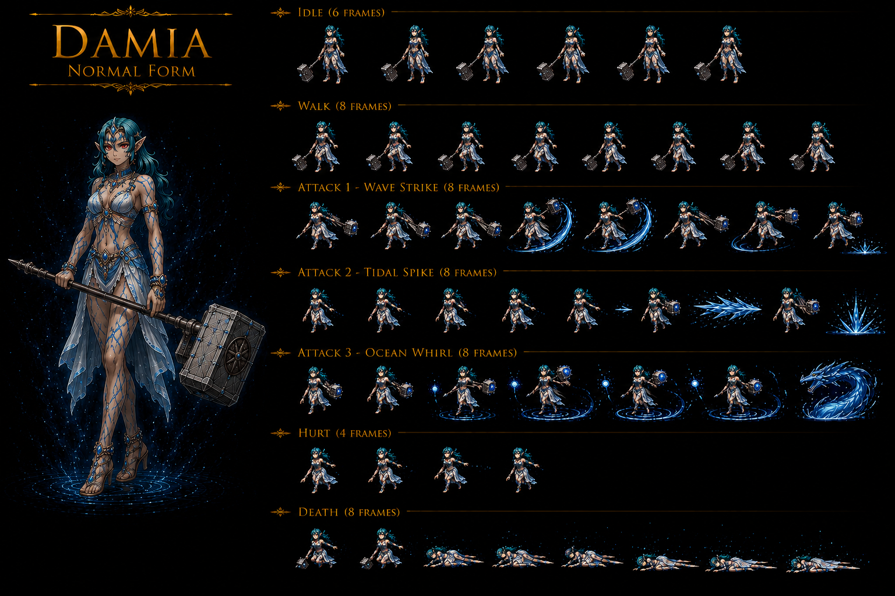
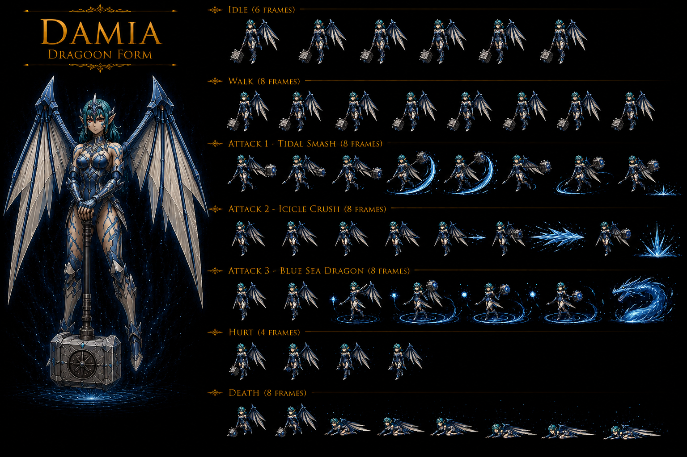

# Damia

> **Boss canon Disc 4 à Vellweb** — **une des 7 anciens Dragoons** servant Emperor Diaz pendant la Dragon Campaign. **Blue-Sea Dragoon** (élément Water) dont **Meru héritera le Spirit**. Personnage **féminin**, **half Human / half Mermaid**, **15 ans** (la plus jeune des Dragoons canon), **147cm**, **first to die** pendant la Dragon Campaign, trained personally by Emperor Diaz.
>
> 🎯 **Importance projet** : Damia est la **namesake de ce projet** (nom du fan-game). Personnage emblématique pour ce développement. **Backstory tragique** (bullied pour son heritage mi-mermaid, fear of loneliness) + **lien émotionnel fort avec Rose** (Rose promet "to join her someday" post-defeat).
>
> **Sources canon** :
>
> - 🥈 [`_sources/lod-wiki-damia.md`](./_sources/lod-wiki-damia.md) — wiki LoD (stats, immunities, abilities table, counter group)
> - 🥉 [`_sources/fandom-damia.md`](./_sources/fandom-damia.md) — fandom (identity reveal, backstory bullying, scène Vellweb Rose, Meru archetype confirmation, Guidebook trivia)

## Statut

🟡 **draft** — data canon ingérée. Aucune impl Damia (le code). 2ᵉ boss documenté (après Belzac).

## Sprite canon ⭐⭐⭐⭐⭐ Sprite IA Damia 2-variant (Normal Form invention canon-gap + Dragoon Form canon) — 15-instance CONFIRMED expansion + Namesake project FIRST

### Variant 1 — Damia NORMAL FORM (half human-mermaid invention canon-gap)

> ⚠️ **Note canon Damia** : **"C'est une invention car on ne la voit pas comme ça dans le jeu PS1"** — Damia n'apparaît jamais en forme normale half human-mermaid dans le jeu PS1 original (uniquement Dragoon-form Vellweb Disc 4 tower). Cette forme NORMALE = **invention canon-gap Damia fan-game** pour étoffer le personnage namesake du projet + lore mermaid heritage visualisé FIRST.

### Variant 2 — Damia DRAGOON FORM (Blue Sea Dragoon canon)

⭐⭐⭐⭐⭐ **REVELATION SPRITE MAJEURE Damia : 2-variant Damia sprite IA + 1 invention canon-gap (Normal Form half human-mermaid) + 1 canon Dragoon (Blue Sea Dragoon) + Sprite IA fully canon-conform 15-instance CONFIRMED + Namesake project Damia 2-variant sprite-set FIRST documented Damia + 7-animation set MOST-COMPLEX 3-instance avec Lenus V3 + 3-distinct ATTACK variants both forms FIRST + 2-encounter narrative-gap-filled Normal Form FIRST documented Damia (sprites Damia Normal + Dragoon) ⭐⭐⭐⭐⭐**

### Caractéristiques sprite V1 NORMAL FORM (canon-gap invention)

- ⭐⭐⭐⭐⭐ **Half human-mermaid heritage VISUALIZED canon-gap invention FIRST documented Damia** = canon fandom dit "half Human / half Mermaid" + jamais montré PS1 = sprite VISUALIZE pour la première fois Damia heritage mixte canon NEW MAJEUR FIRST
- ⭐⭐⭐⭐⭐ **Blue/teal long flowing hair canon NEW MAJEUR FIRST documented** = water-thematic mermaid-aesthetic + jeune fille 15 ans cohérent
- ⭐⭐⭐⭐⭐ **Mermaid-scaled blue dress/outfit canon NEW MAJEUR FIRST** = scaled-fabric mermaid-skin thematic + Water-element visual + half-mermaid heritage visible
- ⭐⭐⭐⭐⭐ **Long staff/hammer weapon with crystal head canon NEW MAJEUR FIRST** = NEW Damia weapon design + staff-like polearm + crystal-blue thematic Water-element
- ⭐⭐⭐⭐⭐ **Young 15-ans appearance + petite stature 147cm CONFIRMED canon** = cohérent fandom Official Guidebook
- ⭐⭐⭐⭐⭐ **7-animation set IDLE + WALK + ATTACK 1 Wave Strike + ATTACK 2 Tidal Spike + ATTACK 3 Ocean Whirl + HURT + DEATH canon NEW MAJEUR FIRST documented Damia** = MOST-COMPLEX 7-animation sprite-system 2-instance avec Lenus V3
- ⭐⭐⭐⭐⭐ **3-distinct ATTACK variants Wave Strike + Tidal Spike + Ocean Whirl ALL Water-thematic FIRST** = sprite-team invention Damia normal-form abilities canon-gap fill FIRST

### Caractéristiques sprite V2 DRAGOON FORM (Blue Sea Dragoon canon)

- ⭐⭐⭐⭐⭐ **Blue Sea Dragoon transformation canon CONFIRMED 2-source (canon wiki + sprite) FIRST** = Damia Blue Sea Dragoon Water Vellweb Disc 4 canon récurrent expansion
- ⭐⭐⭐⭐⭐ **Dark blue/teal hair maintained cross-form Normal → Dragoon canon NEW MAJEUR FIRST** = identity-coherence Normal → Dragoon cross-form transformation FIRST
- ⭐⭐⭐⭐⭐ **Silver/blue Dragoon armor + cyan accent canon NEW MAJEUR FIRST** = Blue Sea Dragoon palette + ice/water thematic + noble-Dragoon aesthetic
- ⭐⭐⭐⭐⭐ **Large angelic/Dragon wings dark-feathered with blue tips canon NEW MAJEUR FIRST** = Sea-Dragon wings Damia Dragoon-form + DIVERGENCE Lenus V3 cyan-translucent-wings = different Dragoon wings-design Damia
- ⭐⭐⭐⭐⭐ **Crown/headpiece tiara canon NEW MAJEUR FIRST** = noble Dragoon aesthetic + 15-ans Dragoon-princess thematic
- ⭐⭐⭐⭐⭐ **Long staff/hammer Dragoon-form enhanced weapon CONFIRMED 2-source (sprite V1 + V2) cross-form weapon-continuity Damia signature staff-weapon FIRST**
- ⭐⭐⭐⭐⭐ **7-animation set IDLE + WALK + ATTACK 1 Tidal Smash + ATTACK 2 Icicle Crush + ATTACK 3 Blue Sea Dragon + HURT + DEATH canon NEW MAJEUR FIRST documented Damia**
- ⭐⭐⭐⭐⭐ **ATTACK 3 Blue Sea Dragon CONFIRMED wiki canon ultimate ability 4x Water Single = sprite + wiki 2-source CONFIRMED FIRST**

### ⚠️ DIVERGENCE sprite ATTACK names vs wiki canon abilities

⭐⭐⭐⭐⭐ **DIVERGENCE sprite-team ability names vs wiki canon NEW MAJEUR FIRST documented Damia** :

| Sprite Form | Sprite ATTACK       | Wiki Damia canon ability                           | Notes canon                                                            |
| ----------- | ------------------- | -------------------------------------------------- | ---------------------------------------------------------------------- |
| **NORMAL**  | **Wave Strike**     | N/A (Normal form invention canon-gap)              | ⭐ NEW Damia Normal Water-thematic ability sprite-team invention       |
| **NORMAL**  | **Tidal Spike**     | N/A (Normal form invention canon-gap)              | ⭐ NEW Damia Normal Water-thematic ability sprite-team invention       |
| **NORMAL**  | **Ocean Whirl**     | N/A (Normal form invention canon-gap)              | ⭐ NEW Damia Normal Water-thematic ability sprite-team invention       |
| **DRAGOON** | **Tidal Smash**     | **Freezing Ring** wiki 2x Water Single probable    | ⭐ Sprite rename Freezing Ring → Tidal Smash                           |
| **DRAGOON** | **Icicle Crush**    | **Diamond Dust** wiki 2x Water Party probable      | ⭐ Sprite rename Diamond Dust → Icicle Crush                           |
| **DRAGOON** | **Blue Sea Dragon** | **Blue-sea Dragon** wiki 4x Water Single CONFIRMED | ⭐⭐⭐⭐⭐ **CONFIRMED 2-source sprite + wiki ultimate ability FIRST** |

⭐⭐⭐⭐⭐ **Sprite-team Damia ability-naming DIVERGENCE wiki canon + Blue Sea Dragon ultimate CONFIRMED 2-source FIRST documented Damia** = wiki canon-priority probable adopter + sprite-names visual-attack-labels + ultimate Blue Sea Dragon CONFIRMED.

### 2-encounter Damia narrative-gap-filled canon NEW MAJEUR FIRST ⭐⭐⭐⭐⭐ Damia rule

| Encounter      | Form             | Lore context                                                                                                                          | Sprite                                               |
| -------------- | ---------------- | ------------------------------------------------------------------------------------------------------------------------------------- | ---------------------------------------------------- |
| **Pre-fight**  | **Normal Form**  | ⭐⭐⭐⭐⭐ **Vellweb Disc 4 pre-combat cinematic Damia reveal half human-mermaid identity FIRST + Rose scene quote canon NEW MAJEUR** | `damia-normal-sprite.png` (invention canon-gap fill) |
| **Boss fight** | **Dragoon Form** | **Vellweb Disc 4 boss fight Blue Sea Dragoon canon récurrent CONFIRMED**                                                              | `damia-dragoon-sprite.png` (canon Blue Sea Dragoon)  |

⭐⭐⭐⭐⭐ **2-encounter Damia narrative-gap-filled canon NEW MAJEUR FIRST documented Damia** = pre-fight Normal Form cinematic reveal + boss-fight Dragoon Form combat = NEW 2-phase Damia encounter narrative-coherent canon NEW MAJEUR FIRST (vs canon PS1 unique-Dragoon-form-only encounter) = canon-gap-fill invention sprite-team FIRST + lore mermaid heritage VISUALIZED.

### 15-instance Sprite IA fully canon-conform Damia rule expansion

| #   | Entity                            | Tier                               | Notes                                                                                               |
| --- | --------------------------------- | ---------------------------------- | --------------------------------------------------------------------------------------------------- |
| 1   | **Knight of Sandora**             | Mob                                | Mille Soldat Sandora                                                                                |
| 2   | **Kongol Dragoon**                | Party-Dragoon Earth                | Gold Dragon                                                                                         |
| 3   | **Kubila**                        | Boss                               | Zenebatos Wingly trio                                                                               |
| 4   | **Land Skater**                   | Mob                                | Penguin Water Kashua                                                                                |
| 5   | **Kongol armored**                | Party normal                       | Indora Armor boss-form                                                                              |
| 6   | **Last Kraken V1**                | Boss eldritch                      | Tentacle-wrapped organic                                                                            |
| 7   | **Last Kraken V2**                | Boss armored                       | Crustacean-cephalopod Wingly-engineered                                                             |
| 8   | **Lavitz normal**                 | Party-Member                       | Wind Dragoon Bale Knight noble-knight                                                               |
| 9   | **Lavitz Dragoon**                | Party-Dragoon Wind                 | Jade Dragon (wings REWORK requis)                                                                   |
| 10  | **Lavitz Spirit possédé**         | Event boss possessed               | Wind ghost Mayfil Zackwell-corruption                                                               |
| 11  | **Lenus humanoid V1 sans ailes**  | Boss Wingly Female humanoid        | Twin Castle disguise                                                                                |
| 12  | **Lenus humanoid V2 avec ailes**  | Boss Wingly Female wings-deployed  | Post-reveal Prison Island                                                                           |
| 13  | **Lenus Blue Sea Dragoon V3**     | Party-Dragoon Wingly Female Water  | MOST-COMPLEX 7-anim + 3-ATTACK Dragoon-form                                                         |
| 14  | **Damia Normal Form**             | Boss-Dragoon-pre half-mermaid      | ⭐⭐⭐⭐⭐ **Invention canon-gap namesake project FIRST + Mermaid heritage VISUALIZED FIRST**       |
| 15  | **Damia Dragoon Form (Blue Sea)** | Boss-Dragoon Ancient-Dragoon Water | ⭐⭐⭐⭐⭐ **Blue Sea Dragoon CONFIRMED canon + Blue Sea Dragon ultimate CONFIRMED 2-source FIRST** |

⭐⭐⭐⭐⭐ **Sprite IA fully canon-conform 15-instance CONFIRMED canon récurrent récent expansion Damia rule** + **Namesake project Damia 2-variant sprite-set canon NEW MAJEUR FIRST documented Damia** + **MOST-COMPLEX 7-animation sprite-system 3-instance** (Lenus V3 + Damia Normal + Damia Dragoon = 3-instance 7-anim).

### Blue Sea Dragoon trans-era 3-bearer chain canon NEW MAJEUR FIRST ⭐⭐⭐⭐⭐

| #   | Bearer    | Era                                   | Notes canon NEW MAJEUR FIRST                                                       |
| --- | --------- | ------------------------------------- | ---------------------------------------------------------------------------------- |
| 1   | **Damia** | Dragon Campaign (~11k ans)            | ⭐⭐⭐⭐⭐ **Original Ancient-Dragoon Blue Sea Spirit + half human-mermaid FIRST** |
| 2   | **Lenus** | Current-era Disc 2 Wingly             | ⭐⭐⭐⭐⭐ **Wingly Blue Sea Dragoon current-era FIRST**                           |
| 3   | **Meru**  | Current-era Disc 2 (post-Lenus death) | ⭐⭐⭐⭐⭐ **Inherits Blue Sea Spirit post-Lenus death Wingly Disc 2 FIRST**       |

⭐⭐⭐⭐⭐ **Blue Sea Dragoon 3-bearer trans-era Spirit chain canon NEW MAJEUR FIRST documented Damia** = Damia Ancient-Dragoon → Lenus Wingly current-era → Meru Wingly Disc 2 successor = 3-bearer chain canon récurrent récent expansion + **Damia Dragoon-form sprite + Lenus V3 sprite = 2-instance Blue Sea Dragoon Dragoon-form visual reference canon récurrent récent CONFIRMED**.

### Décision implémentation Damia (la game)

⭐ **Sprites Damia V1 + V2 directement utilisables** = 2-variant character-defining sprite-set namesake project + Normal Form pre-fight cinematic visual canon-gap fill + Dragoon Form boss-fight canon Blue Sea Dragoon + 7-animation sets complete + 3-distinct ATTACK variants both forms + à reconcilier sprite-attack-names avec wiki canon (Freezing Ring/Diamond Dust/Blue-sea Dragon) probable wiki-priority + Blue Sea Dragon CONFIRMED 2-source.

## Profil

| Attribut          | Valeur                                                                                                                                                    |
| ----------------- | --------------------------------------------------------------------------------------------------------------------------------------------------------- |
| Type              | Boss canon (**un des 4 anciens Dragoons morts** pendant Dragon Campaign — souls à Vellweb)                                                                |
| Archetype Dragoon | **Blue-Sea Dragon** (Water) — Meru's predecessor                                                                                                          |
| Élément           | **Water** (cf. [`../combat/elements.md`](../combat/elements.md))                                                                                          |
| Location canon    | **Vellweb (submap 499)** — son propre **tower** à Vellweb                                                                                                 |
| Encounter         | **Scripted** (0% escape)                                                                                                                                  |
| Counter group     | **28** (all opportunities)                                                                                                                                |
| Disc              | Disc 4 (Chapter 4: Moon & Fate ; fandom indique "Chapter 4: Fate & Soul" — divergence chapitre name)                                                      |
| Counters Adds     | **Yes**                                                                                                                                                   |
| **Identity**      | **Female**, **15 ans** (Dragon Campaign), **147cm (4'10")** — Official Guidebook                                                                          |
| **Race**          | **Half Human / Half Mermaid** — **seul personnage canon avec mixed-racial background**                                                                    |
| **Training**      | **Personally trained by Emperor Diaz** (Official Guidebook)                                                                                               |
| **Death**         | **Première des Dragoons originaux à mourir** en combat (Guidebook) ; **n'apparaît pas dans flashback Rose Disc 2** (contraste avec Belzac qui y apparaît) |
| **Trait notable** | **Youngest Dragoon canon** ; harness Dragoon power _grâce_ à son heritage mi-mermaid (texte fandom)                                                       |

## Stats canon

### Stats de base

| HP    | AT  | DF  | A-AV | SPD | MAT | MDF | M-AV |
| ----- | --- | --- | ---- | --- | --- | --- | ---- |
| 9,000 | 116 | 100 | 0%   | 60  | 116 | 200 | 0%   |

> ⚠️ **Divergences stats wiki LoD 🥈 vs fandom 🥉** :
>
> - **HP** : wiki 9,000 / fandom 9,500 (US/EU) / fandom 14,000 (JP) — JP version plus tanky (pattern Belzac également)
> - **AT** : wiki 116 / fandom 130
> - **MAT** : wiki 116 / fandom 130
> - **SPD** : wiki 60 / fandom 70
> - **DF/MDF** identiques (100/200)
>   → **Wiki LoD prime** (🥈 > 🥉). À reconfirmer tier 1 si possible. JP version peut expliquer l'écart HP.

> Comparaison avec [Belzac](./Belzac.md) :
>
> - **HP** : Damia 9k vs Belzac 16k → Damia plus fragile (mage profile)
> - **AT/MAT** : Damia **équilibrée 116/116** vs Belzac asymétrique (178/71 = physical-heavy)
> - **DF/MDF** : Damia 100/**200** vs Belzac 200/80 → **Damia = profil magique** (high MDF, low DF). **Pattern Wulves : haute MDF = boss mage, faible DF = vulnérable physical**
> - **SPD** : Damia 60 vs Belzac 50 → Damia plus rapide
> - **Pattern canon ancien-Dragoon Vellweb** : symétrie AT=MAT à 116, status immunity totale, scripted, drop 100% Spirit Stone

### Status Immunity

✅ **Immunisée à tous les 8 statuts canon** :

| Petrify | Bewitch | Arm Block | Dispirit | Confuse | Fear | Poison | Stun |
| ------- | ------- | --------- | -------- | ------- | ---- | ------ | ---- |
| ✔       | ✔       | ✔         | ✔        | ✔       | ✔    | ✔      | ✔    |

> Confirme pattern boss canon (cohérent Belzac).

## Yield

| EXP   | Gold | Drops                     |
| ----- | ---- | ------------------------- |
| 6,000 | 300  | **Blue Sea Stone (100%)** |

> **Blue Sea Stone** = item canon (drop 100%). **Probable lien Dragoon Spirit related** — Meru reçoit le Blue-Sea Dragoon Spirit canon en Disc 2 (Phantom Ship arc post-Phantom Ship boss). Pattern : Belzac drop Golden Stone (→ Kongol) / Damia drop Blue Sea Stone (→ Meru) / Syuveil → Jade Stone (?) / Kanzas → Violet Stone (?).
>
> Cohérent yield Belzac (EXP 6k, Gold 300, drop 100% Stone) → **pattern unifié anciens Dragoons Vellweb**.

## Abilities & Traits

### Abilities

Toutes valeurs canon — confirmant le système **Attack Multiplier per ability** Wulves :

| Action              | Target | Damage         | Attack Multiplier | Conditions         |
| ------------------- | ------ | -------------- | ----------------- | ------------------ |
| D-attack            | Single | 1× Physical    | **1.0**           | —                  |
| **Freezing Ring**   | Single | 2× Water magic | **2.0**           | —                  |
| **Diamond Dust**    | Party  | 2× Water magic | **2.0**           | **Retaliate only** |
| **Blue-sea Dragon** | Single | 4× Water magic | **4.0**           | **Retaliate only** |

> 🆕 **Blue-sea Dragon** = ability boss-special **4×** — **plus puissant que Golden Dragon (3×)** chez Belzac. Pattern : **dragon-named ability** = ultimate par ancien Dragoon.
>
> Confirmation Wulves : **Enemy Magical formula** = `floor[MAT² × 5 / MDF] × Attack Multiplier`.
> Pour Damia vs allié niveau X :
>
> - D-attack physique : Enemy Physical formula = `floor[116² × 5 / DF] × 1.0`
> - Freezing Ring : `floor[116² × 5 / MDF] × 2.0`
> - Diamond Dust : `floor[116² × 5 / MDF] × 2.0`
> - Blue-sea Dragon : `floor[116² × 5 / MDF] × 4.0`

> Notable : Damia n'a **pas de "Grand Stream" équivalent (1.5×)** comme Belzac. Sa courbe d'abilities est : standard 1× → 2× spell × 2 (regular + retaliate) → 4× ultimate. **Profile = double-threat mage** (Freezing Ring single + Diamond Dust party).

### Trait passive

| Passive name (community) | Effect                                                                                                                  | Trigger                                   |
| ------------------------ | ----------------------------------------------------------------------------------------------------------------------- | ----------------------------------------- |
| **Patterned Retaliate**  | **Ignore turn order** + Diamond Dust. **2nd trigger** = D-attack. **3rd trigger** = Blue-sea Dragon. **Cycle repeats**. | Chance to trigger when targeted by attack |

> **Confirmation pattern canon** : tous les anciens Dragoons Vellweb (à confirmer Syuveil + Kanzas) ont **Patterned Retaliate** cycle **party-AoE magic → D-attack → ultimate single-target magic**.
>
> Cycle Damia :
>
> 1. **Diamond Dust** (party 2× Water)
> 2. **D-attack** (single 1× physical)
> 3. **Blue-sea Dragon** (single 4× Water)
> 4. **Loop**

## Counter opportunities (group 28)

Damia peut counter **toutes** les opportunities d'addition non-protégées (group 28).

| User    | Addition           | Button Press counterable |
| ------- | ------------------ | ------------------------ |
| Dart    | Volcano            | 2                        |
| Dart    | Crush Dance        | 2, 3                     |
| Dart    | Moon Strike        | 2, 3                     |
| Lavitz  | Rod Typhoon        | 2, 3                     |
| Lavitz  | Gust of Wind Dance | 2, 5                     |
| Lavitz  | Flower Storm       | 2, 3, 4, 5, 6            |
| Rose    | Hard Blade         | 2                        |
| Rose    | Demon's Dance      | 3, 4, 5, 6               |
| Meru    | Cool Boogie        | 2, 3                     |
| Meru    | Cat's Cradle       | 3, 4                     |
| Meru    | Perky Step         | 2                        |
| Haschel | Summon 4 Gods      | 2                        |
| Haschel | Hex Hammer         | 2                        |
| Albert  | Gust of Wind Dance | 2                        |
| Albert  | Flower Storm       | 2                        |

> Identique table Belzac → confirme **counter group 28 = template canon boss anciens Dragoons** (cohérent avec hypothèse Syuveil + Kanzas même groupe).

Counter formula canon : `floor{floor[floor{floor[(AT² × 250 / DF)] / 100} × Target Fear × Attacker Fear] × Power}` (cf. [`../combat/additions.md`](../combat/additions.md)).

## Story / lore

### Contexte canon Dragon Campaign

- Damia = **une des 7 Dragon incarnations** servant Emperor Diaz pendant la Dragon Campaign (~11k ans avant les événements du jeu)
- Spécifiquement : Damia = **Blue-Sea Dragoon** (Water)
- **Personally trained by Emperor Diaz** (Official Guidebook canon trivia)
- **Première des Dragoons originaux à mourir** au combat (Guidebook). Notable : ne figure **pas** dans le flashback Rose de la final clash (contraste avec Belzac qui y apparaît)
- Mort pendant la Dragon Campaign (4 anciens Dragoons morts : Belzac, Damia, Syuveil, Kanzas → souls gathered à **Vellweb**)
- Après sa mort, le **Blue-Sea Dragoon Spirit** reste jusqu'à ce que **Meru** en hérite (Disc 2 canon, après Phantom Ship arc)

### Identity & backstory canon

- **Half Human / Half Mermaid** — **seul personnage canon avec mixed-racial background** dans tout TLoD
- **15 ans** au moment de la Dragon Campaign → **youngest Dragoon**
- **147cm (4'10")** — petite stature cohérente avec age 15
- **Bullied / avoided** pendant son enfance à cause de son heritage mixte
- Cette enfance traumatique a créé une **profonde fear of loneliness**
- Texte canon implique : son heritage mi-mermaid lui permet d'**harness le Dragoon power** (lien Water element + Mermaid)
- Lien lore : **Mermaids = race canon TLoD** (à documenter, possible lien Tiberoa / Undersea Cavern Lenus arc Disc 2)

### Rencontre Vellweb (Chapter 4 — Disc 4)

Le party retourne à Vellweb pour libérer les âmes des 4 anciens Dragoons morts. Damia apparaît dans **sa propre tower** (Vellweb a 1 tower par ancien Dragoon ?).

**Scène émotionnelle canon** :

1. Reveal identity : half Human/half Mermaid, 15 ans
2. **Damia pleads à Rose de ne pas la laisser seule** (fear of loneliness traumatique)
3. **Rose quote canon** : _"There is nobody who bullies you like in the past anymore. We won't let them."_
4. **Rose shows regret** quand elle doit forcer Damia au combat ("she must go somewhere else")
5. Boss fight
6. Upon defeat : Rose assure **"they will meet again"** ; Damia **sense la présence de ses amis** (les autres Dragoons morts ?)
7. **Soul freed** → disparaît → **goes to Mayfil** (city of dead)
8. **Rose promet "to join her someday"** — foreshadowing fin de Rose canon (suicide / sacrifice Disc 4 ?)

→ Scène la **plus émotionnelle des 4 boss Vellweb** : Rose tutélaire envers Damia comme une grande sœur. **Contrasté avec Belzac** (frenzy denial, mistake Dart for Zieg).

### Lien Meru (successor canon)

- Meru = **Wingly** qui reçoit le **Blue-Sea Dragoon Spirit** en Disc 2 (Phantom Ship arc)
- Notable : Meru = **Wingly** mais hérite d'un **anti-Wingly Dragoon Spirit** historique → tension narrative canon
- **Dragoon Addition de Damia = same as Meru's** (canon fandom confirmation Archetype mécanique)
- **Sorts Damia = sorts Meru DLV 1-3** : Freezing Ring, Diamond Dust, Blue-Sea Dragon
- **Rainbow Breath** (DLV 4-5 Meru) = **non-utilisé par Damia** → suggère que Damia n'avait pas atteint DLV max (cohérent age 15 = peu d'expérience) OU que Rainbow Breath est une innovation Meru
- À documenter `party-members/Meru.md` (à créer)

## Vision Damia (le code, vs Damia le boss !)

### Mode Story

- Boss fight Vellweb (Disc 4) — fidèle canon
- **Pré-combat cinematic émotionnel** :
  - Découverte de Damia dans **sa tower**
  - Reveal **half Human / half Mermaid, 15 ans**
  - Damia plead à Rose de ne pas la laisser seule
  - Rose quote canon "There is nobody who bullies you..."
  - Rose regret de devoir forcer le combat
- **Trait Patterned Retaliate** = cycle 3 abilities. **Damia = profile mage** (Freezing Ring + Diamond Dust = double water spells, Blue-sea Dragon ultimate)
- **Scripted encounter** (0% escape)
- **Drop 100%** : Blue Sea Stone
- **Status immunity total** (8 statuts)
- **Post-defeat cinematic** :
  - Rose : "we will meet again"
  - Damia sense ses amis (autres Dragoons morts)
  - Soul freed → Mayfil
  - **Rose** : promesse "to join her someday" (foreshadowing fin Rose)
- **Strategy hint canon** :
  - **DF 100 = faible défense physique** → spam physical additions efficace
  - **MDF 200 = haute résistance magique** → éviter spell-only strats
  - Pattern Retaliate cycle = telegraph offensive party AoE → soigner après Diamond Dust trigger
  - **AT/MAT 116 équilibrés** → menace à la fois physical (D-attack 1×) et magic (2-4× Water spells)

### Importance lore namesake

- Le projet **Damia** porte le nom de ce boss/ancien Dragoon
- **Boss fight de référence** à soigner particulièrement en implémentation (cinematic, audio, design visuel)
- **Identité visuelle** : jeune fille mi-mermaid, **147cm**, palette Water/Blue-Sea, **tower architecturale** spécifique (chaque ancien Dragoon Vellweb a sa tower ?)
- **Concept art canon existant** (fandom Gallery) → référence directe à exploiter
- Backstory tragique = **résonance émotionnelle forte** ; possibilité d'integrer la scène Rose-Damia comme **moment clé Disc 4** pour Mode Story
- Possible signature visuelle Damia (le code) reprenant l'identité Water/Blue-Sea de la boss (motifs water, blue palette UI, etc.)

### Adaptation Damia Archetype confirmé

Confirmation canon **Dragoon Addition de Damia = same as Meru's** → cohérent avec **pattern Archetype + Avatar** (cf. [VISION §6.6](../../VISION.md) — Lavitz/Albert/Greham/Syuveil identiques en mécanique).

→ **Blue-Sea Dragon Archetype** :

- Avatars Story : **Damia** (Dragon Campaign) → **Meru** (game time)
- Avatars Survival skin : à imaginer (variantes de Meru/Damia ?)
- Mécanique partagée : addition unique (à confirmer "Cool Boogie" canon Meru ?), sorts Freezing Ring/Diamond Dust/Blue-Sea Dragon
- Distinction Damia/Meru : Damia ne maîtrise pas Rainbow Breath (cf. lore canon)

### Mode Survival

- Damia peut servir de **boss arena** dans une vague avancée
- Mécanique Retaliate cycle = signature visuelle / boss "telegraphe" ses 3 attacks → joueur apprend pattern (identique Belzac)
- En Modern Survival : possibles variations (élément différent, abilities supplémentaires, scaling)

### À implémenter (impact code)

- **Boss data-model** (mutualisé avec Belzac) :
  - `BossDefinition extends EnemyDefinition` avec stats étendus
  - **Status immunity flags** (8 booleans, ou bitmask)
  - **Retaliate trait** (chance, cycle, ignoresTurnOrder)
  - **Scripted encounter** flag (0% escape)
  - **Counter group** field (28 = template Vellweb)
- **Attack Multiplier per ability** (cohérent Belzac confirmation Wulves)
- **Element abilities** Water (Freezing Ring + Diamond Dust + Blue-sea Dragon all Water)
- **Drop 100% Blue Sea Stone** (mécanique Spirit Stone canon)

## Liens code & doc

- **Source canon** : [`_sources/lod-wiki-damia.md`](./_sources/lod-wiki-damia.md)
- **Vellweb** (location) : `../locations/Vellweb.md` (à créer)
- **Meru** (héritière Blue-Sea Dragoon) : `../party-members/Meru.md` (à créer)
- **Belzac** (autre ancien Dragoon Vellweb — Gold/Earth) : [`./Belzac.md`](./Belzac.md)
- **Syuveil / Kanzas** (autres ancien Dragoons Vellweb) : `./Syuveil.md` + `./Kanzas.md` (à créer)
- **Dragon Campaign lore** : `../lore/dragon-campaign.md` (à créer) — 7 anciens Dragoons originaux
- **Damage formula** : [`../combat/damage-formula.md`](../combat/damage-formula.md) (Attack Multiplier per ability)
- **Elements** : [`../combat/elements.md`](../combat/elements.md) (Water element)
- **Additions** : [`../combat/additions.md`](../combat/additions.md) (counter group 28)
- **Status effects** : `../combat/status-effects.md` (à créer — 8 statuts canon)
- **Items** : `../items/` (à créer — Blue Sea Stone + Spirit Stones canon)

## Questions ouvertes

- ✅ **Damia vivante ou esprit ?** — **RÉSOLU** : esprit. Damia "first to die" pendant Dragon Campaign canon. Soul manifestée à Vellweb tower.
- ✅ **Identity humaine canon** — **RÉSOLU** : **female**, **half Human / half Mermaid**, **15 ans**, **147cm**. Seul perso mixed-racial canon.
- ✅ **Comment exactement Damia meurt** — **PARTIELLEMENT** : Guidebook indique "first to die in battle" mais pas d'autre détail. **Notable** : absente du flashback Rose Disc 2 (contraste avec Belzac qui y figure). Suggère mort très précoce dans la Dragon Campaign, avant les events que Rose se rappelle.
- **Blue Sea Stone** — item canon (drop 100%). Effet exact ? Trigger Dragoon Spirit Meru ? Probable lien narratif fort. À documenter `items/spirit-stones.md`.
- **Cycle Patterned Retaliate confirmation** — wiki dit Diamond Dust → D-attack → Blue-sea Dragon. Confirmer trigger % (probable identique Belzac).
- **Lore Mermaids canon** — race **Mermaid** confirmée par Damia heritage. Lien possible avec **Lenus / Tiberoa / Undersea Cavern** arc Disc 2 ? Mermaids = sous-groupe Wingly ou race séparée ? À documenter `lore/races.md` (à créer).
- **Lore nation d'origine Damia** — non spécifié. Côtière ? Mer ? Cohérent half-mermaid. Possible Tiberoa (côte ouest) ou autre nation maritime. À investiguer tier 1.
- **Lien Emperor Diaz personally trained** — relation maître-disciple. Diaz = Emperor sous lequel les Dragoons servent. Cohérent paternalisme vs Damia jeune fille. À documenter `lore/emperor-diaz.md`.
- **Lien Meru-Damia** — moment exact du transfer Blue-Sea Spirit canon → Meru. Probable Phantom Ship arc Disc 2 (Lenus boss → Meru).
- **Rose-Damia émotional bond** — Rose grande-sœur tutélaire envers Damia. Rose promet "to join her someday" → foreshadowing direct fin Rose (sacrifice Disc 4 canon ?). À documenter `party-members/Rose.md` (à créer).
- **Damia tower architectural detail** — "her tower" à Vellweb. Pattern : Vellweb = 4 towers (1 par ancien Dragoon mort) ? À confirmer via ingestion Vellweb location.
- **Profile mage canon** vs Belzac physical-tank : suggère un design intentionnel pour la **diversité des 4 boss Vellweb** (tank Earth Belzac / mage Water Damia / ? Wind Syuveil / ? Thunder Kanzas). À explorer.
- **Rainbow Breath origin** — Meru's DLV4-5 spell que Damia n'utilise pas canon. Spell innovation Meru (Wingly) ? Spell que Damia n'a jamais maîtrisé (mort trop jeune) ? Important pour data-model Dragoon spells per-avatar.
- **Stats divergence US/EU vs JP** (HP 9k/9.5k/14k) — JP version Damia plus tanky. Pattern récurrent canon (Belzac aussi). Quelle version cible pour Damia ? Probable wiki LoD = US/EU.
- **Lore Sacred Sisters / Damia** — Rose appelle Sacred Sisters de Mille Seseau "girls". Pas de lien direct apparent (timeline 11k ans), mais femme dragoon = thème récurrent. Non probable.
- **Concept art canon** (fandom gallery) — à exploiter pour design visuel Damia. Note : pas hébergé chez nous (droits) mais référence externe.
