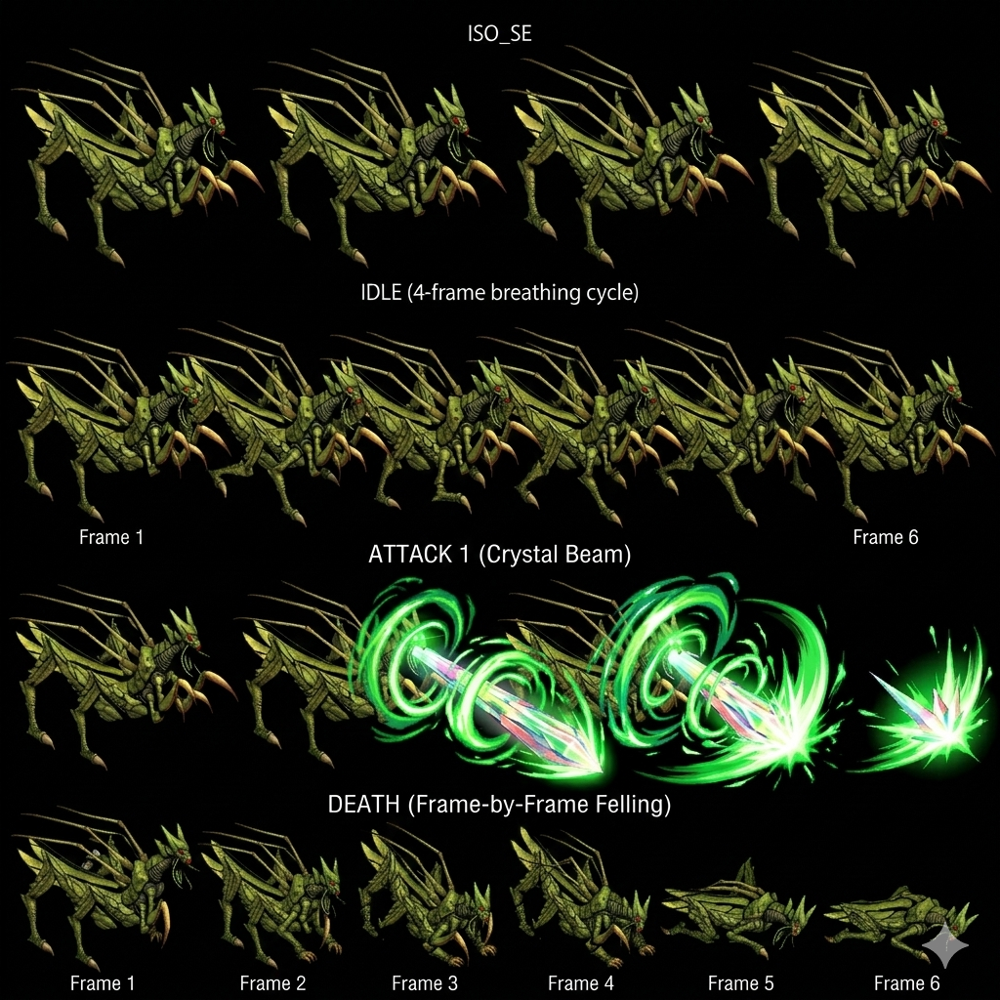

# Feyrbrand — Premier dragon TLoD (Wind, boss Disc 1)

> **Premier dragon canon vu en jeu** : Wind element, monture/familier de Greham, boss Nest of Dragon Disc 1.
>
> **Sources** :
>
> - 🥈 [`_sources/lod-wiki-feyrbrand.md`](./_sources/lod-wiki-feyrbrand.md) — wiki LoD (stats + status immunity + abilities + Retaliate passive + Attacking power up stacking)
> - 🥉 [`_sources/fandom-feyrbrand.md`](./_sources/fandom-feyrbrand.md) — fandom (Feyrbrand "Green-Tusked Dragon" canon name + first vassal Dragon TLoD + game opening encounter Dart-Rose meet + Mayfil Disc 4 spirit return optional boss + Slime Shot color→status mapping canon + Feyrbrand blind canon trivia + Servi Slambert canon full name + US/JP HP divergence)

## Statut

🟡 **Draft post-ingestion wiki LoD + fandom** — lore Feyrbrand-Greham + Disc 1 narrative arc + Disc 4 Mayfil spirit canon documenté.

## Identity canon

- **Nom canon complet** : **Feyrbrand the Green-Tusked Dragon** (緑牙竜フェルブランド, _Ryokugaryū Feruburando_) — moniker canon JP/EN
- **Espèce** : Dragon Wind canon (Jade Dragon Tribe)
- **"First of several vassal Dragons"** canon — pattern dragons-vassaux (Feyrbrand + Regole + Divine Dragon + Mortal Dragon + Damia + Kanzas-related etc.)
- **Lien Dragoon** : Source du **Jade Dragoon Spirit** canon (Wind Dragoon = Lavitz/Albert)
- **Rider canon Disc 1** : **Greham**, ex-compagnon Lavitz' père **Servi Slambert** (canon full name), defector Basil → Sandora
- **Connection Imperial Sandora canon linguistic** : kanji 竜 (ryū) double meaning "ryō" = "imperial" → Green-Tusked Dragon ↔ Imperial Sandora
- **Vassal during Serdian War** : utilisé par Imperial Sandora vs Kingdom of Basil → contrôle dragon = balance of power broken → Emperor Doel aggressive
- **2 encounters canon Disc 1 + 1 spirit encounter Disc 4** :
  - Disc 1 cold open : Feyrbrand attaque Dart forêt + Rose first meet
  - Disc 1 Nest of Dragon : boss joined avec Greham
  - **Disc 4 Mayfil : Feyrbrand's spirit optional boss canon** ⭐ pride keeps him bound
- **Pattern symbolique** : **premier dragon TLoD vu en jeu** → introduction visuelle "creatures of Soa" + premier reveal "Rose"
- **Connue pour son poison** (canon descriptor)

## Stats canon

| Stat        | Value   |
| ----------- | ------- |
| HP          | 480     |
| AT          | 18      |
| DF          | 100     |
| MAT         | 12      |
| MDF         | 80      |
| SPD         | 50      |
| A-AV / M-AV | 0% / 0% |

→ Pattern boss canon Disc 1 : **HP 480** modéré (vs Damia ~2,500 Disc 3, Divine Dragon ~30,000 Disc 3), **DF 100 / MDF 80** robuste relatif au niveau early game.

## Status Immunity canon

**Immune à TOUS les 8 status canon** (Petrify, Bewitch, Arm Block, Dispirit, Confuse, Fear, Poison, Stun) → Pattern boss canon : status ailments inutiles contre bosses majeurs. Mind Crush / Spear of Terror / Demon Stiletto = no effect Feyrbrand.

## Yield canon

- **EXP : 0 / Gold : 0** — wiki list 0/0 mais c'est probablement parce que Feyrbrand est joined à Greham dans encounter (393), donc les rewards globaux viennent de Greham (~750 EXP / 350 Gold à confirmer)
- **Drop : Down Burst 100%** ⚠️ Repeat Item canon : "Down Burst" probable un item curatif/buff Wind-related. À cross-référer `items/consumables.md` (à créer)
- **Counter Opportunities : 0** — pas de fenêtre Counter canon

## Mécaniques canon spécifiques

### Trait passive : Retaliate ⭐ MAJEUR canon

**Triggered when targeted by magic** (Dragoon Magic ou enemy magic, à clarifier) :

- **Ignore turn order** (action hors-tour)
- **Use Attacking power up** sur soi-même (self-buff)

→ Pattern boss canon : **utiliser magie = penalité** Feyrbrand stacks damage multiplier. Discourage magic spam Lavitz/Dart Dragoon precoce.

### Attacking power up (self-buff stacking) ⭐ NEW pattern

| Use # | Multiplier            |
| ----- | --------------------- |
| Base  | 1.0×                  |
| 1st   | 1.1×                  |
| 2nd   | 1.2×                  |
| 3rd   | 1.3×                  |
| ...   | etc (linear additive) |

→ **Additive stacking** (vs multiplicative) canon. Si magic spam x5 → Feyrbrand est x1.5× damage. **Pattern : "boss adapte sa puissance face à magic spam"** canon design.

### Abilities canon (2 + 1 self-buff)

| Action             | Target | Effect                                              | Notes                                                     |
| ------------------ | ------ | --------------------------------------------------- | --------------------------------------------------------- |
| ~Mandible Strike   | Single | 1× Physical damage                                  | Attaque basique standard                                  |
| ~Status Slime      | Single | 1× Phys damage + **100% Fear/Poison/Stun (random)** | Réduit par A-AV target — pattern "guaranteed status proc" |
| Attacking power up | Self   | 1.1× stacking                                       | Self-buff via Retaliate uniquement                        |

⚠️ **Status Slime 100% canon** ⚠️ avec A-AV reduction → **pattern boss "guaranteed but evadable"** : sans A-AV high, status appliqué; avec A-AV, chance escape proportionnelle. À investiguer formule canon exacte A-AV → status proc reduction.

## Combat flow canon

1. Battle start : Feyrbrand + Greham scripted Nest of Dragon (submap 136)
2. Pattern Feyrbrand : alterne Mandible Strike / Status Slime
3. Si party utilise magic (Dragoon Magic) → **Retaliate trigger** : Feyrbrand ignore tour + boost +0.1× multiplier
4. Boss fight strategy canon recommandée :
   - **Avoid Dragoon Magic** (au moins until Feyrbrand HP low)
   - Use **physical Additions** uniquement
   - Equip **status prevention** (Bravery Amulet vs Fear, Poison Guard, Stun Guard) — utile car Status Slime 100%
   - Lavitz physical advantage natural (Spear Lance/Twister Glaive)

## Story beats canon

### Encounter #1 — Cold open Disc 1 (Forest near Seles) ⭐ first Dart-Rose meet

1. Dart dans forêt près Seles, entend cavaliers
2. Confronte 2 Sandora Soldiers
3. **Feyrbrand appears + chases Dart deeper into forest**
4. ⭐ **Rose saves Dart** — first canon meet Dart-Rose
5. Rose : "tu viens d'être attaqué par un Dragon" + "je ne comprends pas pourquoi ils auraient besoin d'un Dragon pour détruire un village"
6. Dart : "le village est ma ville natale" → court vers Seles (destruction setup)

### Encounter #2 — Nest of Dragon Disc 1 (déjà documenté)

- Premier "**big dragon**" visuel boss fight TLoD canon
- Greham + Feyrbrand = **antagonist pair Disc 1** joined encounter
- After defeat : **Greham's body falls + Lavitz inherits Jade Dragoon Spirit** (eye merge canon)

### Encounter #3 — Mayfil "Death City" Disc 4 (optional boss spirit) ⭐ MAJEUR canon

- **Feyrbrand's soul** still in world canon
- **Rose explains** : "had too much pride as a Dragon for having been defeated by humans, unable to die and to find peace"
- **Defeating spirit one more time → attachment severed → soul freed** canon
- Pattern Disc 4 Mayfil : multiple Dragoons spirits bound by pride (à investiguer s'autres dragons spirits canon Mayfil)

### Stats spirit canon Disc 4 (vs Disc 1)

| Stat | Disc 1 (Nest of Dragon)   | Disc 4 (Mayfil Spirit)          |
| ---- | ------------------------- | ------------------------------- |
| HP   | 480 (US) / 600 (JP)       | **8,000 (US) / 10,000 (JP)** ⭐ |
| AT   | 21 (fandom) / 18 (wiki)   | **100**                         |
| DF   | 100                       | 100                             |
| MAT  | 14 (fandom) / 12 (wiki)   | **80**                          |
| MDF  | 80                        | 80                              |
| SPD  | 50                        | **60**                          |
| EXP  | 0 direct / 1,200 w/Greham | **4,000**                       |
| Gold | 0 direct / 100 w/Greham   | **200**                         |

→ Pattern scaling Disc 4 boss canon : ×16-17 HP / ×5-6 AT/MAT vs Disc 1 base.

## Précurseur narratif canon

- Montre **bond Dragoon-Dragon canon** (cf. [`dragoons/dragons.md`](../dragoons/dragons.md))
- **Dragon pride canon** : refuse mort si défait par humans (Disc 4 spirit return)
- **Vassal Dragon pattern canon** : Feyrbrand = "first of several" → Damia/Regole/Divine Dragon/Mortal Dragon all vassal

## Vision Damia (implémentation)

### Décisions canon à conserver

1. **HP 480 / stats canon** : balance Disc 1 boss authenticity
2. **Status immunity full** : pattern bosses Damia tous immunes au 8 status
3. **Retaliate passive trigger magic** : intéressant gameplay mécanique
4. **Attacking power up additive stack** : conserver linear scaling (vs multiplicative)
5. **Status Slime 100% Fear/Poison/Stun** avec A-AV reduction : pattern "guaranteed but mitigable"
6. **Encounter joined avec Greham** : 1 fight = 2 enemies pattern canon
7. **Down Burst drop 100%** : Repeat Item reward canon
8. **Counters Additions: No** : Feyrbrand n'a pas de counter mechanism (vs autres bosses qui en ont)

### Implementation tech

- Data-model `BossPassive`:
  ```ts
  type BossPassive = {
    name: 'Retaliate' | string;
    trigger: 'on_magic_targeted' | 'on_physical_targeted' | 'on_low_hp' | ...;
    action: BossAction;
    ignoreTurnOrder: boolean;
  };
  ```
- Data-model `Buff`:
  ```ts
  type Buff = {
    type: 'damage_multiplier';
    multiplier: number; // ex 0.1 increments
    stacking: 'additive' | 'multiplicative';
    duration?: number; // null = permanent
  };
  ```

### Questions ouvertes

- **"targeted by magic" = quoi exactement ?** Dragoon Magic ? Spells ? Magical items (Burn Out / Spark etc.) ? À investiguer Discord cadors. Probable : tout magic damage type.
- **Counters Additions: No** : implique d'autres bosses canon SONT counter-able via specific Addition patterns. À investiguer mécanique "Counter Opportunities" canon Damia.
- **Attacking power up : decay au fil du combat ?** Probable non (permanent buff). Si Feyrbrand stacks 10×, atteint 2× damage permanent ?

## Cross-check fandom (compléments + divergences)

**Confirmations utiles fandom** :

- ⭐ **"Feyrbrand the Green-Tusked Dragon"** moniker canon JP/EN (緑牙竜フェルブランド)
- ⭐ **"First of several vassal Dragons"** canon — pattern dragons-vassaux explicite
- **Feyrbrand = Wind weak to Earth canon confirmé** : Pellet + Meteor Fall attacking items Earth → 1.5× damage. Cohérent `combat/elements.md` Wind↔Earth opposing pair canon.
- **Servi Slambert canon full name** Lavitz' father (à refléter `party-members/Lavitz.md` à créer)
- **Stratégie canon : "défait Feyrbrand BEFORE Greham"** — Feyrbrand HP modéré + dégâts physiques + status ailments = priorité tactical
- **Imperial Sandora vassal dragon canon** explicite (Serdian War context)
- **EXP/Gold pooled with Greham** : confirmé wiki disait 0/0 direct → 1,200 XP + 100 Gold via Greham canon

**NEW canon fandom-only ⭐ MAJEUR** :

- ⭐ **Mayfil Disc 4 spirit return canon optional boss** — Feyrbrand re-encounter spirit form Death City Mayfil. Stats spirit ×16+ HP scaling.
- ⭐ **Rose's canon explanation pride spirit** : "had too much pride as a Dragon for having been defeated by humans, unable to die and to find peace" → defeated spirit Disc 4 = severed soul liberation pattern.
- ⭐ **Slime Shot color → status mapping canon** (vs wiki "random") :
  - **Green slime → Poison**
  - **White slime → Stun**
  - **Blue slime → Fear**
    → Pattern boss "color tell" canon : player peut anticiper status via animation color.
- ⭐ **Feyrbrand BLIND canon (unused Rose line)** — unused script line Rose Disc 1 cold open : Feyrbrand est aveugle, explique pourquoi ne détecte pas Dart+Rose cachés derrière simple rock. **Canon trait dragon** déclassé du dialogue final mais présent script.
- ⭐ **"Magic = double-edged sword" Attack Power Up trigger précisé** : "He **only uses it when he is hit with any magic based attack**" → confirme trigger Retaliate = magic damage (vs ambiguïté wiki "targeted by magic")
- **Connection Imperial Sandora canon linguistic** : kanji 竜 (ryū) ↔ "ryō" = "imperial" (Green-Tusked Dragon ↔ Imperial Sandora)
- ⚠️ **Cold open Disc 1 first dragon TLoD encounter = first Dart-Rose meet canon** (avant Hellena Prison Lavitz)

**Divergences stats wiki tier 2 vs fandom** :

| Stat                    | Wiki LoD                                                    | Fandom                                                  | Notes                                                                         |
| ----------------------- | ----------------------------------------------------------- | ------------------------------------------------------- | ----------------------------------------------------------------------------- |
| **AT**                  | 18                                                          | **21**                                                  | ⚠️ DIVERGENCE — wiki tier 2 prévaut probable (18)                             |
| **MAT**                 | 12                                                          | **14**                                                  | ⚠️ DIVERGENCE — wiki tier 2 prévaut probable (12)                             |
| **HP JP**               | (silent)                                                    | 600                                                     | Fandom canon JP version +25% HP                                               |
| **HP spirit Mayfil JP** | (silent)                                                    | 10,000                                                  | Fandom canon JP version +25% HP spirit                                        |
| **EXP direct**          | 0                                                           | 0 (1,200 w/ Greham)                                     | Wiki dit 0 direct, fandom clarifie pool avec Greham total                     |
| **Gold direct**         | 0                                                           | 0 (100 w/ Greham)                                       | Idem                                                                          |
| **Ability names**       | "~Mandible Strike" / "~Status Slime" / "Attacking power up" | **"Tusk Attack" / "Slime Shot" / "Attack Power Up"**    | Fandom donne les **noms canon officiels** (vs ~community approximations wiki) |
| **Slime Shot mechanic** | "100% Fear/Poison/Stun random"                              | **Color-based : Green=Poison / White=Stun / Blue=Fear** | Fandom précise mapping color → status canon (vs wiki random simplification)   |

→ **Wiki tier 2 prévaut pour stats numériques** (AT 18, MAT 12). **Fandom prévaut pour names + color-status mapping** (plus précis canon in-game).

## Sprite canon ⭐⭐⭐ Damia integration (Gemini vassal Dragon-tier — Crystal Beam confirmation Jade=crystal theme CROSS-BOSS)

> 

⭐⭐⭐ **Sprite Feyrbrand CONFIRMS canon fandom récurrent CROSS-SOURCE** :

- ✅ **Praying mantis shape canon** (insectoid dragon body + mantis-like limbs visibles) — cohérent récurrent fandom "praying mantis shape" canon
- ✅ **Green body + jade scales** canon (Wind = Jade element correspondence canon récurrent)
- ✅ **Tusks visibles** canon (Green-Tusked Dragon moniker canon JP/EN 緑牙竜)
- ✅ **Wings + aerial-capable** canon (vassal Dragon flight canon récurrent)
- ✅ **Crystal/jade visual theme** canon (cohérent récurrent Jade = crystal theme + Greham Crystal Geyser Dragoon ability canon récurrent)

**Animation structure prête Damia (Gemini cycles canonicaux vassal Dragon-tier)** :

| Cycle        | Frames                       | Notes canon                                                                             |
| ------------ | ---------------------------- | --------------------------------------------------------------------------------------- |
| **ISO_SE**   | 1 angle shown                | ⭐ **Single ISO angle sample** — vassal Dragon sub-tier sprite probable (à confirmer)   |
| **IDLE**     | **4-frame breathing cycle**  | Standard boss-tier breathing idle (cohérent récurrent boss IDLE 4-frame)                |
| **ATTACK 1** | **Crystal Beam with effect** | ⭐⭐⭐ **Crystal Beam ability NEW MAJEUR** (Jade crystal theme cohérent Greham Geyser)  |
| **DEATH**    | **6-frame felling**          | ⭐ **Frame-by-frame felling canon NEW** — Dragon collapse death visual (vs vanish/dust) |

⭐⭐⭐ **Crystal Beam ATTACK 1 canon NEW MAJEUR (sprite)** :

- Beam canon = horizontal/directional projectile visual (vs Crystal Geyser vertical eruption Greham Dragoon canon récurrent)
- ⭐⭐⭐ **Jade crystal elemental theme canon CROSS-BOSS CONFIRMED** — Feyrbrand Crystal Beam + Greham Dragoon Crystal Geyser = paired Dragon-Dragoon shared Jade crystal visual canon récurrent
- Possible mapping : Crystal Beam = sprite-canon ability + wiki Tusk Attack/Slime Shot fandom official names = 3-ability roster Feyrbrand
- Cohérent Wind element + Jade Dragon Tribe canon (Wind = Jade crystal correspondence récurrent)
- À documenter `combat/boss-abilities.md` (à créer) — Crystal Beam Feyrbrand ability NEW MAJEUR

⭐⭐⭐ **DEATH frame-by-frame felling canon NEW MAJEUR (sprite)** :

- Felling = Dragon collapses to ground visual (vs vanish/dust récurrent boss death + Greham Crystal Shatter Dragoon canon récurrent)
- ⭐ **Dragon felling death canon NEW** — distinct boss death style "large creature collapse" vs humanoid vanish récurrent
- Cohérent canon : Feyrbrand defeated body REMAINS post-fight (vs Greham vanishes fandom canon) — Lavitz inherits Jade Dragoon Spirit via eye merge on Greham's corpse récurrent canon
- À refléter `quests/disc1-greham-feyrbrand.md` Dragon body remains post-fight visual canon

⭐⭐⭐ **Sprite tier hierarchy canon EXPANSION NEW Damia — vassal Dragon-tier sub-class** :

| Tier                             | ISO angles        | Locomotion cycle                       | Special                                              |
| -------------------------------- | ----------------- | -------------------------------------- | ---------------------------------------------------- |
| Mob (Goblin)                     | 2 (SE+SW)         | 6-frame normal walk                    | Standard                                             |
| Boss walking heavy (Gorgaga)     | 4 (4-dir)         | 6-frame heavy walk                     | Standard                                             |
| Boss walking standard (Greham)   | 4 (4-dir)         | 6-frame standard walk                  | Standard                                             |
| Boss hovering (Grand Jewel)      | 4 (4-dir)         | 6-frame heavy HOVER                    | Standard                                             |
| Dragoon form (Greham)            | 8 (8-dir)         | 8-frame aerial + 6-frame floating idle | Elaborate Dragoon-tier                               |
| ⭐ **Vassal Dragon (Feyrbrand)** | **1 (SE sample)** | **4-frame breathing IDLE**             | ⭐ **Large creature + felling death + Crystal Beam** |

Pattern Damia : ⭐⭐⭐ **Vassal Dragon sprite sub-tier canon NEW Damia** — vassal Dragons (Feyrbrand + Regole + Divine Dragon + Mortal Dragon récurrent pattern) = large creature sprite + minimal directional facing (1 angle sample → probable 2-4 angles full + body-anchored attacks vs walking locomotion). Cohérent récurrent "first of several vassal Dragons" canon fandom + Dragon body proportions = larger sprite per direction. Pattern probable récurrent tous vassal Dragons future.

⭐⭐⭐ **Jade crystal elemental visual theme canon CROSS-BOSS CONFIRMED** :

| Boss               | Jade crystal ability canon                       | Form          |
| ------------------ | ------------------------------------------------ | ------------- |
| **Greham Dragoon** | ⭐⭐⭐ **Crystal Geyser** (vertical eruption)    | Dragoon form  |
| **Feyrbrand**      | ⭐⭐⭐ **Crystal Beam** (directional projectile) | Vassal Dragon |

Pattern Damia : ⭐⭐⭐ **Jade Dragoon Spirit + Jade Dragon = crystal visual theme canon CROSS-BOSS CONFIRMED** — paired Dragon-Dragoon Disc 1 share crystal ability visual canon récurrent (cohérent Jade = crystal correspondence canon récurrent + Wind element). Probable pattern Lavitz/Albert future Jade Dragoon transformations = crystal-themed abilities canon récurrent (Wind Additions Gust of Wind + Flower Storm + probable crystal-themed Dragoon Magic).

À intégrer future : `public/assets/sprites/bosses/feyrbrand-*.png` (frame-split par cycle) + `data/bosses/feyrbrand.ts` (à créer) AvatarSpriteForm vassal Dragon-tier pattern récurrent + `RenderSystem` Dragon-aware (large creature + body-anchored attacks + felling death animation) + Crystal Beam directional projectile particle effect + paired encounter formation 393 with Greham canon récurrent.

## Liens transverses

- [`../locations/Nest of Dragon.md`](../locations/Nest of Dragon.md) — location canon encounter
- [`Greham.md`](./Greham.md) (à créer) — rider + boss joined encounter
- [`../party-members/Lavitz.md`](../party-members/Lavitz.md) (à créer) — Jade Dragoon Spirit obtained post-Feyrbrand defeat
- [`../party-members/Albert.md`](../party-members/Albert.md) (à créer) — hérite Jade Dragoon Lavitz mort Disc 1
- [`../dragoons/dragons.md`](../dragoons/dragons.md) — Dragons canon master, Jade Dragon Tribe
- [`../dragoons/mechanics.md`](../dragoons/mechanics.md) — Eye merge → Dragoon Spirit canon mécanique
- [`../combat/elements.md`](../combat/elements.md) — Wind element (Feyrbrand = Wind)
- [`../items/equipment.md`](../items/equipment.md) — Plate Mail 30% drop Greham (joined fight)

## Gaps / TODO

Voir [TODO.md](../../TODO.md) section Feyrbrand.
