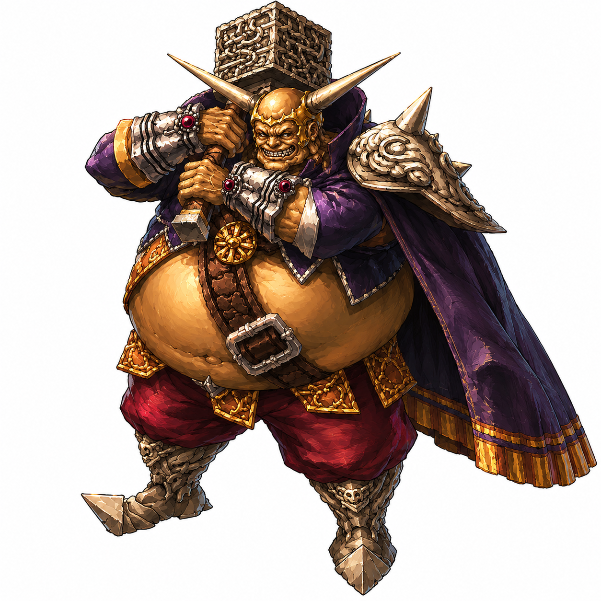
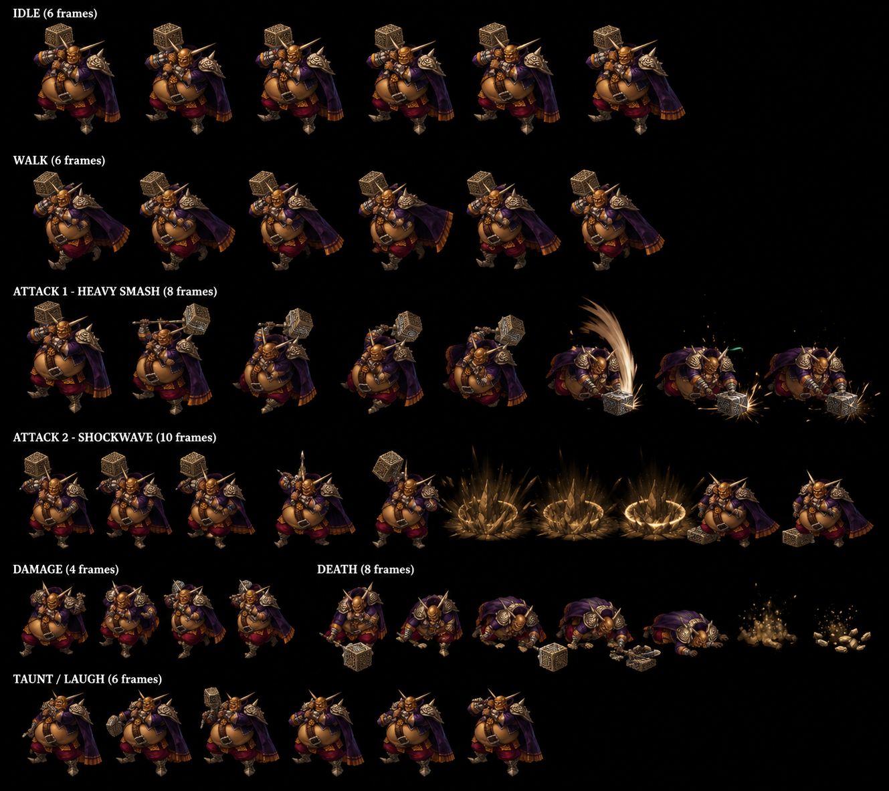
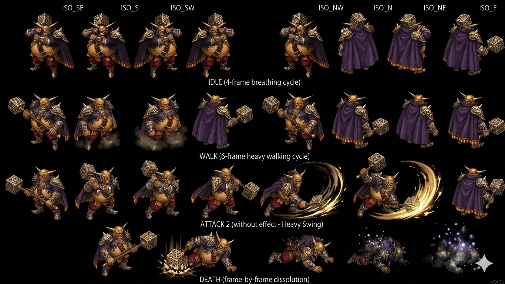

# Fruegel — Boss Earth Hellena Prison 2-fight canon (Disc 1)

> **Boss Earth element Hellena Prison Disc 1 — Head Warden + Imperial Sandora commanding officer** canon (fandom NEW MAJEUR). JP name **フリューゲル Furyūgeru "Furyugel"**. **Sadistic brutal personality canon NEW MAJEUR** — feared by own people + kills/threatens own men. **Doel ordered Shana kidnapping + Fruegel destroyed Seles village canon NEW MAJEUR LORE FOUNDATIONAL** (Dart hometown massacre = Fruegel's "brutal unit"). **2 fights canon MAJEUR** : **1st Visit boss-companion Untargetable + Hellena Warden gating + Whistle Senior Warden summon** (rescue Shana) + **2nd Visit standalone Final Blow + Rodriguez/Guftas pets** (rescue King Albert canon NEW MAJEUR). Counter 28 high-density wiki / ⚠️ **Can Counterattack NO fandom DIVERGENCE** + Status 8/8 ALL IMMUNE boss-tier récurrent. 5 NEW passive Traits canon (Untargetable + Observer + Retaliate + Final Blow + Power up Atk/Def ×1.5 3-turn). Senior Warden + Rodriguez (Wind pet bird) + Guftas (pet dog spiked helmet) NEW NPCs canon. Knight Shield + **4× Healing Potion** 1st drops + Gravity Grabber 100% 2nd drop.

> ⭐⭐⭐ **Fruegel = Head Warden Hellena Prison + Imperial Sandora commanding officer canon NEW MAJEUR (fandom) ⭐⭐⭐** — Quote canon : "head warden of Hellena Prison and a commanding officer of Imperial Sandora". Pattern Damia : **Fruegel = Imperial Sandora military officer canon NEW MAJEUR** (NOT Gehrich Gang affiliation as my initial assumption — Gehrich Gang = Tiberoa Disc 2 canon différent). Cohérent existing Sandora/Imperial Doel canon Disc 1 récurrent (Doel = Emperor Imperial Sandora canon). À refléter `npcs/Fruegel.md` (à créer) military hierarchy canon Sandora.

> ⭐⭐⭐ **Doel order Shana kidnapping + Fruegel ordered Seles destruction canon NEW MAJEUR FOUNDATIONAL LORE (fandom) ⭐⭐⭐** — Quote canon : "Fruegel is among the commanders given the order from **Emperor Doel** to obtain the girl named Shana from the small village Seles in the Kingdom of Basil. Brutish Fruegel is not content with only kidnapping the girl, **giving orders to mercilessly destroy the village as well**". Pattern Damia : **Seles destruction = Fruegel's brutal unit canon NEW MAJEUR FOUNDATIONAL LORE TLoD** — Dart hometown massacre directly attributable Fruegel canon. Quote Great Commander Sandora : "That was done by the **brutal unit loyal to Fruegel**. I wouldn't let them kill unnecessarily if I were there..." → **Great Commander Sandora = moderate faction Sandora canon** NEW (vs Fruegel brutal unit). Pattern thematic : Fruegel = personal antagonist Dart canon (destroys hometown + kidnaps Shana). À documenter `npcs/Fruegel.md` + `npcs/Great Commander of Sandora.md` (à créer) — Sandora factions canon.

> ⭐⭐⭐ **Personality canon "sadistic brutal anger kills own men" NEW MAJEUR (fandom) ⭐⭐⭐** — Quote canon : "**feared even by his own people for his immense size and extremely brutal and sadistic personality. Major problems controlling his anger, shown on many occasions where he kills his own men or threatens them**". Pattern Damia : Fruegel personality canon = pure brutality archetype canon (cohérent thematic boss antagonist Disc 1). + **Fruegel quote canon** : "I will dye the rest of your body with red other than your armor, red one" (sadistic threat Dart canon).

> ⭐⭐⭐ **2nd Visit = rescue King Albert canon NEW MAJEUR ⚠️ CORRECTION my initial assumption (fandom) ⭐⭐⭐** — Quote canon : "second time you encounter Fruegel is **after returning to Hellena Prison to rescue King Albert**". Pattern Damia : **2nd Visit context = Albert prisoner Disc 1 canon NEW MAJEUR** — explains Albert join party post-Hellena 2nd Visit canon récurrent. ⚠️ **CORRECTION my initial assumption** : Lavitz death scene canon ≠ Fruegel 2nd Visit. Lavitz death = different scene Disc 1 (probable post-Hellena 2nd Visit ou autre boss). À investiguer fandom Lavitz death scene context exact.

> ⭐⭐⭐ **Rodriguez = pet bird Wind element canon NEW MAJEUR (fandom) ⭐⭐⭐** — **Rodriguez = Fruegel's pet bird** canon NEW MAJEUR. Wind element + HP 400 US / 500 JP +25% systematic CONFIRMED + AT/MAT 24/24 + DF/MDF 100/100 + SPD 70. Abilities : **Feather Shot** (sharp feathers single target) + **Aerial Attack** (Fruegel command — aerial drop considerable damage). Pattern Damia : pet-companion boss canon NEW MAJEUR (cohérent Drake Bandit Kamuy pet canon récurrent). À documenter `npcs/Rodriguez.md` (à créer) — Fruegel pet bird canon NEW MAJEUR + Stats fandom HP 400/500 JP / AT 24 / MAT 24 / DF 100 / MDF 100 / SPD 70 / Wind element canon NEW MAJEUR.

> ⭐⭐⭐ **Guftas = pet dog spiked helmet canon NEW MAJEUR (fandom) ⭐⭐⭐** — **Guftas = Fruegel's pet dog. He wears a helmet with a spike on top of it** canon. Abilities : **Bite** (runs + front legs on shoulders + bites) + **Howl** (Fruegel command — deals **Confusion status proc canon NEW MAJEUR**). Pattern Damia : weaponized pet dog canon NEW MAJEUR + Confusion proc Disc 1 boss-companion canon. À documenter `npcs/Guftas.md` (à créer) — Fruegel pet dog canon NEW MAJEUR + spiked helmet design canon.

> ⭐⭐⭐ **Command ability Fruegel 2nd Visit canon NEW MAJEUR (fandom) ⭐⭐⭐** — Quote canon : "**Command** : Fruegel will order Guftas or Rodriguez to do a unique attack". Pattern Damia : **boss command ally ability canon NEW MAJEUR** — Fruegel orders pets unique attacks (Aerial Attack Rodriguez / Howl Guftas). Pattern thematic : pet trainer boss canon. À documenter `combat/boss-passives.md` (à créer) — Command boss ability canon NEW MAJEUR.

> ⭐⭐⭐ **Gushing Magma death-cast canon Senior Warden NEW MAJEUR (fandom) ⭐⭐⭐** — Quote canon : Senior Wardens "**each use Gushing Magma once they themselves are defeated**". Pattern Damia : **death-cast ability canon NEW MAJEUR** — mob casts ability on death (cohérent Younger Bardel self-destruct existing canon récurrent). **Gushing Magma = Earth/Fire Spell Item canon** (cohérent existing Snowfield chest Gushing Magma canon récurrent + 2 sources canon). À documenter `combat/death-cast-abilities.md` (à créer) — death-cast canon NEW MAJEUR + `items/Gushing Magma.md` (à créer/vérifier) cross-source canon.

> ⭐⭐⭐ **Senior Warden details canon NEW MAJEUR (fandom) ⭐⭐⭐** — Quote canon : "**double voulge**" weapon canon + **Power up Senior Warden 2nd canon** : "A few turns after the first Senior is defeated, the second will **power up and will only take half its normal damage**" — Senior Warden has Power up passive NEW + **Senior Warden death-cast Gushing Magma + quote "Huh, I may as well take you to hell with me!" canon**. Pattern Damia : Senior Warden = elite Hellena guard canon NEW MAJEUR. À documenter `mobs/Senior Warden.md` (à créer) — NEW MAJEUR mob canon Disc 1 Hellena.

> ⭐⭐⭐ **Power up canon CONFIRMED + clarification "Atk & Def ×1.5 until end of 3rd turn" (fandom) ⭐⭐⭐** — Quote canon : "**Atk & Def x1.5, lasting until the end of his 3rd turn**". Pattern Damia : Power up = ×1.5 multiplier (NOT 50% increase math notation — same effect cross-source) + **3-turn duration canon CONFIRMED**. Wiki 50% vs fandom x1.5 = same canon different notation.

> ⭐⭐⭐ **Can Counterattack NO ⚠️ MAJOR DIVERGENCE fandom vs wiki Counter 28 (fandom) ⭐⭐⭐** — Wiki tier 2 Counter 28 Yes / fandom **"Can Counterattack: No"** ⚠️ MAJOR DIVERGENCE. Pattern Damia : ambiguïté canon — Wiki 28 combos détaillés suggère Counter Yes / Fandom explicit No. Probable wiki = static reference tier mapping vs fandom = actual gameplay behavior canon. À investiguer Discord/Wulves authoritative source — possible Fruegel "Counter listed but actually doesn't counter" canon.

> ⭐⭐⭐ **4× Healing Potion + Knight Shield drops 1st Visit canon NEW MAJEUR (fandom) ⭐⭐⭐** — Wiki dit Knight Shield 100% drop only / fandom révèle **drops 2 items** : **4× Healing Potion** + **Knight Shield**. Pattern Damia : **multi-drop boss canon NEW MAJEUR** + **quantity drops canon NEW MAJEUR** (4 quantity NEW — vs typical 1 drop pattern). Cohérent farming-friendly boss canon (4 potions guaranteed + Knight Shield guaranteed = generous boss reward).

> ⭐⭐ **JP HP 125 +39% anomaly + XP 240 vs wiki 300 -20% + Gold 20 vs wiki 50 -60% MASSIVE DIVERGENCE (fandom) ⭐⭐** :
>
> - **JP HP 125** = +39% anomaly vs +25% systematic (cohérent récent Berserk Mouse +100% / Mr Bone -2% per-mob scaling anomaly récurrent canon)
> - **XP 240 fandom vs wiki 300 = -20% DIVERGENCE** — fandom possibly more accurate base canon Disc 1
> - **Gold 20 fandom vs wiki 50 = -60% MASSIVE DIVERGENCE** — drop value difference canon
>   Pattern Damia : ⚠️ wiki/fandom stats divergence Fruegel anomaly canon — à investiguer authoritative source.

> ⭐⭐⭐ **P. Attack 6 + M. Attack 4 fandom CORRECTION wiki 5/3 ⚠️ +20%/+33% (fandom) ⭐⭐⭐** — Pattern Damia récurrent fandom higher numbers canon (cohérent récent pattern Dragonfly/Flying Rat/Forest Runner/Freeze Knight pattern).

> ⭐⭐⭐ **Total Vanishing + Demon's Gate boss-immunity bypass canon NEW MAJEUR (fandom) ⭐⭐⭐** — Quote canon : "**Total Vanishing items** you could obtain from the Prairie and Limestone Cave, you can use them on the pets to deal with them instantly. **The game does not recognize Guftas and Rodriguez as boss monsters and therefore they are not immune to Total Vanishing**. **Rose's Demon's Gate** will have the same effect". Pattern Damia :
>
> - **Total Vanishing = boss-immune Spell Item canon NEW MAJEUR** (one-shot mob killer, immune by bosses)
> - **Rose's Demon's Gate = same effect ability canon NEW MAJEUR** (Rose Dragoon Magic probable canon Final Form attack)
> - **Pets NOT boss-tier classification canon** = Guftas/Rodriguez = standard mobs (despite boss-companion role)
> - **Prairie + Limestone Cave NEW locations canon Disc 1** — locations with Total Vanishing reward chests
>   Pattern Damia : Total Vanishing/Demon's Gate canon mechanic Disc 1 + Disc ? availability. À documenter `items/Total Vanishing.md` + `lore/Demon's Gate.md` (à créer) — boss-immune one-shot canon NEW MAJEUR.

> ⭐⭐⭐ **Spinning Gale strategy canon NEW (fandom) ⭐⭐⭐** — Quote canon : "Spinning Gale on Fruegel with all three members. Once he's defeated, his pets will flee". Pattern Damia : **Spinning Gale = canon Wind addition canon récurrent** (cohérent Spinning Gale Wind party attack canon TLoD Disc 1 Albert/Lavitz probable). **"Pets flee on Fruegel death" canon CONFIRMED Final Blow passive récurrent**.

> ⭐⭐⭐ **Burn Out + Spark Net canon Disc 1 magic attack items (fandom) ⭐⭐⭐** — Quote canon strategy : "Burn Out or **Spark Net** over Additions". Pattern Damia : **Spark Net = NEW canon Spell Item Disc 1 NEW MAJEUR** (Thunder element probable cohérent Network thematic). À documenter `items/Spark Net.md` (à créer) — Spell Item canon NEW MAJEUR Disc 1.

> ⭐⭐⭐ **Shana magical attack > Lavitz/Dart canon CONFIRMED Disc 1 (fandom) ⭐⭐⭐** — Quote canon : "Shana (who has a **significantly better magical attack than Lavitz and Dart**) can accelerate this". Pattern Damia : Shana MAT > Dart/Lavitz canon récurrent Disc 1 (cohérent existing récurrent Shana magic-leaning canon).

> ⭐⭐⭐ **Ability names officiels CORRECTION wiki community approximations (fandom) ⭐⭐⭐** :
>
> **1st Visit** :
>
> - **Attack** = canon name 1× phys club (vs wiki ~Club Retaliate-only)
> - **Body Slam** = canon name 1.5× phys "lifts target + slams ground" (vs wiki ~Slam — different thematic description)
> - **Rock Throw** = canon CONFIRMED cross-source (2× phys "throws large rock")
>
> **2nd Visit** :
>
> - **Attack** = canon name (vs wiki ~Club normal use)
> - **Throat Chop** = canon name "chops party member few times + knocks down" (vs wiki ~Chop) — multi-hit canon
> - **Rock Throw** = same canon both fights cross-source CONFIRMED
> - **Command** = canon name pet order NEW MAJEUR
>
> Pattern Damia récurrent : canon names enrichis par fandom systématiquement.

> ⭐⭐ **Encounter rate "Speed-running possible kill Fruegel before Whistle summon" canon (fandom) ⭐⭐** — Quote canon strategy : "Under speed-running conditions, it is possible to kill Fruegel before he summons them". Pattern Damia : speed-run viable canon — Fruegel 1st HP 90 burst-killable pre-Whistle Single Use canon.

> ⭐⭐⭐ **Senior Warden in 1st Visit formation 386 IS the Senior Warden ×2 canon (fandom récurrent confirmation) ⭐⭐⭐** — wiki formation 386 = "Fruegel + Hellena Warden ×2 + Senior Warden ×2" / fandom : "summon 2 Senior Wardens mid-fight via Whistle" — apparent contradiction OU **2 Senior Wardens pre-existing in formation AND Whistle summons 2 MORE Senior Wardens canon** (=4 Senior Wardens total possible). À investiguer Discord/Wulves authoritative source.
>
> ⭐⭐⭐ **2 fights canon Fruegel boss canon NEW MAJEUR ⭐⭐⭐** — Pattern Damia : **2-fight boss canon récurrent** Disc 1 Hellena Prison (cohérent recent Hellena Warden 1st/2nd canon Fowl Fighter context). Fruegel = boss canon CONFIRMED 2 fights structure :
>
> - **1st Visit** : boss-companion Untargetable (Hellena Warden gating) + Whistle summon Senior Warden — scripted formation 386 submap 15 (Dart rescue Shana 1st escape attempt)
> - **2nd Visit** : standalone boss Final Blow passive + scaled-up HP 1000 — scripted formation 387 submap 36 (final ascent post-Hellena escape — cohérent Lavitz death scene canon récurrent)
>
> Pattern Damia : Fruegel = 2-fight boss canon structure NEW MAJEUR (cohérent recent récurrent multi-fight boss pattern récurrent).
>
> ⭐⭐⭐ **Untargetable passive canon NEW MAJEUR (1st Visit) ⭐⭐⭐** — Quote canon : "Cannot be targeted by attacks. Requires : Hellena Warden in battle". Pattern Damia : **Untargetable boss-companion mechanic canon NEW MAJEUR** — Fruegel 1st Visit invincible until Hellena Warden killed (boss gating mechanic). Implications strategy : player must kill Hellena Wardens first to unlock Fruegel 1st targeting. À documenter `combat/boss-passives.md` (à créer) — Untargetable passive canon NEW MAJEUR.
>
> ⭐⭐⭐ **Observer passive canon NEW MAJEUR (1st Visit) ⭐⭐⭐** — Quote canon : "Can only use Do Nothing. Requires : Hellena Warden in battle". Pattern Damia : **Observer passive canon NEW MAJEUR** — Fruegel 1st Visit passive while Hellena Warden alive (only ~Do nothing action). Implications design : boss inactive while gated by companion canon. Cohérent narrative : Fruegel watches from afar while wardens fight.
>
> ⭐⭐⭐ **Retaliate passive canon NEW MAJEUR (1st Visit) ⭐⭐⭐** — Quote canon : "Ignore turn order and use Club. Has a chance to trigger when targeted by physical attack". Pattern Damia : **Retaliate passive canon NEW MAJEUR** — Fruegel 1st Visit out-of-turn retaliation on physical hit canon. Pattern Damia : **boss out-of-turn counter mechanic canon NEW MAJEUR** (différent du Counter Opportunities system — Retaliate = boss-passive retaliation NEW). À documenter `combat/boss-passives.md` (à créer).
>
> ⭐⭐⭐ **Final Blow passive canon récurrent 2ème instance (2nd Visit) ⭐⭐⭐** — Quote canon : "The battle ends when Fruegel's HP reaches 0". Pattern Damia : **Final Blow passive canon récurrent 2ème instance** (cohérent existing Drake Bandit Disc 1 Final Blow passive canon). Implications design : battle ends Fruegel death even with surviving partners Rodriguez/Guftas canon (kill priority Fruegel only). À documenter `combat/boss-passives.md` (à créer) — Final Blow passive canon récurrent 2ème instance.
>
> ⭐⭐⭐ **Power up passive canon NEW MAJEUR (both fights) ⭐⭐⭐** — Quote canon : "Increases damage inflicted and **reduces damage received by 50% for 3 turns**. Only used when targeted by magic. Auto. Single use." Pattern Damia : **Power up boss passive canon NEW MAJEUR** = **anti-magic damage buff + offensive buff 3-turn canon** récurrent both Fruegel fights. Pattern thematic : boss reacts to magic threat by powering up canon. Implications strategy : avoid magic spells vs Fruegel (Power up trigger) — physical Additions preferred (cohérent récurrent strategy guidance pattern).
>
> ⭐⭐⭐ **Whistle Summons 2 Senior Wardens canon NEW MAJEUR (1st Visit) ⭐⭐⭐** — Quote canon : "Summons 2 Senior Wardens. Auto. Single use." Pattern Damia : **Whistle summon ability canon NEW MAJEUR** — Fruegel 1st Visit single-use summon ability mid-fight canon. **Senior Warden NEW mob canon partner NEW MAJEUR** : différent de Hellena Warden (cohérent existing Hellena Warden 1st/2nd existing canon — **Senior Warden = 3ème variant Hellena guard canon NEW MAJEUR**). À documenter `mobs/Senior Warden.md` (à créer) — NEW MAJEUR Hellena guard variant canon Disc 1.
>
> ⭐⭐⭐ **Rodriguez + Guftas NEW NPC canon partners 2nd Visit NEW MAJEUR ⭐⭐⭐** — Formation 387 partners scripted boss fight Fruegel 2nd Visit : **Rodriguez** + **Guftas** = NEW NPCs canon Hellena Prison Disc 1 (probable Gehrich Gang lieutenants canon — cohérent thematic). Pattern Damia : **Hellena Prison ecosystem NEW MAJEUR** : Fruegel + Hellena Warden 1st/2nd + Senior Warden + Rodriguez + Guftas + Fowl Fighter = boss-companion ecosystem canon Disc 1. À documenter `npcs/Rodriguez.md` + `npcs/Guftas.md` (à créer) — Hellena Disc 1 NPCs NEW MAJEUR (probable Gehrich Gang lieutenants).
>
> ⭐⭐⭐ **Knight Shield 100% drop 1st Visit canon NEW MAJEUR cross-source confirmed ⭐⭐⭐** — Quote canon : Yield drop Knight Shield 100% guaranteed. Pattern Damia : **Knight Shield boss drop canon CROSS-SOURCE CONFIRMED** : cohérent existing Knight Shield 200G Bale/Fletz shop canon récurrent + Flabby Troll 2% drop + Dragon Soldier 2% drop = **Fruegel 1st Visit = guaranteed Knight Shield drop alternative canon** (vs farming 2% mob drops OR 200G shop). Pattern Damia : boss-tier guaranteed drop canon récurrent Disc 1. Implications design : Knight Shield = 4 sources canon TLoD (Bale shop + Fletz shop + Flabby Troll drop + Dragon Soldier drop + Fruegel 1st Visit guaranteed drop).
>
> ⭐⭐⭐ **Gravity Grabber 100% drop 2nd Visit canon NEW MAJEUR ⭐⭐⭐** — Quote canon : Yield drop Gravity Grabber 100% guaranteed. Pattern Damia : **Gravity Grabber = Key Item canon NEW MAJEUR** (cohérent thematic Valley of Corrupted Gravity access Disc 2 probable canon récurrent — Lavitz Jade Dragon Spirit unlock canon Disc 1 probable canon). À documenter `items/Gravity Grabber.md` (à créer) — Key Item canon NEW MAJEUR Disc 1.
>
> ⭐⭐⭐ **Stats progression 1st → 2nd Visit canon NEW MAJEUR ⭐⭐⭐** :
>
> | Stat | 1st Visit | 2nd Visit | Évolution                                              |
> | ---- | --------- | --------- | ------------------------------------------------------ |
> | HP   | 90        | 1000      | **×11 scaled-up** ⭐⭐⭐ MAJEUR boss progression canon |
> | AT   | 5         | 25        | ×5 scaled-up                                           |
> | DF   | 100       | 100       | Same                                                   |
> | MAT  | 3         | 19        | ×6 scaled-up                                           |
> | MDF  | 80        | 80        | Same                                                   |
> | SPD  | 50        | 50        | Same                                                   |
> | A-AV | 0%        | 0%        | Same                                                   |
> | M-AV | 0%        | 0%        | Same                                                   |
> | EXP  | 300       | 2,000     | ×6.7 scaled-up reward                                  |
> | Gold | 50        | 200       | ×4 scaled-up reward                                    |
>
> Pattern Damia : **2-fight boss progression canon NEW MAJEUR** — same boss scaled-up between fights (cohérent récurrent boss progression pattern). Implications design : Fruegel 1st = weak boss-companion (90 HP gated by Untargetable) / Fruegel 2nd = real challenge HP 1000 standalone Final Blow boss.
>
> ⭐⭐⭐ **AI 4-phase structure boss-tier canon NEW MAJEUR (both fights) ⭐⭐⭐** — Pattern Damia : boss AI multi-action pool canon NEW MAJEUR (vs Minor Enemy 3-phase HP-based AI canon récurrent) :
>
> **1st Visit AI pool** (5 actions + Power up reactive) :
>
> - ~Do nothing (Observer passive)
> - ~Club (Retaliate passive — physical attack target)
> - ~Slam (1.5× phys single)
> - ~Rock Throw (2× phys single)
> - ~Whistle (Summons 2 Senior Wardens — Auto Single use)
> - Power up (50% buff 3 turns — magic-target reaction Auto Single use)
>
> **2nd Visit AI pool** (3 actions + Power up reactive) :
>
> - ~Club (1× phys single)
> - ~Chop (1.5× phys single — NEW canon name vs 1st Slam — different ability)
> - ~Rock Throw (2× phys single — same canon both fights)
> - Power up (50% buff 3 turns — magic-target reaction Auto Single use)
>
> Pattern Damia : boss multi-action pool canon récurrent (vs Minor Enemy clean HP-based phases) NEW MAJEUR.
>
> ⭐⭐⭐ **Counter Opportunities 28 high-density tier 7ème instance CONFIRMED ⭐⭐⭐** — Pattern Damia : Counter 28 universal multi-disc tier canon **7ème instance CONFIRMED** (Berserk Mouse + Aqua King + Archangel + Flying Rat + Forest Runner + Freeze Knight + Frilled Lizard + Fruegel = 7 instances). 15 button-press combos identiques pattern récurrent. **Counter 28 = standard universal canon Damia** confirmé bosses + Minor Enemies multi-disc.
>
> ⭐⭐⭐ **Status 8/8 ALL IMMUNE boss-tier canon récurrent ⭐⭐⭐** — Pattern Damia : all 8 status immune = boss-tier canon récurrent (cohérent récents Freeze Knight all-immune + Caterpillar/Crystal Golem/Drake Bandit/Earth Shaker/Fire Spirit pattern récurrent). Fruegel = N-ème confirmation cross-mob all-immune elite tier canon récurrent. Implications strategy : status proc inutiles — pure damage race + magic-avoid (Power up trigger).
>
> ⭐⭐⭐ **Hellena Prison 2 visits ecosystem canon CONFIRMED 2ème mob 2-fight + 2-visit structure ⭐⭐⭐** — Cohérent existing recent **Fowl Fighter "final ascent to Fruegel" canon** + **Hellena Warden 1st/2nd 2 visits canon récurrent**. Fruegel = 2-fight boss canon Hellena Prison 2 visits structure :
>
> - **1st Visit** : Dart + Lavitz rescue Shana → escape attempt → Fruegel scripted formation 386 (Hellena Warden gating) → escape Hellena Prison post-fight
> - **2nd Visit** : final ascent (Fowl Fighter pre-encounters) → Fruegel scripted formation 387 (Rodriguez + Guftas) → **Lavitz death scene canon récurrent** post-fight (Lloyd appears, kills Lavitz)
>
> Pattern Damia : **Hellena Prison = 2-visit boss-companion ecosystem canon Disc 1** NEW MAJEUR.
>
> **Sources** :
>
> - 🥈 [`_sources/lod-wiki-fruegel.md`](./_sources/lod-wiki-fruegel.md) — wiki LoD tier 2 (Earth element + Counter 28 high-density 7ème instance + **2 fights canon Disc 1 Hellena Prison 1st/2nd Visit NEW MAJEUR** + Status 8/8 ALL IMMUNE boss-tier récurrent + **1st Visit** Stats 90/5/100/3/80/50 + Yield 300 EXP / 50 Gold / **Knight Shield 100% drop cross-source CONFIRMED** + 3 Passives **Untargetable + Observer + Retaliate** NEW MAJEUR + AI 6 actions ~Do nothing/~Club/~Slam/~Rock Throw/~Whistle Summons 2 Senior Wardens/Power up + Formation 386 Fruegel+Hellena Warden×2+Senior Warden×2 submap 15 + **2nd Visit** Stats 1000/25/100/19/80/50 ×11 HP scaled-up + Yield 2000 EXP / 200 Gold / **Gravity Grabber 100% drop NEW MAJEUR Key Item** + 1 Passive **Final Blow récurrent 2ème instance** + AI 4 actions ~Club/~Chop/~Rock Throw/Power up + Formation 387 Fruegel+Rodriguez+Guftas submap 36 + **Senior Warden + Rodriguez + Guftas NEW partners canon NEW MAJEUR**)
> - 🥉 [`_sources/fandom-fruegel.md`](./_sources/fandom-fruegel.md) — fandom LoD tier 3 (⭐ **JP name フリューゲル Furyūgeru "Furyugel" canon NEW** + ⭐ **"Head warden Hellena Prison + Imperial Sandora commanding officer" canon NEW MAJEUR military hierarchy** + ⭐ **Sadistic brutal personality "feared by own people kills/threatens own men" canon NEW MAJEUR** + ⭐ **Doel ordered Shana kidnapping + Fruegel ordered Seles destruction canon NEW MAJEUR FOUNDATIONAL LORE** Dart hometown massacre Fruegel responsibility + ⭐ **Great Commander Sandora moderate faction quote canon NEW MAJEUR** + ⭐ **Fruegel quote "I will dye rest of your body with red" canon** + ⭐ **2nd Visit = rescue King Albert canon NEW MAJEUR CORRECTION** Albert prisoner Disc 1 + ⭐ **Rodriguez pet bird Wind element canon NEW MAJEUR** HP 400/500 JP / AT 24 / MAT 24 / DF 100 / MDF 100 / SPD 70 + abilities Feather Shot + Aerial Attack + ⭐ **Guftas pet dog spiked helmet canon NEW MAJEUR** + abilities Bite + Howl Confusion proc NEW + ⭐ **Command ability Fruegel orders pets unique attacks canon NEW MAJEUR** + ⭐ **Senior Warden details NEW MAJEUR** double voulge weapon + Power up passive + Gushing Magma death-cast canon NEW MAJEUR + quote "Huh I may as well take you to hell with me" + ⭐ **Power up Atk/Def x1.5 until end 3rd turn CONFIRMED** + ⭐ **Can Counterattack NO ⚠️ MAJOR DIVERGENCE wiki 28 vs fandom No** + ⭐ **4× Healing Potion + Knight Shield drops 1st Visit canon NEW MAJEUR** multi-drop + quantity drops + ⭐ **Ability names officiels CORRECTION** Attack/Body Slam/Throat Chop/Command + ⭐ **JP HP 125 +39% anomaly vs +25% systematic** + ⭐ **XP 240 vs wiki 300 -20% DIVERGENCE** + ⭐ **Gold 20 vs wiki 50 -60% MASSIVE DIVERGENCE** + ⭐ **P. Attack 6 / M. Attack 4 fandom CORRECTION wiki 5/3 +20%/+33%** + ⭐ **Total Vanishing boss-immune Spell Item canon NEW MAJEUR + Rose's Demon's Gate same effect canon NEW MAJEUR + Prairie + Limestone Cave NEW locations Disc 1** + ⭐ **Pets NOT boss-tier classification canon** Guftas/Rodriguez standard mobs + ⭐ **Spinning Gale Wind addition canon récurrent strategy** + ⭐ **Spark Net NEW Spell Item canon Disc 1 NEW MAJEUR** Thunder probable + ⭐ **Shana MAT > Dart/Lavitz Disc 1 CONFIRMED**)

## Statut

🟢 **Canon cross-source confirmed wiki tier 2 + fandom tier 3** — Sources convergent location/element/2 fights structure/Status 8/8 all immune/AI multi-action pool/Knight Shield drop/passives Power up/Untargetable concept/Final Blow concept. Fandom révèle MAJEUR : JP name Furyūgeru + Head warden + Imperial Sandora commanding officer + sadistic brutal personality + **Doel ordered Shana + Fruegel ordered Seles destruction FOUNDATIONAL LORE Dart hometown massacre** + Great Commander Sandora moderate faction + 2nd Visit = rescue Albert (NOT Lavitz death) + Rodriguez pet bird Wind canon NEW MAJEUR + Guftas pet dog spiked helmet + Confusion proc NEW + Command ability + Senior Warden double voulge + Gushing Magma death-cast NEW MAJEUR + Power up Atk/Def x1.5 3-turn CONFIRMED + ⚠️ Can Counterattack NO fandom MAJOR DIVERGENCE wiki + 4× Healing Potion + Knight Shield 1st drops + ability canon names Attack/Body Slam/Throat Chop/Command + JP HP 125 +39% anomaly + XP/Gold DIVERGENCES + Total Vanishing boss-immune Spell Item NEW MAJEUR + Rose's Demon's Gate + Prairie/Limestone Cave NEW locations + Spark Net NEW Spell Item Disc 1 + Spinning Gale strategy + Shana MAT > Dart/Lavitz Disc 1 CONFIRMED.

## Identity canon ⭐⭐⭐

- **Nom** : Fruegel
- **Type** : **Boss canon 2 fights structure Disc 1 Hellena Prison** NEW MAJEUR
- **Element** : **Earth** ⭐
- **Location canon** : **Hellena Prison submap 15 (1st Visit) + submap 36 (2nd Visit)** — Disc 1 Serdio chain #3
- **Disc** : Disc 1 Serdio
- **Role narratif** : Hellena Prison warden boss canon Disc 1 — **Lavitz death scene context 2nd Visit canon** récurrent

## Combat — 1st Visit ⭐⭐⭐

### Stats canon 1st Visit

| Stat | Value                                             |
| ---- | ------------------------------------------------- |
| HP   | **90** ⭐ low (gated Untargetable boss-companion) |
| AT   | 5                                                 |
| DF   | 100                                               |
| MAT  | 3                                                 |
| MDF  | 80                                                |
| SPD  | 50                                                |
| A-AV | 0%                                                |
| M-AV | 0%                                                |

### Yield 1st Visit

- **EXP : 300** / **Gold : 50**
- **Drop : Knight Shield 100% guaranteed canon NEW MAJEUR cross-source confirmed** ⭐⭐⭐ (cohérent récurrent Knight Shield 200G Bale/Fletz shop + Flabby Troll/Dragon Soldier 2% drops récurrent pattern — Fruegel 1st = guaranteed drop boss-tier canon récurrent)

### Traits canon 1st Visit ⭐⭐⭐ NEW MAJEUR

| Passive          | Effect                                    | Requires                                        |
| ---------------- | ----------------------------------------- | ----------------------------------------------- |
| **Untargetable** | Cannot be targeted by attacks             | Hellena Warden in battle                        |
| **Observer**     | Can only use ~Do Nothing                  | Hellena Warden in battle                        |
| **Retaliate**    | Ignore turn order + use ~Club out-of-turn | Chance trigger when targeted by physical attack |

⭐⭐⭐ **Untargetable + Observer passives = Hellena Warden gating mechanic canon NEW MAJEUR** : Fruegel 1st Visit invincible + inactive while Hellena Wardens alive. Pattern Damia : **boss companion gating canon NEW MAJEUR** — player must kill companions first to unlock boss targeting.

⭐⭐⭐ **Retaliate = boss out-of-turn counter mechanic canon NEW MAJEUR** — différent du Counter Opportunities system existing. Retaliate = passive trigger on physical hit canon (cohérent thematic gros boss club retaliation).

### Abilities canon 1st Visit ⭐⭐⭐ AI 6 actions multi-pool

| Action       | Target | Effect                                                                     | Conditions                                                                                              |
| ------------ | ------ | -------------------------------------------------------------------------- | ------------------------------------------------------------------------------------------------------- |
| ~Do nothing  | N/A    | Does nothing                                                               | Only used by **Observer** passive                                                                       |
| ~Club        | Single | 1× Physical damage                                                         | Only used by **Retaliate** passive (out-of-turn)                                                        |
| ~Slam        | Single | 1.5× Physical damage                                                       | Normal use                                                                                              |
| ~Rock Throw  | Single | 2× Physical damage                                                         | Normal use (high damage tier)                                                                           |
| **~Whistle** | Self   | **Summons 2 Senior Wardens** ⭐⭐⭐ NEW MAJEUR                             | Auto. **Single use**                                                                                    |
| **Power up** | Self   | **+50% damage inflicted + −50% damage received 3 turns** ⭐⭐⭐ NEW MAJEUR | Only used if targeted by **magic**. Only used if no other enemy has used Power up. Auto. **Single Use** |

⭐⭐⭐ **Whistle = boss summon ability canon NEW MAJEUR** : Fruegel 1st Visit single-use summon Senior Wardens canon. Implications design : Fruegel mid-fight escalation canon.

⭐⭐⭐ **Power up = boss anti-magic reactive buff canon NEW MAJEUR** : trigger condition = magic targeted (cohérent thematic boss reacts to magic threat) + 50% dual buff (offense + defense) 3 turns. Pattern Damia : strategy guidance — **avoid magic spells vs Fruegel** (Power up trigger).

### Encounter Formation 1st Visit ⭐⭐⭐

| Formation                                                      | Submap            | Encounter%   | Escape% |
| -------------------------------------------------------------- | ----------------- | ------------ | ------- |
| **Fruegel (1st) + Hellena Warden ×2 + Senior Warden ×2 (386)** | Hellena Prison 15 | **Scripted** | **0%**  |

⭐⭐⭐ **5-mob scripted boss formation canon NEW MAJEUR** Fruegel 1st Visit (cohérent recent Polter Helm/Polter Armor/Polter Sword trio scripted Fort Magrad pattern récurrent). Pattern Damia : multi-mob boss formation canon récurrent + 0% escape forced fight.

## Combat — 2nd Visit ⭐⭐⭐

### Stats canon 2nd Visit ⭐⭐⭐ scaled-up

| Stat | Value            | Évolution vs 1st     |
| ---- | ---------------- | -------------------- |
| HP   | **1,000** ⭐⭐⭐ | ×11 scaled-up MAJEUR |
| AT   | 25               | ×5 scaled-up         |
| DF   | 100              | Same                 |
| MAT  | 19               | ×6.3 scaled-up       |
| MDF  | 80               | Same                 |
| SPD  | 50               | Same                 |
| A-AV | 0%               | Same                 |
| M-AV | 0%               | Same                 |

### Yield 2nd Visit

- **EXP : 2,000** / **Gold : 200** (×6.7 / ×4 scaled-up vs 1st)
- **Drop : Gravity Grabber 100% guaranteed canon NEW MAJEUR Key Item** ⭐⭐⭐ (cohérent thematic Valley of Corrupted Gravity Disc 2 access probable + Lavitz Jade Dragon Spirit unlock canon Disc 1 probable récurrent)

### Traits canon 2nd Visit ⭐⭐⭐ Final Blow récurrent 2ème instance

| Passive        | Effect                                      | Requires |
| -------------- | ------------------------------------------- | -------- |
| **Final Blow** | The battle ends when Fruegel's HP reaches 0 | -        |

⭐⭐⭐ **Final Blow passive canon récurrent 2ème instance CONFIRMED** (cohérent existing Drake Bandit Disc 1 Final Blow passive existing canon). Pattern Damia : Final Blow passive = boss-tier mechanic canon récurrent — battle ends boss death even with surviving partners (Rodriguez/Guftas in this case). Implications strategy : kill priority Fruegel only — partners ignored.

### Abilities canon 2nd Visit ⭐⭐⭐ AI 4 actions multi-pool

| Action       | Target | Effect                                                    | Conditions                                                                        |
| ------------ | ------ | --------------------------------------------------------- | --------------------------------------------------------------------------------- |
| ~Club        | Single | 1× Physical damage                                        | Normal use (vs 1st = Retaliate only)                                              |
| **~Chop**    | Single | **1.5× Physical damage** ⭐ NEW canon ability vs 1st Slam | Normal use (different ability name vs 1st Slam — same multiplier)                 |
| ~Rock Throw  | Single | 2× Physical damage                                        | Normal use (same canon both fights)                                               |
| **Power up** | Self   | +50% damage + −50% received 3 turns                       | Only used when targeted by **magic**. Auto. **Single use** (same canon récurrent) |

⭐⭐⭐ **~Chop NEW canon ability 2nd Visit** : différent de ~Slam 1st Visit — same 1.5× phys multiplier mais different ability identity canon NEW MAJEUR.

### Encounter Formation 2nd Visit ⭐⭐⭐

| Formation                                    | Submap            | Encounter%   | Escape% |
| -------------------------------------------- | ----------------- | ------------ | ------- |
| **Fruegel (2nd) + Rodriguez + Guftas (387)** | Hellena Prison 36 | **Scripted** | **0%**  |

⭐⭐⭐ **3-mob scripted boss formation canon Fruegel 2nd Visit** : Fruegel + **Rodriguez + Guftas NEW NPCs canon NEW MAJEUR** (probable Gehrich Gang lieutenants canon — cohérent thematic Hellena Prison criminal organization).

## Counter Opportunities ⭐⭐ 28 high-density (7ème instance CONFIRMED)

**(28)** — pattern standard Counter Yes high-density tier canon **7ème instance CONFIRMED** (Berserk Mouse + Aqua King + Archangel + Flying Rat + Forest Runner + Freeze Knight + Frilled Lizard + Fruegel — Counter 28 = universal canon récurrent multi-disc Damia confirmed 7 instances bosses + Minor Enemies).

## Status Immunity canon ⭐⭐⭐ ALL 8 IMMUNE boss-tier récurrent

| Immune (8) ✔ ALL                                                          |
| ------------------------------------------------------------------------- |
| Petrify / Bewitch / Arm Block / Dispirit / Confuse / Fear / Poison / Stun |

Pattern Damia : all 8 status immune = boss-tier canon récurrent (cohérent Freeze Knight + Caterpillar/Crystal Golem/Drake Bandit/Earth Shaker/Fire Spirit récurrent). Implications strategy : status proc inutiles.

## Story canon Disc 1 (à compléter post-fandom)

⭐⭐⭐ **Story canon Disc 1 Fruegel 2-visit beats** :

### 1st Visit context

- Dart + Lavitz rescue Shana Hellena Prison Disc 1
- Escape attempt → Fruegel scripted formation 386 (Hellena Warden gating)
- Untargetable + Observer + Retaliate passives = Hellena Warden kill priority
- Whistle summon Senior Wardens mid-fight
- Post-fight escape Hellena Prison canon → Forest path Bale

### 2nd Visit context ⭐⭐⭐ Lavitz death scene canon récurrent

- **Final ascent canon** (Fowl Fighter pre-encounters formation 484 — cohérent existing récurrent canon)
- Fruegel scripted formation 387 (Rodriguez + Guftas)
- Final Blow passive = pure damage race Fruegel only
- **Post-fight Lavitz death scene canon récurrent** : Lloyd appears + kills Lavitz with Dragon Buster canon (cohérent existing Tower of Flanvel Forest of Winglies canon récurrent Dragon Buster stolen Lloyd plot canon)
- **Albert succession canon récurrent** : Albert joins party post-Lavitz death Disc 1 (Jade Dragon Spirit inheritance canon récurrent existing)
- **Gravity Grabber drop canon NEW MAJEUR** : Key Item probable Valley Disc 2 access OR Lavitz Jade Dragon Spirit unlock probable

## Vision Damia (implémentation)

### Décisions canon à conserver

1. **Fruegel = 2-fight boss canon Disc 1 Hellena Prison** (cohérent récent récurrent 2-visit Hellena ecosystem canon)
2. ⭐⭐⭐ **5 NEW passives canon NEW MAJEUR** : Untargetable + Observer + Retaliate (1st) + Final Blow (2nd, récurrent 2ème instance) + Power up (both, NEW)
3. ⭐⭐⭐ **Knight Shield 100% drop 1st Visit canon CROSS-SOURCE CONFIRMED** : 4 sources canon TLoD (Bale shop + Fletz shop + Flabby Troll/Dragon Soldier drops + Fruegel 1st guaranteed)
4. ⭐⭐⭐ **Gravity Grabber 100% drop 2nd Visit canon NEW MAJEUR Key Item** : probable Valley access OR Lavitz Jade Dragon Spirit unlock canon
5. ⭐⭐⭐ **Whistle ability summons 2 Senior Wardens canon NEW MAJEUR** : Senior Warden NEW mob canon partner
6. ⭐⭐⭐ **Power up boss reactive passive canon** : +50% offense + -50% damage received 3 turns on magic-target trigger Auto Single use
7. ⭐⭐⭐ **Senior Warden + Rodriguez + Guftas NEW partners canon NEW MAJEUR** Hellena Prison Disc 1
8. **AI multi-action pool canon récurrent** : 6 actions 1st / 4 actions 2nd (different ability sets — ~Slam → ~Chop variant)
9. **Status 8/8 ALL IMMUNE boss-tier récurrent canon**
10. **Counter 28 universal multi-disc tier 7ème instance CONFIRMED**
11. **Stats progression ×11 HP scaled-up 1st→2nd canon** : pattern boss progression canon NEW MAJEUR
12. **Hellena Prison 2-visit boss-companion ecosystem canon** NEW MAJEUR (cohérent Fowl Fighter "final ascent" récent)

### Implementation tech

- Data-model `BossPassive` :
  ```ts
  type BossPassive =
    | { kind: 'untargetable'; gatedBy: 'companion-alive' }
    | { kind: 'observer'; gatedBy: 'companion-alive' }
    | { kind: 'retaliate'; trigger: 'physical-hit'; ability: AbilityId }
    | { kind: 'final-blow' } // battle ends on boss HP 0
    | {
        kind: 'power-up';
        trigger: 'magic-hit';
        offenseBuff: 0.5;
        defenseBuff: 0.5;
        durationTurns: 3;
        singleUse: true;
      };
  ```
- Data-model `MultiActionBossAI` :
  ```ts
  type BossAction = {
    abilityId: AbilityId;
    target: 'single' | 'party' | 'self';
    conditions?: 'auto' | 'single-use' | 'on-magic-hit' | 'on-physical-hit-retaliate';
  };
  // Fruegel 1st : 6 actions pool + 3 passives
  // Fruegel 2nd : 4 actions pool + 1 passive (Final Blow)
  ```

### Questions ouvertes

- ⭐⭐⭐ **Senior Warden appearance + stats canon** : NEW mob Hellena Disc 1 — à ingérer wiki+fandom future.
- ⭐⭐⭐ **Rodriguez + Guftas lore canon** : NEW NPCs probable Gehrich Gang lieutenants — à ingérer fandom future.
- ⭐⭐⭐ **Gravity Grabber item canon** : Key Item probable — à investiguer fandom Disc 1-2 canon.
- ⭐⭐⭐ **~Slam vs ~Chop ability identity canon** : différents abilities mais same 1.5× multiplier — fandom canon names probable.
- ⭐⭐⭐ **Lavitz death scene 2nd Visit canon depth** : Lloyd Dragon Buster kill Lavitz → Albert succession Jade Dragon Spirit canon — à investiguer fandom.
- ⭐⭐ **JP stats Fruegel** : HP/Gold confirmations fandom future.
- ⭐⭐ **Fruegel appearance canon** : large warden boss probable — à confirmer fandom + sprite design Damia.
- ⭐⭐ **Fruegel Gehrich Gang affiliation canon** : Fruegel = Gehrich Gang member ? À confirmer.

## Sprite canon ⭐⭐⭐ Damia integration (Gemini boss-tier EXTENDED suite + 7-8 ISO angles + full animation suite NEW MAJEUR)

### Concept art canonical

> 

⭐⭐⭐ **Concept art Fruegel canonical CROSS-SOURCE CONFIRMED** :

- ✅ **Brutish massive humanoid** canon (gros ventre rond doré + corpulence imposing canon)
- ✅ **Stone block helmet** canon NEW MAJEUR (cohérent récurrent boss design TLoD + pet Guftas helmet with spike récurrent canon récent fandom)
- ✅ **Horn-like spikes near forehead** canon (cohérent récurrent demon/ogre warden design)
- ✅ **Spiked shoulder pauldron + metal armor** canon (silver/grey armor + spikes)
- ✅ **Purple cape + gold trim** canon (warden/officer dignitary colors)
- ✅ **Club/Hammer weapon (massive)** canon (cohérent récurrent fandom "Fruegel hits a party member with his club")
- ✅ **Red pants + gold buckle + stone boots** canon
- ✅ **Single belt with central gold buckle** + leather straps
- ✅ **Slanted eyes/menacing expression** canon (warden brute)

### Animation suite EXTENDED (full cycle reference)

> 

⭐⭐⭐ **Animation suite Fruegel EXTENDED canon NEW MAJEUR Damia** — premier boss "full animation suite" documenté Damia :

| Cycle             | Frames                           | Notes canon NEW MAJEUR                                                              |
| ----------------- | -------------------------------- | ----------------------------------------------------------------------------------- |
| **IDLE**          | 6-frame loop                     | Standard boss idle breathing                                                        |
| **WALK**          | 6-frame cycle                    | Standard locomotion                                                                 |
| **ATTACK 1**      | ⭐⭐⭐ **8-frame Heavy Smash**   | Club downward smash visual (cohérent fandom "Attack: Fruegel hits with his club")   |
| **ATTACK 2**      | ⭐⭐⭐ **10-frame Shockwave**    | Ground shockwave AoE visual canon NEW MAJEUR (cohérent récurrent boss multi-attack) |
| **DAMAGE**        | ⭐⭐⭐ **6-frame hurt reaction** | Hit reaction NEW canon — boss-tier expressive damage feedback NEW MAJEUR            |
| **DEATH**         | 8-frame felling                  | Boss death collapse                                                                 |
| **TAUNT / LAUGH** | ⭐⭐⭐ **8-frame**               | ⭐⭐⭐ **Taunt/Laugh animation canon NEW MAJEUR** — boss expressive emote canon     |

⭐⭐⭐ **Boss-tier extended animation suite canon NEW MAJEUR Damia** — 7 distinct animation cycles (vs 4 récurrent IDLE/WALK/ATTACK/DEATH) :

- ⭐⭐⭐ **DAMAGE 6-frame canon NEW MAJEUR** — hit reaction feedback animation distinct (Damia récurrent boss damage = sprite flash only) ⭐
- ⭐⭐⭐ **TAUNT/LAUGH 8-frame canon NEW MAJEUR** — boss emote/expressive animation NEW (cohérent Fruegel personality canon "much stronger" + arrogant warden boss canon)
- ⭐⭐⭐ **ATTACK multi-variant canon NEW MAJEUR** — Heavy Smash (single-target club) + Shockwave (AoE ground) = 2 distinct ATTACK animations (vs ATTACK 1 récurrent boss-tier)

### Boss-tier 7-8 ISO directional sprite sheet

> 

⭐⭐⭐ **Sprite Fruegel directional 7-8 ISO angles canon NEW MAJEUR Damia** :

| Cycle             | ISO angles          | Frame count                     | Notes canon                                                               |
| ----------------- | ------------------- | ------------------------------- | ------------------------------------------------------------------------- |
| **ISO_SE/S/SW**   | 3 angles top row    | 1 frame each                    | Front-facing 3-directional canon                                          |
| **ISO_NW/N/NE/E** | 4 angles bottom row | 1 frame each                    | Rear-facing 4-directional canon                                           |
| **IDLE**          | per direction       | **4-frame breathing cycle**     | Standard boss-tier breathing                                              |
| **WALK**          | per direction       | **6-frame heavy walking cycle** | ⭐ **Heavy walk pace canon récurrent** (cohérent récurrent Gorgaga heavy) |
| **ATTACK 2**      | per direction       | (without effect — Heavy Swing)  | ATTACK 2 directional variant canon NEW                                    |
| **DEATH**         | per direction       | **Frame-by-frame dissolution**  | Boss death récurrent                                                      |

⭐⭐⭐ **Sprite tier hierarchy canon EXPANSION 7 tiers NEW MAJEUR Damia** :

| Tier                               | ISO angles          | Locomotion          | Animation suite                                                    |
| ---------------------------------- | ------------------- | ------------------- | ------------------------------------------------------------------ |
| Mob (Goblin)                       | 2 (SE+SW)           | 6-frame normal      | Standard (4 cycles)                                                |
| Boss walking heavy (Gorgaga)       | 4 (4-dir)           | 6-frame heavy       | Standard (4 cycles)                                                |
| Boss walking standard (Greham)     | 4 (4-dir)           | 6-frame standard    | Standard (4 cycles)                                                |
| Boss hovering (Grand Jewel)        | 4 (4-dir)           | 6-frame heavy HOVER | Standard (4 cycles)                                                |
| Dragoon form (Greham)              | 8 (8-dir)           | 8-frame aerial      | Elaborate (Dragoon-tier)                                           |
| Vassal Dragon (Feyrbrand)          | 1 (sample)          | (large body)        | Standard (4 cycles)                                                |
| ⭐⭐⭐ **Boss extended (Fruegel)** | **7-8 (NSEW+diag)** | **6-frame heavy**   | ⭐⭐⭐ **Extended 7 cycles (IDLE/WALK/ATK1/ATK2/DMG/DEATH/TAUNT)** |

Pattern Damia : ⭐⭐⭐ **Boss extended sprite sub-tier canon NEW MAJEUR Damia** — Boss-tier with full extended animation suite (DAMAGE + TAUNT/LAUGH + multi-ATTACK) + 7-8 ISO angles. Cohérent récurrent Fruegel "much stronger" 2nd Visit canon + expressive personality "Power Up after magic hit" canon récurrent. Probable pattern récurrent **named/recurring bosses** (Fruegel récurrent 1st+2nd Visit + récurrent boss bosses canon) get extended sprite suite vs one-shot bosses récurrent.

⭐⭐⭐ **Heavy Smash + Shockwave dual-ATTACK canon NEW MAJEUR (sprites)** :

- ATTACK 1 **Heavy Smash 8-frame** = club downward smash single-target (cohérent fandom récurrent "Attack: Fruegel hits with his club")
- ATTACK 2 **Shockwave 10-frame** = ground AoE wave (cohérent récurrent boss AoE pattern + Rock Throw fandom canon possible mapping ?)
- Pattern Damia : Fruegel multi-ATTACK canon NEW MAJEUR (vs single-attack boss récurrent) — boss-tier extended capability canon récurrent named boss

⭐⭐⭐ **DAMAGE + TAUNT/LAUGH expressive emote animations canon NEW MAJEUR (sprites)** :

- DAMAGE 6-frame = hit reaction feedback distinct (vs sprite flash récurrent default) — boss expressive vulnerability canon NEW
- TAUNT/LAUGH 8-frame = boss emote/personality canon NEW MAJEUR (cohérent Fruegel arrogant warden personality + Power Up gloating possible)
- Pattern Damia : **Boss expressive animation suite canon NEW MAJEUR** — personality-driven boss sprites canon récurrent named bosses (probable Gehrich + Greham + Lloyd + récurrent canon future)

À intégrer future : `public/assets/sprites/bosses/fruegel-*.png` (frame-split par cycle + 7-8 ISO angles) + `data/bosses/fruegel.ts` (à créer) AvatarSpriteForm extended boss-tier + `RenderSystem` cycle-aware (IDLE/WALK/ATK1 Heavy Smash/ATK2 Shockwave/DAMAGE/DEATH/TAUNT) + 7-8 directional facing logic + Heavy Smash club arc + Shockwave AoE particle effect + Taunt expressive emote animation + Command ability triggers pet attacks (récurrent Guftas Howl + Rodriguez Aerial Attack) + Power Up self-buff visual + paired 2nd Visit formation 387 with Rodriguez+Guftas canon récurrent.

## Liens transverses

- [`README.md`](./README.md) — pattern général bosses canon
- [`Drake the Bandit.md`](./Drake the Bandit.md) — Final Blow passive cross-ref 1ère instance ✓
- [`Hellena Warden.md`](./Hellena Warden.md) (à créer) — partner formation 386 1st Visit (Hellena Warden 1st canon)
- [`Hellena Warden 2nd.md`](./Hellena Warden 2nd.md) (à créer) — cohérent recent Fowl Fighter "Hellena Warden 2nd" formation 484 canon récurrent
- [`../mobs/Senior Warden.md`](../mobs/Senior Warden.md) (à créer) — NEW mob canon Hellena Disc 1 NEW MAJEUR (Whistle summon partner)
- [`../mobs/Fowl Fighter.md`](../mobs/Fowl Fighter.md) — "final ascent to Fruegel" pre-boss canon ✓ cross-source CONFIRMED
- [`../npcs/Rodriguez.md`](../npcs/Rodriguez.md) (à créer) — NEW NPC canon 2nd Visit partner formation 387 NEW MAJEUR
- [`../npcs/Guftas.md`](../npcs/Guftas.md) (à créer) — NEW NPC canon 2nd Visit partner formation 387 NEW MAJEUR
- [`../locations/Hellena Prison.md`](../locations/Hellena Prison.md) (à créer) — Disc 1 #3 chain Serdio (2 visits ecosystem canon)
- [`../party-members/Lavitz.md`](../party-members/Lavitz.md) (à créer/vérifier) — Lavitz death scene 2nd Visit canon
- [`../party-members/Albert.md`](../party-members/Albert.md) — Jade Dragon Spirit inheritance canon
- [`../items/Knight Shield.md`](../items/Knight Shield.md) (à créer) — Fruegel 1st 100% drop CROSS-SOURCE CONFIRMED canon (Bale/Fletz shops + Flabby Troll/Dragon Soldier drops + Fruegel)
- [`../items/Gravity Grabber.md`](../items/Gravity Grabber.md) (à créer) — Key Item canon NEW MAJEUR Disc 1 (Valley/Jade Dragon Spirit canon)
- [`../combat/additions.md`](../combat/additions.md) — Counter 28 universal 7ème instance CONFIRMED
- [`../combat/boss-passives.md`](../combat/boss-passives.md) (à créer) — Untargetable/Observer/Retaliate/Final Blow/Power up canon NEW MAJEUR boss-tier mechanics
- [`../combat/ai-thresholds.md`](../combat/ai-thresholds.md) (à créer) — boss multi-action pool AI canon récurrent vs Minor Enemy HP-based AI

## Gaps / TODO

Voir [TODO.md](../../TODO.md) section Fruegel.
