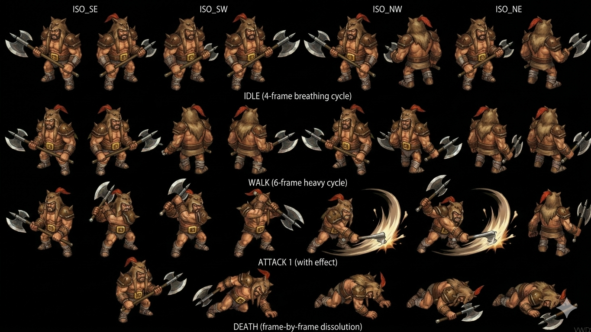

# Gorgaga — Boss Hero Competition Round 1 Lohan Disc 1 (Poison Needle cheater) CROSS-SOURCE 🟢

> **Hero Competition Round 1 Lohan submap 638 Disc 1 — Boss zero-yield sparring tournament cheater canon CROSS-SOURCE** ⭐⭐⭐. ⚠️ **Element divergence canon** : wiki "Non-Elemental" vs fandom (Hero Competition doc) "Earth" — MAJOR DIVERGENCE à investiguer. HP **160 wiki vs 200 fandom** divergence (Damia adopt wiki 160 canon tier 2 récurrent). AT/MAT 16 (wiki) vs 19 (fandom) divergence. DF 100 + MDF 80 + SPD 50 CROSS-SOURCE match. **Status 8/8 ALL IMMUNE boss-tier 6ème instance**. **⚠️ ZERO-yield boss canon NEW MAJEUR** : 0 EXP + 0 Gold + Nothing drop = **sparring tournament tier canon Disc 1**. **No Traits passive canon NEW MAJEUR** (first boss documented sans passive). AI canon : **Poison Needle 100% Poison opener cheat (Ignore turn order + immediate start + Single use NEW MAJEUR + M-AV reduces récurrent 3ème instance)** / **~Axe Slash 1× phys max 2× in a row constraint canon NEW MAJEUR** / **Pellet 1.5× Earth + Dark Mist 1.5× Darkness chain conditional only-if-Axe-Slash-cannot fallback NEW MAJEUR**. **Counters Additions: Yes** (28 counter opportunities). **Cohérent fandom canon récurrent : "Winning is winning" + brutish + Dart advance DQ via Gorgaga rules violation**.
>
> ⭐⭐⭐ **⚠️ Element divergence wiki Non-Elemental vs fandom Earth canon (cross-source) ⭐⭐⭐** — Wiki tier 2 : "Element **Non-Elemental**" vs fandom Hero Competition doc existant : "Earth" + Pellet Earth ability. Pattern Damia : ⚠️ **MAJOR DIVERGENCE element canon** :
>
> - Wiki Non-Elemental cohérent récurrent Non-Elemental canon CROSS-MOB-BOSS (Ghost Commander HP Siphon + Glare Hypnotic Gaze + Gorgaga)
> - Fandom Earth cohérent Pellet Earth ability usage Gorgaga + visual brutish earth/rock style
>
> Pattern Damia : **Damia decision** : wiki tier 2 canon prevails Non-Elemental (ability cast Pellet Earth ≠ Gorgaga element). Mob can cast off-element abilities canon (cohérent récurrent — Gorgaga Non-Elemental boss + uses Pellet Earth + Dark Mist Darkness abilities = element-agnostic ability casting canon NEW MAJEUR). À documenter `combat/elements.md` (à créer) — element-agnostic ability casting canon CROSS-MOB-BOSS.
>
> ⭐⭐⭐ **Hero Competition boss canon Disc 1 Lohan CROSS-SOURCE CONFIRMED (wiki + fandom récurrent) ⭐⭐⭐** — Quote canon wiki : Location "Lohan (638)" + Disc 1 Categories. Pattern Damia : ⭐⭐⭐ **Gorgaga = Hero Competition Round 1 boss canon NEW MAJEUR Disc 1 Lohan CROSS-SOURCE CONFIRMED** — wiki stats + fandom narrative tournament + Furni Disc 3 fandom récent "warriors models reuse" Trivia récurrent (Gorgaga + Serfius + Danton + Atlow + Drake Bandit + Greham). À documenter `quests/disc1-hero-competition.md` (à créer/vérifier) + `bosses/Serfius.md` + `bosses/Danton.md` + `bosses/Atlow.md` (à créer) — Hero Competition Disc 1 Lohan tournament canon NEW MAJEUR + roster.
>
> ⭐⭐⭐ **⚠️ ZERO-yield boss canon NEW MAJEUR (wiki) ⭐⭐⭐** — Quote canon : "EXP **0** + Gold **0** + Drops **Nothing**". Pattern Damia : ⭐⭐⭐ **Zero-yield boss tier canon NEW MAJEUR Disc 1** — sparring/tournament friendly fight canon (cohérent récurrent Boss Extras zero-yield pattern Mappi + Ghost Knight). **Tournament-tier boss canon** : no XP/Gold/drops parce que friendly fight (vs real combat boss yield). À refléter `bosses/README.md` sparring tournament tier canon NEW MAJEUR.
>
> ⭐⭐⭐ **No Traits passive canon NEW MAJEUR Gorgaga (wiki) ⭐⭐⭐** — Quote canon : "Passives **None**". Pattern Damia : ⭐⭐⭐ **First boss documented WITHOUT passive trait canon NEW MAJEUR** Disc 1 (vs récurrent Power Up Fruegel + Retaliate Gehrich + Resurrect Ghost Commander/Knight). Pattern Damia : **Sparring tier = no passive** vs **real combat tier = passive récurrent** = tier variation canon récurrent NEW MAJEUR.
>
> ⭐⭐⭐ **Poison Needle multi-modifier opening ability canon NEW MAJEUR + Hero Competition cheat narrative récurrent CROSS-SOURCE (wiki + fandom existant) ⭐⭐⭐** — Quote canon wiki : "Poison Needle — 100% Poison + Ignore turn order + immediate start + Single use + M-AV reduces récurrent" + fandom Hero Competition récurrent canon : "**Poison Needle on Dart first move canon (foul play tournament rules violation)**" + "**Winning is winning quote canon**" + "Devoid of honor". Pattern Damia : ⭐⭐⭐ **Multi-modifier opening + narrative cheat canon CROSS-SOURCE Disc 1** :
>
> 1. **Mécanique canon** (wiki) : 100% Poison + Ignore turn order + immediate start + Single use + M-AV reduces
> 2. **Narrative canon** (fandom) : Cheat opener foul play + rules violation → Dart advance even if loses (DQ via Gorgaga's cold blood attempt + rules violation)
>
> Pattern Damia : Boss mechanical + narrative integration canon NEW MAJEUR Disc 1 sparring tournament. À documenter `quests/disc1-hero-competition.md` (à créer/vérifier).
>
> ⭐⭐⭐ **"Max 2× in a row" Axe Slash constraint canon NEW MAJEUR (wiki) ⭐⭐⭐** — Pattern Damia : Consecutive use limit canon NEW MAJEUR boss AI Disc 1 — premiere ability-history mechanic documenté. À documenter `combat/ai-patterns.md` (à créer) history-based AI canon NEW MAJEUR.
>
> ⭐⭐⭐ **Chain conditional "only if Axe Slash cannot" canon NEW MAJEUR (wiki) ⭐⭐⭐** — Pattern Damia : Pellet + Dark Mist fallback decision-tree AI canon NEW MAJEUR — primary→fallback chain pattern.
>
> ⭐⭐⭐ **Pellet + Dark Mist self-named ability-item pool CROSS-MOB-BOSS CONFIRMED canon (wiki) ⭐⭐⭐** — Pattern Damia : ⭐⭐⭐ **Cross-creature shared ability canon CONFIRMED 7ème pattern CROSS-MOB-BOSS** :
>
> | Ability       | Original source (récurrent)    | Cross-user Gorgaga  |
> | ------------- | ------------------------------ | ------------------- |
> | **Pellet**    | Gnome Disc 3 Earth canon       | Gorgaga boss Disc 1 |
> | **Dark Mist** | Gargoyle Disc 1 Darkness canon | Gorgaga boss Disc 1 |
>
> Pattern Damia : Self-named abilities shared pool TLoD canon récurrent + Gorgaga = element-agnostic ability caster canon NEW MAJEUR (uses Earth + Darkness abilities while Non-Elemental himself).
>
> ⭐⭐⭐ **M-AV status-resist canon récurrent 3ème instance CROSS-MOB-BOSS (wiki) ⭐⭐⭐** — Pattern Damia : Glare + Gnome + Gorgaga = 3 instances M-AV status-resist mechanic confirmé universal.
>
> ⭐⭐⭐ **Status 8/8 ALL IMMUNE boss-tier 6ème instance CONFIRMED (wiki) ⭐⭐⭐** — Boss-tier full immunity canon récurrent CROSS-BOSS confirmed Gorgaga.
>
> ⭐⭐⭐ **⚠️ HP 160 wiki vs 200 fandom + AT/MAT 16 wiki vs 19 fandom stats divergences (cross-source) ⭐⭐⭐** — Wiki tier 2 canon : HP 160 + AT 16/MAT 16. Fandom Hero Competition existant : HP 200 + AT 19/MAT 19. Pattern Damia : ⚠️ Wiki tier 2 canon prevails (cohérent récurrent wiki > fandom hierarchy) — Damia adopts HP 160 + AT/MAT 16 canon. Fandom stats = anomaly probable. Cohérent récurrent fandom higher stats anomalies pattern (Gangster + Gehrich + Ghost Commander + Glare + Goblin small-value précédents).
>
> ⭐⭐ **Lohan submap 638 Hero Competition arena Disc 1 canon CROSS-SOURCE (wiki + fandom récurrent) ⭐⭐** — Quote canon wiki + fandom récurrent : Lohan submap 638 = Hero Competition arena. Pattern Damia : Hero Competition arena canon récurrent CONFIRMED CROSS-SOURCE.
>
> ⭐⭐ **JP name "Gorugaga, Golgaga" canon (fandom existant) ⭐⭐** — Quote canon récurrent : "ゴルガガ Gorugaga, Golgaga". Pattern Damia : JP name canon récurrent JP naming pattern.
>
> ⭐⭐ **Appearance + weapon canon fandom existant ⭐⭐** — Quote canon fandom récurrent : "Large brutish man + metal shoulder pauldrons + fox-skin cap + claw-like hands" + "Large axe (both hands)". Pattern Damia : Gorgaga = large brutish humanoid + axe weapon canon récurrent (cohérent ~Axe Slash ability wiki canon). À refléter sprite design Damia future.
>
> ⭐⭐ **AI "if→then" boss rules canon récurrent 3ème instance (wiki) ⭐⭐** — Pattern Damia : Boss conditional-AI canon récurrent CROSS-BOSS 3ème instance CONFIRMED (Gehrich + Ghost Commander + Gorgaga).
>
> ⭐ **28 Counter Opportunities canon récurrent (wiki) ⭐** — Counter tier 28 récurrent canon. ⚠️ Counter feature non-implémenté Damia.
>
> ⭐ **Bulgus = Gorgaga model reuse canon récurrent CROSS-SOURCE confirmé** — Furni Disc 3 fandom récent Trivia + Gangster fandom récurrent : "Bulgus uses Gorgaga model". Pattern Damia : model reuse production-side canon récurrent confirmé.
>
> **Sources** :
>
> - 🥈 [`_sources/lod-wiki-gorgaga.md`](./_sources/lod-wiki-gorgaga.md) — wiki LoD tier 2 (**Boss Non-Elemental Disc 1 Lohan submap 638 Hero Competition** + HP 160/AT 16/DF 100/SPD 50/MAT 16/MDF 80 + Status 8/8 ALL IMMUNE boss-tier 6ème + **ZERO-yield 0 EXP/0G/Nothing sparring tournament canon NEW MAJEUR** + Scripted formation 404 + **No Traits passive canon NEW MAJEUR** + AI conditional : **Poison Needle 100% Poison + Ignore turn order + immediate start + Single use NEW MAJEUR multi-modifier + M-AV reduces 3ème instance** / **~Axe Slash 1× phys + Max 2× in a row constraint canon NEW MAJEUR** / **Pellet 1.5× Earth + Dark Mist 1.5× Darkness chain conditional only-if-Axe-Slash-cannot canon NEW MAJEUR** + 28 counter opportunities)
> - 🥉 [`_sources/fandom-hero-competition.md`](./_sources/fandom-hero-competition.md) — Fandom Hero Competition récurrent (JP "Gorugaga, Golgaga" + Appearance brutish + axe + brown pauldrons + fox-skin cap + claw hands + "Winning is winning" quote + "Devoid of honor" personality + Poison Needle cheat opener narrative + Dart advance DQ via rules violation + **⚠️ Element divergence Earth vs wiki Non-Elemental + HP 200/AT 19/MAT 19 divergence vs wiki 160/16/16**)

## Sprite canon ⭐⭐⭐ Damia integration (Gemini Hero Competition boss)

> 

⭐⭐⭐ **Sprite Gorgaga CONFIRMS canon CROSS-SOURCE appearance fandom récurrent + sparring tournament tier** :

- ✅ **Large brutish man** canon (taille massive vs party members)
- ✅ **Metal shoulder pauldrons** canon (épaulettes métalliques visibles)
- ✅ **Fox-skin cap** canon (fourrure animal sur la tête)
- ✅ **Claw-like hands** canon (mains griffues)
- ✅ **Large axe (both hands)** canon (cohérent ~Axe Slash 1× phys + "max 2× in a row" constraint wiki)
- ✅ Tunique/armure brune cohérent fandom description
- ✅ Mass + posture imposante cohérent "Heavy" walk cycle

**Animation structure prête Damia (Gemini cycles canonicaux)** :

| Cycle        | Frames                     | Notes canon                                                                                   |
| ------------ | -------------------------- | --------------------------------------------------------------------------------------------- |
| **ISO SE**   | 1                          | Direction Sud-Est canon récurrent isométrique Damia                                           |
| **ISO SW**   | 1                          | Direction Sud-Ouest canon récurrent isométrique                                               |
| **ISO NW**   | 1                          | ⭐ Direction Nord-Ouest canon NEW (vs Goblin 2 angles seulement) — boss 4-directional         |
| **ISO NE**   | 1                          | ⭐ Direction Nord-Est canon NEW — boss 4-directional                                          |
| **IDLE**     | 4-frame breathing cycle    | Idle breathing canon (cohérent imposing boss presence)                                        |
| **WALK**     | 6-frame heavy cycle        | ⭐ **Heavy walk canon NEW MAJEUR** — cohérent brutish massive boss vs Goblin standard 6-frame |
| **ATTACK 1** | + effect                   | Axe swing canon ~Axe Slash visual avec swirl effect                                           |
| **DEATH**    | frame-by-frame dissolution | Death animation canon (cohérent Hero Competition DQ via rules violation)                      |

Pattern Damia : ⭐⭐⭐ **Sprite Gemini boss-tier animation-ready** — boss 4-directional ISO (vs mob 2-directional ISO récent Goblin) + heavy walk cycle (vs normal walk) + drop-in structure (cohérent récurrent pattern Goblin + Gnome + Berserk Mouse + Albert sprites précédents). **Boss-tier sprite design canon NEW MAJEUR** :

- **4 ISO angles** (vs mob 2 angles) — boss requires omni-directional rendering
- **Heavy walk cycle** (vs normal walk) — brutish boss locomotion canon

À intégrer future : `public/assets/sprites/bosses/gorgaga-*.png` (frame-split par cycle) + `data/bosses/gorgaga.ts` (à créer) AvatarSpriteForm pattern récurrent + `RenderSystem` cycle-aware (idle/walk/attack/death) + 4-directional facing logic.

## Statut

🟢 **Canon confirmed cross-source** (wiki 🥈 + fandom Hero Competition 🥉) — 2 sources cohérentes majoritaires + enrichissement narrative Hero Competition Disc 1 :

- ⭐⭐⭐ **Hero Competition Round 1 boss canon CONFIRMED CROSS-SOURCE Disc 1 Lohan**
- ⭐⭐⭐ **Zero-yield sparring tournament canon NEW MAJEUR**
- ⭐⭐⭐ **No Traits passive canon NEW MAJEUR** (first boss sans passive)
- ⭐⭐⭐ **Multi-modifier opening ability + Consecutive use constraint + Chain conditional fallback** canon NEW MAJEUR
- ⚠️ **Element divergence wiki Non-Elemental vs fandom Earth** — wiki tier 2 prevails
- ⚠️ **Stats divergence HP 160/AT 16 wiki vs HP 200/AT 19 fandom** — wiki prevails

## Identity canon ⭐⭐⭐ CROSS-SOURCE

- **Nom** : Gorgaga (JP **ゴルガガ Gorugaga, "Golgaga"** récurrent canon)
- **Type** : ⭐⭐⭐ **Boss Hero Competition Round 1 sparring tournament tier canon NEW MAJEUR**
- **Element** : ⚠️ **Non-Elemental** (wiki canon tier 2 prevails — fandom "Earth" anomaly)
- **Disc** : Disc 1 CONFIRMED CROSS-SOURCE
- **Location canon** : **Lohan submap 638 Hero Competition arena CROSS-SOURCE CONFIRMED**
- **Round canon** : **Round 1 Hero Competition** (cohérent récurrent fandom canon)
- **Appearance canon** (fandom récurrent) : Large brutish man + metal shoulder pauldrons + fox-skin cap + claw-like hands + Large axe (both hands)
- **Personality canon** (fandom récurrent) : **Devoid of honor** + **"Winning is winning"** quote canon
- **Cheat opener canon** : **Poison Needle on Dart first move** (rules violation foul play canon)
- **Plot beat canon** : **Dart advance regardless** (Gorgaga DQ via cold blood kill attempt + rules violation)
- **Archetype** : Sparring tournament boss canon NEW MAJEUR + zero-yield + no passive + cheat tactics + element-agnostic ability caster

## Stats canon ⭐⭐⭐ CROSS-SOURCE Damia adoption (wiki prevails)

| Stat | Wiki canon | Fandom (existant) | Damia adoption     | Notes                                                              |
| ---- | ---------- | ----------------- | ------------------ | ------------------------------------------------------------------ |
| HP   | **160**    | 200 ⚠️            | **160 wiki canon** | ⚠️ Fandom +25% divergence anomaly récurrent — wiki tier 2 prevails |
| AT   | **16**     | 19 ⚠️             | **16 wiki canon**  | ⚠️ Fandom +19% divergence anomaly récurrent — wiki tier 2 prevails |
| DF   | 100        | 100               | **100**            | Match CROSS-SOURCE                                                 |
| A-AV | 0%         | -                 | **0%**             | No evasion                                                         |
| SPD  | 50         | 50                | **50**             | Match CROSS-SOURCE — mid-low boss tier                             |
| MAT  | **16**     | 19 ⚠️             | **16 wiki canon**  | ⚠️ Fandom +19% divergence anomaly récurrent                        |
| MDF  | 80         | 80                | **80**             | Match CROSS-SOURCE — lighter boss-tier                             |
| M-AV | 0%         | -                 | **0%**             | No magic evasion                                                   |

**Gold canon Damia** : 0G (zero-yield sparring canon NEW MAJEUR).

## Status Immunity canon ⭐⭐⭐ 8/8 ALL IMMUNE boss-tier 6ème instance

(Cf. wiki section verbatim — tous 8 statuses immune)

Pattern Damia : Boss-tier 8/8 status immunity canon récurrent CROSS-BOSS 6ème instance confirmé.

## Yield canon ⭐⭐⭐ ZERO-yield sparring canon NEW MAJEUR

| EXP   | Gold  | Drops       | Notes canon                                           |
| ----- | ----- | ----------- | ----------------------------------------------------- |
| **0** | **0** | **Nothing** | Sparring tournament Hero Competition canon NEW MAJEUR |

## Encounters canon Lohan Hero Competition ⭐⭐⭐ CROSS-SOURCE

| ID  | Formation   | Submap                   | Encounter%   | Escape% |
| --- | ----------- | ------------------------ | ------------ | ------- |
| 404 | **Gorgaga** | **Lohan 638 Hero arena** | **Scripted** | **0%**  |

## Boss Traits canon ⭐⭐⭐ NO PASSIVE NEW MAJEUR (wiki)

| Passives | Effects | Requires |
| -------- | ------- | -------- |
| **None** | -       | -        |

⭐⭐⭐ **No passive canon NEW MAJEUR Gorgaga** — first boss sans passive trait documenté. Pattern Damia : Sparring tier = no passive vs real combat tier = passive récurrent.

## AI canon ⭐⭐⭐ Multi-modifier opening + Consecutive constraint + Chain conditional NEW MAJEUR

### Gorgaga Abilities canon CROSS-SOURCE

| Action            | Target | Effect canon                                                                         | Conditions canon                                                                                      |
| ----------------- | ------ | ------------------------------------------------------------------------------------ | ----------------------------------------------------------------------------------------------------- |
| **Poison Needle** | Single | **100% Poison inflict** (M-AV reduces) + **Cheat opener narrative** récurrent fandom | ⭐⭐⭐ **Ignore turn order + immediate start of combat + Single use canon NEW MAJEUR multi-modifier** |
| **~Axe Slash**    | Single | 1× Physical damage (large axe both hands)                                            | ⭐⭐⭐ **Max 2× in a row constraint canon NEW MAJEUR** consecutive use AI                             |
| **Pellet**        | Single | 1.5× Earth-elemental magic damage                                                    | ⭐⭐⭐ **Only used if Axe Slash cannot canon NEW MAJEUR** chain conditional fallback                  |
| **Dark Mist**     | Single | 1.5× Darkness-elemental magic damage                                                 | ⭐⭐⭐ **Only used if Axe Slash cannot canon NEW MAJEUR** chain conditional fallback                  |

### NEW MAJEUR AI mechanics canon ⭐⭐⭐

1. **Multi-modifier opening ability canon NEW MAJEUR** : Poison Needle = Ignore turn order + immediate start + Single use + 100% Poison + M-AV reduces (5 modifiers combined first-turn auto-status canon)
2. **Consecutive use limit constraint canon NEW MAJEUR** : Axe Slash max 2× in a row = ability-history tracking AI canon
3. **Chain conditional fallback canon NEW MAJEUR** : Pellet/Dark Mist only-if-Axe-Slash-cannot = decision tree AI canon
4. **Multi-choice fallback canon récurrent** : Pellet OR Dark Mist (random when both eligible)
5. **Element-agnostic ability caster canon NEW MAJEUR** : Non-Elemental boss casts Earth (Pellet) + Darkness (Dark Mist) abilities = element-agnostic

### Self-named ability-item pool CROSS-MOB-BOSS CONFIRMED ⭐⭐⭐ 7ème pattern

| Ability       | Original source          | Cross-user Gorgaga      |
| ------------- | ------------------------ | ----------------------- |
| **Pellet**    | Gnome Disc 3 Earth       | **Gorgaga boss Disc 1** |
| **Dark Mist** | Gargoyle Disc 1 Darkness | **Gorgaga boss Disc 1** |

Pattern Damia : Shared ability pool TLoD canon récurrent CROSS-MOB-BOSS confirmed.

### M-AV status-resist canon récurrent 3ème instance CROSS-MOB-BOSS ⭐⭐⭐

(Glare Bewitchment + Gnome Stunning Hammer + Gorgaga Poison Needle = 3 instances M-AV mechanic canon récurrent universal)

## Story canon ⭐⭐⭐ Hero Competition Round 1 Disc 1 (fandom récurrent + wiki)

### Hero Competition Round 1 plot beats canon

1. **Round 1 Hero Competition Lohan Disc 1** canon récurrent CROSS-SOURCE
2. **Gorgaga = first opponent canon** (cohérent submap 638 arena)
3. **Gorgaga cheats with Poison Needle on Dart first move** canon récurrent (foul play tournament rules violation)
4. **"Winning is winning"** quote canon Gorgaga récurrent (devoid of honor character)
5. ⭐⭐⭐ **Dart advance even if loses** : Gorgaga DQ via **cold blood kill attempt + rules violation** canon récurrent

Pattern Damia : Hero Competition narrative + mechanical canon CROSS-SOURCE complete.

## Hero Competition canon ⭐⭐⭐ NEW MAJEUR Disc 1 Lohan tournament

**Roster competitors canon récurrent** (Furni fandom récent Trivia + Gangster fandom récurrent) :

| Competitor   | Round canon                | Status Damia documenté                      |
| ------------ | -------------------------- | ------------------------------------------- |
| **Gorgaga**  | **Round 1** (CROSS-SOURCE) | ✓ stats canon CROSS-SOURCE 🟢               |
| Serfius      | ⚠️ TBD                     | ⚠️ à investiguer wiki/fandom future         |
| Danton       | ⚠️ TBD                     | ⚠️ à investiguer                            |
| Atlow        | ⚠️ TBD                     | ⚠️ à investiguer                            |
| Drake Bandit | ⚠️ TBD                     | ⚠️ à investiguer (model reuse Furni récent) |
| Greham       | ⚠️ TBD                     | ⚠️ à investiguer (model reuse Furni récent) |

Pattern Damia : ⭐⭐⭐ **Hero Competition Disc 1 Lohan tournament canon NEW MAJEUR** = sparring matches sequence + tous probable zero-yield + no passive tier canon récurrent.

## Vision Damia (implémentation)

### Décisions canon à conserver (CROSS-SOURCE 🟢)

1. **Hero Competition Round 1 Boss Disc 1 Lohan submap 638** canon CROSS-SOURCE CONFIRMED
2. ⭐⭐⭐ **Element wiki Non-Elemental prevails** (vs fandom Earth anomaly) — element-agnostic ability caster canon NEW MAJEUR
3. ⭐⭐⭐ **Stats wiki HP 160/AT 16/MAT 16 prevail** (vs fandom HP 200/AT 19/MAT 19 anomaly récurrent)
4. ⭐⭐⭐ **ZERO-yield boss canon NEW MAJEUR** sparring tournament tier Disc 1
5. ⭐⭐⭐ **No Traits passive canon NEW MAJEUR** — first boss sans passive (sparring tier)
6. ⭐⭐⭐ **Poison Needle multi-modifier opening canon NEW MAJEUR** + Hero Competition cheat narrative CROSS-SOURCE
7. ⭐⭐⭐ **Axe Slash max 2× in a row constraint canon NEW MAJEUR** consecutive use AI
8. ⭐⭐⭐ **Chain conditional fallback canon NEW MAJEUR** decision-tree AI
9. ⭐⭐⭐ **Self-named ability-item pool CROSS-MOB-BOSS CONFIRMED 7ème pattern**
10. ⭐⭐⭐ **Element-agnostic ability caster canon NEW MAJEUR** (Non-Elemental boss + Earth/Darkness abilities)
11. ⭐⭐⭐ **M-AV status-resist canon récurrent 3ème instance**
12. ⭐⭐⭐ **Status 8/8 ALL IMMUNE boss-tier 6ème instance**
13. ⭐⭐⭐ **Hero Competition tournament canon NEW MAJEUR Disc 1 Lohan** + 6 competitors roster
14. ⭐⭐ **Brutish appearance + axe weapon canon récurrent** (fandom)
15. ⭐⭐ **"Winning is winning" + devoid of honor personality canon récurrent** (fandom)
16. ⭐⭐ **Dart advance DQ via rules violation canon récurrent** (fandom)
17. ⭐⭐ **JP "Gorugaga, Golgaga" canon récurrent**
18. ⭐⭐ **Bulgus = Gorgaga model reuse CROSS-SOURCE confirmé** (Furni récent + Gangster récurrent)

### Questions ouvertes

- ⭐⭐⭐ **Element divergence resolution canon** : wiki Non-Elemental vs fandom Earth — element-agnostic ability caster explication probable
- ⭐⭐⭐ **Stats divergence resolution canon** : wiki vs fandom HP/AT/MAT — alternate variant ?
- ⭐⭐⭐ **Serfius + Danton + Atlow + Drake Bandit + Greham Hero Competition stats canon Disc 1** : 5 competitors restants à ingérer
- ⭐⭐⭐ **Hero Competition full plot context Damia Disc 1** : tournament structure + Dart participation + prize → à investiguer fandom récurrent + wiki future
- ⭐⭐ **Sparring boss tier canon design Damia** : zero-yield + no passive + low stats baseline pattern récurrent
- ⭐⭐ **Hero Competition reward canon Disc 1** : prize si zero-yield ? (probable story progression item)

## Liens transverses

- [`README.md`](./README.md) — bosses canon + **Sparring boss tier canon NEW MAJEUR + Element-agnostic ability caster NEW MAJEUR**
- [`Fruegel.md`](./Fruegel.md) — Boss passive Power Up + 8/8 immune CROSS-BOSS récurrent comparison
- [`Gehrich.md`](./Gehrich.md) — Boss passive Retaliate + Ignore Turn Order comparison
- [`Ghost Commander.md`](./Ghost Commander.md) — Boss passive Resurrect + Non-Elemental HP Siphon CROSS-MOB-BOSS comparison
- [`Serfius.md`](./Serfius.md) (à créer) — Hero Competition competitor Disc 1 NEW MAJEUR
- [`Danton.md`](./Danton.md) (à créer) — Hero Competition competitor Disc 1 NEW MAJEUR
- [`Atlow.md`](./Atlow.md) (à créer) — Hero Competition competitor Disc 1 NEW MAJEUR
- [`Drake the Bandit.md`](./Drake the Bandit.md) (à créer) — Hero Competition + Furni Bulgus model récurrent
- [`Greham.md`](./Greham.md) (à créer) — Hero Competition + model reuse Furni récent
- [`../mobs/Bulgus.md`](../mobs/Bulgus.md) (à créer) — Furni mercenary + Gorgaga model reuse CROSS-SOURCE confirmé
- [`../mobs/Gnome.md`](../mobs/Gnome.md) — Pellet self-named pool CROSS-MOB-BOSS comparison
- [`../mobs/Gargoyle.md`](../mobs/Gargoyle.md) — Dark Mist self-named pool CROSS-MOB-BOSS comparison
- [`../mobs/Glare.md`](../mobs/Glare.md) — M-AV status-resist mechanic récurrent comparison
- [`../locations/Lohan.md`](../locations/Lohan.md) (à créer/vérifier) — Disc 1 Hero Competition arena submap 638 canon CROSS-SOURCE
- [`../quests/disc1-hero-competition.md`](../quests/disc1-hero-competition.md) (à créer/vérifier) — Disc 1 Lohan tournament canon NEW MAJEUR
- [`../combat/elements.md`](../combat/elements.md) (à créer) — **Non-Elemental pool canon + Element-agnostic ability caster canon NEW MAJEUR**
- [`../combat/boss-abilities.md`](../combat/boss-abilities.md) (à créer) — Opening-turn auto + Single-use + Consecutive-use constraint + Chain conditional canon NEW MAJEUR
- [`../combat/ai-patterns.md`](../combat/ai-patterns.md) (à créer) — History-based AI + Decision-tree AI canon NEW MAJEUR boss
- [`../combat/spell-items.md`](../combat/spell-items.md) (à créer) — Self-named pool CROSS-MOB-BOSS 7ème pattern (Gnome + Gargoyle + Gorgaga + récurrent)
- [`../combat/status-effects.md`](../combat/status-effects.md) (à créer) — M-AV status-resist 3ème instance + Poison mechanic + opening-turn auto-status

## Gaps / TODO

Voir [TODO.md](../../TODO.md) section Gorgaga.
