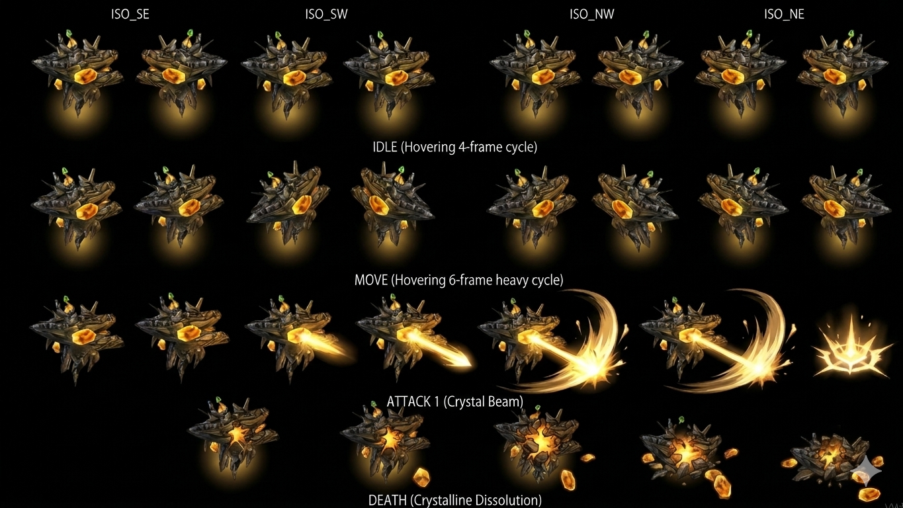

# Grand Jewel — Boss Earth Kadessa Disc 3 (HP 4500) Dragon Block Staff wielder

> **Earth Boss Disc 3 Kadessa submap 402 Forbidden Land canon NEW MAJEUR** ⭐⭐⭐. HP **4500 highest récent boss canon** (vs Gehrich 2000/Ghost Commander 1700) + AT 41 + DF 100 + SPD 70 + **MAT 58 + MDF 160 highest récent magic-tank canon** + A-AV/M-AV 0%. **Status 8/8 ALL IMMUNE boss-tier 7ème instance**. **Yield 9000 EXP highest récent + 300G (Damia ÷3 = 100G) + Spectral Flash 100% drop guaranteed canon NEW MAJEUR**. **⚠️ Counter Opportunities 0 = first boss canon NEW MAJEUR** anti-Counter design. **No Traits passive canon** (cohérent Gorgaga récent — non-passive boss tier). **AI massive arsenal canon NEW MAJEUR Disc 3** : **Spinning Gale 1.8× Wind single + Rave Twister 1.5× Wind party AoE NEW MAJEUR + Pellet 1.5× Earth single (self-named pool récurrent) + Meteor Fall 1× Earth party AoE NEW MAJEUR + Trans Light 2.25× Light single (self-named pool récurrent + highest single multiplier récent) + Spectral Flash 3× Light party AoE (self-named pool + highest party multiplier récent) + Dragon Block Staff Dragoon debuff 0.1× dealt + 10× received 3 turns canon NEW MAJEUR + Level goes down/up mechanic canon NEW MAJEUR + Heal Self 30% (1350) HP Auto HP≤20% Single use NEW MAJEUR**. **Counters Additions: No** (Counter feature non-implémenté Damia).
>
> ⭐⭐⭐ **Grand Jewel = Dragon Block Staff wielder canon CROSS-SOURCE CONFIRMED Disc 3 Kadessa (wiki + Gnome fandom récurrent) ⭐⭐⭐** — Quote canon wiki : "**Dragon Block Staff** : Dragoons gain 0.1× Damage Dealt + 10× Damage Received for 3 Turns. Only used when a Dragoon is in battle. Auto". Cross-source Gnome fandom récurrent : "Creatures here might be **drawn towards the energy of the Dragon Block Staff**". Pattern Damia : ⭐⭐⭐ **Grand Jewel = Dragon Block Staff wielder/guardian canon NEW MAJEUR Disc 3 Kadessa** — boss possesses + uses anti-Dragoon plot artifact canon CROSS-SOURCE CONFIRMED (cohérent Gnome canon Kadessa creatures drawn to Dragon Block Staff energy récent). Dragon Block Staff = boss ability + plot artifact canon Disc 3 antagonist canon NEW MAJEUR. À documenter `items/Dragon Block Staff.md` (à créer) + `combat/boss-abilities.md` (à créer) Dragon Block Staff Dragoon-debuff ability canon NEW MAJEUR.
>
> ⭐⭐⭐ **Dragon Block Staff Dragoon-debuff anti-Dragoon mechanic canon NEW MAJEUR (wiki) ⭐⭐⭐** — Quote canon : "Dragoons gain **0.1× Damage Dealt + 10× Damage Received for 3 Turns**. Only used when a Dragoon is in battle. Auto". Pattern Damia : ⭐⭐⭐ **Anti-Dragoon debuff canon NEW MAJEUR Disc 3** :
>
> 1. **0.1× Damage Dealt** = -90% damage output Dragoons
> 2. **10× Damage Received** = 1000% damage received Dragoons
> 3. **3 turns duration** canon
> 4. **Auto trigger when Dragoon in battle** canon
> 5. **Anti-Dragoon class-specific debuff** canon NEW MAJEUR — first ability that targets Dragoon class specifically
>
> Pattern Damia : Dragoon-counter design canon NEW MAJEUR Disc 3 antagonist arc (cohérent Forbidden Land Wingly territory canon récurrent + Dragon Block Staff anti-Dragoon device hypothesis confirmé via boss usage). À documenter `combat/boss-abilities.md` (à créer) + `items/Dragon Block Staff.md` (à créer) canon NEW MAJEUR.
>
> ⭐⭐⭐ **Level goes down/up mechanic canon NEW MAJEUR Grand Jewel (wiki) ⭐⭐⭐** — Quote canon : "**Level goes down!** : Decrease Level by 5 + ignore turn order + random magic attack" + "**Level goes up!** : Increase Level by 5 + ignore turn order + random magic attack. Must be enabled by using Level goes down! 3 times". Pattern Damia : ⭐⭐⭐ **Level manipulation boss mechanic canon NEW MAJEUR Disc 3** :
>
> 1. **Level goes down -5 canon** (requires Level >10 to apply)
> 2. **Level goes up +5 canon** (must be enabled by 3× Level goes down first)
> 3. **Both ignore turn order + random magic chain canon**
> 4. **Level changes affect only damage calc using Level variable** (not stats)
> 5. **Level changes revert after battle** (non-permanent)
> 6. **Character level can increase beyond match start** (Level goes up no cap)
>
> Pattern Damia : Level manipulation boss canon NEW MAJEUR — first boss ability manipulating party Level stat. Unique design Disc 3 Grand Jewel canon. À documenter `combat/boss-abilities.md` (à créer) Level manipulation canon NEW MAJEUR.
>
> ⭐⭐⭐ **Counter Opportunities 0 first boss canon NEW MAJEUR (wiki) ⭐⭐⭐** — Quote canon : "Counter Opportunities (**0**)" + "Counters Additions: **No**". Pattern Damia : ⭐⭐⭐ **First boss documented WITHOUT counter opportunities canon NEW MAJEUR Disc 3** (vs récurrent 28 tier universal CROSS-MOB-BOSS confirmed précédent). **Anti-Counter boss design canon NEW MAJEUR** — Grand Jewel = no Counter strategy possible canon Disc 3. Pattern Damia : Counter-immune boss tier canon NEW (vs counter-tier universal récurrent).
>
> ⭐⭐⭐ **HP 4500 highest récent boss + 9000 EXP highest récent canon Disc 3 (wiki) ⭐⭐⭐** — HP 4500 = highest boss HP récent documenté (vs Fruegel + Gehrich 2000 Disc 1-2 + Ghost Commander 1700/2500 JP Disc 2 + Gorgaga 160 Disc 1 sparring). Pattern Damia : Grand Jewel = peak HP boss canon Disc 3 + 9000 EXP highest yield = late-Disc 3 climactic boss canon. Cohérent Kadessa Forbidden Land Wingly territory + Dragon Block Staff plot artifact wielder = major Disc 3 antagonist canon.
>
> ⭐⭐⭐ **Spectral Flash 100% drop NEW item canon Disc 3 (wiki) ⭐⭐⭐** — Quote canon : "Drops **Spectral Flash 100%**". Pattern Damia : ⭐ **Spectral Flash = NEW item canon Disc 3** thématique Light-spectral (cohérent Light element ability Spectral Flash 3× party AoE). 100% drop = guaranteed boss drop canon (cohérent Night Raid Ghost Commander récent guaranteed drop pattern). **Self-named ability-item pool canon récurrent** : Spectral Flash ability = Spectral Flash item drop = same name canon (cohérent récurrent pool Pellet/Trans Light/Dark Mist/Fatal Blizzard/Sun Rhapsody + **Spectral Flash NEW 7ème instance pool**). À documenter `items/Spectral Flash.md` (à créer) — Disc 3 Light Spell Item canon NEW MAJEUR.
>
> ⭐⭐⭐ **Self-named ability-item pool canon CROSS-MOB-BOSS 8ème pattern documenté Grand Jewel (wiki) ⭐⭐⭐** — Pattern Damia : **Self-named ability-item shared pool canon récurrent CONFIRMED 8 instances** :
>
> | Self-named ability | Mob/Boss user                 | Item drop name |
> | ------------------ | ----------------------------- | -------------- |
> | Fatal Blizzard     | (récurrent canon)             | Fatal Blizzard |
> | Pellet             | Gnome + Gorgaga + Grand Jewel | Pellet         |
> | Sun Rhapsody       | (récurrent canon)             | Sun Rhapsody   |
> | Trans Light        | Grand Jewel + récurrent       | Trans Light    |
> | Dark Mist          | Gargoyle + Gorgaga            | Dark Mist      |
> | **Spectral Flash** | **Grand Jewel NEW** Disc 3    | Spectral Flash |
>
> Pattern Damia : Cross-creature shared ability pool TLoD canon récurrent CONFIRMED Grand Jewel 8ème pattern (Trans Light + Pellet + Spectral Flash = 3 self-named abilities used by Grand Jewel boss).
>
> ⭐⭐⭐ **Party-target AoE abilities canon NEW MAJEUR Disc 3 Grand Jewel (wiki) ⭐⭐⭐** — Pattern Damia : ⭐⭐⭐ **5 AoE party-target abilities canon NEW MAJEUR Disc 3** (vs récurrent single-target boss abilities récurrent) :
>
> 1. **Rave Twister** 1.5× Wind party
> 2. **Meteor Fall** 1× Earth party
> 3. **Spectral Flash** 3× Light party (highest multiplier party canon récent)
> 4. **Dragon Block Staff** Dragoon-debuff party
> 5. **Level goes down/up** party (Level manipulation party)
>
> Pattern Damia : Grand Jewel = AoE-heavy boss canon NEW MAJEUR Disc 3 (peak threat tier — AoE force party-wide healing strategy). À documenter `combat/boss-abilities.md` (à créer).
>
> ⭐⭐⭐ **Element-agnostic ability caster canon récurrent CROSS-BOSS confirmed Grand Jewel (wiki) ⭐⭐⭐** — Grand Jewel Element = **Earth** mais casts abilities **Wind (Spinning Gale + Rave Twister) + Earth (Pellet + Meteor Fall) + Light (Trans Light + Spectral Flash)** = 3 different elements. Pattern Damia : **Element-agnostic ability caster canon récurrent CONFIRMED 2ème instance** (cohérent Gorgaga récent Non-Elemental boss casting Earth Pellet + Darkness Dark Mist). À documenter `combat/elements.md` (à créer) element-agnostic ability casting canon récurrent CROSS-BOSS.
>
> ⭐⭐⭐ **Heal Self 30% (1350) HP + Auto + HP threshold canon NEW MAJEUR (wiki) ⭐⭐⭐** — Quote canon : "**~Heal Self** : Recover **30% (1350) HP**. Single use. Auto. HP ≤20%". Pattern Damia : ⭐⭐⭐ **Boss self-heal canon NEW MAJEUR Disc 3** :
>
> 1. **30% HP recovery canon** (1350 HP = 30% × 4500 HP)
> 2. **Single use canon récurrent** (cohérent Gorgaga Poison Needle Single use récent)
> 3. **Auto trigger** canon
> 4. **HP ≤20% threshold trigger** canon — emergency self-heal mechanic
>
> Pattern Damia : Emergency self-heal boss tier canon NEW MAJEUR Disc 3 (vs récurrent Resurrect passive Ghost Commander). Cohérent récurrent boss survival mechanic canon. À documenter `combat/boss-abilities.md` (à créer) emergency self-heal canon NEW MAJEUR.
>
> ⭐⭐⭐ **3× Light party multiplier highest récent canon + 2.25× Light single highest récent (wiki) ⭐⭐⭐** — Quote canon : "Spectral Flash : 3× Light party" + "Trans Light : 2.25× Light single". Pattern Damia : ⭐ **Highest damage multipliers récent canon Disc 3** :
>
> - Spectral Flash **3× party** = highest party multiplier récent boss (vs 1× / 1.5× / 2× récurrent)
> - Trans Light **2.25× single** = highest single multiplier récent boss
> - Light element peak damage canon Disc 3 — late-game scaling
>
> Pattern Damia : Disc 3 peak damage multipliers canon Grand Jewel late-game boss tier.
>
> ⭐⭐⭐ **MDF 160 highest récent magic-tank canon Grand Jewel (wiki) ⭐⭐⭐** — MDF 160 = highest magic defense récent documenté (cohérent Gargoyle Disc 1 MDF 160 + Glare MDF 120 + Grand Jewel = magic-tank archetype canon Disc 3). Pattern Damia : Grand Jewel = peak magic-tank boss canon Disc 3 — defensive against magic strategy.
>
> ⭐⭐⭐ **No Traits passive canon Grand Jewel (wiki) ⭐⭐⭐** — Quote canon : "Passives **None**". Pattern Damia : ⭐ **2ème boss documenté sans passive trait** (cohérent Gorgaga récent No Traits canon). Pattern Damia : ⭐⭐⭐ **Sub-class boss canon récurrent CONFIRMED 2ème instance** — no passive but rich active AI vs récurrent passive bosses (Fruegel Power Up + Gehrich Retaliate + Ghost Commander Resurrect). Grand Jewel + Gorgaga = "no-passive boss tier" canon récurrent.
>
> ⭐⭐⭐ **Status 8/8 ALL IMMUNE boss-tier 7ème instance CONFIRMED (wiki) ⭐⭐⭐** — Pattern Damia : Boss-tier full immunity canon récurrent CROSS-BOSS 7ème instance confirmé (Fruegel + Gehrich + Ghost Commander + Ghost Knight + Gorgaga + Grand Jewel + autres récurrent).
>
> ⭐⭐⭐ **Kadessa submap 402 boss arena Disc 3 canon CROSS-SOURCE (wiki + Gnome récurrent) ⭐⭐⭐** — Quote canon wiki : "Kadessa (402)" + Disc 3 Categories. Cross-source Gnome wiki/fandom récurrent : Kadessa submaps 393-405 = Forbidden Land Disc 3 (submap 402 = Gnome formation 146 mob area also). Pattern Damia : ⭐ **Kadessa Forbidden Land Disc 3 boss arena canon CROSS-SOURCE CONFIRMED** — Grand Jewel = Kadessa main boss canon NEW MAJEUR Disc 3 + Dragon Block Staff wielder canon. À documenter `locations/Kadessa.md` (à créer) — Forbidden Land Wingly territory + Grand Jewel boss arena canon NEW MAJEUR.
>
> ⭐⭐ **AI "if→then" boss rules canon récurrent 4ème instance Grand Jewel (wiki) ⭐⭐** — Pattern Damia : Boss conditional-AI canon récurrent CROSS-BOSS 4ème instance CONFIRMED (Gehrich + Ghost Commander + Gorgaga + Grand Jewel).
>
> ⭐⭐ **HP threshold ≤20% emergency canon + Auto trigger récurrent + Single use canon récurrent Grand Jewel (wiki) ⭐⭐** — Pattern Damia : HP-threshold trigger canon récurrent CROSS-BOSS (cohérent récurrent Resurrect Ghost Commander 0% HP + Spell caster archetype ≤25% red HP Glare/Gnome + Heal Self ≤20% Grand Jewel). HP thresholds canon récurrent boss design. + Single use canon récurrent (cohérent Gorgaga Poison Needle + Grand Jewel Heal Self).
>
> **Sources** :
>
> - 🥈 [`_sources/lod-wiki-grand-jewel.md`](./_sources/lod-wiki-grand-jewel.md) — wiki LoD tier 2 (**Boss Earth Disc 3 Kadessa submap 402 Forbidden Land** + HP 4500 highest récent + AT 41/DF 100/SPD 70/MAT 58/**MDF 160 highest récent magic-tank** + Status 8/8 ALL IMMUNE boss-tier 7ème + Yield 9000 EXP highest récent/300G/**Spectral Flash 100% drop NEW item canon Disc 3 self-named pool 8ème pattern** + Scripted formation 416 + **No Traits passive 2ème boss sans passive canon récurrent Gorgaga** + **⚠️ Counter Opportunities 0 first boss canon NEW MAJEUR anti-Counter** + AI massive arsenal NEW MAJEUR Disc 3 : Spinning Gale 1.8× Wind single + Rave Twister 1.5× Wind party AoE + Pellet 1.5× Earth single + Meteor Fall 1× Earth party AoE + Trans Light 2.25× Light single highest récent + Spectral Flash 3× Light party highest récent + **Dragon Block Staff Dragoon-debuff anti-Dragoon canon NEW MAJEUR (0.1× dealt + 10× received 3 turns)** + **Level goes down/up Level manipulation canon NEW MAJEUR (5 decrease/3× trigger increase 5)** + **Heal Self 30%(1350) HP Auto HP≤20% Single use canon NEW MAJEUR**)

## Sprite canon ⭐⭐⭐ Damia integration (Gemini boss-tier crystalline hovering entity)

> 

⭐⭐⭐ **Sprite Grand Jewel CONFIRMS canon NEW MAJEUR** — crystalline gem hovering entity boss Disc 3 :

- ✅ **Grand Jewel literal canon** — large gem/crystal centerpiece + golden spikes radiating (gemme cristalline géométrique)
- ✅ **Earth element thématique** cohérent (gem/crystal = mineral/rock theme)
- ✅ **Floating/hovering creature** canon NEW MAJEUR (vs walking creatures récurrent — gem entity flotte)
- ✅ Orange/amber luminous core + radiant halo cohérent **Light element abilities** (Trans Light + Spectral Flash 3× Light party + halo visual)
- ✅ Geometric crystalline form cohérent **Crystal Beam attack visual** canon
- ✅ Boss-tier 4-directional ISO angles canon (cohérent Gorgaga récent boss-tier pattern)

**Animation structure prête Damia (Gemini cycles canonicaux boss-tier)** :

| Cycle        | Frames                                     | Notes canon                                                                                                                                                           |
| ------------ | ------------------------------------------ | --------------------------------------------------------------------------------------------------------------------------------------------------------------------- |
| **ISO SE**   | 1                                          | Direction Sud-Est canon récurrent isométrique Damia                                                                                                                   |
| **ISO SW**   | 1                                          | Direction Sud-Ouest canon récurrent isométrique                                                                                                                       |
| **ISO NW**   | 1                                          | Direction Nord-Ouest canon (boss-tier 4-directional)                                                                                                                  |
| **ISO NE**   | 1                                          | Direction Nord-Est canon (boss-tier 4-directional)                                                                                                                    |
| **IDLE**     | 4-frame **Hovering cycle**                 | ⭐⭐⭐ **Hovering idle canon NEW MAJEUR** — gem entity floats (vs Gorgaga breathing/Goblin walking)                                                                   |
| **MOVE**     | 6-frame **Hovering heavy cycle**           | ⭐⭐⭐ **Hovering MOVE canon NEW MAJEUR** — boss flotte avec mouvement massif (cohérent heavy boss-tier locomotion + sprite labelé "MOVE" pas "WALK")                 |
| **ATTACK 1** | **Crystal Beam** with effect               | ⭐⭐⭐ **Crystal Beam visual canon NEW MAJEUR** — cohérent abilities magic Light/Wind/Earth beam attacks (Spinning Gale + Trans Light + Spectral Flash + Meteor Fall) |
| **DEATH**    | frame-by-frame **Crystalline Dissolution** | ⭐⭐⭐ **Crystalline Dissolution death canon NEW MAJEUR** — gemme se brise/dissout (cohérent crystalline gem identity)                                                |

Pattern Damia : ⭐⭐⭐ **Sprite Gemini boss-tier hovering canon NEW MAJEUR** — distinction additionnelle vs Gorgaga walking boss :

| Tier                            | ISO angles          | Locomotion cycle                                 |
| ------------------------------- | ------------------- | ------------------------------------------------ |
| Mob (Goblin)                    | 2 (SE+SW)           | 6-frame normal walk                              |
| Boss walking (Gorgaga)          | 4 (SE+SW+NW+NE)     | 6-frame heavy walk                               |
| **Boss hovering (Grand Jewel)** | **4 (SE+SW+NW+NE)** | **6-frame heavy HOVER (MOVE labelé)** ⭐⭐⭐ NEW |

Pattern Damia : **Hovering entity sub-class canon NEW MAJEUR** — boss flottants distincts walking (gem/crystal/spirit entities probable récurrent canon future).

À intégrer future : `public/assets/sprites/bosses/grand-jewel-*.png` (frame-split par cycle) + `data/bosses/grand-jewel.ts` (à créer) AvatarSpriteForm pattern récurrent + `RenderSystem` cycle-aware (idle/move-hovering/attack/death) + 4-directional facing logic + Crystal Beam particle effect.

## Statut

🟡 **Canon documenté wiki tier 2 uniquement** — fandom à ingérer future (Story complet + Kadessa lore + Dragon Block Staff plot context + Grand Jewel character backstory).

## Identity canon ⭐⭐⭐

- **Nom** : Grand Jewel
- **Type** : **Boss MAJEUR Disc 3 Kadessa Forbidden Land canon NEW MAJEUR**
- **Element** : Earth (cohérent récurrent Earth pool Disc 1-3 majoritaire + element-agnostic ability caster récurrent)
- **Disc** : Disc 3 CONFIRMED (wiki Categories)
- **Location canon** : **Kadessa submap 402 Forbidden Land canon CROSS-SOURCE** (Gnome récurrent)
- **Plot canon** : ⭐⭐⭐ **Dragon Block Staff wielder/guardian canon NEW MAJEUR** Disc 3 (cohérent Gnome canon récurrent "creatures drawn to Dragon Block Staff energy")
- **Archetype** : ⭐⭐⭐ **Peak Disc 3 boss canon NEW MAJEUR** — HP 4500 highest + MDF 160 magic-tank + AoE-heavy + element-agnostic caster + Level manipulation + emergency self-heal + anti-Dragoon debuff + Counter-immune
- **Counters Additions** : **No** ⚠️ NEW MAJEUR (first boss zero counters)
- **Implications Damia** : N/A (no counters)

## Stats canon ⭐⭐⭐ Damia adoption

| Stat | Wiki canon | Damia adoption | Notes                                                                  |
| ---- | ---------- | -------------- | ---------------------------------------------------------------------- |
| HP   | **4,500**  | **4,500**      | ⭐⭐⭐ **Highest récent boss canon Disc 3 NEW MAJEUR** (no JP variant) |
| AT   | 41         | **41**         | High boss-tier physical attack                                         |
| DF   | 100        | **100**        | Boss-tier defense baseline                                             |
| A-AV | 0%         | **0%**         | No evasion                                                             |
| SPD  | 70         | **70**         | Mid-high boss tier speed                                               |
| MAT  | 58         | **58**         | High magic attack (magic-heavy AI kit)                                 |
| MDF  | **160**    | **160**        | ⭐⭐⭐ **Highest magic defense récent canon Disc 3 magic-tank**        |
| M-AV | 0%         | **0%**         | No magic evasion                                                       |

**Gold conversion canon Damia** : 300G ÷3 = **100G** systematic (no JP variant given).

## Status Immunity canon ⭐⭐⭐ 8/8 ALL IMMUNE boss-tier 7ème instance

(Tous 8 statuses immune — récurrent boss-tier pattern)

## Yield canon

| EXP       | Gold (wiki) | Gold (Damia ÷3) | Drops                                                                |
| --------- | ----------- | --------------- | -------------------------------------------------------------------- |
| **9,000** | 300         | **100G**        | ⭐⭐⭐ **Spectral Flash 100% guaranteed canon** NEW Light Spell Item |

### Spectral Flash drop canon ⭐⭐⭐ NEW item Disc 3

- **100% guaranteed drop** boss canon (cohérent Night Raid Ghost Commander récent)
- **NEW Light Spell Item canon Disc 3** thématique Light-spectral
- **Self-named ability-item pool 8ème pattern** (Spectral Flash ability = Spectral Flash item)
- À documenter `items/Spectral Flash.md` (à créer) — Disc 3 Light Spell Item canon NEW MAJEUR

## Encounters canon Kadessa Forbidden Land Disc 3 ⭐⭐⭐ CROSS-SOURCE

| ID  | Formation       | Submap          | Encounter%   | Escape% |
| --- | --------------- | --------------- | ------------ | ------- |
| 416 | **Grand Jewel** | **Kadessa 402** | **Scripted** | **0%**  |

⭐⭐⭐ **Kadessa submap 402 boss arena CROSS-SOURCE** (cohérent Gnome récurrent mob area submap 402).

## Boss Traits canon ⭐⭐⭐ NO PASSIVE 2ème instance récurrent

| Passives | Effects | Requires |
| -------- | ------- | -------- |
| **None** | N/A     | -        |

⭐⭐⭐ **No passive canon récurrent 2ème instance** (Gorgaga récent + Grand Jewel). Pattern Damia : Sub-class boss canon "no passive but rich active AI" canon récurrent CONFIRMED.

## AI canon ⭐⭐⭐ MASSIVE arsenal NEW MAJEUR Disc 3

### Grand Jewel Abilities canon (10 abilities)

| Action                 | Target    | Effect canon                                                                                      | Conditions canon                                                          |
| ---------------------- | --------- | ------------------------------------------------------------------------------------------------- | ------------------------------------------------------------------------- |
| **Spinning Gale**      | Single    | 1.8× Wind-elemental magic damage                                                                  | -                                                                         |
| **Rave Twister**       | **Party** | 1.5× Wind-elemental magic damage (AoE)                                                            | -                                                                         |
| **Pellet**             | Single    | 1.5× Earth-elemental magic damage (self-named pool récurrent)                                     | -                                                                         |
| **Meteor Fall**        | **Party** | 1× Earth-elemental magic damage (AoE)                                                             | -                                                                         |
| **Trans Light**        | Single    | 2.25× Light-elemental magic damage (self-named pool récurrent — highest single multiplier récent) | -                                                                         |
| **Spectral Flash**     | **Party** | 3× Light-elemental magic damage (AoE — highest party multiplier récent — self-named pool NEW)     | -                                                                         |
| **Dragon Block Staff** | **Party** | ⭐⭐⭐ **Dragoons 0.1× Damage Dealt + 10× Damage Received 3 turns canon NEW MAJEUR**              | **Only used when Dragoon in battle. Auto.**                               |
| **Level goes down!**   | **Party** | ⭐⭐⭐ **Decrease Level by 5 + ignore turn order + random magic canon NEW MAJEUR**                | Decreasing Level only if character Level >10                              |
| **Level goes up!**     | **Party** | ⭐⭐⭐ **Increase Level by 5 + ignore turn order + random magic canon NEW MAJEUR**                | **Must be enabled by 3× Level goes down! first** (can exceed match start) |
| **~Heal Self**         | Self      | ⭐⭐⭐ **Recover 30% (1350) HP canon NEW MAJEUR**                                                 | **Single use. Auto. HP ≤20%.**                                            |

### NEW MAJEUR AI mechanics canon ⭐⭐⭐

1. **Dragon Block Staff Dragoon-debuff canon NEW MAJEUR** : anti-Dragoon class-specific debuff (0.1× dealt + 10× received 3 turns) + plot artifact wielder canon CROSS-SOURCE (Gnome récurrent)
2. **Level manipulation canon NEW MAJEUR** : Level goes down -5 / Level goes up +5 + 3× chain trigger requirement + ignore turn order + random magic combo + Level affects damage calc only (not stats) + reverts after battle
3. **Emergency self-heal canon NEW MAJEUR** : ~Heal Self 30% (1350) HP + Single use + Auto + HP ≤20% threshold
4. **AoE-heavy boss canon NEW MAJEUR Disc 3** : 5 party-target abilities (Rave Twister + Meteor Fall + Spectral Flash + Dragon Block Staff + Level goes up/down)
5. **Element-agnostic ability caster canon récurrent 2ème instance** (Earth boss + Wind/Earth/Light abilities) — cohérent Gorgaga récurrent
6. **Highest damage multipliers récent canon** : Spectral Flash 3× party + Trans Light 2.25× single = peak damage Disc 3
7. **Self-named ability-item pool canon récurrent 8ème pattern** : Pellet + Trans Light + Spectral Flash used Grand Jewel

### Self-named ability-item pool CROSS-MOB-BOSS 8ème pattern CONFIRMED ⭐⭐⭐

Pattern Damia : **Cross-creature shared ability canon CONFIRMED 8 instances pool** :

| Self-named ability | Mob/Boss users canon                              | Item drop name |
| ------------------ | ------------------------------------------------- | -------------- |
| Fatal Blizzard     | (récurrent canon)                                 | Fatal Blizzard |
| **Pellet**         | Gnome + Gorgaga + **Grand Jewel** Disc 3          | Pellet         |
| Sun Rhapsody       | (récurrent canon)                                 | Sun Rhapsody   |
| **Trans Light**    | **Grand Jewel** + récurrent canon                 | Trans Light    |
| Dark Mist          | Gargoyle + Gorgaga                                | Dark Mist      |
| **Spectral Flash** | **Grand Jewel NEW Disc 3** (100% drop guaranteed) | Spectral Flash |

Pattern Damia : ⭐⭐⭐ **Self-named pool canon récurrent CROSS-MOB-BOSS 8ème pattern CONFIRMED** — Grand Jewel uses 3 self-named abilities (Pellet + Trans Light + Spectral Flash).

## Dragon Block Staff canon ⭐⭐⭐ NEW MAJEUR Disc 3 plot artifact CROSS-SOURCE

### Dragon Block Staff = Anti-Dragoon plot artifact canon NEW MAJEUR

**Cross-source confirmation** :

- Wiki Grand Jewel : Boss ability "Dragon Block Staff" — Dragoons 0.1× dealt + 10× received 3 turns canon
- Gnome récurrent canon : "Creatures here might be drawn towards the energy of the Dragon Block Staff" canon récurrent

Pattern Damia : ⭐⭐⭐ **Dragon Block Staff = anti-Dragoon plot artifact canon NEW MAJEUR Disc 3** :

- **Wielder** : Grand Jewel boss Disc 3 Kadessa
- **Mechanic** : Anti-Dragoon class-specific debuff (-90% damage dealt + +900% damage received 3 turns)
- **Energy attraction** : Kadessa creatures drawn to Dragon Block Staff (Gnome canon récurrent)
- **Plot artifact** : Disc 3 Wingly antagonist device probable canon (cohérent Forbidden Land Wingly territory canon récurrent)

À documenter `items/Dragon Block Staff.md` (à créer) — Disc 3 plot device canon NEW MAJEUR + lore connection Disc 3 antagonist arc + Wingly canon.

## Vision Damia (implémentation)

### Décisions canon à conserver

1. **Earth Boss Disc 3 Kadessa Forbidden Land submap 402** canon NEW MAJEUR
2. ⭐⭐⭐ **Grand Jewel = Dragon Block Staff wielder canon CROSS-SOURCE CONFIRMED** Disc 3 (cohérent Gnome récurrent)
3. ⭐⭐⭐ **Dragon Block Staff Dragoon-debuff anti-Dragoon canon NEW MAJEUR** (0.1× dealt + 10× received 3 turns)
4. ⭐⭐⭐ **Level manipulation boss mechanic canon NEW MAJEUR** (Level down/up + 3× chain trigger + reverts after battle)
5. ⭐⭐⭐ **Counter Opportunities 0 first boss canon NEW MAJEUR** anti-Counter design
6. ⭐⭐⭐ **HP 4500 highest récent + 9000 EXP highest récent** Disc 3 peak boss canon
7. ⭐⭐⭐ **MDF 160 highest récent magic-tank canon Disc 3**
8. ⭐⭐⭐ **AoE-heavy boss canon NEW MAJEUR Disc 3** (5 party-target abilities)
9. ⭐⭐⭐ **Heal Self 30% (1350) HP emergency canon NEW MAJEUR** + Single use + Auto + HP ≤20%
10. ⭐⭐⭐ **Self-named ability-item pool 8ème pattern CONFIRMED** (Pellet + Trans Light + Spectral Flash Grand Jewel)
11. ⭐⭐⭐ **Spectral Flash NEW item canon Disc 3** 100% drop guaranteed
12. ⭐⭐⭐ **Element-agnostic ability caster canon récurrent 2ème instance** (Earth boss + Wind/Earth/Light abilities)
13. ⭐⭐⭐ **3× party multiplier highest + 2.25× single multiplier highest récent** Disc 3 peak damage
14. ⭐⭐⭐ **No Traits passive canon récurrent 2ème instance** (Gorgaga + Grand Jewel = "no-passive boss tier" canon)
15. ⭐⭐⭐ **Status 8/8 ALL IMMUNE boss-tier 7ème instance** confirmé
16. ⭐⭐⭐ **AI "if→then" boss rules canon récurrent 4ème instance**
17. ⭐⭐ **Kadessa Forbidden Land boss arena canon CROSS-SOURCE** récurrent

### Questions ouvertes

- ⭐⭐⭐ **Grand Jewel character lore canon Disc 3 Kadessa** : Wingly antagonist ? Guardian ? → à ingérer fandom future
- ⭐⭐⭐ **Dragon Block Staff plot artifact full lore Disc 3** : Wingly origin + Disc 3 antagonist arc → à investiguer fandom récurrent
- ⭐⭐⭐ **Level manipulation Damia implémentation** : Level damage calc impact only (not stats) + reverts after battle
- ⭐⭐⭐ **Anti-Dragoon class-specific debuff Damia design** : Dragoon class detection + multiplier application
- ⭐⭐ **Kadessa Forbidden Land lore complet Disc 3** : Wingly territory + ancient creatures → à ingérer wiki/fandom Kadessa location
- ⭐⭐ **Spectral Flash item effect canon Disc 3** : Light Spell Item pricing + récurrent canon

## Liens transverses

- [`README.md`](./README.md) — bosses canon + **No-passive boss tier 2ème instance + AoE-heavy boss + Counter-immune boss NEW MAJEUR**
- [`Fruegel.md`](./Fruegel.md) — Boss passive Power Up + 8/8 immune comparison
- [`Gehrich.md`](./Gehrich.md) — Boss passive Retaliate + Ignore Turn Order comparison
- [`Ghost Commander.md`](./Ghost Commander.md) — Boss passive Resurrect + 100% drop Night Raid récurrent comparison
- [`Gorgaga.md`](./Gorgaga.md) — No-passive boss tier 1er instance + element-agnostic caster comparison
- [`../mobs/Gnome.md`](../mobs/Gnome.md) — Kadessa Forbidden Land + Pellet self-named + Dragon Block Staff energy attraction CROSS-SOURCE
- [`../mobs/Gargoyle.md`](../mobs/Gargoyle.md) — Dark Mist self-named pool + MDF 160 magic-tank canon récurrent
- [`../mobs/Glare.md`](../mobs/Glare.md) — Spell caster archetype HP-threshold récurrent comparison
- [`../locations/Kadessa.md`](../locations/Kadessa.md) (à créer) — ⭐⭐⭐ **Forbidden Land + Grand Jewel boss arena Disc 3 canon NEW MAJEUR**
- [`../items/Dragon Block Staff.md`](../items/Dragon Block Staff.md) (à créer) — ⭐⭐⭐ **Anti-Dragoon plot artifact canon CROSS-SOURCE NEW MAJEUR**
- [`../items/Spectral Flash.md`](../items/Spectral Flash.md) (à créer) — NEW Light Spell Item canon Disc 3 100% drop
- [`../items/Trans Light.md`](../items/Trans Light.md) (à créer/vérifier) — Light Spell Item self-named pool récurrent
- [`../items/Pellet.md`](../items/Pellet.md) (à créer/vérifier) — Earth Spell Item self-named pool récurrent
- [`../combat/elements.md`](../combat/elements.md) (à créer) — Element-agnostic ability caster canon récurrent 2ème instance + Wind/Earth/Light pool
- [`../combat/boss-abilities.md`](../combat/boss-abilities.md) (à créer) — Dragon Block Staff anti-Dragoon + Level manipulation + Heal Self emergency + AoE-heavy + No-passive tier canon NEW MAJEUR
- [`../combat/ai-patterns.md`](../combat/ai-patterns.md) (à créer) — Chain-trigger AI (Level 3× chain) + HP-threshold emergency + AoE-heavy AI canon NEW MAJEUR
- [`../combat/spell-items.md`](../combat/spell-items.md) (à créer) — Self-named pool 8ème pattern CONFIRMED (Pellet + Trans Light + Spectral Flash Grand Jewel)
- [`../quests/disc3-kadessa-grand-jewel.md`](../quests/disc3-kadessa-grand-jewel.md) (à créer) — Disc 3 Kadessa Forbidden Land Grand Jewel boss fight canon NEW MAJEUR + Dragon Block Staff plot

## Gaps / TODO

Voir [TODO.md](../../TODO.md) section Grand Jewel.
