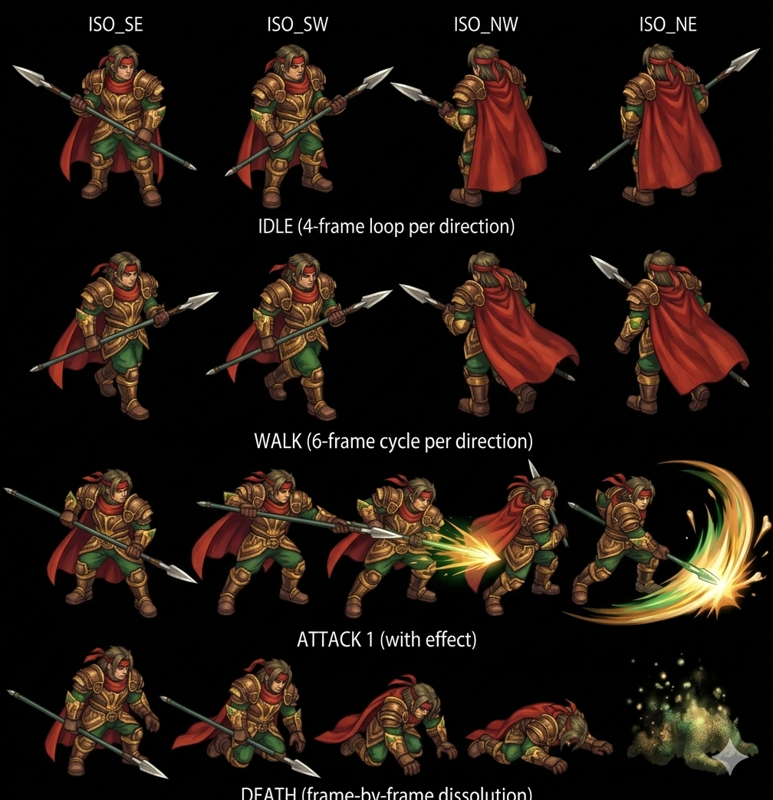
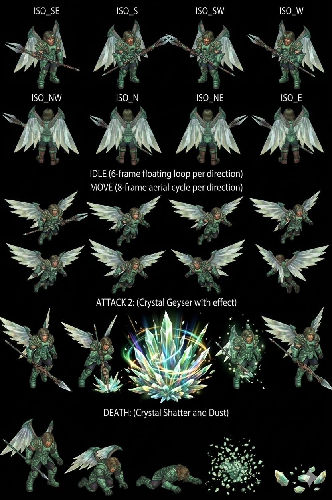

# Greham — Boss Jade Dragoon Nest of Dragon Disc 1 — Wind traitor Knight + Feyrbrand wielder (Jade Dragoon Spirit transfer Lavitz) CROSS-SOURCE 🟢

> ⚠️ **CORRECTION MAJEURE CROSS-SOURCE** : Précédent canon Damia "Lavitz death fight Greham" était ERRONÉ. **Greham meurt à la fin de cette battle Disc 1** (fatally injured + vanishes) → **Jade Dragoon Spirit transfer Greham → Lavitz canon NEW MAJEUR** (Lavitz devient Jade Dragoon Disc 1 post-Greham defeat). Lavitz death = LATER canon récurrent (probable Disc 2 ailleurs).
>
> **Wind/Jade Dragoon Boss Disc 1 Chapter 1 "Serdian War" Nest of Dragon submap 656 — Former head Second Knighthood of Basil + Servi Slambert (Lavitz' father) murderer + Imperial Sandora defector + Jade Dragoon Spirit corruption canon NEW MAJEUR CROSS-SOURCE** ⭐⭐⭐. HP **500 JP / 400 US-EU canon** (Damia adopts JP +25% systematic CONFIRMED 7ème instance CROSS-BOSS) + AT 13 (wiki) / 15 (fandom +15%) + DF 120 + SPD 60 + MAT 15 (wiki) / 17 (fandom +13%) + MDF 100 + A-AV/M-AV 0%. **Status 8/8 ALL IMMUNE boss-tier 8ème instance**. **Yield 1200 EXP + 100G (Damia ÷3 = 33G) avec Feyrbrand canon CROSS-SOURCE** — yield combined Feyrbrand+Greham pair canon. **Plate Mail 30% drop canon** (récurrent Fueno shop 200G Disc 2 dual-access). **⚠️ Counter Opportunities 0 = 2ème instance Counter-immune boss canon récurrent** (Grand Jewel + Greham). **Scripted formation 393 : Feyrbrand + Greham paired Dragon-Dragoon canon NEW MAJEUR**. **Retaliate passive variant 2 simpler physical-trigger canon NEW MAJEUR**. AI canon CROSS-SOURCE official names : **Spear Combo (~Piercing Spear) 4-hits + fling-up + ground-slam visual NEW MAJEUR + Dragon Crucifixion (~Crucify) 2× Non-Elemental spear-pillar trap + 4 energy spears + shatter NEW MAJEUR + Wind Magic (~Spinning Gale + ~Rave Twister) random Wind canon CROSS-SOURCE**. **Counters Additions: No**. **Critical Disc 1 plot beat canon CROSS-SOURCE** : Greham death + Jade Dragoon Spirit transfer Lavitz canon récurrent + Diaz/Doel 11,000 years revelation MAJEURE.
>
> ⭐⭐⭐ **⚠️ CORRECTION CANON MAJEURE Greham death + Lavitz survives + Jade Dragoon Spirit transfer Greham → Lavitz Disc 1 CROSS-SOURCE CONFIRMED (fandom) ⭐⭐⭐** — Quote canon fandom : "Greham is **fatally injured**. As he lies dying... He **dies from the wounds caused from the battle and vanishes**, as the **Jade Dragoon Spirit passes on to Lavitz**". Pattern Damia : ⚠️ **CORRECTION précédente canon Damia "Lavitz death Greham fight" ERRONÉE** — c'est Greham qui meurt + Lavitz survit + devient Jade Dragoon canon récurrent. **Jade Dragoon Spirit transfer canon Disc 1** : Greham (corrupt holder) → Lavitz (rightful Dragoon successor) — premier Dragoon Spirit transfer documenté canon. Lavitz death = LATER canon récurrent (Disc 2 ailleurs + Spirit transfer Albert subséquent récurrent). À corriger récurrent canon Damia + à documenter `quests/disc1-greham-feyrbrand.md` (à créer) + `party-members/Lavitz.md` Jade Dragoon Spirit acquisition Disc 1 canon récurrent.
>
> ⭐⭐⭐ **JADE Dragoon canon NEW MAJEUR (fandom) ⭐⭐⭐** — Quote canon : "Greham **reveals himself as the Jade Dragoon** and summons Feyrbrand to his side" + "Greham uses the **Jade Dragoon Spirit** to become a Dragoon". Pattern Damia : ⭐⭐⭐ **Jade Dragoon canon NEW MAJEUR — Greham + Lavitz + Albert canon récurrent successors** (cohérent récurrent Wind = Jade element correspondence canon). **Jade Dragoon Spirit canon récurrent linage** : Greham (pre-game corrupt) → Lavitz Disc 1 (rightful) → Albert Disc 2+ (récurrent inherit canon — Wind Additions Gust of Wind Dance + Flower Storm confirmed Gangster/Gargoyle counter lists). À documenter `lore/jade-dragoon.md` (à créer) — Jade Dragoon Spirit canon NEW MAJEUR + lineage Greham→Lavitz→Albert.
>
> ⭐⭐⭐ **Feyrbrand = Green-Tusked Dragon canon NEW MAJEUR (fandom) ⭐⭐⭐** — Quote canon : "control **Feyrbrand, the Green-Tusked Dragon**" + "vassal Dragon at his side". Pattern Damia : ⭐⭐⭐ **Feyrbrand = Green-Tusked Wind Dragon canon NEW MAJEUR + Jade Dragoon vassal canon** — Dragon-Dragoon control relationship canon récurrent. À documenter `bosses/Feyrbrand.md` (à créer) — Green-Tusked Dragon Wind canon NEW MAJEUR Disc 1 paired Greham.
>
> ⭐⭐⭐ **"Only Dragoons can manipulate Dragons" canon NEW MAJEUR (Rose quote fandom) ⭐⭐⭐** — Quote canon : Rose to Greham : "**It shouldn't be a surprise. Only the Dragoons can manipulate Dragons. Behind the Dragon, there should be...**". Pattern Damia : ⭐⭐⭐ **Dragon-Dragoon canonical rule NEW MAJEUR** — exclusive Dragon manipulation by Dragoons canon. Implies Feyrbrand controlled by Dragoon (Greham) — Rose deduces Dragoon presence before reveal canon. À documenter `lore/dragoon-dragon-canon.md` (à créer) — Dragoon-Dragon exclusive control rule NEW MAJEUR.
>
> ⭐⭐⭐ **Second Knighthood of Basil + Servi Slambert (Lavitz' father) canon NEW MAJEUR (fandom) ⭐⭐⭐** — Quote canon : "**former head of the Second Knighthood of Basil**" + "close friend to **Lavitz' father Servi Slambert**". Pattern Damia : ⭐⭐⭐ **Second Knighthood of Basil canon NEW MAJEUR Basil knight order** + **Servi Slambert canon NEW MAJEUR — Lavitz' father full name canon** (récurrent Lavitz Slambert lineage canon récurrent confirmed). Pre-game backstory Greham + Servi friendship canon. À documenter `lore/basil-knighthood.md` (à créer) + `npcs/Servi Slambert.md` (à créer) — Lavitz's father canon NEW MAJEUR + Basil knight order canon.
>
> ⭐⭐⭐ **Greham backstory canon NEW MAJEUR : jealousy + betrayal + Servi murder + Imperial Sandora defection (fandom) ⭐⭐⭐** — Quote canon : "out of **jealousy and frustration over his own limitations**, he **betrayed his friend Servi, killed him and sided with Imperial Sandora**". Pattern Damia : ⭐⭐⭐ **Greham corruption arc canon récurrent + Servi murder canon NEW MAJEUR** — Lavitz's father killed by Greham canon récurrent (motivates Lavitz revenge arc Disc 1). À refléter `quests/disc1-greham-feyrbrand.md` + `party-members/Lavitz.md` father revenge canon récurrent.
>
> ⭐⭐⭐ **Emperor Doel canon NEW MAJEUR + gave Greham Jade Dragoon Spirit (fandom) ⭐⭐⭐** — Quote canon : "presumably received the **Dragoon Spirit of the Jade Dragon by Emperor Doel**" + "I got from **His Majesty Doel**". Pattern Damia : ⭐⭐⭐ **Emperor Doel canon NEW MAJEUR — Imperial Sandora ruler Disc 1 antagonist canon récurrent** + Doel gave Greham Jade Dragoon Spirit (Disc 1 plot device — how did Doel acquire Jade Dragoon Spirit ?). À documenter `npcs/Emperor Doel.md` (à créer) — Imperial Sandora ruler canon NEW MAJEUR Disc 1.
>
> ⭐⭐⭐ **Emperor Diaz canon NEW MAJEUR + 11,000+ years ago + gave Doel power (fandom) ⭐⭐⭐** — Quote canon : "**Emperor Doel received his power and intelligence from Emperor Diaz**" + "**Diaz was a historical figure that died over 11,000 years ago**". Pattern Damia : ⭐⭐⭐ **Emperor Diaz canon NEW MAJEUR TLoD HISTORICAL DEEP LORE** — Diaz = 11,000+ years ago historical figure + somehow influenced Doel current (Diaz reincarnation ? returned ? canon récurrent Disc 4 reveal probable). Cohérent Dragon Campaign era 11,000 years ago canon récurrent. À documenter `lore/emperor-diaz.md` (à créer) — Diaz canon NEW MAJEUR pre-history TLoD.
>
> ⭐⭐⭐ **Rose "entire disbelief" Diaz 11,000 years canon REVELATION récurrent confirmed (fandom) ⭐⭐⭐** — Quote canon : "This **leaves Rose in entire disbelief**, as Diaz was a historical figure that died over 11,000 years ago". Pattern Damia : ⭐⭐⭐ **Rose canon récurrent HUGE REVELATION confirmed CROSS-SOURCE** — Rose has personal knowledge of Diaz era + reacts to 11,000 years figure = Rose lived during Dragon Campaign canon récurrent + Rose immortal/long-lived canon (cohérent récurrent Black Monster Rose canon Disc 4 reveal + Dragon Campaign canon récurrent Rose ancient). Cohérent récurrent **Rose smells blood Furni Disc 3** récent foreshadowing + Rose long-lived canon. À refléter `party-members/Rose.md` (à créer/vérifier) Rose ancient Dragon Campaign canon récurrent + Diaz era contemporary canon.
>
> ⭐⭐⭐ **Greham death speech + redemption + Servi reunion canon NEW MAJEUR (fandom) ⭐⭐⭐** — Quote canon : "shows **regret for his deeds**, and **in his death, looks forward to see Servi again**" + "**Lavitz...live strong. Now...I can go...to be with Servi....**". Pattern Damia : ⭐⭐⭐ **Greham redemption death scene canon NEW MAJEUR Disc 1** — corrupt → regret + Lavitz blessing + afterlife Servi reunion canon. Critical emotional beat Disc 1. À refléter `quests/disc1-greham-feyrbrand.md` (à créer) — redemption death scene canon Disc 1 NEW MAJEUR.
>
> ⭐⭐⭐ **JP HP 500 vs US-EU 400 +25% canon Damia rule CONFIRMED 7ème instance CROSS-BOSS Greham (fandom) ⭐⭐⭐** — Quote canon : "HP: 400 (US/EU) / **500 (JP)**". 400 × 1.25 = 500 = match exact pattern récurrent canon JP stats rule. Pattern Damia : ⭐ **JP HP +25% systematic récurrent CONFIRMED 7ème instance CROSS-MOB-BOSS** (Gangster + Gehrich + Ghost Commander + Glare + Gnome + Goblin + Greham). ⚠️ **Wiki HP 350 anomaly** : wiki 350 < fandom US-EU 400 = wiki erreur probable (cohérent récurrent Ghost Commander wiki HP anomaly récent). **Damia adopts JP HP 500 canon Greham**.
>
> ⭐⭐⭐ **Ability names CROSS-SOURCE official names CORRECTION Greham (fandom) ⭐⭐⭐** — Pattern Damia : ⭐⭐⭐ **CORRECTION canon official names CROSS-SOURCE** :
>
> | Wiki name (unofficial) | Fandom official name canon   | Visual canon                                                                              |
> | ---------------------- | ---------------------------- | ----------------------------------------------------------------------------------------- |
> | ~Piercing Spear        | **Spear Combo**              | Flies down + **4 hits** + fling-up + ground-slam (combo visual canon)                     |
> | ~Spinning Gale         | **Wind Magic** (random Wind) | Spins spear + releases energy through left hand + random Wind magic                       |
> | ~Crucify               | **Dragon Crucifixion**       | Spear-shaped pillar traps target + 4 energy spears + final shatter spear + sending flying |
> | ~Rave Twister          | (subsumed in Wind Magic ?)   | Random Wind component possible                                                            |
>
> Pattern Damia : Fandom official names CORRECTION + detailed visuals canon NEW MAJEUR. Spear Combo = multi-hit combo (vs wiki 1× phys simplified). Dragon Crucifixion = elaborated spear-pillar trap canon visual.
>
> ⭐⭐⭐ **Greham model reuse Disc 3 Furni mercenary Resident Knight Harris CROSS-SOURCE CONFIRMED (fandom Greham + Furni récent) ⭐⭐⭐** — Quote canon Trivia Greham fandom : "**Greham's model is later re-used on Disc 3, where the mercenary group gathers around the Resident Knight Harris in Furni to hunt down Kamuy in the Forest nearby**". Pattern Damia : ⭐ **Model reuse canon CROSS-SOURCE CONFIRMED** (cohérent Furni Disc 3 fandom récent Trivia "warriors models reuse Hero Competition: ... Drake Bandit and Greham" + Greham fandom direct confirmation). Production-side meta-trivia canon récurrent CONFIRMED 3-way cross-source.
>
> ⭐⭐⭐ **Yield 1200 EXP + 100G "with Feyrbrand" canon CROSS-SOURCE (fandom) ⭐⭐⭐** — Quote canon : "1,200 (with Feyrbrand)" + "100 (with Feyrbrand)". Pattern Damia : ⭐ **Yield combined boss pair canon NEW MAJEUR** — Feyrbrand + Greham yield = 1200 EXP + 100G total pair (vs individual split). Pattern Damia : paired Dragon-Dragoon yield canon combined.
>
> ⭐⭐⭐ **Plate Mail "not guaranteed" + Fueno halfway Disc 2 alternate canon (fandom) ⭐⭐⭐** — Quote canon : "Plate Mail is **not guaranteed**" + "only sure place of getting it is in **Fueno, halfway through the second disc**". Pattern Damia : Plate Mail = 30% drop **rare canon** Disc 1 Greham + **Fueno Disc 2 guaranteed shop 200G alternative récurrent canon** confirmed (cohérent Fueno wiki shop canon récurrent + récent Furni fandom). Drop-vs-shop dual-access canon récurrent.
>
> ⭐⭐⭐ **Re-ignition Serdian War canon NEW MAJEUR (fandom) ⭐⭐⭐** — Quote canon : "leading to a **shift of power towards Sandora and a re-ignition of the Serdian War**". Pattern Damia : ⭐⭐⭐ **Serdian War re-ignition canon NEW MAJEUR Disc 1 backstory** — Greham defection + Jade Dragoon Spirit acquisition Doel = direct cause Serdian War restart canon (cohérent Disc 1 Chapter 1 "Serdian War" récurrent canon). À documenter `quests/disc1-serdian-war.md` (à créer/vérifier) — Serdian War canon Disc 1.
>
> ⭐⭐ **Chapter 1: Serdian War canon CONFIRMED CROSS-SOURCE (fandom) ⭐⭐** — Quote canon : "Chapter 1: Serdian War". Pattern Damia : Disc 1 Chapter 1 "Serdian War" canon CONFIRMED 4/4 chapters récurrent (Disc 1 Serdian War + Disc 2 Platinum Shadow + Disc 3 Fate and Soul + Disc 4 Moon & Fate). Source: idem.
>
> ⭐⭐ **AT 15 + MAT 17 fandom vs wiki 13/15 small divergences (fandom anomaly récurrent) ⭐⭐** — Wiki AT 13 + fandom AT 15 = +15% divergence (cohérent fandom higher anomaly récurrent). Wiki MAT 15 + fandom 17 = +13% divergence. Pattern Damia : Wiki tier 2 canon prevails 13/15 + factual fandom mention récurrent pattern.
>
> ⭐⭐ **JP name "Gurahamu, Graham" canon (fandom) ⭐⭐** — Quote canon : "グラハム, **Gurahamu**". Pattern Damia : JP name canon récurrent JP naming pattern Disc 1.
>
> ⭐⭐ **Webbed chamber Nest of Dragon canon (fandom) ⭐⭐** — Quote canon : "Dart and friends come to a **webbed chamber and find Greham**". Pattern Damia : ⭐ **Webbed chamber = Nest of Dragon boss arena canon NEW** — spider-web décoration cohérent Dragon lair atmosphere canon récurrent.
>
> **Sources** :
>
> - 🥈 [`_sources/lod-wiki-greham.md`](./_sources/lod-wiki-greham.md) — wiki LoD tier 2 (Boss Wind Disc 1 Nest of Dragon submap 656 + HP 350/AT 13/DF 120 high/SPD 60/MAT 15/MDF 100/A-AV/M-AV 0% + Status 8/8 ALL IMMUNE 8ème + Yield 1200 EXP/100G/Plate Mail 30% + ⚠️ Counter Opportunities 0 2ème instance Counter-immune + Scripted formation 393 Feyrbrand+Greham paired Dragon-Dragoon + Retaliate variant 2 simpler physical-trigger Piercing Spear + AI conditional ~Piercing Spear/~Crucify Non-Elemental/~Spinning Gale Wind/~Rave Twister Wind party + Wind pool CROSS-BOSS récurrent)
> - 🥉 [`_sources/fandom-greham.md`](./_sources/fandom-greham.md) — Fandom tier 3 (**⚠️ CORRECTION MAJEURE Greham death + Lavitz survives + Jade Dragoon Spirit transfer Greham → Lavitz Disc 1** + **HP JP 500/US-EU 400 +25% Damia rule CONFIRMED 7ème instance** + **⚠️ Wiki HP 350 anomaly** + AT 15/MAT 17 +15%/+13% divergences + JP "Gurahamu" + **JADE Dragoon canon NEW MAJEUR Greham+Lavitz+Albert lineage** + **Feyrbrand Green-Tusked Wind Dragon vassal canon NEW MAJEUR** + **"Only Dragoons can manipulate Dragons" Rose quote canon NEW MAJEUR** + **Second Knighthood of Basil + Servi Slambert (Lavitz' father) canon NEW MAJEUR** + **Greham backstory jealousy/betrayal/Servi murder/Imperial Sandora defection canon récurrent** + **Emperor Doel canon NEW MAJEUR Imperial Sandora ruler gave Greham Jade Dragoon Spirit** + **Emperor Diaz 11,000+ years ago canon TLoD HISTORICAL DEEP LORE NEW MAJEUR + Doel received power/intelligence from Diaz** + **Rose disbelief Diaz canon REVELATION récurrent confirmed Rose ancient Dragon Campaign canon** + **Greham death speech redemption + Servi afterlife reunion canon NEW MAJEUR** + **Re-ignition Serdian War canon NEW MAJEUR** + Spear Combo (4-hits + fling) + Wind Magic (random) + **Dragon Crucifixion (pillar trap + 4 spears + shatter) official names CROSS-SOURCE CORRECTION** + Yield 1200 EXP/100G "with Feyrbrand" combined pair canon + Plate Mail "not guaranteed" + Fueno Disc 2 alternative shop canon + **Greham model reuse Disc 3 Furni Resident Knight Harris mercenary CROSS-SOURCE CONFIRMED 3-way** + webbed chamber Nest of Dragon canon + Chapter 1 Serdian War CONFIRMED)

## Sprite canon ⭐⭐⭐ Damia integration (Gemini boss-tier Greham Jade Dragoon)

> 

⭐⭐⭐ **Sprite Greham CONFIRMS canon fandom récurrent CROSS-SOURCE** :

- ✅ **Brutish/imposing humanoid** canon
- ✅ **Metal shoulder pauldrons** (silver épaulettes métalliques visibles) canon récurrent
- ✅ **Fox-skin cap** (couvre-chef fourrure animal) canon récurrent
- ✅ **Tunique brune + leather armor** canon récurrent
- ✅ **Spear weapon main hand** canon (Spear Combo + ex-Jade Dragoon — Lavitz/Albert spear récurrent)
- ✅ **Red cape** canon (Imperial Sandora defector colors récurrent)
- ✅ **Boss-tier 4-directional ISO** canon (cohérent récurrent Gorgaga + Grand Jewel)

**Animation structure prête Damia (Gemini cycles canonicaux boss-tier walking)** :

| Cycle        | Frames                      | Notes canon                                                                               |
| ------------ | --------------------------- | ----------------------------------------------------------------------------------------- |
| **ISO SE**   | 1                           | Direction Sud-Est canon récurrent isométrique Damia                                       |
| **ISO SW**   | 1                           | Direction Sud-Ouest canon récurrent isométrique                                           |
| **ISO NW**   | 1                           | Direction Nord-Ouest canon (boss-tier 4-directional)                                      |
| **ISO NE**   | 1                           | Direction Nord-Est canon (boss-tier 4-directional)                                        |
| **IDLE**     | 4-frame loop per direction  | Standard boss idle breathing (cohérent récurrent)                                         |
| **WALK**     | 6-frame cycle per direction | ⭐ **Standard walk** (vs Gorgaga heavy / Grand Jewel hovering — variation pace canon NEW) |
| **ATTACK 1** | with effect                 | Spear swing arc effect (cohérent Spear Combo canon fandom)                                |
| **DEATH**    | frame-by-frame dissolution  | Cohérent récurrent boss death + Greham vanishes fandom canon                              |

Pattern Damia : ⭐⭐⭐ **Sprite Gemini boss-tier standard walking canon** — distinction sprite tier élargie :

| Tier                               | ISO angles    | Locomotion cycle                                |
| ---------------------------------- | ------------- | ----------------------------------------------- |
| Mob (Goblin)                       | 2 (SE+SW)     | 6-frame normal walk                             |
| Boss walking heavy (Gorgaga)       | 4 (4-dir)     | 6-frame **heavy** walk                          |
| **Boss walking standard (Greham)** | **4 (4-dir)** | **6-frame standard walk** ⭐ NEW pace variation |
| Boss hovering (Grand Jewel)        | 4 (4-dir)     | 6-frame heavy HOVER (MOVE)                      |

Pattern Damia : **3-tier walking pace canon NEW** — mob normal / boss heavy / boss standard / boss hovering = 4 distinct locomotion styles canon récurrent.

À intégrer future : `public/assets/sprites/bosses/greham-*.png` (frame-split par cycle) + `data/bosses/greham.ts` (à créer) AvatarSpriteForm pattern récurrent + `RenderSystem` cycle-aware (idle/walk/attack/death) + 4-directional facing logic + spear swing arc particle effect.

## Sprite canon ⭐⭐⭐ Damia Jade Dragoon TRANSFORMATION form (Gemini Dragoon-tier NEW MAJEUR)

> 

⭐⭐⭐ **Sprite Greham Jade Dragoon form NEW MAJEUR — Premier Dragoon transformation form documenté canon Damia** :

- ✅ **Winged Jade Dragoon** canon (ailes crystallines/jade visibles) NEW MAJEUR
- ✅ **Crystalline armor + jade green tones** canon (cohérent Jade = crystal canon récurrent + Wind element)
- ✅ **Aerial/floating posture** canon (Dragoon transformation = flight-capable canon NEW MAJEUR)
- ✅ **Crystal spear weapon** canon (Dragoon Spear weapon récurrent — Lavitz/Albert spear lineage canon)
- ✅ **8 ISO angles** canon NEW MAJEUR (vs 4 boss / 2 mob — Dragoon-tier expansion ⭐⭐⭐)

**Animation structure prête Damia (Gemini cycles canonicaux Dragoon transformation form)** :

| Cycle        | Frames                              | Notes canon                                                                                  |
| ------------ | ----------------------------------- | -------------------------------------------------------------------------------------------- |
| **ISO SE**   | 1                                   | Direction Sud-Est canon Dragoon                                                              |
| **ISO S**    | 1                                   | ⭐ Direction Sud canon NEW MAJEUR (vs 4-dir boss)                                            |
| **ISO SW**   | 1                                   | Direction Sud-Ouest canon Dragoon                                                            |
| **ISO W**    | 1                                   | ⭐ Direction Ouest canon NEW MAJEUR                                                          |
| **ISO NW**   | 1                                   | Direction Nord-Ouest canon Dragoon                                                           |
| **ISO N**    | 1                                   | ⭐ Direction Nord canon NEW MAJEUR                                                           |
| **ISO NE**   | 1                                   | Direction Nord-Est canon Dragoon                                                             |
| **ISO E**    | 1                                   | ⭐ Direction Est canon NEW MAJEUR                                                            |
| **IDLE**     | **6-frame floating loop per dir**   | ⭐⭐⭐ **Floating loop NEW MAJEUR** (vs boss breathing — Dragoon = airborne idle hovering)   |
| **MOVE**     | **8-frame aerial cycle per dir**    | ⭐⭐⭐ **Aerial flight cycle NEW MAJEUR** (vs walk/hover — Dragoon flight 8-frame elaborate) |
| **ATTACK 2** | with effect                         | ⭐⭐⭐ **Crystal Geyser NEW MAJEUR ability name** (Jade = crystal canon)                     |
| **DEATH**    | **Crystal Shatter + Dust particle** | ⭐⭐⭐ **Crystal Shatter Dust death NEW MAJEUR** (crystalline death cohérent Jade canon)     |

⭐⭐⭐ **Sprite tier hierarchy canon EXPANSION NEW MAJEUR Damia** :

| Tier                             | ISO angles    | Locomotion cycle                                  | Frame count                  |
| -------------------------------- | ------------- | ------------------------------------------------- | ---------------------------- |
| Mob (Goblin)                     | 2 (SE+SW)     | 6-frame normal walk                               | Standard                     |
| Boss walking heavy (Gorgaga)     | 4 (4-dir)     | 6-frame heavy walk                                | Standard                     |
| Boss walking standard (Greham)   | 4 (4-dir)     | 6-frame standard walk                             | Standard                     |
| Boss hovering (Grand Jewel)      | 4 (4-dir)     | 6-frame heavy HOVER                               | Standard                     |
| ⭐⭐⭐ **Dragoon form (Greham)** | **8 (8-dir)** | **8-frame aerial flight + 6-frame floating idle** | **Elaborate (Dragoon-tier)** |

Pattern Damia : ⭐⭐⭐ **Dragoon transformation form sprite sub-class canon NEW MAJEUR Damia** — Dragoon = aerial-capable + 8-directional facing + elaborate aerial flight cycle (8-frame vs 6-frame standard) + floating idle (vs breathing idle) + crystal-themed elemental death. Premier Dragoon form sprite documenté canon Damia.

⭐⭐⭐ **Crystal Geyser ATTACK 2 ability NEW MAJEUR canon (sprite)** :

- Geyser canon = vertical eruption visual (crystal pillar from ground upward — cohérent Dragon Crucifixion spear-pillar visual canon récurrent ?)
- **Jade crystal elemental theme canon récurrent** (Jade Dragoon = crystal/Wind correspondence)
- Possible ATTACK 1 = Spear Combo (récurrent) + ATTACK 2 = Crystal Geyser Dragoon-only NEW
- À documenter `combat/dragoon-abilities.md` (à créer) — Crystal Geyser Greham Dragoon-only ability NEW MAJEUR

⭐⭐⭐ **Crystal Shatter + Dust DEATH canon NEW MAJEUR (sprite)** :

- Crystalline shatter death cohérent récurrent boss death + Greham vanishes fandom canon
- ⭐ **Jade crystal shatter visual canon NEW MAJEUR** — cohérent Jade Dragoon Spirit transfer mechanic visual (Spirit leaves crystal body → transfers Lavitz)
- Pattern Damia : **Dragoon transformation death = elemental crystal/jade shatter** canon récurrent probable (Lavitz future Jade Dragoon death visual similar ?)
- À refléter quests Disc 1 Greham death cinematic canon récurrent

À intégrer future : `public/assets/sprites/bosses/greham-dragoon-*.png` (8-directional frame-split par cycle) + `data/bosses/greham.ts` AvatarSpriteForm dual-form (human + Jade Dragoon transformation) pattern récurrent + `RenderSystem` Dragoon-aware (8-dir + aerial locomotion + Crystal Geyser effect + Crystal Shatter Dust death particle) + Dragoon transformation trigger logic (HP threshold ? scripted ?) canon récurrent.

## Statut

🟢 **Canon confirmed cross-source** (wiki 🥈 + fandom 🥉) — 2 sources cohérentes majoritaires + enrichissement fandom MASSIF Disc 1 :

- ⚠️ **CORRECTION MAJEURE Greham death + Lavitz survives + Jade Dragoon Spirit transfer Greham → Lavitz** (Lavitz death = LATER canon Disc 2)
- ⭐⭐⭐ **Jade Dragoon canon NEW MAJEUR + lineage Greham→Lavitz→Albert + Feyrbrand Green-Tusked Wind Dragon vassal**
- ⭐⭐⭐ **Emperor Doel + Emperor Diaz 11,000+ years ago canon DEEP LORE TLoD + Rose ancient Dragon Campaign récurrent confirmed**
- ⭐⭐⭐ **Servi Slambert (Lavitz' father) + Second Knighthood Basil canon NEW MAJEUR**
- ⭐⭐⭐ **Greham redemption death speech + afterlife Servi reunion canon NEW MAJEUR**
- ⭐⭐⭐ **Spear Combo + Dragon Crucifixion + Wind Magic ability names CROSS-SOURCE CORRECTION + detailed visuals**
- ⚠️ Stats divergence wiki HP 350 anomaly (fandom US-EU 400 canonical) + JP HP 500 canon Damia
- ⭐⭐ Greham model reuse Disc 3 Furni CROSS-SOURCE 3-way confirmed

## Identity canon ⭐⭐⭐ CROSS-SOURCE

- **Nom** : Greham (JP **グラハム Gurahamu, "Graham"** récurrent canon)
- **Type** : ⭐⭐⭐ **Boss Jade Dragoon Disc 1 — corrupt traitor canon NEW MAJEUR CROSS-SOURCE**
- **Element** : Wind / **Jade Dragoon** (Wind = Jade element correspondence canon récurrent)
- **Disc** : Disc 1 Chapter 1 "Serdian War" CONFIRMED CROSS-SOURCE
- **Location canon** : **Nest of Dragon webbed chamber submap 656** Disc 1 Wind Dragon lair CROSS-SOURCE
- **Pre-game role canon** : ⭐⭐⭐ **Former head Second Knighthood of Basil + close friend Servi Slambert (Lavitz' father)**
- **Corruption arc canon** : ⭐⭐⭐ **Jealousy/limitations → betray Servi + murder Servi + defect to Imperial Sandora + receive Jade Dragoon Spirit from Emperor Doel → re-ignite Serdian War**
- **Weapon** : Spear (Jade Dragoon canon — cohérent Lavitz/Albert spear récurrent)
- **Paired boss** : ⭐⭐⭐ **Feyrbrand Green-Tusked Wind Dragon canon NEW MAJEUR** — Jade Dragoon vassal Dragon
- **Plot beat canon CRITICAL** : ⭐⭐⭐ **Greham death + Jade Dragoon Spirit transfer Lavitz Disc 1** (Lavitz becomes Jade Dragoon) + Lavitz revenge for Servi
- **Death canon** : Fatally injured battle + vanishes + redemption speech + afterlife Servi reunion canon
- **Counters Additions** : **No** (Counter-immune 2ème instance récurrent)
- **Production trivia** : Model reused Disc 3 Furni Resident Knight Harris mercenary canon CROSS-SOURCE 3-way

## Stats canon ⭐⭐⭐ CROSS-SOURCE Damia adoption JP rule CONFIRMED 7ème instance

| Stat   | Wiki canon | Fandom canon           | Damia adoption    | Notes                                                                       |
| ------ | ---------- | ---------------------- | ----------------- | --------------------------------------------------------------------------- |
| **HP** | 350 ⚠️     | **400 US-EU / 500 JP** | **500 JP** ⭐⭐⭐ | ⭐ JP HP +25% canon récurrent CONFIRMED 7ème instance + ⚠️ wiki 350 anomaly |
| AT     | 13         | **15 (P.Attack)** ⚠️   | **13 wiki canon** | ⚠️ Fandom +15% divergence anomaly récurrent — wiki tier 2 prevails          |
| DF     | 120        | 120                    | **120**           | Match CROSS-SOURCE — high tank récurrent CROSS-BOSS Disc 1-2                |
| A-AV   | 0%         | -                      | **0%**            | No evasion                                                                  |
| SPD    | 60         | 60                     | **60**            | Match CROSS-SOURCE — mid boss-tier                                          |
| MAT    | 15         | **17** ⚠️              | **15 wiki canon** | ⚠️ Fandom +13% divergence — wiki canon prevails                             |
| MDF    | 100        | 100                    | **100**           | Match CROSS-SOURCE                                                          |
| M-AV   | 0%         | -                      | **0%**            | No magic evasion                                                            |

**Gold canon Damia** : 100G ÷3 = **33G** systematic (no JP variant given — yield combined with Feyrbrand pair canon).

## Status Immunity canon ⭐⭐⭐ 8/8 ALL IMMUNE boss-tier 8ème instance

(Tous 8 statuses immune — récurrent boss-tier pattern CROSS-BOSS)

## Yield canon CROSS-SOURCE

| EXP                    | Gold                             | Drops                                    | Notes canon                                                          |
| ---------------------- | -------------------------------- | ---------------------------------------- | -------------------------------------------------------------------- |
| 1,200 (with Feyrbrand) | 100 (with Feyrbrand) (Damia 33G) | **Plate Mail 30% drop "not guaranteed"** | ⭐⭐⭐ **Yield combined boss pair canon NEW** Feyrbrand+Greham total |

### Plate Mail drop canon ⭐⭐⭐ dual-access CROSS-SOURCE

- **30% drop rate** boss canon récurrent (not guaranteed canon fandom)
- **Disc 1 Greham early acquisition canon** (rare drop)
- **Disc 2 Fueno guaranteed shop 200G canon récurrent** alternative
- Drop-vs-shop dual-access pattern récurrent
- À refléter `items/Plate Mail.md` (à créer/vérifier)

## Encounters canon Nest of Dragon Disc 1 ⭐⭐⭐ paired Dragon-Dragoon NEW MAJEUR CROSS-SOURCE

| ID  | Formation                     | Submap                                | Encounter%   | Escape% |
| --- | ----------------------------- | ------------------------------------- | ------------ | ------- |
| 393 | **Feyrbrand + Greham** ⭐⭐⭐ | **Nest of Dragon webbed chamber 656** | **Scripted** | **0%**  |

⭐⭐⭐ **Paired Dragon-Dragoon boss formation canon NEW MAJEUR Disc 1** : Feyrbrand Green-Tusked Wind Dragon + Greham Jade Dragoon wielder. First documented Dragon-Dragoon combat canon (vs Boss Extras pattern Gehrich+Mappi/Ghost Commander+Knights récurrent).

## Boss Traits canon ⭐⭐⭐ Retaliate récurrent 2ème instance variant 2

(Cf. wiki section — Retaliate physical-trigger + fixed Piercing Spear simpler variant vs Gehrich general + multi-action)

## AI canon ⭐⭐⭐ CROSS-SOURCE official names CORRECTION + detailed visuals NEW MAJEUR

### Greham Abilities canon CROSS-SOURCE

| Wiki name (unofficial) | Fandom official name canon        | Target | Effect canon                                                                                      | Visual canon (fandom)                                                |
| ---------------------- | --------------------------------- | ------ | ------------------------------------------------------------------------------------------------- | -------------------------------------------------------------------- |
| ~Piercing Spear        | ⭐⭐⭐ **Spear Combo**            | Single | 1× Physical damage (wiki) — **4 hits combo + fling-up + ground-slam** (fandom détaillé)           | Flies down + spear 4-hits + fling-up + slam ground                   |
| ~Crucify               | ⭐⭐⭐ **Dragon Crucifixion**     | Single | 2× Non-Elemental magic damage (wiki) — **Spear-pillar trap + 4 energy spears + shatter** (fandom) | Pillar traps target + 4 energy spears + final shatter spear + flying |
| ~Spinning Gale         | ⭐⭐⭐ **Wind Magic** (random)    | Single | 1.5× Wind magic damage (wiki) — **Spins spear + energy through left hand + random Wind** (fandom) | Spins spear gathering energy + releases left hand                    |
| ~Rave Twister          | (subsumed in Wind Magic random ?) | Party  | 1× Wind magic party AoE (wiki) — possible random Wind variant fandom Wind Magic                   | -                                                                    |

⭐⭐⭐ **Fandom canon official names CORRECTION récurrent** : Spear Combo + Dragon Crucifixion + Wind Magic (vs wiki tilde unofficial).

### NEW MAJEUR canon mechanics (fandom)

1. **Spear Combo multi-hit canon** : 4-hits + fling-up + ground-slam visual canon (vs wiki simplified 1× phys)
2. **Dragon Crucifixion elaborate canon** : spear-pillar trap + 4 energy spears + shatter visual canon
3. **Wind Magic random canon** : random Wind variant ability (subsumes wiki Spinning Gale/Rave Twister probable)

### Wind ability pool canon récurrent CROSS-BOSS CONFIRMED ⭐⭐⭐

Pattern Damia : Wind ability pool shared canon récurrent CROSS-BOSS Disc 1-3 (Greham + Grand Jewel Spinning Gale + Rave Twister damage scaling).

## Counter Opportunities canon ⭐⭐⭐ 0 = 2ème instance Counter-immune

Pattern Damia : Counter-immune boss tier canon récurrent 2ème instance CROSS-DISC (Grand Jewel Disc 3 + Greham Disc 1).

## Story canon ⭐⭐⭐ CROSS-SOURCE Disc 1 Chapter 1 "Serdian War" CRITICAL plot

### Pre-game backstory canon NEW MAJEUR (fandom)

- ⭐⭐⭐ **Greham = former head Second Knighthood of Basil canon NEW MAJEUR**
- ⭐⭐⭐ **Close friend Servi Slambert (Lavitz' father) canon récurrent**
- **Jealousy + frustration limitations canon** drives corruption
- ⭐⭐⭐ **Betrayed + murdered Servi canon récurrent**
- ⭐⭐⭐ **Defected to Imperial Sandora canon**
- ⭐⭐⭐ **Received Jade Dragoon Spirit from Emperor Doel canon NEW MAJEUR**
- ⭐⭐⭐ **Re-ignited Serdian War canon NEW MAJEUR**

### Nest of Dragon Disc 1 plot beats canon (fandom)

1. **Dart + party search Nest of Dragon** canon récurrent
2. **Webbed chamber boss arena** canon NEW
3. **Lavitz enraged seeing Greham** + accuses betrayal/Servi murder canon
4. ⭐⭐⭐ **Lavitz vows revenge for father canon récurrent**
5. ⭐⭐⭐ **Greham reveals = Jade Dragoon + summons Feyrbrand** canon NEW MAJEUR
6. **Rose deduces Dragoon presence** : "Only the Dragoons can manipulate Dragons" canon NEW MAJEUR
7. ⭐⭐⭐ **Rose questions Greham about Dragoon Spirit origin** canon
8. ⭐⭐⭐ **Greham reveals Doel received power from Diaz** canon NEW MAJEUR
9. ⭐⭐⭐ **Rose entire disbelief Diaz 11,000+ years ago** canon REVELATION récurrent confirmed
10. **Battle fight canon**
11. ⭐⭐⭐ **Greham fatally injured + dying speech canon NEW MAJEUR**
12. ⭐⭐⭐ **Greham redemption + admits jealousy + Lavitz blessing canon**
13. ⭐⭐⭐ **"Lavitz live strong... be with Servi" final words canon** NEW MAJEUR
14. ⭐⭐⭐ **Greham vanishes + Jade Dragoon Spirit transfers Lavitz** canon NEW MAJEUR
15. ⭐⭐⭐ **Lavitz becomes Jade Dragoon Disc 1 canon** récurrent

## Jade Dragoon Lineage canon ⭐⭐⭐ NEW MAJEUR CROSS-SOURCE

### Jade Dragoon Spirit lineage canon

| Holder     | Era                 | Status canon                                                             |
| ---------- | ------------------- | ------------------------------------------------------------------------ |
| **Greham** | Pre-Disc 1 → Disc 1 | Corrupt traitor + received from Doel → dies Disc 1 → transfers Lavitz    |
| **Lavitz** | Disc 1 →            | Rightful Dragoon successor + becomes Jade Dragoon Disc 1                 |
| **Albert** | Disc 2+             | Inherits post-Lavitz death récurrent canon (Lavitz death = LATER Disc 2) |

Pattern Damia : ⭐⭐⭐ **Jade Dragoon Spirit lineage canon récurrent NEW MAJEUR** — Greham → Lavitz → Albert transfer chain canon. Wind = Jade element correspondence canon TLoD récurrent. À documenter `lore/jade-dragoon.md` (à créer) — Jade Dragoon Spirit canon NEW MAJEUR.

## Lore canon ⭐⭐⭐ NEW MAJEUR DEEP TLoD (fandom)

### "Only Dragoons can manipulate Dragons" canon NEW MAJEUR

Quote Rose canon : "It shouldn't be a surprise. Only the Dragoons can manipulate Dragons. Behind the Dragon, there should be...".

Pattern Damia : ⭐⭐⭐ **Dragon-Dragoon exclusive control rule canon NEW MAJEUR TLoD** — Dragons can only be controlled by Dragoons (Spirit holders). Implies all Dragon antagonists = Dragoon wielders canon récurrent. À documenter `lore/dragoon-dragon-canon.md` (à créer).

### Emperor Doel + Emperor Diaz canon NEW MAJEUR DEEP LORE

| Figure           | Era               | Role canon                                                                                           |
| ---------------- | ----------------- | ---------------------------------------------------------------------------------------------------- |
| **Emperor Diaz** | 11,000+ years ago | ⭐⭐⭐ Historical figure (Dragon Campaign era récurrent) + gave Doel power/intelligence canon DEEP   |
| **Emperor Doel** | Disc 1            | ⭐⭐⭐ Imperial Sandora ruler canon récurrent + gave Greham Jade Dragoon Spirit + received from Diaz |

Pattern Damia : ⭐⭐⭐ **Diaz-Doel canon DEEP LORE TLoD** — Diaz 11,000+ years ago + somehow influenced Doel current era (Diaz reincarnation ? return ? Disc 4 reveal probable canon récurrent). Cohérent récurrent Dragon Campaign canon 11,000 years ago + Disc 4 antagonist reveals.

### Rose ancient Dragon Campaign canon récurrent CONFIRMED REVELATION ⭐⭐⭐

Quote canon : Rose "entire disbelief" + knows Diaz personally + reacts to 11,000 years figure.

Pattern Damia : ⭐⭐⭐ **Rose long-lived/ancient canon récurrent CONFIRMED CROSS-SOURCE** — Rose lived during Dragon Campaign era 11,000 years ago canon (cohérent récurrent Rose Black Monster Disc 4 reveal récurrent + Rose immortal Wingly hybrid hypothesis récurrent). Cohérent récurrent **Rose smells blood Furni Disc 3** récent mystery foreshadowing.

À refléter `party-members/Rose.md` (à créer/vérifier) Rose ancient canon CONFIRMED + Diaz contemporary canon récurrent.

### Servi Slambert canon NEW MAJEUR — Lavitz's father

| Figure             | Role canon                                                                                                 |
| ------------------ | ---------------------------------------------------------------------------------------------------------- |
| **Servi Slambert** | ⭐⭐⭐ Lavitz's father + Knight Kingdom of Basil + Greham close friend + murdered by Greham pre-game canon |

Pattern Damia : ⭐⭐⭐ **Servi Slambert canon NEW MAJEUR** — Lavitz's father full name canon + murdered by Greham pre-game canon motivates Disc 1 Lavitz revenge arc. À documenter `npcs/Servi Slambert.md` (à créer) + `party-members/Lavitz.md` father canon récurrent.

### Second Knighthood of Basil canon NEW MAJEUR

Pattern Damia : ⭐⭐⭐ **Second Knighthood of Basil canon NEW MAJEUR** — Basil knight order canon (Greham former head + Servi member + Lavitz member canon récurrent). À documenter `lore/basil-knighthood.md` (à créer).

## Vision Damia (implémentation)

### Décisions canon à conserver (CROSS-SOURCE 🟢)

1. ⚠️ **CORRECTION MAJEURE canon Damia précédent** : Greham death + Lavitz survives + Jade Dragoon Spirit transfer Greham → Lavitz Disc 1
2. ⭐⭐⭐ **Jade Dragoon canon NEW MAJEUR + Greham→Lavitz→Albert lineage** (Wind = Jade element)
3. ⭐⭐⭐ **Feyrbrand Green-Tusked Wind Dragon vassal canon NEW MAJEUR** + paired Dragon-Dragoon boss formation 393 Disc 1
4. ⭐⭐⭐ **"Only Dragoons can manipulate Dragons" canon NEW MAJEUR rule TLoD** (Rose quote)
5. ⭐⭐⭐ **Servi Slambert (Lavitz' father) + Second Knighthood Basil canon NEW MAJEUR** pre-game
6. ⭐⭐⭐ **Greham backstory : jealousy → betrayal → Servi murder → Sandora defection → Jade Dragoon Spirit Doel → Serdian War re-ignition** canon récurrent
7. ⭐⭐⭐ **Emperor Doel canon NEW MAJEUR** Imperial Sandora ruler Disc 1 + gave Greham Jade Dragoon Spirit
8. ⭐⭐⭐ **Emperor Diaz canon NEW MAJEUR DEEP LORE** — 11,000+ years ago + gave Doel power/intelligence (Dragon Campaign era récurrent)
9. ⭐⭐⭐ **Rose ancient Dragon Campaign canon récurrent CONFIRMED** — disbelief Diaz 11,000 years (Rose immortal hypothesis récurrent confirmé)
10. ⭐⭐⭐ **Greham death speech + redemption + Servi afterlife reunion canon NEW MAJEUR** Disc 1 emotional beat
11. ⭐⭐⭐ **JP HP 500 +25% Damia rule CONFIRMED 7ème instance CROSS-BOSS** + ⚠️ wiki HP 350 anomaly
12. ⭐⭐⭐ **Spear Combo + Dragon Crucifixion + Wind Magic CROSS-SOURCE official names + detailed visuals canon NEW MAJEUR**
13. ⭐⭐⭐ **Yield combined boss pair canon NEW** (1200 EXP + 100G "with Feyrbrand" total)
14. ⭐⭐⭐ **Webbed chamber Nest of Dragon boss arena canon NEW**
15. ⭐⭐⭐ **Disc 1 Chapter 1 "Serdian War" canon CONFIRMED 4/4 chapters récurrent**
16. ⭐⭐⭐ **Counter-immune 2ème instance + Status 8/8 immune 8ème + Retaliate variant 2 récurrent**
17. ⭐⭐⭐ **Greham model reuse Disc 3 Furni Resident Knight Harris mercenary canon récurrent CROSS-SOURCE 3-way confirmed**
18. ⭐⭐ **Plate Mail dual-access (Disc 1 30% drop + Disc 2 Fueno shop 200G) récurrent**
19. ⭐⭐ **JP "Gurahamu, Graham" canon récurrent**
20. ⭐⭐ Stats anomalies AT 15/MAT 17 fandom higher récurrent (wiki canon prevails)

### Questions ouvertes (post cross-source)

- ⭐⭐⭐ **Feyrbrand stats + appearance canon Disc 1** : Green-Tusked Wind Dragon paired Greham → à ingérer wiki/fandom Feyrbrand
- ⭐⭐⭐ **Emperor Doel canon depth Disc 1** : Imperial Sandora ruler + Jade Dragoon Spirit acquisition → à ingérer fandom/wiki Doel
- ⭐⭐⭐ **Emperor Diaz canon depth DEEP LORE** : 11,000+ years ago + Disc 4 reveal probable → à investiguer fandom récurrent + Disc 4 canon
- ⭐⭐⭐ **Rose ancient Dragon Campaign canon depth** : immortal/long-lived + Diaz contemporary → à investiguer Rose.md récurrent canon
- ⭐⭐⭐ **Servi Slambert character lore Disc 1** : Lavitz's father + Knight Basil + Greham friendship → à ingérer fandom future
- ⭐⭐⭐ **Jade Dragoon Spirit lineage canon depth** : Greham→Lavitz→Albert transfer mechanics + canonical chain → à documenter
- ⭐⭐⭐ **Lavitz death scene canon Disc 2** : where + how Lavitz dies (not Greham fight as initially supposed) → à investiguer fandom récurrent
- ⭐⭐ **Second Knighthood of Basil canon depth** : Basil knight order + structure → à investiguer
- ⭐⭐ **Dragon-Dragoon exclusive control rule mechanics Damia** : implémentation canon
- ⭐⭐ **Wind Magic "random" ability canon mechanics** : random Wind variant fandom probable subsumes wiki Spinning Gale/Rave Twister

## Liens transverses

- [`README.md`](./README.md) — bosses canon + **Jade Dragoon canon NEW MAJEUR + paired Dragon-Dragoon récurrent + Counter-immune 2ème + Retaliate variant 2**
- [`Fruegel.md`](./Fruegel.md) — Boss passive Power Up CROSS-BOSS comparison
- [`Gehrich.md`](./Gehrich.md) — Retaliate variant 1 (general + multi-action) vs Greham variant 2 (physical + fixed)
- [`Ghost Commander.md`](./Ghost Commander.md) — Non-Elemental CROSS-MOB-BOSS comparison
- [`Gorgaga.md`](./Gorgaga.md) — Non-Elemental + No-passive boss tier récurrent comparison
- [`Grand Jewel.md`](./Grand Jewel.md) — Counter-immune 1ère instance + Wind pool CROSS-BOSS comparison
- [`Feyrbrand.md`](./Feyrbrand.md) (à créer) — ⭐⭐⭐ **Green-Tusked Wind Dragon paired Greham canon NEW MAJEUR Disc 1**
- [`../locations/Nest of Dragon.md`](../locations/Nest of Dragon.md) (à créer) — Disc 1 Wind Dragon lair webbed chamber canon NEW MAJEUR
- [`../party-members/Lavitz.md`](../party-members/Lavitz.md) (à créer/vérifier) — ⭐⭐⭐ **Jade Dragoon Spirit acquisition Disc 1 Greham canon NEW MAJEUR** + father Servi revenge arc récurrent + Lavitz death LATER Disc 2 canon récurrent
- [`../party-members/Albert.md`](../party-members/Albert.md) — Jade Dragoon Spirit inherit post-Lavitz Disc 2+ canon récurrent
- [`../party-members/Rose.md`](../party-members/Rose.md) (à créer/vérifier) — ⭐⭐⭐ **Rose ancient Dragon Campaign canon CROSS-SOURCE CONFIRMED** + Diaz contemporary 11,000 years ago canon
- [`../npcs/Emperor Doel.md`](../npcs/Emperor Doel.md) (à créer) — ⭐⭐⭐ **Imperial Sandora ruler Disc 1 canon NEW MAJEUR** + Jade Dragoon Spirit source Greham
- [`../npcs/Servi Slambert.md`](../npcs/Servi Slambert.md) (à créer) — ⭐⭐⭐ **Lavitz's father canon NEW MAJEUR** + Knight Basil + Greham friendship + murdered pre-game
- [`../lore/jade-dragoon.md`](../lore/jade-dragoon.md) (à créer) — ⭐⭐⭐ **Jade Dragoon Spirit canon NEW MAJEUR + Greham→Lavitz→Albert lineage**
- [`../lore/emperor-diaz.md`](../lore/emperor-diaz.md) (à créer) — ⭐⭐⭐ **Diaz canon NEW MAJEUR DEEP LORE TLoD 11,000+ years ago + Dragon Campaign era**
- [`../lore/dragoon-dragon-canon.md`](../lore/dragoon-dragon-canon.md) (à créer) — ⭐⭐⭐ **"Only Dragoons can manipulate Dragons" rule canon NEW MAJEUR**
- [`../lore/basil-knighthood.md`](../lore/basil-knighthood.md) (à créer) — Second Knighthood of Basil canon NEW MAJEUR
- [`../items/Plate Mail.md`](../items/Plate Mail.md) (à créer/vérifier) — Disc 1 Greham 30% drop + Disc 2 Fueno shop 200G dual-access canon récurrent
- [`../combat/elements.md`](../combat/elements.md) (à créer) — Non-Elemental category 4ème instance + Wind pool CROSS-BOSS + Jade Dragoon element correspondence
- [`../combat/boss-abilities.md`](../combat/boss-abilities.md) (à créer) — Spear Combo multi-hit + Dragon Crucifixion elaborate + Wind Magic random + Retaliate variants
- [`../combat/spell-items.md`](../combat/spell-items.md) (à créer) — Wind ability pool CROSS-BOSS récurrent (Spinning Gale + Rave Twister Greham + Grand Jewel)
- [`../quests/disc1-greham-feyrbrand.md`](../quests/disc1-greham-feyrbrand.md) (à créer) — ⭐⭐⭐ **Disc 1 critical plot beat Lavitz Jade Dragoon Spirit acquisition + Greham redemption + Diaz/Doel revelation canon NEW MAJEUR**
- [`../quests/disc1-serdian-war.md`](../quests/disc1-serdian-war.md) (à créer/vérifier) — Disc 1 Chapter 1 Serdian War canon récurrent
- [`../locations/Furni.md`](../locations/Furni.md) — Cross-source Greham model reuse Resident Knight Harris mercenary Disc 3 canon récurrent CONFIRMED

## Gaps / TODO

Voir [TODO.md](../../TODO.md) section Greham fandom.
