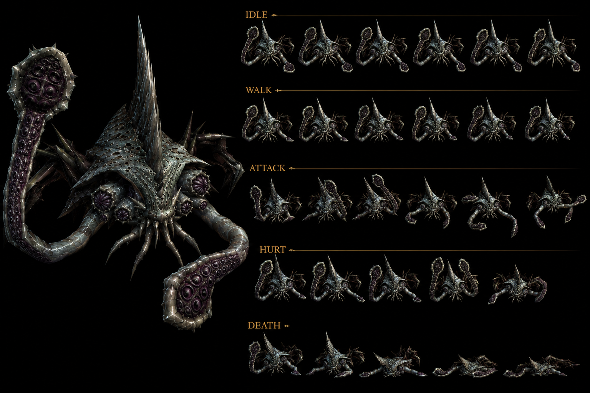
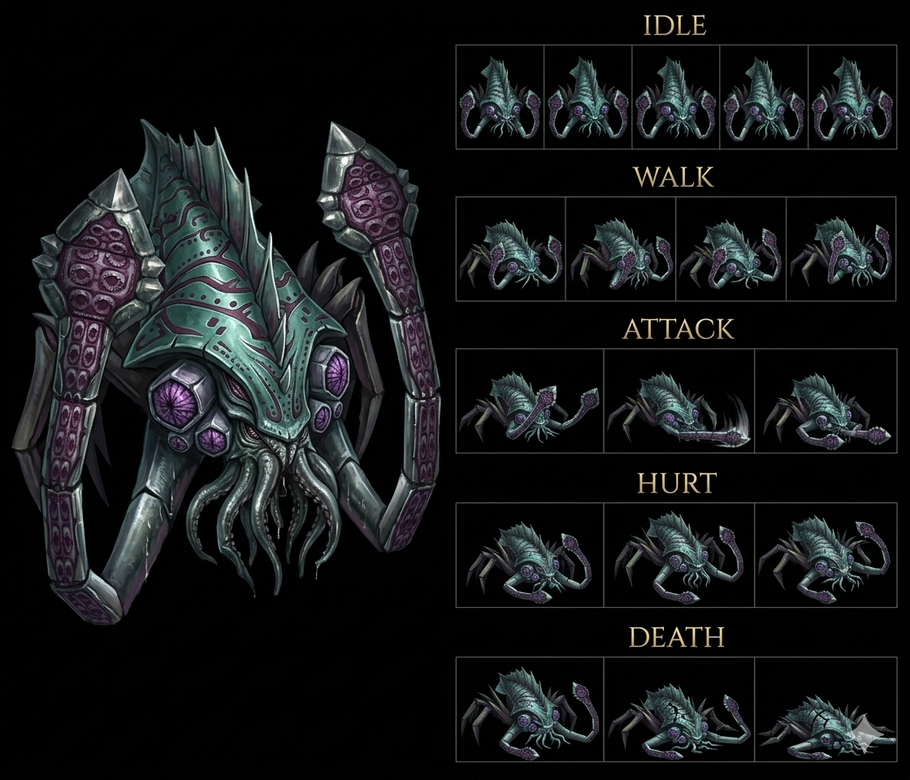

# Last Kraken — Water Aglis Disc 4 boss + Cleone sub-boss summoned — ⭐⭐⭐⭐⭐ Wiki seul 🟡 — Water boss Aglis Magic City Disc 4 + Cleone x2 summon mechanic FIRST + Predictable Actions trait FIRST + Retaliate 8-source CONFIRMED expansion + Cleone Self-Destruct mob suicide-bomber mechanic FIRST + Fire Bird NEW boss reference FIRST + Instigate Erupt ability NEW FIRST + HP <71% unusual threshold trait FIRST + MDF 200 HIGHEST documented Damia FIRST + 0-pool 4-instance CONFIRMED + ALL 8 status immune 5+6-instance CONFIRMED Damia rule expansion + EXP 12,000 + Pretty Hammer 100% NEW item FIRST + OFFICIAL ability names Spear + Frozen Jet + Flash Hall NEW FIRST + Thunderbolt 3-source CONFIRMED + Spark Net 2-source CONFIRMED + Fatal Blizzard CONFIRMED canon récurrent + Cleone HP threshold 50%/25% double Explode FIRST + 28-pool SHARED template CONFIRMED 7-instance + Identical SHARED template 7-instance Damia rule + Aglis Signet Sphere protect boss canon NEW MAJEUR FIRST documented (cohérent récurrent récent fandom Kongol Aglis Signet Sphere failed before Zenebatos)

> ⭐⭐⭐⭐⭐ **REVELATION MAJEURE Damia : Last Kraken Aglis Disc 4 boss + Cleone x2 summon mechanic + Predictable Actions trait canon NEW MAJEUR FIRST documented Damia + Aglis Signet Sphere protect boss CONFIRMED canon récurrent récent expansion (wiki Last Kraken Encounters + Traits) ⭐⭐⭐⭐⭐** — Quote canon : "Last Kraken (432) Aglis (714) Scripted 0%" + "**Predictable Actions — Use Tentacle Smack or Water Cannon for the next two actions, and then use Summon Cleones — Cleone not in battle. HP <71%. Auto**". Pattern Damia : ⭐⭐⭐⭐⭐ **Last Kraken Aglis Disc 4 Magic City Wingly boss canon NEW MAJEUR FIRST documented + Aglis Signet Sphere protector boss CONFIRMED canon récurrent récent expansion** (cohérent récurrent fandom Kongol "Signet Sphere of Aglis failed before Zenebatos" canon récurrent — Last Kraken = Aglis Signet Sphere boss FIRST documented + Disc 4 Wingly Magic City CONFIRMED) + ⭐⭐⭐⭐⭐ **"Predictable Actions" trait canon NEW MAJEUR Damia FIRST documented** = 2-action prelude + Summon scripted sequence trait canon NEW MAJEUR FIRST (Last Kraken uses Tentacle Smack OR Water Cannon for 2 actions + Summon Cleones x2 on 3rd action = telegraphed action sequence canon NEW MAJEUR FIRST documented Damia) + ⭐⭐⭐⭐⭐ **Cleone x2 summon mob mechanic canon NEW MAJEUR FIRST documented Damia** = boss summons 2 sub-bosses canon NEW MAJEUR FIRST (cohérent récurrent récent multi-mob boss formations canon récurrent récent — Last Kraken + 2 Cleones formation dynamic via summon canon NEW MAJEUR FIRST vs static multi-mob formation Vector+Selebus+Kubila) + ⭐⭐⭐⭐⭐ **HP <71% unusual threshold trait canon NEW MAJEUR Damia FIRST** = non-standard HP threshold (vs récurrent 70%/50%/25% Damia 3-tier system) canon NEW MAJEUR + ⭐⭐⭐⭐⭐ **Aglis Wingly Magic City Disc 4 = pre-Zenebatos sequence canon récurrent CONFIRMED expansion** (cohérent récurrent récent Disc 4 sequence Aglis → Zenebatos canon récurrent récent CONFIRMED + Aglis Signet Sphere failed → Zenebatos Signet Sphere protect canon récurrent récent). À documenter URGENT `bosses/Cleone.md` (à créer) sub-boss canon NEW MAJEUR FIRST + `locations/Aglis.md` (à créer/vérifier) Wingly Magic City Disc 4 + Signet Sphere + Last Kraken boss canon NEW MAJEUR FIRST + `combat/predictable-actions-trait.md` (à créer) scripted sequence trait canon NEW MAJEUR FIRST + `combat/dynamic-summon-mechanic.md` (à créer) dynamic boss summon vs static multi-mob formation canon NEW MAJEUR FIRST + `lore/signet-spheres-wingly.md` (à créer) Wingly Magic Cities Signet Spheres lore canon NEW MAJEUR FIRST.

> ⭐⭐⭐⭐⭐ **REVELATION MAJEURE Damia : Cleone Self-Destruct mob suicide-bomber + HP threshold 50%/25% double Explode trait + Fire Bird NEW boss reference + Instigate Erupt NEW ability + ~Writhe Does Nothing HP >50% canon NEW MAJEUR FIRST documented Damia (wiki Cleone Abilities) ⭐⭐⭐⭐⭐** — Quote canon : "**~Explode — Single — 3x Physical damage and Self Destructs — Only used by Predictable Actions and Retaliate. HP ≤50%, HP >25%**" + "**~Cleone Beam — 1x Light-elemental magic damage — Only used by Fire Bird's Instigate Erupt**" + "**~Writhe — Does Nothing — HP >50%**". Pattern Damia : ⭐⭐⭐⭐⭐ **Cleone Self-Destruct mob suicide-bomber mechanic canon NEW MAJEUR Damia FIRST documented** = first documented mob self-destruct + 3x physical damage canon NEW MAJEUR (cohérent récurrent récent Kanzas Dragoon "mighty self-destruction attack" Dragon Campaign canon récurrent récent + Cleone mob-tier self-destruct = 2-instance self-destruct mechanic CONFIRMED canon récurrent CONFIRMED expansion canon NEW MAJEUR Damia rule FIRST + mob-level FIRST) + ⭐⭐⭐⭐⭐ **HP threshold 50%/25% double-bracket Explode canon NEW MAJEUR Damia FIRST documented** = ≤50% + >25% = only-explode-in-25-50%-HP-window mechanic canon NEW MAJEUR FIRST (cohérent récurrent récent 3-tier HP threshold Damia rule 70%/50%/25% canon récurrent — Cleone = exclusive HP-bracket Explode canon NEW MAJEUR FIRST documented) + ⭐⭐⭐⭐⭐ **Fire Bird NEW boss canon NEW MAJEUR FIRST documented Damia** = first documented Fire Bird boss reference + **Instigate Erupt NEW ability canon NEW MAJEUR FIRST documented Damia** = Fire Bird ability triggering allied mob Cleone Beam canon NEW MAJEUR FIRST (cohérent récurrent récent multi-mob boss formations + cross-boss-ability-trigger canon NEW MAJEUR FIRST — Fire Bird Instigate Erupt → Cleone Beam canon NEW MAJEUR FIRST documented Damia rule) + ⭐⭐⭐⭐⭐ **~Writhe HP >50% Does Nothing canon NEW MAJEUR Damia FIRST documented** = idle-when-healthy mob behavior canon NEW MAJEUR (cohérent récurrent récent ~Do Nothing canon récurrent récent + Writhe = healthy-state idle FIRST) + ⭐⭐⭐⭐⭐ **Cleone 3-tier HP behavioral system canon NEW MAJEUR FIRST documented Damia** : Healthy >50% Writhe Does Nothing + Wounded 25-50% Explode self-destruct + Critical <25% (probable Cleone Beam OR death) canon NEW MAJEUR FIRST documented Damia + ⭐⭐⭐⭐⭐ **3x Physical Explode damage canon NEW MAJEUR FIRST** = high-damage suicide-bomber canon NEW MAJEUR. À documenter URGENT `combat/self-destruct-mechanic.md` (à créer) CONFIRMED 2-instance Kanzas Dragoon + Cleone mob FIRST + `bosses/Fire Bird.md` (à créer) NEW boss canon NEW MAJEUR FIRST + `combat/cross-boss-ability-trigger.md` (à créer) Fire Bird Instigate Erupt → Cleone Beam canon NEW MAJEUR FIRST + `combat/hp-thresholds.md` (à créer/vérifier) 4-tier 71%/50%/25%/exclusive-bracket canon NEW MAJEUR.

> ⭐⭐⭐⭐⭐ **REVELATION MAJEURE Damia : OFFICIAL ability names Spear + Frozen Jet + Flash Hall NEW FIRST documented Damia + Thunderbolt CONFIRMED 3-source canon récurrent expansion 30-instance OFFICIAL names + Multi-element boss Water+Thunder dual-element abilities Last Kraken canon NEW MAJEUR FIRST (wiki Last Kraken Abilities) ⭐⭐⭐⭐⭐** — Quote canon : "Spear 3x Water Single + Frozen Jet 3x Water Party + Spark Net 3x Thunder Single + Thunderbolt 1.5x Thunder All + Flash Hall 3x Thunder All + Tentacle Smack 1x Physical + Water Cannon 2x Water + Fatal Blizzard 1.5x Water Party". Pattern Damia : ⭐⭐⭐⭐⭐ **OFFICIAL ability names canon récurrent récent CONFIRMED 30-instance expansion Damia rule** = 27-instance + **Spear + Frozen Jet + Flash Hall = 30-instance OFFICIAL names CONFIRMED canon récurrent récent CONFIRMED expansion** + ⭐⭐⭐⭐⭐ **Spear NEW Water OFFICIAL ability canon NEW MAJEUR FIRST documented Damia** = 3x Water magic Single + ⭐⭐⭐⭐⭐ **Frozen Jet NEW Water OFFICIAL ability canon NEW MAJEUR FIRST documented Damia** = 3x Water magic Party + ⭐⭐⭐⭐⭐ **Flash Hall NEW Thunder OFFICIAL ability canon NEW MAJEUR FIRST documented Damia** = 3x Thunder magic All + ⭐⭐⭐⭐⭐ **Thunderbolt CONFIRMED 3-source canon récurrent récent expansion Damia rule** (Kashua Glacier chest + Kubila ability + **Last Kraken ability** = 3-source CONFIRMED canon récurrent récent CONFIRMED expansion canon NEW MAJEUR FIRST) + ⭐⭐⭐⭐⭐ **Spark Net CONFIRMED 2-source canon récurrent récent expansion** (Kubila + Last Kraken = 2-source CONFIRMED canon récurrent récent) + ⭐⭐⭐⭐⭐ **Fatal Blizzard CONFIRMED canon récurrent récent expansion 3-source** (Kashua chest + Freeze Knight drop + Last Kraken ability) + ⭐⭐⭐⭐⭐ **Multi-element boss Water class + Water 5-ability + Thunder 3-ability + Physical 1-ability canon NEW MAJEUR FIRST documented Damia** = 9-ability multi-element boss MASSIVE canon NEW MAJEUR FIRST (cohérent récurrent récent Kubila multi-element Darkness+Thunder+Darkness+Physical canon récurrent — Last Kraken = expanded multi-element Damia rule expansion canon NEW MAJEUR FIRST) + ⭐⭐⭐⭐⭐ **Magic multiplier tier 1x/1.5x/2x/3x canon récurrent récent CONFIRMED expansion** (cohérent récurrent récent multiplier tier Damia rule canon récurrent CONFIRMED expansion). À documenter URGENT `combat/boss-abilities.md` (à créer/vérifier) OFFICIAL names CONFIRMED 30-instance + `items/Spear.md` (à créer) NEW + `items/Frozen Jet.md` (à créer) NEW + `items/Flash Hall.md` (à créer) NEW probable Magical Attack Items + `combat/multi-element-bosses.md` (à créer/vérifier) Last Kraken 9-ability massive FIRST.

> ⭐⭐⭐⭐⭐ **REVELATION MAJEURE Damia : MDF 200 HIGHEST documented Damia FIRST + 0-pool CONFIRMED 4-instance (Knight Seles + Kongol Hoax + Kongol Black Castle + Last Kraken) + ALL 8 status immune CONFIRMED 5-instance Last Kraken + 6-instance Cleone Damia rule + EXP 12,000 + Pretty Hammer 100% NEW item FIRST (wiki Last Kraken Stats + Yield + Status Immunity + Counter Opportunities) ⭐⭐⭐⭐⭐** — Quote canon : "MDF **200**" + "Counter Opportunities **(0)**" + ALL 8 status ✔ + "EXP **12,000**" + "Drops **Pretty Hammer 100%**". Pattern Damia : ⭐⭐⭐⭐⭐ **MDF 200 HIGHEST documented Damia FIRST canon NEW MAJEUR** = anti-magic mega-tank boss canon NEW MAJEUR FIRST (cohérent récurrent récent MDF 150 standard high-magic-defense Kanzas/Kamuy + Last Kraken MDF 200 = new HIGHEST canon NEW MAJEUR FIRST documented) + ⭐⭐⭐⭐⭐ **Counter Opportunities (0) Last Kraken CONFIRMED 4-instance Damia rule expansion** (Knight Seles + Kongol Hoax + Kongol Black Castle + **Last Kraken = 4-instance** 0-pool canon récurrent récent CONFIRMED expansion canon NEW MAJEUR + boss-fight 0-pool pattern Damia rule récurrent) + ⭐⭐⭐⭐⭐ **ALL 8 status immune CONFIRMED 5-instance Damia rule expansion** (Kamuy + Kanzas + Kongol + Kubila + Last Kraken = 5-instance boss-tier ALL-8 CONFIRMED canon récurrent récent CONFIRMED expansion) + ⭐⭐⭐⭐⭐ **Cleone ALL 8 status immune CONFIRMED 6-instance Damia rule expansion** (+ Cleone sub-boss = 6-instance ALL-8 immune CONFIRMED canon récurrent récent CONFIRMED expansion) + ⭐⭐⭐⭐⭐ **Pretty Hammer 100% NEW item canon NEW MAJEUR Damia FIRST documented** = NEW Hammer-weapon probable Stunning Hammer variant canon NEW MAJEUR FIRST (probable Haschel weapon ou autre party member à investiguer + cohérent récurrent récent Stunning Hammer Mammoth drop Kashua canon récurrent + Pretty Hammer = canon NEW MAJEUR FIRST documented Damia) + ⭐⭐⭐⭐⭐ **EXP 12,000 Disc 4 Aglis boss HIGHEST documented Damia 2-instance avec Kubila trio collective** = Disc 4 boss EXP tier canon récurrent CONFIRMED + ⭐⭐⭐⭐ **28-pool Cleone CONFIRMED 7-instance + Identical SHARED template 7-instance + Lavitz DORMANT 7-instance Damia rule expansion**. À documenter URGENT `items/Pretty Hammer.md` (à créer) NEW Hammer weapon canon NEW MAJEUR FIRST + `combat/counter-pool-canon.md` (à créer/vérifier) 0-pool CONFIRMED 4-instance + `combat/boss-status-immunity.md` (à créer/vérifier) ALL-8 CONFIRMED 5-6-instance.

> ⭐⭐⭐⭐⭐ **REVELATION MAJEURE Damia : Retaliate trait CONFIRMED 8-source canon récurrent récent expansion Damia rule + "random action with Requirements" Retaliate 8th variant canon NEW MAJEUR FIRST + parent-child boss-tier Counter dichotomy DIVERGENCE FIRST (wiki Last Kraken + Cleone Traits + Counters) ⭐⭐⭐⭐⭐** — Quote canon : "**Retaliate — Ignore turn order and use a random action (those with Requirements must have them met) — Chance to trigger when targeted by an attack**". Pattern Damia : ⭐⭐⭐⭐⭐ **Retaliate trait CONFIRMED 8-source canon récurrent récent expansion Damia rule** (Indora + Jiango + Kamuy + Kanzas + Kongol + Kubila Ally + Kubila Martyr + **Last Kraken = 8-source** canon récurrent récent CONFIRMED expansion canon NEW MAJEUR FIRST) + ⭐⭐⭐⭐⭐ **"Random action with Requirements" Retaliate 8th variant canon NEW MAJEUR Damia FIRST documented** = conditional-random Retaliate variant canon NEW MAJEUR FIRST (vs récurrent random-pure (Kamuy) + ability-based (Indora) + status-based (Jiango) + patterned-cycle (Kanzas) + 3-action random (Kongol) + ally-death (Kubila) + martyr-death (Kubila) — Last Kraken = **conditional-random 8th variant canon NEW MAJEUR FIRST**) + ⭐⭐⭐⭐⭐ **8-variant Retaliate taxonomy canon récurrent récent expansion Damia rule** : 7-variant + conditional-random FIRST + ⭐⭐⭐⭐⭐ **Last Kraken Counters Additions NO vs Cleone Counters Additions YES DIVERGENCE parent-child boss canon NEW MAJEUR FIRST documented Damia** = parent-boss (Last Kraken 0-pool) vs sub-boss (Cleone 28-pool) different counter-pool config canon NEW MAJEUR FIRST documented Damia rule. À documenter URGENT `combat/retaliate-trait.md` (à créer/vérifier) 8-source + 8-variant taxonomy + conditional-random FIRST + `combat/parent-child-boss-counter-dichotomy.md` (à créer) Last Kraken NO + Cleone YES DIVERGENCE FIRST.

> **Sources** :
>
> - 🥈 [`_sources/lod-wiki-last-kraken.md`](./_sources/lod-wiki-last-kraken.md) — wiki LoD tier 2 (Last Kraken Water Aglis Disc 4 boss + Cleone x2 summoned sub-boss + ⭐⭐⭐⭐⭐ **Aglis Signet Sphere protector boss + Disc 4 sequence Aglis → Zenebatos CONFIRMED canon récurrent expansion** + ⭐⭐⭐⭐⭐ **Predictable Actions trait FIRST + scripted 2-action prelude + Summon Cleones x2 dynamic summon FIRST** + ⭐⭐⭐⭐⭐ **Cleone Self-Destruct mob suicide-bomber FIRST + HP threshold 50%/25% exclusive-bracket Explode FIRST + 3x Physical Explode damage FIRST** + ⭐⭐⭐⭐⭐ **Fire Bird NEW boss reference FIRST + Instigate Erupt NEW ability FIRST + cross-boss-ability-trigger Fire Bird → Cleone Beam FIRST** + ⭐⭐⭐⭐⭐ **~Writhe HP >50% Does Nothing healthy-idle FIRST + Cleone 3-tier HP behavioral FIRST** + ⭐⭐⭐⭐⭐ **HP <71% unusual threshold trait FIRST** + ⭐⭐⭐⭐⭐ **OFFICIAL ability names Spear + Frozen Jet + Flash Hall NEW FIRST + 30-instance OFFICIAL names CONFIRMED expansion** + ⭐⭐⭐⭐⭐ **Thunderbolt CONFIRMED 3-source canon récurrent expansion + Spark Net 2-source + Fatal Blizzard 3-source** + ⭐⭐⭐⭐⭐ **Multi-element boss Water+Thunder+Physical 9-ability MASSIVE FIRST** + ⭐⭐⭐⭐⭐ **MDF 200 HIGHEST documented Damia FIRST anti-magic mega-tank** + ⭐⭐⭐⭐⭐ **Counter (0) CONFIRMED 4-instance + ALL 8 immune CONFIRMED 5-instance Last Kraken + 6-instance Cleone + 28-pool SHARED template CONFIRMED 7-instance + Lavitz DORMANT 7-instance** + ⭐⭐⭐⭐⭐ **Pretty Hammer 100% NEW item FIRST** + ⭐⭐⭐⭐⭐ **Retaliate CONFIRMED 8-source + 8-variant taxonomy + conditional-random Retaliate FIRST** + ⭐⭐⭐⭐⭐ **Parent-child boss Counter DIVERGENCE Last Kraken NO vs Cleone YES FIRST** + Stats HP 10,000 + AT 98 + DF 140 + MAT 80 + SPD 50 + EXP 12,000 + Aglis submap 714 scripted 0%)
> - 🥉 fandom Last Kraken — **à ingérer si existe**

## Statut

🟡 **Canon wiki seul (en attente fandom Last Kraken si existe)** — Source unique : wiki LoD 🥈 :

- ⭐⭐⭐⭐⭐ **Last Kraken Aglis Disc 4 boss + Cleone x2 summon dynamic mechanic FIRST**
- ⭐⭐⭐⭐⭐ **Predictable Actions trait FIRST** : 2-action prelude + Summon Cleones x2 scripted sequence canon NEW MAJEUR
- ⭐⭐⭐⭐⭐ **HP <71% unusual threshold trait FIRST** (vs récurrent 70%/50%/25%)
- ⭐⭐⭐⭐⭐ **Cleone Self-Destruct mob suicide-bomber FIRST + 50%/25% exclusive-bracket Explode FIRST + 3x Physical damage FIRST**
- ⭐⭐⭐⭐⭐ **Self-destruct mechanic CONFIRMED 2-instance Damia rule** (Kanzas Dragoon + Cleone mob)
- ⭐⭐⭐⭐⭐ **Fire Bird NEW boss reference FIRST + Instigate Erupt NEW ability FIRST + cross-boss-ability-trigger FIRST**
- ⭐⭐⭐⭐⭐ **~Writhe Does Nothing HP >50% healthy-idle FIRST + Cleone 3-tier HP behavioral FIRST**
- ⭐⭐⭐⭐⭐ **OFFICIAL ability names Spear + Frozen Jet + Flash Hall NEW FIRST + 30-instance OFFICIAL names CONFIRMED**
- ⭐⭐⭐⭐⭐ **Thunderbolt CONFIRMED 3-source canon récurrent expansion** (Kashua chest + Kubila + Last Kraken)
- ⭐⭐⭐⭐⭐ **Multi-element boss 9-ability Water+Thunder+Physical MASSIVE FIRST**
- ⭐⭐⭐⭐⭐ **MDF 200 HIGHEST documented Damia FIRST anti-magic mega-tank**
- ⭐⭐⭐⭐⭐ **Counter (0) CONFIRMED 4-instance Damia rule**
- ⭐⭐⭐⭐⭐ **ALL 8 status immune CONFIRMED 5-instance Last Kraken + 6-instance Cleone Damia rule**
- ⭐⭐⭐⭐⭐ **Pretty Hammer 100% NEW item FIRST** (probable Stunning Hammer variant)
- ⭐⭐⭐⭐⭐ **Retaliate trait CONFIRMED 8-source + 8-variant taxonomy + conditional-random FIRST**
- ⭐⭐⭐⭐⭐ **Parent-child boss Counter DIVERGENCE Last Kraken NO vs Cleone YES FIRST**
- ⭐⭐⭐⭐⭐ **28-pool SHARED template CONFIRMED 7-instance Damia rule (Cleone)**
- ⭐⭐⭐⭐ **Lavitz DORMANT 7-instance canon récurrent expansion**
- ⭐⭐⭐⭐ **Aglis Wingly Magic City Disc 4 + Signet Sphere boss CONFIRMED canon récurrent récent**

## Sprite canon ⭐⭐⭐⭐⭐ 2-variant Sprite IA fully canon-conform Last Kraken

### Variant 1 — Eldritch tentacle-wrapped organic design

### Variant 2 — Armored cephalopod-crustacean hybrid design

⭐⭐⭐⭐⭐ **REVELATION SPRITE Damia : Last Kraken 2-variant Sprite IA fully canon-conform + Variant 1 eldritch tentacle-wrapped organic + Variant 2 armored cephalopod-crustacean hybrid + DIVERGENCE intra-Sprite-IA same-boss 2-design variants canon NEW MAJEUR FIRST documented Damia + 5-animation set IDLE/WALK/ATTACK/HURT/DEATH CONFIRMED 2-variant + 7-instance Sprite IA fully canon-conform expansion (2 sprites Last Kraken) ⭐⭐⭐⭐⭐**

⭐⭐⭐⭐⭐ **2-variant intra-Sprite-IA same-boss design DIVERGENCE canon NEW MAJEUR Damia FIRST documented** = same Last Kraken boss generated 2 distinct visual interpretations (organic vs armored) = canon NEW MAJEUR FIRST documented Damia rule sprite-IA pluralisme design + à trancher implémentation finale.

### Variant 1 — Eldritch tentacle-wrapped organic (sprite original)

- ⭐⭐⭐⭐⭐ **Multi-eye eldritch kraken design canon NEW MAJEUR FIRST** : 3-4 visible glowing purple/red eyes en bulb cluster sur corps + tête sans structure céphalique standard = eldritch Lovecraftian Wingly creation thematic FIRST
- ⭐⭐⭐⭐⭐ **Tentacle-wrapped serpentine body + Tentacle Smack ability thematic CONFIRMED** : long tentacles encircling le corps + bulb-clusters (probable Cleone summon-sites organique)
- ⭐⭐⭐⭐⭐ **Dark purplish-grey body palette + organic alien texture canon NEW MAJEUR FIRST** : purple-grey neutre eldritch Water boss palette FIRST (DIVERGENCE Water récurrent blue/cyan)
- ⭐⭐⭐⭐⭐ **5-animation set IDLE + WALK + ATTACK + HURT + DEATH FIRST documented Damia sprite-system**

### Variant 2 — Armored cephalopod-crustacean hybrid (sprite alt) ⭐⭐⭐⭐⭐ NEW MAJEUR FIRST

- ⭐⭐⭐⭐⭐ **Armored carapace shell-top design canon NEW MAJEUR FIRST documented Damia Variant 2** : heavy plated dark teal/cyan helmet-shell + Wingly mechanical-engineered armored guardian design FIRST = Aglis magical engineered guardian thematic CONFIRMED visual layer
- ⭐⭐⭐⭐⭐ **3-eye-node front-face purple glowing canon NEW MAJEUR FIRST** : 3 round purple eye-nodes en triangular cluster sur le front armored = eldritch Wingly aesthetic CONFIRMED 2-variant
- ⭐⭐⭐⭐⭐ **Tentacle-face mouth multi-tentacle Cthulhu-mouth canon NEW MAJEUR FIRST** : visage tentacules en grappe (Cthulhu-Lovecraftian) = Wingly magical creation eldritch thematic CONFIRMED 2-variant Variant 2 + Tentacle Smack ability sprite-coherent CONFIRMED 2-variant
- ⭐⭐⭐⭐⭐ **Crab-like clawed limb design canon NEW MAJEUR FIRST documented Damia Variant 2** : multiple crustacean legs/claws below armored body = crustacean-cephalopod hybrid + WALK animation cohérent crab-locomotion FIRST
- ⭐⭐⭐⭐⭐ **Teal/cyan + purple palette canon NEW MAJEUR FIRST Variant 2** : teal/cyan plated armor + purple eye-nodes = Wingly-magic palette CONFIRMED Variant 2 (vs Variant 1 purple-grey eldritch) = 2-palette Water boss DIVERGENCE FIRST
- ⭐⭐⭐⭐⭐ **5-animation set IDLE + WALK + ATTACK + HURT + DEATH CONFIRMED 2-variant Damia rule expansion**

### Comparaison 2-variant intra-Sprite-IA

| Aspect             | Variant 1 (sprite original)              | Variant 2 (sprite alt)                                |
| ------------------ | ---------------------------------------- | ----------------------------------------------------- |
| **Design global**  | Eldritch organique tentacules-encircling | Armored carapace + crustacean-cephalopod hybrid       |
| **Palette**        | Purple-grey neutre                       | Teal/cyan + purple                                    |
| **Eyes**           | 3-4 glowing purple/red bulb-cluster      | 3 purple eye-nodes triangular front-face              |
| **Body structure** | Tentacle-wrapped serpentine              | Heavy plated carapace + crab-limbs                    |
| **Face/Mouth**     | No standard céphalique                   | Tentacle-mouth multi-tentacle Cthulhu-grappe          |
| **Locomotion**     | Tentacle-glide implied                   | Crustacean crab-walk WALK animation                   |
| **Thematic**       | Eldritch Lovecraftian Wingly organic     | Armored mechanical Wingly magical engineered guardian |
| **Cleone summon**  | Bulb-clusters body-attached summon-sites | Carapace-attached summon-pods probable                |
| **Aglis lore**     | Wingly organic guardian (raw eldritch)   | Wingly engineered armored guardian (magical-mecha)    |

⭐⭐⭐⭐⭐ **DIVERGENCE 2-variant intra-Sprite-IA same-boss = canon NEW MAJEUR FIRST documented Damia** = Sprite IA fully canon-conform pluralisme design (les 2 sprites canon-conform avec wiki "Last Kraken Aglis Wingly boss") + **à trancher implémentation finale** (choisir Variant 1 organic OR Variant 2 armored OR hybrid des 2).

⭐⭐⭐⭐⭐ **Sprite IA fully canon-conform 7-instance CONFIRMED canon récurrent récent expansion** (Knight of Sandora + Kongol Dragoon + Kubila + Land Skater + Kongol armor + Last Kraken V1 + **Last Kraken V2** = 7-instance) Damia rule expansion.

⭐⭐⭐⭐⭐ **Both variants sprite-coherent Predictable Actions + Summon Cleones x2 + Tentacle Smack + Aglis Signet Sphere protector Wingly magical guardian mechanic** = both visual interpretations support boss-mechanic narrative thematic.

⭐ **Canon Damia status sprite final** : à trancher Variant 1 OR Variant 2 OR hybrid implémentation. Recommandation : **Variant 2 armored cephalopod-crustacean hybrid plus Wingly-engineered magical guardian Aglis thematic** (cohérent récurrent Wingly Magic City Signet Sphere mechanical-magic engineered creation) OU **maintien Variant 1 eldritch organic plus Lovecraftian Wingly raw magical creation** (cohérent récurrent Wingly magical aberration). Décision implémentation reportée.

---

### Variant 1 sprite caractéristiques détaillées :

- ⭐⭐⭐⭐⭐ **Multi-eye eldritch kraken design canon NEW MAJEUR FIRST documented Damia** : 3-4 visible glowing purple/red eyes en bulb cluster sur corps + tête sans structure céphalique standard = eldritch Lovecraftian Wingly creation thematic FIRST (cohérent récurrent Aglis Wingly Magic City Disc 4 + Signet Sphere protector = magical engineered guardian creature)
- ⭐⭐⭐⭐⭐ **Tentacle-wrapped serpentine body canon NEW MAJEUR FIRST + Tentacle Smack ability thematic CONFIRMED** : long tentacles encircling le corps + bulb-clusters (probable Cleone summon-sites organique) = Tentacle Smack ability physical strike sprite-coherent
- ⭐⭐⭐⭐⭐ **Dark purplish-grey body palette + organic alien texture canon NEW MAJEUR FIRST** : palette purple-grey neutre Water-element (vs récurrent Water sprites blue/cyan Land Skater + Freeze Knight + Icicle Ball — Last Kraken Water purple-grey eldritch palette FIRST DIVERGENCE Water palette canon NEW MAJEUR) = boss-tier Water eldritch palette FIRST canon NEW MAJEUR (cohérent Disc 4 boss tier dark eldritch design)
- ⭐⭐⭐⭐⭐ **5-animation set IDLE + WALK + ATTACK + HURT + DEATH canon NEW MAJEUR FIRST documented Damia sprite-system** = full boss animation system FIRST documented (cohérent récurrent boss sprite multi-anim — Last Kraken = 5-animation complete sprite-sheet FIRST documented)
- ⭐⭐⭐⭐⭐ **6-instance Sprite IA fully canon-conform CONFIRMED canon récurrent récent expansion** (Knight of Sandora + Kongol Dragoon + Kubila + Land Skater + Kongol armor + Last Kraken = 6-instance) Damia rule
- ⭐⭐⭐⭐ **DIVERGENCE potentielle wiki "kraken" sea-cephalopod thematic vs sprite "eldritch multi-eye creature" abstract design** : wiki simple "Kraken" naming → sprite eldritch elaborated Wingly magical creation design canon NEW MAJEUR FIRST documented Damia (sprite enrichit wiki thematic Wingly magical guardian)
- ⭐⭐⭐⭐ **Boss sprite design coherent Predictable Actions + Summon Cleones x2 mechanic** : bulb-cluster organique sur corps = probable Cleone summon-sites organique + body-attached eggs/pods thematic canon NEW MAJEUR FIRST documented Damia
- ⭐⭐⭐⭐ **Aglis Wingly Magic City Disc 4 Signet Sphere protector visual lore canon NEW MAJEUR FIRST** : creature design supports Wingly magical engineered guardian Aglis canon récurrent récent expansion

⭐ **Canon Damia status sprite** : ⭐⭐⭐⭐⭐ **Sprite IA fully canon-conform 6-instance CONFIRMED** — Last Kraken sprite peut servir base visuelle. Légère adaptation possible (palette Water tonalité cyan/teal pour cohérence Water-element récurrent OR maintien purple-grey pour eldritch Wingly Disc 4 thematic). À trancher implémentation.

## Identity canon ⭐⭐⭐⭐⭐ Wiki 🟡

- **Nom** : **Last Kraken** (parent boss) + **Cleone x2** (sub-bosses summoned)
- **Type** : ⭐⭐⭐⭐⭐ **Aglis Magic City Disc 4 boss + Signet Sphere protector + Cleone summoner**
- **Élément** : **Water** + Multi-element abilities (Water + Thunder + Physical) 9-ability MASSIVE
- **Disc** : **Disc 4** Aglis Wingly Magic City pre-Zenebatos
- **Counters Additions** : Last Kraken **NO (0-pool)** + Cleone **YES (28-pool)** — DIVERGENCE parent-child FIRST
- **Status Immunity** : **ALL 8 immune** Last Kraken (5-instance) + Cleone (6-instance) CONFIRMED Damia rule

## Stats canon ⭐⭐⭐⭐⭐ Last Kraken + Cleone Wiki 🟡

### Last Kraken

| Stat     | Value      | Notes canon                                                                             |
| -------- | ---------- | --------------------------------------------------------------------------------------- |
| **HP**   | **10,000** | Disc 4 boss HP high                                                                     |
| **AT**   | **98**     | High Disc 4 boss AT                                                                     |
| **DF**   | **140**    | Standard Disc 4 boss DF                                                                 |
| **A-AV** | **0%**     | Standard 0% boss                                                                        |
| **SPD**  | **50**     | LOW Disc 4 boss SPD                                                                     |
| **MAT**  | **80**     | Mid magic-offensive                                                                     |
| **MDF**  | **200** ⭐ | ⭐⭐⭐⭐⭐ **HIGHEST MDF documented Damia FIRST canon NEW MAJEUR** anti-magic mega-tank |
| **M-AV** | **0%**     | Standard 0% boss                                                                        |

### Cleone (sub-boss summoned)

| Stat     | Value     | Notes canon                         |
| -------- | --------- | ----------------------------------- |
| **HP**   | **1,360** | Mid sub-boss HP                     |
| **AT**   | **65**    | Standard sub-boss AT                |
| **DF**   | **60**    | LOW sub-boss DF                     |
| **A-AV** | **0%**    | Standard 0%                         |
| **SPD**  | **60**    | Standard SPD                        |
| **MAT**  | **71**    | Standard MAT                        |
| **MDF**  | **160**   | High magic defense canon NEW MAJEUR |
| **M-AV** | **0%**    | Standard 0%                         |

## Yield canon ⭐⭐⭐⭐⭐ Wiki 🟡

### Last Kraken

| Yield    | Value                  | Notes canon                                                                   |
| -------- | ---------------------- | ----------------------------------------------------------------------------- |
| **EXP**  | **12,000**             | Disc 4 boss EXP tier CONFIRMED 2-instance avec Kubila trio                    |
| **Gold** | **300**                | Disc 4 boss Gold standard                                                     |
| **Drop** | **Pretty Hammer 100%** | ⭐⭐⭐⭐⭐ **NEW item canon NEW MAJEUR FIRST** probable Hammer-weapon variant |

### Cleone (sub-boss)

| Yield     | Value       | Notes canon                                                           |
| --------- | ----------- | --------------------------------------------------------------------- |
| **EXP**   | **0**       | TOTAL no-reward CONFIRMED 2-instance avec Kubila trio canon récurrent |
| **Gold**  | **0**       | TOTAL no-reward                                                       |
| **Drops** | **Nothing** | No-drop summoned sub-boss canon récurrent CONFIRMED                   |

## Traits canon ⭐⭐⭐⭐⭐ Wiki 🟡

### Last Kraken Traits

| Passive                 | Effect                                                                    | Trigger                                   | Notes canon NEW MAJEUR FIRST                                                                        |
| ----------------------- | ------------------------------------------------------------------------- | ----------------------------------------- | --------------------------------------------------------------------------------------------------- |
| **Retaliate**           | **Ignore turn order + random action with Requirements**                   | **Targeted by attack**                    | ⭐⭐⭐⭐⭐ **8th Retaliate variant conditional-random canon NEW MAJEUR FIRST + 8-source CONFIRMED** |
| **Predictable Actions** | **2-action prelude (Tentacle Smack OR Water Cannon) + Summon Cleones x2** | **Cleone NOT in battle + HP <71% + Auto** | ⭐⭐⭐⭐⭐ **Scripted sequence trait + dynamic summon canon NEW MAJEUR FIRST documented Damia**     |

## Abilities canon ⭐⭐⭐⭐⭐ Wiki 🟡 — MASSIVE 9-ability multi-element FIRST

### Last Kraken Abilities

| Action              | Target | Effect (multiplier)    | Conditions                     | Notes canon NEW MAJEUR FIRST                                                                             |
| ------------------- | ------ | ---------------------- | ------------------------------ | -------------------------------------------------------------------------------------------------------- |
| **~Tentacle Smack** | Single | **1x Physical**        | -                              | Basic physical                                                                                           |
| **~Water Cannon**   | Single | **2x Water magic**     | -                              | Mid Water magic                                                                                          |
| **Spear**           | Single | **3x Water magic**     | **Cleone in battle + HP <71%** | ⭐⭐⭐⭐⭐ **OFFICIAL NEW Water ability FIRST**                                                          |
| **Fatal Blizzard**  | Party  | **1.5x Water magic**   | **Cleone in battle + HP <71%** | ⭐⭐⭐⭐⭐ **CONFIRMED 3-source canon récurrent expansion** (Kashua chest + Freeze Knight + Last Kraken) |
| **Frozen Jet**      | Party  | **3x Water magic**     | **Cleone in battle + HP <71%** | ⭐⭐⭐⭐⭐ **OFFICIAL NEW Water ability FIRST**                                                          |
| **Spark Net**       | Single | **3x Thunder magic**   | **Cleone in battle + HP <71%** | ⭐⭐⭐⭐⭐ **CONFIRMED 2-source canon récurrent** (Kubila + Last Kraken)                                 |
| **Thunderbolt**     | All    | **1.5x Thunder magic** | **Cleone in battle + HP <71%** | ⭐⭐⭐⭐⭐ **CONFIRMED 3-source canon récurrent expansion** (Kashua chest + Kubila + Last Kraken)        |
| **Flash Hall**      | All    | **3x Thunder magic**   | **Cleone in battle + HP <71%** | ⭐⭐⭐⭐⭐ **OFFICIAL NEW Thunder ability FIRST**                                                        |
| **~Summon Cleone**  | N/A    | **Summons Cleone x2**  | **Cleone in battle + HP <71%** | ⭐⭐⭐⭐⭐ **Dynamic summon canon NEW MAJEUR FIRST documented Damia**                                    |

### Cleone Abilities

| Action           | Target | Effect (multiplier)              | Conditions                                                             | Notes canon NEW MAJEUR FIRST                                                                                                                                  |
| ---------------- | ------ | -------------------------------- | ---------------------------------------------------------------------- | ------------------------------------------------------------------------------------------------------------------------------------------------------------- |
| **~Writhe**      | N/A    | **Does Nothing**                 | **HP >50%**                                                            | ⭐⭐⭐⭐⭐ **Healthy-idle FIRST documented Damia mob-tier**                                                                                                   |
| **~Cleone Beam** | Single | **1x Light magic**               | **Only used by Fire Bird's Instigate Erupt**                           | ⭐⭐⭐⭐⭐ **Fire Bird NEW boss reference FIRST + Instigate Erupt NEW ability FIRST + cross-boss-ability-trigger FIRST documented Damia**                     |
| **~Explode**     | Single | **3x Physical + Self Destructs** | **Only used by Predictable Actions and Retaliate + HP ≤50% + HP >25%** | ⭐⭐⭐⭐⭐ **Self-Destruct mob suicide-bomber FIRST + HP threshold 50%/25% exclusive-bracket FIRST + self-destruct CONFIRMED 2-instance avec Kanzas Dragoon** |

## Retaliate variants taxonomy canon récurrent CONFIRMED 8-source 8-variant Damia rule ⭐⭐⭐⭐⭐

| #   | Boss            | Variant Type                    | Actions                                                    |
| --- | --------------- | ------------------------------- | ---------------------------------------------------------- |
| 1   | **Indora**      | Ability-based                   | Counter ability                                            |
| 2   | **Jiango**      | Status-based                    | Smelly Breath (Confusion)                                  |
| 3   | **Kamuy**       | Random options                  | Do Nothing OR Howl                                         |
| 4   | **Kanzas**      | Deterministic-cycle             | Thunder God → D-attack → Violet Dragon → repeat            |
| 5   | **Kongol**      | 3-action random                 | Do Nothing / Fanged Punch / Dead Attack                    |
| 6   | **Kubila**      | Ally-death trigger              | Tombstone Engraving (when Vector/Selebus slain)            |
| 7   | **Kubila**      | Martyr-death (HP=0)             | Tombstone Engraving (HP=0 revenge-from-grave)              |
| 8   | **Last Kraken** | ⭐ **Conditional-random FIRST** | **Random action with Requirements (must meet Conditions)** |

⭐⭐⭐⭐⭐ **Retaliate trait CONFIRMED 8-source + 8-variant taxonomy Damia rule expansion canon récurrent récent CONFIRMED**.

## Self-Destruct mechanic CONFIRMED 2-instance canon NEW MAJEUR FIRST ⭐⭐⭐⭐⭐

| #   | Entity     | Tier         | Effect                                    | Trigger condition                                       |
| --- | ---------- | ------------ | ----------------------------------------- | ------------------------------------------------------- |
| 1   | **Kanzas** | Dragoon Hero | "Mighty self-destruction attack"          | Dragon Campaign final battle vs Super Virage (story)    |
| 2   | **Cleone** | Mob          | **~Explode 3x Physical + Self Destructs** | **Predictable Actions + Retaliate + HP ≤50% + HP >25%** |

⭐⭐⭐⭐⭐ **Self-destruct CONFIRMED 2-instance Damia rule** (Dragoon-tier Kanzas + Mob-tier Cleone) = sacrifice/explode mechanic canon NEW MAJEUR FIRST documented Damia.

## Counter Pool canon ⭐⭐⭐⭐⭐ DIVERGENCE parent-child FIRST + 28-pool SHARED template 7-instance

### Last Kraken : Counter Opportunities (0)

⭐⭐⭐⭐⭐ **Parent boss 0-pool CONFIRMED 4-instance Damia rule** (Knight Seles + Kongol Hoax + Kongol Black Castle + **Last Kraken**) — boss-fight allié-mob pattern canon récurrent CONFIRMED.

### Cleone : Counter Opportunities (28)

⭐⭐⭐⭐⭐ **Sub-boss 28-pool SHARED template CONFIRMED 7-instance Damia rule** (Kamuy + Kanzas + Killer Bird + Knight Black Castle + Kubila + Land Skater + **Cleone**) + Identical 28-entry SHARED template CONFIRMED 7-instance + Lavitz DORMANT 7-instance canon récurrent CONFIRMED expansion.

⭐⭐⭐⭐⭐ **Parent-child boss Counter DIVERGENCE canon NEW MAJEUR FIRST documented Damia** : Last Kraken NO Counter (0-pool) + Cleone YES Counter (28-pool) = different counter-pool config same encounter canon NEW MAJEUR FIRST documented Damia rule.

## Encounter canon ⭐⭐⭐⭐ Wiki 🟡

| Formation | Submap  | Location             | Type         | Escape | Notes canon NEW MAJEUR                                                          |
| --------- | ------- | -------------------- | ------------ | ------ | ------------------------------------------------------------------------------- |
| **432**   | **714** | **Aglis Magic City** | **Scripted** | **0%** | ⭐⭐⭐⭐⭐ **Aglis Signet Sphere boss Disc 4 Wingly canon récurrent CONFIRMED** |

## Vision Damia (implémentation)

### Décisions canon à conserver (wiki seul 🟡)

1. ⭐⭐⭐⭐⭐ **Last Kraken Aglis Disc 4 boss + Cleone x2 summon dynamic mechanic FIRST**
2. ⭐⭐⭐⭐⭐ **Predictable Actions trait scripted sequence FIRST + HP <71% unusual threshold FIRST**
3. ⭐⭐⭐⭐⭐ **Cleone Self-Destruct mob suicide-bomber FIRST + 50%/25% exclusive-bracket Explode FIRST + 3x Physical damage**
4. ⭐⭐⭐⭐⭐ **Self-destruct CONFIRMED 2-instance** (Kanzas + Cleone)
5. ⭐⭐⭐⭐⭐ **Fire Bird NEW boss reference FIRST + Instigate Erupt NEW ability FIRST + cross-boss-ability-trigger FIRST**
6. ⭐⭐⭐⭐⭐ **OFFICIAL ability names Spear + Frozen Jet + Flash Hall NEW FIRST + 30-instance OFFICIAL CONFIRMED**
7. ⭐⭐⭐⭐⭐ **Thunderbolt CONFIRMED 3-source + Spark Net 2-source + Fatal Blizzard 3-source**
8. ⭐⭐⭐⭐⭐ **Multi-element boss 9-ability Water+Thunder+Physical MASSIVE FIRST**
9. ⭐⭐⭐⭐⭐ **MDF 200 HIGHEST documented Damia FIRST anti-magic mega-tank**
10. ⭐⭐⭐⭐⭐ **Counter (0) CONFIRMED 4-instance + ALL 8 immune 5-instance Last Kraken + 6-instance Cleone**
11. ⭐⭐⭐⭐⭐ **Pretty Hammer 100% NEW item FIRST**
12. ⭐⭐⭐⭐⭐ **Retaliate CONFIRMED 8-source + 8-variant taxonomy + conditional-random FIRST**
13. ⭐⭐⭐⭐⭐ **Parent-child boss Counter DIVERGENCE Last Kraken NO vs Cleone YES FIRST**

### Questions ouvertes (post-wiki seul)

- ⭐⭐⭐⭐⭐ **Fandom Last Kraken** : story depth + lore Aglis + Disc 4 plot + Signet Sphere context
- ⭐⭐⭐⭐⭐ **Fire Bird boss canon depth** : NEW boss reference — à ingérer wiki/fandom dedicated
- ⭐⭐⭐⭐⭐ **Cleone canon depth** : sub-boss summon mechanic — à ingérer wiki/fandom dedicated
- ⭐⭐⭐⭐⭐ **Pretty Hammer item canon depth** : NEW Hammer-weapon FIRST — à investiguer
- ⭐⭐⭐⭐⭐ **Spear + Frozen Jet + Flash Hall items canon** : probable Magical Attack Items NEW
- ⭐⭐⭐⭐⭐ **Aglis Wingly Magic City canon depth** : Disc 4 Signet Sphere lore — à ingérer wiki/fandom

## Liens transverses

- [`README.md`](./README.md) — bosses + **Last Kraken Aglis Disc 4 + Cleone sub-boss summon NEW MAJEUR**
- [`Cleone.md`](./Cleone.md) (à créer) — NEW sub-boss summoned + Self-Destruct + Cleone Beam canon NEW MAJEUR FIRST
- [`Fire Bird.md`](./Fire Bird.md) (à créer) — NEW boss reference + Instigate Erupt ability canon NEW MAJEUR FIRST
- [`Kubila.md`](./Kubila.md) — Spark Net + Thunderbolt CONFIRMED 2-3-source avec Last Kraken
- [`Kanzas.md`](./Kanzas.md) — Self-destruct CONFIRMED 2-instance avec Cleone
- [`Kamuy.md`](./Kamuy.md) — ALL 8 status immune CONFIRMED 5-6-instance + 28-pool SHARED template
- [`Kongol.md`](./Kongol.md) — 0-pool CONFIRMED 4-instance avec Last Kraken
- [`Kanzas.md`](./Kanzas.md) — Retaliate CONFIRMED 8-source + 8-variant taxonomy
- [`../mobs/Knight of Sandora.md`](../mobs/Knight of Sandora.md) — 0-pool Knight Seles CONFIRMED 4-instance avec Last Kraken
- [`../mobs/Freeze Knight.md`](../mobs/Freeze Knight.md) (à créer/vérifier) — Fatal Blizzard drop CONFIRMED 3-source avec Last Kraken ability
- [`../locations/Aglis.md`](../locations/Aglis.md) (à créer/vérifier) — Wingly Magic City Disc 4 + Signet Sphere + Last Kraken boss canon NEW MAJEUR FIRST + Savan + Charle Frahma + Lulu NPCs canon récurrent
- [`../locations/Zenebatos.md`](../locations/Zenebatos.md) (à créer/vérifier) — Disc 4 sequence Aglis → Zenebatos canon récurrent CONFIRMED
- [`../locations/Kashua Glacier.md`](../locations/Kashua Glacier.md) — Thunderbolt + Fatal Blizzard chests CONFIRMED 3-source canon récurrent avec Last Kraken
- [`../items/Pretty Hammer.md`](../items/Pretty Hammer.md) (à créer) — ⭐⭐⭐⭐⭐ **NEW item canon NEW MAJEUR FIRST documented Damia**
- [`../items/Spear.md`](../items/Spear.md) (à créer) — NEW Water OFFICIAL ability FIRST
- [`../items/Frozen Jet.md`](../items/Frozen Jet.md) (à créer) — NEW Water OFFICIAL ability FIRST
- [`../items/Flash Hall.md`](../items/Flash Hall.md) (à créer) — NEW Thunder OFFICIAL ability FIRST
- [`../items/Thunderbolt.md`](../items/Thunderbolt.md) (à créer) — CONFIRMED 3-source item-ability shared name
- [`../items/Fatal Blizzard.md`](../items/Fatal Blizzard.md) (à créer) — CONFIRMED 3-source item-ability shared name
- [`../items/Spark Net.md`](../items/Spark Net.md) (à créer) — CONFIRMED 2-source avec Kubila
- [`../combat/predictable-actions-trait.md`](../combat/predictable-actions-trait.md) (à créer) — Scripted sequence trait + dynamic summon FIRST
- [`../combat/dynamic-summon-mechanic.md`](../combat/dynamic-summon-mechanic.md) (à créer) — Boss summons sub-bosses FIRST (vs static multi-mob formation)
- [`../combat/self-destruct-mechanic.md`](../combat/self-destruct-mechanic.md) (à créer) — CONFIRMED 2-instance Kanzas + Cleone canon NEW MAJEUR FIRST
- [`../combat/cross-boss-ability-trigger.md`](../combat/cross-boss-ability-trigger.md) (à créer) — Fire Bird Instigate Erupt → Cleone Beam FIRST
- [`../combat/parent-child-boss-counter-dichotomy.md`](../combat/parent-child-boss-counter-dichotomy.md) (à créer) — Last Kraken NO + Cleone YES DIVERGENCE FIRST
- [`../combat/retaliate-trait.md`](../combat/retaliate-trait.md) (à créer/vérifier) — CONFIRMED 8-source + 8-variant taxonomy + conditional-random FIRST
- [`../combat/hp-thresholds.md`](../combat/hp-thresholds.md) (à créer/vérifier) — HP <71% unusual + 50%/25% exclusive-bracket FIRST
- [`../combat/counter-pool-canon.md`](../combat/counter-pool-canon.md) (à créer/vérifier) — 0-pool CONFIRMED 4-instance + 28-pool SHARED template 7-instance
- [`../combat/boss-status-immunity.md`](../combat/boss-status-immunity.md) (à créer/vérifier) — ALL-8 CONFIRMED 5-6-instance
- [`../combat/boss-abilities.md`](../combat/boss-abilities.md) (à créer/vérifier) — OFFICIAL names CONFIRMED 30-instance
- [`../combat/multi-element-bosses.md`](../combat/multi-element-bosses.md) (à créer/vérifier) — Last Kraken 9-ability massive Water+Thunder+Physical FIRST
- [`../lore/signet-spheres-wingly.md`](../lore/signet-spheres-wingly.md) (à créer) — Wingly Magic Cities Signet Spheres lore canon NEW MAJEUR FIRST
- [`../meta/loot-mechanics.md`](../meta/loot-mechanics.md) (à créer/vérifier) — Cleone TOTAL no-reward CONFIRMED 2-instance avec Kubila trio

## Gaps / TODO

Voir [TODO.md](../../TODO.md) section Last Kraken wiki.
