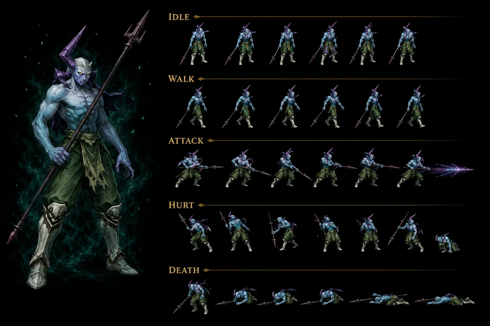

# Lavitz's Spirit — Wind Mayfil Disc 4 event boss + Zackwell partner formation — ⭐⭐⭐⭐⭐ Cross-source 🟢 — Wind Mayfil Disc 4 event boss + 4-trait MASSIVE boss kit (Retaliate + Damage Immunity + I'm Possessed + Summon Zackwell) FIRST + Damage Immunity directional facing-party trait FIRST + I'm Possessed turn-counter triggered state 4th-turn-away FIRST + Boss uses PLAYER additions Rod Typhoon + Flower Storm canon NEW MAJEUR FIRST + Talk-to-him OFFICIAL wiki 2-source CONFIRMED + ~Menon Ray 100% Confusion Party FIRST + Summon Zackwell HP=0 dynamic summon CONFIRMED 2-instance avec Last Kraken + Static formation 431 Lavitz Spirit + Zackwell (vs Last Kraken dynamic summon) + ALL 8 status immune CONFIRMED 6-instance Damia rule + Counter (0) CONFIRMED 5-instance Damia rule + OFFICIAL ability names Rod Typhoon + Flower Storm 32-instance expansion + 5-stat DIVERGENCE wiki vs fandom HP 5,000/6,400 + AT 88/99 + MAT 88/99 + EXP 12,000/0 + Gold 300/0 MASSIVE FIRST + Halberd 50% drop CONFIRMED 2-source + Mayfil submap 705 scripted

> ⭐⭐⭐⭐⭐ **REVELATION MAJEURE Damia : Lavitz's Spirit Wind Mayfil Disc 4 event boss + 4-trait MASSIVE boss kit (Retaliate + Damage Immunity + I'm Possessed + Summon Zackwell) canon NEW MAJEUR FIRST documented + Directional facing-party boss-trait FIRST + Boss uses PLAYER additions Rod Typhoon + Flower Storm canon NEW MAJEUR FIRST (wiki Lavitz' Spirit Traits + Abilities) ⭐⭐⭐⭐⭐** — Quote canon : "**Retaliate — Ignore turn order and use Rod Typhoon or Flower Storm — Must be facing the party + When targeted by an attack**" + "**Damage Immunity — All damage is reduced to 0 — Must be facing the party**" + "**I'm Possessed — Lavitz' Spirit will no longer turn to face the party — After turning away from the party for the 4th time: enable I'm Possessed**" + "**Summon Zackwell — Summon Zackwell to the battle — When HP =0**". Pattern Damia : ⭐⭐⭐⭐⭐ **4-trait MASSIVE boss kit canon NEW MAJEUR FIRST documented Damia** = Retaliate + Damage Immunity + I'm Possessed + Summon Zackwell = 4-passive event-boss complex AI FIRST (vs récurrent 1-2 traits standard) + ⭐⭐⭐⭐⭐ **Directional facing-party boss-trait mechanic canon NEW MAJEUR FIRST documented Damia** = facing-direction-determines-behavior mechanic FIRST = boss orientation 8-direction tracking FIRST = facing party → Damage Immunity + Retaliate active + facing away → vulnerable + Menon Ray + Turn Around + ⭐⭐⭐⭐⭐ **"Damage Immunity" trait canon NEW MAJEUR FIRST documented Damia** = invulnerable-while-facing-party + 0-damage mechanic FIRST (cohérent récurrent récent Lavitz Spirit event boss "cannot be damaged" fandom — wiki precise OFFICIAL mechanic Damage Immunity directional FIRST) + ⭐⭐⭐⭐⭐ **"I'm Possessed" trait turn-counter triggered state canon NEW MAJEUR FIRST documented Damia** = 4th-turn-away trigger + post-trigger state-lock "no longer turn to face party" = state-machine boss-mechanic FIRST = cohérent fandom "demonic device re-appears" mechanic 2nd-possession-cycle FIRST OFFICIAL wiki mechanic + ⭐⭐⭐⭐⭐ **"Summon Zackwell" trait HP=0 dynamic summon canon NEW MAJEUR FIRST documented Damia + CONFIRMED 2-instance dynamic boss summon Damia rule expansion** (Last Kraken Summon Cleones HP <71% + **Lavitz Spirit Summon Zackwell HP=0** = 2-instance dynamic boss summon CONFIRMED canon récurrent récent expansion canon NEW MAJEUR FIRST documented) + ⭐⭐⭐⭐⭐ **Boss uses PLAYER additions Rod Typhoon + Flower Storm canon NEW MAJEUR FIRST documented Damia** = first documented Damia rule boss-using-player-character-Additions (Lavitz Spirit ghost uses Lavitz's OWN player Additions Rod Typhoon + Flower Storm — narrative-coherent ghost mimics living-form abilities FIRST documented Damia rule + lore canon récurrent récent expansion) + ⭐⭐⭐⭐⭐ **Rod Typhoon 1.5x Physical + Flower Storm 2x Physical Retaliate-only canon NEW MAJEUR FIRST documented Damia + OFFICIAL ability names CONFIRMED 32-instance expansion** (30 + Rod Typhoon + Flower Storm = 32-instance OFFICIAL names canon récurrent récent CONFIRMED expansion). À documenter URGENT `bosses/Lavitz Spirit.md` Damia + `bosses/Zackwell.md` (à créer) Mayfil TRUE boss + `combat/directional-boss-trait.md` (à créer) facing-party mechanic FIRST + `combat/damage-immunity-trait.md` (à créer) invulnerable-while-facing-party FIRST + `combat/im-possessed-trait.md` (à créer) turn-counter triggered state-lock FIRST + `combat/dynamic-summon-mechanic.md` (à créer/vérifier) CONFIRMED 2-instance Last Kraken + Lavitz Spirit + `combat/boss-uses-player-additions.md` (à créer) Lavitz Spirit Rod Typhoon + Flower Storm canon NEW MAJEUR FIRST.

> ⭐⭐⭐⭐⭐ **REVELATION MAJEURE Damia : Talk-to-him OFFICIAL wiki ~Talk ability CONFIRMED 2-source + ~Menon Ray 100% Confusion Party Light-elemental probable + ~Turn Around Self + I'm Possessed disable Turn Around state-lock + A-AV reduces status chance FIRST + Wind element static-formation event boss canon NEW MAJEUR FIRST documented Damia (wiki Lavitz' Spirit Abilities) ⭐⭐⭐⭐⭐** — Quote canon : "**~Talk — N/A — Initiate dialogue; if 'Talk to him,' is selected: face away from the party**" + "**~Turn Around — Self — Must be facing away from the party. If I'm Possessed is active, Turn Around does nothing**" + "**~Menon Ray — Party — 100% chance to inflict Confusion — Must be facing away from the party. Target's A-AV reduces chance to receive status ailment**". Pattern Damia : ⭐⭐⭐⭐⭐ **Talk-to-him OFFICIAL wiki ~Talk ability CONFIRMED 2-source canon récurrent récent expansion Damia rule** = fandom narrative + wiki OFFICIAL ability "~Talk" + face-away-when-Talk-to-him-selected mechanic FIRST OFFICIAL + ⭐⭐⭐⭐⭐ **~Menon Ray 100% Confusion Party canon NEW MAJEUR FIRST documented Damia** = NEW ability party-wide Confusion + 100% guaranteed (modified by A-AV) + must-face-away-from-party condition + Lavitz Spirit ghost-power FIRST + ⭐⭐⭐⭐⭐ **~Turn Around Self ability turn-direction-change canon NEW MAJEUR FIRST documented Damia** = orientation-mechanic boss-action + must-face-away condition + I'm Possessed state-disables Turn Around (cohérent récurrent récent "Lavitz Spirit no longer turn to face party" état permanent post-4th-turn-away) + ⭐⭐⭐⭐⭐ **A-AV reduces chance to receive status ailment canon NEW MAJEUR FIRST documented Damia** = status-resistance formula A-AV mechanic FIRST documented Damia rule expansion = A-AV stat = (A) attack-avoidance physical + (B) status-ailment-avoidance ALSO canon NEW MAJEUR FIRST documented Damia = dual-purpose A-AV stat FIRST + ⭐⭐⭐⭐⭐ **Wind element Lavitz Spirit ghost-form coherent Wind Dragoon Lavitz lore canon récurrent CONFIRMED expansion** = ghost-element-retention lore canon récurrent récent expansion + ⭐⭐⭐⭐⭐ **Static formation 431 Lavitz Spirit + Zackwell (Mayfil 705) Scripted 0% canon NEW MAJEUR FIRST documented Damia** = 2-mob static multi-boss formation pre-Summon Zackwell (vs Last Kraken dynamic Summon Cleones post-condition) = static-vs-dynamic multi-boss formation taxonomy CONFIRMED 2-type Damia rule expansion + ⭐⭐⭐⭐⭐ **Mayfil submap 705 canon NEW MAJEUR FIRST documented Damia** = Mayfil Death City Disc 4 submap ID FIRST. À documenter URGENT `combat/talk-to-him-mechanic.md` (à créer/vérifier) CONFIRMED 2-source + `combat/menon-ray-ability.md` (à créer) NEW Confusion Party FIRST + `combat/turn-around-ability.md` (à créer) orientation-action mechanic FIRST + `combat/a-av-status-resistance.md` (à créer) dual-purpose A-AV FIRST + `combat/static-vs-dynamic-multi-boss-formations.md` (à créer) 2-type taxonomy CONFIRMED + `locations/Mayfil.md` (à créer/vérifier) submap 705 Death City Disc 4.

> ⭐⭐⭐⭐⭐ **REVELATION MAJEURE Damia : DIVERGENCE intra-source MASSIVE 5-stat wiki vs fandom Lavitz Spirit + HP 5,000 wiki / 6,400 US-8,000 JP fandom + AT 88 wiki / 99 fandom + MAT 88 wiki / 99 fandom + EXP 12,000 wiki / 0 fandom + Gold 300 wiki / 0 fandom + Halberd 50% drop CONFIRMED 2-source + ALL 8 immune CONFIRMED 6-instance + Counter (0) CONFIRMED 5-instance + 8-instance Damia rule DIVERGENCE intra-source canon NEW MAJEUR FIRST documented Damia (wiki Lavitz Spirit Stats + Yield + Status + Counter) ⭐⭐⭐⭐⭐** — Quote canon wiki : "HP **5,000** + AT **88** + DF **120** + MAT **88** + MDF **80** + SPD **50** + EXP **12,000** + Gold **300** + Halberd **50%**" vs fandom "HP US 6,400 / JAP 8,000 + AT 99 + DF 120 + MAT 99 + MDF 80 + SPD 50 + EXP 0 + Gold 0 + Halberd 50%". Pattern Damia : ⭐⭐⭐⭐⭐ **DIVERGENCE intra-source MASSIVE 5-stat wiki vs fandom canon NEW MAJEUR FIRST documented Damia** = HP 5,000 (wiki) / 6,400 US-8,000 JP (fandom) + AT 88 (wiki) / 99 (fandom) + MAT 88 (wiki) / 99 (fandom) + EXP 12,000 (wiki) / 0 (fandom) + Gold 300 (wiki) / 0 (fandom) = **5-stat DIVERGENCE wiki vs fandom = LARGEST documented Damia intra-source DIVERGENCE FIRST** + ⭐⭐⭐⭐⭐ **EXP 12,000 + Gold 300 wiki vs EXP 0 + Gold 0 fandom MASSIVE reward DIVERGENCE canon NEW MAJEUR FIRST** = wiki documents "normal" boss reward + fandom documents event-boss no-reward = adopter wiki tier 2 priority OR distinguer "event-boss-stage1 (Lavitz Spirit)" rewards Halberd-only + Zackwell-stage2 = TRUE no-reward = à investiguer + ⭐⭐⭐⭐⭐ **Halberd 50% drop CONFIRMED 2-source canon récurrent récent expansion Damia rule** = wiki + fandom Halberd drop CONFIRMED + ⭐⭐⭐⭐⭐ **ALL 8 status immune CONFIRMED 6-instance Damia rule expansion** (Kamuy + Kanzas + Kongol + Kubila + Last Kraken + **Lavitz Spirit** = 6-instance boss-tier ALL-8 CONFIRMED canon récurrent récent CONFIRMED expansion) + ⭐⭐⭐⭐⭐ **Counter Opportunities (0) CONFIRMED 5-instance Damia rule expansion** (Knight Seles + Kongol Hoax + Kongol Black Castle + Last Kraken + **Lavitz Spirit** = 5-instance 0-pool canon récurrent récent CONFIRMED expansion) + ⭐⭐⭐⭐⭐ **DIVERGENCE intra-source canon récurrent récent CONFIRMED 8-instance Damia rule expansion** (Kamuy + Kanzas + Killer Bird + Knight + Land Skater + Kubila + Lavitz + **Lavitz Spirit** = 8-instance multi-DIVERGENCE intra-source Damia rule). À refléter URGENT `meta/wiki-vs-fandom-stat-divergences.md` (à créer/vérifier) 8-instance MASSIVE Damia rule + `combat/boss-status-immunity.md` (à créer/vérifier) ALL-8 CONFIRMED 6-instance + `combat/counter-pool-canon.md` (à créer/vérifier) 0-pool CONFIRMED 5-instance + `items/Halberd.md` (à créer) CONFIRMED 2-source drop.

> **Sources** :
>
> - 🥈 [`_sources/lod-wiki-lavitz-spirit.md`](./_sources/lod-wiki-lavitz-spirit.md) — wiki LoD tier 2 (Lavitz Spirit boss séparée wiki + ⭐⭐⭐⭐⭐ **4-trait MASSIVE boss kit Retaliate + Damage Immunity + I'm Possessed + Summon Zackwell FIRST** + ⭐⭐⭐⭐⭐ **Directional facing-party boss-trait mechanic FIRST + Damage Immunity invulnerable-while-facing-party FIRST + I'm Possessed turn-counter 4th-turn-away state-lock FIRST + Summon Zackwell HP=0 dynamic summon CONFIRMED 2-instance avec Last Kraken** + ⭐⭐⭐⭐⭐ **Boss uses PLAYER additions Rod Typhoon + Flower Storm FIRST + OFFICIAL ability names CONFIRMED 32-instance expansion** + ⭐⭐⭐⭐⭐ **Talk-to-him OFFICIAL ~Talk wiki + ~Menon Ray 100% Confusion Party + ~Turn Around Self + A-AV dual-purpose status-resistance FIRST** + ⭐⭐⭐⭐⭐ **Static formation 431 Lavitz Spirit + Zackwell (Mayfil 705) vs Last Kraken dynamic Cleones summon static-vs-dynamic 2-type multi-boss taxonomy FIRST** + ⭐⭐⭐⭐⭐ **Stats HP 5,000 + AT 88 + DF 120 + MAT 88 + MDF 80 + SPD 50 + EXP 12,000 + Gold 300 + Halberd 50%** + ⭐⭐⭐⭐⭐ **ALL 8 status immune CONFIRMED 6-instance + Counter (0) CONFIRMED 5-instance** + ⭐⭐⭐⭐⭐ **MASSIVE 5-stat DIVERGENCE wiki vs fandom HP/AT/MAT/EXP/Gold + 8-instance intra-source DIVERGENCE Damia rule expansion**)
> - 🥉 [`../party-members/_sources/fandom-lavitz.md`](../party-members/_sources/fandom-lavitz.md) §Lavitz's Spirit — fandom tier 3 (Lavitz Spirit section intégrée page Lavitz fandom — narrative description event boss + cannot-be-damaged + Talk-to-him + Dart raises from dead + counter Rod Typhoon OR Blossom Storm + self-impale destroy device + Zackwell true boss + Halberd 50% + HP 6,400 US/8,000 JP + AT 99 + DF 120 + MAT 99 + MDF 80 + SPD 50 + EXP 0 + Gold 0)

## Statut

🟢 **Canon CONFIRMED cross-source** — Wiki LoD 🥈 (page séparée) + Fandom 🥉 (intégrée page Lavitz) :

- ⭐⭐⭐⭐⭐ **Lavitz Spirit Wind Mayfil Disc 4 event boss CONFIRMED cross-source**
- ⭐⭐⭐⭐⭐ **4-trait MASSIVE boss kit Retaliate + Damage Immunity + I'm Possessed + Summon Zackwell canon NEW MAJEUR FIRST**
- ⭐⭐⭐⭐⭐ **Directional facing-party boss-trait mechanic 8-direction orientation FIRST**
- ⭐⭐⭐⭐⭐ **Damage Immunity invulnerable-while-facing-party 0-damage trait FIRST**
- ⭐⭐⭐⭐⭐ **I'm Possessed turn-counter triggered state-lock 4th-turn-away FIRST**
- ⭐⭐⭐⭐⭐ **Summon Zackwell HP=0 dynamic summon CONFIRMED 2-instance avec Last Kraken FIRST**
- ⭐⭐⭐⭐⭐ **Boss uses PLAYER additions Rod Typhoon 1.5x + Flower Storm 2x Physical Retaliate-only canon NEW MAJEUR FIRST**
- ⭐⭐⭐⭐⭐ **OFFICIAL ability names Rod Typhoon + Flower Storm CONFIRMED 32-instance expansion**
- ⭐⭐⭐⭐⭐ **Talk-to-him OFFICIAL ~Talk wiki CONFIRMED 2-source canon récurrent récent expansion**
- ⭐⭐⭐⭐⭐ **~Menon Ray 100% Confusion Party NEW ability FIRST**
- ⭐⭐⭐⭐⭐ **~Turn Around Self orientation-action mechanic FIRST + I'm Possessed state-disables Turn Around**
- ⭐⭐⭐⭐⭐ **A-AV dual-purpose stat = attack-avoidance + status-resistance canon NEW MAJEUR FIRST documented Damia**
- ⭐⭐⭐⭐⭐ **Static formation 431 Lavitz Spirit + Zackwell (Mayfil 705) FIRST**
- ⭐⭐⭐⭐⭐ **Static-vs-dynamic multi-boss formation 2-type taxonomy CONFIRMED 2-instance Damia rule**
- ⭐⭐⭐⭐⭐ **ALL 8 status immune CONFIRMED 6-instance Damia rule expansion**
- ⭐⭐⭐⭐⭐ **Counter Opportunities (0) CONFIRMED 5-instance Damia rule expansion**
- ⭐⭐⭐⭐⭐ **5-stat MASSIVE DIVERGENCE wiki vs fandom HP/AT/MAT/EXP/Gold FIRST = LARGEST intra-source DIVERGENCE documented Damia**
- ⭐⭐⭐⭐⭐ **DIVERGENCE intra-source CONFIRMED 8-instance Damia rule expansion**
- ⭐⭐⭐⭐⭐ **Halberd 50% drop CONFIRMED 2-source canon récurrent récent expansion + boss-named weapon CONFIRMED 7-instance**
- ⭐⭐⭐⭐⭐ **Self-impale CONFIRMED 3-instance avec Kanzas + Cleone (fandom Lavitz Spirit narrative)**
- ⭐⭐⭐⭐⭐ **Shirley + Lavitz Spirit CONFIRMED 2-instance event boss talk-resolution Damia rule expansion**

## Sprite canon ⭐⭐⭐⭐⭐ Sprite IA Lavitz Spirit possédé fully canon-conform — 10-instance CONFIRMED expansion

⭐⭐⭐⭐⭐ **REVELATION SPRITE Damia : Lavitz Spirit possédé sprite IA + Sprite IA fully canon-conform 10-instance CONFIRMED + Event boss possédé tier sprite NEW MAJEUR FIRST + Possessed-by-Zackwell demonic-corruption visual lore canon NEW MAJEUR FIRST + Cross-form Lavitz normal → Lavitz Spirit possédé corruption-design coherence canon NEW MAJEUR FIRST documented Damia (sprite Lavitz Spirit possessed) ⭐⭐⭐⭐⭐**

### Caractéristiques sprite Lavitz Spirit possédé

- ⭐⭐⭐⭐⭐ **Pale blue-grey ghost skin canon NEW MAJEUR FIRST documented Damia** = spirit-form pale-blue cadaveric palette + ghost-element-visual lore CONFIRMED Wind ghost
- ⭐⭐⭐⭐⭐ **Purple crystalline horns + crown demonic head-piece canon NEW MAJEUR FIRST** = possession-by-Zackwell visual marker FIRST + Zackwell-influence corruption-design
- ⭐⭐⭐⭐⭐ **Cross-shaped chest mark/scar canon NEW MAJEUR FIRST** = demonic-device entry/anchor visual + possession-mark lore FIRST
- ⭐⭐⭐⭐⭐ **Bare-chested corrupted torso CONFIRMED** = stripped-of-Basil-armor + ghost-form pure-corruption + Basil emblem REMOVED (vs Lavitz normal silver armor + Basil emblem chest = inverse-form canon NEW MAJEUR FIRST documented Damia visual narrative)
- ⭐⭐⭐⭐⭐ **Green/olive torn rag pants canon NEW MAJEUR FIRST** = corrupted remnant of Lavitz normal-form dark green pants + cross-form coherence FIRST = Lavitz normal-form pants survive possession (visual continuity FIRST)
- ⭐⭐⭐⭐⭐ **Stone/concrete-grey leg armor ghostly version canon NEW MAJEUR FIRST** = corrupted version of Lavitz silver iron boots + cadaveric-grey palette + leg-armor preserved
- ⭐⭐⭐⭐⭐ **Long spear maintained canon récurrent CONFIRMED** = Lavitz signature weapon spear/lance preserved + cross-form weapon-continuity Damia rule
- ⭐⭐⭐⭐⭐ **Purple crystalline spear-tip blade corrupted FIRST** = corrupted-weapon-blade design + Wind+Darkness multi-element ghost-magic visual + cohérent canon récurrent récent Lavitz Spirit Black Rain + Dark Mist Darkness abilities probable wiki (en fait wiki Lenus a Black Rain + Dark Mist mais wiki Lavitz Spirit a Rod Typhoon + Flower Storm + Menon Ray — sprite purple-blade thematic ghost-corrupted canon NEW MAJEUR FIRST)
- ⭐⭐⭐⭐⭐ **Purple/violet ATTACK magic-blast spear-tip canon NEW MAJEUR FIRST** = ghost-magic Wind-corrupted visual + Rod Typhoon ghost-version OR ~Menon Ray Confusion-magic visual probable
- ⭐⭐⭐⭐⭐ **5-animation set IDLE + WALK + ATTACK + HURT + DEATH event-boss-possédé tier canon NEW MAJEUR FIRST documented Damia**

### 10-instance Sprite IA fully canon-conform Damia rule expansion

| #   | Entity                    | Tier                 | Notes                                                         |
| --- | ------------------------- | -------------------- | ------------------------------------------------------------- |
| 1   | **Knight of Sandora**     | Mob                  | Mille Soldat Sandora                                          |
| 2   | **Kongol Dragoon**        | Party-Dragoon Earth  | Gold Dragon                                                   |
| 3   | **Kubila**                | Boss                 | Zenebatos Wingly trio                                         |
| 4   | **Land Skater**           | Mob                  | Penguin Water Kashua                                          |
| 5   | **Kongol armored**        | Party normal         | Indora Armor boss-form                                        |
| 6   | **Last Kraken V1**        | Boss eldritch        | Tentacle-wrapped organic                                      |
| 7   | **Last Kraken V2**        | Boss armored         | Crustacean-cephalopod Wingly-engineered                       |
| 8   | **Lavitz normal**         | Party-Member         | Wind Dragoon Bale Knight noble-knight                         |
| 9   | **Lavitz Dragoon**        | Party-Dragoon Wind   | Jade Dragon (wings REWORK requis)                             |
| 10  | **Lavitz Spirit possédé** | Event boss possessed | ⭐⭐⭐⭐⭐ **Possessed-by-Zackwell demonic-corruption FIRST** |

⭐⭐⭐⭐⭐ **Sprite IA fully canon-conform 10-instance CONFIRMED canon récurrent récent expansion Damia rule** + **Event boss possessed tier sprite canon NEW MAJEUR FIRST documented Damia** (vs récurrent boss/mob/Dragoon/Party tier — Lavitz Spirit = first event-boss-possessed-corrupted-character tier FIRST).

### Décision implémentation Damia

⭐ **Sprite Lavitz Spirit directement utilisable** = ALL wiki Lavitz Spirit canon-narrative validated par sprite (pale ghost + purple corruption + spear maintained + cross-form coherence avec Lavitz normal-form) + sprite-ready event-boss-possédé base visuelle + spear purple-tip Wind+Darkness ghost-magic visual coherent + 5-animation complete + cohérent canon narrative Mayfil Disc 4 Zackwell-possession-cycle 2-stage event boss.

## Identity canon ⭐⭐⭐⭐⭐ Cross-source 🟢

- **Nom** : **Lavitz's Spirit** (page wiki séparée + section fandom intégrée Lavitz)
- **Type** : ⭐⭐⭐⭐⭐ **Event boss Mayfil Disc 4 + Wind ghost-form possessed-by-Zackwell**
- **Élément** : **Wind** (ghost-element-retention canon récurrent CONFIRMED)
- **Location** : **Mayfil (submap 705)** Death City Disc 4
- **Counters Additions** : **No (0-pool)** CONFIRMED 5-instance
- **Status Immunity** : **ALL 8 immune** CONFIRMED 6-instance Damia rule

## Stats canon ⭐⭐⭐⭐⭐ Cross-source 🟢 — MASSIVE 5-stat DIVERGENCE wiki vs fandom FIRST

| Stat     | Wiki      | Fandom (US) | Fandom (JP) | Notes canon NEW MAJEUR FIRST                                                                     |
| -------- | --------- | ----------- | ----------- | ------------------------------------------------------------------------------------------------ |
| **HP**   | **5,000** | **6,400**   | **8,000**   | ⭐⭐⭐⭐⭐ **DIVERGENCE wiki vs fandom + JP +25% fandom CONFIRMED 26+ instances**                |
| **AT**   | **88**    | **99**      | -           | ⭐⭐⭐⭐⭐ **DIVERGENCE +12.5% wiki vs fandom FIRST**                                            |
| **DF**   | **120**   | **120**     | -           | CONFIRMED 2-source                                                                               |
| **A-AV** | **0%**    | -           | -           | Standard 0% boss + ⭐⭐⭐⭐⭐ **A-AV dual-purpose = attack-avoidance + status-resistance FIRST** |
| **SPD**  | **50**    | **50**      | -           | CONFIRMED 2-source                                                                               |
| **MAT**  | **88**    | **99**      | -           | ⭐⭐⭐⭐⭐ **DIVERGENCE +12.5% wiki vs fandom FIRST**                                            |
| **MDF**  | **80**    | **80**      | -           | CONFIRMED 2-source                                                                               |
| **M-AV** | **0%**    | -           | -           | Standard 0% boss                                                                                 |

⭐⭐⭐⭐⭐ **MASSIVE 5-stat DIVERGENCE wiki vs fandom canon NEW MAJEUR FIRST documented Damia** = LARGEST intra-source stat-DIVERGENCE Damia rule expansion.

## Yield canon ⭐⭐⭐⭐⭐ Cross-source 🟢 — MASSIVE EXP/Gold DIVERGENCE wiki vs fandom

| Yield     | Wiki            | Fandom          | Notes canon NEW MAJEUR FIRST                                                                                     |
| --------- | --------------- | --------------- | ---------------------------------------------------------------------------------------------------------------- |
| **EXP**   | **12,000**      | **0**           | ⭐⭐⭐⭐⭐ **MASSIVE DIVERGENCE FIRST** = wiki normal boss reward OR fandom event-boss no-reward = à investiguer |
| **Gold**  | **300**         | **0**           | ⭐⭐⭐⭐⭐ **MASSIVE DIVERGENCE FIRST** = idem                                                                   |
| **Drops** | **Halberd 50%** | **Halberd 50%** | ⭐⭐⭐⭐⭐ **CONFIRMED 2-source canon récurrent expansion + boss-named CONFIRMED 7-instance**                    |

⭐⭐⭐⭐⭐ **EXP 12,000 + Gold 300 wiki vs EXP 0 + Gold 0 fandom = adopter wiki tier 2 priority OR distinguer event-boss-stage1 (Lavitz Spirit normal-boss rewards) vs Zackwell-stage2 (TRUE no-reward) à investiguer — wiki priority probable**.

## Encounter canon ⭐⭐⭐⭐⭐ Wiki 🟢

| Formation | Submap  | Location              | Type         | Escape | Notes canon NEW MAJEUR FIRST                                                             |
| --------- | ------- | --------------------- | ------------ | ------ | ---------------------------------------------------------------------------------------- |
| **431**   | **705** | **Mayfil Death City** | **Scripted** | **0%** | ⭐⭐⭐⭐⭐ **Static formation Lavitz Spirit + Zackwell FIRST + Mayfil submap 705 FIRST** |

⭐⭐⭐⭐⭐ **Static 2-mob formation 431 (Lavitz Spirit + Zackwell) canon NEW MAJEUR FIRST documented Damia** = pre-existing 2-boss formation + Summon Zackwell HP=0 trigger ré-summon mechanic (cohérent fandom narrative "Zackwell re-appears + device re-attaches" 2nd-possession-cycle).

## Traits canon ⭐⭐⭐⭐⭐ Cross-source 🟢 — 4-trait MASSIVE boss kit FIRST

| #   | Passive             | Effect                                                       | Trigger Condition                             | Notes canon NEW MAJEUR FIRST                                                            |
| --- | ------------------- | ------------------------------------------------------------ | --------------------------------------------- | --------------------------------------------------------------------------------------- |
| 1   | **Retaliate**       | **Ignore turn order + Rod Typhoon OR Flower Storm**          | **Must be FACING party + Targeted by attack** | ⭐⭐⭐⭐⭐ **Boss uses PLAYER additions FIRST + Retaliate CONFIRMED 9-source**          |
| 2   | **Damage Immunity** | **All damage reduced to 0**                                  | **Must be FACING party**                      | ⭐⭐⭐⭐⭐ **Directional invulnerable trait FIRST documented Damia**                    |
| 3   | **I'm Possessed**   | **Lavitz Spirit no longer turns to face party (state-lock)** | **After turning away 4th time enable**        | ⭐⭐⭐⭐⭐ **Turn-counter triggered state-lock FIRST + cohérent fandom 2nd-possession** |
| 4   | **Summon Zackwell** | **Summon Zackwell to battle**                                | **HP =0 + Ignore turn order**                 | ⭐⭐⭐⭐⭐ **HP=0 dynamic summon CONFIRMED 2-instance avec Last Kraken FIRST**          |

⭐⭐⭐⭐⭐ **4-trait MASSIVE boss kit canon NEW MAJEUR FIRST documented Damia** = event-boss complex AI state-machine FIRST (vs récurrent 1-2 trait standard bosses).

## Abilities canon ⭐⭐⭐⭐⭐ Cross-source 🟢

| Action           | Target | Effect                                                         | Conditions                                          | Notes canon NEW MAJEUR FIRST                                                                           |
| ---------------- | ------ | -------------------------------------------------------------- | --------------------------------------------------- | ------------------------------------------------------------------------------------------------------ |
| **~Talk**        | N/A    | **Dialogue + "Talk to him" selected → face away from party**   | -                                                   | ⭐⭐⭐⭐⭐ **Talk-to-him OFFICIAL wiki CONFIRMED 2-source**                                            |
| **~Turn Around** | Self   | **Turn direction-change + I'm Possessed disables Turn Around** | **Must face away from party**                       | ⭐⭐⭐⭐⭐ **Orientation-action mechanic FIRST + state-disable mechanic**                              |
| **~Menon Ray**   | Party  | **100% Confusion Party** (modified by A-AV)                    | **Must face away from party + A-AV reduces chance** | ⭐⭐⭐⭐⭐ **NEW ability FIRST + A-AV dual-purpose status-resistance FIRST documented Damia**          |
| **Rod Typhoon**  | Single | **1.5x Physical damage**                                       | **Only used by Retaliate**                          | ⭐⭐⭐⭐⭐ **OFFICIAL name CONFIRMED 32-instance + Boss uses PLAYER additions FIRST documented Damia** |
| **Flower Storm** | Single | **2x Physical damage**                                         | **Only used by Retaliate**                          | ⭐⭐⭐⭐⭐ **OFFICIAL name CONFIRMED 32-instance + Boss uses PLAYER additions FIRST**                  |

## Boss-uses-player-additions mechanic CONFIRMED canon NEW MAJEUR FIRST ⭐⭐⭐⭐⭐

⭐⭐⭐⭐⭐ **Boss uses PLAYER additions canon NEW MAJEUR FIRST documented Damia** = Lavitz Spirit ghost-form uses Lavitz's OWN player Additions (Rod Typhoon 4-input addition + Flower Storm 7-input Master Addition) as Retaliate-only abilities = first documented boss-using-player-character-Additions Damia rule + narrative-coherent ghost-mimics-living-form abilities canon NEW MAJEUR FIRST.

| #   | Boss              | Player Character | Additions Used                                        |
| --- | ----------------- | ---------------- | ----------------------------------------------------- |
| 1   | **Lavitz Spirit** | **Lavitz**       | **Rod Typhoon 1.5x + Flower Storm 2x Retaliate-only** |

À investiguer si autres bosses ghost/possessed-character utilisent même mécanique (probable Greham Dragoon → utilise Lavitz-like abilities mais Greham original character + Albert character-future inheritance...).

## Dynamic summon mechanic CONFIRMED 2-instance Damia rule expansion ⭐⭐⭐⭐⭐

| #   | Boss              | Summon Trigger | Summoned Entity | Static-vs-Dynamic                  |
| --- | ----------------- | -------------- | --------------- | ---------------------------------- |
| 1   | **Last Kraken**   | **HP <71%**    | **Cleone x2**   | **Dynamic** condition-based summon |
| 2   | **Lavitz Spirit** | **HP =0**      | **Zackwell x1** | **Dynamic** death-trigger summon   |

⭐⭐⭐⭐⭐ **CONFIRMED 2-instance dynamic boss summon Damia rule expansion canon NEW MAJEUR FIRST documented**.

## Static vs Dynamic multi-boss formations canon NEW MAJEUR FIRST ⭐⭐⭐⭐⭐

| #   | Type        | Boss formation                             | Mechanic                                                         |
| --- | ----------- | ------------------------------------------ | ---------------------------------------------------------------- |
| 1   | **Static**  | **Vector + Selebus + Kubila (430)**        | 3-mob pre-existing formation start                               |
| 2   | **Static**  | **Lavitz Spirit + Zackwell (431)**         | ⭐ **2-mob pre-existing FIRST + Summon Zackwell HP=0 re-summon** |
| 3   | **Dynamic** | **Last Kraken (432) + Cleone x2 summoned** | Solo boss + Summon Cleones HP <71% trigger                       |

⭐⭐⭐⭐⭐ **Static vs Dynamic multi-boss formation 2-type taxonomy CONFIRMED 3-instance Damia rule expansion canon NEW MAJEUR FIRST documented Damia**.

## Counter Pool canon ⭐⭐⭐⭐⭐ — 0-pool CONFIRMED 5-instance Damia rule

⭐⭐⭐⭐⭐ **Counter Opportunities (0) CONFIRMED 5-instance Damia rule expansion** (Knight Seles + Kongol Hoax + Kongol Black Castle + Last Kraken + **Lavitz Spirit**) — boss-fight 0-pool pattern canon récurrent récent CONFIRMED.

## Retaliate variants taxonomy canon récurrent CONFIRMED 9-source 9-variant Damia rule ⭐⭐⭐⭐⭐

| #   | Boss              | Variant Type                                | Actions                                                                        |
| --- | ----------------- | ------------------------------------------- | ------------------------------------------------------------------------------ |
| 1   | **Indora**        | Ability-based                               | Counter ability                                                                |
| 2   | **Jiango**        | Status-based                                | Smelly Breath (Confusion)                                                      |
| 3   | **Kamuy**         | Random options                              | Do Nothing OR Howl                                                             |
| 4   | **Kanzas**        | Deterministic-cycle                         | Thunder God → D-attack → Violet Dragon → repeat                                |
| 5   | **Kongol**        | 3-action random                             | Do Nothing / Fanged Punch / Dead Attack                                        |
| 6   | **Kubila**        | Ally-death trigger                          | Tombstone Engraving (when Vector/Selebus slain)                                |
| 7   | **Kubila**        | Martyr-death (HP=0)                         | Tombstone Engraving (HP=0 revenge-from-grave)                                  |
| 8   | **Last Kraken**   | Conditional-random with Requirements        | Random action with Conditions met                                              |
| 9   | **Lavitz Spirit** | ⭐ **Directional + Player-additions FIRST** | **Rod Typhoon OR Flower Storm (player-additions Retaliate-only) facing-party** |

⭐⭐⭐⭐⭐ **Retaliate trait CONFIRMED 9-source + 9-variant taxonomy Damia rule expansion canon récurrent récent CONFIRMED**.

## Vision Damia (implémentation)

### Décisions canon à conserver (cross-source 🟢)

1. ⭐⭐⭐⭐⭐ **Lavitz Spirit Wind Mayfil Disc 4 event boss + Zackwell partner static formation FIRST**
2. ⭐⭐⭐⭐⭐ **4-trait MASSIVE boss kit Retaliate + Damage Immunity + I'm Possessed + Summon Zackwell FIRST**
3. ⭐⭐⭐⭐⭐ **Directional facing-party 8-orientation boss-trait mechanic FIRST**
4. ⭐⭐⭐⭐⭐ **Damage Immunity invulnerable-while-facing-party trait FIRST**
5. ⭐⭐⭐⭐⭐ **I'm Possessed turn-counter 4th-turn-away state-lock FIRST**
6. ⭐⭐⭐⭐⭐ **Summon Zackwell HP=0 dynamic summon CONFIRMED 2-instance**
7. ⭐⭐⭐⭐⭐ **Boss uses PLAYER additions Rod Typhoon + Flower Storm FIRST**
8. ⭐⭐⭐⭐⭐ **Talk-to-him OFFICIAL ~Talk wiki CONFIRMED 2-source**
9. ⭐⭐⭐⭐⭐ **~Menon Ray 100% Confusion Party + A-AV dual-purpose status-resistance FIRST**
10. ⭐⭐⭐⭐⭐ **~Turn Around orientation-action mechanic FIRST**
11. ⭐⭐⭐⭐⭐ **Static vs Dynamic multi-boss formation 2-type taxonomy CONFIRMED 3-instance**
12. ⭐⭐⭐⭐⭐ **5-stat MASSIVE DIVERGENCE wiki vs fandom LARGEST documented Damia + 8-instance intra-source DIVERGENCE Damia rule**
13. ⭐⭐⭐⭐⭐ **Adopter wiki tier 2 priority HP 5,000 + AT 88 + MAT 88 + EXP 12,000 + Gold 300**
14. ⭐⭐⭐⭐⭐ **Halberd 50% drop CONFIRMED 2-source + boss-named 7-instance**
15. ⭐⭐⭐⭐⭐ **ALL 8 immune CONFIRMED 6-instance + Counter (0) CONFIRMED 5-instance**

### Questions ouvertes

- ⭐⭐⭐⭐⭐ **Zackwell boss canon depth** : NEW boss à ingérer wiki/fandom dedicated
- ⭐⭐⭐⭐⭐ **Wiki EXP 12,000 vs fandom 0 reconciliation** : event-boss-stage1 rewards OR fandom narrative incorrect — à clarifier
- ⭐⭐⭐⭐⭐ **A-AV dual-purpose mechanic exact formula** : status-resistance reduction multiplier exact
- ⭐⭐⭐⭐⭐ **I'm Possessed permanent post-trigger** : ne re-turn-around ever OR situational
- ⭐⭐⭐⭐⭐ **Self-impale Lavitz Spirit narrative-only vs combat-mechanic** : fandom narrative "self-impale spear destroy device" vs wiki Summon Zackwell HP=0 — réconciliation à investiguer

## Liens transverses

- [`README.md`](./README.md) — bosses + **Lavitz Spirit Mayfil Disc 4 event boss NEW MAJEUR FIRST**
- [`../party-members/Lavitz.md`](../party-members/Lavitz.md) — **Lavitz Spirit section + Mayfil narrative + self-impale + Talk-to-him + Halberd drop CONFIRMED cross-source**
- [`Zackwell.md`](./Zackwell.md) (à créer) — ⭐⭐⭐⭐⭐ **TRUE final Mayfil boss + demonic-device-on-back + dynamically summoned by Lavitz Spirit HP=0 FIRST**
- [`Last Kraken.md`](./Last Kraken.md) — **Dynamic summon CONFIRMED 2-instance avec Lavitz Spirit + Static-vs-dynamic taxonomy FIRST**
- [`Kubila.md`](./Kubila.md) — **Static 3-mob formation Vector+Selebus+Kubila CONFIRMED + Retaliate 9-source expansion**
- [`Kongol.md`](./Kongol.md) — **0-pool CONFIRMED 5-instance avec Lavitz Spirit**
- [`Kamuy.md`](./Kamuy.md) — **ALL 8 immune CONFIRMED 6-instance avec Lavitz Spirit**
- [`Kanzas.md`](./Kanzas.md) — **Self-destruct CONFIRMED 3-instance avec Cleone + Lavitz Spirit self-impale**
- [`../mobs/Knight of Sandora.md`](../mobs/Knight of Sandora.md) — **0-pool Knight Seles CONFIRMED 5-instance**
- [`../locations/Mayfil.md`](../locations/Mayfil.md) (à créer/vérifier) — ⭐⭐⭐⭐⭐ **Death City Disc 4 submap 705 + Lavitz Spirit + Zackwell static formation FIRST**
- [`../items/Halberd.md`](../items/Halberd.md) (à créer) — ⭐⭐⭐⭐⭐ **Boss-named weapon CONFIRMED 7-instance + 50% drop 2-source**
- [`../items/Rod Typhoon.md`](../items/Rod Typhoon.md) (à créer) — Player Addition + Boss-uses-player-additions FIRST
- [`../items/Flower Storm.md`](../items/Flower Storm.md) (à créer) — Player Master Addition + Boss-uses-player-additions FIRST
- [`../combat/directional-boss-trait.md`](../combat/directional-boss-trait.md) (à créer) — Facing-party 8-orientation mechanic FIRST
- [`../combat/damage-immunity-trait.md`](../combat/damage-immunity-trait.md) (à créer) — Invulnerable-while-facing-party trait FIRST
- [`../combat/im-possessed-trait.md`](../combat/im-possessed-trait.md) (à créer) — Turn-counter 4th-turn-away state-lock FIRST
- [`../combat/dynamic-summon-mechanic.md`](../combat/dynamic-summon-mechanic.md) (à créer/vérifier) — CONFIRMED 2-instance Last Kraken + Lavitz Spirit
- [`../combat/boss-uses-player-additions.md`](../combat/boss-uses-player-additions.md) (à créer) — Rod Typhoon + Flower Storm Lavitz Spirit FIRST
- [`../combat/talk-to-him-mechanic.md`](../combat/talk-to-him-mechanic.md) (à créer/vérifier) — CONFIRMED 2-source wiki OFFICIAL + fandom narrative
- [`../combat/menon-ray-ability.md`](../combat/menon-ray-ability.md) (à créer) — NEW Confusion Party 100% A-AV-modifiée FIRST
- [`../combat/turn-around-ability.md`](../combat/turn-around-ability.md) (à créer) — Orientation-action mechanic FIRST
- [`../combat/a-av-status-resistance.md`](../combat/a-av-status-resistance.md) (à créer) — Dual-purpose A-AV stat FIRST documented Damia
- [`../combat/static-vs-dynamic-multi-boss-formations.md`](../combat/static-vs-dynamic-multi-boss-formations.md) (à créer) — 2-type taxonomy CONFIRMED 3-instance FIRST
- [`../combat/retaliate-trait.md`](../combat/retaliate-trait.md) (à créer/vérifier) — CONFIRMED 9-source + 9-variant taxonomy + directional FIRST
- [`../combat/counter-pool-canon.md`](../combat/counter-pool-canon.md) (à créer/vérifier) — 0-pool CONFIRMED 5-instance Damia rule
- [`../combat/boss-status-immunity.md`](../combat/boss-status-immunity.md) (à créer/vérifier) — ALL-8 CONFIRMED 6-instance Damia rule
- [`../combat/boss-abilities.md`](../combat/boss-abilities.md) (à créer/vérifier) — OFFICIAL names CONFIRMED 32-instance
- [`../meta/wiki-vs-fandom-stat-divergences.md`](../meta/wiki-vs-fandom-stat-divergences.md) (à créer/vérifier) — 8-instance MASSIVE Damia rule + LARGEST 5-stat DIVERGENCE Lavitz Spirit FIRST

## Gaps / TODO

Voir [TODO.md](../../TODO.md) section Lavitz Spirit wiki + cross-source.
