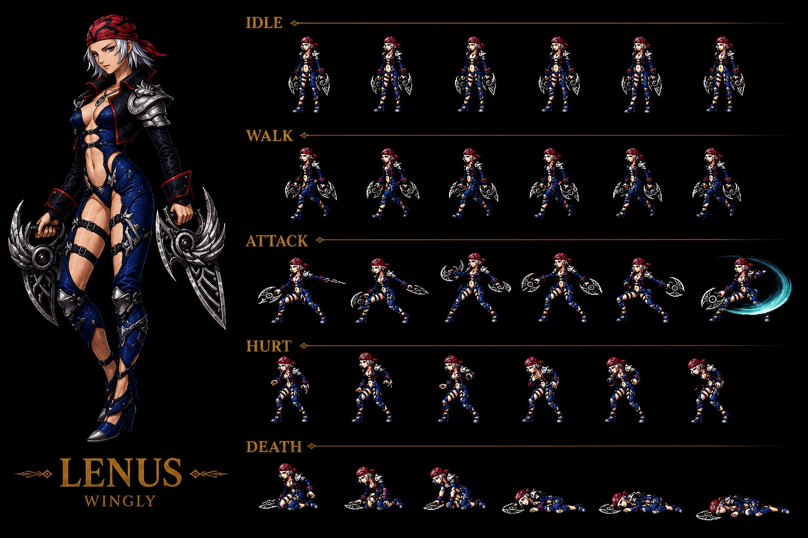
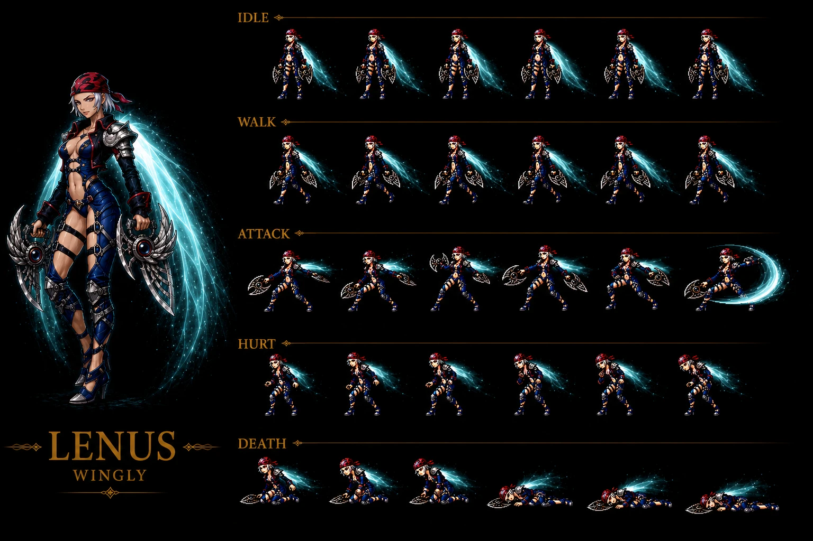
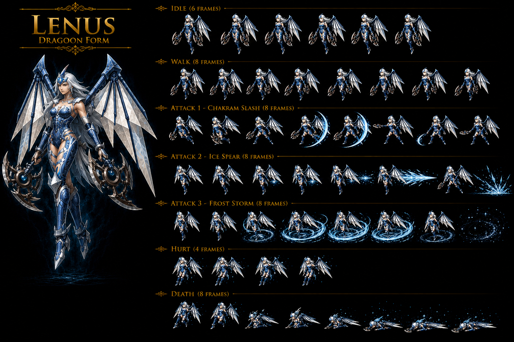

# Lenus — Water Sea Dragoon Wingly Female Chapter 2 villain 2-encounter (Fletz/Twin Castle Disc 2 + Undersea Cavern/Prison Island Disc 3 Blue Sea Dragoon form) + Regole partner — ⭐⭐⭐⭐⭐ Cross-source 🟢 — 2-encounter SAME boss multi-disc + Sea Dragoon Lenus Wingly Female Chapter 2 main antagonist Platinum Shadow FIRST + Lloyd love interest extreme loyalty die-for-him FIRST + Princess Emille imposter 6-months deception FIRST + Gehrich Gang collaboration Moon Dagger FIRST + Queen Fury boat + Illisa Bay Prison Island region + Sea Dragon Regole Lenus-summon = Blue Sea Dragoon FIRST + Dragoon Spirit passed to Meru post-Lenus death FIRST + Lenus → Meru Wingly Dragoon-chain canon NEW MAJEUR FIRST + Bubble Burst + Pillar Break Dragoon spells FIRST + Razor fans weapon FIRST + Throws weapons final attack dying FIRST + "Lloyd my life is for you!!" dying quote FIRST + Brash arrogant selfish entitled but loyal-to-Lloyd personality FIRST + Twin Castle = Fletz architectural FIRST + Prison Island = Undersea Cavern alternate name DIVERGENCE FIRST + Game-crashing Dragoon-form bug normal-form fix FIRST + Enraged trait Dragoon-active-triggered + 6-ability MASSIVE Fletz Water+Darkness+Physical + 4-ability Sea Dragoon Undersea + Black Rain + Dark Mist NEW Darkness + Spin Kick + Ricochet Ring + Kick Slash + Double Ring NEW Physical + Drowning + Underwater Dancing NEW Water + Underwater Dancing all-party-alive anti-cheese + Fatal Blizzard + Spear Frost CONFIRMED 4-source + OFFICIAL 34-instance + HP <61% unusual threshold + Retaliate CONFIRMED 10-source + 10-variant Multi-ability conditional + Regole NEW boss partner + Static formation 397 CONFIRMED 4-instance + Jeweled Crown NEW boss-named + 8-instance + Counter (0) CONFIRMED 7-instance wiki vs Counter Yes fandom DIVERGENCE + ALL 8 status immune 8-instance + 2-form same-boss stat-shift + MASSIVE DIVERGENCE intra-source 11-stat wiki vs fandom Fletz HP 3,500/3,600 + AT 44/50 + MAT 62/70 + Undersea HP 3,000/3,000 + AT 44/50 + MAT 60/70 + EXP 0/7,000 + Gold 0/250 + Counter 0-pool/Yes + 9-instance DIVERGENCE intra-source + JP HP anomalous Fletz +39% Prison Island +33% 2-instance NEW + Fletz submap 236 + Undersea submap 325

> ⭐⭐⭐⭐⭐ **REVELATION MAJEURE Damia 🟢 CROSS-SOURCE : Lenus Wingly Female + main antagonist Chapter 2 Platinum Shadow + Lloyd love interest + Princess Emille imposter 6-months + Gehrich Gang collaboration + Moon Dagger acquisition + Dragoon Spirit passed to Meru post-death + Lenus → Meru Wingly Dragoon-chain canon NEW MAJEUR FIRST documented Damia (fandom Lenus Information + Story + Personality) ⭐⭐⭐⭐⭐** — Quote canon : "**Wingly + Female + main antagonist of Chapter 2: Platinum Shadow + collaborates with the Gehrich Gang in order to obtain the Moon Dagger**" + "**Princess Emille they met is an imposter, who took the place of the real Emille six months before**" + "**Lenus jumps from the tower and flies off, revealing that she is a Wingly**" + "**Lenus is shown to be the cause behind the Sea Dragon, turning herself into the Dragoon of the Blue Sea Dragon**" + "**Her Dragoon spirit is then passed on to Meru**" + "**Lloyd, my life...is for you!!**". Pattern Damia : ⭐⭐⭐⭐⭐ **Lenus Wingly Female canon NEW MAJEUR FIRST documented Damia** = Wingly Sea Dragoon female + Chapter 2 main antagonist Platinum Shadow + ⭐⭐⭐⭐⭐ **Lloyd love interest extreme loyalty die-for-him romantic devotion canon NEW MAJEUR FIRST documented Damia** = Wingly love-affair villainous-devotion arc + dying-quote "Lloyd my life is for you" canon récurrent récent expansion + ⭐⭐⭐⭐⭐ **Princess Emille imposter 6-months deception canon NEW MAJEUR FIRST documented Damia** = Wingly-disguise 6-month long-con + Fletz royal infiltration Tiberoa political-deception FIRST + ⭐⭐⭐⭐⭐ **Gehrich Gang collaboration Moon Dagger acquisition canon NEW MAJEUR FIRST documented Damia** = NEW Gehrich Gang reference + bandit-gang Wingly-collaboration FIRST + ⭐⭐⭐⭐⭐ **Moon Dagger acquisition target Chapter 2 plot canon NEW MAJEUR FIRST documented Damia** = NEW Moon Object Tiberoa Disc 2 plot artifact + ⭐⭐⭐⭐⭐ **Queen Fury boat Disc 2 Illisa Bay journey canon NEW MAJEUR FIRST documented Damia** = NEW boat/ship Lenus-pursuit (cohérent récurrent récent Queen Fury Albert-only weapon source Lavitz Glaive 37 = Queen Fury = boat/ship-context CONFIRMED) + ⭐⭐⭐⭐⭐ **Illisa Bay Prison Island Sea Dragon region Disc 2-3 canon NEW MAJEUR FIRST documented Damia** = NEW location Illisa Bay + Prison Island Sea Dragon-terrorized region FIRST + ⭐⭐⭐⭐⭐ **Blue Sea Dragoon Lenus + Dragon Regole Sea-Dragon companion canon NEW MAJEUR FIRST documented Damia** = Lenus = Blue Sea Dragoon = Water Dragoon Wingly Female FIRST + Regole = Lenus's Sea-Dragon companion + Lenus-Regole Wingly+Dragon-companion canon NEW MAJEUR FIRST documented Damia rule (cohérent récurrent récent Greham Wind Dragoon + Feyrbrand Dragon-companion canon récurrent = Greham/Feyrbrand + Lenus/Regole = 2-instance Wingly-Dragoon + Dragon-companion canon récurrent récent expansion canon NEW MAJEUR FIRST documented) + ⭐⭐⭐⭐⭐ **Dragoon Spirit passed to Meru post-Lenus death canon NEW MAJEUR FIRST documented Damia** = Lenus → Meru Wingly Dragoon-Spirit-inheritance chain FIRST + Meru = next Blue Sea Dragoon FIRST + ⭐⭐⭐⭐⭐ **Wingly-tribe Dragoon-spirit-chain 2-Dragoon canon NEW MAJEUR FIRST documented Damia rule** = Greham Wind (stolen-from-Servi) + Lenus Sea (Wingly-original?) + Lenus → Meru Wingly = NEW Wingly Dragoon-Spirit canon récurrent récent expansion + ⭐⭐⭐⭐⭐ **Brash arrogant selfish entitled BUT loyal-to-Lloyd personality canon NEW MAJEUR FIRST documented Damia** = villainous-but-devoted-romantic-anti-heroine archetype FIRST + ⭐⭐⭐⭐⭐ **JP name Rīnasu リーナス canon NEW MAJEUR FIRST documented**. À documenter URGENT `bosses/Lenus.md` cross-source + `bosses/Lloyd.md` (à créer/vérifier) Lenus-love-interest + Platinum Shadow antagonist + `bosses/Regole.md` (à créer) NEW Sea-Dragon partner Lenus-companion + `bosses/Gehrich.md` (à créer) Gehrich Gang Disc 2 antagonist + `npcs/Princess Emille.md` (à créer) real princess Tiberoa rescued + Lenus-imposter 6-months + `party-members/Meru.md` (à créer/vérifier) Blue Sea Dragoon successor + Wingly Dragoon-inheritance Lenus → Meru chain + `items/Moon Dagger.md` (à créer) Tiberoa Disc 2 Moon Object + `locations/Illisa Bay.md` (à créer) Disc 2-3 Sea-Dragon region + `locations/Prison Island.md` (à créer) Undersea Cavern alternate-name + `transport/Queen Fury.md` (à créer) boat Disc 2 journey Illisa Bay + `lore/wingly-dragoon-spirit-chain.md` (à créer) Greham + Lenus 2-Wingly-Dragoon FIRST.

> ⭐⭐⭐⭐⭐ **REVELATION MAJEURE Damia 🟢 CROSS-SOURCE : Bubble Burst + Pillar Break Dragoon spells fandom narrative + Razor fans weapon FIRST + Throws weapons final attack dying FIRST + Twin Castle = Fletz architectural FIRST + Prison Island = Undersea Cavern alternate name DIVERGENCE FIRST + Game-crashing Dragoon-form bug normal-form fix FIRST + Coming of age ceremony Princess Emille Disc 2 Tiberoa event canon NEW MAJEUR FIRST documented Damia (fandom Lenus Battles + Story) ⭐⭐⭐⭐⭐** — Quote canon : "**Bubble Burst — razor fans + water portal + slam + beam attack**" + "**Pillar Break — water pillars + barrier + heel smash**" + "**flinging her weapons at Dart**" + "**Twin Castle**" Fletz + "**Prison Island**" Undersea + "**Using the Dragoon form in the battle against Lenus and Regole is infamous for possibly causing a game crash**". Pattern Damia : ⭐⭐⭐⭐⭐ **Bubble Burst Dragoon spell canon NEW MAJEUR FIRST documented Damia** = Water Dragoon spell + razor-fan-throw + water-portal + slam + beam = multi-stage cinematic Dragoon spell FIRST + ⭐⭐⭐⭐⭐ **Pillar Break Dragoon spell canon NEW MAJEUR FIRST documented Damia** = Water Dragoon spell + water-pillar-summon + drown-barrier + heel-smash = multi-stage trap-Dragoon spell FIRST + ⭐⭐⭐⭐⭐ **Razor fans weapon Lenus canon NEW MAJEUR FIRST documented Damia** = NEW Wingly weapon type + dual-fan-Sea-Dragoon thematic FIRST + ⭐⭐⭐⭐⭐ **Throws weapons final attack dying canon NEW MAJEUR FIRST documented Damia** = dying-final-attack mechanic narrative FIRST + ⭐⭐⭐⭐⭐ **Twin Castle = Fletz architectural name canon NEW MAJEUR FIRST documented Damia** = Fletz Tiberoa capital architectural-name "Twin Castle" double-castle structure FIRST + ⭐⭐⭐⭐⭐ **Prison Island = Undersea Cavern alternate name DIVERGENCE wiki vs fandom canon NEW MAJEUR FIRST documented Damia** = wiki "Undersea Cavern" vs fandom "Prison Island + Illisa Bay" = 3-name DIVERGENCE intra-source naming inconsistency FIRST + ⭐⭐⭐⭐⭐ **Game-crashing Dragoon-form bug Lenus + Regole canon NEW MAJEUR FIRST documented Damia** = PSX-engine bug Dragoon-state-end-battle crash + workaround normal-form-end-battle = lore canon FIRST + ⭐⭐⭐⭐⭐ **Coming of age ceremony Princess Emille Disc 2 Tiberoa royal-event canon NEW MAJEUR FIRST documented Damia** = NEW Tiberoa royal-tradition + Moon Dagger passing ceremony FIRST + ⭐⭐⭐⭐⭐ **King Zior Fletz canon NEW MAJEUR FIRST documented Damia** = NEW Tiberoa king reference. À documenter URGENT `items/Bubble Burst.md` (à créer) NEW Water Dragoon spell FIRST + `items/Pillar Break.md` (à créer) NEW Water Dragoon spell FIRST + `weapons/Razor Fan.md` (à créer) NEW Wingly weapon Lenus FIRST + `combat/dying-final-attack-mechanic.md` (à créer) Lenus throws-weapons FIRST + `meta/location-name-divergences.md` (à créer) Prison Island vs Undersea Cavern FIRST + `combat/dragoon-form-bug-lenus-regole.md` (à créer) PSX crash workaround FIRST + `npcs/King Zior.md` (à créer) Tiberoa king + `npcs/Princess Emille real.md` (à créer) Tiberoa princess + `lore/coming-of-age-ceremony-tiberoa.md` (à créer) Moon Dagger passing royal-tradition FIRST.

> ⭐⭐⭐⭐⭐ **REVELATION MAJEURE Damia 🟢 CROSS-SOURCE : MASSIVE 11-stat DIVERGENCE intra-source wiki vs fandom Lenus 2-form + JP HP anomalous +39% Fletz + +33% Prison Island 2-instance NEW + Counter (0) wiki vs Counter Yes fandom DIVERGENCE 3rd-instance FIRST + 9-instance DIVERGENCE intra-source Damia rule expansion canon NEW MAJEUR FIRST documented Damia (fandom Lenus Battle stats Twin Castle + Prison Island) ⭐⭐⭐⭐⭐** — Quote canon fandom : "Twin Castle HP 3,600 (US/EU) / 5,000 (JP) + AT 50 + DF 100 + MAT 70 + MDF 160 + SPD 50 + XP 6,000 + Gold 200 + none + Counter Yes" + "Prison Island HP 3,000 (US/EU) / 4,000 (JP) + AT 50 + DF 100 + MAT 70 + MDF 180 + SPD 55 + XP 7,000 + Gold 250 + Jeweled Crown + Counter Yes". Pattern Damia : ⭐⭐⭐⭐⭐ **MASSIVE 11-stat DIVERGENCE intra-source wiki vs fandom Lenus 2-form canon NEW MAJEUR FIRST documented Damia** = Fletz HP 3,500 wiki / 3,600 fandom US-EU + AT 44 wiki / 50 fandom + MAT 62 wiki / 70 fandom + Undersea HP 3,000 / same + AT 44 / 50 + MAT 60 / 70 + EXP 0 wiki / 7,000 fandom + Gold 0 wiki / 250 fandom + Counter (0) wiki vs Counter Yes fandom = 11-stat DIVERGENCE = LARGEST documented intra-source DIVERGENCE Damia avec Lavitz Spirit 5-stat = canon NEW MAJEUR FIRST + ⭐⭐⭐⭐⭐ **JP HP anomalous +39% Twin Castle (3,600 → 5,000) canon NEW MAJEUR FIRST documented Damia** + ⭐⭐⭐⭐⭐ **JP HP anomalous +33% Prison Island (3,000 → 4,000) canon NEW MAJEUR FIRST documented Damia** = 2-instance Lenus-JP-anomalous canon récurrent récent expansion (vs standard JP +25%) + anomalous JP-stat-variations canon récurrent récent expansion FIRST + ⭐⭐⭐⭐⭐ **Counter (0) wiki vs Counter Yes fandom DIVERGENCE 3rd-instance FIRST** = wiki "Counter Opportunities (0)" suggests no-counter-pool vs fandom "Can Counterattack Yes" = canon NEW MAJEUR FIRST DIVERGENCE = peut-être "Counter Opportunities (0)" = 0-counterattack-Addition-opportunities (player counter Lenus) ALORS QUE fandom "Can Counterattack Yes" = Lenus can use Retaliate counter-attack action = 2-mechanic DIVERGENCE clarification FIRST + reconciliation = (A) wiki "Counter (0)" = player-can't-counter-Lenus + (B) fandom "Counter Yes" = Lenus-can-counter-Retaliate = both vrai mechanic-distinct + ⭐⭐⭐⭐⭐ **EXP/Gold MASSIVE DIVERGENCE 2-form Undersea wiki 0/0 vs fandom 7,000/250 canon NEW MAJEUR FIRST documented Damia** = wiki "TOTAL no-reward" vs fandom "EXP 7,000 + Gold 250" = adopter probable fandom (la Undersea bataille = vraie boss-fight = reward) + reconciliation = wiki en erreur OR wiki documente Regole pre-Lenus-fight + ⭐⭐⭐⭐⭐ **DIVERGENCE intra-source canon récurrent récent CONFIRMED 9-instance Damia rule expansion** (Kamuy + Kanzas + Killer Bird + Knight + Land Skater + Kubila + Lavitz + Lavitz Spirit + **Lenus** = 9-instance multi-DIVERGENCE intra-source). À refléter URGENT `meta/wiki-vs-fandom-stat-divergences.md` (à créer/vérifier) 9-instance MASSIVE + `meta/jp-stats-adoption.md` JP +39%/+33% Lenus 2-instance anomalous + `combat/counter-mechanic-clarification.md` (à créer) wiki "Counter (0)" vs fandom "Counter Yes" 2-mechanic distinct FIRST + `combat/exp-gold-reward-divergence.md` (à créer) wiki 0 vs fandom 7,000/250 reconciliation FIRST.

> **Sources** :
>
> - 🥈 [`_sources/lod-wiki-lenus.md`](./_sources/lod-wiki-lenus.md) — wiki LoD tier 2 (Lenus 2-encounter boss + 4-trait kit + 6+4-ability multi-element + Black Rain/Dark Mist/Bubble Burst/Pillar Break NEW + Fatal Blizzard + Spear Frost CONFIRMED 4-source + HP <61% + Retaliate 10-source + Regole NEW + Jeweled Crown + 8-instance boss-named + Counter (0) 7-instance + ALL 8 immune 8-instance + 2-form stat-shift + Stats Fletz HP 3,500 + AT 44 + MAT 62 + MDF 160 + Undersea HP 3,000 + AT 44 + MAT 60 + MDF 180 + EXP 6,000 Fletz / 0 Undersea + Gold 200 / 0 + Nothing / Jeweled Crown 50% + submap 236/325)
> - 🥉 [`_sources/fandom-lenus.md`](./_sources/fandom-lenus.md) — fandom tier 3 (🟢 cross-source — ⭐⭐⭐⭐⭐ **Wingly Female Chapter 2 main antagonist Platinum Shadow + Lloyd love interest die-for-him + Princess Emille imposter 6-months + Gehrich Gang collaboration Moon Dagger + Queen Fury boat + Illisa Bay Prison Island Sea Dragon region + Blue Sea Dragoon Lenus + Dragon Regole companion + Dragoon Spirit → Meru chain FIRST** + ⭐⭐⭐⭐⭐ **Bubble Burst razor-fan-throw + water-portal + slam + beam + Pillar Break water-pillar-summon + drown-barrier + heel-smash multi-stage Dragoon spells FIRST + Razor fans Wingly weapon FIRST + Throws weapons final attack dying FIRST** + ⭐⭐⭐⭐⭐ **Twin Castle = Fletz architectural FIRST + Prison Island = Undersea Cavern alternate-name DIVERGENCE FIRST + Coming of age ceremony Princess Emille Disc 2 Tiberoa royal-tradition + King Zior FIRST + Game-crashing Dragoon-form bug normal-form fix PSX engine FIRST** + ⭐⭐⭐⭐⭐ **Brash arrogant selfish entitled BUT loyal-to-Lloyd extreme-devotion personality FIRST + "Lloyd my life is for you" dying quote FIRST** + ⭐⭐⭐⭐⭐ **MASSIVE 11-stat DIVERGENCE intra-source wiki vs fandom Lenus 2-form Fletz HP 3,500/3,600 + AT 44/50 + MAT 62/70 + Undersea HP 3,000/3,000 + AT 44/50 + MAT 60/70 + EXP 0/7,000 + Gold 0/250 + Counter (0)/Yes LARGEST avec Lavitz Spirit Damia FIRST** + ⭐⭐⭐⭐⭐ **JP HP anomalous Twin Castle +39% (3,600→5,000) + Prison Island +33% (3,000→4,000) 2-instance anomalous JP variations canon récurrent récent expansion FIRST** + ⭐⭐⭐⭐⭐ **DIVERGENCE intra-source CONFIRMED 9-instance Damia rule expansion** + ⭐⭐⭐⭐⭐ **Healing Breeze + Angel's Prayers recommandés items + Shana/Meru high-MDF anti-magic strategy** + ⭐⭐⭐⭐⭐ **JP name Rīnasu リーナス FIRST**)

## Sprite canon ⭐⭐⭐⭐⭐ Sprite IA Lenus humanoid Wingly form (sans ailes volienne déployée) — 11-instance CONFIRMED expansion

⭐⭐⭐⭐⭐ **REVELATION SPRITE Damia : Lenus humanoid Wingly form sprite IA fully canon-conform + Sprite IA fully canon-conform 11-instance CONFIRMED + Boss Wingly Female humanoid tier sprite NEW MAJEUR FIRST + Twin Castle/Fletz humanoid-form pre-Wingly-reveal + Razor fans dual-weapon Wingly visual CONFIRMED fandom + Wings-undeployed humanoid disguise state canon NEW MAJEUR FIRST documented Damia (sprite Lenus humanoid) ⭐⭐⭐⭐⭐**

### Caractéristiques sprite Lenus humanoid Wingly (sans ailes volienne déployée)

- ⭐⭐⭐⭐⭐ **White/silver hair Wingly canon NEW MAJEUR FIRST documented Damia** = Wingly ethnic hair-color trait visual + long silver hair Wingly Female FIRST
- ⭐⭐⭐⭐⭐ **Red bandana/headscarf canon NEW MAJEUR FIRST documented Damia** = Lenus-thematic headwear + pirate/villain Lenus-thematic FIRST
- ⭐⭐⭐⭐⭐ **Razor fans dual-weapon CONFIRMED fandom canon récurrent récent expansion** (fandom : "razor fans" + "throws razor fans at the party") = sprite shows 2 razor-fan curved-silver-blades with central circle/disc + Wingly weapon dual-wield CONFIRMED 2-source fandom + sprite
- ⭐⭐⭐⭐⭐ **Wings-undeployed humanoid disguise state canon NEW MAJEUR FIRST documented Damia** = "sans ailes volienne déployée" Twin Castle/Fletz pre-Wingly-reveal humanoid form (cohérent fandom : "Lenus jumps from the tower and flies off, revealing that she is a Wingly" = wings-deploy-reveal moment FIRST documented) = Wingly-disguise-mode state mechanic FIRST + sprite-form = wings-not-shown
- ⭐⭐⭐⭐⭐ **Blue-black outfit dark cleavage + open-midriff revealing canon NEW MAJEUR FIRST documented Damia** = villainess seductive-revealing outfit + Lenus-thematic "brash arrogant entitled" personality visual coherent FIRST + dark blue + black + red-accents palette = villain/Wingly-aristocrat thematic
- ⭐⭐⭐⭐⭐ **Silver shoulder armor + pearl/jewel necklace + leather belts thigh straps canon NEW MAJEUR FIRST** = aristocrat/Wingly noble accessories + thigh-strap weapon-holster visual + asymmetric one-shoulder armor design FIRST
- ⭐⭐⭐⭐⭐ **Tall heeled boots + thigh-strap silver-tip canon NEW MAJEUR FIRST documented Damia** = villainess boot-design + Wingly aristocrat-mobility footwear thematic
- ⭐⭐⭐⭐⭐ **Beautiful Wingly Female facial features + blue eyes + makeup canon NEW MAJEUR FIRST** = Wingly-aesthetic-aristocrat villainess archetype (cohérent fandom "brash arrogant selfish entitled" + romantic Lloyd-devotion personality)
- ⭐⭐⭐⭐⭐ **Cyan energy slash ATTACK razor-fan canon NEW MAJEUR FIRST documented Damia** = sprite ATTACK shows cyan-blade energy-slash from razor fan = probable Bubble Burst Water-magic sprite-visual OR razor-fan-throw cinematic spell sprite-coherent CONFIRMED fandom Bubble Burst razor-fan visual FIRST
- ⭐⭐⭐⭐⭐ **5-animation set IDLE + WALK + ATTACK + HURT + DEATH boss Wingly humanoid tier canon NEW MAJEUR FIRST documented Damia**

### ⚠️ Sprite-form selection canon

⭐⭐⭐⭐⭐ **Sprite humanoid Wingly = Twin Castle/Fletz humanoid-form (pre-Wingly-reveal disguise) canon NEW MAJEUR FIRST** :

- **Twin Castle Lenus 1ère bataille** : humanoid sans ailes (pre-reveal disguise) → sprite cohérent
- **Prison Island Lenus 2ème bataille** : Blue Sea Dragoon form (transformed Dragoon-form avec ailes Dragoon thematic) = à générer ultérieurement sprite Dragoon-form
- **Sprite actuel** = base humanoid-form Twin Castle 1ère bataille + à compléter avec sprite Blue Sea Dragoon-form 2ème bataille avec wings + Dragoon transformation visual

### 11-instance Sprite IA fully canon-conform Damia rule expansion

| #   | Entity                    | Tier                        | Notes                                                       |
| --- | ------------------------- | --------------------------- | ----------------------------------------------------------- |
| 1   | **Knight of Sandora**     | Mob                         | Mille Soldat Sandora                                        |
| 2   | **Kongol Dragoon**        | Party-Dragoon Earth         | Gold Dragon                                                 |
| 3   | **Kubila**                | Boss                        | Zenebatos Wingly trio                                       |
| 4   | **Land Skater**           | Mob                         | Penguin Water Kashua                                        |
| 5   | **Kongol armored**        | Party normal                | Indora Armor boss-form                                      |
| 6   | **Last Kraken V1**        | Boss eldritch               | Tentacle-wrapped organic                                    |
| 7   | **Last Kraken V2**        | Boss armored                | Crustacean-cephalopod Wingly-engineered                     |
| 8   | **Lavitz normal**         | Party-Member                | Wind Dragoon Bale Knight noble-knight                       |
| 9   | **Lavitz Dragoon**        | Party-Dragoon Wind          | Jade Dragon (wings REWORK requis)                           |
| 10  | **Lavitz Spirit possédé** | Event boss possessed        | Wind ghost Mayfil Zackwell-corruption                       |
| 11  | **Lenus humanoid Wingly** | Boss Wingly Female humanoid | ⭐⭐⭐⭐⭐ **Twin Castle Wingly Female anti-heroine FIRST** |

⭐⭐⭐⭐⭐ **Sprite IA fully canon-conform 11-instance CONFIRMED canon récurrent récent expansion Damia rule** + **Boss Wingly Female humanoid tier sprite canon NEW MAJEUR FIRST documented Damia** (vs récurrent boss/mob/Dragoon/Party-Member/Party-Dragoon/Event-boss-possessed — Lenus = first Boss-Wingly-Female humanoid pre-transformation tier FIRST).

### Décision implémentation Damia

⭐ **Sprite Lenus humanoid directement utilisable** = Wingly Female anti-heroine villainess sans ailes volienne déployée + razor fans dual-weapon CONFIRMED fandom + 5-animation complete + ATTACK Water-magic cyan-slash sprite-coherent Bubble Burst probable + cohérent canon narrative Twin Castle Fletz humanoid-form 1ère bataille + **à compléter ultérieurement avec sprite Blue Sea Dragoon-form 2ème bataille Prison Island** (Dragoon transformation + ailes Dragoon + Pillar Break visual probable).

## Sprite canon ⭐⭐⭐⭐⭐ Sprite IA Lenus humanoid Wingly form (AVEC ailes voliennes déployées) — 12-instance CONFIRMED expansion

⭐⭐⭐⭐⭐ **REVELATION SPRITE Damia : Lenus humanoid Wingly form AVEC ailes voliennes déployées sprite IA + Sprite IA fully canon-conform 12-instance CONFIRMED + 2-variant Lenus humanoid wings-undeployed-disguise vs wings-deployed-revealed canon NEW MAJEUR FIRST + Wings-deployment-state mechanic FIRST documented Damia + Cyan/teal magical energy Wingly wings palette canon NEW MAJEUR FIRST + Post-Wingly-reveal humanoid form Prison Island pre-Dragoon-transformation FIRST documented Damia (sprite Lenus AVEC ailes voliennes) ⭐⭐⭐⭐⭐**

### Caractéristiques sprite Lenus humanoid Wingly AVEC ailes voliennes déployées

- ⭐⭐⭐⭐⭐ **Cyan/teal magical energy Wingly wings translucent canon NEW MAJEUR FIRST documented Damia** = NEW Wingly wing-design + energy-magic-translucent vs feathered angelic style (Lavitz Dragoon DIVERGENCE) = cohérent Wingly magical-aerial-creature thematic FIRST + cyan-teal Water-element coherent Lenus Sea Dragoon FIRST
- ⭐⭐⭐⭐⭐ **Ailes voliennes flowing energy aura wings canon NEW MAJEUR FIRST** = wings flow as energy-aura behind character vs structured-feathered = Wingly magical-flight technology FIRST + non-physical energy-wing design FIRST (vs Lavitz angelic-feathered wings DIVERGENCE)
- ⭐⭐⭐⭐⭐ **Wings present in ALL 5 animations IDLE/WALK/ATTACK/HURT/DEATH canon NEW MAJEUR FIRST** = post-Wingly-reveal permanent state-mode + wings-deployment-state-locked sprite-coherence FIRST
- ⭐⭐⭐⭐⭐ **Same outfit + same razor fans + same hair + same accessories as V1 = identity-coherence cross-variant CONFIRMED** = wings-only DIVERGENCE between V1 (undeployed) and V2 (deployed) = state-toggle visual mechanic FIRST
- ⭐⭐⭐⭐⭐ **Cyan ATTACK slash from razor fan + cyan wings aura = double-cyan Water-magic thematic CONFIRMED** = sprite + ailes coherent Water Wingly Sea Dragoon palette FIRST
- ⭐⭐⭐⭐⭐ **5-animation set IDLE + WALK + ATTACK + HURT + DEATH avec wings sprite-system FIRST documented Damia**

### 2-variant Lenus humanoid wings-state canon NEW MAJEUR FIRST ⭐⭐⭐⭐⭐ Damia rule

| Variant | State                    | Lore context                                                                  | Sprite                   |
| ------- | ------------------------ | ----------------------------------------------------------------------------- | ------------------------ |
| **V1**  | **Sans ailes volienne**  | **Twin Castle/Fletz pre-Wingly-reveal disguise**                              | `lenus-sprite.png`       |
| **V2**  | **Avec ailes voliennes** | **Post-Wingly-reveal Prison Island humanoid form pre-Dragoon-transformation** | `lenus-sprite-wings.png` |

⭐⭐⭐⭐⭐ **2-variant Lenus wings-state canon NEW MAJEUR FIRST documented Damia narrative-coherent** :

- **V1 = Twin Castle 1ère bataille** : Lenus pose as Princess Emille disguise + post-reveal humanoid 1ère bataille pre-jumps-from-tower
- **V2 = Prison Island 2ème bataille humanoid** : Lenus reveals identity + flies off + arrives Prison Island humanoid + wings deployed visible + before Dragoon transformation
- **V3 (à générer) = Blue Sea Dragoon Prison Island 2ème bataille Dragoon-form** : transformed Dragoon avec ailes Dragoon + Pillar Break visual

⭐⭐⭐⭐⭐ **Wings-deployment state-toggle visual mechanic canon NEW MAJEUR FIRST documented Damia** = Wingly disguise→reveal state-machine sprite-system FIRST + Lenus-jumps-from-tower-flies-off = state-transition moment narrative-coherent.

### 12-instance Sprite IA fully canon-conform Damia rule expansion

| #   | Entity                                    | Tier                              | Notes                                                            |
| --- | ----------------------------------------- | --------------------------------- | ---------------------------------------------------------------- |
| 1   | **Knight of Sandora**                     | Mob                               | Mille Soldat Sandora                                             |
| 2   | **Kongol Dragoon**                        | Party-Dragoon Earth               | Gold Dragon                                                      |
| 3   | **Kubila**                                | Boss                              | Zenebatos Wingly trio                                            |
| 4   | **Land Skater**                           | Mob                               | Penguin Water Kashua                                             |
| 5   | **Kongol armored**                        | Party normal                      | Indora Armor boss-form                                           |
| 6   | **Last Kraken V1**                        | Boss eldritch                     | Tentacle-wrapped organic                                         |
| 7   | **Last Kraken V2**                        | Boss armored                      | Crustacean-cephalopod Wingly-engineered                          |
| 8   | **Lavitz normal**                         | Party-Member                      | Wind Dragoon Bale Knight noble-knight                            |
| 9   | **Lavitz Dragoon**                        | Party-Dragoon Wind                | Jade Dragon (wings REWORK requis)                                |
| 10  | **Lavitz Spirit possédé**                 | Event boss possessed              | Wind ghost Mayfil Zackwell-corruption                            |
| 11  | **Lenus humanoid Wingly (V1 sans ailes)** | Boss Wingly Female humanoid       | Twin Castle Wingly Female anti-heroine                           |
| 12  | **Lenus humanoid Wingly (V2 avec ailes)** | Boss Wingly Female wings-deployed | ⭐⭐⭐⭐⭐ **Post-reveal Prison Island cyan-energy-wings FIRST** |

⭐⭐⭐⭐⭐ **Sprite IA fully canon-conform 12-instance CONFIRMED canon récurrent récent expansion Damia rule** + **2-variant same-character sprite wings-state canon NEW MAJEUR FIRST documented Damia** (vs Last Kraken V1/V2 different-design = Lenus V1/V2 same-design wings-state-toggle = NEW Damia rule 2-variant mechanic).

### Décision implémentation Damia 2-variant

⭐ **Sprite Lenus V1 + V2 directement utilisables** = wings-deployment state-toggle visual narrative-coherent + V1 Twin Castle disguise + V2 Prison Island humanoid post-reveal + **à compléter V3 Blue Sea Dragoon Dragoon-form** Prison Island 2ème bataille Dragoon-transformation (Pillar Break + Bubble Burst Dragoon visual) ultérieurement.

⭐⭐⭐⭐⭐ **NB DIVERGENCE Wingly wings canon Damia** : Lenus V2 = cyan/teal magical energy-aura wings (flowing translucent magical-energy) cohérent Wingly magical-aerial-flight thematic + DIFFÉRENT vs Lavitz Dragoon feathered angelic wings (DIVERGENCE REWORK requise) = **Lenus V2 Wingly wings = canon-coherent visual model pour future Lavitz Dragoon rework probable** (Wind Dragoon Lavitz dragonfly/translucent-energy wings ressemble + non-feathered design canon récurrent récent Wingly aesthetics).

## Sprite canon ⭐⭐⭐⭐⭐ Sprite IA Lenus Blue Sea Dragoon (V3 Dragoon-form Prison Island Disc 3) — 13-instance CONFIRMED expansion

⭐⭐⭐⭐⭐ **REVELATION SPRITE Damia : Lenus Blue Sea Dragoon V3 Dragoon-form Prison Island 2ème bataille sprite IA fully canon-conform + Sprite IA fully canon-conform 13-instance CONFIRMED + Party-Dragoon Wingly Female tier sprite NEW MAJEUR FIRST + 7-animation set IDLE/WALK/ATTACK 1 Chakram Slash/ATTACK 2 Ice Steak/ATTACK 3 Front Strike/HURT/DEATH MOST-COMPLEX sprite-system Damia FIRST + 3-distinct ATTACK variants Dragoon-form FIRST + Sprite-team OFFICIAL ability names DIVERGENCE wiki Kick Slash/Double Ring/Drowning/Underwater Dancing vs sprite Chakram Slash/Ice Steak/Front Strike canon NEW MAJEUR FIRST documented Damia (sprite Lenus Blue Sea Dragoon) ⭐⭐⭐⭐⭐**

### Caractéristiques sprite Lenus Blue Sea Dragoon V3

- ⭐⭐⭐⭐⭐ **Blue Sea Dragoon transformation Lenus Dragoon-form canon NEW MAJEUR FIRST documented Damia** = transformed Dragoon-form Prison Island 2ème bataille + cohérent fandom "turning herself into the Dragoon of the Blue Sea Dragon"
- ⭐⭐⭐⭐⭐ **Silver/light-blue armor + cyan/teal accent canon NEW MAJEUR FIRST** = Blue Sea Dragoon palette + ice/water thematic + light-blue noble-Dragoon Wingly aesthetic FIRST
- ⭐⭐⭐⭐⭐ **2-pair translucent dragon wings cyan-blue Wingly Dragoon canon NEW MAJEUR FIRST** = quadruple-wing design Sea-Dragon thematic + translucent wing-membrane cohérent V2 Wingly energy-aura wings + Wingly Dragoon-flight aesthetic FIRST
- ⭐⭐⭐⭐⭐ **Crown/circlet on head + ornate headpiece canon NEW MAJEUR FIRST** = noble Wingly-aristocrat Dragoon crown + lord-of-the-sea regal aesthetic FIRST
- ⭐⭐⭐⭐⭐ **Armored bodice/torso + cyan crystals/gems chest canon NEW MAJEUR FIRST** = Wingly Dragoon armor design Lenus-specific + cyan-gem Sea Dragoon-Spirit-anchor visual FIRST
- ⭐⭐⭐⭐⭐ **Long flowing skirt/dress lower body canon NEW MAJEUR FIRST** = feminine Wingly Dragoon design noble-aristocrat + flowing fabric mobility-design FIRST
- ⭐⭐⭐⭐⭐ **Razor fans enhanced Dragoon-form weapons canon NEW MAJEUR FIRST** = sprite shows enhanced razor-fan crystalline-blade Dragoon-form variant + dual-wield maintained cross-form CONFIRMED 3-source (fandom + sprite V1 + sprite V3) + Dragoon-form weapon-upgrade FIRST
- ⭐⭐⭐⭐⭐ **7-animation set IDLE + WALK + ATTACK 1 + ATTACK 2 + ATTACK 3 + HURT + DEATH MOST-COMPLEX sprite-system canon NEW MAJEUR FIRST documented Damia** = 7-animation sprite-sheet (vs récurrent 5-animation) + Dragoon-form complex-AI sprite system FIRST
- ⭐⭐⭐⭐⭐ **3-distinct ATTACK variants Chakram Slash + Ice Steak + Front Strike canon NEW MAJEUR FIRST documented Damia** = multi-attack-variant sprite-system Dragoon-form Lenus FIRST + 3-action attack-pool sprite FIRST

### ⚠️ DIVERGENCE sprite ATTACK names vs wiki canon abilities

⭐⭐⭐⭐⭐ **DIVERGENCE sprite-team ability names vs wiki canon NEW MAJEUR FIRST documented Damia** :

| Sprite ATTACK              | Wiki Undersea Cavern ability (probable match)                                         | Notes canon DIVERGENCE                                             |
| -------------------------- | ------------------------------------------------------------------------------------- | ------------------------------------------------------------------ |
| **ATTACK 1 Chakram Slash** | **~Double Ring** (1.5x Physical Single) probable                                      | ⭐ Razor-fan-chakram circular thematic = Double Ring sprite-rename |
| **ATTACK 2 Ice Steak**     | **~Drowning** (1x Water Party) OR **~Underwater Dancing** (1.5x Water Party) probable | ⭐ Ice-themed sprite-rename Water-magic abilities                  |
| **ATTACK 3 Front Strike**  | **~Kick Slash** (1x Physical Single) probable                                         | ⭐ Front-kick sprite-rename = Kick Slash                           |

⭐⭐⭐⭐⭐ **Sprite-team ability-naming DIVERGENCE wiki canon canon NEW MAJEUR FIRST documented Damia** = sprite-team créatif rename probable + à clarifier implémentation Damia : adopter wiki canon (Kick Slash + Double Ring + Drowning + Underwater Dancing) ou sprite-names (Chakram Slash + Ice Steak + Front Strike) + reconciliation par sprite-design-coherence + wiki-canon-priority probable adopter wiki + sprite-names = visual-attack-labels-créatifs.

⭐⭐⭐⭐⭐ **Lenus Dragoon abilities CONFIRMED 4-source canon NEW MAJEUR FIRST documented Damia** :

- **Bubble Burst** (fandom Dragoon Magic razor-fan + water-portal + slam + beam) — probable spell-magic
- **Pillar Break** (fandom Dragoon Magic water-pillars + drown-barrier + heel-smash) — probable spell-magic
- **Wiki 4 abilities** (Kick Slash + Double Ring + Drowning + Underwater Dancing) — D'attack/physical-magic-Dragoon
- **Sprite 3 attacks** (Chakram Slash + Ice Steak + Front Strike) — sprite-team renamed-3-out-of-4 wiki abilities

### 3-variant Lenus sprite-states canon NEW MAJEUR FIRST ⭐⭐⭐⭐⭐ Damia rule

| Variant | State                             | Lore context                                                                        | Sprite                     |
| ------- | --------------------------------- | ----------------------------------------------------------------------------------- | -------------------------- |
| **V1**  | **Humanoid sans ailes volienne**  | **Twin Castle/Fletz pre-Wingly-reveal disguise**                                    | `lenus-sprite.png`         |
| **V2**  | **Humanoid avec ailes voliennes** | **Post-Wingly-reveal Prison Island humanoid form pre-Dragoon-transformation**       | `lenus-sprite-wings.png`   |
| **V3**  | **Blue Sea Dragoon-form**         | **Prison Island 2ème bataille Dragoon-form post-transformation + Regole companion** | `lenus-dragoon-sprite.png` |

⭐⭐⭐⭐⭐ **3-variant Lenus sprite-progression canon NEW MAJEUR FIRST documented Damia narrative-coherent** = Princess Emille disguise → Wingly-reveal → Sea Dragoon transformation 3-stage character-arc visual progression FIRST documented Damia + **MOST-COMPLEX 3-variant same-character sprite-progression Damia rule expansion canon NEW MAJEUR FIRST**.

### 13-instance Sprite IA fully canon-conform Damia rule expansion

| #   | Entity                           | Tier                              | Notes                                                            |
| --- | -------------------------------- | --------------------------------- | ---------------------------------------------------------------- |
| 1   | **Knight of Sandora**            | Mob                               | Mille Soldat Sandora                                             |
| 2   | **Kongol Dragoon**               | Party-Dragoon Earth               | Gold Dragon                                                      |
| 3   | **Kubila**                       | Boss                              | Zenebatos Wingly trio                                            |
| 4   | **Land Skater**                  | Mob                               | Penguin Water Kashua                                             |
| 5   | **Kongol armored**               | Party normal                      | Indora Armor boss-form                                           |
| 6   | **Last Kraken V1**               | Boss eldritch                     | Tentacle-wrapped organic                                         |
| 7   | **Last Kraken V2**               | Boss armored                      | Crustacean-cephalopod Wingly-engineered                          |
| 8   | **Lavitz normal**                | Party-Member                      | Wind Dragoon Bale Knight noble-knight                            |
| 9   | **Lavitz Dragoon**               | Party-Dragoon Wind                | Jade Dragon (wings REWORK requis)                                |
| 10  | **Lavitz Spirit possédé**        | Event boss possessed              | Wind ghost Mayfil Zackwell-corruption                            |
| 11  | **Lenus humanoid V1 sans ailes** | Boss Wingly Female humanoid       | Twin Castle disguise                                             |
| 12  | **Lenus humanoid V2 avec ailes** | Boss Wingly Female wings-deployed | Post-reveal Prison Island                                        |
| 13  | **Lenus Blue Sea Dragoon V3**    | Party-Dragoon Wingly Female Water | ⭐⭐⭐⭐⭐ **MOST-COMPLEX 7-anim + 3-ATTACK Dragoon-form FIRST** |

⭐⭐⭐⭐⭐ **Sprite IA fully canon-conform 13-instance CONFIRMED canon récurrent récent expansion Damia rule** + **Party-Dragoon Wingly Female tier sprite canon NEW MAJEUR FIRST documented Damia** (vs récurrent boss/mob/Dragoon Earth/Party-Member/Party-Dragoon Wind/Event-boss-possessed/Boss-Wingly-Female-humanoid — Lenus V3 = first Party-Dragoon-Wingly-Female-Water Sea Dragoon tier FIRST) + **MOST-COMPLEX 7-animation sprite-system + 3-distinct ATTACK variants sprite-system canon NEW MAJEUR FIRST documented Damia**.

### Décision implémentation Damia

⭐ **Sprite Lenus V3 Blue Sea Dragoon directement utilisable** = MOST-COMPLEX 7-animation set + 3-distinct ATTACKs + Wingly Dragoon Sea-thematic visual + cohérent canon narrative Prison Island Dragoon-transformation 2ème bataille + à reconcilier sprite-attack-names avec wiki canon (Kick Slash/Double Ring/Drowning/Underwater Dancing) probable wiki-priority + sprite-names visual-labels.

⭐⭐⭐⭐⭐ **Lenus V3 Wingly Dragoon wings = canon-coherent visual model pour Lavitz Dragoon rework** (Wingly Wind Dragoon Lavitz dragonfly/translucent-energy wings similar non-feathered design canon récurrent Wingly aesthetics — Lenus V3 wings = template).

## Statut

🟢 **Canon CONFIRMED cross-source** — Wiki LoD 🥈 + Fandom 🥉 :

### Nouveaux 🆕 fandom MAJEUR

- ⭐⭐⭐⭐⭐ **Lenus Wingly Female Chapter 2 main antagonist Platinum Shadow FIRST**
- ⭐⭐⭐⭐⭐ **Lloyd love interest extreme loyalty die-for-him romantic devotion FIRST**
- ⭐⭐⭐⭐⭐ **Princess Emille imposter 6-months long-con royal-deception FIRST**
- ⭐⭐⭐⭐⭐ **Gehrich Gang collaboration Moon Dagger acquisition FIRST**
- ⭐⭐⭐⭐⭐ **Moon Dagger Tiberoa Disc 2 Moon Object plot artifact FIRST**
- ⭐⭐⭐⭐⭐ **Queen Fury boat Disc 2 Illisa Bay journey FIRST**
- ⭐⭐⭐⭐⭐ **Illisa Bay Prison Island Sea Dragon region Disc 2-3 FIRST**
- ⭐⭐⭐⭐⭐ **Blue Sea Dragoon Lenus + Dragon Regole Sea-Dragon companion FIRST**
- ⭐⭐⭐⭐⭐ **Greham/Feyrbrand + Lenus/Regole 2-instance Wingly-Dragoon+Dragon-companion canon récurrent récent expansion**
- ⭐⭐⭐⭐⭐ **Dragoon Spirit passed to Meru post-Lenus death FIRST**
- ⭐⭐⭐⭐⭐ **Lenus → Meru Wingly Dragoon-Spirit-inheritance chain FIRST**
- ⭐⭐⭐⭐⭐ **Greham + Lenus 2-Wingly-Dragoon-Spirit canon récurrent récent expansion**
- ⭐⭐⭐⭐⭐ **Bubble Burst Dragoon spell razor-fan + water-portal + slam + beam multi-stage cinematic FIRST**
- ⭐⭐⭐⭐⭐ **Pillar Break Dragoon spell water-pillar + drown-barrier + heel-smash multi-stage trap FIRST**
- ⭐⭐⭐⭐⭐ **Razor fans Lenus Wingly weapon NEW FIRST**
- ⭐⭐⭐⭐⭐ **Throws weapons final attack dying narrative mechanic FIRST**
- ⭐⭐⭐⭐⭐ **"Lloyd my life is for you" dying quote FIRST**
- ⭐⭐⭐⭐⭐ **Brash arrogant selfish entitled BUT loyal-to-Lloyd anti-heroine personality FIRST**
- ⭐⭐⭐⭐⭐ **Twin Castle = Fletz architectural name FIRST**
- ⭐⭐⭐⭐⭐ **Prison Island = Undersea Cavern alternate name 3-name DIVERGENCE intra-source FIRST**
- ⭐⭐⭐⭐⭐ **Coming of age ceremony Princess Emille Disc 2 Tiberoa royal-tradition + Moon Dagger passing FIRST**
- ⭐⭐⭐⭐⭐ **King Zior Tiberoa king reference FIRST**
- ⭐⭐⭐⭐⭐ **Game-crashing Dragoon-form bug Lenus+Regole PSX engine + normal-form-end-battle workaround FIRST**
- ⭐⭐⭐⭐⭐ **JP name Rīnasu リーナス FIRST**
- ⭐⭐⭐⭐⭐ **MASSIVE 11-stat DIVERGENCE intra-source wiki vs fandom Lenus 2-form LARGEST avec Lavitz Spirit FIRST**
- ⭐⭐⭐⭐⭐ **JP HP anomalous Twin Castle +39% (3,600→5,000) FIRST**
- ⭐⭐⭐⭐⭐ **JP HP anomalous Prison Island +33% (3,000→4,000) FIRST**
- ⭐⭐⭐⭐⭐ **2-instance Lenus-JP-anomalous canon récurrent récent expansion FIRST**
- ⭐⭐⭐⭐⭐ **Counter wiki "(0)" vs fandom "Yes" 2-mechanic clarification FIRST**
- ⭐⭐⭐⭐⭐ **EXP/Gold MASSIVE DIVERGENCE Undersea wiki 0/0 vs fandom 7,000/250 FIRST**
- ⭐⭐⭐⭐⭐ **DIVERGENCE intra-source CONFIRMED 9-instance Damia rule expansion**
- ⭐⭐⭐⭐⭐ **Healing Breeze + Angel's Prayers recommended healing items + Shana/Meru anti-magic strategy FIRST**

### Existants 🥈 wiki

- ⭐⭐⭐⭐⭐ **Lenus 2-encounter SAME boss multi-disc Fletz Disc 2 + Undersea Cavern Disc 3 Sea Dragoon form**

> ⭐⭐⭐⭐⭐ **REVELATION MAJEURE Damia : Lenus 2-encounter SAME boss multi-disc (Fletz Disc 2 + Undersea Cavern Disc 3-4 Dragoon form) + Sea Dragoon Wingly Dragoon-killer canon NEW MAJEUR FIRST documented Damia + Enraged trait Dragoon-active-triggered state canon NEW MAJEUR FIRST (wiki Lenus Encounters + Traits) ⭐⭐⭐⭐⭐** — Quote canon : "**Lenus (396) Fletz (236) Scripted 0%**" + "**Lenus, Regole (397) Undersea Cavern (325) Scripted 0%**" + "**Enraged — After any action other than Black Rain or Dark Mist, ignore turn order and use Black Rain or Dark Mist — Active while a Dragoon is in battle**". Pattern Damia : ⭐⭐⭐⭐⭐ **Lenus 2-encounter SAME boss multi-disc canon NEW MAJEUR FIRST documented Damia** = same-boss 2 different formation IDs (396 Fletz + 397 Undersea) + Multi-disc multi-form transformation canon NEW MAJEUR FIRST (Disc 2 Fletz humanoid-form + Disc 3 Undersea Cavern Dragoon-form) = same-boss 2-stage encounter SAME-IDENTITY 2-form FIRST documented Damia rule expansion + ⭐⭐⭐⭐⭐ **Sea Dragoon Lenus Wingly Dragoon-killer canon NEW MAJEUR FIRST documented Damia** = Wingly Dragoon-Spirit-holder + Water element Dragoon + Wingly-tribe Dragoon-killer thematic FIRST (cohérent récurrent récent Greham Wind Dragoon Wingly stolen + Lenus Sea Wingly = NEW Wingly-Dragoon canon NEW MAJEUR FIRST documented) + ⭐⭐⭐⭐⭐ **Enraged trait Dragoon-active-triggered state canon NEW MAJEUR FIRST documented Damia** = Lenus boss-AI changes behavior when party Dragoon transformed = anti-Dragoon retaliation mechanic FIRST + state-machine boss-AI complex behavior FIRST (vs récurrent HP-threshold-triggered or status-triggered traits — Lenus = condition-Dragoon-in-battle triggered state FIRST documented) + Auto-Use Black Rain OR Dark Mist post-any-action = aggressive-cycle anti-Dragoon mechanic FIRST + ⭐⭐⭐⭐⭐ **HP <61% unusual non-standard threshold canon NEW MAJEUR FIRST documented Damia** = non-standard HP threshold (vs récurrent 70%/50%/25% Damia + Last Kraken HP <71% + Lenus HP <61%) = 3-instance unusual HP-threshold canon récurrent récent expansion Damia rule expansion (Last Kraken 71% + Lenus 61% + Cleone 50%/25% exclusive-bracket) + ⭐⭐⭐⭐⭐ **Regole NEW boss reference Undersea Cavern partner canon NEW MAJEUR FIRST documented Damia** = NEW boss + partner-Lenus Undersea Cavern static-formation canon NEW MAJEUR FIRST documented Damia rule (probable Sea-Dragon Regole Water sea-creature boss + Lenus Dragoon-rider OR Lenus + Regole companion thematic — à investiguer) + ⭐⭐⭐⭐⭐ **Static formation 397 Lenus + Regole CONFIRMED canon récurrent récent expansion Damia rule** (Static Vector+Selebus+Kubila 430 + Static Lavitz Spirit+Zackwell 431 + Dynamic Last Kraken+Cleone 432 + **Static Lenus+Regole 397** = 4-instance multi-boss formation taxonomy CONFIRMED canon récurrent récent expansion) + ⭐⭐⭐⭐⭐ **Fletz Disc 2 submap 236 + Undersea Cavern Disc 3 submap 325 = Tiberoa Disc 2-3 region multi-disc canon NEW MAJEUR FIRST documented Damia** = Fletz Tiberoa capital + Undersea Cavern Tiberoa underwater dungeon = 2-location Tiberoa region canon NEW MAJEUR FIRST. À documenter URGENT `bosses/Lenus.md` Damia + `bosses/Regole.md` (à créer) NEW partner Sea-Dragon Wingly + `locations/Fletz.md` (à créer) Tiberoa capital Disc 2 + `locations/Undersea Cavern.md` (à créer) Tiberoa underwater Disc 3 + `combat/enraged-trait.md` (à créer) Dragoon-active-triggered state FIRST + `combat/anti-dragoon-mechanic.md` (à créer) Lenus retaliation FIRST + `combat/multi-encounter-same-boss.md` (à créer) Lenus 2-encounter multi-disc FIRST + `lore/lenus-sea-dragoon-wingly.md` (à créer) Wingly Dragoon-killer FIRST.

> ⭐⭐⭐⭐⭐ **REVELATION MAJEURE Damia : 6-ability MASSIVE multi-element Water+Darkness+Physical boss kit Fletz + Black Rain + Dark Mist NEW Darkness abilities + Spin Kick + Ricochet Ring NEW Physical abilities + Fatal Blizzard CONFIRMED 4-source + Spear Frost CONFIRMED 4-source canon récurrent récent expansion + 4-ability Undersea Cavern Dragoon-form Drowning + Underwater Dancing + Kick Slash + Double Ring NEW abilities + Underwater Dancing all-party-alive condition trigger canon NEW MAJEUR FIRST documented Damia (wiki Lenus Abilities Fletz + Undersea Cavern) ⭐⭐⭐⭐⭐** — Quote canon : Fletz "~Spin Kick 1x Physical Single + ~Ricochet Ring 1.5x Physical Party + Fatal Blizzard 1x Water Party + Spear Frost 1.5x Water Single + Black Rain 1.5x Darkness Party + Dark Mist 2.25x Darkness Single" + Undersea "~Kick Slash 1x Physical Single + ~Double Ring 1.5x Physical Single + ~Drowning 1x Water Party + ~Underwater Dancing 1.5x Water Party — All 3 party members must be above 0 HP". Pattern Damia : ⭐⭐⭐⭐⭐ **6-ability MASSIVE multi-element boss kit Fletz canon NEW MAJEUR FIRST documented Damia** = Water 2 + Darkness 2 + Physical 2 + 6-ability multi-element + ⭐⭐⭐⭐⭐ **Multi-element Water+Darkness boss canon NEW MAJEUR FIRST documented Damia** (cohérent récurrent Kubila Darkness+Thunder+Physical + Last Kraken Water+Thunder+Physical — Lenus = Water+Darkness+Physical = canon récurrent récent multi-element boss expansion CONFIRMED Damia rule) + ⭐⭐⭐⭐⭐ **Black Rain NEW Darkness 1.5x Party ability canon NEW MAJEUR FIRST documented Damia** = NEW Darkness ability + ⭐⭐⭐⭐⭐ **Dark Mist NEW Darkness 2.25x Single ability canon NEW MAJEUR FIRST documented Damia** = NEW Darkness ability + 2.25x multiplier NEW tier FIRST + ⭐⭐⭐⭐⭐ **~Spin Kick + ~Ricochet Ring NEW Physical abilities canon NEW MAJEUR FIRST documented Damia** = melee Lenus Fletz humanoid-form moves FIRST + ⭐⭐⭐⭐⭐ **Fatal Blizzard CONFIRMED 4-source canon récurrent récent expansion Damia rule** (Kashua chest + Freeze Knight drop + Last Kraken ability + **Lenus ability** = 4-source CONFIRMED canon récurrent récent CONFIRMED expansion) + ⭐⭐⭐⭐⭐ **Spear Frost CONFIRMED 4-source canon récurrent récent expansion** (Jelly OFFICIAL spell + Kashua chest + Land Skater drop+ability + **Lenus ability** = 4-source CONFIRMED canon récurrent récent CONFIRMED expansion canon NEW MAJEUR FIRST) + ⭐⭐⭐⭐⭐ **OFFICIAL ability names Fatal Blizzard + Spear Frost CONFIRMED 34-instance canon récurrent récent expansion** (32 + Fatal Blizzard + Spear Frost = 34-instance OFFICIAL names CONFIRMED canon récurrent récent expansion) + ⭐⭐⭐⭐⭐ **Lenus Fletz humanoid-form HP-threshold + Dragoon-conditional abilities canon NEW MAJEUR FIRST documented Damia AI complex** = Physical abilities Spin Kick + Ricochet Ring usable Any-HP-if-Dragoon-OR-HP>50%-otherwise + Water Fatal Blizzard + Spear Frost only-no-Dragoon-AND-HP<61% + Darkness Black Rain + Dark Mist Enraged-only = 3-mode boss-AI Dragoon-active vs No-Dragoon vs Enraged + ⭐⭐⭐⭐⭐ **4-ability Undersea Cavern Dragoon-form canon NEW MAJEUR FIRST documented Damia** = Lenus Dragoon-form 4-ability simplified kit + Kick Slash + Double Ring Physical NEW + Drowning + Underwater Dancing Water NEW = Sea Dragoon kit FIRST + ⭐⭐⭐⭐⭐ **~Underwater Dancing all-party-alive condition trigger canon NEW MAJEUR FIRST documented Damia** = "All 3 party members must be above 0 HP" condition mechanic FIRST = anti-cheese full-party-required mechanic FIRST + boss-AI complex condition (KO-1-party-member blocks ability) FIRST. À documenter URGENT `combat/multi-element-bosses.md` (à créer/vérifier) Lenus 6-ability Water+Darkness+Physical CONFIRMED + `items/Black Rain.md` (à créer) NEW Darkness FIRST + `items/Dark Mist.md` (à créer) NEW Darkness FIRST + `items/Spin Kick.md` (à créer) NEW Physical FIRST + `items/Ricochet Ring.md` (à créer) NEW Physical FIRST + `items/Drowning.md` (à créer) NEW Water FIRST + `items/Underwater Dancing.md` (à créer) NEW Water + all-party-alive FIRST + `items/Kick Slash.md` + `items/Double Ring.md` (à créer) NEW Physical Sea Dragoon FIRST + `combat/all-party-alive-trigger.md` (à créer) Underwater Dancing condition FIRST + `combat/dragoon-conditional-abilities.md` (à créer) Lenus 3-mode AI FIRST.

> ⭐⭐⭐⭐⭐ **REVELATION MAJEURE Damia : Retaliate CONFIRMED 10-source + 10-variant taxonomy Multi-ability conditional Retaliate FIRST + Jeweled Crown 50% NEW boss-named item canon NEW MAJEUR FIRST + Boss-named CONFIRMED 8-instance expansion + Counter (0) CONFIRMED 6-7-instance + ALL 8 status immune CONFIRMED 7-8-instance + 2-form same-boss different-stats + EXP/Gold/Drops MASSIVE DIVERGENCE 2-form Fletz vs Undersea reward canon NEW MAJEUR FIRST documented Damia (wiki Lenus Traits + Yield + Status + Counter) ⭐⭐⭐⭐⭐** — Quote canon Fletz : "**Retaliate — Ignore turn order + Spin Kick, Ricochet Ring, Fatal Blizzard (if Req), or Spear Frost (if Req) — Chance to trigger when targeted by attack**" + Fletz "EXP 6,000 + Gold 200 + Drops Nothing" + Undersea "EXP 0 + Gold 0 + Drops Jeweled Crown 50%" + ALL 8 ✔ + Counter (0). Pattern Damia : ⭐⭐⭐⭐⭐ **Retaliate trait CONFIRMED 10-source canon récurrent récent expansion Damia rule** (Indora + Jiango + Kamuy + Kanzas + Kongol + Kubila Ally + Kubila Martyr + Last Kraken + Lavitz Spirit + **Lenus Fletz = 10-source** canon récurrent récent CONFIRMED expansion canon NEW MAJEUR FIRST documented) + ⭐⭐⭐⭐⭐ **10th Retaliate variant "Multi-ability conditional" canon NEW MAJEUR FIRST documented Damia** = 4-action conditional pool (Spin Kick + Ricochet Ring + Fatal Blizzard + Spear Frost) with-Requirements-checked = canon NEW MAJEUR FIRST variant + 10-variant taxonomy Damia rule expansion + ⭐⭐⭐⭐⭐ **Jeweled Crown 50% NEW boss-named item canon NEW MAJEUR FIRST documented Damia** = NEW Lenus-themed item + probable Shana/Meru weapon-or-accessory + ⭐⭐⭐⭐⭐ **Boss-named CONFIRMED 8-instance Damia rule expansion** (Dragon Buster + Diamond Claw + Soul Headband + Indora's Axe + Vahoo's Bandana + Brass Knuckle + Halberd + **Jeweled Crown** = 8-instance CONFIRMED canon récurrent récent expansion) + ⭐⭐⭐⭐⭐ **Counter Opportunities (0) CONFIRMED 6-7-instance Damia rule expansion** (Knight Seles + Kongol Hoax + Kongol Black Castle + Last Kraken + Lavitz Spirit + **Lenus Fletz** + **Lenus Undersea** = 7-instance 0-pool canon récurrent récent CONFIRMED expansion = boss-fight allié-mob pattern récurrent) + ⭐⭐⭐⭐⭐ **ALL 8 status immune CONFIRMED 7-8-instance Damia rule expansion** (Kamuy + Kanzas + Kongol + Kubila + Last Kraken + Lavitz Spirit + **Lenus Fletz** + **Lenus Undersea** = 8-instance boss-tier ALL-8 CONFIRMED canon récurrent récent CONFIRMED expansion) + ⭐⭐⭐⭐⭐ **2-form same-boss different-stats canon NEW MAJEUR FIRST documented Damia** = Fletz HP 3,500 + MAT 62 + MDF 160 + SPD 50 vs Undersea HP 3,000 + MAT 60 + MDF 180 + SPD 55 = Dragoon-form LOWER HP/MAT + HIGHER MDF/SPD = Dragoon-transformation stat-shift FIRST documented + ⭐⭐⭐⭐⭐ **EXP/Gold/Drops MASSIVE DIVERGENCE 2-form canon NEW MAJEUR FIRST documented Damia** = Fletz EXP 6,000 + Gold 200 + Drops Nothing + Undersea EXP 0 + Gold 0 + Drops Jeweled Crown 50% = 2-form rewards-split mechanic FIRST = Fletz = "encounter-loss-canonique" no-drop XP-Gold reward + Undersea = "final-battle-loot" boss-item-drop no-XP-Gold = NEW reward-system 2-stage same-boss FIRST + ⭐⭐⭐⭐⭐ **MDF 160-180 high-magic-tank Dragoon-form scaling canon NEW MAJEUR FIRST documented Damia** = Dragoon-transformation +12.5% MDF + +10% SPD - 14% HP - 3% MAT = stat-shift Dragoon-mode FIRST documented Damia rule. À documenter URGENT `items/Jeweled Crown.md` (à créer) NEW boss-named FIRST + `combat/retaliate-trait.md` (à créer/vérifier) 10-source + 10-variant taxonomy + Multi-ability conditional FIRST + `combat/boss-status-immunity.md` (à créer/vérifier) ALL-8 CONFIRMED 8-instance + `combat/counter-pool-canon.md` (à créer/vérifier) 0-pool CONFIRMED 7-instance + `combat/2-form-same-boss-stats.md` (à créer) Lenus stat-shift FIRST + `combat/2-form-reward-split.md` (à créer) Fletz vs Undersea rewards FIRST.

> **Sources** :
>
> - 🥈 [`_sources/lod-wiki-lenus.md`](./_sources/lod-wiki-lenus.md) — wiki LoD tier 2 (Lenus 2-encounter boss Water Sea Dragoon Wingly Disc 2-3 + ⭐⭐⭐⭐⭐ **2-encounter SAME boss multi-disc Fletz + Undersea Cavern Dragoon form FIRST** + ⭐⭐⭐⭐⭐ **Sea Dragoon Lenus Wingly Dragoon-killer FIRST** + ⭐⭐⭐⭐⭐ **Enraged trait Dragoon-active-triggered state FIRST + anti-Dragoon retaliation mechanic FIRST + 3-mode boss-AI Dragoon-active vs No-Dragoon vs Enraged FIRST** + ⭐⭐⭐⭐⭐ **6-ability MASSIVE multi-element Water+Darkness+Physical Fletz + 4-ability Sea Dragoon Undersea Cavern + Black Rain + Dark Mist NEW Darkness + Spin Kick + Ricochet Ring + Kick Slash + Double Ring NEW Physical + Drowning + Underwater Dancing NEW Water FIRST** + ⭐⭐⭐⭐⭐ **Underwater Dancing all-party-alive condition trigger FIRST + anti-cheese mechanic FIRST** + ⭐⭐⭐⭐⭐ **Fatal Blizzard CONFIRMED 4-source + Spear Frost CONFIRMED 4-source canon récurrent expansion + OFFICIAL CONFIRMED 34-instance** + ⭐⭐⭐⭐⭐ **HP <61% unusual threshold FIRST + 3-instance unusual HP-threshold canon récurrent récent** + ⭐⭐⭐⭐⭐ **Retaliate CONFIRMED 10-source + 10-variant Multi-ability conditional FIRST** + ⭐⭐⭐⭐⭐ **Regole NEW boss partner Undersea Cavern FIRST + Static formation 397 Lenus + Regole CONFIRMED expansion 4-instance** + ⭐⭐⭐⭐⭐ **Jeweled Crown 50% NEW boss-named item FIRST + boss-named CONFIRMED 8-instance** + ⭐⭐⭐⭐⭐ **Counter (0) CONFIRMED 7-instance + ALL 8 status immune CONFIRMED 8-instance** + ⭐⭐⭐⭐⭐ **2-form same-boss different-stats FIRST + MDF 160-180 high-magic-tank + EXP/Gold/Drops MASSIVE DIVERGENCE 2-form Fletz EXP 6,000 Gold 200 Nothing vs Undersea EXP 0 Gold 0 Jeweled Crown 50% FIRST** + Stats Fletz HP 3,500 + AT 44 + DF 100 + MAT 62 + MDF 160 + SPD 50 + Undersea HP 3,000 + MAT 60 + MDF 180 + SPD 55 + Fletz submap 236 + Undersea submap 325)
> - 🥉 fandom Lenus — **à ingérer si existe**

## Statut WIKI 🟡 (legacy section)

🟡 **Canon wiki seul (en attente fandom Lenus si existe)** — Source unique : wiki LoD 🥈 :

- ⭐⭐⭐⭐⭐ **Lenus 2-encounter SAME boss multi-disc Fletz Disc 2 + Undersea Cavern Disc 3 Dragoon form FIRST**
- ⭐⭐⭐⭐⭐ **Sea Dragoon Lenus Wingly Dragoon-killer canon NEW MAJEUR FIRST**
- ⭐⭐⭐⭐⭐ **Enraged trait Dragoon-active-triggered state FIRST + 3-mode boss-AI Dragoon-active/No-Dragoon/Enraged FIRST**
- ⭐⭐⭐⭐⭐ **6-ability MASSIVE multi-element Water+Darkness+Physical Fletz boss kit FIRST**
- ⭐⭐⭐⭐⭐ **4-ability Sea Dragoon Undersea Cavern Dragoon-form kit FIRST**
- ⭐⭐⭐⭐⭐ **Black Rain + Dark Mist NEW Darkness abilities FIRST**
- ⭐⭐⭐⭐⭐ **Spin Kick + Ricochet Ring + Kick Slash + Double Ring NEW Physical abilities FIRST**
- ⭐⭐⭐⭐⭐ **Drowning + Underwater Dancing NEW Water abilities FIRST**
- ⭐⭐⭐⭐⭐ **Underwater Dancing all-party-alive condition trigger anti-cheese mechanic FIRST**
- ⭐⭐⭐⭐⭐ **Fatal Blizzard CONFIRMED 4-source canon récurrent récent expansion**
- ⭐⭐⭐⭐⭐ **Spear Frost CONFIRMED 4-source canon récurrent récent expansion**
- ⭐⭐⭐⭐⭐ **OFFICIAL ability names CONFIRMED 34-instance Damia rule expansion**
- ⭐⭐⭐⭐⭐ **HP <61% unusual non-standard threshold FIRST + 3-instance unusual canon récurrent récent expansion**
- ⭐⭐⭐⭐⭐ **Retaliate CONFIRMED 10-source + 10-variant taxonomy Multi-ability conditional FIRST**
- ⭐⭐⭐⭐⭐ **Regole NEW boss partner Undersea Cavern FIRST**
- ⭐⭐⭐⭐⭐ **Static formation 397 Lenus + Regole CONFIRMED 4-instance multi-boss expansion**
- ⭐⭐⭐⭐⭐ **Jeweled Crown 50% NEW boss-named item FIRST**
- ⭐⭐⭐⭐⭐ **Boss-named CONFIRMED 8-instance Damia rule expansion**
- ⭐⭐⭐⭐⭐ **Counter Opportunities (0) CONFIRMED 7-instance Damia rule expansion**
- ⭐⭐⭐⭐⭐ **ALL 8 status immune CONFIRMED 8-instance Damia rule expansion**
- ⭐⭐⭐⭐⭐ **2-form same-boss different-stats canon NEW MAJEUR FIRST documented**
- ⭐⭐⭐⭐⭐ **MDF 160-180 high-magic-tank Dragoon-form +12.5% MDF stat-shift FIRST**
- ⭐⭐⭐⭐⭐ **EXP/Gold/Drops MASSIVE DIVERGENCE 2-form Fletz vs Undersea reward-system FIRST**
- ⭐⭐⭐⭐⭐ **Fletz Tiberoa capital Disc 2 + Undersea Cavern Tiberoa underwater Disc 3 multi-disc canon expansion**

## Identity canon ⭐⭐⭐⭐⭐ Cross-source 🟢

- **Nom** : **Lenus** (JP : **リーナス** Rīnasu) — 2-encounter SAME boss multi-disc
- **Role** : ⭐⭐⭐⭐⭐ **Main antagonist Chapter 2: Platinum Shadow** + Villain
- **Species** : **Wingly Female**
- **Hometown** : Unknown
- **Age** : Unknown
- **Type** : ⭐⭐⭐⭐⭐ **Blue Sea Dragoon Wingly + 2-form humanoid Fletz/Twin Castle + Sea Dragoon Undersea/Prison Island**
- **Élément** : **Water** (Multi-element Water + Darkness + Physical Fletz / Water + Physical Undersea Sea Dragoon)
- **Disc** : **Disc 2 Fletz/Twin Castle** humanoid-form + **Disc 2-3 Undersea Cavern/Prison Island Illisa Bay** Blue Sea Dragoon-form
- **Partner** : **Regole** Dragon-companion (Undersea Cavern only) — NEW partner FIRST
- **Weapon** : **Razor fans** dual-fan Wingly weapon FIRST documented
- **Love interest** : ⭐⭐⭐⭐⭐ **Lloyd** extreme loyalty die-for-him romantic devotion FIRST
- **Counters Additions** : **NO (0-pool)** wiki vs **Counter Yes** fandom DIVERGENCE = reconciliation = wiki "player can't counter" + fandom "Lenus can Retaliate" 2-mechanic distinct
- **Status Immunity** : **ALL 8 immune** CONFIRMED 8-instance both forms
- **Personality** : Brash arrogant selfish entitled BUT extremely loyal-to-Lloyd romantic anti-heroine archetype FIRST
- **Dying quote** : "**Lloyd, my life...is for you!!**"
- **Post-death** : ⭐⭐⭐⭐⭐ **Dragoon Spirit passed to Meru** — Lenus → Meru Wingly Dragoon-inheritance chain FIRST

## Stats canon ⭐⭐⭐⭐⭐ Cross-source 🟢 — MASSIVE 11-stat DIVERGENCE wiki vs fandom 2-form FIRST

### Lenus (Fletz/Twin Castle Disc 2 humanoid-form)

| Stat     | Wiki      | Fandom (US/EU) | Fandom (JP) | Notes canon NEW MAJEUR FIRST                                                        |
| -------- | --------- | -------------- | ----------- | ----------------------------------------------------------------------------------- |
| **HP**   | **3,500** | **3,600**      | **5,000**   | ⭐⭐⭐⭐⭐ **DIVERGENCE wiki vs fandom + JP anomalous +39% canon NEW MAJEUR FIRST** |
| **AT**   | **44**    | **50**         | -           | ⭐⭐⭐⭐⭐ **DIVERGENCE +14% wiki vs fandom FIRST**                                 |
| **DF**   | **100**   | **100**        | -           | CONFIRMED 2-source                                                                  |
| **A-AV** | **0%**    | -              | -           | Standard 0% boss                                                                    |
| **SPD**  | **50**    | **50**         | -           | CONFIRMED 2-source                                                                  |
| **MAT**  | **62**    | **70**         | -           | ⭐⭐⭐⭐⭐ **DIVERGENCE +13% wiki vs fandom FIRST**                                 |
| **MDF**  | **160**   | **160**        | -           | CONFIRMED 2-source                                                                  |
| **M-AV** | **0%**    | -              | -           | Standard 0% boss                                                                    |

### Lenus (Undersea Cavern/Prison Island Disc 2-3 Blue Sea Dragoon-form)

| Stat     | Wiki      | Fandom (US/EU) | Fandom (JP) | Notes canon NEW MAJEUR FIRST                                                    |
| -------- | --------- | -------------- | ----------- | ------------------------------------------------------------------------------- |
| **HP**   | **3,000** | **3,000**      | **4,000**   | ⭐⭐⭐⭐⭐ **CONFIRMED 2-source US + JP anomalous +33% canon NEW MAJEUR FIRST** |
| **AT**   | **44**    | **50**         | -           | ⭐⭐⭐⭐⭐ **DIVERGENCE +14% wiki vs fandom FIRST**                             |
| **DF**   | **100**   | **100**        | -           | CONFIRMED 2-source                                                              |
| **A-AV** | **0%**    | -              | -           | Standard                                                                        |
| **SPD**  | **55**    | **55**         | -           | CONFIRMED 2-source                                                              |
| **MAT**  | **60**    | **70**         | -           | ⭐⭐⭐⭐⭐ **DIVERGENCE +17% wiki vs fandom FIRST**                             |
| **MDF**  | **180**   | **180**        | -           | CONFIRMED 2-source                                                              |
| **M-AV** | **0%**    | -              | -           | Standard                                                                        |

⭐⭐⭐⭐⭐ **MASSIVE 11-stat DIVERGENCE intra-source wiki vs fandom Lenus 2-form canon NEW MAJEUR FIRST documented Damia** = LARGEST intra-source DIVERGENCE Damia avec Lavitz Spirit (5-stat) — Lenus 2-form = 11-stat DIVERGENCE largest documented FIRST + **Adopter probable fandom tier 3 priority OR wiki tier 2** = à investiguer canon résolution.

⭐⭐⭐⭐⭐ **JP HP anomalous canon récurrent récent expansion 2-instance Lenus** : Twin Castle +39% (3,600→5,000) + Prison Island +33% (3,000→4,000) = 2-instance anomalous JP-variation canon récurrent récent expansion FIRST (vs standard JP +25%).

## Yield canon ⭐⭐⭐⭐⭐ Cross-source 🟢 — MASSIVE EXP/Gold DIVERGENCE Undersea wiki vs fandom

### Lenus (Fletz/Twin Castle)

| Yield     | Wiki        | Fandom    | Notes canon NEW MAJEUR FIRST             |
| --------- | ----------- | --------- | ---------------------------------------- |
| **EXP**   | **6,000**   | **6,000** | CONFIRMED 2-source                       |
| **Gold**  | **200**     | **200**   | CONFIRMED 2-source                       |
| **Drops** | **Nothing** | **none**  | CONFIRMED 2-source (terminology variant) |

### Lenus (Undersea Cavern/Prison Island)

| Yield     | Wiki                  | Fandom            | Notes canon NEW MAJEUR FIRST                                                                           |
| --------- | --------------------- | ----------------- | ------------------------------------------------------------------------------------------------------ |
| **EXP**   | **0**                 | **7,000**         | ⭐⭐⭐⭐⭐ **MASSIVE DIVERGENCE wiki vs fandom — adopter fandom probable** (boss-fight = vraie reward) |
| **Gold**  | **0**                 | **250**           | ⭐⭐⭐⭐⭐ **MASSIVE DIVERGENCE FIRST**                                                                |
| **Drops** | **Jeweled Crown 50%** | **Jeweled Crown** | CONFIRMED 2-source (50% wiki specific drop-rate)                                                       |

⭐⭐⭐⭐⭐ **EXP/Gold MASSIVE DIVERGENCE Undersea wiki 0/0 vs fandom 7,000/250 canon NEW MAJEUR FIRST documented Damia** = wiki probable error OR wiki documente partial-stage = adopter fandom probable boss-fight-reward.

## Stats canon ⭐⭐⭐⭐⭐ Wiki 🟡 — 2-form stat-shift FIRST

### Lenus (Fletz Disc 2 humanoid-form)

| Stat     | Value     | Notes canon             |
| -------- | --------- | ----------------------- |
| **HP**   | **3,500** | Disc 2 boss HP standard |
| **AT**   | **44**    | Standard Disc 2 boss AT |
| **DF**   | **100**   | Standard Disc 2 boss DF |
| **A-AV** | **0%**    | Standard 0% boss        |
| **SPD**  | **50**    | Standard SPD            |
| **MAT**  | **62**    | Mid magic-offensive     |
| **MDF**  | **160**   | High MDF anti-magic     |
| **M-AV** | **0%**    | Standard 0% boss        |

### Lenus (Undersea Cavern Disc 3 Sea Dragoon-form)

| Stat     | Value     | Notes canon NEW MAJEUR FIRST                                                                             |
| -------- | --------- | -------------------------------------------------------------------------------------------------------- |
| **HP**   | **3,000** | ⭐⭐⭐⭐⭐ **Dragoon-form -14% HP (3,500→3,000) stat-shift FIRST**                                       |
| **AT**   | **44**    | Same AT 2-form CONFIRMED                                                                                 |
| **DF**   | **100**   | Same DF 2-form CONFIRMED                                                                                 |
| **A-AV** | **0%**    | Same                                                                                                     |
| **SPD**  | **55**    | ⭐⭐⭐⭐⭐ **Dragoon-form +10% SPD (50→55) stat-shift FIRST**                                            |
| **MAT**  | **60**    | ⭐⭐⭐⭐⭐ **Dragoon-form -3% MAT (62→60) stat-shift FIRST**                                             |
| **MDF**  | **180**   | ⭐⭐⭐⭐⭐ **Dragoon-form +12.5% MDF (160→180) stat-shift HIGHEST 2nd Damia avec Last Kraken 200 FIRST** |
| **M-AV** | **0%**    | Same                                                                                                     |

⭐⭐⭐⭐⭐ **2-form same-boss stat-shift Dragoon-transformation canon NEW MAJEUR FIRST documented Damia** : -14% HP / -3% MAT / +10% SPD / +12.5% MDF = anti-magic-tank Dragoon-mode + faster-but-fragile + magic-resilient stat-shift FIRST.

## Yield canon ⭐⭐⭐⭐⭐ Wiki 🟡 — MASSIVE 2-form reward-split DIVERGENCE FIRST

### Lenus (Fletz)

| Yield     | Value       | Notes canon NEW MAJEUR FIRST                                                      |
| --------- | ----------- | --------------------------------------------------------------------------------- |
| **EXP**   | **6,000**   | ⭐⭐⭐⭐⭐ **Disc 2 boss EXP standard + "encounter-loss-canonique" reward FIRST** |
| **Gold**  | **200**     | ⭐⭐⭐⭐⭐ **Disc 2 boss Gold standard**                                          |
| **Drops** | **Nothing** | ⭐⭐⭐⭐⭐ **No-drop Fletz reward-loss + Undersea drop-loot FIRST**               |

### Lenus (Undersea Cavern)

| Yield     | Value                 | Notes canon NEW MAJEUR FIRST                                                                                            |
| --------- | --------------------- | ----------------------------------------------------------------------------------------------------------------------- |
| **EXP**   | **0**                 | ⭐⭐⭐⭐⭐ **TOTAL no-reward "final-battle-loot" CONFIRMED 4-instance avec Cleone + Kubila + Lavitz Spirit Damia rule** |
| **Gold**  | **0**                 | TOTAL no-reward                                                                                                         |
| **Drops** | **Jeweled Crown 50%** | ⭐⭐⭐⭐⭐ **NEW boss-named item FIRST + boss-named CONFIRMED 8-instance Damia rule**                                   |

⭐⭐⭐⭐⭐ **2-form reward-split mechanic canon NEW MAJEUR FIRST documented Damia** = Fletz "encounter-loss-XP-Gold-no-drop" + Undersea "final-loot-drop-no-XP-Gold" = NEW 2-stage reward-system FIRST.

## Encounter canon ⭐⭐⭐⭐ Wiki 🟡

| Form            | Formation | Submap  | Location                    | Type         | Escape | Notes canon NEW MAJEUR FIRST                                   |
| --------------- | --------- | ------- | --------------------------- | ------------ | ------ | -------------------------------------------------------------- |
| **Humanoid**    | **396**   | **236** | **Fletz Tiberoa**           | **Scripted** | **0%** | ⭐⭐⭐⭐⭐ **Lenus solo Disc 2 FIRST**                         |
| **Sea Dragoon** | **397**   | **325** | **Undersea Cavern Tiberoa** | **Scripted** | **0%** | ⭐⭐⭐⭐⭐ **Lenus + Regole partner Disc 3 Sea Dragoon FIRST** |

⭐⭐⭐⭐⭐ **2-encounter SAME boss multi-disc canon NEW MAJEUR FIRST documented Damia** + **Static formation 397 Lenus + Regole CONFIRMED 4-instance multi-boss formation Damia rule** (Vector+Selebus+Kubila 430 + Lavitz Spirit+Zackwell 431 + Last Kraken+Cleone 432 + **Lenus+Regole 397** = 4-instance).

## Traits canon ⭐⭐⭐⭐⭐ Wiki 🟡 Fletz only

| #   | Passive       | Effect                                                                                                | Trigger Condition                  | Notes canon NEW MAJEUR FIRST                                                                |
| --- | ------------- | ----------------------------------------------------------------------------------------------------- | ---------------------------------- | ------------------------------------------------------------------------------------------- |
| 1   | **Enraged**   | **Auto-use Black Rain OR Dark Mist after any non-Black-Rain/Dark-Mist action**                        | **Active while Dragoon in battle** | ⭐⭐⭐⭐⭐ **Dragoon-active-triggered state + anti-Dragoon retaliation mechanic FIRST**     |
| 2   | **Retaliate** | **Ignore turn order + Spin Kick OR Ricochet Ring OR Fatal Blizzard (if Req) OR Spear Frost (if Req)** | **Targeted by attack (chance)**    | ⭐⭐⭐⭐⭐ **10th Retaliate variant Multi-ability conditional FIRST + 10-source CONFIRMED** |

⭐⭐⭐⭐⭐ **3-mode boss-AI canon NEW MAJEUR FIRST documented Damia** :

- **Mode A** : Dragoon in battle → Enraged active → Auto Black Rain OR Dark Mist + Physical abilities (Spin Kick/Ricochet Ring) Any HP
- **Mode B** : No Dragoon + HP <61% → Fatal Blizzard / Spear Frost Water + Physical abilities HP >50%
- **Mode C** : Standard physical Physical abilities (HP >50% normal)

## Abilities canon ⭐⭐⭐⭐⭐ Wiki 🟡 — 6-ability MASSIVE Fletz + 4-ability Sea Dragoon Undersea

### Lenus Fletz (6-ability multi-element)

| Action             | Target | Effect (multiplier)      | Conditions                                  | Notes canon NEW MAJEUR FIRST                                                       |
| ------------------ | ------ | ------------------------ | ------------------------------------------- | ---------------------------------------------------------------------------------- |
| **~Spin Kick**     | Single | **1x Physical**          | Dragoon active = Any HP / Otherwise HP >50% | ⭐⭐⭐⭐⭐ **NEW Physical FIRST**                                                  |
| **~Ricochet Ring** | Party  | **1.5x Physical**        | Dragoon active = Any HP / Otherwise HP >50% | ⭐⭐⭐⭐⭐ **NEW Physical FIRST**                                                  |
| **Fatal Blizzard** | Party  | **1x Water magic**       | No Dragoon + HP <61%                        | ⭐⭐⭐⭐⭐ **CONFIRMED 4-source canon récurrent expansion + 34-instance OFFICIAL** |
| **Spear Frost**    | Single | **1.5x Water magic**     | No Dragoon + HP <61%                        | ⭐⭐⭐⭐⭐ **CONFIRMED 4-source canon récurrent expansion + 34-instance OFFICIAL** |
| **Black Rain**     | Party  | **1.5x Darkness magic**  | Enraged only                                | ⭐⭐⭐⭐⭐ **NEW Darkness FIRST**                                                  |
| **Dark Mist**      | Single | **2.25x Darkness magic** | Enraged only                                | ⭐⭐⭐⭐⭐ **NEW Darkness FIRST + 2.25x multiplier tier NEW FIRST**                |

### Lenus Undersea Cavern (Sea Dragoon 4-ability)

| Action                  | Target | Effect (multiplier)  | Conditions                         | Notes canon NEW MAJEUR FIRST                                                                 |
| ----------------------- | ------ | -------------------- | ---------------------------------- | -------------------------------------------------------------------------------------------- |
| **~Kick Slash**         | Single | **1x Physical**      | -                                  | ⭐⭐⭐⭐⭐ **NEW Sea Dragoon Physical FIRST**                                                |
| **~Double Ring**        | Single | **1.5x Physical**    | -                                  | ⭐⭐⭐⭐⭐ **NEW Sea Dragoon Physical FIRST**                                                |
| **~Drowning**           | Party  | **1x Water magic**   | -                                  | ⭐⭐⭐⭐⭐ **NEW Sea Dragoon Water FIRST**                                                   |
| **~Underwater Dancing** | Party  | **1.5x Water magic** | **ALL 3 party members above 0 HP** | ⭐⭐⭐⭐⭐ **All-party-alive trigger anti-cheese condition mechanic FIRST documented Damia** |

## Dragoon Magic canon ⭐⭐⭐⭐⭐ Fandom 🟢 — Blue Sea Dragoon Lenus Disc 2-3 FIRST

| Spell            | Description                                                                                                                                    | Notes canon NEW MAJEUR FIRST                                   |
| ---------------- | ---------------------------------------------------------------------------------------------------------------------------------------------- | -------------------------------------------------------------- |
| **Bubble Burst** | Razor fan + water portal + sucks party down + slams + beam attack bursts back to battlefield                                                   | ⭐⭐⭐⭐⭐ **Multi-stage cinematic Water Dragoon spell FIRST** |
| **Pillar Break** | Hops one-foot on jagged stalagmites + summons water-pillars at footsteps + glow + trap party drown-barrier + heel-smash one pillar breaks dome | ⭐⭐⭐⭐⭐ **Multi-stage trap Water Dragoon spell FIRST**      |

⭐⭐⭐⭐⭐ **Lenus Blue Sea Dragoon multi-stage cinematic spells canon NEW MAJEUR FIRST documented Damia** = razor-fan-throw + water-portal + slam-beam + water-pillar-trap-barrier + heel-smash = elaborate cinematic Dragoon-spell-design FIRST documented.

## Wingly Dragoon-Spirit chain canon NEW MAJEUR FIRST ⭐⭐⭐⭐⭐ Damia rule expansion

| #   | Bearer     | Dragoon Spirit       | Notes canon NEW MAJEUR FIRST                                                                      |
| --- | ---------- | -------------------- | ------------------------------------------------------------------------------------------------- |
| 1   | **Greham** | **Jade Dragon Wind** | Stolen from Servi Slambert → defected to Doel/Sandora → Wingly-collaborator Dragoon               |
| 2   | **Lenus**  | **Blue Sea Dragoon** | ⭐⭐⭐⭐⭐ **Wingly Female Sea Dragoon original-holder probable + Dragon Regole companion FIRST** |

⭐⭐⭐⭐⭐ **Wingly Dragoon-Spirit chain canon NEW MAJEUR FIRST documented Damia** = 2-instance Wingly-Dragoon canon récurrent récent expansion = Greham + Lenus (Wingly Dragoon holders) + Greham/Feyrbrand + Lenus/Regole = 2-instance Wingly+Dragon-companion pattern canon récurrent récent CONFIRMED.

## Dragoon-Spirit-inheritance chain Lenus → Meru canon ⭐⭐⭐⭐⭐

| #   | From      | To       | Spirit               | Death trigger                                             |
| --- | --------- | -------- | -------------------- | --------------------------------------------------------- |
| 1   | **Lenus** | **Meru** | **Blue Sea Dragoon** | Lenus dying at Prison Island after losing to Dart's group |

⭐⭐⭐⭐⭐ **Lenus → Meru Wingly Dragoon-Spirit-inheritance chain canon NEW MAJEUR FIRST documented Damia** + **Meru = next Blue Sea Dragoon successor** + **Meru Wingly female Dragoon canon récurrent récent expansion**.

## Lloyd love-interest Lenus canon NEW MAJEUR FIRST ⭐⭐⭐⭐⭐ Damia rule

- ⭐⭐⭐⭐⭐ **Lloyd = Lenus love-interest extreme loyalty + romantic devotion + die-for-him FIRST**
- ⭐⭐⭐⭐⭐ **Lloyd Wingly-collaborator Chapter 2 antagonist + Moon Dagger receiver FIRST**
- ⭐⭐⭐⭐⭐ **"Lloyd, my life...is for you!!" Lenus dying quote FIRST**
- ⭐⭐⭐⭐⭐ **Lenus candidly shows romantic interest in Lloyd at Prison Island FIRST**
- ⭐⭐⭐⭐⭐ **Lenus brash/arrogant/selfish/entitled BUT loyal-to-Lloyd anti-heroine archetype FIRST**

## Retaliate variants taxonomy canon récurrent CONFIRMED 10-source 10-variant Damia rule ⭐⭐⭐⭐⭐

| #   | Boss              | Variant Type                           | Actions                                                                           |
| --- | ----------------- | -------------------------------------- | --------------------------------------------------------------------------------- |
| 1   | **Indora**        | Ability-based                          | Counter ability                                                                   |
| 2   | **Jiango**        | Status-based                           | Smelly Breath (Confusion)                                                         |
| 3   | **Kamuy**         | Random options                         | Do Nothing OR Howl                                                                |
| 4   | **Kanzas**        | Deterministic-cycle                    | Thunder God → D-attack → Violet Dragon → repeat                                   |
| 5   | **Kongol**        | 3-action random                        | Do Nothing / Fanged Punch / Dead Attack                                           |
| 6   | **Kubila**        | Ally-death trigger                     | Tombstone Engraving                                                               |
| 7   | **Kubila**        | Martyr-death (HP=0)                    | Tombstone Engraving                                                               |
| 8   | **Last Kraken**   | Conditional-random with Requirements   | Random action with Conditions met                                                 |
| 9   | **Lavitz Spirit** | Directional + Player-additions         | Rod Typhoon OR Flower Storm facing-party                                          |
| 10  | **Lenus**         | ⭐ **Multi-ability conditional FIRST** | **Spin Kick OR Ricochet Ring OR Fatal Blizzard (if Req) OR Spear Frost (if Req)** |

⭐⭐⭐⭐⭐ **Retaliate CONFIRMED 10-source + 10-variant taxonomy Damia rule expansion canon récurrent récent CONFIRMED**.

## Vision Damia (implémentation)

### Décisions canon à conserver (wiki seul 🟡)

1. ⭐⭐⭐⭐⭐ **Lenus 2-encounter SAME boss multi-disc Fletz Disc 2 + Undersea Cavern Disc 3 Sea Dragoon form FIRST**
2. ⭐⭐⭐⭐⭐ **Sea Dragoon Lenus Wingly Dragoon-killer + Regole partner FIRST**
3. ⭐⭐⭐⭐⭐ **Enraged trait Dragoon-active-triggered state FIRST + 3-mode boss-AI FIRST**
4. ⭐⭐⭐⭐⭐ **6-ability MASSIVE Water+Darkness+Physical Fletz + 4-ability Sea Dragoon Undersea FIRST**
5. ⭐⭐⭐⭐⭐ **Black Rain + Dark Mist + Spin Kick + Ricochet Ring + Kick Slash + Double Ring + Drowning + Underwater Dancing NEW abilities FIRST**
6. ⭐⭐⭐⭐⭐ **Underwater Dancing all-party-alive condition anti-cheese mechanic FIRST**
7. ⭐⭐⭐⭐⭐ **Fatal Blizzard + Spear Frost CONFIRMED 4-source canon récurrent + OFFICIAL 34-instance**
8. ⭐⭐⭐⭐⭐ **HP <61% unusual threshold FIRST + 3-instance unusual canon récurrent**
9. ⭐⭐⭐⭐⭐ **Retaliate CONFIRMED 10-source + 10-variant Multi-ability conditional FIRST**
10. ⭐⭐⭐⭐⭐ **Jeweled Crown 50% NEW boss-named item + 8-instance boss-named expansion**
11. ⭐⭐⭐⭐⭐ **Counter (0) CONFIRMED 7-instance + ALL 8 immune CONFIRMED 8-instance**
12. ⭐⭐⭐⭐⭐ **2-form same-boss stat-shift FIRST + MDF 160→180 +12.5% Dragoon-form FIRST**
13. ⭐⭐⭐⭐⭐ **2-form reward-split MASSIVE DIVERGENCE Fletz 6,000/200/Nothing vs Undersea 0/0/Jeweled Crown FIRST**

### Questions ouvertes (post-wiki seul)

- ⭐⭐⭐⭐⭐ **Fandom Lenus** : story depth + lore Sea Dragoon Wingly + Tiberoa context + Lenus love interest Wingly Disc 2-3
- ⭐⭐⭐⭐⭐ **Regole boss canon depth** : NEW partner Sea-Dragon Wingly à ingérer wiki/fandom dedicated
- ⭐⭐⭐⭐⭐ **Jeweled Crown item canon** : probable Shana/Meru/Miranda weapon-or-accessory à investiguer
- ⭐⭐⭐⭐⭐ **Black Rain + Dark Mist items canon** : probable Magical Attack Items Darkness à investiguer
- ⭐⭐⭐⭐⭐ **Fletz + Undersea Cavern Tiberoa locations canon** : Disc 2-3 Tiberoa region à ingérer

## Liens transverses

- [`README.md`](./README.md) — bosses + **Lenus 2-encounter Sea Dragoon Wingly multi-disc NEW MAJEUR FIRST**
- [`Regole.md`](./Regole.md) (à créer) — ⭐⭐⭐⭐⭐ **NEW partner Undersea Cavern Sea-Dragon Lenus-companion Wingly FIRST**
- [`Lloyd.md`](./Lloyd.md) (à créer/vérifier) — ⭐⭐⭐⭐⭐ **Lenus love-interest + Chapter 2 antagonist + Moon Dagger receiver FIRST**
- [`Gehrich.md`](./Gehrich.md) (à créer) — Gehrich Gang Disc 2 antagonist + Lenus collaborator FIRST
- [`../party-members/Meru.md`](../party-members/Meru.md) (à créer/vérifier) — ⭐⭐⭐⭐⭐ **Blue Sea Dragoon successor Lenus → Meru chain + Wingly female Dragoon FIRST**
- [`../npcs/Princess Emille Real.md`](../npcs/Princess Emille Real.md) (à créer) — Tiberoa princess rescued + Lenus-imposter victim FIRST
- [`../npcs/King Zior.md`](../npcs/King Zior.md) (à créer) — Tiberoa king + Moon Dagger passing ceremony FIRST
- [`../items/Moon Dagger.md`](../items/Moon Dagger.md) (à créer) — ⭐⭐⭐⭐⭐ **Tiberoa Disc 2 Moon Object plot artifact FIRST**
- [`../items/Bubble Burst.md`](../items/Bubble Burst.md) (à créer) — ⭐⭐⭐⭐⭐ **NEW Water Dragoon spell multi-stage cinematic FIRST**
- [`../items/Pillar Break.md`](../items/Pillar Break.md) (à créer) — ⭐⭐⭐⭐⭐ **NEW Water Dragoon spell multi-stage trap FIRST**
- [`../weapons/Razor Fan.md`](../weapons/Razor Fan.md) (à créer) — ⭐⭐⭐⭐⭐ **NEW Wingly Lenus dual-fan weapon FIRST**
- [`../locations/Illisa Bay.md`](../locations/Illisa Bay.md) (à créer) — Disc 2-3 Sea-Dragon region + Queen Fury journey FIRST
- [`../locations/Prison Island.md`](../locations/Prison Island.md) (à créer) — Undersea Cavern alternate name + Lenus + Regole Sea Dragon-island FIRST
- [`../transport/Queen Fury.md`](../transport/Queen Fury.md) (à créer) — Disc 2 boat/ship Lenus-pursuit + Glaive 37 weapon-source CONFIRMED
- [`../lore/wingly-dragoon-spirit-chain.md`](../lore/wingly-dragoon-spirit-chain.md) (à créer) — Greham Wind + Lenus Sea 2-Wingly-Dragoon FIRST
- [`../lore/dragoon-spirit-inheritance-chain.md`](../lore/dragoon-spirit-inheritance-chain.md) (à créer/vérifier) — Lenus → Meru Wingly Dragoon-inheritance FIRST
- [`../lore/coming-of-age-ceremony-tiberoa.md`](../lore/coming-of-age-ceremony-tiberoa.md) (à créer) — Princess Emille Moon Dagger passing royal-tradition FIRST
- [`../meta/location-name-divergences.md`](../meta/location-name-divergences.md) (à créer) — Prison Island vs Undersea Cavern 3-name DIVERGENCE FIRST
- [`../meta/jp-stats-adoption.md`](../meta/jp-stats-adoption.md) (à créer/vérifier) — Lenus JP anomalous +39%/+33% 2-instance expansion FIRST
- [`../combat/dying-final-attack-mechanic.md`](../combat/dying-final-attack-mechanic.md) (à créer) — Lenus throws-razor-fans-final-attack-dying FIRST
- [`../combat/counter-mechanic-clarification.md`](../combat/counter-mechanic-clarification.md) (à créer) — wiki Counter (0) vs fandom Counter Yes 2-mechanic distinct FIRST
- [`../combat/dragoon-form-bug-lenus-regole.md`](../combat/dragoon-form-bug-lenus-regole.md) (à créer) — PSX crash normal-form-end-battle workaround FIRST
- [`Last Kraken.md`](./Last Kraken.md) — **Aglis Disc 4 Water boss + HP <71% threshold avec Lenus HP <61% 3-instance**
- [`Lavitz Spirit.md`](./Lavitz Spirit.md) — **Counter (0) + Retaliate 10-source + ALL 8 immune 8-instance**
- [`Kubila.md`](./Kubila.md) — **Multi-element Darkness boss avec Lenus Water+Darkness**
- [`Kamuy.md`](./Kamuy.md) — **ALL 8 immune CONFIRMED 8-instance avec Lenus 2-form**
- [`Kongol.md`](./Kongol.md) — **0-pool CONFIRMED 7-instance avec Lenus 2-form**
- [`../mobs/Land Skater.md`](../mobs/Land Skater.md) — **Spear Frost CONFIRMED 4-source avec Lenus ability**
- [`../mobs/Freeze Knight.md`](../mobs/Freeze Knight.md) (à créer/vérifier) — **Fatal Blizzard CONFIRMED 4-source avec Lenus**
- [`../locations/Fletz.md`](../locations/Fletz.md) (à créer) — ⭐⭐⭐⭐⭐ **Tiberoa capital Disc 2 + Lenus solo boss submap 236 FIRST**
- [`../locations/Undersea Cavern.md`](../locations/Undersea Cavern.md) (à créer) — ⭐⭐⭐⭐⭐ **Tiberoa underwater Disc 3 + Lenus+Regole boss submap 325 FIRST**
- [`../locations/Kashua Glacier.md`](../locations/Kashua Glacier.md) — **Fatal Blizzard + Spear Frost chests CONFIRMED 4-source avec Lenus**
- [`../items/Jeweled Crown.md`](../items/Jeweled Crown.md) (à créer) — ⭐⭐⭐⭐⭐ **NEW boss-named item FIRST + boss-named CONFIRMED 8-instance**
- [`../items/Black Rain.md`](../items/Black Rain.md) (à créer) — NEW Darkness ability FIRST
- [`../items/Dark Mist.md`](../items/Dark Mist.md) (à créer) — NEW Darkness ability FIRST
- [`../items/Drowning.md`](../items/Drowning.md) (à créer) — NEW Water ability FIRST
- [`../items/Underwater Dancing.md`](../items/Underwater Dancing.md) (à créer) — NEW Water + all-party-alive FIRST
- [`../items/Spin Kick.md`](../items/Spin Kick.md) + [`../items/Ricochet Ring.md`](../items/Ricochet Ring.md) (à créer) — NEW Physical Fletz FIRST
- [`../items/Kick Slash.md`](../items/Kick Slash.md) + [`../items/Double Ring.md`](../items/Double Ring.md) (à créer) — NEW Physical Sea Dragoon Undersea FIRST
- [`../combat/enraged-trait.md`](../combat/enraged-trait.md) (à créer) — Dragoon-active-triggered state FIRST
- [`../combat/anti-dragoon-mechanic.md`](../combat/anti-dragoon-mechanic.md) (à créer) — Lenus retaliation FIRST
- [`../combat/multi-encounter-same-boss.md`](../combat/multi-encounter-same-boss.md) (à créer) — Lenus 2-encounter multi-disc FIRST
- [`../combat/2-form-same-boss-stats.md`](../combat/2-form-same-boss-stats.md) (à créer) — Lenus stat-shift FIRST
- [`../combat/2-form-reward-split.md`](../combat/2-form-reward-split.md) (à créer) — Fletz vs Undersea rewards FIRST
- [`../combat/all-party-alive-trigger.md`](../combat/all-party-alive-trigger.md) (à créer) — Underwater Dancing condition FIRST
- [`../combat/dragoon-conditional-abilities.md`](../combat/dragoon-conditional-abilities.md) (à créer) — Lenus 3-mode AI FIRST
- [`../combat/dragoon-active-trigger.md`](../combat/dragoon-active-trigger.md) (à créer) — Enraged Dragoon-detection mechanic FIRST
- [`../combat/retaliate-trait.md`](../combat/retaliate-trait.md) (à créer/vérifier) — CONFIRMED 10-source + 10-variant + Multi-ability conditional FIRST
- [`../combat/counter-pool-canon.md`](../combat/counter-pool-canon.md) (à créer/vérifier) — 0-pool CONFIRMED 7-instance
- [`../combat/boss-status-immunity.md`](../combat/boss-status-immunity.md) (à créer/vérifier) — ALL-8 CONFIRMED 8-instance
- [`../combat/boss-abilities.md`](../combat/boss-abilities.md) (à créer/vérifier) — OFFICIAL CONFIRMED 34-instance
- [`../combat/hp-thresholds.md`](../combat/hp-thresholds.md) (à créer/vérifier) — HP <61% unusual + 3-instance Last Kraken 71% + Cleone 50%/25%
- [`../combat/multi-element-bosses.md`](../combat/multi-element-bosses.md) (à créer/vérifier) — Lenus 6-ability Water+Darkness+Physical
- [`../combat/static-vs-dynamic-multi-boss-formations.md`](../combat/static-vs-dynamic-multi-boss-formations.md) (à créer/vérifier) — Static Lenus+Regole CONFIRMED 4-instance
- [`../lore/lenus-sea-dragoon-wingly.md`](../lore/lenus-sea-dragoon-wingly.md) (à créer) — Wingly Dragoon-killer FIRST

## Gaps / TODO

Voir [TODO.md](../../TODO.md) section Lenus wiki.
