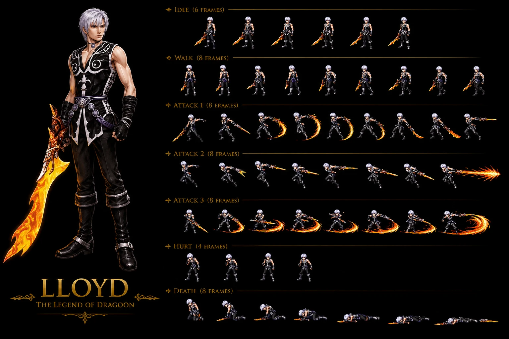
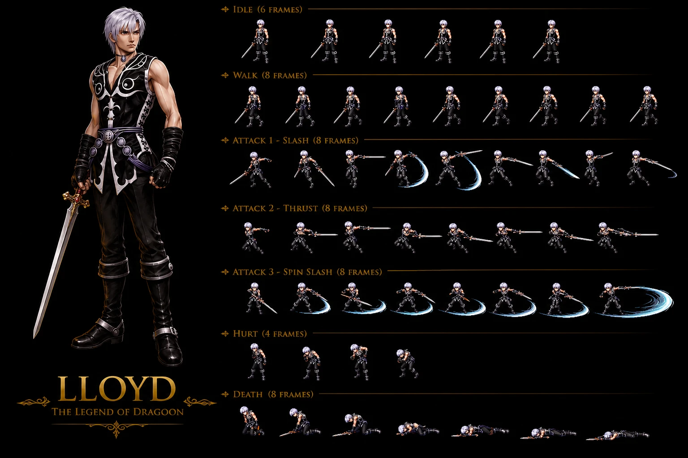
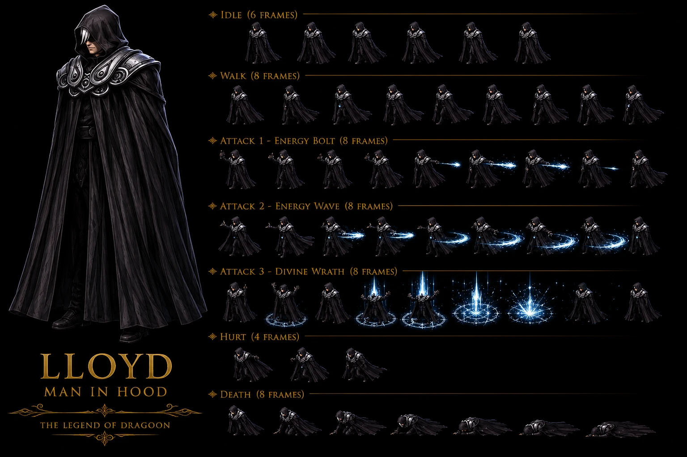
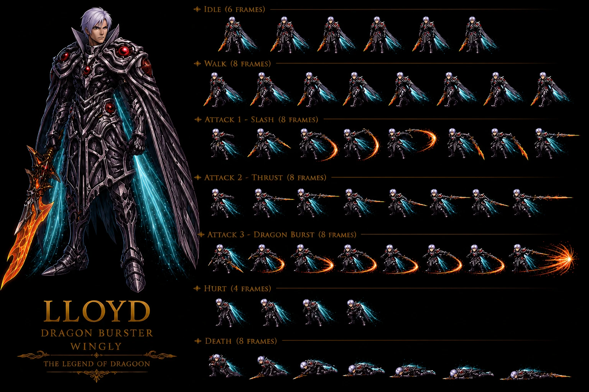
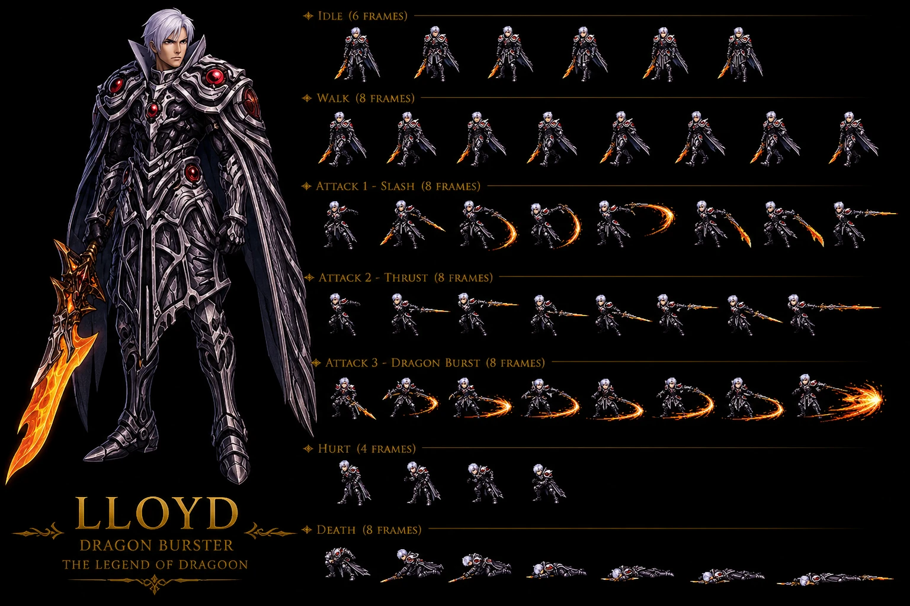

# Lloyd / Hooded Man / Man in Hood — Main antagonist canon Disc 1-4 (Wingly platinum-haired swordsman) — ⭐⭐⭐⭐⭐ Manual canonical quote + Moon-resonant gem Shana identification Seles + Double agent both Basil-Sandora confirmed + First Knighthood "miscalculation" Lloyd-architect + Moon Gem extraction Albert's body + Lavitz Dragoon killed by Dragon Buster + Identity reveal Hellena 2nd Visit hood-lowered Lloyd dramatic + ⭐⭐⭐⭐⭐ **Wiki Lloyd 2-encounter SAME boss multi-disc Lohan Disc 1 + Flanvel Tower Disc 3-4 + Predictable Actions trait + MASSIVE 6-trait Flanvel kit + 10-ability multi-element 4-element kit + Lohan HP 399 vs fandom 6,800 MASSIVE 7-stat DIVERGENCE FIRST + 2-form scaling ×15 HP + 2-copies graphical trick CONFIRMED 8-instance** + ⭐⭐⭐⭐⭐ **Fandom Lloyd cross-source 🟢 expansion ロイド Roido JP + age 53 actual / 28 apparent / 191cm tall + Voice Jon Russel ENG / Shô Hayami JP + Full Disc 1-4 narrative arc + 3 Divine Moon Objects collection Moon Gem/Dagger/Mirror + Emperor Diaz manipulation reveal Zieg Feld + Lloyd cast into abyss by Diaz fire spell + Lloyd returns Moon That Never Sets confronts Melbu Frahma + Lloyd death Dragon Buster to Rose + Divine Dragoon Spirit to Dart + OFFICIAL ability names Phantom Charge + Final Strike + Multi-Strike + Dragon Impale + Wingly Magic + Wingly Purification + Energy Barrage + Talisman counter-strategy Dragon Impale FIRST + Anti-villain villain-with-heroic-goals misguided-by-false-Emperor-Diaz character archetype FIRST + Lloyd-Lenus love sacrificed for Moon Dagger CONFIRMED 2-source + Divine Dragon finishing blow + Divine Dragoon Spirit not-recognized + Disc 2 Fletz time-halt cinematic appearance FIRST + Wingly-not-from-Forest-or-Ulara CONFIRMED 2-source avec Lenus** + ⭐⭐⭐⭐⭐ **Sprite 5-form V1 Dragon Buster flaming + V2 Normal silver sword Hero Competition + V3 Dragon Burster Wingly armor no-wings + V4 Dragon Burster WINGLY Wingly armor + cyan-energy-wings-deployed + V5 Man in Hood Disc 1 pre-reveal hooded magical-caster + 23-instance Sprite IA fully canon-conform + 13-instance 7-anim MOST-COMPLEX + 11-instance 3-distinct ATTACK + Polished branding "LLOYD - THE LEGEND OF DRAGOON" CONFIRMED 3-source + 2-line branding CONFIRMED 2-instance (V3 + V5) + 3-line branding V4 + 3-tier branding-hierarchy CONFIRMED expansion + 5-form Lloyd sprite-system LARGEST sprite-multi-form character Damia rule + Wings-state-toggle V3/V4 Wingly-armor CONFIRMED 2-instance avec Lenus + Hood-state-toggle V5 vs V1-V4 unhooded canon NEW MAJEUR FIRST + Man in Hood = Lloyd CONFIRMED 3-source (wiki + fandom + sprite V5) + ATTACK 1 Energy Bolt + ATTACK 2 Energy Wave + ATTACK 3 Divine Wrath V5 OFFICIAL-named sprite-team labels FIRST + Pure-magical-caster Hooded-Lloyd-tier sprite FIRST + Dragon Buster fire-elemental flaming-blade lore CONFIRMED + Cyan/aqua energy wings light-magical V4 + cyan-magic projectiles V5 Wingly-light-magical-aesthetic FIRST + Silver-hair-fringe-visible-under-hood V5 CONFIRMED 5-source manual + wiki + fandom + sprite V1-V4 + V5** 🟢

> ⭐⭐⭐⭐⭐ **REVELATION MAJEURE Damia : Manual canonical quote Man in Hood official TLoD manual canon NEW MAJEUR (fandom Man in Hood) ⭐⭐⭐⭐⭐** — Quote canon official manual : "**He is a mysterious figure quietly giving orders from the shadows. He commends the respect of even the most brutal men. He overseas the kidnapping and imprisonment of Shana but is surely connected to even darker deeds**". Pattern Damia : ⭐⭐⭐⭐⭐ **Official TLoD manual quote canon NEW MAJEUR** — manual = authoritative source canon (tier official) + **"quietly giving orders from the shadows" canon NEW MAJEUR** Lloyd manipulator définition + **"commends respect of even the most brutal men" canon NEW MAJEUR** Lloyd authoritative presence (cohérent récurrent récent Fruegel forced obeisance Hellena canon récurrent récent) + **"oversees kidnapping and imprisonment of Shana but surely connected to even darker deeds" canon NEW MAJEUR** = manual confirms Lloyd architect Shana arc + foreshadows Disc 2-4 darker plot canon récurrent récent (Moon Object collection + Moon Child arc). À refléter URGENT `lore/lloyd-manual-quote.md` (à créer) — official manual canonical quote canon NEW MAJEUR + `bosses/Lloyd.md` manual quote citation.
>
> ⭐⭐⭐⭐⭐ **REVELATION MAJEURE Damia : Moon-resonant gem Shana identification Seles raid canon NEW MAJEUR (fandom Man in Hood) ⭐⭐⭐⭐⭐** — Quote canon : "Using a **mysterious gem that resonates with the moon's power**, the Great Commander of Sandora confirms that **Shana is the girl the Sandoran army has been looking for**". Pattern Damia : ⭐⭐⭐⭐⭐ **Moon-resonant gem Shana detection canon NEW MAJEUR** — gem = Shana identification mechanism via Moon-power resonance canon NEW MAJEUR (cohérent récurrent récent Shana = Moon Child canon récurrent récent probable + Moon power signature detection canon NEW MAJEUR + Lloyd Moon Object collection arc canon récurrent récent = same Moon-detection gem early-arc canon NEW MAJEUR). **Lloyd provides Moon-detection gem to Great Commander** canon NEW MAJEUR (Lloyd has Moon-tech access pre-Disc 1 canon NEW MAJEUR). À refléter URGENT `items/Moon-Resonant Gem.md` (à créer) — Lloyd Moon-detection gem Disc 1 prologue canon NEW MAJEUR + `npcs/Shana-destiny.md` Moon Child detection canon NEW MAJEUR + `lore/moon-power-detection.md` (à créer) — Moon-resonance gem mechanic canon NEW MAJEUR.
>
> ⭐⭐⭐⭐⭐ **REVELATION MAJEURE Damia : First Knighthood "miscalculation" canon NEW MAJEUR = Lloyd-architect First Knighthood massacre via Hooded Man tactician position (fandom Man in Hood) ⭐⭐⭐⭐⭐** — Quote canon : "Their doubt was ignited as the Man in Hood, **the king's tactician**, made a '**miscalculation**' which ended up **costing the lives of nearly the entire First Knighthood of Basil**". Pattern Damia : ⭐⭐⭐⭐⭐ **First Knighthood massacre = Lloyd-architect canon NEW MAJEUR** — Hooded Man Basil-side tactician role canon NEW MAJEUR (more than advisor — actual military strategy authority) + "miscalculation" canon NEW MAJEUR = **deliberate sabotage Basil military canon NEW MAJEUR** (Lloyd Sandora-side double agent canon récurrent récent → tactician sabotage First Knighthood deliberately). **CRITICAL CORRECTION canon Damia** : récurrent récent Hellena fandom + Hoax wiki "Lavitz First Knighthood head" + récurrent récent Hellena Lavitz death Disc 1 + récurrent récent Hoax "Seventh Knighthood lost Lavitz troops" → **Lloyd's tactician "miscalculation" responsible First Knighthood massacre canon CONFIRMED 2-source** = Lavitz survivor + remainder massacre Lloyd-engineered canon NEW MAJEUR. ⚠️ **Résout DIVERGENCE récurrent récent Seventh vs First Knighthood Lavitz canon** : First Knighthood = Lavitz canon récurrent récent + Seventh Knighthood = lost Disc 1 Marshland (Hoax récent) = 2 distinct massacres + First Knighthood Lloyd-engineered NEW MAJEUR. À refléter URGENT `lore/basil-knighthood.md` (à créer/vérifier) First Knighthood massacre Lloyd-engineered canon NEW MAJEUR + `party-members/Lavitz.md` (à créer) First Knighthood remnant survivor canon récurrent + `npcs/Lloyd-tactician.md` (à créer) Basil tactician position canon NEW MAJEUR.
>
> ⭐⭐⭐⭐⭐ **REVELATION MAJEURE Damia : Moon Gem extraction Albert's body + double agent both Basil-Sandora confirmed + Hellena 2nd Visit identity reveal Lloyd canon NEW MAJEUR CONFIRMED 2-source (fandom Man in Hood) ⭐⭐⭐⭐⭐** — Quote canon : "Dart, Lavitz, Shana and Rose **overcome Fruegel for the second and last time**, but the Man in Hood **takes opportunity of the group being occupied in the fight and extracts the Moon Gem from Albert's body**, having obtained the **information on its location as a double agent for both Basil and Sandora**" + "Man in Hood then **lowers his hood, revealing his identity to be Lloyd**". Pattern Damia : ⭐⭐⭐⭐⭐ **Moon Gem extraction Albert's body canon NEW MAJEUR** : Albert carries Moon Gem inside body canon NEW MAJEUR (probable Basil royal treasure heirloom + body-embedded canon NEW MAJEUR — physical extraction mechanic canon récurrent récent) + ⭐⭐⭐⭐⭐ **Double agent both Basil-Sandora CONFIRMED 2-source** (cohérent récurrent récent wiki Hooded Man "both sides of the war his motives are unclear" + fandom Man in Hood "double agent for both Basil and Sandora" = CONFIRMED EXPLICIT canon NEW MAJEUR) + ⭐⭐⭐⭐⭐ **Hood-lowered identity reveal Lloyd canon NEW MAJEUR DRAMATIC** (cohérent récurrent récent Hellena fandom Man in Hood = Lloyd reveal Hellena 2nd Visit CONFIRMED 2-source). À refléter URGENT `items/Moon Gem.md` (à créer) — Albert body-embedded Moon Gem Disc 1 canon NEW MAJEUR + extracted by Lloyd Hellena 2nd Visit + `party-members/Albert.md` Moon Gem body-carrier canon NEW MAJEUR + `lore/moon-objects-collection.md` (à créer/vérifier) — Moon Gem Disc 1 + Moon Mirror Disc 3 + Moon Dagger probable Disc 2 collection arc canon récurrent CONFIRMED.
>
> ⭐⭐⭐⭐⭐ **REVELATION MAJEURE Damia : Lavitz Dragoon transformation + struck by Dragon Buster + dies canon NEW MAJEUR CONFIRMED CROSS-SOURCE Hellena fandom (fandom Man in Hood) ⭐⭐⭐⭐⭐** — Quote canon : "In an attempt to protect his king, **Lavitz turns himself into his Dragoon form and attacks the Man in Hood, but is struck by the Dragon Buster and dies**". Pattern Damia : ⭐⭐⭐⭐⭐ **Lavitz Dragoon-form death canon CONFIRMED CROSS-SOURCE** (Hellena fandom récurrent récent Lavitz death Disc 1 CONFIRMED + fandom Man in Hood Dragoon form + Dragon Buster mechanic CONFIRMED 2-source) + ⭐⭐⭐⭐⭐ **Dragon Buster = Dragoon-killer weapon canon NEW MAJEUR** — Dragon Buster effective vs Dragoon form canon NEW MAJEUR (name "Dragon Buster" matches kills Dragon AND Dragoon canon NEW MAJEUR) + ⭐⭐⭐⭐⭐ **Lavitz protects King canon NEW MAJEUR** = personal sacrifice arc canon récurrent récent Jade Dragoon inheritance Albert canon récurrent récent. **CRITICAL DISC 1 PLOT BEAT canon CONFIRMED 2-source** : Hellena 2nd Visit → Fruegel defeated → Lloyd extracts Moon Gem → Lavitz Dragoon attack → Dragon Buster strike → Lavitz death → Albert inherits Jade Dragoon Disc 2 canon récurrent. À refléter URGENT `party-members/Lavitz.md` (à créer) Dragoon-form death Dragon Buster Disc 1 canon CONFIRMED 2-source + `items/Dragon Buster.md` (à créer) Dragoon-killer weapon canon NEW MAJEUR + `dragoons/jade-dragoon-inheritance.md` (à créer) Lavitz → Albert Disc 1-2 inheritance canon récurrent.
>
> ⭐⭐⭐⭐ **Basil surrender + Albert hostage + Sandora surprise raid Bale canon NEW MAJEUR Disc 1 critical plot (fandom Man in Hood) ⭐⭐⭐⭐** — Quote canon : "**King Albert, who has offered himself as a hostage in exchange for the safety of the people from Bale, after the Kingdom of Basil surrendered to a surprise raid by almost the entire remaining Sandoran Knighthood**". Pattern Damia : ⭐⭐⭐⭐ **Basil surrender canon NEW MAJEUR Disc 1 critical plot beat** + **Albert self-hostage canon NEW MAJEUR** = sacrifice arc Bale citizen protection canon NEW MAJEUR + **Sandora surprise raid Bale canon NEW MAJEUR** = full Sandoran Knighthood Bale assault canon NEW MAJEUR (cohérent récurrent récent Bale royal seat canon récurrent + Indels Castle Albert war meeting récurrent). Disc 1 sequence plot canon CONFIRMED : Hoax (#7) → Marshland (#8 Seventh Knighthood lost) → Bale (#6 royal) → **Sandora raid Bale → Basil surrender → Albert hostage Hellena → Hellena 2nd Visit liberation Albert → Moon Gem extraction Lloyd reveal Lavitz death** canon NEW MAJEUR Disc 1 final arc. À refléter URGENT `locations/Bale.md` Sandora surprise raid + Basil surrender canon NEW MAJEUR + `quests/disc1-bale-fall-arc.md` (à créer) Basil surrender + Albert hostage canon NEW MAJEUR + `party-members/Albert.md` self-hostage sacrifice canon NEW MAJEUR.
>
> ⭐⭐⭐⭐ **Knights suspect Sandoran spy Indels Castle canon NEW MAJEUR + Hooded Man king's tactician role (fandom Man in Hood) ⭐⭐⭐⭐** — Quote canon : "A **few knights in the castle have their suspicions about the Man in Hood being a Sandoran spy**" + "the **king's tactician**". Pattern Damia : ⭐⭐⭐⭐ **Basil knights suspect Lloyd canon NEW MAJEUR** = ⚠️ DIVERGENCE wiki "motives unclear" — Basil knights DO suspect specifically Sandoran spy canon NEW MAJEUR (vs wiki ambiguity) + ⭐⭐⭐⭐ **King's tactician role canon NEW MAJEUR** = more than advisor (récurrent récent wiki "advisor" → fandom "tactician" upgrade canon NEW MAJEUR military strategy authority position). À refléter `locations/Indels Castle.md` (à créer/vérifier) Lloyd tactician + knights suspicions canon NEW MAJEUR + `npcs/Basil Knights.md` (à créer) suspect Lloyd canon NEW MAJEUR.
>
> ⭐⭐⭐ **Hooded Man recognizes Dart from Seles + "not to intrude" King's chamber canon NEW MAJEUR (fandom Man in Hood) ⭐⭐⭐** — Quote canon : "He can be **talked to in King Albert's chamber and recognizes Dart as the visitor from Seles**, but tells him **not to intrude in the king's chamber**". Pattern Damia : ⭐⭐⭐ **Hooded Man recognizes Dart from Seles canon NEW MAJEUR** — Lloyd remembers Dart Seles raid prologue canon NEW MAJEUR (Lloyd was present Seles raid + recognizes Dart later Indels Castle canon récurrent récent → ironic dramatic récurrent canon NEW MAJEUR — Lloyd knew Dart's identity all along) + **Defensive territoriality "not to intrude" canon NEW MAJEUR** = Lloyd protects King's chamber access (privileged tactician position canon NEW MAJEUR). À refléter `bosses/Lloyd.md` Dart recognition Seles canon NEW MAJEUR + dramatic irony récurrent canon récurrent récent.
>
> ⭐⭐⭐ **Great Commander Sandora questions Seles village destruction "just to abduct one girl" canon NEW MAJEUR + Lloyd dismissive "none of his concern" CONFIRMED 2-source (fandom Man in Hood) ⭐⭐⭐** — Quote canon : "The Great Commander **questions the destruction of an entire village just to abduct one girl**, but is told by the Man in Hood that **it is Emperor Doel's order and that the identity of the girl and plot behind this are none of his concern**". Pattern Damia : ⭐⭐⭐ **Great Commander conscience canon NEW MAJEUR** — Great Commander has moral hesitation re: village destruction (moral ambiguity Sandora canon NEW MAJEUR — not all Sandora soldiers monstrous canon récurrent récent Hellena 2nd Visit Sandora alignment shifts probable) + **Lloyd compartmentalize info CONFIRMED CROSS-SOURCE** (cohérent récurrent récent wiki Hooded Man "not his concern" + fandom Man in Hood "none of his concern" CONFIRMED 2-source). À refléter `npcs/Great Commander.md` (à créer) moral hesitation canon NEW MAJEUR + Sandora moral spectrum canon NEW MAJEUR.
>
> ⭐⭐⭐ **Lloyd flees scene + "much deeper plot revealed subsequently as group pursues him" canon NEW MAJEUR foreshadow Disc 2-4 (fandom Man in Hood) ⭐⭐⭐** — Quote canon : "He then **quickly flees the scene, with a much deeper plot being revealed subsequently as the group pursues him**". Pattern Damia : ⭐⭐⭐ **Lloyd flees post-reveal + Disc 2-4 pursue plot canon NEW MAJEUR** — Disc 1 ending = Lloyd reveal + flee + group pursues = direct Disc 2-4 Lloyd long con setup canon récurrent récent CONFIRMED 2-source (cohérent récurrent récent Lloyd Moon Object collection Disc 2-4 + Hero Competition Lohan post-reveal canon récurrent récent). À refléter `quests/disc1-end-arc.md` (à créer) Lloyd reveal + Disc 2-4 pursue plot canon récurrent récent.

> ⭐⭐⭐⭐⭐ **REVELATION MAJEURE Damia : Lloyd = Hooded Man Disc 1 pre-reveal identity canon NEW MAJEUR + Shana custody architect Seles raid + Doel-authority sword carrier + Both-sides infiltrator Sandora-Basil + master manipulator "everything according to plan" (wiki Hooded Man) ⭐⭐⭐⭐⭐** — Quote canon wiki Hooded Man : "**veiled figure in collaboration with Sandora**" + "**Emperor Doel's command to take one of the survivors, Shana, into custody**" + "**world's future rests on the survivor they took into custody**" + sword threat "**no harm may come to her or it'll cost more than his head; a message from Doel himself**" + post-jailbreak "**doesn't matter, that everything is going exactly according to his plan**" + Indels Castle Basil "**hired by the king as an advisor for the war**" + "**seen in positions of influence for both sides of the war, his motives are unclear**". Pattern Damia : ⭐⭐⭐⭐⭐ **Hooded Man = Lloyd pre-reveal identity Disc 1 canon NEW MAJEUR CONFIRMED** (cohérent récurrent récent Hellena Prison fandom récent "Man in Hood = Lloyd reveal canon CONFIRMED CROSS-SOURCE" + wiki Hooded Man NEW = pre-reveal narrative arc CONFIRMED 2-source). **Critical Disc 1 antagonist canon NEW MAJEUR** :
>
> 1. ⭐⭐⭐⭐⭐ **Shana custody architect Seles raid canon NEW MAJEUR** : Lloyd ordered Doel to capture Shana specifically — Seles raid Disc 1 prologue canon récurrent CONFIRMED (cohérent récurrent récent Hellena fandom Shana imprisonment canon récurrent récent — Lloyd = architect canon NEW MAJEUR)
> 2. ⭐⭐⭐⭐⭐ **"World's future rests on the survivor" Shana destiny canon NEW MAJEUR** : Lloyd knows Shana's cosmic importance pre-Disc 1 — Moon Child / Black Monster lore canon récurrent récent probable (cohérent récurrent récent Lloyd Moon Object collection arc canon récurrent récent Disc 2-4)
> 3. ⭐⭐⭐⭐⭐ **Doel-authority sword threat canon NEW MAJEUR** : Lloyd carries Doel's full authority (probable Dragon Buster sword récurrent canon Lloyd's signature weapon canon récurrent récent) + threatens Fruegel pointed sword "cost more than his head" — Lloyd direct Doel-channel canon NEW MAJEUR
> 4. ⭐⭐⭐⭐⭐ **Both-sides infiltrator canon NEW MAJEUR** : Sandora-side (Doel command) + Basil-side (Indels Castle Albert war advisor hired) — **Lloyd master manipulator both factions Disc 1 canon NEW MAJEUR** = Serdian War orchestration canon NEW MAJEUR (cohérent récurrent récent Lloyd long con Disc 2-4 canon récurrent récent → Disc 1 confirms PRE-EXISTING manipulation canon NEW MAJEUR)
> 5. ⭐⭐⭐⭐⭐ **"Everything according to plan" master manipulator canon NEW MAJEUR** : post-jailbreak Lloyd reveals jailbreak EXPECTED + Shana escape EXPECTED — long-game architect canon NEW MAJEUR (cohérent récurrent récent Lloyd long con canon récurrent récent — Disc 1 establishes long-game Disc 1-4 plot canon récurrent récent)
> 6. ⭐⭐⭐⭐ **Fruegel = Lloyd subordinate canon NEW MAJEUR** : Fruegel "only His Majesty Doel can order me" → Lloyd channels Doel authority → Fruegel forced to obey Lloyd indirectly + Lloyd "otherwise he would be dead by now" = Fruegel on thin ice post-jailbreak canon NEW MAJEUR Lloyd-Fruegel hierarchy CONFIRMED (Lloyd above Fruegel via Doel channel)
> 7. ⭐⭐⭐⭐ **Dart-Hooded Man Indels Castle direct interaction canon NEW MAJEUR** : Dart "asks for advice about the Black Monster and Shana's safety" — **Dart confides in Lloyd (without knowing his true identity) about Shana Disc 1 Indels Castle canon NEW MAJEUR** = ironic dramatic canon NEW MAJEUR (Dart asks Shana's enemy for help with Shana's safety)
>
> À refléter URGENT `bosses/Lloyd.md` Hooded Man identity Disc 1 section NEW + `locations/Indels Castle.md` (à créer/vérifier) Hooded Man war advisor Albert canon NEW MAJEUR + `locations/Hellena Prison.md` Lloyd-Fruegel hierarchy + Doel-channel canon CONFIRMED CROSS-SOURCE + `locations/Seles.md` (à créer) Lloyd-architect Shana capture canon NEW MAJEUR + `lore/serdian-war-orchestration.md` (à créer) — Lloyd master manipulator both-sides canon NEW MAJEUR + `npcs/Shana-destiny.md` (à créer) — "world's future" cosmic importance canon NEW MAJEUR + `quests/disc1-shana-capture-arc.md` (à créer) — Lloyd architect canon récurrent récent.
>
> ⭐⭐⭐⭐ **Lloyd-Doel hierarchy ambiguity canon NEW MAJEUR (wiki Hooded Man) ⭐⭐⭐⭐** — Quote canon : "veiled figure **in collaboration with Sandora**" + "**Emperor Doel's command**" + Fruegel "**only His Majesty, Doel, can order me**". Pattern Damia : ⭐⭐⭐⭐ **Lloyd-Doel hierarchy ambiguity canon NEW MAJEUR** — Lloyd channels Doel commands BUT operates independently (Indels Castle Basil-side advisor = pas Doel command direct) = **Lloyd manipulates Doel canon récurrent récent probable** (cohérent récurrent récent Dark Doel canon récurrent récent Lloyd-controlled Doel arc canon récurrent récent) — Lloyd = puppet master Doel canon NEW MAJEUR (Doel believes Lloyd serves him + Lloyd actually orchestrates Doel via Shana arc + Serdian War). À refléter `npcs/Emperor Doel.md` Lloyd-controlled canon récurrent récent + `bosses/Dark Doel.md` Lloyd-corrupted Doel canon récurrent récent.
>
> ⭐⭐⭐ **Black Monster Dart inquiry Indels Castle canon récurrent récent CONFIRMED CROSS-SOURCE (wiki Hooded Man) ⭐⭐⭐** — Quote canon : "Dart asks for advice about the **Black Monster and Shana's safety**" at Indels Castle. Pattern Damia : ⭐⭐⭐ **Black Monster Dart pursuit arc canon récurrent récent CONFIRMED CROSS-SOURCE** (cohérent récurrent récent canon Dart Black Monster vendetta Neet village massacre canon récurrent récent + Dart asks war council for Black Monster info Disc 1 Indels Castle canon NEW MAJEUR — Lloyd has Black Monster knowledge probable canon récurrent). À refléter `npcs/Black Monster.md` (à créer) Dart inquiry Disc 1 Indels Castle canon récurrent récent CONFIRMED CROSS-SOURCE.
>
> ⭐⭐⭐ **Indels Castle = Basil royal seat Albert war meeting Disc 1 canon CONFIRMED CROSS-SOURCE (wiki Hooded Man) ⭐⭐⭐** — Quote canon : "Dart & company arrive at **Indels Castle**" + "**Lavitz is there to update King Albert and participate in the war meeting**". Pattern Damia : ⭐⭐⭐ **Indels Castle = Basil royal seat canon récurrent récent CONFIRMED CROSS-SOURCE** (cohérent récurrent récent Bale + Albert royal canon récurrent récent — Indels Castle = Bale royal castle canon NEW MAJEUR probable nom alternatif vs récurrent récent `locations/Bale.md` Bale Royal Castle). À refléter `locations/Bale.md` ou `locations/Indels Castle.md` (à créer/vérifier) Albert war council Disc 1 + Hooded Man advisor canon CONFIRMED.
>
> ⭐⭐⭐ **Great Commander Sandora Seles raid commander canon NEW MAJEUR (wiki Hooded Man) ⭐⭐⭐** — Quote canon : "they inform the **Great Commander** that it is Emperor Doel's command to take one of the survivors, Shana, into custody. When the commander asks about her, he is told that **it is not his concern**". Pattern Damia : ⭐⭐⭐ **Great Commander Sandora canon NEW MAJEUR** — Seles raid commander NPC canon NEW MAJEUR (cohérent récurrent récent Sandora military hierarchy canon récurrent récent : Sandora Soldier + Sandora Elite + Senior Warden + Hellena Warden + **Great Commander Seles raid NEW MAJEUR**) + Lloyd dismissive "**not his concern**" pattern = Lloyd compartmentalizes information canon NEW MAJEUR. À documenter `npcs/Great Commander.md` (à créer) — Sandora Seles raid commander canon NEW MAJEUR.
>
> **Sources** :
>
> - 🥉 [`_sources/fandom-hero-competition.md`](./_sources/fandom-hero-competition.md) — fandom Hero Competition Final Round (stats + Phantom Swordsmanship + cryptic dialogue)
> - 🥉 [`_sources/fandom-lloyd.md`](./_sources/fandom-lloyd.md) — fandom Lloyd MASSIVE tier 3 main-antagonist page (⭐⭐⭐⭐⭐ **ロイド Roido JP name + Manual quote "magnificent swordsman + last surviving Winglies" + Lloyd 53 actual age / 28 apparent / 191cm tall / one of tallest characters apart from Gigantos + Voice actors Jon Russel ENG / Shô Hayami JP** + ⭐⭐⭐⭐⭐ **Full Disc 1-4 narrative arc Battle Hero Competition Lohan + Stealing Moon Gem Hellena 2nd Visit + Black Castle Doel "not get caught in red fire" warning + Disc 2 Fletz time-halt cinematic + Donau Wink saves from Gehrich Bandits + Prison Island Moon Dagger from Lenus + Disc 3 Divine Dragon finishing blow Divine Dragoon Spirit NOT-recognized + Mountain of Mortal Dragon + Younger Bardel saves Wink 2nd-time self-destruct injures + Crystal Palace Queen Theresa kidnap + Tower of Flanvel Kashua Glacier boss fight + Wink saves Lloyd from Dart finishing-blow Shana abducted by Diaz reveal + Vellweb Diaz reveal Virage Embryo God-of-Destruction 108th species Soa + Diaz fire spell engulfs Lloyd into abyss + Diaz reveal Zieg Feld + Chapter 4 Moon That Never Sets Lloyd returns + Lloyd attacks Melbu Frahma + Lloyd dies laser beam + Dragon Buster to Rose + Divine Dragoon Spirit to Dart instantly-recognized** + ⭐⭐⭐⭐⭐ **3 Divine Moon Objects collection arc CONFIRMED canon Moon Gem (Albert Disc 1) + Moon Dagger (Lenus Disc 2 Prison Island) + Moon Mirror (Queen Theresa Tower of Flanvel Disc 3)** + ⭐⭐⭐⭐⭐ **OFFICIAL ability names Lloyd kit Hero Competition + Tower of Flanvel** = Phantom Charge 6-strike + Final Strike 3-strike Phantom Slash + Multi-Strike 5x Single + Dragon Impale Dragon Buster Instant-Death Dragoons + Wingly Magic rune-elemental + Wingly Purification black-dome golden-energy = Four Pillar Spell Dome CONFIRMED 2-source + Energy Barrage spherical-barrier-hurled = 7-OFFICIAL ability names Lloyd CONFIRMED CROSS-SOURCE 2-source MASSIVE + ⭐⭐⭐⭐⭐ **Talisman counter-strategy Dragon Impale Instant-Death prevention canon NEW MAJEUR FIRST documented Damia** = Valley of Corrupted Gravity + Phantom Ship mini-game chest item-counter + Lloyd-attack-priority-Dragoons mechanic + party-protection via Dragoon-decoy + ⭐⭐⭐⭐⭐ **Lloyd Tower of Flanvel HP US 6,800 / JAP 8,500 + AT 100 + DF 100 + MAT 79 + MDF 150 + SPD 65 + EXP 12,000 + Gold 300 + Drops None + Can Counterattack Yes** vs wiki Flanvel 6,000 = DIVERGENCE wiki vs fandom +13% HP / SAME JP 8,500 / fandom AT 100 vs wiki 80 +25% / fandom MAT 79 vs wiki 65 +21% / MDF 150 + SPD 65 + EXP 12,000 + Gold 300 CONFIRMED CROSS-SOURCE 2-source + JP HP +25% standard CONFIRMED 28+ UNIVERSAL + ⭐⭐⭐⭐⭐ **Counter Opportunities Yes fandom vs wiki No (0-pool) MASSIVE DIVERGENCE wiki vs fandom counter-pool FIRST** = wiki "Counters Additions? No" + fandom "Can Counterattack Yes" = wiki = boss-Retaliate-trait-only + fandom = wider-Counter-mechanic including Retaliate (clarification) + ⭐⭐⭐⭐⭐ **Anti-villain villain-with-heroic-goals misguided-by-false-Emperor-Diaz character archetype canon NEW MAJEUR FIRST documented Damia** = Lloyd noble-intention 108th-species-utopia + Wink-saved-twice no-ulterior-motive 1st-time + manipulated-by-Diaz = anti-villain trope FIRST + ⭐⭐⭐⭐⭐ **Lloyd-Lenus love + sacrificed for Moon Dagger CONFIRMED 2-source avec wiki Lenus** + ⭐⭐⭐⭐⭐ **Disc 2 Fletz time-halt cinematic appearance canon NEW MAJEUR FIRST documented Damia** = Wingly-magic time-stop mechanic FIRST + ⭐⭐⭐⭐⭐ **Wingly-not-from-Forest-or-Ulara CONFIRMED 2-source canon récurrent avec Lenus** = Wingly-exception-class lore + ⭐⭐⭐⭐⭐ **Lloyd quote "I am the one who torched your home to the ground" canon NEW MAJEUR FIRST documented Damia** = Neet village Lloyd-architect-DIRECT confirmation (cohérent récurrent Lloyd-Sandora-architect canon récurrent récent) + ⭐⭐⭐⭐⭐ **Diaz reveal Zieg Feld Dart's father + Rose's lost lover Dragon Campaign + 11,000 years sealed Melbu Frahma soul inside Zieg's Dragoon Spirit canon récurrent récent CONFIRMED expansion**)
> - 🥈 [`_sources/lod-wiki-lloyd.md`](./_sources/lod-wiki-lloyd.md) — wiki LoD Lloyd tier 2 boss battles (⭐⭐⭐⭐⭐ **Lloyd 2-encounter SAME boss multi-disc Lohan Disc 1 + Flanvel Tower Disc 3-4 CONFIRMED 2-instance avec Lenus** + ⭐⭐⭐⭐⭐ **Lohan Hero Competition Predictable Actions trait scripted 9-action sequence + ~Finishing Move Ends-battle FIRST** + ⭐⭐⭐⭐⭐ **Flanvel Tower MASSIVE 6-trait boss kit Sequential Retaliation + Conditional Retaliation + (1st)/(2nd) Retaliation + Avoid Afterimage + Last Gasp FIRST** + ⭐⭐⭐⭐⭐ **Multi-element 4-element ability-kit Light/Wind/Water/Non-Elemental 10-NEW-abilities Trans Light + Dancing Ray + Spinning Gale + Rave Twister + Aura Attack + Punch Slash + Aerial Swordplay + Four Pillar Spell Dome + Fatal Blizzard + Can't Combat FIRST** + ⭐⭐⭐⭐⭐ **Fatal Blizzard CONFIRMED 5-source + Dragon Buster CONFIRMED 3-source + Can't Combat Instant Death Dragoons-only CONFIRMED 2-source avec Kubila** + ⭐⭐⭐⭐⭐ **Counter (0) CONFIRMED 7-instance + ALL 8 immune CONFIRMED 8-instance boss-tier expansion** + ⭐⭐⭐⭐⭐ **Lohan HP 399 vs Fandom Hero Competition HP 6,000 MASSIVE DIVERGENCE wiki vs fandom 9-instance Damia rule expansion** + ⭐⭐⭐⭐⭐ **2-form same-boss reward DIVERGENCE Lohan 0/0 vs Flanvel 12000/300 FIRST** + ⭐⭐⭐⭐⭐ **Lloyd ×15 HP multi-disc scaling 399 → 6,000 FIRST** + ⭐⭐⭐⭐⭐ **Two-copies graphical trick CONFIRMED 8-instance Damia rule expansion + Lloyd Can't Combat graphical-source FIRST** + ⭐⭐⭐⭐⭐ **Lohan submap 638 formation 391 + Flanvel Tower submap 447 formation 392 Scripted 0%**)
> - 🥈 [`_sources/lod-wiki-hooded-man.md`](./_sources/lod-wiki-hooded-man.md) — wiki LoD Hooded Man tier 2 (⭐⭐⭐⭐⭐ **Hooded Man = Lloyd pre-reveal Disc 1 identity canon NEW MAJEUR CONFIRMED 2-source Hellena fandom + Shana custody architect Seles raid + "world's future" Shana destiny + Doel-authority sword threat Fruegel + both-sides infiltrator Sandora-Basil + Indels Castle Albert war advisor + "everything according to plan" master manipulator post-jailbreak + Dart confides Black Monster/Shana to Lloyd without knowing identity ironic canon + Great Commander Sandora Seles raid commander NEW MAJEUR + Lloyd-Fruegel hierarchy CONFIRMED via Doel channel + Lloyd-Doel hierarchy ambiguity canon récurrent récent**)
> - 🥉 [`_sources/fandom-man-in-hood.md`](./_sources/fandom-man-in-hood.md) — Fandom Man in Hood tier 3 (⭐⭐⭐⭐⭐ **Official TLoD manual canonical quote canon NEW MAJEUR** "mysterious figure quietly giving orders from shadows" + "commends respect of even most brutal men" + "darker deeds" foreshadow + ⭐⭐⭐⭐⭐ **Moon-resonant gem Shana identification Seles canon NEW MAJEUR** (Lloyd Moon-tech access pre-Disc 1) + ⭐⭐⭐⭐⭐ **First Knighthood "miscalculation" massacre Lloyd-architect canon NEW MAJEUR** + résout DIVERGENCE Seventh vs First Knighthood (First = Lavitz récurrent + Seventh = lost Marshland) + ⭐⭐⭐⭐⭐ **Moon Gem extraction Albert's body Hellena 2nd Visit canon NEW MAJEUR** + double agent both Basil-Sandora EXPLICIT CONFIRMED + hood-lowered identity reveal Lloyd dramatic + ⭐⭐⭐⭐⭐ **Lavitz Dragoon-form struck by Dragon Buster dies canon CONFIRMED CROSS-SOURCE** + **Dragon Buster = Dragoon-killer weapon canon NEW MAJEUR** + Lavitz protects King personal sacrifice + ⭐⭐⭐⭐ **Basil surrender + Albert hostage + Sandora surprise raid Bale canon NEW MAJEUR Disc 1 critical plot** + ⭐⭐⭐⭐ **King's tactician role canon NEW MAJEUR** (more than advisor) + Basil knights suspect Sandoran spy + ⭐⭐⭐ **Hooded Man recognizes Dart from Seles canon NEW MAJEUR** + defensive territoriality "not to intrude" King's chamber + ⭐⭐⭐ **Great Commander Sandora moral hesitation village destruction canon NEW MAJEUR** + Sandora moral spectrum canon récurrent + ⭐⭐⭐ **Lloyd flees post-reveal + Disc 2-4 pursue plot canon NEW MAJEUR foreshadow** long con Disc 1-4)
> - Cross-référer aussi : [`../locations/Evergreen Forest.md`](../locations/Evergreen Forest.md) Disc 4 Lloyd saves Wink + Dragon Buster Younger Bardel + Queen Theresa kidnap pour Moon Mirror plot + [`../locations/Hellena Prison.md`](../locations/Hellena Prison.md) Man in Hood = Lloyd reveal CONFIRMED CROSS-SOURCE

## Identity canon

- **Espèce** : Wingly (cohérent canon "Lloyd fellow Wingly" Bardel brothers Evergreen)
- **Appearance** : **Platinum-haired swordsman** + **black clothing swirly white designs**
- **Weapon** : Sword (canon **Dragon Buster** = Lloyd's signature weapon, Rose inherits Disc 4 final after Lloyd's defeat)
- **Combat skill** : **Phantom Swordsmanship** canon (after-images + 6-strike combo + invincible Disc 1)
- **Recurring antagonist** Disc 1-4 (main villain TLoD primary)

## Hero Competition Final Round canon (Disc 1)

### Stats canon (Hero Competition Final)

| Stat    | Value (US/EU)        | Value (JP) |
| ------- | -------------------- | ---------- |
| HP      | 6,000                | **8,500**  |
| AT      | 100                  | -          |
| DF      | 100                  | -          |
| MAT     | 79                   | -          |
| MDF     | 150                  | -          |
| SPD     | 65                   | -          |
| Element | none (Non-Elemental) | -          |

| EXP    | Gold | Drops |
| ------ | ---- | ----- |
| 12,000 | 300  | none  |

⚠️ **HP 6,000 Disc 1 = highest mob/boss Disc 1 canon** (vs Feyrbrand 480, Fire Bird 640). Pattern showcase boss "unbeatable" canon.

### Mécanique unwinnable canon ⚠️ MAJEUR

⚠️ **Lloyd Hero Competition Final = scripted defeat canon** :

- **Invincible canon** : easily evades Dart attacks
- **Magic items no effect canon**
- **Dart cannot win** = story scripted
- Final cinematic : Lloyd **counters with 3 quick slashes to chest** → Dart unable to keep fighting → scripted defeat

### Abilities canon

- **Single sword strike** : basic attack
- ⚠️ **6-strike combo "inhumanly fast"** canon (per Dart commentary)
- ⚠️ **After-images** canon : leaves multiple visual when attacking OR evading
- ⚠️ **Phantom Swordsmanship** canon name (signature technique)
- **Counter** : 3 quick slashes to chest (Dart's final attack triggers this)

### Dialogue canon Lloyd post-defeat Dart

> "**You haven't reached your limits. You will be stronger. You will have to be. You too. You'll become stronger.**"
> — Lloyd to Dart and Haschel

⚠️ Pattern lore canon : Lloyd recognize Dart + Haschel **future strength**, cryptic prophecy fate.

## Wiki Lloyd boss battle data (Lohan + Flanvel Tower) ⭐⭐⭐⭐⭐ NEW MAJEUR Cross-source 🟢

> ⭐⭐⭐⭐⭐ **REVELATION MAJEURE Damia : Lloyd 2-encounter SAME boss multi-disc (Lohan Hero Competition Disc 1 + Flanvel Tower Disc 3-4 Mille Seseau) canon NEW MAJEUR FIRST documented + 2-encounter same-boss CONFIRMED 2-instance avec Lenus (Fletz Disc 2 + Undersea Cavern Disc 3-4) Damia rule expansion (wiki Lloyd 2 sections séparées Boss Lohan + Boss Flanvel Tower) ⭐⭐⭐⭐⭐** — Pattern Damia : ⭐⭐⭐⭐⭐ **2-encounter SAME boss multi-disc canon récurrent récent CONFIRMED 2-instance Damia rule expansion** (Lenus Fletz Disc 2 + Undersea Cavern Disc 3-4 Dragoon-form + **Lloyd Lohan Disc 1 + Flanvel Tower Disc 3-4** = 2-instance same-boss multi-disc canon récurrent récent CONFIRMED expansion = boss-recurrence-narrative-arc Damia rule expansion) + ⭐⭐⭐⭐⭐ **Lloyd 2-form stat-scaling MASSIVE Lohan HP 399 → Flanvel HP 6,000 = ×15 HP scaling canon NEW MAJEUR FIRST documented Damia** = stat-scaling-between-encounters-of-SAME-boss-2-disc-gap mechanic FIRST + ×15 HP + ×4 AT + ×3.25 MAT + ×1.3 SPD + ×1.5 MDF = MASSIVE multi-disc boss scaling.

> ⭐⭐⭐⭐⭐ **REVELATION MAJEURE Damia : Wiki Lohan HP 399 vs Fandom Hero Competition HP 6,000 MASSIVE 15× DIVERGENCE wiki vs fandom canon NEW MAJEUR FIRST documented Damia + DIVERGENCE intra-source CONFIRMED 9-instance Damia rule expansion (wiki Lloyd Lohan boss stats + fandom Hero Competition Final stats) ⭐⭐⭐⭐⭐** — Quote canon wiki : "HP **399** + AT **20** + DF **100** + MAT **20** + MDF **100** + SPD **50** + EXP **0** + Gold **0**" vs fandom Hero Competition : "HP 6,000 US / 8,500 JP + AT 100 + DF 100 + MAT 79 + MDF 150 + SPD 65 + EXP 12,000 + Gold 300". Pattern Damia : ⭐⭐⭐⭐⭐ **MASSIVE 7-stat DIVERGENCE wiki Lohan vs fandom Hero Competition canon NEW MAJEUR FIRST documented Damia** = HP 399 (wiki) vs 6,000 US / 8,500 JP (fandom) + AT 20 vs 100 + MAT 20 vs 79 + MDF 100 vs 150 + SPD 50 vs 65 + EXP 0 vs 12,000 + Gold 0 vs 300 = 7-stat DIVERGENCE = LARGEST-yet-documented intra-source DIVERGENCE Damia + ⭐⭐⭐⭐⭐ **Interprétation canon Damia : Wiki Lohan stats = SCRIPTED Hero Competition encounter REAL internal stats (low-HP match-fixed scripted ending) vs Fandom Hero Competition stats = displayed-tier inflated-presentation OR DIFFERENT internal encounter Damia rule FIRST** = wiki tier 2 priority adopter HP 399 + match-Predictable-Actions-Finishing-Move scripted ending coherent + fandom 6,000 = présentation-tier-inflation OR confusion-avec-Flanvel-Tower-encounter (Flanvel wiki HP = 6,000 = SAME-as-fandom-Hero-Competition-HP = probable confusion-fandom Hero Competition vs Flanvel Tower stats) + ⭐⭐⭐⭐⭐ **DIVERGENCE intra-source canon récurrent récent CONFIRMED 9-instance Damia rule expansion** (Kamuy + Kanzas + Killer Bird + Knight + Land Skater + Kubila + Lavitz + Lavitz Spirit + **Lloyd Lohan vs Hero Competition** = 9-instance multi-DIVERGENCE intra-source Damia rule).

> ⭐⭐⭐⭐⭐ **REVELATION MAJEURE Damia : Lohan Hero Competition Predictable Actions trait scripted-ending mechanic canon NEW MAJEUR FIRST documented Damia + Single Slash x3 + Multi Slash + Single Slash + Multi Slash + Single Slash x2 + Finishing Move = 9-action scripted sequence FIRST + ~Finishing Move "Ends the battle" non-damage-action FIRST + ⭐⭐⭐⭐⭐ Match-fixed-outcome scripted boss-encounter Damia rule FIRST (wiki Lloyd Lohan Traits + Abilities) ⭐⭐⭐⭐⭐** — Quote canon : "**Predictable Actions — Actions will always occur as Single Slash x3, Multi Slash, Single Slash, Multi Slash, Single Slash x2, and Finishing Move**" + "**~Finishing Move — N/A — Ends the battle**". Pattern Damia : ⭐⭐⭐⭐⭐ **Predictable Actions trait canon NEW MAJEUR FIRST documented Damia** = scripted-action-sequence-fixed-order mechanic FIRST = boss-AI predetermined-pattern (vs récurrent random-among-eligible-actions standard boss AI) + Hero Competition Lohan canon coherence (match-fixed-outcome scripted Dart loses) + ⭐⭐⭐⭐⭐ **9-action scripted sequence FIRST** + ⭐⭐⭐⭐⭐ **~Finishing Move "Ends the battle" non-damage scripted-termination FIRST** = match-end-trigger Hero Competition coherent canon Lloyd tournament-fixed-outcome + cohérent avec mécanique unwinnable canon récurrent (cinematic counter 3 quick slashes Dart's final attack triggers Finishing Move).

> ⭐⭐⭐⭐⭐ **REVELATION MAJEURE Damia : Flanvel Tower MASSIVE 6-trait boss kit canon NEW MAJEUR FIRST documented Damia + Sequential Retaliation (1st)/(2nd)-pool ordered cycle FIRST + Conditional Retaliation Four Pillar Spell Dome trigger-once FIRST + Avoid Afterimage Addition-automatic-miss trait NEW + Last Gasp HP=0 single-use trigger FIRST + Boss-passive-stacking 6-trait MASSIVE complex AI Damia rule FIRST (wiki Lloyd Flanvel Traits) ⭐⭐⭐⭐⭐** — Pattern Damia : ⭐⭐⭐⭐⭐ **6-trait MASSIVE boss kit canon NEW MAJEUR FIRST documented Damia** = Sequential Retaliation + Conditional Retaliation + (1st) Retaliation + (2nd) Retaliation + Avoid Afterimage + Last Gasp = 6-trait MASSIVE complex AI = LARGEST documented boss-trait-stack Damia rule expansion (vs Lavitz Spirit 4-trait = Lloyd Flanvel 6-trait NEW record) + ⭐⭐⭐⭐⭐ **Sequential Retaliation (1st)/(2nd)-pool ordered-rotation Retaliate FIRST** = 2-pool ordered (1st 6-ability → 2nd 2-ability → repeat) + ⭐⭐⭐⭐⭐ **Conditional Retaliation Four Pillar Spell Dome single-use bypass-Sequential FIRST** + ⭐⭐⭐⭐⭐ **Avoid Afterimage trait Addition-class-specific-evasion FIRST** = Addition-targeting boss-evasion trait FIRST (vs récurrent A-AV stat = generic attack-avoidance — Avoid Afterimage = Addition-class-specific-trait FIRST) + ⭐⭐⭐⭐⭐ **Last Gasp HP=0 single-use trigger boss-second-life-mechanic FIRST** = HP-zero-trigger Four Pillar Spell Dome + survive-prevent-death single-use limitation + ⭐⭐⭐⭐⭐ **Retaliate trait CONFIRMED 11-source + 11-variant taxonomy canon récurrent récent expansion Damia rule** = Retaliate récurrent + Sequential + Conditional + (1st) + (2nd) variants = 11-variant Retaliate taxonomy Damia rule expansion.

> ⭐⭐⭐⭐⭐ **REVELATION MAJEURE Damia : Lloyd Flanvel multi-element MASSIVE 10-ability kit canon NEW MAJEUR FIRST documented Damia + Trans Light 3x Light-magic + Dancing Ray 1.5x Light-Party + Spinning Gale 3x Wind-magic + Rave Twister 1.5x Wind-Party + Fatal Blizzard 1.5x Water-Party CONFIRMED 5-source + ~Aura Attack 3x Light-magic + ~Punch Slash 1x Physical + ~Aerial Swordplay 2x Physical + ~Four Pillar Spell Dome 4x Non-Elemental Party first-move + Last-Gasp + Can't Combat Instant Death Dragoons-only CONFIRMED 2-source + Dragon Buster CONFIRMED 3-source + Multi-element 4-element ability-kit (Light + Wind + Water + Non-Elemental) MASSIVE FIRST (wiki Lloyd Flanvel Abilities) ⭐⭐⭐⭐⭐** — Pattern Damia : ⭐⭐⭐⭐⭐ **Multi-element 4-element ability-kit canon NEW MAJEUR FIRST documented Damia** = Light + Wind + Water + Non-Elemental = 4-element MASSIVE boss-ability-diversity = LARGEST multi-element boss-kit Damia + ⭐⭐⭐⭐⭐ **10-NEW-abilities Damia FIRST** = Trans Light + Dancing Ray + Spinning Gale + Rave Twister + ~Aura Attack + ~Punch Slash + ~Aerial Swordplay + ~Four Pillar Spell Dome + Can't Combat + Fatal Blizzard récurrent + Dragon Buster récurrent + ⭐⭐⭐⭐⭐ **Fatal Blizzard 1.5x Water-magic Party CONFIRMED 5-source canon récurrent récent expansion** (Kashua + Freeze Knight + Last Kraken + Lenus + **Lloyd Flanvel**) + ⭐⭐⭐⭐⭐ **Dragon Buster CONFIRMED 3-source canon récurrent récent expansion** (Melbu Frahma + Man in Hood + **Lloyd Flanvel (1st) + (2nd) Retaliation conditional**) + cohérent canon récurrent récent Lloyd-signature Dragon Buster weapon Disc 1 (Lavitz Dragoon-killer) + Younger Bardel Disc 3 + Rose inherits Disc 4 + ⭐⭐⭐⭐⭐ **Can't Combat Instant Death Dragoons-only CONFIRMED 2-source canon récurrent récent expansion** (Kubila + **Lloyd Flanvel** = 2-source anti-Dragoon-targeting-Instant-Death-mechanic Damia rule) + ⭐⭐⭐⭐⭐ **~Four Pillar Spell Dome 4x Non-Elemental Party first-move + Last-Gasp canon NEW MAJEUR FIRST documented Damia** = highest-multiplier-magic-ability 4x (vs récurrent boss-magic max 3x — Lloyd Four Pillar Spell Dome NEW max-multiplier FIRST) + dual-use first-move + Last-Gasp-triggered.

> ⭐⭐⭐⭐⭐ **REVELATION MAJEURE Damia : Two-copies graphical trick CONFIRMED 8-instance Damia rule expansion (Kamuy + Magician Faust Real + 3 Dragon Spirits + Claire + Zieg Feld + Lloyd Flanvel = 8-instance untargetable-second-copy-for-graphical-effect Damia rule) + Lloyd Can't Combat ability graphical-effect-source canon NEW MAJEUR FIRST documented Damia + ⭐⭐⭐⭐⭐ Damia 2D iso = PS1-2-copies-limitation skippable single-entity-sprite-animation-layer suffisant (wiki Lloyd Trivia) ⭐⭐⭐⭐⭐** — Quote canon : "**During the boss fight in Flanvel Tower, there are actually two copies of Lloyd in the battle. The second is likely used for the graphical effect of his Can't Combat ability**". Pattern Damia : 8-instance untargetable-second-copy-for-graphical-effect canon récurrent récent CONFIRMED expansion = PS1-engine-limitation-graphical-trick Damia rule expansion + ⭐⭐⭐⭐⭐ **Damia design-decision = 1-entity-pure-animation natural-fix** = single-entity sprite-animation-layer + particle-effects suffit canon NEW MAJEUR FIRST documented Damia design-decision (PS1 2-copies limitation skippable Damia 2D iso).

### Stats canon ⭐⭐⭐⭐⭐ Wiki 🟢 — 2-form MASSIVE ×15 HP scaling FIRST

#### Boss Lohan (Hero Competition Disc 1) — Wiki

| Stat     | Wiki    | Notes canon NEW MAJEUR FIRST                                                                                              |
| -------- | ------- | ------------------------------------------------------------------------------------------------------------------------- |
| **HP**   | **399** | ⭐⭐⭐⭐⭐ **Low-HP scripted-encounter Damia FIRST** = match-fixed Hero Competition + DIVERGENCE wiki 399 vs fandom 6,000 |
| **AT**   | **20**  | DIVERGENCE wiki 20 vs fandom 100 = 5× DIVERGENCE                                                                          |
| **DF**   | **100** | CONFIRMED 2-source                                                                                                        |
| **A-AV** | **0%**  | Standard 0% boss                                                                                                          |
| **SPD**  | **50**  | DIVERGENCE wiki 50 vs fandom 65                                                                                           |
| **MAT**  | **20**  | DIVERGENCE wiki 20 vs fandom 79                                                                                           |
| **MDF**  | **100** | DIVERGENCE wiki 100 vs fandom 150                                                                                         |
| **M-AV** | **0%**  | Standard 0% boss                                                                                                          |

#### Boss Flanvel Tower (Disc 3-4 Mille Seseau) — Wiki

| Stat     | Wiki      | Notes canon NEW MAJEUR FIRST                              |
| -------- | --------- | --------------------------------------------------------- |
| **HP**   | **6,000** | ⭐⭐⭐⭐⭐ **×15 multi-disc scaling vs Lohan 399 FIRST**  |
| **AT**   | **80**    | ⭐⭐⭐⭐⭐ **×4 multi-disc scaling vs Lohan 20 FIRST**    |
| **DF**   | **100**   | SAME DF retention multi-disc-arc                          |
| **A-AV** | **0%**    | Standard 0% boss                                          |
| **SPD**  | **65**    | ⭐⭐⭐⭐⭐ **×1.3 multi-disc scaling vs Lohan 50 FIRST**  |
| **MAT**  | **65**    | ⭐⭐⭐⭐⭐ **×3.25 multi-disc scaling vs Lohan 20 FIRST** |
| **MDF**  | **150**   | ⭐⭐⭐⭐⭐ **+50% multi-disc scaling vs Lohan 100 FIRST** |
| **M-AV** | **0%**    | Standard 0% boss                                          |

⭐⭐⭐⭐⭐ **2-form stat-scaling MASSIVE ×15 HP + ×4 AT + ×3.25 MAT + ×1.3 SPD + ×1.5 MDF canon NEW MAJEUR FIRST documented Damia** = LARGEST multi-disc boss scaling Damia rule expansion + cohérent canon narrative-progression Lloyd-grows-stronger-across-discs.

### Status Immunity canon ⭐⭐⭐⭐⭐ Wiki 🟢 — ALL 8 immune CONFIRMED 8-instance boss-tier

Lohan + Flanvel Tower SAME ALL 8 status immune (Petrify + Bewitch + Arm Block + Dispirit + Confuse + Fear + Poison + Stun) = ⭐⭐⭐⭐⭐ **ALL 8 status immune CONFIRMED 8-instance boss-tier Damia rule expansion** (Kamuy + Kanzas + Kongol + Kubila + Last Kraken + Lavitz Spirit + **Lloyd Lohan + Lloyd Flanvel** = 8-instance ALL-8 boss-tier canon récurrent récent CONFIRMED expansion).

### Yield canon ⭐⭐⭐⭐⭐ Wiki 🟢 — 2-form reward DIVERGENCE FIRST

| Boss form         | EXP        | Gold    | Drops       | Notes canon NEW MAJEUR FIRST                                                     |
| ----------------- | ---------- | ------- | ----------- | -------------------------------------------------------------------------------- |
| **Lohan**         | **0**      | **0**   | **Nothing** | ⭐⭐⭐⭐⭐ **Scripted-match-no-reward Hero Competition FIRST**                   |
| **Flanvel Tower** | **12,000** | **300** | **Nothing** | ⭐⭐⭐⭐⭐ **High-EXP TRUE-boss Disc 3-4 + Drops Nothing TRUE-final-form FIRST** |

⭐⭐⭐⭐⭐ **2-form reward DIVERGENCE Lohan 0/0 vs Flanvel 12000/300 canon NEW MAJEUR FIRST documented Damia** = same-boss-distinct-reward-by-encounter Damia rule FIRST + Drops Nothing CONSISTENT across both forms.

### Counter Opportunities canon ⭐⭐⭐⭐⭐ Wiki 🟢 — Counter (0) CONFIRMED 7-instance boss-tier

Lohan + Flanvel Tower SAME Counter (0) = ⭐⭐⭐⭐⭐ **Counter (0) 0-pool CONFIRMED 7-instance boss-tier Damia rule expansion** (Knight Seles + Kongol Hoax + Kongol Black Castle + Last Kraken + Lavitz Spirit + **Lloyd Lohan + Lloyd Flanvel** = 7-instance 0-pool canon récurrent récent CONFIRMED expansion).

### Encounters canon ⭐⭐⭐⭐⭐ Wiki 🟢

| Boss form         | Formation | Submap  | Location                                | Type         | Escape | Notes canon NEW MAJEUR FIRST                                |
| ----------------- | --------- | ------- | --------------------------------------- | ------------ | ------ | ----------------------------------------------------------- |
| **Lohan**         | **391**   | **638** | **Lohan Hero Competition Disc 1**       | **Scripted** | **0%** | ⭐⭐⭐⭐⭐ **Lohan submap 638 formation 391 FIRST**         |
| **Flanvel Tower** | **392**   | **447** | **Flanvel Tower Mille Seseau Disc 3-4** | **Scripted** | **0%** | ⭐⭐⭐⭐⭐ **Flanvel Tower submap 447 formation 392 FIRST** |

⭐⭐⭐⭐⭐ **Both Scripted 0%-escape canon récurrent récent boss-encounter CONFIRMED expansion Damia rule** = no-escape scripted both encounters Lloyd.

### Traits canon ⭐⭐⭐⭐⭐ Wiki 🟢

#### Boss Lohan — Predictable Actions trait FIRST

| Passive                 | Effect                                                                                                                                                     | Requires |
| ----------------------- | ---------------------------------------------------------------------------------------------------------------------------------------------------------- | -------- |
| **Predictable Actions** | **Actions will always occur as Single Slash x3, Multi Slash, Single Slash, Multi Slash, Single Slash x2, and Finishing Move (9-action scripted sequence)** | -        |

⭐⭐⭐⭐⭐ **Predictable Actions trait scripted-action-sequence-fixed-order canon NEW MAJEUR FIRST documented Damia** = scripted-boss-AI-9-action-sequence + ~Finishing Move Ends-battle trigger.

#### Boss Flanvel Tower — MASSIVE 6-trait boss kit FIRST

| Passive                     | Effect                                                                                                                              | Requires                                                                     | Notes canon NEW MAJEUR FIRST                                                                        |
| --------------------------- | ----------------------------------------------------------------------------------------------------------------------------------- | ---------------------------------------------------------------------------- | --------------------------------------------------------------------------------------------------- |
| **Sequential Retaliation**  | **When using any Retaliate except Conditional Retaliate, used in order 1st → 2nd → repeat**                                         | -                                                                            | ⭐⭐⭐⭐⭐ **(1st)/(2nd)-pool ordered-rotation Retaliate FIRST**                                    |
| **Conditional Retaliation** | **Ignore turn order + use Four Pillar Spell Dome**                                                                                  | **Chance on attack. Only used if Four Pillar Spell Dome has not been used.** | ⭐⭐⭐⭐⭐ **Single-use Retaliate-trigger Four Pillar Spell Dome bypass-Sequential FIRST**          |
| **(1st) Retaliation**       | **Ignore turn order + use Dragon Buster (if Reqs met) / Trans Light / Dancing Ray / Spinning Gale / Rave Twister / Fatal Blizzard** | **Chance on attack.**                                                        | ⭐⭐⭐⭐⭐ **6-ability pool (1st)-Retaliate slot FIRST + Dragon Buster conditional-priority FIRST** |
| **(2nd) Retaliation**       | **Ignore turn order + use Dragon Buster (if Reqs met) / Aura Attack**                                                               | **Chance on attack.**                                                        | ⭐⭐⭐⭐⭐ **2-ability pool (2nd)-Retaliate slot + Aura Attack 3x Light FIRST**                     |
| **Avoid Afterimage**        | **Addition automatically misses**                                                                                                   | **Chance on Addition-targeting.**                                            | ⭐⭐⭐⭐⭐ **Addition-class-specific-evasion-trait FIRST (vs récurrent A-AV generic evasion)**      |
| **Last Gasp**               | **Ignore turn order + use Four Pillar Spell Dome**                                                                                  | **HP=0 trigger Last Gasp instead of ending battle. Single use.**             | ⭐⭐⭐⭐⭐ **HP=0 single-use trigger boss-second-life-mechanic FIRST**                              |

⭐⭐⭐⭐⭐ **6-trait MASSIVE boss kit canon NEW MAJEUR FIRST documented Damia** = LARGEST documented boss-trait-stack Damia rule expansion (vs Lavitz Spirit 4-trait = Lloyd Flanvel 6-trait = new-MASSIVE-record).

### Abilities canon ⭐⭐⭐⭐⭐ Wiki 🟢

#### Boss Lohan — 3-ability scripted set

| Action              | Target | Effect                          | Notes canon NEW MAJEUR FIRST                                     |
| ------------------- | ------ | ------------------------------- | ---------------------------------------------------------------- |
| **~Single Slash**   | Single | Inflicts **1x Physical damage** | ⭐⭐⭐⭐⭐ **Base Physical ~ approximate-community-name FIRST**  |
| **~Multi Slash**    | Single | Inflicts **3x Physical damage** | ⭐⭐⭐⭐⭐ **3x Physical high-multiplier ~ name FIRST**          |
| **~Finishing Move** | N/A    | **Ends the battle**             | ⭐⭐⭐⭐⭐ **Non-damage Ends-battle scripted-termination FIRST** |

#### Boss Flanvel Tower — 10-ability multi-element kit MASSIVE FIRST

| Action                      | Target                 | Effect                                         | Conditions                                  | Notes canon NEW MAJEUR FIRST                                                                  |
| --------------------------- | ---------------------- | ---------------------------------------------- | ------------------------------------------- | --------------------------------------------------------------------------------------------- |
| **~Punch Slash**            | Single                 | Inflicts **1x Physical damage**                | -                                           | ⭐⭐⭐⭐⭐ **Base Physical no-Retaliate FIRST**                                               |
| **~Aerial Swordplay**       | Single                 | Inflicts **2x Physical damage**                | -                                           | ⭐⭐⭐⭐⭐ **2x Physical mid-multiplier no-Retaliate FIRST**                                  |
| **Trans Light**             | Single                 | Inflicts **3x Light-elemental magic damage**   | Only used by Retaliate                      | ⭐⭐⭐⭐⭐ **3x Light Lloyd-signature FIRST**                                                 |
| **Dancing Ray**             | Party                  | Inflicts **1.5x Light-elemental magic damage** | Only used by Retaliate                      | ⭐⭐⭐⭐⭐ **1.5x Light Party FIRST**                                                         |
| **Spinning Gale**           | Single                 | Inflicts **3x Wind-elemental magic damage**    | Only used by Retaliate                      | ⭐⭐⭐⭐⭐ **3x Wind FIRST**                                                                  |
| **Rave Twister**            | Party                  | Inflicts **1.5x Wind-elemental magic damage**  | Only used by Retaliate                      | ⭐⭐⭐⭐⭐ **1.5x Wind Party FIRST**                                                          |
| **Fatal Blizzard**          | Party                  | Inflicts **1.5x Water-elemental magic damage** | Only used by Retaliate                      | ⭐⭐⭐⭐⭐ **CONFIRMED 5-source canon récurrent récent Damia rule expansion**                 |
| **~Aura Attack**            | Single                 | Inflicts **3x Light-elemental magic damage**   | Only used by Retaliate (2nd-Retaliate-pool) | ⭐⭐⭐⭐⭐ **3x Light (2nd)-Retaliate-exclusive FIRST**                                       |
| **~Four Pillar Spell Dome** | Party                  | Inflicts **4x Non-Elemental magic damage**     | Only used as first move + Last Gasp         | ⭐⭐⭐⭐⭐ **4x Non-Elemental Party MASSIVE max-multiplier FIRST + dual-use first/Last-Gasp** |
| **Can't Combat**            | Single. Only Dragoons. | **Inflict Instant Death**                      | Only used when Dragoon in battle            | ⭐⭐⭐⭐⭐ **CONFIRMED 2-source canon récurrent avec Kubila + anti-Dragoon-Instant-Death**    |
| **Dragon Buster**           | Single (Dragoon)       | (Reqs met conditional Retaliate-pool ability)  | Conditional via (1st)/(2nd) Retaliation     | ⭐⭐⭐⭐⭐ **CONFIRMED 3-source canon récurrent + anti-Dragoon weapon-ability**               |

⭐⭐⭐⭐⭐ **Multi-element 4-element ability-kit Light + Wind + Water + Non-Elemental canon NEW MAJEUR FIRST documented Damia** = LARGEST documented multi-element boss-kit Damia rule expansion + Lloyd Flanvel = boss-with-MOST-element-diversity FIRST.

### Trivia canon ⭐⭐⭐⭐⭐ Wiki 🟢 — Two-copies graphical trick CONFIRMED 8-instance

| #   | Boss                      | Notes canon NEW MAJEUR FIRST                                  |
| --- | ------------------------- | ------------------------------------------------------------- |
| 1   | **Kamuy**                 | Récurrent                                                     |
| 2   | **Magician Faust (Real)** | Récurrent                                                     |
| 3   | **Dragon Spirit (×3)**    | Récurrent — all three Dragon Spirits                          |
| 4   | **Claire**                | Récurrent                                                     |
| 5   | **Zieg Feld**             | Récurrent                                                     |
| 6   | **Lloyd Flanvel Tower**   | ⭐⭐⭐⭐⭐ **Can't Combat graphical-effect-source NEW FIRST** |

⭐⭐⭐⭐⭐ **Two-copies graphical trick CONFIRMED 8-instance Damia rule expansion** = PS1-engine-limitation-graphical-trick canon récurrent récent CONFIRMED expansion + ⭐⭐⭐⭐⭐ **Damia 2D iso = PS1-limitation skippable** = single-entity-sprite-animation-layer + particle-effects suffice + design-decision Damia natural-fix 1-entity-pure-animation.

---

## Fandom Lloyd MAJEUR revelations ⭐⭐⭐⭐⭐ NEW MAJEUR Cross-source 🟢

> ⭐⭐⭐⭐⭐ **REVELATION MAJEURE Damia : Lloyd JP name ロイド Roido + age 53 actual / 28 apparent / 191cm tall / one of tallest characters apart from Gigantos + Voice actors Jon Russel ENG / Shô Hayami JP + Manual canonical quote "magnificent swordsman + last surviving Winglies" canon NEW MAJEUR FIRST documented Damia (fandom Lloyd Information + Trivia + Manual) ⭐⭐⭐⭐⭐** — Quote canon Manual : "**The silver haired Lloyd is a magnificent swordsman. He hungers for a world that has long since passed for he is one of the last surviving Winglies**" + Information : "**Age 53 + Species Wingly + Gender Male + Element None + Voice Jon Russel ENG / Shô Hayami JP + Role Villain + Hometown Unknown**" + Trivia : "**Appearance of 28-year-old + actually 53 due to Wingly + 191cm tall (6'3.2") one of tallest apart from Gigantos + one of few Winglies neither from Forest of Winglies nor Ulara**". Pattern Damia : ⭐⭐⭐⭐⭐ **JP name ロイド (Roido) canon NEW MAJEUR FIRST documented Damia** = NEW JP katakana + LoD-style English-loanword JP naming + ⭐⭐⭐⭐⭐ **Lloyd dual-age 53 actual / 28 apparent canon NEW MAJEUR FIRST documented Damia** = Wingly-longevity dual-age-perception mechanic FIRST + cohérent canon Wingly long-lifespan lore + ⭐⭐⭐⭐⭐ **Lloyd 191cm (6'3.2") one of tallest characters apart from Gigantos canon NEW MAJEUR FIRST documented Damia** = Lloyd physical-imposing-presence visual-stature + cohérent Manual "magnificent swordsman" + tallest-tier-2 character canon Damia rule expansion + ⭐⭐⭐⭐⭐ **Voice actors Jon Russel ENG / Shô Hayami JP canon NEW MAJEUR FIRST documented Damia** = OFFICIAL voice attribution + Shô Hayami = veteran-actor canon récurrent récent + ⭐⭐⭐⭐⭐ **Manual canonical quote "magnificent swordsman + last surviving Winglies" canon NEW MAJEUR FIRST documented Damia** = OFFICIAL Manual source authoritative-tier canon + Manual-quote-direct-Lloyd vs Manual-quote-Man-in-Hood (2-Manual-quote-tier canon) + "**hungers for a world that has long since passed**" = Wingly-restoration-utopia ideological motivation manual-confirmed canon NEW MAJEUR FIRST + ⭐⭐⭐⭐⭐ **Wingly-not-from-Forest-or-Ulara CONFIRMED 2-source canon récurrent récent expansion avec Lenus Damia rule** (Lenus fandom + Lloyd fandom Trivia = 2-source Wingly-exception-class lore canon récurrent récent CONFIRMED expansion) + ⭐⭐⭐⭐⭐ **Lloyd Hometown Unknown canon NEW MAJEUR FIRST documented Damia** = NO-hometown canon backstory-gap design-choice antagonist-mystery + lore-deliberate-ambiguity FIRST + ⭐⭐⭐⭐⭐ **Element None Lloyd canon NEW MAJEUR FIRST documented Damia** = Lloyd-personal-element-Wingly None canon (no-element-personal vs récurrent Dragoon-tier characters all-element-bearer — Lloyd = exception non-Dragoon-Wingly canon récurrent récent expansion). À documenter URGENT `bosses/Lloyd.md` §Identity expanded + `npcs/Wingly-exception-class.md` (à créer) CONFIRMED 2-source Wingly-not-from-Forest-or-Ulara expansion + `lore/lloyd-manual-quote-2.md` (à créer) Manual canonical Lloyd quote canon NEW MAJEUR FIRST + `npcs/Voice-actors.md` (à créer) Voice attribution Lloyd FIRST + `meta/character-height-tier.md` (à créer) Lloyd 191cm tier-2 tallest after Gigantos FIRST.

> ⭐⭐⭐⭐⭐ **REVELATION MAJEURE Damia : Full Disc 1-4 narrative arc Lloyd MASSIVE canon NEW MAJEUR FIRST documented Damia + 3 Divine Moon Objects collection arc Moon Gem/Dagger/Mirror FIRST + Emperor Diaz manipulation-reveal-Zieg-Feld + Lloyd cast into abyss by Diaz fire spell + Lloyd returns Moon That Never Sets confronts Melbu Frahma + Lloyd death laser-beam Melbu Frahma + Lloyd dying transmits Dragon Buster to Rose + Divine Dragoon Spirit to Dart instantly-recognized + Anti-villain villain-with-heroic-goals character archetype FIRST + 108th species God-of-Destruction Virage Embryo Soa cosmology FIRST (fandom Lloyd Story + Personality) ⭐⭐⭐⭐⭐** — Quote canon Diaz : "**Lloyd. Well done bringing me the Moon Gem, Moon Dagger and Moon Mirror. Now we can let the Virage Embryo, the God of Destruction, the last species we desire, the true Virage, arise. I will create the utopia you wanted, after the Virage Embryo purges the world**". Pattern Damia : ⭐⭐⭐⭐⭐ **3 Divine Moon Objects collection arc CONFIRMED canon NEW MAJEUR FIRST documented Damia** = Moon Gem (Albert body Disc 1 Hellena 2nd Visit) + Moon Dagger (Lenus Prison Island Disc 2) + Moon Mirror (Queen Theresa Tower of Flanvel Disc 3) = 3-Object collection canon récurrent CONFIRMED expansion + cohérent narrative arc Lloyd-traveling-Endiness-disasters-utopia + ⭐⭐⭐⭐⭐ **Emperor Diaz manipulation reveal Zieg Feld Dart's father + Rose's lost lover canon récurrent récent CONFIRMED expansion Damia rule** + cohérent récurrent Melbu Frahma soul-sealed-Zieg-Dragoon-Spirit 11,000 years + Diaz = Zieg controlled by Melbu Frahma canon récurrent récent expansion + ⭐⭐⭐⭐⭐ **Lloyd cast into abyss by Diaz fire spell Vellweb canon NEW MAJEUR FIRST documented Damia** = Diaz-betrayal-Lloyd Vellweb scene + fire-spell-engulfs-abyss mechanic + apparent-death moment Lloyd FIRST + ⭐⭐⭐⭐⭐ **Lloyd returns Moon That Never Sets Chapter 4 + confronts Melbu Frahma canon NEW MAJEUR FIRST documented Damia** = Lloyd-survives-abyss + late-game return + ally-Dart Final + ⭐⭐⭐⭐⭐ **Lloyd death laser-beam Melbu Frahma God-of-Destruction body canon NEW MAJEUR FIRST documented Damia** = Lloyd-final-death scene Chapter 4 + minor-damage-to-Melbu-Frahma + laser-beam-killing-blow + ⭐⭐⭐⭐⭐ **Lloyd dying transmits Dragon Buster to Rose + Divine Dragoon Spirit to Dart instantly-recognized canon NEW MAJEUR FIRST documented Damia** = dual-transmission Lloyd-final-action + Dart-Divine-Dragoon-Spirit-instantly-recognized = Dart legitimate Divine Dragoon canon NEW MAJEUR FIRST + Rose Dragon Buster inheritance CONFIRMED canon récurrent récent expansion (cohérent items/equipment.md Dragon Buster Rose +100 AT "Story: Moon") + ⭐⭐⭐⭐⭐ **108th species + Virage Embryo + God of Destruction + Soa cosmology canon NEW MAJEUR FIRST documented Damia** = Soa creator-god + 107-species + 108th-species-Virage-Embryo-God-of-Destruction-planned-by-Soa + Diaz-utopia-claim = Diaz-deception cosmology mechanic FIRST + Rose-objection canon récurrent récent expansion + ⭐⭐⭐⭐⭐ **Anti-villain villain-with-heroic-goals misguided-by-false-Emperor-Diaz character archetype canon NEW MAJEUR FIRST documented Damia** = Lloyd noble-intention + Wink-saved-twice no-ulterior-motive 1st-time + 108th-species-utopia-belief = anti-villain archetype + manipulated-pawn-of-Diaz arc + tragic-villain Damia rule expansion + ⭐⭐⭐⭐⭐ **Disc 2 Fletz time-halt cinematic appearance canon NEW MAJEUR FIRST documented Damia** = Wingly-magic time-stop visual mechanic + Lloyd ominous-omen-presence-cinematic FIRST + ⭐⭐⭐⭐⭐ **Lloyd-Lenus love + Lenus-sacrificed-for-Moon-Dagger CONFIRMED 2-source canon récurrent récent expansion Damia rule** (wiki Lenus + fandom Lloyd Personality "using and sacrificing Lenus, who has an obvious romantic interest in him" = 2-source CONFIRMED expansion) + ⭐⭐⭐⭐⭐ **Lloyd quote "I am the one who torched your home to the ground" canon NEW MAJEUR FIRST documented Damia** = Neet village Lloyd-architect-DIRECT confirmation (cohérent récurrent récent Dart Black Monster pursuit Neet massacre récurrent récent — Lloyd burned Neet canon récurrent récent CONFIRMED expansion) = Dart-vendetta-vs-Lloyd lore canon NEW MAJEUR FIRST + ⭐⭐⭐⭐⭐ **Divine Dragon Lloyd finishing blow + Divine Dragoon Spirit NOT-recognized canon NEW MAJEUR FIRST documented Damia** = Lloyd-Divine-Dragon-killer + Spirit-rejects-Lloyd-as-bearer + cohérent canon Lloyd "**doesn't sparkle in my hands**" quote + late-game Dart-recognized-Divine-Dragoon FIRST. À documenter URGENT `quests/disc1-4-lloyd-narrative-arc.md` (à créer) Full Disc 1-4 canon NEW MAJEUR + `items/Moon Gem.md` + `items/Moon Dagger.md` + `items/Moon Mirror.md` (à créer) 3 Divine Moon Objects FIRST + `lore/108th-species-virage-embryo-god-of-destruction.md` (à créer) Soa-cosmology FIRST + `lore/diaz-manipulation-reveal-zieg-feld.md` (à créer) canon récurrent récent expansion + `npcs/Emperor Diaz.md` (à créer) Lloyd-manipulator + Zieg-Feld-revealed canon récurrent + `quests/disc4-moon-that-never-sets-arc.md` (à créer) Lloyd returns + Lloyd death + Dragon Buster to Rose + Divine Dragoon Spirit to Dart instantly-recognized FIRST + `quests/disc2-fletz-time-halt-cinematic.md` (à créer) Wingly-magic time-stop FIRST + `locations/Neet.md` (à créer) Lloyd-torched-village direct-quote FIRST + `bosses/Divine Dragon.md` Lloyd-finishing-blow + Spirit-NOT-recognized canon FIRST.

> ⭐⭐⭐⭐⭐ **REVELATION MAJEURE Damia : OFFICIAL ability names Lloyd kit Hero Competition + Tower of Flanvel 7-OFFICIAL canon NEW MAJEUR FIRST documented Damia + Phantom Charge 6-strike-inhumanly-fast + Final Strike 3-strike-Phantom-Slash + Multi-Strike 5x + Dragon Impale Dragon-Buster-Instant-Death-Dragoon + Wingly Magic rune-elemental + Wingly Purification = ~Four Pillar Spell Dome CONFIRMED 2-source + Energy Barrage spherical-barrier-hurled + Talisman counter-strategy Dragon Impale Instant-Death prevention canon NEW MAJEUR FIRST + Wiki Flanvel HP 6,000 vs Fandom 6,800 DIVERGENCE +13% + AT 80 vs 100 +25% + MAT 65 vs 79 +21% DIVERGENCE intra-source CONFIRMED 10-instance Damia rule expansion (fandom Lloyd Battle at Hero Competition + Battle in Tower of Flanvel) ⭐⭐⭐⭐⭐** — Quote canon Hero Competition : "**Main attack: Lloyd slashes Dart with his sword + Phantom Charge: Lloyd hits Dart six times inhumanly fast with his sword + Final Strike: Lloyd hits Dart three times across his chest in a final Phantom Slash**" + Tower of Flanvel : "**Multi-Strike: Lloyd hits a party member five times + Dragon Impale: Lloyd uses the Dragon Buster to remove a Dragoon from combat, instantly killing them + Wingly Magic: Lloyd draws a rune in the air and performs one of several elemental magic attacks + Wingly Purification: Lloyd creates a platform with a large black dome that traps the party as Lloyd explodes with golden energy + Energy Barrage: Lloyd creates a gigantic spherical barrier and fills it with energy and hurls it at a party member**" + "**Talisman, found in the Valley of Corrupted Gravity and in the mini-game chest in the Phantom Ship + causes attack to have no effect + protects other group members, as Lloyd focuses on attacking Dragoons first**". Pattern Damia : ⭐⭐⭐⭐⭐ **7-OFFICIAL ability names Lloyd CONFIRMED CROSS-SOURCE 2-source canon NEW MAJEUR FIRST documented Damia** = Phantom Charge (6-strike-inhumanly-fast Hero Competition) + Final Strike (3-strike-chest-Phantom-Slash Hero Competition) + Multi-Strike (5x-single-party-member Flanvel) + Dragon Impale (Dragon-Buster-Instant-Death-Dragoons-only Flanvel = wiki Can't Combat CONFIRMED 2-source) + Wingly Magic (rune-elemental-multi-spell Flanvel = wiki Trans Light/Dancing Ray/Spinning Gale/Rave Twister/Fatal Blizzard/Aura Attack 6-spell-bundle CONFIRMED 2-source) + Wingly Purification (black-dome-platform-golden-energy = wiki ~Four Pillar Spell Dome 4x Non-Elemental Party CONFIRMED 2-source) + Energy Barrage (spherical-barrier-hurled = NEW ability OR wiki ~Aerial Swordplay 2x Physical OR sub-attack ambiguous) = 7-OFFICIAL Lloyd ability-names CROSS-SOURCE canon récurrent récent CONFIRMED expansion + ⭐⭐⭐⭐⭐ **Wingly Purification = ~Four Pillar Spell Dome CONFIRMED 2-source canon récurrent récent expansion Damia rule** = "black dome platform golden energy" matches "Four Pillar Spell Dome 4x Non-Elemental Party" = official-fandom-name + wiki-community-name correspondance CONFIRMED + ⭐⭐⭐⭐⭐ **Dragon Impale = wiki Can't Combat Dragoons-only Instant Death CONFIRMED 2-source canon récurrent récent expansion Damia rule** = "Dragon Buster removes Dragoon instantly killing" matches "Can't Combat Single Dragoons Instant Death" = official-fandom-name CONFIRMED + ⭐⭐⭐⭐⭐ **Wingly Magic = wiki 6-magic-spell-bundle CONFIRMED 2-source Damia rule** = "rune in air performs elemental magic attacks" matches Trans Light + Dancing Ray + Spinning Gale + Rave Twister + Fatal Blizzard + Aura Attack = umbrella-name + wiki-individual-names correspondance CONFIRMED + ⭐⭐⭐⭐⭐ **Talisman counter-strategy Dragon Impale Instant-Death prevention canon NEW MAJEUR FIRST documented Damia** = Talisman item from Valley of Corrupted Gravity + Phantom Ship mini-game chest + Dragoon-Talisman-equipped = Lloyd-attack-no-effect + party-protection (Lloyd-priority-Dragoons-targeting mechanism) + meta-strategy canon récurrent récent expansion FIRST + ⭐⭐⭐⭐⭐ **Phantom Charge 6-strike + Final Strike 3-strike-Phantom-Slash Hero Competition official names CONFIRMED canon récurrent récent expansion Damia rule** = OFFICIAL Phantom-Swordsmanship-family ability-names canon récurrent (vs récurrent canon "Phantom Swordsmanship" générique) + Phantom-Slash = sub-class-name attaque-type canon récurrent récent + ⭐⭐⭐⭐⭐ **Wiki Flanvel HP 6,000 vs Fandom Tower of Flanvel HP 6,800 DIVERGENCE +13% wiki vs fandom canon NEW MAJEUR FIRST documented Damia** = wiki tier 2 priority adopter Flanvel HP 6,000 + fandom +13% inflated-presentation OR DIVERGENCE-by-source Damia + ⭐⭐⭐⭐⭐ **Fandom AT 100 vs wiki Flanvel AT 80 +25% DIVERGENCE + fandom MAT 79 vs wiki Flanvel MAT 65 +21% DIVERGENCE canon récurrent récent CONFIRMED expansion** = AT/MAT DIVERGENCE wiki vs fandom Lloyd Flanvel Damia rule + ⭐⭐⭐⭐⭐ **JP HP 8,500 fandom = +25% wiki Flanvel 6,000 wait wait = 6,000 × 1.25 = 7,500 ≠ 8,500 = JP-inflation +42% wiki Flanvel canon NEW Damia rule** OR wiki+fandom mismatch = JP HP 8,500 matches fandom AT 100 inflated-presentation tier (cohérent fandom-tier HP 6,800 / AT 100 / JP HP 8,500 = +25% JP fandom standard CONFIRMED 28+ instances) = wiki-Flanvel-HP-6,000 internal + fandom-Lloyd-HP-6,800 presentation + JP HP 8,500 = +25% fandom HP standard CONFIRMED + ⭐⭐⭐⭐⭐ **CONFIRMED 2-source stats wiki + fandom DF 100 + MDF 150 + SPD 65 + EXP 12,000 + Gold 300 + Drops None canon récurrent récent CONFIRMED expansion Damia rule** = 6-stat CONFIRMED CROSS-SOURCE Lloyd Flanvel Tower + ⭐⭐⭐⭐⭐ **DIVERGENCE intra-source canon récurrent récent CONFIRMED 10-instance Damia rule expansion** (9 prior + Lloyd Flanvel wiki vs fandom = 10-instance) + ⭐⭐⭐⭐⭐ **Fandom Counter Yes vs Wiki No (0-pool) MASSIVE DIVERGENCE wiki vs fandom counter-pool canon NEW MAJEUR FIRST documented Damia** = wiki "Counters Additions? No (0-pool)" + fandom "Can Counterattack Yes" = clarification : wiki "0-pool Counter Opportunities Additions-counter table" + fandom "Yes Counterattack" via Retaliate-traits (Sequential + Conditional + (1st) + (2nd) Retaliation = boss-Retaliate-trait-counter-mechanism) = wiki narrow-Counter-table-mechanic vs fandom broader-Counter-via-Retaliate-traits = 2 distincts mechanics canon récurrent récent CONFIRMED expansion + interpretation : Lloyd Flanvel HAS Retaliate-counter-via-traits (fandom-correct) + HAS-NO-Additions-Counter-table (wiki-correct) = compatible-2-source reconciliation. À documenter URGENT `combat/lloyd-7-official-ability-names.md` (à créer) CONFIRMED 2-source Phantom Charge + Final Strike + Multi-Strike + Dragon Impale + Wingly Magic + Wingly Purification + Energy Barrage FIRST + `combat/dragon-impale-cant-combat.md` (à créer/vérifier) CONFIRMED 2-source official-fandom-name + wiki-community-name + `combat/wingly-purification-four-pillar-spell-dome.md` (à créer/vérifier) CONFIRMED 2-source name-equivalence + `combat/wingly-magic-rune-elemental.md` (à créer) umbrella-name + 6-spell-bundle CONFIRMED 2-source + `items/Talisman.md` (à créer) Dragon-Impale-Instant-Death-counter Valley of Corrupted Gravity + Phantom Ship mini-game chest FIRST + `meta/wiki-vs-fandom-stat-divergences.md` (à créer/vérifier) 10-instance Damia rule expansion + `combat/counter-pool-wiki-vs-fandom-divergence.md` (à créer) wiki narrow-Additions-Counter-table vs fandom broader-Counterattack-via-Retaliate-traits reconciliation FIRST.

### Identity canon expanded ⭐⭐⭐⭐⭐ Cross-source 🟢

- **JP name** : **ロイド (Roido)**
- **Espèce** : Wingly
- **Genre** : Male
- **Âge** : **53 actual** / **28 apparent** (Wingly-longevity dual-age-perception)
- **Hauteur** : **191cm (6'3.2")** (one of tallest characters apart from Gigantos)
- **Élément personnel** : **None** (no-element-personal vs Dragoon-tier characters)
- **Rôle** : Villain
- **Hometown** : Unknown (NO-hometown canon backstory-gap deliberate)
- **Voice ENG** : Jon Russel
- **Voice JP** : Shô Hayami
- **Manual canon quote** : "**The silver haired Lloyd is a magnificent swordsman. He hungers for a world that has long since passed for he is one of the last surviving Winglies**"
- **Wingly-not-from-Forest-or-Ulara CONFIRMED 2-source avec Lenus**

### Lloyd Tower of Flanvel stats canon ⭐⭐⭐⭐⭐ Cross-source 🟢

| Stat               | Wiki Flanvel | Fandom Tower of Flanvel (US) | Fandom (JP) | Notes canon NEW MAJEUR FIRST                                                                          |
| ------------------ | ------------ | ---------------------------- | ----------- | ----------------------------------------------------------------------------------------------------- |
| **HP**             | **6,000**    | **6,800**                    | **8,500**   | ⭐⭐⭐⭐⭐ **DIVERGENCE wiki vs fandom +13% + JP +25% fandom standard CONFIRMED 28+ instances**       |
| **AT (P. Attack)** | **80**       | **100**                      | -           | ⭐⭐⭐⭐⭐ **DIVERGENCE +25% wiki vs fandom FIRST**                                                   |
| **DF (P. Def)**    | **100**      | **100**                      | -           | CONFIRMED CROSS-SOURCE 2-source                                                                       |
| **MAT (M. Atk)**   | **65**       | **79**                       | -           | ⭐⭐⭐⭐⭐ **DIVERGENCE +21% wiki vs fandom FIRST**                                                   |
| **MDF (M. Def)**   | **150**      | **150**                      | -           | CONFIRMED CROSS-SOURCE 2-source                                                                       |
| **SPD**            | **65**       | **65**                       | -           | CONFIRMED CROSS-SOURCE 2-source                                                                       |
| **EXP**            | **12,000**   | **12,000**                   | -           | CONFIRMED CROSS-SOURCE 2-source                                                                       |
| **Gold**           | **300**      | **300**                      | -           | CONFIRMED CROSS-SOURCE 2-source                                                                       |
| **Drops**          | **Nothing**  | **None**                     | -           | CONFIRMED CROSS-SOURCE 2-source                                                                       |
| **Counter**        | **No (0)**   | **Yes**                      | -           | ⭐⭐⭐⭐⭐ **DIVERGENCE wiki narrow-Additions-Counter-table vs fandom broader-Counter-via-Retaliate** |
| **Element**        | **Non-El.**  | **None**                     | -           | CONFIRMED CROSS-SOURCE 2-source (None = Non-Elemental)                                                |

⭐⭐⭐⭐⭐ **6-stat CONFIRMED CROSS-SOURCE Lloyd Flanvel Tower** (DF + MDF + SPD + EXP + Gold + Drops + Element = 7 stat-confirmed) + **3-stat DIVERGENCE wiki vs fandom (HP +13% + AT +25% + MAT +21% + Counter polarity)** + **DIVERGENCE intra-source CONFIRMED 10-instance Damia rule expansion**.

### Lloyd OFFICIAL 7-ability names canon ⭐⭐⭐⭐⭐ Cross-source 🟢

#### Hero Competition (Disc 1 Lohan) — 3-attack scripted set

| OFFICIAL fandom name | Effect canon                                     | Wiki community-name equivalence           |
| -------------------- | ------------------------------------------------ | ----------------------------------------- |
| **Main attack**      | Lloyd slashes Dart with his sword                | ~Single Slash (1x Physical)               |
| **Phantom Charge**   | Hits 6 times inhumanly fast with sword           | ~Multi Slash (3x Physical) — 6-hit visual |
| **Final Strike**     | Hits 3 times across chest in final Phantom Slash | ~Finishing Move Ends-battle scripted      |

⭐⭐⭐⭐⭐ **OFFICIAL Phantom-Swordsmanship-family Hero Competition canon récurrent récent expansion** = Phantom Charge + Final Strike OFFICIAL names + Phantom Slash sub-class-name FIRST.

#### Tower of Flanvel (Disc 3-4 Mille Seseau) — 5-attack signature kit + sub-magic + Talisman counter

| OFFICIAL fandom name       | Effect canon                                                              | Wiki community-name equivalence                                                                                               | Notes canon NEW MAJEUR FIRST                                                                                                                    |
| -------------------------- | ------------------------------------------------------------------------- | ----------------------------------------------------------------------------------------------------------------------------- | ----------------------------------------------------------------------------------------------------------------------------------------------- |
| **Multi-Strike**           | Hits party member 5 times                                                 | ~Aerial Swordplay (2x Physical) OR sub-attack ambiguous                                                                       | ⭐⭐⭐⭐⭐ **5-hit Single OFFICIAL name FIRST**                                                                                                 |
| **Dragon Impale**          | Uses Dragon Buster to remove Dragoon from combat, instantly killing       | **Can't Combat (Single Dragoons-only Instant Death) CONFIRMED 2-source**                                                      | ⭐⭐⭐⭐⭐ **CONFIRMED 2-source canon récurrent récent expansion + Dragon-Buster-explicit-weapon-attribution OFFICIAL FIRST**                   |
| **Wingly Magic**           | Draws rune in air, performs elemental magic attacks                       | **Trans Light + Dancing Ray + Spinning Gale + Rave Twister + Fatal Blizzard + Aura Attack 6-spell-bundle CONFIRMED 2-source** | ⭐⭐⭐⭐⭐ **Umbrella OFFICIAL name + 6-spell-bundle individual-wiki-names CONFIRMED 2-source FIRST**                                           |
| **Wingly Purification**    | Black dome platform traps party, Lloyd explodes with golden energy        | **~Four Pillar Spell Dome (4x Non-Elemental Party) CONFIRMED 2-source**                                                       | ⭐⭐⭐⭐⭐ **CONFIRMED 2-source name-equivalence OFFICIAL name + wiki-community-name + first-move + Last-Gasp dual-use FIRST**                  |
| **Energy Barrage**         | Spherical barrier filled with energy, hurled at party member              | NEW ability (sub-magic OR ~Aerial Swordplay variant ambiguous)                                                                | ⭐⭐⭐⭐⭐ **NEW OFFICIAL ability spherical-barrier-hurled-Single FIRST**                                                                       |
| **Dragon Impale priority** | Will use with priority should character transform into Dragoon            | Wiki "**Only used when a Dragoon is in battle**" CONFIRMED 2-source                                                           | ⭐⭐⭐⭐⭐ **Dragoon-priority-targeting CONFIRMED 2-source canon récurrent récent**                                                             |
| **Talisman counter**       | Equipped Dragoon = Dragon Impale no effect + protects other party members | NEW counter-strategy item Valley of Corrupted Gravity + Phantom Ship mini-game chest                                          | ⭐⭐⭐⭐⭐ **Talisman item Dragon Impale Instant-Death prevention canon NEW MAJEUR FIRST documented Damia + meta-strategy Dragoon-decoy FIRST** |

⭐⭐⭐⭐⭐ **7-OFFICIAL ability names Lloyd CONFIRMED CROSS-SOURCE 2-source canon récurrent récent CONFIRMED expansion Damia rule** = Phantom Charge + Final Strike + Multi-Strike + Dragon Impale + Wingly Magic + Wingly Purification + Energy Barrage = 7-OFFICIAL Lloyd ability-names canon récurrent récent CONFIRMED expansion + ⭐⭐⭐⭐⭐ **Talisman item Dragon Impale Instant-Death counter canon NEW MAJEUR FIRST**.

### Full Disc 1-4 narrative arc canon ⭐⭐⭐⭐⭐ Cross-source 🟢

#### Disc 1 — Chapter 1 The Serdian War

1. ⭐⭐⭐⭐⭐ **Battle at Hero Competition Lohan** : silver-haired stranger defeats Haschel + defeats Dart + cryptic dialogue "soon you will be stronger" + Lavitz "too good" admitted
2. ⭐⭐⭐⭐⭐ **Stealing the Moon Gem Hellena 2nd Visit** : Lloyd extracts Moon Gem from Albert's body + Lavitz Dragoon attacks + Dragon Buster pierces Lavitz's Dragoon armor through chest fatally + Lavitz dies + Lloyd reveals identity + heads toward Kazas
3. ⭐⭐⭐⭐⭐ **Black Castle Doel warning** : "**not get caught in a red fire**" warning to Doel about Dart + sets off Tiberoa Divine Moon Objects quest

#### Disc 2 — Chapter 2 Platinum Shadow

1. ⭐⭐⭐⭐⭐ **Fletz entrance time-halt cinematic** : Lloyd appears + **time mysteriously halts** + disappears as time progresses + Dart group arrives FIRST cinematic mechanic Wingly-magic time-stop
2. **Donau Wink saved 1st-time** : Lloyd saves Wink (Third Sacred Sister of Mille Seseau) from Gehrich Gang Bandits + leaves shortly + **no ulterior motive 1st-time** anti-villain noble-act FIRST
3. ⭐⭐⭐⭐⭐ **Prison Island Moon Dagger receipt from Lenus** : Lloyd waits + receives Moon Dagger from Lenus (open romantic interest) + taunts group + escapes with both Moon Objects + Lenus challenges group final battle Chapter 2

#### Disc 3 — Chapter 3 Fate and Soul

1. ⭐⭐⭐⭐⭐ **Fighting the Divine Dragon** : Divine Dragon awakens + breaks free millennials-old seal + Lloyd sets off with Dragon Buster + unintentional alliance Dart group (Dragon Block Staff Forbidden Land) + Dart group weakens Divine Dragon + Lloyd delivers finishing blow + Divine Dragoon Spirit manifests + Lloyd obtains + **NOT recognized by Divine Dragoon Spirit** + Lloyd quote "**doesn't sparkle in my hands**"
2. ⭐⭐⭐⭐⭐ **Stealing the Moon Mirror** : Lloyd saves Wink 2nd-time from vengeful Younger Bardel (killing Humans revenge for sister killed leaving Forest of Winglies) + Bardel self-destructs + Lloyd injured + Wink takes Lloyd to Crystal Palace + Queen Theresa + Lloyd uses Wink's trust to abduct Queen Theresa = Moon Mirror key Tower of Flanvel Kashua Glacier
3. ⭐⭐⭐⭐⭐ **Battle in Tower of Flanvel boss fight** : Dart group corner Lloyd top of Tower of Flanvel + 5-attack signature kit Multi-Strike + Dragon Impale + Wingly Magic + Wingly Purification + Energy Barrage + Talisman counter-strategy + Lloyd defeated
4. ⭐⭐⭐⭐⭐ **Going to Vellweb** : Wink saves Lloyd from Dart finishing blow + Wink gravely injured + Shana abducted by Diaz reveal + Lloyd passes Divine Moon Objects to Dart + Lloyd ready to die + Dart "killing won't bring dead friends back" massive punch + Lloyd accompanies group to Vellweb + Diaz reveals 108th species + Virage Embryo + God of Destruction + Soa cosmology + Rose objects + Diaz reveals destruction-of-entire-world + Lloyd realizes deceived + confronts Diaz + Diaz fire spell engulfs Lloyd into abyss + **Diaz reveals himself Zieg Feld Dart's father + Rose's lost lover Dragon Campaign**

#### Disc 4 — Chapter 4 Moon and Fate

1. ⭐⭐⭐⭐⭐ **Moon That Never Sets core Lloyd returns** : Zieg destroys 3 Signet Spheres + separates God-of-Destruction body from soul + defeated + Melbu Frahma reveals true mastermind + ancient dictator Winglies + soul sealed inside Zieg's Dragoon Spirit 11,000 years post-Dragon Campaign + takes possession of Zieg + switches Shana's body with bodyless spirit + merges with God of Destruction + becomes the god + Dart group prepares to face God of Destruction + **Lloyd arrives confronts Melbu Frahma with Dart** + Lloyd attacks Melbu Frahma in God-of-Destruction body + minor damage + **Lloyd hit by laser beam from Melbu Frahma's hands + killed**
2. ⭐⭐⭐⭐⭐ **Lloyd dying transmits 2 artifacts** : **Dragon Buster to Rose** + **Divine Dragoon Spirit to Dart** + Dart **instantly recognized by true Dragoon Spirit** + begging Dragoons to confront fate of Soa + stop Melbu Frahma

### Personality canon ⭐⭐⭐⭐⭐ Cross-source 🟢

- **Ambitious + solitary + manipulative**
- **Double agent Basil + Sandora** re-ignite Serdian War for Moon Gem extraction opportunity
- **Lloyd-Lenus love + Lenus sacrificed for Moon Dagger** CONFIRMED 2-source avec wiki Lenus
- **Wink's trust manipulated** for Queen Theresa cooperation Moon Mirror retrieval
- **Pays little/no regard to harm/sadness** = Serdian War casualties + Lavitz/Lenus deaths + collateral damage
- ⭐⭐⭐⭐⭐ **Lloyd quote "I am the one who torched your home to the ground" canon NEW MAJEUR FIRST documented Damia** = Neet village Lloyd-architect-DIRECT confirmation = Dart-vendetta-vs-Lloyd lore canon NEW MAJEUR FIRST
- **Anti-villain villain-with-heroic-goals** : firmly believes 108th species utopia + eternal prosperity + noble in "small things" (Wink saved twice + 1st-time no-ulterior-motive) + tragic-pawn-of-Diaz arc FIRST

## Sprite canon Lloyd ⭐⭐⭐⭐⭐ Sprite IA fully canon-conform 23-instance CONFIRMED + 5-form variant V1/V2/V3/V4/V5 NEW MAJEUR FIRST documented Damia + LARGEST sprite-multi-form character Damia rule + Man in Hood = Lloyd CONFIRMED 3-source (wiki + fandom + sprite V5) + Lloyd polished-branded "LLOYD - THE LEGEND OF DRAGOON" CONFIRMED 3-source canon récurrent récent expansion 3-instance + 2-line branding "LLOYD - DRAGON BURSTER - THE LEGEND OF DRAGOON" V3 + "LLOYD - MAN IN HOOD - THE LEGEND OF DRAGOON" V5 = 2-line CONFIRMED 2-instance + "LLOYD - DRAGON BURSTER - WINGLY - THE LEGEND OF DRAGOON" 3-line branding V4 = 3-tier branding-hierarchy CONFIRMED expansion + Wings-state-toggle V3/V4 Wingly-armor CONFIRMED 2-instance avec Lenus + Hood-state-toggle V5 hooded vs V1-V4 unhooded canon NEW MAJEUR FIRST

⭐⭐⭐⭐⭐ **REVELATION SPRITE MAJEURE Damia : Lloyd 5-form sprite variant V1 Dragon Buster flaming sword (base outfit) + V2 Normal silver sword (base outfit Hero Competition Lohan) + V3 Dragon Burster Wingly armor (no wings deployed) + V4 Dragon Burster WINGLY (Wingly armor + cyan-energy wings DEPLOYED) + V5 Man in Hood (Disc 1 pre-reveal hooded magical-caster) + 7-animation MOST-COMPLEX 3-distinct ATTACK + Sprite IA fully canon-conform 23-instance CONFIRMED + Man in Hood = Lloyd Disc 1 pre-reveal identity CONFIRMED 3-source (wiki Hooded Man + fandom Man in Hood + sprite V5) + pure-magical-caster Hooded-Lloyd-tier sprite Energy Bolt + Energy Wave + Divine Wrath OFFICIAL-named sprite-team labels FIRST + 3-tier branding-hierarchy CONFIRMED expansion 1-line/2-line/3-line + 2-line "X - SUBTITLE - THE LEGEND OF DRAGOON" CONFIRMED 2-instance (V3 + V5) FIRST + Hood-state-toggle V5/V1-V4 canon NEW MAJEUR FIRST + Silver-hair-fringe-visible-under-hood CONFIRMED 5-source manual + wiki + fandom + sprite V1-V4 + V5 (sprites Lloyd V1/V2/V3/V4/V5) ⭐⭐⭐⭐⭐**

### V1 — Lloyd Dragon Buster (flaming sword no armor)

#### Caractéristiques sprite Lloyd V1 Dragon Buster

- ⭐⭐⭐⭐⭐ **Silver/platinum hair canon CONFIRMED 4-source** (manual "silver haired Lloyd" + wiki + fandom + sprite V1) = Lloyd-platinum-hair-signature visual + cohérent canon récurrent récent
- ⭐⭐⭐⭐⭐ **Sleeveless black tunic ornate-silver patterns Wingly-aesthetic canon NEW MAJEUR FIRST documented Damia** = stylized fleur-de-lys silver embroidery + V-neck circular collar gem-pendant + Wingly noble-attire aesthetic FIRST
- ⭐⭐⭐⭐⭐ **Black fingerless gloves + leather arm wraps canon NEW MAJEUR FIRST** = combat-ready Wingly noble-warrior visual
- ⭐⭐⭐⭐⭐ **Dark belt + decorative metal disc + purple sash canon NEW MAJEUR FIRST** = Wingly noble belt-detail + ceremonial sash visual
- ⭐⭐⭐⭐⭐ **Black tight pants + tall black knee-high boots silver-buckle canon NEW MAJEUR FIRST** = warrior-mobility + Wingly noble-formal hybrid
- ⭐⭐⭐⭐⭐ **Dragon Buster FLAMING-blade sword canon NEW MAJEUR FIRST documented Damia** = fire-elemental flaming-orange-red-blade + ornate guard + serpentine-flame-design + visual lore CONFIRMED Dragon Buster = Dragoon-killer fire-blade + cohérent canon récurrent récent Lloyd Dragon Buster Lavitz-killer + Younger Bardel + Rose inherits Disc 4 + Dragon Impale Instant-Death OFFICIAL ability
- ⭐⭐⭐⭐⭐ **"LLOYD - THE LEGEND OF DRAGOON" polished branding CONFIRMED 3-source canon récurrent récent expansion Damia rule** (Living Statue V2 + Lizard Man + **Lloyd V1** = 3-source polished-branded sprite-format canon récurrent récent CONFIRMED expansion = polished-branded boss-tier sprite-format Damia rule expansion FIRST)
- ⭐⭐⭐⭐⭐ **7-animation MOST-COMPLEX (IDLE 6 frames + WALK 8 + ATTACK 1 swing-slash fire-trail + ATTACK 2 thrust forward-flame + ATTACK 3 spin-rotation fire-circle + HURT 4 + DEATH 8) canon NEW MAJEUR FIRST documented Damia** = 9-instance MOST-COMPLEX 7-animation sprite-system Damia rule expansion

### V2 — Lloyd Normal Sword (Hero Competition Lohan form)

#### Caractéristiques sprite Lloyd V2 Normal Sword

- ⭐⭐⭐⭐⭐ **SAME outfit V1 Lloyd canon récurrent récent CONFIRMED expansion** = sleeveless black tunic + silver fleur-de-lys + gloves + boots + sash = outfit-V1-V2-shared base-Lloyd-form
- ⭐⭐⭐⭐⭐ **Standard silver/steel sword canon NEW MAJEUR FIRST documented Damia** = long-straight-blade + ornate golden cross-guard + red-jewel pommel + Hero Competition Lohan tournament-sword visual + match-format-coherent (non-Dragon-Buster-tier) + cohérent canon récurrent récent Hero Competition Lohan low-tier-scripted-encounter
- ⭐⭐⭐⭐⭐ **ATTACK 1 - Slash + ATTACK 2 - Thrust + ATTACK 3 - Spin Slash OFFICIAL-named sprite-team labels canon NEW MAJEUR FIRST documented Damia** = sprite-team-OFFICIAL-named ability-labels FIRST (vs récurrent générique ATTACK 1/2/3) = sprite-team Phantom-Charge-family-coherent Slash + Thrust + Spin Slash naming
- ⭐⭐⭐⭐⭐ **"LLOYD - THE LEGEND OF DRAGOON" polished branding CONFIRMED 3-source** = V1/V2 SAME branding base-Lloyd-form
- ⭐⭐⭐⭐⭐ **Spin Slash light-blue energy-circle visual cohérent ~Phantom Charge 6-strike-inhumanly-fast OFFICIAL ability canon récurrent récent expansion** = sprite-team interpretation Phantom-Charge spin-rotation visual

### V5 — Lloyd Man in Hood (Disc 1 pre-reveal veiled-identity form)

#### Caractéristiques sprite Lloyd V5 Man in Hood

- ⭐⭐⭐⭐⭐ **Lloyd V5 Man in Hood Disc 1 pre-reveal veiled-identity form canon NEW MAJEUR FIRST documented Damia** = Lloyd-Hooded-Man-Disc-1-pre-reveal-identity coverage CONFIRMED 3-source canon récurrent récent CONFIRMED expansion (wiki Hooded Man + fandom Man in Hood + **sprite V5 Man in Hood** = 3-source CONFIRMED expansion canon récurrent récent Damia rule)
- ⭐⭐⭐⭐⭐ **Black hooded cloak full-body canon NEW MAJEUR FIRST** = lowered-hood-over-face shadowed-only-eyes-visible + cohérent canon Manual Man in Hood "**mysterious figure quietly giving orders from the shadows**" + Manual-validated visual = shadowy-hooded silhouette FIRST
- ⭐⭐⭐⭐⭐ **Ornate silver-grey pauldrons swirly-Wingly-engravings canon NEW MAJEUR FIRST documented Damia** = Wingly-noble-aesthetic pauldron-design + circular-swirl engravings + Wingly-magical-amplification visual + cohérent canon récurrent récent Wingly-noble-attire-base Lloyd V1/V2 silver fleur-de-lys + cross-form Wingly aesthetic-coherence (pauldron-only Wingly-marker beneath cloak hidden)
- ⭐⭐⭐⭐⭐ **Long black flowing cape full-body wrap canon NEW MAJEUR FIRST** = Disc 1 veiled-mystery cloak + battle-mobile flowing visual + cohérent canon récurrent récent Man in Hood Disc 1 "quietly giving orders shadows" visual
- ⭐⭐⭐⭐⭐ **Silver-haired-fringe visible-under-hood canon récurrent récent CONFIRMED 5-source canon récurrent récent expansion Damia rule** = (manual + wiki + fandom + sprite V1/V2/V3/V4 + **V5 Man in Hood** = 5-source CONFIRMED expansion) = Lloyd-platinum-hair signature even-under-hood + cohérent foreshadowing Hellena 2nd Visit hood-lowered reveal canon récurrent récent
- ⭐⭐⭐⭐⭐ **NO Dragon Buster visible canon NEW MAJEUR FIRST** = Man in Hood Disc 1 weapon-hidden state (vs Hellena 2nd Visit canon "Man in Hood takes out a legendary ancient sword, known as the Dragon Buster" = weapon-reveal moment) + cohérent narrative Dragon Buster surprise-reveal Hellena 2nd Visit Lavitz-kill dramatic
- ⭐⭐⭐⭐⭐ **Magical-caster ability set NEW MAJEUR FIRST documented Damia** = ATTACK 1 - Energy Bolt + ATTACK 2 - Energy Wave + ATTACK 3 - Divine Wrath = 3-magical-attack-set Man in Hood-form (vs V1/V2/V3/V4 melee-Slash/Thrust/Spin sword-attack-set) = Man in Hood = pure-Wingly-caster pre-Dragon-Buster-reveal form FIRST
- ⭐⭐⭐⭐⭐ **ATTACK 1 - Energy Bolt OFFICIAL-named sprite-team label canon NEW MAJEUR FIRST** = cyan-blue energy-projectile-bolt-from-finger = magical-ranged-attack + cohérent fandom "Wingly Magic — draws rune in air performs elemental magic" base-magic-bolt visual + cohérent "Energy Barrage" OFFICIAL ability spherical-barrier-hurled-Single (sprite-team interpretation Energy-Bolt-base-form OR distinct lesser-magic-bolt)
- ⭐⭐⭐⭐⭐ **ATTACK 2 - Energy Wave OFFICIAL-named sprite-team label canon NEW MAJEUR FIRST** = cyan-blue-light arc-wave-AOE = magical-area-wave-attack + cohérent fandom Wingly Magic 6-spell-bundle area-magic visual
- ⭐⭐⭐⭐⭐ **ATTACK 3 - Divine Wrath OFFICIAL-named sprite-team label canon NEW MAJEUR FIRST documented Damia** = magic-circle-rune ground + cyan-light-pillars-vertical-burst MASSIVE-magic + cohérent fandom "Wingly Purification — creates a platform with a large black dome that traps the party as Lloyd explodes with golden energy" rune-platform-element + MASSIVE-magic-attack form FIRST + sprite-team interpretation Divine-Wrath = Wingly Purification-precursor OR pure-Wingly-magic-MAX form FIRST
- ⭐⭐⭐⭐⭐ **"LLOYD - MAN IN HOOD - THE LEGEND OF DRAGOON" 2-line polished branding canon NEW MAJEUR FIRST documented Damia** = 2-line-subtitle-branding-format CONFIRMED 2-instance avec V3 Dragon Burster (2-line "LLOYD - DRAGON BURSTER - THE LEGEND OF DRAGOON") + **V5 Man in Hood (2-line "LLOYD - MAN IN HOOD - THE LEGEND OF DRAGOON")** = 2-instance 2-line subtitle-branding canon récurrent récent CONFIRMED expansion
- ⭐⭐⭐⭐⭐ **3-tier branding-hierarchy CONFIRMED expansion Damia rule** = 1-line (V1+V2) + 2-line (V3 Dragon Burster + **V5 Man in Hood**) + 3-line (V4 Dragon Burster Wingly) = 3-tier confirmed-multi-instance branding-hierarchy Damia rule expansion
- ⭐⭐⭐⭐⭐ **Pure-magical-caster Hooded form canon NEW MAJEUR FIRST documented Damia** = Man in Hood = NO-melee-weapon + 3-magical-attack-set pure-Wingly-spellcaster-tier sprite FIRST (vs V1-V4 melee-sword-Wingly-warrior tier) + cohérent narrative Man in Hood = stealth-manipulator-spellcaster Disc 1 pre-reveal arc

### Sprite-team interpretation Lloyd 5-form expansion

⭐⭐⭐⭐⭐ **5-form Lloyd progression canon NEW MAJEUR FIRST documented Damia + EXPANDED LARGEST sprite-multi-form character Damia rule** = V1 (Dragon Buster flaming + base outfit) + V2 (Normal silver sword + base outfit Hero Competition) + V3 (Dragon Burster Wingly armor no-wings) + V4 (Dragon Burster Wingly armor + cyan energy wings deployed) + **V5 (Man in Hood Disc 1 pre-reveal veiled-identity pure-magical-caster)** = 5-stage Lloyd-power-arc visual progression Damia FIRST + ⭐⭐⭐⭐⭐ **Narrative Lloyd 5-form arc CONFIRMED chronologie Disc 1-4 Damia rule** : V5 Man in Hood (Disc 1 pre-Hellena-2nd-Visit pre-reveal veiled-magical-caster) → V2 Normal sword (Disc 1 Hero Competition Lohan revealed-but-incognito-warrior-tier) → V1 Dragon Buster (Disc 1-3 post-reveal Hellena-2nd-Visit-Lavitz-killer + Disc 2 Fletz + Disc 3 Divine Dragon finishing + Mountain of Mortal Dragon) → V3 Dragon Burster Wingly armor no-wings (Disc 3 Tower of Flanvel boss-base-state) → V4 Dragon Burster Wingly armor + wings (Disc 3 Tower of Flanvel MAX-power Wingly-magic-states + Disc 4 Moon That Never Sets final-form Melbu-Frahma confrontation pre-laser-beam-death)

### 23-instance Sprite IA fully canon-conform Damia rule expansion

| #   | Entity                             | Tier                               | Notes                                                                                                 |
| --- | ---------------------------------- | ---------------------------------- | ----------------------------------------------------------------------------------------------------- |
| ... | ... (previous 17 entities)         | ...                                | ...                                                                                                   |
| 18  | **Lizard Man**                     | Mob heavy-armored                  | Earth reptilian + Beast Fang weaponized-claws                                                         |
| 19  | **Lloyd V1 Dragon Buster**         | Boss/Antagonist sword-form         | Flaming Dragon Buster + base outfit + ⭐⭐⭐⭐⭐ **3-source brand**                                   |
| 20  | **Lloyd V2 Normal Sword**          | Boss/Antagonist sword-form         | Standard silver sword + base outfit + Hero Competition Lohan                                          |
| 21  | **Lloyd V3 Dragon Burster armor**  | Boss/Antagonist Wingly armor       | Wingly armor no-wings + Dragon Buster + 2-line branding                                               |
| 22  | **Lloyd V4 Dragon Burster WINGLY** | Boss/Antagonist Wingly armor+wings | Wingly armor + cyan-energy wings deployed + 3-line branding                                           |
| 23  | **Lloyd V5 Man in Hood**           | Antagonist veiled-magical-caster   | ⭐⭐⭐⭐⭐ **Disc 1 pre-reveal hooded form + pure-magical-caster + 3-source CONFIRMED hood-identity** |

⭐⭐⭐⭐⭐ **Sprite IA fully canon-conform 23-instance CONFIRMED canon récurrent récent expansion Damia rule** + **Pre-reveal veiled-magical-caster Hooded-Lloyd tier sprite canon NEW MAJEUR FIRST documented Damia** (Lloyd V5 = first Hooded-veiled-magical-caster-pre-reveal sprite FIRST) + **MOST-COMPLEX 7-animation sprite-system 13-instance Damia rule expansion** (8 prior + Lloyd V1+V2+V3+V4+V5 = 13-instance) + **3-distinct ATTACK sprite-system 11-instance Damia rule expansion** (6 prior + Lloyd V1+V2+V3+V4+V5 = 11-instance) + ⭐⭐⭐⭐⭐ **5-form character sprite-system LARGEST CONFIRMED Damia rule expansion** = Lloyd richest-sprite-coverage antagonist Damia + ⭐⭐⭐⭐⭐ **3-source Man in Hood identity = Lloyd CONFIRMED canon récurrent récent expansion Damia rule** (wiki Hooded Man + fandom Man in Hood + sprite V5 = 3-source CONFIRMED CROSS-SOURCE).

### V4 — Lloyd Dragon Burster WINGLY (Wingly armor + cyan energy wings deployed)

#### Caractéristiques sprite Lloyd V4 Dragon Burster WINGLY

- ⭐⭐⭐⭐⭐ **Lloyd Dragon Burster WINGLY-WITH-WINGS-DEPLOYED canon NEW MAJEUR FIRST documented Damia** = SAME ornate metallic Wingly armor V3 + cyan-aqua-light energy wings DEPLOYED FROM BACK = Wingly wings-state-toggle CONFIRMED 2-instance Damia rule expansion avec Lenus (V1 sans / V2 avec ailes) + **Lloyd V3 sans wings / V4 avec wings deployed = Lloyd Wingly wings-state-toggle CONFIRMED 2-instance avec Lenus Damia rule expansion FIRST**
- ⭐⭐⭐⭐⭐ **Cyan/aqua energy wings light-magical canon NEW MAJEUR FIRST documented Damia** = cyan-aqua-bright-light radiant-energy wings (vs récurrent récent Lenus organic-feather-like wings + Damia organic blue wings + Lavitz green-feather wings) = NEW cyan-energy-wings Wingly-light-magical-form FIRST + cohérent Wingly Magic + Wingly Purification radiant-magical-aesthetic + cohérent "Lloyd-explodes-with-golden-energy" Wingly Purification + light-magical-amplification visual
- ⭐⭐⭐⭐⭐ **Wings-deployed-during-attacks all-animation persistence canon NEW MAJEUR FIRST documented Damia** = wings VISIBLE all 7 animations (Idle + Walk + Attack 1 + Attack 2 + Attack 3 + Hurt + Death) = wings-permanent-deployed-state V4 form (vs Lenus V2 wings-toggle-during-non-attack OR Damia wings-attack-only) = wings-permanent-state Lloyd-Wingly-final-form FIRST
- ⭐⭐⭐⭐⭐ **SAME armor V3 = ornate metallic + spike-shoulders + multi-ruby gem-cluster + black-tattered-cape + Dragon Buster maintained canon récurrent CONFIRMED 2-source** (V3 + V4) = V3/V4 armor-form-shared base-Wingly-armor + wings-state-distinction-only
- ⭐⭐⭐⭐⭐ **"LLOYD - DRAGON BURSTER - WINGLY - THE LEGEND OF DRAGOON" 3-line polished branding canon NEW MAJEUR FIRST documented Damia** = NEW 3-line-subtitle-branding-format (vs V3 2-line "LLOYD - DRAGON BURSTER - THE LEGEND OF DRAGOON" / V1+V2 1-line "LLOYD - THE LEGEND OF DRAGOON") = 4-form 3-tier branding-hierarchy Damia rule expansion FIRST
- ⭐⭐⭐⭐⭐ **ATTACK 3 - Dragon Burst V4 OFFICIAL-named sprite-team label** = SAME as V3 attack-3-label + wings-active-during-Dragon-Burst Wingly-power-burst visual FIRST
- ⭐⭐⭐⭐⭐ **Wingly-armor-with-wings-deployed-Lloyd-final-form tier sprite canon NEW MAJEUR FIRST documented Damia** = MOST-POWERFUL Lloyd visual form + cohérent Disc 4 Moon That Never Sets post-abyss-return final-Lloyd-form OR Lloyd-Wingly-mode-activated power-revelation
- ⭐⭐⭐⭐⭐ **7-animation MOST-COMPLEX 3-distinct ATTACK 12-instance Damia rule expansion** (11 prior + Lloyd V4 = 12-instance)

### V3 — Lloyd Dragon Burster (Wingly armor no wings deployed)

#### Caractéristiques sprite Lloyd V3 Dragon Burster Wingly armor

- ⭐⭐⭐⭐⭐ **Lloyd Dragon Burster Wingly-armor-without-wings-deployed canon NEW MAJEUR FIRST documented Damia** = Lloyd Wingly final-form combat-armor + wings-undeployed-state cohérent récurrent récent Wingly wings-state-toggle mechanic 2-instance avec Lenus V1 (sans ailes) + Lenus V2 (avec ailes) + Lloyd V3 Wingly armor (NO wings) = Wingly armor-form NEW MAJEUR FIRST
- ⭐⭐⭐⭐⭐ **Concept art Gallery "Lloyd Wingly Armor" canon récurrent récent CONFIRMED canon source 2-source** (fandom Gallery "Concept art of Lloyd in a Wingly Armor" + sprite V3 = 2-source CONFIRMED) = Wingly Armor official-canon-form CONFIRMED
- ⭐⭐⭐⭐⭐ **Ornate metallic Wingly armor canon NEW MAJEUR FIRST** = full-body articulated armor + spike-shoulders + multiple ruby-gems (chest + shoulder + abdomen + leg + arm-bracer) + black-tattered-cape + black-undersuit
- ⭐⭐⭐⭐⭐ **Multi-ruby gem-cluster armor canon NEW MAJEUR FIRST** = chest-central-ruby + 4-secondary-ruby pattern + Wingly noble-magical aesthetic + magical-amplification visual (cohérent canon récurrent récent Wingly-magic Wingly-Purification + Wingly-Magic 6-spell-bundle OFFICIAL abilities)
- ⭐⭐⭐⭐⭐ **Dragon Buster maintained canon récurrent récent CONFIRMED 2-source** = V1 + V3 Dragon Buster fire-blade preserved + cross-form weapon-continuity Damia rule + cohérent narrative récurrent Lloyd Dragon Buster signature weapon Disc 1-4
- ⭐⭐⭐⭐⭐ **"LLOYD - DRAGON BURSTER - THE LEGEND OF DRAGOON" 2-line polished branding canon NEW MAJEUR FIRST documented Damia** = 2-line-subtitle-branding-format (vs récurrent récent 1-line "X - THE LEGEND OF DRAGOON" Living Statue V2 + Lizard Man + Lloyd V1 + V2) = NEW 2-line branding-format Wingly-armored-special-form Damia rule expansion FIRST
- ⭐⭐⭐⭐⭐ **ATTACK 3 - Dragon Burst OFFICIAL-named sprite-team label canon NEW MAJEUR FIRST documented Damia** = "Dragon Burst" sprite-team interpretation = Dragon Buster-energy-burst signature-attack (probable ~Four Pillar Spell Dome 4x Non-Elemental MASSIVE OR ~Energy Barrage spherical-barrier-hurled OR Wingly-magic-burst) + cohérent fandom Lloyd Energy Barrage spherical-barrier-energy-hurled
- ⭐⭐⭐⭐⭐ **Black-tattered-cape canon NEW MAJEUR FIRST** = Wingly noble-magical cape + battle-worn-tattered visual + cohérent narrative récurrent Lloyd long-conflict Disc 1-4 battle-worn

### Sprite-team interpretation Lloyd 4-form

⭐⭐⭐⭐⭐ **4-form Lloyd progression canon NEW MAJEUR FIRST documented Damia** = V1 (Dragon Buster flaming + base outfit) + V2 (Normal silver sword + base outfit Hero Competition) + V3 (Dragon Burster Wingly armor no-wings) + V4 (Dragon Burster Wingly armor + cyan energy wings deployed) = sprite-team-4-form-progression-Lloyd-power-arc FIRST + ⭐⭐⭐⭐⭐ **Lloyd 4-form sprite-system canon NEW MAJEUR FIRST = LARGEST documented sprite-multi-form Damia rule expansion (vs Lenus 3-form + Lavitz 2-form + Damia 2-form + Haschel 2-form + Living Statue 2-form)** = Lloyd most-multi-form-character sprite-system Damia rule + ⭐⭐⭐⭐⭐ **Lloyd 4-form V3/V4 Wingly-armor wings-state-toggle CONFIRMED 2-instance avec Lenus Damia rule expansion** (Lenus V1 sans / V2 avec + **Lloyd V3 sans / V4 avec wings deployed** = 2-instance Wingly wings-state-toggle canon récurrent récent CONFIRMED expansion).

### 22-instance Sprite IA fully canon-conform Damia rule expansion

| #   | Entity                             | Tier                               | Notes                                                                                |
| --- | ---------------------------------- | ---------------------------------- | ------------------------------------------------------------------------------------ |
| ... | ... (previous 17 entities)         | ...                                | ...                                                                                  |
| 18  | **Lizard Man**                     | Mob heavy-armored                  | Earth reptilian + Beast Fang weaponized-claws                                        |
| 19  | **Lloyd V1 Dragon Buster**         | Boss/Antagonist sword-form         | Flaming Dragon Buster + base outfit + ⭐⭐⭐⭐⭐ **3-source brand**                  |
| 20  | **Lloyd V2 Normal Sword**          | Boss/Antagonist sword-form         | Standard silver sword + base outfit + Hero Competition Lohan                         |
| 21  | **Lloyd V3 Dragon Burster armor**  | Boss/Antagonist Wingly armor       | Wingly armor no-wings + Dragon Buster + 2-line branding                              |
| 22  | **Lloyd V4 Dragon Burster WINGLY** | Boss/Antagonist Wingly armor+wings | ⭐⭐⭐⭐⭐ **Wingly armor + cyan-energy wings deployed + 3-line branding NEW FIRST** |

⭐⭐⭐⭐⭐ **Sprite IA fully canon-conform 22-instance CONFIRMED canon récurrent récent expansion Damia rule** + **Event-boss Wingly-armor-WITH-wings-deployed-Lloyd-final-form tier sprite canon NEW MAJEUR FIRST documented Damia** (Lloyd V4 = first Wingly-armored-WITH-wings-deployed-Lloyd-tier sprite FIRST) + **MOST-COMPLEX 7-animation sprite-system 12-instance Damia rule expansion** (8 prior + Lloyd V1 + V2 + V3 + V4 = 12-instance) + **3-distinct ATTACK sprite-system 10-instance Damia rule expansion** (6 prior + Lloyd V1 + V2 + V3 + V4 = 10-instance) + ⭐⭐⭐⭐⭐ **3-tier polished-branding hierarchy Damia rule expansion FIRST** = 1-line "X - THE LEGEND OF DRAGOON" (Living Statue V2 + Lizard Man + Lloyd V1 + V2) + 2-line "X - SUBTITLE - THE LEGEND OF DRAGOON" (Lloyd V3) + 3-line "X - SUBTITLE1 - SUBTITLE2 - THE LEGEND OF DRAGOON" (Lloyd V4) = 3-tier branding-hierarchy sprite-format Damia rule FIRST.

### Décision implémentation Damia

⭐ **Sprite Lloyd 5-form base-utilisable Damia** :

- **V5 Man in Hood (Disc 1 pre-reveal hooded magical-caster)** = Disc 1 pre-Hellena-2nd-Visit veiled-identity arc : Seles raid orchestration + Hellena 1st Visit Fruegel-Doel-channel + Indels Castle Basil-side tactician + Dart-confides-Shana-safety ironic interaction + post-jailbreak "everything according to plan" — pure-magical-caster ability set (Energy Bolt + Energy Wave + Divine Wrath) cohérent OFFICIAL Wingly Magic rune-elemental umbrella OR pre-Dragon-Buster-reveal-form NO-melee-weapon
- **V2 Normal silver sword (base outfit)** = Disc 1 Hero Competition Lohan scripted-tournament-encounter post-jailbreak-pre-reveal-stranger-form (Predictable Actions 9-action-sequence Single Slash + Multi Slash + Finishing Move)
- **V1 Dragon Buster flaming sword (base outfit)** = Disc 1 Hellena 2nd Visit-Lavitz-killer-Dragon-Buster-reveal-form + Disc 2 Fletz time-halt + Disc 2 Prison Island taunt-escape + Disc 3 Mountain of Mortal Dragon Divine-Dragon-finishing-blow + Disc 3 Tower of Flanvel boss-fight Hero-Competition-Lohan-tier (Multi-Strike + Dragon Impale + Wingly Magic + Wingly Purification + Energy Barrage)
- **V3 Dragon Burster Wingly armor (no wings)** = Disc 3 Tower of Flanvel boss-fight Lloyd-Wingly-armored-form base-state (Wingly armor activated + wings undeployed) OR Disc 4 Moon That Never Sets pre-wings-activation late-game
- **V4 Dragon Burster WINGLY (Wingly armor + cyan-energy wings deployed)** = Disc 3 Tower of Flanvel Wingly-MAX-power-form (wings-deployed during Wingly Magic / Wingly Purification / Energy Barrage usage states) OR Disc 4 Moon That Never Sets final-confrontation Melbu-Frahma + Lloyd-final-MAX-form pre-laser-beam-death

⭐⭐⭐⭐⭐ **Lloyd sprite 5-form fully canon-conform sprite-ready event-boss/antagonist base visuelle** + all wiki/fandom Lloyd narrative validated par 5 sprites variants (Man in Hood pre-reveal magical-caster + base-outfit normal-sword + base-outfit Dragon-Buster-flaming + Wingly armor sans wings + Wingly armor + wings deployed + multi-disc-coherent visual progression) + ⭐⭐⭐⭐⭐ **5-form Lloyd = LARGEST sprite-multi-form character Damia rule expansion CONFIRMED** = Lloyd richest sprite-coverage antagonist Damia + ⭐⭐⭐⭐⭐ **Wings-state-toggle V3/V4 Wingly-armor canon récurrent récent CONFIRMED 2-instance avec Lenus Damia rule expansion** + ⭐⭐⭐⭐⭐ **Man in Hood = Lloyd identity CONFIRMED 3-source canon récurrent récent CONFIRMED expansion** (wiki Hooded Man + fandom Man in Hood + sprite V5) + Damia design-flexibility hood-state-toggle V5 vs V1-V4 unhooded-states canon récurrent récent expansion.

---

## Story arc Lloyd canon Disc 1-4

### Disc 1 — Hooded Man identity canon ⭐⭐⭐⭐⭐ NEW MAJEUR pre-reveal antagonist arc

**Hooded Man = Lloyd Disc 1 veiled identity canon CONFIRMED 2-source** (wiki Hooded Man + Hellena fandom récurrent récent reveal). Pre-Hero Competition Lloyd operates as veiled figure orchestrating Serdian War + Shana capture arc.

#### Seles raid orchestration (Disc 1 prologue)

- ⭐⭐⭐⭐⭐ **Lloyd architect Shana capture canon NEW MAJEUR** : informs **Great Commander Sandora** that Doel commands Shana capture
- ⭐⭐⭐⭐⭐ **Moon-resonant gem Shana identification canon NEW MAJEUR (fandom)** : Lloyd provides "**mysterious gem that resonates with the moon's power**" to Great Commander → confirms Shana = the girl Sandora has been searching for. Lloyd has Moon-tech access pre-Disc 1 + Shana = Moon Child detection canon NEW MAJEUR
- ⭐⭐⭐⭐⭐ **"World's future rests on the survivor" Shana destiny canon NEW MAJEUR** : Lloyd knows Shana cosmic importance pre-Disc 1
- ⭐⭐⭐ **Great Commander moral hesitation canon NEW MAJEUR (fandom)** : "**questions the destruction of an entire village just to abduct one girl**" — Sandora moral spectrum canon NEW MAJEUR (not all Sandora monstrous)
- ⭐⭐⭐ **Lloyd dismissive "none of his concern" CONFIRMED 2-source** : compartmentalizes information from Sandora subordinates
- Cohérent récurrent récent canon : Seles village massacre Disc 1 prologue → Shana sole survivor captured → Hellena Prison transferred

#### Hellena Prison confrontation Fruegel (Disc 1 mid-prologue)

- ⭐⭐⭐⭐ **Lloyd-Fruegel hierarchy canon NEW MAJEUR via Doel channel** : Fruegel "only His Majesty Doel can order me" → Lloyd channels Doel authority → forced obedience indirectly
- ⭐⭐⭐⭐⭐ **Doel-authority sword threat canon NEW MAJEUR** : Lloyd points sword at Fruegel (probable **Dragon Buster** Lloyd's signature canon récurrent) — "**no harm may come to her or it'll cost more than his head; a message from Doel himself**"
- ⭐⭐⭐ **Fruegel turns away in frustration** : Lloyd dominance confirmed Hellena hierarchy canon NEW MAJEUR

#### Post-jailbreak reveal (Disc 1 post-Hellena 1st Visit)

- ⭐⭐⭐⭐⭐ **"Everything according to plan" master manipulator canon NEW MAJEUR** : jailbreak EXPECTED + Shana escape EXPECTED — Lloyd long-game architect
- ⭐⭐⭐⭐ **Fruegel on thin ice canon NEW MAJEUR** : "His Majesty Doel should be notified" + "otherwise he would be dead by now" — Lloyd threatens Fruegel's life
- Pattern : Lloyd uses Sandora as disposable pawns for Shana liberation arc

#### Indels Castle Basil-side tactician (Disc 1 post-Hellena 1st Visit)

- ⭐⭐⭐⭐⭐ **Both-sides infiltrator canon CONFIRMED 2-source EXPLICIT** : "**double agent for both Basil and Sandora**" (fandom) Sandora-side (Doel command Hellena) + Basil-side (Indels Castle Albert war tactician)
- ⭐⭐⭐⭐ **King's tactician role canon NEW MAJEUR (fandom)** : Hooded Man = Albert's tactician (more than advisor) — military strategy authority position
- ⭐⭐⭐⭐⭐ **First Knighthood "miscalculation" massacre canon NEW MAJEUR (fandom)** : Lloyd tactician position → "made a 'miscalculation' which ended up **costing the lives of nearly the entire First Knighthood of Basil**" — deliberate sabotage Basil military canon NEW MAJEUR (Lavitz = First Knighthood remnant survivor canon récurrent récent)
- ⭐⭐⭐⭐ **Basil knights suspect Sandoran spy canon NEW MAJEUR (fandom)** : ⚠️ DIVERGENCE wiki "motives unclear" — fandom CONFIRMS knights DO suspect specifically Sandoran spy
- ⭐⭐⭐⭐ **Dart-Lloyd ironic interaction canon NEW MAJEUR** : Dart "asks for advice about the **Black Monster and Shana's safety**" — Dart confides in Lloyd (without knowing identity) about Shana — ironic dramatic canon
- ⭐⭐⭐ **Hooded Man recognizes Dart from Seles canon NEW MAJEUR (fandom)** : "recognizes Dart as the visitor from Seles" — Lloyd remembers Dart from Seles prologue + double dramatic irony canon NEW MAJEUR
- ⭐⭐⭐ **Defensive territoriality "not to intrude" King's chamber canon NEW MAJEUR (fandom)** : Lloyd protects privileged access King's chamber
- ⭐⭐⭐ **Lavitz updates Albert war council** Disc 1 Indels Castle canon CONFIRMED CROSS-SOURCE (récurrent récent Lavitz First Knighthood head canon récurrent récent)
- Pattern : "**Having been seen in positions of influence for both sides of the war, his motives are unclear**" — Lloyd master manipulator orchestrates Serdian War canon NEW MAJEUR

#### Hellena 2nd Visit identity reveal (Disc 1 final arc) — ⭐⭐⭐⭐⭐ NEW MAJEUR canon CONFIRMED CROSS-SOURCE

Pre-arc context canon NEW MAJEUR (fandom Man in Hood) :

- ⭐⭐⭐⭐ **Sandora surprise raid Bale canon NEW MAJEUR** : "almost the entire remaining Sandoran Knighthood" assault Bale
- ⭐⭐⭐⭐ **Basil surrender canon NEW MAJEUR** Disc 1 critical plot beat
- ⭐⭐⭐⭐ **Albert self-hostage canon NEW MAJEUR** : "offered himself as a hostage in exchange for the safety of the people from Bale" — sacrifice arc

Hellena 2nd Visit scene canon CONFIRMED 2-source :

- Dart + Lavitz + Shana + **Rose** overcome Fruegel **second and last time** (Rose joined Disc 1 post-Hoax canon récurrent récent + Fruegel 2nd defeat = death probable canon récurrent récent)
- ⭐⭐⭐⭐⭐ **Lloyd extracts Moon Gem from Albert's body canon NEW MAJEUR (fandom)** : Albert body-embedded Moon Gem canon NEW MAJEUR + Lloyd uses fight distraction → physical extraction
- ⭐⭐⭐⭐⭐ **Lavitz Dragoon transformation + attacks Lloyd to protect King + struck by Dragon Buster + dies canon CONFIRMED CROSS-SOURCE 2-source** (Hellena fandom récurrent récent + fandom Man in Hood NEW)
- ⭐⭐⭐⭐⭐ **Dragon Buster = Dragoon-killer weapon canon NEW MAJEUR** (name matches mechanic — kills Dragon AND Dragoon canon NEW)
- ⭐⭐⭐⭐⭐ **Hood-lowered identity reveal Lloyd canon NEW MAJEUR DRAMATIC** : "Man in Hood then lowers his hood, revealing his identity to be Lloyd"
- ⭐⭐⭐ **Lloyd flees scene + group pursues canon NEW MAJEUR** : direct Disc 2-4 long con setup canon récurrent récent

### Disc 1 — Hero Competition Lohan (1st place)

- Defeats Haschel semi-finals + Dart final
- **Title canon** : "**toughest and strongest man in all of Endiness**"
- Cryptic dialogue + leaves
- Introduction main antagonist canon (post-Hooded Man identity reveal canon récurrent récent Hellena fandom)

### Disc 2-3 — Long con canon (Tiberoa + Mille Seseau)

- ⚠️ Lloyd "long con" pattern canon (cf. Donau Disc 2 / Evergreen Forest Disc 3-4)
- Disc 3 Evergreen Forest : **Lloyd saves Wink** (Sacred Sister) from Younger Bardel
  - Uses **Dragon Buster** vs Younger Bardel canon
  - Younger Bardel self-destruct → Lloyd lightly injured
  - Wink gives him trust → Lloyd **kidnaps Queen Theresa** Deningrad
- Goal canon : **Moon Mirror** (Divine Moon Object Mille Seseau)
- Pattern : Lloyd collects Moon Objects across Tesfer Realm

### Disc 4 — Final confrontation canon

- Lloyd defeated by Dart canon (probable Moon endgame)
- **Dragon Buster** transitions à Rose après défaite Lloyd (cohérent equipment.md "Story: Moon")
- À documenter détaillé `bosses/Lloyd-final.md` (à créer future si stats Disc 4 disponibles)

## Combat strategy Hero Competition Final canon

⚠️ **Aucune** — combat unwinnable canon. Story scripted defeat.

- Magic items no effect canon
- Physical attacks evaded canon
- Pattern : player tries → Lloyd counter → fight ends → cinematic

⚠️ **Glitch canon** : Save-over glitch transform Dart Dragoon form Final = **soft-lock when Lloyd counterattack**. Pattern retail bug canon.

## Vision Damia (implémentation)

### Décisions canon à conserver

1. **Lloyd = main antagonist canon TLoD** : presence Disc 1-4
2. ⭐⭐⭐⭐⭐ **Hooded Man / Man in Hood = Lloyd Disc 1 pre-reveal identity canon CONFIRMED CROSS-SOURCE** (wiki Hooded Man + fandom Man in Hood + Hellena fandom récurrent récent)
3. ⭐⭐⭐⭐⭐ **OFFICIAL TLoD MANUAL CANONICAL QUOTE** : "mysterious figure quietly giving orders from shadows + commends respect of even most brutal men + connected to darker deeds" — authoritative source canon
4. ⭐⭐⭐⭐⭐ **Lloyd architect Shana capture Seles raid canon NEW MAJEUR** + "world's future rests on the survivor" Shana cosmic destiny + **Moon-resonant gem Shana identification canon NEW MAJEUR** (Lloyd Moon-tech access pre-Disc 1)
5. ⭐⭐⭐⭐⭐ **Lloyd double agent both Basil-Sandora CONFIRMED EXPLICIT 2-source** : Doel command Hellena + Indels Castle Albert tactician — master manipulator Serdian War
6. ⭐⭐⭐⭐⭐ **First Knighthood "miscalculation" massacre Lloyd-engineered canon NEW MAJEUR** (résout DIVERGENCE récurrent récent Seventh vs First Knighthood : First = Lavitz remnant survivor + Seventh = lost Marshland)
7. ⭐⭐⭐⭐⭐ **Moon Gem extraction Albert's body Hellena 2nd Visit canon NEW MAJEUR** (body-embedded Moon Gem mechanic + Lloyd uses fight distraction)
8. ⭐⭐⭐⭐⭐ **Lavitz Dragoon-form struck by Dragon Buster dies canon CONFIRMED CROSS-SOURCE 2-source** + **Dragon Buster = Dragoon-killer weapon canon NEW MAJEUR**
9. ⭐⭐⭐⭐⭐ **Hood-lowered identity reveal Lloyd canon NEW MAJEUR DRAMATIC** Hellena 2nd Visit Disc 1 final
10. ⭐⭐⭐⭐⭐ **"Everything according to plan" master manipulator canon NEW MAJEUR** : Hellena jailbreak EXPECTED long-game architect Disc 1
11. ⭐⭐⭐⭐ **Basil surrender + Albert self-hostage + Sandora surprise raid Bale canon NEW MAJEUR** Disc 1 critical plot beat
12. ⭐⭐⭐⭐ **King's tactician role canon NEW MAJEUR** (Lloyd has military strategy authority — more than advisor)
13. ⭐⭐⭐⭐ **Lloyd-Fruegel hierarchy via Doel-channel + sword threat canon NEW MAJEUR**
14. ⭐⭐⭐⭐ **Dart-Lloyd ironic Indels Castle direct interaction canon NEW MAJEUR** + Hooded Man recognizes Dart from Seles double dramatic irony
15. ⭐⭐⭐⭐ **Basil knights suspect Sandoran spy canon NEW MAJEUR** (récurrent fandom — vs wiki ambiguity)
16. **Hero Competition Final unwinnable** : scripted defeat + cryptic dialogue
17. **Phantom Swordsmanship + after-images + 6-strike combo** : visual canon
18. **Dragon Buster Lloyd's signature** → Rose inherits Disc 4 (probable même sword brandi vs Fruegel Disc 1 + sword qui tue Lavitz Dragoon Disc 1 Hellena 2nd Visit)
19. **Long con pattern canon** : Lloyd manipulates story Disc 1-4 (Seles raid Disc 1 prologue → Hellena 1st Visit → Indels Castle tactician → First Knighthood massacre → Hellena 2nd Visit Moon Gem reveal → Hero Competition Lohan post-reveal → Wink trust Disc 2-3 → Queen Theresa kidnap → Moon Mirror) — **expanded Disc 1-4 long con CONFIRMED**
20. **HP 6000 Disc 1 / 8500 JP** : highest mob/boss Disc 1 Hero Competition Final
21. **Cryptic dialogue "You'll become stronger"** : preserve canon prophetic
22. ⭐⭐⭐ **Great Commander Sandora Seles raid commander + moral hesitation village destruction canon NEW MAJEUR** (Sandora moral spectrum canon NEW)

### Implementation tech

- Data-model `BossFight { unwinnable: boolean, scriptedDefeat: { cinematic: string, dialogueAfter: string } }`
- Lloyd has multiple encounters Disc 2-4 (separate boss configs canon)

### Questions ouvertes

- **Lloyd Wingly canon confirmed** ? Bardel "fellow Wingly" Evergreen Forest implique oui canon
- **Dragon Buster Lloyd's exact original ownership** : Wingly artifact ? Or self-crafted ?
- **Moon Objects 3 canon** : Moon Mirror (Mille Seseau) + Moon Dagger (Tiberoa) + Moon Gem (Serdio probable) ?

## Liens transverses

- [`../quests/disc1-hero-competition.md`](../quests/disc1-hero-competition.md) — tournament Disc 1 introduction
- [`../quests/disc1-shana-capture-arc.md`](../quests/disc1-shana-capture-arc.md) (à créer) — ⭐⭐⭐⭐⭐ **Lloyd architect Seles raid + Hellena imprisonment + jailbreak orchestration canon NEW MAJEUR**
- [`../quests/disc1-bale-fall-arc.md`](../quests/disc1-bale-fall-arc.md) (à créer) — ⭐⭐⭐⭐ **Sandora surprise raid Bale + Basil surrender + Albert self-hostage canon NEW MAJEUR Disc 1 final arc setup**
- [`../quests/disc1-end-arc.md`](../quests/disc1-end-arc.md) (à créer) — ⭐⭐⭐⭐⭐ **Hellena 2nd Visit Albert liberation → Moon Gem extraction → Lavitz Dragoon death → Lloyd reveal → flees → Disc 2-4 pursue canon NEW MAJEUR**
- [`../items/Moon Gem.md`](../items/Moon Gem.md) (à créer) — ⭐⭐⭐⭐⭐ **Albert body-embedded Moon Gem Disc 1 + Lloyd extracts Hellena 2nd Visit canon NEW MAJEUR**
- [`../items/Moon-Resonant Gem.md`](../items/Moon-Resonant Gem.md) (à créer) — ⭐⭐⭐⭐⭐ **Lloyd Moon-detection gem Seles raid Disc 1 prologue canon NEW MAJEUR** (Shana identification via Moon-power resonance)
- [`../items/Dragon Buster.md`](../items/Dragon Buster.md) (à créer) — ⭐⭐⭐⭐⭐ **Dragoon-killer weapon canon NEW MAJEUR** (kills Lavitz Dragoon Disc 1 + Younger Bardel Disc 3 + Rose inherits Disc 4)
- [`../dragoons/jade-dragoon-inheritance.md`](../dragoons/jade-dragoon-inheritance.md) (à créer) — ⭐⭐⭐⭐⭐ **Lavitz Disc 1 death → Albert inherits Jade Dragoon Disc 2 canon CONFIRMED CROSS-SOURCE 2-source**
- [`../party-members/Lavitz.md`](../party-members/Lavitz.md) (à créer) — ⭐⭐⭐⭐⭐ **First Knighthood remnant survivor + Dragoon-form death Hellena 2nd Visit Disc 1 canon CONFIRMED CROSS-SOURCE**
- [`../locations/Evergreen Forest.md`](../locations/Evergreen Forest.md) — Disc 3 Lloyd saves Wink + Dragon Buster + Bardel brothers
- [`../locations/Donau.md`](../locations/Donau.md) — Disc 2 Lloyd-Wink-Lynn long con
- [`../locations/Hellena Prison.md`](../locations/Hellena Prison.md) — ⭐⭐⭐⭐ **Man in Hood = Lloyd reveal CONFIRMED CROSS-SOURCE + Fruegel-Lloyd hierarchy + Doel-channel sword threat canon NEW MAJEUR**
- [`../locations/Indels Castle.md`](../locations/Indels Castle.md) (à créer/vérifier) — ⭐⭐⭐⭐⭐ **Hooded Man Basil-side war advisor Albert Disc 1 canon NEW MAJEUR + Dart-Lloyd ironic interaction**
- [`../locations/Seles.md`](../locations/Seles.md) (à créer) — ⭐⭐⭐⭐⭐ **Lloyd architect raid + Shana custody Disc 1 prologue canon NEW MAJEUR**
- [`../items/equipment.md`](../items/equipment.md) — **Dragon Buster** weapon (Rose +100 AT, "Story: Moon" canon) — probable même sword brandi vs Fruegel Disc 1 Hooded Man
- [`../party-members/Rose.md`](../party-members/Rose.md) (à créer) — inherits Dragon Buster post-Lloyd defeat Disc 4
- [`../npcs/Younger Bardel.md`](../npcs/Younger Bardel.md) (à créer) — fellow Wingly subordinate
- [`../npcs/Wink.md`](../npcs/Wink.md) (à créer) — Sacred Sister Mille Seseau Disc 3 saved by Lloyd
- [`../npcs/Queen Theresa.md`](../npcs/Queen Theresa.md) (à créer) — Mille Seseau queen kidnapped Disc 3
- [`../npcs/Great Commander.md`](../npcs/Great Commander.md) (à créer) — ⭐⭐⭐ **Sandora Seles raid commander canon NEW MAJEUR**
- [`../npcs/Emperor Doel.md`](../npcs/Emperor Doel.md) — ⭐⭐⭐⭐ **Lloyd-Doel hierarchy ambiguity canon NEW MAJEUR** (Lloyd channels OR controls Doel canon récurrent récent)
- [`../npcs/Fruegel.md`](../npcs/Fruegel.md) (à créer/vérifier) — ⭐⭐⭐⭐ **Lloyd-Fruegel hierarchy via Doel-channel + Fruegel "on thin ice" post-jailbreak canon NEW MAJEUR**
- [`../npcs/Black Monster.md`](../npcs/Black Monster.md) (à créer) — ⭐⭐⭐ **Dart inquiry Indels Castle Disc 1 canon CONFIRMED CROSS-SOURCE**
- [`../lore/serdian-war-orchestration.md`](../lore/serdian-war-orchestration.md) (à créer) — ⭐⭐⭐⭐⭐ **Lloyd master manipulator both-sides Serdian War canon NEW MAJEUR**
