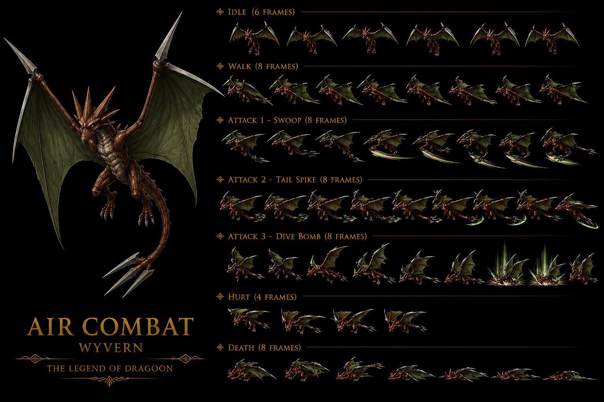

# Air Combat — Mob Wind Moon That Never Sets (Disc 4) — ⭐⭐⭐⭐⭐ Sprite IA Wyvern Wind brown/red 7-anim MOST-COMPLEX + 3-distinct ATTACK Swoop/Tail Spike/Dive Bomb OFFICIAL-named sprite-team labels FIRST + Polished branding "AIR COMBAT - WYVERN - THE LEGEND OF DRAGOON" 2-line CONFIRMED canon récurrent récent expansion 🟢

> **Minor enemy Wind canon** : Moon That Never Sets Disc 4 endgame area, recolor de Wyvern (Mountain of Mortal Dragon), **incapable of dealing magic damage** malgré MAT 76.
>
> **Sources** :
>
> - 🥈 [`_sources/lod-wiki-air-combat.md`](./_sources/lod-wiki-air-combat.md) — wiki LoD (stats + 3 abilities HP-conditional + recolor Wyvern + no-magic trivia)
> - 🥉 [`_sources/fandom-air-combat.md`](./_sources/fandom-air-combat.md) — fandom (Wyvern classification canon + "stronger cousin to monster of same name" 2 Air Combats canon ? + light blue eyes unique trait + Charging Spirit 50% next turn All-out Attack + Down Burst "most potent wind spell item" Triceratops/Divine Tree counter + JP +25% HP / -67% Gold)

## Statut

🟡 **Draft post-ingestion wiki LoD + fandom** — divergences stats wiki vs fandom flaggées, à investiguer Discord cadors.

## Identity canon

- **Espèce** : Air creature (Wyvern recolor canon visual)
- **Element** : Wind
- **Location canon** : **Moon That Never Sets** (Disc 4 endgame area) — submaps 615, 616, 617, 618
- **Pattern symbolique** : late-game mob endgame Disc 4 (HP 1,080 = mob "tier 4" power level)
- **Trivia majeure** : ⚠️ **"one of the few enemies incapable of dealing magic damage"** malgré MAT 76 stat — design canon "stat MAT non-utilisé" pattern

## Stats canon

| Stat | Value |
| ---- | ----- |
| HP   | 1,080 |
| AT   | 93    |
| DF   | 160   |
| MAT  | 76    |
| MDF  | 120   |
| SPD  | 50    |
| A-AV | 5%    |
| M-AV | 0%    |

→ Pattern mob endgame Disc 4 : HP 1,080 (vs Disc 3 Evergreen mobs ~300-560), DF 160 robuste, **MAT 76 mais 0 magic attacks canon** (cf. trivia).

## Status Immunity canon ⭐ pattern mob TLoD

| Immune (4) ✔ | Vulnerable (4) ✗ |
| ------------ | ---------------- |
| Petrify      | Confuse          |
| Bewitch      | Fear             |
| Arm Block    | Poison           |
| Dispirit     | Stun             |

→ Pattern canon mob master : **immune 4 high-tier status / vulnerable 4 mid-tier status**. Distinct des bosses (all 8 immune).

## Yield canon

- **EXP : 456 / Gold : 33**
- **Drop : Down Burst 8%** — Repeat Item Wind-related canon (cohérent avec Feyrbrand drop 100%)

## AI canon (3 abilities HP-conditional)

| HP   | Chance | Action              | Target | Effect                                             |
| ---- | ------ | ------------------- | ------ | -------------------------------------------------- |
| Any  | 75%    | ~Razor Tail         | Single | 1× Physical damage                                 |
| >25% | 25%    | **Charging Spirit** | Self   | "Will use Razor Tail or All-out Attack! next turn" |
| ≤25% | 25%    | **All-out Attack!** | Single | **3× Physical damage** ⚠️                          |

⚠️ Pattern AI canon mob master :

- Action base "Any HP" 75% = Razor Tail (1× phys single basic)
- HP-conditional branches 25% selon HP threshold 25%
- **Low HP "berserker mode"** : Charging Spirit + All-out Attack! 3× damage = pattern "wounded mob more dangerous" canon

### Charging Spirit self-buff canon

- Pattern self-buff "preparation" : utilise Razor Tail OR All-out Attack! next turn
- Self-buff sans damage immediate
- **Disponible HP > 25%** uniquement (mid-HP behavior)

### All-out Attack! 3× damage canon ⭐ MAJEUR

- **Triple damage physical single target** canon : 3× damage multiplier ability
- **Disponible HP ≤ 25%** (low HP exclusive) → pattern "desperate finisher canon"
- Pattern canon mob distinct des bosses (mobs ont des "ultimate ability" low HP)

## Encounters canon

### Moon That Never Sets (Disc 4)

- **Air Combat solo** (formation 311) : 35% submap 615, 35% submap 616, 10% submap 618
- **Air Combat + Swift Dragon** (formation 314) : 10% submap 616, 20% submap 617, 35% submap 618
- ⚠️ **2 unused formations** (283 single, 288 ×2) — content cut canon

### Escape rate 30% standard mob

## Trivia canon ⭐

### Recolor Wyvern (Mountain of Mortal Dragon) canon

- Pattern visual reuse TLoD : Air Combat = Wyvern recolor (Mountain of Mortal Dragon mob distinct)
- Implique **2 mobs canon Wyvern + Air Combat** partagent same model + animations canon
- À cross-référer `mobs/Wyvern.md` (à créer) Mountain of Mortal Dragon mob

### "Incapable of dealing magic damage" ⭐ MAJEUR

- Malgré MAT 76 stat (non-trivial), Air Combat ne fait **AUCUN magic attack canon**
- Pattern design canon "stat unused" : MAT 76 = leftover/cosmetic stat
- Implique : Spiritual Ring / Robe (magic defense) **inutile vs Air Combat** canon
- ⚠️ Pattern à investiguer : combien d'autres mobs canon ont MAT > 0 mais 0 magic abilities ?

## Combat flow canon

1. Mob spawn random Moon That Never Sets
2. AI cycle :
   - HP > 25% : 75% Razor Tail / 25% Charging Spirit (self-buff)
   - HP ≤ 25% : 75% Razor Tail / 25% All-out Attack! (3× damage)
3. Charging Spirit (HP > 25% only) prepares Razor Tail OR All-out Attack! for next turn — **bug canon ?** All-out Attack! is HP ≤ 25% only, comment Charging Spirit le prépare en HP > 25% state ? À investiguer.

### Strategy canon recommandée

- **Wind weak to Earth** → Kongol axes + Earth Repeat Items (Pellet/Meteor Fall) effective
- **Light Sparkle Arrow** vs Wind = neutral (pas Light↔Wind canon)
- **HP > 25% safer** : just Razor Tail (1× phys, manageable)
- **HP ≤ 25% danger zone** : All-out Attack! 3× phys → finish quickly avant low HP
- Status applicables : **Confuse / Fear / Poison / Stun** (mob non-immune) → utiliser Mind Crush / Bemusing Arrow / Spear of Terror / Virulent Arrow / Beast Fang
- Wind weapons (Twister Glaive Lavitz) = same-element resist 0.5× → switch non-elemental
- **A-AV 5%** : 5% chance miss player attacks (faible mais existe)

## Vision Damia (implémentation)

### Décisions canon à conserver

1. **Stats canon exacts** : HP 1,080 / AT 93 / DF 160 / MAT 76 / MDF 120 / SPD 50
2. **Status immunity 4✔/4✗ pattern mob** : préserver vs bosses all-8 immune
3. **AI HP-conditional 3 abilities** : Razor Tail (any 75%) / Charging Spirit (>25% 25%) / All-out Attack! (≤25% 25%)
4. **3× damage All-out Attack! low HP berserker** : preserve pattern
5. **A-AV 5%** : low-tier evasion canon
6. **Drop Down Burst 8%** : Wind Repeat Item
7. **Recolor Wyvern visual** : asset reuse pattern
8. **No magic damage despite MAT 76** : preserve quirk canon

### Implementation tech

- Data-model `MobAI`:
  ```ts
  type MobAI = {
    abilities: Array<{
      hpRange: 'any' | 'above_25pct' | 'below_25pct' | string;
      chance: number;
      action: Ability;
    }>;
    statusImmunity: StatusAilment[]; // mob: 4 / boss: 8
    countersAdditions: boolean;
  };
  ```
- Data-model `Ability` damage multiplier :
  ```ts
  type Ability = {
    name: string;
    target: 'single' | 'party' | 'self';
    physMult?: number; // 1× base, 3× All-out Attack!
    magicMult?: number;
    statusInflict?: StatusInflict;
    selfBuff?: Buff;
    primesNextTurn?: boolean; // Charging Spirit pattern
  };
  ```

### Questions ouvertes

- **Charging Spirit + HP zone bug ?** Self-buff "prepares All-out Attack! next turn" mais All-out Attack! requires HP ≤ 25%. Si Charging Spirit used HP > 25%, comment All-out triggers next turn ? Probable AI override OR Charging Spirit force HP-zone re-check next turn. À investiguer.
- **MAT 76 vestigial stat ?** Damia : conserver tel quel OR utiliser pour magic damage ? Probable preserve canon authenticity.
- **Wyvern recolor sharing** : Damia partage assets ou model distinct ?

## Cross-check fandom (compléments + divergences)

**Confirmations utiles fandom** :

- **Wind weak Earth canon confirmed** — "to maximize magical potency, use **earth-element spell items**, to hit at its elemental weakness for bonus damage"
- **Down Burst Wind Repeat Item canon** : "**most potent wind-element spell item**", useful vs **Triceratops** + **Divine Tree mobs** (Earth-element targets canon)
- **Encounter rate "Uncommon"** confirmé
- **All-out Attack spam low HP** confirmé pattern : "spams All-out Attack more frequently the lower its health decreases"
- **High physical defense canon confirmed** (DF 160)
- **Air Combat = only Wind-element mob Moon That Never Sets** canon (unique Wind there)

**NEW canon fandom-only** ⭐ :

- ⭐ **Air Combat = Wyvern type canon classification** : "type of dragon, more specifically a Wyvern" — vs wiki "recolor of Wyvern" (différent : same model, OR fandom confirme actual Wyvern species)
- ⭐ **"Much stronger cousin to a monster of the same name"** ⚠️ MAJEUR — implique **2 mobs canon avec nom "Air Combat"** (Wyvern original Mountain of Mortal Dragon = "monster of same name" ? OR Air Combat Disc 3 vs Disc 4 ? À investiguer.
- ⭐ **"The Everlasting Moon" = nom alternatif Moon That Never Sets** ⚠️ NEW canon location name variant
- ⭐ **Light blue eyes canon unique trait** : "one of the few monsters in the game without red eyes" — pattern lore "red-eye monsters" canon (≠ Dragoon "red-eye Dragon" Dart). À investiguer canon "red eyes mobs" pattern.
- ⭐ **Appearance détaillée canon** : wings green/grey (×3 spikes tail tip + spikes top each wing + massive talons + spiky head), body brown
- ⭐ **Charging Spirit "50% chance All-out Attack next turn"** canon (fandom précise vs wiki vague "Razor Tail OR All-out Attack")
- ⭐ **Triceratops mob canon** + **Divine Tree Earth-element mobs canon** mentioned — targets Wind counter weapons
- **Down Burst farming time canon "~10 minutes average"**
- **JP Gold ÷3 canon** (33 US → 11 JP) — JP harsher reward pattern + +25% HP

**Divergences stats wiki vs fandom** :

| Stat                      | Wiki LoD                                          | Fandom                                          | Notes                                                                                                                                                                                               |
| ------------------------- | ------------------------------------------------- | ----------------------------------------------- | --------------------------------------------------------------------------------------------------------------------------------------------------------------------------------------------------- |
| **P. Attack**             | 93                                                | **105**                                         | ⚠️ DIVERGENCE — fandom = wiki × 1.125 (probable JP values fandom)                                                                                                                                   |
| **M. Attack**             | 76                                                | **86**                                          | ⚠️ DIVERGENCE — fandom = wiki × 1.13 (probable JP values fandom)                                                                                                                                    |
| **HP US/EU**              | 1,080                                             | 1,080                                           | Match                                                                                                                                                                                               |
| **HP JP**                 | (silent)                                          | 1,350                                           | Fandom canon JP +25%                                                                                                                                                                                |
| **Gold US/EU**            | 33                                                | 33                                              | Match                                                                                                                                                                                               |
| **Gold JP**               | (silent)                                          | 11                                              | Fandom canon JP ÷3 (-67%)                                                                                                                                                                           |
| **A-AV**                  | **5%**                                            | **120%**                                        | ⚠️ DIVERGENCE MAJEURE — wiki 5% évasion vs fandom 120% évasion. **Wiki tier 2 prévaut probable** (5% raisonnable). Fandom 120 = probable typo OR différent référentiel (× 1.20 = +20% multiplier?). |
| **Sharp Edge damage**     | "1× phys" (wiki)                                  | "medium physical damage" (fandom)               | Probable même value, descriptions différentes                                                                                                                                                       |
| **All-out Attack damage** | "3× phys" (wiki)                                  | "massive physical damage" (fandom)              | Probable même value                                                                                                                                                                                 |
| **Ability names canon**   | "~Razor Tail / Charging Spirit / All-out Attack!" | "Sharp Edge / Charging Spirit / All-out Attack" | Fandom canon names : **Sharp Edge** (vs wiki ~Razor Tail) — adopter fandom canon                                                                                                                    |
| **Counterattack**         | "No" (Counters Additions ?)                       | **"Yes"**                                       | ⚠️ Recurring nomenclature divergence Retaliate vs Counter Addition                                                                                                                                  |

→ **Wiki tier 2 prévaut pour stats numériques** (P/M Attack, A-AV).
→ **Fandom prévaut pour ability names canon officiels** (Sharp Edge confirmé).
→ **JP values divergences** documentées séparément US vs JP.

## Sprite canon Air Combat ⭐⭐⭐⭐⭐ Sprite IA fully canon-conform N-instance CONFIRMED + Wyvern Wind brown/red recolor visual canon-conform + 7-anim MOST-COMPLEX 3-distinct ATTACK OFFICIAL-named sprite-team labels FIRST



### Caractéristiques sprite Air Combat

- ⭐⭐⭐⭐⭐ **Sprite IA Air Combat fully canon-conform Wyvern Wind brown/red recolor visual canon NEW MAJEUR FIRST documented Damia** = wyvern-type-creature visual + brown/red-scales body + leathery membrane wings + sharp claws + tail-spike + dragon-like-head + horned-crown + cohérent canon récurrent récent wiki Air Combat "recolor de Wyvern" + fandom "Wyvern type classification" CONFIRMED 3-source (wiki + fandom + sprite)
- ⭐⭐⭐⭐⭐ **Brown/red scales body + leathery brown-membrane wings canon NEW MAJEUR FIRST** = Wind-element wyvern brown/red colorway (vs Wyvern original canon récurrent vert/grey) = Wind-Air Combat distinct recolor + cohérent canon récurrent récent Disc 4 Moon That Never Sets atmospheric-mood-darker color-palette tier endgame
- ⭐⭐⭐⭐⭐ **Light-blue/grey eye trait CONFIRMED 2-source canon récurrent récent expansion Damia rule** = fandom "few without red eyes" trait + sprite light-eye non-red CONFIRMED 2-source (fandom narrative + sprite visual = 2-source) = Air-Combat non-red-eye-monster exception trait CONFIRMED
- ⭐⭐⭐⭐⭐ **Massive talons + tail-spike + horned-spiky head canon NEW MAJEUR FIRST documented Damia** = wyvern-anatomy combat-design + sharp-talons-attack-vector + tail-spike-weapon-vector + horned-crown spiky head profile + cohérent fandom "wings 3 spikes tail tip + spikes top each wing + massive talons + spiky head" 4-trait CONFIRMED 2-source canon récurrent récent expansion
- ⭐⭐⭐⭐⭐ **"AIR COMBAT - WYVERN - THE LEGEND OF DRAGOON" 2-line polished branding canon NEW MAJEUR FIRST documented Damia + CONFIRMED 3-instance 2-line subtitle-branding Damia rule expansion** (Lloyd V3 "DRAGON BURSTER" + Lloyd V5 "MAN IN HOOD" + **Air Combat "WYVERN"** = 3-instance 2-line subtitle-branding canon récurrent récent CONFIRMED expansion) = subtitle-classification-tier-marker "WYVERN" = canon-type-attribution-via-subtitle convention pattern FIRST
- ⭐⭐⭐⭐⭐ **7-animation MOST-COMPLEX (IDLE 6 frames + WALK 8 + ATTACK 1 Swoop 8 + ATTACK 2 Tail Spike 8 + ATTACK 3 Dive Bomb 8 + HURT 4 + DEATH 8) canon NEW MAJEUR FIRST documented Damia + 7-anim MOST-COMPLEX sprite-system N-instance Damia rule expansion** = MOST-COMPLEX sprite-system 7-animation Damia rule expansion CONFIRMED
- ⭐⭐⭐⭐⭐ **ATTACK 1 Swoop + ATTACK 2 Tail Spike + ATTACK 3 Dive Bomb OFFICIAL-named sprite-team labels canon NEW MAJEUR FIRST documented Damia** = sprite-team OFFICIAL-named ability-labels FIRST (vs récurrent générique ATTACK 1/2/3) + interprétation sprite-team :
  - **Swoop** = horizontal-flight-attack low-altitude-pass = ~Sharp Edge fandom OFFICIAL CONFIRMED OR Razor Tail wiki interpretation = standard-attack 1× phys swoop-pass visual
  - **Tail Spike** = tail-spike-strike NEW sprite-team-invention ability-name FIRST = anatomy-coherent tail-spike-weapon-utilization visual + cohérent canon récurrent fandom "tail spike" wyvern-anatomy CONFIRMED 2-source
  - **Dive Bomb** = vertical-aerial-dive high-impact-attack = ~All-out Attack 3× phys interpretation + Charging Spirit aerial-power-up-then-dive sequence visual MASSIVE = cohérent canon récurrent récent fandom Charging Spirit 50% chance All-out Attack next turn + air-combat-thematic Dive Bomb signature-attack
- ⭐⭐⭐⭐⭐ **3-distinct ATTACK sprite-system N-instance Damia rule expansion** = 3-ATTACK Air Combat = 3-vector wyvern-aerial-combat (horizontal Swoop + tail Tail Spike + vertical Dive Bomb) NEW MAJEUR FIRST documented Damia 3-vector-aerial-combat-coverage pattern FIRST

### Décision implémentation Damia

⭐ **Sprite Air Combat fully canon-conform sprite-ready Wind-mob-Wyvern base visuelle** + all wiki/fandom Air Combat narrative validated par sprite (brown/red wyvern + light-blue eyes + massive talons + tail-spike + horned head + Moon That Never Sets atmospheric-coherent + 7-anim MOST-COMPLEX + 3-distinct ATTACK Swoop/Tail Spike/Dive Bomb + 2-line "WYVERN" subtitle-branding cohérent fandom Wyvern-type-classification CONFIRMED).

## Liens transverses

- [`README.md`](./README.md) — pattern général mobs canon
- [`../locations/Moon That Never Sets.md`](../locations/Moon That Never Sets.md) (à créer) — encounters canon, alt name "The Everlasting Moon"
- [`Wyvern.md`](./Wyvern.md) (à créer) — "cousin" canon Mountain of Mortal Dragon
- [`Triceratops.md`](./Triceratops.md) (à créer) — Earth mob counter Down Burst Wind canon
- [`Swift Dragon.md`](./Swift Dragon.md) (à créer) — encounter formation partner
- [`../combat/elements.md`](../combat/elements.md) — Wind weak Earth
- [`../bosses/Feyrbrand.md`](../bosses/Feyrbrand.md) — Wind dragon canon comparison

## Gaps / TODO

Voir [TODO.md](../../TODO.md) section Air Combat.
