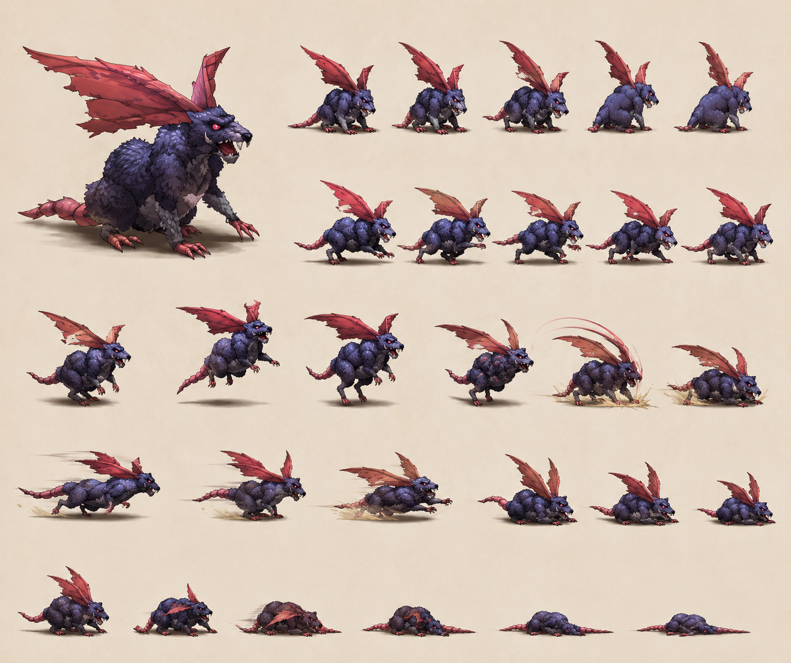

# Berserk Mouse — Mob Darkness Forest near Seles (Disc 1)

> **Disc 1 mob Forest near Seles** : **Darkness element** ⭐ rare (vs Wind/Fire/Earth partners) partner Assassin Cock. Stats minimal **HP 2** ⭐ probable lowest mob TLoD. **Status Immunity DEVIATES 4✔/4✗ standard** : 5 immune (Petrify/Bewitch/Arm Block/Dispirit/**Fear ⭐ NEW**) / 3 vulnerable (Confuse/Poison/Stun) — Fear immune NEW canon pattern.
>
> ⭐ **"Run away!" ability NEW canon** : self-removes mob from combat (no EXP/gold/item) — pattern thematic mouse flees.
>
> **Counter Opportunities (28)** = high-density tier confirmé universal multi-disc (Disc 1 mob same as Aqua King/Archangel Disc 2-4 boss/mob → 28 standard pattern).
>
> **Sources** :
>
> - 🥈 [`_sources/lod-wiki-berserk-mouse.md`](./_sources/lod-wiki-berserk-mouse.md) — wiki LoD (stats minimal HP 2 + Darkness element + Status Immunity DEVIATES Fear ✔ + AI 3-phase + "Run away!" canon + Counter 28 + Forest Disc 1 encounters)
> - 🥉 [`_sources/fandom-berserk-mouse.md`](./_sources/fandom-berserk-mouse.md) — fandom (JP name バーサクマウス + appearance "grey rat red eyes large ears" canon + **Plague Rat = recolor stronger variant** NEW + Nibble/Chisel/Escape canon names + **Trent partner formation NEW** + ⚠️ A-AV 0% vs 120% divergence anomaly)

## Statut

🟢 **Canon documenté wiki + fandom** — divergences notées.

## Identity canon

- **Espèce** : Mouse (large aggressive berserker variant)
- **Element** : **Darkness** ⭐ rare Disc 1 Forest
- **Location canon** : **Forest near Seles** (Disc 1 starting area) — submaps 6, 7, 624, 625 + 4 World Map roads Serdio
- **Disc** : Disc 1 (early mob post-Feyrbrand cold open)
- **Pattern symbolique** : **"Large and aggressive" canon description** wiki — anomaly vs benign Forest critters
- **Pattern AI canon ⭐ NEW** : **3-phase AI** avec Run away! self-removal NEW

## Stats canon ⭐ minimal

| Stat | Value                         |
| ---- | ----------------------------- |
| HP   | **2** ⭐ lowest TLoD probable |
| AT   | 1                             |
| DF   | 80                            |
| MAT  | 1                             |
| MDF  | **120**                       |
| SPD  | 45                            |
| A-AV | 0%                            |
| M-AV | 0%                            |

→ Pattern minimal mob Disc 1 : **HP 2 = lowest TLoD probable** (vs Assassin Cock HP 3). **MDF 120 > DF 80** magic-resistant tiny mob. **AT/MAT 1 minimum** offensive negligible.

## Status Immunity canon ⚠️ DEVIATES standard

Pattern **NEW** mob 5 immune / 3 vulnerable :

- **Immune (5)** : Petrify / Bewitch / Arm Block / Dispirit / **Fear** ⭐ NEW
- **Vulnerable (3)** : Confuse / Poison / Stun

⚠️ **Berserk Mouse Fear ✔ immune NEW canon** :

- Cohérent thematic "berserk = fearless aggressive"
- Pattern per-mob status deviations canon — wiki standard 4✔/4✗ pas universel
- À cross-check autres mobs (other "berserk/aggressive" mobs Fear immune ?)
- À documenter `combat/status-effects.md` per-mob immunity table canon

## Yield canon

- **EXP : 3 / Gold : 3** ⚠️ minimum yield TLoD probable
- **Drop : Healing Potion 10%** — pattern early Disc 1 mob (cohérent Assassin Cock 10%)

## Counter Opportunities

**(28)** — pattern standard "counter Yes" enemies high-density tier (cohérent Aqua King / Archangel 28). Détails non documentés (feature non-implémentée Damia per user instruction).

### Counter Opportunities tier mapping canon updated

| Tier             | Total | Examples canon                                                                             |
| ---------------- | ----- | ------------------------------------------------------------------------------------------ |
| **High density** | 28    | Aqua King (Disc 4), Archangel (Disc 4), **Berserk Mouse (Disc 1)** ⭐, Atlow (Disc 1 boss) |
| **Mid density**  | 19    | Assassin Cock (Disc 1)                                                                     |
| **Low density**  | 9     | Arrow Shooter (Disc 2)                                                                     |
| **No counter**   | 0     | Air Combat, Feyrbrand, Fire Bird                                                           |

⚠️ **Berserk Mouse Disc 1 = 28** confirme pattern canon **Counter Opportunities 28 universal multi-disc** (NOT disc-correlated) — even early Disc 1 mobs can be 28-tier. À investiguer logic per-enemy assignment canon.

## AI canon (3-phase NEW)

| HP    | Action           | Target | Effect                                                 |
| ----- | ---------------- | ------ | ------------------------------------------------------ |
| > 50% | ~Bite            | Single | 1× Physical damage (basic)                             |
| ≤ 50% | **Chisel**       | Single | **2× Physical damage** ⚠️                              |
| —     | **Run away!** ⭐ | Self   | Removes mob from combat (**no EXP/gold/item** awarded) |

⚠️ Pattern AI canon mob **3-phase NEW** :

- **Phase 1 (HP > 50%)** : ~Bite 1× phys (basic)
- **Phase 2 (HP ≤ 50%)** : **Chisel 2× phys** (canon name officiel ≤ 50%) — escalation phase late-fight
- **Phase 3 (any HP, conditional ?)** : **Run away!** self-removal NEW canon

### Run away! ability NEW canon ⭐ MAJEUR

- **Self-target ability** removes mob from combat
- **No EXP / Gold / Item drop** awarded (no penalty to player but no reward either)
- Pattern thematic "mouse flees" canon
- **Trigger conditions canon unknown** : HP threshold ? turn-random ? player damage threshold ? À investiguer fandom + Discord
- Implication player : **kill timing critical** pour Healing Potion drop farming (mob may flee avant kill = drop loss)
- Pattern AI exception canon : **mob escape mechanic** existe (NOT only player escape)

### Chisel canon name officiel ⭐

- **Chisel** = canon name officiel ≤ 50% (vs ~Bite community approximation > 50%)
- Pattern partial-canon naming (named ≤ 50% but not > 50%) — to clarify fandom
- Thematic "chisel" = mouse teeth gnawing canon

## Encounters canon

### Forest near Seles (Disc 1)

- **Berserk Mouse solo** (formation 0) : submap 624 (10%)
- **Berserk Mouse + Assassin Cock** (formation 6) : submap 624 (35%), 625 (20%)
- **Berserk Mouse ×2** (formation 8) : submap 624 (35%), 6 (35%), 7 (35%)

⚠️ **Formation 0 = ID minimum** (cohérent first-defined Forest formation canon).
⚠️ **Submap 624 dominant** (3 formations sur 3 incluent 624) — submap "berserk mouse hotspot" canon.

### World Map roads canon Serdio Disc 1

- **Seles → Forest** road
- **Forest → Intersection** road
- **Forest Intersection → Hellena Prison Intersection** road
- **Hellena Prison → Intersection** road

→ Pattern 4 roads canon Serdio Disc 1 (cohérent Assassin Cock même 4 roads — pattern dual-mob roads pool).

### Escape rate 90% canon

- **90% escape rate** pattern Disc 1 Forest mobs (cohérent Assassin Cock)
- Player learning curve : initial combats facilement évitable

## Combat flow canon

1. Mob spawn random (Forest submaps 6/7/624/625 OU World Map roads Serdio Disc 1)
2. AI cycle :
   - HP > 50% (= HP 2) : ~Bite (1× phys)
   - HP ≤ 50% (= HP 1) : Chisel (2× phys)
   - Random ? : **Run away!** self-removal (no reward player)
3. Counter mechanism (Counter Opportunities 28 high-density tier)
4. **HP 2** = typically defeated 1-2 hits player (1-shot capable post Dart Broad Sword)

### Strategy canon recommandée

- **Darkness weak Light** → Shana/Miranda spells / Light Repeat Items 1.5× damage (mais Shana Light Dragoon late-game uniquement)
- **Burst kill turn 1** = prévenir Run away! self-removal (lose Healing Potion drop opportunity)
- **High SPD player** = first strike (player SPD vs mob SPD 45)
- **Status applicables** : Confuse / Poison / Stun (NON Fear ⚠️ immune)
- **Escape 90%** = option facile si player low level

## Vision Damia (implémentation)

### Décisions canon à conserver

1. **Stats canon exacts** : HP 2 / AT 1 / DF 80 / MAT 1 / MDF 120 / SPD 45
2. **Darkness element canon** : tagging mob Damia darkness (already on TODO existing)
3. **Status Immunity DEVIATES Fear ✔** : pattern per-mob deviations canon
4. **3-phase AI ⭐ NEW** : Bite > 50% / Chisel ≤ 50% / Run away! self-removal
5. **"Run away!" ability NEW canon** : implémenter mob self-escape mechanic (no reward player)
6. **Counter 28 tier confirmé universal** multi-disc
7. **Escape rate 90% canon** : pattern Disc 1 Forest accessibility
8. **Healing Potion 10% drop** : pattern early mob

### Implementation tech

- Data-model `MobAIPhase3` :
  ```ts
  type MobAI3Phase = {
    phase1: { hpThreshold: 0.5; abilities: Ability[] }; // HP > 50%
    phase2: { hpThreshold: 0; abilities: Ability[] }; // HP ≤ 50%
    selfRemoval?: { trigger: 'random' | 'hp-threshold'; reward: 'none' };
  };
  ```
- Data-model `StatusImmunity` per-mob :
  ```ts
  type StatusImmunity = {
    petrify: boolean;
    bewitch: boolean;
    armBlock: boolean;
    dispirit: boolean;
    confuse: boolean;
    fear: boolean;
    poison: boolean;
    stun: boolean;
  };
  // Berserk Mouse : { ...all true except confuse/poison/stun }
  ```

### Questions ouvertes

- **Run away! / Escape trigger conditions canon** : HP threshold ? turn-random ? player damage threshold ? À investiguer Discord/Wulves.
- **Other mobs Run away! pattern canon** : existe-t-il d'autres mobs avec self-escape ? À investiguer mobs ingestion alphabetical.
- **Fear immune canon other "berserk/aggressive" mobs** : pattern systematic ? À cross-check.
- **HP 2 = TLoD lowest mob** : confirmer alphabetical mobs ingestion future.
- ⚠️ **A-AV 120% fandom claim** : anomalous claim impossible mécaniquement OU stat caché ? Wiki tier 2 0% prévaut canonical. À investiguer Discord source tier 1.
- **Trent + Berserk Mouse formation canon** : fandom NEW partner — wiki tier 2 silent. À confirmer Submap encounter table complète.

## Cross-check fandom (compléments + divergences)

**Confirmations utiles fandom** :

- **Darkness element + Forest location** confirmé
- **HP 2 (US/EU)** confirmé
- **DF 80 / MDF 120** match
- **Healing Potion 10% drop** confirmé
- **Counter Yes** confirmé
- **Fear + Stun immune** confirmé (cohérent wiki Status Immunity table)
- **Chisel canon name** confirmé "bites multiple times slightly more damage" cohérent 2× phys ≤ 50%
- **Disc 1 Monsters category** ✅

**NEW canon fandom-only** ⭐ :

- ⭐ **JP name バーサクマウス (Bāsaku mausu)** — direct katakana translit "Berserk Mouse"
- ⭐ **Appearance canon "grey colored rat with red eyes and large ears"** — visual design canon précisé (vs wiki silent)
- ⭐ **Plague Rat = recolor stronger variant Berserk Mouse canon NEW** ⭐ MAJEUR — pattern recolor mob canon (cohérent Fowl Fighter/Assassin Cock pattern Sandora birds, Wyvern/Air Combat) — à documenter `mobs/Plague Rat.md` (à créer)
- ⭐ **Nibble canon name officiel** (vs wiki ~Bite community) — adopter fandom canon > 50%
- ⭐ **Escape canon name officiel** (vs wiki "Run away!" descriptive) — adopter fandom canon. Mob self-removal mechanic confirmed
- ⭐ **Berserk Mouse + Trent formation NEW canon** — wiki tier 2 absent. Pattern partner mobs Forest étendu (vs wiki seulement Assassin Cock + ×2 + solo)

**Divergences stats wiki vs fandom** :

| Stat                        | Wiki LoD             | Fandom                              | Notes                                                                                                |
| --------------------------- | -------------------- | ----------------------------------- | ---------------------------------------------------------------------------------------------------- |
| **HP US/EU**                | 2                    | 2                                   | Match                                                                                                |
| **HP JP**                   | (silent)             | **4**                               | Fandom canon JP +100% (vs +25% usual — pattern extrême sur stats minimaux)                           |
| **P. Attack**               | 1                    | **2**                               | ⚠️ DIVERGENCE +100% (fandom probable JP values OR fandom typo)                                       |
| **M. Attack**               | 1                    | **2**                               | ⚠️ DIVERGENCE +100% (idem)                                                                           |
| **DF / MDF**                | 80/120               | 80/120                              | Match                                                                                                |
| **SPD**                     | 45                   | **50**                              | ⚠️ DIVERGENCE +11% (cohérent Assassin Cock même divergence 45/50)                                    |
| **A-AV**                    | **0%**               | **120%** ⚠️⚠️                       | ⚠️ MAJEUR DIVERGENCE — 120% impossible mécaniquement. Wiki tier 2 0% prévaut. À investiguer Discord. |
| **Gold US**                 | 3                    | 3                                   | Match                                                                                                |
| **Gold JP**                 | (silent)             | 1                                   | Fandom canon JP ÷3 pattern systématique                                                              |
| **~Bite / Nibble**          | ~Bite                | **Nibble**                          | Fandom canon name officiel — adopter                                                                 |
| **Run away! / Escape**      | Run away!            | **Escape**                          | Fandom canon name officiel — adopter                                                                 |
| **Chisel partial-canon**    | Chisel (named ≤ 50%) | Chisel (described "multiple bites") | Match canon name. Phrasing différent.                                                                |
| **Trent partner formation** | (absent)             | **Berserk Mouse + Trent**           | Fandom NEW partner formation — wiki tier 2 silent.                                                   |

→ **Wiki tier 2 prévaut pour stats numériques** (HP/AT/MAT/SPD/A-AV/Status Immunity).
→ **Fandom prévaut pour names canon officiels** (Nibble/Escape) + appearance + Plague Rat recolor + Trent partner formation.

## Plague Rat — recolor variant canon NEW ⭐

- **Plague Rat = "slightly stronger different color version of Berserk Mouse"** canon fandom
- Pattern recolor mob canon (cohérent autres recolor TLoD)
- À documenter `mobs/Plague Rat.md` (à créer) — stronger variant Berserk Mouse Disc ? (à investiguer location canon Plague Rat)
- Implication design : **mob progression linéaire variants colors** = pattern TLoD canon systematic

## Sprite Damia (art direction)



> **Sprite sheet officiel Damia** — [`_assets/berserk-mouse-sprites.png`](./_assets/berserk-mouse-sprites.png)

### Design canon Damia

- **Corps** : rocheux purple/blue à texture cristalline + pattes griffues quadrupède (posture lézard)
- **Ailes** : grandes ailes membraneuses rouge sang (bat-wing canon)
- **Yeux** : rouges luminescents
- **Gueule** : crocs/fangs visibles (mouth ouverte attack poses)
- **Queue** : courte cachée derrière ailes

### Frames du sprite sheet

- **Row 1 — Hero portrait + Idle (5 poses)** : pose statique 4-pattes + variations légères (breathing/look around)
- **Row 2 — Walk (5 poses)** : déplacement quadrupède
- **Row 3 — Run / Charge (5 poses)** : course rapide avec wing-flap + jump preparation
- **Row 4 — Jump / Aerial (5 poses)** : saut + aerial attack frames
- **Row 5 — Death (5 poses)** : KO sequence (collapse → lying)

### Divergence vs canon TLoD fandom

⚠️ **Damia art direction diverge appearance canon fandom** :

- **Canon fandom (🥉)** : "grey colored rat with red eyes and large ears" (literal rat)
- **Damia (Art Direction)** : **bat-winged dragon-mouse hybrid** purple/red — design plus iconique/menaçant (cohérent thematic "berserk/aggressive" + Darkness element)
- **Justification** : design Damia renforce **Darkness element** + **aggressive nature canon** ("large and aggressive" wiki description) via bat-wings + clawed quadruped stance
- Pattern Damia : adaptation visuelle canon (Berserk Mouse = NOT literal rat sprite — design ré-interprété en créature plus marquante visually)

### Implementation tech

- **Frames individuelles** (already exists) : [`public/assets/sprites/mobs/berserkMouse/frame-01.png`](../../../public/assets/sprites/mobs/berserkMouse/) (8 frames + attack/death sheets)
- **Sprite sheet reference** ce doc : workflow art direction reference + frame extraction
- À cross-référer Aseprite/Spine sprite sheet config futur

## Liens transverses

- [`README.md`](./README.md) — pattern général mobs canon
- [`../locations/Forest.md`](../locations/Forest.md) (à créer) — Forest near Seles Disc 1
- [`../locations/Seles.md`](../locations/Seles.md) (à créer) — Dart's hometown Disc 1
- [`Assassin Cock.md`](./Assassin Cock.md) — formation 6 partner Forest Disc 1
- [`Goblin.md`](./Goblin.md) (à créer) — Forest partner mob
- [`Trent.md`](./Trent.md) (à créer) — Forest partner mob (fandom NEW formation Berserk Mouse + Trent)
- [`Plague Rat.md`](./Plague Rat.md) (à créer) — recolor stronger variant Berserk Mouse canon NEW
- [`../combat/elements.md`](../combat/elements.md) — Darkness weak Light + element tagging mob Damia
- [`../combat/status-effects.md`](../combat/status-effects.md) (à créer) — per-mob immunity deviations canon (Berserk Mouse Fear ✔ NEW)
- [`../combat/additions.md`](../combat/additions.md) — Counter Opportunities tier mapping (28 universal multi-disc confirmé)
- [`../items/consumables.md`](../items/consumables.md) (à créer) — Healing Potion drop canon
- [`../world-map/serdio-roads-disc1.md`](../world-map/serdio-roads-disc1.md) (à créer) — 4 World Map roads Serdio Disc 1 (cohérent Assassin Cock)

## Gaps / TODO

Voir [TODO.md](../../TODO.md) section Berserk Mouse.
