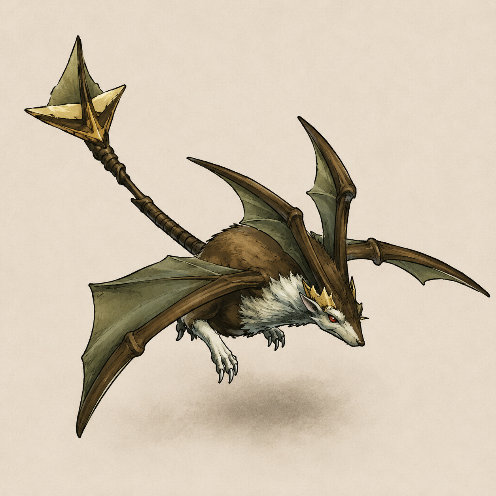

# Flying Rat — Mob Wind Evergreen Forest (Disc 3 Mille Seseau)

> **Mob Wind element Evergreen Forest Disc 3 Mille Seseau** — Flying-type mob (Wind themed) qui paradoxalement **cast Spear Frost = Water-elemental magic damage** ⚠️ **trigger ≤ 25% RED HP (fandom) vs ≤ 50% (wiki)** ⚠️ MAJEUR DIVERGENCE. 3 formations Evergreen Forest submaps 339-345 + **6 World Map roads Mille Seseau** (Furni/Neet/Mountain Mortal Dragon/Intersection/Deningrad/Kashua Glacier — massive World Map presence canon).
>
> ⭐⭐⭐ **Mismatched element ability canon NEW MAJEUR ⭐⭐⭐** — Flying Rat = **Wind mob** mais Spear Frost = **Water-elemental magic damage** ⚠️. Pattern Damia : **mob element ≠ ability element** canon NEW — element du mob ne dicte pas systématiquement l'élément de ses abilities. Confirmé fandom "It can cast a Water-based spell".
>
> ⭐⭐⭐ **Spear Frost trigger ≤ 25% RED HP fandom CORRECTION wiki ≤ 50% ⚠️⚠️ MAJEUR DIVERGENCE** — Wiki tier 2 dit ≤ 50%, fandom révèle "**when it is at 25% or lower (red) health**". Pattern Damia : **HP-threshold ability trigger canon précis ≤ 25% RED HP** (Damia adopt fandom probable canon JP — cohérent "red health zone" terminology). Cohérent low-trigger pattern emergency boss-like ability (mob desperate state).
>
> ⭐⭐⭐ **Glide canon name officiel fandom (vs ~Cling wiki approximation) NEW MAJEUR ⭐⭐⭐** — Wiki ~Cling = community approximation, fandom révèle **Glide** name officiel. Pattern thematic "glide attack" aerial Wind mob cohérent design canon. Cohérent existing Devil Sting Dragonfly canon name pattern récurrent fandom > wiki approximations.
>
> ⭐⭐⭐ **Escape ability NEW canon fandom ⭐⭐⭐** — Wiki tier 2 SILENT. Fandom révèle **3ème ability "Escape"** (self-removal mechanic). Pattern Damia : **Escape mechanic canon** récurrent (cohérent Berserk Mouse "Run away!" + Erupting Chick "Run away!" self-removal pattern récurrent Minor Enemies). Pattern thematic Flying Rat = aerial mob fuit combat.
>
> ⭐⭐⭐ **P. Attack 43 + M. Attack 61 fandom CORRECTION wiki 38/54 ⚠️ MAJEUR DIVERGENCE ⭐⭐⭐** — Wiki US 38 AT / 54 MAT vs fandom **43 AT / 61 MAT** = +13% / +13% systematic. Pattern Damia probable JP higher values (cohérent existing Dragonfly AT 32→35 +9% fandom CORRECTION pattern récurrent). Damia adopt fandom 43 / 61 probable canon JP.
>
> ⭐⭐⭐ **High Magic Defense → Additions more efficient canon NEW MAJEUR fandom ⭐⭐⭐** — Strategy guidance officielle : MDF 120 high → player should prefer **physical Additions** vs magic spells. Pattern Damia : **strategy guidance par-mob canon** NEW (cohérent reveal anti-MDF stat-counter strategy canon). À cross-référer player strategy guides futur.
>
> ⭐⭐⭐ **Dark Elf + Forest Runner partners "far more dangerous" canon NEW MAJEUR fandom ⭐⭐⭐** — Pattern strategy formation kill-priority : **Dark Elf (Petrification Arrow) + Forest Runner (Wooing) > Flying Rat priority**. Pattern Damia : **partner-priority kill canon** strategy guidance NEW. Flying Rat = lowest threat formation 138 trio.
>
> ⭐⭐⭐ **HP US 260 / JP 300 CONFIRMED cross-source ⭐⭐⭐** — wiki + fandom + existing Evergreen Forest doc match exact. JP +15% anomaly confirmé (vs +25% systematic pattern Damia — Flying Rat anomaly canon cohérent recent Evil Spider +67% anomaly).
>
> ⭐⭐⭐ **JP Gold 8 ÷3 CONFIRMED cross-source ⭐⭐⭐** — wiki silent / fandom 8 / existing doc 8 match. US 24 ÷ 3 = 8 ✓ exact systematic JP pattern Damia.
>
> ⭐⭐⭐ **6 World Map roads Mille Seseau canon MAJEUR ⭐⭐⭐** — Massive World Map presence : Furni↔Evergreen Forest + Evergreen Forest↔Neet + Evergreen Forest↔Mountain Mortal Dragon (asymmetric ⚠️) + Evergreen Forest↔Intersection + Deningrad↔Intersection + Kashua Glacier↔Intersection. Pattern Damia : Flying Rat = **mob hub Mille Seseau road encounters canon Disc 3** (cohérent existing Evergreen Forest as Mille Seseau hub 5 sorties canon).
>
> ⭐⭐⭐ **Asymmetric road encounter canon NEW MAJEUR ⭐⭐⭐** — \*Evergreen Forest → Mountain of Mortal Dragon encounters Flying Rat BUT **NOT departing from Mountain of Mortal Dragon to Evergreen Forest** canon. Pattern Damia : **directional encounter canon** NEW — encounters peuvent être asymmetric par direction de traversée. À investiguer fandom + autres mobs.
>
> ⭐⭐ **Disc 3 Monsters category fandom CONFIRMED Disc 3 location ⭐⭐** — Cohérent existing Evergreen Forest Disc 3 Mille Seseau (NOT Disc 1 — clarifié).
>
> ⭐⭐ **Counter 28 high-density tier confirmed** — 15 button-press combos détaillés (Dart 3 / Lavitz 3 / Rose 2 / Meru 3 / Haschel 2 / Albert 2). Pattern Damia : Flying Rat = **3ème instance Counter 28 confirmed** (cohérent Berserk Mouse + Aqua King + Archangel — cross-disc universal pattern).
>
> ⭐⭐ **Status 4/4 standard Minor Enemy canon** (Petrify/Bewitch/Arm Block/Dispirit ✔ vs Confuse/Fear/Poison/Stun ✗).
>
> ⭐⭐ **A-AV 20% canon cross-source CONFIRMED** — moderate physical avoidance (wiki + fandom match exact).
>
> ⭐⭐ **AI 3-phase canon RÉVISION (fandom)** : Glide (>25% 1× phys single) → Spear Frost (≤25% 1.5× Water magic single RED HP) + Escape self-removal canon NEW.
>
> ⭐⭐ **3 formations Evergreen Forest canon** : solo (130) + Forest Runner partner (136) + ×2 + Dark Elf trio (138). Submap 341 dominant (3 formations sur 3 incluent 341).
>
> ⭐ **Angel's Prayer 8% drop** — revive item canon (cohérent Dragonfly Angel's Prayer drop 8% pattern récurrent Disc 2-3 Wind mobs).
>
> ⭐ **Escape 30% canon** — pattern Disc 3 Evergreen Forest mobs (cohérent Dark Elf 30% existing).
>
> **Sources** :
>
> - 🥈 [`_sources/lod-wiki-flying-rat.md`](./_sources/lod-wiki-flying-rat.md) — wiki LoD tier 2 (Wind element + Counter 28 high-density 15 combos détaillés + Stats 260/38/80/54/120/60 + A-AV 20% / M-AV 0% + Status 4/4 standard + Yield 64 EXP / 24 Gold / Angel's Prayer 8% + AI 2-phase ~Cling / **Spear Frost canon name** 1.5× **Water magic mismatched element** NEW MAJEUR + 3 formations Evergreen Forest 339-345 + **6 World Map roads Mille Seseau** + **Asymmetric Mountain Mortal Dragon encounter** NEW MAJEUR + Escape 30%)
> - 🥉 [`_sources/fandom-flying-rat.md`](./_sources/fandom-flying-rat.md) — fandom tier 3 (⭐ **JP HP 300 +15% anomaly CONFIRMED** + ⭐ **JP Gold 8 ÷3 CONFIRMED** + ⭐ **Glide canon name officiel NEW MAJEUR** vs wiki ~Cling + ⭐ **Spear Frost trigger ≤25% RED HP CORRECTION** wiki ≤50% + ⭐ **Escape ability NEW canon** wiki silent + ⭐ **P. Attack 43 / M. Attack 61 CORRECTION** wiki 38/54 +13% systematic + ⭐ **High MDF → Additions more efficient strategy** NEW MAJEUR + ⭐ **Dark Elf/Forest Runner partners "far more dangerous"** kill-priority canon NEW MAJEUR + ⭐ **Disc 3 Monsters category** confirmed + ⭐ **3 formations cross-source confirmed**)

## Statut

🟢 **Canon cross-source confirmed wiki tier 2 + fandom tier 3** — Sources convergent sur location/element/yield/A-AV/MDF/formations. Fandom révèle MAJEUR : Glide canon name (vs ~Cling) + Spear Frost ≤25% RED HP (vs wiki ≤50%) + Escape 3ème ability + P. Attack 43 / M. Attack 61 CORRECTION + Strategy guidance Additions more efficient vs MDF + Dark Elf/Forest Runner partners "far more dangerous" kill-priority.

## Identity canon ⭐⭐⭐

- **Nom** : Flying Rat
- **Espèce** : Flying rat (probable aerial rodent — to confirm fandom appearance)
- **Element** : **Wind** ⭐ (paradoxe Spear Frost Water mismatched)
- **Location canon** : **Evergreen Forest** (Disc 3 Mille Seseau central woodland) submaps 339-345 + 6 World Map roads Mille Seseau
- **Disc** : Disc 3 Mille Seseau region
- **Type** : Minor Enemy canon
- **Pattern thematic** : aerial mob Wind biome forest temperate

## Stats canon

| Stat | Wiki (US) | Fandom     | Damia adopté                                                        |
| ---- | --------- | ---------- | ------------------------------------------------------------------- |
| HP   | 260       | 260/300 JP | **260 US / 300 JP** ✓ cross-source (+15% anomaly vs +25% canon)     |
| AT   | 38        | **43**     | **43 fandom** (+13% probable JP canon — cohérent Dragonfly pattern) |
| DF   | 80        | 80         | **80** ✓ match                                                      |
| MAT  | 54        | **61**     | **61 fandom** (+13% probable JP canon)                              |
| MDF  | 120       | 120        | **120** ✓ match (High MDF strategy guidance fandom)                 |
| SPD  | 60        | 60         | **60** ✓ match                                                      |
| A-AV | 20%       | 20%        | **20%** ✓ cross-source confirmed moderate                           |
| M-AV | 0%        | —          | **0%** wiki                                                         |

→ Pattern : **MAT 61 > AT 43** + **MDF 120 > DF 80** = **magic-focused mob** canon. Spear Frost ≤25% RED HP reveals magic emergency role. **A-AV 20%** moderate physical avoidance cohérent aerial flying thematic. **High MDF 120 → strategy guidance Additions more efficient vs magic spells** canon fandom.

## Status Immunity canon ⭐ standard 4/4

| Immune (4) ✔                             | Vulnerable (4) ✗               |
| ---------------------------------------- | ------------------------------ |
| Petrify / Bewitch / Arm Block / Dispirit | Confuse / Fear / Poison / Stun |

Pattern **standard Minor Enemy 4/4** canon (cohérent Dragonfly + Earth Shaker + Erupting Chick + Evil Spider + Fairy + Fire Spirit + Flabby Troll pattern récurrent Disc 1-3 Minor Enemies).

## Yield canon

- **EXP : 64** / **Gold : 24 (US) ÷ 3 = 8 (JP)** ✓ systematic JP pattern Damia
- **Drop : Angel's Prayer 8%** — revive item canon (cohérent Dragonfly 8% Angel's Prayer pattern récurrent Wind mobs Disc 2-3)

## Counter Opportunities ⭐⭐ 28 high-density

**(28)** — pattern standard Counter Yes high-density tier confirmed multi-disc (cohérent Berserk Mouse Disc 1 + Aqua King Disc 4 + Archangel Disc 4 pattern récurrent universel).

### 15 button-press combos détaillés (Counter feature non-implémentée Damia per user instruction)

| User    | Addition           | Button Press  |
| ------- | ------------------ | ------------- |
| Dart    | Volcano            | 2             |
| Dart    | Crush Dance        | 2, 3          |
| Dart    | Moon Strike        | 2, 3          |
| Lavitz  | Rod Typhoon        | 2, 3          |
| Lavitz  | Gust of Wind Dance | 2, 5          |
| Lavitz  | Flower Storm       | 2, 3, 4, 5, 6 |
| Rose    | Hard Blade         | 2             |
| Rose    | Demon's Dance      | 3, 4, 5, 6    |
| Meru    | Cool Boogie        | 2, 3          |
| Meru    | Cat's Cradle       | 3, 4          |
| Meru    | Perky Step         | 2             |
| Haschel | Summon 4 Gods      | 2             |
| Haschel | Hex Hammer         | 2             |
| Albert  | Gust of Wind Dance | 2             |
| Albert  | Flower Storm       | 2             |

⭐ Counter Opportunities tier mapping canon updated :

| Tier             | Total | Examples canon                                                                                  |
| ---------------- | ----- | ----------------------------------------------------------------------------------------------- |
| **High density** | 28    | Aqua King / Archangel / **Berserk Mouse** / **Flying Rat (Disc 3)** ⭐                          |
| **Mid density**  | 19    | Assassin Cock                                                                                   |
| **Mid-low**      | 16    | Evil Spider                                                                                     |
| **Low density**  | 9     | Arrow Shooter                                                                                   |
| **Very low**     | 4     | Dragonfly / Bowling                                                                             |
| **No counter**   | 0     | Air Combat / Feyrbrand / Fire Bird / Earth Shaker / Erupting Chick / Fire Spirit / Flabby Troll |

## AI canon (3-phase RÉVISION fandom)

| HP           | Action          | Target | Effect                                                                               |
| ------------ | --------------- | ------ | ------------------------------------------------------------------------------------ |
| > 25%        | **Glide**       | Single | 1× Physical damage (canon name officiel fandom — NOT ~Cling wiki approximation)      |
| ≤ 25% RED HP | **Spear Frost** | Single | **1.5× Water-elemental magic damage** ⚠️ MISMATCHED ELEMENT canon                    |
| —            | **Escape**      | Self   | Self-removal canon NEW (cohérent Berserk Mouse/Erupting Chick "Run away!" récurrent) |

⚠️ **AI threshold CORRECTION fandom MAJEUR** :

- Wiki tier 2 disait Spear Frost ≤ 50% HP
- Fandom tier 3 corrige : **≤ 25% RED HP** ("when it is at 25% or lower (red) health")
- Pattern Damia adopt fandom canon ≤ 25% RED HP — cohérent "red health zone" terminology emergency boss-like ability state

⭐⭐⭐ **Mismatched element ability canon NEW MAJEUR** :

- **Flying Rat = Wind element** mob
- **Spear Frost = Water-elemental magic damage** ability (confirmé fandom "Water-based spell")
- Pattern Damia : **mob element ≠ ability element** canon NEW
- Implications design : **Strategy player** = Spear Frost dégâts Water (NOT Wind) → resistant party Water (vs typical "resist element du mob" strategy)
- À cross-check autres mobs canon (potential systematic pattern)

### Glide canon name officiel ⭐⭐⭐ MAJEUR (fandom CORRECTION wiki ~Cling)

- **Glide** = canon name officiel fandom (NOT community ~ approximation Cling)
- Pattern thematic "glide attack" aerial Wind mob cohérent design canon (cohérent sprite Damia ailes membraneuses bat-style)
- Pattern récurrent fandom > wiki approximations (cohérent Devil Sting Dragonfly canon name pattern)
- Damage type : 1× Physical damage single target

### Spear Frost canon name officiel ⭐⭐⭐

- **Spear Frost** = canon name officiel (confirmé wiki + fandom both)
- Pattern partial-canon naming (cohérent Chisel Berserk Mouse + Stomp the Ground Earth Shaker partial-canon pattern)
- Thematic "Frost spear" = aerial ice-spear strike canon (cohérent sprite Damia lance gold-tipped visible)
- Damage type : **1.5× Water-elemental magic damage single target**
- ⚠️ Trigger ≤ 25% RED HP (fandom correction wiki ≤ 50%)

### Escape canon NEW ⭐⭐⭐ MAJEUR fandom

- **Escape** = 3ème ability canon Flying Rat (wiki tier 2 SILENT)
- Self-removal mechanic (mob fuit combat — pas reward player)
- Pattern récurrent Minor Enemies canon (cohérent Berserk Mouse "Run away!" + Erupting Chick "Run away!" + Flying Rat "Escape" = 3ème instance self-removal canon)
- Pattern thematic Flying Rat = aerial mob fuit combat (cohérent flying nature canon)
- Trigger conditions canon unknown — à investiguer Discord/Wulves

## Encounters canon ⭐⭐⭐

### Evergreen Forest (3 formations)

| Formation                        | Submaps            | Rate%              | Escape% |
| -------------------------------- | ------------------ | ------------------ | ------- |
| Flying Rat solo (130)            | 339, 343           | 10%, 10%           | 30%     |
| Flying Rat + Forest Runner (136) | 339, 340, 341      | 20%, 35%, 35%      | 30%     |
| Flying Rat ×2 + Dark Elf (138)   | 341, 342, 343, 345 | 20%, 35%, 35%, 35% | 30%     |

⭐ **Submap 341 dominant Flying Rat hotspot** canon — 3 formations sur 3 incluent 341. Pattern Damia : "Flying Rat hotspot submap" canon Disc 3.

⭐ **Formation 138 trio canon** : Flying Rat ×2 + Dark Elf — pattern Wind ×2 + Darkness 1 = elemental diversity formation Disc 3.

### World Map Roads (6 roads Mille Seseau) ⭐⭐⭐ MAJEUR

| Road                                         | Notes                                                                            |
| -------------------------------------------- | -------------------------------------------------------------------------------- |
| Furni ↔ Evergreen Forest                     | Disc 3 path west                                                                 |
| Evergreen Forest ↔ Neet                      | Disc 3 path east hometown Dart                                                   |
| Evergreen Forest → Mountain of Mortal Dragon | ⚠️ **Asymmetric canon NEW** : encounters NOT departing from Mountain → Evergreen |
| Evergreen Forest ↔ Intersection              | Hub central Mille Seseau                                                         |
| Deningrad ↔ Intersection                     | Capital path                                                                     |
| Kashua Glacier ↔ Intersection                | South path                                                                       |

⭐⭐⭐ **Pattern Damia : 6 World Map roads Mille Seseau canon Flying Rat MAJEUR** :

- Flying Rat = **mob hub Mille Seseau road encounters** canon Disc 3 (cohérent existing Evergreen Forest = 5 sorties hub canon)
- ⚠️ **Asymmetric road encounter Mountain Mortal Dragon → Evergreen Forest** = mob NOT spawn return direction canon NEW
- Pattern Damia : **directional road encounter logic canon** NEW — encounters peuvent dépendre de direction de traversée (cohérent thematic "fleeing post-boss area" possible)

### Escape rate 30% canon

- 30% escape rate cohérent Disc 3 Evergreen Forest mobs (Dark Elf 30% existing) — pattern Damia consistent.

## Combat flow canon (révision fandom)

1. Mob spawn random Evergreen Forest submaps 339-345 OR 6 World Map roads Mille Seseau (asymmetric Mountain Mortal Dragon return excluded)
2. AI cycle :
   - HP > 25% (>65) : **Glide** (1× phys single — canon name fandom)
   - HP ≤ 25% RED HP (≤65) : **Spear Frost** (1.5× **Water magic** single — mismatched element)
   - **Escape** self-removal (cohérent Run away! pattern récurrent — trigger unknown)
3. Counter mechanism (Counter Opportunities 28 high-density tier — 15 combos détaillés)
4. Escape 30% player accessibility moderate Disc 3 forest pattern

### Strategy canon recommandée (révision fandom)

- **Wind mob weak to Earth element** (canon TLoD elemental wheel)
- ⚠️ **Spear Frost = Water elemental** (NOT Wind) → resistant party Water spells/items pour ≤ 25% RED HP phase canon NEW MAJEUR
- **Magic-focused mob** (MAT 61 > AT 43) → spell-based threat ≤ 25% RED HP
- **A-AV 20%** moderate → some physical attacks missed
- ⭐⭐⭐ **High MDF 120 → Additions more efficient vs magic spells** canon fandom strategy guidance NEW
- **HP 260 burst-kill priority** = prévenir Spear Frost RED HP phase swap (1.5× Water magic high damage)
- ⭐⭐⭐ **Partners "far more dangerous" canon fandom kill-priority** : Dark Elf (Petrification Arrow) + Forest Runner (Wooing) > Flying Rat → kill partners FIRST formation 136/138
- Counter Opportunities 28 = nombreux trigger windows pour player Additions (Dart Volcano 2 / Crush Dance / Moon Strike + Lavitz Flower Storm 5 buttons most-flexible)

## Vision Damia (implémentation)

### Décisions canon à conserver (révision fandom)

1. **Stats canon Damia adopt fandom** : HP 260 US / 300 JP / **AT 43** (fandom +13% vs wiki 38) / DF 80 / **MAT 61** (fandom +13% vs wiki 54) / MDF 120 / SPD 60 / A-AV 20% / M-AV 0%
2. **Wind element canon** : tagging mob Damia Wind
3. ⭐⭐⭐ **Mismatched element ability canon NEW MAJEUR** : Wind mob casting Water Spear Frost
4. ⭐⭐⭐ **Spear Frost canon name officiel** : 1.5× Water magic single target **≤ 25% RED HP** (fandom CORRECTION wiki ≤ 50%)
5. ⭐⭐⭐ **Glide canon name officiel fandom** (NOT ~Cling wiki approximation) : 1× phys single
6. ⭐⭐⭐ **Escape 3ème ability canon NEW** (fandom) : self-removal mechanic récurrent Minor Enemies (cohérent Berserk Mouse + Erupting Chick pattern)
7. ⭐⭐⭐ **6 World Map roads Mille Seseau canon** : massive World Map presence Disc 3
8. ⭐⭐⭐ **Asymmetric road encounter Mountain Mortal Dragon → Evergreen excluded** canon NEW : directional encounter logic
9. ⭐⭐⭐ **High MDF strategy guidance Additions more efficient** canon fandom NEW
10. ⭐⭐⭐ **Partners "far more dangerous" kill-priority** canon fandom : Dark Elf/Forest Runner kill FIRST
11. **Counter 28 universal multi-disc tier** confirmed (3ème instance après Berserk Mouse + Aqua King + Archangel)
12. **Status 4/4 standard Minor Enemy** canon
13. **3-phase AI** : Glide > 25% / Spear Frost ≤ 25% RED HP / Escape self-removal
14. **Angel's Prayer 8% drop** : revive item pattern récurrent Wind mobs Disc 2-3
15. **Escape 30% player** : Disc 3 Evergreen Forest pattern
16. **3 formations Evergreen Forest** : solo + Forest Runner partner + ×2+Dark Elf trio
17. **Submap 341 hotspot** : Flying Rat dominant location Evergreen Forest
18. **Disc 3 Mille Seseau location** confirmé fandom Disc 3 Monsters category

### Implementation tech

- Data-model `MismatchedElementAbility` :
  ```ts
  type EnemyAbility = {
    name: string;
    element?: Element; // ability element (peut ≠ mob element)
    damageType: 'physical' | 'magical';
    multiplier: number;
    target: 'single' | 'party' | 'self';
  };
  // Flying Rat Spear Frost : { name: 'Spear Frost', element: 'water', damageType: 'magical', multiplier: 1.5, target: 'single' }
  ```
- Data-model `DirectionalRoadEncounter` :
  ```ts
  type RoadEncounter = {
    from: LocationId;
    to: LocationId;
    formations: FormationId[];
    bidirectional: boolean; // false = directional encounter only
  };
  // Flying Rat Mountain Mortal Dragon → Evergreen : bidirectional: false
  ```

### Questions ouvertes

- ⭐⭐⭐ **Mismatched element ability pattern systematic ?** : autres mobs Wind cast Water (ou autres mismatched) ? À cross-check Berserk Mouse / Dark Elf / Forest Runner abilities.
- ⭐⭐⭐ **Asymmetric road encounter pattern systematic ?** : autres mobs asymmetric encounters par direction ? À investiguer Discord + Wulves.
- ⭐⭐⭐ **Spear Frost wiki ≤ 50% vs fandom ≤ 25% RED HP** : confirmer Discord/Wulves quel threshold canon authoritative (Damia adopt fandom ≤ 25% probable).
- ⭐⭐⭐ **P. Attack 43 / M. Attack 61 fandom vs wiki 38 / 54** : confirmer JP values origin pattern récurrent fandom higher numbers.
- ⭐⭐⭐ **Escape trigger conditions canon Flying Rat** : HP threshold ? turn-random ? player damage ? À investiguer (cohérent Berserk Mouse Run away! mystery).
- **JP HP 300 +15% anomaly** : confirmer pourquoi +15% vs +25% systematic canon Damia (pattern mob-specific exception cohérent Evil Spider +67% anomaly récent).
- **Forest Runner partner mob canon** : à ingérer Forest Runner.md (Wind partner Evergreen Forest cohérent formation 136 + Wooing ability "far more dangerous" canon NEW).
- **Recolor variant Flying Rat ?** : pattern Plague Rat vs Berserk Mouse — Flying Rat potential recolor family ? À investiguer fandom future.
- **JP name Flying Rat** : à confirmer fandom future (article stub silent).

## Sprite Damia (art direction)



> **Sprite officiel Damia** — [`_assets/flying-rat-sprite.png`](./_assets/flying-rat-sprite.png)

### Design canon Damia

- **Corps** : rat-bat hybrid brun avec fourrure blanche ventrale — body rodent canon (NOT literal "flying rat" only)
- **Ailes** : grandes ailes membraneuses verdâtres bat-style (cohérent thematic "aerial Wind mob")
- **Yeux** : jaune doré perçants
- **Pattes** : 2 pattes arrière griffues visibles (posture aérienne)
- **Pose** : voL en piqué avec gueule ouverte montrant crocs (attack-ready)
- ⭐ **Lance/spear gold-tipped** dans dos canon — **Spear Frost ability visualisée** ⭐⭐⭐ (lance accompagnant le mob explique ability name "Spear Frost" Water magic 1.5× ≤50%)

### Lance gold-tipped canon ⭐⭐⭐ MAJEUR

⭐⭐⭐ **Lance gold-tipped visualisée Damia = Spear Frost ability NEW MAJEUR** :

- Lance ornée tip étoile dorée portée par Flying Rat
- **Explique visuellement** Spear Frost canon name (ability uses literal spear weapon)
- Cohérent thematic Wind aerial mob qui charge à coups de lance
- Pattern Damia : **mob carries weapon visible = ability tool** canon design choice NEW
- Implication design : ability animation Damia = lance strike Water magic (frost-element strike)

### Divergence vs canon wiki

⚠️ **Damia art direction enrichit canon wiki** :

- **Canon wiki (🥈)** : "Flying Rat" + Spear Frost ability sans description visuelle (silent appearance)
- **Damia (Art Direction)** : **rat-bat hybrid + green wings + gold-tipped spear weapon** — design qui visualise les abilities canon (Spear Frost = lance physique gold-tipped)
- **Justification** : design Damia renforce **Wind aerial nature** (ailes membraneuses bat-style) + **Spear Frost ability** (lance ornée visible) — coherent ability visual canon
- Pattern Damia : **art direction visualise abilities canon** systematic (cohérent Berserk Mouse bat-wings reinforce Darkness/aggressive)

### Implementation tech

- **Sprite reference** : ce doc art direction reference
- Frames individuelles à extraire futur (idle / fly / spear-strike ~Cling / spear-cast Spear Frost / death)
- À cross-référer Aseprite/Spine sprite sheet config futur
- **Asset path** : `public/assets/sprites/mobs/flyingRat/` (à créer, suivant pattern `berserkMouse/` existant)

## Liens transverses

- [`README.md`](./README.md) — pattern général mobs canon
- [`../locations/Evergreen Forest.md`](../locations/Evergreen Forest.md) — Evergreen Forest Disc 3 (Flying Rat encounters submaps 339-345)
- [`../locations/Furni.md`](../locations/Furni.md) (à créer/vérifier) — Disc 3 Mille Seseau Furni connected road
- [`../locations/Neet.md`](../locations/Neet.md) (à créer/vérifier) — Dart hometown Disc 3 connected road
- [`../locations/Mountain of Mortal Dragon.md`](../locations/Mountain of Mortal Dragon.md) (à créer/vérifier) — Divine Dragon seal Disc 3 (asymmetric road canon)
- [`../locations/Deningrad.md`](../locations/Deningrad.md) — Mille Seseau capital Disc 3 connected road
- [`../locations/Kashua Glacier.md`](../locations/Kashua Glacier.md) (à créer/vérifier) — Disc 3 connected road
- [`Forest Runner.md`](./Forest Runner.md) (à créer) — Wind partner Evergreen Forest canon (formation 136)
- [`Dark Elf.md`](./Dark Elf.md) — Evergreen Forest mob (formation 138 trio partner)
- [`Wounded Bear.md`](./Wounded Bear.md) (à créer) — Earth Evergreen Forest mob
- [`Moss Dresser.md`](./Moss Dresser.md) (à créer) — Earth Evergreen Forest mob
- [`../bosses/Kamuy.md`](../bosses/Kamuy.md) (à créer/vérifier) — Evergreen Forest boss Disc 3
- [`../combat/elements.md`](../combat/elements.md) — Wind element + Water Spear Frost mismatched canon
- [`../combat/additions.md`](../combat/additions.md) — Counter Opportunities tier mapping (28 universal multi-disc 3ème instance Flying Rat)
- [`../items/consumables.md`](../items/consumables.md) (à créer) — Angel's Prayer drop canon
- [`../world-map/mille-seseau-roads.md`](../world-map/mille-seseau-roads.md) (à créer) — 6 World Map roads Mille Seseau canon Flying Rat + asymmetric road logic

## Gaps / TODO

Voir [TODO.md](../../TODO.md) section Flying Rat.
