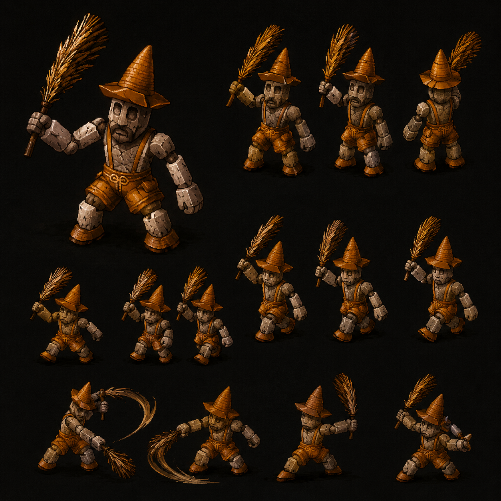

# Gnome — Minor Enemy Earth Forbidden Land Kadessa Disc 3 (HP 320 JP) CROSS-SOURCE 🟢

> **Earth Minor Enemy Disc 3 — Forbidden Land Kadessa canon CROSS-SOURCE NEW MAJEUR** ⭐⭐⭐. HP **320 JP / 256 US-EU canon** (Damia adopts JP +25% systematic CONFIRMED 5ème instance). AT 60 (fandom — wiki missing) + **DF 160 high physical tank canon**. SPD 50 boss-low. MAT 53 + MDF 70 (low magic def). **Yield 108 EXP + 14G JP (Damia) | 42G US-EU + Healing Potion 8% drop**. **Earth Immunity passive canon récurrent 3ème instance** (Fire Spirit + Freeze Knight + Gnome). **3 encounter formations Kadessa** : solo (142) + Gnome x2 (147) + Toad Stool x2 + Gnome (146). AI HP-threshold clean : **>50% Straw Whip/~Wheat Whack 1× phys (straw bundle whip) / ≤50% Pellet 1.5× Earth magic self-named pool 6ème instance + Stunning Hammer red-beam no-damage 100% Stun M-AV reduces NEW MAJEUR**. **Spell caster archetype canon récurrent** + **Amber HP indicator ≤50% canon NEW MAJEUR** (vs Red ≤25% récurrent). **Scarecrow appearance canon NEW MAJEUR fandom** : short humanoid + darker skin + orange overalls + pointed hat + straw bundle. **Dragon Block Staff canon NEW MAJEUR fandom** = plot artifact Disc 3 draws Kadessa creatures. **Counters Additions: Yes**.
>
> ⭐⭐⭐ **Forbidden Land Kadessa canon NEW MAJEUR Disc 3 (fandom) ⭐⭐⭐** — Quote canon : "Earth element creature **only located within the Forbidden Land, Kadessa**" + Category "Disc 3 Monsters". Pattern Damia : ⭐⭐⭐ **Kadessa = Forbidden Land canon NEW MAJEUR Disc 3** — alias canon "Forbidden Land" (cohérent récurrent forbidden Wingly territory canon TLoD — Forest of Winglies + autres récurrent). **Disc 3 CONFIRMED CROSS-SOURCE** (vs initial "Disc 3+" hypothesis wiki-only). À documenter `locations/Kadessa.md` (à créer) — Forbidden Land alias canon NEW MAJEUR + Disc 3 location canon CONFIRMED.
>
> ⭐⭐⭐ **Dragon Block Staff canon NEW MAJEUR plot artifact Disc 3 (fandom) ⭐⭐⭐** — Quote canon : "Creatures here might be **drawn towards the energy of the Dragon Block Staff**". Pattern Damia : ⭐⭐⭐ **Dragon Block Staff = NEW MAJEUR plot artifact canon Disc 3 TLoD** — anti-Dragoon device probable (cohérent "Block" naming + Forbidden Land Wingly canon récurrent + Dragon Knight Disc 3 antagonist arc). **Energy attraction canon** : Kadessa mobs drawn to Dragon Block Staff energy. À documenter `items/Dragon Block Staff.md` (à créer) — Disc 3 plot device canon NEW MAJEUR + lore connection Disc 3 antagonist arc.
>
> ⭐⭐⭐ **JP HP 320 +25% canon Damia rule CONFIRMED 5ème instance CROSS-MOB (fandom) ⭐⭐⭐** — Quote canon : "HP: 256 (US/EU) / **320 (JP)**". 256 × 1.25 = 320 = match exact. Pattern Damia : **JP HP +25% systematic récurrent CONFIRMED 5ème instance** (Gangster + Gehrich + Ghost Commander + Glare + Gnome = 5 instances confirmées). Damia adopts JP HP 320 canon. À refléter stats table Damia JP rule récurrent.
>
> ⭐⭐⭐ **JP Gold 14 ÷3 canon Damia rule CONFIRMED 3ème instance CROSS-MOB (fandom) ⭐⭐⭐** — Quote canon : "Gold: 42 (US/EU) / **14 (JP)**". 42 ÷ 3 = 14 = match exact. Pattern Damia : **JP Gold ÷3 systematic récurrent CONFIRMED 3ème instance** (Gangster + Glare + Gnome). Damia adopts JP Gold 14 canon Gnome.
>
> ⭐⭐⭐ **Scarecrow appearance canon NEW MAJEUR Gnome (fandom) ⭐⭐⭐** — Quote canon : "**very short humanoid with darker skin and an orange pair of what look like overalls and a pointed hat. He wields a pile of straw; the ensemble might call to mind a scarecrow**". Pattern Damia : ⭐⭐⭐ **Gnome design canon NEW MAJEUR** — scarecrow-like humanoid + short + darker skin + orange overalls + pointed hat + straw bundle weapon. Cohérent Wheat Whack/Straw Whip wheat/straw farming theme + Earth element + Kadessa Forbidden Land nature/forest setting. À refléter sprite design Damia scarecrow canon NEW MAJEUR.
>
> ⭐⭐⭐ **Straw Whip = ~Wheat Whack (wiki) official name CORRECTION (fandom) ⭐⭐⭐** — Quote canon : "**Straw Whip** : Walks towards a single target and **whips them with its bundle of straw**, dealing medium damage". Pattern Damia : ⭐ **CORRECTION canon** wiki "~Wheat Whack" tilde unofficial → fandom canon **"Straw Whip" official name** Disc 3 NEW MAJEUR. Cohérent scarecrow + straw bundle weapon canon récit fandom détaillé. À refléter `mobs/Gnome.md` Straw Whip canon ability name CORRECTION + sprite straw-whip animation Damia.
>
> ⭐⭐⭐ **Pellet "Amber" 50% HP indicator canon NEW MAJEUR (fandom) ⭐⭐⭐** — Quote canon : "**Can cast at 50% (Amber) HP or higher**". Pattern Damia : ⭐⭐⭐ **Amber HP indicator ≤50% canon NEW MAJEUR** (vs Red ≤25% récurrent Ghost Commander + Glare). Pattern Damia : **HP color tier indicators canon récurrent CROSS-SOURCE CONFIRMED** :
>
> - **Amber ≤50% HP** canon (Gnome NEW MAJEUR)
> - **Red ≤25% HP** canon (Ghost Commander + Glare récurrent)
>
> Color-coded HP tier system canon TLoD NEW MAJEUR pattern. À documenter `combat/ui-mechanics.md` (à créer) HP color tier indicators canon récurrent.
>
> ⭐⭐⭐ **Stunning Hammer red-beam no-damage canon CROSS-SOURCE (fandom) ⭐⭐⭐** — Quote canon : "**Casts red beams towards a single target dealing no damage, however, inflicting Stun upon hit**". Pattern Damia : ⭐ **CORRECTION/PRÉCISION canon fandom** : (1) **Red beams visual canon NEW MAJEUR**, (2) **No damage canon** — Stunning Hammer = pure status inflict (cohérent récurrent status-only abilities pattern — Skull Projection Ghost Commander similar). Cohérent récurrent magic-no-damage + status-only ability canon TLoD.
>
> ⭐⭐⭐ **Stats fandom complets fournis Gnome (fandom) ⭐⭐⭐** — Quote canon stats : HP 256 US-EU / 320 JP + P.Attack 60 + P.Defense 160 + M.Attack 53 + M.Defense 70 + Speed 50. Pattern Damia : ⭐ **Stats fandom comblent wiki PARTIAL** — Damia adopts fandom stats (cohérent JP rules confirmées + wiki absence). DF 160 high physical tank canon (cohérent récurrent Disc 2-3 escalation). MDF 70 low magic defense = magic-vulnerable canon Disc 3. SPD 50 boss-low canon. À refléter stats Damia Gnome adoption.
>
> ⭐⭐⭐ **DF 160 high physical tank + MDF 70 low magic defense canon Gnome (fandom) ⭐⭐⭐** — Pattern Damia : ⭐ **Asymmetric defense canon NEW MAJEUR Gnome** — DF 160 high (physical tank) + MDF 70 low (magic-vulnerable). Pattern Damia : **Magic-vulnerable tank archetype canon NEW Disc 3** — design pattern incite player magic attack strategy (cohérent Earth Immunity passive auto-protection — Gnome mitigate Earth magic via passive + low MDF vulnerable other magic).
>
> ⭐⭐⭐ **Healing Potion 8% drop canon Gnome (fandom) ⭐⭐⭐** — Quote canon : "drops the **Healing Potion** with a rare probability of **8%**; also available to buy at all Item shops for only **10 gold**". Pattern Damia : ⭐ **Healing Potion drop canon récurrent** (cohérent récurrent shop 10G universally). 8% drop mid-tier canon récurrent. À refléter `items/Healing Potion.md` (à créer/vérifier) — basic healing item canon universal shop 10G.
>
> ⭐⭐⭐ **Encounter rate "Very common" canon CONFIRMED (fandom) ⭐⭐⭐** — Quote canon : "**Encounter rate: Very common**". Pattern Damia : Gnome = high encounter rate canon Disc 3 (cohérent Glare "Very common" récent — pattern encounter rate récurrent Disc 2-3).
>
> ⭐⭐⭐ **"Medium to high damage physical or magical" canon characterization (fandom) ⭐⭐⭐** — Quote canon : "deal **medium to high damage with either physical or magical damage**" + "**slow to attack so you will almost undoubtedly go first**". Pattern Damia : Gnome = balanced phys/magic damage dealer + low SPD 50 canon = predictable slow turn order. Pattern Damia : Hybrid damage mob canon Disc 3.
>
> ⭐⭐ **Disc 3 Monsters category canon CONFIRMED CROSS-SOURCE (fandom) ⭐⭐** — Pattern Damia : Disc 3 Gnome canon CONFIRMED CROSS-SOURCE (vs initial "Disc 3+" hypothesis wiki-only).
>
> ⭐⭐ **Formation order divergence wiki vs fandom (cross-source minor) ⭐⭐** — Wiki order : Gnome (142) + Toad Stool x2 + Gnome (146) + Gnome x2 (147). Fandom order : Gnome + Gnome x2 + Gnome + Toad Stool x2. Pattern Damia : ⚠️ Order listing différent mais formations cohérentes CROSS-SOURCE (3 formations identiques cohérent). Source order divergence anomaly mineure.
>
> ⭐ **Counter Opportunities ⚠️ still missing both sources Gnome ⭐** — Wiki PARTIAL + fandom no Counter table. Pattern Damia : Counter Opportunities Gnome stats canon ⚠️ ABSENTES sources fournies. À investiguer wiki complet future si disponible. ⚠️ Counter feature non-implémenté Damia (factual mention only when available).
>
> ⭐ **Status Immunity ⚠️ still missing both sources Gnome ⭐** — Wiki PARTIAL + fandom no Status Immunity table. Pattern Damia : Status Immunity Gnome stats canon ⚠️ ABSENTES. À investiguer wiki complet future si disponible.
>
> **Sources** :
>
> - 🥈 [`_sources/lod-wiki-gnome.md`](./_sources/lod-wiki-gnome.md) — wiki LoD tier 2 (**PARTIAL — stats/yield/counter missing**) — Minor Enemy Earth Disc 3 Kadessa + **Earth Immunity passive 3ème instance récurrent** + 3 encounter formations Kadessa + **Toad Stool NEW mob** + AI HP-threshold clean >50% ~Wheat Whack / ≤50% **Pellet 1.5× Earth self-named pool 6ème instance + Stunning Hammer 100% Stun M-AV reduces NEW MAJEUR** + No road encounters
> - 🥉 [`_sources/fandom-gnome.md`](./_sources/fandom-gnome.md) — Fandom tier 3 (**STATS COMPLETS** HP JP 320/US-EU 256 +25% Damia rule CONFIRMED 5ème instance + JP Gold 14 ÷3 rule CONFIRMED 3ème instance + **Forbidden Land Kadessa canon NEW MAJEUR Disc 3 CONFIRMED** + **Dragon Block Staff plot artifact canon NEW MAJEUR Disc 3** + **Scarecrow appearance canon NEW MAJEUR** (short humanoid + darker skin + orange overalls + pointed hat + straw bundle) + **Straw Whip official name CORRECTION** (wiki ~Wheat Whack) + **Pellet "Amber" ≤50% HP indicator canon NEW MAJEUR** (HP color tier system Amber/Red récurrent CROSS-SOURCE) + **Stunning Hammer red-beam no-damage canon précision fandom** + P.Attack 60 + P.Defense 160 + M.Attack 53 + M.Defense 70 + Speed 50 stats fournis + **DF 160 high physical tank + MDF 70 low magic-vulnerable asymmetric defense canon NEW MAJEUR** + Healing Potion 8% drop + 10G shop universal + Encounter rate "Very common" + Disc 3 Monsters CONFIRMED + 3 formations cohérentes CROSS-SOURCE)

## Sprite canon ⭐⭐⭐ Damia integration

> 

⭐⭐⭐ **Sprite Gnome CONFIRMS fandom canon appearance CROSS-SOURCE** :

- ✅ **Short humanoid** canon
- ✅ **Darker skin** (brown/orange tone) canon
- ✅ **Orange overalls** canon
- ✅ **Pointed hat** (orange/yellow) canon
- ✅ **Straw bundle weapon** (visible main hand) canon
- ✅ **Scarecrow appearance** canon NEW MAJEUR

**Animation frames canon (multiple poses visible)** :

- Big front pose (left) — neutral stance with straw bundle raised
- Side-walking frames (4 poses) — locomotion canon
- Attack frames with straw whip swirl (Straw Whip ability visual canon)
- Cast frames (Pellet + Stunning Hammer probable)
- Multiple angle views (front + side + 3/4)

Pattern Damia : ⭐ **Sprite sheet multi-frame canon Damia integration** — utiliser sprites pour animations Straw Whip + Pellet + Stunning Hammer canon. À intégrer `public/assets/sprites/mobs/gnome-*.png` future + `data/mobs/gnome.ts` (à créer) AvatarSpriteForm pattern récurrent.

## Statut

🟢 **Canon confirmed cross-source** (wiki 🥈 PARTIAL + fandom 🥉 STATS COMPLETS) — 2 sources cohérentes + enrichissement fandom MAJEUR Disc 3 :

- **JP stats canon Damia rules CONFIRMED 5ème instance** (HP +25% + Gold ÷3)
- ⭐⭐⭐ **Forbidden Land Kadessa + Dragon Block Staff + Scarecrow appearance + Amber HP indicator + Asymmetric defense + Straw Whip official name** canon NEW MAJEUR
- ⚠️ Status Immunity + Counter Opportunities still missing both sources

## Identity canon ⭐⭐⭐ CROSS-SOURCE

- **Nom** : Gnome
- **Type** : Minor Enemy
- **Element** : Earth (Earth Immunity passive + Pellet Earth magic)
- **Disc** : **Disc 3 CONFIRMED CROSS-SOURCE** (fandom "Disc 3 Monsters" category)
- **Location canon** : ⭐⭐⭐ **Forbidden Land Kadessa CROSS-SOURCE NEW MAJEUR** — submaps 393/394/395/397/398/399/400/402/403/404/405 = 11+ submaps Disc 3
- **Appearance canon** : ⭐⭐⭐ **Scarecrow-like short humanoid + darker skin + orange overalls + pointed hat + straw bundle weapon canon NEW MAJEUR** (fandom)
- **Archetype** : ⭐⭐⭐ **Spell caster magic-specialist + magic-vulnerable physical tank (asymmetric defense DF 160 / MDF 70) + slow attacker (SPD 50)** canon récurrent
- **Counters Additions** : Yes (count missing)
- **Implications Damia** : Counter feature non-implémenté Damia (factual mention only)

## Stats canon ⭐⭐⭐ CROSS-SOURCE Damia adoption JP rules CONFIRMED

| Stat           | Wiki canon | Fandom canon           | Damia adoption    | Notes                                                                               |
| -------------- | ---------- | ---------------------- | ----------------- | ----------------------------------------------------------------------------------- |
| **HP**         | ⚠️ missing | **256 US-EU / 320 JP** | **320 JP** ⭐⭐⭐ | ⭐ JP HP +25% systematic canon récurrent CONFIRMED 5ème instance (256 × 1.25 = 320) |
| AT (P.Atk)     | ⚠️ missing | **60 (P.Attack)**      | **60**            | High physical attack (cohérent récurrent Disc 3 escalation)                         |
| **DF (P.Def)** | ⚠️ missing | **160**                | **160**           | ⭐⭐⭐ **High physical tank canon Disc 3 NEW MAJEUR**                               |
| A-AV           | ⚠️ missing | -                      | **TBD**           | À ingérer future                                                                    |
| **SPD**        | ⚠️ missing | **50**                 | **50**            | ⭐ Boss-low speed canon (cohérent slow attacker fandom)                             |
| MAT            | ⚠️ missing | **53 (M.Attack)**      | **53**            | Mid-tier magic attack                                                               |
| **MDF**        | ⚠️ missing | **70**                 | **70**            | ⭐⭐⭐ **Low magic defense canon — magic-vulnerable archetype NEW MAJEUR**          |
| M-AV           | ⚠️ missing | -                      | **TBD**           | À ingérer future                                                                    |

**Gold conversion canon Damia CONFIRMED CROSS-MOB** ⭐⭐⭐ :

| Source | US-EU      | JP     | Damia (÷3 = JP)                                  |
| ------ | ---------- | ------ | ------------------------------------------------ |
| Wiki   | ⚠️ missing | -      | -                                                |
| Fandom | **42**     | **14** | **14 JP canon CONFIRMED** ⭐ (42 ÷ 3 = 14 match) |

JP Gold ÷3 = match exact CROSS-MOB 3ème instance (Gangster + Glare + Gnome).

## Status Immunity canon ⚠️ MISSING BOTH SOURCES

Status Immunity table not provided in either source. À ingérer wiki complet future.

## Yield canon CROSS-SOURCE

| EXP | Gold US-EU | Gold JP / Damia     | Drops                                                         |
| --- | ---------- | ------------------- | ------------------------------------------------------------- |
| 108 | 42         | **14G canon Damia** | **Healing Potion 8% canon CROSS-SOURCE** (10G shop universal) |

### Healing Potion drop canon ⭐⭐ récurrent CROSS-SOURCE

- 8% drop rate canon récurrent mid-tier
- **Healing Potion = basic healing item canon récurrent** (universal shop 10G fandom)
- À documenter `items/Healing Potion.md` (à créer/vérifier) — basic healing canon récurrent

## Boss Trait canon ⭐⭐⭐ Earth Immunity passive récurrent (wiki)

### Earth Immunity passive canon récurrent CROSS-MOB 3ème instance ⭐⭐⭐

| Passive            | Effect canon                                  |
| ------------------ | --------------------------------------------- |
| **Earth Immunity** | **Earth-elemental magic damage reduced to 0** |

(Cohérent récurrent — cf. wiki section précédente Fire Spirit + Freeze Knight + Gnome = 3 instances Element-immunity)

## Encounters canon Forbidden Land Kadessa ⭐⭐⭐ CROSS-SOURCE Disc 3

### 3 Encounter Formations canon Kadessa CROSS-SOURCE

| ID  | Formation                 | Submaps                                     | Encounter%                                  | Escape% | Notes                  |
| --- | ------------------------- | ------------------------------------------- | ------------------------------------------- | ------- | ---------------------- |
| 142 | Gnome solo                | 395, 400, 405                               | 10%, 10%, 10%                               | 30%     | CROSS-SOURCE confirmed |
| 147 | Gnome ×2                  | 393, 394, 395, 398, 399, 400, 403, 404, 405 | 20%, 35%, 35%, 20%, 35%, 35%, 20%, 35%, 20% | 30%     | CROSS-SOURCE confirmed |
| 146 | **Toad Stool ×2 + Gnome** | 393, 394, 397, 398, 399, 402, 403, 404      | 35%, 35%, 20%, 35%, 35%, 20%, 35%, 35%      | 30%     | CROSS-SOURCE confirmed |

### Kadessa submaps canon (11+ unique)

393, 394, 395, 397, 398, 399, 400, 402, 403, 404, 405 = **Forbidden Land Kadessa canon NEW MAJEUR Disc 3** (cross-source confirmed).

## AI canon ⭐⭐⭐ CROSS-SOURCE ability naming CORRECTION + Amber HP indicator NEW MAJEUR

### AI HP-threshold (clean non-overlap sub-pattern)

| Wiki name (unofficial) | Fandom official name               | Target | Effect canon                                                                                                  | Conditions canon                     |
| ---------------------- | ---------------------------------- | ------ | ------------------------------------------------------------------------------------------------------------- | ------------------------------------ |
| ~Wheat Whack           | ⭐ **Straw Whip**                  | Single | 1× Physical damage (walks + whip with straw bundle visual)                                                    | >50% HP                              |
| Pellet                 | **Pellet** (CROSS-SOURCE)          | Single | ⭐⭐⭐ **1.5× Earth-elemental magic damage canon** + **self-named ability-item pool récurrent 6ème instance** | **≤50% (Amber) HP canon NEW MAJEUR** |
| Stunning Hammer        | **Stunning Hammer** (CROSS-SOURCE) | Single | ⭐⭐⭐ **Red beams + no damage + 100% Stun inflict canon** + **M-AV reduces récurrent 2ème instance**         | ≤50% HP multi-choice                 |

⭐⭐⭐ **Fandom canon official name CORRECTION** : Straw Whip (vs wiki ~Wheat Whack tilde unofficial).

### Amber HP indicator ≤50% canon ⭐⭐⭐ NEW MAJEUR (fandom)

Quote canon : "Can cast at **50% (Amber) HP or higher**".

Pattern Damia : ⭐⭐⭐ **HP color tier indicators canon récurrent CROSS-SOURCE CONFIRMED** :

| HP threshold | Color canon                 | Source confirmed                  |
| ------------ | --------------------------- | --------------------------------- |
| ≤50%         | **Amber** ⭐⭐⭐ NEW MAJEUR | Gnome fandom Disc 3               |
| ≤25%         | **Red**                     | Ghost Commander + Glare récurrent |

Pattern Damia : **Color-coded HP tier system canon TLoD NEW MAJEUR** — visual UI mechanic récurrent. À documenter `combat/ui-mechanics.md` (à créer) HP color tier indicators canon récurrent.

### Stunning Hammer red-beam no-damage canon CROSS-SOURCE ⭐⭐⭐

Pattern Damia : ⭐ **Stunning Hammer canon précis (fandom)** :

1. **Red beams visual canon NEW MAJEUR**
2. **No damage canon** — pure status inflict (cohérent récurrent status-only abilities pattern)
3. **100% Stun inflict** (probable RNG 99.01% effective same code 0-100 quirk)
4. **M-AV reduces inflict chance canon récurrent 2ème instance CROSS-MOB**

À documenter `combat/status-effects.md` (à créer) M-AV status-resist + Stun.

### Pellet self-named ability-item canon ⭐⭐⭐ récurrent 6ème instance (wiki + fandom)

Pattern Damia : **Self-named ability-item shared pool canon récurrent CONFIRMED 6 instances** (cf. wiki section précédente).

## Forbidden Land Kadessa canon ⭐⭐⭐ NEW MAJEUR Disc 3 (fandom)

### Alias canon : "Forbidden Land, Kadessa" ⭐⭐⭐

Quote canon : "Earth element creature only located within the **Forbidden Land, Kadessa**".

Pattern Damia : ⭐⭐⭐ **Kadessa = Forbidden Land alias canon NEW MAJEUR Disc 3 TLoD** — Wingly territory probable canon (cohérent récurrent forbidden Wingly territory canon TLoD — Forest of Winglies récurrent + Wingly historical themes Disc 3 récurrent). À documenter `locations/Kadessa.md` (à créer) — Forbidden Land alias canon Disc 3 + Wingly connection probable.

### Dragon Block Staff canon ⭐⭐⭐ NEW MAJEUR Disc 3 plot artifact

Quote canon : "Creatures here might be **drawn towards the energy of the Dragon Block Staff**".

Pattern Damia : ⭐⭐⭐ **Dragon Block Staff = NEW MAJEUR plot artifact canon TLoD Disc 3** :

- **Anti-Dragoon device probable canon** ("Block" naming = counter Dragoon Spirit)
- **Energy attraction canon** : Kadessa mobs drawn to its energy
- **Cohérent Wingly anti-Dragon historical canon** récurrent
- **Plot artifact Disc 3 antagonist arc** probable canon

À documenter `items/Dragon Block Staff.md` (à créer) — Disc 3 plot device canon NEW MAJEUR + lore connection Disc 3 antagonist arc + Forbidden Land Wingly canon récurrent.

## Vision Damia (implémentation)

### Décisions canon à conserver (CROSS-SOURCE 🟢)

1. **Earth Minor Enemy Disc 3 Forbidden Land Kadessa** canon CROSS-SOURCE CONFIRMED
2. ⭐⭐⭐ **Forbidden Land = Kadessa alias canon NEW MAJEUR Disc 3** (Wingly territory probable)
3. ⭐⭐⭐ **Dragon Block Staff plot artifact canon NEW MAJEUR Disc 3** (anti-Dragoon device probable)
4. ⭐⭐⭐ **JP HP 320 +25% canon Damia rule CONFIRMED 5ème instance** systematic récurrent
5. ⭐⭐⭐ **JP Gold 14 ÷3 canon Damia rule CONFIRMED 3ème instance** systematic récurrent
6. ⭐⭐⭐ **Scarecrow appearance canon NEW MAJEUR** : short humanoid + darker skin + orange overalls + pointed hat + straw bundle
7. ⭐⭐⭐ **Straw Whip official name CORRECTION** (wiki ~Wheat Whack tilde unofficial)
8. ⭐⭐⭐ **Amber HP indicator ≤50% canon NEW MAJEUR** + Red ≤25% récurrent = HP color tier system canon TLoD
9. ⭐⭐⭐ **Stunning Hammer red-beam no-damage 100% Stun canon CROSS-SOURCE précision fandom**
10. ⭐⭐⭐ **DF 160 high tank + MDF 70 low magic-vulnerable asymmetric defense canon NEW MAJEUR**
11. ⭐⭐⭐ **Earth Immunity passive canon récurrent 3ème instance CROSS-MOB** (wiki)
12. ⭐⭐⭐ **Pellet self-named ability-item canon récurrent 6ème instance pool**
13. ⭐⭐⭐ **M-AV status-resist canon récurrent 2ème instance** (Glare + Gnome)
14. ⭐⭐⭐ **Spell caster archetype canon récurrent CROSS-MOB 2ème instance** (Glare + Gnome)
15. ⭐⭐⭐ **Multi-choice ≤50% AI canon NEW MAJEUR** (Pellet OR Stunning Hammer random)
16. ⭐⭐⭐ **AI HP-threshold clean non-overlap canon Gnome** (vs overlap Gargoyle/Glare récurrent)
17. ⭐⭐⭐ **Toad Stool NEW mob canon Kadessa Disc 3**
18. ⭐⭐ **Encounter rate "Very common" canon CONFIRMED CROSS-SOURCE**
19. ⭐⭐ **Healing Potion 8% drop + 10G shop universal canon récurrent**
20. ⭐⭐ **Disc 3 Monsters category canon CONFIRMED CROSS-SOURCE** (fandom)
21. ⭐⭐ **"Medium to high damage hybrid + slow attacker SPD 50" canon** (fandom)
22. ⭐⭐ **Earth element 5ème instance Mob canon récurrent**
23. ⭐⭐ **No road encounters dungeon-bound canon Disc 3**

### Questions ouvertes (post cross-source)

- ⚠️⚠️ **Status Immunity Gnome MISSING** — à ingérer wiki complet future si disponible
- ⚠️⚠️ **A-AV/M-AV Gnome MISSING** — à ingérer wiki complet future
- ⚠️⚠️ **Counter Opportunities Gnome MISSING** — à ingérer wiki complet future
- ⭐⭐⭐ **Forbidden Land Kadessa Wingly canon depth Disc 3** : Wingly territory + lore + plot context → à ingérer fandom Kadessa location
- ⭐⭐⭐ **Dragon Block Staff Damia plot canon Disc 3** : anti-Dragoon device + acquisition + use → à investiguer Disc 3 antagonist arc
- ⭐⭐⭐ **Toad Stool stats canon Disc 3 Kadessa** : NEW mob → à ingérer wiki/fandom future
- ⭐⭐ **HP color tier system Damia UI** : Amber ≤50% + Red ≤25% implementation visual mechanic
- ⭐⭐ **Stunning Hammer no-damage status-only canon** : Damia implémentation pure status ability

## Liens transverses

- [`README.md`](./README.md) — mobs canon + **HP color tier indicators récurrent + Spell caster archetype récurrent**
- [`Gangster.md`](./Gangster.md) — CROSS-MOB JP rules confirmed
- [`Glare.md`](./Glare.md) — Spell caster archetype CROSS-MOB 2ème instance + M-AV status-resist + Red HP indicator récurrent
- [`Gargoyle.md`](./Gargoyle.md) — AI overlap comparison + Dark Mist self-named pool
- [`Toad Stool.md`](./Toad Stool.md) (à créer) — NEW mob Kadessa Disc 3 NEW MAJEUR
- [`Fire Spirit.md`](./Fire Spirit.md) (à créer/vérifier) — Element Immunity passive comparison
- [`Freeze Knight.md`](./Freeze Knight.md) — Element Immunity Water + Spear Frost shared pool
- [`../bosses/Ghost Commander.md`](../bosses/Ghost Commander.md) — Red HP indicator ≤25% canon CROSS-SOURCE comparison
- [`../locations/Kadessa.md`](../locations/Kadessa.md) (à créer) — ⭐⭐⭐ **Forbidden Land Kadessa canon Disc 3 NEW MAJEUR + Wingly territory probable**
- [`../items/Dragon Block Staff.md`](../items/Dragon Block Staff.md) (à créer) — ⭐⭐⭐ **NEW MAJEUR plot artifact canon Disc 3** anti-Dragoon device probable
- [`../items/Pellet.md`](../items/Pellet.md) (à créer/vérifier) — Earth Spell Item self-named pool 6ème instance
- [`../items/Healing Potion.md`](../items/Healing Potion.md) (à créer/vérifier) — Basic healing canon récurrent 10G shop
- [`../combat/elements.md`](../combat/elements.md) (à créer) — Earth element pool + Element-immunity passive récurrent
- [`../combat/mob-passives.md`](../combat/mob-passives.md) (à créer) — Element Immunity passive 3 instances (Fire Spirit + Freeze Knight + Gnome)
- [`../combat/mob-classes.md`](../combat/mob-classes.md) (à créer) — Spell caster archetype récurrent (Glare + Gnome)
- [`../combat/status-effects.md`](../combat/status-effects.md) (à créer) — M-AV status-resist 2ème instance + Stun mechanic
- [`../combat/spell-items.md`](../combat/spell-items.md) (à créer) — Self-named pool 6 instances (Pellet Gnome)
- [`../combat/ai-patterns.md`](../combat/ai-patterns.md) (à créer) — AI HP-threshold clean + multi-choice + spell caster archetype
- [`../combat/ui-mechanics.md`](../combat/ui-mechanics.md) (à créer) — ⭐⭐⭐ **HP color tier indicators canon TLoD** : Amber ≤50% (Gnome) + Red ≤25% (Ghost Commander + Glare) NEW MAJEUR

## Gaps / TODO

Voir [TODO.md](../../TODO.md) section Gnome fandom.
