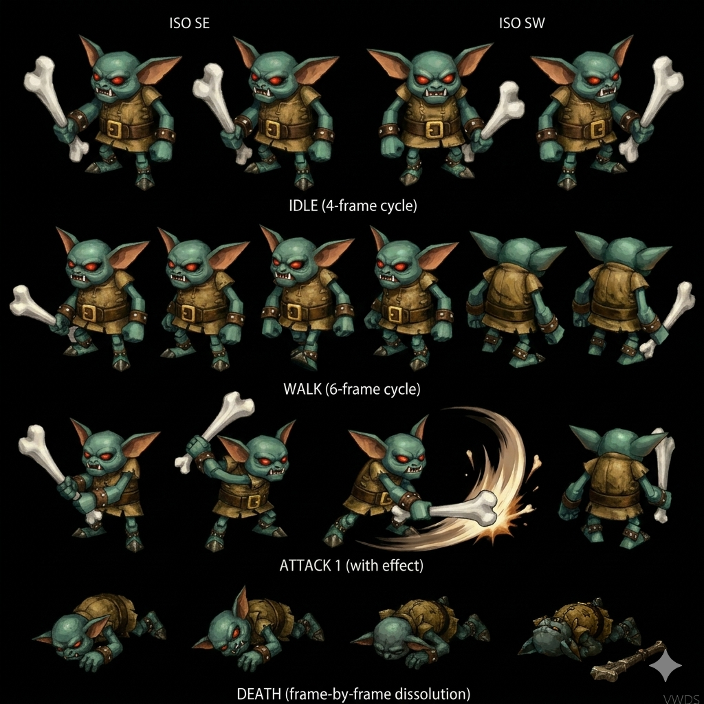

# Goblin — Minor Enemy Fire Forest Disc 1 (HP 5 JP) CROSS-SOURCE 🟢

> **Fire Minor Enemy Disc 1 Forest canon CROSS-SOURCE** ⭐⭐⭐. ⚠️ **HP 5 JP / 4 US-EU canon paper-HP** (Damia adopts JP +25% systematic CONFIRMED 6ème instance CROSS-MOB) + AT 2 CROSS-SOURCE + **DF 120 high physical tank canon** + SPD 40 + MAT 1 (wiki) / 3 (fandom +200% small-value divergence) + **MDF 120 high magic defense** + A-AV/M-AV 0%. **Asymmetric stats canon NEW MAJEUR** (DF 120/MDF 120 vs HP 5 paper). Status 4/8 immune mid-tier récurrent. **Yield 4 EXP + 2G JP (Damia) | 6G US-EU + Detonate Rock 10% drop**. **3 encounter formations Forest Disc 1** : solo (3) + Assassin Cock (4) + Trent (9) CROSS-SOURCE. AI HP-threshold escalating canon : **>50% Bone Club 1.5× phys / ≤50% Rock Throw/Throw Stone 3× phys + Kick 4× phys (multi-choice)**. **Escape 90% canon NEW MAJEUR**. **Counters Additions: Yes** (28 counter opportunities). **Small humanoid + green skin + red eyes + brown tunic + bone club appearance canon CROSS-SOURCE CONFIRMED**. **SPD 40 uncommonly low vs mob average 60 canon NEW MAJEUR fandom**. **Single-target focus canon CROSS-SOURCE**. **JP name "Goburin"**.
>
> ⭐⭐⭐ **HP 4 extraordinarily low canon NEW MAJEUR (wiki) ⭐⭐⭐** — Quote canon : "HP **4**". Pattern Damia : ⭐⭐⭐ **Goblin = lowest HP récent canon Disc 1 NEW MAJEUR** — paper-HP archetype canon (4 HP = 1-2 hits kill canon). Pattern Damia : tutorial-tier mob HP canon Disc 1 early-game (cohérent récurrent Disc 1 starting area Forest). Asymmetric stats canon NEW MAJEUR (DF 120 high tank vs HP 4 paper) = anti-cheese ? OU AI escalating damage compensation (>50% threshold rarely triggered). À refléter `mobs/README.md` HP tier patterns canon récurrent.
>
> ⭐⭐⭐ **Asymmetric stats DF 120 + MDF 120 high vs HP 4 paper canon NEW MAJEUR (wiki) ⭐⭐⭐** — Pattern Damia : ⭐⭐⭐ **Asymmetric defense-HP canon NEW MAJEUR** — DF 120 + MDF 120 high (cohérent récurrent Disc 2+ scaling MAIS Disc 1 mob = anomaly) vs HP 4 paper. Possible design : (1) anti-cheese (high defense reduce dmg + low HP intentional fragility), (2) AI escalating compensation (>50% threshold short-lived), (3) glass-cannon défensif unusual archetype. À investiguer pattern Disc 1 unique. À refléter `mobs/README.md` asymmetric stats archetype canon.
>
> ⭐⭐⭐ **Escalating damage AI multipliers canon NEW MAJEUR Goblin (wiki) ⭐⭐⭐** — Quote canon : ">50% ~Bone Club **1.5× Physical damage**" + "≤50% Throw Stone **3× Physical damage**" + "~Kick **4× Physical damage**". Pattern Damia : ⭐⭐⭐ **Escalating damage multipliers canon NEW MAJEUR** — 1.5× → 3× → 4× progressive damage scaling AI canon. Pattern Damia : **HP-threshold AI escalation canon NEW** — low HP triggers higher damage abilities (panic/desperate damage spike canon). Multi-choice ≤50% (Throw Stone OR Kick = random selection canon récurrent). À documenter `combat/ai-patterns.md` (à créer) escalating damage AI canon NEW MAJEUR.
>
> ⭐⭐⭐ **Assassin Cock + Trent NEW mobs canon Forest Disc 1 (wiki) ⭐⭐⭐** — Encounter formations confirment **2 NEW mobs canon Forest Disc 1** : **Assassin Cock** (formation 4) + **Trent** (formation 9). Pattern Damia : ⭐ **Forest Disc 1 ecosystem expanded canon NEW MAJEUR** — Goblin + Assassin Cock (chicken/bird themed) + Trent (tree-creature themed cohérent Forest setting). À documenter `mobs/Assassin Cock.md` + `mobs/Trent.md` (à créer) — NEW mobs canon Disc 1 Forest récurrent.
>
> ⭐⭐⭐ **Detonate Rock 10% drop NEW item canon Disc 1 Goblin (wiki) ⭐⭐⭐** — Quote canon : "Drops **Detonate Rock 10%**". Pattern Damia : ⭐ **Detonate Rock = NEW item canon Disc 1** thématique Fire/explosive (cohérent Goblin Fire element + bone-weapon + rock-throwing AI). 10% drop rate mid-tier canon récurrent. À documenter `items/Detonate Rock.md` (à créer) — NEW item canon Disc 1 Fire/explosive thématique.
>
> ⭐⭐⭐ **Escape 90% canon NEW MAJEUR Disc 1 highest récent (wiki) ⭐⭐⭐** — Quote canon : "Escape% **90%**". Pattern Damia : ⭐ **Goblin = highest escape rate récent canon Disc 1 NEW MAJEUR** (vs récurrent 30-40% mob escape Disc 1-3). Pattern Damia : Disc 1 easy-escape canon Forest tutorial-area design (cohérent récurrent Forest Disc 1 starting area + low XP/Gold yield + low HP paper-tier).
>
> ⭐⭐⭐ **Forest Disc 1 location confirmed canon (wiki) ⭐⭐⭐** — Quote canon : "Forest (6, 7, 624, 625)". Pattern Damia : Forest Disc 1 location canon récurrent CONFIRMED (cohérent existing Forest récurrent canon Disc 1). Submap IDs : 6, 7 (très bas tier Disc 1 early) + 624, 625 (haut tier — late Forest section ? OU separate Forest area). Investigation submap range Forest canon Disc 1 récurrent.
>
> ⭐⭐⭐ **Small humanoid greenish skin + large bone weapon appearance canon NEW MAJEUR (wiki) ⭐⭐⭐** — Quote canon : "**small humanoid with greenish skin that carries a large bone as a weapon**". Pattern Damia : ⭐ **Goblin design canon NEW MAJEUR** — small humanoid + green skin + large bone weapon. Cohérent fantasy goblin mythology + bone weapon canon récurrent Bone Club ability. À refléter sprite design Damia Goblin canon NEW MAJEUR.
>
> ⭐⭐⭐ **Trivia "bone too large for Forest creatures" canon mystery NEW (wiki) ⭐⭐⭐** — Quote canon Trivia : "**size of the bone that the goblin uses as a club calls into question what other animals dwell in the Forest. The bone is much too large to belong to anything that Dart encounters**". Pattern Damia : ⭐⭐⭐ **Lore mystery canon Forest Disc 1 NEW MAJEUR** — bone weapon source = unknown larger creature (cohérent récurrent Forest of Winglies ancient creatures canon récurrent ? OU dragons ?). Lore depth canon TLoD mystery foreshadowing. À refléter `locations/Forest.md` (à créer/vérifier) Forest Disc 1 lore canon + mystery bone canon NEW MAJEUR.
>
> ⭐⭐⭐ **Status 4/8 immune mid-tier canon récurrent CROSS-MOB Disc 1-3 (wiki) ⭐⭐⭐** — Pattern Damia : Mid-tier 4/8 immunity canon récurrent CROSS-MOB CONFIRMED Disc 1-3 — Petrify/Bewitch/Arm Block/Dispirit ✔ — Confuse/Fear/Poison/Stun ✗. Cohérent Gangster + Gargoyle + Glare + Goblin = 4 instances CROSS-MOB Disc 1-3 canon.
>
> ⭐⭐⭐ **AI HP-threshold clean + multi-choice ≤50% canon récurrent (wiki) ⭐⭐⭐** — Quote canon : ">50% ~Bone Club" + "≤50% Throw Stone + ~Kick (multi-choice)". Pattern Damia : AI HP-threshold clean canon récurrent (cohérent Gnome Disc 3 même pattern) + multi-choice ≤50% canon récurrent (cohérent Gnome Pellet/Stunning Hammer multi-choice + Goblin Throw Stone/Kick multi-choice). Pattern Damia : Multi-ability random selection canon récurrent Disc 1-3.
>
> ⭐⭐ **Fire element Mob canon récurrent Disc 1+ (wiki) ⭐⭐** — Goblin Fire element canon Disc 1 récurrent. Pattern Damia : Fire mob pool canon récurrent CROSS-DISC (cohérent récurrent Fire Spirit + autres Fire mobs canon TLoD).
>
> ⭐⭐ **Throw Stone 3× phys + ~Kick 4× phys canon multi-choice (wiki) ⭐⭐** — Pattern Damia : Throw Stone = canon ability NEW MAJEUR (cohérent récurrent rock-throwing mob abilities) + ~Kick basic 4× = highest mob phys multiplier récent. Pattern Damia : Disc 1 mob escalating damage = surprising high values pour Disc 1 (compensate paper HP ?). Damia design canon : escalation high multipliers low HP balanced canon.
>
> ⭐⭐ **MDF 120 high magic defense vs MAT 1 nil magic attack canon (wiki) ⭐⭐** — MDF 120 high (cohérent récurrent Disc 2-3 magic-tank canon) + MAT 1 nil = magic-defensive but magic-passive mob canon Disc 1. Pattern Damia : Goblin = anti-magic phys-only mob archetype canon NEW Disc 1 (no magic abilities — only physical Bone Club/Throw Stone/Kick).
>
> ⭐ **Yield 4 EXP + 6G ÷3 = 2G Damia conversion canon Disc 1 (wiki) ⭐** — Low yield Disc 1 cohérent récurrent tutorial-area + Damia Gold ÷3 systematic. Pattern Damia : Goblin = low-value Disc 1 mob canon.
>
> ⭐ **Bone Club basic ability 1.5× phys canon (wiki) ⭐** — Quote canon : "~Bone Club — 1.5× Physical damage". Pattern Damia : basic phys ability 1.5× canon Disc 1 (cohérent récurrent basic 1× phys mob canon récurrent + 1.5× elevated Goblin canon NEW). Bone Club = cohérent appearance canon (large bone weapon).
>
> ⭐ **28 Counter Opportunities canon récurrent (wiki) ⭐** — Pattern récurrent Counter tier mapping universal CROSS-MOB canon (28 tier confirmé Gangster/Gargoyle/Gehrich/Ghost Commander). ⚠️ Counter feature non-implémenté Damia.
>
> ⭐⭐⭐ **JP HP 5 +25% canon Damia rule CONFIRMED 6ème instance CROSS-MOB Goblin (fandom) ⭐⭐⭐** — Quote canon : "HP: 4 (US/EU) / **5 (JP)**". 4 × 1.25 = 5 = match exact (rounded). Pattern Damia : **JP HP +25% systematic récurrent CONFIRMED 6ème instance** (Gangster + Gehrich + Ghost Commander + Glare + Gnome + Goblin = 6 instances). Damia adopts JP HP 5 canon Goblin (paper-HP archetype confirmé).
>
> ⭐⭐⭐ **JP Gold 2 ÷3 canon Damia rule CONFIRMED 4ème instance CROSS-MOB Goblin (fandom) ⭐⭐⭐** — Quote canon : "Gold: 6 (US/EU) / **2 (JP)**". 6 ÷ 3 = 2 = match exact. Pattern Damia : **JP Gold ÷3 systematic récurrent CONFIRMED 4ème instance** (Gangster + Glare + Gnome + Goblin). Damia adopts JP Gold 2 canon.
>
> ⭐⭐⭐ **Mob average SPD 60 canon NEW MAJEUR (fandom) ⭐⭐⭐** — Quote canon : "uncommonly low Speed of 40, with **enemies averaging 60**". Pattern Damia : ⭐⭐⭐ **Mob baseline SPD 60 canon NEW MAJEUR TLoD** — première benchmark documenté canon TLoD mob speed average. Goblin SPD 40 = -33% below average canon (slow archetype confirmed). À documenter `combat/mob-stats-baselines.md` (à créer) — average mob SPD 60 canon NEW MAJEUR baseline TLoD.
>
> ⭐⭐⭐ **Appearance canon CROSS-SOURCE CONFIRMED (fandom) ⭐⭐⭐** — Quote canon : "small humanoid enemy with **green skin and red eyes**. The goblin **wears a brown tunic and carries a club made of bone**". Pattern Damia : CROSS-SOURCE CONFIRMED appearance canon (wiki + fandom + sprite Gemini intégré récent) — small humanoid + green skin + red eyes + brown tunic + bone club. Sprite Gemini fidèle PS1 + canon écrit CONFIRMED.
>
> ⭐⭐⭐ **Single-target focus canon CROSS-SOURCE (fandom) ⭐⭐⭐** — Quote canon : "**focuses only on single targets**". Pattern Damia : Goblin = single-target only mob canon (cohérent wiki abilities Bone Club/Throw Stone/Kick all "Single" target). Pas d'AoE canon Disc 1 Goblin.
>
> ⭐⭐⭐ **Ability names CROSS-SOURCE wiki vs fandom Goblin (fandom) ⭐⭐⭐** — Pattern Damia : ⭐ **Names cross-source comparison** :
>
> | Wiki name (tilde) | Fandom narrative name | Fandom Gallery name (match wiki) | Damia canonical                              |
> | ----------------- | --------------------- | -------------------------------- | -------------------------------------------- |
> | ~Bone Club        | **Bone Club**         | Bone Club                        | **Bone Club** ✓                              |
> | ~Kick             | **Kick**              | Kick                             | **Kick** ✓                                   |
> | Throw Stone       | **Rock Throw** ⚠️     | Throw Stone                      | **Throw Stone** ✓ (wiki + Gallery consensus) |
>
> Pattern Damia : Bone Club + Kick = CROSS-SOURCE same names (no tilde correction needed). **Throw Stone canonical** (wiki + fandom Gallery match) vs fandom narrative variant "Rock Throw" (minor inconsistency dans fandom même).
>
> ⭐⭐ **M.Attack 3 fandom vs wiki MAT 1 = +200% divergence small-value (fandom anomaly) ⭐⭐** — Wiki MAT 1 + fandom M.Attack 3 = +200% divergence MAIS small-value (1→3) — pourcentage misleading. Pattern Damia : Wiki tier 2 canon prevails MAT 1 (cohérent nil magic attack archetype Goblin). Possible fandom round-up OR alternate variant.
>
> ⭐⭐ **JP name "Goburin" canon (fandom) ⭐⭐** — Quote canon : "ゴブリン, **Goburin**". Pattern Damia : JP name canon récurrent JP naming pattern Disc 1 mobs.
>
> ⭐⭐ **Battle formations CROSS-SOURCE confirmed (fandom) ⭐⭐** — Fandom liste 3 formations : Goblin solo + Goblin+Trent + Goblin+Assassin Cock = cohérent wiki 3 formations Forest Disc 1. Source CROSS-SOURCE confirmed.
>
> ⭐⭐ **Disc 1 Monsters category canon CONFIRMED CROSS-SOURCE (fandom) ⭐⭐** — Pattern Damia : Disc 1 Goblin canon CONFIRMED CROSS-SOURCE.
>
> ⭐⭐ **Damage hierarchy Kick < Bone Club narrative fandom ⚠️ contradicts wiki AI (fandom) ⭐⭐** — Quote canon fandom : "Kick — kicks them for **minor damage**" + "Bone Club — **dealing more damage than the Kick attack**". ⚠️ **CONTRADICTION** : fandom narrative dit Kick < Bone Club, mais wiki AI table dit Kick 4× phys > Bone Club 1.5× phys (Kick > Bone Club). Pattern Damia : ⚠️ **Wiki AI multipliers prevail** (tier 2 canonical formal data) — fandom narrative simplification erroneous probable. Wiki canon : Bone Club 1.5× (>50%) / Kick 4× (≤50%) = damage scaling AI-tier canon.
>
> **Sources** :
>
> - 🥈 [`_sources/lod-wiki-goblin.md`](./_sources/lod-wiki-goblin.md) — wiki LoD tier 2 (Minor Enemy Fire Disc 1 Forest + **HP 4 extraordinarily low canon NEW MAJEUR** + AT 2/DF 120 high/SPD 40/MAT 1/MDF 120 high/A-AV/M-AV 0% + **asymmetric defense-HP canon NEW MAJEUR** + Status 4/8 immune mid-tier + Yield 4 EXP/6G/Detonate Rock 10% + 3 encounter formations Forest + **Assassin Cock + Trent NEW mobs** + **Detonate Rock NEW item** + **Escape 90% highest récent canon NEW MAJEUR** + AI HP-threshold clean escalating damage **>50% ~Bone Club 1.5× / ≤50% Throw Stone 3× + ~Kick 4× multi-choice NEW MAJEUR** + **Small humanoid green skin + large bone weapon appearance canon NEW MAJEUR** + **Trivia "bone too large for Forest creatures" lore mystery canon NEW MAJEUR** + 28 counter opportunities cross-character incl Albert Lavitz inherit)
> - 🥉 [`_sources/fandom-goblin.md`](./_sources/fandom-goblin.md) — Fandom tier 3 (**HP JP 5/US-EU 4 +25% Damia rule CONFIRMED 6ème instance** + **JP Gold 2 ÷3 rule CONFIRMED 4ème instance** + **Mob average SPD 60 canon NEW MAJEUR baseline TLoD** + JP "Goburin" + **Appearance canon CROSS-SOURCE CONFIRMED** (small humanoid + green skin + red eyes + brown tunic + bone club) + **Single-target focus canon CROSS-SOURCE** + Ability names CROSS-SOURCE (Bone Club + Kick same wiki + Throw Stone canonical wiki+Gallery vs fandom narrative "Rock Throw") + M.Attack 3 +200% small-value divergence (wiki MAT 1 prevails) + Battle formations CROSS-SOURCE confirmed + Disc 1 Monsters CONFIRMED + ⚠️ damage hierarchy fandom narrative contradiction (Kick > Bone Club selon wiki AI but fandom narrative inverse — wiki AI prevails)

## Sprite canon ⭐⭐⭐ Damia integration (Gemini final)

> 

⭐⭐⭐ **Sprite Goblin Gemini sélectionné CONFIRMS canon PS1 + wiki appearance** :

- ✅ **Small humanoid** canon (taille réduite vs party members)
- ✅ **Greenish skin** canon (teal/cyan vert-bleu cohérent PS1 reference)
- ✅ **Pointy ears** canon
- ✅ **Tusk/fang teeth** canon (visible)
- ✅ **Red glowing eyes** canon PS1 reference
- ✅ ⭐⭐⭐ **Large bone weapon (white femur) canon** — fidélité PS1 confirmée (vs alternative wood club ChatGPT moins fidèle)
- ✅ **Brown leather tunic + gold buckle belt** canon PS1

**Animation structure prête Damia (Gemini cycles canonicaux)** :

| Cycle        | Frames                     | Notes canon                                                                                    |
| ------------ | -------------------------- | ---------------------------------------------------------------------------------------------- |
| **ISO SE**   | 1                          | Direction Sud-Est canon récurrent isométrique Damia                                            |
| **ISO SW**   | 1                          | Direction Sud-Ouest canon récurrent isométrique                                                |
| **IDLE**     | 4                          | 4-frame cycle canon (mouvement repos)                                                          |
| **WALK**     | 6                          | 6-frame cycle canon (déplacement)                                                              |
| **ATTACK 1** | + effect                   | Bone Club attack canon avec swirl visual effect                                                |
| **DEATH**    | frame-by-frame dissolution | Death animation canon cohérent **bone mystery lore** Trivia (Goblin laisse os = lore cohérent) |

Pattern Damia : ⭐⭐⭐ **Sprite Gemini animation-ready** — drop-in dans système Damia (cohérent récurrent pattern Dart attack 3-frame + Berserk Mouse + Albert + Meru + Gnome sprites précédents). **Bone weapon white-femur fidèle PS1 canon** ✓ + **2 ISO angles directional** canon récurrent ✓ + **DEATH dissolution avec bones** = lore canon cohérent Trivia "bone too large for Forest creatures" mystery.

À intégrer future : `public/assets/sprites/mobs/goblin-*.png` (frame-split par cycle) + `data/mobs/goblin.ts` (à créer) AvatarSpriteForm pattern récurrent + `RenderSystem` cycle-aware (idle/walk/attack/death).

## Statut

🟢 **Canon confirmed cross-source** (wiki 🥈 + fandom 🥉) — 2 sources cohérentes + enrichissement fandom :

- **JP stats canon Damia rules CONFIRMED 6ème/4ème instance** (HP +25% + Gold ÷3)
- ⭐⭐⭐ **Mob average SPD 60 canon NEW MAJEUR** baseline TLoD
- ⭐⭐⭐ **Appearance canon CROSS-SOURCE CONFIRMED** (sprite Gemini intégré récent matche canon)
- ⚠️ **Damage hierarchy fandom narrative contradiction** (Kick < Bone Club narrative vs wiki AI Kick 4× > Bone Club 1.5×) — wiki AI canonical prevails

## Identity canon ⭐⭐⭐

- **Nom** : Goblin
- **Type** : Minor Enemy
- **Element** : Fire (cohérent récurrent Fire pool Disc 1+)
- **Disc** : Disc 1 (Forest canon + submap IDs 6/7 low tier confirmed)
- **Location canon** : **Forest submaps 6/7/624/625** = Disc 1 récurrent location
- **Appearance canon** : ⭐⭐⭐ **Small humanoid + greenish skin + large bone weapon canon NEW MAJEUR** (wiki narrative)
- **Archetype** : ⭐⭐⭐ **Paper-HP physical-only mob + asymmetric defense (DF/MDF 120 vs HP 4) + escalating damage AI canon NEW MAJEUR**
- **Counters Additions** : Yes (28 counter opportunities récurrent)
- **Implications Damia** : Counter feature non-implémenté Damia (factual mention only)

## Stats canon ⭐⭐⭐ Damia adoption

| Stat | Wiki canon | Damia adoption | Notes                                                                 |
| ---- | ---------- | -------------- | --------------------------------------------------------------------- |
| HP   | **4**      | **4**          | ⭐⭐⭐ **Lowest HP récent canon Disc 1 NEW MAJEUR — paper archetype** |
| AT   | 2          | **2**          | Nearly zero base attack (escalated via multipliers AI canon)          |
| DF   | 120        | **120**        | ⭐⭐⭐ **High physical defense canon asymmetric vs HP 4 paper**       |
| A-AV | 0%         | **0%**         | No physical evasion                                                   |
| SPD  | 40         | **40**         | Low speed canon Disc 1                                                |
| MAT  | 1          | **1**          | Nil magic attack — phys-only mob canon                                |
| MDF  | 120        | **120**        | ⭐⭐⭐ **High magic defense canon asymmetric vs HP 4 paper**          |
| M-AV | 0%         | **0%**         | No magic evasion                                                      |

**Gold conversion canon Damia** : 6G ÷3 = **2G** systematic.

## Status Immunity canon ⭐⭐⭐ 4/8 immune mid-tier récurrent CROSS-MOB

| Status    | Immune canon | Pattern                                |
| --------- | ------------ | -------------------------------------- |
| Petrify   | ✔            | Immune                                 |
| Bewitch   | ✔            | Immune                                 |
| Arm Block | ✔            | Immune                                 |
| Dispirit  | ✔            | Immune                                 |
| Confuse   | ✗            | **Strategic opening canon** vulnerable |
| Fear      | ✗            | **Strategic opening canon** vulnerable |
| Poison    | ✗            | **Strategic opening canon** vulnerable |
| Stun      | ✗            | **Strategic opening canon** vulnerable |

Pattern Damia : 4/8 immunity canon récurrent CROSS-MOB Disc 1-3 — 4ème instance Goblin (Gangster + Gargoyle + Glare + Goblin).

## Yield canon

| EXP | Gold (wiki) | Gold (Damia ÷3) | Drops                                                                 |
| --- | ----------- | --------------- | --------------------------------------------------------------------- |
| 4   | 6           | **2G**          | **Detonate Rock 10% canon NEW item Disc 1** Fire/explosive thématique |

### Detonate Rock drop canon ⭐⭐⭐ NEW item Disc 1

- **10% drop rate** mid-tier récurrent
- **NEW item canon Disc 1** Fire/explosive thématique cohérent Goblin Fire + bone-weapon + rock-throwing
- À documenter `items/Detonate Rock.md` (à créer) — Disc 1 Fire/explosive item canon NEW MAJEUR

## Encounters canon Forest Disc 1 ⭐⭐⭐ NEW mobs Forest ecosystem

### 3 Encounter Formations canon Forest

| ID  | Formation                  | Submaps         | Encounter% | Escape% |
| --- | -------------------------- | --------------- | ---------- | ------- |
| 3   | Goblin solo                | Forest 625      | 10%        | **90%** |
| 4   | Goblin + **Assassin Cock** | Forest 624, 625 | 20%, 35%   | 90%     |
| 9   | Goblin + **Trent**         | Forest 6, 7     | 20%, 35%   | 90%     |

⭐⭐⭐ **Escape 90% highest récent canon NEW MAJEUR Disc 1** — tutorial-tier easy-escape canon récurrent.

### Forest submaps canon (4 unique)

6, 7, 624, 625 = Forest Disc 1 récurrent (submap IDs : 6/7 très bas tier early-Forest + 624/625 haut tier late-Forest probable).

### World Map Road encounters

| Formation | Encounter% | Escape% |
| --------- | ---------- | ------- |
| None      | N/A        | N/A     |

Pattern Damia : Goblin = **encounter-bound Forest only canon** Disc 1.

## AI canon ⭐⭐⭐ HP-threshold clean + escalating damage multipliers NEW MAJEUR

### AI HP-threshold (clean non-overlap + escalating damage)

| HP   | Action          | Target | Effect canon                                                                  |
| ---- | --------------- | ------ | ----------------------------------------------------------------------------- |
| >50% | **~Bone Club**  | Single | Inflicts **1.5× Physical damage** (bone weapon visual)                        |
| ≤50% | **Throw Stone** | Single | ⭐⭐⭐ Inflicts **3× Physical damage** NEW MAJEUR (escalating)                |
| ≤50% | **~Kick**       | Single | ⭐⭐⭐ Inflicts **4× Physical damage** NEW MAJEUR (highest récent multiplier) |

### Escalating damage multipliers canon NEW MAJEUR ⭐⭐⭐

Pattern Damia : ⭐⭐⭐ **HP-threshold escalating damage AI canon NEW MAJEUR** :

- **>50% HP** : 1.5× base damage canon
- **≤50% HP** : 3× OR 4× damage (multi-choice random)
- **Progression** : 1.5× → 3× → 4× damage multipliers (2× → 2.67× escalation per tier)

Pattern Damia : **Low HP triggers higher damage abilities canon NEW** — panic/desperate damage spike pattern (cohérent compensation paper-HP design canon ?). À documenter `combat/ai-patterns.md` (à créer) escalating damage AI canon NEW MAJEUR.

### Multi-choice ≤50% AI pattern canon récurrent (Gnome + Goblin)

Pattern Damia : Multi-ability eligible per HP-threshold canon récurrent CROSS-MOB :

- **Gnome Disc 3** ≤50% : Pellet OR Stunning Hammer
- **Goblin Disc 1** ≤50% : Throw Stone OR ~Kick

Multi-choice AI random selection canon récurrent CONFIRMED 2ème instance.

### Bone Club + Throw Stone + ~Kick canon Goblin physical kit

- **Bone Club** = large bone weapon canon récurrent (Goblin appearance)
- **Throw Stone** = rock-throwing canon Disc 1 + thématique Detonate Rock drop
- **~Kick** = basic kick highest multiplier canon Disc 1

Pattern Damia : Goblin = pure-physical mob canon Disc 1 — no magic abilities canon (cohérent MAT 1 nil + MDF 120 high défensif).

## Counter Opportunities canon ⭐⭐⭐ 28 récurrent (wiki)

⚠️ **Counter feature non-implémenté Damia** — factual tier mention only.

28 counter opportunities récurrent canon Disc 1 (cohérent récurrent 28-tier Gangster/Gargoyle/Gehrich/Ghost Commander). Albert post-Lavitz inherit canon récurrent Disc 2+ confirmé.

## Trivia canon ⭐⭐⭐ Forest bone mystery NEW MAJEUR (wiki)

### Bone too large for Forest creatures canon mystery

Quote canon : "**The size of the bone that the goblin uses as a club calls into question what other animals dwell in the Forest. The bone is much too large to belong to anything that Dart encounters**".

Pattern Damia : ⭐⭐⭐ **Lore mystery canon Forest Disc 1 NEW MAJEUR** :

- Bone weapon source = **unknown larger creature canon** Forest
- Foreshadowing : ancient/hidden creatures in Forest canon récurrent ?
- Cohérent récurrent **Forest of Winglies ancient creatures canon récurrent** ? OU dragons pre-game ?
- Lore depth canon TLoD mystery foreshadowing

À refléter `locations/Forest.md` (à créer/vérifier) Forest Disc 1 lore + mystery bone canon NEW MAJEUR.

## Vision Damia (implémentation)

### Décisions canon à conserver

1. **Fire Minor Enemy Disc 1 Forest** canon
2. ⭐⭐⭐ **HP 4 extraordinarily low paper-HP canon NEW MAJEUR** — lowest récent Disc 1
3. ⭐⭐⭐ **Asymmetric defense-HP canon NEW MAJEUR** (DF 120/MDF 120 high vs HP 4 paper)
4. ⭐⭐⭐ **Escalating damage multipliers canon NEW MAJEUR** (1.5× → 3× → 4× progression)
5. ⭐⭐⭐ **Throw Stone 3× phys + ~Kick 4× phys NEW MAJEUR** highest récent multipliers
6. ⭐⭐⭐ **Multi-choice ≤50% AI canon récurrent 2ème instance** (Gnome + Goblin)
7. ⭐⭐⭐ **Escape 90% highest récent canon NEW MAJEUR** Disc 1 tutorial-tier
8. ⭐⭐⭐ **Assassin Cock + Trent NEW mobs canon Forest Disc 1**
9. ⭐⭐⭐ **Detonate Rock NEW item canon Disc 1** Fire/explosive thématique
10. ⭐⭐⭐ **Small humanoid + greenish skin + large bone weapon appearance canon NEW MAJEUR**
11. ⭐⭐⭐ **Trivia "bone too large for Forest creatures" lore mystery canon NEW MAJEUR**
12. ⭐⭐⭐ **Status 4/8 immune mid-tier canon récurrent CROSS-MOB 4ème instance**
13. ⭐⭐⭐ **AI HP-threshold clean canon récurrent** (cohérent Gnome pattern récent)
14. ⭐⭐ **MDF 120 high magic defense + MAT 1 nil magic attack** = anti-magic phys-only mob archetype
15. ⭐⭐ **Yield 4 EXP + 6G ÷3 = 2G Damia conversion canon** systematic
16. ⭐⭐ **Fire element Mob canon récurrent Disc 1**
17. ⭐ **Bone Club 1.5× phys cohérent appearance** large bone weapon canon

### Questions ouvertes

- ⭐⭐⭐ **Bone mystery canon Forest Disc 1** : large creature lore canon récurrent ? (Wingly ancient ? dragon ?) → à investiguer fandom Forest lore + Disc 1+ récurrent
- ⭐⭐⭐ **Assassin Cock + Trent stats canon Disc 1 Forest** : 2 NEW mobs → à ingérer wiki future
- ⭐⭐⭐ **Detonate Rock item effect canon Disc 1** : Fire/explosive Spell Item ? → à investiguer items wiki
- ⭐⭐⭐ **Asymmetric paper-HP design rationale Damia** : implémentation balanced + AI escalation
- ⭐⭐ **Escape 90% Damia implémentation** : tutorial-area mechanic canon Disc 1
- ⭐⭐ **Goblin Forest Disc 1 récurrent canon** : cohérence with existing Forest canon documenté
- ⭐⭐ **Fire mob pool canon TLoD complet** : Goblin + Fire Spirit + autres ?

## Liens transverses

- [`README.md`](./README.md) — mobs canon + **paper-HP archetype + escalating damage AI récurrent**
- [`Gangster.md`](./Gangster.md) — CROSS-MOB Status 4/8 mid-tier + 28 counters comparison
- [`Gargoyle.md`](./Gargoyle.md) — CROSS-MOB AI HP-threshold comparison + élément récurrent
- [`Gnome.md`](./Gnome.md) — Multi-choice ≤50% AI canon récurrent comparison
- [`Glare.md`](./Glare.md) — CROSS-MOB Disc 2 status comparison
- [`Forest Runner.md`](./Forest Runner.md) (à vérifier) — Forest Disc 1 récurrent ecosystem
- [`Fire Spirit.md`](./Fire Spirit.md) (à créer/vérifier) — Fire element CROSS-DISC + Element Immunity passive comparison
- [`Assassin Cock.md`](./Assassin Cock.md) (à créer) — NEW mob Forest Disc 1 canon NEW MAJEUR
- [`Trent.md`](./Trent.md) (à créer) — NEW mob Forest Disc 1 canon NEW MAJEUR
- [`../locations/Forest.md`](../locations/Forest.md) (à créer/vérifier) — Disc 1 récurrent + **bone mystery canon Forest lore NEW MAJEUR**
- [`../items/Detonate Rock.md`](../items/Detonate Rock.md) (à créer) — NEW item canon Disc 1 Fire/explosive thématique
- [`../combat/ai-patterns.md`](../combat/ai-patterns.md) (à créer) — Escalating damage AI canon NEW MAJEUR (1.5×→3×→4×) + Multi-choice ≤50% récurrent
- [`../combat/mob-classes.md`](../combat/mob-classes.md) (à créer) — Paper-HP archetype + Anti-magic phys-only mob archetype

## Gaps / TODO

Voir [TODO.md](../../TODO.md) section Goblin.
