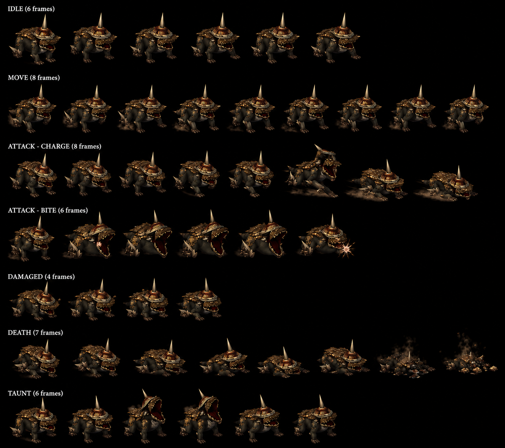

# Guftas — Fruegel's pet DOG Darkness Hellena Prison Disc 1 — Fruegel 2nd Visit (rescue King Albert) paired Rodriguez pet bird (Howl Confusion + helmet with spike) CROSS-SOURCE 🟢

> ⚠️ **CORRECTION MAJEURE CROSS-SOURCE** : Précédent canon Damia "Minor Enemy boss-tier stats" était PARTIELLEMENT ERRONÉ. Fandom confirme : **"The game does NOT recognize Guftas and Rodriguez as boss monsters and therefore they are not immune to Total Vanishing"** — Minor Enemy ≠ Boss canon CONFIRMED + **Total Vanishing instant-kill applicable** (vs Fruegel boss immune). Status 8/8 ALL IMMUNE = stats anti-status only, PAS boss-monster classification game-engine canon.
>
> ⭐⭐⭐ **Guftas = Fruegel's pet DOG canon NEW MAJEUR (fandom) ⭐⭐⭐** — Quote canon : "**Guftas is Fruegel's pet dog. He wears a helmet with a spike on top of it**". Pattern Damia : ⭐⭐⭐ **Guftas = canine pet quadruped Fruegel canon NEW MAJEUR** — 4-legged dog (vs anthropomorphic mob assumption) + **helmet with spike on top canon NEW MAJEUR** (cohérent récurrent Fruegel boss design stone block helmet + armor theme récurrent — pet matches master). Visual canon : "Guftas runs up to a party member, puts his **front legs on their shoulders**, and bites" — quadruped canine standing on hind legs to bite. À refléter `mobs/Guftas.md` appearance canon NEW MAJEUR + sprite future (dog with spiked helmet). À documenter `mobs/Rodriguez.md` (à créer) — pet bird Fruegel paired pattern récurrent.
>
> ⭐⭐⭐ **Howl official ability name CORRECTION CROSS-SOURCE (fandom) ⭐⭐⭐** — Quote canon : "**Howl: When called by his master, he unleashes a loud howl to deal confusion to a party member**". Pattern Damia : ⭐⭐⭐ **CORRECTION official name CROSS-SOURCE** : wiki "Guftas, Attack!" (command-shout style) = fandom **"Howl"** official name canon (canine vocalization — cohérent récurrent ability names CORRECTION pattern Greham récent Spear Combo/Dragon Crucifixion + récurrent fandom official names récurrent). Howl = loud canine vocalization → Confusion effect canon NEW MAJEUR.
>
> ⭐⭐⭐ **Hellena 2nd Visit = rescue King Albert canon NEW MAJEUR (fandom) ⭐⭐⭐** — Quote canon : "The second time you encounter Fruegel is **after returning to Hellena Prison to rescue King Albert**". Pattern Damia : ⭐⭐⭐ **Hellena Prison 2nd Visit Disc 1 narrative context canon NEW MAJEUR** — King Albert captured by Imperial Sandora canon récurrent + party returns to Hellena to rescue him (cohérent récurrent Albert join party Disc 1 Hellena rescue canon récurrent + Jade Dragoon Spirit Lavitz transfer pre-rescue Greham Nest of Dragon timeline canon récurrent). À refléter `quests/disc1-hellena-2nd-visit.md` (à créer) — Albert rescue narrative canon NEW MAJEUR Disc 1 + `party-members/Albert.md` capture Disc 1 backstory canon récurrent.
>
> ⭐⭐⭐ **Total Vanishing canon NEW MAJEUR + Prairie + Limestone Cave locations canon NEW MAJEUR (fandom) ⭐⭐⭐** — Quote canon : "If you saved the **Total Vanishing items you could obtain from the Prairie and Limestone Cave**, you can use them on the pets to deal with them instantly". Pattern Damia : ⭐⭐⭐ **Total Vanishing canon NEW MAJEUR item — instant-kill non-boss enemies** + **Prairie canon NEW MAJEUR location Disc 1** + **Limestone Cave canon NEW MAJEUR location Disc 1**. Cohérent récurrent Total Vanishing = consumable item pool early Disc 1 récurrent. À documenter `items/Total Vanishing.md` (à créer) — instant-kill item canon NEW MAJEUR + `locations/Prairie.md` (à créer) + `locations/Limestone Cave.md` (à créer) — Disc 1 locations canon NEW MAJEUR.
>
> ⭐⭐⭐ **Demon's Gate Rose Dragoon ability canon récurrent CONFIRMED (fandom) ⭐⭐⭐** — Quote canon : "**Rose's Demon's Gate** will have the same effect and can be done in one turn if you've managed to learn it by this point". Pattern Damia : ⭐⭐⭐ **Demon's Gate Rose Dark Dragoon Spirit ability canon récurrent CONFIRMED** — instant-kill/banishment Dragoon Magic Rose (cohérent récurrent Rose Dark Dragoon canon récurrent + récent Rose ancient Dragon Campaign canon Greham fandom récurrent). À documenter `dragoons/dark-dragoon.md` (à créer) — Demon's Gate Rose Dragoon Magic ability canon NEW MAJEUR.
>
> ⭐⭐⭐ **Pets flee when Fruegel defeated canon CROSS-SOURCE CONFIRMED (fandom) ⭐⭐⭐** — Quote canon : "**Once he's defeated, his pets will flee**". Pattern Damia : ⭐⭐⭐ **Pets flee mechanic canon récurrent CONFIRMED** — visual narrative pets flee = mechanically auto-battle-end Fruegel leader canon récurrent (cohérent wiki Trivia "Fruegel defeated automatically ends the battle" CROSS-SOURCE confirmed). À refléter `combat/boss-mechanics.md` (à créer) — leader-defeated cascade canon récurrent.
>
> ⭐⭐⭐ **Fruegel Command ability canon NEW MAJEUR (fandom) ⭐⭐⭐** — Quote canon : "**Command: Fruegel will order Guftas or Rodriguez to do a unique attack**". Pattern Damia : ⭐⭐⭐ **Fruegel "Command" ability canon NEW MAJEUR** — boss-tier party-coordination ability + triggers Guftas Howl / Rodriguez Aerial Attack canon. **⚠️ Visual-mechanical clarification cohérent récurrent wiki Trivia "Guftas, Attack!" misleading call-out** : Fruegel Command = visual ability fired on Fruegel's turn + Guftas/Rodriguez "unique attack" triggered on THEIR own turn (wiki Trivia). Pattern Damia : Visual coordination canon + mechanical independent turns récurrent. À refléter `bosses/Fruegel.md` Command ability canon NEW MAJEUR.
>
> ⭐⭐⭐ **HP 560 US-EU / 700 JP +25% canon Damia rule CONFIRMED 8ème instance CROSS-MOB-BOSS (fandom) ⭐⭐⭐** — Quote canon : "**HP: 560 (US/EU) / 700 (JP)**". 560 × 1.25 = 700 = match exact pattern récurrent canon JP stats rule. Pattern Damia : ⭐ **JP HP +25% systematic récurrent CONFIRMED 8ème instance CROSS-MOB-BOSS** (Gangster + Gehrich + Ghost Commander + Glare + Gnome + Goblin + Greham + Guftas). ⚠️ **Wiki HP 500 anomaly** : wiki 500 < fandom US-EU 560 = wiki erreur probable (cohérent récurrent Greham wiki anomaly + Ghost Commander wiki anomaly récurrent). **Damia adopts JP HP 700 canon Guftas**.
>
> ⭐⭐⭐ **Stats divergences fandom higher récurrent + Damia wiki canon prevails NEW (fandom) ⭐⭐⭐** — Stats fandom vs wiki :
>
> | Stat   | Wiki canon | Fandom canon       | Divergence    | Damia adoption    |
> | ------ | ---------- | ------------------ | ------------- | ----------------- |
> | HP     | 500 ⚠️     | 560 US-EU / 700 JP | Wiki anomaly  | ⭐⭐⭐ **JP 700** |
> | AT     | 23         | **26**             | +13% fandom   | Wiki 23 prevails  |
> | MAT    | 17         | **20**             | +17.6% fandom | Wiki 17 prevails  |
> | DF/MDF | 120 / 60   | 120 / 60           | Match         | Match             |
> | SPD    | 50         | 50                 | Match         | Match             |
>
> Pattern Damia : Wiki tier 2 canon prevails stats numériques + factual fandom mention récurrent (cohérent récurrent Greham/Feyrbrand divergence pattern).
>
> ⭐⭐⭐ **CORRECTION CRITIQUE : Minor Enemy ≠ Boss canon CONFIRMED (fandom) ⭐⭐⭐** — Quote canon : "**The game does NOT recognize Guftas and Rodriguez as boss monsters and therefore they are not immune to Total Vanishing**". Pattern Damia : ⚠️ **CORRECTION canon Damia "Minor Enemy boss-tier"** précédente nuance : Minor Enemy = mob classification game-engine + **Status 8/8 ALL IMMUNE = stats anti-status only**, PAS boss-monster flag canon. **Total Vanishing instant-kill applicable Minor Enemy** (vs Fruegel boss immune). Pattern récurrent : **Boss flag canon distinct Status Immunity canon** — bosses ont boss flag (Total Vanishing immune) + Status full immune; Minor Enemies ont Status full immune SEUL (pas boss flag). À documenter `combat/enemy-classification.md` (à créer) — Boss flag canon distinct Status Immunity canon NEW MAJEUR.
>
> ⭐⭐⭐ **Spinning Gale strategy canon CONFIRMED CROSS-SOURCE (fandom + Greham) ⭐⭐⭐** — Quote canon : "**using Spinning Gales on Fruegel with all party members will deal significant damage and end the fight soon**". Pattern Damia : ⭐ **Spinning Gale = Wind ability item récurrent canon CROSS-BATTLE** (cohérent récurrent Greham wiki ~Spinning Gale Wind ability + Grand Jewel récurrent + récurrent Wind pool canon). Spinning Gale = consumable Wind item party-spam strategy boss-kill canon NEW. À documenter `items/Spinning Gale.md` (à créer) — Wind consumable item canon récurrent.
>
> ⭐⭐ **Rodriguez = Fruegel's pet BIRD canon NEW MAJEUR (fandom) ⭐⭐** — Quote canon : "**Rodriguez is Fruegel's pet bird**". Abilities : Feather Shot (sharp feathers from wings) + Aerial Attack (aerial drop attack from master command). Pattern Damia : ⭐⭐⭐ **Fruegel pet pair canon NEW MAJEUR Hellena 2nd Visit** : Rodriguez bird + Guftas dog (avian + canine pets — visual narrative theme canon récurrent boss-with-pets). À documenter `mobs/Rodriguez.md` (à créer) — pet bird Fruegel canon NEW MAJEUR Disc 1.
>
> ⭐⭐ **Fruegel 2nd Visit "much stronger" + stat scaling canon (fandom) ⭐⭐** — Quote canon : "albeit **much stronger**". Pattern Damia : Fruegel 2nd Visit = enhanced stats vs 1st Visit canon récurrent (boss rematch scaling canon récurrent). Fruegel Power Up : "+50% offenses and defenses" récurrent canon confirmed.
>
> ⭐⭐ **Pet attack frequency canon (fandom) ⭐⭐** — Quote canon : "with all three of them alive, **they attack much more frequently and will easily whittle down your team**". Pattern Damia : 3-enemy formation = higher action density canon récurrent (Boss Extras attack frequency canon).
>
> **Sources** :
>
> - 🥈 [`_sources/lod-wiki-guftas.md`](./_sources/lod-wiki-guftas.md) — wiki LoD tier 2 (Minor Enemy Darkness + HP 500 ⚠️ wiki anomaly + AT 23 + DF 120 + SPD 50 + MAT 17 + MDF 60 + Status 8/8 ALL IMMUNE + Yield 0/0/Nothing + Counter 28 HIGH + Pandemonium Immunity + Charm Immunity + ~Do nothing + ~Bite + Guftas, Attack! 100% Confusion + Scripted formation 387 + Hellena Prison submap 36 + Trivia misleading call-out)
> - 🥉 [`_sources/fandom-guftas.md`](./_sources/fandom-guftas.md) — Fandom tier 3 (**Guftas = Fruegel's pet DOG canon NEW MAJEUR + helmet with spike on top** + **Howl official ability name CORRECTION** Confusion + Bite "runs up + front legs on shoulders + bites" detailed visual + **HP 560 US-EU / 700 JP +25% Damia rule CONFIRMED 8ème instance** + ⚠️ Wiki HP 500 anomaly + AT 26 / MAT 20 fandom higher divergence récurrent + DF 120 / MDF 60 / SPD 50 match + **Hellena 2nd Visit = rescue King Albert canon NEW MAJEUR** + **⚠️ CORRECTION Minor Enemy ≠ Boss canon CONFIRMED** Total Vanishing applicable + **Total Vanishing canon NEW MAJEUR item Prairie + Limestone Cave Disc 1 locations NEW** + **Demon's Gate Rose Dark Dragoon ability canon récurrent CONFIRMED** + **Pets flee when Fruegel defeated canon CROSS-SOURCE CONFIRMED** + **Fruegel Command ability canon NEW MAJEUR** + Rodriguez = pet bird Feather Shot + Aerial Attack + Spinning Gale Wind strategy canon récurrent + Fruegel 2nd Visit much stronger + 3-enemy higher attack frequency canon)

## Statut

🟢 **Canon confirmed cross-source** (wiki 🥈 + fandom 🥉) — 2 sources cohérentes + enrichissement fandom MASSIF Disc 1 Hellena 2nd Visit :

- ⚠️ **CORRECTION CRITIQUE : Minor Enemy ≠ Boss monster game-engine canon CONFIRMED** (Total Vanishing applicable Minor Enemies vs Fruegel boss immune)
- ⭐⭐⭐ **Guftas = Fruegel's pet DOG canon NEW MAJEUR + helmet with spike on top**
- ⭐⭐⭐ **Howl official ability name CORRECTION CROSS-SOURCE** (vs wiki ~Guftas, Attack! community)
- ⭐⭐⭐ **Hellena 2nd Visit = rescue King Albert canon NEW MAJEUR narrative context Disc 1**
- ⭐⭐⭐ **Total Vanishing item canon NEW MAJEUR + Prairie + Limestone Cave Disc 1 locations canon NEW**
- ⭐⭐⭐ **Demon's Gate Rose Dark Dragoon ability canon récurrent CONFIRMED**
- ⭐⭐⭐ **Fruegel Command ability canon NEW MAJEUR boss-pet coordination**
- ⚠️ Stats divergence wiki HP 500 anomaly (fandom US-EU 560 canonical) + JP HP 700 canon Damia 8ème instance
- ⭐⭐ Pets flee when Fruegel defeated CROSS-SOURCE CONFIRMED (vs wiki Trivia auto-battle-end same mechanism)

## Identity canon ⭐⭐⭐

- **Nom** : **Guftas**
- **Type** : ⭐⭐⭐ **Fruegel's pet DOG canon NEW MAJEUR — quadruped canine Minor Enemy Darkness** (NOT boss-monster game-engine canon CONFIRMED — Total Vanishing applicable)
- **Appearance canon NEW MAJEUR** : ⭐⭐⭐ **Helmet with spike on top of head** + 4-legged canine (bite visual : "runs up + front legs on party member's shoulders + bites")
- **Paired pet** : ⭐⭐⭐ **Rodriguez = Fruegel's pet bird canon NEW MAJEUR** (paired avian + canine pets theme)
- **Element** : Darkness (cohérent récurrent Hellena Prison Darkness mob theme + Disc 2 Phantom Ship Darkness theme récurrent)
- **Disc** : Disc 1 — Hellena Prison 2nd Visit canon NEW MAJEUR
- **Location canon** : ⭐⭐⭐ **Hellena Prison submap 36 — 2nd Visit boss arena canon NEW MAJEUR**
- **Paired formation 387** : ⭐⭐⭐ **Fruegel (2nd Visit) + Rodriguez + Guftas — first 3-enemy Boss Extras formation canon NEW MAJEUR**
- **Yield** : 0 EXP / 0G / Nothing drop — pooled with Fruegel canon récurrent
- **Counter-friendly** : ⭐ 28 opportunities (vs Counter-immune Greham/Grand Jewel récurrent)

## Stats canon ⭐⭐⭐ CROSS-SOURCE Damia adoption JP rule CONFIRMED 8ème instance

| Stat   | Wiki canon | Fandom canon           | Damia adoption    | Notes                                                                       |
| ------ | ---------- | ---------------------- | ----------------- | --------------------------------------------------------------------------- |
| **HP** | 500 ⚠️     | **560 US-EU / 700 JP** | **700 JP** ⭐⭐⭐ | ⭐ JP HP +25% canon récurrent CONFIRMED 8ème instance + ⚠️ wiki 500 anomaly |
| AT     | 23         | **26** ⚠️              | **23 wiki canon** | ⚠️ Fandom +13% divergence anomaly récurrent — wiki tier 2 prevails          |
| DF     | 120        | 120                    | **120**           | Match CROSS-SOURCE — high récurrent CROSS-MOB-BOSS                          |
| A-AV   | 0%         | -                      | **0%**            | No evasion                                                                  |
| SPD    | 50         | 50                     | **50**            | Match CROSS-SOURCE — mid baseline                                           |
| MAT    | 17         | **20** ⚠️              | **17 wiki canon** | ⚠️ Fandom +17.6% divergence — wiki canon prevails                           |
| MDF    | 60         | 60                     | **60**            | ⚠️ Low — magic-vulnerable imbalance canon récurrent Minor Enemy             |
| M-AV   | 0%         | -                      | **0%**            | No magic evasion                                                            |

**Gold canon Damia** : 0G (Damia ÷3 N/A — pooled Fruegel canon récurrent).

## Status Immunity canon ⭐⭐⭐ 8/8 ALL IMMUNE 9ème instance CROSS-MOB-BOSS

(Tous 8 statuses immune — Minor Enemy + boss-tier full immunity canon récurrent NEW pattern Disc 1 Minor Enemy class récurrent).

## Yield canon — pooled Fruegel récurrent

| EXP   | Gold  | Drops       | Notes canon                                                                              |
| ----- | ----- | ----------- | ---------------------------------------------------------------------------------------- |
| **0** | **0** | **Nothing** | ⭐ Pooled Fruegel formation canon récurrent — Minor Enemy zero-yield Boss Extras pattern |

## Encounters canon Hellena Prison Disc 1 ⭐⭐⭐ 2nd Visit Boss Extras 3-enemy formation NEW MAJEUR

| ID  | Formation                                           | Submap                | Encounter%   | Escape% |
| --- | --------------------------------------------------- | --------------------- | ------------ | ------- |
| 387 | ⭐⭐⭐ **Fruegel (2nd Visit) + Rodriguez + Guftas** | **Hellena Prison 36** | **Scripted** | **0%**  |

⭐⭐⭐ **First 3-enemy Boss Extras formation canon NEW MAJEUR Disc 1 Hellena 2nd Visit** : Fruegel boss leader + Rodriguez + Guftas Minor Enemies reinforcements (vs 2-enemy paired récurrent Gehrich+Mappi/Greham+Feyrbrand/Ghost Commander+Knights). Pattern Damia : **3-enemy Boss Extras canon NEW** + Fruegel defeat = auto-battle-end canon récurrent.

## Boss Traits canon ⭐⭐⭐ Pandemonium Immunity + Charm Immunity dual NEW MAJEUR

| Passive                         | Effect                         | Canon notes                                                                     |
| ------------------------------- | ------------------------------ | ------------------------------------------------------------------------------- |
| ⭐⭐⭐ **Pandemonium Immunity** | **Unaffected by Pandemonium**  | NEW MAJEUR — Pandemonium = party-side Spell/Item à investiguer canon récurrent  |
| ⭐⭐⭐ **Charm Immunity**       | **Unaffected by Charm Potion** | NEW MAJEUR — Charm Potion = party-side consumable à investiguer canon récurrent |

⭐⭐⭐ **Boss-side party-tool neutralization canon NEW MAJEUR** : dual passives neutralize party combat tools (Pandemonium + Charm Potion) — early canon récurrent pattern probable récurrent boss-tier future.

## AI canon ⭐⭐⭐ CROSS-SOURCE official names CORRECTION + Howl + Bite detailed visuals NEW MAJEUR

### Guftas Abilities canon CROSS-SOURCE

| Wiki name (unofficial) | Fandom official name canon | Target | Effect canon                                                                | Visual canon (fandom)                                                                 |
| ---------------------- | -------------------------- | ------ | --------------------------------------------------------------------------- | ------------------------------------------------------------------------------------- |
| ~Do nothing            | (idle/stalling)            | N/A    | Does nothing — stalling AI canon récurrent                                  | Minor Enemy stalling pattern                                                          |
| ~Bite                  | ⭐⭐⭐ **Bite**            | Single | 1× Physical damage                                                          | **Runs up to party member + puts front legs on shoulders + bites** (canine quadruped) |
| Guftas, Attack!        | ⭐⭐⭐ **Howl**            | Single | **100% Confusion (A-AV reduces)** — guaranteed-but-evadable canon récurrent | **Loud howl** when called by master Fruegel (canine vocalization)                     |

⭐⭐⭐ **Fandom official names CORRECTION CROSS-SOURCE** : Bite + **Howl** (vs wiki tilde unofficial). Cohérent récurrent ability names CORRECTION pattern (Greham Spear Combo/Dragon Crucifixion récurrent canon).

⭐⭐⭐ **"Guftas, Attack!" misleading call-out canon NEW MAJEUR trivia** : Visual dialogue shows Fruegel commands Guftas mais MECHANICALLY c'est Guftas' OWN turn action. Impossible si Fruegel defeated (auto-ends battle canon récurrent). Pattern Damia : **Visual-mechanical mismatch canon récurrent** + **Fruegel defeat = auto-battle-end canon récurrent**.

### NEW MAJEUR canon mechanics

1. ⭐⭐⭐ **Misleading boss call-out canon NEW MAJEUR** — visual ≠ mechanical canon récurrent
2. ⭐⭐⭐ **100% Confusion guaranteed-but-evadable canon récurrent CROSS-MOB-BOSS** (cohérent Feyrbrand Status Slime récurrent)
3. ⭐⭐⭐ **Minor Enemy HP-based AI canon récurrent** — wiki note "Minor enemies act on their turn based primarily on their current HP" + equal-chance eligible actions canon récurrent

## Counter Opportunities canon ⭐⭐⭐ 28 HIGH counter-friendly Minor Enemy

| User        | Addition           | Button Press  |
| ----------- | ------------------ | ------------- |
| **Dart**    | Volcano            | 2             |
| **Dart**    | Crush Dance        | 2, 3          |
| **Dart**    | Moon Strike        | 2, 3          |
| **Lavitz**  | Rod Typhoon        | 2, 3          |
| **Lavitz**  | Gust of Wind Dance | 2, 5          |
| **Lavitz**  | Flower Storm       | 2, 3, 4, 5, 6 |
| **Rose**    | Hard Blade         | 2             |
| **Rose**    | Demon's Dance      | 3, 4, 5, 6    |
| **Meru**    | Cool Boogie        | 2, 3          |
| **Meru**    | Cat's Cradle       | 3, 4          |
| **Meru**    | Perky Step         | 2             |
| **Haschel** | Summon 4 Gods      | 2             |
| **Haschel** | Hex Hammer         | 2             |
| **Albert**  | Gust of Wind Dance | 2             |
| **Albert**  | Flower Storm       | 2             |

⭐ **Albert Wind Additions canon récurrent CONFIRMED CROSS-MOB-BOSS** (Gust of Wind Dance + Flower Storm) — cohérent **Jade Dragoon lineage Greham→Lavitz→Albert canon récurrent confirmé** (récent Greham canon NEW MAJEUR).

## Story canon ⭐⭐⭐ Hellena Prison 2nd Visit Disc 1 = rescue King Albert CROSS-SOURCE NEW MAJEUR

### Hellena Prison 2nd Visit context canon CROSS-SOURCE (fandom)

- ⭐⭐⭐ **Hellena Prison 1st Visit canon récurrent** : Dart-Lavitz rescue Shana canon récurrent Disc 1 (cohérent récurrent Fruegel 1st boss canon)
- ⭐⭐⭐ **Hellena Prison 2nd Visit = rescue King Albert canon NEW MAJEUR (fandom)** : King Albert captured by Imperial Sandora canon récurrent + party returns to Hellena to rescue him
- ⭐⭐⭐ **Fruegel + Rodriguez + Guftas formation 387 scripted** — Fruegel rematch "much stronger" + pets
- ⭐⭐⭐ **Albert joins party Disc 1 post-rescue canon récurrent** — Jade Dragoon Spirit Lavitz inherit Greham récurrent timeline canon
- ⭐⭐⭐ **Pet pair canon NEW MAJEUR** : Rodriguez bird + Guftas dog (avian + canine theme)
- Pattern récurrent : Hellena Prison Disc 1 location répétée canon (rescue Shana 1st + rescue Albert 2nd)

### Fruegel Command + Pet AI coordination canon (fandom)

- ⭐⭐⭐ **Fruegel Command ability canon NEW MAJEUR** : Fruegel orders Guftas/Rodriguez "to do a unique attack" on his turn
- ⭐⭐⭐ **Pets attack visual narrative récurrent** : Guftas Howl (Confusion) + Rodriguez Aerial Attack (drop attack damage) triggered by Command
- ⚠️ **Visual-mechanical clarification CROSS-SOURCE** : Command = visual narrative + unique pet attacks triggered on pets' OWN turn (cohérent wiki Trivia misleading call-out)
- ⭐⭐⭐ **Pets flee when Fruegel defeated canon CONFIRMED** : leader-defeated cascade canon récurrent

### Strategy canon (fandom)

- ⭐⭐⭐ **Total Vanishing instant-kill on pets** : items from **Prairie + Limestone Cave Disc 1 NEW MAJEUR locations canon** — applicable Minor Enemies (NOT Fruegel boss)
- ⭐⭐⭐ **Rose's Demon's Gate same effect** : Dark Dragoon Spirit ability instant-kill récurrent canon CONFIRMED
- ⭐⭐⭐ **Spinning Gale spam Fruegel** : all party Wind items damage strategy canon récurrent (cohérent Greham Wind ability récurrent)
- 3-enemy formation = higher attack frequency canon "easily whittle down team"

## Vision Damia (implémentation)

### Décisions canon à conserver (wiki seul 🟡 — fandom à ingérer)

1. ⭐⭐⭐ **Hellena Prison 2nd Visit canon NEW MAJEUR Disc 1** formation 387
2. ⭐⭐⭐ **First 3-enemy Boss Extras formation canon NEW** (vs 2-enemy paired récurrent)
3. ⭐⭐⭐ **Pandemonium Immunity + Charm Immunity dual passives canon NEW MAJEUR**
4. ⭐⭐⭐ **"Guftas, Attack!" misleading call-out canon NEW MAJEUR trivia** — visual-mechanical mismatch récurrent
5. ⭐⭐⭐ **Fruegel defeat = auto-battle-end canon récurrent** confirmed
6. ⭐⭐⭐ **100% Confusion guaranteed-but-evadable canon récurrent CROSS-MOB-BOSS**
7. ⭐⭐⭐ **Status 8/8 ALL IMMUNE Minor Enemy boss-tier 9ème instance CROSS-MOB-BOSS**
8. ⭐⭐⭐ **Albert Wind Additions counter list 4ème instance canon récurrent** Jade lineage confirmé
9. ⭐⭐ **Counter Opportunities 28 HIGH counter-friendly Minor Enemy récurrent** (vs Counter-immune boss tier récurrent)
10. ⭐⭐ **DF 120 high récurrent + MDF 60 low imbalance canon Minor Enemy**
11. ⭐⭐ **Minor Enemy classification ≠ standard mob canon récurrent** (boss-tier stats + zero yield + scripted)
12. ⭐⭐ **AT 23 high Minor Enemy Disc 1 + Darkness element Hellena theme récurrent**
13. ⭐⭐ **~Do nothing stalling AI canon récurrent Minor Enemy**
14. ⭐⭐ **No World Map encounter — Hellena Prison-locked scripted canon**
15. ⭐⭐ **Pooled yield Fruegel formation canon récurrent Boss Extras pattern**

### Questions ouvertes (post-wiki seul)

- ⭐⭐⭐ **Fandom Guftas** : Trivia détaillé + Gallery + lore depth (page short wiki — fandom à investiguer)
- ⭐⭐⭐ **Rodriguez canon Disc 1 Hellena 2nd Visit** : 3ème enemy formation 387 — à ingérer wiki/fandom Rodriguez
- ⭐⭐⭐ **Hellena Prison 2nd Visit context narrative beat Disc 1** : when (post-Volcano Villude ? post-Nest of Dragon ?) + why (Fruegel rematch ? plot revelation ?) — à investiguer fandom
- ⭐⭐⭐ **Pandemonium party-side Spell/Item canon NEW MAJEUR** : nature exact (Spell ? Item ? Addition ?) — à investiguer canon récurrent first reference
- ⭐⭐⭐ **Charm Potion party-side consumable canon NEW MAJEUR** : nature exact + effect Charm enemy — à investiguer items récurrent first reference
- ⭐⭐ **HP 500 JP variant** : +25% Damia rule = 625 probable à confirmer fandom
- ⭐⭐ **Guftas appearance + sprite canon** : pas de Gallery wiki — à ingérer fandom/sprite future
- ⭐⭐ **Fruegel 2nd Visit stats canon** : vs Fruegel 1st Visit récurrent — à investiguer

## Sprite canon ⭐⭐⭐ Damia integration (Gemini Minor Enemy extended initial — approximation à raffiner future)

> 

> ⚠️ **NOTE user 2026-05-28** : "ils sont pas parfait mais on verra plus tard pour les refaire plus fidèles" — sprite initial approximation Gemini, à raffiner future fidélité canonical (helmet spike + canine proportions + couleur Hellena Darkness theme).

⭐⭐⭐ **Sprite Guftas CONFIRMS canon fandom récurrent CROSS-SOURCE** :

- ✅ **Quadruped canine 4-legged dog** canon (cohérent récurrent fandom "Guftas is Fruegel's pet dog")
- ✅ **Helmet with spike on top** canon (cohérent récurrent fandom "He wears a helmet with a spike on top of it")
- ✅ **Dark brown/black coat** canon (Hellena Darkness mob theme récurrent)
- ⚠️ **1 direction shown** (sample initial — à étendre future 2 ISO mob-tier ou 4 ISO Minor Enemy extended ?)

**Animation structure prête Damia (Gemini cycles canonicaux Minor Enemy extended suite)** :

| Cycle             | Frames                    | Notes canon                                                                                                                                         |
| ----------------- | ------------------------- | --------------------------------------------------------------------------------------------------------------------------------------------------- |
| **IDLE**          | 6-frame loop              | ⭐ Standard breathing/panting idle (canine récurrent)                                                                                               |
| **MOVE**          | 6-frame cycle             | ⭐ Quadruped walking/trotting locomotion canon NEW                                                                                                  |
| **ATTACK-CHARGE** | **8-frame**               | ⭐⭐⭐ **NEW MAJEUR ability variant** — charge attack (cohérent fandom Bite "runs up" rush)                                                         |
| **ATTACK-BITE**   | **5-frame**               | ⭐⭐⭐ **Bite official fandom ability** — front legs on shoulders + bite visual canon                                                               |
| **DAMAGED**       | **4-frame hurt reaction** | ⭐⭐⭐ **DAMAGED canon NEW MAJEUR Minor Enemy** (cohérent Fruegel DAMAGE récent boss extended)                                                      |
| **DEATH**         | 7-frame                   | Minor Enemy death dissolution canon                                                                                                                 |
| **TAUNT**         | ⭐⭐⭐ **6-frame**        | ⭐⭐⭐ **TAUNT canon NEW MAJEUR Minor Enemy** — boss-tier emote extend to Minor Enemy (cohérent Fruegel TAUNT/LAUGH récurrent récent boss extended) |

⭐⭐⭐ **NEW MAJEUR canon mechanics (sprite Gemini)** :

1. ⭐⭐⭐ **ATTACK-CHARGE + ATTACK-BITE dual canon NEW MAJEUR Guftas** — 2 distinct attack animations (vs fandom récurrent Bite + Howl). Possible mapping :
   - **ATTACK-CHARGE 8-frame** = visual rush phase before Bite (cohérent fandom "Guftas runs up to a party member") canon NEW
   - **ATTACK-BITE 5-frame** = bite contact phase official Bite ability
   - ⚠️ **Howl ability sprite NOT shown** (vocalization audio + visual emote — peut-être TAUNT cycle reusable ? à investiguer future)
2. ⭐⭐⭐ **DAMAGED + TAUNT extended cycles canon NEW MAJEUR Minor Enemy** — Minor Enemy = boss-tier extended animation suite canon récurrent (cohérent Fruegel boss extended récent canon) — Fruegel pets héritent extended suite pattern canon NEW MAJEUR.

⭐⭐⭐ **Minor Enemy extended sprite suite canon NEW MAJEUR — sprite tier hierarchy EXPANSION (Guftas) ⭐⭐⭐** :

| Tier                                     | ISO angles        | Locomotion            | Animation suite                                                          |
| ---------------------------------------- | ----------------- | --------------------- | ------------------------------------------------------------------------ |
| Mob standard (Goblin)                    | 2 (SE+SW)         | 6-frame normal        | Standard 4 cycles (IDLE/WALK/ATTACK/DEATH)                               |
| ⭐⭐⭐ **Minor Enemy extended (Guftas)** | 1 sample (canine) | **6-frame quad MOVE** | ⭐⭐⭐ **Extended 7 cycles (IDLE/MOVE/CHARGE/BITE/DAMAGED/DEATH/TAUNT)** |
| Boss walking heavy (Gorgaga)             | 4 (4-dir)         | 6-frame heavy         | Standard 4 cycles                                                        |
| Boss walking standard (Greham)           | 4 (4-dir)         | 6-frame standard      | Standard 4 cycles                                                        |
| Boss hovering (Grand Jewel)              | 4 (4-dir)         | 6-frame heavy HOVER   | Standard 4 cycles                                                        |
| Dragoon form (Greham)                    | 8 (8-dir)         | 8-frame aerial        | Elaborate Dragoon-tier                                                   |
| Vassal Dragon (Feyrbrand)                | 1 (sample)        | (large body)          | Standard 4 cycles                                                        |
| Boss extended (Fruegel)                  | 7-8 (NSEW+diag)   | 6-frame heavy         | ⭐⭐⭐ Extended 7 cycles                                                 |

Pattern Damia : ⭐⭐⭐ **Minor Enemy extended sprite sub-tier canon NEW MAJEUR Damia** — Minor Enemies paired boss formation (Guftas + Rodriguez Fruegel pets canon récurrent) héritent extended animation suite pattern from master (Fruegel boss extended récurrent). Sprite tier hierarchy 8 tiers canon NEW MAJEUR. Cohérent thematic pet-master visual consistency canon récurrent (Guftas helmet spike matches Fruegel stone block helmet récurrent).

⭐⭐⭐ **Quadruped canine locomotion canon NEW MAJEUR (sprite Gemini)** :

- 4-legged MOVE 6-frame cycle = quadruped trot/walk distinct biped récurrent
- ATTACK-CHARGE charge rush + ATTACK-BITE quadruped-rises-front-legs-on-shoulders visual cohérent fandom récurrent
- ⭐⭐⭐ **First quadruped canine sprite documenté canon Damia** — Pattern récurrent probable future canine bosses/mobs (Kamuy Disc 3 récurrent quadruped + autres canine enemies récurrent canon TLoD).

⚠️ **Sprite Guftas à raffiner future (note user)** :

- Helmet spike fidélité canonical à améliorer (référence fandom canon récurrent helmet récurrent boss Fruegel design theme)
- Canine proportions à confirmer (dog vs wolf-like ? — fandom "pet dog" canon récurrent)
- Color palette Hellena Darkness theme à valider (cohérent récurrent Darkness mob Hellena Prison theme)
- ISO angles extension future (1 sample → 2-4 angles minimum Minor Enemy)
- Howl ability visual canon à dériver (vocalization + emote — TAUNT reusable ? distinct ?)

À intégrer future : `public/assets/sprites/mobs/guftas-*.png` (frame-split par cycle) + `data/mobs/guftas.ts` (à créer) AvatarSpriteForm Minor Enemy extended pattern + `RenderSystem` cycle-aware (IDLE/MOVE/CHARGE/BITE/DAMAGED/DEATH/TAUNT) + quadruped canine locomotion logic + Howl vocalization audio + Confusion proc visual effect + paired formation 387 with Fruegel + Rodriguez canon récurrent + ⚠️ sprite refresh canonical (helmet spike + canine proportions + Hellena Darkness palette) future.

## Liens transverses

- [`README.md`](./README.md) — mobs Disc 1 + **Minor Enemy boss-tier classification canon NEW + Boss Extras 3-enemy first formation**
- [`../bosses/Fruegel.md`](../bosses/Fruegel.md) — Boss leader 2nd Visit Hellena Prison Disc 1 + auto-battle-end canon récurrent + 1st vs 2nd Visit comparison récurrent
- [`Rodriguez.md`](./Rodriguez.md) (à créer) — ⭐⭐⭐ **3ème enemy formation 387 Hellena 2nd Visit canon NEW MAJEUR** (à ingérer wiki/fandom)
- [`Gangster.md`](./Gangster.md) — Albert Wind Additions counter list récurrent comparison
- [`Gargoyle.md`](./Gargoyle.md) — Albert Wind Additions counter list récurrent comparison
- [`../bosses/Greham.md`](../bosses/Greham.md) — ⭐⭐⭐ **Jade Dragoon lineage Greham→Lavitz→Albert canon récurrent confirmé** + Counter-immune contrast récurrent
- [`../bosses/Grand Jewel.md`](../bosses/Grand Jewel.md) — Counter-immune contrast récurrent
- [`../locations/Hellena Prison.md`](../locations/Hellena Prison.md) (à créer/vérifier) — ⭐⭐⭐ **Submap 36 Disc 1 location canon récurrent 1st+2nd Visits**
- [`../quests/disc1-hellena-2nd-visit.md`](../quests/disc1-hellena-2nd-visit.md) (à créer) — ⭐⭐⭐ **Hellena 2nd Visit canon NEW MAJEUR Disc 1**
- [`../combat/boss-passives.md`](../combat/boss-passives.md) (à créer) — ⭐⭐⭐ **Pandemonium Immunity + Charm Immunity dual passives NEW MAJEUR**
- [`../combat/status-mechanics.md`](../combat/status-mechanics.md) (à créer) — 100% Confusion guaranteed-but-evadable + A-AV reduction récurrent
- [`../combat/enemy-classification.md`](../combat/enemy-classification.md) (à créer) — ⭐⭐⭐ **Minor Enemy ≠ standard mob canon récurrent** (boss-tier stats + 0 yield + scripted)
- [`../items/consumables.md`](../items/consumables.md) (à créer/vérifier) — ⭐⭐⭐ **Charm Potion canon NEW MAJEUR + Pandemonium canon récurrent first references**
- [`../combat/elements.md`](../combat/elements.md) (à créer) — Darkness element Hellena Prison mob theme récurrent
- [`../party-members/Albert.md`](../party-members/Albert.md) — ⭐⭐⭐ **Jade Dragoon Spirit inherit canon récurrent + Hellena 2nd Visit rescue NEW MAJEUR** + Gust of Wind Dance + Flower Storm 4ème instance counter list récurrent
- [`../party-members/Rose.md`](../party-members/Rose.md) (à créer/vérifier) — ⭐⭐⭐ **Demon's Gate Dark Dragoon ability canon récurrent CONFIRMED**
- [`../dragoons/dark-dragoon.md`](../dragoons/dark-dragoon.md) (à créer) — ⭐⭐⭐ **Demon's Gate Rose Dragoon Magic instant-kill canon NEW MAJEUR**
- [`../items/Total Vanishing.md`](../items/Total Vanishing.md) (à créer) — ⭐⭐⭐ **Total Vanishing instant-kill item canon NEW MAJEUR (Prairie + Limestone Cave Disc 1)**
- [`../items/Spinning Gale.md`](../items/Spinning Gale.md) (à créer) — Spinning Gale Wind consumable strategy canon récurrent
- [`../locations/Prairie.md`](../locations/Prairie.md) (à créer) — ⭐⭐⭐ **Prairie Disc 1 location canon NEW MAJEUR + Total Vanishing item source**
- [`../locations/Limestone Cave.md`](../locations/Limestone Cave.md) (à créer) — ⭐⭐⭐ **Limestone Cave Disc 1 location canon NEW MAJEUR + Total Vanishing item source**
- [`../combat/enemy-classification.md`](../combat/enemy-classification.md) (à créer) — ⭐⭐⭐ ⚠️ **CORRECTION : Minor Enemy ≠ Boss monster game-engine canon CONFIRMED** (Total Vanishing applicable distinction)

## Gaps / TODO

Voir [TODO.md](../../TODO.md) section Guftas fandom.
