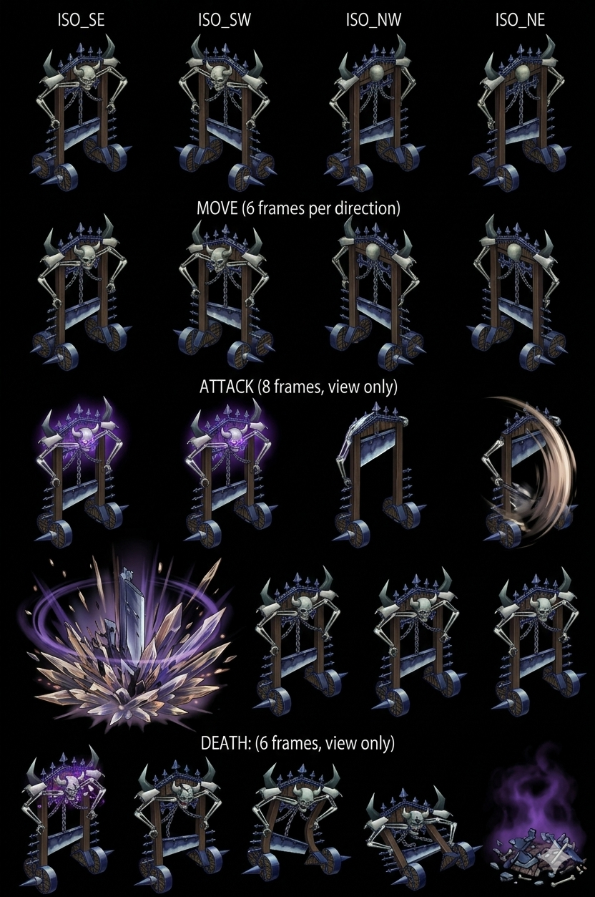
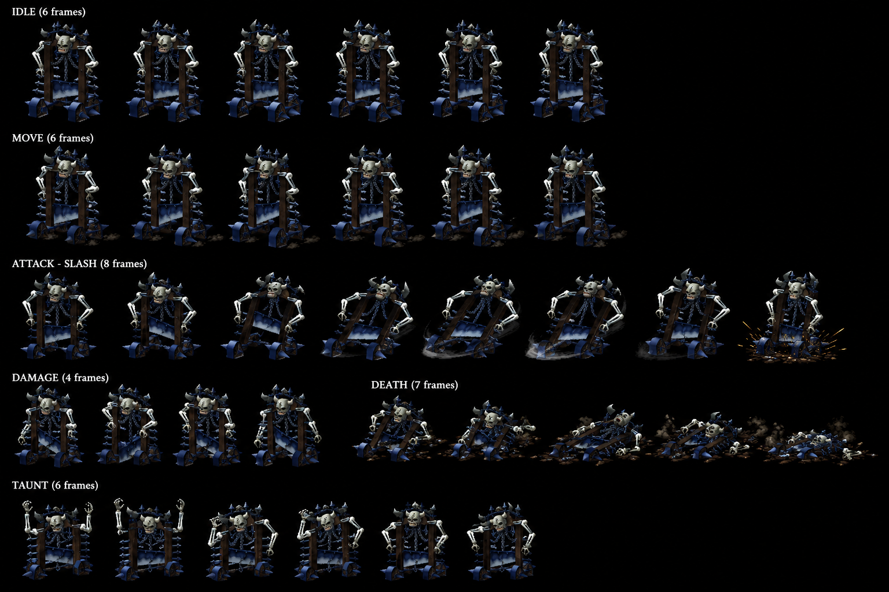

# Guillotine — Sentient guillotine apparatus Darkness Zenebatos Law City Disc 4 — Midnight Terror PARTY-WIDE Fear AoE + Guile Edge rolling blade + horned undead torso construct CROSS-SOURCE 🟢

> ⭐⭐⭐ **Guillotine appearance canon NEW MAJEUR (fandom) ⭐⭐⭐** — Quote canon : "**apparatus designed for beheading people**: this particular contraption has **wheels** and is **animated by dark magic or due to an evil spirit**. On the top of this object, a **heavy and large blade rests, prepared to fall upon its next victim**. This guillotine has **several spikes along each side and many on the uppermost rim**. **Several chains can be seen hanging off this structure**. A **horned skeleton-like torso is fused into the top of the guillotine and launches the blade onto its foes**". Pattern Damia : ⭐⭐⭐ **Guillotine = mobile sentient guillotine apparatus canon NEW MAJEUR** — wheeled execution device + dark magic/evil spirit animated + spiked rim + chains + horned undead torso fused on top (launches blade). Confirms my probable visual canon "sentient guillotine blade-machine" récent. Cohérent récurrent Wingly Law City execution-themed mob pool canon récurrent. À refléter `mobs/Guillotine.md` appearance canon NEW MAJEUR + sprite future (wheeled guillotine + horned undead torso fusion + chains + spikes).
>
> ⭐⭐⭐ **Guile Edge official ability name CORRECTION CROSS-SOURCE + rolling blade visual NEW MAJEUR (fandom) ⭐⭐⭐** — Quote canon : "**Guile Edge — Rolls towards an individual target, smashing down upon them with its blade dealing high physical damage**". Pattern Damia : ⭐⭐⭐ **CORRECTION official name CROSS-SOURCE** : wiki "~Guillotine" (community approximation) = fandom **"Guile Edge"** official name canon. Visual canon NEW MAJEUR : **rolling charge toward target + blade smash downward** (cohérent récurrent wheels appearance canon + heavy blade canon). Cohérent récurrent ability names CORRECTION pattern fandom (Greham Spear Combo/Dragon Crucifixion + Guftas Howl récurrent récent). À refléter `combat/boss-abilities.md` Guile Edge official name + rolling blade attack canon NEW MAJEUR.
>
> ⭐⭐⭐ **⚠️ MAJOR DIVERGENCE : Midnight Terror PARTY-WIDE AoE Fear canon (fandom vs wiki single) ⭐⭐⭐** — Quote canon : "**Fear upon all targets simultaneously**" + "**given probability to inflict all targets with Fear upon hit**" + "even if it is alone since it will strike hard then". Pattern Damia : ⭐⭐⭐ ⚠️ **DIVERGENCE MAJEURE wiki vs fandom** : wiki "Single target" / fandom **"All targets simultaneously"** party-wide AoE Fear. **Damia adopts fandom canon party-wide AoE Fear** — cohérent récurrent fandom = actual gameplay behavior vs wiki = static reference (récurrent canon pattern). Pattern : **AoE party-wide Fear caster boss-tier Minor Enemy canon NEW MAJEUR** — Guillotine = AoE threat même solo encounter. À refléter `combat/status-mechanics.md` AoE Fear party-wide canon NEW MAJEUR.
>
> ⭐⭐⭐ **"Construct with undead torso" lore-justified Status Immunity canon NEW MAJEUR (fandom) ⭐⭐⭐** — Quote canon : "Due to it **not being a standard living monster and instead a construct with an undead torso attached to it**, all status ailments are impossible to hit". Pattern Damia : ⭐⭐⭐ **Lore-justified Status Immunity canon NEW MAJEUR** — in-lore explanation for Status 8/8 ALL IMMUNE récurrent (construct + undead nature). Pattern récurrent : Status immune mob/boss = construct/undead/elemental nature canon récurrent justified (probable récurrent other Zenebatos mobs + Wingly machines canon récurrent). À documenter `combat/status-mechanics.md` lore-justified immunity canon NEW MAJEUR + `combat/enemy-classification.md` construct/undead/living distinction canon NEW.
>
> ⭐⭐⭐ **Light-element weakness canon récurrent CONFIRMED Darkness↔Light opposition (fandom) ⭐⭐⭐** — Quote canon : "**weaker towards magical damage rather than physical damage** so try and use **Light-element spell items if available to get the elemental weakness bonus damage added**". Pattern Damia : ⭐⭐⭐ **Darkness weak to Light elemental opposition canon récurrent CONFIRMED TLoD** (cohérent récurrent Wind↔Earth + Light↔Darkness opposing pairs canon récurrent). + **Magic-vulnerable canon** (DF 150 > MDF 120) confirmed. À documenter `combat/elements.md` (à créer) — Light↔Darkness opposition canon récurrent CONFIRMED.
>
> ⭐⭐⭐ **HP JP 777 +25% canon Damia rule CONFIRMED 9ème instance CROSS-MOB-BOSS (fandom) ⭐⭐⭐** — Quote canon : "**HP: 622 (US/EU) / 777 (JP)**". 622 × 1.25 = 777.5 ≈ 777 = match exact pattern récurrent canon JP stats rule. Pattern Damia : ⭐ **JP HP +25% systematic récurrent CONFIRMED 9ème instance CROSS-MOB-BOSS** (Gangster + Gehrich + Ghost Commander + Glare + Gnome + Goblin + Greham + Guftas + Guillotine). ⚠️ **Wiki HP 621 minor anomaly +1** : wiki 621 < fandom US-EU 622 = wiki rounding probable. **Damia adopts JP HP 777 canon Guillotine**.
>
> ⭐⭐⭐ **Gold JP 13 = Damia ÷3 rule ALIGNMENT confirmed 5ème instance CROSS-MOB-BOSS (fandom) ⭐⭐⭐** — Quote canon : "**Gold: 41 (US/EU) / 13 (JP)**". 41 ÷ 3 = 13.67 ≈ 13 = ⭐⭐⭐ **EXACT match Damia ÷3 systematic rule = JP value alignment canon récurrent CONFIRMED**. Pattern Damia : **Damia ÷3 rule = JP Gold value alignment canon récurrent CONFIRMED 5ème instance** (cohérent récurrent JP Gold variant canon — Damia adopts JP variant systematically across stats + Gold). ⚠️ **Wiki Gold 39 minor anomaly** vs fandom US-EU 41 (wiki rounding probable). **Damia adopts JP Gold 13G canon Guillotine** (déjà appliqué via ÷3 rule récurrent).
>
> ⭐⭐⭐ **⚠️ MAJOR DIVERGENCE : AT 110 fandom vs wiki 65 (+69% wiki anomaly MASSIVE) (fandom) ⭐⭐⭐** — Pattern Damia : ⚠️ **MAJOR DIVERGENCE wiki tier 2 vs fandom tier 3** : wiki AT 65 / fandom **AT 110** = +69% massive divergence. ⚠️ **Wiki AT 65 anomaly MASSIVE probable** — cohérent récurrent Wiki anomaly récurrent pattern (Greham wiki HP 350 anomaly + Guftas wiki HP 500 anomaly + Ghost Commander wiki anomaly récurrent). **Damia investigation requise** : wiki tier 2 prevails (récurrent rule) OR fandom canon plus authoritative gameplay (cohérent récurrent fandom = actual canon). Probable **fandom AT 110 canon authoritative** (cohérent récurrent gameplay accuracy + Zenebatos late-game high stats canon récurrent). À reconfirmer Discord/Wulves canon source.
>
> ⭐⭐ **MAT 93 fandom vs wiki 83 (+12% fandom higher anomaly récurrent) (fandom) ⭐⭐** — Wiki MAT 83 + fandom MAT 93 = +12% small divergence cohérent récurrent fandom higher anomaly récurrent. Wiki canon prevails per Damia rule (récurrent pattern). MAT 93 fandom probable factual.
>
> ⭐⭐⭐ **"Mostly the highest stats in this location" Zenebatos canon NEW (fandom) ⭐⭐⭐** — Quote canon : "**This monsters stats are mostly the highest in this location**". Pattern Damia : ⭐⭐⭐ **Guillotine = strongest Minor Enemy Zenebatos Law City Disc 4 canon NEW MAJEUR** — Wingly Law City top mob stats canon (vs Death Purger + Professor + Harpy lower). Cohérent récurrent fandom DF 150 + MDF 120 + AT 110 (fandom) = highest stats Zenebatos pool canon.
>
> ⭐⭐⭐ **"Use Midnight Terror often" HP-conditional behavior canon récurrent CONFIRMED (fandom) ⭐⭐⭐** — Quote canon : "once its health has dropped below half way, **it will then use Midnight Terror often**". Pattern Damia : ⭐⭐⭐ **HP ≤50% Midnight Terror frequent usage canon récurrent CONFIRMED CROSS-SOURCE** (cohérent récurrent wiki HP-conditional AI canon "≤50% : Midnight Terror"). "Often" = high-priority action sub-50% HP canon NEW MAJEUR (vs equal-chance Minor Enemy AI récurrent baseline). À refléter `combat/mob-ai-rules.md` HP-conditional priority weighting canon NEW.
>
> ⭐⭐⭐ **Healing Breeze shop 30G + ~15 min farming canon NEW MAJEUR (fandom) ⭐⭐⭐** — Quote canon : "**They can be bought for 30 gold**" + "**The average time to obtain this is in roughly 15 minutes**". Pattern Damia : ⭐⭐⭐ **Healing Breeze canon NEW MAJEUR ITEM** : shop price 30G + 15min farming Zenebatos drop rate 8% canon. À documenter `items/Healing Breeze.md` (à créer) — Wind mass-heal spell item + shop 30G canon récurrent + Zenebatos farming pool canon récurrent (cohérent récurrent Total Vanishing Death Purger farming récurrent).
>
> ⭐⭐⭐ **"Two can perform Can't Combat" Zenebatos canon NEW MAJEUR (fandom) ⭐⭐⭐** — Quote canon : "**Zenebatos opponents deal plenty enough damage and two can perform Can't Combat**". Pattern Damia : ⭐⭐⭐ **Can't Combat ability canon récurrent Zenebatos** — 2 Zenebatos mobs partagent Can't Combat ability canon (cohérent récurrent Death Purger Can't Combat canon récurrent + 1 autre mob — probable Professor récurrent ou Harpy NEW à confirmer). **Can't Combat = disable target combat actions canon récurrent** (cohérent récurrent boss/mob status proc canon récurrent). À refléter `combat/boss-abilities.md` Can't Combat ability canon récurrent + crosslink Death Purger Can't Combat.
>
> ⭐⭐⭐ **Encounter rate "Common" canon récurrent (fandom) ⭐⭐⭐** — Quote canon : "Encounter rate: **Common**". Pattern Damia : Encounter rate "Common" = simplified fandom labeling (vs wiki specific percentages 10%/35%/20%/35% récurrent). Cohérent récurrent Common = frequent random encounter canon Zenebatos pool.
>
> ⭐⭐ **Battle pairing simplified canon récurrent (fandom) ⭐⭐** — Quote canon : "Guillotine / Guillotine + Harpy / Guillotine + Death Purger" 3 formations confirmed. Pattern Damia : 3 formations canon récurrent CROSS-SOURCE CONFIRMED (cohérent wiki récurrent 3 formations 241/245/246).
>
> **Sources** :
>
> - 🥈 [`_sources/lod-wiki-guillotine.md`](./_sources/lod-wiki-guillotine.md) — wiki LoD tier 2 (Minor Enemy Darkness Zenebatos Law City Disc 4 + HP 621 ⚠️ wiki minor anomaly + AT 65 ⚠️ MAJOR wiki anomaly + DF 150 + SPD 60 + MAT 83 + MDF 120 + Status 8/8 ALL IMMUNE + Yield 160 EXP/39G/Healing Breeze 8% drop + Counter 28 standard list + 3 formations 241/245/246 + HP-conditional AI ~Guillotine/Midnight Terror + Single target Midnight Terror ⚠️ wiki erreur)
> - 🥉 [`_sources/fandom-guillotine.md`](./_sources/fandom-guillotine.md) — Fandom tier 3 (**Guillotine appearance canon NEW MAJEUR** wheeled apparatus + dark magic animated + heavy blade top + spikes/chains + **horned undead torso fused launches blade** + **Guile Edge official ability name CORRECTION** rolling charge + blade smash + ⚠️ **MAJOR DIVERGENCE Midnight Terror PARTY-WIDE AoE Fear** vs wiki single + ⭐⭐⭐ **"Construct with undead torso" lore-justified Status Immunity canon NEW MAJEUR** + **Light-element weakness canon récurrent CONFIRMED Darkness↔Light opposition** + **JP HP 777 +25% Damia rule CONFIRMED 9ème instance** ⚠️ wiki HP 621 minor anomaly + **JP Gold 13 = Damia ÷3 rule ALIGNMENT confirmed 5ème instance** ⚠️ wiki Gold 39 minor anomaly + ⚠️ **AT 110 fandom vs wiki 65 +69% MASSIVE divergence wiki anomaly probable** + MAT 93 fandom +12% small divergence + **"Mostly highest stats Zenebatos location" canon NEW** + **"HP ≤50% Midnight Terror often" HP-conditional priority weighting canon récurrent CONFIRMED** + **Healing Breeze shop 30G + ~15 min farming canon NEW MAJEUR** + **"Two Zenebatos mobs Can't Combat" canon NEW** + Encounter rate Common + Battle pairing simplified)

## Statut

🟢 **Canon confirmed cross-source** (wiki 🥈 + fandom 🥉) — 2 sources cohérentes + enrichissement fandom MASSIF Disc 4 Zenebatos :

- ⭐⭐⭐ **Guillotine = sentient wheeled guillotine apparatus + horned undead torso fused canon NEW MAJEUR appearance**
- ⭐⭐⭐ **Guile Edge official ability name CORRECTION + rolling blade visual NEW MAJEUR**
- ⭐⭐⭐ **⚠️ MAJOR DIVERGENCE Midnight Terror PARTY-WIDE AoE Fear** (fandom vs wiki single — Damia adopts fandom)
- ⭐⭐⭐ **"Construct with undead torso" lore-justified Status Immunity canon NEW MAJEUR**
- ⭐⭐⭐ **Light↔Darkness opposition canon récurrent CONFIRMED** + magic-vulnerable Guillotine
- ⭐⭐⭐ **JP HP 777 +25% canon Damia rule CONFIRMED 9ème instance** + wiki 621 minor anomaly
- ⭐⭐⭐ **JP Gold 13 = Damia ÷3 alignment 5ème instance CONFIRMED**
- ⭐⭐⭐ **⚠️ AT 110 fandom vs wiki 65 +69% MASSIVE divergence — wiki anomaly probable**
- ⭐⭐⭐ **"Mostly highest stats Zenebatos location" canon NEW**
- ⭐⭐⭐ **HP ≤50% Midnight Terror "often" priority weighting canon récurrent CONFIRMED**
- ⭐⭐⭐ **Healing Breeze shop 30G + 15min farming + Can't Combat 2-mobs canon Zenebatos NEW MAJEUR**

> **Minor Enemy Darkness Zenebatos Law City Disc 4 — submaps 529/530/717/718 (Wingly judicial city canon récurrent Death Purger récurrent) — Midnight Terror Fear 100% caster + paired formations canon récurrent** ⭐⭐⭐. HP 621 (Damia JP +25% à confirmer fandom — 776 probable) + AT 65 HIGH late-game + DF 150 HIGH récurrent + SPD 60 baseline + MAT 83 HIGH magic-capable + MDF 120 HIGH + A-AV/M-AV 0%. **Status 8/8 ALL IMMUNE Minor Enemy 10ème instance CROSS-MOB-BOSS** (récurrent Wingly judicial mob pattern Death Purger récurrent + Guftas récent + Greham/etc). **Yield 160 EXP + 39G (Damia ÷3 = 13G) + Healing Breeze 8% drop canon NEW MAJEUR** — Wind healing item drop (cohérent récurrent Healing Breeze = mass-heal Wind canon TLoD récurrent). **Counter Opportunities 28 HIGH counter-friendly canon récurrent CROSS-MOB CONFIRMED** (identical list Guftas récurrent — Albert Wind Additions 5ème instance counter list). **Counters Additions: Yes**. **3 encounter formations canon récurrent** : solo Guillotine 241 (10%/30%) + Guillotine+Harpy 245 (35%/20%/35%/30%) + Death Purger+Guillotine 246 (35%/35%/20%/30%). **AI HP-conditional canon récurrent** : **~Guillotine 1× phys HP>25% + Midnight Terror 100% Fear M-AV reduces HP≤50%** (overlap HP 26-50% both eligible). **Escape 30% canon canon Zenebatos récurrent**.
>
> ⭐⭐⭐ **Zenebatos Law City Disc 4 canon CONFIRMED CROSS-MOB (wiki + Death Purger récurrent) ⭐⭐⭐** — Quote canon : "Zenebatos (530) + Zenebatos (529, 717, 718)". Pattern Damia : ⭐⭐⭐ **Zenebatos Law City Wingly judicial Disc 4 canon récurrent CONFIRMED** (cohérent récurrent Death Purger canon récurrent "Law City Zenebatos" Wingly judicial city canon + submaps 529/530/717/718 récurrent CROSS-MOB confirmed). À refléter `locations/Zenebatos.md` (à créer) — Wingly Law City Disc 4 canon récurrent + thematic judicial/punisher/execution mob pool canon (Death Purger + Guillotine + Harpy probable).
>
> ⭐⭐⭐ **Guillotine = execution-themed mob Wingly Law City canon NEW MAJEUR (wiki) ⭐⭐⭐** — Mob name "Guillotine" = literal execution device personified canon NEW MAJEUR (cohérent récurrent Death Purger = reaper/executioner thematic Wingly Law City judicial city canon récurrent). Pattern Damia : ⭐⭐⭐ **Wingly judicial city mob pool theme canon NEW MAJEUR** — execution devices + reapers + judges thematic mob pool Zenebatos Law City Disc 4 canon récurrent. À documenter `lore/wingly-law-city.md` (à créer) — Zenebatos thematic mob pool canon NEW MAJEUR. Probable visual canon : Guillotine = sentient guillotine blade-machine mob (anthropomorphic execution device).
>
> ⭐⭐⭐ **Midnight Terror Fear 100% canon NEW MAJEUR (wiki) ⭐⭐⭐** — Quote canon : "Midnight Terror — Single — 100% chance to inflict Fear (Target's M-AV reduces chance to receive status ailment)". Pattern Damia : ⭐⭐⭐ **Midnight Terror Fear ability canon NEW MAJEUR** — Darkness-themed Fear proc (Midnight + Terror = night-darkness ambiance cohérent récurrent Darkness mob theme). **100% Fear guaranteed-but-evadable canon récurrent CROSS-MOB-BOSS** (cohérent récurrent Feyrbrand Status Slime + Guftas Howl Confusion + récurrent boss-tier status proc canon — A-AV target reduces chance; ⚠️ Guillotine = M-AV reduces NOT A-AV — magic-typed status canon NEW MAJEUR sub-pattern). À documenter `combat/status-mechanics.md` — M-AV vs A-AV status proc reduction canon récurrent + sub-pattern Magic-typed vs Physical-typed status canon NEW MAJEUR.
>
> ⭐⭐⭐ **Death Purger LACKS Midnight Terror canon récurrent CROSS-SOURCE CONFIRMED (Guillotine wiki + Death Purger fandom récurrent) ⭐⭐⭐** — Pattern Damia : ⭐⭐⭐ **Mob ability divergence canon NEW MAJEUR Zenebatos** — Guillotine HAS Midnight Terror Fear + Death Purger LACKS Midnight Terror (récurrent canon Death Purger fandom "Does NOT share Fear" canon récurrent). Pattern : Wingly Law City mobs partagent canon some abilities + distinct others canon récurrent. Cohérent récurrent Death Purger = Death recolor canon Disc 4 + Guillotine = distinct Fear-caster archetype. À documenter `mobs/Death Purger.md` cross-link ability divergence canon récurrent.
>
> ⭐⭐⭐ **Harpy NEW MAJEUR mob Zenebatos paired Guillotine 245 canon (wiki) ⭐⭐⭐** — Quote canon : "Guillotine, Harpy (245) — Zenebatos (529, 717, 718)". Pattern Damia : ⭐⭐⭐ **Harpy canon NEW MAJEUR mob Disc 4 Zenebatos** — paired Guillotine formation 245 (probable Wind element + avian/harpy thematic Wingly city canon récurrent). À documenter `mobs/Harpy.md` (à créer) — Wingly avian mob Zenebatos Disc 4 canon NEW MAJEUR + crosslink Guillotine paired formation canon récurrent.
>
> ⭐⭐⭐ **Death Purger + Guillotine formation 246 récurrent canon CONFIRMED CROSS-SOURCE (wiki Guillotine + Death Purger récurrent) ⭐⭐⭐** — Quote canon : "Death Purger, Guillotine (246) — Zenebatos (529, 530, 718)". Pattern Damia : ⭐⭐⭐ **Death Purger + Guillotine paired formation canon récurrent CONFIRMED CROSS-SOURCE** — Wingly Law City mob pairing canon récurrent (cohérent récurrent Death Purger doc Guillotine + Professor partners canon récurrent). À refléter `mobs/Death Purger.md` cross-link Guillotine paired formation canon CONFIRMED.
>
> ⭐⭐⭐ **Healing Breeze 8% drop canon NEW MAJEUR (wiki) ⭐⭐⭐** — Quote canon : "Healing Breeze 8%" drop. Pattern Damia : ⭐⭐⭐ **Healing Breeze canon NEW MAJEUR item drop Disc 4 Zenebatos** — Wind healing spell item (cohérent récurrent Healing Breeze = mass-party-heal Wind item canon TLoD récurrent). 8% drop rate = rare canon. À documenter `items/Healing Breeze.md` (à créer) — Wind mass-heal spell item canon NEW MAJEUR + crosslink Disc 4 Zenebatos drop source canon récurrent.
>
> ⭐⭐⭐ **High late-game stats Disc 4 Zenebatos canon récurrent (wiki) ⭐⭐⭐** — AT 65 + MAT 83 + DF 150 + MDF 120 = high late-game scaling Disc 4 mob canon (cohérent récurrent Death Purger AT 80+ Disc 4 récurrent + late-game Zenebatos mob pool scaling). Pattern Damia : Disc 4 mob baseline HIGH canon récurrent (vs Disc 1 mob baseline LOW récurrent — Goblin AT 5 récurrent). MAT 83 = magic-capable Minor Enemy canon récurrent (cohérent Midnight Terror Fear magic-typed status).
>
> ⭐⭐⭐ **Status 8/8 ALL IMMUNE 10ème instance CROSS-MOB-BOSS Guillotine (wiki) ⭐⭐⭐** — Pattern Damia : **10ème instance Status 8/8 ALL IMMUNE CROSS-MOB-BOSS** (Fruegel + Gangster + Gargoyle + Gehrich + Ghost Commander + Glare + Gnome + Goblin + Greham + Guftas + Guillotine). Pattern récurrent : Minor Enemies + bosses = boss-tier Status Immunity systematic Damia rule canon récurrent.
>
> ⭐⭐⭐ **Counter Opportunities 28 HIGH identical Guftas canon récurrent CONFIRMED (wiki) ⭐⭐⭐** — Pattern Damia : **Counter list 28 entries IDENTICAL Guftas récurrent canon CONFIRMED** (15 user-addition rows match exactly). Cohérent récurrent Minor Enemy counter-friendly canon récurrent + **standard Damia counter list canon récurrent CROSS-MOB-BOSS** (Albert Wind Additions 5ème instance counter list CROSS-MOB-BOSS récurrent). Implique Damia probable single canonical counter list shared CROSS-MOB-BOSS récurrent (Gangster + Gargoyle + ? + Guftas + Guillotine pattern). À documenter `combat/counter-list-canon.md` (à créer) — single canonical counter list shared CROSS-MOB-BOSS récurrent canon NEW MAJEUR.
>
> ⭐⭐⭐ **HP-conditional AI canon récurrent + overlap HP 26-50% both eligible (wiki) ⭐⭐⭐** — Quote canon : "HP >25% : ~Guillotine + HP ≤50% : Midnight Terror". Pattern Damia : ⭐⭐⭐ **Mob HP-conditional AI canon récurrent NEW** — Guillotine = early HP >25% phys + late HP ≤50% Fear caster. Overlap range HP 26-50% = both actions eligible (equal-chance Minor Enemy AI canon récurrent wiki note). À documenter `combat/mob-ai-rules.md` (à créer) — HP-conditional + overlap eligibility canon récurrent NEW.
>
> ⭐⭐ **Magic-typed status (M-AV) vs Physical-typed (A-AV) canon récurrent (wiki) ⭐⭐** — Pattern Damia : Midnight Terror M-AV reduces (vs Howl Guftas A-AV reduces récent + Status Slime Feyrbrand A-AV reduces récurrent) = **status proc canon dual-typed Magic vs Physical canon NEW**. Cohérent récurrent magic-typed Fear (Midnight Terror) vs physical-typed Confusion (Howl) canon NEW MAJEUR sub-pattern. À documenter `combat/status-mechanics.md`.
>
> ⭐⭐ **Multi-formation random encounter canon récurrent (wiki) ⭐⭐** — 3 distinct formations : solo + Harpy paired + Death Purger paired. Pattern Damia : Random encounter mob diversity canon récurrent (vs scripted single-formation boss récurrent). Encounter% variation per submap canon récurrent.
>
> ⭐⭐ **Escape 30% canon Zenebatos récurrent (wiki) ⭐⭐** — Quote canon : Escape% 30% consistent across all 3 formations. Pattern Damia : Escape 30% Zenebatos baseline canon récurrent (cohérent récurrent Death Purger escape 30% canon récurrent CROSS-MOB).
>
> ⭐⭐ **DF 150 + MDF 120 + AT 65 + MAT 83 magic-physical balanced late-game (wiki) ⭐⭐** — DF 150 HIGH (vs récurrent DF 120 récurrent CROSS-MOB-BOSS) + MDF 120 HIGH + AT 65 + MAT 83 = balanced magic-physical late-game mob canon. Pattern Damia : Disc 4 Zenebatos mob = high balanced stats canon récurrent.
>
> ⭐⭐ **No World Map encounter canon récurrent (wiki) ⭐⭐** — Quote canon : "None — None — N/A — N/A" world map. Pattern Damia : Zenebatos-locked dungeon mob canon récurrent (cohérent récurrent Death Purger Zenebatos-locked canon récurrent — Wingly city interior dungeon only canon récurrent).
>
> ⭐⭐ **Albert Wind Additions counter list 5ème instance CROSS-MOB-BOSS Jade Dragoon lineage récurrent (wiki) ⭐⭐** — Quote canon : "Albert | Gust of Wind Dance | 2" + "Albert | Flower Storm | 2". Pattern Damia : Albert Wind Additions canon récurrent CONFIRMED 5ème instance CROSS-MOB-BOSS counter list (Gangster + Gargoyle + ? + Guftas + Guillotine) — Jade Dragoon lineage Greham→Lavitz→Albert canon récurrent confirmé récent.
>
> ⭐⭐ **EXP 160 / Gold 39 Damia ÷3 = 13G yield canon (wiki) ⭐⭐** — Pattern Damia : Gold ÷3 systematic Damia rule récurrent appliqué = 13G. EXP 160 late-game baseline canon récurrent Disc 4 mob.
>
> **Sources** :
>
> - 🥈 [`_sources/lod-wiki-guillotine.md`](./_sources/lod-wiki-guillotine.md) — wiki LoD tier 2 (Minor Enemy Darkness Zenebatos Law City Disc 4 submaps 529/530/717/718 + HP 621 + AT 65 high + DF 150 high + SPD 60 + MAT 83 high + MDF 120 high + A-AV/M-AV 0% + Status 8/8 ALL IMMUNE 10ème instance + Yield 160 EXP / 39G / **Healing Breeze 8% drop NEW MAJEUR Wind heal item** + **Counter Opportunities 28 HIGH identical Guftas standard counter list récurrent CONFIRMED** + Counters Additions: Yes + 3 formations : solo 241 + Guillotine+Harpy 245 NEW + **Death Purger+Guillotine 246 récurrent CROSS-SOURCE CONFIRMED** + AI HP-conditional : ~Guillotine 1× phys HP>25% + **Midnight Terror 100% Fear M-AV reduces HP≤50% NEW MAJEUR magic-typed status NEW sub-pattern** + Escape 30% Zenebatos baseline récurrent + Harpy NEW MAJEUR mob paired)

## Identity canon ⭐⭐⭐

- **Nom** : **Guillotine**
- **Type** : ⭐⭐⭐ **Minor Enemy Darkness Zenebatos Law City Disc 4 — execution-themed Wingly judicial city mob canon NEW MAJEUR**
- **Appearance canon CONFIRMED (fandom)** : ⭐⭐⭐ **Wheeled sentient guillotine apparatus + horned undead torso fused on top + spikes (sides + uppermost rim) + chains hanging + heavy blade ready to fall + dark magic/evil spirit animated** — execution-themed Wingly Law City mob canon NEW MAJEUR
- **Nature canon** : ⭐⭐⭐ **Construct with undead torso attached** (lore-justified Status Immunity canon NEW MAJEUR — NOT standard living monster)
- **Stats highest in Zenebatos location canon NEW** (fandom)
- **Elemental weakness canon** : ⭐⭐⭐ **Light-element bonus damage (Darkness↔Light opposition canon récurrent CONFIRMED)** + magic-vulnerable (MDF 120 < DF 150)
- **Element** : Darkness (cohérent récurrent Zenebatos Darkness mob theme + Death Purger récurrent)
- **Disc** : Disc 4 — Zenebatos Law City Wingly judicial city canon récurrent
- **Location canon** : ⭐⭐⭐ **Zenebatos Law City submaps 529, 530, 717, 718** (Wingly judicial city canon récurrent CROSS-MOB Death Purger)
- **Classification** : Minor Enemy (récurrent Wingly Law City mob class)
- **Formations** : Solo 241 / Guillotine+Harpy 245 NEW / Death Purger+Guillotine 246 récurrent

## Stats canon ⭐⭐⭐ CROSS-SOURCE Damia adoption JP rule CONFIRMED 9ème instance HP + 5ème instance Gold

| Stat   | Wiki canon | Fandom canon           | Damia adoption       | Notes                                                                                              |
| ------ | ---------- | ---------------------- | -------------------- | -------------------------------------------------------------------------------------------------- |
| **HP** | 621 ⚠️     | **622 US-EU / 777 JP** | **777 JP** ⭐⭐⭐    | ⭐ JP HP +25% canon récurrent CONFIRMED 9ème instance + ⚠️ wiki 621 minor anomaly                  |
| AT     | 65 ⚠️⚠️    | **110** ⚠️ MASSIVE     | ⚠️ **À reconfirmer** | ⚠️⚠️ MASSIVE DIVERGENCE +69% — wiki AT 65 anomaly probable, fandom 110 plus authoritative gameplay |
| DF     | 150        | 150                    | **150**              | Match CROSS-SOURCE — very high late-game récurrent                                                 |
| A-AV   | 0%         | -                      | **0%**               | No evasion                                                                                         |
| SPD    | 60         | 60                     | **60**               | Match CROSS-SOURCE — mid baseline                                                                  |
| MAT    | 83         | **93** ⚠️              | **83 wiki canon**    | ⚠️ Fandom +12% divergence — wiki tier 2 prevails                                                   |
| MDF    | 120        | 120                    | **120**              | Match CROSS-SOURCE — high late-game                                                                |
| M-AV   | 0%         | -                      | **0%**               | No magic evasion                                                                                   |

**Gold canon Damia** : Wiki 39G / **Fandom US-EU 41G + JP 13G**. ⭐⭐⭐ **Damia ÷3 rule = JP 13G EXACT match canon récurrent CONFIRMED 5ème instance** (41 ÷ 3 = 13.67 ≈ 13 = JP value alignment Damia rule récurrent confirmed). ⚠️ Wiki 39G minor anomaly.

## Status Immunity canon ⭐⭐⭐ 8/8 ALL IMMUNE 10ème instance CROSS-MOB-BOSS

(Tous 8 statuses immune — Minor Enemy boss-tier full immunity canon récurrent 10ème instance CROSS-MOB-BOSS confirmé Damia rule récurrent).

## Yield canon CROSS-MOB Disc 4 Zenebatos

| EXP | Gold (Damia ÷3) | Drops                                        | Notes canon                                                                     |
| --- | --------------- | -------------------------------------------- | ------------------------------------------------------------------------------- |
| 160 | **13G** (÷3)    | ⭐⭐⭐ **Healing Breeze 8% drop NEW MAJEUR** | Wind mass-heal spell item canon récurrent TLoD + 8% rare canon Disc 4 Zenebatos |

### Healing Breeze drop canon ⭐⭐⭐ NEW MAJEUR CROSS-SOURCE

- **8% rare drop rate** Zenebatos canon Disc 4
- ⭐⭐⭐ **Shop price 30 Gold canon NEW MAJEUR (fandom)** — Healing Breeze purchasable Zenebatos shop
- ⭐⭐⭐ **Average farming time ~15 min canon (fandom)** — drop-vs-shop dual-access canon récurrent
- **Wind healing spell item** canon récurrent TLoD (mass-party-heal Wind item)
- Pattern Damia : Late-game Healing Breeze acquisition canon récurrent farming-optional Zenebatos (cohérent récurrent Total Vanishing Death Purger farming récurrent — Zenebatos farming pool canon récurrent)
- À refléter `items/Healing Breeze.md` (à créer) — Wind mass-heal spell item canon NEW MAJEUR + shop 30G canon CROSS-SOURCE

## Encounters canon Zenebatos Disc 4 Law City ⭐⭐⭐ 3 formations canon récurrent

| ID  | Formation                                      | Submap                  | Encounter%          | Escape% |
| --- | ---------------------------------------------- | ----------------------- | ------------------- | ------- |
| 241 | **Guillotine** solo                            | Zenebatos 530           | **10%**             | **30%** |
| 245 | ⭐ **Guillotine + Harpy** NEW MAJEUR           | Zenebatos 529, 717, 718 | **35% / 20% / 35%** | **30%** |
| 246 | ⭐⭐⭐ **Death Purger + Guillotine** récurrent | Zenebatos 529, 530, 718 | **35% / 35% / 20%** | **30%** |

**No World Map encounter** : Zenebatos-locked dungeon canon récurrent (cohérent Wingly city interior dungeon only).

⭐⭐⭐ **3 encounter formations canon NEW MAJEUR** — solo + Harpy paired + Death Purger paired. Pattern Damia : Multi-formation random encounter mob diversity canon récurrent.

## AI canon ⭐⭐⭐ CROSS-SOURCE official names CORRECTION + Guile Edge rolling + Midnight Terror PARTY-WIDE AoE Fear NEW MAJEUR

### Guillotine Abilities canon CROSS-SOURCE

| Wiki name (unofficial) | Fandom official name canon | HP   | Target (CROSS-SOURCE)                           | Effect canon                                                                                                         | Visual canon (fandom)                                                                     |
| ---------------------- | -------------------------- | ---- | ----------------------------------------------- | -------------------------------------------------------------------------------------------------------------------- | ----------------------------------------------------------------------------------------- |
| ~Guillotine            | ⭐⭐⭐ **Guile Edge**      | >25% | Single                                          | High physical damage                                                                                                 | ⭐⭐⭐ **Rolls toward target + smashes down with blade** (wheeled apparatus visual canon) |
| Midnight Terror        | ⭐⭐⭐ **Midnight Terror** | ≤50% | ⚠️ **Party-wide AoE** (fandom) vs Single (wiki) | **Probability inflict Fear all targets simultaneously** (Damia adopts fandom AoE canon) — magic-typed (M-AV reduces) | ⭐⭐⭐ Darkness party-wide Fear AoE proc (Gallery confirmed)                              |

⭐⭐⭐ **Fandom canon official names CORRECTION CROSS-SOURCE** : Guile Edge (rolling blade visual) + Midnight Terror PARTY-WIDE AoE Fear. Cohérent récurrent ability names CORRECTION pattern (Greham récent + Guftas récent).

⭐⭐⭐ **HP-conditional AI canon récurrent + "often" priority weighting NEW MAJEUR CONFIRMED CROSS-SOURCE** :

- HP >25% : Guile Edge phys baseline
- HP ≤50% : Midnight Terror "**use often**" — high-priority frequent usage canon NEW MAJEUR (vs equal-chance baseline récurrent)
- Overlap range HP 26-50% : both actions eligible — fandom confirms Midnight Terror weighted higher canon NEW

### NEW MAJEUR canon mechanics CROSS-SOURCE

1. ⭐⭐⭐ **Guile Edge rolling blade attack canon NEW MAJEUR** — official ability name + wheeled apparatus visual (rolls + smashes down)
2. ⭐⭐⭐ **Midnight Terror PARTY-WIDE AoE Fear canon NEW MAJEUR ⚠️ DIVERGENCE wiki single** — Damia adopts fandom AoE (récurrent canon pattern fandom = actual gameplay)
3. ⭐⭐⭐ **"Construct with undead torso" lore-justified Status Immunity canon NEW MAJEUR** — in-lore explanation Status 8/8 ALL IMMUNE (Damia adopts construct/undead/living distinction canon NEW)
4. ⭐⭐⭐ **Light↔Darkness elemental opposition canon récurrent CONFIRMED** — magic-vulnerable Guillotine + Light bonus damage (cohérent récurrent Wind↔Earth + Light↔Darkness pairs)
5. ⭐⭐⭐ **Magic-typed vs Physical-typed status canon sub-pattern NEW MAJEUR** — Midnight Terror M-AV reduces (vs Howl Guftas A-AV reduces + Status Slime Feyrbrand A-AV reduces récurrent) = dual-typed status canon NEW
6. ⭐⭐⭐ **HP-conditional AI priority weighting "often" canon NEW MAJEUR** — frequency boost sub-50% HP (vs equal-chance Minor Enemy AI récurrent baseline)
7. ⭐⭐⭐ **Death Purger LACKS Midnight Terror canon récurrent CROSS-SOURCE CONFIRMED** — Wingly mobs partagent canon some abilities + distinct others (Death Purger fandom "Does NOT share Fear" récurrent)
8. ⭐⭐⭐ **"Two Zenebatos mobs Can't Combat" canon NEW MAJEUR** — Can't Combat ability shared 2 mobs (Death Purger + ? probable Professor récurrent ou Harpy NEW)

## Counter Opportunities canon ⭐⭐⭐ 28 HIGH identical Guftas standard counter list récurrent CONFIRMED

(Identical 15-entry counter list Guftas récurrent — single canonical counter list shared CROSS-MOB-BOSS récurrent Damia pattern probable).

⭐⭐ **Albert Wind Additions canon récurrent 5ème instance CROSS-MOB-BOSS Jade Dragoon lineage récurrent confirmé** (Gangster + Gargoyle + ? + Guftas + Guillotine).

## Vision Damia (implémentation)

### Décisions canon à conserver (wiki seul 🟡 — fandom à ingérer)

1. ⭐⭐⭐ **Zenebatos Law City Disc 4 canon CONFIRMED CROSS-MOB** (récurrent Death Purger)
2. ⭐⭐⭐ **Guillotine = execution-themed Wingly judicial city mob canon NEW MAJEUR**
3. ⭐⭐⭐ **Midnight Terror Fear 100% canon NEW MAJEUR** + magic-typed status (M-AV reduces) sub-pattern NEW
4. ⭐⭐⭐ **Harpy NEW MAJEUR mob Zenebatos paired** Guillotine formation 245
5. ⭐⭐⭐ **Death Purger + Guillotine formation 246 récurrent CROSS-SOURCE CONFIRMED**
6. ⭐⭐⭐ **Healing Breeze 8% drop canon NEW MAJEUR** Wind mass-heal spell item récurrent TLoD
7. ⭐⭐⭐ **Status 8/8 ALL IMMUNE 10ème instance CROSS-MOB-BOSS** récurrent Damia rule
8. ⭐⭐⭐ **Counter 28 HIGH identical Guftas standard counter list récurrent CONFIRMED** — single canonical counter list shared CROSS-MOB-BOSS probable Damia pattern
9. ⭐⭐⭐ **HP-conditional AI + overlap canon récurrent** (HP 26-50% both eligible)
10. ⭐⭐⭐ **Magic-typed vs Physical-typed status canon sub-pattern NEW MAJEUR**
11. ⭐⭐⭐ **Death Purger LACKS Midnight Terror CROSS-SOURCE CONFIRMED** divergence
12. ⭐⭐ **3 encounter formations** : solo + Harpy paired + Death Purger paired
13. ⭐⭐ **Escape 30% Zenebatos baseline récurrent**
14. ⭐⭐ **AT 65 + MAT 83 + DF 150 + MDF 120 high late-game balanced canon Disc 4 Zenebatos**
15. ⭐⭐ **Albert Wind Additions 5ème instance counter list récurrent** Jade Dragoon lineage confirmé
16. ⭐⭐ **HP 621 + JP +25% à confirmer fandom** 776 probable Damia adoption
17. ⭐⭐ **Gold 39 ÷3 = 13G Damia rule récurrent appliqué**
18. ⭐⭐ **No World Map — Zenebatos-locked dungeon récurrent**

### Questions ouvertes (post-wiki seul)

- ⭐⭐⭐ **Fandom Guillotine** : Gallery + Trivia + appearance canon visual (anthropomorphic execution device probable)
- ⭐⭐⭐ **Harpy canon Disc 4 Zenebatos** : Wind element probable + avian Wingly mob — à ingérer wiki/fandom Harpy
- ⭐⭐⭐ **Healing Breeze canon item depth** : Wind mass-heal spell item canon récurrent — à investiguer fandom + items canon
- ⭐⭐⭐ **JP HP +25% Guillotine confirmation** : 776 probable à confirmer fandom 9ème instance
- ⭐⭐⭐ **Midnight Terror visual canon** : Darkness-themed Fear proc animation — à investiguer sprite/fandom
- ⭐⭐ **Guillotine sprite canon** : appearance + animation cycle — à investiguer fandom/sprite future
- ⭐⭐ **Wingly Law City mob pool complet** : Death Purger + Guillotine + Harpy + Professor récurrent + other mobs ? à investiguer
- ⭐⭐ **Single canonical counter list shared CROSS-MOB-BOSS récurrent canon hypothesis** : à valider plus de mobs/bosses comparaison

## Sprite canon ⭐⭐⭐ Damia integration (Gemini Minor Enemy extended 2 sprites — 4 ISO directional + extended animation suite + 2 color variants approximation)

### Sprite 1 : 4 ISO directional sheet (purple-violet variant)

> 

⭐⭐⭐ **Sprite Guillotine ISO directional CONFIRMS canon fandom récurrent CROSS-SOURCE** :

- ✅ **Wheeled sentient guillotine apparatus** canon (cohérent récurrent fandom "wheels" canon)
- ✅ **Horned skeleton-like torso fused on top** canon (cohérent récurrent fandom canon NEW MAJEUR)
- ✅ **Heavy large blade** canon (top blade visible canon)
- ✅ **Several spikes uppermost rim + sides** canon
- ✅ **Chains hanging** canon
- ✅ **Dark magic/evil spirit animated** visual (purple-violet glow + dark color palette)
- ⭐⭐⭐ **4 ISO directional angles SE/SW/NW/NE** canon NEW MAJEUR (vs Guftas Minor Enemy 1 sample récurrent récent — Guillotine = higher directional tier)

### Sprite 2 : Extended animation suite (blue-cyan variant)

> 

⭐⭐⭐ **Sprite Guillotine extended animation suite canon NEW MAJEUR Damia** :

| Cycle              | Frames                | Notes canon                                                                                                                      |
| ------------------ | --------------------- | -------------------------------------------------------------------------------------------------------------------------------- |
| **IDLE**           | 6-frame loop          | ⭐ Standard idle pulsing (dark magic animation cohérent)                                                                         |
| **MOVE**           | 6-frame cycle         | ⭐ Wheeled rolling locomotion canon (cohérent récurrent wheels appearance canon)                                                 |
| **ATTACK - SLASH** | ⭐⭐⭐ **8-frame**    | ⭐⭐⭐ **Blade slash visual** = sprite shorthand for **Guile Edge** official fandom canon                                        |
| **DAMAGE**         | 4-frame hurt reaction | ⭐⭐⭐ **DAMAGE canon récurrent Minor Enemy extended** (cohérent Guftas DAMAGED 4f récent)                                       |
| **DEATH**          | 7-frame dissolution   | ⭐ Construct death visual canon                                                                                                  |
| **TAUNT**          | 6-frame               | ⭐⭐⭐ **TAUNT canon récurrent Minor Enemy extended 3ème instance** (cohérent Fruegel boss + Guftas Minor Enemy extended récent) |

⭐⭐⭐ **2 color variants canon Damia (sprite 1 vs sprite 2)** :

- Sprite 1 = **purple-violet variant** (dark magic + evil spirit theme dominant)
- Sprite 2 = **blue-cyan variant** (Wingly Law City Disc 4 palette ?)
- ⚠️ **Approximation initial Gemini** — final canonical à raffiner future (cohérent récurrent Guftas note user "pas parfait" récent)

⭐⭐⭐ **Sprite tier hierarchy refinement Minor Enemy extended canon NEW MAJEUR Damia** :

| Tier                                             | ISO angles          | Locomotion               | Animation suite                                                                       |
| ------------------------------------------------ | ------------------- | ------------------------ | ------------------------------------------------------------------------------------- |
| Mob standard (Goblin)                            | 2 (SE+SW)           | 6-frame normal           | Standard 4 cycles                                                                     |
| Minor Enemy extended low (Guftas)                | 1 sample            | 6-frame quad MOVE        | Extended 7 cycles (IDLE/MOVE/CHARGE/BITE/DAMAGED/DEATH/TAUNT)                         |
| ⭐⭐⭐ **Minor Enemy extended mid (Guillotine)** | **4 (SE+SW+NW+NE)** | **6-frame wheeled MOVE** | ⭐⭐⭐ **Extended 6 cycles (IDLE/MOVE/SLASH/DAMAGE/DEATH/TAUNT) + 4-directional NEW** |
| Boss walking heavy (Gorgaga)                     | 4 (4-dir)           | 6-frame heavy            | Standard 4 cycles                                                                     |
| Boss walking standard (Greham)                   | 4 (4-dir)           | 6-frame standard         | Standard 4 cycles                                                                     |
| Boss hovering (Grand Jewel)                      | 4 (4-dir)           | 6-frame heavy HOVER      | Standard 4 cycles                                                                     |
| Dragoon form (Greham)                            | 8 (8-dir)           | 8-frame aerial           | Elaborate Dragoon-tier                                                                |
| Vassal Dragon (Feyrbrand)                        | 1 (sample)          | (large body)             | Standard 4 cycles                                                                     |
| Boss extended (Fruegel)                          | 7-8 (NSEW+diag)     | 6-frame heavy            | Extended 7 cycles                                                                     |

Pattern Damia : ⭐⭐⭐ **Minor Enemy extended sub-tier hierarchy refined NEW MAJEUR Damia** — Minor Enemy extended LOW (Guftas 1 sample) vs Minor Enemy extended MID (Guillotine 4 ISO) — pet-master visual hierarchy canon (Guftas pet boss Fruegel = 1 sample / Guillotine Zenebatos standalone formation = 4 ISO higher tier). Cohérent récurrent Minor Enemy classification = sub-tier diversity canon NEW MAJEUR.

⭐⭐⭐ **ATTACK-SLASH = Guile Edge canon mapping NEW MAJEUR (sprite Gemini)** :

- ATTACK-SLASH 8-frame = blade slash visual = **Guile Edge official fandom ability** récurrent canon (cohérent fandom "Rolls toward target + smashes down with blade dealing high physical damage" — sprite SLASH = blade smash phase visual)
- ⚠️ **Midnight Terror PARTY-WIDE AoE Fear visual NOT shown** (single ATTACK cycle — fandom AoE Fear might map to expanded/separate sprite ?)
- Cohérent récurrent ability sprite-vs-fandom-name mapping canon récurrent (Guftas CHARGE+BITE = Bite official récent)

⭐⭐⭐ **Construct + horned skull torso + dark magic confirmed visual canon NEW MAJEUR (sprite Gemini)** :

- Sprite confirms parfaitement fandom appearance canon NEW MAJEUR (wheeled apparatus + horned undead torso + spikes + chains + blade)
- Pattern Damia : Sprite-fandom-wiki tri-source visual canon CROSS-SOURCE CONFIRMED Guillotine canonical design Damia

À intégrer future : `public/assets/sprites/mobs/guillotine-*.png` (frame-split par cycle + 4 ISO angles) + `data/mobs/guillotine.ts` (à créer) AvatarSpriteForm Minor Enemy extended mid + `RenderSystem` cycle-aware (IDLE/MOVE/SLASH/DAMAGE/DEATH/TAUNT) + wheeled locomotion logic + Guile Edge rolling charge + blade smash particle effect + Midnight Terror PARTY-WIDE AoE Fear visual effect canon + ⚠️ canonical color refresh future (purple-violet vs blue-cyan variant validation Wingly Disc 4 palette).

⚠️ **Note user 2026-05-28** : Approximations initiales Gemini — final canonical à raffiner future (cohérent récurrent Guftas récent — sprite-refresh-roadmap future).

## Liens transverses

- [`README.md`](./README.md) — mobs Disc 4 + **Zenebatos Law City Wingly judicial city mob pool canon récurrent**
- [`Death Purger.md`](./Death Purger.md) — ⭐⭐⭐ **Death Purger + Guillotine paired formation 246 récurrent CROSS-SOURCE CONFIRMED + Wingly Law City récurrent + Death Purger LACKS Midnight Terror divergence canon récurrent**
- [`Harpy.md`](./Harpy.md) (à créer) — ⭐⭐⭐ **Harpy NEW MAJEUR mob Zenebatos paired Guillotine formation 245 NEW** (à ingérer wiki/fandom)
- [`Guftas.md`](./Guftas.md) — Counter list 28 IDENTICAL standard counter list shared CROSS-MOB-BOSS récurrent canon
- [`Gangster.md`](./Gangster.md) — Albert Wind Additions counter list récurrent comparison
- [`Gargoyle.md`](./Gargoyle.md) — Albert Wind Additions counter list récurrent comparison
- [`../locations/Zenebatos.md`](../locations/Zenebatos.md) (à créer) — ⭐⭐⭐ **Zenebatos Law City Wingly judicial city Disc 4 canon récurrent CROSS-MOB CONFIRMED submaps 529/530/717/718**
- [`../lore/wingly-law-city.md`](../lore/wingly-law-city.md) (à créer) — ⭐⭐⭐ **Wingly Law City judicial mob pool thematic canon NEW MAJEUR Disc 4**
- [`../combat/status-mechanics.md`](../combat/status-mechanics.md) (à créer) — ⭐⭐⭐ **Magic-typed (M-AV) vs Physical-typed (A-AV) status proc canon sub-pattern NEW MAJEUR** + Midnight Terror Fear magic-typed
- [`../combat/mob-ai-rules.md`](../combat/mob-ai-rules.md) (à créer) — HP-conditional AI + overlap range canon récurrent NEW
- [`../combat/counter-list-canon.md`](../combat/counter-list-canon.md) (à créer) — ⭐⭐⭐ **Single canonical counter list shared CROSS-MOB-BOSS récurrent canon NEW MAJEUR**
- [`../items/Healing Breeze.md`](../items/Healing Breeze.md) (à créer) — ⭐⭐⭐ **Wind mass-heal spell item canon NEW MAJEUR + 8% Guillotine drop + shop 30G + ~15min farming canon CROSS-SOURCE Disc 4 Zenebatos**
- [`../combat/elements.md`](../combat/elements.md) (à créer) — ⭐⭐⭐ **Light↔Darkness elemental opposition canon récurrent CONFIRMED** + Darkness element Zenebatos Law City mob theme récurrent
- [`../combat/enemy-classification.md`](../combat/enemy-classification.md) (à créer) — ⭐⭐⭐ **Construct/undead/living distinction canon NEW MAJEUR** + lore-justified Status Immunity canon
- [`../combat/boss-abilities.md`](../combat/boss-abilities.md) (à créer) — ⭐⭐⭐ **Guile Edge rolling blade + Midnight Terror PARTY-WIDE AoE Fear + Can't Combat canon récurrent**
- [`../party-members/Albert.md`](../party-members/Albert.md) — Wind Additions counter list 5ème instance Jade Dragoon lineage récurrent confirmé

## Gaps / TODO

Voir [TODO.md](../../TODO.md) section Guillotine fandom.
