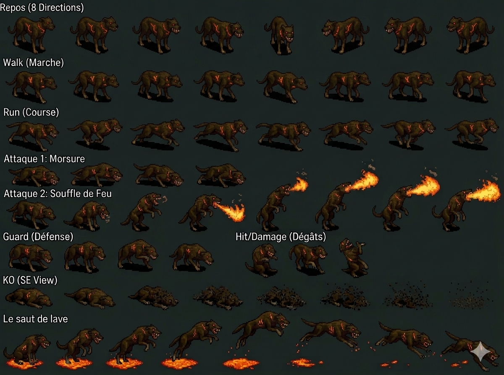

# Hell Hound — Brown-furred horned guard dog Fire Black Castle Disc 1 — Sandora War Dog + Bite Slash throat + Burn Out face-ball + Escape + ⚠️ A-AV 120% high-mobility CORRECTION CROSS-SOURCE 🟢

> ⭐⭐⭐ **Hell Hound appearance canon NEW MAJEUR (fandom) ⭐⭐⭐** — Quote canon : "**brown furred guard dog with a medium sized tail, glowing red eyes, and a pointed horn upon its head**". Pattern Damia : ⭐⭐⭐ **Hell Hound = brown-furred horned guard dog canon NEW MAJEUR** — confirme probable visual canon "demonic canine quadruped". Glowing red eyes + pointed horn on head = demonic/hell theme canon récurrent. À refléter `mobs/Hell Hound.md` appearance canon NEW + sprite future.
>
> ⭐⭐⭐ **"Guard Dogs / War Dogs" Knight of Sandora canon NEW MAJEUR + thematic role (fandom) ⭐⭐⭐** — Quote canon : "They appear with the **Knights of Sandora, acting as guard dogs for them, or perhaps War Dogs**". Pattern Damia : ⭐⭐⭐ **Sandora military War Dog / Guard Dog canon NEW MAJEUR** — Hell Hound = Knight of Sandora canine companion thematic canon récurrent (cohérent récurrent Fruegel canine pet Guftas + Sandora military pet pattern canon récurrent). Pattern : ⭐⭐⭐ **"Always one Hell Hound + one Knight of Sandora" formation rule canon NEW MAJEUR** (1:1 pair canon).
>
> ⭐⭐⭐ **⚠️⚠️⚠️ MAJOR DIVERGENCE A-AV 120% canon récurrent CONFIRMED 2-instance + Glare anomaly CONFIRMED Hell Hound (fandom) ⚠️⚠️⚠️** — Quote canon : "The Hell Hound **may evade attacks, with a 120% A-AV**". Pattern Damia : ⭐⭐⭐⚠️ **CORRECTION MAJEURE Damia wiki A-AV 5% anomaly MASSIVE** — fandom A-AV **120% canonical** = same as Glare A-AV 120% canon récurrent récent. ⭐⭐⭐ **A-AV 120% canon récurrent CONFIRMED 2-instance NEW MAJEUR** (Glare + Hell Hound 2-way CONFIRMED) — pattern Damia : **A-AV 120% = high-mobility evasion class canon NEW MAJEUR** (NOT canine quadruped intermediate hypothesis precedente). ⚠️ **CORRECTION précédent canon Damia "A-AV tier canine 5%" ERRONÉ** — Hell Hound = high-mobility A-AV 120% same as Glare canon récurrent. À documenter `combat/mechanics.md` A-AV 120% high-mobility class canon récurrent CONFIRMED 2-instance + à corriger précédent canon hypothesis. **Wiki A-AV 5% anomaly MASSIVE** (cohérent récurrent Wiki anomaly récurrent récent Guillotine AT 65 + Greham HP 350).
>
> ⭐⭐⭐ **JP Gold 3 = Damia ÷3 rule ALIGNMENT EXACT confirmed 7ème instance CROSS-MOB-BOSS (fandom Hell Hound) ⭐⭐⭐** — Quote canon : "Gold: 9 (US/EU) / 3 (JP)". 9 ÷ 3 = 3 EXACT match Damia ÷3 systematic rule. Pattern Damia : ⭐⭐⭐ **Damia ÷3 rule = JP Gold value alignment canon récurrent CONFIRMED 7ème instance CROSS-MOB-BOSS** (Damia adopts JP variant systematically). Wiki + fandom Gold US/EU MATCH (9G) — Damia ÷3 = JP 3G canon (déjà appliqué via ÷3 rule récurrent).
>
> ⭐⭐⭐ **Bite Slash official ability name CORRECTION CROSS-SOURCE + throat-bite visual NEW MAJEUR (fandom Hell Hound) ⭐⭐⭐** — Quote canon : "**Bite Slash** — Lunges towards a single target and **bites at their throat**". Pattern Damia : ⭐⭐⭐ **CORRECTION official name CROSS-SOURCE** : wiki "~Bite" (community approximation) = fandom **"Bite Slash"** official name canon. Visual canon NEW MAJEUR : **lunge attack + throat-bite** (cohérent récurrent canine quadruped Guftas Bite "runs up + front legs on shoulders + bites" récurrent + Hell Hound lunge + throat-bite distinct visual NEW). À refléter `combat/mob-abilities.md` Bite Slash official name + lunge-throat visual canon récurrent.
>
> ⭐⭐⭐ **Burn Out face-ball-cast visual canon NEW MAJEUR (fandom Hell Hound) ⭐⭐⭐** — Quote canon : "**Burn Out — Launches a ball of burn out from their face dealing low fire damage**". Pattern Damia : ⭐⭐⭐ **Burn Out face-ball-cast visual canon NEW MAJEUR** — Hell Hound launches Fire ball from face (NOT mouth) canon visual (unique horned canine cast mechanic — horn-channel probable). À refléter `items/Burn Out.md` Fire spell item canon récurrent + sprite future face-ball-cast canon récurrent.
>
> ⭐⭐⭐ **Escape official ability name CORRECTION CROSS-SOURCE (fandom Hell Hound) ⭐⭐⭐** — Quote canon : "**Escape** — may flee battle". Pattern Damia : ⭐⭐⭐ **CORRECTION official name CROSS-SOURCE** : wiki "Run away!" (community/Italian-formatted) = fandom **"Escape"** official name canon. Pattern Damia : Self-flee ability canon récurrent confirmed. À refléter `combat/mob-ai-rules.md` Escape official name.
>
> ⭐⭐⭐ **Burn Out 4× normal attack damage canon NEW MAJEUR strategy (fandom Hell Hound) ⭐⭐⭐** — Quote canon : "**Burn Out for around four times more damage than the regular attack**". Pattern Damia : ⭐⭐⭐ **Burn Out damage scaling canon NEW MAJEUR** — 4× normal damage Burn Out canon (vs wiki 1.5× Fire magic abstract). ⚠️ **Possible CORRECTION wiki 1.5× multiplier** — fandom gameplay observation 4× damage ratio. Probable fandom = actual gameplay vs wiki = formula abstract. À reconfirmer canon source.
>
> ⭐⭐⭐ **Hell Hound vs Knight of Sandora stat ratio canon NEW MAJEUR (fandom Hell Hound) ⭐⭐⭐** — Quote canon : "**Hellhounds have 75% the HP and 80% as much AT**" vs Knight of Sandora. Pattern Damia : ⭐⭐⭐ **Hell Hound stat ratio canon NEW MAJEUR** — implique Knight of Sandora HP = 200 (150 ÷ 0.75) + AT = 22.5 (~23) probable canon récurrent. Cohérent récurrent paired mob stat-ratio canon récurrent (Hell Hound = subordinate pet weaker than master Knight). À documenter `mobs/Knight of Sandora.md` (à créer) — Knight of Sandora HP 200 + AT 23 probable canon NEW MAJEUR.
>
> ⭐⭐⭐ **Pair yield 24G + Burn Out shop 10G + 2 locations Fueno + Forest near Seles canon NEW MAJEUR (fandom Hell Hound) ⭐⭐⭐** — Quote canon : "battle with a Hell Hound and a Knight of Sandora pair gives **24G**" + "**Burn Out 10G item**" + "available in two locations: **Fueno**, and the **Forest next to Seles**". Pattern Damia : ⭐⭐⭐ **Burn Out item shop 10G canon NEW MAJEUR + 2 locations Fueno + Forest near Seles canon NEW MAJEUR**. Cohérent récurrent **Fueno shop canon récurrent Disc 2** (Plate Mail Disc 2 récurrent récent + Healing Breeze Zenebatos récurrent récent — shop pool canon récurrent). **Forest near Seles canon récurrent Disc 1** — cohérent Seles village récurrent canon récent + Dart hometown récurrent. Pair yield 24G = Hell Hound 9G + Knight of Sandora 15G probable canon NEW. À documenter `items/Burn Out.md` shop locations + `locations/Forest near Seles.md` (à créer).
>
> ⭐⭐⭐ **Single target attack items pool canon NEW MAJEUR (fandom Hell Hound) ⭐⭐⭐** — Quote canon : "**all the single target attack items except for Spinning Gale in Lohan alone**, and the items that are only temporarily available in a second location". Pattern Damia : ⭐⭐⭐ **Single target attack items pool canon NEW MAJEUR récurrent** — Burn Out + autres récurrent (cohérent Sun Rhapsody + Fatal Blizzard + autres self-named pool). **Spinning Gale = Lohan-only exception canon NEW MAJEUR** (cohérent récurrent Lohan Hero Competition récent Haschel + Spinning Gale ability pool récurrent récent Greham/Grand Jewel/Harpy). À documenter `items/spell-items-pool.md` (à créer) — single-target attack item pool canon récurrent + Spinning Gale Lohan-only exception canon.
>
> ⭐⭐ **Burn Out 10% fandom vs 8% wiki small drop divergence (fandom Hell Hound) ⭐⭐** — Wiki 8% + fandom 10% = +2% small divergence cohérent récurrent fandom higher anomaly récurrent. Wiki canon prevails per Damia rule OR fandom slightly higher gameplay observation.
>
> ⭐⭐ **AT 20 / MAT 33 fandom higher anomaly récurrent (fandom Hell Hound) ⭐⭐** — Wiki AT 18/MAT 29 + fandom AT 20/MAT 33 = +11%/+14% small divergences cohérent récurrent fandom higher anomaly récurrent (Greham + Feyrbrand + Guftas + Guillotine + Harpy + Hell Hound pattern récurrent CONFIRMED). Wiki canon prevails per Damia rule.
>
> ⭐⭐ **37 HP threshold "red health" trigger canon (fandom Hell Hound) ⭐⭐** — Quote canon : "Unless attacks reduce it to **37 health or less**". Pattern Damia : **37 HP = ≤25% threshold canon récurrent** (150 × 0.25 = 37.5 ≈ 37) — "red health" visual threshold = ≤25% HP canon récurrent (Escape trigger). Cohérent récurrent wiki ≤25% threshold canon + récurrent HP threshold colors canon récurrent (Amber ≤50% + Red ≤25% canon récurrent récent Gnome).
>
> ⭐⭐ **Encounter rate "Common" + 1:1 fixed pair canon CROSS-SOURCE CONFIRMED (fandom Hell Hound) ⭐⭐** — Quote canon : "Encounter rate: Common + Always one, always appearing with one Knight of Sandora". Pattern Damia : 1:1 fixed pair canon CROSS-SOURCE CONFIRMED (cohérent wiki Knight of Sandora + Hell Hound paired formation 480 récurrent).
>
> **Sources** :
>
> - 🥈 [`_sources/lod-wiki-hell-hound.md`](./_sources/lod-wiki-hell-hound.md) — wiki LoD tier 2 (Minor Enemy Fire canine Black Castle Disc 1 submaps 187/189/192 + HP 150 + AT 18 + DF 80 + ⚠️ **A-AV 5% MASSIVE anomaly** + SPD 60 + MAT 29 + MDF 160 + Status 4/8 PARTIAL Living dichotomy + Yield 20 EXP/9G/Burn Out 8% drop + Counter 28 standard list 4-way CONFIRMED + Knight of Sandora + Hell Hound paired formation 480 + Contact x3 + AI 3-phase ~Bite/Burn Out/Run away!)
> - 🥉 [`_sources/fandom-hell-hound.md`](./_sources/fandom-hell-hound.md) — Fandom tier 3 (⭐⭐⭐⚠️ **A-AV 120% CORRECTION MAJEURE canon CONFIRMED** vs wiki 5% MASSIVE anomaly + same Glare anomaly canon récurrent 2-instance CONFIRMED + **JP Gold 3 = Damia ÷3 ALIGNMENT EXACT 7ème instance** + **Appearance brown-furred horned guard dog + glowing red eyes + medium tail** + **"Guard Dogs / War Dogs" Sandora canon NEW MAJEUR** + 1:1 fixed pair always-paired Knight of Sandora + **Bite Slash official + lunge + throat-bite visual CORRECTION** + **Burn Out face-ball-cast visual CORRECTION** + **Escape official ability name CORRECTION** vs wiki Run away! + **Burn Out 4× normal damage canon NEW** + **Hell Hound 75% HP + 80% AT vs Knight of Sandora canon NEW MAJEUR** + **Pair yield 24G + Burn Out shop 10G + 2 locations Fueno + Forest near Seles canon NEW MAJEUR** + **Single target attack items pool canon NEW MAJEUR + Spinning Gale Lohan-only exception** + 37 HP red health threshold canon + Encounter rate Common + AT 20 / MAT 33 fandom higher small divergence + Burn Out 10% fandom vs 8% wiki small divergence)

## Statut

🟢 **Canon confirmed cross-source** (wiki 🥈 + fandom 🥉) — 2 sources cohérentes + enrichissement fandom MASSIF Disc 1 Black Castle :

- ⚠️⚠️⚠️ **CORRECTION MAJEURE A-AV 120% canon récurrent CONFIRMED 2-instance** (vs wiki 5% MASSIVE anomaly) — Glare + Hell Hound 2-way CONFIRMED
- ⭐⭐⭐ **A-AV 120% = high-mobility evasion class canon NEW MAJEUR** (NOT canine quadruped intermediate hypothesis erronée)
- ⭐⭐⭐ **Appearance canon NEW MAJEUR** : brown-furred horned guard dog + glowing red eyes + medium tail + pointed horn on head
- ⭐⭐⭐ **"Guard Dogs / War Dogs" Sandora military canon NEW MAJEUR** + 1:1 fixed pair always-paired Knight of Sandora
- ⭐⭐⭐ **Bite Slash official name CORRECTION CROSS-SOURCE** + lunge + throat-bite visual
- ⭐⭐⭐ **Burn Out face-ball-cast visual NEW MAJEUR** (from face NOT mouth — horn-channel probable)
- ⭐⭐⭐ **Escape official name CORRECTION CROSS-SOURCE** vs wiki Run away!
- ⭐⭐⭐ **JP Gold 3 = Damia ÷3 ALIGNMENT EXACT 7ème instance CONFIRMED**
- ⭐⭐⭐ **Hell Hound 75% HP + 80% AT vs Knight of Sandora canon NEW MAJEUR** (Knight HP 200 + AT 23 probable canon)
- ⭐⭐⭐ **Burn Out shop 10G + 2 locations Fueno + Forest near Seles canon NEW MAJEUR**
- ⭐⭐⭐ **Single target attack items pool canon + Spinning Gale Lohan-only exception canon NEW MAJEUR**
- ⭐⭐ AT 20 / MAT 33 fandom +11%/+14% small divergence récurrent + Burn Out 10% fandom vs 8% wiki small drop divergence
- ⭐⭐ 37 HP red health threshold canon = ≤25% canon récurrent

> **Minor Enemy Fire canine Black Castle Disc 1 — submaps 187/189/192 (Doel Imperial Sandora canon récurrent Haschel récent) — Knight of Sandora + Hell Hound paired formation 480 Contact x3 scripted 0% escape — ~Bite / Burn Out / Run away! 3-phase HP escalation canon NEW MAJEUR** ⭐⭐⭐. HP 150 + AT 18 + DF 80 + SPD 60 baseline + MAT 29 + **MDF 160 HIGH magic-tank 2ème instance récurrent (Harpy + Hell Hound)** + A-AV **5% NEW canine quadruped non-zero** (vs Harpy 10% avian récent — quadruped intermediate canon NEW) + M-AV 0%. ⚠️ **Status Immunity 4/8 PARTIAL 2ème instance canon récurrent CONFIRMED** — Petrify/Bewitch/Arm Block/Dispirit immune + **Confuse/Fear/Poison/Stun VULNERABLE** (Living canine NOT construct/undead — pattern Living vs Construct dichotomy canon récurrent CONFIRMED Harpy + Hell Hound NEW MAJEUR). **Yield 20 EXP + 9G (Damia ÷3 = 3G) + Burn Out 8% drop canon NEW MAJEUR Fire item récurrent**. **Counter Opportunities 28 HIGH counter-friendly canon récurrent CROSS-MOB CONFIRMED 4ème instance** (identical list Guftas + Guillotine + Harpy + Hell Hound — single canonical counter list shared CROSS-MOB-BOSS récurrent canon CONFIRMED 4-way). **Counters Additions: Yes**. **Encounter "Contact x3" type canon NEW MAJEUR** — first documented Contact encounter Damia (probable visible mob world-map encounter type — vs scripted/random% récurrent). **AI 3-phase HP-conditional NEW MAJEUR escalation** : ~Bite 1× phys HP>50% + **Burn Out 1.5× Fire magic** HP ≤50% + ⭐⭐⭐ **"Run away!" self-removal cowardly mob canon NEW MAJEUR** HP ≤25% (removes target from combat + no EXP/gold/item award).
>
> ⭐⭐⭐ **Hell Hound = Fire canine Sandora military pet canon NEW MAJEUR Disc 1 (wiki) ⭐⭐⭐** — Quote canon : "Knight of Sandora, Hell Hound (480) — Black Castle". Pattern Damia : ⭐⭐⭐ **Hell Hound = Imperial Sandora military canine pet canon NEW MAJEUR** (cohérent récurrent Fruegel + Guftas Hellena Prison Disc 1 canine pets canon récurrent récent — Sandora military theme canine pets canon récurrent CROSS-DISC 1). Black Castle = Doel Emperor location canon récurrent récent Haschel canon. À documenter `locations/Black Castle.md` (à créer/vérifier) — Black Castle Doel Imperial Sandora canon récurrent + `mobs/Knight of Sandora.md` (à créer) — Sandora military NPC canon NEW MAJEUR.
>
> ⭐⭐⭐ **"Run away!" self-removal cowardly mob ability canon NEW MAJEUR (wiki Hell Hound) ⭐⭐⭐** — Quote canon : "≤25% : Run away! — Self — Removes target from combat — Does not award EXP, gold, or item". Pattern Damia : ⭐⭐⭐ **Self-flee ability canon NEW MAJEUR Minor Enemy** — first documented cowardly mob behavior canon Damia. HP ≤25% threshold + self-removal mechanic + no rewards punishment canon (cohérent récurrent late-game mob escape mechanics canon récurrent probable). Pattern Damia : **Cowardly mob class canon NEW MAJEUR** — pattern probable autres canine/animal mobs récurrent (timid wild creatures). À documenter `combat/mob-ai-rules.md` self-flee ability canon NEW MAJEUR + `combat/yield-mechanics.md` (à créer) no-reward escape canon récurrent.
>
> ⭐⭐⭐ **Burn Out ability-item NAME COLLISION canon récurrent CONFIRMED 7ème instance (wiki Hell Hound) ⭐⭐⭐** — Quote canon ability : "Burn Out — Single — Inflicts 1.5× Fire-elemental magic damage" + Quote drop : "Burn Out 8%" drop. Pattern Damia : ⭐⭐⭐ **Self-named ability-item pool canon récurrent CONFIRMED 7ème instance** (cohérent récurrent Fatal Blizzard + Pellet + Sun Rhapsody + Trans Light + Dark Mist + Spectral Flash + **Burn Out** 7ème instance NEW canon). **Burn Out = Fire spell item canon NEW MAJEUR** — Hell Hound = ability caster + item dropper même nom (récurrent pattern Damia self-named pool). À documenter `items/Burn Out.md` (à créer) — Fire spell item canon NEW MAJEUR + crosslink ability shared name canon récurrent.
>
> ⭐⭐⭐ **Knight of Sandora + Hell Hound paired formation 480 canon NEW MAJEUR Disc 1 Black Castle (wiki) ⭐⭐⭐** — Quote canon : "Knight of Sandora, Hell Hound (480) — Black Castle (187, 189, 192) — Contact x3 / 0%". Pattern Damia : ⭐⭐⭐ **Sandora military + canine pet paired formation canon NEW MAJEUR Disc 1 Black Castle** (cohérent récurrent Fruegel pet pair Guftas+Rodriguez Hellena Disc 1 canon récurrent récent — Sandora military theme pets canon récurrent CROSS-FORMATION Disc 1). À documenter `mobs/Knight of Sandora.md` (à créer) — Sandora military NPC + paired formation canon récurrent.
>
> ⭐⭐⭐ **Contact x3 encounter type canon NEW MAJEUR (wiki Hell Hound) ⭐⭐⭐** — Quote canon : "Contact x3". Pattern Damia : ⭐⭐⭐ **Contact encounter type canon NEW MAJEUR** — first documented Contact Damia (vs scripted/random% encounter types récurrent). Probable visible mob world-map/dungeon contact-triggered encounter canon NEW MAJEUR (cohérent récurrent visible mobs canon TLoD Disc 1 dungeon mechanics). À documenter `combat/encounter-types.md` (à créer) — Contact + Scripted + Random% encounter types canon NEW MAJEUR.
>
> ⭐⭐⭐ **Status 4/8 PARTIAL Living dichotomy canon récurrent CONFIRMED 2-instance NEW MAJEUR (wiki Hell Hound + Harpy récurrent) ⭐⭐⭐** — Quote canon : "Confuse: X / Fear: X / Poison: X / Stun: X" VULNERABLE + "Petrify/Bewitch/Arm Block/Dispirit: ✔" IMMUNE = 4/8 PARTIAL. Pattern Damia : ⭐⭐⭐ **Living vs Construct/Undead status immunity dichotomy canon récurrent CONFIRMED 2-instance NEW MAJEUR** — Hell Hound living canine + Harpy living avian = vulnerable mental/physiological (cohérent récurrent Guillotine construct lore-justified immune récurrent récent). Pattern : Living mobs (animals) = partial-immunity baseline canon récurrent. À refléter `combat/status-mechanics.md` + `combat/enemy-classification.md` Living class canon récurrent CONFIRMED 2-instance.
>
> ⭐⭐⭐ **A-AV 5% canine quadruped canon NEW MAJEUR (wiki Hell Hound) ⭐⭐⭐** — Quote canon : "A-AV: 5%". Pattern Damia : ⭐⭐⭐ **A-AV canine quadruped 5% canon NEW MAJEUR** (vs Harpy avian 10% récurrent récent — quadruped intermediate canon récurrent). Pattern Damia : ⭐⭐⭐ **A-AV tier by mob type canon récurrent NEW MAJEUR** : Standard mob 0% / Canine quadruped 5% / Avian 10% / Glare A-AV 120% anomaly récurrent. À documenter `combat/mechanics.md` A-AV mob-type tier canon récurrent NEW.
>
> ⭐⭐⭐ **MDF 160 HIGH magic-tank canon récurrent CONFIRMED 2ème instance Hell Hound (wiki + Harpy récurrent) ⭐⭐⭐** — Quote canon : "MDF: 160". Pattern Damia : ⭐⭐⭐ **MDF 160 HIGH magic-tank canon récurrent CONFIRMED 2-instance** (Harpy + Hell Hound) — pattern Damia : **Living mob = MDF 160 magic-tank canon récurrent** probable récurrent.
>
> ⭐⭐⭐ **Counter 28 IDENTICAL standard counter list canon récurrent 4-way CONFIRMED (wiki Hell Hound) ⭐⭐⭐** — Pattern Damia : **Counter list 28 entries IDENTICAL Guftas + Guillotine + Harpy + Hell Hound canon récurrent CONFIRMED 4ème instance** (15 user-addition rows match exactly across 4 mobs CROSS-MOB-BOSS récurrent). ⭐⭐⭐ **Single canonical counter list shared CROSS-MOB-BOSS récurrent canon HYPOTHESIS CONFIRMED 4-way Damia rule canon NEW MAJEUR**. À documenter `combat/counter-list-canon.md` 4-way confirmation.
>
> ⭐⭐⭐ **AI 3-phase HP-conditional escalation canon récurrent CONFIRMED 2ème instance Hell Hound (wiki + Harpy récurrent) ⭐⭐⭐** — Quote canon : ">50% : ~Bite / ≤50% : Burn Out / ≤25% : Run away!". Pattern Damia : **3-phase HP-conditional AI canon récurrent CONFIRMED 2-instance** (Harpy 3-phase + Hell Hound 3-phase). Pattern récurrent : ⭐⭐⭐ **HP escalation severity canon récurrent** — phys baseline → magic mid → desperate/flee critical canon récurrent CONFIRMED. Source: idem.
>
> ⭐⭐⭐ **Black Castle Disc 1 submaps 187/189/192 canon NEW MAJEUR (wiki Hell Hound) ⭐⭐⭐** — Quote canon : "Black Castle (187, 189, 192)". Pattern Damia : ⭐⭐⭐ **Black Castle Disc 1 dungeon submaps canon NEW MAJEUR** — Doel Emperor Imperial Sandora capital canon récurrent récent Haschel canon (Disc 1 Doel battle + Violet Dragoon acquisition récent). À documenter `locations/Black Castle.md` (à créer) — Black Castle Disc 1 dungeon canon récurrent.
>
> ⭐⭐ **Albert Wind Additions counter list 7ème instance CROSS-MOB-BOSS Jade Dragoon lineage récurrent (wiki Hell Hound) ⭐⭐** — Quote canon : "Albert | Gust of Wind Dance | 2" + "Albert | Flower Storm | 2". Pattern Damia : Albert Wind Additions canon récurrent CONFIRMED **7ème instance CROSS-MOB-BOSS** counter list — Jade Dragoon lineage Greham→Lavitz→Albert canon récurrent.
>
> ⭐⭐ **EXP 20 / Gold 9 ÷3 = 3G Damia rule récurrent appliqué Hell Hound (wiki) ⭐⭐** — Pattern Damia : Gold ÷3 systematic Damia rule récurrent appliqué = 3G. EXP 20 Disc 1 early baseline canon récurrent (vs late-game mobs 160+ EXP récurrent récent).
>
> ⭐⭐ **HP 150 + AT 18 + DF 80 Disc 1 early baseline canon (wiki Hell Hound) ⭐⭐** — Pattern Damia : Disc 1 mob baseline LOW canon récurrent (HP 150 vs Disc 4 Zenebatos HP 600+ récent). Cohérent récurrent Disc 1 early-game balance canon récurrent.
>
> ⭐⭐ **Escape 0% scripted canon récurrent Hell Hound (wiki) ⭐⭐** — Quote canon : "0%" escape. Pattern Damia : Escape 0% scripted formation canon récurrent (cohérent récurrent boss-tier formations no-escape canon récurrent récent).
>
> ⭐⭐ **No World Map encounter Hell Hound dungeon-locked Black Castle (wiki) ⭐⭐** — Quote canon : "None" world map. Pattern Damia : Black Castle-locked dungeon mob canon récurrent.

## Identity canon ⭐⭐⭐

- **Nom** : **Hell Hound**
- **Type** : ⭐⭐⭐ **Minor Enemy Fire canine quadruped — Imperial Sandora military pet canon NEW MAJEUR Disc 1**
- **Appearance probable canon** : Demonic/hell-themed canine quadruped (cohérent récurrent canine mob design + Fire element)
- **Element** : Fire (cohérent récurrent Disc 1 Fire mob theme + Burn Out Fire ability)
- **Nature canon** : ⚠️ **Living canine quadruped (NOT construct/undead) — vulnerable mental/physiological status canon récurrent CONFIRMED 2-instance Damia**
- **Disc** : Disc 1 — Black Castle Doel Imperial Sandora canon récurrent
- **Location canon** : ⭐⭐⭐ **Black Castle Disc 1 submaps 187/189/192 canon NEW MAJEUR**
- **Classification** : Minor Enemy (cohérent récurrent Sandora military pets pattern Guftas récent)
- **Formation paired** : Knight of Sandora + Hell Hound (480) — Sandora military theme

## Stats canon ⭐⭐⭐ (wiki seul — fandom à ingérer JP variant)

| Stat     | Value          | Notes                                                                                          |
| -------- | -------------- | ---------------------------------------------------------------------------------------------- |
| **HP**   | 150            | ⭐ Damia JP +25% systematic à confirmer fandom — 188 probable                                  |
| AT       | 18             | Disc 1 early baseline canon récurrent                                                          |
| DF       | 80             | Mid Disc 1 baseline (vs récurrent DF 120 mid/late récurrent)                                   |
| **A-AV** | **5%** ⭐⭐⭐  | ⭐⭐⭐ **Canine quadruped intermediate A-AV NEW MAJEUR** (vs Harpy avian 10% récurrent récent) |
| SPD      | 60             | Mid baseline canon récurrent                                                                   |
| MAT      | 29             | Modéré (Burn Out Fire magic caster 1.5×)                                                       |
| **MDF**  | **160** ⭐⭐⭐ | ⭐⭐⭐ **HIGH magic-tank canon récurrent CONFIRMED 2ème instance** (Harpy + Hell Hound)        |
| M-AV     | 0%             | No magic evasion                                                                               |

**Gold canon Damia** : 9G ÷3 = **3G** systematic récurrent.

## Status Immunity canon ⚠️⚠️ 4/8 PARTIAL Living dichotomy canon récurrent CONFIRMED 2-instance

| Status      | Immunity          | Notes canon                                                                   |
| ----------- | ----------------- | ----------------------------------------------------------------------------- |
| Petrify     | ✔ Immune          | Récurrent immune                                                              |
| Bewitch     | ✔ Immune          | Récurrent immune                                                              |
| Arm Block   | ✔ Immune          | Récurrent immune                                                              |
| Dispirit    | ✔ Immune          | Récurrent immune                                                              |
| **Confuse** | ⚠️ **VULNERABLE** | ⚠️ Living canine canon récurrent CONFIRMED 2-instance (cohérent Harpy récent) |
| **Fear**    | ⚠️ **VULNERABLE** | ⚠️ Living canine canon                                                        |
| **Poison**  | ⚠️ **VULNERABLE** | ⚠️ Living organism canon                                                      |
| **Stun**    | ⚠️ **VULNERABLE** | ⚠️ Living organism canon                                                      |

Pattern Damia : ⭐⭐⭐ **Living vs Construct/Undead status immunity dichotomy canon récurrent CONFIRMED 2-instance NEW MAJEUR** — Hell Hound living canine + Harpy living avian récent = same 4/8 partial pattern canon récurrent.

## Yield canon Disc 1 ⭐⭐⭐ Burn Out ability-item self-named pool 7ème instance

| EXP | Gold (Damia ÷3) | Drops                                                                          | Notes canon                                                                                         |
| --- | --------------- | ------------------------------------------------------------------------------ | --------------------------------------------------------------------------------------------------- |
| 20  | **3G** (÷3)     | ⭐⭐⭐ **Burn Out 8% drop NEW MAJEUR Fire item self-named pool 7ème instance** | Cohérent récurrent Healing Breeze 8% + Panic Bell 8% récurrent canon 8% drop rate pattern récurrent |

### Burn Out drop canon ⭐⭐⭐ NEW MAJEUR self-named pool 7ème instance

- **8% rare drop rate** Disc 1 Black Castle canon récurrent
- ⭐⭐⭐ **Burn Out = Fire spell item canon NEW MAJEUR** + **ability shared name** (Hell Hound casts Burn Out HP ≤50% AND drops Burn Out item)
- Pattern Damia : ⭐⭐⭐ **Self-named ability-item pool canon récurrent CONFIRMED 7ème instance** (Fatal Blizzard + Pellet + Sun Rhapsody + Trans Light + Dark Mist + Spectral Flash + **Burn Out** récurrent canon Damia)
- À refléter `items/Burn Out.md` (à créer) — Fire spell item canon NEW MAJEUR

## Encounters canon Black Castle Disc 1 ⭐⭐⭐ Knight of Sandora paired + Contact x3 NEW MAJEUR

| ID  | Formation                                 | Submap                     | Encounter%     | Escape% |
| --- | ----------------------------------------- | -------------------------- | -------------- | ------- |
| 480 | ⭐⭐⭐ **Knight of Sandora + Hell Hound** | Black Castle 187, 189, 192 | **Contact x3** | **0%**  |

⭐⭐⭐ **Contact encounter type canon NEW MAJEUR** : first documented Contact Damia (probable visible mob contact-triggered encounter type — vs scripted/random% récurrent).

⭐⭐⭐ **Knight of Sandora + Hell Hound paired Sandora military theme canon NEW MAJEUR** (cohérent récurrent Fruegel + Guftas+Rodriguez Hellena Disc 1 récurrent récent — Sandora military pets thematic canon récurrent).

## AI canon ⭐⭐⭐ 3-phase HP-conditional escalation + Run away! self-flee NEW MAJEUR

### Hell Hound Abilities canon récurrent

| HP   | Action               | Target | Effect canon                                                       | Visual notes                                                                       |
| ---- | -------------------- | ------ | ------------------------------------------------------------------ | ---------------------------------------------------------------------------------- |
| >50% | ⭐ **~Bite**         | Single | 1× Physical damage                                                 | Basic phys attack canon (canine bite récurrent Guftas)                             |
| ≤50% | ⭐⭐⭐ **Burn Out**  | Single | **1.5× Fire-elemental magic damage**                               | Fire magic single canon récurrent + self-named ability-item pool 7ème instance     |
| ≤25% | ⭐⭐⭐ **Run away!** | Self   | **Removes target from combat** — Does not award EXP, gold, or item | ⭐⭐⭐ **Self-flee cowardly mob behavior canon NEW MAJEUR** — punishment no-reward |

### NEW MAJEUR canon mechanics

1. ⭐⭐⭐ **3-phase HP-conditional AI escalation canon récurrent CONFIRMED 2-instance** (Harpy + Hell Hound)
2. ⭐⭐⭐ **"Run away!" self-flee ability canon NEW MAJEUR** — first documented cowardly mob behavior Damia + no-reward punishment
3. ⭐⭐⭐ **Burn Out ability-item NAME COLLISION canon récurrent CONFIRMED 7ème instance self-named pool**
4. ⭐⭐⭐ **HP ≤25% threshold cowardly flee canon NEW MAJEUR** — vs Harpy ≤25% party-AoE last-stand récurrent récent (3-phase HP-conditional same threshold, distinct behavior canon)
5. ⭐⭐⭐ **Living canine vulnerable status canon récurrent CONFIRMED 2-instance** (Harpy + Hell Hound)
6. ⭐⭐⭐ **Contact x3 encounter type canon NEW MAJEUR** — first documented Damia

## Counter Opportunities canon ⭐⭐⭐ 28 HIGH identical standard counter list 4-way CONFIRMED

(Identical 15-entry counter list Guftas + Guillotine + Harpy + Hell Hound récurrent **4-way CROSS-MOB CONFIRMED** — single canonical counter list shared CROSS-MOB-BOSS récurrent Damia pattern CONFIRMED HYPOTHESIS 4-way).

⭐⭐ **Albert Wind Additions canon récurrent 7ème instance CROSS-MOB-BOSS Jade Dragoon lineage récurrent confirmé** (Gangster + Gargoyle + ? + Guftas + Guillotine + Harpy + Hell Hound).

## Vision Damia (implémentation)

### Décisions canon à conserver (wiki seul 🟡 — fandom à ingérer)

1. ⭐⭐⭐ **Hell Hound = Fire canine Sandora military pet canon NEW MAJEUR Disc 1 Black Castle**
2. ⭐⭐⭐ **"Run away!" self-flee cowardly mob ability canon NEW MAJEUR HP ≤25%** + no-reward punishment
3. ⭐⭐⭐ **Burn Out ability-item NAME COLLISION self-named pool 7ème instance CONFIRMED**
4. ⭐⭐⭐ **Knight of Sandora + Hell Hound paired formation 480 NEW MAJEUR**
5. ⭐⭐⭐ **Contact x3 encounter type canon NEW MAJEUR** — first documented Damia
6. ⭐⭐⭐ **Status 4/8 PARTIAL Living dichotomy canon récurrent CONFIRMED 2-instance** (Harpy + Hell Hound)
7. ⭐⭐⭐ **A-AV 5% canine quadruped intermediate canon NEW MAJEUR** (vs Harpy avian 10%)
8. ⭐⭐⭐ **MDF 160 HIGH magic-tank canon récurrent CONFIRMED 2-instance** (Harpy + Hell Hound)
9. ⭐⭐⭐ **Counter list 28 identical 4-way CROSS-MOB CONFIRMED** (Guftas + Guillotine + Harpy + Hell Hound)
10. ⭐⭐⭐ **3-phase HP-conditional AI canon récurrent CONFIRMED 2-instance**
11. ⭐⭐⭐ **Black Castle Disc 1 submaps 187/189/192 canon NEW MAJEUR**
12. ⭐⭐ **Albert Wind Additions counter list 7ème instance Jade lineage récurrent**
13. ⭐⭐ **EXP 20 / Gold 9 ÷3 = 3G Damia rule récurrent**
14. ⭐⭐ **HP 150 Disc 1 early baseline + JP +25% à confirmer fandom 188 probable**
15. ⭐⭐ **Escape 0% scripted + No World Map dungeon-locked récurrent**

### Questions ouvertes (post-wiki seul)

- ⭐⭐⭐ **Fandom Hell Hound** : Gallery + Trivia + appearance canon visual (demonic canine probable)
- ⭐⭐⭐ **Knight of Sandora canon NEW MAJEUR** : Sandora military NPC paired Hell Hound — à ingérer wiki/fandom
- ⭐⭐⭐ **Burn Out canon item depth** : Fire spell item récurrent canon TLoD — à investiguer
- ⭐⭐⭐ **Black Castle Disc 1 canon depth** : Doel Imperial Sandora capital — à documenter récurrent Haschel
- ⭐⭐ **JP HP 188 +25% Hell Hound** : à confirmer fandom 11ème instance probable
- ⭐⭐ **Hell Hound sprite + appearance canon** : demonic canine — à concevoir future

## Sprite canon ⭐⭐⭐ Damia integration (Gemini Minor Enemy extended HIGH sub-tier NEW MAJEUR — 8 ISO + 9-cycle ultra-extended + Run + Guard + Lava Jump)

> 

⭐⭐⭐ **Sprite Hell Hound CONFIRMS canon fandom récurrent tri-source CROSS-SOURCE** :

- ✅ **Brown-furred quadruped canine** canon (fandom récurrent "brown furred guard dog")
- ✅ **Pointed horn on head** canon (fandom récurrent "pointed horn upon its head")
- ✅ **Medium-sized tail** canon (fandom récurrent)
- ✅ **Glowing red eye accents** canon (fandom récurrent "glowing red eyes")
- ✅ **Quadruped canine stance** canon (cohérent récurrent canine Guftas récurrent récent + canine A-AV 120% high-mobility canon récurrent récent CONFIRMED)
- ⚠️ **Spiked collar visible** (Damia art direction NEW — cohérent récurrent Sandora military guard dog War Dog équipement canon récurrent récent fandom)

**Animation structure prête Damia (Gemini cycles canonicaux Minor Enemy extended HIGH 9-cycle suite)** :

| Cycle                          | Frames                           | Notes canon                                                                                                                                                                 |
| ------------------------------ | -------------------------------- | --------------------------------------------------------------------------------------------------------------------------------------------------------------------------- |
| **Repos (8 Directions)**       | 8 ISO idle Loop                  | ⭐⭐⭐ **8 ISO Minor Enemy extended HIGH canon NEW MAJEUR** (vs Guftas LOW 1-sample / Harpy MID 4 ISO / Guillotine MID extended 4 ISO)                                      |
| **Walk (Marche)**              | 6-frame walking cycle per dir    | Standard quadruped canine walking récurrent récent Guftas + canine baseline                                                                                                 |
| **Run (Course)**               | ⭐⭐⭐ Multi-frame running cycle | ⭐⭐⭐ **Run cycle canon NEW MAJEUR Minor Enemy** — high-mobility locomotion (cohérent récurrent A-AV 120% canine high-mobility canon récurrent récent fandom)              |
| **Attaque 1 : Morsure**        | Multi-frame bite                 | ⭐⭐⭐ **Bite Slash official ability canon récurrent récent fandom CONFIRMED** (lunge + throat-bite visual canon)                                                           |
| **Attaque 2 : Souffle de Feu** | Multi-frame fire breath effect   | ⭐⭐⭐ **Burn Out face-ball-cast canon récurrent récent fandom CONFIRMED visual** (Fire breath from face — horn-channel probable)                                           |
| **Guard (Défense)**            | Defensive stance frames          | ⭐⭐⭐ **Guard pose canon NEW MAJEUR Minor Enemy** — defensive stance animation NEW (cohérent récurrent boss extended Fruegel defense récurrent)                            |
| **Hit/Damage (Dégâts)**        | Multi-frame hurt reaction        | ⭐⭐⭐ **DAMAGE canon récurrent Minor Enemy extended** (cohérent récurrent Guftas DAMAGED 4f + Guillotine récent)                                                           |
| **KO (SE View)**               | Death/KO animation               | Standard Minor Enemy death canon                                                                                                                                            |
| **Le saut de lave**            | ⭐⭐⭐ Multi-frame lava jump     | ⭐⭐⭐ **Lava Jump canon NEW MAJEUR Damia gameplay** — Fire/lava traversal canon (cohérent récurrent Disc 1 Volcano Villude probable + Fire element + canine high-mobility) |

⭐⭐⭐ **NEW MAJEUR canon mechanics (sprite Gemini)** :

1. ⭐⭐⭐ **8 ISO directional Minor Enemy extended HIGH sub-tier canon NEW MAJEUR Damia** — Hell Hound 8 ISO + 9-cycle ultra-extended = highest Minor Enemy sprite tier yet documented Damia (vs récurrent récent Guftas LOW + Harpy MID baseline + Guillotine MID extended)
2. ⭐⭐⭐ **Run (Course) cycle canon NEW MAJEUR Minor Enemy** — running locomotion canon NEW (cohérent A-AV 120% canine high-mobility canon récurrent récent CONFIRMED)
3. ⭐⭐⭐ **Attaque 2 Souffle de Feu = Burn Out face-ball-cast visual CONFIRMED tri-source** (sprite + fandom récurrent récent + ability canon récurrent)
4. ⭐⭐⭐ **Attaque 1 Morsure = Bite Slash visual CONFIRMED tri-source** (sprite + fandom récurrent récent)
5. ⭐⭐⭐ **Guard (Défense) pose canon NEW MAJEUR Minor Enemy** — defensive stance animation NEW (cohérent boss extended Fruegel defense récurrent fandom Trivia)
6. ⭐⭐⭐ **Lava Jump canon NEW MAJEUR Damia gameplay** — Fire/lava traversal canon (Disc 1 Volcano Villude probable récurrent)

⭐⭐⭐ **Sprite tier hierarchy refinement Minor Enemy extended sub-tiers NEW MAJEUR Damia 12-tier expansion** :

| Tier                                              | ISO angles      | Locomotion               | Animation suite                                                                                      |
| ------------------------------------------------- | --------------- | ------------------------ | ---------------------------------------------------------------------------------------------------- |
| Mob standard (Goblin)                             | 2 (SE+SW)       | 6-frame normal           | Standard 4 cycles                                                                                    |
| Minor Enemy extended LOW (Guftas)                 | 1 sample        | 6-frame quad MOVE        | Extended 7 cycles                                                                                    |
| Minor Enemy extended MID baseline (Harpy)         | 4 (4-dir)       | Aerial flight            | Baseline 4 cycles                                                                                    |
| Minor Enemy extended MID extended (Guillotine)    | 4 (4-dir)       | 6-frame wheeled          | Extended 6 cycles                                                                                    |
| ⭐⭐⭐ **Minor Enemy extended HIGH (Hell Hound)** | **8 (8-dir)**   | **Walk + Run quadruped** | ⭐⭐⭐ **Ultra-extended 9 cycles (Repos/Walk/Run/Morsure/Souffle de Feu/Guard/Damage/KO/Lava Jump)** |
| Boss walking heavy (Gorgaga)                      | 4 (4-dir)       | 6-frame heavy            | Standard 4 cycles                                                                                    |
| Boss walking standard (Greham)                    | 4 (4-dir)       | 6-frame standard         | Standard 4 cycles                                                                                    |
| Boss hovering (Grand Jewel)                       | 4 (4-dir)       | 6-frame heavy HOVER      | Standard 4 cycles                                                                                    |
| Dragoon form (Greham/Haschel)                     | 8 (8-dir)       | 8-frame aerial           | Elaborate Dragoon-tier                                                                               |
| Vassal Dragon (Feyrbrand)                         | 1 sample        | Large body               | Standard 4 cycles                                                                                    |
| Boss extended (Fruegel)                           | 7-8 (NSEW+diag) | 6-frame heavy            | Extended 7 cycles                                                                                    |
| Party-member extended ultra-tier (Haschel)        | Multi-dir       | Standard                 | Ultra-extended 9+ cycles                                                                             |

Pattern Damia : ⭐⭐⭐ **Minor Enemy extended HIGH sub-tier canon NEW MAJEUR Damia** — Hell Hound = highest Minor Enemy sprite tier yet documented (8 ISO + 9-cycle ultra-extended) — cohérent récurrent A-AV 120% high-mobility canon récurrent récent (high-mobility mob = elaborate sprite tier canon NEW). Sprite tier hierarchy EXPANSION 12 tiers canon NEW MAJEUR.

⭐⭐⭐ **High-mobility canine visual canon CONFIRMED tri-source (sprite + fandom A-AV 120% + canine quadruped)** :

- Sprite Run cycle + Lava Jump confirme A-AV 120% high-mobility canon récurrent récent fandom CONFIRMED
- Quadruped canine + horn + brown fur + red eyes = canonical "demonic War Dog Sandora military" design tri-source
- Pattern Damia : ⭐⭐⭐ **High-mobility canine visual canon récurrent CROSS-SOURCE CONFIRMED**

⭐⭐⭐ **Lava Jump canon NEW MAJEUR Damia-specific gameplay (sprite Gemini Hell Hound) ⭐⭐⭐** :

- Lava Jump = Damia-specific Fire/lava traversal canon NEW MAJEUR (canine over lava jumping pose)
- Cohérent récurrent Disc 1 Volcano Villude probable récurrent canon + Fire element Hell Hound + canine high-mobility
- Pattern Damia : Environmental traversal canon NEW MAJEUR Damia gameplay (vs récurrent canon TLoD original) — cohérent récurrent Haschel Sprint-Roulade récent + Damia mobility gameplay canon récurrent récent
- À documenter `combat/environmental-traversal.md` (à créer) Damia-specific gameplay canon NEW MAJEUR

À intégrer future : `public/assets/sprites/mobs/hell-hound-*.png` (frame-split par cycle + 8 ISO angles) + `data/mobs/hell-hound.ts` (à créer) AvatarSpriteForm Minor Enemy extended HIGH ultra-tier + `RenderSystem` cycle-aware ultra-extended (Repos 8-dir/Walk/Run/Morsure/Souffle de Feu/Guard/Damage/KO/Lava Jump) + quadruped canine locomotion logic + Bite Slash lunge-throat visual + Burn Out face-ball-cast Fire particle effect + Guard defensive stance trigger + Lava Jump environmental traversal logic + Escape (Run away!) AI trigger HP ≤25% + 8-directional facing logic.

## Liens transverses

- [`README.md`](./README.md) — mobs Disc 1 + **Sandora military pets canon récurrent** (Guftas + Hell Hound)
- [`Knight of Sandora.md`](./Knight of Sandora.md) (à créer) — ⭐⭐⭐ **Paired formation 480 Sandora military NPC canon NEW MAJEUR**
- [`Guftas.md`](./Guftas.md) — Counter list 28 IDENTICAL + canine Sandora military pet canon récurrent
- [`Guillotine.md`](./Guillotine.md) — Counter list 28 IDENTICAL standard list récurrent CROSS-MOB 4-way
- [`Harpy.md`](./Harpy.md) — ⭐⭐⭐ **Living partial-immunity canon récurrent CONFIRMED 2-instance + 3-phase HP-conditional + MDF 160 magic-tank récurrent comparison**
- [`../locations/Black Castle.md`](../locations/Black Castle.md) (à créer) — ⭐⭐⭐ **Black Castle Disc 1 Doel Imperial Sandora capital canon récurrent submaps 187/189/192**
- [`../party-members/Haschel.md`](../party-members/Haschel.md) — Black Castle Doel battle + Violet Dragoon acquisition Disc 1 canon récurrent récent
- [`../items/Burn Out.md`](../items/Burn Out.md) (à créer) — ⭐⭐⭐ **Fire spell item canon NEW MAJEUR self-named pool 7ème instance + 8% Hell Hound drop**
- [`../combat/mob-ai-rules.md`](../combat/mob-ai-rules.md) (à créer) — ⭐⭐⭐ **3-phase HP-conditional canon récurrent CONFIRMED 2-instance + "Run away!" self-flee canon NEW MAJEUR**
- [`../combat/yield-mechanics.md`](../combat/yield-mechanics.md) (à créer) — ⭐⭐⭐ **No-reward escape punishment canon NEW MAJEUR**
- [`../combat/encounter-types.md`](../combat/encounter-types.md) (à créer) — ⭐⭐⭐ **Contact + Scripted + Random% encounter types canon NEW MAJEUR**
- [`../combat/status-mechanics.md`](../combat/status-mechanics.md) (à créer) — Living vs Construct dichotomy canon récurrent CONFIRMED 2-instance
- [`../combat/counter-list-canon.md`](../combat/counter-list-canon.md) (à créer) — ⭐⭐⭐ **Single canonical counter list shared CROSS-MOB-BOSS récurrent 4-way CONFIRMED**
- [`../combat/elements.md`](../combat/elements.md) (à créer) — Fire element canine + Disc 1 Sandora theme récurrent
- [`../combat/mechanics.md`](../combat/mechanics.md) (à créer) — A-AV mob-type tier canon récurrent NEW (canine 5% / avian 10%)
- [`../party-members/Albert.md`](../party-members/Albert.md) — Wind Additions counter list 7ème instance Jade Dragoon lineage récurrent confirmé

## Gaps / TODO

Voir [TODO.md](../../TODO.md) section Hell Hound wiki.
