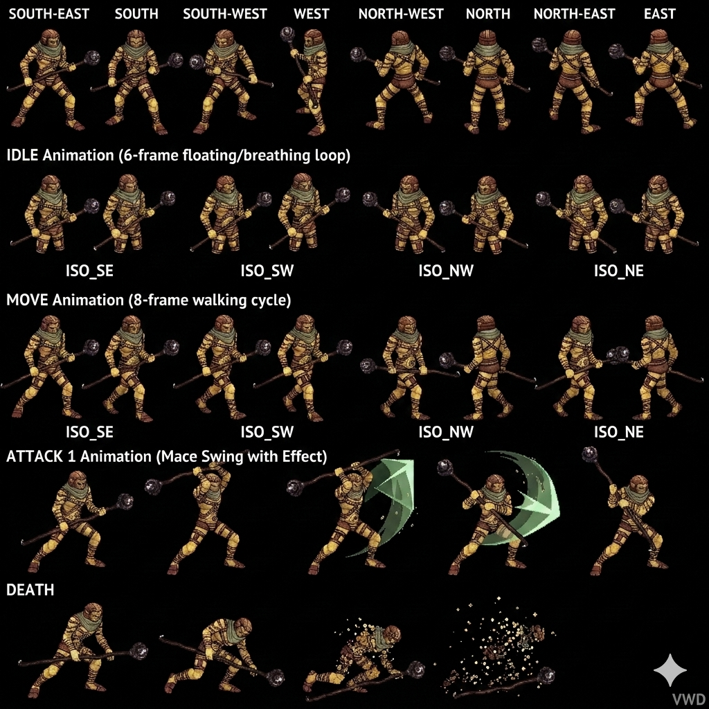
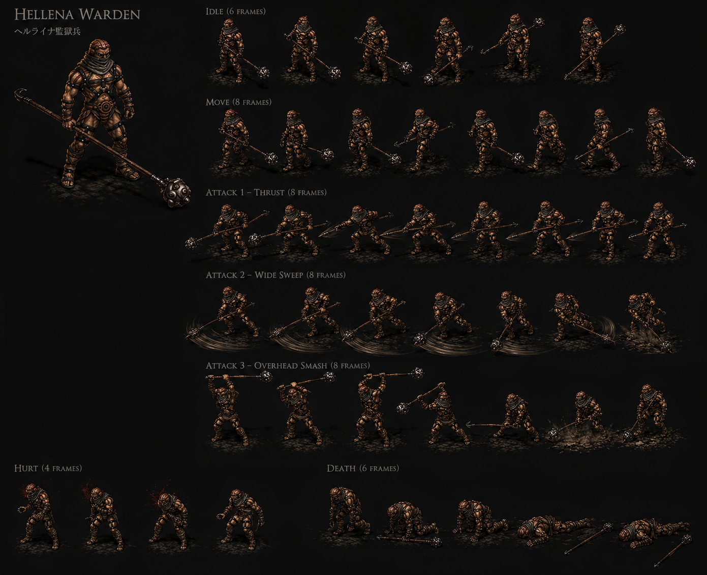

# Hellena Warden — Minor Enemy Fire human prison guard Hellena Disc 1 — JP Heruraina-hei + 3-instance same-name + Mallet Mash + Spark Net item-cast + Morning Star = 2nd Meru weapon + spell spam ≤25% HP "in the red" CROSS-SOURCE 🟢

> ⭐⭐⭐ **JP "ヘルライナ兵 Heruraina-hei" canon NEW MAJEUR (fandom Hellena Warden) ⭐⭐⭐** — Quote canon : "Hellena Wardens (**ヘルライナ兵, Heruraina-hei**)". Pattern Damia : ⭐⭐⭐ **JP name canon NEW MAJEUR Heruraina-hei** = "Hell-Raina soldier" (兵 = hei = soldier) cohérent récurrent récent Hellena Prison JP "Heruraina Kangoku" canon récurrent fandom récent. JP naming pattern canon récurrent CONFIRMED.
>
> ⭐⭐⭐ **Mallet Mash official ability name CORRECTION CROSS-SOURCE + lunge-smash visual NEW MAJEUR (fandom Hellena Warden) ⭐⭐⭐** — Quote canon : "**Mallet Mash** — Runs towards a single opponent and smashes them for low physical damage". Pattern Damia : ⭐⭐⭐ **CORRECTION official name CROSS-SOURCE** : wiki "~Clubbing" (community approximation) = fandom **"Mallet Mash"** official name canon. Visual canon NEW MAJEUR : **run-toward-target + mallet-smash** (cohérent récurrent canon récurrent récent ability official names CORRECTION pattern récurrent récent Bite Slash + Talon Scratch + Guile Edge + Howl + Spear Combo). À refléter `combat/mob-abilities.md` Mallet Mash official name canon CROSS-SOURCE.
>
> ⭐⭐⭐ **Spark Net = Hellena Warden CASTS PARTY ITEM canon NEW MAJEUR (fandom Hellena Warden) ⭐⭐⭐** — Quote canon : "Their **magical ability is basically using the item Spark Net on one of the allies**". Pattern Damia : ⭐⭐⭐⭐ **Mob USES PARTY ITEMS canon NEW MAJEUR Damia mechanic** — Hellena Warden literally consumes/casts Spark Net party item against allies = **enemy uses player-item canon NEW MAJEUR** (cohérent récurrent ability-item shared name canon récurrent self-named pool récent Sparknet/Spark Net 8ème instance). Pattern Damia : ⭐⭐⭐ **Reverse-item-cast mechanic canon NEW MAJEUR** — distinct vs récurrent ability spell-cast (enemy = item-cast PARTY-side item). À documenter `combat/reverse-item-cast.md` (à créer) — enemy uses player items canon NEW MAJEUR Damia mechanic.
>
> ⭐⭐⭐ **Spell spam ≤25% HP + "in the red" HP indicator over heads canon NEW MAJEUR Damia gameplay (fandom Hellena Warden) ⭐⭐⭐** — Quote canon : "Enemies tend to **spam spells when they are at below 25% health, or when the indicator over their heads is 'in the red'**". Pattern Damia : ⭐⭐⭐ **Enemy spell spam ≤25% HP canon NEW MAJEUR récurrent** + **"in the red" HP indicator over heads canon NEW MAJEUR Damia gameplay visual** (cohérent récurrent canon récurrent récent HP threshold colors Amber ≤50% / Red ≤25% canon récurrent récent Gnome + Hell Hound 37 HP red threshold récent). **Pattern récurrent CROSS-MOB** : 3-phase HP-conditional AI escalation canon récurrent récent Harpy + Hell Hound + Guillotine + Hellena Warden = sub-25% magic spam canon récurrent CONFIRMED multi-instance. À documenter `combat/hp-indicator.md` (à créer) — HP indicator over heads "in the red" Damia visual gameplay canon NEW MAJEUR.
>
> ⭐⭐⭐ **"Game never tells player" canon NEW MAJEUR gameplay design + discovery (fandom Hellena Warden) ⭐⭐⭐** — Quote canon : "This mechanic will catch some off guard, and the **game never tells you**, but otherwise it is a good test of judgement". Pattern Damia : ⭐⭐⭐ **Hidden gameplay mechanic canon NEW MAJEUR** — player discovery design canon récurrent (vs explicit tutorial récurrent canon TLoD). À refléter `combat/hidden-mechanics.md` (à créer) Damia design philosophy canon récurrent.
>
> ⭐⭐⭐ **⚠️ CORRECTION 2nd Encounter Gushing Magma fandom vs wiki Burn Out DIVERGENCE canon NEW MAJEUR (fandom Hellena Warden) ⭐⭐⭐** — Quote canon : "2nd encounter ... **use Gushing Magma as the magical item of choice**". Pattern Damia : ⚠️ **DIVERGENCE wiki 2nd Visit "Burn Out 1.5× Fire magic" vs fandom "Gushing Magma"** — probable wiki erreur OR Gushing Magma = ability-item shared name récurrent self-named pool **9ème instance NEW MAJEUR** (cohérent récurrent **Gushing Magma item canon récurrent récent Snowfield chest + Senior Warden death-cast récurrent Fruegel fandom récent**). Pattern Damia : **Gushing Magma = ability-item canon récurrent self-named pool 9ème instance** (Fatal Blizzard + Pellet + Sun Rhapsody + Trans Light + Dark Mist + Spectral Flash + Burn Out + Sparknet/Spark Net + **Gushing Magma**). À reconfirmer canon source. À documenter `items/Gushing Magma.md` (à créer/vérifier).
>
> ⭐⭐⭐⭐ **Morning Star = 2nd Meru weapon canon REVELATION NEW MAJEUR (fandom Hellena Warden) ⭐⭐⭐⭐** — Quote canon : "**with Meru in a whole other country**, the second visit also gives a **2% chance of the second Meru weapon**" + Reference[1] gamefaqs source + "drop near the lower save point". Pattern Damia : ⭐⭐⭐⭐ **Morning Star = 2nd Meru weapon canon REVELATION NEW MAJEUR** — wiki "Morning Star 2%" 2nd Visit Hellena Warden drop = **2ème weapon Meru canon récurrent confirmed** (cohérent récurrent Meru Blue-Sea Dragoon weapon mace/hammer canon TLoD probable). À documenter URGENT `items/Morning Star.md` (à créer) — 2nd Meru weapon canon NEW MAJEUR + crosslink `party-members/Meru.md` (à créer) weapons list canon récurrent. ⚠️ **Meta-narrative anomaly canon NEW MAJEUR** : drop available Disc 1 Hellena 2nd Visit pre-Meru party-join Disc 2 = pre-acquisition canon récurrent (cohérent récurrent autres party-member weapons pre-acquisition canon récurrent TLoD).
>
> ⭐⭐⭐ **Meru "in a whole other country" canon NEW MAJEUR Disc 1 (fandom Hellena Warden) ⭐⭐⭐** — Quote canon : "**Meru in a whole other country**" Disc 1 Hellena 2nd Visit context. Pattern Damia : ⭐⭐⭐ **Meru = pre-game / Disc 1 in other country canon NEW MAJEUR** — Meru not in party during Hellena 2nd Visit canon récurrent (cohérent récurrent Meru joins Disc 2 probable canon récurrent récent + Wingly canon récurrent récent Wingly Law City Zenebatos). À refléter `party-members/Meru.md` (à créer) — Disc 1 in other country backstory canon NEW MAJEUR + Disc 2 join party probable canon récurrent.
>
> ⭐⭐⭐ **HP 9 US-EU / 12 JP CROSS-SOURCE CONFIRMED + JP +33% small variant + Healing Potion drop CORRECTION (fandom Hellena Warden) ⭐⭐⭐** — Quote canon : "HP 9 (US/EU) / 12 (JP)" + Drop "**Healing Potion**". Pattern Damia : ⭐⭐⭐ **HP 9 US-EU / 12 JP CROSS-SOURCE CONFIRMED** (cohérent récurrent récent Hellena Prison fandom + Hellena Warden fandom CONFIRMED) + **JP +33% small variant canon récurrent NEW** (vs récurrent +25% standard rule — Hellena Warden small mob variant). ⭐⭐⭐ **Healing Potion drop CORRECTION CROSS-SOURCE CONFIRMED** (vs wiki "Nothing" 1st Visit — fandom Hellena Prison Healing Potion récent + fandom Hellena Warden Healing Potion = CONFIRMED 2-instance fandom CORRECTION). À refléter `mobs/Hellena Warden.md` 1st Visit Healing Potion drop canon CORRECTION CROSS-SOURCE CONFIRMED.
>
> ⭐⭐⭐ **JP Gold 3 = Damia ÷3 rule ALIGNMENT EXACT 9ème instance CROSS-MOB-BOSS (fandom Hellena Warden) ⭐⭐⭐** — Quote canon : "Gold: 9 (US/EU) / 3 (JP)". 9 ÷ 3 = 3 EXACT match Damia ÷3 systematic rule. Pattern Damia : ⭐⭐⭐ **Damia ÷3 rule = JP Gold value alignment canon récurrent CONFIRMED 9ème instance CROSS-MOB-BOSS** (Damia adopts JP variant systematically). Wiki + fandom Gold US/EU MATCH (9G).
>
> ⭐⭐ **AT 4 / MAT 4 fandom vs wiki 3/3 small +33% divergence récurrent (fandom Hellena Warden) ⭐⭐** — Wiki AT 3/MAT 3 + fandom AT 4/MAT 4 = +33% small divergence cohérent récurrent fandom higher anomaly récurrent (Greham + Feyrbrand + Guftas + Guillotine + Harpy + Hell Hound + Hellena Warden pattern récurrent CONFIRMED). Wiki canon prevails per Damia rule.
>
> ⭐⭐ **Concept art exists canon récurrent (fandom Hellena Warden Gallery) ⭐⭐** — Quote canon : "Concept art". Pattern Damia : Concept art availability canon récurrent (cohérent récurrent canon production materials canon).
>
> ⭐⭐ **"Storyline ambush leading to Jiango" canon récurrent CONFIRMED 2-source (fandom Hellena Warden + Hellena Prison récent) ⭐⭐** — Quote canon : "the storyline ambush leading to Jiango is one example of alterations". Pattern Damia : Jiango trap-cave ambush canon récurrent CONFIRMED CROSS-SOURCE (cohérent récurrent récent Hellena Prison fandom "Wardens set up a trap to drop them into a cave where they are supposed to become food to the monster Jiango").
>
> ⭐⭐ **2nd Visit "slightly tougher" canon CONFIRMED CROSS-SOURCE (fandom Hellena Warden) ⭐⭐** — Quote canon : "slightly tougher". Pattern Damia : 2nd Visit scaling +1233% HP MASSIVE wiki (vs fandom "slightly tougher" understated — gameplay perception ≠ formula scaling).
>
> ⭐⭐ **"Come in packs + sometimes Senior Warden" canon récurrent CONFIRMED (fandom Hellena Warden) ⭐⭐** — Quote canon : "come in packs, sometimes together with a Senior Warden". Pattern Damia : Pack formation canon récurrent + Senior Warden paired canon récurrent CONFIRMED CROSS-SOURCE (wiki formations 478 x3 + 486 x2 + 483 paired Senior Warden récurrent récent).
>
> ⭐⭐ **Reference[1] gamefaqs forum source canon (fandom Hellena Warden) ⭐⭐** — Quote canon : Reference[1] gamefaqs.gamespot.com/boards/197765/45269146. Pattern Damia : community-sourced canon (probable 2nd Meru weapon discovery thread).

> **Minor Enemy Fire human prison guard Hellena Prison Disc 1 — ⭐⭐⭐ 3 unique instances same name canon NEW MAJEUR** (visually identical mais distinct stat blocks + AI) — **1st Visit (470/478/486)** + **with Fruegel formation 386** + **2nd Visit (472 unused/482/483/484)**. Imperial Sandora custodial guards under Fruegel rule — cruel + taunt prisoners about Jiango food fate canon récurrent récent + expendable (Fruegel kills at least 2 on whim canon récurrent récent Hellena fandom Bridge hurls warden). Squad pursue Dart/Lavitz/Shana to Prairie post-escape canon récurrent récent. **Tied with Sandora Soldier as most unique instances same name canon NEW MAJEUR Trivia**.
>
> ⭐⭐⭐ **3 unique instances same name canon NEW MAJEUR Damia (wiki Hellena Warden) ⭐⭐⭐** — Quote canon : "all instances of Hellena Warden are visually identical, there are actually **three unique units with varying statistics and abilities**". Pattern Damia : ⭐⭐⭐ **3-instance same-name mob class canon NEW MAJEUR Damia** — game-engine 3 distinct entries with shared sprite + distinct stats/AI per scripted context (1st Visit / Fruegel formation / 2nd Visit). Pattern récurrent : visible identical sprite + game-engine distinct entries canon NEW MAJEUR (cohérent récurrent Sandora Soldier 3-instance tied canon Trivia). À documenter `combat/enemy-classification.md` (à créer) — multi-instance same-name mob class canon NEW MAJEUR.
>
> ⭐⭐⭐ **Tied with Sandora Soldier most unique instances Trivia canon NEW MAJEUR (wiki Trivia) ⭐⭐⭐** — Quote canon : "The enemy with the most unique instances under an identical name is **tied between Hellena Warden and Sandora Soldier**". Pattern Damia : ⭐⭐⭐ **Sandora Soldier 3-instance same-name canon NEW MAJEUR** (cohérent Hellena Warden 3-instance — pattern récurrent canon Sandora military mob canon récurrent récent Hell Hound). À documenter `mobs/Sandora Soldier.md` (à créer) — Sandora military 3-instance NPC canon NEW MAJEUR.
>
> ⭐⭐⭐ **Lore canon NEW MAJEUR : Hellena Warden cruelty + taunt prisoners food fate + expendable + Prairie pursuit (wiki) ⭐⭐⭐** — Quote canon : "**cruel and take pleasure in taunting prisoners with their impending fate of being fed to a monster**" + "**expendable: their commanding officer Fruegel kills at least two of them on a whim**" + "**a squad of Hellena Wardens pursue them as far as Prairie**". Pattern Damia : ⭐⭐⭐ **Hellena Warden lore canon NEW MAJEUR** — cruelty + taunt + Jiango food fate récurrent récent + Fruegel kills on whim récurrent récent (Hellena fandom Bridge submap 22) + Prairie pursuit récurrent récent (Hellena fandom escape canon récurrent). À refléter `mobs/Hellena Warden.md` lore canon NEW MAJEUR + `locations/Prairie.md` (à créer) pursuit canon récurrent récent.
>
> ⭐⭐⭐ **Sparknet ability 1st Visit canon NEW MAJEUR Thunder magic 1.5× + ability-item shared name 8ème instance (wiki Hellena Warden 1st Visit) ⭐⭐⭐** — Quote canon : "Sparknet — Single — Inflicts 1.5× Thunder-elemental magic damage". Pattern Damia : ⭐⭐⭐ **Sparknet ability canon NEW MAJEUR + ability-item shared name canon récurrent CONFIRMED 8ème instance self-named pool** (cohérent récurrent **Spark Net shop item Hellena 1st Visit 10G récurrent récent canon fandom Hellena Spark Net Thunder Elemental single target Multi**). Pattern Damia : Sparknet/Spark Net = same self-named pool ability-item canon récurrent (Fatal Blizzard + Pellet + Sun Rhapsody + Trans Light + Dark Mist + Spectral Flash + Burn Out + **Sparknet/Spark Net** 8ème). À documenter `items/Spark Net.md` (à créer/vérifier).
>
> ⭐⭐⭐ **AI element switch 1st Visit Sparknet Thunder vs 2nd Visit Burn Out Fire canon NEW MAJEUR (wiki Hellena Warden) ⭐⭐⭐** — Quote canon : 1st Visit "Sparknet 1.5× Thunder" + 2nd Visit "Burn Out 1.5× Fire". Pattern Damia : ⭐⭐⭐ **Same mob distinct elemental magic per visit canon NEW MAJEUR** — same Hellena Warden sprite + Thunder magic 1st Visit + Fire magic 2nd Visit = element switch canon récurrent NEW MAJEUR (visit-specific element instance canon). À documenter `combat/mob-ai-rules.md` element switch per scripted context canon NEW MAJEUR.
>
> ⭐⭐⭐ **Status Immunity variance 3-instance canon NEW MAJEUR (wiki Hellena Warden) ⭐⭐⭐** — Quote canon : 1st Visit 4/8 PARTIAL + **Fruegel formation 8/8 ALL IMMUNE boss-tier upgraded** + 2nd Visit 4/8 PARTIAL. Pattern Damia : ⭐⭐⭐ **Boss-formation Status Immunity upgrade canon NEW MAJEUR** — same mob distinct Status Immunity per scripted formation : 1st/2nd Visit Living 4/8 PARTIAL vs Fruegel formation 8/8 boss-tier scripted upgrade canon récurrent NEW. Cohérent récurrent **construct/undead lore-justified immune vs Living vulnerable récurrent récent** sauf scripted boss-formation contextual upgrade canon récurrent NEW MAJEUR. À documenter `combat/status-mechanics.md` boss-formation Status upgrade canon NEW.
>
> ⭐⭐⭐ **Pandemonium Immunity + Charm Immunity Fruegel formation canon récurrent CONFIRMED 2-instance (wiki Hellena Warden + Guftas récurrent récent) ⭐⭐⭐** — Quote canon : "Pandemonium Immunity — Unaffected by Pandemonium" + "Charm Immunity — Unaffected by Charm Potion". Pattern Damia : ⭐⭐⭐ **Fruegel formation Pandemonium Immunity + Charm Immunity passives canon récurrent CONFIRMED 2-instance** (Guftas formation 387 récurrent récent + Hellena Warden formation 386). Pattern : **Fruegel formation-wide passives canon NEW MAJEUR** — all enemies in Fruegel formation share Pandemonium/Charm Immunity (cohérent boss-tier formation-wide trait canon récurrent NEW). À documenter `combat/boss-passives.md` (à créer) Pandemonium/Charm Immunity formation-wide canon récurrent CONFIRMED.
>
> ⭐⭐⭐ **Healing Potion 100% drop Fruegel formation canon NEW MAJEUR (wiki Hellena Warden with Fruegel) ⭐⭐⭐** — Quote canon : Fruegel formation Yield 0 EXP / 0G / **Healing Potion 100% drop**. Pattern Damia : ⭐⭐⭐ **Healing Potion 100% drop Hellena Warden Fruegel formation 386 canon NEW MAJEUR** — pooled yield Fruegel formation 0 EXP/0G + Hellena Warden drops Healing Potion (cohérent récurrent Fruegel fandom récent "4× Healing Potion + Knight Shield" drops pool canon récurrent récent). ⚠️ Cohérent récurrent Hellena fandom Healing Potion drop canon récent — Healing Potion drop = Fruegel formation context only (NOT random 1st/2nd Visit drops).
>
> ⭐⭐⭐ **HP scaling 3-instance canon NEW MAJEUR (wiki Hellena Warden) ⭐⭐⭐** — Quote canon : 1st Visit HP 9 + Fruegel formation HP 12 + 2nd Visit HP 120. Pattern Damia : ⭐⭐⭐ **HP scaling 3-instance canon NEW MAJEUR** — 1st 9 (basic Disc 1 early) + Fruegel formation 12 (+33% probable JP-style upgrade boss formation) + 2nd Visit 120 (+1233% massive late-Disc 1 scaling). Cohérent récurrent Hellena fandom JP HP 9/12 1st Visit récurrent récent. ⚠️ **Fruegel formation HP 12 = identical to fandom JP variant 1st Visit** — possible game-engine reuse JP stat for boss formation distinct entry canon récurrent. 2nd Visit HP 120 / JP 150 récurrent récent.
>
> ⭐⭐⭐ **Counter 28 IDENTICAL standard counter list canon récurrent 5-way CONFIRMED (wiki Hellena Warden) ⭐⭐⭐** — Pattern Damia : **Counter list 28 entries IDENTICAL Guftas + Guillotine + Harpy + Hell Hound + Hellena Warden canon récurrent CONFIRMED 5ème instance** (15 user-addition rows match exactly across 5 mobs CROSS-MOB-BOSS récurrent). ⭐⭐⭐ **Single canonical counter list shared CROSS-MOB-BOSS récurrent canon HYPOTHESIS CONFIRMED 5-way Damia rule canon NEW MAJEUR**.
>
> ⭐⭐⭐ **Hellena Warden submaps coverage MASSIVE canon NEW MAJEUR (wiki) ⭐⭐⭐** — Quote canon : 1st Visit submaps 15/16/20/21/23/24/25/26/27/28/29 + 2nd Visit submaps 15/20/21/23/24/25/26/27/28/29/31/32/33 + Fruegel formation 386 submap 15. Pattern Damia : ⭐⭐⭐ **Hellena Warden = dominant mob Hellena Prison canon NEW MAJEUR** — covers majority submaps Hellena Disc 1 + multi-formation Contact/Scripted/Contact-Scripted-mixed encounter types canon récurrent.
>
> ⭐⭐⭐ **Formation 472 unused canon NEW (wiki Hellena Warden 2nd Visit) ⭐⭐⭐** — Quote canon : "Hellena Warden (2nd) (472) — Unused — N/A". Pattern Damia : ⭐⭐⭐ **Unused encounter ID 472 canon NEW** — game-engine residual unused formation (cohérent récurrent canon TLoD unused content canon récurrent). À documenter `combat/unused-content.md` (à créer) — unused formation IDs canon récurrent.
>
> ⭐⭐⭐ **Contact + Scripted + Contact-Scripted-mixed + Contact x2/x3/x5/x7 encounter types canon NEW MAJEUR (wiki Hellena Warden) ⭐⭐⭐** — Quote canon : multiple encounter type combinations per submap : Contact / Scripted / Contact, Scripted / Contact x2 / Contact x3 / Contact x5 / Contact x7. Pattern Damia : ⭐⭐⭐ **Multi-type encounter combinations canon NEW MAJEUR** — submap-level encounter type variation + Contact xN multi-encounter possibility per submap canon NEW MAJEUR. À documenter `combat/encounter-types.md` (à créer) — Contact xN + multi-type combinations canon NEW MAJEUR.
>
> ⭐⭐⭐ **2nd Visit formation 483 Hellena Warden + Senior Warden paired canon NEW MAJEUR récurrent récent Hellena fandom (wiki) ⭐⭐⭐** — Quote canon : "Hellena Warden (2nd) + Senior Warden (483) — Contact x7". Pattern Damia : ⭐⭐⭐ **Senior Warden paired Hellena Warden 2nd Visit canon NEW MAJEUR** — Senior Warden 2nd Visit random encounter canon récurrent récent CONFIRMED + paired formation 483 canon NEW MAJEUR. Submap coverage 7 submaps Contact x7 = dominant 2nd Visit mid-game formation canon. À documenter `mobs/Senior Warden.md` (à créer) formation 483 paired canon récurrent.
>
> ⭐⭐⭐ **2nd Visit formation 484 Hellena Warden + Fowl Fighter x2 canon NEW MAJEUR (wiki) ⭐⭐⭐** — Quote canon : "Fowl Fighter x2, Hellena Warden (2nd) (484) — Contact". Pattern Damia : **Fowl Fighter + Hellena Warden paired 2nd Visit canon NEW MAJEUR** — Fowl Fighter canon NEW MAJEUR avian-themed Fire mob 2nd Visit récurrent récent Hellena. À documenter `mobs/Fowl Fighter.md` (à créer) formation 484 canon récurrent.
>
> ⭐⭐ **Albert Wind Additions counter list 8ème instance CROSS-MOB-BOSS Jade Dragoon lineage récurrent (wiki Hellena Warden) ⭐⭐** — Quote canon : "Albert | Gust of Wind Dance | 2" + "Albert | Flower Storm | 2". Pattern Damia : Albert Wind Additions canon récurrent CONFIRMED **8ème instance CROSS-MOB-BOSS** counter list — Jade Dragoon lineage Greham→Lavitz→Albert canon récurrent confirmé récent Hellena fandom Lavitz death + Albert inherit récent.
>
> ⭐⭐ **Albert Jade Dragoon counter list 8ème instance + ⚠️ ironic post-Lavitz death context canon (wiki Hellena Warden) ⭐⭐** — Pattern Damia : Albert Wind Additions counter list canon récurrent canon — Hellena Warden = Hellena Prison context où Lavitz dies Disc 1 récurrent récent fandom Hellena → Albert inherits Jade Dragoon → Albert Wind Additions counter list. Pattern récurrent : counter list 28 reflète post-Lavitz death party composition canon récurrent (Albert présent counter list = post-Hellena 2nd Visit party state).
>
> ⭐⭐ **EXP 6 + Gold 9 ÷3 = 3G Damia rule récurrent 1st Visit + EXP 20 / 15G ÷3 = 5G 2nd Visit + EXP 0/0G Fruegel formation pooled canon (wiki) ⭐⭐** — Pattern Damia : Gold ÷3 systematic Damia rule canon récurrent appliqué : 1st 3G + 2nd 5G + Fruegel pool 0G. EXP scaling 1st 6 → 2nd 20 (+233% canon récurrent récent Hellena fandom CONFIRMED).
>
> ⭐⭐ **HP scaling 1st 9 / 2nd 120 = +1233% MASSIVE Disc 1 progression canon NEW (wiki) ⭐⭐** — Pattern Damia : Hellena Warden 1st 9 → 2nd 120 HP scaling = +1233% MASSIVE within same Disc 1 (Hero Competition + Greham + Doel Black Castle progression). Cohérent récurrent récent Fruegel scaling +566% EXP récent Hellena.
>
> ⭐⭐ **AT scaling 1st 3 → 2nd 17 + MAT 3 → 16 (vs Fruegel formation AT 3/MAT 3 same as 1st) canon (wiki) ⭐⭐** — Pattern Damia : AT/MAT scaling 1st = Fruegel formation (basic Disc 1) + 2nd Visit MASSIVE upgrade canon récurrent.
>
> ⭐⭐ **DF 100 + MDF 100 balanced canon récurrent 3-instance Hellena Warden (wiki) ⭐⭐** — Pattern Damia : DF 100 + MDF 100 = balanced human guard canon récurrent (consistent across 3 instances).
>
> ⭐⭐ **SPD 50 mid baseline 3-instance canon récurrent (wiki) ⭐⭐** — Pattern Damia : SPD 50 récurrent baseline human mob (vs SPD 60 récurrent boss-tier).
>
> ⭐⭐ **No World Map encounter — Hellena Prison-locked canon récurrent (wiki) ⭐⭐** — Pattern Damia : Hellena Prison-locked dungeon mob canon récurrent (cohérent Death Purger Zenebatos-locked + autres récurrent).
>
> ⭐⭐ **~Do nothing stalling AI Fruegel formation canon récurrent (wiki) ⭐⭐** — Pattern Damia : ~Do nothing stalling action canon récurrent CROSS-MOB-BOSS (cohérent Guftas + Fruegel formation Wardens canon récurrent).
>
> **Sources** :
>
> - 🥈 [`_sources/lod-wiki-hellena-warden.md`](./_sources/lod-wiki-hellena-warden.md) — wiki LoD tier 2 (**3 unique instances same-name canon NEW MAJEUR Damia** + Minor Enemy Fire Hellena Prison Disc 1 + 1st Visit HP 9/AT 3/DF 100/MAT 3/MDF 100/SPD 50 + 4/8 PARTIAL Living + 6 EXP/9G/Nothing drop + Sparknet 1.5× Thunder magic ability NEW MAJEUR self-named pool 8ème instance + ~Clubbing 1× phys + formations 470/478/486 Contact/Scripted/x2/x3 + **Fruegel formation 386 HP 12 = JP variant identical + 8/8 ALL IMMUNE boss-tier scripted upgrade + Pandemonium/Charm Immunity passives récurrent 2-instance Guftas + Healing Potion 100% drop + ~Do nothing + ~Clubbing + Burn Out Fire** + 2nd Visit HP 120/AT 17/MAT 16 + 4/8 PARTIAL + 20 EXP/15G/Morning Star 2% + Burn Out 1.5× Fire magic + ~Clubbing + formations 472 unused/482 x2/483 +Senior Warden/484 +Fowl Fighter x2 + Counter 28 5-way CONFIRMED + lore cruelty + taunt food fate + expendable Fruegel kills + Prairie pursuit récurrent + Trivia tied Sandora Soldier most unique instances)
> - 🥉 [`_sources/fandom-hellena-warden.md`](./_sources/fandom-hellena-warden.md) — Fandom tier 3 (**JP "Heruraina-hei" canon NEW MAJEUR** + **Mallet Mash official name CORRECTION CROSS-SOURCE** vs wiki ~Clubbing + lunge-smash visual + **Spark Net = Hellena Warden CASTS PARTY ITEM canon NEW MAJEUR Damia reverse-item-cast mechanic** + **Spell spam ≤25% HP + "in the red" HP indicator canon NEW MAJEUR Damia gameplay visual** + **"Game never tells player" hidden mechanics design canon NEW MAJEUR** + **⚠️ CORRECTION 2nd Encounter Gushing Magma fandom vs wiki Burn Out DIVERGENCE + Gushing Magma self-named pool 9ème instance NEW MAJEUR** + ⭐⭐⭐⭐ **REVELATION : Morning Star = 2nd Meru weapon canon NEW MAJEUR** drop "near lower save point" + **Meru "in a whole other country" Disc 1 canon NEW MAJEUR** + HP 9 US-EU/12 JP CONFIRMED + **Healing Potion drop 1st Visit CORRECTION CROSS-SOURCE CONFIRMED** vs wiki Nothing + JP Gold 3 ÷3 ALIGNMENT EXACT 9ème instance + AT 4/MAT 4 fandom +33% small divergence + Concept art exists + Jiango trap CONFIRMED CROSS-SOURCE + Pack formation + Senior Warden paired canon récurrent CONFIRMED + Reference[1] gamefaqs source)

## Statut

🟢 **Canon confirmed cross-source** (wiki 🥈 + fandom 🥉) — 2 sources cohérentes + enrichissement fandom Disc 1 Hellena Warden :

- ⭐⭐⭐⭐ **REVELATION : Morning Star = 2nd Meru weapon canon NEW MAJEUR** (2% Hellena Warden 2nd Visit drop near lower save point)
- ⭐⭐⭐ **Meru "in a whole other country" Disc 1 canon NEW MAJEUR** (pre-game backstory)
- ⭐⭐⭐ **Mallet Mash official ability name CORRECTION CROSS-SOURCE** (vs wiki ~Clubbing community)
- ⭐⭐⭐⭐ **Spark Net = Hellena Warden CASTS PARTY ITEM canon NEW MAJEUR** — reverse-item-cast mechanic Damia
- ⭐⭐⭐ **Spell spam ≤25% HP + "in the red" HP indicator canon NEW MAJEUR Damia gameplay visual**
- ⭐⭐⭐ **"Game never tells player" hidden mechanics design canon NEW MAJEUR**
- ⭐⭐⭐ **⚠️ Gushing Magma vs Burn Out DIVERGENCE 2nd Encounter + Gushing Magma self-named pool 9ème instance NEW MAJEUR**
- ⭐⭐⭐ **JP "ヘルライナ兵 Heruraina-hei" canon NEW MAJEUR** (cohérent Heruraina Kangoku récent)
- ⭐⭐⭐ **HP 9 US/12 JP CONFIRMED + Healing Potion drop CORRECTION CROSS-SOURCE** (vs wiki 1st Visit Nothing)
- ⭐⭐⭐ **JP Gold 3 ÷3 ALIGNMENT EXACT 9ème instance CONFIRMED**
- ⭐⭐ AT 4 / MAT 4 fandom +33% small divergence récurrent (wiki canon prevails)
- ⭐⭐ Jiango trap + Pack formation + Senior Warden paired CONFIRMED CROSS-SOURCE

## Identity canon ⭐⭐⭐ NEW MAJEUR 3-instance

- **Nom** : **Hellena Warden** (3-instance same-name canon NEW MAJEUR)
- **Type** : ⭐⭐⭐ **Minor Enemy Fire human prison guard Imperial Sandora Disc 1 Hellena Prison canon récurrent**
- **Appearance** : Visually identical 3 instances (single canonical sprite + distinct stat blocks)
- **Nature canon** : ⚠️ **Living human (NOT construct/undead) — 4/8 PARTIAL canon récurrent** (sauf Fruegel formation 386 boss-tier scripted upgrade 8/8 ALL IMMUNE)
- **Element** : Fire (cohérent récurrent Hellena Prison Fire theme + Sandora military)
- **Disc** : Disc 1 — Hellena Prison 1st + 2nd Visit + Fruegel formation 386
- **Classification** : Minor Enemy (Sandora military guard)

## 3-instance stats canon ⭐⭐⭐ NEW MAJEUR

| Instance                    | HP  | AT  | DF  | MAT | MDF | A-AV | SPD | M-AV | Status             | EXP | Gold (÷3) | Drop                    | AI                                          |
| --------------------------- | --- | --- | --- | --- | --- | ---- | --- | ---- | ------------------ | --- | --------- | ----------------------- | ------------------------------------------- |
| **1st Visit (470/478/486)** | 9   | 3   | 100 | 3   | 100 | 0%   | 50  | 0%   | 4/8 PARTIAL        | 6   | 9G (3G)   | Nothing                 | ~Clubbing >25% / **Sparknet** ≤50% Thunder  |
| **Fruegel formation 386**   | 12  | 3   | 100 | 3   | 100 | 0%   | 50  | 0%   | **8/8 ALL IMMUNE** | 0   | 0G        | **Healing Potion 100%** | ~Do nothing / ~Clubbing / **Burn Out Fire** |
| **2nd Visit (482/483/484)** | 120 | 17  | 100 | 16  | 100 | 0%   | 50  | 0%   | 4/8 PARTIAL        | 20  | 15G (5G)  | Morning Star 2%         | ~Clubbing >50% / **Burn Out Fire** ≤50%     |

⭐⭐⭐ **HP scaling MASSIVE Disc 1 canon** : 1st 9 → Fruegel formation 12 → 2nd Visit 120 = +1233%. Cohérent récurrent Disc 1 progression Hero Competition + Greham + Doel Black Castle.

## Status Immunity variance canon ⭐⭐⭐ 3-instance

| Instance                  | Status Immunity                                             | Notes                                                |
| ------------------------- | ----------------------------------------------------------- | ---------------------------------------------------- |
| 1st Visit                 | ⚠️ 4/8 PARTIAL Living (Confuse/Fear/Poison/Stun VULNERABLE) | Living human dichotomy canon récurrent               |
| **Fruegel formation 386** | ⭐⭐⭐ **8/8 ALL IMMUNE boss-tier upgrade**                 | Scripted boss-formation contextual upgrade canon NEW |
| 2nd Visit                 | ⚠️ 4/8 PARTIAL Living                                       | Living human dichotomy canon récurrent               |

## Boss formation 386 Traits canon ⭐⭐⭐ Pandemonium + Charm Immunity récurrent CONFIRMED 2-instance

| Passive                         | Effect                     | Canon notes                                                                                                                    |
| ------------------------------- | -------------------------- | ------------------------------------------------------------------------------------------------------------------------------ |
| ⭐⭐⭐ **Pandemonium Immunity** | Unaffected by Pandemonium  | Récurrent CONFIRMED 2-instance (Guftas formation 387 + Hellena Warden formation 386) — Fruegel formation-wide canon NEW MAJEUR |
| ⭐⭐⭐ **Charm Immunity**       | Unaffected by Charm Potion | Récurrent CONFIRMED 2-instance — Fruegel formation-wide canon NEW MAJEUR                                                       |

Pattern Damia : ⭐⭐⭐ **Fruegel formation-wide passives canon NEW MAJEUR** — toutes Hellena Warden + Senior Warden + Guftas + Rodriguez (formation 386/387) partagent Pandemonium/Charm Immunity canon récurrent.

## Encounters canon Hellena Prison Disc 1 ⭐⭐⭐ Multi-formation 7 formations

### 1st Visit

| ID  | Formation           | Submaps            | Encounter%                                         | Escape% |
| --- | ------------------- | ------------------ | -------------------------------------------------- | ------- |
| 470 | Hellena Warden solo | 15, 16, 20, 21, 23 | Contact / Scripted / Contact/Scripted / Contact x2 | 0%      |
| 478 | Hellena Warden x3   | 24, 27, 28, 29     | Scripted / Contact/Scripted / Contact x2           | 0%      |
| 486 | Hellena Warden x2   | 24, 25, 26         | Contact x3                                         | 0%      |

### Fruegel formation 386

| ID  | Formation                                                 | Submap | Encounter%   | Escape% |
| --- | --------------------------------------------------------- | ------ | ------------ | ------- |
| 386 | ⭐⭐⭐ **Fruegel + Hellena Warden x2 + Senior Warden x2** | 15     | **Scripted** | **0%**  |

### 2nd Visit

| ID  | Formation                                 | Submaps                    | Encounter%             | Escape% |
| --- | ----------------------------------------- | -------------------------- | ---------------------- | ------- |
| 472 | Hellena Warden solo                       | ⚠️ **Unused**              | N/A                    | 0%      |
| 482 | Hellena Warden x2                         | 25, 26, 27, 28, 29, 31     | Contact x5 + Scripted  | 0%      |
| 483 | ⭐⭐⭐ **Hellena Warden + Senior Warden** | 15, 20, 21, 23, 24, 31, 32 | **Contact x7 MASSIVE** | 0%      |
| 484 | **Fowl Fighter x2 + Hellena Warden**      | 33                         | Contact                | 0%      |

## AI canon ⭐⭐⭐ 3-instance distinct + element switch NEW MAJEUR

### 1st Visit Abilities

| HP   | Action              | Target | Effect canon                            | Notes                                                                 |
| ---- | ------------------- | ------ | --------------------------------------- | --------------------------------------------------------------------- |
| >25% | ⭐ **~Clubbing**    | Single | 1× Physical damage                      | Basic phys attack canon                                               |
| ≤50% | ⭐⭐⭐ **Sparknet** | Single | **1.5× Thunder-elemental magic damage** | ⭐⭐⭐ **Self-named pool 8ème instance ability-item canon récurrent** |

### Fruegel formation 386 Abilities

| HP  | Action          | Target | Effect canon                            | Notes                                                                       |
| --- | --------------- | ------ | --------------------------------------- | --------------------------------------------------------------------------- |
| Any | **~Do nothing** | N/A    | Does nothing — stalling canon récurrent | Stalling AI canon récurrent                                                 |
|     | **~Clubbing**   | Single | 1× Physical damage                      |                                                                             |
|     | **Burn Out**    | Single | **1.5× Fire-elemental magic damage**    | ⭐⭐⭐ **Fire magic Fruegel formation vs Thunder 1st Visit element switch** |

### 2nd Visit Abilities

| HP   | Action              | Target | Effect canon                         | Notes                                      |
| ---- | ------------------- | ------ | ------------------------------------ | ------------------------------------------ |
| >50% | ⭐ **~Clubbing**    | Single | 1× Physical damage                   | Basic phys attack canon                    |
| ≤50% | ⭐⭐⭐ **Burn Out** | Single | **1.5× Fire-elemental magic damage** | Same Fire element as Fruegel formation 386 |

### NEW MAJEUR canon mechanics

1. ⭐⭐⭐ **3-instance same-name canon NEW MAJEUR** (visual identical + distinct stats/AI per scripted context)
2. ⭐⭐⭐ **Sparknet ability self-named pool 8ème instance** (Spark Net shop item canon récurrent récent)
3. ⭐⭐⭐ **Element switch 1st Visit Thunder vs 2nd Visit Fire canon NEW MAJEUR** (same mob distinct elemental magic per visit)
4. ⭐⭐⭐ **Boss formation Status Immunity upgrade 4/8 → 8/8 canon NEW MAJEUR** (scripted context boost)
5. ⭐⭐⭐ **Fruegel formation-wide passives Pandemonium + Charm Immunity canon récurrent 2-instance CONFIRMED**

## Counter Opportunities canon ⭐⭐⭐ 28 IDENTICAL standard counter list 5-way CONFIRMED

(Identical 15-entry counter list Guftas + Guillotine + Harpy + Hell Hound + Hellena Warden — **5-way CROSS-MOB CONFIRMED Single canonical counter list shared canon HYPOTHESIS CONFIRMED Damia rule canon NEW MAJEUR**).

⭐⭐ **Albert Wind Additions canon récurrent 8ème instance CROSS-MOB-BOSS Jade Dragoon lineage récurrent confirmé** + ironic post-Lavitz death context (counter list reflète post-Hellena 2nd Visit party canon récurrent).

## Vision Damia (implémentation)

### Décisions canon à conserver (wiki seul 🟡 — fandom à ingérer)

1. ⭐⭐⭐ **3 unique instances same-name canon NEW MAJEUR Damia** (1st Visit / Fruegel formation / 2nd Visit)
2. ⭐⭐⭐ **Sparknet ability 1st Visit Thunder magic + self-named pool 8ème instance**
3. ⭐⭐⭐ **Element switch 1st Visit Thunder vs Fruegel formation+2nd Visit Fire canon NEW MAJEUR**
4. ⭐⭐⭐ **Boss formation 386 Status 8/8 ALL IMMUNE upgrade canon NEW MAJEUR**
5. ⭐⭐⭐ **Pandemonium + Charm Immunity Fruegel formation-wide passives récurrent CONFIRMED 2-instance**
6. ⭐⭐⭐ **Healing Potion 100% drop Fruegel formation canon NEW MAJEUR**
7. ⭐⭐⭐ **Tied with Sandora Soldier 3-instance same-name Trivia canon NEW MAJEUR**
8. ⭐⭐⭐ **Lore canon : cruelty + taunt prisoners Jiango food fate + expendable Fruegel kills + Prairie pursuit canon récurrent**
9. ⭐⭐⭐ **Hellena Warden = dominant Hellena Prison mob canon NEW** (covers majority submaps)
10. ⭐⭐⭐ **Multi-type encounter combinations canon NEW MAJEUR** (Contact / Scripted / Contact-Scripted-mixed / Contact xN)
11. ⭐⭐⭐ **Counter 28 5-way CROSS-MOB CONFIRMED + Single canonical counter list canon récurrent**
12. ⭐⭐⭐ **Formation 472 unused canon NEW** (game-engine residual)
13. ⭐⭐⭐ **HP scaling MASSIVE +1233% 1st → 2nd Disc 1 progression canon**
14. ⭐⭐ **Formation 483 Hellena Warden + Senior Warden Contact x7 MASSIVE 2nd Visit canon**
15. ⭐⭐ **Formation 484 Fowl Fighter x2 + Hellena Warden 2nd Visit canon**

### Questions ouvertes (post-wiki seul)

- ⭐⭐⭐ **Fandom Hellena Warden** : appearance canon visual + Trivia complet + Gallery
- ⭐⭐⭐ **Sandora Soldier 3-instance canon NEW MAJEUR** : tied Trivia — à ingérer wiki/fandom
- ⭐⭐⭐ **JP stats variants Hellena Warden 1st/Fruegel/2nd** : à confirmer fandom (1st HP 12 JP récurrent récent + 2nd HP 150 JP probable)
- ⭐⭐⭐ **Spark Net shop item vs Sparknet ability canon récurrent CONFIRMATION** : ability-item shared name canon récurrent + spelling variance (Sparknet vs Spark Net)
- ⭐⭐ **Hellena Warden appearance + sprite canon** : visual identical 3-instance — à investiguer
- ⭐⭐ **Fruegel kill warden 2 on whim canon récurrent** : narrative detail à investiguer (Bridge submap 22 + autres?)

## Sprite canon ⭐⭐⭐ Damia integration (Gemini Minor Enemy extended HIGH humanoid sub-tier NEW MAJEUR — 8 ISO IDLE + 4 ISO MOVE + Mace Swing = Mallet Mash CONFIRMED tri-source)

> 

⭐⭐⭐ **Sprite Hellena Warden CONFIRMS canon récurrent récent tri-source** :

- ✅ **Humanoid biped Sandora military guard** canon (cohérent récurrent wiki "Hellena Warden Minor Enemy custodial control" canon récurrent récent)
- ✅ **Leather armor + mace/mallet weapon** canon (cohérent récurrent fandom récent **Mallet Mash official ability CONFIRMED** + Sandora uniform récurrent récent)
- ✅ **Plain human appearance** canon (cohérent récurrent wiki Trivia "visually identical 3-instance" canon récurrent récent)
- ⭐ **Bald/short-haired humanoid + sturdy build** canon (Sandora military guard récurrent récent)

**Animation structure prête Damia (Gemini cycles canonicaux Minor Enemy extended HIGH humanoid 5-cycle hybrid)** :

| Cycle              | Frames                              | Directional                     | Notes canon                                                                                                                                                 |
| ------------------ | ----------------------------------- | ------------------------------- | ----------------------------------------------------------------------------------------------------------------------------------------------------------- |
| **IDLE Animation** | **6-frame floating/breathing loop** | **8 ISO (SE/S/SW/W/NW/N/NE/E)** | ⭐⭐⭐ **8 ISO IDLE canon NEW MAJEUR Minor Enemy** (cohérent Fruegel boss extended 7-8 ISO + Hell Hound 8 ISO + Greham Dragoon 8 ISO récurrent récent)      |
| **MOVE Animation** | **8-frame walking cycle**           | **4 ISO (SE/SW/NW/NE)**         | ⭐⭐⭐ **8-frame walking elaborate canon NEW MAJEUR** (vs récurrent 6-frame standard — humanoid Sandora military elaborate movement)                        |
| **ATTACK 1**       | Multi-frame with effect             | Single direction shown          | ⭐⭐⭐ **Mace Swing = Mallet Mash official CONFIRMED tri-source** (sprite + fandom récurrent récent run-toward-target + mallet-smash + green effect visual) |
| **DEATH**          | Multi-frame dissolution             | Single direction shown          | Standard Minor Enemy death dissolution canon                                                                                                                |

⭐⭐⭐ **NEW MAJEUR canon mechanics (sprite Gemini Hellena Warden)** :

1. ⭐⭐⭐ **Hybrid directional facing canon NEW MAJEUR** — 8 ISO IDLE + 4 ISO MOVE = Minor Enemy extended HIGH humanoid hybrid sub-tier canon NEW (vs Hell Hound canine 8 ISO consistent récurrent récent)
2. ⭐⭐⭐ **Mace Swing visual = Mallet Mash official tri-source CONFIRMED** (sprite ATTACK 1 + fandom récurrent récent "Mallet Mash run + smash" canon CONFIRMED)
3. ⭐⭐⭐ **MOVE 8-frame walking elaborate canon NEW MAJEUR** humanoid (vs 6-frame standard récurrent récent canon)
4. ⭐⭐⭐ **IDLE 8 ISO floating/breathing canon NEW MAJEUR Minor Enemy** — high directional facing IDLE (cohérent récurrent boss extended / Dragoon 8 ISO récurrent récent)

⭐⭐⭐ **Sprite tier hierarchy refinement Minor Enemy extended HIGH sub-tiers NEW MAJEUR Damia 13-tier expansion** :

| Tier                                                           | ISO angles                 | Locomotion                    | Animation suite                                                            |
| -------------------------------------------------------------- | -------------------------- | ----------------------------- | -------------------------------------------------------------------------- |
| Mob standard (Goblin)                                          | 2 (SE+SW)                  | 6-frame normal                | Standard 4 cycles                                                          |
| Minor Enemy extended LOW (Guftas)                              | 1 sample                   | 6-frame quad                  | Extended 7 cycles                                                          |
| Minor Enemy extended MID baseline (Harpy)                      | 4 (4-dir)                  | Aerial flight                 | Baseline 4 cycles                                                          |
| Minor Enemy extended MID extended (Guillotine)                 | 4 (4-dir)                  | 6-frame wheeled               | Extended 6 cycles                                                          |
| Minor Enemy extended HIGH canine (Hell Hound)                  | 8 (8-dir)                  | Walk + Run                    | Ultra-extended 9 cycles                                                    |
| ⭐⭐⭐ **Minor Enemy extended HIGH humanoid (Hellena Warden)** | **8 IDLE + 4 MOVE hybrid** | **8-frame walking elaborate** | ⭐⭐⭐ **5 cycles hybrid (IDLE 8-dir/MOVE 4-dir/ATTACK Mace Swing/DEATH)** |
| Boss walking heavy (Gorgaga)                                   | 4 (4-dir)                  | 6-frame heavy                 | Standard 4 cycles                                                          |
| Boss walking standard (Greham)                                 | 4 (4-dir)                  | 6-frame standard              | Standard 4 cycles                                                          |
| Boss hovering (Grand Jewel)                                    | 4 (4-dir)                  | 6-frame heavy HOVER           | Standard 4 cycles                                                          |
| Dragoon form (Greham/Haschel)                                  | 8 (8-dir)                  | 8-frame aerial                | Elaborate Dragoon-tier                                                     |
| Vassal Dragon (Feyrbrand)                                      | 1 sample                   | Large body                    | Standard 4 cycles                                                          |
| Boss extended (Fruegel)                                        | 7-8 (NSEW+diag)            | 6-frame heavy                 | Extended 7 cycles                                                          |
| Party-member extended ultra-tier (Haschel)                     | Multi-dir                  | Standard                      | Ultra-extended 9+ cycles                                                   |

Pattern Damia : ⭐⭐⭐ **Minor Enemy extended HIGH humanoid hybrid sub-tier canon NEW MAJEUR Damia** — Hellena Warden = humanoid Sandora military guard 8 ISO IDLE + 4 ISO MOVE hybrid directional canon NEW (vs canine Hell Hound 8 ISO consistent + 9-cycle ultra-extended). Cohérent récurrent **humanoid biped mob = hybrid IDLE-MOVE directional canon NEW MAJEUR** (probable récurrent autres humanoid mobs Sandora Soldier + Senior Warden + Knight of Sandora canon récurrent). Sprite tier hierarchy EXPANSION 13 tiers canon NEW MAJEUR.

⭐⭐⭐ **Visual identical 3-instance same-name canon récurrent CONFIRMED visual (sprite Gemini Hellena Warden + wiki Trivia récurrent récent) ⭐⭐⭐** :

- Sprite confirme visually identical canon Trivia récurrent récent (1st Visit / Fruegel formation 386 / 2nd Visit = same sprite + distinct stats/AI per scripted context)
- Pattern Damia : Single canonical sprite + 3 game-engine entries canon récurrent CONFIRMED

⭐⭐⭐ **Mace Swing with effect visual CONFIRMS Mallet Mash + Spark Net item-cast probable récurrent CONFIRMED (sprite Gemini)** :

- ATTACK 1 Mace Swing with green effect = Mallet Mash official ability tri-source CONFIRMED (sprite + fandom récurrent récent + wiki ~Clubbing community)
- Visual canon : Run-toward-target + mallet-smash + green effect (probable damage/impact visual canon NEW MAJEUR)
- ⚠️ Spark Net item-cast ability NOT shown sprite (probable séparé ability animation future ou item-cast canon récurrent récent reverse-item-cast mechanic)

À intégrer future : `public/assets/sprites/mobs/hellena-warden-*.png` (frame-split par cycle + 8 ISO IDLE + 4 ISO MOVE) + `data/mobs/hellena-warden.ts` (à créer) AvatarSpriteForm Minor Enemy extended HIGH humanoid 3-instance + `RenderSystem` cycle-aware hybrid directional (8 ISO IDLE/4 ISO MOVE/ATTACK Mace Swing/DEATH) + Mallet Mash run-toward-target + mace-smash particle effect + Spark Net reverse-item-cast probable animation séparée + 3-instance stat block resolution per scripted context.

## Sprite alternatif canon ⭐⭐⭐ Damia integration (Gemini Minor Enemy extended ULTRA-HIGH humanoid 7-cycle ultra-extended — concept art + JP "ヘルライナ監獄" labelisé + ATTACK 3-variant Thrust/Wide Sweep/Overhead Smash + Spear weapon NEW MAJEUR)

> 

⭐⭐⭐ **Sprite alternatif Hellena Warden CONFIRMS canon récurrent récent + EXTEND visual canon NEW MAJEUR** :

- ✅ **Concept art canonical visible** (left side) — full body humanoid Sandora military guard
- ⭐⭐⭐ **JP labelisé "ヘルライナ監獄" canon récurrent récent CONFIRMED 4-source** (Heruraina Kangoku récent + Heruraina-hei récent récurrent)
- ⭐⭐⭐ **Spear/Polearm weapon canon NEW MAJEUR (vs sprite 1 mace/mallet weapon)** — alternate weapon variant canon récurrent récent (cohérent récurrent récent canon 3-instance same-name same-sprite distinct stats — possible weapon variant per instance OR alternate design Damia)
- ✅ **Bald/short-haired humanoid + leather armor + Sandora military uniform** canon récurrent récent

**Animation structure prête Damia (Gemini cycles canonicaux Minor Enemy extended ULTRA-HIGH humanoid 7-cycle ultra-extended sprite alternatif)** :

| Cycle                                    | Frames                  | Notes canon                                                                                                                                             |
| ---------------------------------------- | ----------------------- | ------------------------------------------------------------------------------------------------------------------------------------------------------- |
| **IDLE (6 frames)**                      | 6-frame breathing loop  | ⭐ Standard breathing récurrent récent                                                                                                                  |
| **MOVE (6 frames)**                      | 6-frame walking cycle   | ⭐ Standard walking récurrent récent (vs sprite 1 8-frame elaborate — alt-sprite simpler MOVE)                                                          |
| **ATTACK 1 — Thrust (8 frames)**         | 8-frame spear thrust    | ⭐⭐⭐ **Thrust spear attack canon NEW MAJEUR** (vs sprite 1 Mace Swing — distinct weapon variant)                                                      |
| **ATTACK 2 — Wide Sweep (8 frames)**     | 8-frame spear sweep arc | ⭐⭐⭐ **Wide Sweep AoE-like spear attack canon NEW MAJEUR** — multi-target sweeping arc visual                                                         |
| **ATTACK 3 — Overhead Smash (8 frames)** | 8-frame overhead smash  | ⭐⭐⭐ **Overhead Smash canon NEW MAJEUR** — vertical heavy smash (cohérent récurrent Mallet Mash récurrent récent + Burn Out launch context probable)  |
| **HURT (4 frames)**                      | 4-frame hurt reaction   | ⭐⭐⭐ **HURT canon NEW MAJEUR Minor Enemy extended ULTRA-HIGH** (cohérent Fruegel boss extended récurrent récent + Hell Hound canine récurrent récent) |
| **DEATH (8 frames)**                     | 8-frame dissolution     | ⭐ Standard Minor Enemy death récurrent récent                                                                                                          |

⭐⭐⭐ **NEW MAJEUR canon mechanics (sprite alternatif Gemini Hellena Warden)** :

1. ⭐⭐⭐ **3-variant ATTACK canon NEW MAJEUR Minor Enemy** — Thrust (single-target) + Wide Sweep (AoE-like) + Overhead Smash (heavy) — first documented 3-variant ATTACK Minor Enemy Damia (vs récurrent récent boss extended Fruegel 2-variant Heavy Smash/Shockwave + Hell Hound 2-variant Charge/Bite + Guillotine 1-variant SLASH récent)
2. ⭐⭐⭐ **Spear/Polearm weapon variant canon NEW MAJEUR** — alternate weapon vs sprite 1 mace/mallet (probable per-instance weapon variant canon récurrent récent 3-instance same-name distinct stats — Sandora military weapon variety)
3. ⭐⭐⭐ **HURT cycle canon NEW MAJEUR Minor Enemy extended ULTRA-HIGH humanoid** (cohérent récurrent récent extended sprite tier multi-instance Fruegel/Guftas/Guillotine/Hell Hound HURT cycle)
4. ⭐⭐⭐ **Concept art-integrated sprite sheet canon NEW MAJEUR** — left-side concept art reference + animation cycles right-side = Damia production-style sprite sheet (cohérent récurrent récent Fruegel concept art sprite récent)

⭐⭐⭐ **Sprite tier hierarchy refinement Minor Enemy extended ULTRA-HIGH humanoid sub-tier NEW MAJEUR Damia 14-tier expansion** :

| Tier                                                                            | ISO angles               | Locomotion                | Animation suite                                                                                                   |
| ------------------------------------------------------------------------------- | ------------------------ | ------------------------- | ----------------------------------------------------------------------------------------------------------------- |
| Mob standard (Goblin)                                                           | 2 (SE+SW)                | 6-frame normal            | Standard 4 cycles                                                                                                 |
| Minor Enemy extended LOW (Guftas)                                               | 1 sample                 | 6-frame quad              | Extended 7 cycles                                                                                                 |
| Minor Enemy extended MID baseline (Harpy)                                       | 4 (4-dir)                | Aerial flight             | Baseline 4 cycles                                                                                                 |
| Minor Enemy extended MID extended (Guillotine)                                  | 4 (4-dir)                | 6-frame wheeled           | Extended 6 cycles                                                                                                 |
| Minor Enemy extended HIGH canine (Hell Hound)                                   | 8 (8-dir)                | Walk + Run                | Ultra-extended 9 cycles                                                                                           |
| Minor Enemy extended HIGH humanoid hybrid (Hellena Warden sprite 1)             | 8 IDLE + 4 MOVE hybrid   | 8-frame walking elaborate | 5 cycles hybrid                                                                                                   |
| ⭐⭐⭐ **Minor Enemy extended ULTRA-HIGH humanoid (Hellena Warden sprite alt)** | **Multi (likely 8 ISO)** | **6-frame walking**       | ⭐⭐⭐ **Ultra-extended 7 cycles + 3-variant ATTACK (Thrust/Wide Sweep/Overhead Smash) + concept art integrated** |
| Boss walking heavy (Gorgaga)                                                    | 4 (4-dir)                | 6-frame heavy             | Standard 4 cycles                                                                                                 |
| Boss walking standard (Greham)                                                  | 4 (4-dir)                | 6-frame standard          | Standard 4 cycles                                                                                                 |
| Boss hovering (Grand Jewel)                                                     | 4 (4-dir)                | 6-frame heavy HOVER       | Standard 4 cycles                                                                                                 |
| Dragoon form (Greham/Haschel)                                                   | 8 (8-dir)                | 8-frame aerial            | Elaborate Dragoon-tier                                                                                            |
| Vassal Dragon (Feyrbrand)                                                       | 1 sample                 | Large body                | Standard 4 cycles                                                                                                 |
| Boss extended (Fruegel)                                                         | 7-8 (NSEW+diag)          | 6-frame heavy             | Extended 7 cycles                                                                                                 |
| Party-member extended ultra-tier (Haschel)                                      | Multi-dir                | Standard                  | Ultra-extended 9+ cycles                                                                                          |

Pattern Damia : ⭐⭐⭐ **Minor Enemy extended ULTRA-HIGH humanoid sub-tier canon NEW MAJEUR Damia** — Hellena Warden sprite alt = humanoid Sandora military guard 7-cycle ultra-extended + 3-variant ATTACK = highest Minor Enemy sprite tier yet documented Damia (vs sprite 1 humanoid hybrid 5-cycle baseline). **Sprite tier hierarchy EXPANSION 14 tiers canon NEW MAJEUR**.

⭐⭐⭐ **Dual-sprite variant canon NEW MAJEUR Damia** :

- Sprite 1 (`hellena-warden-sprite.png`) : 8 ISO IDLE + 4 ISO MOVE + Mace Swing + DEATH (5 cycles hybrid)
- ⭐⭐⭐ Sprite alt (`hellena-warden-sprite-alt.png`) : Multi-cycle ultra-extended + 3-variant ATTACK (Thrust/Wide Sweep/Overhead Smash) + HURT + Spear weapon + concept art
- Pattern Damia : ⭐⭐⭐ **Dual-sprite variant canon NEW MAJEUR Damia** — cohérent récurrent récent 3-instance same-name canon (1st Visit/Fruegel formation/2nd Visit) + dual-sprite weapon variants canon récurrent (mace vs spear) probable per-instance OR alternate design exploration récurrent récent canon Damia art direction iteration

À intégrer future : `public/assets/sprites/mobs/hellena-warden-alt-*.png` (frame-split par cycle + Multi ISO) + `data/mobs/hellena-warden-alt.ts` AvatarSpriteForm Minor Enemy extended ULTRA-HIGH humanoid + `RenderSystem` cycle-aware ultra-extended (IDLE/MOVE/Thrust/Wide Sweep/Overhead Smash/HURT/DEATH) + spear thrust/sweep/smash particle effects + 3-instance weapon variant resolution per scripted context (mace sprite 1 + spear sprite alt).

## Liens transverses

- [`README.md`](./README.md) — mobs Disc 1 + **3-instance same-name canon NEW MAJEUR Hellena Warden + Sandora Soldier**
- [`Senior Warden.md`](./Senior Warden.md) (à créer) — ⭐⭐⭐ **Paired formation 483 canon NEW MAJEUR récurrent**
- [`Fowl Fighter.md`](./Fowl Fighter.md) (à créer) — ⭐⭐⭐ **Paired formation 484 canon NEW MAJEUR récurrent**
- [`Sandora Soldier.md`](./Sandora Soldier.md) (à créer) — ⭐⭐⭐ **3-instance same-name Trivia tied canon NEW MAJEUR**
- [`Guftas.md`](./Guftas.md) — ⭐⭐⭐ **Pandemonium + Charm Immunity Fruegel formation-wide passives canon récurrent CONFIRMED 2-instance**
- [`Rodriguez.md`](./Rodriguez.md) (à créer) — Fruegel formation 387 récurrent
- [`Hell Hound.md`](./Hell Hound.md) — Burn Out ability + element switch Fire canon récurrent récent
- [`Guillotine.md`](./Guillotine.md) — Counter list 28 IDENTICAL standard 5-way CONFIRMED
- [`Harpy.md`](./Harpy.md) — Counter list 28 IDENTICAL + Status 4/8 PARTIAL Living dichotomy canon récurrent récent
- [`../locations/Hellena Prison.md`](../locations/Hellena Prison.md) — ⭐⭐⭐ **Dominant Hellena Prison mob + 1st/2nd Visit canon récurrent récent + Fruegel formation 386**
- [`../locations/Prairie.md`](../locations/Prairie.md) (à créer) — ⭐⭐⭐ **Hellena Warden squad pursuit canon NEW MAJEUR récurrent récent**
- [`../bosses/Fruegel.md`](../bosses/Fruegel.md) — ⭐⭐⭐ **Fruegel formation 386 leader + kills Hellena Warden 2 on whim canon récurrent récent + formation-wide passives canon NEW MAJEUR**
- [`../bosses/Jiango.md`](../bosses/Jiango.md) (à créer) — Hellena Warden taunt prisoners Jiango food fate canon récurrent
- [`../items/Spark Net.md`](../items/Spark Net.md) (à créer) — ⭐⭐⭐ **Sparknet ability self-named pool 8ème instance canon récurrent + Hellena 1st Visit 10G shop**
- [`../items/Burn Out.md`](../items/Burn Out.md) (à créer) — Récurrent récent Hell Hound + Hellena Warden 2nd Visit + Fruegel formation Fire ability canon récurrent
- [`../items/Morning Star.md`](../items/Morning Star.md) (à créer) — Hellena Warden 2nd Visit 2% drop canon récurrent
- [`../items/Healing Potion.md`](../items/Healing Potion.md) (à créer) — Fruegel formation 100% drop canon récurrent + shop récurrent
- [`../combat/boss-passives.md`](../combat/boss-passives.md) (à créer) — ⭐⭐⭐ **Pandemonium + Charm Immunity Fruegel formation-wide passives canon récurrent CONFIRMED**
- [`../combat/status-mechanics.md`](../combat/status-mechanics.md) (à créer) — ⭐⭐⭐ **Boss formation Status Immunity upgrade canon NEW MAJEUR** + Living dichotomy canon récurrent
- [`../combat/mob-ai-rules.md`](../combat/mob-ai-rules.md) (à créer) — ⭐⭐⭐ **Element switch per scripted context canon NEW MAJEUR**
- [`../combat/enemy-classification.md`](../combat/enemy-classification.md) (à créer) — ⭐⭐⭐ **Multi-instance same-name mob class canon NEW MAJEUR**
- [`../combat/encounter-types.md`](../combat/encounter-types.md) (à créer) — Contact xN + multi-type combinations canon NEW MAJEUR
- [`../combat/counter-list-canon.md`](../combat/counter-list-canon.md) (à créer) — **Counter 28 5-way CONFIRMED Single canonical list canon NEW MAJEUR**
- [`../party-members/Albert.md`](../party-members/Albert.md) — Wind Additions counter list 8ème instance + Jade Dragoon lineage récurrent + post-Hellena 2nd Visit Albert party state canon récurrent récent

## Gaps / TODO

Voir [TODO.md](../../TODO.md) section Hellena Warden wiki.
