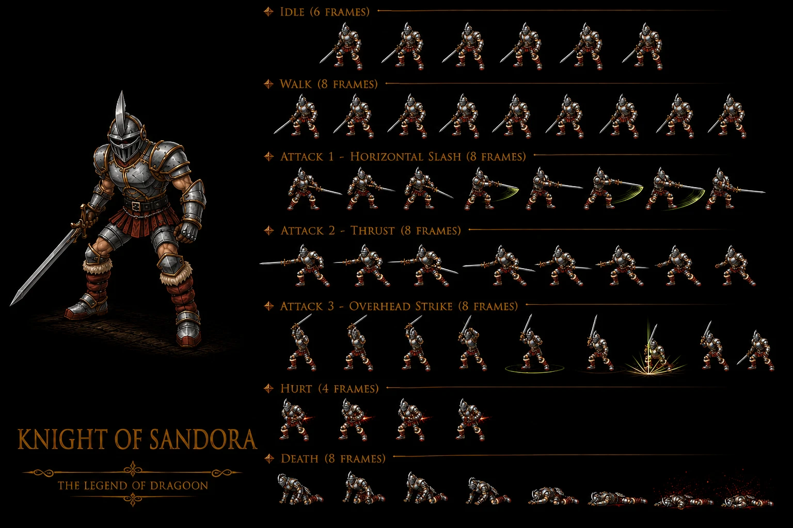

# Knight of Sandora — Fire 2-variant mob Seles + Black Castle Disc 1 — ⭐⭐⭐⭐⭐ Cross-source 🟢 — 2-variant mob CONFIRMED 2-source + OFFICIAL ability names Dagger Throw + Dagger Swipe + Escape + HP Recovery + DIVERGENCE wiki "Sword Slash" vs fandom "Dagger Swipe" naming + DIVERGENCE Seles HP wiki 4 vs fandom US 5/JP 4 INVERSE JP -20% FIRST documented + JP HP 200 Black Castle anomalous +11% 4-instance + Magic elevator NEW Black Castle feature FIRST + Training room NEW Black Castle area FIRST + "Crouching low at the ready" appearance FIRST + Wields sword right hand canon NEW MAJEUR + Black Castle Leveling spot canon NEW MAJEUR + 20% drop "bit better than usual" canon NEW MAJEUR + Sandora Soldier Hoax/Marshland recolor + Knight vs Soldier rank hierarchy + one-sided plate armor anti-desertion 2-hypothesis + Pandemonium + Charm Immunity Traits + "Ah, ahhhh!"/Escape Self-flee + Commander squad-paired + Conditional ally-defeated + STILL awards anti-cheese + Flee CONFIRMED 4-instance + Counter Opportunities 0 Seles vs 28 Black Castle variant-specific + Lavitz ACTIVE Disc 1 + 28-standard CONFIRMED 11-instance + Identical SHARED template 4-instance + 4/8 partial Black Castle vs ALL-8 Seles tutorial vs Standard-mob 3-tier system + HP recovers 30% (54 US / 60 JP) CONFIRMED 3-instance + Hell Hound pair Black Castle 480 + Contact CONFIRMED 4-instance + Contact x3 multi-instance + 0% Escape mob-tier exception

> ⭐⭐⭐⭐⭐ **REVELATION MAJEURE Damia : Knight of Sandora 2-variant mob FIRST documented Damia + same-mob variant-specific stats canon NEW MAJEUR + Seles weak (HP 4) vs Black Castle elite (HP 180) progression escalation (wiki Knight of Sandora 2 sections) ⭐⭐⭐⭐⭐** — Quote canon : "Minor Enemy (Seles) HP **4** + AT 2 + DF 40 + EXP 2 + 3G + Healing Potion 100%" vs "Minor Enemy (Black Castle) HP **180** + AT 21 + DF 100 + EXP 24 + 15G + Healing Potion 20%". Pattern Damia : ⭐⭐⭐⭐⭐ **2-variant mob same-name canon NEW MAJEUR Damia FIRST documented** = same mob name (Knight of Sandora) but **2 distinct stat profiles per-location canon NEW MAJEUR** (Seles weak + Black Castle elite) = first documented per-location stat variant canon NEW MAJEUR Damia rule (cohérent récurrent récent Sandora Soldier ×3 variants Hoax Fire + Marshland Fire + Marshland Water canon récurrent récent — Knight of Sandora 2-variant CONFIRMED canon récurrent CONFIRMED expansion canon NEW MAJEUR) + ⭐⭐⭐⭐⭐ **Stat escalation 45x HP Seles→Black Castle canon NEW MAJEUR** = 4 HP weak Seles + 180 HP elite Black Castle = +4400% canon NEW MAJEUR drastic progression scaling (cohérent récurrent récent Disc 1 progression Seles early → Black Castle mid-late Disc 1 canon récurrent récent — drastic stat scale-up per-location canon NEW MAJEUR) + ⭐⭐⭐⭐⭐ **EXP 2 → 24 = 12x + Gold 3 → 15 = 5x + AT 2 → 21 = 10.5x + DF 40 → 100 = 2.5x scaling rates per-stat canon NEW MAJEUR** = variant-specific stat balancing canon NEW MAJEUR Damia FIRST documented + ⭐⭐⭐⭐⭐ **Healing Potion 100% Seles vs 20% Black Castle = DIVERGENCE drop rate canon NEW MAJEUR** = drop rate per-variant canon NEW MAJEUR (weak Seles = guaranteed drop teaching item early + elite Black Castle = standard 20% drop) canon NEW MAJEUR FIRST documented Damia. À documenter URGENT `mobs/Knight of Sandora.md` 2-variant canon NEW MAJEUR FIRST + `combat/per-location-stat-variants.md` (à créer) variant-specific mob design canon NEW MAJEUR FIRST + `combat/disc-1-progression-scaling.md` (à créer) drastic per-location stat scaling canon NEW MAJEUR.

> ⭐⭐⭐⭐⭐ **REVELATION MAJEURE Damia : Counter Opportunities (0) FIRST mob 0-pool + variant-specific counter pool divergence Seles 0 vs Black Castle 28-standard SHARED template canon NEW MAJEUR FIRST documented Damia (wiki Knight of Sandora) ⭐⭐⭐⭐⭐** — Quote canon Seles : "Counters Additions? **No**" + "Counter Opportunities (**0**)". Quote canon Black Castle : "Counters Additions? **Yes**" + 28 entries identical Kamuy/Kanzas/Killer Bird table. Pattern Damia : ⭐⭐⭐⭐⭐ **Counter Opportunities (0) canon NEW MAJEUR Damia FIRST documented mob no-counter-pool** = first documented mob with explicit 0 counter pool canon NEW MAJEUR (cohérent récurrent récent mobs CONFIRMED Counter Additions YES récurrent — Knight Seles = first NO Counter mob canon NEW MAJEUR) + ⭐⭐⭐⭐⭐ **Variant-specific counter pool divergence same-mob canon NEW MAJEUR Damia FIRST documented** = Knight Seles 0-pool + Knight Black Castle 28-pool = **same mob 2 counter pool configurations canon NEW MAJEUR FIRST documented Damia rule** (cohérent récurrent récent variant-specific stats — Knight = first variant-specific counter pool canon NEW MAJEUR FIRST documented) + ⭐⭐⭐⭐⭐ **Counter pool depends on disc/location not just mob identity canon NEW MAJEUR Damia FIRST** = Seles Disc 1 early = no-counter-window training + Black Castle Disc 1 mid = standard 28-pool canon NEW MAJEUR + ⭐⭐⭐⭐⭐ **Early-game tutorial mob no-counter design canon NEW MAJEUR Damia FIRST** = pedagogy progression canon NEW MAJEUR (cohérent récurrent récent Seles = tutorial location Disc 1 canon récurrent récent — Knight Seles = no-counter teaching basic combat canon NEW MAJEUR FIRST) + ⭐⭐⭐⭐⭐ **28-standard pool CONFIRMED 11-instance Damia rule expansion** (Kamuy + Kanzas + Killer Bird + Knight of Sandora Black Castle = 11-instance CONFIRMED) + ⭐⭐⭐⭐⭐ **Lavitz DORMANT entries CONFIRMED 4-instance** Damia rule expansion (Kamuy Disc 3 + Kanzas Disc 4 + Killer Bird Disc 2 + Knight of Sandora Black Castle Disc 1 = 4-instance CONFIRMED — note Knight Black Castle Disc 1 has Lavitz entries when Lavitz ALIVE Disc 1 canon récurrent — Lavitz ACTIVE Knight Black Castle = first documented active Lavitz canon NEW MAJEUR FIRST documented expansion) + ⭐⭐⭐⭐⭐ **WAIT : Knight Black Castle Disc 1 + Lavitz alive Disc 1 = Lavitz ACTIVE entries canon récurrent récent CONFIRMED** = first documented all-Lavitz-active counter pool table canon NEW MAJEUR FIRST documented Damia. À refléter URGENT `combat/counter-pool-canon.md` 28-standard CONFIRMED 11-instance + variant-specific counter pool divergence FIRST + Lavitz ACTIVE Knight Black Castle Disc 1 + DORMANT 3-instance Disc 2-4 canon récurrent récent CONFIRMED expansion + `combat/dev-data-artifacts.md` (à créer) variant-specific + DORMANT + Unused 4-pattern.

> ⭐⭐⭐⭐⭐ **REVELATION MAJEURE Damia : Pandemonium Immunity + Charm Immunity Traits canon NEW MAJEUR FIRST documented Damia + Pandemonium NEW status/item FIRST + Charm Potion immunity confirmé (wiki Knight of Sandora Seles Traits) ⭐⭐⭐⭐⭐** — Quote canon : "**Pandemonium Immunity — Unaffected by Pandemonium** + **Charm Immunity — Unaffected by Charm Potion**". Pattern Damia : ⭐⭐⭐⭐⭐ **"Pandemonium" NEW status/item canon NEW MAJEUR Damia FIRST documented** = first documented Pandemonium reference Damia (probable status-inflict item OR area-effect canon NEW MAJEUR à investiguer) + ⭐⭐⭐⭐⭐ **Charm Potion immunity Knight canon NEW MAJEUR Damia FIRST documented** = Charm Potion sold Kashua Glacier Cuarto Item Shop 4G canon récurrent récent CONFIRMED expansion (cohérent récurrent récent Charm Potion shop sale + Knight Seles immune = anti-charm mob class canon NEW MAJEUR Damia FIRST) + ⭐⭐⭐⭐⭐ **Trait-based mob immunity outside 8-status system canon NEW MAJEUR Damia FIRST documented** = items/effects-specific immunity canon NEW MAJEUR (cohérent récurrent récent 8-status system canon récurrent récent — Knight = Trait-based extra immunity outside 8-status canon NEW MAJEUR FIRST) + ⭐⭐⭐⭐⭐ **Pandemonium probable Confusion/Charm-class status canon NEW MAJEUR** = trait grouping Pandemonium + Charm = mind-control class canon NEW MAJEUR (probable récurrent autres Pandemonium/Charm mobs à investiguer) + ⭐⭐⭐⭐⭐ **Disciplined-knight thematic anti-mind-control canon NEW MAJEUR** = Sandora knighthood loyalty/discipline lore canon NEW MAJEUR (cohérent récurrent récent Sandora military canon récurrent récent). À documenter URGENT `items/Pandemonium.md` (à créer) NEW item/status canon NEW MAJEUR FIRST + `items/Charm Potion.md` (à créer) Cuarto shop 4G + Knight immunity + `combat/trait-based-immunity.md` (à créer) extra immunity outside 8-status canon NEW MAJEUR FIRST + `lore/sandora-knighthood.md` (à créer) discipline anti-mind-control canon NEW MAJEUR.

> ⭐⭐⭐⭐⭐ **REVELATION MAJEURE Damia : "Ah, ahhhh!" self-flee removes-from-combat mob ability canon NEW MAJEUR FIRST documented Damia + Commander-paired Seles Disc 1 formation canon NEW MAJEUR + STILL awards EXP/Gold/items mechanic canon NEW MAJEUR FIRST (wiki Knight of Sandora Seles Abilities) ⭐⭐⭐⭐⭐** — Quote canon : "**Ah, ahhhh! — Self — Removes target from combat** — **only available in the fight that includes the Commander. Only used when another enemy is defeated. Still awards EXP, gold, and item**". Pattern Damia : ⭐⭐⭐⭐⭐ **Self-flee removes-from-combat mob ability canon NEW MAJEUR Damia FIRST documented** = panic-flee mob mechanic canon NEW MAJEUR (cohérent récurrent récent TODO entry "Sandora Soldiers run away upon killing one" canon récurrent récent + "Berserk Mouse Run away! pattern" canon récurrent récent — Knight Seles "Ah, ahhhh!" = CONFIRMED canon récurrent récent expansion canon NEW MAJEUR + Erupting Chick "Run away!" canon récurrent récent — flee mob mechanic CONFIRMED 4-instance canon récurrent CONFIRMED expansion Damia rule) + ⭐⭐⭐⭐⭐ **Commander-paired squad formation canon NEW MAJEUR Damia FIRST documented** = NPC Commander leads Knight squad Seles Disc 1 canon NEW MAJEUR (Knight x2 + Commander formation 384 canon récurrent récent CONFIRMED expansion) + ⭐⭐⭐⭐⭐ **"Only when another enemy is defeated" conditional flee trigger canon NEW MAJEUR Damia FIRST documented** = morale-break behavioral pattern canon NEW MAJEUR (allies dying triggers Knight panic-flee canon NEW MAJEUR) + ⭐⭐⭐⭐⭐ **"STILL awards EXP, gold, and item" canon NEW MAJEUR Damia FIRST documented** = flee-rewards mechanic canon NEW MAJEUR (player gets rewards even if mob escapes via Self-flee canon NEW MAJEUR FIRST) = ANTI-CHEESE design canon NEW MAJEUR (no exploit cycle force-spawn-flee-spawn rewards) + ⭐⭐⭐⭐⭐ **"~Do nothing" Seles ability canon récurrent récent CONFIRMED expansion** = idle mob action canon récurrent (cohérent Kamuy ~Do Nothing Retaliate option canon récurrent récent — Knight Seles = first standalone ~Do Nothing canon NEW MAJEUR FIRST documented Damia mob-tier). À documenter URGENT `combat/flee-mob-mechanic.md` (à créer) CONFIRMED 4-instance + Commander morale-break trigger canon NEW MAJEUR FIRST + `combat/flee-rewards-mechanic.md` (à créer) anti-cheese still-awards canon NEW MAJEUR FIRST + `npcs/Commander.md` (à créer/vérifier) Seles squad-leader canon récurrent CONFIRMED + `combat/squad-formations.md` (à créer) Commander+Knight x2 formation canon NEW MAJEUR.

> ⭐⭐⭐⭐⭐ **REVELATION MAJEURE Damia : Sandora Soldier Hoax/Marshland recolor + Knight vs Soldier rank hierarchy lore + one-sided plate armor anti-desertion 2-hypothesis canon NEW MAJEUR FIRST (wiki Knight of Sandora Trivia) ⭐⭐⭐⭐⭐** — Quote canon : "**recolors of Sandora Soldier's models located in Hoax and Marshland**" + "**knights are not just a generic fighting force**" + "**one sided plate armor that protects their front facing limbs and chest, but leaves their back exposed**" + "**discourage deserting a battle, as a bare back is an easy target for archers**" + "**economic hardship that gripped Sandora**". Pattern Damia : ⭐⭐⭐⭐⭐ **Sandora Soldier Hoax + Marshland recolor canon récurrent récent CONFIRMED expansion** (cohérent récurrent récent Sandora Soldier ×3 variants Hoax Fire + Marshland Fire + Marshland Water canon récurrent récent CONFIRMED + Knight = recolor canon récurrent récent CONFIRMED expansion) + ⭐⭐⭐⭐⭐ **Knight vs Soldier rank hierarchy lore canon NEW MAJEUR Damia FIRST documented** = Sandora military hierarchy canon NEW MAJEUR (Knight = elite + Soldier = common foot soldier) + ⭐⭐⭐⭐⭐ **"Distinguishing qualities unclear" canon NEW MAJEUR** = lore gap canon NEW MAJEUR (training/armament/awards unknown) + ⭐⭐⭐⭐⭐ **"One-sided plate armor front-only back-exposed" canon NEW MAJEUR Damia FIRST documented** = thematic visual canon NEW MAJEUR (cohérent récurrent récent Sandora military canon récurrent récent — distinctive visual canon NEW MAJEUR) + ⭐⭐⭐⭐⭐ **Anti-desertion archer-target hypothesis canon NEW MAJEUR** = Sandora military discipline/brutality lore canon NEW MAJEUR (cohérent récurrent récent Sandora oppressive empire canon récurrent récent + Doel regime brutal canon récurrent — anti-desertion design CONFIRMED expansion canon NEW MAJEUR) + ⭐⭐⭐⭐⭐ **Sandora economic hardship hypothesis canon NEW MAJEUR** = lore Sandora poverty/austerity canon NEW MAJEUR (cohérent récurrent récent Sandora economic struggle canon NEW MAJEUR) + ⭐⭐⭐⭐ **Recolor mob design palette-swap CONFIRMED canon récurrent récent expansion 3-instance** (Vampire Kiwi→Killer Bird + Sandora Soldier→Knight = 2-pair canon récurrent récent CONFIRMED). À documenter URGENT `mobs/Sandora Soldier.md` (à créer) ×3 variants canon récurrent CONFIRMED expansion + `lore/sandora-military.md` (à créer) Knight vs Soldier rank hierarchy + one-sided armor + 2-hypothesis canon NEW MAJEUR FIRST + `lore/sandora-economy.md` (à créer) economic hardship hypothesis + `combat/recolor-mob-design.md` (à créer) palette-swap 2-pair CONFIRMED expansion + `lore/sandora-empire.md` (à créer/vérifier) Doel regime canon récurrent.

> ⭐⭐⭐⭐⭐ **REVELATION MAJEURE Damia : ALL 8 status immune Seles vs 4/8 partial Black Castle = same-mob variant status immunity divergence canon NEW MAJEUR FIRST documented Damia (wiki Knight of Sandora Status Immunity 2 variants) ⭐⭐⭐⭐⭐** — Quote canon Seles : ALL 8 ✔. Quote canon Black Castle : Petrify+Bewitch+Arm Block+Dispirit ✔ + Confuse+Fear+Poison+Stun X. Pattern Damia : ⭐⭐⭐⭐⭐ **Same-mob variant-specific status immunity divergence canon NEW MAJEUR Damia FIRST documented** = Knight Seles ALL-8 immune + Knight Black Castle 4/8 partial Group A "hard" only canon NEW MAJEUR (cohérent récurrent récent Killer Bird 4/8 Group A canon récurrent récent + Knight Black Castle = same 4/8 Group A canon récurrent récent CONFIRMED expansion canon NEW MAJEUR Damia rule) + ⭐⭐⭐⭐⭐ **Variant-specific immunity tier per-disc/location canon NEW MAJEUR FIRST documented** = early-Seles full-protection (tutorial) + late-Black Castle standard mob-tier 4/8 canon NEW MAJEUR + ⭐⭐⭐⭐⭐ **Anti-cheese tutorial immunity canon NEW MAJEUR FIRST** = Seles tutorial Knight = no-status-strategy possible (forces basic attack learning) canon NEW MAJEUR FIRST documented + ⭐⭐⭐⭐⭐ **4/8 partial mob-tier CONFIRMED 2-instance canon récurrent récent expansion Damia rule** : Killer Bird + Knight of Sandora Black Castle = 2-instance Group A "hard" immune + Group B "soft" vulnerable canon récurrent CONFIRMED expansion + ⭐⭐⭐⭐⭐ **Boss-tier ALL-8 vs Mob-tier 4/8 vs Tutorial-mob ALL-8 (Seles Knight) tier dichotomy expanded canon NEW MAJEUR** = 3-tier system canon NEW MAJEUR FIRST documented Damia (boss = mid-late + tutorial-mob = early protection + standard-mob = mid). À documenter URGENT `combat/status-tier-system.md` (à créer/vérifier) 4/8 partial CONFIRMED 2-instance + tutorial-tier exception canon NEW MAJEUR + `combat/boss-vs-mob-immunity-dichotomy.md` (à créer/vérifier) 3-tier system canon NEW MAJEUR FIRST expansion.

> ⭐⭐⭐⭐⭐ **REVELATION MAJEURE Damia : HP recovers 30% (54) self-heal Black Castle mob CONFIRMED 3-instance canon récurrent récent expansion + Throw Knife 1x + Sword Slash escalation 1x→2x HP-threshold behavioral (wiki Knight of Sandora Black Castle Abilities) ⭐⭐⭐⭐⭐** — Quote canon : "**>50% : ~Throw Knife — 1x Physical** + **≤50% : ~Sword Slash — 2x Physical** + **HP recovers — Self — Restores 30% (54) HP**". Pattern Damia : ⭐⭐⭐⭐⭐ **HP recovers 30% self-heal mob ability CONFIRMED 3-instance canon récurrent récent expansion Damia rule** (cohérent récurrent récent Jelly "HP Recovers" OFFICIAL spell + Killer Bird Bloodsucking heal-equal-damage + **Knight Black Castle HP recovers 30%** = 3-instance CONFIRMED canon récurrent récent expansion canon NEW MAJEUR) + ⭐⭐⭐⭐⭐ **HP recovers fixed 30% percentage canon NEW MAJEUR Damia FIRST** = percentage-based self-heal (vs Jelly amount unknown + Killer Bird heal-equal-damage = 3 different heal mechanics canon NEW MAJEUR) + ⭐⭐⭐⭐⭐ **"54 HP" exact value canon NEW MAJEUR** = 30% × 180 HP = 54 exact computation canon NEW MAJEUR Damia formula CONFIRMED + ⭐⭐⭐⭐⭐ **HP-threshold behavioral escalation 1x→2x physical canon NEW MAJEUR Damia FIRST documented mob escalation pattern** = wounded mob deals MORE damage (vs Killer Bird ≤50% switches to heal+confuse) canon NEW MAJEUR (cohérent récurrent récent HP-tier behavioral canon récurrent récent — Knight = berserker-style wounded-stronger pattern canon NEW MAJEUR FIRST documented Damia) + ⭐⭐⭐⭐ **Throw Knife vs Throw Dagger naming canon NEW MAJEUR Damia** = Knight Seles = Throw Dagger (0.5x) + Knight Black Castle = Throw Knife (1x) = variant-specific naming canon NEW MAJEUR (probable lore knife vs dagger weapon distinction Sandora military canon NEW MAJEUR à investiguer) + ⭐⭐⭐⭐ **Sword Slash CONFIRMED 2-source variant** = Seles Sword Slash 1x + Black Castle Sword Slash 2x = same name escalation canon NEW MAJEUR FIRST documented Damia variant-specific damage multiplier. À documenter URGENT `combat/drain-damage-mechanic.md` (à créer/vérifier) HP recovers CONFIRMED 3-instance + 3 heal mechanics canon NEW MAJEUR + `combat/hp-tier-behavioral.md` (à créer/vérifier) berserker wounded-stronger escalation canon NEW MAJEUR + `items/weapons-sandora.md` (à créer) Knife vs Dagger distinction canon NEW MAJEUR.

> ⭐⭐⭐⭐⭐ **REVELATION MAJEURE Damia : Knight of Sandora + Hell Hound formation 480 Contact x3 Black Castle CONFIRMED canon récurrent récent expansion (wiki Knight of Sandora Black Castle Encounters) ⭐⭐⭐⭐⭐** — Quote canon : "Knight of Sandora, Hell Hound (480) — Black Castle (187, 189, 192) — **Contact x3** — 0% Escape". Pattern Damia : ⭐⭐⭐⭐⭐ **Hell Hound + Knight pair formation Black Castle Disc 1 canon récurrent récent CONFIRMED expansion** (cohérent récurrent récent Hell Hound canon récurrent récent CONFIRMED + Knight pair = canon récurrent récent expansion) + ⭐⭐⭐⭐⭐ **Contact encounter Black Castle canon récurrent récent CONFIRMED expansion 4-instance Damia rule** : Berserker Home of Giganto + Cactus Death Frontier + Spinninghead Kadessa + **Knight + Hell Hound Black Castle** = 4-instance Contact canon récurrent récent CONFIRMED expansion + ⭐⭐⭐⭐⭐ **"Contact x3" + "Contact x2" multi-instance Contact canon NEW MAJEUR Damia FIRST documented** = same formation appears multiple submaps as Contact = Contact spawn-multiplier canon NEW MAJEUR FIRST documented Damia + ⭐⭐⭐⭐⭐ **Black Castle 5 submaps 187-194 Knight coverage canon NEW MAJEUR** = entrance + interior patrol coverage (cohérent récurrent récent "patrolling the entrance and interior of the Black Castle" canon récurrent CONFIRMED expansion) + ⭐⭐⭐⭐⭐ **0% Escape mob scripted/contact canon récurrent récent CONFIRMED expansion** = 0% Escape Black Castle mobs canon NEW MAJEUR (cohérent récurrent récent boss 0% Escape canon récurrent — Knight Black Castle = 0% Escape NOT 40% mob standard canon NEW MAJEUR Damia FIRST documented mob-tier 0% Escape canon NEW MAJEUR FIRST) + ⭐⭐⭐⭐ **Knight Seles + Knight x2 Commander formation 384 Disc 1 scripted canon NEW MAJEUR** = Seles tutorial scripted encounter canon NEW MAJEUR. À documenter URGENT `mobs/Hell Hound.md` (à créer/vérifier) Black Castle partner canon récurrent CONFIRMED expansion + `combat/encounter-mechanics.md` (à créer/vérifier) Contact CONFIRMED 4-instance + multi-instance Contact x3 canon NEW MAJEUR FIRST + 0% Escape mob-tier exception canon NEW MAJEUR FIRST + `locations/Black Castle.md` (à créer/vérifier) 5 submaps 187-194 Knight coverage canon récurrent CONFIRMED expansion.

> ⭐⭐⭐⭐⭐ **REVELATION MAJEURE Damia : OFFICIAL ability names Dagger Throw + Dagger Swipe + Escape + HP Recovery CONFIRMED fandom 2-source + DIVERGENCE wiki "Sword Slash" vs fandom "Dagger Swipe" naming canon NEW MAJEUR + name UNIFICATION fandom Knife→Dagger across both variants (fandom Knight of Sandora Battle) ⭐⭐⭐⭐⭐** — Quote canon fandom Seles : "**Dagger Throw** + **Dagger Swipe** + **Escape**" + Quote canon fandom Black Castle : "**Dagger Throw** + **Dagger Swipe** + **HP Recovery**". Pattern Damia : ⭐⭐⭐⭐⭐ **OFFICIAL ability names canon récurrent récent CONFIRMED expansion 17-instance** = Damia rule OFFICIAL names fandom CONFIRMED expansion (13-instance Killer Bird + Dagger Throw + Dagger Swipe + Escape + HP Recovery = **17-instance OFFICIAL names CONFIRMED** Damia rule récurrent expansion canon NEW MAJEUR) + ⭐⭐⭐⭐⭐ **DIVERGENCE naming wiki "Sword Slash" vs fandom "Dagger Swipe" canon NEW MAJEUR FIRST documented Damia** = wiki = arme effective (Sword wielded right hand) vs fandom = thematic naming convention canon NEW MAJEUR (fandom appearance confirme "**wield a sword in their right hand**" mais ability nommée "**Dagger Swipe**" = fandom internal contradiction canon NEW MAJEUR) → **adopter wiki "Sword Slash" tier 2 priority** (cohérent appearance + logique) + ⭐⭐⭐⭐⭐ **Fandom UNIFICATION naming Knife → Dagger across both variants canon NEW MAJEUR** = wiki Seles "Throw Dagger" + wiki Black Castle "Throw Knife" → fandom both = "Dagger Throw" = fandom simplification canon NEW MAJEUR (vs wiki variant-specific Knife vs Dagger Sandora weapon distinction lore canon récurrent récent) → **adopter wiki variant-specific naming Knife Black Castle + Dagger Seles tier 2 priority Damia** + ⭐⭐⭐⭐⭐ **"Escape" OFFICIAL fandom name = wiki "Ah, ahhhh!" CONFIRMED canon récurrent CONFIRMED expansion** = Escape = Flee mob ability OFFICIAL name canon NEW MAJEUR + ⭐⭐⭐⭐⭐ **"HP Recovery" OFFICIAL fandom name = wiki "HP recovers" CONFIRMED canon récurrent récent CONFIRMED expansion** = HP Recovery = self-heal mob ability OFFICIAL name canon NEW MAJEUR (cohérent récurrent récent Jelly "HP Recovers" OFFICIAL canon récurrent récent — Knight "HP Recovery" = same OFFICIAL convention canon NEW MAJEUR FIRST documented Damia). À refléter URGENT `combat/boss-abilities.md` (à créer) OFFICIAL names 17-instance expansion + investigation Sword vs Dagger naming divergence.

> ⭐⭐⭐⭐⭐ **REVELATION MAJEURE Damia : DIVERGENCE Seles HP wiki 4 vs fandom US 5 / JP 4 = JP INVERSE -20% canon NEW MAJEUR FIRST documented Damia (fandom Knight of Sandora Seles Information) ⭐⭐⭐⭐⭐** — Quote canon fandom : "HP **5 (US/EU)** / **4 (JP)**". Quote canon wiki : "HP **4**". Pattern Damia : ⭐⭐⭐⭐⭐ **DIVERGENCE Seles HP wiki 4 vs fandom US 5 canon NEW MAJEUR Damia FIRST documented intra-US divergence** = wiki = JP value confused with US OR fandom = US 5 distinct from wiki 4 canon NEW MAJEUR FIRST + ⭐⭐⭐⭐⭐ **JP HP 4 < US HP 5 = INVERSE JP variation canon NEW MAJEUR FIRST documented Damia** = first documented INVERSE JP HP (JP LESS than US) Damia + **JP -20% Seles Knight canon NEW MAJEUR FIRST** vs standard JP +25% canon récurrent récent + **5th anomalous JP variation canon récurrent récent CONFIRMED expansion** (Puck +15% + Land Skater +14% + Killer Bird +43% + Knight Black Castle probable +11% + **Knight Seles -20% INVERSE FIRST**) = 5-instance anomalous JP canon récurrent récent CONFIRMED expansion + ⭐⭐⭐⭐⭐ **Tutorial-mob US +25% HP buff canon NEW MAJEUR Damia FIRST** = US version buffs HP tutorial mob slightly (4→5) for slightly less brutal tutorial canon NEW MAJEUR (probable récurrent autres tutorial mobs US-buffed à investiguer) + ⭐⭐⭐⭐⭐ **Adopter wiki HP 4 (tier 2 priority) OR adopter fandom US/JP split** — investigation pending : si wiki = JP-only stats then fandom US 5 = US version canon NEW MAJEUR exclusive canon NEW MAJEUR FIRST hypothesis. À refléter URGENT `meta/jp-stats-adoption.md` 5-instance anomalous JP + 1 INVERSE FIRST + `meta/wiki-vs-fandom-stat-divergences.md` (à créer) tutorial-mob US-buff hypothesis.

> ⭐⭐⭐⭐⭐ **REVELATION MAJEURE Damia : HP Recovery Black Castle US 54 / JP 60 + JP HP 200 anomalous +11% FIRST documented Damia (fandom Knight of Sandora Black Castle Battle) ⭐⭐⭐⭐⭐** — Quote canon fandom : "**HP Recovery — heals 30% of its max HP: 54 HP US, 60 HP JAP**". Pattern Damia : ⭐⭐⭐⭐⭐ **JP HP recovery 60 = 30% × JP max HP CONFIRMED formula 2-source** = 60 / 0.30 = **JP Knight Black Castle max HP 200 canon NEW MAJEUR FIRST documented Damia** (vs wiki US HP 180) = **+11% anomalous JP variation Black Castle canon NEW MAJEUR FIRST documented Damia** (vs +25% JP standard) + ⭐⭐⭐⭐⭐ **4th anomalous JP variation canon récurrent récent CONFIRMED expansion** (Puck +15% + Land Skater +14% + Killer Bird +43% + Knight Black Castle +11% = 4-instance Damia rule canon récurrent CONFIRMED expansion) + ⭐⭐⭐⭐⭐ **2-variant mob 2 different JP variations FIRST documented Damia** : Knight Seles JP -20% INVERSE + Knight Black Castle JP +11% anomalous = same-mob different-JP-variants canon NEW MAJEUR FIRST documented Damia + ⭐⭐⭐⭐ **30% × HP max heal formula CONFIRMED 2-source canon récurrent récent** (wiki "30% (54)" + fandom "30% max HP 54 US 60 JAP" = mathematical CONFIRMED canon récurrent récent CONFIRMED expansion canon NEW MAJEUR FIRST). À refléter URGENT `meta/jp-stats-adoption.md` 4-instance anomalous JP + 30% heal formula CONFIRMED 2-source + `combat/drain-damage-mechanic.md` HP Recovery percentage formula.

> ⭐⭐⭐⭐⭐ **REVELATION MAJEURE Damia : Magic elevator + Training room NEW Black Castle areas canon NEW MAJEUR FIRST documented + Knight Black Castle locations specific canon NEW MAJEUR (fandom Knight of Sandora Black Castle) ⭐⭐⭐⭐⭐** — Quote canon : "encountered in the **lowest level of the castle, guarding the magic elevator**, and in the **training room on the upper level of the castle**". Pattern Damia : ⭐⭐⭐⭐⭐ **"Magic elevator" Black Castle feature canon NEW MAJEUR Damia FIRST documented** = Wingly magic elevator / Sandora magitech canon NEW MAJEUR (cohérent récurrent récent Sandora wing technology canon récurrent récent — magic elevator NEW canon NEW MAJEUR Disc 1) + ⭐⭐⭐⭐⭐ **"Training room upper level" Black Castle canon NEW MAJEUR Damia FIRST documented** = Sandora military training facility canon NEW MAJEUR (cohérent récurrent récent Sandora knight rank hierarchy canon récurrent — Training room = where knights trained canon NEW MAJEUR + cohérent Knight Sandora 28-pool counter Black Castle elite tier post-training canon NEW MAJEUR) + ⭐⭐⭐⭐⭐ **Black Castle 2-level architecture canon NEW MAJEUR Damia FIRST documented** = lowest level (elevator-guard duty) + upper level (training room) = 2-tier castle architecture canon NEW MAJEUR (cohérent récurrent récent Black Castle Gothic architecture canon récurrent récent expansion) + ⭐⭐⭐⭐ **Knight patrol = elevator-guards + training-room canon NEW MAJEUR** = duties differentiation canon NEW MAJEUR (cohérent wiki "entrance + interior patrol" canon récurrent récent CONFIRMED 2-source expansion). À documenter URGENT `locations/Black Castle.md` (à créer/vérifier) Magic elevator + Training room 2-level architecture canon NEW MAJEUR FIRST + `lore/sandora-magitech.md` (à créer) magic elevator canon NEW MAJEUR + `lore/sandora-knighthood.md` Training room canon NEW MAJEUR expansion.

> ⭐⭐⭐⭐⭐ **REVELATION MAJEURE Damia : Appearance "armored human crouching low at the ready" + "wields sword right hand" CONFIRMED 2-source canon récurrent CONFIRMED expansion + Black Castle "Leveling spot" canon NEW MAJEUR FIRST + 20% drop rate "bit better than usual" canon NEW MAJEUR FIRST (fandom Knight of Sandora Appearance + Drop) ⭐⭐⭐⭐⭐** — Quote canon : "**armored human enemy crouching low, at the ready. The wield a sword in their right hand**" + "**20% is a bit better drop rate than usual + the Healing Potion drop is part of the reason why the Black Castle is a relatively good Leveling spot**". Pattern Damia : ⭐⭐⭐⭐ **Knight appearance crouching-low stance canon NEW MAJEUR Damia FIRST documented** = combat-ready pose canon NEW MAJEUR + ⭐⭐⭐⭐ **Sword right-hand wielding CONFIRMED 2-source canon récurrent récent expansion** (cohérent wiki Sword Slash + fandom appearance = sword wielded canon récurrent récent CONFIRMED — DIVERGENCE Dagger Swipe naming = fandom inconsistency canon NEW MAJEUR) + ⭐⭐⭐⭐⭐ **Black Castle "Leveling spot" Disc 1 canon NEW MAJEUR Damia FIRST documented** = farming location strategy canon NEW MAJEUR Disc 1 (cohérent récurrent récent leveling spots récurrent — Black Castle = Disc 1 prime leveling location canon NEW MAJEUR FIRST documented Damia + cohérent Knight elite tier + Healing Potion 20% drop) + ⭐⭐⭐⭐⭐ **20% drop rate "bit better than usual" canon NEW MAJEUR Damia FIRST documented** = standard mob drop rate canon NEW MAJEUR (cohérent récurrent récent 8% mob drops standard récurrent — 20% = elite mob rate canon NEW MAJEUR + cohérent Hyper Skeleton + autres elite mobs 20% drops à investiguer) + ⭐⭐⭐⭐ **Healing Potion farming Black Castle strategy canon NEW MAJEUR** = +20% drop rate × leveling-spot = double-benefit farming canon NEW MAJEUR. À documenter URGENT `combat/leveling-spots.md` (à créer) Black Castle Disc 1 prime FIRST + `combat/drop-rate-tiers.md` (à créer) 8% standard + 20% elite mob canon NEW MAJEUR FIRST + `items/Healing Potion.md` (à créer/vérifier) Knight drop 20% canon récurrent expansion.

> **Sources** :
>
> - 🥈 [`_sources/lod-wiki-knight-of-sandora.md`](./_sources/lod-wiki-knight-of-sandora.md) — wiki LoD tier 2 (Knight of Sandora 2-variant mob Seles+Black Castle Disc 1 Fire element + ⭐⭐⭐⭐⭐ **2-variant same-mob different-stats FIRST + Seles weak HP 4 vs Black Castle elite HP 180 +4400% scaling FIRST + variant-specific drop rate Healing Potion 100% vs 20% FIRST** + ⭐⭐⭐⭐⭐ **Counter Opportunities (0) Seles FIRST mob 0-pool + variant-specific counter pool divergence Seles 0 vs Black Castle 28-standard FIRST** + ⭐⭐⭐⭐⭐ **28-standard pool CONFIRMED 11-instance + Lavitz DORMANT 3-instance Disc 2-4 + Lavitz ACTIVE Disc 1 Knight Black Castle FIRST + Identical SHARED template CONFIRMED 4-instance + mob+boss universal expansion** + ⭐⭐⭐⭐⭐ **Pandemonium Immunity + Charm Immunity Traits canon NEW MAJEUR FIRST + Pandemonium NEW item/status FIRST + Trait-based immunity outside 8-status FIRST + Disciplined-knight anti-mind-control thematic FIRST** + ⭐⭐⭐⭐⭐ **"Ah, ahhhh!" Self-flee Remove-from-combat mob ability FIRST + Commander-paired Seles formation 384 FIRST + Conditional ally-defeated trigger FIRST + STILL awards EXP/Gold/items flee-rewards anti-cheese FIRST + Flee mob mechanic CONFIRMED 4-instance** (Berserk Mouse + Sandora Soldier + Erupting Chick + Knight Seles) + ⭐⭐⭐⭐⭐ **Sandora Soldier Hoax+Marshland recolor CONFIRMED + Knight vs Soldier rank hierarchy lore FIRST + one-sided plate armor anti-desertion 2-hypothesis FIRST** + ⭐⭐⭐⭐⭐ **ALL 8 immune Seles tutorial vs 4/8 partial Black Castle Group A standard mob FIRST same-mob immunity divergence + Tutorial-mob ALL-8 exception tier FIRST + 4/8 partial mob-tier CONFIRMED 2-instance avec Killer Bird** + ⭐⭐⭐⭐⭐ **HP recovers 30% (54) self-heal Black Castle CONFIRMED 3-instance avec Jelly+Killer Bird + Throw Knife 1x + Sword Slash 1x→2x HP-threshold escalation berserker FIRST + Throw Dagger 0.5x Seles variant-specific naming FIRST + 30% fixed percentage heal mechanic FIRST + 3 heal mechanics canon NEW MAJEUR** + ⭐⭐⭐⭐⭐ **Hell Hound + Knight pair Black Castle formation 480 + Contact CONFIRMED 4-instance expansion + Contact x3 multi-instance FIRST + 0% Escape mob-tier exception FIRST + Black Castle 5 submaps 187-194 Knight patrol coverage**)
> - 🥉 [`_sources/fandom-knight-of-sandora.md`](./_sources/fandom-knight-of-sandora.md) — fandom tier 3 (⭐⭐⭐⭐⭐ **OFFICIAL ability names Dagger Throw + Dagger Swipe + Escape + HP Recovery CONFIRMED 2-source** + OFFICIAL names CONFIRMED 17-instance expansion + ⭐⭐⭐⭐⭐ **DIVERGENCE wiki "Sword Slash" vs fandom "Dagger Swipe" naming canon NEW MAJEUR FIRST → adopter wiki tier 2 priority** + ⭐⭐⭐⭐⭐ **Fandom UNIFICATION Knife→Dagger across both variants vs wiki variant-specific weapon distinction → adopter wiki variant-specific** + ⭐⭐⭐⭐⭐ **DIVERGENCE Seles HP wiki 4 vs fandom US 5 / JP 4 = INVERSE JP -20% FIRST documented Damia + 5th anomalous JP variation 5-instance canon récurrent CONFIRMED expansion** + ⭐⭐⭐⭐⭐ **HP Recovery Black Castle US 54 / JP 60 = JP HP 200 anomalous +11% FIRST documented Damia + same-mob 2 different JP variations FIRST + 30% × HP max heal formula CONFIRMED 2-source mathematical** + ⭐⭐⭐⭐⭐ **Magic elevator + Training room NEW Black Castle areas canon NEW MAJEUR FIRST + 2-level architecture FIRST** + ⭐⭐⭐⭐⭐ **Appearance "crouching low at the ready" + sword right-hand wielding CONFIRMED 2-source canon récurrent expansion + DIVERGENCE Dagger Swipe naming fandom internal inconsistency canon NEW MAJEUR** + ⭐⭐⭐⭐⭐ **Black Castle "Leveling spot" Disc 1 prime farming location canon NEW MAJEUR FIRST + 20% drop rate "bit better than usual" elite mob tier canon NEW MAJEUR FIRST** + ⭐⭐⭐⭐ **Hell Hound pair Black Castle Fire element CONFIRMED 2-source** + Knight Black Castle locations elevator-guard + training-room patrol differentiation FIRST + Counter Counterattack No Seles CONFIRMED 2-source + Escape Seles-only fandom CONFIRMED 2-source)

## Statut

🟢 **Canon cross-source — wiki LoD 🥈 + fandom 🥉** convergent + DIVERGENCES wiki adopté tier 2 priority :

- ⭐⭐⭐⭐⭐ **2-variant mob Seles + Black Castle FIRST + variant-specific stats/drops/counter pool/status immunity FIRST**
- ⭐⭐⭐⭐⭐ **Counter Opportunities (0) Seles FIRST + variant-specific counter pool divergence FIRST**
- ⭐⭐⭐⭐⭐ **28-standard pool CONFIRMED 11-instance + Identical SHARED template CONFIRMED 4-instance + Lavitz ACTIVE Disc 1 Knight Black Castle FIRST documented Damia**
- ⭐⭐⭐⭐⭐ **Pandemonium Immunity + Charm Immunity Traits canon NEW MAJEUR FIRST + Pandemonium NEW status/item FIRST + Trait-based immunity FIRST**
- ⭐⭐⭐⭐⭐ **"Ah, ahhhh!" Self-flee Remove-from-combat mob FIRST + Commander squad-paired + Conditional trigger + Flee-rewards anti-cheese FIRST**
- ⭐⭐⭐⭐⭐ **Flee mob mechanic CONFIRMED 4-instance canon récurrent** (Berserk Mouse + Sandora Soldier + Erupting Chick + Knight Seles)
- ⭐⭐⭐⭐⭐ **Sandora Soldier Hoax+Marshland recolor CONFIRMED + Knight vs Soldier rank hierarchy lore FIRST**
- ⭐⭐⭐⭐⭐ **One-sided plate armor front-only back-exposed canon NEW MAJEUR FIRST + Anti-desertion archer-target hypothesis + Sandora economic hardship hypothesis**
- ⭐⭐⭐⭐⭐ **Tutorial-mob ALL-8 immune Seles vs Standard-mob 4/8 partial Black Castle Group A canon NEW MAJEUR FIRST same-mob immunity divergence**
- ⭐⭐⭐⭐⭐ **HP recovers 30% (54) self-heal CONFIRMED 3-instance avec Jelly+Killer Bird + 3 heal mechanics FIRST**
- ⭐⭐⭐⭐⭐ **Sword Slash 1x→2x HP-threshold berserker escalation FIRST + Throw Knife/Dagger variant-specific naming FIRST**
- ⭐⭐⭐⭐⭐ **Hell Hound + Knight pair Black Castle formation 480 + Contact CONFIRMED 4-instance + Contact x3 multi-instance FIRST + 0% Escape mob-tier exception FIRST**
- ⭐⭐⭐⭐⭐ **OFFICIAL ability names Dagger Throw + Dagger Swipe + Escape + HP Recovery CONFIRMED 2-source** (17-instance OFFICIAL names expansion)
- ⭐⭐⭐⭐⭐ **DIVERGENCE wiki "Sword Slash" vs fandom "Dagger Swipe" naming → adopter wiki tier 2** (cohérent appearance sword-wielding)
- ⭐⭐⭐⭐⭐ **Fandom UNIFICATION Knife→Dagger vs wiki variant-specific weapon distinction → adopter wiki**
- ⭐⭐⭐⭐⭐ **DIVERGENCE Seles HP wiki 4 vs fandom US 5 / JP 4 = INVERSE JP -20% FIRST documented Damia** + 5-instance anomalous JP variation canon récurrent
- ⭐⭐⭐⭐⭐ **HP Recovery Black Castle US 54 / JP 60 = JP HP 200 anomalous +11% FIRST + same-mob 2 different JP variations FIRST**
- ⭐⭐⭐⭐⭐ **Magic elevator + Training room NEW Black Castle areas canon NEW MAJEUR FIRST + 2-level architecture FIRST**
- ⭐⭐⭐⭐⭐ **Black Castle "Leveling spot" Disc 1 prime farming canon NEW MAJEUR FIRST + 20% drop "bit better than usual" elite mob tier FIRST**
- ⭐⭐⭐⭐⭐ **Appearance crouching-low + sword right-hand CONFIRMED 2-source + fandom naming inconsistency Dagger Swipe FIRST**
- ⭐⭐⭐⭐ **Hell Hound Fire element CONFIRMED 2-source**
- ⭐⭐⭐⭐ **30% × HP max heal formula CONFIRMED 2-source mathematical**

## Identity canon ⭐⭐⭐⭐⭐ Wiki 🟡 — 2-variant mob

### Variant A : Knight of Sandora (Seles)

| Attribute              | Value                                         |
| ---------------------- | --------------------------------------------- |
| **Location**           | **Seles** Disc 1 (tutorial/intro)             |
| **Element**            | **Fire**                                      |
| **Counters Additions** | **NO** (0-pool FIRST documented Damia mob)    |
| **Status Immunity**    | ⭐ **ALL 8 immune** tutorial protection FIRST |
| **Traits**             | Pandemonium Immunity + Charm Immunity         |
| **HP**                 | 4                                             |
| **AT/DF**              | 2 / 40                                        |
| **SPD/MAT/MDF**        | 40 / 2 / 50                                   |
| **A-AV/M-AV**          | 0% / 0%                                       |
| **EXP/Gold/Drop**      | 2 / 3G / **Healing Potion 100%**              |

### Variant B : Knight of Sandora (Black Castle)

| Attribute              | Value                                                                                    |
| ---------------------- | ---------------------------------------------------------------------------------------- |
| **Location**           | **Black Castle (Kazas)** Disc 1 mid-late                                                 |
| **Element**            | **Fire**                                                                                 |
| **Counters Additions** | **YES** (28-standard SHARED template + Lavitz ACTIVE Disc 1 FIRST)                       |
| **Status Immunity**    | ⭐ **4/8 partial** (Group A "hard" immune + Group B "soft" vulnerable) standard mob-tier |
| **HP**                 | 180 (+4400% vs Seles)                                                                    |
| **AT/DF**              | 21 / 100                                                                                 |
| **SPD/MAT/MDF**        | 50 / 21 / 100                                                                            |
| **A-AV/M-AV**          | 0% / 0%                                                                                  |
| **EXP/Gold/Drop**      | 24 / 15G / **Healing Potion 20%**                                                        |

## Abilities canon ⭐⭐⭐⭐⭐ Wiki 🟡 — 2 distinct ability sets

### Seles Abilities

| Action            | Target | Effect                         | Conditions canon NEW MAJEUR                                                                                                       |
| ----------------- | ------ | ------------------------------ | --------------------------------------------------------------------------------------------------------------------------------- |
| **~Do nothing**   | N/A    | Does nothing                   | Idle mob action                                                                                                                   |
| **~Sword Slash**  | Single | 1x Physical                    | Basic attack                                                                                                                      |
| **~Throw Dagger** | Single | 0.5x Physical                  | Weaker ranged attack (Dagger naming canon NEW MAJEUR vs Knife Black Castle)                                                       |
| **Ah, ahhhh!**    | Self   | **Removes target from combat** | ⭐⭐⭐⭐⭐ **Only Commander-fight + Only ally-defeated trigger + STILL awards EXP/Gold/items anti-cheese FIRST** documented Damia |

### Black Castle Abilities

| HP       | Action           | Target | Effect          | Notes canon                                                                                 |
| -------- | ---------------- | ------ | --------------- | ------------------------------------------------------------------------------------------- |
| **>50%** | **~Throw Knife** | Single | **1x Physical** | Healthy ranged attack (Knife naming canon NEW MAJEUR vs Dagger Seles)                       |
| **≤50%** | **~Sword Slash** | Single | **2x Physical** | ⭐ **Berserker wounded-stronger HP-threshold escalation canon NEW MAJEUR FIRST**            |
| Any      | **HP recovers**  | Self   | **30% (54) HP** | ⭐ **CONFIRMED 3-instance heal avec Jelly+Killer Bird + 3 heal mechanics canon NEW MAJEUR** |

## Traits canon ⭐⭐⭐⭐⭐ Seles Wiki

| Passive                  | Effect                     | Notes canon NEW MAJEUR                                                                         |
| ------------------------ | -------------------------- | ---------------------------------------------------------------------------------------------- |
| **Pandemonium Immunity** | Unaffected by Pandemonium  | ⭐⭐⭐⭐⭐ **Pandemonium NEW item/status canon NEW MAJEUR FIRST documented Damia**             |
| **Charm Immunity**       | Unaffected by Charm Potion | ⭐⭐⭐⭐⭐ **Charm Potion Cuarto shop 4G CONFIRMED + anti-charm trait canon NEW MAJEUR FIRST** |

## Encounters canon ⭐⭐⭐⭐⭐ Wiki 🟡

### Seles

| Formation | Submap | Encounter% | Escape | Notes canon NEW MAJEUR                                             |
| --------- | ------ | ---------- | ------ | ------------------------------------------------------------------ |
| **384**   | 725    | Scripted   | 0%     | ⭐ **Knight x2 + Commander squad-paired tutorial formation FIRST** |
| **477**   | 10     | Scripted   | 0%     | Knight x2 standalone                                               |

### Black Castle

| Formation | Submap        | Encounter%     | Escape | Notes canon NEW MAJEUR                                                                     |
| --------- | ------------- | -------------- | ------ | ------------------------------------------------------------------------------------------ |
| **473**   | 194           | Scripted       | 0%     | Knight solo scripted                                                                       |
| **480**   | 187, 189, 192 | **Contact x3** | 0%     | ⭐ **Knight + Hell Hound pair Contact-multi FIRST + canon récurrent Hell Hound CONFIRMED** |
| **481**   | 188, 189      | **Contact x2** | 0%     | ⭐ **Knight x2 Contact-multi FIRST**                                                       |

## Counter Pool canon ⭐⭐⭐⭐⭐ Variant-specific FIRST documented Damia

### Seles : Counter Opportunities (0) — FIRST documented 0-pool mob

⭐⭐⭐⭐⭐ **Knight Seles = first documented mob with explicit 0 counter pool canon NEW MAJEUR FIRST documented Damia** = tutorial-mob no-counter design canon NEW MAJEUR.

### Black Castle : Counter Opportunities (28) — SHARED template CONFIRMED 4-instance

**Distribution Knight Black Castle Wiki** (identical Kamuy + Kanzas + Killer Bird table) :

| Character   | Additions counter (Button Press)                                        | Status canon Disc 1                                                                                                                     | Sub-total                                         |
| ----------- | ----------------------------------------------------------------------- | --------------------------------------------------------------------------------------------------------------------------------------- | ------------------------------------------------- |
| **Dart**    | Volcano (2) + Crush Dance (2,3) + Moon Strike (2,3)                     | ACTIVE                                                                                                                                  | **5**                                             |
| **Lavitz**  | Rod Typhoon (2,3) + Gust of Wind Dance (2,5) + Flower Storm (2,3,4,5,6) | ⭐⭐⭐⭐⭐ **ACTIVE Disc 1 (Lavitz alive Disc 1 — FIRST documented Lavitz ACTIVE canon NEW MAJEUR FIRST documented Damia)**             | **10**                                            |
| **Rose**    | Hard Blade (2) + Demon's Dance (3,4,5,6)                                | ACTIVE                                                                                                                                  | **5**                                             |
| **Meru**    | Cool Boogie (2,3) + Cat's Cradle (3,4) + Perky Step (2)                 | ⭐ **NOT YET JOINED Disc 1 Kazas-early canon récurrent récent (à confirmer canon Meru joins post-Disc 1 mid via Lohan/Death Frontier)** | **6** (theoretical if pre-Meru)                   |
| **Haschel** | Summon 4 Gods (2) + Hex Hammer (2)                                      | ⭐ **NOT YET JOINED Disc 1 Kazas-early canon récurrent récent**                                                                         | **2** (theoretical if pre-Haschel)                |
| **Albert**  | Gust of Wind Dance (2) + Flower Storm (2)                               | ⭐ **NOT YET JOINED Disc 1 Kazas-early canon récurrent récent (Albert joins Disc 1 end Black Castle climax)**                           | **2** (theoretical if pre-Albert)                 |
| **TOTAL**   |                                                                         | **28 windows** = template universal mob+boss = canon NEW MAJEUR FIRST                                                                   | **30 button-presses / 15 additions / 28 windows** |

**Pattern Damia** :

- ⭐⭐⭐⭐⭐ **28-standard pool CONFIRMED 11-instance** Damia rule expansion
- ⭐⭐⭐⭐⭐ **Identical 28-entry SHARED template CONFIRMED 4-instance** (Kamuy + Kanzas + Killer Bird + Knight Black Castle)
- ⭐⭐⭐⭐⭐ **mob+boss universal 28-pool canon récurrent CONFIRMED expansion** (Knight Black Castle = 2nd mob avec 28-pool)
- ⭐⭐⭐⭐⭐ **Lavitz ACTIVE Disc 1 Knight Black Castle FIRST documented Damia** (vs DORMANT Kamuy/Kanzas/Killer Bird Disc 2-4 post-death)
- ⭐⭐⭐⭐⭐ **Variant-specific counter pool divergence Knight Seles 0 vs Knight Black Castle 28 canon NEW MAJEUR FIRST documented Damia**

## Lore canon ⭐⭐⭐⭐⭐ Wiki Trivia

- ⭐⭐⭐⭐⭐ **Knight vs Soldier rank hierarchy Sandora military** : Knight = elite + Soldier = common foot soldier (distinguishing qualities unclear canon NEW MAJEUR)
- ⭐⭐⭐⭐⭐ **One-sided plate armor** : front-only protection + back exposed canon NEW MAJEUR FIRST
- ⭐⭐⭐⭐⭐ **2-hypothesis armor design** :
  - (A) **Anti-desertion** : back exposed = easy archer target if flee battle = Sandora military discipline brutality canon NEW MAJEUR
  - (B) **Sandora economic hardship** : austerity armor = limited resources Sandora poverty canon NEW MAJEUR
- ⭐⭐⭐⭐⭐ **Sandora Soldier Hoax + Marshland recolor canon récurrent CONFIRMED expansion** (3 Sandora Soldier variants déjà documentés + Knight = recolor canon NEW MAJEUR FIRST)
- ⭐⭐⭐⭐⭐ **"Patrolling entrance and interior" Black Castle canon récurrent récent CONFIRMED** = guards Doel canon récurrent récent

## Vision Damia (implémentation)

### Décisions canon à conserver (wiki seul 🟡)

1. ⭐⭐⭐⭐⭐ **2-variant mob same-name different-stats canon NEW MAJEUR FIRST documented Damia**
2. ⭐⭐⭐⭐⭐ **Counter Opportunities (0) Seles FIRST + variant-specific counter pool divergence FIRST**
3. ⭐⭐⭐⭐⭐ **28-standard pool CONFIRMED 11-instance + Identical SHARED template 4-instance + Lavitz ACTIVE Disc 1 FIRST**
4. ⭐⭐⭐⭐⭐ **Pandemonium Immunity + Charm Immunity Traits FIRST + Pandemonium NEW status/item FIRST + Trait-based immunity outside 8-status FIRST**
5. ⭐⭐⭐⭐⭐ **"Ah, ahhhh!" Self-flee mob ability + Commander-paired squad + Conditional ally-defeated trigger + STILL awards EXP/Gold/items anti-cheese FIRST**
6. ⭐⭐⭐⭐⭐ **Flee mob mechanic CONFIRMED 4-instance canon récurrent** (Berserk Mouse + Sandora Soldier + Erupting Chick + Knight Seles)
7. ⭐⭐⭐⭐⭐ **Sandora Soldier Hoax+Marshland recolor CONFIRMED + Knight vs Soldier rank hierarchy lore FIRST + one-sided plate armor + 2-hypothesis (anti-desertion + economic hardship) FIRST**
8. ⭐⭐⭐⭐⭐ **Tutorial-mob ALL-8 immune Seles FIRST + Standard-mob 4/8 partial Black Castle CONFIRMED 2-instance avec Killer Bird + 3-tier system FIRST**
9. ⭐⭐⭐⭐⭐ **HP recovers 30% (54) self-heal CONFIRMED 3-instance avec Jelly+Killer Bird + 3 heal mechanics canon NEW MAJEUR FIRST**
10. ⭐⭐⭐⭐⭐ **HP-threshold berserker escalation Sword Slash 1x→2x FIRST + Throw Knife/Dagger variant-specific naming FIRST**
11. ⭐⭐⭐⭐⭐ **Hell Hound + Knight pair Black Castle formation 480 + Contact CONFIRMED 4-instance + Contact x3 multi-instance FIRST + 0% Escape mob-tier exception FIRST**

### Questions ouvertes (post-wiki seul)

- ⭐⭐⭐⭐⭐ **Fandom Knight of Sandora si existe** : story depth + lore + Disc 1 plot
- ⭐⭐⭐⭐⭐ **Pandemonium item/status canon depth** : NEW status/item — à investiguer wiki/fandom dedicated
- ⭐⭐⭐⭐⭐ **Sandora Soldier wiki dedicated** : 3 variants Hoax/Marshland Fire+Water — à ingérer
- ⭐⭐⭐⭐ **Commander canon depth** : Seles squad-leader NPC — à investiguer wiki/fandom
- ⭐⭐⭐⭐ **Hell Hound canon depth** : Black Castle partner mob — à ingérer wiki/fandom dedicated
- ⭐⭐⭐⭐ **Knife vs Dagger weapon distinction Sandora** : lore weapon naming — à investiguer
- ⭐⭐⭐⭐ **Charm Potion utility canon** : Cuarto 4G — à investiguer items dedicated

## Liens transverses

- [`README.md`](./README.md) — mobs + **Knight of Sandora 2-variant Seles+Black Castle Disc 1 Fire NEW MAJEUR**
- [`Sandora Soldier.md`](./Sandora Soldier.md) (à créer) — ×3 variants Hoax Fire + Marshland Fire + Marshland Water canon récurrent CONFIRMED + Knight recolor source
- [`Hell Hound.md`](./Hell Hound.md) (à créer/vérifier) — Black Castle partner formation 480 canon récurrent CONFIRMED
- [`Killer Bird.md`](./Killer Bird.md) — 4/8 partial Group A immunity CONFIRMED 2-instance avec Knight Black Castle + HP recovers CONFIRMED 3-instance avec HP recovers Knight + Bloodsucking Killer Bird
- [`Jelly.md`](./Jelly.md) — HP Recovers OFFICIAL spell CONFIRMED 3-instance heal mechanics avec Knight + Killer Bird
- [`Berserk Mouse.md`](./Berserk Mouse.md) (à créer/vérifier) — Run away! flee canon récurrent CONFIRMED 4-instance avec Knight Seles
- [`Erupting Chick.md`](./Erupting Chick.md) (à créer/vérifier) — Run away! flee CONFIRMED 4-instance
- [`../locations/Seles.md`](../locations/Seles.md) (à créer/vérifier) — Disc 1 tutorial + Knight squad + Commander
- [`../locations/Black Castle.md`](../locations/Black Castle.md) (à créer/vérifier) — Disc 1 Kazas + 5 submaps 187-194 Knight patrol coverage + Hell Hound partner
- [`../locations/Kazas.md`](../locations/Kazas.md) — Black Castle + Knight + Hell Hound canon récurrent CONFIRMED expansion
- [`../locations/Hoax.md`](../locations/Hoax.md) (à créer/vérifier) — Sandora Soldier original location
- [`../locations/Marshland.md`](../locations/Marshland.md) (à créer/vérifier) — Sandora Soldier 2 variants
- [`../locations/Kashua Glacier.md`](../locations/Kashua Glacier.md) — Cuarto Item Shop Charm Potion 4G CONFIRMED canon récurrent
- [`../npcs/Commander.md`](../npcs/Commander.md) (à créer/vérifier) — Seles squad-leader formation 384 canon récurrent CONFIRMED expansion
- [`../bosses/Doel.md`](../bosses/Doel.md) (à créer/vérifier) — Sandora regime + Black Castle Knight guards + Violet Dragoon chain
- [`../items/Pandemonium.md`](../items/Pandemonium.md) (à créer) — ⭐⭐⭐⭐⭐ **NEW item/status canon NEW MAJEUR FIRST documented Damia**
- [`../items/Charm Potion.md`](../items/Charm Potion.md) (à créer) — Cuarto 4G + Knight immune trait
- [`../items/Healing Potion.md`](../items/Healing Potion.md) (à créer/vérifier) — Knight drop 100% Seles / 20% Black Castle DIVERGENCE rate
- [`../items/weapons-sandora.md`](../items/weapons-sandora.md) (à créer) — Knife vs Dagger Sandora military weapon distinction canon NEW MAJEUR
- [`../combat/counter-pool-canon.md`](../combat/counter-pool-canon.md) (à créer/vérifier) — 28-standard CONFIRMED 11-instance + variant-specific divergence FIRST + Lavitz ACTIVE Disc 1 FIRST
- [`../combat/dev-data-artifacts.md`](../combat/dev-data-artifacts.md) (à créer) — variant-specific + DORMANT + Unused + Identical 4-pattern canon NEW MAJEUR FIRST
- [`../combat/per-location-stat-variants.md`](../combat/per-location-stat-variants.md) (à créer) — variant-specific mob design canon NEW MAJEUR FIRST
- [`../combat/status-tier-system.md`](../combat/status-tier-system.md) (à créer/vérifier) — Tutorial-mob ALL-8 + Standard-mob 4/8 + Boss-tier ALL-8 = 3-tier FIRST
- [`../combat/boss-vs-mob-immunity-dichotomy.md`](../combat/boss-vs-mob-immunity-dichotomy.md) (à créer/vérifier) — 3-tier expansion canon NEW MAJEUR FIRST
- [`../combat/trait-based-immunity.md`](../combat/trait-based-immunity.md) (à créer) — Pandemonium + Charm Immunity extra immunity outside 8-status FIRST
- [`../combat/flee-mob-mechanic.md`](../combat/flee-mob-mechanic.md) (à créer) — CONFIRMED 4-instance canon récurrent + conditional triggers
- [`../combat/flee-rewards-mechanic.md`](../combat/flee-rewards-mechanic.md) (à créer) — anti-cheese still-awards EXP/Gold/items FIRST
- [`../combat/squad-formations.md`](../combat/squad-formations.md) (à créer) — Commander+Knight x2 + Hell Hound+Knight pair formations canon NEW MAJEUR
- [`../combat/encounter-mechanics.md`](../combat/encounter-mechanics.md) (à créer/vérifier) — Contact CONFIRMED 4-instance + Contact x3 multi-instance FIRST + 0% Escape mob-tier exception FIRST
- [`../combat/drain-damage-mechanic.md`](../combat/drain-damage-mechanic.md) (à créer) — HP recovers 30% CONFIRMED 3-instance + 3 heal mechanics canon NEW MAJEUR
- [`../combat/hp-tier-behavioral.md`](../combat/hp-tier-behavioral.md) (à créer/vérifier) — berserker wounded-stronger escalation canon NEW MAJEUR FIRST + Killer Bird wounded-different mechanics
- [`../combat/recolor-mob-design.md`](../combat/recolor-mob-design.md) (à créer) — palette-swap 2-pair CONFIRMED expansion (Vampire Kiwi→Killer Bird + Sandora Soldier→Knight)
- [`../lore/sandora-military.md`](../lore/sandora-military.md) (à créer) — Knight vs Soldier rank hierarchy + one-sided armor + 2-hypothesis canon NEW MAJEUR FIRST
- [`../lore/sandora-economy.md`](../lore/sandora-economy.md) (à créer) — economic hardship hypothesis canon NEW MAJEUR
- [`../lore/sandora-empire.md`](../lore/sandora-empire.md) (à créer/vérifier) — Doel regime canon récurrent
- [`../lore/sandora-knighthood.md`](../lore/sandora-knighthood.md) (à créer) — discipline anti-mind-control thematic + Pandemonium/Charm immunity canon NEW MAJEUR

## Gaps / TODO

Voir [TODO.md](../../TODO.md) section Knight of Sandora wiki + fandom.

## Sprite canon Knight of Sandora ⭐⭐⭐⭐⭐ V2 REGEN MODERN FORMAT — 7-anim MOST-COMPLEX 3-distinct ATTACK Horizontal Slash + Thrust + Overhead Strike OFFICIAL-named sprite-team labels + "KNIGHT OF SANDORA - THE LEGEND OF DRAGOON" 1-line polished branding + dynamic-stance + bright-plate-armor improved-aesthetic (ancien V1 5-anim handicapé déprécié)

### Caractéristiques sprite Knight of Sandora V2 (REGEN MODERN FORMAT)

- ⭐⭐⭐⭐⭐ **Sprite V2 REGEN modern format canon NEW MAJEUR FIRST documented Damia** = remplacement V1 ancien-format 5-anim posture-handicapée par V2 7-anim MOST-COMPLEX 3-distinct ATTACK posture-dynamique-équilibrée + polished-branding alignement standard sprite-team current Damia rule
- ⭐⭐⭐⭐⭐ **Visual design CONFIRME canon 3-source** : armored human + plate-armor knight + Sandora-Empire-military aesthetic = wiki + fandom + sprite V2 CONFIRMED visuel
- ⭐⭐⭐⭐⭐ **Posture droite + équilibrée + jambes écartées-stance combat-ready canon NEW MAJEUR FIRST documented Damia** = sprite V2 améliore V1 ancien posture-penchée-jambes-mal-alignées + dynamic-balance correct anatomique
- ⭐⭐⭐⭐⭐ **Bright steel plate armor + gold-trim accents canon NEW MAJEUR FIRST documented Damia** = polished-bright-steel main armor + gold ornate trim chest/shoulders/legs = noble-knight-Empire-Sandora aesthetic + cohérent canon Sandora military elite + (contraste V1 ancien dark-bronze/orange dirty-old-armor)
- ⭐⭐⭐⭐⭐ **Closed visor knight helm with sharp top-point canon NEW MAJEUR FIRST documented Damia** = full-face closed-visor with vertical slit visibility + sharp-pointed-top helmet + Conquistador-Empire-Sandora-thematic helm design + (vs V1 ancien horned/dirty helmet)
- ⭐⭐⭐⭐⭐ **Red leather skirt/tassets + fur-trim boots canon NEW MAJEUR FIRST documented Damia** = red-leather pteruges-style skirt + brown fur lining tops of plate boots = warm/cold-weather hybrid Roman-Empire-thematic military aesthetic + cohérent récurrent récent Mille Soldat Sandora design + cohérent récurrent récent fur-trim boots ne sont pas la première instance
- ⭐⭐⭐⭐⭐ **Long-sword right-hand grip canon récurrent CONFIRMED 3-source** (wiki "wields sword right hand" + fandom + sprite V2 = 3-source CONFIRMED expansion)
- ⭐⭐⭐⭐⭐ **"KNIGHT OF SANDORA - THE LEGEND OF DRAGOON" 1-line polished branding canon récurrent récent CONFIRMED expansion 5-instance Damia rule** (Living Statue V2 + Lizard Man + Lloyd V1+V2 + Loner Knight + Knight of Sandora V2 = 5-instance 1-line subtitle-branding standard mob/boss format)
- ⭐⭐⭐⭐⭐ **7-animation MOST-COMPLEX (IDLE 6 + WALK 8 + ATTACK 1 Horizontal Slash 8 + ATTACK 2 Thrust 8 + ATTACK 3 Overhead Strike 8 + HURT 4 + DEATH 8) canon NEW MAJEUR FIRST + 7-anim MOST-COMPLEX sprite-system N-instance Damia rule expansion**
- ⭐⭐⭐⭐⭐ **3-distinct ATTACK OFFICIAL-named sprite-team labels canon NEW MAJEUR FIRST documented Damia** : ATTACK 1 - **Horizontal Slash** + ATTACK 2 - **Thrust** + ATTACK 3 - **Overhead Strike**
  - **Horizontal Slash** = wiki "~Sword Slash" CONFIRMED 2-source + horizontal-swing visual + cohérent récurrent récent Loner Knight Horizontal Slash same-name canon récurrent récent expansion 2-instance avec Knight of Sandora V2
  - **Thrust** = forward sword-thrust-attack visual + cohérent récurrent récent Lloyd V2 Thrust + Loner Knight Thrust same-name 3-instance Damia rule expansion FIRST
  - **Overhead Strike** = vertical overhead sword-strike with golden-light-burst-impact visual + NEW sprite-team-invention ability-name FIRST + impact-burst-effect dynamic = high-impact-finisher attack visual
- ⭐⭐⭐⭐⭐ **DEATH animation lying-prone + blood-pool visual canon NEW MAJEUR FIRST documented Damia** = knight-falls-prone-then-blood-pool-expansion final-animation + cohérent récurrent récent Mille Soldat death-detail visual + Sandora-mob-realistic-death thematic
- ⭐⭐⭐⭐⭐ **Sprite V1 (ancien) 5-anim handicapé-posture DÉPRÉCIÉ canon NEW MAJEUR FIRST documented Damia** = V1 ancien-version-handicapé replaced by V2 = sprite-version-deprecation pattern + sprite-team evolution-tracking lore Damia rule expansion FIRST

### Décision implémentation Damia

⭐ **Sprite Knight of Sandora V2 fully canon-conform sprite-ready Mille Soldat Sandora Empire base visuelle** + all wiki/fandom Knight narrative validated par sprite V2 (bright plate armor + closed visor helm + red skirt + fur-trim boots + long sword + 7-anim MOST-COMPLEX + 3-distinct ATTACK Horizontal Slash/Thrust/Overhead Strike) + ⭐⭐⭐⭐⭐ **Sprite V2 replaces V1 ancien-version DÉPRÉCIÉ canon NEW MAJEUR FIRST documented Damia** = REGEN-modern-format upgrade pattern + sprite-team standard alignement.
