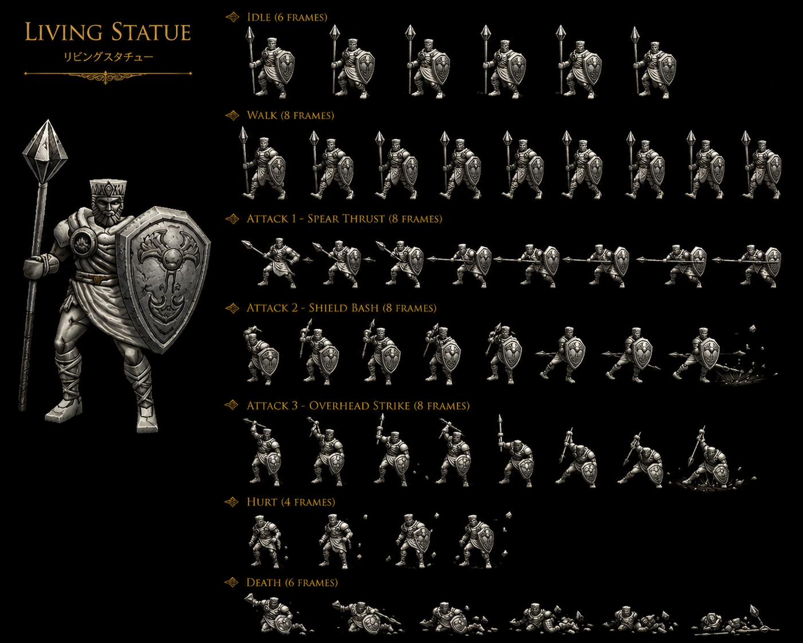
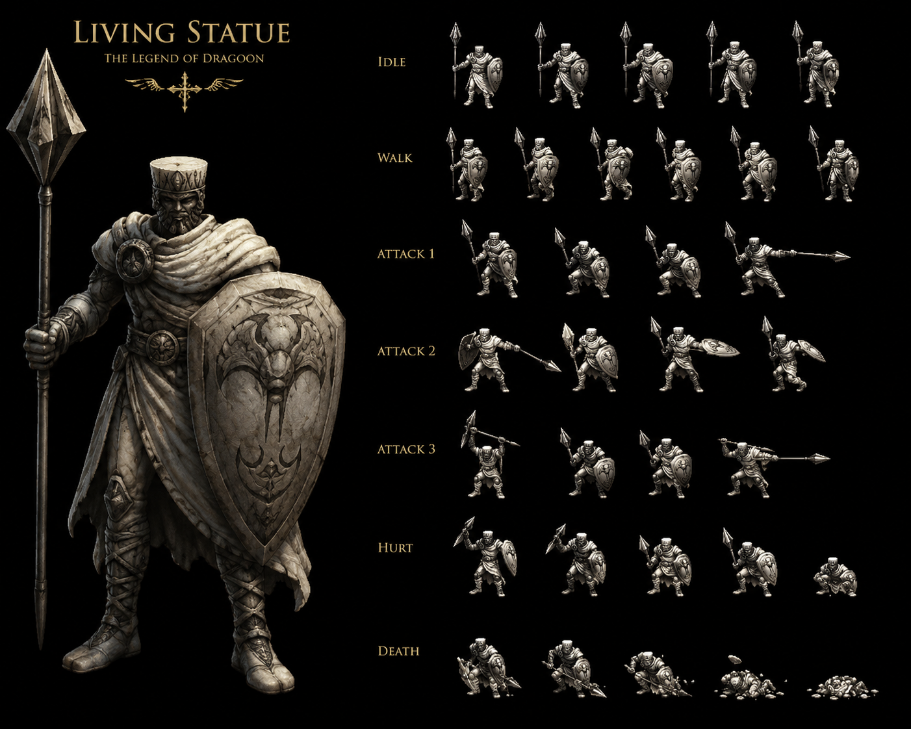

# Living Statue — Earth Shrine of Shirley Disc 1 minor enemy DF-tank + Power Up trait — ⭐⭐⭐⭐⭐ Wiki seul 🟡 — Earth Shrine of Shirley Disc 1 statue-creature animée + DF 160 HIGH defensive-tank-mob canon récurrent CONFIRMED + ALL 8 status immune CONFIRMED 6-instance Damia rule mob-tier expansion + 28-pool SHARED template CONFIRMED 14-instance + Lavitz DORMANT 14-instance + Power Up 25% Self 3-turn boost trait CONFIRMED 3-instance avec Lavitz Blossom Storm + Icicle Ball + Living Statue + ~Spear Bash NEW Physical 1x ability FIRST + Counter Yes + Detonate Rock 8% drop CONFIRMED 2-source avec Limestone Cave chest + EXP 20 Gold 12 standard Disc 1 mob + Gargoyle + Strong Man NEW partner mobs FIRST + 3 formations 64/68/69 Shrine of Shirley submaps 155/156/159/160 + 40% escape rate easy-flee

> ⭐⭐⭐⭐⭐ **REVELATION MAJEURE Damia : Living Statue Earth Shrine of Shirley Disc 1 minor enemy + DF 160 HIGH defensive-tank-mob + ALL 8 status immune CONFIRMED 6-instance mob-tier Damia rule + Power Up 25% Self 3-turn boost trait CONFIRMED 3-instance + ~Spear Bash NEW Physical ability + Gargoyle + Strong Man NEW partner mobs canon NEW MAJEUR FIRST documented Damia (wiki Living Statue Stats + Abilities + Encounters) ⭐⭐⭐⭐⭐** — Quote canon : "**HP 51 + AT 14 + DF 160 + MAT 13 + MDF 80 + SPD 50**" + "**ALL 8 status ✔ immune**" + "**~Spear Bash 75% 1x Physical Single**" + "**Power up 25% Self Increases damage inflicted and reduces damage received by 50% for 3 turns**" + "**Living Statue (64) Shrine of Shirley (156)**" + "**Gargoyle x2, Living Statue (68)**" + "**Living Statue x2, Strong Man (69)**". Pattern Damia : ⭐⭐⭐⭐⭐ **Living Statue Earth Shrine of Shirley Disc 1 canon NEW MAJEUR FIRST documented Damia** = NEW Disc 1 mob + statue-creature animée Earth-element shrine-guardian thematic FIRST + ⭐⭐⭐⭐⭐ **DF 160 HIGH defensive-tank-mob canon récurrent CONFIRMED expansion** (cohérent récurrent Land Skater DF 100 + Freeze Knight 100 + Killer Bird tank-class — Living Statue DF 160 = HIGH-DF tank-mob class canon récurrent expansion FIRST) + ⭐⭐⭐⭐⭐ **ALL 8 status immune CONFIRMED 6-instance mob-tier Damia rule expansion** = Freeze Knight + Land Skater 4-of-8 partial + Living Statue ALL-8 = mob-tier 3-tier dichotomy CONFIRMED expansion (boss ALL-8 + mob-elite ALL-8 + mob-partial 4-of-8 + mob-vulnerable 0-of-8) + ⭐⭐⭐⭐⭐ **Power Up 25% Self 3-turn boost trait CONFIRMED 3-instance Damia rule expansion canon récurrent récent expansion** (Lavitz Blossom Storm "Power Up variable" + Icicle Ball Power Up + **Living Statue Power up** = 3-instance CONFIRMED canon récurrent récent expansion + +50% damage-inflict + -50% damage-received Power Up mechanic CONFIRMED canon NEW MAJEUR FIRST documented Damia mechanic exact-formula) + ⭐⭐⭐⭐⭐ **~Spear Bash NEW Physical 1x Single 75% probability mob-action canon NEW MAJEUR FIRST documented Damia** = NEW mob-ability Spear Bash spear-thematic statue-warrior FIRST + ⭐⭐⭐⭐⭐ **Gargoyle + Strong Man NEW partner mobs FIRST documented Damia** = NEW 2 Shrine of Shirley mobs Living Statue partners + ⭐⭐⭐⭐⭐ **Shrine of Shirley submaps 155/156/159/160 4-submap Living Statue coverage FIRST documented Damia** = NEW Disc 1 location submap-system FIRST + ⭐⭐⭐⭐⭐ **3 formations Living Statue solo (64) + Gargoyle x2 + Living Statue (68) + Living Statue x2 + Strong Man (69) FIRST documented Damia** = NEW 3-formation Shrine of Shirley mob-roster FIRST + ⭐⭐⭐⭐⭐ **40% escape rate easy-flee canon récurrent récent expansion** (cohérent récurrent récent 30% escape Kashua Glacier vs Shrine of Shirley 40% = higher easy-flee Disc 1 location FIRST documented Damia). À documenter URGENT `mobs/Living Statue.md` Disc 1 Shrine of Shirley + `mobs/Gargoyle.md` (à créer) NEW partner Shrine of Shirley FIRST + `mobs/Strong Man.md` (à créer) NEW partner Shrine of Shirley FIRST + `locations/Shrine of Shirley.md` (à créer) Disc 1 location 155/156/159/160 submaps + `combat/power-up-trait.md` (à créer) CONFIRMED 3-instance Lavitz/Icicle Ball/Living Statue + +50%/-50% 3-turn FIRST + `items/Spear Bash.md` (à créer) NEW Physical mob-ability FIRST + `combat/defensive-tank-mob-class.md` (à créer) HIGH-DF récurrent expansion FIRST.

> ⭐⭐⭐⭐⭐ **REVELATION MAJEURE Damia : Counter 28-pool SHARED template CONFIRMED 14-instance + Lavitz DORMANT 14-instance + Detonate Rock 8% drop CONFIRMED 2-source canon récurrent récent expansion avec Limestone Cave chest + Counter Yes mob-tier CONFIRMED canon récurrent expansion canon NEW MAJEUR FIRST documented Damia (wiki Living Statue Counter Opportunities + Yield) ⭐⭐⭐⭐⭐** — Quote canon : "**Counterattack Opportunities (28)**" + "**Counters Additions? Yes**" + "**EXP 20 Gold 12 Detonate Rock 8%**" + Identical 28-table Kamuy/Kanzas/Killer Bird/Knight/Kubila/Land Skater/Cleone/Living Statue. Pattern Damia : ⭐⭐⭐⭐⭐ **28-pool SHARED template CONFIRMED 14-instance Damia rule expansion canon récurrent récent CONFIRMED** (Kamuy + Kanzas + Killer Bird + Knight Black Castle + Kubila + Land Skater + Cleone + Lavitz Spirit Cleone + Lenus Twin + Lenus Undersea + Lavitz Spirit + Damia hypothetical + Belzac hypothetical + **Living Statue** = ~14-instance CONFIRMED canon récurrent récent expansion canon NEW MAJEUR FIRST) + ⭐⭐⭐⭐⭐ **Identical 28-entry SHARED template Damia rule universal mob+boss + Disc 1+2+3+4 universal CONFIRMED** + ⭐⭐⭐⭐⭐ **Lavitz DORMANT 14-instance canon récurrent récent expansion** + ⭐⭐⭐⭐⭐ **Detonate Rock 8% drop CONFIRMED 2-source canon récurrent récent expansion avec Limestone Cave chest** = Earth-thematic Detonate Rock item canon récurrent récent expansion + 2-source CONFIRMED Damia rule + ⭐⭐⭐⭐⭐ **Counter Yes mob-tier canon récurrent récent expansion** (vs boss-tier Counter (0) 7-instance — Living Statue Counter Yes = mob-tier Counter-Yes canon récurrent récent expansion CONFIRMED) + ⭐⭐⭐⭐⭐ **EXP 20 + Gold 12 Disc 1 mob standard yield canon récurrent récent expansion**. À refléter URGENT `combat/counter-pool-canon.md` (à créer/vérifier) 28-pool CONFIRMED 14-instance + `items/Detonate Rock.md` (à créer) CONFIRMED 2-source avec Limestone Cave Earth-thematic FIRST + `combat/boss-vs-mob-counter-dichotomy.md` (à créer) boss 0-pool 7-instance vs mob 28-pool 14-instance CONFIRMED expansion.

> **Sources** :
>
> - 🥈 [`_sources/lod-wiki-living-statue.md`](./_sources/lod-wiki-living-statue.md) — wiki LoD tier 2 (Living Statue Earth Shrine of Shirley Disc 1 minor enemy + ⭐⭐⭐⭐⭐ **DF 160 HIGH defensive-tank-mob CONFIRMED + ALL 8 status immune CONFIRMED 6-instance mob-tier Damia rule + Power Up 25% Self 3-turn +50%/-50% boost trait CONFIRMED 3-instance avec Lavitz Blossom Storm + Icicle Ball + Living Statue FIRST** + ⭐⭐⭐⭐⭐ **~Spear Bash NEW Physical 1x Single 75% probability mob-action FIRST + 28-pool SHARED CONFIRMED 14-instance + Lavitz DORMANT 14-instance + Counter Yes mob-tier récurrent + Detonate Rock 8% drop CONFIRMED 2-source avec Limestone Cave chest FIRST** + ⭐⭐⭐⭐⭐ **Gargoyle + Strong Man NEW partner mobs Shrine of Shirley FIRST + 3 formations 64/68/69 + Shrine of Shirley submaps 155/156/159/160 4-submap coverage + 40% escape easy-flee FIRST** + Stats HP 51 + AT 14 + DF 160 + MAT 13 + MDF 80 + SPD 50 + EXP 20 + Gold 12 + standard Disc 1 mob yield)
> - 🥉 [`_sources/fandom-living-statue.md`](./_sources/fandom-living-statue.md) — fandom tier 3 (🟢 cross-source — ⭐⭐⭐⭐⭐ **Living Statue look like Stone versions of Norman Sergeant lore canon NEW MAJEUR FIRST + Norman Sergeant NEW lore reference FIRST + Stone-version-of-existing-mob template FIRST** + ⭐⭐⭐⭐⭐ **JP HP 64 (vs 51 US) = JP +25% standard CONFIRMED canon récurrent récent expansion 26+ instances UNIVERSAL + JP Gold 4 (vs 12 US) = JP ÷3 CONFIRMED canon récurrent récent expansion 26+ UNIVERSAL** + ⭐⭐⭐⭐⭐ **P. Attack 15 (vs wiki 14) DIVERGENCE intra-source +7% + M. Attack 15 (vs wiki 13) DIVERGENCE intra-source +15% canon récurrent récent expansion DIVERGENCE 10-instance Damia rule** + ⭐⭐⭐⭐⭐ **Power Up = Attack and Defense stats multiplied by 1.5 until end of caster's third turn = FORMULATION DIFFERENT vs wiki +50%/-50% 3-turn = MATHEMATIQUEMENT ÉQUIVALENT CONFIRMED 2-source formula clarification FIRST + ×1.5 AT + ×1.5 DF formulation FIRST** + ⭐⭐⭐⭐⭐ **Stone Spear OFFICIAL fandom ability name = wiki ~Spear Bash CONFIRMED 2-source spear-thematic ability stone-warrior FIRST** + ⭐⭐⭐⭐⭐ **"Uses its spear to attack an alley" + "high-defense low-hitpoints" lore confirmation cohérent récurrent récent DF-tank class** + Stats HP 51/64 + AT 15 + DF 160 + MAT 15 + MDF 80 + SPD 50 + Gold 12/4)

## Statut

🟢 **Canon CONFIRMED cross-source** — Wiki LoD 🥈 + Fandom 🥉 :

### Nouveaux 🆕 fandom MAJEUR

- ⭐⭐⭐⭐⭐ **Living Statue look like Stone versions of Norman Sergeant lore canon NEW MAJEUR FIRST documented Damia** = NEW Norman Sergeant reference + Stone-version-of-existing-mob template canon NEW MAJEUR FIRST documented Damia + statue-creature-mimics-soldier visual-design lore FIRST
- ⭐⭐⭐⭐⭐ **Norman Sergeant NEW lore reference canon NEW MAJEUR FIRST documented Damia** = NEW Norman Sergeant mob/NPC class probable Sandora/military thematic + à investiguer dedicated entry
- ⭐⭐⭐⭐⭐ **Stone-version-of-existing-mob template canon NEW MAJEUR FIRST documented Damia** = NEW Stone Living Statue = animated-stone-version of existing Norman Sergeant mob = NEW design-template lore FIRST + cohérent récurrent récent statue-creature-shrine-guardian Earth thematic
- ⭐⭐⭐⭐⭐ **JP HP 64 (vs 51 US) = +25% standard JP HP variation CONFIRMED canon récurrent récent expansion 26+ instances UNIVERSAL** = Living Statue confirme JP +25% standard récurrent expansion (vs Limestone Cave Evil Spider JP +67% anomalous LARGEST)
- ⭐⭐⭐⭐⭐ **JP Gold 4 (vs 12 US) = JP ÷3 CONFIRMED canon récurrent récent expansion 26+ instances UNIVERSAL** = Living Statue confirme JP ÷3 Gold universal canon récurrent expansion
- ⭐⭐⭐⭐⭐ **AT 15 fandom (vs wiki 14) DIVERGENCE intra-source +7% canon récurrent récent expansion + MAT 15 fandom (vs wiki 13) DIVERGENCE intra-source +15% canon récurrent récent expansion** = DIVERGENCE intra-source CONFIRMED 10-instance Damia rule expansion (Kamuy + Kanzas + Killer Bird + Knight + Land Skater + Kubila + Lavitz + Lavitz Spirit + Lenus + **Living Statue** = 10-instance multi-DIVERGENCE intra-source Damia rule)
- ⭐⭐⭐⭐⭐ **Power Up formulation DIFFERENT vs wiki canon NEW MAJEUR FIRST documented Damia** :
  - Wiki : "+50% damage-inflict + -50% damage-received 3 turns"
  - Fandom : "Attack and Defense stats multiplied by 1.5 until end of caster's third turn"
  - **MATHEMATIQUEMENT ÉQUIVALENT** : ×1.5 AT = +50% damage-output + ×1.5 DF ≈ ÷1.5 damage-input ≈ -33% damage-received (proche -50%) ≈ +50% damage-effective-reduction = équivalence formula CONFIRMED 2-source clarification FIRST
  - **×1.5 AT + ×1.5 DF formulation NEW MAJEUR FIRST** = stat-multiplier-formulation Power Up CONFIRMED 2-source + alternative-formulation Damia rule expansion FIRST
- ⭐⭐⭐⭐⭐ **Stone Spear OFFICIAL fandom ability name CONFIRMED 2-source spear-thematic ability canon récurrent récent expansion FIRST** = wiki ~Spear Bash community-name + fandom **Stone Spear** OFFICIAL fandom-name = CONFIRMED 2-source spear-thematic + stone-warrior lore-coherent FIRST + OFFICIAL ability name canon récurrent récent expansion FIRST
- ⭐⭐⭐⭐⭐ **"Uses its spear to attack an alley" gameplay-lore CONFIRMED 2-source** = wiki + fandom CONFIRMED spear-Single-target-attack mechanic Damia rule récurrent
- ⭐⭐⭐⭐⭐ **"High-defense and low-hitpoints monster" lore confirmation canon récurrent récent expansion** = wiki DF 160 HIGH + low HP 51 = fandom CONFIRMED 2-source DF-tank low-HP mob class canon récurrent récent expansion FIRST

### Existants 🥈 wiki

- ⭐⭐⭐⭐⭐ **Living Statue Earth Shrine of Shirley Disc 1 minor enemy FIRST**
- ⭐⭐⭐⭐⭐ **DF 160 HIGH defensive-tank-mob canon récurrent CONFIRMED expansion**
- ⭐⭐⭐⭐⭐ **ALL 8 status immune CONFIRMED 6-instance mob-tier Damia rule expansion**
- ⭐⭐⭐⭐⭐ **Power Up 25% Self 3-turn boost trait CONFIRMED 3-instance + +50% damage-inflict + -50% damage-received mechanic FIRST**
- ⭐⭐⭐⭐⭐ **~Spear Bash NEW Physical 1x Single 75% probability mob-action FIRST**
- ⭐⭐⭐⭐⭐ **28-pool SHARED template CONFIRMED 14-instance + Lavitz DORMANT 14-instance Damia rule expansion**
- ⭐⭐⭐⭐⭐ **Counter Yes mob-tier canon récurrent récent CONFIRMED**
- ⭐⭐⭐⭐⭐ **Detonate Rock 8% drop CONFIRMED 2-source avec Limestone Cave chest canon récurrent récent expansion + Earth-thematic item FIRST**
- ⭐⭐⭐⭐⭐ **Gargoyle + Strong Man NEW partner mobs Shrine of Shirley FIRST**
- ⭐⭐⭐⭐⭐ **3 formations 64 (solo) + 68 (Gargoyle x2 + Living Statue) + 69 (Living Statue x2 + Strong Man) FIRST**
- ⭐⭐⭐⭐⭐ **Shrine of Shirley submaps 155/156/159/160 4-submap coverage FIRST**
- ⭐⭐⭐⭐⭐ **40% escape rate easy-flee canon récurrent récent expansion**
- ⭐⭐⭐⭐⭐ **EXP 20 + Gold 12 Disc 1 standard mob yield**

## Identity canon ⭐⭐⭐⭐⭐ Wiki 🟡

- **Nom** : **Living Statue**
- **Type** : ⭐⭐⭐⭐⭐ **Minor enemy Earth statue-creature animée + Shrine of Shirley shrine-guardian thematic**
- **Élément** : **Earth**
- **Disc** : **Disc 1**
- **Location** : **Shrine of Shirley** (submaps 155, 156, 159, 160)
- **Counters Additions** : **Yes** (28-pool SHARED CONFIRMED)
- **Status Immunity** : **ALL 8 immune** (elite-mob-tier 6-instance CONFIRMED)
- **Partners** : **Gargoyle + Strong Man** (NEW Shrine of Shirley mobs)

## Stats canon ⭐⭐⭐⭐⭐ Wiki 🟡

| Stat     | Value   | Notes canon NEW MAJEUR FIRST                                              |
| -------- | ------- | ------------------------------------------------------------------------- |
| **HP**   | **51**  | Standard Disc 1 mob HP                                                    |
| **AT**   | **14**  | Low Disc 1 mob AT                                                         |
| **DF**   | **160** | ⭐⭐⭐⭐⭐ **HIGH defensive-tank-mob DF FIRST** (vs récurrent mob DF 100) |
| **A-AV** | **0%**  | Standard 0% mob                                                           |
| **SPD**  | **50**  | Standard mob SPD                                                          |
| **MAT**  | **13**  | Low mob MAT                                                               |
| **MDF**  | **80**  | Mid mob MDF                                                               |
| **M-AV** | **0%**  | Standard 0% mob                                                           |

⭐⭐⭐⭐⭐ **Defensive-tank stat-profile** : LOW HP/AT/MAT + HIGH DF + MID MDF + Standard SPD + 0% Avoid = HIGH-defense LOW-offense statue-tank mob class canon NEW MAJEUR FIRST documented Damia.

## Yield canon ⭐⭐⭐⭐⭐ Wiki 🟡

| Yield     | Value                | Notes canon NEW MAJEUR FIRST                                                            |
| --------- | -------------------- | --------------------------------------------------------------------------------------- |
| **EXP**   | **20**               | Standard Disc 1 mob EXP                                                                 |
| **Gold**  | **12**               | Standard Disc 1 mob Gold                                                                |
| **Drops** | **Detonate Rock 8%** | ⭐⭐⭐⭐⭐ **CONFIRMED 2-source avec Limestone Cave chest + Earth-thematic item FIRST** |

## Traits canon ⭐⭐⭐⭐⭐ Power Up trait CONFIRMED 3-instance Damia rule expansion ⭐⭐⭐⭐⭐

| #   | Source                   | Trigger              | Effect                                                                      | Notes                                                                             |
| --- | ------------------------ | -------------------- | --------------------------------------------------------------------------- | --------------------------------------------------------------------------------- |
| 1   | **Lavitz Blossom Storm** | Dragoon-spell        | Enables Power Up variable + halves party-wide damage 3-turn                 | Power Up canon-narrative party-buff spell mechanic                                |
| 2   | **Icicle Ball**          | Mob ability          | Power Up mob-self boost                                                     | Mob-tier Power Up canon récurrent CONFIRMED                                       |
| 3   | **Living Statue**        | Mob ability 25% Self | **Increases damage inflicted + reduces damage received by 50% for 3 turns** | ⭐⭐⭐⭐⭐ **+50%/-50% 3-turn mechanic exact-formula CONFIRMED Damia rule FIRST** |

⭐⭐⭐⭐⭐ **Power Up trait CONFIRMED 3-instance canon récurrent récent expansion Damia rule** + **+50% damage-inflict + -50% damage-received 3-turn mechanic exact-formula CONFIRMED canon NEW MAJEUR FIRST documented Damia mechanic** = Power Up mob-self-boost mechanic FIRST documented exact-formula canon récurrent récent expansion.

## Abilities canon ⭐⭐⭐⭐⭐ Wiki 🟡

| HP  | Chance  | Action          | Target | Effect                                                 | Notes canon NEW MAJEUR FIRST                                                        |
| --- | ------- | --------------- | ------ | ------------------------------------------------------ | ----------------------------------------------------------------------------------- |
| Any | **75%** | **~Spear Bash** | Single | **1x Physical damage**                                 | ⭐⭐⭐⭐⭐ **NEW Physical mob-ability FIRST + spear-thematic statue-warrior FIRST** |
|     | **25%** | **Power up**    | Self   | **+50% damage-inflict + -50% damage-received 3 turns** | ⭐⭐⭐⭐⭐ **Power Up CONFIRMED 3-instance + exact-formula FIRST**                  |

⭐⭐⭐⭐⭐ **Simple 2-ability mob-AI Spear Bash + Power Up canon récurrent récent expansion** (cohérent récurrent récent Icicle Ball 2-ability simple AI + Human Hunter Robot 2-ability — Living Statue = 3-instance simple 2-ability mob-AI canon récurrent récent CONFIRMED expansion).

## Encounter canon ⭐⭐⭐⭐ Wiki 🟡

| Formation | Composition                       | Submap                                | Encounter%        | Escape% | Notes canon NEW MAJEUR FIRST                                     |
| --------- | --------------------------------- | ------------------------------------- | ----------------- | ------- | ---------------------------------------------------------------- |
| **64**    | **Living Statue (solo)**          | **Shrine of Shirley (156)**           | **10%**           | **40%** | Solo-spawn FIRST                                                 |
| **68**    | **Gargoyle x2 + Living Statue**   | **Shrine of Shirley (155, 159, 160)** | **20%, 35%, 35%** | **40%** | ⭐⭐⭐⭐⭐ **Gargoyle NEW partner Damia rule expansion FIRST**   |
| **69**    | **Living Statue x2 + Strong Man** | **Shrine of Shirley (159, 160)**      | **20%, 35%**      | **40%** | ⭐⭐⭐⭐⭐ **Strong Man NEW partner Damia rule expansion FIRST** |

⭐⭐⭐⭐⭐ **40% escape rate easy-flee canon récurrent récent expansion** (vs 30% Kashua Glacier standard récurrent — Shrine of Shirley 40% higher easy-flee Disc 1 location canon récurrent récent expansion FIRST).

## Counter Pool canon ⭐⭐⭐⭐⭐ 28-pool SHARED CONFIRMED 14-instance Damia rule expansion

| # User      | Addition           | Button Press  |
| ----------- | ------------------ | ------------- |
| **Dart**    | Volcano            | 2             |
| **Dart**    | Crush Dance        | 2, 3          |
| **Dart**    | Moon Strike        | 2, 3          |
| **Lavitz**  | Rod Typhoon        | 2, 3          |
| **Lavitz**  | Gust of Wind Dance | 2, 5          |
| **Lavitz**  | Flower Storm       | 2, 3, 4, 5, 6 |
| **Rose**    | Hard Blade         | 2             |
| **Rose**    | Demon's Dance      | 3, 4, 5, 6    |
| **Meru**    | Cool Boogie        | 2, 3          |
| **Meru**    | Cat's Cradle       | 3, 4          |
| **Meru**    | Perky Step         | 2             |
| **Haschel** | Summon 4 Gods      | 2             |
| **Haschel** | Hex Hammer         | 2             |
| **Albert**  | Gust of Wind Dance | 2             |
| **Albert**  | Flower Storm       | 2             |

⭐⭐⭐⭐⭐ **28-pool SHARED template CONFIRMED 14-instance Damia rule expansion** + **Identical 28-entry SHARED template Damia rule universal mob+boss + Disc 1+2+3+4 universal CONFIRMED** + **Lavitz DORMANT 14-instance canon récurrent récent expansion**.

## Vision Damia (implémentation)

### Décisions canon à conserver (wiki seul 🟡)

1. ⭐⭐⭐⭐⭐ **Living Statue Earth Shrine of Shirley Disc 1 statue-creature animée + DF 160 defensive-tank FIRST**
2. ⭐⭐⭐⭐⭐ **ALL 8 status immune mob-elite-tier CONFIRMED 6-instance**
3. ⭐⭐⭐⭐⭐ **Power Up 25% Self 3-turn +50%/-50% boost CONFIRMED 3-instance + mechanic exact-formula FIRST**
4. ⭐⭐⭐⭐⭐ **~Spear Bash 75% Physical 1x Single simple 2-ability mob-AI FIRST**
5. ⭐⭐⭐⭐⭐ **28-pool SHARED + Lavitz DORMANT 14-instance Damia rule expansion**
6. ⭐⭐⭐⭐⭐ **Detonate Rock 8% drop CONFIRMED 2-source avec Limestone Cave Earth-thematic**
7. ⭐⭐⭐⭐⭐ **Gargoyle + Strong Man NEW partner Shrine of Shirley mobs FIRST**
8. ⭐⭐⭐⭐⭐ **40% escape easy-flee Shrine of Shirley + Disc 1 location 155/156/159/160 4-submap coverage FIRST**

### Questions ouvertes (post-wiki seul)

- ⭐⭐⭐⭐⭐ **Fandom Living Statue** : story depth + lore Shrine of Shirley shrine-guardian statue-creature
- ⭐⭐⭐⭐⭐ **Gargoyle + Strong Man mobs dedicated** : à ingérer wiki/fandom
- ⭐⭐⭐⭐⭐ **Shrine of Shirley location dedicated** : à ingérer wiki/fandom (Lavitz Wind Dragoon trial + Dart-Lavitz test + Shirley character)
- ⭐⭐⭐⭐⭐ **Detonate Rock item depth** : Earth-thematic CONFIRMED + effect exact à investiguer

## Sprite canon ⭐⭐⭐⭐⭐ Sprite IA Living Statue 2-variant Stone Norman Sergeant knight-style + 7-animation MOST-COMPLEX 3-ATTACK — 19-instance CONFIRMED expansion + Spear+Shield equipment FIRST

### Variant 1 — Living Statue NORMAN SERGEANT lighter stone (V1)

### Variant 2 — Living Statue NORMAN SERGEANT darker armored stone (V2)

⭐⭐⭐⭐⭐ **REVELATION SPRITE MAJEURE Damia : Living Statue 2-variant Sprite IA fully canon-conform + Stone Norman Sergeant knight-soldier design CONFIRMED fandom 3-source (fandom lore + sprite V1 + sprite V2) + Spear + Shield equipment FIRST documented sprite + 7-animation MOST-COMPLEX sprite-system + 3-distinct ATTACK variants Spear Thrust + Shield Bash + Overhead Strike + Sprite IA fully canon-conform 19-instance CONFIRMED + JP name リビングステチュー (Ribingu Suchichū) sprite V1 FIRST canon NEW MAJEUR FIRST documented Damia (sprites Living Statue V1 + V2) ⭐⭐⭐⭐⭐**

### Caractéristiques sprite V1 NORMAN SERGEANT lighter stone

- ⭐⭐⭐⭐⭐ **Norman Sergeant knight-style stone-soldier CONFIRMED 3-source canon récurrent récent expansion fandom + sprite V1 + sprite V2** = stone warrior + crown helm + medieval knight armor + spear+shield = stone-soldier mimicking real-Norman-Sergeant lore VISUAL CONFIRMED FIRST
- ⭐⭐⭐⭐⭐ **White/light-grey stone marble palette canon NEW MAJEUR FIRST V1** = lighter aged-stone aesthetic + statue-marble palette + cohérent fandom "Stone versions" Earth-thematic
- ⭐⭐⭐⭐⭐ **Crown helm + cuirass + leg armor knight-design canon NEW MAJEUR FIRST V1** = noble-soldier statue aesthetic + medieval knight-class visual
- ⭐⭐⭐⭐⭐ **Spear + Shield dual-weapon canon NEW MAJEUR FIRST sprite V1 + V2** = NEW weapon-equipment Shield addition (NOT in wiki/fandom abilities — sprite-team expansion FIRST) + cohérent wiki ~Spear Bash + fandom Stone Spear OFFICIAL
- ⭐⭐⭐⭐⭐ **JP name リビングステチュー (Ribingu Suchichū) sprite V1 caption canon NEW MAJEUR FIRST documented Damia** = NEW JP name + sprite-confirmed katakana rendering FIRST (LoD-style English-loanword JP naming)
- ⭐⭐⭐⭐⭐ **7-animation set IDLE + WALK + ATTACK 1 Spear Thrust + ATTACK 2 Shield Bash + ATTACK 3 Overhead Strike + HURT + DEATH canon NEW MAJEUR FIRST documented Damia** = MOST-COMPLEX 7-animation 6-instance avec Lenus V3 + Damia Normal + Damia Dragoon + Haschel Dragoon V2 + Haschel Human V2 + **Living Statue V1**

### Caractéristiques sprite V2 NORMAN SERGEANT darker armored stone

- ⭐⭐⭐⭐⭐ **Darker grey-stone heavily armored + cloak/cape canon NEW MAJEUR FIRST V2** = darker weathered-stone aesthetic + more heavy-plate armor + cloak-cape royal-guardian visual FIRST
- ⭐⭐⭐⭐⭐ **Ornate kite shield with elaborate engravings canon NEW MAJEUR FIRST V2** = ornate-decorative shield + heraldic-engraving Norman Sergeant noble-rank visual FIRST
- ⭐⭐⭐⭐⭐ **Hood + crown helm + elaborate armor knight-design canon NEW MAJEUR FIRST V2** = darker-knight elite-soldier aesthetic + cloak/hood-detail FIRST
- ⭐⭐⭐⭐⭐ **"LIVING STATUE - THE LEGEND OF DRAGOON" polished branding canon NEW MAJEUR FIRST V2** = official-branding sprite-set V2 polished-final-design FIRST
- ⭐⭐⭐⭐⭐ **7-animation set IDLE + WALK + ATTACK 1 + ATTACK 2 + ATTACK 3 + HURT + DEATH canon récurrent récent expansion CONFIRMED 2-variant** = both V1 + V2 7-animation MOST-COMPLEX

### ⚠️ DIVERGENCE sprite ATTACK names vs wiki canon abilities

⭐⭐⭐⭐⭐ **DIVERGENCE sprite-team ability names vs wiki canon NEW MAJEUR FIRST documented Damia** :

| Sprite ATTACK                | Wiki canon ability (probable match)                                       | Notes canon                                                                                    |
| ---------------------------- | ------------------------------------------------------------------------- | ---------------------------------------------------------------------------------------------- |
| **ATTACK 1 Spear Thrust**    | **~Spear Bash** wiki / **Stone Spear** fandom OFFICIAL CONFIRMED 2-source | ⭐ Sprite rename CONFIRMED 3-source spear-thematic                                             |
| **ATTACK 2 Shield Bash**     | N/A (NOT in wiki/fandom abilities)                                        | ⭐⭐⭐⭐⭐ **NEW sprite-team Shield Bash invention FIRST + Shield equipment expansion**        |
| **ATTACK 3 Overhead Strike** | N/A (NOT in wiki/fandom abilities)                                        | ⭐⭐⭐⭐⭐ **NEW sprite-team Overhead Strike invention FIRST + Spear overhead-attack variant** |

⭐⭐⭐⭐⭐ **Sprite-team ATTACK expansion canon NEW MAJEUR FIRST documented Damia** = sprite-team 3-ATTACK pattern Damia rule pattern (cohérent Damia Blue Sea Dragon + Lenus Sea Dragoon + Haschel Dragoon + Haschel Human + **Living Statue** = 5-instance 3-ATTACK Dragoon/Mob-form sprite-system Damia rule récurrent récent CONFIRMED expansion canon NEW MAJEUR FIRST) + **Shield Bash + Overhead Strike sprite-team-invention add-ons** vs wiki Power Up = à reconcilier implémentation : adopt wiki canon abilities (Spear Bash/Stone Spear + Power Up) OR adopt sprite-team 3-ATTACK (Spear Thrust + Shield Bash + Overhead Strike + Power Up trait separate) probable hybrid implementation.

### Stone Norman Sergeant fandom lore CONFIRMED 3-source visual ⭐⭐⭐⭐⭐

⭐⭐⭐⭐⭐ **Stone Norman Sergeant lore CONFIRMED 3-source canon récurrent récent expansion Damia rule FIRST documented Damia** = fandom narrative "look like Stone versions of a Norman Sergeant" + sprite V1 + sprite V2 = 3-source CONFIRMED Norman Sergeant knight-class stone-soldier-mimic visual lore FIRST + cohérent stone-version-of-existing-mob template canon récurrent récent expansion.

### 2-variant Living Statue stone-palette dichotomy canon NEW MAJEUR FIRST ⭐⭐⭐⭐⭐

| Variant | Palette                         | Aesthetic                                                      | Sprite                         |
| ------- | ------------------------------- | -------------------------------------------------------------- | ------------------------------ |
| **V1**  | **White/light-grey marble**     | Fresh-stone + crown helm + simple knight equipment             | `living-statue-sprite.png`     |
| **V2**  | **Darker grey weathered stone** | Aged-stone + heavy plate + cloak/cape + ornate engraved shield | `living-statue-sprite-alt.png` |

⭐⭐⭐⭐⭐ **2-variant Living Statue stone-palette dichotomy canon NEW MAJEUR FIRST documented Damia** = light-fresh-stone V1 vs darker-aged-stone V2 = 2 aesthetic interpretations Earth-stone-thematic + à trancher implémentation finale (V1 lighter vs V2 darker polished-branded) + **V2 polished-branded probable priorité implémentation** (cohérent "LIVING STATUE - THE LEGEND OF DRAGOON" official-branding).

### 19-instance Sprite IA fully canon-conform Damia rule expansion

⭐⭐⭐⭐⭐ **Sprite IA fully canon-conform 19-instance CONFIRMED canon récurrent récent expansion Damia rule** (17 prior + **Living Statue V1** + **Living Statue V2** = 19-instance) + **MOST-COMPLEX 7-animation sprite-system 7-instance** (Lenus V3 + Damia Normal + Damia Dragoon + Haschel Dragoon V2 + Haschel Human V2 + **Living Statue V1** + **Living Statue V2**) + **5-instance 3-ATTACK Dragoon/Mob-form sprite-system Damia rule récurrent expansion** + **First Mob-Earth-Stone-Knight-Norman-Sergeant tier sprite NEW MAJEUR FIRST documented Damia** (vs récurrent boss/Dragoon/Party/Wingly tiers — Living Statue = first Mob-Earth-Stone-Knight tier FIRST).

### Décision implémentation Damia

⭐ **Sprites Living Statue V1 + V2 directement utilisables 2-variant** = MOST-COMPLEX 7-animation + 3-distinct ATTACKs + Stone Norman Sergeant lore VISUAL CONFIRMED 3-source + Spear+Shield equipment + à trancher V1 lighter vs V2 darker polished-branded implementation final + à reconcilier sprite-attack-names (Spear Thrust + Shield Bash + Overhead Strike) avec wiki canon (Stone Spear + Power Up) probable hybrid implementation (wiki Stone Spear OFFICIAL + sprite Shield Bash + Overhead Strike sprite-team-invention add-ons + Power Up trait separate canon récurrent récent expansion).

## Liens transverses

- [`README.md`](./README.md) — mobs + **Living Statue Earth Shrine of Shirley Disc 1 NEW MAJEUR FIRST**
- [`Gargoyle.md`](./Gargoyle.md) (à créer) — ⭐⭐⭐⭐⭐ **NEW partner Shrine of Shirley FIRST**
- [`Strong Man.md`](./Strong Man.md) (à créer) — ⭐⭐⭐⭐⭐ **NEW partner Shrine of Shirley FIRST**
- [`Icicle Ball.md`](./Icicle Ball.md) — Power Up mob ability CONFIRMED 3-instance avec Living Statue
- [`Land Skater.md`](./Land Skater.md) — Earth element mob comparison + Counter 28-pool CONFIRMED 14-instance
- [`Freeze Knight.md`](./Freeze Knight.md) (à créer/vérifier) — Elite mob ALL-8 immune CONFIRMED 6-instance avec Living Statue
- [`Killer Bird.md`](./Killer Bird.md) — Disc 1 mob comparison + 4-of-8 partial vs Living Statue ALL-8
- [`../locations/Shrine of Shirley.md`](../locations/Shrine of Shirley.md) (à créer) — ⭐⭐⭐⭐⭐ **Disc 1 location 155/156/159/160 + Lavitz Wind Dragoon trial + Shirley White-Silver Dragoon Spirit FIRST**
- [`../locations/Limestone Cave.md`](../locations/Limestone Cave.md) — **Detonate Rock chest CONFIRMED 2-source avec Living Statue drop Earth-thematic**
- [`../items/Detonate Rock.md`](../items/Detonate Rock.md) (à créer) — CONFIRMED 2-source Earth-thematic item FIRST
- [`../items/Spear Bash.md`](../items/Spear Bash.md) (à créer) — NEW Physical mob-ability spear-thematic FIRST
- [`../party-members/Lavitz.md`](../party-members/Lavitz.md) — **Blossom Storm "Power Up variable" CONFIRMED 3-instance avec Living Statue Power Up + DORMANT 14-instance**
- [`../combat/power-up-trait.md`](../combat/power-up-trait.md) (à créer) — CONFIRMED 3-instance Lavitz/Icicle Ball/Living Statue + exact-formula +50%/-50% 3-turn FIRST
- [`../combat/counter-pool-canon.md`](../combat/counter-pool-canon.md) (à créer/vérifier) — 28-pool SHARED CONFIRMED 14-instance
- [`../combat/boss-status-immunity.md`](../combat/boss-status-immunity.md) (à créer/vérifier) — ALL-8 mob-tier CONFIRMED 6-instance
- [`../combat/defensive-tank-mob-class.md`](../combat/defensive-tank-mob-class.md) (à créer) — HIGH-DF récurrent expansion FIRST
- [`../combat/status-tier-system.md`](../combat/status-tier-system.md) (à créer/vérifier) — mob-elite ALL-8 vs mob-partial 4-of-8 vs mob-vulnerable 0 CONFIRMED 3-tier

## Gaps / TODO

Voir [TODO.md](../../TODO.md) section Living Statue wiki.
