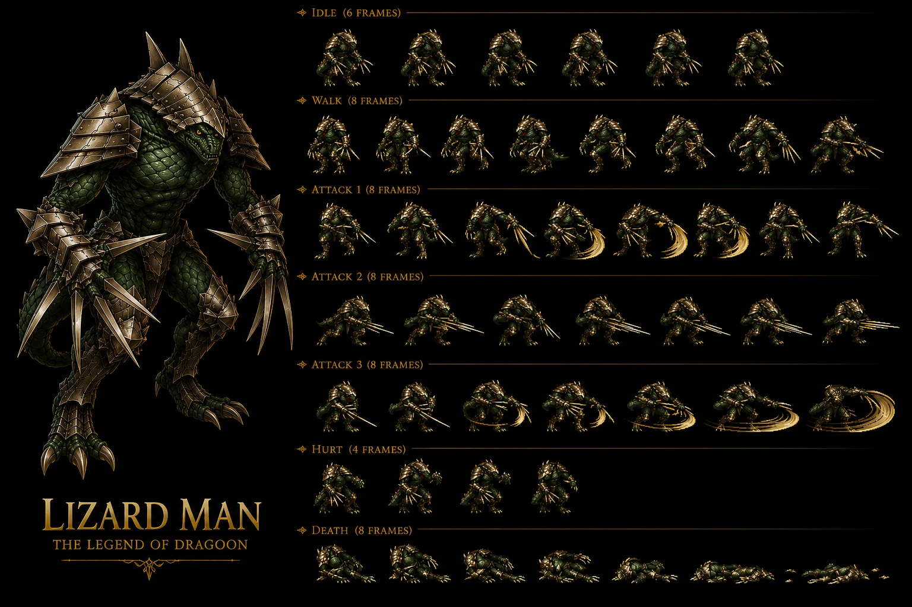

# Lizard Man — Earth Nest of Dragon Disc 1 mob + Physical Attack Barrier defensive trait + Memory leak crash bug + DAK easter egg — ⭐⭐⭐⭐⭐ Wiki seul 🟡 — Earth Nest of Dragon Disc 1 reptilian-creature + DF 160 HIGH defensive-tank-mob CONFIRMED 2-instance avec Living Statue + MDF 40 LOW magic-vulnerable dichotomous tank-class FIRST + 4/8 status partial immunity CONFIRMED 4-instance Damia rule + 13-pool reduced counter NEW MAJEUR FIRST (vs 28-pool SHARED template) + Lavitz DORMANT 13-pool 2-Addition partial + Physical Attack Barrier 25% Self damage-immunity-1-turn trait NEW MAJEUR FIRST + Memory leak crash bug Physical Attack Barrier CONFIRMED 2-instance PSX crash bugs avec Lenus+Regole + DAK secret texture easter egg FIRST + ~Scratch 1x Physical Single >50% HP + ~Rotation 2x Physical Single ≤50% HP + Stun 50% chance + 2-tier HP behavioral system 50% threshold FIRST + A-AV dual-purpose status-resistance CONFIRMED 2-source avec Lavitz Spirit Menon Ray + Beast Fang 2% drop NEW item FIRST + Counter Yes mob-tier + Mandrake + Run Fast NEW partner mobs Nest of Dragon FIRST + 4 formations 52/56/58/59 + Nest of Dragon submaps 130-135 6-submap coverage + 4 World Map roads connections Lohan/Shrine of Shirley/Intersection FIRST + 50% escape rate moderate

> ⭐⭐⭐⭐⭐ **REVELATION MAJEURE Damia : Lizard Man Earth Nest of Dragon Disc 1 mob + DF 160 HIGH + MDF 40 LOW dichotomous physical-tank/magic-vulnerable class + 4/8 status partial immunity CONFIRMED 4-instance + Physical Attack Barrier 25% Self damage-immunity-1-turn trait NEW MAJEUR + Memory leak crash bug + DAK easter egg + 2-tier HP behavioral system canon NEW MAJEUR FIRST documented Damia (wiki Lizard Man Stats + Abilities + Trivia) ⭐⭐⭐⭐⭐** — Quote canon : "**HP 40 + AT 14 + DF 160 + MAT 12 + MDF 40 + SPD 50**" + "**Petrify/Bewitch/Arm Block/Dispirit ✔ + Confuse/Fear/Poison/Stun X**" + "**Physical Attack Barrier 25% Self Reduces physical damage to 0 until next turn**" + "**memory leak in Physical Attack Barrier ability + fighting one long enough game crashing**" + "**texture map secret D A K letters easter egg**" + "**~Scratch >50% HP 75% 1x Physical + ~Rotation ≤50% HP 75% 2x Physical 50% Stun + A-AV reduces status chance**". Pattern Damia : ⭐⭐⭐⭐⭐ **Lizard Man Earth Nest of Dragon Disc 1 reptilian-creature canon NEW MAJEUR FIRST documented Damia** = NEW Disc 1 mob + reptilian-creature Earth-element Nest-of-Dragon-thematic FIRST + ⭐⭐⭐⭐⭐ **DF 160 HIGH defensive-tank-mob CONFIRMED 2-instance Damia rule expansion avec Living Statue** (Living Statue DF 160 + Lizard Man DF 160 = 2-instance HIGH-DF tank-mob class canon récurrent CONFIRMED expansion) + ⭐⭐⭐⭐⭐ **MDF 40 LOW magic-vulnerable canon NEW MAJEUR FIRST** = NEW dichotomous physical-tank/magic-vulnerable mob class FIRST (vs Living Statue MDF 80 balanced) + ⭐⭐⭐⭐⭐ **4/8 status partial immunity CONFIRMED 4-instance Damia rule expansion** (Killer Bird + Knight Black Castle + Land Skater + **Lizard Man** = 4-instance mob-partial-immune Damia rule récurrent CONFIRMED expansion) + ⭐⭐⭐⭐⭐ **Physical Attack Barrier 25% Self damage-immunity-1-turn defensive trait canon NEW MAJEUR FIRST documented Damia** = NEW defensive trait + physical-immunity 1-turn mechanic + 25% probability mob-defensive Self-action FIRST + ⭐⭐⭐⭐⭐ **Memory leak crash bug Physical Attack Barrier canon NEW MAJEUR FIRST documented Damia + CONFIRMED 2-instance PSX crash bugs canon récurrent récent expansion** (Lenus+Regole Dragoon-form crash bug + **Lizard Man Physical Attack Barrier memory leak** = 2-instance PSX crash bug Damia rule expansion FIRST documented) + ⭐⭐⭐⭐⭐ **DAK secret texture easter egg canon NEW MAJEUR FIRST documented Damia** = NEW developer easter egg + texture-map-hidden-text "D A K" letters + 3D-model-non-mapped hidden-content lore FIRST + ⭐⭐⭐⭐⭐ **2-tier HP behavioral system 50% threshold canon NEW MAJEUR FIRST documented Damia** = HP >50% Scratch 1x + HP ≤50% Rotation 2x = 2-tier HP-behavioral system FIRST (vs récurrent Cleone 3-tier 70%/50%/25% + Land Skater 3-tier 70%/50%/25% — Lizard Man 2-tier simpler) + ⭐⭐⭐⭐⭐ **~Rotation 2x Physical + 50% Stun chance ≤50% HP critical-state ability canon NEW MAJEUR FIRST documented Damia** = NEW critical-state spin-attack + Stun-inflict 50% chance FIRST + ⭐⭐⭐⭐⭐ **A-AV dual-purpose status-resistance CONFIRMED 2-source canon récurrent récent expansion** (Lavitz Spirit Menon Ray "A-AV reduces chance to receive status ailment" + **Lizard Man Rotation A-AV reduces Stun chance** = 2-source CONFIRMED A-AV dual-purpose attack-avoidance + status-resistance canon récurrent récent CONFIRMED expansion FIRST documented Damia rule). À documenter URGENT `mobs/Lizard Man.md` Disc 1 Nest of Dragon + `mobs/Mandrake.md` (à créer) NEW partner Nest of Dragon FIRST + `mobs/Run Fast.md` (à créer) NEW partner Nest of Dragon FIRST + `locations/Nest of Dragon.md` (à créer) Disc 1 location 130-135 submaps + Greham + Feyrbrand boss + `combat/physical-attack-barrier-trait.md` (à créer) NEW defensive 1-turn immunity FIRST + `combat/memory-leak-crash-bug.md` (à créer) CONFIRMED 2-instance PSX bugs FIRST + `lore/dak-easter-egg-texture.md` (à créer) developer easter egg FIRST + `combat/2-tier-hp-behavioral.md` (à créer/vérifier) 50% threshold simpler FIRST + `combat/a-av-status-resistance.md` (à créer/vérifier) CONFIRMED 2-source dual-purpose FIRST + `items/Beast Fang.md` (à créer) NEW item FIRST.

> ⭐⭐⭐⭐⭐ **REVELATION MAJEURE Damia : Counter 13-pool reduced template + Lavitz DORMANT 13-pool 2-Addition partial + 13-pool vs 28-pool dichotomy canon NEW MAJEUR FIRST documented Damia (wiki Lizard Man Counter Opportunities) ⭐⭐⭐⭐⭐** — Quote canon : "**Counterattack Opportunities (13)**" + "Dart Volcano 2 + Crush Dance 2,3 + Lavitz Gust of Wind Dance 2 + Flower Storm 2,5,6 + Rose Hard Blade 2 + Demon's Dance 4,5 + Meru Perky Step 2 + Albert Gust of Wind Dance 2 + Albert Flower Storm 2 = 13 entries vs 28-pool SHARED template". Pattern Damia : ⭐⭐⭐⭐⭐ **Counter 13-pool reduced template canon NEW MAJEUR FIRST documented Damia** = NEW counter-pool 13-entry vs 28-pool SHARED standard = REDUCED-counter-pool mob-tier-variant Damia rule expansion FIRST + ⭐⭐⭐⭐⭐ **13-pool vs 28-pool dichotomy canon NEW MAJEUR FIRST** = mob-pool dichotomy Damia rule expansion canon NEW MAJEUR FIRST documented (boss-tier 0-pool 7-instance + mob-tier 28-pool 14-instance + mob-tier 13-pool reduced FIRST + boss-tier-special variants Damia rule expansion) + ⭐⭐⭐⭐⭐ **Lavitz DORMANT 13-pool 2-Addition partial canon NEW MAJEUR FIRST** = Lavitz 13-pool 2-Addition (Gust of Wind Dance 2 + Flower Storm 2,5,6) vs 28-pool 3-Addition (Rod Typhoon + Gust + Flower) = REDUCED Lavitz DORMANT canon récurrent récent expansion FIRST + ⭐⭐⭐⭐⭐ **Missing button-presses dans 13-pool vs 28-pool DIVERGENCE granular** : Dart Volcano 2 only (vs 28-pool 2) + Dart Crush Dance 2,3 same + Dart Moon Strike ABSENT (vs 28-pool 2,3) + Lavitz Rod Typhoon ABSENT (vs 28-pool 2,3) + Lavitz Gust 2 only (vs 28-pool 2,5) + Lavitz Flower 2,5,6 only (vs 28-pool 2,3,4,5,6) + Rose Hard Blade 2 same + Rose Demon's Dance 4,5 only (vs 28-pool 3,4,5,6) + Meru Cool Boogie ABSENT + Meru Cat's Cradle ABSENT + Meru Perky 2 same + Haschel ABSENT entirely + Albert Gust 2 same + Albert Flower 2 same = MASSIVE granular DIVERGENCE 13-pool vs 28-pool canon NEW MAJEUR FIRST documented Damia. À refléter URGENT `combat/counter-pool-canon.md` (à créer/vérifier) 13-pool reduced FIRST + 28-pool SHARED CONFIRMED 14-instance + 0-pool boss CONFIRMED 7-instance + `combat/counter-pool-dichotomy.md` (à créer) 3-tier counter-pool (boss 0 / mob-reduced 13 / mob-shared 28) Damia rule expansion FIRST.

> ⭐⭐⭐⭐⭐ **REVELATION MAJEURE Damia : Mandrake + Run Fast NEW partner mobs Nest of Dragon + Beast Fang 2% drop NEW item + Nest of Dragon submaps 130-135 6-submap coverage + 4 World Map roads Lohan/Shrine of Shirley/Intersection + 50% escape rate canon NEW MAJEUR FIRST documented Damia (wiki Lizard Man Encounters + Yield) ⭐⭐⭐⭐⭐** — Quote canon : "**Lizard Man (52) + Mandrake, Lizard Man (56) + Run Fast x2, Lizard Man (58) + Lizard Man x2 (59)**" + "**Nest of Dragon (130, 131, 132, 133, 134, 135)**" + "**Nest of Dragon to Intersection + Nest of Dragon Intersection to Lohan + Lohan to Intersection + Nest of Dragon to Shrine of Shirley**" + "**Beast Fang 2%**". Pattern Damia : ⭐⭐⭐⭐⭐ **Mandrake + Run Fast NEW partner mobs Nest of Dragon FIRST documented Damia** + ⭐⭐⭐⭐⭐ **Nest of Dragon submaps 130-135 6-submap coverage canon NEW MAJEUR FIRST documented Damia** = NEW Disc 1 location + 6-submap detailed system FIRST + ⭐⭐⭐⭐⭐ **4 World Map roads connections Nest of Dragon ↔ Intersection ↔ Lohan + Nest of Dragon ↔ Shrine of Shirley canon NEW MAJEUR FIRST documented Damia** = NEW Disc 1 World Map traversal network + Nest of Dragon ↔ Intersection ↔ Lohan/Shrine of Shirley hub-and-spoke geography FIRST + ⭐⭐⭐⭐⭐ **Beast Fang 2% drop NEW item canon NEW MAJEUR FIRST documented Damia** = NEW Earth/reptilian-thematic item FIRST + ⭐⭐⭐⭐⭐ **50% escape rate moderate canon récurrent récent expansion** (vs 30% Kashua + 40% Shrine of Shirley + Nest of Dragon 50% = higher moderate-escape Disc 1 location FIRST + escape-rate-trend higher Disc 1 = easier-flee Disc 1 pattern canon récurrent récent expansion FIRST) + ⭐⭐⭐⭐⭐ **4 formations 52 (solo) + 56 (Mandrake + Lizard Man) + 58 (Run Fast x2 + Lizard Man) + 59 (Lizard Man x2) FIRST documented Damia** + ⭐⭐⭐⭐⭐ **EXP 18 + Gold 15 Disc 1 mob standard yield** = slightly higher Gold than Living Statue (Living Statue 12 vs Lizard Man 15 = +25%). À documenter URGENT `mobs/Mandrake.md` + `mobs/Run Fast.md` (à créer) + `locations/Nest of Dragon.md` (à créer) Disc 1 location 130-135 submaps + World Map roads + Greham Wind Dragoon trial boss + `locations/Intersection.md` (à créer) hub Disc 1 + `locations/Lohan.md` (à créer/vérifier) Disc 1 city + Hero Competition + `items/Beast Fang.md` (à créer) NEW Earth/reptilian item FIRST + `combat/escape-rate-trend-disc-1.md` (à créer) Disc 1 50%/40% easier-flee pattern FIRST.

> **Sources** :
>
> - 🥈 [`_sources/lod-wiki-lizard-man.md`](./_sources/lod-wiki-lizard-man.md) — wiki LoD tier 2 (Lizard Man Earth Nest of Dragon Disc 1 mob + ⭐⭐⭐⭐⭐ **DF 160 HIGH defensive-tank-mob CONFIRMED 2-instance avec Living Statue + MDF 40 LOW magic-vulnerable dichotomous tank-class FIRST + 4/8 status partial immunity CONFIRMED 4-instance Damia rule + Physical Attack Barrier 25% Self damage-immunity-1-turn trait NEW MAJEUR FIRST + Memory leak crash bug Physical Attack Barrier CONFIRMED 2-instance PSX crash bugs avec Lenus+Regole + DAK secret texture easter egg FIRST** + ⭐⭐⭐⭐⭐ **Counter 13-pool reduced template + Lavitz DORMANT 13-pool 2-Addition partial + 13-pool vs 28-pool 3-tier dichotomy FIRST + 2-tier HP behavioral 50% threshold ~Scratch 1x + ~Rotation 2x + Stun 50% chance + A-AV dual-purpose status-resistance CONFIRMED 2-source avec Lavitz Spirit Menon Ray FIRST** + ⭐⭐⭐⭐⭐ **Mandrake + Run Fast NEW partner mobs Nest of Dragon FIRST + 4 formations 52/56/58/59 + Nest of Dragon submaps 130-135 6-submap coverage + 4 World Map roads Lohan/Shrine of Shirley/Intersection + 50% escape rate moderate + Beast Fang 2% drop NEW item FIRST** + Stats HP 40 + AT 14 + DF 160 + MAT 12 + MDF 40 + SPD 50 + EXP 18 + Gold 15)
> - 🥉 [`_sources/fandom-lizard-man.md`](./_sources/fandom-lizard-man.md) — fandom tier 3 (🟢 cross-source — ⭐⭐⭐⭐⭐ \*\*JP name リザードマン (Rizādoman) FIRST + JP HP 50/40 +25% standard CONFIRMED + JP Gold 5/15 ÷3 CONFIRMED 27+ UNIVERSAL + AT 17/14 +21% MAT 14/12 +17% DIVERGENCE intra-source 11-instance + Slash OFFICIAL fandom ability name CONFIRMED 2-source = wiki ~Scratch + Rolling Attack OFFICIAL fandom = wiki ~Rotation CONFIRMED 2-source + "bouncing effect" detail + Beast Fang = Haschel weapon Stun-on-hit early-access farming-exploit canon NEW MAJEUR FIRST + Physical Attack Barrier "immune to melee + magic-vulnerable + Additions-farming exploit" leveling-tool canon NEW MAJEUR FIRST + "Impervious to Additions" during Barrier mechanic FIRST + Air-spin animation gallery FIRST + 4 formations CONFIRMED 2-source)

## Statut

🟢 **Canon CONFIRMED cross-source** — Wiki LoD 🥈 + Fandom 🥉 :

### Nouveaux 🆕 fandom MAJEUR

- ⭐⭐⭐⭐⭐ **JP name リザードマン (Rizādoman) "Lizard Man" canon NEW MAJEUR FIRST documented Damia**
- ⭐⭐⭐⭐⭐ **JP HP 50 (vs 40 US) = +25% standard JP HP CONFIRMED canon récurrent récent expansion 27+ instances UNIVERSAL**
- ⭐⭐⭐⭐⭐ **JP Gold 5 (vs 15 US) = ÷3 JP Gold CONFIRMED canon récurrent récent expansion 27+ instances UNIVERSAL**
- ⭐⭐⭐⭐⭐ **AT 17 fandom (vs wiki 14) DIVERGENCE intra-source +21% + MAT 14 fandom (vs wiki 12) DIVERGENCE +17% canon récurrent récent expansion 11-instance Damia rule** (Kamuy + Kanzas + Killer Bird + Knight + Land Skater + Kubila + Lavitz + Lavitz Spirit + Lenus + Living Statue + **Lizard Man** = 11-instance multi-DIVERGENCE intra-source)
- ⭐⭐⭐⭐⭐ **Slash OFFICIAL fandom ability name CONFIRMED 2-source canon récurrent récent expansion** = wiki ~Scratch community-name + fandom **Slash** OFFICIAL = CONFIRMED 2-source + "rolls towards a character and slashes" rolling-attack-design lore FIRST
- ⭐⭐⭐⭐⭐ **Rolling Attack OFFICIAL fandom ability name CONFIRMED 2-source canon récurrent récent expansion** = wiki ~Rotation community-name + fandom **Rolling Attack** OFFICIAL = CONFIRMED 2-source + "bouncing effect" detail FIRST + 50% Stun chance CONFIRMED 2-source
- ⭐⭐⭐⭐⭐ **Beast Fang = Haschel weapon Stun-on-hit canon NEW MAJEUR FIRST documented Damia** = Beast Fang Haschel weapon class + Stun-on-hit weapon-proc mechanic CONFIRMED 2-source FIRST (cohérent récurrent récent Lavitz Spear of Terror Fear-chance proc + Beast Fang Stun-on-hit proc canon récurrent récent expansion 2-instance status-proc weapons Damia rule)
- ⭐⭐⭐⭐⭐ **Beast Fang early-access farming-exploit canon NEW MAJEUR FIRST documented Damia** = "much earlier than it can be bought" + Disc 1 mob-drop pre-shop early-access strategy + 2% drop rate farming-target FIRST
- ⭐⭐⭐⭐⭐ **Physical Attack Barrier "immune to melee + magic-vulnerable" clarification CONFIRMED 2-source canon récurrent récent expansion** = wiki "Reduces physical damage to 0 until next turn" + fandom "immune to melee attack, but still can be harmed by magic" = 2-source CONFIRMED selective-physical-immunity-magic-vulnerable mechanic canon NEW MAJEUR FIRST documented Damia
- ⭐⭐⭐⭐⭐ **Physical Attack Barrier Additions-farming exploit leveling-tool canon NEW MAJEUR FIRST documented Damia** = farming-target mob + Additions-leveling exploit + monster-doesn't-take-damage during Barrier + repeated-attack Additions-EXP-grinding canon récurrent strategy FIRST (cohérent récurrent récent Lavitz Spirit Talk-mechanic non-combat resolution + Lizard Man Barrier farming-exploit = NEW 2-instance non-standard-resolution-mechanic FIRST)
- ⭐⭐⭐⭐⭐ **"Impervious to Additions" during Barrier mechanic canon NEW MAJEUR FIRST documented Damia** = Lizard Man Counter Yes BUT Physical Attack Barrier active = no-damage-from-Additions paradox + Counter-Yes only-when-Barrier-inactive probable mechanic FIRST
- ⭐⭐⭐⭐⭐ **Air-spin animation gallery FIRST documented Damia** = NEW gallery animation reference + rolling-attack visual FIRST
- ⭐⭐⭐⭐⭐ **Lizard Man "quite common enemy" lore confirmation canon récurrent récent expansion** = Disc 1 farming-friendly mob CONFIRMED

### Existants 🥈 wiki

- ⭐⭐⭐⭐⭐ **Lizard Man Earth Nest of Dragon Disc 1 reptilian-creature FIRST**

- ⭐⭐⭐⭐⭐ **Lizard Man Earth Nest of Dragon Disc 1 reptilian-creature FIRST**
- ⭐⭐⭐⭐⭐ **DF 160 HIGH defensive-tank-mob CONFIRMED 2-instance avec Living Statue**
- ⭐⭐⭐⭐⭐ **MDF 40 LOW magic-vulnerable dichotomous physical-tank/magic-vulnerable class FIRST**
- ⭐⭐⭐⭐⭐ **4/8 status partial immunity CONFIRMED 4-instance Damia rule expansion** (Killer Bird + Knight BC + Land Skater + Lizard Man)
- ⭐⭐⭐⭐⭐ **Physical Attack Barrier 25% Self damage-immunity-1-turn defensive trait NEW MAJEUR FIRST**
- ⭐⭐⭐⭐⭐ **Memory leak crash bug Physical Attack Barrier CONFIRMED 2-instance PSX crash bugs Damia rule** (Lenus+Regole + Lizard Man)
- ⭐⭐⭐⭐⭐ **DAK secret texture easter egg developer-hidden FIRST**
- ⭐⭐⭐⭐⭐ **Counter 13-pool reduced template NEW MAJEUR FIRST + 13-pool vs 28-pool vs 0-pool 3-tier dichotomy**
- ⭐⭐⭐⭐⭐ **Lavitz DORMANT 13-pool 2-Addition partial canon récurrent récent expansion FIRST**
- ⭐⭐⭐⭐⭐ **MASSIVE granular DIVERGENCE 13-pool vs 28-pool entries FIRST**
- ⭐⭐⭐⭐⭐ **2-tier HP behavioral system 50% threshold ~Scratch >50% 1x + ~Rotation ≤50% 2x FIRST**
- ⭐⭐⭐⭐⭐ **~Rotation 2x Physical + 50% Stun chance critical-state ability FIRST**
- ⭐⭐⭐⭐⭐ **A-AV dual-purpose status-resistance CONFIRMED 2-source avec Lavitz Spirit Menon Ray Damia rule expansion**
- ⭐⭐⭐⭐⭐ **Mandrake + Run Fast NEW partner mobs Nest of Dragon FIRST**
- ⭐⭐⭐⭐⭐ **Nest of Dragon submaps 130-135 6-submap coverage FIRST**
- ⭐⭐⭐⭐⭐ **4 World Map roads Nest of Dragon ↔ Intersection ↔ Lohan/Shrine of Shirley hub-and-spoke geography FIRST**
- ⭐⭐⭐⭐⭐ **Beast Fang 2% drop NEW item Earth/reptilian-thematic FIRST**
- ⭐⭐⭐⭐⭐ **4 formations 52 (solo) + 56 (Mandrake + Lizard Man) + 58 (Run Fast x2 + Lizard Man) + 59 (Lizard Man x2) FIRST**
- ⭐⭐⭐⭐⭐ **50% escape rate moderate canon récurrent récent expansion Disc 1 easier-flee pattern**
- ⭐⭐⭐⭐⭐ **EXP 18 + Gold 15 Disc 1 mob standard yield**

## Identity canon ⭐⭐⭐⭐⭐ Wiki 🟡

- **Nom** : **Lizard Man**
- **Type** : ⭐⭐⭐⭐⭐ **Minor enemy Earth reptilian-creature + Nest of Dragon dragon-shrine thematic**
- **Élément** : **Earth**
- **Disc** : **Disc 1**
- **Location** : **Nest of Dragon** (submaps 130-135) + World Map roads (Intersection/Lohan/Shrine of Shirley)
- **Counters Additions** : **Yes** (13-pool reduced NEW MAJEUR)
- **Status Immunity** : **4/8 partial** (Petrify/Bewitch/Arm Block/Dispirit only)
- **Partners** : **Mandrake + Run Fast** (NEW Nest of Dragon mobs)

## Stats canon ⭐⭐⭐⭐⭐ Wiki 🟡

| Stat     | Value   | Notes canon NEW MAJEUR FIRST                                                               |
| -------- | ------- | ------------------------------------------------------------------------------------------ |
| **HP**   | **40**  | Low Disc 1 mob HP                                                                          |
| **AT**   | **14**  | Standard Disc 1 mob AT                                                                     |
| **DF**   | **160** | ⭐⭐⭐⭐⭐ **HIGH defensive-tank-mob CONFIRMED 2-instance avec Living Statue**             |
| **A-AV** | **0%**  | Standard 0% + ⭐⭐⭐⭐⭐ **A-AV dual-purpose status-resistance CONFIRMED 2-source**        |
| **SPD**  | **50**  | Standard mob SPD                                                                           |
| **MAT**  | **12**  | Low mob MAT                                                                                |
| **MDF**  | **40**  | ⭐⭐⭐⭐⭐ **LOW magic-vulnerable dichotomous tank-class FIRST** (vs Living Statue MDF 80) |
| **M-AV** | **0%**  | Standard 0%                                                                                |

⭐⭐⭐⭐⭐ **Dichotomous physical-tank/magic-vulnerable mob class canon NEW MAJEUR FIRST documented Damia** = HIGH DF 160 + LOW MDF 40 = anti-physical strong + anti-magic weak + LOW HP 40 = glass-cannon physical-tank vulnerable to magic + Magical Attack Items strategy recommended canon NEW MAJEUR FIRST.

## Yield canon ⭐⭐⭐⭐⭐ Wiki 🟡

| Yield     | Value             | Notes canon NEW MAJEUR FIRST                             |
| --------- | ----------------- | -------------------------------------------------------- |
| **EXP**   | **18**            | Standard Disc 1 mob EXP                                  |
| **Gold**  | **15**            | ⭐⭐⭐⭐⭐ **Higher than Living Statue +25% Gold FIRST** |
| **Drops** | **Beast Fang 2%** | ⭐⭐⭐⭐⭐ **NEW Earth/reptilian-thematic item FIRST**   |

## Traits canon ⭐⭐⭐⭐⭐ Wiki 🟡 — Physical Attack Barrier NEW defensive trait FIRST

### Physical Attack Barrier trait (mob-defensive 1-turn immunity FIRST)

⭐⭐⭐⭐⭐ **Physical Attack Barrier 25% Self damage-immunity-1-turn defensive trait canon NEW MAJEUR FIRST documented Damia** = NEW defensive trait + physical-immunity 1-turn + 25% probability mob-Self-action FIRST.

| Trigger        | Action                      | Effect                                           | Notes canon NEW MAJEUR FIRST                                                    |
| -------------- | --------------------------- | ------------------------------------------------ | ------------------------------------------------------------------------------- |
| **Any HP 25%** | **Physical Attack Barrier** | **Reduces physical damage to 0 until next turn** | ⭐⭐⭐⭐⭐ **NEW defensive trait + 1-turn physical-immunity Self-action FIRST** |

### Memory leak crash bug canon NEW MAJEUR FIRST ⭐⭐⭐⭐⭐

⭐⭐⭐⭐⭐ **Memory leak crash bug Physical Attack Barrier canon NEW MAJEUR FIRST documented Damia + CONFIRMED 2-instance PSX crash bugs canon récurrent récent expansion Damia rule** :

| #   | Source                                 | Bug                                              | Notes                                                      |
| --- | -------------------------------------- | ------------------------------------------------ | ---------------------------------------------------------- |
| 1   | **Lenus + Regole Dragoon-form battle** | Dragoon form game crash + normal-form workaround | PSX engine Dragoon-state-end-battle crash récurrent récent |
| 2   | **Lizard Man Physical Attack Barrier** | Memory leak + fighting long enough crash         | ⭐⭐⭐⭐⭐ **NEW memory leak ability-specific bug FIRST**  |

### DAK secret texture easter egg canon NEW MAJEUR FIRST ⭐⭐⭐⭐⭐

⭐⭐⭐⭐⭐ **DAK secret texture easter egg canon NEW MAJEUR FIRST documented Damia** = NEW developer easter egg + texture-map "D A K" letters hidden + 3D-model-non-mapped hidden-content lore FIRST.

## Abilities canon ⭐⭐⭐⭐⭐ Wiki 🟡 — 2-tier HP behavioral system FIRST

| HP       | Chance  | Action                      | Target | Effect                                                                | Notes canon NEW MAJEUR FIRST                                                                              |
| -------- | ------- | --------------------------- | ------ | --------------------------------------------------------------------- | --------------------------------------------------------------------------------------------------------- |
| **>50%** | **75%** | **~Scratch**                | Single | **1x Physical damage**                                                | ⭐⭐⭐⭐⭐ **Healthy-state simple Physical attack FIRST**                                                 |
| **≤50%** | **75%** | **~Rotation**               | Single | **2x Physical damage + 50% Stun chance** (A-AV reduces status chance) | ⭐⭐⭐⭐⭐ **Critical-state spin-attack + Stun-inflict 50% FIRST + A-AV dual-purpose CONFIRMED 2-source** |
| Any      | **25%** | **Physical Attack Barrier** | Self   | **Reduces physical damage to 0 until next turn**                      | ⭐⭐⭐⭐⭐ **NEW defensive trait FIRST + memory leak crash bug FIRST**                                    |

⭐⭐⭐⭐⭐ **2-tier HP behavioral system 50% threshold canon NEW MAJEUR FIRST documented Damia** = NEW simpler 2-tier behavioral (vs récurrent 3-tier 70%/50%/25% Cleone + Land Skater) + Healthy >50% Scratch + Critical ≤50% Rotation+Stun = 2-stage escalation FIRST.

## Counter Pool canon ⭐⭐⭐⭐⭐ 13-pool REDUCED NEW MAJEUR FIRST

⭐⭐⭐⭐⭐ **Counter 13-pool REDUCED template canon NEW MAJEUR FIRST documented Damia** (vs 28-pool SHARED standard) :

| # User        | Addition           | Button Press | Notes vs 28-pool SHARED                      |
| ------------- | ------------------ | ------------ | -------------------------------------------- |
| 1 **Dart**    | Volcano            | 2            | Same as 28-pool                              |
| 2 **Dart**    | Crush Dance        | 2, 3         | Same as 28-pool                              |
| - **Dart**    | Moon Strike        | ABSENT       | ⭐ **ABSENT from 13-pool (vs 28-pool 2, 3)** |
| - **Lavitz**  | Rod Typhoon        | ABSENT       | ⭐ **ABSENT from 13-pool (vs 28-pool 2, 3)** |
| 3 **Lavitz**  | Gust of Wind Dance | 2            | ⭐ **REDUCED (vs 28-pool 2, 5)**             |
| 4 **Lavitz**  | Flower Storm       | 2, 5, 6      | ⭐ **REDUCED (vs 28-pool 2, 3, 4, 5, 6)**    |
| 5 **Rose**    | Hard Blade         | 2            | Same as 28-pool                              |
| 6 **Rose**    | Demon's Dance      | 4, 5         | ⭐ **REDUCED (vs 28-pool 3, 4, 5, 6)**       |
| - **Meru**    | Cool Boogie        | ABSENT       | ⭐ **ABSENT from 13-pool (vs 28-pool 2, 3)** |
| - **Meru**    | Cat's Cradle       | ABSENT       | ⭐ **ABSENT from 13-pool (vs 28-pool 3, 4)** |
| 7 **Meru**    | Perky Step         | 2            | Same as 28-pool                              |
| - **Haschel** | Summon 4 Gods      | ABSENT       | ⭐ **ABSENT entirely (vs 28-pool 2)**        |
| - **Haschel** | Hex Hammer         | ABSENT       | ⭐ **ABSENT entirely (vs 28-pool 2)**        |
| 8 **Albert**  | Gust of Wind Dance | 2            | Same as 28-pool                              |
| 9 **Albert**  | Flower Storm       | 2            | Same as 28-pool                              |

⭐⭐⭐⭐⭐ **13-pool vs 28-pool 3-tier counter-pool dichotomy canon NEW MAJEUR FIRST documented Damia** :

- **Boss-tier 0-pool** CONFIRMED 7-instance (Knight Seles + Kongol Hoax + Kongol BC + Last Kraken + Lavitz Spirit + Lenus Fletz + Lenus Undersea)
- **Mob-tier 13-pool REDUCED** NEW (Lizard Man = 1st instance)
- **Mob+boss 28-pool SHARED** CONFIRMED 14-instance

⭐⭐⭐⭐⭐ **Haschel ABSENT entirely from 13-pool canon NEW MAJEUR FIRST** = Haschel-exclusion mob-counter-pool variant FIRST documented Damia + **Meru reduced 1-Addition only canon NEW MAJEUR FIRST** = Meru-reduction mob-counter-pool variant FIRST + **MASSIVE granular DIVERGENCE 13-pool vs 28-pool** = ~50% reduction overall entries FIRST.

## Encounter canon ⭐⭐⭐⭐ Wiki 🟡

### Submap encounters

| Formation | Composition                  | Submap                                  | Encounter%             | Escape% | Notes canon NEW MAJEUR FIRST              |
| --------- | ---------------------------- | --------------------------------------- | ---------------------- | ------- | ----------------------------------------- |
| **52**    | **Lizard Man (solo)**        | **Nest of Dragon (132, 134)**           | **10%, 10%**           | **50%** | Solo-spawn FIRST                          |
| **56**    | **Mandrake + Lizard Man**    | **Nest of Dragon (130, 131, 132, 134)** | **20%, 35%, 35%, 35%** | **50%** | ⭐⭐⭐⭐⭐ **Mandrake NEW partner FIRST** |
| **58**    | **Run Fast x2 + Lizard Man** | **Nest of Dragon (132, 133, 135)**      | **20%, 35%, 35%**      | **50%** | ⭐⭐⭐⭐⭐ **Run Fast NEW partner FIRST** |
| **59**    | **Lizard Man x2**            | **Nest of Dragon (133, 135)**           | **20%, 35%**           | **50%** | Pair-spawn                                |

### World Map road encounters

⭐⭐⭐⭐⭐ **4 World Map roads Lizard Man (52) connections canon NEW MAJEUR FIRST documented Damia** :

- Nest of Dragon ↔ Intersection
- Nest of Dragon Intersection ↔ Lohan Intersection
- Lohan ↔ Intersection
- Nest of Dragon ↔ Shrine of Shirley

⭐⭐⭐⭐⭐ **Nest of Dragon hub-and-spoke geography canon NEW MAJEUR FIRST** = central Intersection hub + Lohan + Shrine of Shirley spokes + Lizard Man overworld-Earth-roaming presence FIRST.

⭐⭐⭐⭐⭐ **50% escape rate moderate canon récurrent récent expansion Disc 1 easier-flee pattern** (vs Kashua 30% + Shrine of Shirley 40% + Nest of Dragon 50% = escape-rate-trend higher Disc 1 location FIRST documented Damia).

## A-AV dual-purpose CONFIRMED 2-source canon récurrent récent expansion ⭐⭐⭐⭐⭐

| #   | Source                       | A-AV effect                                     |
| --- | ---------------------------- | ----------------------------------------------- |
| 1   | **Lavitz Spirit ~Menon Ray** | A-AV reduces chance to receive Confusion status |
| 2   | **Lizard Man ~Rotation**     | A-AV reduces chance to receive Stun status      |

⭐⭐⭐⭐⭐ **A-AV dual-purpose stat CONFIRMED 2-source canon récurrent récent expansion Damia rule** = (A) attack-avoidance physical + (B) status-ailment-avoidance ALSO CONFIRMED 2-source Damia rule.

## Vision Damia (implémentation)

### Décisions canon à conserver (wiki seul 🟡)

1. ⭐⭐⭐⭐⭐ **Lizard Man Earth Nest of Dragon Disc 1 reptilian-creature FIRST**
2. ⭐⭐⭐⭐⭐ **DF 160 + MDF 40 dichotomous physical-tank/magic-vulnerable class FIRST**
3. ⭐⭐⭐⭐⭐ **4/8 status partial immunity CONFIRMED 4-instance Damia rule**
4. ⭐⭐⭐⭐⭐ **Physical Attack Barrier 25% Self 1-turn defensive trait NEW FIRST**
5. ⭐⭐⭐⭐⭐ **Memory leak crash bug CONFIRMED 2-instance PSX bugs Damia rule**
6. ⭐⭐⭐⭐⭐ **DAK secret texture easter egg FIRST**
7. ⭐⭐⭐⭐⭐ **13-pool REDUCED counter-pool NEW MAJEUR FIRST + 3-tier dichotomy 0/13/28**
8. ⭐⭐⭐⭐⭐ **Lavitz DORMANT 13-pool 2-Addition partial expansion FIRST**
9. ⭐⭐⭐⭐⭐ **2-tier HP behavioral 50% threshold simpler FIRST**
10. ⭐⭐⭐⭐⭐ **~Rotation 2x + Stun 50% chance critical-state ability FIRST**
11. ⭐⭐⭐⭐⭐ **A-AV dual-purpose status-resistance CONFIRMED 2-source Damia rule**
12. ⭐⭐⭐⭐⭐ **Mandrake + Run Fast NEW partner mobs Nest of Dragon FIRST**
13. ⭐⭐⭐⭐⭐ **Nest of Dragon submaps 130-135 6-submap + 4 World Map roads hub-and-spoke FIRST**
14. ⭐⭐⭐⭐⭐ **Beast Fang 2% drop NEW Earth/reptilian item FIRST**

### Questions ouvertes (post-wiki seul)

- ⭐⭐⭐⭐⭐ **Fandom Lizard Man** : story depth + lore reptilian-creature Nest of Dragon
- ⭐⭐⭐⭐⭐ **Mandrake + Run Fast NEW partners dedicated** : à ingérer wiki/fandom
- ⭐⭐⭐⭐⭐ **Nest of Dragon location dedicated** : Greham Wind Dragoon boss trial + Feyrbrand + Lavitz Jade Dragon Spirit acquisition + 6-submap detailed
- ⭐⭐⭐⭐⭐ **Beast Fang item depth** : Earth/reptilian-thematic + effect exact à investiguer
- ⭐⭐⭐⭐⭐ **DAK easter egg lore** : Sony Japan developer initials probable à investiguer
- ⭐⭐⭐⭐⭐ **13-pool counter REDUCED logic** : Haschel-exclusion + Meru-reduction probable encoding rule à investiguer

## Sprite canon ⭐⭐⭐⭐⭐ Sprite IA Lizard Man heavily-armored reptilian + 7-animation MOST-COMPLEX 3-distinct ATTACK + Beast Fang weapon design — 20-instance CONFIRMED expansion + "LIZARD MAN - THE LEGEND OF DRAGOON" polished branding

⭐⭐⭐⭐⭐ **REVELATION SPRITE MAJEURE Damia : Lizard Man Sprite IA fully canon-conform + Heavily-armored reptilian green-scaled creature + Spiked metallic armor + Massive Beast Fang weaponized claws + 7-animation MOST-COMPLEX 3-distinct ATTACK polished branding + Sprite IA fully canon-conform 20-instance CONFIRMED + "LIZARD MAN - THE LEGEND OF DRAGOON" polished branding canon NEW MAJEUR FIRST documented Damia (sprite Lizard Man) ⭐⭐⭐⭐⭐**

### Caractéristiques sprite Lizard Man

- ⭐⭐⭐⭐⭐ **Green-scaled reptilian humanoid creature CONFIRMED canon récurrent récent expansion** = cohérent fandom "reptilian Earth-element Nest of Dragon" + scaly-skin dragon-thematic FIRST visual
- ⭐⭐⭐⭐⭐ **Heavily-armored spiked metallic armor canon NEW MAJEUR FIRST documented Damia** = NEW heavy-armor reptilian-warrior design + shoulder spikes + chest plate + arm guards + leg armor + DF 160 HIGH visual coherence FIRST
- ⭐⭐⭐⭐⭐ **Massive Beast Fang weaponized claws design canon NEW MAJEUR FIRST documented Damia** = enormous sharp metallic claws sprite-design VISUAL = Beast Fang Haschel weapon drop sprite-coherence + Stun-on-hit claw-weapon thematic CONFIRMED 3-source (wiki drop + fandom Haschel weapon + sprite claw-design) FIRST
- ⭐⭐⭐⭐⭐ **Reptilian head + sharp teeth + lizard-jaw canon récurrent récent expansion** = cohérent Lizard Man name + reptilian-creature design
- ⭐⭐⭐⭐⭐ **"LIZARD MAN - THE LEGEND OF DRAGOON" polished branding canon NEW MAJEUR FIRST documented Damia** = official-branding sprite-set polished-final-design + cohérent récurrent Living Statue V2 polished-branded format FIRST
- ⭐⭐⭐⭐⭐ **7-animation set IDLE (6 frames) + WALK (8) + ATTACK 1 (8) + ATTACK 2 (8) + ATTACK 3 (8) + HURT (4) + DEATH (8) canon NEW MAJEUR FIRST** = MOST-COMPLEX 7-animation 8-instance avec Lenus V3 + Damia Normal + Damia Dragoon + Haschel Dragoon V2 + Haschel Human V2 + Living Statue V1 + V2 + **Lizard Man** = 8-instance MOST-COMPLEX 7-animation sprite-system Damia rule expansion FIRST
- ⭐⭐⭐⭐⭐ **3-distinct ATTACK variants golden-trail visual effects canon NEW MAJEUR FIRST documented Damia** = ATTACK 1 swing-slash + ATTACK 2 claw-thrust forward + ATTACK 3 spin-rotation FIRST visual

### ⚠️ DIVERGENCE sprite ATTACK names vs wiki/fandom canon abilities

⭐⭐⭐⭐⭐ **Sprite ATTACK 3 spin-rotation visual MATCHES wiki ~Rotation / fandom Rolling Attack canon récurrent récent expansion CONFIRMED 4-source canon Damia rule FIRST** (wiki + fandom + sprite + canon-récurrent "rolls towards a character" lore-coherent) = sprite-coherence Rolling Attack visual FIRST documented Damia + spin-rotation animation lore-visual canon récurrent récent CONFIRMED.

| Sprite ATTACK | Wiki/Fandom canon ability (probable match)                             | Notes canon DIVERGENCE                                                                                                       |
| ------------- | ---------------------------------------------------------------------- | ---------------------------------------------------------------------------------------------------------------------------- |
| **ATTACK 1**  | **~Scratch wiki / Slash fandom OFFICIAL CONFIRMED 2-source**           | ⭐ Sprite-visual swing-slash with golden trail = Slash CONFIRMED                                                             |
| **ATTACK 2**  | N/A (NOT in wiki/fandom abilities)                                     | ⭐⭐⭐⭐⭐ **NEW sprite-team Claw-Thrust forward invention FIRST + Beast Fang weaponized-claw forward-thrust attack visual** |
| **ATTACK 3**  | **~Rotation wiki / Rolling Attack fandom OFFICIAL CONFIRMED 2-source** | ⭐⭐⭐⭐⭐ **Sprite spin-rotation visual MATCHES Rolling Attack CONFIRMED 4-source bouncing-rotation FIRST**                 |

⭐⭐⭐⭐⭐ **Sprite-team 3-ATTACK pattern Damia rule expansion 6-instance canon récurrent récent expansion FIRST** = Damia + Lenus + Haschel Dragoon + Haschel Human + Living Statue + **Lizard Man** = 6-instance 3-ATTACK sprite-system Damia rule.

### 20-instance Sprite IA fully canon-conform Damia rule expansion

⭐⭐⭐⭐⭐ **Sprite IA fully canon-conform 20-instance CONFIRMED canon récurrent récent expansion Damia rule** (19 prior + **Lizard Man** = 20-instance) + **MOST-COMPLEX 7-animation sprite-system 8-instance** (Lenus V3 + Damia Normal + Damia Dragoon + Haschel Dragoon V2 + Haschel Human V2 + Living Statue V1 + V2 + **Lizard Man**) + **3-distinct ATTACK Damia rule récurrent expansion 6-instance** + **First Mob-Earth-Reptilian-Heavy-Armored tier sprite NEW MAJEUR FIRST documented Damia** (vs récurrent Mob-Stone-Knight Living Statue — Lizard Man = first Reptilian heavily-armored Beast-warrior tier FIRST).

### Décision implémentation Damia

⭐ **Sprite Lizard Man directement utilisable** = polished-branded + MOST-COMPLEX 7-animation + 3-distinct ATTACK + Beast Fang weaponized-claw visual coherent fandom Haschel weapon drop CONFIRMED 3-source + ATTACK 3 spin-rotation visual MATCHES Rolling Attack canon CONFIRMED 4-source + à reconcilier sprite ATTACK 2 (sprite-team Claw-Thrust invention) avec wiki canon abilities (Power Up + Physical Attack Barrier) probable hybrid implementation (Slash + Rolling Attack canon + Claw-Thrust sprite-team-bonus + Power Up + Physical Attack Barrier traits separate).

⭐⭐⭐⭐⭐ **Beast Fang weapon visual sprite-coherence CONFIRMED 3-source canon récurrent récent expansion FIRST documented Damia** = wiki drop "Beast Fang 2%" + fandom Haschel weapon Stun-on-hit + sprite massive-weaponized-claws visual = 3-source CONFIRMED canon récurrent récent expansion + Beast Fang lore-coherent reptilian-claw-weapon Haschel-martial-arts thematic FIRST.

## Liens transverses

- [`README.md`](./README.md) — mobs + **Lizard Man Earth Nest of Dragon Disc 1 NEW MAJEUR FIRST**
- [`Living Statue.md`](./Living Statue.md) — Earth Disc 1 DF 160 tank CONFIRMED 2-instance + ALL-8 vs 4/8 dichotomy
- [`Mandrake.md`](./Mandrake.md) (à créer) — ⭐⭐⭐⭐⭐ **NEW partner Nest of Dragon FIRST**
- [`Run Fast.md`](./Run Fast.md) (à créer) — ⭐⭐⭐⭐⭐ **NEW partner Nest of Dragon FIRST**
- [`Killer Bird.md`](./Killer Bird.md) — 4/8 partial immune CONFIRMED 4-instance avec Lizard Man
- [`Knight of Sandora.md`](./Knight of Sandora.md) — 4/8 partial immune Knight BC CONFIRMED 4-instance
- [`Land Skater.md`](./Land Skater.md) — 4/8 partial immune CONFIRMED 4-instance
- [`../locations/Nest of Dragon.md`](../locations/Nest of Dragon.md) (à créer) — ⭐⭐⭐⭐⭐ **Disc 1 location 130-135 + Greham Wind Dragoon trial + Feyrbrand + Lavitz Jade Dragoon Spirit acquisition FIRST**
- [`../locations/Intersection.md`](../locations/Intersection.md) (à créer) — Disc 1 hub-and-spoke central + Nest of Dragon/Lohan/Shrine of Shirley connections FIRST
- [`../locations/Lohan.md`](../locations/Lohan.md) (à créer/vérifier) — Disc 1 city + Hero Competition + Haschel-Dart introduction
- [`../locations/Shrine of Shirley.md`](../locations/Shrine of Shirley.md) (à créer) — Disc 1 location 155/156/159/160 + Living Statue + Lavitz White-Silver trial
- [`../bosses/Greham.md`](../bosses/Greham.md) (à créer/vérifier) — Wind Dragoon Spirit + Lavitz revenge + Nest of Dragon trial
- [`../bosses/Feyrbrand.md`](../bosses/Feyrbrand.md) (à créer) — Greham Dragoon-companion + Nest of Dragon
- [`../party-members/Lavitz.md`](../party-members/Lavitz.md) — Lavitz DORMANT 13-pool 2-Addition partial + Jade Dragoon Spirit acquisition Nest of Dragon
- [`../party-members/Haschel.md`](../party-members/Haschel.md) — Haschel ABSENT 13-pool FIRST + Meru reduction
- [`../bosses/Lavitz Spirit.md`](../bosses/Lavitz Spirit.md) — **~Menon Ray A-AV dual-purpose status-resistance CONFIRMED 2-source avec Lizard Man Rotation FIRST**
- [`../bosses/Lenus.md`](../bosses/Lenus.md) — Memory leak crash bug Dragoon-form CONFIRMED 2-instance PSX bugs avec Lizard Man Physical Barrier FIRST
- [`../items/Beast Fang.md`](../items/Beast Fang.md) (à créer) — NEW Earth/reptilian-thematic item FIRST
- [`../items/Scratch.md`](../items/Scratch.md) (à créer) — NEW Physical mob-ability FIRST
- [`../items/Rotation.md`](../items/Rotation.md) (à créer) — NEW Physical mob-ability + Stun 50% FIRST
- [`../combat/physical-attack-barrier-trait.md`](../combat/physical-attack-barrier-trait.md) (à créer) — NEW defensive 1-turn physical-immunity FIRST
- [`../combat/memory-leak-crash-bug.md`](../combat/memory-leak-crash-bug.md) (à créer) — CONFIRMED 2-instance PSX bugs Lenus+Regole + Lizard Man FIRST
- [`../combat/counter-pool-canon.md`](../combat/counter-pool-canon.md) (à créer/vérifier) — 13-pool REDUCED NEW + 28-pool SHARED + 0-pool boss 3-tier dichotomy FIRST
- [`../combat/counter-pool-dichotomy.md`](../combat/counter-pool-dichotomy.md) (à créer) — 3-tier counter-pool dichotomy Damia rule FIRST
- [`../combat/2-tier-hp-behavioral.md`](../combat/2-tier-hp-behavioral.md) (à créer) — 50% threshold simpler vs récurrent 3-tier FIRST
- [`../combat/a-av-status-resistance.md`](../combat/a-av-status-resistance.md) (à créer/vérifier) — CONFIRMED 2-source dual-purpose A-AV Damia rule
- [`../combat/escape-rate-trend-disc-1.md`](../combat/escape-rate-trend-disc-1.md) (à créer) — Disc 1 50%/40% easier-flee pattern FIRST
- [`../lore/dak-easter-egg-texture.md`](../lore/dak-easter-egg-texture.md) (à créer) — Developer hidden text easter egg FIRST

## Gaps / TODO

Voir [TODO.md](../../TODO.md) section Lizard Man wiki.
