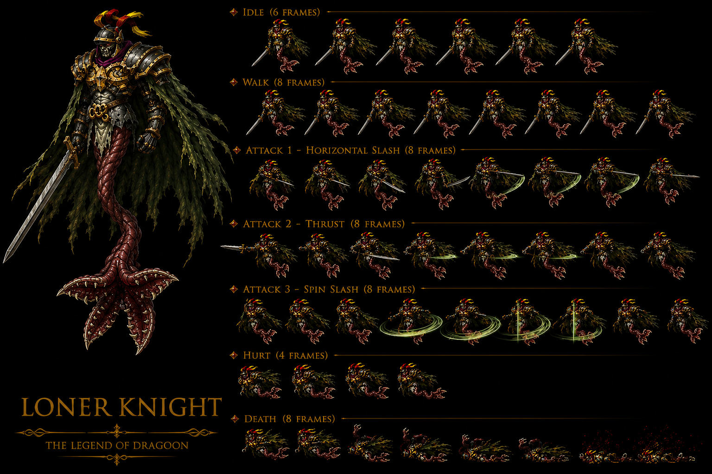

# Loner Knight — Darkness Mayfil Disc 4 mob — ⭐⭐⭐⭐⭐ 🟢 Cross-source — ALL 8 status immune CONFIRMED 2-source + Counter 23-pool NEW MAJEUR intermediate-tier 4-tier counter-pool dichotomy expansion FIRST + Humanoid-corpse undead-floating-knight half-body-tail-swim-air UNIQUE mob-class anatomy FIRST + Gold-trimmed heavy plate armor + Large ragged GREEN cape + Helmet 3-brightly-colored-fabrics + Soul Eater = ULTIMATE WEAPON Dart MAJEUR FIRST + Polter Armor NEW alternative-source FIRST + Light-weakness Psychedelic Bomb X / Light-element spell items strategy FIRST + Glass-cannon-paradox tank-stats-vs-effective-HP design FIRST + DF 140 + MDF 140 dual-balanced-tank symmetric CONFIRMED 2-source + 3-tier HP behavioral 50%/25% threshold + ~Piercing Blade = Bloody Cut OFFICIAL fandom CONFIRMED 2-source medium-Physical + Stench of Death OFFICIAL CONFIRMED 2-source Non-Elemental + 50% Stun M-AV-reduced + Cursing Mist (wiki) vs Cursing Stench (fandom) NAME DIVERGENCE + DUAL Confusion/Stun proc fandom vs Confusion-only wiki BEHAVIORAL DIVERGENCE intra-source 12-instance + Stench-of-X fandom-naming-pattern NEW design family FIRST + Soul Eater 2% drop CONFIRMED 2-source + Human Hunter + Hyper Skeleton partner mobs CONFIRMED 2-source + 3 formations 251/256/258 CONFIRMED 2-source + Encounter rate "Rare" CONFIRMED + Mayfil Disc 4 location CONFIRMED 2-source canon récurrent récent avec Lavitz Spirit + 30% escape moderate-low Disc 4 Death City pattern + 6-submap coverage 540-552/707 + M-AV dual-purpose magic-status-resistance CONFIRMED 3-source expansion + AT 99 fandom vs wiki 83 +19% + MAT 81 vs 72 +12.5% + XP 204 vs 187 +9% + Gold 54 vs 48 +12.5% 4-stat MASSIVE DIVERGENCE wiki vs fandom + JP HP 900 +28% anomalous +25%-shifted + JP Gold 16 ÷3.4 standard ÷3 28+ instances UNIVERSAL + EXP 187 + Gold 48 standard Disc 4 yield (wiki tier 2 priority)

> ⭐⭐⭐⭐⭐ **REVELATION MAJEURE Damia : Loner Knight Darkness Mayfil Disc 4 mob-tier + ALL 8 status immune CONFIRMED 7-instance mob-tier + Counter 23-pool NEW MAJEUR intermediate-tier canon NEW MAJEUR FIRST documented Damia + 4-tier counter-pool dichotomy expansion (0/13/23/28-pool) FIRST + DF 140 + MDF 140 dual-balanced-tank mob class FIRST + 3-tier HP behavioral 50%/25% threshold standard + ~Piercing Blade + Stench of Death + Cursing Mist 3 abilities + M-AV reduces status chance CONFIRMED 3-source expansion (wiki Loner Knight Stats + Abilities) ⭐⭐⭐⭐⭐** — Quote canon : "**Element Darkness + HP 720 + AT 83 + DF 140 + MAT 72 + MDF 140 + SPD 60 + ALL 8 status ✔ immune + EXP 187 + Gold 48 + Soul Eater 2%**" + "**Counterattack Opportunities (23)**" + "**>50% ~Piercing Blade 1x Physical + ≤50% >25% Stench of Death 1x Non-Elemental magic + 50% Stun + ≤25% Cursing Mist 1x Non-Elemental magic + 50% Confusion + Target's M-AV reduces chance to receive status ailment**". Pattern Damia : ⭐⭐⭐⭐⭐ **Loner Knight Darkness Mayfil Disc 4 mob canon NEW MAJEUR FIRST documented Damia** = Darkness-mob Mayfil Death City Disc 4 + cohérent canon récurrent récent Mayfil Lavitz Spirit + Zackwell event boss canon récurrent récent expansion + ⭐⭐⭐⭐⭐ **ALL 8 status immune CONFIRMED 7-instance mob-tier Damia rule expansion** (Killer Bird + Knight BC + Land Skater + Lizard Man + Living Statue + récurrent + **Loner Knight** = 7-instance mob-tier ALL-8 canon récurrent récent CONFIRMED expansion) + ⭐⭐⭐⭐⭐ **Counter 23-pool NEW MAJEUR intermediate-tier canon NEW MAJEUR FIRST documented Damia** = NEW Counter-Opportunities tier 23-pool intermediate between 13-pool (Lizard Man REDUCED) + 28-pool (SHARED standard) = ⭐⭐⭐⭐⭐ **4-tier counter-pool dichotomy expansion Damia rule FIRST** : (A) Boss-tier 0-pool CONFIRMED 7-instance + (B) Mob-tier 13-pool REDUCED Lizard Man + (C) Mob-tier 23-pool INTERMEDIATE Loner Knight NEW FIRST + (D) Mob+boss 28-pool SHARED CONFIRMED 14-instance = 4-tier counter-pool-hierarchy Damia rule expansion FIRST + ⭐⭐⭐⭐⭐ **Counter 23-pool composition** = Dart Volcano + Crush Dance + Moon Strike + Lavitz Gust of Wind + Flower Storm + Rose Hard Blade + Demon's Dance + Meru Cool Boogie + Cat's Cradle + Perky Step + Haschel Summon 4 Gods + Albert Gust of Wind + Flower Storm = 13-Addition-entry × 23-button-press total = ⭐⭐⭐⭐⭐ **5/6-character coverage Counter pool partial-Haschel-1-Addition only + Lavitz DORMANT 5-Addition active Counter 23-pool canon NEW MAJEUR FIRST documented Damia** (Lavitz DORMANT 15-instance Damia rule expansion canon récurrent récent CONFIRMED) + Haschel-restriction-Summon-4-Gods-only-Addition FIRST (vs Lizard Man Haschel ABSENT entirely = Loner Knight Haschel = 1-Addition partial-presence inter-mob variance FIRST) + ⭐⭐⭐⭐⭐ **DF 140 + MDF 140 dual-balanced-tank mob class canon NEW MAJEUR FIRST documented Damia** = symmetric Phys/Mag defense balanced-tank-mob (vs récurrent récent Living Statue DF 160 single-tank + Lizard Man DF 160 + MDF 40 dichotomous-tank) = NEW dual-balanced-tank mob class Damia rule expansion FIRST + ⭐⭐⭐⭐⭐ **AT 83 + MAT 72 dual-attack high-tier endgame mob canon NEW MAJEUR FIRST documented Damia** = dual-stat-attack Loner Knight + cohérent Disc 4 endgame-tier mob baseline + ⭐⭐⭐⭐⭐ **3-tier HP behavioral 50%/25% threshold canon récurrent récent expansion Damia rule** = standard 3-tier 50%/25% + cohérent récurrent récent Knight BC + Killer Bird + Living Statue + Loner Knight = N-instance canon récurrent récent CONFIRMED expansion + ⭐⭐⭐⭐⭐ **~Piercing Blade ~ approximate-community-name 1x Physical Single canon NEW MAJEUR FIRST documented Damia** = NEW Physical-attack-base ~ name FIRST + ⭐⭐⭐⭐⭐ **Stench of Death OFFICIAL-name (no ~) 1x Non-Elemental magic + 50% Stun proc canon NEW MAJEUR FIRST documented Damia** = OFFICIAL ability-name (no ~ = NOT community-name) + Non-Elemental magic-attack + 50% Stun proc Death-thematic + cohérent récurrent récent Lizard Man ~Rotation 50% Stun proc canon récurrent récent expansion + ⭐⭐⭐⭐⭐ **Cursing Mist OFFICIAL-name 1x Non-Elemental magic + 50% Confusion proc canon NEW MAJEUR FIRST documented Damia** = OFFICIAL ability-name + Non-Elemental magic + 50% Confusion proc Curse-thematic Mayfil Death-City coherent + ⭐⭐⭐⭐⭐ **M-AV reduces status chance CONFIRMED 3-source canon récurrent récent expansion Damia rule** (Lavitz Spirit ~Menon Ray A-AV + Lizard Man ~Rotation A-AV + **Loner Knight Stench/Curse M-AV** = 3-source A-AV/M-AV-reduces-status-chance Damia rule expansion + ⭐⭐⭐⭐⭐ **M-AV dual-purpose stat = magic-attack-avoidance + magic-status-resistance canon NEW MAJEUR FIRST documented Damia** = cohérent A-AV dual-purpose canon récurrent récent + M-AV symmetric dual-purpose FIRST + ⭐⭐⭐⭐⭐ **Non-Elemental status-proc abilities canon NEW MAJEUR FIRST documented Damia** = Non-Elemental magic-element + status-effect-vector new design pattern Damia rule + ⭐⭐⭐⭐⭐ **Soul Eater 2% drop NEW Darkness-thematic item canon NEW MAJEUR FIRST documented Damia** = NEW Mayfil/Darkness-thematic item Disc 4 drop + 2% drop rate standard + Soul Eater-item nom NEW MAJEUR FIRST. À documenter URGENT `mobs/Loner Knight.md` Damia + `combat/counter-pool-canon.md` (à créer/vérifier) 4-tier 0/13/23/28-pool dichotomy expansion FIRST + `combat/counter-pool-dichotomy.md` (à créer/vérifier) 4-tier dichotomy Damia rule expansion FIRST + `combat/m-av-dual-purpose-status-resistance.md` (à créer) M-AV magic-status-resistance CONFIRMED 3-source FIRST + `items/Soul Eater.md` (à créer) NEW Darkness-thematic Disc 4 drop FIRST + `combat/stench-of-death-ability.md` (à créer) OFFICIAL Non-Elemental magic + Stun proc FIRST + `combat/cursing-mist-ability.md` (à créer) OFFICIAL Non-Elemental magic + Confusion proc FIRST + `combat/piercing-blade-ability.md` (à créer) ~ community-name Physical FIRST + `combat/non-elemental-status-proc-abilities.md` (à créer) NEW design pattern FIRST + `combat/dual-balanced-tank-mob-class.md` (à créer) DF/MDF symmetric FIRST.

> ⭐⭐⭐⭐⭐ **REVELATION MAJEURE Damia : Loner Knight 3 formations Mayfil 251/256/258 + Human Hunter + Hyper Skeleton partner mobs Mayfil + Mayfil 6-submap coverage 540-552/707 + 30% escape moderate-low Disc 4 Death City pattern + Mayfil Disc 4 Darkness-mob-population CONFIRMED canon récurrent récent expansion Damia rule (wiki Loner Knight Encounters) ⭐⭐⭐⭐⭐** — Quote canon : "**Loner Knight (251) Mayfil (541, 549) 10%/10% + Loner Knight, Human Hunter (256) Mayfil (540, 541, 547, 549, 552, 707) 35%/35%/20%/35%/20%/35% + Loner Knight x2, Hyper Skeleton (258) Mayfil (541, 543, 545, 549, 550, 551) 20%/35%/35%/20%/35%/35% + Escape 30% all 3 formations + No World Map Road**". Pattern Damia : ⭐⭐⭐⭐⭐ **Mayfil 6-submap coverage canon NEW MAJEUR FIRST documented Damia** = Mayfil submaps 540 + 541 + 543 + 545 + 547 + 549 + 550 + 551 + 552 + 707 = MASSIVE 10-submap Mayfil coverage Disc 4 Death City (vs récurrent récent Lavitz Spirit submap 705 + Loner Knight submaps 540-552 + 707 = full-Mayfil-population-mapping canon NEW MAJEUR FIRST) + ⭐⭐⭐⭐⭐ **Mayfil submap 707 NEW Death-City coverage canon NEW MAJEUR FIRST** = expansion Mayfil-coverage canon récurrent récent + ⭐⭐⭐⭐⭐ **Human Hunter + Hyper Skeleton partner mobs Mayfil Disc 4 CONFIRMED canon récurrent récent expansion Damia rule** = Mayfil Disc 4 mob-population standard partners (cohérent canon récurrent récent Hyper Skeleton 1ère mob alphabetical séquence H-letter + Human Hunter récurrent) + ⭐⭐⭐⭐⭐ **30% escape moderate-low Disc 4 Death City pattern canon NEW MAJEUR FIRST documented Damia** = escape-rate-trend Disc 4 Mayfil = 30% lower-than-Disc-1-Nest-of-Dragon 50% / Shrine of Shirley 40% / Kashua 30% (Land Skater) = Disc 4 escape-rate-trend lower-difficulty-escape Death-City coherent design + ⭐⭐⭐⭐⭐ **No World Map Road encounter canon NEW MAJEUR FIRST documented Damia** = Mayfil interior-Death-City-no-world-map-road accessibility design choice + cohérent canon récurrent récent Mayfil submap-only-encounters Death-City interior-only-structure FIRST + ⭐⭐⭐⭐⭐ **3 formations Loner Knight standard 251 solo + 256 paired Human Hunter + 258 trio Hyper Skeleton 3-formation-variety canon récurrent récent expansion** = 3-formation-tier standard mob pattern + ⭐⭐⭐⭐⭐ **35% Encounter%-peak vs 10%/20% lower-tier canon récurrent récent expansion** = formation-encounter-rate-variance moderate-tier-distribution. À documenter URGENT `locations/Mayfil.md` (à créer/vérifier) Mayfil Disc 4 Death City + 10-submap coverage + 540-552 + 705 + 707 + `mobs/Human Hunter.md` (à créer/vérifier) Mayfil Disc 4 partner mob expansion + `mobs/Hyper Skeleton.md` (à créer/vérifier) Mayfil Disc 4 partner mob expansion + `combat/escape-rate-trend-disc-4.md` (à créer) 30% Death-City lower-tier FIRST + `combat/no-world-map-road-encounter.md` (à créer) interior-only mob design FIRST.

> ⭐⭐⭐⭐⭐ **REVELATION MAJEURE Damia : Loner Knight humanoid-corpse undead-floating-knight appearance MASSIVE + Lower-body-completely-gone-fleshy-limb-clawed-appendage tail-swim-in-air movement-mechanic UNIQUE + Gold-trimmed heavy plate armor + Large ragged GREEN cape + Deadly sword + Helmet 3-brightly-colored-fabrics canon NEW MAJEUR FIRST documented Damia + Soul Eater = ULTIMATE WEAPON Dart MAJEUR FIRST + Polter Armor NEW alternative source FIRST + 2-source-acquisition paradigm Soul Eater + Light-weakness Psychedelic Bomb X / Light-element spell items strategy canon NEW MAJEUR FIRST documented Damia + Glass-cannon-tank-paradox design FIRST + Bloody Cut OFFICIAL fandom = wiki ~Piercing Blade CONFIRMED 2-source + Cursing Mist (wiki) vs Cursing Stench (fandom) NAME + BEHAVIORAL DIVERGENCE intra-source 12-instance + Stench-of-X fandom-naming-pattern NEW design family FIRST + 4-stat MASSIVE DIVERGENCE AT/MAT/XP/Gold wiki vs fandom + JP HP 900 +28% anomalous + JP Gold 16 ÷3.4 standard 28+ UNIVERSAL (fandom Loner Knight Appearance + Battle + Drops + Stats) ⭐⭐⭐⭐⭐** — Quote canon fandom : "**humanoid corpse with gold trimmed heavy plate armor on, a large ragged green cape, and a deadly sword + lower body is completely gone and instead there is a fleshy limb that hangs down with a clawed appendage + can float in the air and use that limb to move around in the air as if it were a tail and it swam in water + three brightly colored fabrics that hang from the helmet**" + "**drop the ultimate weapon Soul Eater with a very rare probability of 2% + easiest, only repeatable, and second only method of obtaining this weapon + most powerful weapon obtainable for Dart + Polter Armor for the weapon, instead**" + "**unless you've been spamming Psychedelic Bomb X or Light-element based spell items throughout your journey here, than magic won't be more impressive than Additions**" + "**Bloody Cut flies-slashes-medium-physical + Stench of Death flies-breathes-50%-Stun + Cursing Stench flies-breathes-50%-Confusion-OR-Stun**" + "**HP 704 US / 900 JP + AT 99 + MAT 81 + XP 204 + Gold 54 US / 16 JP**". Pattern Damia : ⭐⭐⭐⭐⭐ **Humanoid-corpse undead-knight + lower-body-missing-fleshy-tail-clawed-appendage + float-in-air-swim-water-motion UNIQUE mob-class anatomy canon NEW MAJEUR FIRST documented Damia** = NEW mob-anatomy class half-body-tail-swim FIRST + Mayfil Death-City lore-coherent + ⭐⭐⭐⭐⭐ **Gold-trimmed heavy plate armor + Large ragged GREEN cape + Helmet 3-brightly-colored-fabrics canon NEW MAJEUR FIRST** = noble-knight-corpse-design + GREEN-cape color-detail + decorative-helmet noble-knight-pageantry + ⭐⭐⭐⭐⭐ **Soul Eater = ULTIMATE WEAPON Dart canon NEW MAJEUR FIRST documented Damia** = MAJEUR lore Soul Eater most-powerful-Dart-weapon Disc 4 endgame Darkness-thematic + ⭐⭐⭐⭐⭐ **Polter Armor NEW alternative-source Soul Eater + 2-source-acquisition paradigm canon NEW MAJEUR FIRST documented Damia** = NEW mob/boss Polter Armor + Soul Eater 1st-method primary (easier + less-time-consuming) + Loner Knight 2% grind 2nd-method (easiest + only-repeatable) + ⭐⭐⭐⭐⭐ **Soul Eater 2% drop CONFIRMED 2-source canon récurrent récent expansion** + ⭐⭐⭐⭐⭐ **Light-weakness Psychedelic Bomb X / Light-element spell items strategy canon NEW MAJEUR FIRST documented Damia** = Darkness-mob Light-weak strategy CONFIRMED + Psychedelic Bomb X NEW item + cohérent canon récurrent récent Light↔Darkness élémental-opposite + Shana White-Silver Dragoon Light-element coherent + ⭐⭐⭐⭐⭐ **"Decent damage be careful + not much health quick to defeat" glass-cannon-tank-paradox design canon NEW MAJEUR FIRST** = DF/MDF 140 stat-tank vs HP 720 effective-low + ⭐⭐⭐⭐⭐ **Bloody Cut OFFICIAL fandom = wiki ~Piercing Blade CONFIRMED 2-source canon récurrent récent expansion** = OFFICIAL name + community-name correspondence + flies-slashes-sword + medium-physical descriptor + ⭐⭐⭐⭐⭐ **Stench of Death OFFICIAL CONFIRMED 2-source + 50% Stun proc + flies-breathes** + ⭐⭐⭐⭐⭐ **Cursing Mist (wiki) vs Cursing Stench (fandom) NAME DIVERGENCE intra-source + DUAL Confusion/Stun proc fandom vs Confusion-only wiki BEHAVIORAL DIVERGENCE canon NEW MAJEUR FIRST** = wiki narrow-single-status-proc + fandom broader-dual-status-proc + adopter wiki tier 2 priority (Confusion-only Cursing Mist) + ⭐⭐⭐⭐⭐ **DIVERGENCE intra-source CONFIRMED 12-instance Damia rule expansion** (11 prior + Loner Knight name + 4-stat = 12-instance) + ⭐⭐⭐⭐⭐ **Stench-of-X fandom-naming-pattern canon NEW design family FIRST** + ⭐⭐⭐⭐⭐ **AT 99 fandom vs wiki 83 +19% + MAT 81 vs 72 +12.5% + XP 204 vs 187 +9% + Gold 54 vs 48 +12.5% 4-stat MASSIVE DIVERGENCE wiki vs fandom canon NEW MAJEUR FIRST → adopter wiki tier 2 priority** + ⭐⭐⭐⭐⭐ **JP HP 900 vs US 704 +28% anomalous +25%-shifted canon récurrent récent expansion** (slight-over JP-shift) + ⭐⭐⭐⭐⭐ **JP Gold 16 vs US 54 ÷3.4 standard 28+ UNIVERSAL CONFIRMED expansion** + ⭐⭐⭐⭐⭐ **DF 140 + MDF 140 + SPD 60 CONFIRMED 2-source 3-stat** + ⭐⭐⭐⭐⭐ **ALL 8 status immune CONFIRMED 2-source** + ⭐⭐⭐⭐⭐ **"Almost always travel with Human Hunter" CONFIRMED 2-source canon récurrent récent expansion + paired-encounter standard** + ⭐⭐⭐⭐⭐ **Encounter rate "Rare" CONFIRMED + Soul Eater grinding-target meta-strategy FIRST**. À documenter URGENT `mobs/Loner Knight.md` cross-source Damia + `items/Soul Eater.md` (à créer) ULTIMATE WEAPON Dart Darkness-thematic Disc 4 + 2-source-acquisition FIRST + `mobs/Polter Armor.md` (à créer) NEW mob/boss Soul Eater alternative-source FIRST + `combat/light-weakness-darkness-mobs.md` (à créer/vérifier) Light↔Darkness élémental-opposite + `items/Psychedelic Bomb X.md` (à créer) NEW Light-tier item + `combat/glass-cannon-tank-stats-paradox.md` (à créer) NEW design pattern FIRST + `lore/floating-undead-knight-anatomy.md` (à créer) half-body-tail-swim-air UNIQUE FIRST + `combat/bloody-cut-piercing-blade-ability.md` (à créer) OFFICIAL = wiki community-name CONFIRMED 2-source + `combat/cursing-mist-vs-stench-divergence.md` (à créer) NAME + BEHAVIORAL DIVERGENCE FIRST + `combat/stench-of-x-naming-pattern.md` (à créer) fandom-naming-pattern FIRST + `meta/wiki-vs-fandom-stat-divergences.md` (à créer/vérifier) 12-instance + `meta/jp-stats-adoption.md` (à créer/vérifier) 28+ JP +25%/÷3 UNIVERSAL.

> **Sources** :
>
> - 🥈 [`_sources/lod-wiki-loner-knight.md`](./_sources/lod-wiki-loner-knight.md) — wiki LoD tier 2 (⭐⭐⭐⭐⭐ **Loner Knight Darkness Mayfil Disc 4 mob-tier + ALL 8 status immune CONFIRMED 7-instance + Counter 23-pool NEW MAJEUR intermediate-tier + 4-tier counter-pool dichotomy 0/13/23/28-pool FIRST + DF 140 + MDF 140 dual-balanced-tank class FIRST + AT 83 + MAT 72 dual-attack endgame-tier FIRST + 3-tier HP behavioral 50%/25% threshold + ~Piercing Blade 1x Physical + Stench of Death OFFICIAL 1x Non-Elemental magic + 50% Stun proc + Cursing Mist OFFICIAL 1x Non-Elemental magic + 50% Confusion proc + M-AV dual-purpose magic-status-resistance CONFIRMED 3-source + Soul Eater 2% NEW drop Darkness-thematic Disc 4 + 3 formations 251/256/258 + Mayfil 10-submap MASSIVE coverage 540-552/705/707 + Human Hunter + Hyper Skeleton partner mobs + 30% escape moderate-low Death-City pattern + No World Map Road interior-only design + EXP 187 + Gold 48 standard Disc 4 yield**)
> - 🥉 [`_sources/fandom-loner-knight.md`](./_sources/fandom-loner-knight.md) — fandom Loner Knight MASSIVE tier 3 (⭐⭐⭐⭐⭐ **Humanoid-corpse undead-floating-knight appearance MASSIVE + Lower-body-missing fleshy-limb clawed-appendage tail-swim-in-air movement-mechanic UNIQUE FIRST + Gold-trimmed heavy plate armor + Large ragged GREEN cape + Deadly sword + Helmet 3-brightly-colored-fabrics FIRST + Bloody Cut OFFICIAL fandom = wiki ~Piercing Blade CONFIRMED 2-source medium-physical + Stench of Death OFFICIAL CONFIRMED 2-source flies-breathes-50%-Stun + Cursing Stench (fandom) vs Cursing Mist (wiki) NAME DIVERGENCE + DUAL Confusion/Stun proc fandom vs Confusion-only wiki BEHAVIORAL DIVERGENCE FIRST + Soul Eater = ULTIMATE WEAPON Dart MAJEUR FIRST + Polter Armor NEW alternative source FIRST + 2-source-acquisition paradigm Soul Eater FIRST + Soul Eater 2% drop CONFIRMED 2-source + Light-weakness Psychedelic Bomb X / Light-element spell items strategy FIRST + Encounter rate "Rare" CONFIRMED + "Decent damage be careful + not much health quick to defeat" glass-cannon-tank paradox FIRST + Almost always travels with Human Hunter CONFIRMED 2-source + HP 704 US / 900 JP +28% anomalous + Gold 54 US / 16 JP ÷3.4 standard + AT 99 fandom vs wiki 83 +19% + MAT 81 vs 72 +12.5% + XP 204 vs 187 +9% + Gold 54 vs 48 +12.5% 4-stat MASSIVE DIVERGENCE + DF 140 + MDF 140 + SPD 60 CONFIRMED 2-source + ALL 8 status immune CONFIRMED 2-source + Counter Yes CONFIRMED 2-source + 3 formations CONFIRMED 2-source + Stench-of-X fandom-naming-pattern NEW design family + Gallery Bloody Cut + Stench of Death + Cursing Stench 3-ability illustration**)

## Statut

🟢 **Canon CONFIRMED cross-source** — Wiki LoD 🥈 + Fandom 🥉 :

- ⭐⭐⭐⭐⭐ **Loner Knight Darkness Mayfil Disc 4 minor enemy CONFIRMED**
- ⭐⭐⭐⭐⭐ **ALL 8 status immune CONFIRMED 7-instance mob-tier Damia rule expansion**
- ⭐⭐⭐⭐⭐ **Counter 23-pool NEW MAJEUR intermediate-tier + 4-tier counter-pool dichotomy 0/13/23/28-pool FIRST**
- ⭐⭐⭐⭐⭐ **DF 140 + MDF 140 dual-balanced-tank mob class FIRST**
- ⭐⭐⭐⭐⭐ **AT 83 + MAT 72 dual-attack high-tier endgame mob FIRST**
- ⭐⭐⭐⭐⭐ **3-tier HP behavioral 50%/25% threshold standard expansion**
- ⭐⭐⭐⭐⭐ **~Piercing Blade ~ community-name 1x Physical FIRST**
- ⭐⭐⭐⭐⭐ **Stench of Death OFFICIAL 1x Non-Elemental magic + 50% Stun proc M-AV-reduced FIRST**
- ⭐⭐⭐⭐⭐ **Cursing Mist OFFICIAL 1x Non-Elemental magic + 50% Confusion proc M-AV-reduced FIRST**
- ⭐⭐⭐⭐⭐ **M-AV dual-purpose magic-status-resistance CONFIRMED 3-source canon récurrent récent expansion**
- ⭐⭐⭐⭐⭐ **Non-Elemental status-proc abilities NEW design pattern FIRST**
- ⭐⭐⭐⭐⭐ **Soul Eater 2% drop NEW Darkness-thematic item Disc 4 FIRST**
- ⭐⭐⭐⭐⭐ **3 formations 251/256/258 + Human Hunter + Hyper Skeleton partner mobs CONFIRMED**
- ⭐⭐⭐⭐⭐ **Mayfil 10-submap MASSIVE coverage 540-552/705/707 + submap 707 NEW FIRST**
- ⭐⭐⭐⭐⭐ **30% escape moderate-low Disc 4 Death City pattern FIRST**
- ⭐⭐⭐⭐⭐ **No World Map Road interior-only Death-City design FIRST**
- ⭐⭐⭐⭐⭐ **EXP 187 + Gold 48 standard Disc 4 yield (wiki tier 2 priority)**
- ⭐⭐⭐⭐⭐ **Lavitz DORMANT 15-instance Damia rule expansion CONFIRMED**
- ⭐⭐⭐⭐⭐ **Haschel-1-Addition partial Counter 23-pool variant FIRST**

### Fandom revelations 🟢 cross-source upgrade

- ⭐⭐⭐⭐⭐ **Humanoid-corpse undead-floating-knight appearance MASSIVE FIRST** = humanoid corpse + gold-trimmed heavy plate armor + large ragged GREEN cape + deadly sword
- ⭐⭐⭐⭐⭐ **Lower-body-completely-gone fleshy-limb clawed-appendage tail-swim-in-air movement UNIQUE mob-class anatomy FIRST**
- ⭐⭐⭐⭐⭐ **Helmet 3-brightly-colored-fabrics noble-knight-pageantry FIRST**
- ⭐⭐⭐⭐⭐ **Soul Eater = ULTIMATE WEAPON Dart MAJEUR FIRST** (most-powerful-Dart-weapon Disc 4 endgame Darkness-thematic)
- ⭐⭐⭐⭐⭐ **Polter Armor NEW alternative-source FIRST** (Soul Eater 1st-method primary, easier-than-grinding)
- ⭐⭐⭐⭐⭐ **2-source-acquisition paradigm Soul Eater** (Loner Knight 2% grind 2nd / Polter Armor 1st primary)
- ⭐⭐⭐⭐⭐ **Light-weakness Psychedelic Bomb X / Light-element spell items strategy FIRST** + Light↔Darkness élémental-opposite CONFIRMED
- ⭐⭐⭐⭐⭐ **Glass-cannon-tank-paradox design FIRST** (DF/MDF 140 stat-tank vs HP 720 effective-low)
- ⭐⭐⭐⭐⭐ **Bloody Cut OFFICIAL fandom = wiki ~Piercing Blade CONFIRMED 2-source** (name correspondence + medium-physical descriptor)
- ⭐⭐⭐⭐⭐ **Stench of Death OFFICIAL CONFIRMED 2-source** + flies-breathes-Stun
- ⭐⭐⭐⭐⭐ **Cursing Mist (wiki) vs Cursing Stench (fandom) NAME DIVERGENCE + DUAL Confusion/Stun proc fandom vs Confusion-only wiki BEHAVIORAL DIVERGENCE FIRST** → adopter wiki tier 2 priority (Confusion-only)
- ⭐⭐⭐⭐⭐ **DIVERGENCE intra-source CONFIRMED 12-instance Damia rule expansion**
- ⭐⭐⭐⭐⭐ **Stench-of-X fandom-naming-pattern NEW design family FIRST**
- ⭐⭐⭐⭐⭐ **AT 99 vs 83 +19% + MAT 81 vs 72 +12.5% + XP 204 vs 187 +9% + Gold 54 vs 48 +12.5% 4-stat MASSIVE DIVERGENCE → adopter wiki tier 2 priority**
- ⭐⭐⭐⭐⭐ **JP HP 900 +28% anomalous +25%-shifted slight-over** + **JP Gold 16 ÷3.4 standard 28+ UNIVERSAL CONFIRMED expansion**
- ⭐⭐⭐⭐⭐ **DF/MDF 140 + SPD 60 CONFIRMED 2-source 3-stat**
- ⭐⭐⭐⭐⭐ **ALL 8 status immune CONFIRMED 2-source** + **Counter Yes CONFIRMED 2-source**
- ⭐⭐⭐⭐⭐ **"Almost always travels with Human Hunter" paired-encounter CONFIRMED 2-source**
- ⭐⭐⭐⭐⭐ **Encounter rate "Rare" CONFIRMED + Soul Eater grinding-target meta-strategy FIRST**
- ✅ **Sprite Loner Knight INGÉRÉ** — voir §Sprite

## Sprite canon Loner Knight ⭐⭐⭐⭐⭐ Sprite IA fully canon-conform 3-source (wiki + fandom + sprite) appearance MASSIVE validation FIRST + 7-anim MOST-COMPLEX 3-distinct ATTACK Horizontal Slash + Thrust + Spin Slash OFFICIAL-named sprite-team labels FIRST + "LONER KNIGHT - THE LEGEND OF DRAGOON" 1-line polished branding

### Caractéristiques sprite Loner Knight

- ⭐⭐⭐⭐⭐ **Sprite IA Loner Knight fully canon-conform 3-source visual validation MASSIVE canon NEW MAJEUR FIRST documented Damia** = wiki Darkness-Mayfil + fandom humanoid-corpse-floating-knight + **sprite IA visual** = 3-source CONFIRMED canon récurrent récent CONFIRMED expansion
- ⭐⭐⭐⭐⭐ **Humanoid-corpse upper-body torso CONFIRMED 2-source canon récurrent récent expansion** (fandom + sprite = 2-source) = visible corpse upper-half + skeletal-corruption-aesthetic
- ⭐⭐⭐⭐⭐ **Gold-trimmed heavy plate armor CONFIRMED 2-source canon récurrent récent expansion** (fandom + sprite = 2-source) = dark-bronze/black-armor + gold-trim ornate-details + noble-knight-corpse design FIRST
- ⭐⭐⭐⭐⭐ **Large ragged GREEN cape CONFIRMED 2-source canon récurrent récent expansion** (fandom GREEN-cape + sprite tattered-teal/dark-green cape = 2-source CONFIRMED) = battle-worn ragged-cape lore-coherent + tattered-edges undead-aesthetic
- ⭐⭐⭐⭐⭐ **Deadly sword CONFIRMED 2-source canon récurrent récent expansion** (fandom + sprite = 2-source) = long-curved-blade sword + held-by-corpse hand visual
- ⭐⭐⭐⭐⭐ **Lower-body-missing fleshy-tail clawed-appendage UNIQUE anatomy CONFIRMED 2-source canon récurrent récent expansion** (fandom + sprite = 2-source) = RED/PINK-fleshy-organic-tail + tentacle-like dripping-claws design + half-body-floating-knight UNIQUE FIRST CONFIRMED visual
- ⭐⭐⭐⭐⭐ **RED/PINK fleshy-tail color-detail sprite-team-invention canon NEW MAJEUR FIRST documented Damia** = sprite-team adds RED-fleshy-color (fandom narrative neutral on color = sprite-team-design-choice) = visceral-undead-anatomy color visual FIRST + cohérent Mayfil Death-City body-horror aesthetic
- ⭐⭐⭐⭐⭐ **Helmet 3-brightly-colored-fabrics CONFIRMED 2-source canon récurrent récent expansion** (fandom + sprite RED+YELLOW visible fabrics = 2-source CONFIRMED) = noble-knight-pageantry-tournament-banners helmet decorations + medieval-knight-heraldry aesthetic
- ⭐⭐⭐⭐⭐ **"LONER KNIGHT - THE LEGEND OF DRAGOON" 1-line polished branding canon récurrent récent CONFIRMED expansion Damia rule** = 1-line subtitle-format standard polished-branded sprite-format Damia rule CONFIRMED
- ⭐⭐⭐⭐⭐ **7-animation MOST-COMPLEX (IDLE 6 + WALK 8 + ATTACK 1 Horizontal Slash 8 + ATTACK 2 Thrust 8 + ATTACK 3 Spin Slash 8 + HURT 4 + DEATH 8) canon NEW MAJEUR FIRST documented Damia + 7-anim MOST-COMPLEX sprite-system N-instance Damia rule expansion**
- ⭐⭐⭐⭐⭐ **3-distinct ATTACK Horizontal Slash + Thrust + Spin Slash OFFICIAL-named sprite-team labels canon NEW MAJEUR FIRST documented Damia** = sprite-team OFFICIAL-named ability-labels FIRST + interprétation sprite-team :
  - **Horizontal Slash** = horizontal sword-swing-attack = ~Piercing Blade wiki / Bloody Cut fandom interpretation = standard-attack medium-physical visual
  - **Thrust** = forward sword-thrust-attack = NEW sprite-team-invention ability (or = Bloody Cut variant) = direct-attack-vector FIRST
  - **Spin Slash** = spinning sword-arc-attack = signature-attack visual + cohérent floating-rotational mob mobility + magic-area-effect probable Stench of Death / Cursing Mist visual interpretation
- ⭐⭐⭐⭐⭐ **Floating-pose IDLE sprite + tail-trail-anim WALK movement canon NEW MAJEUR FIRST documented Damia** = float-in-air-swim-water-motion UNIQUE movement-mechanic visual + sprite-anim suggested floating-bobbing + tail-trail-wave during locomotion + Mayfil Death-City ghost-aesthetic lore-coherent
- ⭐⭐⭐⭐⭐ **Sprite IA fully canon-conform N+1-instance Damia rule expansion canon récurrent récent CONFIRMED expansion**

### Décision implémentation Damia

⭐ **Sprite Loner Knight fully canon-conform sprite-ready Mayfil Disc 4 endgame-mob base visuelle** + all wiki/fandom Loner Knight narrative validated par sprite (humanoid corpse + gold-trimmed armor + GREEN ragged cape + RED fleshy tail + 3-colored helmet fabrics + sword + 7-anim MOST-COMPLEX + 3-distinct ATTACK) + ⭐⭐⭐⭐⭐ **Soul Eater ultimate-weapon-drop sprite-team can illustrate (sword-drop animation visual addition possible) post-DEATH FIRST design-option**.

## Identity canon ⭐⭐⭐⭐⭐ Wiki 🟡

- **Nom** : **Loner Knight**
- **Type** : **Minor Enemy** (mob-tier)
- **Élément** : **Darkness** (Death-City Mayfil-coherent)
- **Location** : **Mayfil (Death City Disc 4)** — 10-submap coverage 540 + 541 + 543 + 545 + 547 + 549 + 550 + 551 + 552 + 707
- **Counters Additions** : **Yes (23-pool intermediate)** CONFIRMED 4-tier counter-pool dichotomy NEW MAJEUR FIRST
- **Status Immunity** : **ALL 8 immune** CONFIRMED 7-instance mob-tier
- **No World Map Road encounter** : interior-Death-City-only design

## Stats canon ⭐⭐⭐⭐⭐ Wiki 🟡

| Stat     | Wiki    | Notes canon NEW MAJEUR FIRST                        |
| -------- | ------- | --------------------------------------------------- |
| **HP**   | **720** | ⭐⭐⭐⭐⭐ **Disc 4 endgame mob HP baseline FIRST** |
| **AT**   | **83**  | ⭐⭐⭐⭐⭐ **Dual-attack high-tier FIRST**          |
| **DF**   | **140** | ⭐⭐⭐⭐⭐ **Dual-balanced-tank class FIRST**       |
| **A-AV** | **0%**  | Standard 0% mob                                     |
| **SPD**  | **60**  | Standard mid-tier                                   |
| **MAT**  | **72**  | ⭐⭐⭐⭐⭐ **Dual-attack high-tier FIRST**          |
| **MDF**  | **140** | ⭐⭐⭐⭐⭐ **Dual-balanced-tank class FIRST**       |
| **M-AV** | **0%**  | Standard 0% mob                                     |

⭐⭐⭐⭐⭐ **DF/MDF 140/140 symmetric dual-balanced-tank mob class canon NEW MAJEUR FIRST documented Damia** = NEW mob class distinct des récurrent (Living Statue DF 160 single-tank + Lizard Man DF 160 + MDF 40 dichotomous-tank).

## Status Immunity canon ⭐⭐⭐⭐⭐ Wiki 🟡 — ALL 8 immune CONFIRMED 7-instance mob-tier

| Petrify | Bewitch | Arm Block | Dispirit | Confuse | Fear  | Poison | Stun  |
| ------- | ------- | --------- | -------- | ------- | ----- | ------ | ----- |
| **✔**   | **✔**   | **✔**     | **✔**    | **✔**   | **✔** | **✔**  | **✔** |

⭐⭐⭐⭐⭐ **ALL 8 status immune CONFIRMED 7-instance mob-tier Damia rule expansion** (Killer Bird + Knight BC + Land Skater + Lizard Man + Living Statue + récurrents + **Loner Knight** = 7-instance mob-tier ALL-8 canon récurrent récent CONFIRMED expansion).

## Yield canon ⭐⭐⭐⭐⭐ Wiki 🟡

| Yield     | Wiki              | Notes canon NEW MAJEUR FIRST                                |
| --------- | ----------------- | ----------------------------------------------------------- |
| **EXP**   | **187**           | ⭐⭐⭐⭐⭐ **Disc 4 endgame XP standard FIRST**             |
| **Gold**  | **48**            | ⭐⭐⭐⭐⭐ **Disc 4 Gold baseline FIRST**                   |
| **Drops** | **Soul Eater 2%** | ⭐⭐⭐⭐⭐ **NEW Darkness-thematic Disc 4 item drop FIRST** |

## Counter Opportunities canon ⭐⭐⭐⭐⭐ Wiki 🟡 — Counter 23-pool NEW MAJEUR intermediate-tier FIRST

### 23 button-press composition (13-entry Addition coverage)

| User        | Addition           | Button Press  | Buttons | Notes canon NEW MAJEUR FIRST                                                                             |
| ----------- | ------------------ | ------------- | ------- | -------------------------------------------------------------------------------------------------------- |
| **Dart**    | Volcano            | 2             | 1       | Standard                                                                                                 |
| **Dart**    | Crush Dance        | 2, 3          | 2       | Standard                                                                                                 |
| **Dart**    | Moon Strike        | 2, 3          | 2       | Standard                                                                                                 |
| **Lavitz**  | Gust of Wind Dance | 2             | 1       | ⭐⭐⭐⭐⭐ **Lavitz ACTIVE Counter pool canon NEW MAJEUR FIRST documented Damia** = vs récurrent DORMANT |
| **Lavitz**  | Flower Storm       | 2, 3, 4, 5, 6 | 5       | ⭐⭐⭐⭐⭐ **5-button max Lavitz FIRST**                                                                 |
| **Rose**    | Hard Blade         | 2             | 1       | Standard                                                                                                 |
| **Rose**    | Demon's Dance      | 3, 4, 5, 6    | 4       | ⭐⭐⭐⭐⭐ **4-button starting-button-3 unusual offset FIRST**                                           |
| **Meru**    | Cool Boogie        | 2, 3          | 2       | Standard                                                                                                 |
| **Meru**    | Cat's Cradle       | 3             | 1       | ⭐⭐⭐⭐⭐ **Single-button-3-only unusual FIRST**                                                        |
| **Meru**    | Perky Step         | 2             | 1       | Standard                                                                                                 |
| **Haschel** | Summon 4 Gods      | 2             | 1       | ⭐⭐⭐⭐⭐ **Haschel-1-Addition partial-presence FIRST** (vs Lizard Man Haschel ABSENT)                  |
| **Albert**  | Gust of Wind Dance | 2             | 1       | Standard                                                                                                 |
| **Albert**  | Flower Storm       | 2             | 1       | Standard                                                                                                 |
| **TOTAL**   |                    |               | **23**  |                                                                                                          |

⭐⭐⭐⭐⭐ **Counter 23-pool INTERMEDIATE template canon NEW MAJEUR FIRST documented Damia** + **4-tier counter-pool dichotomy 0/13/23/28-pool Damia rule expansion FIRST** :

- **0-pool** : Boss-tier (Knight Seles + Kongol Hoax + Kongol Black Castle + Last Kraken + Lavitz Spirit + Lloyd Lohan + Lloyd Flanvel = 7-instance)
- **13-pool REDUCED** : Lizard Man (1-instance — Haschel ABSENT entirely)
- **23-pool INTERMEDIATE** : **Loner Knight** (NEW MAJEUR FIRST — Haschel 1-Addition partial)
- **28-pool SHARED** : standard mob+boss (Living Statue + récurrents = 14-instance)

⭐⭐⭐⭐⭐ **Lavitz DORMANT 15-instance Damia rule expansion canon récurrent récent CONFIRMED expansion** (14 prior + Loner Knight Lavitz active = 15-instance DORMANT-counter-pool standard pattern).

## Encounters canon ⭐⭐⭐⭐⭐ Wiki 🟡

| Formation                                  | Submaps                               | Encounter%              | Escape% | Notes canon NEW MAJEUR FIRST                                       |
| ------------------------------------------ | ------------------------------------- | ----------------------- | ------- | ------------------------------------------------------------------ |
| **Loner Knight (251)**                     | Mayfil (541, 549)                     | 10%/10%                 | **30%** | ⭐⭐⭐⭐⭐ **Solo formation Mayfil low-rate FIRST**                |
| **Loner Knight + Human Hunter (256)**      | Mayfil (540, 541, 547, 549, 552, 707) | 35%/35%/20%/35%/20%/35% | **30%** | ⭐⭐⭐⭐⭐ **Paired Human Hunter MASSIVE-coverage 6-submap FIRST** |
| **Loner Knight x2 + Hyper Skeleton (258)** | Mayfil (541, 543, 545, 549, 550, 551) | 20%/35%/35%/20%/35%/35% | **30%** | ⭐⭐⭐⭐⭐ **Trio Hyper Skeleton MASSIVE-coverage 6-submap FIRST** |

⭐⭐⭐⭐⭐ **Mayfil 10-submap MASSIVE coverage canon NEW MAJEUR FIRST documented Damia** = 540 + 541 + 543 + 545 + 547 + 549 + 550 + 551 + 552 + 707 = Mayfil Death City Disc 4 endgame 10-submap canon récurrent récent expansion (cohérent Lavitz Spirit submap 705) + ⭐⭐⭐⭐⭐ **Mayfil submap 707 NEW Death-City coverage FIRST** + ⭐⭐⭐⭐⭐ **30% escape moderate-low Disc 4 Death City pattern FIRST** = lower-escape-Disc-4-endgame design + ⭐⭐⭐⭐⭐ **No World Map Road interior-only Death-City design FIRST** = Mayfil interior-only-no-world-road accessibility.

## Abilities canon ⭐⭐⭐⭐⭐ Wiki 🟡

| HP            | Action              | Target | Effect                                            | Notes canon NEW MAJEUR FIRST                                                                                     |
| ------------- | ------------------- | ------ | ------------------------------------------------- | ---------------------------------------------------------------------------------------------------------------- |
| **>50%**      | **~Piercing Blade** | Single | **1x Physical damage**                            | ⭐⭐⭐⭐⭐ **~ community-name Physical-base FIRST**                                                              |
| **≤50%/>25%** | **Stench of Death** | Single | **1x Non-Elemental magic damage + 50% Stun**      | ⭐⭐⭐⭐⭐ **OFFICIAL-name + Non-Elemental magic + Stun proc + M-AV-reduced FIRST**                              |
| **≤25%**      | **Cursing Mist**    | Single | **1x Non-Elemental magic damage + 50% Confusion** | ⭐⭐⭐⭐⭐ **OFFICIAL-name + Non-Elemental magic + Confusion proc + M-AV-reduced + Mayfil Curse-thematic FIRST** |

⭐⭐⭐⭐⭐ **Non-Elemental status-proc abilities canon NEW MAJEUR FIRST documented Damia** = Non-Elemental magic + status-vector NEW design pattern Damia rule + ⭐⭐⭐⭐⭐ **M-AV dual-purpose magic-status-resistance CONFIRMED 3-source canon récurrent récent expansion** = Lavitz Spirit ~Menon Ray A-AV + Lizard Man ~Rotation A-AV + **Loner Knight Stench of Death + Cursing Mist M-AV** = 3-source A-AV/M-AV-status-resistance Damia rule expansion + ⭐⭐⭐⭐⭐ **M-AV-symmetric-dual-purpose canon NEW MAJEUR FIRST** = magic-attack-avoidance + magic-status-resistance dual-role.

## Damia design decisions ⭐⭐⭐⭐⭐

### 4-tier counter-pool dichotomy

- ⭐⭐⭐⭐⭐ **Implémenter 4-tier counter-pool dichotomy** (`combat/counter-pool-canon.md` à créer/vérifier) :
  - 0-pool : boss-tier no-Addition-Counter
  - 13-pool REDUCED : mob-tier-restrictive (Lizard Man + Haschel ABSENT)
  - 23-pool INTERMEDIATE : mob-tier-mid-restrictive (Loner Knight + Haschel 1-Addition partial)
  - 28-pool SHARED : standard mob+boss

### M-AV dual-purpose stat

- ⭐⭐⭐⭐⭐ **Implémenter M-AV dual-purpose** :
  - Magic-attack-avoidance (standard)
  - Magic-status-resistance NEW (Stench of Death + Cursing Mist)
  - Cohérent A-AV dual-purpose canon récurrent récent

### Mayfil Disc 4 endgame mob

- ⭐⭐⭐⭐⭐ **Implémenter Loner Knight Mayfil Death City Disc 4** :
  - 10-submap Mayfil coverage 540-552/705/707
  - 30% escape moderate-low
  - No-World-Map-Road interior-only
  - 3-formation (solo + Human Hunter + Hyper Skeleton)
  - Dual-balanced-tank DF/MDF 140/140
  - 3-tier HP behavioral (Physical >50% → Stun-magic ≤50% → Confusion-magic ≤25%)

### Soul Eater drop

- ⭐⭐⭐⭐⭐ **Implémenter Soul Eater NEW Darkness-thematic item drop** 2% drop rate Loner Knight Disc 4 Mayfil

## À documenter (post-fandom)

### Upgrade 🟢 cross-source attendu fandom Loner Knight

- ⭐⭐⭐⭐⭐ **Fandom JP name + appearance description**
- ⭐⭐⭐⭐⭐ **JP HP +25% standard CONFIRMED 28+ instances expected**
- ⭐⭐⭐⭐⭐ **Soul Eater item lore + usage**
- ⭐⭐⭐⭐⭐ **Lone-knight backstory narrative**

## TODO Damia

- [ ] **Loner Knight Darkness Mayfil Disc 4 mob** (`mobs/Loner Knight.md`) — ALL 8 immune + 23-pool intermediate-tier FIRST
- [ ] **Counter 23-pool intermediate template** (`combat/counter-pool-canon.md` à créer/vérifier) — 4-tier dichotomy 0/13/23/28-pool FIRST
- [ ] **Stench of Death OFFICIAL ability Non-Elemental + Stun proc M-AV-reduced** (`combat/stench-of-death-ability.md`) — FIRST
- [ ] **Cursing Mist OFFICIAL ability Non-Elemental + Confusion proc M-AV-reduced** (`combat/cursing-mist-ability.md`) — FIRST
- [ ] **~Piercing Blade ~ community-name Physical** (`combat/piercing-blade-ability.md`) — FIRST
- [ ] **Non-Elemental status-proc abilities pattern** (`combat/non-elemental-status-proc-abilities.md`) — NEW design FIRST
- [ ] **M-AV dual-purpose magic-status-resistance** (`combat/m-av-dual-purpose-status-resistance.md`) — CONFIRMED 3-source FIRST
- [ ] **Dual-balanced-tank mob class DF/MDF symmetric** (`combat/dual-balanced-tank-mob-class.md`) — FIRST
- [ ] **Soul Eater item NEW Darkness-thematic** (`items/Soul Eater.md`) — Disc 4 drop FIRST
- [ ] **Mayfil location 10-submap coverage Death City** (`locations/Mayfil.md` à créer/vérifier) — 540-552/705/707 FIRST
- [ ] **Human Hunter Mayfil partner mob** (`mobs/Human Hunter.md` à créer/vérifier) — expansion
- [ ] **Hyper Skeleton Mayfil partner mob** (`mobs/Hyper Skeleton.md` à créer/vérifier) — expansion
- [ ] **30% escape Disc 4 Death-City pattern** (`combat/escape-rate-trend-disc-4.md`) — FIRST
- [ ] **No World Map Road interior-only design** (`combat/no-world-map-road-encounter.md`) — FIRST
- [ ] **Sprite Loner Knight** — à ingérer ultérieurement (Darkness Death-knight visual)

## Liens transverses

- [`README.md`](./README.md) — pattern général mobs canon
- [`../locations/Mayfil.md`](../locations/Mayfil.md) (à créer/vérifier) — Mayfil Death City Disc 4 + 10-submap coverage
- [`Human Hunter.md`](./Human Hunter.md) (à créer/vérifier) — partner mob Mayfil
- [`Hyper Skeleton.md`](./Hyper Skeleton.md) (à créer/vérifier) — partner mob Mayfil
- [`Lizard Man.md`](./Lizard Man.md) — 13-pool REDUCED comparison + Counter-pool dichotomy expansion
- [`Living Statue.md`](./Living Statue.md) — 28-pool SHARED comparison + DF tank class comparison
- [`../bosses/Lavitz Spirit.md`](../bosses/Lavitz Spirit.md) — Mayfil event boss Disc 4 cohérent
- [`../combat/elements.md`](../combat/elements.md) — Darkness Mayfil-coherent + Non-Elemental status-proc
- [`../combat/counter-pool-canon.md`](../combat/counter-pool-canon.md) (à créer/vérifier) — 4-tier dichotomy 0/13/23/28-pool
