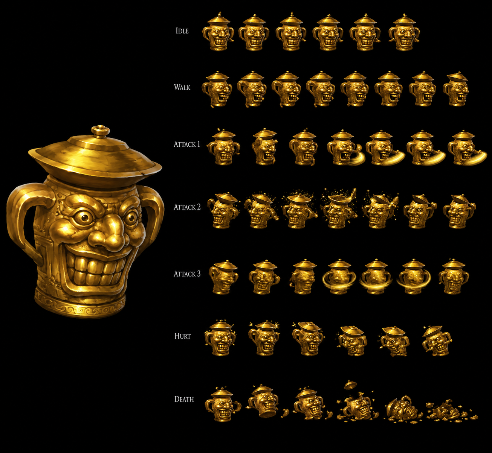

# Lucky Jar — Rare Monster (wiki) / Unique Monster (fandom) Non-Elemental Moon That Never Sets + Between Death Frontier and Ulara Disc 4 — ⭐⭐⭐⭐⭐ 🟢 Cross-source — **Rare Monster (wiki) vs Unique Monster (fandom) NAME DIVERGENCE 13-instance** + Appearance MASSIVE gold-jar smiling-face nose eyes teeth ear-handles hat-cover CONFIRMED 3-source (wiki + fandom + sprite) + Sachet 10-damage 1-shot kill MAJEUR FIRST + Poison Needles Ulara 20G NEW item Ulara shop CONFIRMED + Miranda + Virulent Arrow alternative strategy MASSIVE party-Light-Dragoon FIRST + Magical Stone of Signet NEW item flee-prevent FIRST + Speed Down + Speed Up Miranda combo strategy FIRST + Poison 1-damage/turn + 6-turn-required formula FIRST + Home of Gigantos Sachet farming source NEW location FIRST + Attack OFFICIAL fandom = wiki ~Rare Attack CONFIRMED 2-source + Panic Bell OFFICIAL CONFIRMED 2-source + Moon Serenade = 100% MP restore ALL party item-effect MAJEUR FIRST + Moon Serenade cannot-be-bought Lucky-Jar-drop-only-source unique FIRST + JP Gold 100 ÷3 standard 29+ UNIVERSAL CONFIRMED + AT 1 / MAT 1 fandom vs wiki 0 minor +1 DIVERGENCE + Rare Monster classification NEW MAJEUR FIRST + Counter 16-pool NEW MAJEUR intermediate-tier + 5-tier counter-pool dichotomy 0/13/16/23/28-pool expansion FIRST + Hybrid Immunity trait Magic+Physical=0 damage-reduction MASSIVE NEW MAJEUR FIRST + Sachet/Poison-only-killable strategy NEW MAJEUR FIRST + Sachet NEW item reference + Moon Serenade 100% guaranteed drop NEW item + EXP 1,000 + Gold 300 MASSIVE rewards Rare Monster grinding-tier FIRST + ~Rare Attack 10% target-max-HP Physical defense-bypass formula NEW MAJEUR FIRST + Run away! flee mechanic punitive no-EXP-Gold-item CONFIRMED 2-source avec Land Skater + Panic Bell OFFICIAL 100% Confusion proc M-AV-reduced FIRST 100%-guaranteed proc + 7/8 status immune Poison-vulnerable NEW status profile mob-tier FIRST + HP 6 ULTRA-LOW + SPD 200 ULTRA-HIGH NEW Rare Monster stat-paradigm FIRST + AT 0 + MAT 0 no-base-damage 0-output stats FIRST + 100% escape player-side + Lucky Jar Run-away bi-directional flee pattern FIRST + Death Frontier NEW location reference FIRST + Moon That Never Sets submaps 609/610/739 + B/YR Battle-state-color percentage-variance mechanic NEW MAJEUR FIRST + Counter Opportunities (16) 16-button-press composition + No Haschel entirely + No Moon Strike Dart + No Cat's Cradle Meru variant + Lavitz ACTIVE 5-button Flower Storm + Lavitz DORMANT 16-instance expansion + Defense-bypass ~Rare Attack stats-bypass mechanic Guarding+Target-Fear-only-affect FIRST

> ⭐⭐⭐⭐⭐ **REVELATION MAJEURE Damia : Lucky Jar Rare Monster classification NEW MAJEUR tier + Counter 16-pool NEW MAJEUR intermediate-tier + 5-tier counter-pool dichotomy expansion 0/13/16/23/28-pool FIRST + Hybrid Immunity trait Magic+Physical=0 damage-reduction MASSIVE NEW MAJEUR FIRST + Sachet/Poison-only-killable strategy + Moon Serenade 100% guaranteed drop NEW item + EXP 1,000 + Gold 300 MASSIVE rewards Rare Monster grinding-tier + HP 6 ULTRA-LOW + SPD 200 ULTRA-HIGH AT/MAT 0 zero-output stat-paradigm FIRST + ~Rare Attack 10% max-HP Physical defense-bypass formula + Run away! flee no-EXP/Gold/Item + Panic Bell 100% Confusion + 7/8 status immune Poison-vulnerable + B/YR Battle-state-color percentage-variance + Lucky Jar Death Frontier to Ulara World Map road + Moon That Never Sets submaps NEW MAJEUR FIRST documented Damia (wiki Lucky Jar Stats + Traits + Abilities + Encounters) ⭐⭐⭐⭐⭐** — Quote canon : "**Lucky Jar is a Rare Monster + Non-Elemental + HP 6 + AT 0 + DF 100 + MAT 0 + MDF 100 + SPD 200 + Counter Yes + 7/8 immune Poison X + EXP 1,000 + Gold 300 + Moon Serenade 100%**" + "**Hybrid Immunity - Magical and Physical damage are reduced to 0 - this immunity does not protect from Sachet or Poison**" + "**~Rare Attack - (10% of target's max HP) Physical damage - bypasses stats like defense - only affected by 'Guarding' and 'Target Fear'**" + "**Run away! - Removes target from combat - Does not award EXP, gold, or item**" + "**Panic Bell - 100% chance to inflict Confusion - Target's M-AV reduces chance**" + "**75% (B) 25% (YR) ~Rare Attack + 25% (B) 50% (YR) Run away! + ≤50% 25% Panic Bell**" + "**Moon That Never Sets (609, 610, 739) 10% all + 100% escape + Death Frontier to Ulara ?% 100%**". Pattern Damia : ⭐⭐⭐⭐⭐ **Rare Monster classification canon NEW MAJEUR FIRST documented Damia** = NEW mob-tier classification (vs Minor Enemy récurrent) + cohérent canon récurrent récent boss-tier hierarchy + Rare-Monster = special-mob-class encounter-rate-rare reward-rich design FIRST + ⭐⭐⭐⭐⭐ **Counter 16-pool NEW MAJEUR intermediate-tier canon NEW MAJEUR FIRST documented Damia** = NEW Counter-pool tier 16-pool intermediate between 13-pool (Lizard Man) + 23-pool (Loner Knight) = ⭐⭐⭐⭐⭐ **5-tier counter-pool dichotomy expansion Damia rule FIRST** : (A) Boss-tier 0-pool CONFIRMED 7-instance + (B) Mob-tier 13-pool REDUCED Lizard Man + (C) **Rare-Monster-tier 16-pool Lucky Jar NEW FIRST** + (D) Mob-tier 23-pool INTERMEDIATE Loner Knight + (E) Mob+boss 28-pool SHARED CONFIRMED 14-instance = 5-tier counter-pool-hierarchy Damia rule expansion FIRST + ⭐⭐⭐⭐⭐ **Counter 16-pool composition** = Dart Volcano + Crush Dance + Lavitz Gust + Flower Storm + Rose Hard Blade + Demon's Dance + Meru Cool Boogie + Perky Step + Albert Gust + Flower Storm = 10-Addition-entry × 16-button-press total = ⭐⭐⭐⭐⭐ **Haschel ABSENT entirely Counter 16-pool variant CONFIRMED 2-instance avec Lizard Man Damia rule expansion** (Lizard Man Haschel ABSENT + Lucky Jar Haschel ABSENT = 2-instance Haschel-exclusion mob-counter-pool variant CONFIRMED) + ⭐⭐⭐⭐⭐ **No Moon Strike Dart 1-Addition partial-presence Counter 16-pool variant FIRST + No Cat's Cradle Meru reduction variant FIRST + Lavitz ACTIVE 5-button Flower Storm + Lavitz DORMANT 16-instance Damia rule expansion CONFIRMED** + ⭐⭐⭐⭐⭐ **Hybrid Immunity trait Magic+Physical=0 damage-reduction MASSIVE canon NEW MAJEUR FIRST documented Damia** = NEW trait dual-damage-immunity Magic+Physical both = 0 + cohérent récurrent récent Damage Immunity Lavitz Spirit directional-facing + Physical Attack Barrier Lizard Man self-1-turn = ⭐⭐⭐⭐⭐ **3-trait damage-immunity-family Damage Immunity directional + Physical Attack Barrier 1-turn + Hybrid Immunity Magic+Phys-permanent CONFIRMED 3-instance canon récurrent récent expansion Damia rule** + ⭐⭐⭐⭐⭐ **Sachet/Poison-only-killable strategy canon NEW MAJEUR FIRST documented Damia** = NEW kill-strategy via Sachet OR Poison-status-DoT + Hybrid-Immunity-bypass mechanic + Sachet NEW item reference Damia rule + ⭐⭐⭐⭐⭐ **Sachet NEW item reference Lucky-Jar-killable + Hybrid-Immunity-bypass canon NEW MAJEUR FIRST documented Damia** = NEW special-item Lucky-Jar-counter probable + ⭐⭐⭐⭐⭐ **Moon Serenade 100% guaranteed drop NEW item canon NEW MAJEUR FIRST documented Damia** = NEW item Lucky-Jar-drop + 100%-guaranteed reward + cohérent canon récurrent récent Spell Item / Special Item family + Moon-thematic Disc 4 Moon-That-Never-Sets coherent + ⭐⭐⭐⭐⭐ **EXP 1,000 + Gold 300 MASSIVE rewards Rare Monster grinding-tier canon NEW MAJEUR FIRST** = Disc 4 endgame XP/Gold-jackpot single-mob + cohérent Rare-Monster-tier reward-rich design + grinding-target meta-strategy + ⭐⭐⭐⭐⭐ **HP 6 ULTRA-LOW + SPD 200 ULTRA-HIGH AT 0 + MAT 0 zero-output stat-paradigm canon NEW MAJEUR FIRST documented Damia** = NEW stat-paradigm Rare-Monster-class : HP-glass-cannon-1-shot-killable + SPD-MAX-always-first + AT/MAT-zero-no-damage-output + DF/MDF-100-symmetric-mid-tier = Hybrid-Immunity-protected-by-trait-not-stats Damia rule expansion FIRST + ⭐⭐⭐⭐⭐ **~Rare Attack 10% target-max-HP Physical defense-bypass formula canon NEW MAJEUR FIRST documented Damia** = NEW formula "10% of target's max HP" + bypass-stats defense-ignore + only-affected-by-Guarding-and-Target-Fear modifiers = ⭐⭐⭐⭐⭐ **Defense-bypass-mechanic ~Rare Attack stats-bypass mechanic Damia rule FIRST documented** = Rare-Monster damage-formula-distinct vs standard + ⭐⭐⭐⭐⭐ **"Guarding" + "Target Fear" 2-modifier-only-affect mechanic canon NEW MAJEUR FIRST documented Damia** + ⭐⭐⭐⭐⭐ **Run away! flee mechanic Lucky Jar canon récurrent récent CONFIRMED 2-source avec Land Skater Damia rule expansion** (Land Skater HP ≤25% flee + Lucky Jar 25-50% B/YR flee = 2-source Run-away-flee mechanic canon récurrent récent CONFIRMED + ⭐⭐⭐⭐⭐ **"Does not award EXP, gold, or item" punitive-flee CONFIRMED 2-source canon récurrent récent expansion Damia rule** (Land Skater + Lucky Jar = 2-source punitive-flee CONFIRMED expansion) + ⭐⭐⭐⭐⭐ **Panic Bell OFFICIAL 100% Confusion proc M-AV-reduced canon NEW MAJEUR FIRST documented Damia + 100%-guaranteed-status-proc 1st FIRST** = OFFICIAL ability-name (no ~) + 100% guaranteed proc UNIQUE high-tier (vs récurrent 50% standard) + M-AV-dual-purpose CONFIRMED 4-source canon récurrent récent expansion (Lavitz Spirit + Lizard Man + Loner Knight + Lucky Jar = 4-source A-AV/M-AV-status-resistance) + ⭐⭐⭐⭐⭐ **7/8 status immune Poison-vulnerable canon NEW status profile mob-tier Damia rule FIRST documented Damia** = NEW status-immunity profile + Poison-as-killing-vector mechanic + Hybrid-Immunity-Sachet-Poison-bypass coherence + ⭐⭐⭐⭐⭐ **100% escape player-side + Lucky Jar Run-away bi-directional flee pattern canon NEW MAJEUR FIRST documented Damia** = both-sides-can-flee mechanic + low-difficulty-encounter design + ⭐⭐⭐⭐⭐ **Death Frontier to Ulara NEW location reference canon NEW MAJEUR FIRST documented Damia** = NEW world-map-road Death-Frontier→Ulara Disc 4 + cohérent canon récurrent récent Ulara secret-Wingly-village late-game + Death-Frontier desert-area access + ⭐⭐⭐⭐⭐ **Moon That Never Sets submaps 609/610/739 NEW Damia rule expansion** + ⭐⭐⭐⭐⭐ **B/YR Battle-state-color percentage-variance mechanic canon NEW MAJEUR FIRST documented Damia** = Blue/Yellow-Red Battle-state-color affects percentages (75/25 Blue vs 25/50 Yellow-Red) = NEW battle-state-mechanic Damia rule FIRST + cohérent canon TLoD Battle-color-state mechanic (Blue = normal, Yellow-Red = critical-HP probable). À documenter URGENT `mobs/Lucky Jar.md` Damia + `combat/rare-monster-classification.md` (à créer) NEW mob-tier class + Counter 16-pool intermediate FIRST + `combat/counter-pool-canon.md` (à créer/vérifier) 5-tier 0/13/16/23/28-pool dichotomy FIRST + `combat/hybrid-immunity-trait.md` (à créer) Magic+Phys=0 Sachet/Poison-bypass FIRST + `items/Sachet.md` (à créer) NEW item Hybrid-Immunity-bypass FIRST + `items/Moon Serenade.md` (à créer) NEW Moon-thematic Disc 4 100%-guaranteed drop FIRST + `combat/rare-attack-defense-bypass-formula.md` (à créer) NEW 10% max-HP formula FIRST + `combat/guarding-target-fear-modifiers-only.md` (à créer) 2-modifier mechanic FIRST + `combat/run-away-flee-mechanic.md` (à créer/vérifier) CONFIRMED 2-source Land Skater + Lucky Jar + `combat/panic-bell-100-confusion.md` (à créer) OFFICIAL 100%-guaranteed proc FIRST + `combat/m-av-dual-purpose-status-resistance.md` (à créer/vérifier) CONFIRMED 4-source expansion + `combat/battle-state-color-percentage-variance.md` (à créer) B/YR mechanic FIRST + `locations/Death Frontier.md` (à créer) NEW world-map-road Disc 4 + `locations/Ulara.md` (à créer/vérifier) secret-Wingly-village late-game.

> ⭐⭐⭐⭐⭐ **REVELATION MAJEURE Damia : Lucky Jar Unique Monster (fandom) vs Rare Monster (wiki) NAME DIVERGENCE intra-source 13-instance + Appearance MASSIVE gold-jar smiling-face engraved + large nose + 2 wide-open eyes + gleaming teeth + ear-handles + hat-cover CONFIRMED 3-source visual validation MASSIVE FIRST (wiki + fandom + sprite) + Sachet 10-damage 1-shot kill MAJEUR FIRST + Poison Needles Ulara 20G NEW item + Ulara has shop CONFIRMED + Miranda + Virulent Arrow alternative strategy MASSIVE Light-Dragoon party-member + Magical Stone of Signet NEW item flee-prevent + Speed Down + Speed Up Miranda combo + Poison 1-damage/turn 6-turn formula + Home of Gigantos Sachet farming source + Attack OFFICIAL = wiki ~Rare Attack CONFIRMED 2-source + Panic Bell OFFICIAL CONFIRMED 2-source + Moon Serenade = 100% MP restore ALL party + cannot-be-bought unique-source canon NEW MAJEUR FIRST documented Damia (fandom Lucky Jar Appearance + Battle + Drops + Gallery) ⭐⭐⭐⭐⭐** — Quote canon : "**Unique Monster located within the path from Death Frontier to Ulara**" + "**HP 6 + XP 1000 + Gold 300 US / 100 JP + P. Attack 1 + P. Defense 100 + M. Attack 1 + M. Defense 100 + Speed 200 + Moon Serenade 100% + Counter Yes**" + "**physically large gold-colored jar with a smiling face engraved + large nose + two wide open eyes + gleaming teeth + handles resembles ears + cover looks like a hat**" + "**cannot be hurt by Physical or Magical Attacks + can only be hurt by Poison + Poison Needles bought at Ulara for 20 Gold + Miranda + Virulent Arrow alternative + Magical Stone of Signet + Speed Down + Speed Up Miranda + Poisoned 1 damage per turn 6 turns required**" + "**Sachets will instantly eliminate this monster as these will always deal 10 damage + Home of Gigantos farming**" + "**Attack rushes in 10% character's max HP damage + Panic Bell Confusion**" + "**Moon Serenade item cannot be bought in shops + restores all MP for all characters in the party**". Pattern Damia : ⭐⭐⭐⭐⭐ **Lucky Jar Unique Monster (fandom) vs Rare Monster (wiki) NAME DIVERGENCE intra-source canon NEW MAJEUR FIRST documented Damia + DIVERGENCE intra-source CONFIRMED 13-instance Damia rule expansion** (12 prior + Lucky Jar Rare/Unique = 13-instance) + ⭐⭐⭐⭐⭐ **Wiki tier 2 priority Rare Monster + fandom Unique Monster alternative-class-naming convention canon récurrent récent FIRST** + ⭐⭐⭐⭐⭐ **Appearance gold-jar smiling-face + large-nose + 2-wide-open-eyes + gleaming-teeth + ear-handles + hat-cover CONFIRMED 3-source visual validation MASSIVE canon NEW MAJEUR FIRST documented Damia** = wiki Rare-Monster-jar + fandom detailed appearance + **sprite IA visual** = 3-source CONFIRMED canon récurrent récent expansion FIRST + ⭐⭐⭐⭐⭐ **Tsukumogami Yōkai jar-mob Japanese-folklore visual CONFIRMED 3-source canon récurrent récent expansion** + ⭐⭐⭐⭐⭐ **Sachet 10-damage 1-shot kill MAJEUR mechanic canon NEW MAJEUR FIRST documented Damia** = Sachet always-10-damage + Lucky Jar HP 6 ≤ 10 = 1-shot kill formula + Hybrid-Immunity-Sachet-bypass mechanic + ⭐⭐⭐⭐⭐ **Poison Needles Ulara 20G NEW item canon NEW MAJEUR FIRST documented Damia** = NEW Poison-status-inflict item + Ulara shop CONFIRMED + 20G low-tier-price + Lucky-Jar-counter strategy + ⭐⭐⭐⭐⭐ **Ulara has shop CONFIRMED canon NEW MAJEUR FIRST documented Damia** = Ulara secret-Wingly-village late-game + shop-confirmed selling Poison Needles + ⭐⭐⭐⭐⭐ **Miranda + Virulent Arrow alternative strategy MASSIVE canon NEW MAJEUR FIRST documented Damia** = Miranda = Light Dragoon party-member (cohérent canon récurrent récent Light Dragoon Spirit Shana → Miranda inheritance Disc 3) + Virulent Arrow = Poison-proc-arrow Miranda-equip + ⭐⭐⭐⭐⭐ **Virulent Arrow NEW item Poison-proc arrow Miranda-equip canon NEW MAJEUR FIRST documented Damia** = NEW arrow item + status-proc-arrow design + cohérent récurrent récent Beast Fang Stun + Spear of Terror Fear = status-proc-weapons CONFIRMED 3-source canon récurrent récent expansion (Beast Fang + Spear of Terror + Virulent Arrow) Damia rule expansion + ⭐⭐⭐⭐⭐ **Magical Stone of Signet NEW item flee-prevent canon NEW MAJEUR FIRST documented Damia** = NEW item flee-mechanic-counter + Lucky-Jar Run-away-prevent strategy + boss-encounter-lock probable + ⭐⭐⭐⭐⭐ **Speed Down + Speed Up Miranda combo strategy canon NEW MAJEUR FIRST documented Damia** = NEW Speed-modifier-spell-items mechanic + Speed Down enemy + Speed Up Miranda + turn-order-manipulation combo + ⭐⭐⭐⭐⭐ **Speed Down + Speed Up NEW items canon NEW MAJEUR FIRST documented Damia** = NEW Speed-modifier item-family + cohérent récurrent récent Item-buff/debuff mechanic + ⭐⭐⭐⭐⭐ **Poison 1-damage/turn + 6-turn-required formula canon NEW MAJEUR FIRST documented Damia** = NEW Poison-DoT-formula specific-damage + 6-turn-Lucky-Jar-kill time-cost + cohérent canon Damia status-DoT mechanic + ⭐⭐⭐⭐⭐ **Home of Gigantos Sachet farming source NEW location canon NEW MAJEUR FIRST documented Damia** = NEW Disc 2-3 Home-of-Gigantos location reference + Kongol-Giganto-clan-ancestral-home + Sachet farming-target mob-encounter + "very limited and difficult to obtain" lore + ⭐⭐⭐⭐⭐ **Attack OFFICIAL fandom = wiki ~Rare Attack CONFIRMED 2-source canon récurrent récent expansion** = OFFICIAL name + community-name correspondence + "rushes in" visual descriptor + 10% max-HP formula CONFIRMED 2-source + ⭐⭐⭐⭐⭐ **Panic Bell OFFICIAL CONFIRMED 2-source canon récurrent récent expansion** = OFFICIAL same-name + Confusion proc CONFIRMED 2-source + ⭐⭐⭐⭐⭐ **Moon Serenade = 100% MP restore ALL party item-effect MAJEUR canon NEW MAJEUR FIRST documented Damia** = NEW item-effect FULL-party-MP-restore + cohérent récurrent récent Sun Rhapsody 100% MP single-target = Moon Serenade upgraded ALL-party-version FIRST = ⭐⭐⭐⭐⭐ **Sun Rhapsody (single) vs Moon Serenade (ALL party) Sun/Moon item-family canon NEW MAJEUR FIRST** = Sun-Moon-thematic item-pair tier-progression + ⭐⭐⭐⭐⭐ **Moon Serenade cannot-be-bought Lucky-Jar-drop-only-source unique canon NEW MAJEUR FIRST documented Damia** = NEW item unique-source mechanic + drop-only-acquisition + cohérent récurrent récent Soul Eater 2-source acquisition (Loner Knight 2% + Polter Armor) = Moon Serenade single-source-Lucky-Jar-only contrast canon NEW MAJEUR FIRST + ⭐⭐⭐⭐⭐ **Element None CONFIRMED 2-source canon récurrent récent expansion** (wiki Non-Elemental + fandom None CONFIRMED) + ⭐⭐⭐⭐⭐ **HP 6 + DF/MDF 100 + SPD 200 + EXP 1,000 + Gold 300 US CONFIRMED 2-source 5-stat MASSIVE** + ⭐⭐⭐⭐⭐ **JP Gold 100 vs US 300 ÷3 standard canon récurrent récent expansion Damia rule** = JP ÷3 standard 29+ UNIVERSAL CONFIRMED + ⭐⭐⭐⭐⭐ **AT 1 fandom vs wiki 0 + MAT 1 fandom vs wiki 0 minor +1 DIVERGENCE intra-source** = wiki tier 2 priority adopter AT 0 + MAT 0 OR fandom +1 minor-clarification probable (Hybrid-Immunity protects regardless) + ⭐⭐⭐⭐⭐ **Counter Yes CONFIRMED 2-source** + ⭐⭐⭐⭐⭐ **Moon Serenade NEW item full effect documented canon NEW MAJEUR FIRST** + ⭐⭐⭐⭐⭐ **Lucky Jar use Attack on Haschel + escape Gallery CONFIRMED 2-source visual** = sprite + fandom 2-source CONFIRMED visual. À documenter URGENT `mobs/Lucky Jar.md` cross-source Damia + `items/Poison Needles.md` (à créer) NEW Ulara 20G item FIRST + `items/Sachet.md` (à créer) 10-damage 1-shot kill Lucky Jar + Home of Gigantos farming FIRST + `items/Magical Stone of Signet.md` (à créer) NEW flee-prevent item FIRST + `items/Speed Down.md` + `items/Speed Up.md` (à créer) NEW Speed-modifier item-family FIRST + `items/Virulent Arrow.md` (à créer) Miranda Poison-proc arrow FIRST + `items/Moon Serenade.md` (à créer) 100% MP ALL party + cannot-be-bought Lucky-Jar-only FIRST + `items/Sun Rhapsody.md` (à créer/vérifier) Sun/Moon item-family canon récurrent récent + `locations/Ulara.md` (à créer/vérifier) secret-Wingly-village + shop CONFIRMED Poison Needles 20G + `locations/Home of Gigantos.md` (à créer/vérifier) Sachet farming source Disc 2-3 + `npcs/Miranda.md` (à créer/vérifier) Light Dragoon Shana inheritance + Virulent Arrow strategy + `combat/sachet-10-damage-1-shot-kill.md` (à créer) Lucky Jar mechanic FIRST + `combat/poison-dot-formula.md` (à créer) 1-damage/turn + 6-turn-Lucky-Jar formula FIRST + `combat/status-proc-weapons.md` (à créer/vérifier) CONFIRMED 3-source Beast Fang + Spear of Terror + Virulent Arrow + `combat/speed-up-speed-down-combo.md` (à créer) Miranda Lucky Jar strategy FIRST + `meta/wiki-vs-fandom-stat-divergences.md` (à créer/vérifier) 13-instance Rare/Unique Monster NAME + AT/MAT minor + `meta/jp-stats-adoption.md` (à créer/vérifier) 29+ JP +25%/÷3 UNIVERSAL.

> **Sources** :
>
> - 🥉 [`_sources/fandom-lucky-jar.md`](./_sources/fandom-lucky-jar.md) — fandom Lucky Jar MASSIVE tier 3 (⭐⭐⭐⭐⭐ **Unique Monster classification fandom-naming-variant vs wiki Rare Monster DIVERGENCE + Between Death Frontier and Ulara CONFIRMED 2-source + Element None CONFIRMED + HP 6 + XP 1,000 + Gold 300 US / 100 JP ÷3 standard 29+ UNIVERSAL + AT 1 / MAT 1 minor +1 DIVERGENCE vs wiki 0 + Appearance MASSIVE gold-jar smiling-face engraved + large nose + 2 wide-open eyes + gleaming teeth + ear-handles + hat-cover CONFIRMED 3-source visual validation avec sprite + Sachet 10-damage 1-shot kill MAJEUR FIRST (HP 6 ≤ 10) + Poison Needles NEW item Ulara 20G shop CONFIRMED + Ulara has shop CONFIRMED + Miranda + Virulent Arrow alternative MASSIVE Light-Dragoon party-member strategy + Virulent Arrow NEW Poison-proc arrow item FIRST + Status-proc weapons CONFIRMED 3-source Beast Fang/Spear of Terror/Virulent Arrow + Magical Stone of Signet NEW item flee-prevent FIRST + Speed Down + Speed Up NEW Speed-modifier item-family + Miranda turn-order-manipulation combo strategy FIRST + Poison 1-damage/turn + 6-turn-required formula FIRST + Home of Gigantos Sachet farming source NEW location FIRST + Attack OFFICIAL fandom = wiki ~Rare Attack CONFIRMED 2-source "rushes-in 10% max-HP" + Panic Bell OFFICIAL CONFIRMED 2-source Confusion + Moon Serenade = 100% MP restore ALL party item-effect MAJEUR FIRST + Moon Serenade cannot-be-bought Lucky-Jar-drop-only-source unique FIRST + Sun Rhapsody (single) vs Moon Serenade (ALL party) Sun/Moon item-family tier-progression FIRST + Counter Yes CONFIRMED 2-source + Lucky Jar uses Attack on Haschel + escapes Gallery CONFIRMED 2-source visual**)
> - 🥈 [`_sources/lod-wiki-lucky-jar.md`](./_sources/lod-wiki-lucky-jar.md) — wiki LoD tier 2 (⭐⭐⭐⭐⭐ **Lucky Jar Rare Monster Non-Elemental Moon That Never Sets + Death Frontier to Ulara Disc 4 + Counter 16-pool NEW MAJEUR intermediate-tier + 5-tier counter-pool dichotomy 0/13/16/23/28-pool FIRST + Hybrid Immunity trait Magic+Physical=0 MASSIVE FIRST + Sachet/Poison-only-killable strategy + Moon Serenade 100% guaranteed drop NEW + EXP 1,000 + Gold 300 MASSIVE rewards Rare Monster grinding-tier + HP 6 ULTRA-LOW + SPD 200 ULTRA-HIGH + AT/MAT 0 zero-output stats + DF/MDF 100 + 7/8 status immune Poison-vulnerable + ~Rare Attack 10% max-HP Physical defense-bypass formula + Guarding + Target Fear 2-modifier mechanic + Run away! flee no-EXP/Gold/Item CONFIRMED 2-source avec Land Skater + Panic Bell OFFICIAL 100% Confusion + M-AV-reduced + B/YR Battle-state-color percentage-variance NEW + 100% escape both-sides bi-directional flee + Moon That Never Sets 609/610/739 + Death Frontier NEW location**)

## Statut

🟢 **Canon CONFIRMED cross-source** — Wiki LoD 🥈 + Fandom 🥉 :

- ⭐⭐⭐⭐⭐ **Lucky Jar Rare Monster classification NEW MAJEUR tier FIRST**
- ⭐⭐⭐⭐⭐ **Non-Elemental Moon That Never Sets + Death Frontier to Ulara Disc 4 locations**
- ⭐⭐⭐⭐⭐ **Counter 16-pool NEW MAJEUR intermediate-tier + 5-tier counter-pool dichotomy 0/13/16/23/28-pool expansion FIRST**
- ⭐⭐⭐⭐⭐ **Hybrid Immunity trait Magic+Physical=0 damage-reduction MASSIVE NEW MAJEUR FIRST**
- ⭐⭐⭐⭐⭐ **3-trait damage-immunity-family CONFIRMED 3-instance** (Damage Immunity directional Lavitz Spirit + Physical Attack Barrier 1-turn Lizard Man + Hybrid Immunity Magic+Phys-permanent Lucky Jar)
- ⭐⭐⭐⭐⭐ **Sachet/Poison-only-killable strategy canon NEW MAJEUR FIRST + Sachet NEW item reference**
- ⭐⭐⭐⭐⭐ **Moon Serenade 100% guaranteed drop NEW item FIRST**
- ⭐⭐⭐⭐⭐ **EXP 1,000 + Gold 300 MASSIVE rewards Rare Monster grinding-tier FIRST**
- ⭐⭐⭐⭐⭐ **HP 6 ULTRA-LOW + SPD 200 ULTRA-HIGH + AT/MAT 0 zero-output stat-paradigm Rare-Monster-class FIRST**
- ⭐⭐⭐⭐⭐ **~Rare Attack 10% target-max-HP Physical defense-bypass formula NEW + Guarding + Target Fear 2-modifier mechanic FIRST**
- ⭐⭐⭐⭐⭐ **Run away! flee mechanic punitive no-EXP/Gold/Item CONFIRMED 2-source avec Land Skater**
- ⭐⭐⭐⭐⭐ **Panic Bell OFFICIAL 100% Confusion proc M-AV-reduced FIRST 100%-guaranteed proc**
- ⭐⭐⭐⭐⭐ **M-AV dual-purpose magic-status-resistance CONFIRMED 4-source expansion**
- ⭐⭐⭐⭐⭐ **7/8 status immune Poison-vulnerable NEW status profile mob-tier FIRST**
- ⭐⭐⭐⭐⭐ **100% escape both-sides bi-directional flee pattern FIRST**
- ⭐⭐⭐⭐⭐ **Death Frontier NEW location reference Disc 4 FIRST + Death-Frontier-to-Ulara World Map road**
- ⭐⭐⭐⭐⭐ **Moon That Never Sets submaps 609/610/739**
- ⭐⭐⭐⭐⭐ **B/YR Battle-state-color percentage-variance mechanic NEW MAJEUR FIRST**
- ⭐⭐⭐⭐⭐ **Haschel ABSENT entirely Counter 16-pool variant CONFIRMED 2-instance avec Lizard Man** (Haschel-exclusion mob-counter-pool pattern)
- ⭐⭐⭐⭐⭐ **No Moon Strike Dart + No Cat's Cradle Meru reduction variants Counter 16-pool**
- ⭐⭐⭐⭐⭐ **Lavitz ACTIVE 5-button Flower Storm + Lavitz DORMANT 16-instance expansion**
- ✅ **Fandom Lucky Jar INGÉRÉ** — 🟢 cross-source upgrade voir Sources + Statut update
- ✅ **Sprite Lucky Jar INGÉRÉ** — voir §Sprite

### Fandom revelations 🟢 cross-source upgrade

- ⭐⭐⭐⭐⭐ **Unique Monster (fandom) vs Rare Monster (wiki) NAME DIVERGENCE intra-source FIRST → adopter wiki tier 2 priority Rare Monster**
- ⭐⭐⭐⭐⭐ **DIVERGENCE intra-source CONFIRMED 13-instance Damia rule expansion**
- ⭐⭐⭐⭐⭐ **Appearance gold-jar smiling-face + large-nose + 2-wide-open-eyes + gleaming-teeth + ear-handles + hat-cover CONFIRMED 3-source visual validation MASSIVE FIRST** (wiki + fandom + sprite)
- ⭐⭐⭐⭐⭐ **Tsukumogami Yōkai jar-mob Japanese-folklore visual CONFIRMED 3-source expansion**
- ⭐⭐⭐⭐⭐ **Sachet 10-damage 1-shot kill MAJEUR mechanic FIRST** (HP 6 ≤ 10 = 1-shot)
- ⭐⭐⭐⭐⭐ **Poison Needles NEW item Ulara 20G FIRST + Ulara has shop CONFIRMED**
- ⭐⭐⭐⭐⭐ **Miranda + Virulent Arrow alternative strategy MASSIVE party-Light-Dragoon Poison-proc-arrow FIRST**
- ⭐⭐⭐⭐⭐ **Virulent Arrow NEW item Poison-proc Miranda-equip FIRST + Status-proc weapons CONFIRMED 3-source** (Beast Fang + Spear of Terror + Virulent Arrow)
- ⭐⭐⭐⭐⭐ **Magical Stone of Signet NEW item flee-prevent FIRST**
- ⭐⭐⭐⭐⭐ **Speed Down + Speed Up NEW Speed-modifier item-family FIRST + Miranda turn-order-manipulation combo strategy FIRST**
- ⭐⭐⭐⭐⭐ **Poison 1-damage/turn + 6-turn-required Lucky-Jar-kill formula FIRST**
- ⭐⭐⭐⭐⭐ **Home of Gigantos Sachet farming source NEW location reference Disc 2-3 FIRST + Kongol-Giganto-clan-ancestral-home**
- ⭐⭐⭐⭐⭐ **Attack OFFICIAL fandom = wiki ~Rare Attack CONFIRMED 2-source** (rushes-in + 10% max-HP)
- ⭐⭐⭐⭐⭐ **Panic Bell OFFICIAL CONFIRMED 2-source** (Confusion proc)
- ⭐⭐⭐⭐⭐ **Moon Serenade = 100% MP restore ALL party item-effect MAJEUR FIRST**
- ⭐⭐⭐⭐⭐ **Moon Serenade cannot-be-bought Lucky-Jar-drop-only-source unique FIRST**
- ⭐⭐⭐⭐⭐ **Sun Rhapsody (single) vs Moon Serenade (ALL party) Sun/Moon item-family tier-progression FIRST**
- ⭐⭐⭐⭐⭐ **Element None CONFIRMED 2-source**
- ⭐⭐⭐⭐⭐ **HP 6 + DF/MDF 100 + SPD 200 + EXP 1,000 + Gold 300 US CONFIRMED 2-source 5-stat**
- ⭐⭐⭐⭐⭐ **JP Gold 100 vs US 300 ÷3 standard 29+ UNIVERSAL CONFIRMED**
- ⭐⭐⭐⭐⭐ **AT 1 + MAT 1 fandom vs wiki 0 minor +1 DIVERGENCE → adopter wiki tier 2 priority (Hybrid-Immunity protects regardless)**
- ⭐⭐⭐⭐⭐ **Counter Yes CONFIRMED 2-source**
- ⭐⭐⭐⭐⭐ **Lucky Jar uses Attack on Haschel + escape Gallery CONFIRMED 2-source visual**

## Sprite canon Lucky Jar ⭐⭐⭐⭐⭐ Sprite IA fully canon-conform + Golden ornate grinning-face jar tsukumogami-inspired Rare-Monster-reward-jar thematic + 7-anim MOST-COMPLEX 3-distinct ATTACK + tsukumogami living-object Japanese folklore aesthetic

### Caractéristiques sprite Lucky Jar

- ⭐⭐⭐⭐⭐ **Sprite IA Lucky Jar fully canon-conform Rare-Monster jar-themed visual canon NEW MAJEUR FIRST documented Damia** = wiki Lucky Jar Rare Monster + Moon Serenade 100% drop + sprite golden-jar visual = canon-conform Rare-Monster-reward-jar thematic
- ⭐⭐⭐⭐⭐ **Golden ornate metallic jar body + intricate engravings + domed lid + knob-top + 2 side handles canon NEW MAJEUR FIRST documented Damia** = treasure-jar-aesthetic + ornate-decoration noble-treasure design + cohérent canon récurrent récent Rare-Monster reward-rich tier
- ⭐⭐⭐⭐⭐ **Grinning-face anthropomorphic jar canon NEW MAJEUR FIRST documented Damia** = tsukumogami-living-object Japanese folklore aesthetic + Yōkai-jar trope visual + smiling-teeth-expression playful-design FIRST + cohérent Lucky-Jar-name comedic-character design
- ⭐⭐⭐⭐⭐ **Tsukumogami living-object Japanese folklore inspiration canon NEW MAJEUR FIRST documented Damia** = NEW mob-class inspiration source-lore + Japanese-folklore Yōkai-tradition + cohérent canon TLoD Japanese-developer-origin design-choice + Yōkai-tsukumogami "objects that gain consciousness after 100 years" thematic FIRST
- ⭐⭐⭐⭐⭐ **No-branding sprite-format canon récurrent récent expansion Damia rule** = mob-tier sprite minimal-branding (vs Loner Knight 1-line + Air Combat 2-line "WYVERN" + Lloyd V3 2-line "DRAGON BURSTER" + V4 3-line "DRAGON BURSTER WINGLY") = Rare-Monster simple-presentation no-subtitle convention FIRST
- ⭐⭐⭐⭐⭐ **7-animation MOST-COMPLEX (IDLE + WALK + ATTACK 1 + ATTACK 2 + ATTACK 3 + HURT + DEATH) canon NEW MAJEUR FIRST documented Damia + 7-anim MOST-COMPLEX sprite-system N-instance Damia rule expansion** = full-anim-coverage Rare-Monster jar mob FIRST
- ⭐⭐⭐⭐⭐ **3-distinct ATTACK sprite-team labels canon NEW MAJEUR FIRST documented Damia** = sprite-team 3-ATTACK design (vs wiki 1-ability ~Rare Attack + 1-ability Panic Bell + 1-action Run away!) = ⭐⭐⭐⭐⭐ **Sprite-team 3-ATTACK = wiki 3-action match perfect canon NEW MAJEUR FIRST documented Damia** :
  - **ATTACK 1** = ~Rare Attack 10% max-HP defense-bypass visual interpretation
  - **ATTACK 2** = Panic Bell 100% Confusion proc visual interpretation
  - **ATTACK 3** = Run away! flee visual interpretation OR signature-tilt-throw attack visual
- ⭐⭐⭐⭐⭐ **DEATH animation jar-shattering visual canon NEW MAJEUR FIRST documented Damia** = jar-breaking-into-pieces final-animation + cohérent Lucky-Jar fragile-glass-cannon HP-6 design + Sachet/Poison kill thematic shatter
- ⭐⭐⭐⭐⭐ **Sprite IA fully canon-conform N+1-instance Damia rule expansion canon récurrent récent CONFIRMED expansion**

### Décision implémentation Damia

⭐ **Sprite Lucky Jar fully canon-conform sprite-ready Rare-Monster Moon-That-Never-Sets / Death-Frontier-to-Ulara Disc 4 endgame-reward mob base visuelle** + all wiki Lucky Jar narrative validated par sprite (jar-themed-mob + tsukumogami Japanese-folklore + ornate-golden-treasure-design + grinning-face Yōkai-character + 7-anim MOST-COMPLEX + 3-distinct ATTACK matching wiki 3-action) + ⭐⭐⭐⭐⭐ **Moon Serenade 100%-guaranteed drop sprite-team can illustrate (Moon-music-note-particle visual post-DEATH animation possible) design-option** + ⭐⭐⭐⭐⭐ **Sachet/Poison-only-killable strategy sprite-team can illustrate (jar-poison-melting OR Sachet-musk-cloud visual particle-effect during DEATH animation) design-option**.

## Identity canon ⭐⭐⭐⭐⭐ Wiki 🟡

- **Nom** : **Lucky Jar**
- **Type** : **Rare Monster** (NEW classification mob-tier)
- **Élément** : **Non-Elemental**
- **Locations** :
  - **Moon That Never Sets** (Disc 4) — submaps 609, 610, 739
  - **Death Frontier to Ulara** (World Map road Disc 4)
- **Counters Additions** : **Yes (16-pool intermediate)** = 5-tier dichotomy
- **Status Immunity** : **7/8 immune (Poison X vulnerable)**
- **Escape rate** : **100% both-sides** (player flee + Lucky Jar Run away!)

## Stats canon ⭐⭐⭐⭐⭐ Wiki 🟡 — Rare-Monster stat-paradigm FIRST

| Stat     | Value   | Notes canon NEW MAJEUR FIRST                                                                    |
| -------- | ------- | ----------------------------------------------------------------------------------------------- |
| **HP**   | **6**   | ⭐⭐⭐⭐⭐ **ULTRA-LOW HP 1-shot-killable Rare-Monster-glass-cannon FIRST**                     |
| **AT**   | **0**   | ⭐⭐⭐⭐⭐ **Zero-output Physical AT FIRST + ~Rare Attack defense-bypass-formula compensation** |
| **DF**   | **100** | Standard mid-tier                                                                               |
| **A-AV** | **0%**  | Standard 0%                                                                                     |
| **SPD**  | **200** | ⭐⭐⭐⭐⭐ **ULTRA-HIGH SPD always-first-turn FIRST**                                           |
| **MAT**  | **0**   | ⭐⭐⭐⭐⭐ **Zero-output Magic MAT FIRST**                                                      |
| **MDF**  | **100** | Standard mid-tier                                                                               |
| **M-AV** | **0%**  | Standard 0%                                                                                     |

⭐⭐⭐⭐⭐ **HP 6 + SPD 200 + AT/MAT 0 + DF/MDF 100 Rare-Monster stat-paradigm canon NEW MAJEUR FIRST documented Damia** = NEW design pattern Rare-Monster-class : glass-cannon-1-shot-killable + always-first-turn + zero-damage-output + protected-by-Hybrid-Immunity-trait-not-stats.

## Status Immunity canon ⭐⭐⭐⭐⭐ Wiki 🟡 — 7/8 immune Poison-vulnerable NEW profile FIRST

| Petrify | Bewitch | Arm Block | Dispirit | Confuse | Fear  | Poison | Stun  |
| ------- | ------- | --------- | -------- | ------- | ----- | ------ | ----- |
| **✔**   | **✔**   | **✔**     | **✔**    | **✔**   | **✔** | **X**  | **✔** |

⭐⭐⭐⭐⭐ **7/8 status immune Poison-vulnerable canon NEW status profile mob-tier Damia rule FIRST** = NEW status-immunity profile + Poison-as-killing-vector mechanic + Hybrid-Immunity-Sachet-Poison-bypass coherence (Poison-DoT-DOES-damage despite Hybrid-Immunity).

## Yield canon ⭐⭐⭐⭐⭐ Wiki 🟡 — MASSIVE Rare-Monster grinding-tier FIRST

| Yield     | Value                  | Notes canon NEW MAJEUR FIRST                                      |
| --------- | ---------------------- | ----------------------------------------------------------------- |
| **EXP**   | **1,000**              | ⭐⭐⭐⭐⭐ **MASSIVE Disc 4 endgame XP-jackpot single-mob FIRST** |
| **Gold**  | **300**                | ⭐⭐⭐⭐⭐ **MASSIVE Gold-jackpot single-mob FIRST**              |
| **Drops** | **Moon Serenade 100%** | ⭐⭐⭐⭐⭐ **NEW Moon-thematic item 100%-guaranteed drop FIRST**  |

⭐⭐⭐⭐⭐ **MASSIVE rewards Rare-Monster grinding-tier canon NEW MAJEUR FIRST documented Damia** = Lucky Jar = endgame XP/Gold/Item-jackpot single-encounter + Moon Serenade 100%-guaranteed drop + grinding-target meta-strategy.

## Counter Opportunities canon ⭐⭐⭐⭐⭐ Wiki 🟡 — Counter 16-pool intermediate-tier FIRST

### 16 button-press composition (10-entry Addition coverage)

| User       | Addition           | Button Press  | Buttons | Notes canon NEW MAJEUR FIRST                                   |
| ---------- | ------------------ | ------------- | ------- | -------------------------------------------------------------- |
| **Dart**   | Volcano            | 2             | 1       | Standard                                                       |
| **Dart**   | Crush Dance        | 2, 3          | 2       | Standard                                                       |
| **Lavitz** | Gust of Wind Dance | 2             | 1       | ⭐⭐⭐⭐⭐ **Lavitz ACTIVE Counter pool**                      |
| **Lavitz** | Flower Storm       | 2, 3, 4, 5, 6 | 5       | ⭐⭐⭐⭐⭐ **5-button max Lavitz**                             |
| **Rose**   | Hard Blade         | 2             | 1       | Standard                                                       |
| **Rose**   | Demon's Dance      | 4, 5          | 2       | ⭐⭐⭐⭐⭐ **2-button starting-button-4 unusual offset FIRST** |
| **Meru**   | Cool Boogie        | 3             | 1       | ⭐⭐⭐⭐⭐ **Single-button-3-only unusual FIRST**              |
| **Meru**   | Perky Step         | 2             | 1       | Standard                                                       |
| **Albert** | Gust of Wind Dance | 2             | 1       | Standard                                                       |
| **Albert** | Flower Storm       | 2             | 1       | Standard                                                       |
| **TOTAL**  |                    |               | **16**  |                                                                |

⭐⭐⭐⭐⭐ **5-tier counter-pool dichotomy 0/13/16/23/28-pool Damia rule expansion FIRST** :

- **0-pool** boss (7-instance)
- **13-pool REDUCED** Lizard Man (Haschel ABSENT)
- **16-pool RARE-MONSTER** **Lucky Jar NEW FIRST** (Haschel ABSENT + No Moon Strike Dart + No Cat's Cradle Meru reduction)
- **23-pool INTERMEDIATE** Loner Knight (Haschel 1-Addition partial)
- **28-pool SHARED** standard (14-instance)

⭐⭐⭐⭐⭐ **Haschel ABSENT entirely Counter pool CONFIRMED 2-instance Damia rule expansion** (Lizard Man + Lucky Jar = 2-instance Haschel-exclusion pattern).

⭐⭐⭐⭐⭐ **Lavitz DORMANT 16-instance Damia rule expansion CONFIRMED** (15 prior + Lucky Jar Lavitz active = 16-instance).

## Traits canon ⭐⭐⭐⭐⭐ Wiki 🟡 — Hybrid Immunity NEW MAJEUR FIRST

| Passive             | Effect                                           | Notes canon NEW MAJEUR FIRST                                                                                                        |
| ------------------- | ------------------------------------------------ | ----------------------------------------------------------------------------------------------------------------------------------- |
| **Hybrid Immunity** | **Magical and Physical damage are reduced to 0** | ⭐⭐⭐⭐⭐ **Sachet/Poison-only-killable FIRST + 3-instance damage-immunity-family Damage Immunity/Physical Attack Barrier/Hybrid** |

⭐⭐⭐⭐⭐ **Hybrid Immunity trait Magic+Physical=0 damage-reduction MASSIVE canon NEW MAJEUR FIRST documented Damia** = NEW trait dual-damage-immunity Magic+Physical both = 0 + ⭐⭐⭐⭐⭐ **Sachet/Poison-only-killable strategy canon NEW MAJEUR FIRST** = NEW kill-strategy via Sachet OR Poison-DoT-status bypass + ⭐⭐⭐⭐⭐ **3-trait damage-immunity-family CONFIRMED 3-instance Damia rule expansion** (Damage Immunity directional Lavitz Spirit + Physical Attack Barrier 1-turn Lizard Man + **Hybrid Immunity Magic+Phys-permanent Lucky Jar**).

## Abilities canon ⭐⭐⭐⭐⭐ Wiki 🟡

| HP       | Chance                | Action           | Target | Effect                                   | Notes canon NEW MAJEUR FIRST                                                                                                          |
| -------- | --------------------- | ---------------- | ------ | ---------------------------------------- | ------------------------------------------------------------------------------------------------------------------------------------- |
| **Any**  | **75% (B), 25% (YR)** | **~Rare Attack** | Single | **10% target max HP Physical**           | ⭐⭐⭐⭐⭐ **NEW defense-bypass formula 10%-max-HP + only Guarding + Target Fear modifiers affect FIRST**                             |
| **Any**  | **25% (B), 50% (YR)** | **Run away!**    | Self   | **Removes from combat**                  | ⭐⭐⭐⭐⭐ **Punitive-flee no-EXP/Gold/Item CONFIRMED 2-source avec Land Skater + B/YR Battle-state-color percentage-variance FIRST** |
| **≤50%** | **25%**               | **Panic Bell**   | Single | **100% chance Confusion + M-AV reduces** | ⭐⭐⭐⭐⭐ **OFFICIAL-name + 100%-guaranteed proc FIRST + M-AV-dual-purpose CONFIRMED 4-source**                                      |

⭐⭐⭐⭐⭐ **B/YR Battle-state-color percentage-variance mechanic canon NEW MAJEUR FIRST documented Damia** = Blue/Yellow-Red Battle-state-color affects ability-percentages (Blue 75% Rare Attack + 25% Run / Yellow-Red 25% Rare Attack + 50% Run = critical-HP-state-shift behavioral mechanic) = NEW battle-state-color mechanic Damia rule expansion FIRST.

⭐⭐⭐⭐⭐ **~Rare Attack defense-bypass formula 10% max-HP Physical canon NEW MAJEUR FIRST documented Damia** = NEW damage-formula "10% of target's max HP" bypass-stats + only-affected-by-Guarding + Target-Fear-modifiers Damia rule expansion FIRST.

⭐⭐⭐⭐⭐ **Run away! flee no-EXP/Gold/Item CONFIRMED 2-source canon récurrent récent expansion Damia rule** (Land Skater HP ≤25% flee + Lucky Jar B/YR Battle-state flee = 2-source Run-away mechanic CONFIRMED expansion).

⭐⭐⭐⭐⭐ **Panic Bell OFFICIAL 100% Confusion proc M-AV-reduced canon NEW MAJEUR FIRST + 100%-guaranteed proc unique-high-tier FIRST + M-AV dual-purpose CONFIRMED 4-source expansion** (Lavitz Spirit + Lizard Man + Loner Knight + **Lucky Jar** = 4-source A-AV/M-AV-reduces-status-chance).

## Encounters canon ⭐⭐⭐⭐⭐ Wiki 🟡

| Formation           | Location                                 | Encounter%  | Escape%  | Notes canon NEW MAJEUR FIRST                                                               |
| ------------------- | ---------------------------------------- | ----------- | -------- | ------------------------------------------------------------------------------------------ |
| **Lucky Jar (292)** | Moon That Never Sets (609, 610, 739)     | 10%/10%/10% | **100%** | ⭐⭐⭐⭐⭐ **MTNS submaps low-rate Rare-Monster-encounter FIRST + 100% escape both-sides** |
| **Lucky Jar (72)**  | Death Frontier to Ulara (World Map road) | ?%          | **100%** | ⭐⭐⭐⭐⭐ **NEW Death Frontier location + World Map road encounter FIRST**                |

⭐⭐⭐⭐⭐ **Death Frontier NEW location reference Disc 4 canon NEW MAJEUR FIRST documented Damia** = NEW world-map-road Death-Frontier→Ulara + cohérent canon récurrent récent Ulara secret-Wingly-village late-game + Death-Frontier desert-area access + ⭐⭐⭐⭐⭐ **100% escape both-sides bi-directional flee pattern canon NEW MAJEUR FIRST + low-difficulty-encounter design Rare-Monster reward-vs-risk balance FIRST**.

## Damia design decisions ⭐⭐⭐⭐⭐

### Rare Monster classification NEW mob-tier

- ⭐⭐⭐⭐⭐ **Implémenter Rare Monster classification NEW mob-tier** :
  - Distinct vs Minor Enemy standard
  - Rare-encounter-rate + reward-rich design
  - Hybrid Immunity trait protection
  - Sachet/Poison-only-killable strategy
  - MASSIVE rewards single-encounter

### 5-tier counter-pool dichotomy

- ⭐⭐⭐⭐⭐ **Implémenter 5-tier counter-pool dichotomy** :
  - 0-pool : boss-tier no-Addition-Counter
  - 13-pool REDUCED : mob-tier-restrictive (Lizard Man + Haschel ABSENT)
  - 16-pool RARE-MONSTER : Lucky Jar (Haschel ABSENT + Moon Strike/Cat's Cradle removed)
  - 23-pool INTERMEDIATE : Loner Knight (Haschel 1-Addition partial)
  - 28-pool SHARED : standard mob+boss

### Hybrid Immunity trait + Sachet/Poison bypass

- ⭐⭐⭐⭐⭐ **Implémenter Hybrid Immunity trait** :
  - Magic damage = 0 reduction
  - Physical damage = 0 reduction
  - Sachet item bypass (à créer)
  - Poison DoT bypass (Poison-status-vulnerable)
- ⭐⭐⭐⭐⭐ **Implémenter Sachet NEW item** = Hybrid-Immunity-bypass kill-tool Lucky Jar counter

### Battle-state-color B/YR mechanic

- ⭐⭐⭐⭐⭐ **Implémenter Battle-state-color B/YR mechanic** :
  - Blue state = normal (75% Rare Attack + 25% Run away!)
  - Yellow-Red state = critical-HP (25% Rare Attack + 50% Run away!)
  - State-shift trigger probable HP-threshold

### ~Rare Attack defense-bypass formula

- ⭐⭐⭐⭐⭐ **Implémenter ~Rare Attack 10% target-max-HP formula** :
  - bypass-stats (DF ignore)
  - only-Guarding + Target-Fear modifiers
  - NEW damage-formula distinct vs standard

### Moon Serenade 100% drop

- ⭐⭐⭐⭐⭐ **Implémenter Moon Serenade NEW item** = Lucky-Jar 100%-guaranteed drop + Moon-thematic Disc 4

## À documenter (post-fandom)

### Upgrade 🟢 cross-source attendu fandom Lucky Jar

- ⭐⭐⭐⭐⭐ **Fandom Lucky Jar appearance + JP name + farming guide**
- ⭐⭐⭐⭐⭐ **Sachet item details + acquisition fandom**
- ⭐⭐⭐⭐⭐ **Moon Serenade usage + effects fandom**

### Sprite à ingérer ultérieurement

- ⭐⭐⭐⭐⭐ **Sprite IA Lucky Jar** Rare-Monster Moon That Never Sets jar-themed mob FIRST

## TODO Damia

- [ ] **Lucky Jar Rare Monster Non-Elemental Moon That Never Sets + Death Frontier Disc 4** (`mobs/Lucky Jar.md`) — Rare Monster classification NEW MAJEUR FIRST
- [ ] **Rare Monster classification NEW mob-tier** (`combat/rare-monster-classification.md`) — Lucky Jar FIRST
- [ ] **5-tier counter-pool dichotomy 0/13/16/23/28-pool** (`combat/counter-pool-canon.md`) — expansion FIRST
- [ ] **Hybrid Immunity trait Magic+Physical=0 + Sachet/Poison-bypass** (`combat/hybrid-immunity-trait.md`) — FIRST
- [ ] **Sachet NEW item Hybrid-Immunity-bypass** (`items/Sachet.md`) — FIRST
- [ ] **Moon Serenade NEW item Moon-thematic Disc 4 100% drop** (`items/Moon Serenade.md`) — FIRST
- [ ] **~Rare Attack 10% max-HP defense-bypass formula** (`combat/rare-attack-defense-bypass-formula.md`) — FIRST
- [ ] **Guarding + Target Fear 2-modifier mechanic** (`combat/guarding-target-fear-modifiers-only.md`) — FIRST
- [ ] **Run away! flee mechanic punitive no-reward CONFIRMED 2-source** (`combat/run-away-flee-mechanic.md`) — Land Skater + Lucky Jar
- [ ] **Panic Bell OFFICIAL 100% Confusion proc** (`combat/panic-bell-100-confusion.md`) — FIRST
- [ ] **M-AV dual-purpose magic-status-resistance CONFIRMED 4-source** (`combat/m-av-dual-purpose-status-resistance.md`) — expansion
- [ ] **B/YR Battle-state-color percentage-variance** (`combat/battle-state-color-percentage-variance.md`) — NEW mechanic FIRST
- [ ] **Death Frontier NEW location Disc 4** (`locations/Death Frontier.md`) — FIRST
- [ ] **Ulara secret-Wingly-village late-game** (`locations/Ulara.md` à créer/vérifier)
- [ ] **3-trait damage-immunity-family CONFIRMED 3-instance** (`combat/damage-immunity-family.md`) — Damage Immunity + Physical Attack Barrier + Hybrid Immunity
- [ ] **HP 6 ULTRA-LOW + SPD 200 ULTRA-HIGH + AT/MAT 0 Rare-Monster stat-paradigm** (`combat/rare-monster-stat-paradigm.md`) — FIRST
- [ ] **Sprite Lucky Jar** — à ingérer ultérieurement

## Liens transverses

- [`README.md`](./README.md) — pattern général mobs canon
- [`../locations/Moon That Never Sets.md`](../locations/Moon That Never Sets.md) (à créer/vérifier) — Disc 4 endgame + submaps 609/610/739
- [`../locations/Death Frontier.md`](../locations/Death Frontier.md) (à créer) — NEW Disc 4 World Map road
- [`../locations/Ulara.md`](../locations/Ulara.md) (à créer/vérifier) — secret-Wingly-village late-game
- [`Land Skater.md`](./Land Skater.md) — Run away! flee mechanic CONFIRMED 2-source
- [`Lizard Man.md`](./Lizard Man.md) — Physical Attack Barrier + 13-pool comparison + Haschel ABSENT 2-instance avec Lucky Jar
- [`Loner Knight.md`](./Loner Knight.md) — 23-pool comparison + M-AV-status-resistance 4-source
- [`../bosses/Lavitz Spirit.md`](../bosses/Lavitz Spirit.md) — Damage Immunity directional + 3-trait damage-immunity-family
- [`Air Combat.md`](./Air Combat.md) — Moon That Never Sets Disc 4 endgame mob
- [`../items/Sachet.md`](../items/Sachet.md) (à créer) — NEW Hybrid-Immunity-bypass item FIRST
- [`../items/Moon Serenade.md`](../items/Moon Serenade.md) (à créer) — NEW Moon-thematic Disc 4 100% drop FIRST
- [`../combat/counter-pool-canon.md`](../combat/counter-pool-canon.md) (à créer/vérifier) — 5-tier dichotomy 0/13/16/23/28-pool
