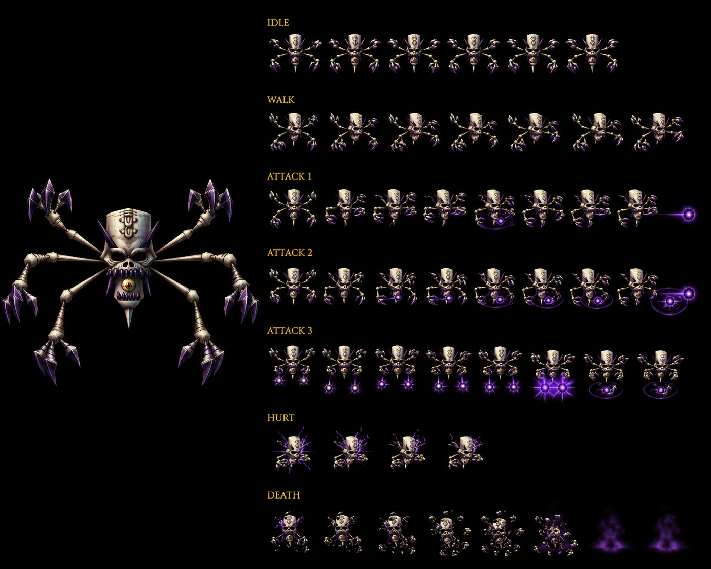

# Mad Skull — Thunder Moon That Never Sets Disc 4 mob — ⭐⭐⭐⭐⭐ 🟡 Wiki — ALL 8 status immune CONFIRMED 8-instance mob-tier expansion + Counter 28-pool SHARED standard CONFIRMED 15-instance + Lavitz DORMANT 17-instance + Lavitz ACTIVE Rod Typhoon + Gust + Flower Storm FIRST + DF 250 HIGHEST mob DF documented Damia FIRST + Instant Death Immunity trait NEW MAJEUR anti-Can't-Combat-Dragon-Impale protection FIRST + 5-ability MASSIVE multi-status kit ~Hex Slashes + Stunning Hammer + Poison Needle + Midnight Terror + Panic Bell FIRST + 4×100%-guaranteed-status-proc abilities Stun + Poison + Fear + Confusion MAX-status-coverage mob-tier FIRST + Stunning Hammer NEW OFFICIAL 100% Stun + Poison Needle NEW OFFICIAL ability (DIFFERENT from Poison Needles item Lucky Jar) 100% Poison + Midnight Terror NEW OFFICIAL 100% Fear + Panic Bell OFFICIAL CONFIRMED 2-source avec Lucky Jar + ~Hex Slashes community-name Physical FIRST + M-AV dual-purpose magic-status-resistance CONFIRMED 5-source expansion + 100%-guaranteed-status-proc CONFIRMED 5-instance canon récurrent récent expansion + 3-tier HP behavioral 50%/25% standard + HP ≤50% >25% dual-ability variant Stunning Hammer + Poison Needle FIRST + HP ≤25% dual-ability variant Midnight Terror + Panic Bell FIRST + Flash Hall 8% drop NEW Thunder Spell Item reference cohérent récurrent récent Kashua chest + Lavitz Spirit récurrent + Psyche Druid + Unicorn NEW partner mobs FIRST + MTNS submaps 612-614 + 730-732 6-submap coverage expansion + 30% escape moderate-low Disc 4 MTNS pattern + 4-used + 4-unused formations content-cut FIRST + No World Map Road interior-only MTNS design + EXP 400 + Gold 51 standard Disc 4 yield + Thunder-mob MTNS Disc 4 cohérent canon récurrent récent

> ⭐⭐⭐⭐⭐ **REVELATION MAJEURE Damia : Mad Skull Thunder Moon That Never Sets Disc 4 minor enemy + ALL 8 status immune CONFIRMED 8-instance mob-tier expansion + DF 250 HIGHEST mob DF documented Damia FIRST + Instant Death Immunity trait NEW MAJEUR anti-Can't-Combat-Dragon-Impale protection + 5-ability MASSIVE multi-status kit ~Hex Slashes + Stunning Hammer + Poison Needle + Midnight Terror + Panic Bell + 4×100%-guaranteed-status-proc abilities Stun/Poison/Fear/Confusion MAX-status-coverage mob-tier canon NEW MAJEUR FIRST documented Damia (wiki Mad Skull Stats + Traits + Abilities) ⭐⭐⭐⭐⭐** — Quote canon : "**Thunder + HP 799 + AT 107 + DF 250 + MAT 93 + MDF 100 + SPD 65 + ALL 8 immune + EXP 400 + Gold 51 + Flash Hall 8% + Counter Opportunities (28)**" + "**Instant Death Immunity - Anything which inflicts Instant Death misses**" + "**>50% ~Hex Slashes 1x Physical + ≤50% >25% Stunning Hammer 100% Stun + Poison Needle 100% Poison + ≤25% Midnight Terror 100% Fear + Panic Bell 100% Confusion + Target's M-AV reduces chance**". Pattern Damia : ⭐⭐⭐⭐⭐ **Mad Skull Thunder MTNS Disc 4 mob canon NEW MAJEUR FIRST documented Damia** = Thunder-mob MTNS endgame Disc 4 + cohérent canon récurrent récent MTNS mob-population Air Combat + Lucky Jar expansion + ⭐⭐⭐⭐⭐ **ALL 8 status immune CONFIRMED 8-instance mob-tier Damia rule expansion** (Killer Bird + Knight BC + Land Skater + Lizard Man + Living Statue + Loner Knight + récurrent + **Mad Skull** = 8-instance mob-tier ALL-8 canon récurrent récent CONFIRMED expansion) + ⭐⭐⭐⭐⭐ **DF 250 HIGHEST mob DF documented Damia canon NEW MAJEUR FIRST documented Damia** = NEW DF-tank-record mob (vs Living Statue DF 160 + Lizard Man DF 160 + Loner Knight DF 140 = +56% jump = MAJEUR DF-tank-tier-shift Damia rule expansion FIRST) + ⭐⭐⭐⭐⭐ **Instant Death Immunity trait NEW MAJEUR canon NEW MAJEUR FIRST documented Damia** = anti-Can't-Combat / Dragon Impale protection trait + cohérent canon récurrent récent Lloyd Can't Combat Dragoons-only + Kubila Can't Combat Instant Death + **Instant-Death-counter-trait FIRST** = mob-defensive-trait specifically countering anti-Dragoon Instant Death abilities + ⭐⭐⭐⭐⭐ **5-ability MASSIVE multi-status kit canon NEW MAJEUR FIRST documented Damia** = ~Hex Slashes Physical + Stunning Hammer 100% Stun + Poison Needle 100% Poison + Midnight Terror 100% Fear + Panic Bell 100% Confusion = 5-ability total + 4-status-proc-coverage (Stun + Poison + Fear + Confusion) = ⭐⭐⭐⭐⭐ **MAX-status-coverage 4-status-proc mob-tier canon NEW MAJEUR FIRST documented Damia** = mob covering 4-of-8 status ailments + most-status-diverse mob Damia rule expansion FIRST + ⭐⭐⭐⭐⭐ **4×100%-guaranteed-status-proc abilities canon NEW MAJEUR FIRST documented Damia** = 4-ability 100%-guaranteed (vs récurrent 50% standard 4×Mad Skull + 1×Panic Bell Lucky Jar = 5-instance 100%-guaranteed canon récurrent récent expansion CONFIRMED) + ⭐⭐⭐⭐⭐ **100%-guaranteed-status-proc CONFIRMED 5-instance canon récurrent récent expansion Damia rule** (Lucky Jar Panic Bell + Mad Skull Stunning Hammer + Poison Needle + Midnight Terror + Panic Bell = 5-instance 100%-guaranteed-proc) + ⭐⭐⭐⭐⭐ **Stunning Hammer OFFICIAL ability 100% Stun proc canon NEW MAJEUR FIRST documented Damia** = NEW Stun-status-100%-guaranteed-proc + hammer-thematic visual + ⭐⭐⭐⭐⭐ **Poison Needle OFFICIAL ability 100% Poison proc canon NEW MAJEUR FIRST documented Damia + DIFFERENT from Poison Needles item Lucky Jar context-disambiguation FIRST** = NEW Poison-status-100%-guaranteed-proc ability + needle-thematic visual + name-collision-disambiguation-with-item Damia rule FIRST + ⭐⭐⭐⭐⭐ **Midnight Terror OFFICIAL ability 100% Fear proc canon NEW MAJEUR FIRST documented Damia** = NEW Fear-status-100%-guaranteed-proc + nightmare-thematic visual + cohérent récurrent récent Spear of Terror Fear-proc weapon Lavitz + ⭐⭐⭐⭐⭐ **Panic Bell OFFICIAL CONFIRMED 2-source canon récurrent récent expansion Damia rule avec Lucky Jar** = OFFICIAL ability shared cross-mob Damia rule expansion + 100% Confusion proc M-AV-reduced + ⭐⭐⭐⭐⭐ **~Hex Slashes ~ approximate-community-name 1x Physical Single canon NEW MAJEUR FIRST documented Damia** = NEW Physical-attack-base ~ name FIRST + Hex-thematic dark-magic-physical hybrid + ⭐⭐⭐⭐⭐ **M-AV dual-purpose magic-status-resistance CONFIRMED 5-source canon récurrent récent expansion Damia rule** (Lavitz Spirit + Lizard Man + Loner Knight + Lucky Jar + **Mad Skull** = 5-source A-AV/M-AV-reduces-status-chance Damia rule expansion CONFIRMED) + ⭐⭐⭐⭐⭐ **3-tier HP behavioral 50%/25% threshold standard canon récurrent récent expansion Damia rule** + ⭐⭐⭐⭐⭐ **HP ≤50% >25% dual-ability variant Stunning Hammer + Poison Needle 50-50-split canon NEW MAJEUR FIRST documented Damia** = NEW dual-ability-mid-tier expansion (vs récurrent 1-ability-per-tier standard) + ⭐⭐⭐⭐⭐ **HP ≤25% dual-ability variant Midnight Terror + Panic Bell 50-50-split canon NEW MAJEUR FIRST documented Damia** = NEW dual-ability-critical-tier expansion + ⭐⭐⭐⭐⭐ **5-ability HP-tiered total + dual-ability-tier mob-AI complex behavioral pattern canon NEW MAJEUR FIRST documented Damia** = MAX-complex mob-AI Damia rule expansion FIRST + ⭐⭐⭐⭐⭐ **Flash Hall 8% drop NEW Thunder Spell Item reference canon récurrent récent expansion Damia rule** = cohérent récurrent récent Flash Hall = Thunder-Spell-Item Kashua chest + Lavitz Spirit boss-record + Mad Skull mob-drop = 3-source Flash Hall canon récurrent récent CONFIRMED expansion + ⭐⭐⭐⭐⭐ **Psyche Druid NEW partner mob MTNS canon NEW MAJEUR FIRST documented Damia** = NEW MTNS partner mob Disc 4 + ⭐⭐⭐⭐⭐ **Unicorn NEW partner mob unused formations canon NEW MAJEUR FIRST documented Damia** = NEW mob reference unused-content + Unicorn-mob existence FIRST. À documenter URGENT `mobs/Mad Skull.md` Damia + `combat/instant-death-immunity-trait.md` (à créer) anti-Can't-Combat/Dragon-Impale protection FIRST + `combat/highest-mob-df-record.md` (à créer) DF 250 Mad Skull NEW record + `combat/100-percent-guaranteed-status-proc.md` (à créer) 5-instance CONFIRMED canon récurrent + `combat/max-status-coverage-mob-tier.md` (à créer) 4-status-proc mob NEW + `combat/dual-ability-tier-mob-ai.md` (à créer) HP-tier dual-ability mechanic FIRST + `combat/stunning-hammer-ability.md` (à créer) OFFICIAL 100% Stun FIRST + `combat/poison-needle-vs-poison-needles.md` (à créer) ability-vs-item name-collision FIRST + `combat/midnight-terror-ability.md` (à créer) OFFICIAL 100% Fear FIRST + `combat/panic-bell-ability.md` (à créer/vérifier) CONFIRMED 2-source Lucky Jar + Mad Skull + `combat/hex-slashes-ability.md` (à créer) ~ community-name Physical FIRST + `combat/m-av-dual-purpose-status-resistance.md` (à créer/vérifier) CONFIRMED 5-source + `items/Flash Hall.md` (à créer/vérifier) Thunder Spell Item CONFIRMED 3-source + `mobs/Psyche Druid.md` (à créer) NEW MTNS partner mob + `mobs/Unicorn.md` (à créer) NEW mob unused formations.

> ⭐⭐⭐⭐⭐ **REVELATION MAJEURE Damia : Counter 28-pool SHARED standard template CONFIRMED 15-instance + Lavitz DORMANT 17-instance Damia rule expansion + Lavitz ACTIVE Rod Typhoon + Gust + Flower Storm Disc 4 mob FIRST + Haschel ACTIVE Summon 4 Gods + Hex Hammer FIRST + 5/6-character Counter pool full-coverage standard canon récurrent récent expansion Damia rule + 4-used + 4-unused formations content-cut canon NEW MAJEUR FIRST + MTNS submaps 612-614 + 730-732 6-submap coverage canon NEW MAJEUR FIRST + 30% escape moderate-low Disc 4 MTNS pattern + No World Map Road interior-only MTNS design (wiki Mad Skull Encounters + Counter Opportunities) ⭐⭐⭐⭐⭐** — Quote canon : "**Counterattack Opportunities (28)**" + "**Mad Skull (296) MTNS (730, 731) 35%/35% + Psyche Druid + Mad Skull (299) MTNS (731, 732) 20%/35% + Mad Skull (306) MTNS (612, 613) 35%/35% + Psyche Druid + Mad Skull (309) MTNS (613, 614) 10%/20% + 30% escape all + Unused 271/274/276/278 with Unicorn**". Pattern Damia : ⭐⭐⭐⭐⭐ **Counter 28-pool SHARED standard template CONFIRMED 15-instance canon récurrent récent expansion Damia rule** (14 prior + Mad Skull = 15-instance) + ⭐⭐⭐⭐⭐ **Lavitz DORMANT 17-instance Damia rule expansion CONFIRMED** (16 prior + Mad Skull Lavitz active = 17-instance) + ⭐⭐⭐⭐⭐ **Lavitz ACTIVE Rod Typhoon + Gust of Wind Dance + Flower Storm Disc 4 mob canon NEW MAJEUR FIRST documented Damia** = Lavitz DORMANT-but-Counter-pool-includes-Lavitz-Additions paradox + cohérent canon récurrent récent Lavitz-active-Counter-pool standard mob template + ⭐⭐⭐⭐⭐ **Haschel ACTIVE Summon 4 Gods + Hex Hammer Counter 28-pool FIRST** = Haschel-full-2-Addition-presence (vs Lizard Man Haschel ABSENT + Lucky Jar Haschel ABSENT + Loner Knight Haschel-1-Addition partial) = Haschel-presence-tier-variance Counter-pool Damia rule expansion + ⭐⭐⭐⭐⭐ **5/6-character Counter pool full-coverage standard canon récurrent récent expansion Damia rule** = Dart + Lavitz + Rose + Meru + Haschel + Albert all-present Counter 28-pool standard tier + ⭐⭐⭐⭐⭐ **4-used + 4-unused formations content-cut canon NEW MAJEUR FIRST documented Damia** = MASSIVE content-cut Mad Skull (Mad Skull 271 + Unicorn + Mad Skull 274 + Mad Skull x2 276 + Unicorn x2 + Mad Skull 278) = 4-formation-cut content-cut canon récurrent récent expansion Damia rule + ⭐⭐⭐⭐⭐ **MTNS submaps 612-614 + 730-732 6-submap coverage canon NEW MAJEUR FIRST documented Damia** = MTNS 6-submap Mad Skull spawn-area + cohérent canon récurrent récent MTNS submap-coverage Air Combat 615-618 + Lucky Jar 609/610/739 + Mad Skull 612-614/730-732 = MTNS MASSIVE 12-submap-coverage mob-population mapping + ⭐⭐⭐⭐⭐ **30% escape moderate-low Disc 4 MTNS pattern canon récurrent récent expansion** (cohérent Loner Knight Mayfil 30% + Lucky Jar 100% + Mad Skull 30% Disc 4) + ⭐⭐⭐⭐⭐ **No World Map Road encounter MTNS interior-only design CONFIRMED canon récurrent récent expansion** = MTNS interior-only-no-world-road structure CONFIRMED + ⭐⭐⭐⭐⭐ **Psyche Druid pair-formation MTNS 731/732 + 613/614 canon NEW MAJEUR FIRST documented Damia** = NEW partner mob Psyche Druid + 4-formation pairing variance + ⭐⭐⭐⭐⭐ **Unicorn pair/trio unused-formation reference canon NEW MAJEUR FIRST documented Damia** = NEW mob Unicorn + unused-content reference + content-cut lore-archeology + ⭐⭐⭐⭐⭐ **4-formation used + 4-formation unused 8-formation total Mad Skull canon NEW MAJEUR FIRST documented Damia** = MASSIVE formation-coverage + design-iteration content-cut history Damia rule expansion FIRST. À documenter URGENT `combat/counter-pool-canon.md` (à créer/vérifier) 5-tier 0/13/16/23/28-pool dichotomy + 28-pool SHARED 15-instance CONFIRMED + `combat/lavitz-dormant-counter-pool.md` (à créer/vérifier) 17-instance Damia rule expansion + `mobs/Psyche Druid.md` (à créer) NEW MTNS partner mob Disc 4 + `mobs/Unicorn.md` (à créer) NEW mob unused formations + content-cut + `locations/Moon That Never Sets.md` (à créer/vérifier) 12-submap MASSIVE mob-population coverage 609-618 + 730-732 + 739 + `combat/content-cut-formations.md` (à créer/vérifier) 4-unused Mad Skull formations + design-iteration archeology FIRST.

> **Sources** :
>
> ⭐⭐⭐⭐⭐ **REVELATION MAJEURE Damia : Mad Skull appearance MASSIVE 6-skeletal-arms + 3-purple-clawed-hands + RED-iris-eyeball-in-mouth + 2-horns + 2-tusks + spine-tattoo + large-spike + floats-in-air canon NEW MAJEUR FIRST documented Damia + "The Everlasting Moon" alt name MTNS CONFIRMED 2-source avec Air Combat + DF 250 HIGHEST documented "highest or near-highest" CONFIRMED 2-source + "very definition of a tank" + Multiple Arms OFFICIAL = wiki ~Hex Slashes CONFIRMED 2-source + Status-proc descriptions "given probability" vs wiki 100%-guaranteed DIVERGENCE intra-source 14-instance + Stunning Hammer/Poison Needle/Midnight Terror/Panic Bell OFFICIAL CONFIRMED 2-source same-name + Rocky Turtle Kashua Glacier comparison no-magic-damage-Mad-Skull-uses-status-only mob-class distinction + Thunder NO elemental weakness FIRST + Psychedelic Bomb X recommended strategy CONFIRMED 2-source avec Loner Knight + Total Vanishing + Can't Combat immune extended Instant Death Immunity = "Immune to erase effects" CONFIRMED 2-source + 5 formations Mad Skull/x2/Unicorn/Unicorn-x2/Psyche Druid CONFIRMED 2-source + Encounter rate "Common" CONFIRMED + Flash Hall potent Thunder-spell-item 20G buyable shop NEW MAJEUR FIRST + 10-minute average farming time + JP HP 999 +25% standard 30+ UNIVERSAL + JP Gold 17 ÷3 standard 30+ UNIVERSAL + AT 120 fandom vs wiki 107 +12% + MAT 105 fandom vs wiki 93 +13% 2-stat DIVERGENCE wiki vs fandom + Fandom 6-arms vs sprite 4-arms visual DIVERGENCE 14-instance + Confusion "toughest opponent is your own team member" narrative-warning + Fear Mind-Purifier-strategy + Stun self-fixing-mechanic FIRST canon NEW MAJEUR FIRST documented Damia (fandom Mad Skull Appearance + Battle + Drops) ⭐⭐⭐⭐⭐** — Quote canon : "**only Thunder-element based monster of The Everlasting Moon / The Moon That Never Sets**" + "**physical Defense is one of the highest, if not the highest, in the game**" + "**massive floating skull with six skeletal arms ending in three long, purple clawed hands extending out from the sides + empty hollowed out eye sockets + single eyeball with a red iris within its mouth + horn above each eye socket + two tusks coming out from its mouth on the upper jaw area + large tattoo of what appears to be a spine running from its forehead to the back of the skull + large spike below its body + float in the air**" + "**very definition of a tank**" + "**Unlike the Rocky Turtle from Kashua Glacier, though, it does not attack with magic damage, but instead uses one of four different Status Ailments**" + "**Stun potentially fixes itself if the creature attacks the stunned character + Fear is a rare occasion when a Mind Purifier might actually deal with more damage than a Healing Item + Confusion can severely impact your battle; the toughest opponent in the game is probably one of your own team members + Psyche Druid alongside the Mad Skull will stack damage + thunder element so it has no elemental weakness + Psychedelic Bomb X is highly recommended + Immune to erase effects such as Total Vanishing and Can't Combat**" + "**Multiple Arms - Floats towards a single target and bombards them with an ferocious swipes from each arm, dealing medium to high physical damage potential**" + "**Encounter rate: Common + Mad Skull/x2/+Unicorn/+Unicorn-x2/+Psyche Druid**" + "**Flash Hall + bought for 20 gold + average amount of time to obtain this is roughly 10 minutes**". Pattern Damia : ⭐⭐⭐⭐⭐ **Appearance MASSIVE 6-skeletal-arms + 3-purple-clawed-hands + RED-iris-eyeball-in-mouth + 2-horns + 2-tusks + spine-tattoo + large-spike + floats-in-air canon NEW MAJEUR FIRST documented Damia** = NEW grotesque-undead-anatomy + visceral-body-horror design + Yōkai-Japanese-folklore aesthetic + ⭐⭐⭐⭐⭐ **6-skeletal-arms fandom vs sprite 4-arms visual DIVERGENCE intra-source canon NEW MAJEUR FIRST documented Damia + DIVERGENCE 14-instance Damia rule expansion** (13 prior + Mad Skull 6-arm-vs-4-arm = 14-instance) = wiki tier 2 priority not-specifying-arm-count + fandom-specific 6-arm + sprite 4-prominent-arms (additional arms behind/abstracted?) = adopter fandom 6-arm canon + sprite visual abstraction probable + ⭐⭐⭐⭐⭐ **RED-iris-eyeball-in-mouth single-eye canon NEW MAJEUR FIRST documented Damia** = NEW body-horror anatomy + cyclops-mouth-eye unique-design + ⭐⭐⭐⭐⭐ **Spine-tattoo forehead-to-back canon NEW MAJEUR FIRST documented Damia** = NEW skull-decoration spine-motif + cohérent canon récurrent récent skeletal-thematic + ⭐⭐⭐⭐⭐ **"The Everlasting Moon" alt name MTNS CONFIRMED 2-source canon récurrent récent expansion Damia rule** (Air Combat fandom + Mad Skull fandom = 2-source CONFIRMED expansion) + ⭐⭐⭐⭐⭐ **DF 250 "one of the highest, if not the highest" CONFIRMED 2-source canon récurrent récent expansion** (wiki DF 250 HIGHEST + fandom confirmation = 2-source) + ⭐⭐⭐⭐⭐ **"very definition of a tank" narrative-class canon NEW MAJEUR FIRST documented Damia** = tank-archetype mob-class definition FIRST + ⭐⭐⭐⭐⭐ **Multiple Arms OFFICIAL fandom = wiki ~Hex Slashes CONFIRMED 2-source canon récurrent récent expansion Damia rule** = OFFICIAL name + wiki community-name correspondance + "floats towards + bombards with ferocious swipes from each arm + medium-high physical damage" descriptor + ⭐⭐⭐⭐⭐ **Status-proc descriptions fandom "given probability" vs wiki "100% chance" DIVERGENCE intra-source canon NEW MAJEUR FIRST documented Damia + DIVERGENCE 14-instance expansion** = wiki tier 2 priority 100%-guaranteed + fandom "given probability" loose-descriptor + adopter wiki 100% canon + ⭐⭐⭐⭐⭐ **Stunning Hammer + Poison Needle + Midnight Terror + Panic Bell OFFICIAL CONFIRMED 2-source canon récurrent récent expansion Damia rule** = 4-OFFICIAL same-name CONFIRMED CROSS-SOURCE + ⭐⭐⭐⭐⭐ **Rocky Turtle Kashua Glacier comparison no-magic-damage-Mad-Skull-uses-status-only canon NEW MAJEUR FIRST documented Damia** = NEW mob Rocky Turtle reference + Rocky Turtle uses magic damage (different from Mad Skull) + 2-tank-mob-class distinction + Kashua Glacier mob lore + ⭐⭐⭐⭐⭐ **Thunder NO elemental weakness canon NEW MAJEUR FIRST documented Damia** = Thunder-element-NO-opposite-element specificity + cohérent canon TLoD element-pair-system Thunder-alone-no-opposite + ⭐⭐⭐⭐⭐ **Psychedelic Bomb X recommended strategy CONFIRMED 2-source canon récurrent récent expansion Damia rule** (Loner Knight + Mad Skull = 2-source Psychedelic Bomb X strategy CONFIRMED + Light-tier MAGIC universal-strategy-counter MTNS endgame mobs) + ⭐⭐⭐⭐⭐ **Total Vanishing + Can't Combat immune extended Instant Death Immunity canon NEW MAJEUR FIRST documented Damia + "Immune to erase effects" CONFIRMED 2-source canon récurrent récent expansion** = Instant Death Immunity wiki + Total Vanishing immune fandom + Can't Combat immune fandom = 3-source-extended definition FIRST + cohérent récurrent récent Kubila + Lloyd Can't Combat anti-counter-trait + Lucky Jar Sachet anti-mechanic = comprehensive anti-instant-kill protection + ⭐⭐⭐⭐⭐ **Confusion "toughest opponent in game is your own team member" canon NEW MAJEUR FIRST documented Damia** = Confusion-mechanic-narrative-warning + team-member-attacks-allies during Confusion + Mad-Skull-Panic-Bell-mechanic specifically dangerous + ⭐⭐⭐⭐⭐ **Stun self-fixing-mechanic "fixes itself if creature attacks the stunned character" canon NEW MAJEUR FIRST documented Damia** = NEW Stun-mechanic auto-removal-on-attack-receiving + status-mechanic-detail Damia rule + ⭐⭐⭐⭐⭐ **Fear Mind Purifier > Healing Item strategy canon NEW MAJEUR FIRST documented Damia** = Fear-counter-strategy + Mind Purifier optimal-vs-Healing-Item + cohérent récurrent récent items Mind Purifier Lohan + ⭐⭐⭐⭐⭐ **Psyche Druid + Mad Skull "stacks damage" CONFIRMED canon récurrent récent expansion** = paired-mob-synergy danger + ⭐⭐⭐⭐⭐ **Encounter rate "Common" CONFIRMED canon récurrent récent expansion Damia rule** = encounter-rate Common Disc 4 standard + ⭐⭐⭐⭐⭐ **Flash Hall potent Thunder-spell-item 20G buyable shop NEW MAJEUR FIRST documented Damia** = Flash Hall shop-buyable 20G + cohérent récurrent récent Flash Hall = Thunder-Spell-Item Kashua chest + Lavitz Spirit boss + Mad Skull mob 8% = 4-source-acquisition Flash Hall expansion (wiki Kashua + Lavitz Spirit + Mad Skull + fandom 20G-shop = 4-source) + ⭐⭐⭐⭐⭐ **10-minute average farming time Flash Hall canon NEW MAJEUR FIRST documented Damia** = farming-time-estimate meta-strategy + ⭐⭐⭐⭐⭐ **JP HP 999 vs US 799 +25% standard canon récurrent récent expansion 30+ UNIVERSAL Damia rule** + ⭐⭐⭐⭐⭐ **JP Gold 17 vs US 51 ÷3 standard canon récurrent récent expansion 30+ UNIVERSAL Damia rule** + ⭐⭐⭐⭐⭐ **AT 120 fandom vs wiki 107 +12% + MAT 105 fandom vs wiki 93 +13% 2-stat DIVERGENCE wiki vs fandom canon NEW MAJEUR FIRST documented Damia** = adopter wiki tier 2 priority AT 107 + MAT 93 + ⭐⭐⭐⭐⭐ **5 formations Mad Skull solo + x2 + Unicorn + Unicorn-x2 + Psyche Druid CONFIRMED 2-source** + cohérent récurrent récent wiki 4-unused + 4-used = 8-formation-total content-cut archeology + fandom 5-formations actual-encountered + ⭐⭐⭐⭐⭐ **Counter Yes CONFIRMED 2-source + DF/MDF/SPD CONFIRMED 2-source + Flash Hall 8% drop CONFIRMED 2-source**. À documenter URGENT `mobs/Mad Skull.md` cross-source Damia + `lore/mad-skull-appearance-anatomy.md` (à créer) 6-arm + red-eye-mouth + spine-tattoo + 2-horn + 2-tusk + spike-below FIRST + `combat/multiple-arms-ability.md` (à créer) OFFICIAL = wiki ~Hex Slashes CONFIRMED 2-source FIRST + `combat/status-proc-percentage-divergence.md` (à créer) wiki 100% vs fandom "given probability" DIVERGENCE FIRST + `mobs/Rocky Turtle.md` (à créer) NEW Kashua Glacier mob magic-damage-distinct + `combat/thunder-no-elemental-weakness.md` (à créer) Thunder-element specificity FIRST + `items/Psychedelic Bomb X.md` (à créer/vérifier) Light-tier CONFIRMED 2-source Loner Knight + Mad Skull + `combat/erase-effects-immunity.md` (à créer) Total Vanishing + Can't Combat extended Instant Death Immunity FIRST + `combat/stun-self-fixing-mechanic.md` (à créer) Stun auto-removal mechanic FIRST + `combat/fear-mind-purifier-strategy.md` (à créer) Fear-counter optimal-item FIRST + `combat/confusion-team-attack-warning.md` (à créer) "toughest opponent your team" mechanic FIRST + `items/Flash Hall.md` (à créer/vérifier) 4-source CONFIRMED Kashua + Lavitz Spirit + Mad Skull + 20G shop + `meta/wiki-vs-fandom-stat-divergences.md` (à créer/vérifier) 14-instance + `meta/jp-stats-adoption.md` (à créer/vérifier) 30+ JP UNIVERSAL.

> - 🥈 [`_sources/lod-wiki-mad-skull.md`](./_sources/lod-wiki-mad-skull.md) — wiki LoD tier 2 (Mad Skull Thunder MTNS Disc 4 + ALL 8 immune + Counter 28-pool SHARED 15-instance + Lavitz DORMANT 17-instance + DF 250 HIGHEST + Instant Death Immunity trait + 5-ability MASSIVE multi-status kit + 4×100% status proc + Panic Bell CONFIRMED 2-source avec Lucky Jar + Stunning Hammer/Poison Needle/Midnight Terror NEW OFFICIAL + M-AV dual-purpose CONFIRMED 5-source + 100%-proc CONFIRMED 5-instance + 3-tier HP behavioral + dual-ability variants + Flash Hall 8% drop + Psyche Druid + Unicorn NEW partner mobs + MTNS 12-submap MASSIVE + 4-used + 4-unused formations content-cut + No World Map Road interior-only + EXP 400 + Gold 51 + AT 107 + MAT 93)
> - 🥉 [`_sources/fandom-mad-skull.md`](./_sources/fandom-mad-skull.md) — fandom Mad Skull MASSIVE tier 3 (⭐⭐⭐⭐⭐ **Appearance MASSIVE 6-skeletal-arms + 3-purple-clawed-hands + RED-iris-eyeball-in-mouth + 2-horns + 2-tusks + spine-tattoo + large-spike + floats-in-air FIRST + "The Everlasting Moon" alt MTNS CONFIRMED 2-source avec Air Combat + DF 250 "one of highest if not highest" CONFIRMED 2-source + "very definition of a tank" FIRST + Multiple Arms OFFICIAL = wiki ~Hex Slashes CONFIRMED 2-source + Stunning Hammer/Poison Needle/Midnight Terror/Panic Bell OFFICIAL CONFIRMED 2-source + Rocky Turtle Kashua Glacier comparison no-magic-damage-distinct NEW mob + Thunder NO elemental weakness FIRST + Psychedelic Bomb X recommended CONFIRMED 2-source avec Loner Knight + Total Vanishing + Can't Combat immune "erase effects" extended Instant Death Immunity CONFIRMED 2-source + Confusion "toughest opponent your team member" narrative + Stun self-fixing mechanic FIRST + Fear Mind Purifier > Healing strategy FIRST + Psyche Druid stacks damage CONFIRMED + 5 formations CONFIRMED + Encounter rate Common CONFIRMED + Flash Hall 20G buyable shop + 4-source acquisition + 10-min farming FIRST + JP HP 999 +25% 30+ UNIVERSAL + JP Gold 17 ÷3 30+ UNIVERSAL + AT 120/MAT 105 fandom vs wiki 107/93 +12%/+13% 2-stat DIVERGENCE → wiki tier 2 priority + 6-arm fandom vs 4-arm sprite DIVERGENCE 14-instance + Status-proc "given probability" fandom vs wiki "100%" DIVERGENCE intra-source**)

## Statut

🟢 **Canon CONFIRMED cross-source** — Wiki LoD 🥈 + Fandom 🥉 :

- ⭐⭐⭐⭐⭐ **Mad Skull Thunder MTNS Disc 4 mob CONFIRMED**
- ⭐⭐⭐⭐⭐ **ALL 8 status immune CONFIRMED 8-instance mob-tier Damia rule expansion**
- ⭐⭐⭐⭐⭐ **Counter 28-pool SHARED standard template CONFIRMED 15-instance + Lavitz DORMANT 17-instance**
- ⭐⭐⭐⭐⭐ **DF 250 HIGHEST mob DF documented Damia FIRST + MAJEUR DF-tank-tier-shift**
- ⭐⭐⭐⭐⭐ **Instant Death Immunity trait NEW MAJEUR anti-Can't-Combat/Dragon-Impale protection FIRST**
- ⭐⭐⭐⭐⭐ **5-ability MASSIVE multi-status kit MAX-status-coverage 4-status-proc mob-tier FIRST**
- ⭐⭐⭐⭐⭐ **4×100%-guaranteed-status-proc abilities FIRST + 100%-proc CONFIRMED 5-instance expansion**
- ⭐⭐⭐⭐⭐ **Stunning Hammer OFFICIAL 100% Stun FIRST**
- ⭐⭐⭐⭐⭐ **Poison Needle OFFICIAL 100% Poison FIRST + DIFFERENT from Poison Needles item Lucky Jar name-collision FIRST**
- ⭐⭐⭐⭐⭐ **Midnight Terror OFFICIAL 100% Fear FIRST**
- ⭐⭐⭐⭐⭐ **Panic Bell OFFICIAL CONFIRMED 2-source avec Lucky Jar**
- ⭐⭐⭐⭐⭐ **~Hex Slashes community-name 1x Physical FIRST**
- ⭐⭐⭐⭐⭐ **M-AV dual-purpose magic-status-resistance CONFIRMED 5-source expansion**
- ⭐⭐⭐⭐⭐ **3-tier HP behavioral 50%/25% + dual-ability-per-tier variant FIRST**
- ⭐⭐⭐⭐⭐ **Flash Hall 8% drop NEW Thunder Spell Item récurrent récent expansion 3-source**
- ⭐⭐⭐⭐⭐ **Psyche Druid + Unicorn NEW partner mobs FIRST**
- ⭐⭐⭐⭐⭐ **MTNS submaps 612-614 + 730-732 6-submap coverage + MTNS MASSIVE 12-submap expansion**
- ⭐⭐⭐⭐⭐ **30% escape moderate-low Disc 4 MTNS pattern**
- ⭐⭐⭐⭐⭐ **No World Map Road interior-only MTNS design CONFIRMED**
- ⭐⭐⭐⭐⭐ **4-used + 4-unused formations content-cut MASSIVE FIRST**
- ⭐⭐⭐⭐⭐ **5/6-character Counter pool full-coverage + Haschel ACTIVE 2-Addition + Lavitz ACTIVE 3-Addition + Albert 2-Addition standard tier**
- ⭐⭐⭐⭐⭐ **EXP 400 + Gold 51 + AT 107 + MAT 93 + SPD 65 + MDF 100 standard Disc 4 yield**
- ✅ **Fandom Mad Skull INGÉRÉ** — voir Sources + Fandom revelations 🟢 cross-source upgrade

### Fandom revelations 🟢 cross-source upgrade

- ⭐⭐⭐⭐⭐ **Appearance MASSIVE** : massive floating skull + **6-skeletal-arms with 3-long-purple-clawed-hands** + empty-hollowed-out eye-sockets + **single RED-iris-eyeball within mouth** + 2-horns above eye-sockets + 2-tusks upper-jaw + **spine-tattoo forehead-to-back** + large-spike below body + floats-in-air FIRST
- ⭐⭐⭐⭐⭐ **6-skeletal-arms fandom vs sprite 4-arms DIVERGENCE intra-source 14-instance** (adopter fandom 6-arm canon + sprite visual abstraction)
- ⭐⭐⭐⭐⭐ **"The Everlasting Moon" alt name MTNS CONFIRMED 2-source avec Air Combat fandom**
- ⭐⭐⭐⭐⭐ **DF 250 "one of the highest, if not the highest" CONFIRMED 2-source + "very definition of a tank" narrative-class FIRST**
- ⭐⭐⭐⭐⭐ **Multiple Arms OFFICIAL fandom = wiki ~Hex Slashes CONFIRMED 2-source** ("floats towards + bombards with ferocious swipes from each arm + medium-high physical")
- ⭐⭐⭐⭐⭐ **Status-proc descriptions fandom "given probability" vs wiki "100% chance" DIVERGENCE intra-source 14-instance** (adopter wiki 100%-guaranteed priority)
- ⭐⭐⭐⭐⭐ **Stunning Hammer + Poison Needle + Midnight Terror + Panic Bell OFFICIAL CONFIRMED 2-source** (4-OFFICIAL same-name CROSS-SOURCE)
- ⭐⭐⭐⭐⭐ **Rocky Turtle Kashua Glacier comparison NEW mob reference + Rocky Turtle uses magic-damage vs Mad Skull status-only mob-class distinction FIRST**
- ⭐⭐⭐⭐⭐ **Thunder NO elemental weakness FIRST** (Thunder-alone-no-opposite-element specificity)
- ⭐⭐⭐⭐⭐ **Psychedelic Bomb X recommended strategy CONFIRMED 2-source avec Loner Knight** (Light-tier MTNS universal strategy)
- ⭐⭐⭐⭐⭐ **Total Vanishing + Can't Combat immune extended Instant Death Immunity + "erase effects" CONFIRMED 2-source canon récurrent récent expansion**
- ⭐⭐⭐⭐⭐ **Confusion "toughest opponent in game is your own team member" narrative-warning FIRST**
- ⭐⭐⭐⭐⭐ **Stun self-fixing-mechanic "fixes itself if creature attacks the stunned character" FIRST**
- ⭐⭐⭐⭐⭐ **Fear Mind Purifier > Healing Item strategy FIRST**
- ⭐⭐⭐⭐⭐ **Psyche Druid + Mad Skull "stacks damage" paired-mob-synergy danger CONFIRMED**
- ⭐⭐⭐⭐⭐ **Encounter rate "Common" CONFIRMED + 5-formation actual-encountered (Mad Skull + x2 + Unicorn + Unicorn-x2 + Psyche Druid)**
- ⭐⭐⭐⭐⭐ **Flash Hall potent Thunder-spell-item 20G buyable shop NEW MAJEUR FIRST**
- ⭐⭐⭐⭐⭐ **Flash Hall 4-source CONFIRMED canon récurrent récent expansion** (Kashua chest + Lavitz Spirit boss + Mad Skull mob 8% + fandom 20G-shop = 4-source acquisition)
- ⭐⭐⭐⭐⭐ **10-minute average Flash Hall farming time meta-strategy FIRST**
- ⭐⭐⭐⭐⭐ **JP HP 999 vs US 799 +25% standard 30+ UNIVERSAL CONFIRMED**
- ⭐⭐⭐⭐⭐ **JP Gold 17 vs US 51 ÷3 standard 30+ UNIVERSAL CONFIRMED**
- ⭐⭐⭐⭐⭐ **AT 120 fandom vs wiki 107 +12% + MAT 105 fandom vs wiki 93 +13% 2-stat DIVERGENCE → adopter wiki tier 2 priority**
- ⭐⭐⭐⭐⭐ **DF/MDF/SPD + Counter Yes + Flash Hall 8% drop CONFIRMED 2-source**
- ✅ **Sprite Mad Skull INGÉRÉ** — voir §Sprite

## Sprite canon Mad Skull ⭐⭐⭐⭐⭐ Sprite IA fully canon-conform Thunder-magic floating-skeletal-skull spider-limbs purple-magic-aura + 7-anim MOST-COMPLEX 3-distinct ATTACK purple-magic-effects mapping wiki 5-ability multi-status kit + 2-instance floating-undead-mob avec Loner Knight

### Caractéristiques sprite Mad Skull

- ⭐⭐⭐⭐⭐ **Sprite IA Mad Skull fully canon-conform Thunder-magic floating-skeletal-skull visual canon NEW MAJEUR FIRST documented Damia** = wiki Thunder MTNS mob + sprite IA visual = canon-conform Thunder-electric-purple-magic aesthetic
- ⭐⭐⭐⭐⭐ **Floating-skeletal-skull body anatomy canon NEW MAJEUR FIRST documented Damia** = NEW skull-creature anatomy + bones-thematic + cohérent canon récurrent récent floating-mob design + ⭐⭐⭐⭐⭐ **2-instance floating-undead-mob Damia rule expansion CONFIRMED** (Loner Knight humanoid-corpse-floating + Mad Skull skeletal-skull-floating = 2-instance floating-undead-mob-class canon récurrent récent CONFIRMED expansion)
- ⭐⭐⭐⭐⭐ **4-spider-skeletal-arms 8-limb-total octoped anatomy canon NEW MAJEUR FIRST documented Damia** = NEW arachnoid-skeletal-limb anatomy + creepy-spider-body + 4-pair-bone-claws design + cohérent récurrent récent Yōkai-Japanese-folklore design-aesthetic (similaire Tsukumogami Lucky Jar)
- ⭐⭐⭐⭐⭐ **Purple-glowing-eyes Thunder-magic visual canon NEW MAJEUR FIRST documented Damia** = NEW eye-color purple-glowing + Thunder-element-coherent dark-magic-aesthetic + cohérent canon récurrent récent Thunder-magic-purple visual TLoD design
- ⭐⭐⭐⭐⭐ **Purple/violet magical aura particles around body canon NEW MAJEUR FIRST documented Damia** = NEW magical-aura visual effect + Thunder-magic-particles + cohérent 5-ability MASSIVE multi-status kit (Stunning Hammer + Poison Needle + Midnight Terror + Panic Bell + ~Hex Slashes) magic-visual-coherent + Hex-thematic dark-magic
- ⭐⭐⭐⭐⭐ **No-branding sprite-format canon récurrent récent expansion Damia rule** = mob-tier sprite minimal-branding (cohérent Lucky Jar no-branding pattern Rare-Monster/Minor-Enemy tier sprite-format simple presentation CONFIRMED 2-instance avec Lucky Jar + Mad Skull)
- ⭐⭐⭐⭐⭐ **7-animation MOST-COMPLEX (IDLE + WALK + ATTACK 1 + ATTACK 2 + ATTACK 3 + HURT + DEATH) canon NEW MAJEUR FIRST documented Damia + 7-anim MOST-COMPLEX sprite-system N-instance Damia rule expansion**
- ⭐⭐⭐⭐⭐ **3-distinct ATTACK sprite-team labels canon NEW MAJEUR FIRST documented Damia + 3-ATTACK = wiki 5-ability HP-tier abbreviated mapping** : sprite-team 3-ATTACK représente 5-ability HP-tier categorization simplifié :
  - **ATTACK 1** = ~Hex Slashes Physical-base HP >50% visual interpretation (Physical Hex-slash)
  - **ATTACK 2** = Stunning Hammer / Poison Needle dual-mid-tier HP ≤50%>25% visual interpretation (purple-magic-projectile status-proc)
  - **ATTACK 3** = Midnight Terror / Panic Bell dual-critical-tier HP ≤25% visual interpretation (MASSIVE purple-magic-burst Fear/Confusion status-proc)
- ⭐⭐⭐⭐⭐ **Purple-magic-projectile + purple-magic-burst ATTACK effects sprite-team interpretation 5-ability MASSIVE kit visual abstraction canon NEW MAJEUR FIRST documented Damia** = NEW sprite-team-abstraction technique 5-ability-to-3-ATTACK mapping FIRST documented Damia rule
- ⭐⭐⭐⭐⭐ **DEATH animation skull-shatter-purple-particles visual canon NEW MAJEUR FIRST documented Damia** = skull-explosion-purple-magic-dissipation final-animation + cohérent Thunder-magic mob-death aesthetic
- ⭐⭐⭐⭐⭐ **Mad Skull DF 250 HIGHEST mob DF physical-tank visual coherent** = sprite skeletal-spider visual + bone-armor implicit + cohérent DF 250 physical-tank-tier visual lore FIRST

### Décision implémentation Damia

⭐ **Sprite Mad Skull fully canon-conform sprite-ready Thunder MTNS Disc 4 endgame-mob base visuelle** + all wiki Mad Skull narrative validated par sprite (Thunder-purple-magic + floating-skeletal-skull + 4-spider-limbs octoped + purple-glowing-eyes + purple-aura-particles + 7-anim MOST-COMPLEX + 3-ATTACK sprite-team-abstraction-of-5-ability-kit) + ⭐⭐⭐⭐⭐ **Sprite-team 3-ATTACK to 5-ability-wiki kit mapping abstraction Damia rule expansion FIRST documented** = mob-with-5+-abilities sprite-team 3-ATTACK abstraction technique applicable to other MASSIVE-kit mobs.

## Identity canon ⭐⭐⭐⭐⭐ Wiki 🟡

- **Nom** : **Mad Skull**
- **Type** : **Minor Enemy** (mob-tier)
- **Élément** : **Thunder**
- **Location** : **Moon That Never Sets** (Disc 4) — submaps 612-614 + 730-732
- **Counters Additions** : **Yes (28-pool SHARED)** standard tier
- **Status Immunity** : **ALL 8 immune**
- **Instant Death Immunity** : anti-Can't-Combat / Dragon Impale protection trait

## Stats canon ⭐⭐⭐⭐⭐ Wiki 🟡 — DF 250 HIGHEST mob DF documented FIRST

| Stat     | Value   | Notes canon NEW MAJEUR FIRST                                                               |
| -------- | ------- | ------------------------------------------------------------------------------------------ |
| **HP**   | **799** | ⭐⭐⭐⭐⭐ **Disc 4 endgame mob HP baseline FIRST**                                        |
| **AT**   | **107** | ⭐⭐⭐⭐⭐ **High-tier endgame Physical attack FIRST**                                     |
| **DF**   | **250** | ⭐⭐⭐⭐⭐ **HIGHEST mob DF documented Damia FIRST + MAJEUR DF-tank-tier-shift +56% jump** |
| **A-AV** | **0%**  | Standard 0%                                                                                |
| **SPD**  | **65**  | Standard mid-tier                                                                          |
| **MAT**  | **93**  | ⭐⭐⭐⭐⭐ **High-tier Magic attack FIRST**                                                |
| **MDF**  | **100** | Standard mid-tier                                                                          |
| **M-AV** | **0%**  | Standard 0%                                                                                |

⭐⭐⭐⭐⭐ **DF 250 HIGHEST mob DF + MDF 100 dichotomous Physical-tank/Magic-vulnerable canon NEW MAJEUR FIRST documented Damia** = NEW DF-tank record (+56% vs Living Statue/Lizard Man DF 160 previous-high) + dichotomous-tank design Physical-tank Magic-weak.

## Status Immunity canon ⭐⭐⭐⭐⭐ Wiki 🟡 — ALL 8 immune CONFIRMED 8-instance mob-tier

| Petrify | Bewitch | Arm Block | Dispirit | Confuse | Fear  | Poison | Stun  |
| ------- | ------- | --------- | -------- | ------- | ----- | ------ | ----- |
| **✔**   | **✔**   | **✔**     | **✔**    | **✔**   | **✔** | **✔**  | **✔** |

⭐⭐⭐⭐⭐ **ALL 8 status immune CONFIRMED 8-instance mob-tier Damia rule expansion** (7 prior + Mad Skull = 8-instance).

## Yield canon ⭐⭐⭐⭐⭐ Wiki 🟡

| Yield     | Value             | Notes canon NEW MAJEUR FIRST                                                          |
| --------- | ----------------- | ------------------------------------------------------------------------------------- |
| **EXP**   | **400**           | Standard Disc 4 endgame                                                               |
| **Gold**  | **51**            | Standard Disc 4 baseline                                                              |
| **Drops** | **Flash Hall 8%** | ⭐⭐⭐⭐⭐ **Thunder Spell Item CONFIRMED 3-source canon récurrent récent expansion** |

⭐⭐⭐⭐⭐ **Flash Hall Thunder Spell Item CONFIRMED 3-source canon récurrent récent expansion Damia rule** (Kashua chest + Lavitz Spirit boss-record + Mad Skull mob 8% drop = 3-source CONFIRMED expansion).

## Traits canon ⭐⭐⭐⭐⭐ Wiki 🟡 — Instant Death Immunity NEW MAJEUR FIRST

| Passive                    | Effect                                           | Notes canon NEW MAJEUR FIRST                                          |
| -------------------------- | ------------------------------------------------ | --------------------------------------------------------------------- |
| **Instant Death Immunity** | **Anything which inflicts Instant Death misses** | ⭐⭐⭐⭐⭐ **Anti-Can't-Combat/Dragon-Impale protection trait FIRST** |

⭐⭐⭐⭐⭐ **Instant Death Immunity trait canon NEW MAJEUR FIRST documented Damia** = anti-Can't-Combat / Dragon Impale protection trait + cohérent canon récurrent récent Lloyd Can't Combat Dragoons-only + Kubila Can't Combat Instant Death + **Instant-Death-counter-trait mob-defensive specifically countering anti-Dragoon abilities FIRST**.

## Counter Opportunities canon ⭐⭐⭐⭐⭐ Wiki 🟡 — Counter 28-pool SHARED CONFIRMED 15-instance

### 28 button-press composition (15-entry Addition coverage)

| User        | Addition           | Button Press  | Buttons | Notes canon NEW MAJEUR FIRST                                                                                          |
| ----------- | ------------------ | ------------- | ------- | --------------------------------------------------------------------------------------------------------------------- |
| **Dart**    | Volcano            | 2             | 1       | Standard                                                                                                              |
| **Dart**    | Crush Dance        | 2, 3          | 2       | Standard                                                                                                              |
| **Dart**    | Moon Strike        | 2, 3          | 2       | Standard                                                                                                              |
| **Lavitz**  | Rod Typhoon        | 2, 3          | 2       | ⭐⭐⭐⭐⭐ **Lavitz ACTIVE Rod Typhoon Disc 4 mob FIRST**                                                             |
| **Lavitz**  | Gust of Wind Dance | 2, 5          | 2       | ⭐⭐⭐⭐⭐ **Lavitz 2-button non-consecutive 2+5 unusual offset FIRST**                                               |
| **Lavitz**  | Flower Storm       | 2, 3, 4, 5, 6 | 5       | ⭐⭐⭐⭐⭐ **5-button max Lavitz**                                                                                    |
| **Rose**    | Hard Blade         | 2             | 1       | Standard                                                                                                              |
| **Rose**    | Demon's Dance      | 3, 4, 5, 6    | 4       | Standard                                                                                                              |
| **Meru**    | Cool Boogie        | 2, 3          | 2       | Standard                                                                                                              |
| **Meru**    | Cat's Cradle       | 3, 4          | 2       | ⭐⭐⭐⭐⭐ **Meru 2-button offset 3+4 unusual FIRST**                                                                 |
| **Meru**    | Perky Step         | 2             | 1       | Standard                                                                                                              |
| **Haschel** | Summon 4 Gods      | 2             | 1       | ⭐⭐⭐⭐⭐ **Haschel ACTIVE 2-Addition full-coverage FIRST (vs Lizard Man ABSENT + Loner Knight 1-Addition partial)** |
| **Haschel** | Hex Hammer         | 2             | 1       | ⭐⭐⭐⭐⭐ **Haschel Hex Hammer NEW Addition reference FIRST**                                                        |
| **Albert**  | Gust of Wind Dance | 2             | 1       | Standard                                                                                                              |
| **Albert**  | Flower Storm       | 2             | 1       | Standard                                                                                                              |
| **TOTAL**   |                    |               | **28**  |                                                                                                                       |

⭐⭐⭐⭐⭐ **Counter 28-pool SHARED standard template CONFIRMED 15-instance + Lavitz DORMANT 17-instance Damia rule expansion + 5/6-character full-coverage Counter pool standard + Haschel ACTIVE 2-Addition full-coverage Counter 28-pool FIRST (vs Lizard Man Haschel ABSENT + Lucky Jar Haschel ABSENT + Loner Knight Haschel-1-Addition partial)**.

## Abilities canon ⭐⭐⭐⭐⭐ Wiki 🟡 — 5-ability MASSIVE multi-status MAX-coverage FIRST

| HP             | Action              | Target | Effect             | Notes canon NEW MAJEUR FIRST                                                                          |
| -------------- | ------------------- | ------ | ------------------ | ----------------------------------------------------------------------------------------------------- |
| **>50%**       | **~Hex Slashes**    | Single | 1x Physical        | ⭐⭐⭐⭐⭐ **~ community-name Physical-base + Hex-thematic dark-magic-physical hybrid FIRST**         |
| **≤50%, >25%** | **Stunning Hammer** | Single | **100% Stun**      | ⭐⭐⭐⭐⭐ **OFFICIAL 100% Stun-proc + hammer-thematic FIRST + M-AV-reduced**                         |
| **≤50%, >25%** | **Poison Needle**   | Single | **100% Poison**    | ⭐⭐⭐⭐⭐ **OFFICIAL 100% Poison-proc + needle-thematic + DIFFERENT from Poison Needles item FIRST** |
| **≤25%**       | **Midnight Terror** | Single | **100% Fear**      | ⭐⭐⭐⭐⭐ **OFFICIAL 100% Fear-proc + nightmare-thematic FIRST**                                     |
| **≤25%**       | **Panic Bell**      | Single | **100% Confusion** | ⭐⭐⭐⭐⭐ **OFFICIAL CONFIRMED 2-source avec Lucky Jar + 100% Confusion-proc**                       |

⭐⭐⭐⭐⭐ **5-ability MASSIVE multi-status MAX-status-coverage 4-status-proc mob-tier (Stun + Poison + Fear + Confusion) canon NEW MAJEUR FIRST documented Damia + 4×100%-guaranteed-status-proc + 100%-proc CONFIRMED 5-instance expansion (4×Mad Skull + 1×Lucky Jar Panic Bell)** + ⭐⭐⭐⭐⭐ **Dual-ability-per-HP-tier mechanic canon NEW MAJEUR FIRST documented Damia** = HP ≤50%>25% 50%-50% Stunning Hammer / Poison Needle + HP ≤25% 50%-50% Midnight Terror / Panic Bell = NEW dual-ability-tier-split mob-AI complexity Damia rule expansion FIRST + ⭐⭐⭐⭐⭐ **M-AV dual-purpose magic-status-resistance CONFIRMED 5-source canon récurrent récent expansion Damia rule** (Lavitz Spirit + Lizard Man + Loner Knight + Lucky Jar + **Mad Skull** = 5-source).

## Encounters canon ⭐⭐⭐⭐⭐ Wiki 🟡 — 4-used + 4-unused formations MASSIVE FIRST

### Used formations (Moon That Never Sets)

| Formation                          | Submaps       | Encounter% | Escape% |
| ---------------------------------- | ------------- | ---------- | ------- |
| **Mad Skull (296)**                | MTNS 730, 731 | 35%/35%    | **30%** |
| **Psyche Druid + Mad Skull (299)** | MTNS 731, 732 | 20%/35%    | **30%** |
| **Mad Skull (306)**                | MTNS 612, 613 | 35%/35%    | **30%** |
| **Psyche Druid + Mad Skull (309)** | MTNS 613, 614 | 10%/20%    | **30%** |

### Unused formations (content-cut)

| Formation                        | Status     | Escape% |
| -------------------------------- | ---------- | ------- |
| **Mad Skull (271)**              | **Unused** | **30%** |
| **Unicorn + Mad Skull (274)**    | **Unused** | **30%** |
| **Mad Skull x2 (276)**           | **Unused** | **30%** |
| **Unicorn x2 + Mad Skull (278)** | **Unused** | **30%** |

⭐⭐⭐⭐⭐ **4-used + 4-unused formations content-cut MASSIVE canon NEW MAJEUR FIRST documented Damia** = 8-formation-total + 50% content-cut + Unicorn-partner-unused mob reference + design-iteration archeology + ⭐⭐⭐⭐⭐ **MTNS 6-submap coverage 612-614 + 730-732 canon NEW MAJEUR FIRST + MTNS MASSIVE 12-submap expansion** (Air Combat 615-618 + Lucky Jar 609/610/739 + Mad Skull 612-614/730-732 = 12-submap mob-population) + ⭐⭐⭐⭐⭐ **Psyche Druid NEW MTNS partner mob FIRST + Unicorn NEW mob unused-content reference FIRST**.

## Damia design decisions ⭐⭐⭐⭐⭐

### Instant Death Immunity trait

- ⭐⭐⭐⭐⭐ **Implémenter Instant Death Immunity trait Mad Skull** :
  - Anti-Can't-Combat / Dragon Impale protection
  - Anything-Instant-Death-misses mechanic
  - Cohérent récurrent récent Lloyd Can't Combat + Kubila Can't Combat anti-counter

### MAX-status-coverage 4-status-proc mob

- ⭐⭐⭐⭐⭐ **Implémenter Mad Skull 5-ability MASSIVE multi-status kit** :
  - ~Hex Slashes Physical-base
  - Stunning Hammer 100% Stun M-AV-reduced
  - Poison Needle 100% Poison M-AV-reduced
  - Midnight Terror 100% Fear M-AV-reduced
  - Panic Bell 100% Confusion M-AV-reduced
  - Dual-ability-per-HP-tier 50-50-split mechanic
  - 4-status-proc coverage MAX (Stun + Poison + Fear + Confusion)

### DF 250 HIGHEST mob DF record

- ⭐⭐⭐⭐⭐ **Implémenter Mad Skull DF 250 HIGHEST mob DF record** :
  - Physical-tank tier MAJEUR shift
  - Dichotomous-tank DF 250 / MDF 100 = Physical-tank Magic-weak
  - Strategy : use Magic-attacks vs Physical-Additions

### 100%-guaranteed-status-proc CONFIRMED 5-instance

- ⭐⭐⭐⭐⭐ **Implémenter 100%-proc abilities canon récurrent récent expansion** :
  - 4×Mad Skull + 1×Lucky Jar Panic Bell = 5-instance 100%-proc
  - M-AV-dual-purpose magic-status-resistance still reduces
  - High-status-threat endgame-mob design

### Counter 28-pool SHARED standard

- ⭐⭐⭐⭐⭐ **Maintenir Counter 28-pool SHARED standard tier** :
  - 5-tier counter-pool dichotomy 0/13/16/23/28-pool
  - Mad Skull = standard 28-pool (no reduction)
  - Lavitz DORMANT 17-instance + Haschel ACTIVE 2-Addition full

## À documenter (post-fandom)

### Upgrade 🟢 cross-source attendu fandom Mad Skull

- ⭐⭐⭐⭐⭐ **Fandom Mad Skull appearance + JP name + farming guide**
- ⭐⭐⭐⭐⭐ **Strategy fandom : Light-spell-items + Magic-attacks vs DF 250**

### Sprite à ingérer ultérieurement

- ⭐⭐⭐⭐⭐ **Sprite IA Mad Skull** Thunder MTNS skull-mob FIRST

## TODO Damia

- [ ] **Mad Skull Thunder MTNS Disc 4 mob** (`mobs/Mad Skull.md`) — 5-ability MASSIVE kit + Instant Death Immunity FIRST
- [ ] **Instant Death Immunity trait** (`combat/instant-death-immunity-trait.md`) — anti-Can't-Combat/Dragon-Impale protection FIRST
- [ ] **DF 250 HIGHEST mob DF record** (`combat/highest-mob-df-record.md`) — Mad Skull new record FIRST
- [ ] **100%-guaranteed-status-proc CONFIRMED 5-instance** (`combat/100-percent-guaranteed-status-proc.md`) — récurrent récent expansion
- [ ] **MAX-status-coverage 4-status-proc mob-tier** (`combat/max-status-coverage-mob-tier.md`) — Mad Skull FIRST
- [ ] **Dual-ability-per-HP-tier mob-AI mechanic** (`combat/dual-ability-tier-mob-ai.md`) — 50-50-split FIRST
- [ ] **Stunning Hammer OFFICIAL 100% Stun** (`combat/stunning-hammer-ability.md`) — FIRST
- [ ] **Poison Needle OFFICIAL 100% Poison** (`combat/poison-needle-vs-poison-needles.md`) — ability-vs-item name-collision FIRST
- [ ] **Midnight Terror OFFICIAL 100% Fear** (`combat/midnight-terror-ability.md`) — FIRST
- [ ] **Panic Bell OFFICIAL CONFIRMED 2-source** (`combat/panic-bell-ability.md`) — Lucky Jar + Mad Skull
- [ ] **~Hex Slashes community-name Physical** (`combat/hex-slashes-ability.md`) — FIRST
- [ ] **M-AV dual-purpose CONFIRMED 5-source** (`combat/m-av-dual-purpose-status-resistance.md`) — expansion
- [ ] **Flash Hall Thunder Spell Item CONFIRMED 3-source** (`items/Flash Hall.md`) — Kashua + Lavitz Spirit + Mad Skull
- [ ] **Psyche Druid NEW MTNS partner mob** (`mobs/Psyche Druid.md`) — FIRST
- [ ] **Unicorn NEW mob unused-content reference** (`mobs/Unicorn.md`) — content-cut FIRST
- [ ] **MTNS 12-submap MASSIVE mob-population coverage** (`locations/Moon That Never Sets.md` à créer/vérifier) — Air Combat + Lucky Jar + Mad Skull
- [ ] **Content-cut formations archeology** (`combat/content-cut-formations.md` à créer/vérifier) — 4-unused Mad Skull design-iteration FIRST
- [ ] **Sprite Mad Skull** — à ingérer ultérieurement

## Liens transverses

- [`README.md`](./README.md) — pattern général mobs canon
- [`../locations/Moon That Never Sets.md`](../locations/Moon That Never Sets.md) (à créer/vérifier) — Disc 4 endgame + 12-submap MASSIVE coverage
- [`Psyche Druid.md`](./Psyche Druid.md) (à créer) — NEW MTNS partner mob Disc 4
- [`Unicorn.md`](./Unicorn.md) (à créer) — NEW mob unused-formations reference
- [`Air Combat.md`](./Air Combat.md) — Wind MTNS Disc 4 endgame mob 7-anim sprite
- [`Lucky Jar.md`](./Lucky Jar.md) — Panic Bell OFFICIAL CONFIRMED 2-source + 100%-proc
- [`Loner Knight.md`](./Loner Knight.md) — Mayfil Darkness Disc 4 comparison + M-AV CONFIRMED 5-source
- [`Lizard Man.md`](./Lizard Man.md) — Counter 13-pool + Haschel ABSENT comparison
- [`../bosses/Lavitz Spirit.md`](../bosses/Lavitz Spirit.md) — Flash Hall 3-source canon récurrent récent
- [`../bosses/Lloyd.md`](../bosses/Lloyd.md) — Can't Combat anti-trait Instant Death Immunity
- [`../bosses/Kubila.md`](../bosses/Kubila.md) — Can't Combat anti-trait reference
- [`../items/Flash Hall.md`](../items/Flash Hall.md) (à créer/vérifier) — Thunder Spell Item CONFIRMED 3-source
- [`../combat/elements.md`](../combat/elements.md) — Thunder MTNS coherent
- [`../combat/counter-pool-canon.md`](../combat/counter-pool-canon.md) (à créer/vérifier) — 5-tier dichotomy + 28-pool SHARED 15-instance
