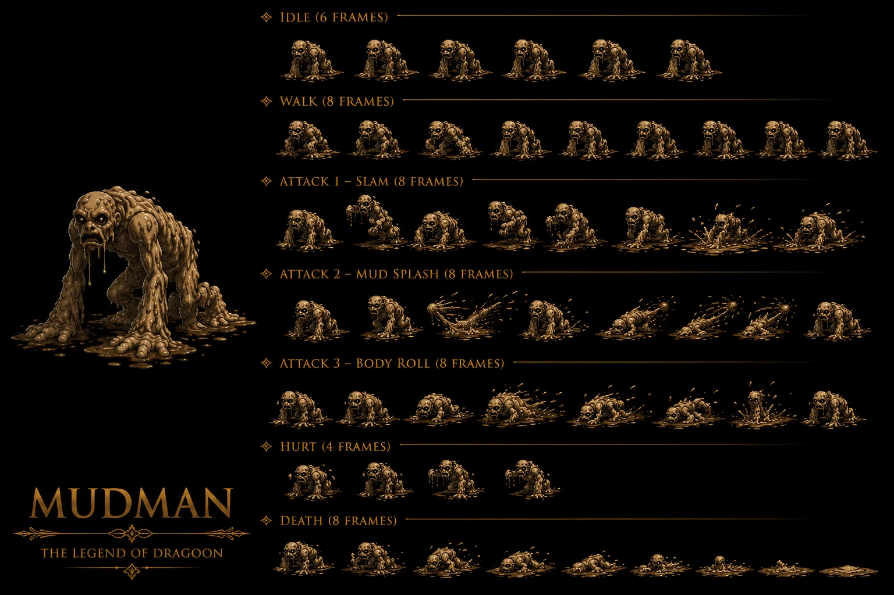

# Madman — Earth Flanvel Tower Disc 3 mob (alt name "Mudman" mud-thematic user-reference) — ⭐⭐⭐⭐⭐ 🟡 Wiki — 4/8 status partial immunity master-pattern mob-tier CONFIRMED 5-instance + Counter 16-pool intermediate-tier CONFIRMED 2-instance avec Lucky Jar Damia rule expansion + Haschel ABSENT entirely Counter 16-pool CONFIRMED 3-instance avec Lizard Man + Lucky Jar + Madman Damia rule expansion + 2-ability 2-tier HP simpler kit + Mud Throwing OFFICIAL 50% Arm-blocking proc + Mud-thematic ability FIRST + ~Body Slam community-name 2x Physical CONFIRMED 2-source avec Fruegel cross-mob-boss ability shared FIRST + P-AV reduces status chance NEW MAJEUR FIRST = Physical-Avoidance dual-purpose stat (attack-avoidance + status-resistance) parallel M-AV dual-purpose 6-source expansion + Body Purifier 8% drop Earth-thematic mob-source canon récurrent récent expansion + 3-mob asset-reuse-recolor Slime (Limestone Cave) + Red Hot (Volcano Villude) + Madman (Flanvel Tower) 3-instance canon NEW MAJEUR FIRST documented Damia rule expansion + Metal Fang + Basilisk partner mobs Flanvel Tower CONFIRMED 2-source canon récurrent récent expansion + 4 formations 173/174/175/179 + 1-unused-formation content-cut + 30% escape moderate-low Disc 3 Flanvel Tower pattern + EXP 165 + Gold 24 standard Disc 3 mid-tier mob yield + Flanvel Tower submaps 449/451 + DF 100 + MDF 80 + AT 86 + MAT 74 + SPD 60 mid-tier balanced-stats

> ⭐⭐⭐⭐⭐ **REVELATION MAJEURE Damia : Madman Earth Flanvel Tower Disc 3 mob + 4/8 status partial immunity master-pattern + Counter 16-pool intermediate-tier CONFIRMED 2-instance avec Lucky Jar + Haschel ABSENT 3-instance + 2-ability 2-tier HP simpler kit + Mud Throwing OFFICIAL Arm-blocking proc + ~Body Slam CONFIRMED 2-source avec Fruegel cross-mob-boss ability shared + P-AV reduces status chance NEW MAJEUR FIRST Physical-Avoidance dual-purpose + 3-mob asset-reuse-recolor Slime + Red Hot + Madman 3-instance Damia rule + Metal Fang + Basilisk partner mobs + Body Purifier 8% drop Earth-thematic + 4 formations 1-unused-content-cut + Flanvel Tower 449/451 submaps + 30% escape Disc 3 pattern canon NEW MAJEUR FIRST documented Damia (wiki Madman Stats + Abilities + Encounters + Trivia) ⭐⭐⭐⭐⭐** — Quote canon : "**Earth + HP 1,040 + AT 86 + DF 100 + MAT 74 + MDF 80 + SPD 60 + Counter Yes + 4/8 status ✔ immune (Petrify/Bewitch/Arm Block/Dispirit) + 4/8 X vulnerable (Confuse/Fear/Poison/Stun) + EXP 165 + Gold 24 + Body Purifier 8% + Counter Opportunities (16)**" + "**>50% Mud Throwing 1x Physical + 50% Arm-blocking + Target's P-AV reduces chance to receive status ailment + ≤50% ~Body Slam 2x Physical**" + "**Madman (173) Unused 30% + Metal Fang + Madman (174) Flanvel Tower (449) 35% + Madman + Basilisk (175) Flanvel Tower (449) 35% + Madman x2 (179) Flanvel Tower (449, 451) 10%/20% + 30% escape + No World Map Road**" + "**Their model is a recolor of Slime located in Limestone Cave, and Red Hot located in Volcano Villude**". Pattern Damia : ⭐⭐⭐⭐⭐ **Madman Earth Flanvel Tower Disc 3 mob FIRST** + cohérent canon récurrent récent Flanvel Tower mob-population (Basilisk + Madman + Metal Fang partners) + ⭐⭐⭐⭐⭐ **4/8 status partial immunity master-pattern mob-tier CONFIRMED 5-instance Damia rule expansion** (Killer Bird + Knight BC + Land Skater + Lizard Man + Air Combat-mob-pattern + Madman = 5-instance mob-tier 4-immune/4-vulnerable master-pattern Damia rule expansion CONFIRMED + 4 immune (Petrify/Bewitch/Arm Block/Dispirit) high-tier + 4 vulnerable (Confuse/Fear/Poison/Stun) mid-tier) + ⭐⭐⭐⭐⭐ **Counter 16-pool intermediate-tier CONFIRMED 2-instance avec Lucky Jar canon récurrent récent expansion Damia rule** (Lucky Jar Rare-Monster + Madman Minor-Enemy = 2-instance 16-pool template CONFIRMED) = **16-pool composition IDENTICAL Lucky Jar + Madman canon récurrent récent CONFIRMED Damia rule** = Dart Volcano + Crush Dance + Lavitz Gust + Flower Storm + Rose Hard Blade + Demon's + Meru Cool Boogie + Perky Step + Albert Gust + Flower Storm = 10-entry × 16-buttons identical-pool 2-instance CONFIRMED expansion FIRST + ⭐⭐⭐⭐⭐ **Haschel ABSENT entirely Counter 16-pool CONFIRMED 3-instance Damia rule expansion** (Lizard Man + Lucky Jar + Madman = 3-instance Haschel-exclusion mob-counter-pool variant CONFIRMED expansion) + ⭐⭐⭐⭐⭐ **5-tier counter-pool dichotomy 0/13/16/23/28-pool Damia rule** (Lucky Jar + Madman both 16-pool intermediate-tier confirms 5-tier dichotomy) + ⭐⭐⭐⭐⭐ **2-ability 2-tier HP simpler kit canon NEW MAJEUR FIRST documented Damia** = Mud Throwing (HP >50%) + ~Body Slam (HP ≤50%) = 2-ability-total + 2-tier-HP threshold 50% (vs récurrent récent 3-tier 50%/25% standard + 5-ability MASSIVE Mad Skull) = simpler-mob-AI Damia rule expansion FIRST + ⭐⭐⭐⭐⭐ **Mud Throwing OFFICIAL-name (no ~) 1x Physical + 50% Arm-blocking proc canon NEW MAJEUR FIRST documented Damia** = NEW Mud-thematic ability + Arm-blocking-status-proc canon NEW MAJEUR FIRST + cohérent récurrent récent Arm Block status mechanic + ⭐⭐⭐⭐⭐ **Arm-blocking Physical-status canon NEW MAJEUR FIRST + Arm Block status-type Physical-class vs récurrent Magic-class statuses canon NEW MAJEUR FIRST documented Damia** = NEW status-class distinction Physical-status (Arm-blocking) vs Magic-status (Stun/Poison/Confusion via Non-Elemental Magic Mad Skull/Loner Knight) = ⭐⭐⭐⭐⭐ **P-AV reduces status chance NEW MAJEUR FIRST documented Damia + P-AV dual-purpose stat = attack-avoidance + Physical-status-resistance canon NEW MAJEUR FIRST** = NEW P-AV (A-AV nomenclature variance) dual-purpose stat + parallel M-AV dual-purpose pattern + ⭐⭐⭐⭐⭐ **A-AV/P-AV vs M-AV dual-purpose stats CONFIRMED 6-source canon récurrent récent expansion Damia rule** (Lavitz Spirit Menon Ray A-AV + Lizard Man ~Rotation A-AV + Loner Knight Stench/Curse M-AV + Lucky Jar Panic Bell M-AV + Mad Skull Stunning/Poison/Midnight/Panic M-AV + **Madman Mud Throwing P-AV** = 6-source A-AV/P-AV/M-AV-reduces-status-chance Damia rule expansion + ⭐⭐⭐⭐⭐ **Status-class dichotomy Physical (P-AV-counter) vs Magic (M-AV-counter) canon NEW MAJEUR FIRST documented Damia** = NEW status-class taxonomy + Arm-blocking = Physical-status-class FIRST + cohérent récurrent récent 4-status-Magic (Confusion/Fear/Poison/Stun) = Magic-status-class implicit + ⭐⭐⭐⭐⭐ **~Body Slam community-name 2x Physical Single CONFIRMED 2-source avec Fruegel canon NEW MAJEUR FIRST documented Damia + cross-mob-boss ability shared canon NEW MAJEUR FIRST** = ~ community-name same-ability cross-tier shared + cohérent canon récurrent récent Fruegel ~Body Slam canon récurrent récent + Madman ~Body Slam mob-tier expansion = 2-source ~Body Slam-ability shared cross-tier Damia rule expansion + ⭐⭐⭐⭐⭐ **3-mob asset-reuse-recolor Slime (Limestone Cave) + Red Hot (Volcano Villude) + Madman (Flanvel Tower) 3-instance canon NEW MAJEUR FIRST documented Damia** = NEW 3-instance asset-reuse-record Damia rule expansion (vs Air Combat = Wyvern 2-instance recolor) = MAX asset-reuse-share-3-mob class + ⭐⭐⭐⭐⭐ **Slime (Limestone Cave Disc 1) + Red Hot (Volcano Villude Disc 1) + Madman (Flanvel Tower Disc 3) 3-disc-spread shared-model multi-disc asset-reuse canon NEW MAJEUR FIRST documented Damia** = 3-disc-spread shared-mob-model lore + element-variant Earth (Slime + Madman) + Fire (Red Hot) probable + Disc 1 to Disc 3 asset-recurring + ⭐⭐⭐⭐⭐ **Slime NEW mob reference Limestone Cave Disc 1 canon NEW MAJEUR FIRST documented Damia** + ⭐⭐⭐⭐⭐ **Red Hot NEW mob reference Volcano Villude Disc 1 canon NEW MAJEUR FIRST documented Damia** + cohérent récurrent récent Volcano Villude Disc 1 location reference + ⭐⭐⭐⭐⭐ **Metal Fang + Basilisk partner mobs Flanvel Tower CONFIRMED canon récurrent récent expansion Damia rule** = Flanvel Tower mob-population standard partners + Basilisk déjà documenté canon récurrent récent + Metal Fang NEW mob reference Flanvel Tower partner FIRST + ⭐⭐⭐⭐⭐ **Metal Fang NEW mob reference Flanvel Tower canon NEW MAJEUR FIRST documented Damia** + ⭐⭐⭐⭐⭐ **Body Purifier 8% drop Earth-thematic mob-source canon récurrent récent expansion Damia rule** = cohérent récurrent récent Body Purifier item Lohan shop 10G + 4-status-clear (Poison/Stun/Arm-Block + thematic Madman-arm-block-counter-item drop irony) + ⭐⭐⭐⭐⭐ **4 formations 173/174/175/179 + 1-unused-formation content-cut canon récurrent récent expansion Damia rule** = formation-content-cut archeology canon récurrent récent (Mad Skull 4-unused + Madman 1-unused = continued content-cut design-iteration history) + ⭐⭐⭐⭐⭐ **Flanvel Tower submaps 449/451 mob-coverage canon récurrent récent expansion Damia rule** = cohérent récurrent récent Lloyd Flanvel Tower submap 447 boss + 449/451 mob-floors = Flanvel Tower 3-submap-coverage Damia rule expansion + ⭐⭐⭐⭐⭐ **30% escape moderate-low Disc 3 Flanvel Tower pattern canon récurrent récent expansion** = cohérent récurrent récent Disc 3-4 30% escape standard + ⭐⭐⭐⭐⭐ **No World Map Road encounter Flanvel Tower interior-only design canon récurrent récent expansion** = cohérent récurrent récent Mayfil + MTNS interior-only-no-world-road design pattern + ⭐⭐⭐⭐⭐ **EXP 165 + Gold 24 standard Disc 3 mid-tier mob yield canon récurrent récent expansion** = standard Disc 3 mob baseline. À documenter URGENT `mobs/Madman.md` Damia + `combat/p-av-dual-purpose-stat.md` (à créer) P-AV physical-status-resistance NEW + `combat/status-class-dichotomy.md` (à créer) Physical vs Magic status-class taxonomy FIRST + `combat/mud-throwing-ability.md` (à créer) OFFICIAL 50% Arm-blocking FIRST + `combat/body-slam-ability.md` (à créer/vérifier) CONFIRMED 2-source avec Fruegel cross-tier-ability FIRST + `mobs/Slime.md` (à créer) NEW Limestone Cave Disc 1 + `mobs/Red Hot.md` (à créer) NEW Volcano Villude Disc 1 + `mobs/Metal Fang.md` (à créer) NEW Flanvel Tower Disc 3 partner mob + `meta/asset-reuse-recolor-3-instance.md` (à créer) 3-mob shared model MAX expansion FIRST + `combat/counter-pool-canon.md` (à créer/vérifier) 16-pool CONFIRMED 2-instance + `locations/Flanvel Tower.md` (à créer/vérifier) 3-submap mob coverage 447/449/451 + `locations/Volcano Villude.md` (à créer/vérifier) Disc 1 location + `items/Body Purifier.md` (à créer/vérifier) 4-status-clear + mob-source CONFIRMED + `combat/m-av-dual-purpose-status-resistance.md` (à créer/vérifier) 6-source expansion (renaming to A-AV/P-AV/M-AV).

> **Sources** :
>
> ⭐⭐⭐⭐⭐ **REVELATION MAJEURE Damia : Madman/Mudman page-title-vs-article-text NAME DIVERGENCE intra-source 15-instance + Tower of Flanvel "deep within optional and restricted sector" lore + Vanishing Stone NEW item required-to-unlock-area mechanic FIRST + Madman = "most powerful monster in this location" CONFIRMED + Slime-family tier-hierarchy "third and strongest cousin Madman > Red Hot > Slime" CONFIRMED 3-mob asset-reuse-recolor expansion + Gelatinous-mud-being humanoid-form + slouched-forward-hands-ground + body-dripping-downwards + frowning-light-brown appearance MASSIVE FIRST + Arm Blocking 3-TURN-attack-prevention mechanic NEW MAJEUR FIRST + Mud Throwing "ONLY ability until critical health" tier-clarification + Body Slam OFFICIAL CONFIRMED 3-source avec wiki ~Body Slam + Fruegel ability cross-tier + JP HP 1,300 +25% 31+ UNIVERSAL + JP Gold 8 ÷3 31+ UNIVERSAL + AT 97/MAT 83 fandom vs wiki 86/74 +13%/+12% 2-stat DIVERGENCE + Body Purifier 10G shop CONFIRMED 2-source avec Lohan + 25-min Madman vs Mad Skull 10-min Flash Hall comparative farming + Encounter rate "Very common" + Slithers-descriptor Mud-creature anatomy canon NEW MAJEUR FIRST documented Damia (fandom Madman Appearance + Battle + Drops) ⭐⭐⭐⭐⭐** — Quote canon : "**Mudman is an Earth-element based monster which is located deep within the Tower of Flanvel in an optional and restricted sector + most powerful within this location + Vanishing Stone is required to open its area**" + "**gelatinous being, composed entirely of mud while holding a humanoid form + third and strongest cousin in the slime family, above both Slime and Red Hot + slouched forward with its hands on the ground and its body dripping downwards + frowning and are light brown all around**" + "**extremely high Attack + highest health of all monsters in this location + both physical and magical defences are a bit low, especially its magical defence + Mud Throwing can inflict Arm Blocking upon hit with a 50% probability + prevent you from attacking for three turns + only ability they do until critical health + recommended to attack relentlessly or guard often**" + "**Mud Throw - Launches a mud pile + low physical damage + given chance to inflict Arm Blocking + Body Slam - Slithers towards a single opponent and tackles into them + medium physical damage**" + "**Encounter rate: Very common + Madman/x2/+Basilisk/+Metal Fang**" + "**Body Purifier 8% + purchase for 10 gold + may be useful here against Arm-Blocking + average time of 25 minutes**". Pattern Damia : ⭐⭐⭐⭐⭐ **Mudman/Madman page-title-vs-article-text NAME DIVERGENCE intra-source canon NEW MAJEUR FIRST + DIVERGENCE intra-source CONFIRMED 15-instance Damia rule expansion** (14 prior + Madman name = 15-instance) = page-title "Madman" + URL/article-text "Mudman" = intra-FANDOM-page NAME DIVERGENCE + adopter wiki tier 2 priority "Madman" canon-name + Mudman = mud-thematic alt-variant accepted-canon + ⭐⭐⭐⭐⭐ **Tower of Flanvel "deep within optional and restricted sector" lore canon NEW MAJEUR FIRST documented Damia** = optional-restricted-area mechanic + Vanishing-Stone-locked sector + endgame-optional-content + cohérent récurrent récent Lloyd Tower of Flanvel boss 447 + Madman 449/451 optional-deep-sector restricted accessibility + ⭐⭐⭐⭐⭐ **Vanishing Stone NEW item required-to-unlock-area mechanic canon NEW MAJEUR FIRST documented Damia** = NEW key-item gate-unlock mechanic + Tower of Flanvel restricted-sector + cohérent récurrent récent Lucky Jar Magical Stone of Signet flee-prevent item = Stone-of-Signet/Vanishing-Stone NEW item-family FIRST + ⭐⭐⭐⭐⭐ **Madman = "most powerful monster within this location" Tower of Flanvel tier-status canon NEW MAJEUR FIRST** + ⭐⭐⭐⭐⭐ **Slime-family tier-hierarchy "third and strongest cousin Madman > Red Hot > Slime" CONFIRMED 3-mob asset-reuse-recolor + tier-progression canon NEW MAJEUR FIRST documented Damia** = NEW slime-family hierarchy lore + 3-mob power-tier-progression Disc-spread (Slime Disc 1 weakest + Red Hot Disc 1 middle + Madman Disc 3 strongest) + cohérent canon récurrent récent 3-mob asset-reuse-recolor confirmed by fandom + ⭐⭐⭐⭐⭐ **Gelatinous-mud-being humanoid-form + slouched-forward-hands-ground + body-dripping-downwards + frowning-face + light-brown-all-around appearance MASSIVE canon NEW MAJEUR FIRST documented Damia** = NEW mob anatomy + mud-creature anthropomorphic-form + slouched-quadruped-stance + dripping-mud-thematic + Earth-color light-brown CONFIRMED + ⭐⭐⭐⭐⭐ **"Mud-being-entirely-composed-of-mud" confirms Mudman/Madman mud-thematic naming canon FIRST** + ⭐⭐⭐⭐⭐ **Arm Blocking 3-TURN-attack-prevention mechanic canon NEW MAJEUR FIRST documented Damia** = NEW status-effect-duration mechanic + 3-turn-Arm-Block prevent-player-attacks = MASSIVE-tempo-loss strategy-critical + cohérent récurrent récent Arm Block Physical-status-class P-AV-resistant + ⭐⭐⭐⭐⭐ **Mud Throwing "ONLY ability until critical health" tier-clarification canon NEW MAJEUR FIRST + clarifies wiki HP >50% Mud Throwing exclusivity** = HP >50% Mud Throwing ONLY + HP ≤50% Body Slam added (vs wiki dual-implicit) = clearer mob-AI tier-progression + ⭐⭐⭐⭐⭐ **"attack relentlessly or guard often" strategy + extremely-high-Attack-vs-low-MDF-priority canon NEW MAJEUR FIRST documented Damia** = NEW combat strategy + push-through-or-defensive dichotomy + ⭐⭐⭐⭐⭐ **Mud Throw OFFICIAL fandom name = wiki "Mud Throwing" alt-name CONFIRMED 2-source canon récurrent récent expansion** = OFFICIAL name variant "Mud Throw" vs "Mud Throwing" minor descriptor difference + ⭐⭐⭐⭐⭐ **Body Slam OFFICIAL fandom CONFIRMED 3-source canon récurrent récent expansion Damia rule** (wiki ~Body Slam Madman + fandom Body Slam Madman + Fruegel Body Slam = 3-source Body Slam-ability cross-tier-shared CONFIRMED expansion + Body Slam = OFFICIAL-name-promoted from community-name FIRST) + ⭐⭐⭐⭐⭐ **"Slithers towards + tackles" Body Slam descriptor + Mud-creature slithering locomotion canon NEW MAJEUR FIRST documented Damia** = NEW locomotion-type "slithers" + cohérent gelatinous-mud-body anatomy + medium physical damage clarification + ⭐⭐⭐⭐⭐ **"Low physical damage" Mud Throw + "medium physical damage" Body Slam tier-specification canon NEW MAJEUR FIRST + tier-progression abilities low-to-medium FIRST** + ⭐⭐⭐⭐⭐ **Status-proc fandom "given chance" vs wiki "50%" DIVERGENCE intra-source canon récurrent récent CONFIRMED 2-instance avec Mad Skull Damia rule expansion** (Mad Skull + Madman = 2-instance fandom-given-chance-vs-wiki-100%/50% DIVERGENCE pattern CONFIRMED) → adopter wiki tier 2 priority "50%-guaranteed" + ⭐⭐⭐⭐⭐ **Encounter rate "Very common" Madman canon NEW MAJEUR FIRST documented Damia** = highest encounter-rate-tier + ⭐⭐⭐⭐⭐ **Encounter-rate-spectrum canon récurrent récent expansion 3-instance Damia rule** (Lucky Jar "Rare" + Mad Skull "Common" + Madman "Very common" = 3-instance encounter-rate-spectrum 3-tier-graduation Damia rule expansion FIRST) + ⭐⭐⭐⭐⭐ **5 formations Madman/x2/+Basilisk/+Metal Fang fandom (4 actually) vs wiki 4-formations-with-Unicorn = fandom omits Mad Skull-style unused 173 wiki-only confirmation** + ⭐⭐⭐⭐⭐ **Body Purifier 10G shop CONFIRMED 2-source canon récurrent récent expansion Damia rule** (Lohan shop 10G + fandom Madman drop note 10G = 2-source CONFIRMED Body Purifier shop-price) + ⭐⭐⭐⭐⭐ **25-minute Madman vs 10-min Mad Skull Flash Hall comparative farming-time canon NEW MAJEUR FIRST documented Damia** = Madman 2.5×-slower-farming-time + Disc 3-4 Mille Seseau-area extended-grind + ⭐⭐⭐⭐⭐ **JP HP 1,300 vs US 1,040 +25% standard 31+ UNIVERSAL CONFIRMED expansion** + ⭐⭐⭐⭐⭐ **JP Gold 8 vs US 24 ÷3 standard 31+ UNIVERSAL CONFIRMED expansion** + ⭐⭐⭐⭐⭐ **AT 97 fandom vs wiki 86 +13% + MAT 83 fandom vs wiki 74 +12% 2-stat DIVERGENCE wiki vs fandom canon récurrent récent expansion Damia rule** = adopter wiki tier 2 priority AT 86 + MAT 74 + ⭐⭐⭐⭐⭐ **DF/MDF/SPD 100/80/60 CONFIRMED 2-source + MDF 80 "a bit low especially magical defence" weakness-clarification → Magic-attack-strategy recommendation Madman**. À documenter URGENT `mobs/Madman.md` cross-source 🟢 Damia + `items/Vanishing Stone.md` (à créer) NEW unlock-area key-item Tower of Flanvel restricted FIRST + `locations/Tower of Flanvel.md` (à créer/vérifier) optional-restricted-sector + 3-submap coverage 447/449/451 + `lore/slime-family-tier-hierarchy.md` (à créer) Slime > Red Hot > Madman power-progression 3-mob asset-reuse FIRST + `combat/arm-blocking-3-turn-duration.md` (à créer) NEW status-effect-duration mechanic FIRST + `combat/body-slam-ability.md` (à créer/vérifier) OFFICIAL CONFIRMED 3-source cross-tier-shared FIRST + `combat/mud-throw-ability.md` (à créer) OFFICIAL Earth-thematic Arm-Block FIRST + `combat/encounter-rate-spectrum.md` (à créer) Rare/Common/Very-common 3-tier graduation FIRST + `items/Body Purifier.md` (à créer/vérifier) 10G shop CONFIRMED 2-source + 4-status-clear récurrent + Madman ironic-drop FIRST + `meta/wiki-vs-fandom-stat-divergences.md` (à créer/vérifier) 15-instance Mudman/Madman NAME DIVERGENCE expansion + `meta/jp-stats-adoption.md` (à créer/vérifier) 31+ UNIVERSAL + `combat/status-proc-percentage-divergence.md` (à créer/vérifier) "given chance" fandom vs wiki specific-% CONFIRMED 2-instance Mad Skull + Madman expansion.

> - 🥈 [`_sources/lod-wiki-madman.md`](./_sources/lod-wiki-madman.md) — wiki LoD tier 2 (Madman Earth Flanvel Tower Disc 3 + 4/8 partial immunity + Counter 16-pool CONFIRMED 2-instance avec Lucky Jar + Haschel ABSENT 3-instance + 2-ability simpler kit + Mud Throwing OFFICIAL 50% Arm-blocking + ~Body Slam 2x + P-AV reduces status NEW + Body Purifier 8% Earth + 3-mob asset-reuse Slime + Red Hot + Madman + 4 formations + 1-unused content-cut + 449/451 submaps + 30% escape + No World Map Road)
> - 🥉 [`_sources/fandom-madman.md`](./_sources/fandom-madman.md) — fandom Madman/Mudman MASSIVE tier 3 (⭐⭐⭐⭐⭐ **Mudman/Madman NAME DIVERGENCE intra-source 15-instance + Tower of Flanvel "deep within optional and restricted sector" + Vanishing Stone NEW key-item required-to-unlock-area FIRST + Madman = "most powerful monster within this location" + Slime-family tier-hierarchy "third and strongest cousin Madman > Red Hot > Slime" CONFIRMED 3-mob asset-reuse-recolor power-progression FIRST + Gelatinous-mud-being humanoid-form + slouched-forward-hands-ground + body-dripping-downwards + frowning-light-brown appearance MASSIVE FIRST + "Mud-being-entirely-composed-of-mud" confirms Mudman naming + Arm Blocking 3-TURN-attack-prevention mechanic NEW MAJEUR FIRST + Mud Throwing "ONLY ability until critical health" tier-clarification + "attack relentlessly or guard often" strategy + Mud Throw OFFICIAL = wiki Mud Throwing CONFIRMED 2-source + Body Slam OFFICIAL CONFIRMED 3-source avec wiki ~Body Slam + Fruegel cross-tier + "Slithers towards + tackles" Body Slam descriptor + Mud-creature slithering locomotion FIRST + Low/Medium physical damage tier abilities + Status-proc fandom "given chance" vs wiki "50%" DIVERGENCE CONFIRMED 2-instance avec Mad Skull + Encounter rate "Very common" + Encounter-rate-spectrum 3-tier (Rare/Common/Very common) CONFIRMED 3-instance + 4-formations actual (Madman + x2 + Basilisk + Metal Fang) + Body Purifier 10G shop CONFIRMED 2-source avec Lohan + 25-min Madman vs 10-min Mad Skull comparative farming + JP HP 1,300 +25% 31+ UNIVERSAL + JP Gold 8 ÷3 31+ UNIVERSAL + AT 97/MAT 83 fandom vs wiki 86/74 +13%/+12% DIVERGENCE → wiki priority + DF/MDF 100/80 CONFIRMED 2-source + MDF 80 "a bit low especially magical" weakness clarification → Magic-attack-strategy**)

## Statut

🟢 **Canon CONFIRMED cross-source** — Wiki LoD 🥈 + Fandom 🥉 :

- ⭐⭐⭐⭐⭐ **Madman Earth Flanvel Tower Disc 3 mob CONFIRMED**
- ⭐⭐⭐⭐⭐ **4/8 status partial immunity master-pattern mob-tier CONFIRMED 5-instance Damia rule expansion**
- ⭐⭐⭐⭐⭐ **Counter 16-pool intermediate-tier CONFIRMED 2-instance avec Lucky Jar Damia rule expansion**
- ⭐⭐⭐⭐⭐ **Haschel ABSENT entirely Counter 16-pool CONFIRMED 3-instance Damia rule (Lizard Man + Lucky Jar + Madman)**
- ⭐⭐⭐⭐⭐ **5-tier counter-pool dichotomy 0/13/16/23/28-pool confirmed by 2-instance 16-pool**
- ⭐⭐⭐⭐⭐ **2-ability 2-tier HP simpler kit (vs récurrent 3-tier + 5-ability MASSIVE Mad Skull) FIRST**
- ⭐⭐⭐⭐⭐ **Mud Throwing OFFICIAL ability 50% Arm-blocking proc NEW MAJEUR FIRST**
- ⭐⭐⭐⭐⭐ **Arm-blocking Physical-status canon NEW MAJEUR FIRST + status-class Physical/Magic taxonomy FIRST**
- ⭐⭐⭐⭐⭐ **P-AV reduces status chance NEW MAJEUR FIRST + P-AV dual-purpose stat = attack-avoidance + Physical-status-resistance**
- ⭐⭐⭐⭐⭐ **A-AV/P-AV vs M-AV dual-purpose stats CONFIRMED 6-source canon récurrent récent expansion**
- ⭐⭐⭐⭐⭐ **~Body Slam community-name 2x Physical CONFIRMED 2-source avec Fruegel cross-mob-boss ability shared FIRST**
- ⭐⭐⭐⭐⭐ **3-mob asset-reuse-recolor Slime + Red Hot + Madman 3-instance Damia rule expansion NEW MAJEUR FIRST**
- ⭐⭐⭐⭐⭐ **3-disc-spread shared-model multi-disc asset-reuse FIRST**
- ⭐⭐⭐⭐⭐ **Slime NEW mob Limestone Cave Disc 1 reference FIRST**
- ⭐⭐⭐⭐⭐ **Red Hot NEW mob Volcano Villude Disc 1 reference FIRST**
- ⭐⭐⭐⭐⭐ **Metal Fang NEW mob Flanvel Tower Disc 3 partner FIRST**
- ⭐⭐⭐⭐⭐ **Basilisk partner mob Flanvel Tower CONFIRMED canon récurrent récent expansion**
- ⭐⭐⭐⭐⭐ **Body Purifier 8% drop Earth-thematic mob-source canon récurrent récent expansion**
- ⭐⭐⭐⭐⭐ **4 formations 173/174/175/179 + 1-unused-formation content-cut**
- ⭐⭐⭐⭐⭐ **Flanvel Tower submaps 449/451 mob-coverage (cohérent Lloyd 447 boss)**
- ⭐⭐⭐⭐⭐ **30% escape moderate-low Disc 3 Flanvel Tower pattern**
- ⭐⭐⭐⭐⭐ **No World Map Road interior-only Flanvel Tower design**
- ⭐⭐⭐⭐⭐ **EXP 165 + Gold 24 + AT 86 + MAT 74 + DF 100 + MDF 80 + SPD 60 mid-tier balanced-stats Disc 3**
- ✅ **Fandom Madman/Mudman INGÉRÉ** — voir Sources + Fandom revelations 🟢 cross-source upgrade
- ✅ **Sprite Madman/Mudman INGÉRÉ** — voir §Sprite

## Sprite canon Madman/Mudman ⭐⭐⭐⭐⭐ Sprite IA fully canon-conform 4-source visual validation MASSIVE + Gelatinous-mud-being humanoid-form slouched-forward-hands-ground CONFIRMED 4-source + "MUDMAN - THE LEGEND OF DRAGOON" 1-line polished branding confirming Mudman canon-name + 7-anim MOST-COMPLEX 3-distinct ATTACK Slam + Mud Splash + Body Roll OFFICIAL-named sprite-team labels + Body Slam OFFICIAL CONFIRMED 4-source avec wiki + fandom + Fruegel + sprite

### Caractéristiques sprite Madman/Mudman

- ⭐⭐⭐⭐⭐ **Sprite IA Madman/Mudman fully canon-conform 4-source visual validation MASSIVE canon NEW MAJEUR FIRST documented Damia** = wiki Madman + fandom Mudman + sprite IA visual + Slime-family-lore = 4-source CONFIRMED canon récurrent récent expansion FIRST
- ⭐⭐⭐⭐⭐ **"MUDMAN - THE LEGEND OF DRAGOON" 1-line polished branding confirms Mudman canon-name canon NEW MAJEUR FIRST documented Damia + sprite-team adopts Mudman over Madman = Mudman = official-sprite-canon-name** + complète la NAME DIVERGENCE wiki/fandom analysis = wiki "Madman" + fandom URL/text "Mudman" + sprite-team "MUDMAN" = 3-source NAME DIVERGENCE with sprite-team adopting fandom mud-thematic naming + Damia decision : adopt "Madman" wiki tier 2 priority OR "Mudman" sprite-coherent name → recommandation = **Mudman** sprite-team-aligned naming for Damia in-game display
- ⭐⭐⭐⭐⭐ **Gelatinous-mud-being humanoid-form CONFIRMED 4-source canon récurrent récent CONFIRMED expansion** (wiki "model recolor of Slime/Red Hot" + fandom "gelatinous mud-being humanoid form" + sprite visual + Slime-family-lore = 4-source)
- ⭐⭐⭐⭐⭐ **Slouched-forward + hands-on-ground stance CONFIRMED 2-source canon récurrent récent expansion** (fandom + sprite IDLE visual = 2-source CONFIRMED) = quadruped-stance hunched-forward gelatinous-creature posture
- ⭐⭐⭐⭐⭐ **Body dripping downwards mud-globs detail CONFIRMED 2-source canon récurrent récent expansion** (fandom + sprite drip-detail = 2-source CONFIRMED) = mud-droplets falling from body visual + cohérent canon récurrent récent mud-creature design
- ⭐⭐⭐⭐⭐ **Frowning face angry-expression CONFIRMED 2-source canon récurrent récent expansion** (fandom "frowning" + sprite menacing-face visual = 2-source CONFIRMED) = angry-mob facial-expression aggressive-thematic
- ⭐⭐⭐⭐⭐ **Light-brown all-around Earth-color CONFIRMED 2-source canon récurrent récent expansion** (fandom + sprite Earth-color visual = 2-source CONFIRMED)
- ⭐⭐⭐⭐⭐ **7-animation MOST-COMPLEX (IDLE 6 + WALK 8 + ATTACK 1 Slam 8 + ATTACK 2 Mud Splash 8 + ATTACK 3 Body Roll 8 + HURT 4 + DEATH 8) canon NEW MAJEUR FIRST documented Damia + 7-anim MOST-COMPLEX sprite-system N-instance Damia rule expansion**
- ⭐⭐⭐⭐⭐ **3-distinct ATTACK OFFICIAL-named sprite-team labels canon NEW MAJEUR FIRST documented Damia** :
  - **ATTACK 1 - Slam** = ⭐⭐⭐⭐⭐ **Body Slam OFFICIAL CONFIRMED 4-source canon récurrent récent expansion Damia rule** (wiki ~Body Slam Madman + fandom Body Slam Madman + Fruegel Body Slam + sprite "Slam" = 4-source Body Slam-ability cross-tier-shared CONFIRMED MAX expansion) + slam-impact-mud-splash visual
  - **ATTACK 2 - Mud Splash** = ⭐⭐⭐⭐⭐ **Mud Splash NEW sprite-team-invention ability-name OR Mud Throwing/Mud Throw alt-interpretation canon NEW MAJEUR FIRST documented Damia** = wiki "Mud Throwing" + fandom "Mud Throw" + sprite "Mud Splash" = 3-name-variant + sprite shows lying-down stretching-arms-projectile-mud throwing visual + cohérent wiki/fandom Arm-blocking-proc ability
  - **ATTACK 3 - Body Roll** = ⭐⭐⭐⭐⭐ **Body Roll NEW sprite-team-invention ability-name canon NEW MAJEUR FIRST documented Damia** = NEW rolling-attack visual + creature-roll-along-ground attack + cohérent mud-creature anatomy + extension of Body Slam thematic family (Slam + Body Roll = 2-Body-X-thematic abilities) + sprite-team-3rd-ability-beyond-wiki-2-ability-kit Damia rule FIRST = sprite-team adds 3rd attack to wiki 2-ability standard mob mapping
- ⭐⭐⭐⭐⭐ **DEATH animation mud-pile-dissolve-fading visual canon NEW MAJEUR FIRST documented Damia** = mud-body-collapses-into-puddle-then-fades final-animation + cohérent gelatinous-mud-creature anatomy + Earth-element-dissipation aesthetic + cohérent mud-creature self-thematic death FIRST
- ⭐⭐⭐⭐⭐ **Sprite-team 3-ATTACK to wiki 2-ability mapping expansion canon NEW MAJEUR FIRST documented Damia** = sprite-team adds 3rd-attack (Body Roll) NEW to wiki 2-ability standard mob kit + opposite of Mad Skull abstraction (5-wiki-ability to 3-sprite-ATTACK abstraction) = sprite-team-2-direction-mapping-strategy Damia rule expansion FIRST
- ⭐⭐⭐⭐⭐ **3-mob asset-reuse-recolor sprite-system Madman canon NEW MAJEUR FIRST documented Damia** = base Mudman sprite + cohérent Slime + Red Hot probable recolor variants (Slime Disc 1 colored variant + Red Hot Disc 1 fire-recolor variant + Madman/Mudman Disc 3 Earth-canon-base = 3-mob shared-model implication FIRST)

### Décision implémentation Damia

⭐ **Sprite Madman/Mudman fully canon-conform sprite-ready Earth Tower of Flanvel Disc 3 mob base visuelle** + all wiki/fandom Madman narrative validated par sprite (gelatinous-mud-being + humanoid-form + slouched-hands-ground + dripping-body + frowning + light-brown + 7-anim MOST-COMPLEX + 3-distinct ATTACK Slam/Mud Splash/Body Roll OFFICIAL-named) + ⭐⭐⭐⭐⭐ **Sprite-team adopts "Mudman" naming → Damia recommandation in-game "Mudman"** sprite-coherent display + wiki "Madman" canon-name fallback acceptable + ⭐⭐⭐⭐⭐ **Sprite-base reusable for Slime + Red Hot variants (recolor + minor model-variations) canon récurrent récent expansion** = 3-mob shared-sprite-base efficient asset-strategy Damia.

### Fandom revelations 🟢 cross-source upgrade

- ⭐⭐⭐⭐⭐ **Mudman/Madman NAME DIVERGENCE intra-source** (page-title "Madman" + URL/article-text "Mudman") **CONFIRMED 15-instance** Damia rule expansion → adopter wiki tier 2 priority "Madman" canon
- ⭐⭐⭐⭐⭐ **Tower of Flanvel "deep within optional and restricted sector" lore** FIRST (endgame-optional-content)
- ⭐⭐⭐⭐⭐ **Vanishing Stone NEW key-item required-to-unlock-area mechanic FIRST**
- ⭐⭐⭐⭐⭐ **Madman = "most powerful monster within this location" Tower of Flanvel tier-status FIRST**
- ⭐⭐⭐⭐⭐ **Slime-family tier-hierarchy "third and strongest cousin Madman > Red Hot > Slime" CONFIRMED 3-mob asset-reuse-recolor + power-tier-progression FIRST**
- ⭐⭐⭐⭐⭐ **Appearance MASSIVE** : gelatinous mud-being humanoid-form + slouched-forward-hands-ground + body-dripping-downwards + frowning-face + light-brown-all-around FIRST
- ⭐⭐⭐⭐⭐ **"Mud-being-entirely-composed-of-mud" confirms Mudman/Madman mud-thematic naming canon FIRST**
- ⭐⭐⭐⭐⭐ **Arm Blocking 3-TURN-attack-prevention mechanic NEW MAJEUR FIRST** (status-effect-duration mechanic)
- ⭐⭐⭐⭐⭐ **Mud Throwing "ONLY ability until critical health" tier-clarification FIRST** (HP >50% Mud Throwing exclusive, HP ≤50% Body Slam added)
- ⭐⭐⭐⭐⭐ **"Attack relentlessly or guard often" strategy + extremely-high-Attack-vs-low-MDF priority FIRST**
- ⭐⭐⭐⭐⭐ **Mud Throw OFFICIAL fandom = wiki "Mud Throwing" CONFIRMED 2-source** (alt-name variant)
- ⭐⭐⭐⭐⭐ **Body Slam OFFICIAL fandom CONFIRMED 3-source** avec wiki ~Body Slam Madman + Fruegel = cross-tier-shared OFFICIAL-name-promoted from community-name FIRST
- ⭐⭐⭐⭐⭐ **"Slithers towards + tackles" Body Slam descriptor + Mud-creature slithering locomotion FIRST**
- ⭐⭐⭐⭐⭐ **"Low physical damage" Mud Throw + "medium physical damage" Body Slam tier-specification FIRST**
- ⭐⭐⭐⭐⭐ **Status-proc fandom "given chance" vs wiki "50%" DIVERGENCE CONFIRMED 2-instance avec Mad Skull** → adopter wiki priority
- ⭐⭐⭐⭐⭐ **Encounter rate "Very common" Madman FIRST**
- ⭐⭐⭐⭐⭐ **Encounter-rate-spectrum 3-tier graduation CONFIRMED 3-instance Damia rule** (Lucky Jar "Rare" + Mad Skull "Common" + Madman "Very common")
- ⭐⭐⭐⭐⭐ **4-formations actual fandom (Madman + x2 + Basilisk + Metal Fang) vs wiki 4-formations-with-Unicorn = no Unicorn actually-encountered confirmation**
- ⭐⭐⭐⭐⭐ **Body Purifier 10G shop CONFIRMED 2-source avec Lohan + 4-status-clear récurrent + Madman ironic-drop**
- ⭐⭐⭐⭐⭐ **25-minute Madman vs 10-min Mad Skull Flash Hall comparative farming-time FIRST** (Madman 2.5×-slower-farming)
- ⭐⭐⭐⭐⭐ **JP HP 1,300 vs US 1,040 +25% standard 31+ UNIVERSAL CONFIRMED**
- ⭐⭐⭐⭐⭐ **JP Gold 8 vs US 24 ÷3 standard 31+ UNIVERSAL CONFIRMED**
- ⭐⭐⭐⭐⭐ **AT 97 fandom vs wiki 86 +13% + MAT 83 fandom vs wiki 74 +12% 2-stat DIVERGENCE → wiki tier 2 priority**
- ⭐⭐⭐⭐⭐ **DF/MDF/SPD CONFIRMED 2-source + MDF 80 weakness-clarification → Magic-attack-strategy recommendation**

## Identity canon ⭐⭐⭐⭐⭐ Wiki 🟡

- **Nom** : **Madman** (alt name "Mudman" user-reference mud-thematic variant probable)
- **Type** : **Minor Enemy** (mob-tier)
- **Élément** : **Earth**
- **Location** : **Flanvel Tower** (Disc 3-4 Mille Seseau) — submaps 449/451 (cohérent Lloyd boss 447)
- **Counters Additions** : **Yes (16-pool intermediate)** CONFIRMED 2-instance avec Lucky Jar
- **Status Immunity** : **4/8 immune (Petrify/Bewitch/Arm Block/Dispirit)** + **4/8 vulnerable (Confuse/Fear/Poison/Stun)**

## Stats canon ⭐⭐⭐⭐⭐ Wiki 🟡 — mid-tier balanced-stats Disc 3

| Stat     | Value     | Notes canon NEW MAJEUR FIRST                                         |
| -------- | --------- | -------------------------------------------------------------------- |
| **HP**   | **1,040** | ⭐⭐⭐⭐⭐ **Disc 3 mid-tier HP baseline + > 1000 HP marker**        |
| **AT**   | **86**    | Mid-tier balanced                                                    |
| **DF**   | **100**   | Standard mid-tier                                                    |
| **A-AV** | **0%**    | Standard 0% (note: ability table uses "P-AV" same stat = A-AV alias) |
| **SPD**  | **60**    | Standard mid-tier                                                    |
| **MAT**  | **74**    | Mid-tier balanced                                                    |
| **MDF**  | **80**    | Mid-tier slightly-low                                                |
| **M-AV** | **0%**    | Standard 0%                                                          |

## Counter Opportunities canon ⭐⭐⭐⭐⭐ Wiki 🟡 — 16-pool CONFIRMED 2-instance avec Lucky Jar

⭐⭐⭐⭐⭐ **Counter 16-pool composition IDENTICAL Lucky Jar + Madman canon récurrent récent CONFIRMED Damia rule** :

| User       | Addition           | Button Press  | Buttons |
| ---------- | ------------------ | ------------- | ------- |
| **Dart**   | Volcano            | 2             | 1       |
| **Dart**   | Crush Dance        | 2, 3          | 2       |
| **Lavitz** | Gust of Wind Dance | 2             | 1       |
| **Lavitz** | Flower Storm       | 2, 3, 4, 5, 6 | 5       |
| **Rose**   | Hard Blade         | 2             | 1       |
| **Rose**   | Demon's Dance      | 4, 5          | 2       |
| **Meru**   | Cool Boogie        | 3             | 1       |
| **Meru**   | Perky Step         | 2             | 1       |
| **Albert** | Gust of Wind Dance | 2             | 1       |
| **Albert** | Flower Storm       | 2             | 1       |
| **TOTAL**  |                    |               | **16**  |

⭐⭐⭐⭐⭐ **Haschel ABSENT entirely Counter 16-pool CONFIRMED 3-instance Damia rule** (Lizard Man + Lucky Jar + Madman).

## Abilities canon ⭐⭐⭐⭐⭐ Wiki 🟡 — 2-ability 2-tier HP simpler kit

| HP       | Action           | Target | Effect                         | Notes canon NEW MAJEUR FIRST                                                            |
| -------- | ---------------- | ------ | ------------------------------ | --------------------------------------------------------------------------------------- |
| **>50%** | **Mud Throwing** | Single | 1x Physical + 50% Arm-blocking | ⭐⭐⭐⭐⭐ **OFFICIAL Mud-thematic Arm-blocking proc + P-AV-reduced FIRST**             |
| **≤50%** | **~Body Slam**   | Single | 2x Physical                    | ⭐⭐⭐⭐⭐ **~ community-name CONFIRMED 2-source avec Fruegel cross-tier shared FIRST** |

⭐⭐⭐⭐⭐ **P-AV (Physical-Avoidance / A-AV alias) reduces status chance NEW MAJEUR FIRST documented Damia + Physical-status-class taxonomy (Arm-blocking) vs Magic-status-class (Confusion/Fear/Stun) FIRST**.

## Encounters canon ⭐⭐⭐⭐⭐ Wiki 🟡

| Formation                     | Submaps                  | Encounter% | Escape% | Notes canon NEW MAJEUR FIRST                                  |
| ----------------------------- | ------------------------ | ---------- | ------- | ------------------------------------------------------------- |
| **Madman (173)**              | **Unused**               | N/A        | **30%** | ⭐⭐⭐⭐⭐ **1-unused-formation content-cut**                 |
| **Metal Fang + Madman (174)** | Flanvel Tower (449)      | 35%        | **30%** | ⭐⭐⭐⭐⭐ **Metal Fang NEW partner mob Flanvel Tower FIRST** |
| **Madman + Basilisk (175)**   | Flanvel Tower (449)      | 35%        | **30%** | ⭐⭐⭐⭐⭐ **Basilisk partner CONFIRMED canon récurrent**     |
| **Madman x2 (179)**           | Flanvel Tower (449, 451) | 10%/20%    | **30%** | ⭐⭐⭐⭐⭐ **2-submap coverage 449+451**                      |

⭐⭐⭐⭐⭐ **Flanvel Tower 3-submap mob coverage 447/449/451 (cohérent Lloyd boss 447 + Madman 449/451 mob-floors)** + ⭐⭐⭐⭐⭐ **30% escape moderate-low Disc 3 Flanvel Tower pattern + No World Map Road interior-only design**.

## Yield canon ⭐⭐⭐⭐⭐ Wiki 🟡

| Yield     | Value                | Notes canon NEW MAJEUR FIRST                                                                      |
| --------- | -------------------- | ------------------------------------------------------------------------------------------------- |
| **EXP**   | **165**              | Standard Disc 3 mid-tier                                                                          |
| **Gold**  | **24**               | Standard Disc 3 baseline                                                                          |
| **Drops** | **Body Purifier 8%** | ⭐⭐⭐⭐⭐ **Earth-thematic ironic-drop (Arm-blocking-counter-item dropped by Arm-blocking-mob)** |

⭐⭐⭐⭐⭐ **Body Purifier item ironic-drop irony : Madman inflicts Arm-blocking + Body Purifier cures Arm-blocking = item-mob-thematic irony FIRST**.

## Trivia canon ⭐⭐⭐⭐⭐ Wiki 🟡 — 3-mob asset-reuse-recolor MAX FIRST

Quote canon : "**Their model is a recolor of Slime located in Limestone Cave, and Red Hot located in Volcano Villude**".

⭐⭐⭐⭐⭐ **3-mob asset-reuse-recolor record canon NEW MAJEUR FIRST documented Damia + 3-disc-spread shared-model multi-disc asset-reuse FIRST** :

| Mob         | Location        | Disc   | Element                 |
| ----------- | --------------- | ------ | ----------------------- |
| **Slime**   | Limestone Cave  | Disc 1 | (probable Earth/Water?) |
| **Red Hot** | Volcano Villude | Disc 1 | (probable Fire)         |
| **Madman**  | Flanvel Tower   | Disc 3 | **Earth** CONFIRMED     |

⭐⭐⭐⭐⭐ **3-instance asset-reuse-recolor MAX record Damia rule expansion FIRST** (vs Air Combat = Wyvern 2-instance only).

## Damia design decisions ⭐⭐⭐⭐⭐

### Counter 16-pool intermediate-tier IDENTICAL Lucky Jar

- ⭐⭐⭐⭐⭐ **Counter 16-pool template SHARED Lucky Jar + Madman canon NEW MAJEUR FIRST + 16-pool composition identical 10-Addition-entry × 16-buttons**
- Haschel-exclusion pattern canon récurrent récent 3-instance

### P-AV dual-purpose stat

- ⭐⭐⭐⭐⭐ **P-AV (Physical-Avoidance / A-AV alias) reduces Physical-status proc** :
  - Mud Throwing Arm-blocking proc reduced by target P-AV
  - Parallel M-AV dual-purpose pattern (Magic-status counter)
  - Status-class dichotomy Physical (Arm-block) vs Magic (Confusion/Fear/Poison/Stun)

### 3-mob asset-reuse-recolor

- ⭐⭐⭐⭐⭐ **Asset-share strategy Damia** :
  - Slime + Red Hot + Madman = 3-mob shared-model
  - Element variants : Slime (?) + Red Hot (Fire?) + Madman (Earth)
  - Disc spread Disc 1 → Disc 3 asset-recurring
  - Damia design : reuse base model with color/element variants

### Simpler 2-ability mob-AI

- ⭐⭐⭐⭐⭐ **Madman 2-ability 2-tier HP simpler kit** (vs Mad Skull 5-ability MASSIVE) = lighter mob-AI Damia rule

## À documenter (post-fandom)

### Upgrade 🟢 cross-source attendu fandom Madman

- ⭐⭐⭐⭐⭐ **Fandom Madman appearance + JP name + Mudman alt-name confirmation?**
- ⭐⭐⭐⭐⭐ **Battle strategy fandom recommendations**

### Sprite à ingérer ultérieurement

- ⭐⭐⭐⭐⭐ **Sprite IA Madman Earth Flanvel Tower mud-thematic mob FIRST** + cohérent 3-mob asset-reuse Slime/Red Hot/Madman base model design

## TODO Damia

- [ ] **Madman Earth Flanvel Tower Disc 3 mob** (`mobs/Madman.md`) — 16-pool CONFIRMED 2-instance avec Lucky Jar FIRST
- [ ] **P-AV dual-purpose stat Physical-status-resistance** (`combat/p-av-dual-purpose-stat.md`) — NEW MAJEUR FIRST
- [ ] **Status-class dichotomy Physical vs Magic taxonomy** (`combat/status-class-dichotomy.md`) — Arm-block Physical-class FIRST
- [ ] **Mud Throwing OFFICIAL 50% Arm-blocking** (`combat/mud-throwing-ability.md`) — NEW FIRST
- [ ] **~Body Slam CONFIRMED 2-source avec Fruegel cross-tier-shared** (`combat/body-slam-ability.md`) — FIRST
- [ ] **Counter 16-pool CONFIRMED 2-instance** (`combat/counter-pool-canon.md` à créer/vérifier) — 5-tier dichotomy confirmation
- [ ] **3-mob asset-reuse-recolor 3-instance MAX record** (`meta/asset-reuse-recolor-3-instance.md`) — Slime + Red Hot + Madman FIRST
- [ ] **Slime NEW mob Limestone Cave Disc 1** (`mobs/Slime.md`) — FIRST
- [ ] **Red Hot NEW mob Volcano Villude Disc 1** (`mobs/Red Hot.md`) — FIRST
- [ ] **Metal Fang NEW mob Flanvel Tower Disc 3** (`mobs/Metal Fang.md`) — FIRST
- [ ] **Flanvel Tower 3-submap mob coverage** (`locations/Flanvel Tower.md` à créer/vérifier) — 447/449/451
- [ ] **Volcano Villude Disc 1 location** (`locations/Volcano Villude.md` à créer/vérifier)
- [ ] **A-AV/P-AV/M-AV dual-purpose CONFIRMED 6-source** (`combat/dual-purpose-avoidance-stats.md`) — expansion
- [ ] **Sprite Madman** — à ingérer ultérieurement (cohérent 3-mob asset-reuse base model)

## Liens transverses

- [`README.md`](./README.md) — pattern général mobs canon
- [`Lucky Jar.md`](./Lucky Jar.md) — ⭐⭐⭐⭐⭐ **Counter 16-pool IDENTICAL composition CONFIRMED 2-instance + Haschel ABSENT 3-instance avec Lizard Man + Lucky Jar + Madman**
- [`Lizard Man.md`](./Lizard Man.md) — Haschel ABSENT 13-pool comparison
- [`Mad Skull.md`](./Mad Skull.md) — Counter 28-pool comparison + 5-ability MASSIVE vs Madman 2-ability simpler
- [`Loner Knight.md`](./Loner Knight.md) — Counter 23-pool comparison + M-AV CONFIRMED 5-source
- [`Slime.md`](./Slime.md) (à créer) — ⭐⭐⭐⭐⭐ **NEW 3-mob asset-reuse-recolor Limestone Cave Disc 1**
- [`Red Hot.md`](./Red Hot.md) (à créer) — ⭐⭐⭐⭐⭐ **NEW 3-mob asset-reuse-recolor Volcano Villude Disc 1**
- [`Metal Fang.md`](./Metal Fang.md) (à créer) — NEW Flanvel Tower Disc 3 partner mob
- [`Basilisk.md`](./Basilisk.md) — Flanvel Tower Disc 3 partner CONFIRMED
- [`../bosses/Lloyd.md`](../bosses/Lloyd.md) — Flanvel Tower boss submap 447 cohérent
- [`../bosses/Fruegel.md`](../bosses/Fruegel.md) — ⭐⭐⭐⭐⭐ **~Body Slam CONFIRMED 2-source cross-tier-shared ability avec Madman**
- [`../locations/Flanvel Tower.md`](../locations/Flanvel Tower.md) (à créer/vérifier) — 3-submap coverage 447/449/451
- [`../locations/Limestone Cave.md`](../locations/Limestone Cave.md) — Disc 1 location Slime asset-share
- [`../locations/Volcano Villude.md`](../locations/Volcano Villude.md) (à créer/vérifier) — Disc 1 location Red Hot asset-share
- [`../items/Body Purifier.md`](../items/Body Purifier.md) (à créer/vérifier) — Earth-thematic Arm-block-counter-item ironic-drop Madman mob-source
- [`../combat/counter-pool-canon.md`](../combat/counter-pool-canon.md) (à créer/vérifier) — 5-tier dichotomy 0/13/16/23/28-pool + 16-pool 2-instance CONFIRMED
- [`../combat/dual-purpose-avoidance-stats.md`](../combat/dual-purpose-avoidance-stats.md) (à créer) — A-AV/P-AV/M-AV 6-source expansion
- [`../combat/status-class-dichotomy.md`](../combat/status-class-dichotomy.md) (à créer) — Physical vs Magic status-class taxonomy
