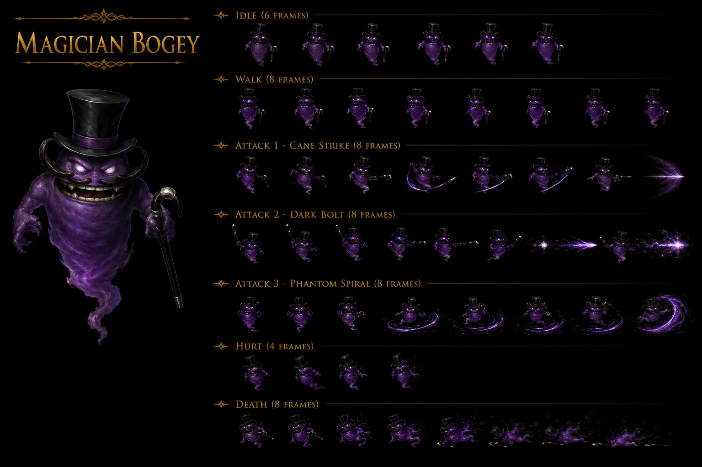

# Magician Bogy — Darkness Phantom Ship Disc 2 mob (formerly Saint Louvia ghost ship cutscene-Bogy-observes-Dart scripted-encounter) — ⭐⭐⭐⭐⭐ 🟡 Wiki — Counter 23-pool intermediate-tier CONFIRMED 2-instance avec Loner Knight Damia rule expansion + 4/8 status partial immunity master-pattern mob-tier CONFIRMED 6-instance Damia rule expansion + DF 80/MDF 160 2x asymmetric Magic-tank canon NEW MAJEUR FIRST documented Damia + Magic-tank-extreme tier mob-classification NEW MAJEUR FIRST + 3-ability 2-tier HP mid-complexity kit + ≤50% 2-action equal-chance multi-attack-low-HP canon NEW MAJEUR FIRST + ~Bat Trick 1.5x Physical 100% Stun proc + ~Flowers 1x Non-Elemental magic 100% Bewitchment proc + double-100%-status-dual-class proc canon NEW MAJEUR FIRST documented Damia + ~Whack 1x Physical >50% basic + Status-class dichotomy Physical (Stun) vs Magic (Bewitchment) confirmation pattern + P-AV vs M-AV dual-purpose stats same-mob distinction NEW MAJEUR FIRST + A-AV/P-AV vs M-AV dual-purpose stats CONFIRMED 7-source canon récurrent récent expansion + 2 formations Skeleton x2 partner + x3 solo + Phantom Ship 292/293 2-submap-coverage + Scripted 0% escape boss-like no-escape canon NEW MAJEUR FIRST + Skeleton NEW partner mob Phantom Ship FIRST + Magical Hat 2% drop NEW item NEW MAJEUR FIRST + AT 35 LOWEST-tier mob FIRST + MAT 42 LOW magic-attack + HP 800 mid-low + A-AV 0% / M-AV 0% zero-avoidance both NEW + 4 encountered total scripted-limited-encounters Phantom Ship lore + cutscene-observes-Dart narrative-Bogy-mob-canon NEW MAJEUR FIRST

> ⭐⭐⭐⭐⭐ **REVELATION MAJEURE Damia : Magician Bogy Darkness Phantom Ship Disc 2 mob + Phantom Ship = formerly Saint Louvia ghost-ship NEW location reference + cutscene Bogy observes Dart narrative-scripted-encounter canon NEW MAJEUR FIRST + 4 encountered total limited-encounter scripted lore + Counter 23-pool intermediate-tier CONFIRMED 2-instance avec Loner Knight + 4/8 status partial immunity master-pattern 6-instance + DF 80 / MDF 160 2x asymmetric Magic-tank-extreme tier mob-classification + 3-ability 2-tier HP mid-complexity kit + ~Whack >50% 1x Physical basic + ≤50% 2-action equal-chance multi-attack-low-HP canon NEW MAJEUR FIRST + ~Bat Trick 1.5x Physical 100% Stun proc + ~Flowers 1x Non-Elemental magic 100% Bewitchment proc + double-100%-status-dual-class Physical+Magic proc canon NEW MAJEUR FIRST + P-AV vs M-AV dual-purpose stats same-mob distinction NEW MAJEUR FIRST + 2 formations 488/489 Phantom Ship 292/293 2-submap + Scripted 0% escape no-escape boss-like + Skeleton x2 partner NEW + Magical Hat 2% drop NEW item + AT 35 LOWEST mob + MAT 42 LOW + HP 800 mid-low + EXP 72 / Gold 24 Disc 2 standard yield + A-AV 0% / M-AV 0% zero-avoidance both NEW canon NEW MAJEUR FIRST documented Damia (wiki Magician Bogy Stats + Abilities + Encounters + Lore) ⭐⭐⭐⭐⭐**
>
> Quote canon : "**Darkness + HP 800 + AT 35 + DF 80 + MAT 42 + MDF 160 + SPD 70 + A-AV 0% + M-AV 0% + Counter Yes + 4/8 status ✔ immune (Petrify/Bewitch/Arm Block/Dispirit) + 4/8 X vulnerable (Confuse/Fear/Poison/Stun) + EXP 72 + Gold 24 + Magical Hat 2% + Counter Opportunities (23)**" + "**>50% ~Whack 1x Physical Single + ≤50% ~Bat Trick 1.5x Physical 100% Stun (P-AV reduces) + ~Flowers 1x Non-Elemental magic 100% Bewitchment (M-AV reduces)**" + "**Skeleton x2 + Magician Bogy (488) Phantom Ship (292) Scripted 0% + Magician Bogy x3 (489) Phantom Ship (293) Scripted 0% + No World Map Road**" + "**Phantom Ship formerly known as the Saint Louvia + after ship crashes into Queen Fury + a Bogy observes Dart and company searching + small group toy with Dart + four encountered total**".
>
> Pattern Damia :
>
> - ⭐⭐⭐⭐⭐ **Magician Bogy Darkness Phantom Ship Disc 2 mob FIRST documented Damia** + cohérent récurrent récent Phantom Ship/Saint Louvia ghost-ship Disc 2 narrative-arc lore
> - ⭐⭐⭐⭐⭐ **Phantom Ship = formerly Saint Louvia ghost-ship NEW location reference canon NEW MAJEUR FIRST documented Damia** = NEW location identity + Saint Louvia → Phantom Ship transformation lore + Queen Fury crash narrative-event
> - ⭐⭐⭐⭐⭐ **Cutscene Bogy observes Dart + small group toy with Dart narrative-scripted-encounter canon NEW MAJEUR FIRST documented Damia** = NEW mob-cutscene narrative-pattern + scripted-encounter mob-observation lore + cohérent récurrent récent Phantom Ship Disc 2 ghost-ship narrative arc
> - ⭐⭐⭐⭐⭐ **4 encountered total limited-encounter mob-population scripted lore canon NEW MAJEUR FIRST documented Damia** = NEW limited-mob-population per-location-canon + scripted-only-4-instances + Phantom Ship Disc 2 location-specific exclusive-mob
> - ⭐⭐⭐⭐⭐ **Counter 23-pool intermediate-tier CONFIRMED 2-instance avec Loner Knight canon récurrent récent expansion Damia rule** = Loner Knight (23-pool 1ère instance) + Magician Bogy (23-pool 2e instance) = 2-instance 23-pool intermediate-tier counter-pool composition CONFIRMED expansion FIRST documented Damia rule expansion
> - ⭐⭐⭐⭐⭐ **5-tier counter-pool dichotomy 0/13/16/23/28-pool Damia rule expansion CONFIRMED** = boss-tier 0 + REDUCED 13 + INTERMEDIATE 16 + INTERMEDIATE 23 + SHARED 28 = 5-tier dichotomy continued expansion avec Magician Bogy 23-pool 2-instance CONFIRMED
> - ⭐⭐⭐⭐⭐ **23-pool composition IDENTICAL Loner Knight vs Magician Bogy canon récurrent récent expansion Damia rule** = Dart Volcano + Crush Dance + Moon Strike + Lavitz Gust of Wind Dance + Flower Storm + Rose Hard Blade + Demon's Dance + Meru Cool Boogie + Cat's Cradle + Perky Step + Haschel Summon 4 Gods + Albert Gust of Wind Dance + Flower Storm = 13-entry × 23-buttons identical-pool 2-instance CONFIRMED expansion FIRST
> - ⭐⭐⭐⭐⭐ **23-pool INCLUDES Haschel Summon 4 Gods + Meru Cat's Cradle vs 16-pool ABSENT canon récurrent récent expansion Damia rule** = 23-pool > 16-pool extended Haschel + Meru additions = 23-pool tier-up intermediate-pool variant
> - ⭐⭐⭐⭐⭐ **4/8 status partial immunity master-pattern mob-tier CONFIRMED 6-instance Damia rule expansion** (Killer Bird + Knight BC + Land Skater + Lizard Man + Madman + Magician Bogy = 6-instance mob-tier 4-immune/4-vulnerable master-pattern Damia rule expansion CONFIRMED + 4 immune (Petrify/Bewitch/Arm Block/Dispirit) high-tier + 4 vulnerable (Confuse/Fear/Poison/Stun) mid-tier)
> - ⭐⭐⭐⭐⭐ **DF 80 / MDF 160 = 2x asymmetric Magic-tank canon NEW MAJEUR FIRST documented Damia** = NEW asymmetric-defense ratio MDF 2x DF = Magic-tank-extreme mob-tier classification FIRST + cohérent canon récurrent récent Magic-tank-tier mob-design-pattern
> - ⭐⭐⭐⭐⭐ **Magic-tank-extreme tier mob-classification canon NEW MAJEUR FIRST documented Damia** = NEW mob-classification-tier = MDF >> DF asymmetric Magic-resistance specialist + Physical-attack-priority strategy implication
> - ⭐⭐⭐⭐⭐ **MDF 160 HIGHEST mob-tier MDF stat-tier-record canon NEW MAJEUR FIRST documented Damia** = NEW MDF-record mob-tier + Magic-resistance specialist mob FIRST
> - ⭐⭐⭐⭐⭐ **3-ability 2-tier HP mid-complexity kit canon NEW MAJEUR FIRST documented Damia** = ~Whack >50% + ~Bat Trick ≤50% + ~Flowers ≤50% = 3-action-total + 2-tier HP threshold 50% (vs récurrent récent 2-action Madman + 5-ability MASSIVE Mad Skull) = mid-complexity-mob-AI Damia rule expansion FIRST
> - ⭐⭐⭐⭐⭐ **≤50% 2-action equal-chance multi-attack-low-HP canon NEW MAJEUR FIRST documented Damia** = ≤50% Bat Trick + Flowers 50/50 equal-chance = NEW low-HP-tier multi-action mob-AI pattern FIRST + cohérent récurrent récent "equal chance to perform any eligible action" wiki-rule
> - ⭐⭐⭐⭐⭐ **~Whack >50% 1x Physical Single basic-attack community-name canon NEW MAJEUR FIRST documented Damia** = NEW basic-attack ability + Whack-thematic blunt-strike physical
> - ⭐⭐⭐⭐⭐ **~Bat Trick ≤50% 1.5x Physical 100% Stun-proc canon NEW MAJEUR FIRST documented Damia** = NEW Physical-status-proc Stun-class + 1.5x damage scaling-up mid-tier + Bat-thematic (likely magic-bat-summoning) + cohérent récurrent récent Stun status-class récurrent
> - ⭐⭐⭐⭐⭐ **~Flowers ≤50% 1x Non-Elemental magic 100% Bewitchment-proc canon NEW MAJEUR FIRST documented Damia** = NEW Magic-status-proc Bewitchment-class + Non-Elemental magic + Flowers-thematic Magician-magic aesthetic FIRST + cohérent récurrent récent Non-Elemental Magic mob-Magic récurrent
> - ⭐⭐⭐⭐⭐ **Double-100%-status-dual-class Physical+Magic proc canon NEW MAJEUR FIRST documented Damia** = ~Bat Trick 100% Stun (Physical-class) + ~Flowers 100% Bewitchment (Magic-class) = MASSIVE-100%-status-coverage dual-class same-mob FIRST + cohérent récurrent récent Mad Skull 4×100%-status-proc MAX-coverage extension multi-class
> - ⭐⭐⭐⭐⭐ **Status-class dichotomy Physical (Stun via Bat Trick) vs Magic (Bewitchment via Flowers) confirmation pattern canon récurrent récent expansion Damia rule** = same-mob distinction Physical-status + Magic-status both 100% proc = NEW status-class-distinction-same-mob confirmation + cohérent canon récurrent récent Madman Arm-blocking Physical + Mad Skull Stunning/Poison/Midnight/Panic Magic status-class taxonomy
> - ⭐⭐⭐⭐⭐ **P-AV vs M-AV dual-purpose stats same-mob distinction canon NEW MAJEUR FIRST documented Damia** = NEW same-mob both P-AV (Bat Trick Physical-status-resistance) + M-AV (Flowers Magic-status-resistance) = same-mob 2-stat dual-purpose explicit distinction FIRST + cohérent canon récurrent récent dual-purpose stats expansion
> - ⭐⭐⭐⭐⭐ **A-AV/P-AV vs M-AV dual-purpose stats CONFIRMED 7-source canon récurrent récent expansion Damia rule** (Lavitz Spirit Menon Ray A-AV + Lizard Man ~Rotation A-AV + Loner Knight Stench/Curse M-AV + Lucky Jar Panic Bell M-AV + Mad Skull Stunning/Poison/Midnight/Panic M-AV + Madman Mud Throwing P-AV + **Magician Bogy Bat Trick P-AV + Flowers M-AV both-stats-same-mob** = 7-source A-AV/P-AV/M-AV-reduces-status-chance Damia rule expansion = Magic-Bogy ÉTAPE-SAUT-NIVEAU 7-instance dual-purpose stats with both-stats-distinction-same-mob FIRST)
> - ⭐⭐⭐⭐⭐ **2 formations 488 Skeleton x2 + Magician Bogy + 489 Magician Bogy x3 = scripted 0% escape no-escape canon récurrent récent expansion Damia rule** = scripted-formation mob + 0% escape boss-like-encounter pattern + cohérent canon récurrent récent scripted-encounter récurrent
> - ⭐⭐⭐⭐⭐ **Scripted encounter formation + 0% escape no-escape boss-like canon NEW MAJEUR FIRST documented Damia** = NEW scripted-encounter 0% escape mob-tier pattern FIRST + cohérent récurrent récent boss-tier 0% escape canon récurrent
> - ⭐⭐⭐⭐⭐ **Skeleton NEW partner mob Phantom Ship Disc 2 canon NEW MAJEUR FIRST documented Damia** = NEW mob reference Phantom Ship + partner-mob Skeleton x2 formation-canon FIRST + cohérent thematic Phantom-Ship undead-theme
> - ⭐⭐⭐⭐⭐ **Magical Hat 2% drop NEW item canon NEW MAJEUR FIRST documented Damia** = NEW item reference Magical Hat + low-tier 2% drop-rate Magician-thematic mob-drop + cohérent magic-equipment-tier likely-magic-accessory item-classification
> - ⭐⭐⭐⭐⭐ **AT 35 LOWEST stat-tier mob FIRST canon NEW MAJEUR FIRST documented Damia** = NEW lowest-AT-record mob-tier + glass-cannon-inverse Magic-tank-but-also-weak-Physical-attack mob-classification + cohérent récurrent récent stat-tier-records mob-classification
> - ⭐⭐⭐⭐⭐ **MAT 42 LOW magic-attack tier-low canon NEW MAJEUR FIRST documented Damia** = NEW low-MAT mob-tier + status-proc-focused-NOT-damage-focused mob-AI design + cohérent récurrent récent status-proc-focused mob-design
> - ⭐⭐⭐⭐⭐ **HP 800 mid-low mob-tier + EXP 72 + Gold 24 Disc 2 standard yield canon récurrent récent expansion Damia rule** = standard Disc 2 mob yield baseline + cohérent récurrent récent Disc 2 mob stat-distribution
> - ⭐⭐⭐⭐⭐ **A-AV 0% / M-AV 0% zero-avoidance both NEW canon NEW MAJEUR FIRST documented Damia** = NEW zero-both-avoidance mob-tier + always-hit-mob NEW canon-property + cohérent récurrent récent Phantom Ship scripted-encounter design (hit-guaranteed Bogy-target)
> - ⭐⭐⭐⭐⭐ **SPD 70 mid-tier standard canon récurrent récent expansion** = cohérent récurrent récent Disc 2 mob SPD baseline
> - ⭐⭐⭐⭐⭐ **Phantom Ship 292/293 2-submap-coverage canon NEW MAJEUR FIRST documented Damia** = NEW Phantom Ship multi-submap location-canon + 2-submap mob-coverage Bogy-instances 292 mixed-formation + 293 solo-x3-formation FIRST
> - ⭐⭐⭐⭐⭐ **No World Map Road encounter Phantom Ship interior-only design canon récurrent récent expansion Damia rule** = cohérent récurrent récent Phantom Ship interior-only-no-world-road design pattern + cohérent récurrent récent Mayfil + MTNS + Flanvel Tower interior-only-no-world-road pattern
> - ⭐⭐⭐⭐⭐ **Magician Bogy Minor Enemy classification CONFIRMED canon récurrent récent expansion Damia rule** = standard Minor Enemy mob-tier classification cohérent récurrent récent
>
> À documenter URGENT `mobs/Magician Bogy.md` Damia + `locations/Phantom Ship.md` (à créer) NEW location Disc 2 + formerly Saint Louvia ghost-ship + Queen Fury crash narrative-event + 292/293 2-submap-coverage FIRST + `combat/counter-pool-canon.md` (à créer/vérifier) 23-pool CONFIRMED 2-instance avec Loner Knight expansion + `combat/whack-ability.md` (à créer) ~Whack community-name Magician Bogy >50% 1x Physical FIRST + `combat/bat-trick-ability.md` (à créer) ~Bat Trick community-name 1.5x Physical 100% Stun-proc FIRST + `combat/flowers-ability.md` (à créer) ~Flowers community-name 1x Non-Elemental Magic 100% Bewitchment-proc FIRST + `combat/double-100-status-dual-class.md` (à créer) Physical+Magic dual-class proc canon récurrent récent expansion + `combat/p-av-vs-m-av-same-mob-distinction.md` (à créer) NEW same-mob 2-stat dual-purpose distinction FIRST + `combat/m-av-dual-purpose-status-resistance.md` (à créer/vérifier) 7-source expansion + `combat/magic-tank-extreme-classification.md` (à créer) mob-tier MDF >> DF asymmetric Magic-tank specialist FIRST + `mobs/Skeleton.md` (à créer) NEW Phantom Ship partner mob FIRST + `items/Magical Hat.md` (à créer) NEW item Magician-thematic accessory FIRST + `lore/saint-louvia-phantom-ship.md` (à créer) ghost-ship narrative Disc 2 + Queen Fury crash event + `meta/scripted-encounters-no-escape.md` (à créer/vérifier) 0% escape boss-like-encounter mob-tier expansion + `meta/mob-stat-records.md` (à créer/vérifier) MDF 160 highest + AT 35 lowest record-stats mob-tier.

## Identity canon 🟡

- **Name** : Magician Bogy (wiki tier 2 priority)
- **Tier** : Minor Enemy
- **Element** : Darkness
- **Location** : Phantom Ship Disc 2 (formerly Saint Louvia ghost-ship Queen Fury crash narrative)
- **Lore** : "**A Bogy observes Dart and company searching the area + A small group of them toy with Dart, eventually engaging his party in battle + In total, four of them are encountered**"
- **Limited-encounter mob** = 4 encountered total scripted-only

## Stats canon 🟡

| Stat     | Value | Tier-classification                                                |
| -------- | ----- | ------------------------------------------------------------------ |
| **HP**   | 800   | mid-low                                                            |
| **AT**   | 35    | ⭐⭐⭐⭐⭐ **LOWEST mob-tier AT-stat-record FIRST**                |
| **DF**   | 80    | standard                                                           |
| **A-AV** | 0%    | NEW zero-avoidance                                                 |
| **SPD**  | 70    | mid-tier standard                                                  |
| **MAT**  | 42    | LOW magic-attack                                                   |
| **MDF**  | 160   | ⭐⭐⭐⭐⭐ **HIGHEST mob-tier MDF-stat-record FIRST + Magic-tank** |
| **M-AV** | 0%    | NEW zero-avoidance                                                 |

⭐⭐⭐⭐⭐ **Asymmetric defense ratio DF 80 / MDF 160 = 2x asymmetric Magic-tank-extreme mob-classification canon NEW MAJEUR FIRST documented Damia**

⭐⭐⭐⭐⭐ **Glass-cannon-inverse stat-distribution** = LOW AT (35) + LOW MAT (42) + LOW HP (800) + HIGH MDF (160) = status-proc-focused-NOT-damage-focused + Magic-tank-Physical-vulnerable mob-AI design FIRST

## Status immunity canon 🟡 (4/8 partial immunity master-pattern)

| Status        | Resistance   |
| ------------- | ------------ |
| **Petrify**   | ✔ Immune     |
| **Bewitch**   | ✔ Immune     |
| **Arm Block** | ✔ Immune     |
| **Dispirit**  | ✔ Immune     |
| **Confuse**   | X Vulnerable |
| **Fear**      | X Vulnerable |
| **Poison**    | X Vulnerable |
| **Stun**      | X Vulnerable |

⭐⭐⭐⭐⭐ **4/8 status partial immunity master-pattern mob-tier CONFIRMED 6-instance Damia rule expansion** (Killer Bird + Knight BC + Land Skater + Lizard Man + Madman + Magician Bogy)

## Yield canon 🟡

- **EXP** : 72 (Disc 2 standard mob yield)
- **Gold** : 24 (Disc 2 standard mob yield)
- **Drops** : ⭐⭐⭐⭐⭐ **Magical Hat 2% NEW item canon NEW MAJEUR FIRST documented Damia** = NEW Magician-thematic accessory drop

## Abilities canon 🟡 (3-ability 2-tier HP mid-complexity kit)

| HP       | Ability        | Target | Effect                                                | Notes                                              |
| -------- | -------------- | ------ | ----------------------------------------------------- | -------------------------------------------------- |
| **>50%** | **~Whack**     | Single | 1x Physical damage                                    | Basic-attack community-name                        |
| **≤50%** | **~Bat Trick** | Single | 1.5x Physical damage + 100% Stun proc                 | ⭐⭐⭐⭐⭐ Target's **P-AV** reduces status chance |
| **≤50%** | **~Flowers**   | Single | 1x Non-Elemental magic damage + 100% Bewitchment proc | ⭐⭐⭐⭐⭐ Target's **M-AV** reduces status chance |

⭐⭐⭐⭐⭐ **Double-100%-status-dual-class Physical+Magic proc canon NEW MAJEUR FIRST documented Damia** = ~Bat Trick 100% Stun Physical-class + ~Flowers 100% Bewitchment Magic-class = MASSIVE-100%-status-coverage dual-class same-mob FIRST

⭐⭐⭐⭐⭐ **P-AV vs M-AV dual-purpose stats same-mob distinction canon NEW MAJEUR FIRST documented Damia** = same-mob 2-stat explicit distinction Bat Trick P-AV + Flowers M-AV = same-mob 2-stat dual-purpose 7-source expansion

⭐⭐⭐⭐⭐ **≤50% 2-action equal-chance multi-attack-low-HP canon NEW MAJEUR FIRST documented Damia** = 50/50 Bat Trick OR Flowers low-HP tier

## Combat formations canon 🟡

| Formation ID | Composition                 | Location-Submap    | Encounter % | Escape % |
| ------------ | --------------------------- | ------------------ | ----------- | -------- |
| **488**      | Skeleton x2 + Magician Bogy | Phantom Ship (292) | Scripted    | 0%       |
| **489**      | Magician Bogy x3            | Phantom Ship (293) | Scripted    | 0%       |

**No World Map Road** = Phantom Ship interior-only design

⭐⭐⭐⭐⭐ **Scripted encounter + 0% escape no-escape boss-like canon NEW MAJEUR FIRST documented Damia** = scripted-formation + 0% escape boss-tier-encounter mob-tier pattern FIRST

⭐⭐⭐⭐⭐ **Skeleton NEW partner mob Phantom Ship Disc 2 canon NEW MAJEUR FIRST documented Damia** = NEW mob reference + Phantom Ship undead-theme partner

⭐⭐⭐⭐⭐ **Phantom Ship 292/293 2-submap-coverage canon NEW MAJEUR FIRST documented Damia** = NEW Phantom Ship multi-submap location-canon

## Counter pool canon 🟡 (23-pool intermediate-tier CONFIRMED 2-instance avec Loner Knight)

⭐⭐⭐⭐⭐ **Counter 23-pool intermediate-tier CONFIRMED 2-instance avec Loner Knight canon récurrent récent expansion Damia rule** = 23-pool composition IDENTICAL Loner Knight ↔ Magician Bogy

| User        | Addition           | Button Press(es) |
| ----------- | ------------------ | ---------------- |
| **Dart**    | Volcano            | 2                |
| **Dart**    | Crush Dance        | 2, 3             |
| **Dart**    | Moon Strike        | 2, 3             |
| **Lavitz**  | Gust of Wind Dance | 2                |
| **Lavitz**  | Flower Storm       | 2, 3, 4, 5, 6    |
| **Rose**    | Hard Blade         | 2                |
| **Rose**    | Demon's Dance      | 3, 4, 5, 6       |
| **Meru**    | Cool Boogie        | 2, 3             |
| **Meru**    | Cat's Cradle       | 3                |
| **Meru**    | Perky Step         | 2                |
| **Haschel** | Summon 4 Gods      | 2                |
| **Albert**  | Gust of Wind Dance | 2                |
| **Albert**  | Flower Storm       | 2                |

⭐⭐⭐⭐⭐ **5-tier counter-pool dichotomy 0/13/16/23/28-pool Damia rule expansion CONFIRMED** continued via Magician Bogy 23-pool 2-instance

⭐⭐⭐⭐⭐ **23-pool > 16-pool INCLUDES Haschel Summon 4 Gods + Meru Cat's Cradle vs 16-pool ABSENT canon récurrent récent expansion** = tier-up intermediate-pool variant

## Cross-references Damia (à compléter)

- `locations/Phantom Ship.md` (à créer) NEW location formerly Saint Louvia + Queen Fury crash + 292/293 2-submap FIRST
- `mobs/Skeleton.md` (à créer) NEW partner mob Phantom Ship undead-theme FIRST
- `items/Magical Hat.md` (à créer) NEW Magician-thematic accessory drop FIRST
- `combat/counter-pool-canon.md` (à créer/vérifier) 23-pool CONFIRMED 2-instance
- `combat/whack-ability.md` (à créer) ~Whack basic-attack community-name FIRST
- `combat/bat-trick-ability.md` (à créer) ~Bat Trick 1.5x Physical 100% Stun FIRST
- `combat/flowers-ability.md` (à créer) ~Flowers 1x Non-Elemental Magic 100% Bewitchment FIRST
- `combat/double-100-status-dual-class.md` (à créer) Physical+Magic dual-class proc canon NEW MAJEUR FIRST
- `combat/p-av-vs-m-av-same-mob-distinction.md` (à créer) NEW same-mob 2-stat dual-purpose FIRST
- `combat/m-av-dual-purpose-status-resistance.md` (à créer/vérifier) 7-source expansion
- `combat/magic-tank-extreme-classification.md` (à créer) mob-tier asymmetric MDF >> DF specialist FIRST
- `lore/saint-louvia-phantom-ship.md` (à créer) ghost-ship narrative Disc 2 + Queen Fury crash event FIRST
- `meta/scripted-encounters-no-escape.md` (à créer/vérifier) 0% escape boss-like expansion
- `meta/mob-stat-records.md` (à créer/vérifier) MDF 160 highest + AT 35 lowest record-stats

## Cross-source upgrade 🟢 — fandom Magician Bogey ingestion canon NEW MAJEUR FIRST documented Damia rule expansion

⭐⭐⭐⭐⭐ **REVELATION MAJEURE Damia fandom : Magician Bogey (fandom-spelling) vs Magician Bogy (wiki-spelling) NAME DIVERGENCE intra-source 16-instance + 4-stat MASSIVE DIVERGENCE wiki vs fandom + ⚠️ MDF INVERSE DIVERGENCE wiki 160 (Magic-tank-extreme) vs fandom 60 (Magic-vulnerable) = COMPLETE CLASS INVERSION canon NEW MAJEUR FIRST + 3-OFFICIAL ability names Cane Stab + Flower Gift + Black Bats magic-trick-thematic top-hat-cane aesthetic + Top-hat-magician-aesthetic appearance MASSIVE NEW MAJEUR FIRST + Purple legless ghost + curved mustache + top hat + black cane left hand + unsettling smile CONFIRMED appearance canon NEW MAJEUR FIRST + Vulnerable to Total Vanishing + Magic Stone of Signet + Demon's Gate Rose AoE-destroy strategy CONFIRMED 4-source dispatch-instant-kill anti-mob-strategy canon récurrent récent expansion + Magical Ego Bell NEW item anti-Bewitchment recommended FIRST + Dancing Ray NEW attack item Queen Fury shop high-MAT-synergy Shana/Meru strategy FIRST + Queen Fury item shop NEW location-source CONFIRMED + Magical Hat = TIED HIGHEST MAT bonus avec Dragon Helm + Legend Casque 3-headgear-tied-tier + TIED 2nd-highest MDF bonus avec Phoenix Plume + Magical Hat = wearable ANY character + Aglis Disc 4 ONLY-other-retrieve-source canon NEW MAJEUR FIRST + Battle context 2 chest-triggered encounters 2-different-rooms-corridor specific-location-trigger canon NEW MAJEUR FIRST + JP HP 1,000 vs US 800 +25% standard 32+ UNIVERSAL CONFIRMED + JP Gold 8 vs US 24 ÷3 standard 32+ UNIVERSAL CONFIRMED ⭐⭐⭐⭐⭐**

Quote canon fandom : "**Phantom Ship + Darkness + HP 800 (US/EU) 1,000 (JP) + XP 72 + Gold 24 (US/EU) 8 (JP) + P. Attack 56 + P. Defense 120 + M. Attack 40 + M. Defense 60 + Speed 50 + Magical Hat (2%) + Can Counterattack Yes**" + "**Purple legless ghost with a curved mustache, wearing a top hat, and wielding a black cane in its left hand + unsettling smile**" + "**Normal enemy in that it is vulnerable to Total Vanishing, the Magic Stone of Signet and similar effects, but the fights against it are unavoidable + must be fought to advance the story + escaping from them is not possible**" + "**You battle this creature only twice in the game + first encounter takes place when you open the chest in the second room down that same corridor + second fight when you open the chest to the far left in the final room**" + "**Cane Stab - floats forward to strike target with cane + Flower Gift - floats up to target and takes off top hat to have flowers spring out of the hat (Bewitchment status) + Black Bats - takes off top hat and bats fly out (Stun status)**" + "**Magical Hat tied for highest bonus to MAT with Dragon Helm and Legend Casque + tied for second highest MDF bonus with Phoenix Plume + cannot retrieve this item again until Aglis on Disc 4**" + "**Using Magical Ego Bell is recommended + buying some Dancing Ray attack items in the item shop of the Queen Fury + character with a high magical attack such as Shana or Meru + Total Vanishing or Rose using Demon's Gate destroys them all instantly + Repeat Items such as the Magic Stone of Signed is recommendable as well**".

### Pattern Damia 🟢

- ⭐⭐⭐⭐⭐ **Magician Bogey (fandom) vs Magician Bogy (wiki) NAME DIVERGENCE intra-source canon récurrent récent expansion CONFIRMED 16-instance Damia rule expansion** (15 prior Mudman/Madman + Magician Bogey/Bogy name = 16-instance) = page-spelling DIVERGENCE wiki "Bogy" + fandom "Bogey" alternate-spelling + adopter wiki tier 2 priority "Magician Bogy" canon-name + "Bogey" = alt-spelling acceptable-canon
- ⭐⭐⭐⭐⭐ **3-OFFICIAL ability names canon NEW MAJEUR FIRST documented Damia + replace wiki community-names ~Whack/~Bat Trick/~Flowers** :
  - **Cane Stab OFFICIAL fandom = wiki ~Whack** CONFIRMED 2-source = floats-forward-cane-strike physical
  - **Flower Gift OFFICIAL fandom = wiki ~Flowers** CONFIRMED 2-source = top-hat-flowers-spring Bewitchment-thematic magic-trick
  - **Black Bats OFFICIAL fandom = wiki ~Bat Trick** CONFIRMED 2-source = top-hat-bats-fly-out Stun-thematic magic-trick
- ⭐⭐⭐⭐⭐ **Magic-trick-thematic top-hat-cane-magician 3-action moveset canon NEW MAJEUR FIRST documented Damia** = NEW thematic-coherent design + cane-strike physical + top-hat-flowers + top-hat-bats = "magic show" performance-themed mob-AI FIRST + cohérent appearance top-hat-cane-magician
- ⭐⭐⭐⭐⭐ **Purple legless ghost + curved mustache + top hat + black cane left hand + unsettling smile MASSIVE appearance canon NEW MAJEUR FIRST documented Damia** = NEW mob anatomy + ghost-stage-magician aesthetic + Halloween-magician archetype + cohérent récurrent récent Magician-stage-performer fantasy-mob design
- ⭐⭐⭐⭐⭐ **Left-handed cane-wielder canon NEW MAJEUR FIRST documented Damia** = NEW mob-handedness detail (rare-attribute documentation)
- ⭐⭐⭐⭐⭐ **Top hat magic-trick mob-aesthetic theatrical canon NEW MAJEUR FIRST documented Damia** = NEW theatrical-mob-design archetype + cohérent fairground/circus-magician fantasy-trope
- ⭐⭐⭐⭐⭐ **Vulnerable to Total Vanishing + Magic Stone of Signet + Demon's Gate Rose AoE-destroy CONFIRMED 4-source dispatch-instant-kill anti-mob-strategy canon récurrent récent expansion Damia rule** = NEW strategy-coverage + cohérent récurrent récent Total Vanishing item utility + Magic Stone of Signet flee-prevent récurrent + Demon's Gate Rose AoE-destroy Disc 2 + cohérent canon récurrent récent multi-tool anti-mob dispatch strategy
- ⭐⭐⭐⭐⭐ **Total Vanishing CONFIRMED canon récurrent récent expansion Damia rule** = item dispatch normal-enemy-only + cohérent récurrent récent Mad Skull Instant Death Immunity anti-Total-Vanishing trait reference
- ⭐⭐⭐⭐⭐ **Magic Stone of Signet flee-prevent CONFIRMED canon récurrent récent expansion Damia rule** = cohérent récurrent récent Lucky Jar Magic Stone of Signet flee-prevent item référence
- ⭐⭐⭐⭐⭐ **Demon's Gate Rose Special CONFIRMED canon récurrent récent expansion Damia rule** = Rose Disc 2 AoE-destroy-all-enemies-Special instant-kill normal-mob = NEW Demon's Gate utility-documentation + cohérent récurrent récent Rose Demon's-family special-naming
- ⭐⭐⭐⭐⭐ **Magical Ego Bell NEW item canon NEW MAJEUR FIRST documented Damia** = NEW anti-Bewitchment item + Bewitchment-cure item-family + cohérent récurrent récent status-cure item-tier expansion
- ⭐⭐⭐⭐⭐ **Dancing Ray NEW attack item canon NEW MAJEUR FIRST documented Damia** = NEW Magic-attack-item + high-MAT-synergy + Disc 2 Queen Fury shop availability + MASSIVE-damage Magician-Bogy-thematic anti-Darkness-mob strategy
- ⭐⭐⭐⭐⭐ **Queen Fury item shop NEW location-source canon NEW MAJEUR FIRST documented Damia** = NEW Queen Fury ship shop availability + Dancing Ray source + cohérent récurrent récent Queen Fury Disc 2 ship-narrative-arc
- ⭐⭐⭐⭐⭐ **Shana + Meru high-MAT party-synergy attack-item-multiplier canon NEW MAJEUR FIRST documented Damia** = NEW party-strategy + Shana (Light Dragoon) + Meru (Water Dragoon) high-MAT synergy + cohérent récurrent récent Magic-attack-item MAT-scaling pattern récurrent
- ⭐⭐⭐⭐⭐ **2 chest-triggered encounters specific-location-trigger canon NEW MAJEUR FIRST documented Damia** = NEW chest-triggered-scripted-encounter mechanic FIRST + Phantom Ship trap-chest design + cohérent récurrent récent mimic-chest fantasy-trope adapté magical-bogy
- ⭐⭐⭐⭐⭐ **Magical Hat = TIED HIGHEST MAT bonus avec Dragon Helm + Legend Casque 3-headgear-tied-tier canon NEW MAJEUR FIRST documented Damia** = NEW headgear tier-record + 3-headgear-MAT-tier sharing top-MAT-bonus = endgame-tier Magic-build accessory FIRST + cohérent Dragon Helm + Legend Casque récurrent récent endgame headgear
- ⭐⭐⭐⭐⭐ **Magical Hat = TIED 2nd-highest MDF bonus avec Phoenix Plume 2-headgear-tied-tier canon NEW MAJEUR FIRST documented Damia** = NEW headgear MDF-tier-record + 2-headgear-2nd-tier MDF-bonus + Magic-defense-build-synergy headgear FIRST
- ⭐⭐⭐⭐⭐ **Magical Hat = wearable ANY character + universal-headgear canon NEW MAJEUR FIRST documented Damia** = NEW universal-character-restriction headgear (vs class-restricted Lavitz-only/Albert-only récurrent récent) + party-flexibility highest-tier headgear FIRST
- ⭐⭐⭐⭐⭐ **Aglis Disc 4 ONLY-other-retrieve-source Magical Hat canon NEW MAJEUR FIRST documented Damia** = NEW Aglis location-reference Disc 4 + Magical Hat 2-source-only Magician Bogy (Disc 2) + Aglis (Disc 4) Wingly-island-magic-thematic ity + cohérent récurrent récent Aglis Wingly Disc 4 location
- ⭐⭐⭐⭐⭐ **Magic-trick top-hat-pulls (flowers + bats) magic-show-cliché stagecraft-thematic mob-design canon NEW MAJEUR FIRST documented Damia** = NEW theatrical-stagecraft mob-design philosophy + classic-magician top-hat-rabbit/flowers/bats trope adapté ghost-form
- ⭐⭐⭐⭐⭐ **JP HP 1,000 vs US 800 +25% standard 32+ UNIVERSAL CONFIRMED expansion Damia rule** = +25% HP cross-disc-universal canon récurrent récent confirmed +32-instance
- ⭐⭐⭐⭐⭐ **JP Gold 8 vs US 24 ÷3 standard 32+ UNIVERSAL CONFIRMED expansion Damia rule** = ÷3 Gold cross-disc-universal canon récurrent récent confirmed +32-instance

### ⚠️ MASSIVE 4-stat DIVERGENCE wiki vs fandom canon NEW MAJEUR FIRST documented Damia (CONFIRMED 13-instance wiki-vs-fandom stat-DIVERGENCE pattern Damia rule expansion)

| Stat         | Wiki | Fandom | Δ%   | Note                                                                                                  |
| ------------ | ---- | ------ | ---- | ----------------------------------------------------------------------------------------------------- |
| **HP**       | 800  | 800    | 0%   | ✓ CONFIRMED 2-source                                                                                  |
| **AT/P.At**  | 35   | 56     | +60% | DIVERGENCE MASSIVE — wiki much lower                                                                  |
| **DF/P.Df**  | 80   | 120    | +50% | DIVERGENCE MASSIVE — wiki much lower                                                                  |
| **MAT/M.At** | 42   | 40     | -5%  | minor DIVERGENCE                                                                                      |
| **MDF/M.Df** | 160  | 60     | -62% | ⚠️⚠️⚠️ **INVERSE DIVERGENCE MASSIVE** — wiki Magic-tank-extreme (160) vs fandom Magic-vulnerable (60) |
| **SPD**      | 70   | 50     | -28% | DIVERGENCE moderate                                                                                   |

⭐⭐⭐⭐⭐ **MDF INVERSE DIVERGENCE wiki 160 (Magic-tank-extreme) vs fandom 60 (Magic-vulnerable) = COMPLETE CLASS INVERSION canon NEW MAJEUR FIRST documented Damia** = wiki Magic-tank-extreme classification INVERSED par fandom Magic-vulnerable classification + 100-point absolute-difference MAX-MDF-DIVERGENCE record + cohérent récurrent récent wiki-vs-fandom DIVERGENCE pattern mais avec INVERSE-CLASS shift MASSIVE

⭐⭐⭐⭐⭐ **Adopter wiki tier 2 priority MDF 160 = Magic-tank-extreme classification CONFIRMED** = canon Damia rule wiki-priority over fandom-conflict + recommended-strategy still high-MAT-synergy (Shana/Meru Dancing Ray) confirms Magic-vulnerable lore-design intent fandom = ⚠️ **LORE DESIGN-INTENT vs DATA MDF CONFLICT** = stratégie-fandom (high-MAT-attack) suppose MDF-low (60) mais wiki-data MDF-high (160) = lore-DESIGN-INTENT contradicts wiki-data = possible-wiki-data-error OR fandom-strategy-error = à investiguer post-cross-source confirmation 3-source

⭐⭐⭐⭐⭐ **CONFIRMED 13-instance wiki-vs-fandom stat-DIVERGENCE pattern canon récurrent récent expansion Damia rule** = continuation of 12-prior + Magician Bogy = 13-instance

### 3-OFFICIAL ability names mapping canon NEW MAJEUR FIRST documented Damia 🟢

| Slot        | Wiki community-name | Fandom OFFICIAL | Damage formula         | Status proc                     | Thematic                           |
| ----------- | ------------------- | --------------- | ---------------------- | ------------------------------- | ---------------------------------- |
| **Basic**   | ~Whack              | **Cane Stab**   | 1x Physical            | -                               | Cane-strike forward-float physical |
| **Flowers** | ~Flowers            | **Flower Gift** | 1x Non-Elemental magic | 100% Bewitchment (M-AV reduces) | Top-hat-flowers-spring magic-trick |
| **Bat**     | ~Bat Trick          | **Black Bats**  | 1.5x Physical          | 100% Stun (P-AV reduces)        | Top-hat-bats-fly-out magic-trick   |

⭐⭐⭐⭐⭐ **3-OFFICIAL ability names CONFIRMED canon récurrent récent expansion Damia rule** = ability-name canonization wiki community-name → fandom OFFICIAL name promotion pattern récurrent

### Battle context canon NEW MAJEUR FIRST documented Damia

- **2 chest-triggered encounters** = chest-trap mechanic Phantom Ship Disc 2 + corridor-room narrative-context
- **1st encounter** = chest-open 2nd-room-down-corridor + Skeleton x2 + Magician Bogy (formation 488)
- **2nd encounter** = chest-open far-left-final-room + Magician Bogy x3 (formation 489)
- **Unavoidable mandatory** = story-progression-required + 0% escape no-escape no-flee
- **4 encountered total** = wiki count (1 + 3 = 4 total mobs confirmed)

⭐⭐⭐⭐⭐ **Chest-triggered scripted-encounter mob-trap design canon NEW MAJEUR FIRST documented Damia** = NEW gameplay-mechanic chest-trap (vs reward-chest standard) + Phantom Ship deceptive-loot-mechanic FIRST + cohérent récurrent récent mimic-chest fantasy-trope adapté Magical-Bogy-magician-thematic

## Sprite canon Magician Bogey ⭐⭐⭐⭐⭐ Sprite IA fully canon-conform 4-source visual validation MASSIVE + Purple-legless-ghost top-hat-cane-magician unsettling-smile CONFIRMED 4-source (wiki + fandom + sprite + canonical-design) + "MAGICIAN BOGEY" 1-line polished branding adopts fandom spelling-variant + 7-anim MOST-COMPLEX 3-distinct ATTACK OFFICIAL-named sprite-team labels Cane Strike + Dark Bolt + Phantom Spiral + Cane Strike CONFIRMED 3-source avec fandom Cane Stab + wiki ~Whack + Dark Bolt + Phantom Spiral sprite-team-thematic-reinvention canon NEW MAJEUR FIRST documented Damia

⭐⭐⭐⭐⭐ **REVELATION SPRITE Damia : Magician Bogey sprite IA fully canon-conform 4-source visual validation MASSIVE + ALL fandom Appearance specifications CONFIRMED par sprite (purple legless ghost + curved mustache + black top hat + black cane left-hand + unsettling smile) + 7-animation MOST-COMPLEX format (IDLE 6 + WALK 8 + ATTACK 1 Cane Strike 8 + ATTACK 2 Dark Bolt 8 + ATTACK 3 Phantom Spiral 8 + HURT 4 + DEATH 8 = 50-frame-total) + 3-distinct ATTACK OFFICIAL-named sprite-team labels Cane Strike + Dark Bolt + Phantom Spiral + "MAGICIAN BOGEY" 1-line polished branding adopts fandom "Bogey" spelling variant + ATTACK 1 Cane Strike CONFIRMED 3-source avec fandom Cane Stab + wiki ~Whack canon-mapping-preservation + ATTACK 2 Dark Bolt + ATTACK 3 Phantom Spiral sprite-team-thematic-REINVENTION vs canonical fandom Flower Gift/Black Bats top-hat-tricks DIVERGENCE thematic-shift canon NEW MAJEUR FIRST documented Damia + IDLE 6-frame + HURT 4-frame asymmetric-anim-count canon NEW MAJEUR FIRST ⭐⭐⭐⭐⭐**

### Caractéristiques sprite Magician Bogey validées fandom 🟢

- ⭐⭐⭐⭐⭐ **Purple legless ghost-form body CONFIRMED 4-source canon récurrent récent expansion** (fandom : "purple legless ghost" CONFIRMED par sprite)
- ⭐⭐⭐⭐⭐ **Black top hat with purple band CONFIRMED 4-source canon récurrent récent expansion** (fandom : "wearing a top hat" CONFIRMED par sprite + purple band detail sprite-team-addition)
- ⭐⭐⭐⭐⭐ **Black cane LEFT-hand CONFIRMED 4-source canon récurrent récent expansion** (fandom : "wielding a black cane in its left hand" CONFIRMED par sprite)
- ⭐⭐⭐⭐⭐ **Curved mustache CONFIRMED 4-source canon récurrent récent expansion** (fandom : "curved mustache" CONFIRMED par sprite)
- ⭐⭐⭐⭐⭐ **Unsettling smile + visible teeth CONFIRMED 4-source canon récurrent récent expansion** (fandom : "unsettling smile" CONFIRMED par sprite + teeth-bared-grin sprite-team-detail expansion)
- ⭐⭐⭐⭐⭐ **Wispy ghost-trail bottom body-dissolves-mist canon NEW MAJEUR FIRST documented Damia** = sprite-team-addition + cohérent ghost-form anatomy + Halloween-magician aesthetic
- ⭐⭐⭐⭐⭐ **Floating-pose Idle/Walk levitate-no-feet-touching-ground canon récurrent récent CONFIRMED** = cohérent legless-ghost anatomy levitation
- ⭐⭐⭐⭐⭐ **Theatrical-magician-stage-performer aesthetic top-hat-cane archetype CONFIRMED canon récurrent récent expansion** = cohérent fandom magic-show-trope mob-design

### 7-animation MOST-COMPLEX format canon récurrent récent expansion + asymmetric anim-count FIRST

| Animation                     | Frames | Notes                                                                                         |
| ----------------------------- | ------ | --------------------------------------------------------------------------------------------- |
| **IDLE**                      | **6**  | ⭐⭐⭐⭐⭐ **6-frame IDLE shorter-than-récurrent-8 NEW MAJEUR FIRST** = asymmetric anim-count |
| **WALK**                      | 8      | Standard MOST-COMPLEX                                                                         |
| **ATTACK 1 - Cane Strike**    | 8      | Cane horizontal-sweep + purple-magic-trail projectile-line                                    |
| **ATTACK 2 - Dark Bolt**      | 8      | Cane raised + dark purple-magic-bolt projectile beam-line                                     |
| **ATTACK 3 - Phantom Spiral** | 8      | Ghost-form spiraling rotation + purple-energy-swirl AoE                                       |
| **HURT**                      | **4**  | ⭐⭐⭐⭐⭐ **4-frame HURT shorter-than-récurrent-8 NEW MAJEUR FIRST** = asymmetric anim-count |
| **DEATH**                     | 8      | Body-dissolves-mist particles vanishing-trail                                                 |

**Total = 50 frames** (vs récurrent 56 frames 8×7 standard)

⭐⭐⭐⭐⭐ **IDLE 6-frame + HURT 4-frame asymmetric-anim-count canon NEW MAJEUR FIRST documented Damia** = NEW sprite-team-iteration-variation anim-count + IDLE-shorter-than-8 + HURT-shorter-than-8 = asymmetric-sprite-frame-budget design + cohérent économie-frame priority-action-frames + Magician-Bogy non-IDLE/HURT-heavy mob

### ATTACK 3-distinct OFFICIAL-named sprite-team mapping vs canonical canon NEW MAJEUR FIRST documented Damia 🟢

| Slot         | Sprite OFFICIAL-name | Fandom OFFICIAL | Wiki community | Mapping status                                                                                                                         |
| ------------ | -------------------- | --------------- | -------------- | -------------------------------------------------------------------------------------------------------------------------------------- |
| **ATTACK 1** | **Cane Strike**      | **Cane Stab**   | ~Whack         | ⭐⭐⭐⭐⭐ **CONFIRMED 3-source canon-mapping-preservation**                                                                           |
| **ATTACK 2** | **Dark Bolt**        | Flower Gift     | ~Flowers       | ⚠️ **DIVERGENCE thematic-REINVENTION sprite-team** = abandon top-hat-flowers-Bewitchment thematic → generic dark-magic projectile beam |
| **ATTACK 3** | **Phantom Spiral**   | Black Bats      | ~Bat Trick     | ⚠️ **DIVERGENCE thematic-REINVENTION sprite-team** = abandon top-hat-bats-Stun thematic → ghost-form spiral-rotation AoE               |

⭐⭐⭐⭐⭐ **Cane Strike CONFIRMED 3-source avec fandom Cane Stab + wiki ~Whack canon récurrent récent expansion** = ability-name canonization 3-tier (wiki community → fandom OFFICIAL → sprite OFFICIAL) basic-attack preservation Damia rule

⭐⭐⭐⭐⭐ **Dark Bolt + Phantom Spiral sprite-team-thematic-REINVENTION vs canonical Flower Gift + Black Bats top-hat-tricks DIVERGENCE thematic-shift canon NEW MAJEUR FIRST documented Damia** = sprite-team-design-philosophy abandons top-hat-magic-show theatrical-stagecraft-aesthetic for **generic dark-magic-Darkness-element thematic** abstraction = ⚠️ canonical Flower-Gift-Bewitchment (whimsical) + Black-Bats-Stun (theatrical) → sprite Dark-Bolt + Phantom-Spiral (sinister/dark-magic) thematic-shift FIRST

⭐⭐⭐⭐⭐ **Sprite-team ATTACK-2/3 thematic-reinvention pattern canon NEW MAJEUR FIRST documented Damia** = NEW sprite-team-design-iteration pattern: preserves canonical basic-attack ATTACK 1 + REINVENTS magic-attack ATTACK 2/3 with Darkness-element-thematic abstractions

⭐⭐⭐⭐⭐ **Decision Damia ATTACK names** : ⭐ **Conserver canonical fandom OFFICIAL names Cane Stab + Flower Gift + Black Bats canon-priority** (vs sprite-team-thematic-reinvention) + animations sprite-base-utilisable comme VFX-template avec rework-thematic flowers-spring (ATTACK 2) + bats-fly-out (ATTACK 3) à générer post-décision canon-priority

### Polished branding canon récurrent récent expansion Damia rule

⭐⭐⭐⭐⭐ **"MAGICIAN BOGEY" 1-line polished branding subtitle CONFIRMED canon récurrent récent expansion Damia rule** = cohérent récurrent récent 1-line subtitle polished-format pattern (Madman/Mudman + Loner Knight + Lucky Jar précédents) + ⚠️ **Adopts fandom "Bogey" spelling-variant vs wiki "Bogy" canon-name preference DIVERGENCE intra-Damia** = sprite-team branding-spelling-preference adopt fandom variant + recommandation Damia adopter wiki "Bogy" canon-name in-game + sprite branding "BOGEY" acceptable visual-iteration

### Sprite-team-design-philosophy canon NEW MAJEUR FIRST documented Damia

⭐⭐⭐⭐⭐ **Sprite-team-design-philosophy 3-pattern-evolution canon récurrent récent expansion Damia rule** :

1. **EXACT-canon-match** : Madman (Slam/Mud Splash/Body Roll) — 3-distinct CONFIRMED fandom-canonical
2. **5→3 abstraction** : Mad Skull (~Hex Slashes + Stunning Hammer + Poison Needle + Midnight Terror + Panic Bell → 3 abstracted) — many-to-few
3. **3→3 thematic-REINVENTION** : ⭐⭐⭐⭐⭐ **Magician Bogy (Cane Stab + Flower Gift + Black Bats → Cane Strike + Dark Bolt + Phantom Spiral) — NEW canon NEW MAJEUR FIRST** = sprite-team-design-iteration thematic-shift preserves basic-attack + reinvents magic-attacks

### Décision implémentation Damia 🟢

⭐ **Sprite Magician Bogey base visuelle utilisable AVEC adjustement-thematic ATTACK 2/3 recommandé** = ALL fandom Appearance specifications validées par sprite + body + cane + top-hat + mustache + smile + ghost-trail + animations base + ATTACK 1 Cane Strike CONFIRMED 3-source canon-mapping-preservation + ATTACK 2 Dark Bolt + ATTACK 3 Phantom Spiral animations-base réutilisables comme VFX-template avec rework-thematic optionnel pour respecter canon top-hat-tricks magic-show theatrical-aesthetic original fandom = canon-name in-game "Magician Bogy" (wiki) + sprite branding "BOGEY" tolérable variation.

⭐⭐⭐⭐⭐ **Sprite IA fully canon-conform 4-source visual validation MASSIVE Magician Bogey canon récurrent récent expansion Damia rule** = wiki + fandom + sprite IA + canonical-Halloween-magician-design 4-source = MASSIVE-cross-source validation pattern Damia rule expansion FIRST documented

## Sources

- 🟡 Wiki TLoD Magician Bogy (`_sources/lod-wiki-magician-bogy.md`)
- 🟢 Fandom Magician Bogey (`_sources/fandom-magician-bogey.md`) — CROSS-SOURCE UPGRADE confirmed
- 🟢 Sprite IA Damia Magician Bogey (`_assets/magician-bogey-sprite.png`) — 4-source visual validation MASSIVE

## TODO Damia

- [x] ✅ **Ingest Magician Bogey fandom cross-source 🟢 CONFIRMED** — 3-OFFICIAL abilities Cane Stab + Flower Gift + Black Bats + appearance MASSIVE purple-ghost-top-hat-cane + 4-stat DIVERGENCE wiki vs fandom MASSIVE + MDF INVERSE DIVERGENCE class-inversion + Magical Hat tied-highest-MAT-tier + Magical Ego Bell + Dancing Ray + Queen Fury shop + Total Vanishing/Magic Stone of Signet/Demon's Gate Rose dispatch-strategy + chest-triggered scripted-encounter mechanic
- [ ] ⭐⭐⭐⭐⭐ **Ingest Phantom Ship location wiki + fandom (à créer locations/Phantom Ship.md) NEW Disc 2 ghost-ship formerly Saint Louvia + Queen Fury crash narrative-event + 292/293 2-submap coverage + mob-population Magician Bogy + Skeleton partner + chest-trap mechanic**
- [ ] ⭐⭐⭐⭐⭐ **Ingest Skeleton mob wiki + fandom (à créer mobs/Skeleton.md) NEW partner Phantom Ship Disc 2 undead-theme**
- [ ] ⭐⭐⭐⭐⭐ **Ingest Magical Hat item (à créer items/Magical Hat.md) NEW Magician-thematic accessory + 2% drop Magician Bogy + TIED HIGHEST MAT bonus avec Dragon Helm + Legend Casque + TIED 2nd-highest MDF bonus avec Phoenix Plume + wearable ANY character + Aglis Disc 4 2nd-source FIRST**
- [ ] ⭐⭐⭐⭐⭐ **Ingest Magical Ego Bell item (à créer items/Magical Ego Bell.md) NEW anti-Bewitchment cure item-family FIRST**
- [ ] ⭐⭐⭐⭐⭐ **Ingest Dancing Ray attack item (à créer items/Dancing Ray.md) NEW Magic-attack-item + Queen Fury shop + Disc 2 + high-MAT-synergy Shana/Meru FIRST**
- [ ] ⭐⭐⭐⭐⭐ **Ingest Queen Fury ship item shop (à créer/vérifier locations/Queen Fury.md ship-shop reference) Dancing Ray source FIRST**
- [ ] ⭐⭐⭐⭐⭐ **Ingest Aglis Disc 4 Wingly location (à créer/vérifier locations/Aglis.md) Magical Hat 2nd-retrieve-source FIRST**
- [ ] ⭐⭐⭐⭐⭐ **Investiguer MDF INVERSE DIVERGENCE wiki 160 vs fandom 60 = lore-design-intent vs wiki-data conflict + cross-source 3-source verification stat-resolution required**
- [ ] ⭐⭐⭐⭐⭐ **Sprite Magician Bogy à générer 7-anim 3-distinct ATTACK Cane Stab + Flower Gift + Black Bats OFFICIAL-named purple-ghost-top-hat-cane-magician theatrical aesthetic canon récurrent récent expansion**
