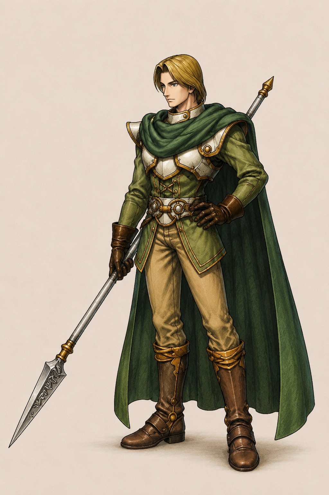
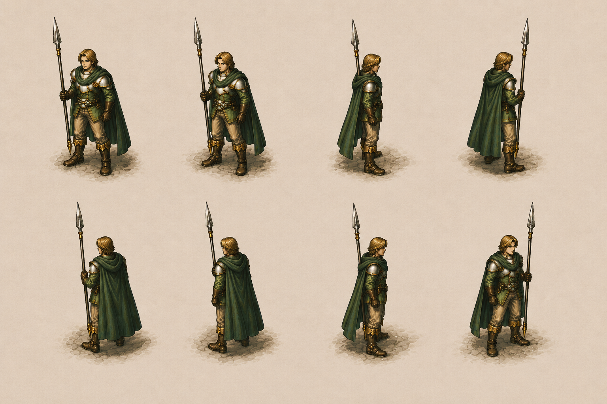
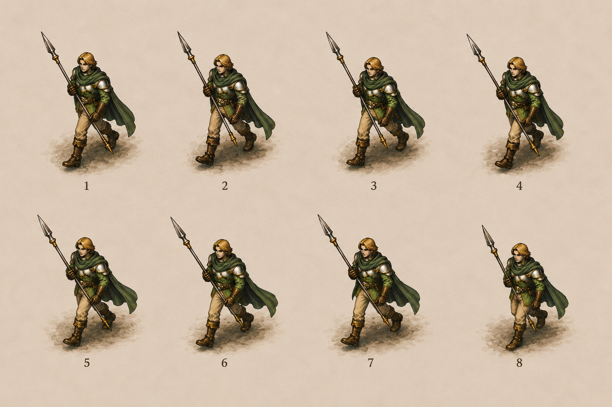
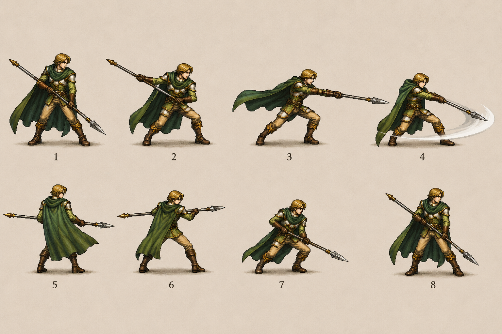

# Albert

> Roi de Serdio — second porteur du Jade Dragoon Spirit (héritage de Lavitz).
>
> **Sources canon** :
>
> - 🥈 [`_sources/lod-wiki-albert.md`](./_sources/lod-wiki-albert.md) — wiki LoD (stats per level, DLV thresholds, spell multipliers)
> - 🥉 [`_sources/fandom-albert.md`](./_sources/fandom-albert.md) — fandom (lore narratif, family, story beats par chapter, weapons list, additions tables détaillées per level, trivia)

## Statut

🟡 **draft** — données canon ingérées. Aucune impl character-spécifique (le character utilise probablement le même archetype Jade que Lavitz côté code).

## Profil

| Attribut          | Valeur                                                                                |
| ----------------- | ------------------------------------------------------------------------------------- |
| Identité          | **King Albert** (roi du **royaume de Basil**, nord de Serdio)                         |
| Nom JP            | アルバート (Arubāto)                                                                  |
| Âge               | 26                                                                                    |
| Taille            | **5'9" / 175 cm** (per Official Guidebook fandom — résout divergence height initiale) |
| Espèce            | Humain                                                                                |
| Sexe              | Male                                                                                  |
| Élément           | **Wind** (cf. [`combat/elements.md`](../combat/elements.md))                          |
| Archetype Dragoon | **Jade Dragon** (hérité de Lavitz)                                                    |
| Voice (EN)        | David Babich (partage avec **Melbu Frahma** — trivia)                                 |
| Voice (JP)        | Shinichirô Miki                                                                       |

### Apparence

Tall, slender, **long golden brown hair** in ponytail. **Yeux bleus** (fandom) ; wiki LoD disait "golden eyes" — ⚠️ légère divergence, à vérifier tier 1.

**Outfits canon** :

- **NPC king Bale** : royal green cape (red straps), royal green tunic, white pants, black boots/gloves, royal staff
- **Travel outfit** (party) : dark green cape, silver armor (gold trim), pale green tunic, light brown pants, dark brown boots
- **Hellena captured** : shirtless + light brown pants + dark brown boots + white belt
- **Dragoon form** : jade green armor (orange gem center) + jade green dragon headband + Dragoon Spear brown motif + wings pale yellow/jade green/orange. Plus slender que Lavitz Dragoon form.

### Design principal Damia (art direction) ⭐⭐⭐

> **Design canon Damia officiel** — [`_assets/albert-design-main.png`](./_assets/albert-design-main.png)
> Source de référence pour la dérivation des sprites Damia.

**Caractéristiques Damia confirmées** :

- **Cheveux** : blond doré (mi-longs, mèche front) — ✓ cohérent canon "long golden brown hair"
- **Cape** : vert sombre/forêt long, descendant aux mollets — ✓ cohérent travel outfit canon "dark green cape"
- **Armor** : silver pauldron gauche ornée (forme géométrique pointée) — ✓ cohérent "silver armor (gold trim)"
- **Tunique** : vert moyen longue-manches — ✓ cohérent "pale green tunic"
- **Ceinture** : ornée gold buckle + accents bruns
- **Pantalon** : light brown/khaki — ✓ cohérent canon
- **Bottes** : marron foncé hautes + sangles dorées — ✓ cohérent canon
- **Gants** : bruns avec accents
- **Arme** : **Lance** (Spear weapon canon Jade Dragoon archetype) — ✓ cohérent Lavitz/Albert weapon canon TLoD

**Design Damia = travel outfit canon (NOT NPC king Bale royal)** : cohérent party member combat-ready look. Pattern Damia : sprite combat design = travel outfit baseline canon.

⭐⭐⭐ **Lance visible canon confirmed** — weapon design Damia respecte Jade Dragoon archetype Spear weapon canon TLoD (cohérent Lavitz/Albert spear weapon canon + Greham/Syuveil archetype pattern).

### Sprite sheets Damia (base solide — animations détaillées à venir)

#### 1. Idle 8-directions ⭐⭐⭐

> [`_assets/albert-sprites-idle-8dir.png`](./_assets/albert-sprites-idle-8dir.png)

**8 frames idle facing canon** : front / 3/4 left / side left / back-side left / back / back-side right / 3/4 right / side right. Pattern Damia : **8-directional facing system canon** (cohérent classic JRPG / ARPG 8-way movement). Lance shoulderée + cape vert flowing pose statique.

#### 2. Walk/Run cycle ⭐⭐⭐

> [`_assets/albert-sprites-walk.png`](./_assets/albert-sprites-walk.png)

**8 frames walk/run cycle** : weight-shift sequential progression + cape vert flowing dynamique + lance shoulderée. Pattern Damia : **8-frame walk loop canon** (standard JRPG movement cycle).

#### 3. Combat/Attack poses ⭐⭐⭐

> [`_assets/albert-sprites-combat.png`](./_assets/albert-sprites-combat.png)

**8 frames combat séquence** :

- **Frames 1-4** : Spear thrust attack progression — charged → thrust → follow-through → sweep slash arc visible (Spear arc trail VFX canon)
- **Frames 5-8** : Defensive/guard poses — parry stance, side guard, raised guard, sweep finale

Pattern Damia : **spear thrust + sweep combat animation canon** Jade Dragoon archetype (cohérent Lavitz/Albert weapon use TLoD). Spear arc trail visible = Additions VFX canon Damia.

### Sprite analysis Damia

⭐⭐⭐ **Base solide validation** :

- **Consistency design** : couleurs/proportions cohérentes cross-sheets (cape vert sombre + tunique vert moyen + bottes marron + lance gold-tipped)
- **Travel outfit canon** respecté cross-sheets ✓
- **Pattern Damia confirmed** : 8-directional facing + 8-frame walk + 8-frame combat = **standard 8-frame animation system Damia** canon
- **Cape physics canon** : cape flowing direction-aware (visible walk cycle + 8-dir idle facing)
- **Lance weapon visible cross-sheets** ✓ Jade Dragoon archetype canon

### Sprite frames à venir (mentioned by user)

- Détails animations supplémentaires : attack chains (additions multi-hit) + Dragoon transformation + idle variations + dragon spear thrust + death sequence + dragon form sprites
- Pattern Damia futur : per-character animation sheets canon (cohérent existing Berserk Mouse / Flying Rat / Meru sprite patterns)

### Caractère

**Generous, compassionate, level-headed king**. Modest, humble, lacking arrogance/entitlement despite royalty. Deeply loved by people and knights. Wishes to be treated as **simple friend who travels** (like Lavitz, vs traitement royal).

**Poetic + well-educated + "nerdy"** :

- Knowledgeable Dragoons, Winglies, Virages, statistics
- Loves knowledge + reading (overflow d'enthousiasme à Mille Seseau National Library)
- Souvent **calm and rational mind** dans le groupe
- Cite historical facts, anatomical analysis (dismisses Haschel/Dart blood relation via statistique)

Roi savant, contemplatif (vs Lavitz plus guerrier direct).

## Story / lore (canon)

### Family lore (background)

- **Père** : **King Carlo** (loved by his people, murdered 20 years before game by Doel)
- **Oncle** : **Emperor Doel** (Carlo's brother, killed him, refused to accept Albert as king, defected, founded **Imperial Sandora** in southern Serdio)
- **Albert crowned at age 6** following his father's murder → Civil war (Imperial Sandora vs Kingdom of Basil) since
- **Royaume divisé** : Kingdom of Basil (nord, Albert) vs Imperial Sandora (sud, Doel)
- **Moon Gem** = trésor national de Serdio, **sealed inside Albert's body** (royal heir tradition)

### Joining party / Dragoon Spirit acquisition

- Rencontré pour la première fois à **[Bale](../locations/Bale.md)** (capital de Basil, nord de Serdio) dans le throne room de **Indels Castle** (Chapter 1, Disc 1).
- Capturé par Sandora pendant l'absence du party (Bale tombe en surprise attack) → emprisonné à **Hellena**.
- Sauvé par le party à Hellena. **Hooded Man = Lloyd** extrait le **Moon Gem** du corps d'Albert. **Lavitz transforms en Dragoon, attaque Lloyd, mortellement blessé par Dragon Buster**. Lavitz meurt dans les bras de Dart.
- **Jade Dragoon Spirit choose Albert** comme next master (à la fin de CD 1).
- Acquisition canon = pattern `inherited_from_predecessor` — Albert récupère :
  - Le Dragoon Spirit Jade
  - L'**état complet d'apprentissage** de Lavitz : additions débloquées + niveau de chaque, stats AT/DF/MAT/MDF, XP cumulé, DLV
- En Damia mode Story : substitution canonique (cf. [SCOPE §7.1](../../SCOPE.md#71-mode-story--fidélité-maximale-tlod)).
- En Damia mode Survival : Albert et Lavitz sont des **skins du Jade Dragoon archetype** (cf. [README skins](./README.md#skins-survival-mode)).

### Story arcs par chapter (canon)

> Beats narratifs résumés. Détail complet dans [`_sources/fandom-albert.md`](./_sources/fandom-albert.md). À orchestrer dans `quests/` futurs.

| Chapter                    | Key beats Albert                                                                                                                                                                                                                                                                                                                                            |
| -------------------------- | ----------------------------------------------------------------------------------------------------------------------------------------------------------------------------------------------------------------------------------------------------------------------------------------------------------------------------------------------------------- |
| **Ch.1 — Serdian War**     | Throne room Bale, Hellena captivity, Lavitz death + Spirit transfer, decides to **postpone royal duties** and live as Dragoon, Doel boss fight Black Castle (avenger arc)                                                                                                                                                                                   |
| **Ch.2 — Platinum Shadow** | Fletz visits (Claire Bridge stats nerd moment), **romance Princess Emille** (Twin Castle), Queen Fury (friendship Kongol), Phantom Ship (Black Monster realization), Lloyd confrontation Undersea Cavern, **Emille promises to wait**                                                                                                                       |
| **Ch.3 — Fate & Soul**     | Deningrad church + **Mille Seseau National Library nerdy moment**, Forbidden Land (Wingly ruins), Mountain of Mortal Dragon, **Lloyd defeated** Tower of Flanvel                                                                                                                                                                                            |
| **Ch.4 — Moon & Fate**     | Death Frontier intervention (Miranda vs Rose), Ulara, **[Aglis](../locations/Aglis.md) test of courage** (puts world before kingdom), Zenebatos, Mayfil (**Lavitz spirit encounter + final goodbye**), Moon That Never Sets (alternate Bale, **Doel rematch** + victory speech), Final Battle, **Epilogue : Wedding with Emille** in Bale (returns as king) |

### Relations clés

- **Lavitz** — close friend, knight, predecessor. Albert hérite tout de lui. Lavitz mort à Hellena ; spirit rencontré again à Mayfil pour final farewell.
- **Doel (uncle)** — meurtrier du père Carlo. Defeated twice (Black Castle Disc 1 + alternate Bale Disc 4). Albert apprend que Carlo trustait Doel → tragedy could have been avoided if they'd worked together.
- **Princess Emille** — love interest (real Emille after the imposter Lenus arc). Wedding in epilogue.
- **Lloyd** — killer of Lavitz. Albert's nemesis arc through Discs 2-3 until defeat at Tower of Flanvel.
- **Minister Noish** — political right hand at Bale.
- **Kongol** — friendship developed Queen Fury (Albert teaches Kongol "friends = walking same road").

## Combat

### Stats par level (canon)

Joins party au level de Lavitz à sa mort (donc niveau dépend du progress du joueur).

**Constants** (ne montent pas avec le level, seulement via équipement) :

| Speed | A-Hit | M-Hit | A-AV | M-AV |
| ----- | ----- | ----- | ---- | ---- |
| 40    | 100%  | 100%  | 0    | 0    |

**Progression Lv 1-60** : table complète dans [`_sources/lod-wiki-albert.md`](./_sources/lod-wiki-albert.md#stats). Exemples clés :

| Level | HP   | AT  | DF  | MAT | MDF |
| ----- | ---- | --- | --- | --- | --- |
| 1     | 35   | 3   | 4   | 2   | 2   |
| 10    | 330  | 34  | 31  | 14  | 10  |
| 20    | 1184 | 71  | 64  | 30  | 20  |
| 30    | 2384 | 108 | 97  | 48  | 45  |
| 40    | 3686 | 146 | 131 | 66  | 58  |
| 50    | 6381 | 183 | 164 | 86  | 85  |
| 60    | 8250 | 225 | 199 | 108 | 97  |

XP cumulé pour level 60 = **387,730**.

### Additions (Jade Dragon)

Identiques à Lavitz (archetype partagé). Détail dans [`combat/additions.md`](../combat/additions.md).

| Addition           | Inputs | Dmg% (Maxed) | SP (Maxed) | Acquisition                 |
| ------------------ | ------ | ------------ | ---------- | --------------------------- |
| Harpoon            | 1      | 150%         | 50         | Initial                     |
| Spinning Cane      | 2      | 200%         | 35         | Level 5                     |
| Rod Typhoon        | 4      | 202%         | 100        | Level 7                     |
| Gust of Wind Dance | 6      | 350%         | 35         | Level 11                    |
| Flower Storm       | 7      | 405%         | 202        | Maîtriser toutes les autres |

> **Trivia voice canon** : pour l'addition **Flower Storm** (texte affiché), Albert dit **"Blossom Storm"** vocalement, tandis que Lavitz dit **"Rose Storm"**. Différence de voice line uniquement, mêmes mécaniques. → Damia : si on veut respecter ce détail, mapper voice clip distinct par avatar.

## Dragoon Form — Jade Dragon

### DLV thresholds & multipliers (canon)

| DLV | SP lifetime (cumul threshold) | AT bonus | DF bonus | MAT bonus | MDF bonus |
| --- | ----------------------------- | -------- | -------- | --------- | --------- |
| 1   | -                             | 150%     | 200%     | 200%      | 200%      |
| 2   | 1,000                         | 155%     | 210%     | 205%      | 210%      |
| 3   | 6,000                         | 160%     | 220%     | 210%      | 220%      |
| 4   | 12,000                        | 165%     | 230%     | 215%      | 230%      |
| 5   | 20,000                        | 170%     | 250%     | 220%      | 250%      |

> Multipliers appliqués aux stats character **uniquement en form Dragoon** (transformés). Cohérent avec [VISION §6.2](../../VISION.md#62-dlv-dragoon-level--progression) — DLV progresse via SP lifetime cumulé.

### Sorts Dragoon Magic — Jade Dragon

| Spell        | Multiplier | Target       | Coût MP | DLV unlock  | Effet                                                  |
| ------------ | ---------- | ------------ | ------- | ----------- | ------------------------------------------------------ |
| Wing Blaster | 100        | All Enemies  | 20      | 1 (initial) | **Wind** magic damage                                  |
| Rose Storm   | —          | All Allies   | 20      | 2           | **Power Up** modifier sur allies (cf. note ci-dessous) |
| Gaspless     | 300        | Single Enemy | 30      | 3           | **Wind** magic damage                                  |
| Jade Dragon  | 300        | All Enemies  | 80      | 5           | **Wind** magic damage                                  |

> **Note Rose Storm** — important pour l'archi modifier : Rose Storm **active le Power Up modifier sur les party members**. Conséquences canon :
>
> - Item Power Up et Rose Storm **ne stack pas** (même variable)
> - Attaques qui **ignorent Power** dans leur formule (Rare Monster Rare Attack, Ghost Commander Haunting Bolt) **ignorent aussi Rose Storm**
> - Persiste pendant **3 tours** (canon turn-based — à adapter en RT Damia)
> - Persiste même à HP=0, donc reste actif si l'allié est ressuscité
>
> → Implication code Damia : le **Power modifier** doit être un état per-entity, pas global. Cohérent avec le wrapper de modifiers documenté dans [`combat/damage-formula.md`](../combat/damage-formula.md). Tracé dans [`TODO.md`](../../TODO.md).

### Arme élémentale

**Twister Glaive** (Wind) — partagée Lavitz/Albert (cf. [`combat/elements.md`](../combat/elements.md#armes-élémentales-physical)).

### Weapons progression (canon, 7 weapons)

Albert wields a **spear** (taught by Lavitz). Progression canon :

| Weapon             | Stat | Buy  | Sell | Location                                | Effect                   |
| ------------------ | ---- | ---- | ---- | --------------------------------------- | ------------------------ |
| Spear              | 4    | N/A  | 10   | Initial / Hellena Prison (2nd) / Merman | —                        |
| Lance              | 19   | 100G | 50   | The Seventh Fort / Lohan                | —                        |
| **Twister Glaive** | 28   | 140G | 70   | Kazas                                   | **Wind elemental**       |
| Glaive             | 37   | 250G | 125  | Queen Fury                              | —                        |
| Spear of Terror    | 45   | 300G | 150  | Deningrad                               | **Chance to cause Fear** |
| Partisan           | 56   | 400G | 200  | Vellweb                                 | —                        |
| Halberd            | 65   | 500G | 250  | Moon / Zackwell                         | —                        |

→ À documenter dans `items/equipment.md` (à créer) avec tous les characters' weapons.

### Gameplay analysis (canon)

Per fandom :

- **High HP**, strong **physical offense + defense**
- **Subpar speed** (40, second lowest)
- **Second worst Magical Attack + Magical Defense** du cast → vulnérable aux sorts ennemis (marginally MDF mieux que Kongol mais slightly less HP)
- **Highest damage outputs** avec Gust of Wind Dance + Flower Storm parmi le cast
- **Additions précoces** (notamment Rod Typhoon + Gust of Wind Dance) → Final Addition theoretically achievable in CD 1 avec grinding
- **Rose Storm** cité parmi les meilleurs Dragoon Magic spells du jeu (half damage reduction 3 turns)

**Role-type** : tank physical / DPS spear, weak magical defense.

### Dragoon Magic details + clarification STR%

| Spell        | DLV | MP  | Target       | Effect (fandom)                                             | Multiplier canon (Wulves) |
| ------------ | --- | --- | ------------ | ----------------------------------------------------------- | ------------------------- |
| Wing Blaster | 1   | 20  | All enemies  | Wind, **STR 25%**                                           | **100**                   |
| Rose Storm   | 2   | 20  | All allies   | **Halves damage 3 turns** (Power Up modifier, cf. Albert §) | —                         |
| Gaspless     | 3   | 30  | Single enemy | Wind, STR 75% (in-game shows 100% — **typo canon**)         | **300**                   |
| Jade Dragon  | 5   | 80  | All enemies  | Wind, **STR 75%**                                           | **300**                   |

> ⚠️ **STR % in-game ≠ damage Multiplier réel** (clarif fandom) :
>
> - Le **STR %** affiché dans le menu status est probablement un indicateur UI relatif (compare spells au sein d'un Dragoon)
> - Le **Multiplier** utilisé par la formule canon est dans Wulves doc ([`combat/damage-formula.md`](../combat/damage-formula.md))
> - Distinction importante pour code Damia : **ne pas confondre les deux**. UI peut afficher STR % canon-style, mais le calcul utilise Multiplier.

## Vision Damia

### Story mode

- Substitution **canon** Lavitz → Albert (héritage complet état apprentissage). Pattern `inherited_from_predecessor`.
- Mêmes mécaniques que Lavitz (additions identiques, Dragoon Magic identiques, Twister Glaive shared).
- Voice line distincte (Blossom Storm) si on veut respecter le détail canon.

### Survival mode

- Albert = **skin** du Jade Dragon archetype, unlockable via méta-progression.
- Aucune divergence mécanique vs Lavitz (skin = changement visuel + voice line uniquement).
- Cf. [`README.md`](./README.md#skins-survival-mode).

### À implémenter / vérifier

- Pattern `Archetype + Avatar` côté code (cf. [VISION §6.6](../../VISION.md#66-personnages-partagés-skins)) — état actuel à vérifier (probablement partiellement en place via `DragoonArchetype` + `CharacterAvatar`).
- Transfert d'état Lavitz → Albert au death event (additions levels, stats, XP, DLV, MP) — à wirer.
- Voice line par avatar (distinct Blossom/Rose Storm).
- DLV thresholds + multipliers Jade Dragon → câbler dans data archetype (1k, 6k, 12k, 20k SP ; AT 150-170%, DF 200-250%, MAT 200-220%, MDF 200-250%).

## Liens code & doc

- **Source canon (wiki)** : [`_sources/lod-wiki-albert.md`](./_sources/lod-wiki-albert.md)
- **Additions Jade** : [`../combat/additions.md`](../combat/additions.md) (table Lavitz / Albert)
- **Élément Wind** : [`../combat/elements.md`](../combat/elements.md)
- **Mécaniques Dragoon partagées** : [`../dragoons/README.md`](../dragoons/README.md)
- **Damage modifier Power (Rose Storm)** : [`../combat/damage-formula.md`](../combat/damage-formula.md) et `damage-modifiers.md` (à créer)
- **Code archetype** : `src/data/characters/types.ts` (à vérifier) — `DragoonArchetype`, `CharacterAvatar`
- **Code balance** : `src/data/balance.ts` (stats curve, additions)

## Questions ouvertes

- **Confirmer "Lavitz=Albert exactly"** côté stats : la table Lavitz canon wiki doit être identique. À vérifier quand on ingère Lavitz page.
- **Rose Storm 3 turns** — comment porter en real-time Damia ? Timer (3 × N secondes ?) ou X attaques reçues ? À trancher au moment du status effects design.
- **Voice line par avatar** — décision design : on map des voice clips par avatar (Blossom/Rose Storm) ou on accepte une voice line unique par addition (simplification) ? Fandom clarifie : Lavitz/Albert utilisent leur **favorite flower** (Rose vs Blossom). JP version unifie "Cherry Blossom Blizzard".
- **Transition Lavitz → Albert** mode Story : moment exact = fin de CD 1 à Hellena post-Lloyd. Cutscene Spirit transfer to draft.
- **Eye color divergence** : wiki LoD "golden eyes" vs fandom "blue eyes" — à vérifier tier 1 (screenshot in-game ou Discord communauté).
- **STR % vs Multiplier in-game** — clarifier dans UI Damia si on affiche STR % canon-style ou le Multiplier directement. Décision design.
- **Wedding epilogue** — porter ou non en Damia mode Story ? Cutscene narratif end-game.
- **Doel rematch alternate dimension** (Moon That Never Sets) — gameplay mécanique unique (Albert solo boss fight ?). Design à acter.
- **Lavitz spirit encounter Mayfil** — story beat majeur (Lavitz possessed, demonic device, self-impale). À orchestrer en cutscene + boss fight (Zackwell).
