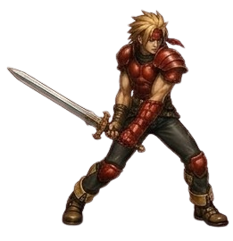
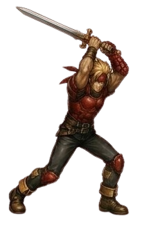
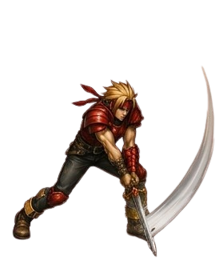

# Dart Feld

> **Protagoniste canon de TLoD**, **Red-Eye Dragoon** (Fire). **Hometown REAL : Neet** (où il est né), réfugié à **Seles** après la destruction de Neet par le **Black Monster** il y a **18 ans** (Dart avait 5 ans). **Fils de Zieg Feld et Claire Feld**. Jeune guerrier parti 5 ans pour chasser le meurtrier de ses parents → revient pour trouver Seles ravagée par Imperial Sandora + Feyrbrand. **Seul personnage canon à porter 2 Dragoon Spirits** (Red-Eye + Divine Dragon) **et 2 éléments** (Fire + Non-Elemental). **Toujours en active party**. **Haschel = grandfather canon** (reveal disputé Disc 4).
>
> **Sources canon** :
>
> - 🥈 [`_sources/lod-wiki-dart.md`](./_sources/lod-wiki-dart.md) — wiki LoD (stats Lv 1-60, additions, DLV thresholds, spells, trivia)
> - 🥉 [`_sources/fandom-dart.md`](./_sources/fandom-dart.md) — fandom (hometown Neet, parents Zieg+Claire, Black Monster 18 ans, design Red-Eye + Divine Dragoon, additions Lv 1-5 progression, weapons table, Haschel grandfather reveal, JP voice Seki Tomokazu, 3 transformations canon)

## Statut

🟡 **draft** — data canon ingérée. **Protagoniste = priorité haute** (base implémentation party + tutorial Story).

## Profil

| Attribut          | Valeur                                                                                                                                                                                                         |
| ----------------- | -------------------------------------------------------------------------------------------------------------------------------------------------------------------------------------------------------------- |
| Nom complet       | **Dart Feld** (ダート・フェルド, Dāto Ferudo)                                                                                                                                                                  |
| Age               | **23 ans** (Official Guidebook)                                                                                                                                                                                |
| Height            | **178cm** (= 5'10" per fandom / 5'8" per wiki LoD — **178cm ≈ 5'10" exact**)                                                                                                                                   |
| Species           | **Human**                                                                                                                                                                                                      |
| Gender            | **Male**                                                                                                                                                                                                       |
| **Élément**       | **Fire** (Red-Eye) + **Non-Elemental** (Divine Dragoon) — **seul perso canon avec 2 éléments**                                                                                                                 |
| Archetype Dragoon | **Red-Eye Dragon** (Fire) — Zieg Feld's predecessor                                                                                                                                                            |
| 2ᵉ DS canon       | **Divine Dragon** (Non-Elemental) — auto sets DLV 5 lors d'acquisition (Disc 4 from Lloyd, post-initial Melbu Frahma fight)                                                                                    |
| Apparence canon   | **Short spiked blonde hair with fringes**, **blue eyes**, **red headband**, red armor + single gauntlet (left), black undershirt, blue-gray pants, red knee-pads                                               |
| Voice Artist      | EN **John Butterfield** / JP **Seki Tomokazu**                                                                                                                                                                 |
| **Hometown réel** | **Neet** (détruit par Black Monster il y a 18 ans, Dart avait 5 ans, parents morts)                                                                                                                            |
| Village de vie    | **Seles** (refuge post-Neet, Forest of Seles area, near Bale)                                                                                                                                                  |
| Sword master      | **Tasman** (NPC Seles survivor)                                                                                                                                                                                |
| Childhood friend  | **Shana** (kidnapped to Hellena Prison Disc 1 intro)                                                                                                                                                           |
| Family            | **Père : Zieg Feld** (Red-Eye Dragoon ancien, reveal Disc 4 possédé par Melbu Frahma) + **Mère : Claire Feld** (morte 18 ans pre-game) + **Grandfather : Haschel** (probable maternal — reveal disputé Disc 4) |
| Status combat     | **Cannot be removed** from active party (toujours présent sauf story circumstances) — _permanent and non-replacable_                                                                                           |
| Acquisition Story | **Disc 1, scene initiale** (Forest of Seles intro) — DS already in possession, **unlock combat use post-Hoax battle vs Kongol** (Rose intervention canon)                                                      |

## Sprites Damia (art direction)

### Basic Attack 3-frame animation ⭐⭐⭐ TEST

Decomposed 3-frame basic attack animation canon Damia :

#### Frame 1 — Stance (combat ready)

> [`_assets/dart-basic-attack-1-stance.png`](./_assets/dart-basic-attack-1-stance.png)

**Pose canon** : combat-ready guard stance — both hands gripping hilt, sword pointing forward-down, body angled. Pattern Damia : neutral combat stance pre-attack canon.

#### Frame 2 — Wind-up (overhead raise)

> [`_assets/dart-basic-attack-2-windup.png`](./_assets/dart-basic-attack-2-windup.png)

**Pose canon** : wind-up overhead raise — both hands gripping hilt high, sword raised vertical above head, body coiled. Pattern Damia : preparation/anticipation frame canon (charge phase).

#### Frame 3 — Slash (follow-through with arc trail)

> [`_assets/dart-basic-attack-3-slash.png`](./_assets/dart-basic-attack-3-slash.png)

**Pose canon** : slash follow-through with **motion arc trail visible** — sword swung down/across, body extended forward, VFX slash arc canon. Pattern Damia : impact/follow-through frame canon avec **slash arc trail VFX** (cohérent existing Additions VFX canon Red-Eye Dragoon thematic).

### Sprite analysis Damia

⭐⭐⭐ **3-frame basic attack canon Damia TEST** :

- **Consistency design** : couleurs/proportions cohérentes cross-frames (red armor + red headband + black undershirt + blue-gray pants + red knee-pads + spiked blonde hair) — cohérent canon apparence Dart existing
- **Animation arc canon** : Stance → Windup → Slash = classic 3-frame attack pattern (cohérent JRPG / ARPG basic attacks)
- **Slash arc VFX frame 3** : trail visible = **VFX-ready sprite canon** Damia (animation post-prod / particle system trigger frame)
- **Combat-ready apparence** : Dart in standard party combat outfit canon (vs NPC outfit or Dragoon form)

### Pattern Damia établi

- **3-frame basic attack canon TEST** Dart — à valider par implementation + visual playback
- À comparer avec Albert 8-frame combat sheet existing canon (denser animation)
- Pattern Damia futur : si 3-frame validé, frames complémentaires possibles (idle / walk / death / hit-react / additions multi-hit)

### Sprite frames à venir (TODO futur)

- **Idle animation canon** : "cross arms + tap foot" canon existing (cf. ligne ~282 — à reproduire en sprite/animation iso)
- **Walk / Run cycle** (cohérent Albert 8-frame walk pattern)
- **Hit reaction + Death sequence**
- **Additions multi-hit chains** : Double Slash / Volcano / Crush Dance / Madness Hero / Moon Strike / Burning Rush / Blazing Dynamo
- **Dragoon transformation** + Red-Eye Dragoon form sprites + Divine Dragoon form sprites
- **Spell cast poses** Dragoon Magic
- **Guard / Defending** action stance

## Story / lore

### Backstory canon (18 ans pre-game → 5 ans pre-game)

- **Né à Neet** (village natal) — fils de **Zieg Feld** + **Claire Feld**
- **18 ans avant le jeu** : Le **Black Monster** attaque et détruit Neet → **parents tués** → Dart, alors **âgé de 5 ans**, est un des rares survivants
- Quote manual canon : "_He is a brave and loyal warrior swordsman sworn to avenge the death of his parents by destroying the Black Monster. Dart carries the soul of the Dragoon._"
- **Child Dart canon design** : brown winter jacket, white high-neck undershirt, dark green pants, black shoes (cf. flashback canon)
- **Dragoon Spirit found by Dart child dans les ashes de Neet** post-Black Monster attack (cf. fandom gallery "Young dart" caption)
- Dart accompagne sa famille survivante (?) ou seul → s'installe à **Seles** (Forest of Seles area, near Bale) → vit avec **Tasman** (sword master) + childhood friend **Shana**
- **5 ans pré-game** : Dart débute son **5-year journey** pour chasser le **Black Monster** (le tueur de ses parents)
- Quête off-screen 5 ans → revient au début du jeu

### Chapter 1: Serdian War (acquisition canon)

1. **Outskirts de Seles** (retour de la 5-year journey) : accosté par 2 **Knights of Sandora**
2. **Giant monster** (Feyrbrand canon) attaque → fait fuir tout le monde
3. **Rose** (mysterious woman) sauve Dart
4. Rose remarque : "strange that a Dragon was sent" (overkill pour un village)
5. Dart réalise = Seles ciblée → rush home
6. Trouve **Seles en ruines** : defeats Sandora soldiers
7. Trouve survivors including **Tasman** (sword master)
8. Apprend que **Shana** (childhood friend) a été kidnapped à **Hellena Prison**
9. Resolves to free her → quest Hellena Prison débute

### Hoax battle — DS unlock canon (Chapter 1 middle)

- Dart **a déjà le Red-Eye Dragoon Spirit** dans ses affaires (depuis l'enfance Neet) mais ne peut **pas** l'utiliser
- À **Hoax**, Dart et Lavitz struggle vs **Kongol**
- **Rose intervient** et **calls forth the spirit of the Red-Eyed Dragon**
- **Dart bursts en énergie Dragoon** → knocks out Kongol
- À partir de là, **accès à la DS** unlocked

### Arc narratif global

- **Disc 1 — Serdian War** : libération Shana Hellena + Bale Hero Competition + Hoax → **DS unlock** + Black Castle Doel
- **Disc 2 — Platinum Shadow** : Tiberoa + Black Monster reveal (Rose = Black Monster) + Phantom Ship + Lenus arc + Mountain of Mortal Dragon Regole boss
- **Disc 3 — Fate & Soul** :
  - Mille Seseau (Deningrad National Library nerdy moment Albert + reveal Dart survivant Neet via Ute)
  - **Divine Dragon awakens + attaque Deningrad** → quest Mountain of Mortal Dragon → Divine Dragon boss fight → **acquisition power Divine Dragon** (vs Cannon Lloyd takes ??)
  - Tower of Flanvel Lloyd fight
  - Shana abducted to Vellweb by Emperor Diaz → setup Chapter 4
- **Disc 4 — Moon & Fate** : Mayfil + Aglis + Vellweb (4 anciens Dragoons libération) + Moon That Never Sets
  - **Reveal Zieg Feld = Dart's father** (Red-Eye Dragoon ancien, survivant Dragon Campaign, possédé par Melbu Frahma)
  - **Acquisition Divine Dragoon DS** : de **Lloyd**, post-initial Melbu Frahma fight (avant final battle)
  - Final boss Melbu Frahma → fin canon

### 3 transformations Red-Eye outside player control canon

1. **Premier transform** : defeat Kongol post-Hoax (Rose calls forth spirit)
2. **Second transform** : Dart blocks magic of vengeful **elder Bardel Brother**
3. **Third transform** : Dart attempts to strike Zieg (possédé Melbu Frahma) — **fails**, Zieg overpowers Dart en un coup

### Personality canon

- Heart heavy (tragedy childhood) mais **positive et idealistic outlook**
- Always helps a friend in need
- **Loyalty + unwavering bravery**
- Straightforward + practical
- **Accepts feelings for Shana** pendant l'aventure (canon romance reveal)
- Treats companions avec respect + camaraderie
- Eventually comes to closure about his past

## Stats canon (Lv 1-60)

> Stats croissent en AT/DF/MAT/MDF level-up. SPD/A-Hit/M-Hit/A-AV/M-AV constants (équipement-modifiables).

### Stats constantes

| SPD | A-Hit | M-Hit | A-AV | M-AV |
| --- | ----- | ----- | ---- | ---- |
| 50  | 100%  | 100%  | 0    | 0    |

> SPD 50 = **average canon** (à comparer avec autres party-members). Indicateur balance turn order PSX original.

### Progression Lv 1-60 (cf. [`_sources/lod-wiki-dart.md`](./_sources/lod-wiki-dart.md) pour table complète)

| Milestone | HP    | AT  | DF  | MAT | MDF | XP cumul |
| --------- | ----- | --- | --- | --- | --- | -------- |
| Lv 1      | 30    | 2   | 4   | 3   | 4   | -        |
| Lv 10     | 300   | 22  | 23  | 21  | 21  | 1,600    |
| Lv 20     | 1,077 | 47  | 48  | 46  | 48  | 12,800   |
| Lv 30     | 2,168 | 72  | 73  | 71  | 71  | 43,200   |
| Lv 40     | 3,351 | 97  | 98  | 96  | 98  | 102,400  |
| Lv 50     | 5,801 | 122 | 123 | 121 | 121 | 200,000  |
| Lv 60     | 7,500 | 150 | 150 | 150 | 150 | 382,000  |

> ⚠️ **Divergence stats fandom Lv 10** : fandom indique MAT 14 / MDF 10 (au lieu de 21/21 wiki LoD). Wiki LoD prime (🥈 > 🥉) — probable typo fandom à Lv 10.

### Analyse gameplay canon (fandom)

- **All-rounder** : stats moyennes sauf **HP au-dessus de la moyenne** → high survivability
- **Cannot be replaced** (toujours en active party)
- **Male character avec strongest Magical Attack + Magical Defense** (canon trivia)
- **Highest amount of Additions** (7 vs ~4-6 autres characters)
- **Longest play time** → master all additions naturally
- **Almost guaranteed DLV 5** durant le game normal (sans grinding)
- **Fire element** beneficial vs **decent amount of Water enemies** canon
- **All spells offensives no further effect** (simple but effective)
- **Final Burst** = signature high damage canon
- **Most consistent + least polarizing character** of the cast canon

> Notable :
>
> - Stats AT/DF/MAT/MDF **convergent vers 150 à Lv 60** (équilibre final)
> - HP scaling : 30 → 7,500 (×250 sur 60 levels)
> - XP curve : exponentielle douce (Lv 30 → 60 = 339k XP, près de 90% du total)
> - Stats AT progression diverge légèrement Lv 12-21 (jump de 413 HP par level) — break point balance canon

## Weapons canon (8 swords)

| #   | Name              | Attack | Price | Source                                 | Effect canon                  |
| --- | ----------------- | ------ | ----- | -------------------------------------- | ----------------------------- |
| 1   | **Broad Sword**   | 2      | —     | Start, Hellena, Skeleton               | —                             |
| 2   | **Bastard Sword** | 7      | 60G   | Limestone Cave, Bale, Hellena, Mr Bone | —                             |
| 3   | **Heat Blade**    | 18     | 150G  | Kazas, Kashua Glacier                  | **Fire elemental attack**     |
| 4   | **Falchion**      | 26     | 250G  | Fueno                                  | —                             |
| 5   | **Mind Crush**    | 34     | 350G  | Kashua Glacier, Forbidden Land/Kadessa | **Chance to cause Confusion** |
| 6   | **Fairy Sword**   | 39     | 400G  | Ulara                                  | **Gain 50% more SP**          |
| 7   | **Claymore**      | 44     | 500G  | Moon                                   | —                             |
| 8   | **Soul Eater**    | 75     | —     | Polter Armor, Loner Knight             | **Loses 10% HP each turn**    |

> Notable :
>
> - **Heat Blade** (Disc 1 Kazas Disc 2 Kashua) = Fire elemental signature canon — cohérent Dart Red-Eye
> - **Fairy Sword** (Ulara) = +50% SP gain — synergy avec Dragoon form (Madness Hero 204 SP + Fairy Sword = burst transform)
> - **Mind Crush** = Confusion proc (cf. [`../combat/status-effects.md`](../combat/status-effects.md) à créer)
> - **Soul Eater** AT 75 highest mais **-10% HP/turn** = trade-off endgame
> - **Claymore** Moon = endgame "neutral" sword Disc 4
> - Pattern : weapons sources cross 4 discs (Bale → Kazas → Kashua → Forbidden Land/Ulara → Moon)
> - Cf. divergence price Heat Blade : wiki LoD 150G (kazas) vs fandom 150G — cohérent ici ✅

## Additions canon (7 total)

| #   | Name               | Inputs | Dmg% Maxed | SP Maxed | Acquisition canon                        |
| --- | ------------------ | ------ | ---------- | -------- | ---------------------------------------- |
| 1   | **Double Slash**   | 1      | 202%       | 35       | Initial (Lv 1)                           |
| 2   | **Volcano**        | 3      | 250%       | 36       | Level 2                                  |
| 3   | **Burning Rush**   | 2      | 150%       | 102      | Level 8                                  |
| 4   | **Crush Dance**    | 4      | 250%       | 100      | Level 15                                 |
| 5   | **Madness Hero**   | 5      | 100%       | **204**  | Level 22                                 |
| 6   | **Moon Strike**    | 6      | 350%       | 20       | Level 29                                 |
| 7   | **Blazing Dynamo** | 7      | **450%**   | 150      | **Perform all prior additions 80 times** |

> 🆕 Données canon **complètes** Dart additions :
>
> - **Madness Hero** = **highest base SP canon (204)** parmi toutes les additions du jeu
> - **Moon Strike** = high damage (350%) faible SP (20) → addition "économique"
> - **Blazing Dynamo** = **ultimate Dart** (450% damage, 7 inputs) → unlock via 80 uses de chaque addition précédente (= **480 uses total prior additions**)
> - Pattern unlock : **6 additions level-gated** (Lv 2/8/15/22/29) + **1 unlocked via mastery** (Blazing Dynamo)

### Progression Lv 1-5 par addition (fandom canon)

> Distinction important canon : **certaines additions scalent damage**, d'autres **scalent SP** seulement, d'autres scalent les deux.

| Addition       | Damage Lv 1→5     | SP Lv 1→5   | Type scaling                              |
| -------------- | ----------------- | ----------- | ----------------------------------------- |
| Double Slash   | 150% → **202%**   | 35 constant | Damage scaling, SP fixe                   |
| Volcano        | 200% → **250%**   | 20 → 36     | **Damage + SP scaling** (modéré)          |
| Burning Rush   | **150% constant** | 30 → 102    | **SP scaling pur** (battery rapide)       |
| Crush Dance    | 150% → **250%**   | 50 → 100    | **Damage + SP scaling** (équilibré)       |
| Madness Hero   | **100% constant** | 60 → 204    | **SP scaling pur extreme** (max battery)  |
| Moon Strike    | 200% → **350%**   | 20 constant | Damage scaling pur, SP fixe               |
| Blazing Dynamo | 250% → **450%**   | 100 → 150   | **Damage + SP scaling** (modéré ultimate) |

→ Notable pour Damia (le code) :

- Data-model `Addition.scaling: { damageByLevel: number[], spByLevel: number[] }` (pas une simple formule linéaire)
- Pattern intentionnel canon : **diversité de scaling** par addition → joueur choisit selon besoin (damage ou SP gen)
- **Madness Hero** = "pure battery" : 0 damage scaling, +240% SP scaling → **SP generator extreme**

→ Adaptation Damia (le code) : **Q1 = auto-complete** (cf. [`../combat/additions.md`](../combat/additions.md) §Q1). 7 additions toutes utilisables ; gating canon respecté.

## Dragoon Form

### D'levels (SP thresholds canon)

| DLV | SP threshold | AT bonus | DF bonus | MAT bonus | MDF bonus |
| --- | ------------ | -------- | -------- | --------- | --------- |
| 1   | -            | 150%     | 200%     | 150%      | 200%      |
| 2   | 1,200        | 155%     | 210%     | 155%      | 210%      |
| 3   | 6,000        | 160%     | 220%     | 160%      | 220%      |
| 4   | 12,000       | 165%     | 230%     | 165%      | 230%      |
| 5   | 20,000       | 170%     | 250%     | 170%      | 250%      |

> Cohérent avec Albert (Jade DLV thresholds identiques canon). **Pattern : SP thresholds DLV 1-5 partagés entre tous les Dragoons** (à confirmer Meru/Rose/etc.).

### Divine Dragon DS override (DLV 5 forcé)

| Bonus | DLV 5 Red-Eye | DLV 5 Divine Dragon |
| ----- | ------------- | ------------------- |
| AT    | 170%          | **340%** (× 2)      |
| DF    | 250%          | 250%                |
| MAT   | 170%          | 170%                |
| MDF   | 250%          | 250%                |

> **Divine Dragon DS = power spike majeur** : double l'AT bonus (170% → 340%). Bug canon : **Status menu affiche les stats Red-Eye** (incorrectes) au lieu de Divine Dragon.
>
> → À documenter dans `combat/known-bugs.md` (à créer) ou data-model `dragoon-form.md`. **Damia (le code) doit afficher les bonnes stats.**

### Spells canon

#### Red Dragon DS (Fire element, 4 spells)

| Spell              | Multiplier (wiki LoD) | STR% (display) | Target       | Cost | Acquisition |
| ------------------ | --------------------- | -------------- | ------------ | ---- | ----------- |
| **Flame Shot**     | 200                   | 50%            | Single Enemy | 10   | DLV 1 init  |
| **Explosion**      | 100                   | 25%            | All Enemies  | 20   | DLV 2       |
| **Final Burst**    | 300                   | 75%            | Single Enemy | 30   | DLV 3       |
| **Red-Eye Dragon** | 300                   | **75%** \*     | All Enemies  | 80   | DLV 5       |

> \* **Red-Eye Dragon STR%** : description in-game indique **175% (erreur canon)**, mais c'est **75%** (vérifié JP version, damage identique à Final Burst). Source: ref [1] fandom.
>
> Notable :
>
> - **DLV 4 = pas de nouveau spell** pour Dart (pattern canon : 1 spell par DLV sauf DLV 4 souvent skip)
> - **STR% vs Multiplier** : Multiplier = formula damage variable réel (canon Wulves) ; STR% = display in-game unreliable. Damia (le code) : utiliser Multiplier en data, choix UI STR% style à trancher

#### Divine Dragon DS (Non-Elemental, 2 spells initiaux)

| Spell                | Multiplier (wiki LoD) | STR% (display) | Target       | Cost | Acquisition   |
| -------------------- | --------------------- | -------------- | ------------ | ---- | ------------- |
| **Divine DG Ball**   | **400**               | 50%            | All Enemies  | 50   | Initial DLV 5 |
| **Divine DG Cannon** | **600**               | 100%           | Single Enemy | 50   | Initial DLV 5 |

> ⚠️ **Spells canon Divine Dragon DS** :
>
> - **Non-Elemental** confirmé (cohérent canon Disc 3 : Divine Dragon boss attaque Deningrad utilise Divine DG Ball + Cannon — Dart hérite le pouvoir)
> - **400 / 600 multipliers** = les plus hauts du jeu (vs Final Burst 300 / Red-Eye Dragon 300 max Red-Eye)
> - **Coût 50 MP** chacun = très accessible
> - **Initial DLV 5** acquisition → arme endgame Disc 4
> - Quote fandom : "_The Divine Dragoon uses the two strongest attacks the Divine Dragon himself uses. They are extremely strong, almost unrivaled in terms of their damage output relative to the MP used._"
>
> Cross-ref : [Divine Dragon boss](../bosses/Divine Dragon.md) (à créer) utilise les mêmes abilities (cohérent narrative — Dart hérite le pouvoir).

> ⚠️ **BS fandom à ignorer** : fandom claim "Divine Dragoon spells deal **double damage against enemies of all other elements**" — **FAUX, confirmed Discord canon** (Icarus + DrewUniverse). Non-Elemental = juste no resist & no opposite, **PAS ×2**. Cf. [`../combat/elements.md`](../combat/elements.md) + [`../combat/_sources/discord-tlod-clarifications.md`](../combat/_sources/discord-tlod-clarifications.md).

## Vision Damia

### Mode Story

- **Disc 1 intro** = **tutorial canon** Damia. Dart = character par défaut, joueur apprend mouvement + combat de base
- **Cannot leave party** → toujours sélectionné en Story team picker
- **Acquisition Red-Eye DS** (cinematic Disc 1) = première transformation Dragoon → tutorial Dragoon form
- **Acquisition Divine Dragon DS** (Disc 3 → 4) = power spike majeur. DLV 5 auto + AT 340% = boss-killer ultime
- **Backstory revealed Disc 3-4** (Neet survivor + Zieg Feld father) → twist narrative à orchestrer
- **Idle animation** canon : cross arms + tap foot → à reproduire en sprite/animation iso
- **Dispirited animation** : arms down + sword hanging → indicator visuel statut canon
- **Red HP animation** : down on one knee → indicator visuel low HP canon
  → Animations critiques pour identité visuelle Dart fidèle

### Mode Survival

- **Avatar par défaut** Mode Survival probable (Dart = protagoniste reconnaissable)
- Skins possibles : "beta Dart" (orange armor, hauteur résolution PSX), Divine Dragon Dart, autres
- **Red-Eye Dragon Archetype** : 1 avatar canon (Dart) + skins Survival à créer
- **Madness Hero 204 SP** = générateur SP highest → mécanique "burst Dragoon transformation rapide" canon
- Possible Survival run : **Red-Eye then Divine Dragon power-up** mid-run (rare DS drop ?)

### Adaptation Damia code

- **Stats Lv 1-60 canon** : à reproduire dans `src/data/balance.ts` PARTY_MEMBERS (Dart entry)
- **Additions auto-complete** (Q1 décision) — Damage% Maxed canon
- **DLV thresholds 1,200/6,000/12,000/20,000 SP** canon
- **Cap performance 99** (cf. [VISION §6](../../VISION.md) Q6 décision)
- **Level-up immediate** (Q5 Diablo 2-style)
- **Divine Dragon DS power spike** : auto DLV 5 + AT bonus 340% (override Red-Eye 170%)
- **Bug Status menu Divine Dragon DS** : NE PAS reproduire (afficher bonnes stats)
- **8 statuts canon** : Dart pas immunisé (party member normal vs boss immune)

### À implémenter (impact code)

- **Data-model Dart** :
  - `PartyMemberDefinition` avec stats curve Lv 1-60
  - `cannot_be_removed: true` flag
  - 7 additions (4 base + 3 level-gated + 1 mastery-unlock Blazing Dynamo)
  - `Archetype.RED_EYE_DRAGON` + spells Fire DLV 1-5
  - Special `swap_dragoon_spirit` mechanic (Divine Dragon DS Disc 3-4)
- **Spells data** : Flame Shot/Explosion/Final Burst/Red-Eye Dragon + Divine DG Ball/Cannon
- **Animation states** : idle (cross arms), dispirited (sword down), red HP (one knee)

## Liens code & doc

- **Source canon** : [`_sources/lod-wiki-dart.md`](./_sources/lod-wiki-dart.md)
- **Albert** (Jade Dragoon canon, similaire DLV system) : [`./Albert.md`](./Albert.md)
- **Seles** (village natal) : `../locations/Seles.md` (à créer)
- **Forest of Seles** (intro acquisition) : `../locations/Forest of Seles.md` (à créer)
- **Hellena Prison** (Shana rescue arc) : `../locations/Hellena Prison.md` (à créer)
- **Neet** (real origin reveal) : `../locations/Neet.md` (à créer)
- **Bale** (Disc 1 capital Basil) : [`../locations/Bale.md`](../locations/Bale.md)
- **Rose** (mysterious woman intro Disc 1) : `./Rose.md` (à créer)
- **Shana** (childhood friend kidnapped Disc 1) : `./Shana.md` (à créer)
- **Tasman** (sword master) : NPC à documenter `npcs/` (à créer)
- **Feyrbrand** (giant monster intro Disc 1) : `../bosses/Feyrbrand.md` (à créer)
- **Divine Dragon** (boss + DS power up) : `../bosses/Divine Dragon.md` (à créer)
- **Zieg Feld** (Dart's father reveal Disc 4) : `./Zieg.md` (à créer) ou `lore/zieg.md`
- **Additions** : [`../combat/additions.md`](../combat/additions.md)
- **Elements** : [`../combat/elements.md`](../combat/elements.md) (Fire)
- **Damage formula** : [`../combat/damage-formula.md`](../combat/damage-formula.md) (Multiplier per spell appliqué)
- **Dragoons mechanic** : `../dragoons/` (à créer) — DLV thresholds canon
- **Items** : `../items/` (à créer) — équipement Dart, Red-Eye DS, Divine Dragon DS

## Questions ouvertes

- **2 Dragoon Spirits canon** — Dart = seul perso à wield 2 DS canon. Mécanique data-model : `Character.dragoonSpirits: DSId[]` ou état (current + previous unlocked) ? Switching dynamique entre Red-Eye et Divine Dragon possible canon ou auto-override ? À investiguer.
- **Divine Dragon DS bug Status menu** — display Red-Eye stats instead of Divine Dragon. Damia (le code) ne reproduit pas le bug. À noter.
- **DLV thresholds shared canon ?** — Dart = 1200/6000/12000/20000. Identiques Albert (Jade). À confirmer Meru/Rose/etc. Si **shared canon**, simplification data-model `DragoonSystem.SP_THRESHOLDS: [number, number, number, number]` global.
- **Multiplier vs STR% canon** — wiki LoD note clairement : Multiplier = actual damage formula variable, STR% display = unreliable. **Important pour data-model** : utiliser Multiplier, ignorer STR%.
- **Stats AT/DF/MAT/MDF break point Lv 12-21** — jump HP +83 par level (vs +30 lv 11). Pattern intentionnel canon ? Mid-game spike ?
- **Beta Dart model + beta sword** — easter egg dev. Pas reproduire mais noter dans `trivia/` futur.
- **Madness Hero 100% damage maxed canon** — addition Lv 22 fait **MOINS de dégâts** que les précédents (Volcano 250%/Crush Dance 250%). C'est un trade-off SP-generation focused (204 SP). Cohérent design "SP battery addition". À documenter dans `combat/additions.md`.
- **Stat curve Dart vs Albert vs autres** — comparer pour confirmer ou contredire **stats unifiées** vs **per-character variation**. Albert : à comparer.
- **Voice line Dart canon** — John Butterfield. Possible à utiliser ? Probablement non (droits PSX) mais référence directe à recréer en VO/DUB Damia (le code).
- **Father Zieg reveal** — gameplay implication ? Zieg = mêmes spells Red-Eye Dragoon ? Identical avatar Red-Eye Archetype (cf. pattern Lavitz/Albert) ? À investiguer.
- **Sword master Tasman** — possible quest NPC or just intro flavor NPC ? À confirmer Seles ingestion.
- **5-year journey pre-game** — backstory entièrement off-screen. Possible easter egg unlock ou flashback DLC fan-content ? Hors-canon mais idée.
