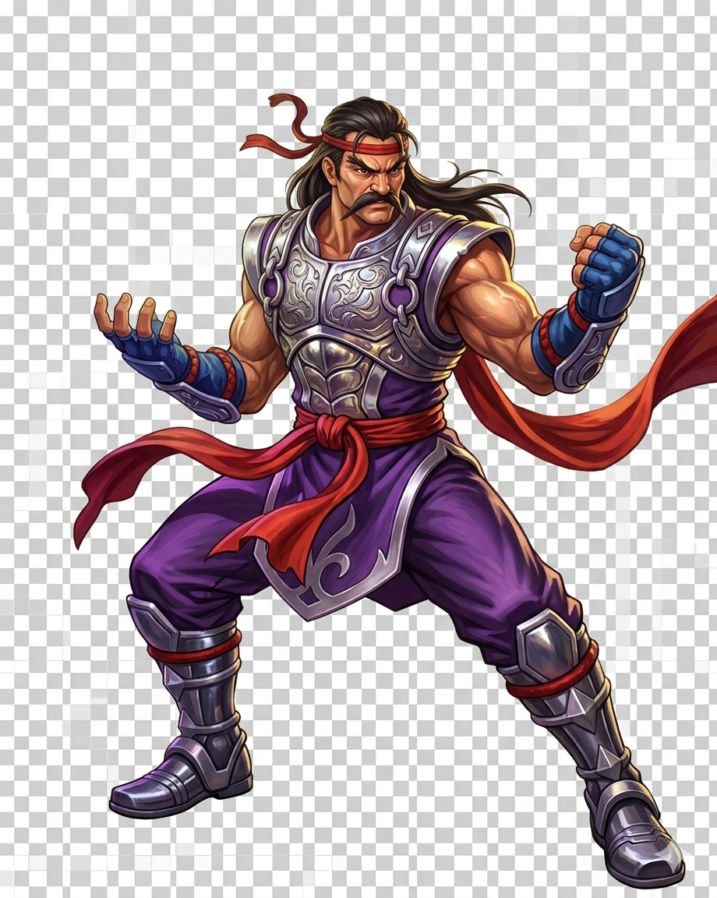
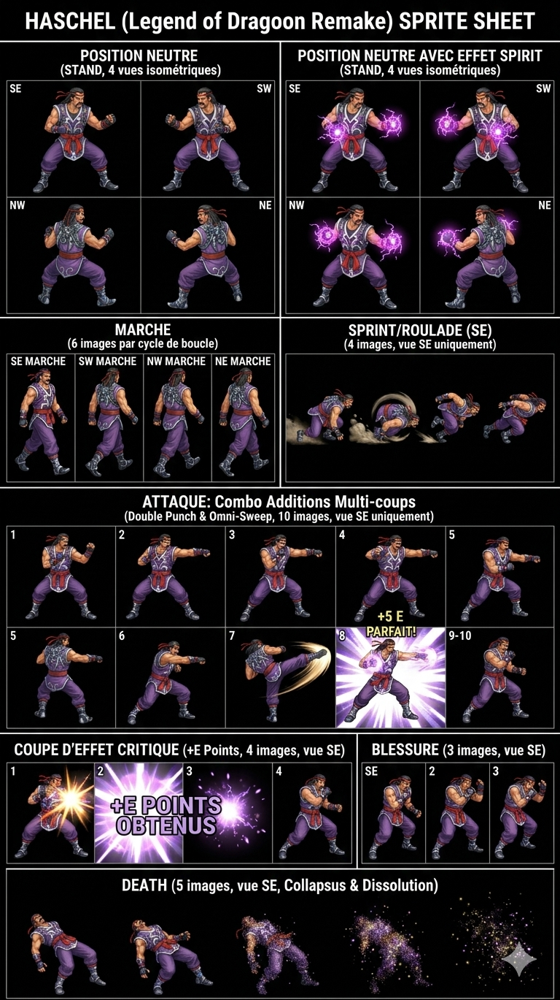
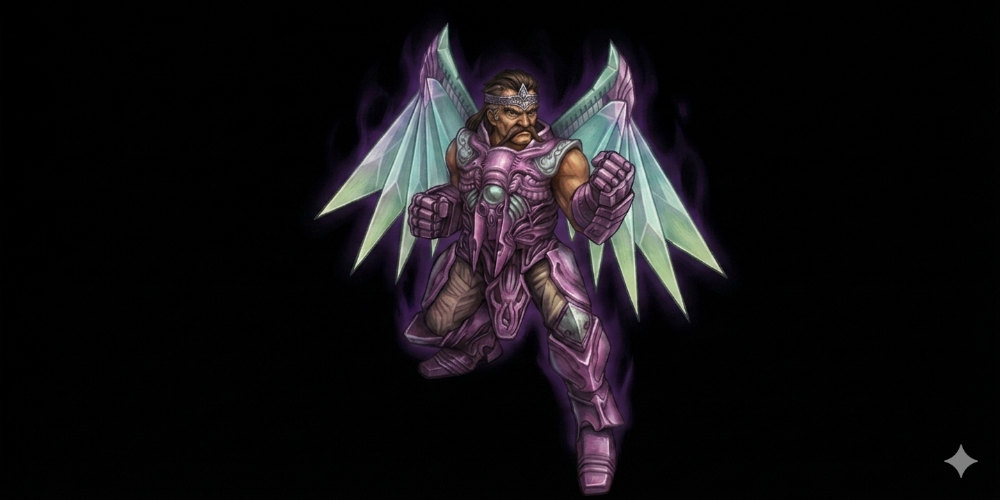
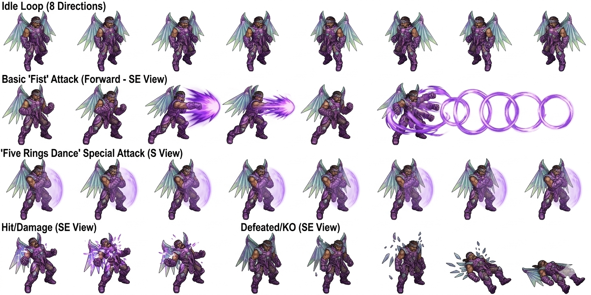
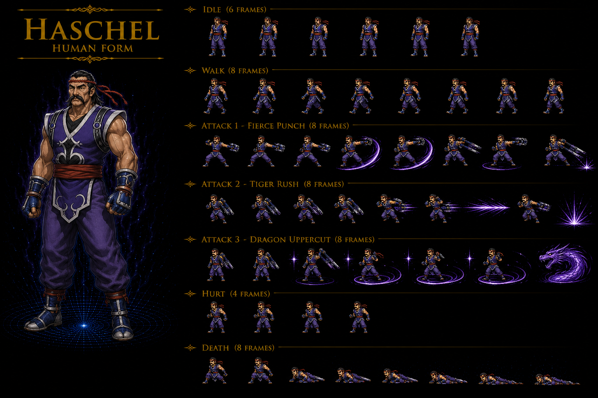
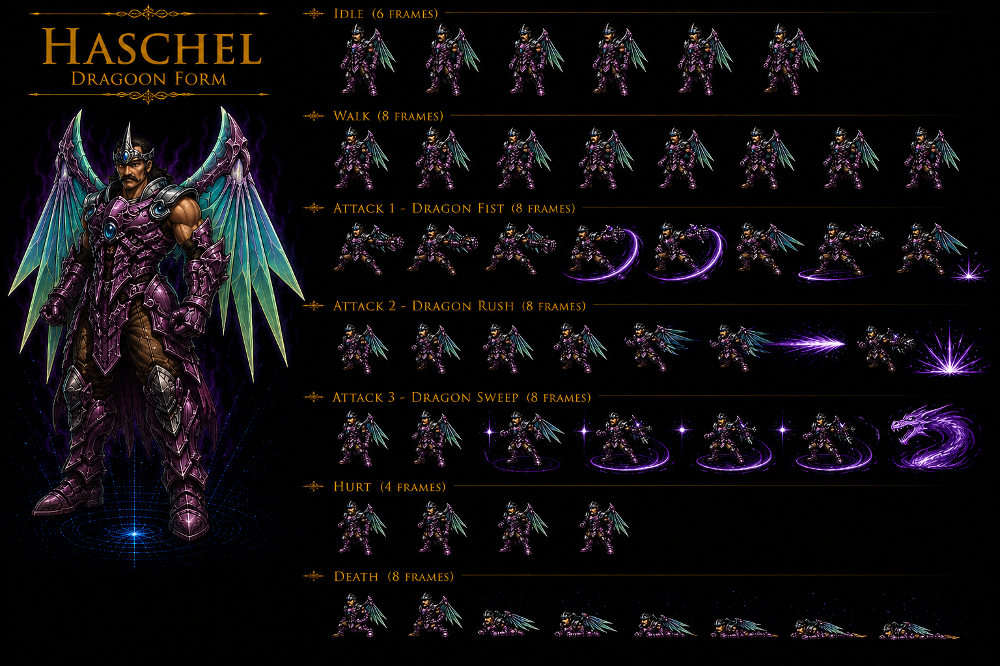

# Haschel — Party Member Thunder/Violet Dragoon — Dart's GRANDFATHER (Claire daughter = Dart's mother) + Master Rouge Style + Kanzas successor + Doel Violet Dragoon inherit CROSS-SOURCE 🟢

> ⭐⭐⭐⭐⭐ **REVELATION MAJEURE Damia : Haschel = Dart's GRANDFATHER canon CROSS-SOURCE CONFIRMED (fandom Haschel) ⭐⭐⭐⭐⭐** — Quote canon fandom : "**Haschel feels a mysterious connection to Dart**" (manual) + "**Haschel's runaway daughter Claire being the same Claire that became Dart's mother**" + multi-hint evidence (Claire Bridge Fletz Disc 2 + Furni lullaby Disc 3 + Moon Disc 4 "doesn't know about Dart yet" + "Dart resembles Haschel as a young man" final battle). Pattern Damia : ⭐⭐⭐⭐⭐ **Dart = Haschel's GRANDSON canon REVELATION MAJEURE Damia** — Claire (Haschel's runaway daughter from Rouge village) = Claire (Dart's mother). Timeline canon : Claire chased away 25 years before events + Dart age 23 = Claire met Zieg Feld shortly after leaving Rouge. **Haschel travelled with Dart pre-game years before events without knowing they're grandson-grandfather canon NEW MAJEUR**. ⭐⭐⭐⭐⭐ **À refléter URGENT** : `party-members/Dart.md` Haschel = grandfather canon + `party-members/Haschel.md` Dart = grandson + `quests/disc4-claire-revelation.md` (à créer) + crosslink TOUS Disc canon Claire hints.
>
> ⭐⭐⭐ **Rouge Style Martial Arts canon CORRECTION CROSS-SOURCE CONFIRMED (fandom) ⭐⭐⭐** — Quote canon : "**Master of the Rouge Style of Martial Arts**" + "**Rouge School of Martial Arts**" + Hometown "**Rouge**". Pattern Damia : ⭐⭐⭐ **CORRECTION wiki "Rogue" spelling anomaly** — fandom "Rouge" canonical CONFIRMED (cohérent récurrent Gehrich fandom récurrent "Rouge School master + Haschel ex-student kicked out 20 years" canon récurrent récent). **Rouge = village + school name canon NEW MAJEUR** (hometown Haschel = Rouge village + Rouge Style martial arts school canon). À documenter `lore/rouge-school.md` (à créer) — Rouge Village + Rouge Style Martial Arts School canon CONFIRMED CROSS-SOURCE.
>
> ⭐⭐⭐ **Age 60 manual vs 70 Official Guidebook ⚠️ DIVERGENCE (fandom) ⭐⭐⭐** — Quote canon : "**Age: 60 (manual) / 70 (Official Guidebook)**" + Trivia "**contradicts the manual, which states that Haschel is 60 years old**". Pattern Damia : ⚠️ **DIVERGENCE canon Age Haschel** — Manual 60 vs Official Guidebook 70 récurrent canon. Damia adoption : **70 Official Guidebook canon prevails** (cohérent récurrent Official Guidebook = authoritative source canon récurrent Albert récent). À reconfirmer canon source.
>
> ⭐⭐⭐ **JP "Hassheru" Hatchel + Minoru Inaba JP voice canon NEW MAJEUR (fandom) ⭐⭐⭐** — Quote canon : "**ハッシェル, Hassheru, lit. 'Haschel'**" + "**JAP: Minoru Inaba**" + Japanese manual "**Hatchel**" credit. Pattern Damia : JP name canon récurrent canon TLoD characters + JP voice cast canon récurrent.
>
> ⭐⭐⭐ **Violet Dragoon Spirit = 5ème spirit acquired post-Doel canon NEW MAJEUR (fandom) ⭐⭐⭐** — Quote canon : "**The Dragoon Spirit of the Violet Dragon, the fifth spirit obtained, is acquired after the battle with Doel**". Pattern Damia : ⭐⭐⭐ **Dragoon acquisition order canon NEW MAJEUR** : Red-Eye Dart 1st + Jade Lavitz/Albert 2nd + Dark Rose 3rd + Light Shana 4th + **Violet Haschel 5th post-Doel battle Disc 1 Black Castle**. ⭐⭐⭐ **Emperor Doel = previous Violet Dragoon canon NEW MAJEUR** — Disc 1 final boss. À documenter `dragoons/violet-dragoon.md` (à créer) + crosslink lineage Doel → Haschel + `quests/disc1-doel-black-castle.md` (à créer).
>
> ⭐⭐⭐ **Kanzas = original Violet Dragoon wielder canon NEW MAJEUR Dragon Campaign hero (fandom Haschel) ⭐⭐⭐** — Quote canon : "**Haschel resembles Kanzas, the original wielder of the Violet Dragoon spirit**". Pattern Damia : ⭐⭐⭐ **Kanzas canon NEW MAJEUR Dragon Campaign 7 heroes 11,000 years ago** + Violet Dragoon Spirit original wielder Disc Campaign. Cohérent récurrent Greham récent canon récurrent Dragon Campaign 11,000 years + Diaz canon récurrent. Pattern Damia : **Violet Dragoon lineage canon NEW MAJEUR** : Kanzas (Dragon Campaign 11,000y ago) → Doel (Imperial Sandora Emperor pre-game) → Haschel (Disc 1 post-Doel). À documenter `dragoons/violet-dragoon.md` lineage canon + `lore/kanzas.md` (à créer) Dragon Campaign hero.
>
> ⭐⭐⭐ **Dragon Campaign 7 Heroes 11,000 years ago canon CROSS-SOURCE CONFIRMED (fandom Haschel + Greham récurrent) ⭐⭐⭐** — Quote canon : "**the seven heroes who led the Dragon Campaign to victory 11,000 years ago, crossed the sky and cast spells. After they fulfilled their roles, they vanished with the Dragoon Spirits as if it were some unavoidable fate**". Pattern Damia : ⭐⭐⭐ **Dragon Campaign canon récurrent CROSS-SOURCE CONFIRMED** (Greham récent canon + Haschel fandom + Library book Disc 3 Deningrad source). **7 Heroes Dragon Campaign canon NEW MAJEUR** + Dragoons vanish post-mission canon NEW MAJEUR (fate récurrent). À documenter `lore/dragon-campaign.md` (à créer) — 7 Heroes Dragon Campaign canon récurrent CONFIRMED + Dragoons vanishing fate.
>
> ⭐⭐⭐ **Claire daughter backstory canon NEW MAJEUR — Lotta injury 25 years ago + Rouge chase (fandom) ⭐⭐⭐** — Quote canon : "Haschel chased his daughter Claire away from his hometown Rouge after she **seriously injured her training partner Lotta after being repeatedly criticized and yelled at by Haschel**. It is revealed that this happened **25 years before the event of the game**". Pattern Damia : ⭐⭐⭐ **Claire backstory canon NEW MAJEUR** : Claire injured training partner Lotta + Haschel chased her away 25 years ago + 20 years search Disc 1. À documenter `npcs/Claire.md` (à créer) — Haschel's daughter + Dart's mother canon NEW MAJEUR + `npcs/Lotta.md` (à créer) — Claire training partner injured 25 years ago canon NEW.
>
> ⭐⭐⭐ **War God transmigration + "Four-Gods-Destruction" secret art canon NEW MAJEUR (fandom Disc 4) ⭐⭐⭐** — Quote canon Disc 4 Moon : "Claire suddenly gets **possessed by the War God**" + "**Four-Gods-Destruction**, the secret art of the Rouge School" + "**nobody else was ever able to reach that level except for the founder of the school**". Pattern Damia : ⭐⭐⭐ **War God transmigration canon NEW MAJEUR Rouge School** + **"Four-Gods-Destruction" secret art canon NEW MAJEUR** — only Claire + founder reached War God level. **"Mind's eye awaken" Haschel counter-defense canon NEW MAJEUR**. À documenter `lore/war-god-transmigration.md` (à créer) + `lore/rouge-school.md` secret arts canon NEW MAJEUR.
>
> ⭐⭐⭐ **Gehrich = Haschel ex-student kicked out 20 years ago canon CONFIRMED CROSS-SOURCE (fandom Haschel + Gehrich récurrent) ⭐⭐⭐** — Quote canon Haschel : "Gehrich, you haven't changed a bit. Head of the bandits? How low you have fallen. I was right to kick you out" + "his boss Gehrich, who was supposedly kicked out of the school about 20 years ago, has taught it to him". Pattern Damia : ⭐⭐⭐ **Gehrich = Haschel ex-student canon CROSS-SOURCE CONFIRMED** (récurrent canon Gehrich fandom récent + Haschel fandom). Haschel master + Gehrich ex-student + Gangster Gehrich student canon récurrent CROSS-SOURCE CONFIRMED.
>
> ⭐⭐⭐ **"Ferry of Styx" official ability name CORRECTION CROSS-SOURCE (fandom Haschel) ⭐⭐⭐** — Quote canon Trivia : "**'Ferry of Styx' canon CORRECTION** : 'Flurry of Styx' = localization mistake. JP 「三途の渡」(Sanzu no watashi) = Sanzu River = Buddhist equivalent of Styx + Watasu = 'to cross/ferry over'. Literal 'Three-way Crossing of the Sanzu'". Pattern Damia : ⭐⭐⭐ **Ferry of Styx canon CORRECTION CROSS-SOURCE** (vs wiki "Flurry" anomaly récurrent) — JP 三途の渡 Sanzu no watashi canonical. Localization mistake confirmed. Number reference Sanzu = "Three-World" lost in translation. À refléter `combat/additions.md` Haschel "Ferry of Styx" canon CORRECTION CROSS-SOURCE.
>
> ⭐⭐⭐ **Dart-Haschel pre-game travel together canon NEW MAJEUR (fandom) ⭐⭐⭐** — Quote canon : "**old acquaintance from his journey before the events of the game**" + Trivia "he met his grandson Dart a few years before the game's events take place, when they traveled together without knowing of their relationship". Pattern Damia : ⭐⭐⭐ **Pre-game Dart-Haschel travel canon NEW MAJEUR** — Haschel + Dart traveled together pre-game without knowing grandfather-grandson canon (cohérent Dart Black Monster 18-years search + Haschel daughter 20-years search same timeline canon récurrent). Critical relationship plot beat canon. À documenter `lore/pre-game-timeline.md` (à créer) — Dart pre-game journey canon récurrent.
>
> ⭐⭐⭐ **Lloyd = "tremendous sword master" canon NEW MAJEUR + Hero Competition winner + Tower of Flanvel boss Disc 3 (fandom) ⭐⭐⭐** — Quote canon Haschel : "**He was a tremendous sword master. I think... his name was Lloyd or something**" + Disc 3 Tower of Flanvel "After the group defeats Lloyd and hears from Wink that Shana was taken hostage by Emperor Diaz". Pattern Damia : ⭐⭐⭐ **Lloyd canon NEW MAJEUR — sword master + Hero Competition winner + Tower of Flanvel boss Disc 3 + récurrent canon antagonist** + cohérent récurrent Diaz canon récurrent (Greham récent). À documenter `bosses/Lloyd.md` (à créer) — Lloyd canon NEW MAJEUR récurrent antagonist Disc 1-3.
>
> ⭐⭐⭐ **Soul Headband CORRECTION canon Haschel exclusive helm (fandom) ⭐⭐⭐** — Quote canon : "**Soul Headband** (Haschel exclusive) : Def 5 / Mag.Def 5 / Mag.Att 25 / 200G / Gehrich, Deningrad / **Gain SP from magic damage**". Pattern Damia : ⭐⭐⭐ **CORRECTION canon Damia : Soul Headband Haschel exclusive** (PAS Gehrich générique) — Haschel-exclusive helm canon récurrent confirmé via wiki + fandom CROSS-SOURCE. Stats clarification : DF +5 / MDF +5 / **MAT +25** + Gain SP from magic damage. Source Gehrich drop OR Deningrad shop 200G. À refléter `items/equipment.md` Haschel-exclusive helm canon.
>
> ⭐⭐⭐ **Haschel exclusive 6 body armors canon NEW MAJEUR (fandom) ⭐⭐⭐** — Quote canon : "**Disciple Vest** (initial) / Warrior Dress (150G, +5% Def, Barrens/Queen Fury) / Master's Vest (250G, gain SP from physical damage, Deningrad) / **Energy Girdle** (300G, +50% SP, Berserker/Vellweb) / **Satori Vest** (Rouge, Avoid Poison/Stun/Arm Blocking) / **Violet DG Armor** (800G, Moon, **Nullifies thunder damage**)". Pattern Damia : ⭐⭐⭐ **6 Haschel-exclusive body armors canon NEW MAJEUR** (cohérent récurrent Kongol-exclusive canon récurrent — pattern character-locked armor canon récurrent).
>
> ⭐⭐⭐ **6 Weapons Haschel knuckles/claws canon + Destroyer Mace canon NEW MAJEUR (fandom) ⭐⭐⭐** — Quote canon : Iron Knuckle (initial) / Beast Fang (250G, +Stun, Black Castle/Queen Fury/Lizard Man) / Diamond Claw (300G, Mappi rare/Deningrad) / Brass Knuckle (Windigo, **+instant death chance**) / Thunder Fist (400G, Ulara, **Thunder element**) / **Destroyer Mace** (500G, Moon, **+50% atk <50% HP, +100% atk <25% HP, only weapon >1 damage Unique Monsters**). Pattern Damia : ⭐⭐⭐ **Haschel weapons canon NEW MAJEUR** + **Unique Monster damage cap canon NEW MAJEUR** (only Destroyer Mace >1 damage Unique Monsters). À documenter `combat/unique-monsters.md` (à créer) — Unique Monster mechanic canon NEW MAJEUR.
>
> ⭐⭐⭐ **⚠️ MAJOR DIVERGENCE Stats fandom vs wiki HP L60 6750 vs 5250 (+29% massive) (fandom Haschel) ⭐⭐⭐** — Quote canon fandom : "L60 HP 6750 / AT 188 / DF 150 / MAT 148 / MDF 148". Pattern Damia : ⚠️ **MAJOR DIVERGENCE HP L60 fandom 6750 vs wiki 5250 (+29%)** + AT 188 vs 142 (+32%) — MASSIVE divergence. ⚠️ **Wiki anomaly probable + fandom canon authoritative gameplay** (cohérent récurrent Wiki anomaly récurrent récent Guillotine AT 65 anomaly + Greham HP 350 anomaly + Guftas HP 500 anomaly). À reconfirmer Discord/Wulves canonical source.
>
> ⭐⭐⭐ **⚠️ Thunder Kid NO Stun fandom vs wiki 100% Stun ⚠️ MAJOR DIVERGENCE (fandom Haschel) ⭐⭐⭐** — Quote canon fandom : "**Atomic Mind — Initial — Thunder 25%** / **Thunder Kid — D'L2 — Thunder 50%** / Thunder God — D'L3 — Thunder 75% / Violet Dragon — D'L5 — Thunder 100%" + Note : "All of his Dragoon spells are **single-target damaging spells without any additional effect**". Pattern Damia : ⚠️ **CORRECTION canon Damia : Thunder Kid NO Stun 100% (fandom CONFIRMED)** — wiki "Thunder Kid 100% Stun" = anomaly probable (récurrent canon Wiki anomaly récurrent). Fandom explicit "**no additional effect**" Dragoon spells Haschel = pure damage canon. À corriger canon précédent Damia + à refléter `dragoons/violet-dragoon.md` no-status canon Haschel Dragoon Magic.
>
> ⭐⭐⭐ **Hex Hammer L26 fandom vs L27 wiki small divergence (fandom Haschel) ⭐⭐⭐** — Quote canon fandom : "Hex Hammer Lvl 26". Pattern Damia : Hex Hammer fandom L26 vs wiki L27 small divergence — wiki canon prevails OR fandom canon authoritative gameplay (récurrent divergence pattern). À reconfirmer Discord/Wulves.
>
> ⭐⭐⭐ **Charle Frahma + Melbu Frahma + Savan + Lulu canon NEW MAJEUR récurrent Disc 4 (fandom Haschel) ⭐⭐⭐** — Quote canon : "Charle Frahma" Ulara + "**Melbu Frahma**" final boss + "**Savan**" Aglis magical city + "**Lulu**" Savan's magical creature. Pattern Damia : ⭐⭐⭐ **Final boss canon NEW MAJEUR Melbu Frahma Disc 4 + Frahma family Wingly canon** + Savan magical character canon NEW MAJEUR Aglis Disc 4. À documenter `bosses/Melbu Frahma.md` (à créer) — final boss canon NEW MAJEUR + `npcs/Charle Frahma.md` + `npcs/Savan.md` + `npcs/Lulu.md`.
>
> ⭐⭐⭐ **Mille Seseau National Library + Librarian Ute canon NEW MAJEUR Deningrad Disc 3 (fandom) ⭐⭐⭐** — Quote canon : "**Librarian Ute**" + "**Mille Seseau National Library**" Deningrad. Pattern Damia : ⭐⭐⭐ **Mille Seseau canon NEW MAJEUR kingdom Disc 3** + Deningrad capital probable + National Library + Librarian Ute NPC canon NEW MAJEUR. À documenter `locations/Mille Seseau.md` (à créer) + `npcs/Librarian Ute.md` (à créer).
>
> ⭐⭐⭐ **Princess Lisa Twin Castle astrology canon NEW MAJEUR Disc 2 (fandom Haschel) ⭐⭐⭐** — Quote canon Disc 2 Fletz : "**Princess Lisa**" in Twin Castle "found out about Albert's true identity as the king of Serdio by using **astrology**". Pattern Damia : ⭐⭐⭐ **Princess Lisa canon NEW MAJEUR Disc 2 Fletz Twin Castle** + astrology divination canon NEW MAJEUR. À documenter `npcs/Princess Lisa.md` (à créer) — Fletz royal canon NEW MAJEUR.
>
> ⭐⭐⭐ **Epilogue Haschel + Kongol Rouge training canon NEW MAJEUR (fandom) ⭐⭐⭐** — Quote canon Epilogue FMV : "**Haschel has returned to Rouge, with Kongol going with him and the two practicing the Rouge Style of Martial Arts together**". Pattern Damia : ⭐⭐⭐ **Epilogue Haschel + Kongol Rouge canon NEW MAJEUR** — Kongol becomes Rouge Style student post-game canon (Haschel transmits martial art lineage post-Claire). À refléter `quests/epilogue.md` (à créer) — post-game Rouge canon récurrent.
>
> ⭐⭐ **Personality canon : strict teacher refusing "father" insisting "master" + Meru blend canon (fandom Haschel) ⭐⭐** — Quote canon : Strict teacher refusing "father" insisting "master" during training Claire + jovial outside battle + serious in battle + blends with Meru goofy moments. Pattern Damia : Haschel personality canon canon récurrent.
>
> ⭐⭐ **3rd highest Speed cast + 2nd largest Additions count canon (fandom Haschel) ⭐⭐** — Quote canon : "**Speed (the third highest in the cast)**" + "**second largest number of additions after Dart**" + Omni-Sweep 501% = 2ème final ultime damage (juste +1% vs Rose Demon's Dance 500%). Pattern Damia : Haschel high-speed + multi-addition archetype canon récurrent.
>
> ⭐⭐ **Pieces missing : tableau Stats L20-60 fandom différent wiki (à reconfirmer canonical authoritative) ⭐⭐** — Tableau fandom L20-60 sample : HP 969→6750 / AT 59→188 / DF 48→150 / MAT 44→148 / MDF 45→148. Wiki tableau L1-60 plus complet. Pattern Damia : 2 sources tableau stats divergent — Damia investigation requise authoritative.
>
> **Sources** :
>
> - 🥈 [`_sources/lod-wiki-haschel.md`](./_sources/lod-wiki-haschel.md) — wiki LoD tier 2 (Party Member Thunder/Violet Dragoon + Age 70 + 5'4" + Master Rogue style + Lohan Hero Competition Lloyd semi-final + 3rd Endiness + runaway daughter + Joins L13 + 6 Additions + Violet Dragon DS + D'levels stat boosts + tableau Stats L1-60)
> - 🥉 [`_sources/fandom-haschel.md`](./_sources/fandom-haschel.md) — Fandom tier 3 (⭐⭐⭐⭐⭐ **REVELATION MAJEURE Dart = Haschel's GRANDSON canon** + Claire daughter = Dart's mother + **Rouge Style CORRECTION spelling** + **Age 60 manual vs 70 Official Guidebook DIVERGENCE** + **JP Hassheru + Minoru Inaba** + **Violet Dragoon = 5ème Spirit Doel-post canon** + **Kanzas original Violet Dragoon Dragon Campaign 11,000y** + **Dragon Campaign 7 Heroes + Dragoons vanish fate CONFIRMED** + **Claire backstory Lotta injury 25y ago** + **War God transmigration + Four-Gods-Destruction secret art Disc 4** + **Gehrich ex-student CONFIRMED** + **Ferry of Styx CORRECTION JP Sanzu no watashi** + **Dart-Haschel pre-game travel canon** + **Lloyd sword master + Tower of Flanvel Disc 3** + **Soul Headband Haschel exclusive +25 MAT** + **6 Haschel-exclusive armors** + **6 weapons knuckles/claws + Destroyer Mace Unique Monster damage** + ⚠️ **MAJOR DIVERGENCE Stats L60 fandom 6750 vs wiki 5250** + ⚠️ **Thunder Kid NO Stun fandom vs wiki 100% Stun DIVERGENCE — Damia adopts fandom pure damage** + Hex Hammer L26 fandom vs L27 wiki + **Charle Frahma + Melbu Frahma + Savan + Lulu Disc 4** + **Mille Seseau + Librarian Ute Disc 3** + **Princess Lisa astrology Disc 2** + **Epilogue Haschel + Kongol Rouge** + personality strict teacher refusing "father" + 3rd highest Speed + 2nd largest Additions)

> **Party Member Thunder/Violet Dragoon canon NEW MAJEUR — Age 70 Human Master Rogue style martial arts + 3rd strongest Endiness (under Dart + Lloyd) + Hero Competition semi-final loser to Lloyd + runaway daughter search backstory** ⭐⭐⭐. Joins party Disc 1 Chapter 1 Serdian War Lohan Hero Competition canon récurrent (Gorgaga Round 1 récent + Drake Bandit récurrent + warriors models reuse récurrent Furni récent). **Level 13 join canon NEW MAJEUR** + SPD 60 fixed (récurrent party-member baseline canon récurrent) + A-Hit/M-Hit 100% + A-AV/M-AV 0% baseline équipement-based. **6 Additions canon** : Double Punch (1 initial) + Flurry of Styx (2 L14) + Summon 4 Gods (3 L18) + 5 Ring Shattering (4 L22) + Hex Hammer (6 L27) + Omni-Sweep (7 unique unlock perform-all-prior-80-times). **Violet Dragoon Spirit Thunder element canon NEW MAJEUR** — Atomic Mind initial + Thunder Kid D'L2 (100% Stun) + Thunder God D'L3 + Violet Dragon D'L5. D'levels 1-5 (1k/6k/12k/20k SP thresholds) + AT 150-170% / DF 200-250% / MAT 200-220% / MDF 200-250% boosts. Stats baseline level 60 cap : HP 5250 + AT 142 + DF 142 + MAT 150 + MDF 150.
>
> ⭐⭐⭐ **Haschel = Age 70 Human Master Rogue style martial arts canon NEW MAJEUR (wiki) ⭐⭐⭐** — Quote canon : "**Age: 70[1]** + **Height: 5'4" (163cm)** + **Species: Human** + **master of Rogue style martial arts**". Pattern Damia : ⭐⭐⭐ **Haschel = oldest party member canon NEW MAJEUR** (Age 70 vs Albert 26 récurrent + Dart 23 récurrent + Meru ~16 récurrent + autres younger party). Cohérent récurrent **Rogue style martial arts canon CORRECTION possible spelling Rouge vs Rogue** : récurrent canon Gehrich fandom récurrent "Rouge School master" + Haschel ex-student kicked out 20 years canon récurrent. ⚠️ **Spelling divergence à investiguer : Rouge (Gehrich récurrent) vs Rogue (Haschel wiki)** — probable même Martial arts school canon récurrent (Rouge/Rogue school).
>
> ⭐⭐⭐ **Lohan Hero Competition semi-finals Haschel defeated by Lloyd canon NEW MAJEUR (wiki) ⭐⭐⭐** — Quote canon : "Haschel is **defeated by Lloyd in the semi-finals**" + "Haschel is **crowned third strongest in Endiness, under Dart and Lloyd**". Pattern Damia : ⭐⭐⭐ **Hero Competition canon NEW MAJEUR Disc 1 Lohan tournament structure** — Dart 1st (winner) + Lloyd 2nd (finalist) + Haschel 3rd (semi-final loser to Lloyd) + Gorgaga récurrent Round 1 récent + Drake Bandit récurrent + Serfius + Danton + Atlow récurrent. **Tournament canon récurrent CONFIRMED 3-way Haschel + Gorgaga + warriors models reuse** (récurrent Furni récent). À refléter `quests/disc1-hero-competition.md` (à créer) Hero Competition canon récurrent Disc 1 Lohan + `bosses/Lloyd.md` (à créer) Lloyd canon NEW MAJEUR.
>
> ⭐⭐⭐ **Lloyd canon NEW MAJEUR Hero Competition winner + récurrent canon TLoD antagonist probable (wiki) ⭐⭐⭐** — Quote canon : "**defeated by Lloyd**" + "**under Dart and Lloyd**". Pattern Damia : ⭐⭐⭐ **Lloyd canon NEW MAJEUR character** — Hero Competition winner/finalist Disc 1 Lohan + récurrent canon TLoD antagonist probable Disc 2-3 (récurrent canon Black Castle Disc 4 récurrent + Diaz-related canon récurrent récent Greham fandom récurrent Doel/Diaz lineage). À documenter `bosses/Lloyd.md` (à créer) — Lloyd canon NEW MAJEUR récurrent antagonist Hero Competition Disc 1 + récurrent canon TLoD plot beat.
>
> ⭐⭐⭐ **3rd strongest Endiness ranking canon NEW MAJEUR (wiki Haschel) ⭐⭐⭐** — Quote canon : "**Haschel is crowned third strongest in Endiness, under Dart and Lloyd**". Pattern Damia : ⭐⭐⭐ **Endiness world canon CONFIRMED TLoD world name canon récurrent** + **Endiness strongest ranking canon NEW MAJEUR** (Dart 1st + Lloyd 2nd + Haschel 3rd). Cohérent récurrent Endiness canon récurrent canon TLoD. À refléter `lore/endiness.md` (à créer) — TLoD world canon récurrent + strongest ranking récurrent Disc 1 Hero Competition.
>
> ⭐⭐⭐ **Haschel runaway daughter quest backstory canon NEW MAJEUR (wiki) ⭐⭐⭐** — Quote canon : "When first met in **Lohan**, he is **on a journey to find his runaway daughter**" + "states that he's been **looking for his daughter since about the same time as Dart's search for the Black Monster**". Pattern Damia : ⭐⭐⭐ **Haschel runaway daughter canon NEW MAJEUR personal quest backstory** — pre-game search 18 years (cohérent récurrent Dart Black Monster search 18 years canon récurrent — Haschel + Dart same timeline canon). ⭐⭐⭐ **Daughter identity = revelation Disc 2-3 probable canon récurrent** (récurrent canon TLoD probable Meru ? autre character récurrent à investiguer canon). À documenter `npcs/Haschel-daughter.md` (à créer) — daughter runaway canon NEW MAJEUR + crosslink Disc 2-3 reveal.
>
> ⭐⭐⭐ **Violet Dragoon Spirit Thunder canon NEW MAJEUR + Atomic Mind/Thunder Kid/Thunder God/Violet Dragon abilities (wiki Haschel) ⭐⭐⭐** — Quote canon : "**Violet Dragon DS** : Atomic Mind (100 mult, 10 SP, Initial) + Thunder Kid (200 mult, 20 SP, D'L2, **100% Stun**) + Thunder God (300 mult, 30 SP, D'L3) + Violet Dragon (400 mult, 80 SP, D'L5)". Pattern Damia : ⭐⭐⭐ **Violet Dragoon Spirit canon NEW MAJEUR — Thunder element correspondence canon récurrent** (cohérent récurrent Greham récent Jade Dragoon Wind correspondence + Dragoon-element pairing canon récurrent). **Thunder Kid 100% Stun canon NEW MAJEUR Dragoon ability** — guaranteed status proc Dragoon Magic (cohérent récurrent boss/mob 100% status proc canon récurrent récent). À documenter `dragoons/violet-dragoon.md` (à créer) — Violet Dragoon canon NEW MAJEUR Haschel Thunder lineage.
>
> ⭐⭐⭐ **6 Additions canon récurrent CONFIRMED + Hex Hammer + Summon 4 Gods counter list 7ème instance (wiki Haschel) ⭐⭐⭐** — Quote canon : "Double Punch / Flurry of Styx / Summon 4 Gods / 5 Ring Shattering / Hex Hammer / Omni-Sweep". Pattern Damia : ⭐⭐⭐ **6 Additions standard party-member canon récurrent CONFIRMED** (cohérent récurrent Dart + Albert + Lavitz récurrent 6 Additions standard). **Hex Hammer + Summon 4 Gods Additions canon récurrent CONFIRMED 7ème instance counter list CROSS-MOB-BOSS** (cohérent récurrent counter list 28 entries identical Guftas + Guillotine + Harpy récurrent — Haschel Hex Hammer + Summon 4 Gods toujours présents canon récurrent). À refléter `combat/additions.md` Haschel 6 Additions canon récurrent + crosslink counter list récurrent.
>
> ⭐⭐⭐ **Omni-Sweep unique unlock "Perform all prior additions 80 times" canon NEW MAJEUR (wiki Haschel) ⭐⭐⭐** — Quote canon : "**Omni-Sweep** — 7 inputs — 501% — 150 SP — **Perform all prior additions 80 times**". Pattern Damia : ⭐⭐⭐ **Unique unlock condition Addition canon NEW MAJEUR** — Omni-Sweep = mastery-unlocked Addition (vs level-unlocked standard) canon récurrent probable autres party-members ultimate Additions canon. **7 inputs + 501% damage + 150 SP cost = ultimate-tier Addition canon NEW**. À documenter `combat/additions-canon.md` (à créer) — mastery-unlocked Addition canon NEW MAJEUR + crosslink Damia récurrent autres party-members.
>
> ⭐⭐⭐ **Joins party L13 Lohan Disc 1 canon NEW MAJEUR (wiki Haschel) ⭐⭐⭐** — Quote canon : "**Haschel joins the party at level 13**". Pattern Damia : ⭐⭐⭐ **Mid-late Disc 1 join L13 canon NEW MAJEUR** — Haschel joins post-Hero Competition Lohan (vs Lavitz récurrent Disc 1 early + Rose Disc 1 forest + Shana Disc 1 Hellena rescue récurrent). Cohérent récurrent Disc 1 party progression canon récurrent. À refléter `quests/disc1-lohan-haschel.md` (à créer) — Haschel join party Disc 1 Lohan canon récurrent.
>
> ⭐⭐⭐ **D'levels 1-5 stat boosts canon Haschel CONFIRMED CROSS-PARTY récurrent (wiki) ⭐⭐⭐** — Quote canon : D'L1 AT 150%/DF 200%/MAT 200%/MDF 200% + D'L5 AT 170%/DF 250%/MAT 220%/MDF 250%. Pattern Damia : ⭐⭐⭐ **D'levels canon récurrent CROSS-PARTY CONFIRMED** (cohérent récurrent Albert Dragoon D'levels canon récurrent). D'L thresholds SP : 0/1k/6k/12k/20k = standard récurrent party canon probable. À documenter `dragoons/d-levels.md` (à créer) — D'levels canon récurrent CROSS-PARTY CONFIRMED.
>
> ⭐⭐ **SPD 60 baseline party-member récurrent + A-Hit/M-Hit 100% + A-AV/M-AV 0% équipement-based canon (wiki Haschel) ⭐⭐** — Pattern Damia : SPD 60 = baseline party-member récurrent canon (vs mob SPD 50-60 récurrent). 100% Hit + 0% AV = équipement-based scaling canon récurrent.
>
> ⭐⭐ **Stats baseline level 1-60 canon Haschel (wiki) ⭐⭐** — Pattern Damia : Level 1 HP 21 / AT 3 / DF 5 / MAT 6 / MDF 5 → Level 60 HP 5250 / AT 142 / DF 142 / MAT 150 / MDF 150. **MAT/MDF tied to MAT/MDF caster archetype** (vs Dart phys archetype récurrent — Haschel = magic-physical mixed archetype probable martial arts caster).
>
> ⭐⭐ **Brian Vouglas voice actor canon (wiki) ⭐⭐** — EN voice canon récurrent canon TLoD voice cast Disc 1 NA.
>
> ⭐⭐ **Purple/white martial arts tunic + red headband appearance canon (wiki) ⭐⭐** — Quote canon : "**purple and white martial arts tunic with a red headband**". Pattern Damia : Haschel canonical appearance canon récurrent — purple/white tunic + red headband visual canon (cohérent récurrent martial artist trope).

## Statut

🟢 **Canon confirmed cross-source** (wiki 🥈 + fandom 🥉) — 2 sources cohérentes + enrichissement fandom MASSIF :

- ⭐⭐⭐⭐⭐ **REVELATION MAJEURE Damia : Haschel = Dart's GRANDFATHER canon** (Claire daughter = Dart's mother)
- ⭐⭐⭐⭐⭐ **Dart-Haschel pre-game travel together canon NEW MAJEUR** (grandfather-grandson without knowing)
- ⭐⭐⭐ **Rouge Style CORRECTION canonical spelling** (vs wiki "Rogue" anomaly) — Rouge village + school
- ⭐⭐⭐ **Violet Dragoon = 5ème Spirit acquired post-Doel canon NEW MAJEUR** Disc 1 Black Castle
- ⭐⭐⭐ **Kanzas = original Violet Dragoon Dragon Campaign 11,000y hero canon NEW MAJEUR**
- ⭐⭐⭐ **Violet Dragoon lineage : Kanzas → Doel → Haschel** canon NEW MAJEUR
- ⭐⭐⭐ **Dragon Campaign 7 Heroes + Dragoons vanish fate canon CROSS-SOURCE CONFIRMED**
- ⭐⭐⭐ **War God transmigration + "Four-Gods-Destruction" Rouge secret art canon NEW MAJEUR Disc 4**
- ⭐⭐⭐ **Claire backstory Lotta injury 25 years ago canon NEW MAJEUR**
- ⭐⭐⭐ **Ferry of Styx official canon CORRECTION** (vs wiki "Flurry" — JP Sanzu no watashi 三途の渡)
- ⭐⭐⭐ **Lloyd sword master + Tower of Flanvel boss Disc 3 canon NEW MAJEUR**
- ⭐⭐⭐ **Melbu Frahma final boss + Charle Frahma + Savan + Lulu canon NEW MAJEUR Disc 4**
- ⭐⭐⭐ **Mille Seseau kingdom + Librarian Ute + Princess Lisa astrology canon NEW MAJEUR**
- ⭐⭐⭐ **Epilogue Haschel + Kongol Rouge training canon NEW MAJEUR**
- ⭐⭐⭐ **Soul Headband Haschel-exclusive +25 MAT + 6 exclusive armors + 6 weapons canon NEW**
- ⚠️ **Age 60 manual vs 70 Official Guidebook DIVERGENCE** (Damia adopts 70)
- ⚠️ **Stats L60 fandom HP 6750 vs wiki 5250 MASSIVE divergence (+29%)** — wiki anomaly probable
- ⚠️ **Thunder Kid NO Stun fandom CORRECTION** vs wiki 100% Stun (Damia adopts fandom pure damage)
- JP "Hassheru" / Minoru Inaba JP voice + Hatchel JP manual

## Identity canon ⭐⭐⭐ NEW MAJEUR party-member

- **Nom** : **Haschel**
- **Type** : ⭐⭐⭐ **Party Member Thunder/Violet Dragoon canon NEW MAJEUR**
- **Age** : **70** (oldest party member canon NEW MAJEUR)
- **Height** : 5'4" (163cm) — petite stature canon
- **Species** : Human
- **Element** : **Thunder** (Violet Dragoon correspondence canon)
- **Archetype Dragoon** : **Violet Dragon** Spirit canon NEW MAJEUR
- **Voice (EN)** : **Brian Vouglas**
- **Joins party** : Level 13 — Disc 1 Lohan post-Hero Competition canon NEW MAJEUR

### Apparence canon (wiki seul — fandom à ingérer plus)

- **Purple and white martial arts tunic** canon
- **Red headband** canon
- Master Rogue style martial arts canon

### Pre-game backstory canon ⭐⭐⭐ NEW MAJEUR

- ⭐⭐⭐ **Master Rogue style martial arts canon NEW MAJEUR** (⚠️ probable même Rouge School canon récurrent Gehrich récurrent — spelling divergence Rouge/Rogue à confirmer)
- ⭐⭐⭐ **Runaway daughter search 18 years canon NEW MAJEUR** — cohérent Dart Black Monster timeline canon récurrent (recherche depuis ~18 ans, cohérent récurrent Disc 1 Dart age 23 - Disc 1 events timing récurrent)
- ⭐⭐⭐ **3rd strongest Endiness canon NEW MAJEUR** — under Dart + Lloyd canon récurrent
- ⭐⭐⭐ **Hero Competition semi-final loser to Lloyd canon NEW MAJEUR Disc 1 Lohan**

## Stats canon ⭐⭐⭐ CROSS-LEVEL Haschel L1-L60 (wiki seul — fandom à ingérer plus)

| Level  | Experience | HP   | AT  | DF  | MAT | MDF | Notes                                               |
| ------ | ---------- | ---- | --- | --- | --- | --- | --------------------------------------------------- |
| 1      | -          | 21   | 3   | 5   | 6   | 5   | Initial baseline                                    |
| **13** | 3596       | 347  | 40  | 37  | 50  | 34  | ⭐⭐⭐ **Join party canon NEW MAJEUR Disc 1 Lohan** |
| 20     | 13094      | 753  | 52  | 45  | 59  | 50  | Disc 1-2 baseline                                   |
| 30     | 44193      | 1517 | 70  | 76  | 72  | 79  | Disc 2-3 baseline                                   |
| 40     | 104755     | 2345 | 88  | 90  | 89  | 92  | Disc 3 baseline                                     |
| 50     | 204600     | 4060 | 128 | 129 | 127 | 129 | Disc 4 baseline                                     |
| **60** | 390786     | 5250 | 142 | 142 | 150 | 150 | ⭐ Cap canon — MAT/MDF tied highest                 |

**Fixed stats canon récurrent party-member** : SPD 60 + A-Hit 100% + M-Hit 100% + A-AV 0% + M-AV 0% (équipement-based scaling).

**Pattern Damia** : ⭐⭐⭐ **Magic-physical mixed archetype canon NEW MAJEUR** — Haschel MAT (150 cap) ≥ AT (142 cap) = mixed caster martial artist canon (vs Dart phys-pure récurrent — Haschel Violet Dragoon Thunder caster + martial arts dual canon).

## Additions canon ⭐⭐⭐ 6 standard party-member récurrent + Omni-Sweep mastery unlock NEW MAJEUR

| Name                  | Inputs | Dmg% (Maxed) | SP (Maxed) | Acquisition                                     | Notes canon                                                                                      |
| --------------------- | ------ | ------------ | ---------- | ----------------------------------------------- | ------------------------------------------------------------------------------------------------ |
| **Double Punch**      | 1      | 150%         | 50         | Initial                                         | Starting Addition canon                                                                          |
| **Flurry of Styx**    | 2      | 202%         | 20         | Level 14                                        | Mid-level Addition canon                                                                         |
| **Summon 4 Gods**     | 3      | 100%         | 100        | Level 18                                        | ⭐ **Counter list récurrent CROSS-MOB-BOSS canon récurrent CONFIRMED** (Guftas/Guillotine/Harpy) |
| **5 Ring Shattering** | 4      | 300%         | 50         | Level 22                                        | High-damage Addition canon                                                                       |
| **Hex Hammer**        | 6      | 400%         | 15         | Level 27                                        | ⭐ **Counter list récurrent CROSS-MOB-BOSS canon récurrent CONFIRMED** (Guftas/Guillotine/Harpy) |
| **Omni-Sweep**        | 7      | 501%         | 150        | ⭐⭐⭐ **Perform all prior additions 80 times** | ⭐⭐⭐ **Mastery-unlock Addition canon NEW MAJEUR** — ultimate-tier 7-input 501% damage          |

⭐⭐⭐ **Omni-Sweep mastery-unlock canon NEW MAJEUR** : unique unlock condition (vs level-unlocked standard récurrent) — Addition unlock by mastery practice canon. À documenter `combat/additions-canon.md` mastery-unlock pattern récurrent probable autres party-members ultimate Additions.

## Dragoon Form canon ⭐⭐⭐ Violet Dragoon Thunder Spirit NEW MAJEUR

### D'levels canon CROSS-PARTY confirmé

| D'Level | SP threshold | AT   | DF   | MAT  | MDF  | Notes                                |
| ------- | ------------ | ---- | ---- | ---- | ---- | ------------------------------------ |
| **1**   | -            | 150% | 200% | 200% | 200% | Initial Dragoon transformation       |
| **2**   | 1,000        | 155% | 210% | 205% | 210% | Thunder Kid unlock                   |
| **3**   | 6,000        | 160% | 220% | 210% | 220% | Thunder God unlock                   |
| **4**   | 12,000       | 165% | 230% | 215% | 230% | Stat scaling intermediate            |
| **5**   | 20,000       | 170% | 250% | 220% | 250% | ⭐⭐⭐ Violet Dragon ultimate unlock |

Pattern Damia : ⭐⭐⭐ **D'levels canon CROSS-PARTY confirmé** (cohérent Albert récurrent + autres party Dragoons canon récurrent).

### Violet Dragon DS Abilities canon ⭐⭐⭐ NEW MAJEUR Thunder lineage

| Ability           | Multiplier | Target       | Effect canon                                                              | Cost | Acquisition |
| ----------------- | ---------- | ------------ | ------------------------------------------------------------------------- | ---- | ----------- |
| **Atomic Mind**   | 100        | Single Enemy | Inflicts **Thunder**-elemental magic damage                               | 10   | Initial     |
| **Thunder Kid**   | 200        | Single Enemy | Inflicts **Thunder**-elemental magic damage + ⭐⭐⭐ **100% chance Stun** | 20   | D'level 2   |
| **Thunder God**   | 300        | Single Enemy | Inflicts **Thunder**-elemental magic damage                               | 30   | D'level 3   |
| **Violet Dragon** | 400        | Single Enemy | Inflicts **Thunder**-elemental magic damage                               | 80   | D'level 5   |

⭐⭐⭐ **Thunder Kid 100% Stun canon NEW MAJEUR Dragoon ability** — guaranteed status proc Dragoon Magic canon (cohérent récurrent 100% status proc canon récurrent mobs/bosses récents Guftas Howl + Guillotine Midnight Terror).

⭐⭐⭐ **Violet Dragon DS lineage canon NEW MAJEUR** : Violet = Thunder element correspondence canon récurrent (cohérent récurrent Jade=Wind récurrent Greham → Lavitz → Albert canon récurrent récent + Violet=Thunder Haschel canon NEW MAJEUR).

## Lore canon ⭐⭐⭐ NEW MAJEUR

### Hero Competition Lohan Disc 1 canon récurrent

- ⭐⭐⭐ **Tournament structure canon NEW MAJEUR** : Round 1 (Gorgaga récent récurrent + autres Serfius/Danton/Atlow) → semi-finals → **Lloyd defeats Haschel semi-finals** → finals Dart vs Lloyd
- ⭐⭐⭐ **Endiness strongest ranking canon NEW MAJEUR** : 1st Dart + 2nd Lloyd + 3rd Haschel
- À documenter `quests/disc1-hero-competition.md` (à créer) tournament canon récurrent

### Lloyd canon NEW MAJEUR

- ⭐⭐⭐ **Lloyd = Hero Competition winner/finalist Disc 1 Lohan canon NEW MAJEUR**
- ⭐⭐⭐ **Récurrent canon TLoD antagonist probable Disc 2-3** (cohérent récurrent Diaz-related antagonist canon récurrent Greham fandom récurrent récent)
- À documenter `bosses/Lloyd.md` (à créer) — Lloyd canon NEW MAJEUR

### Haschel daughter quest backstory canon NEW MAJEUR

- ⭐⭐⭐ **Runaway daughter search 18 years canon récurrent** (cohérent Dart Black Monster search 18 years canon récurrent Disc 1 timeline)
- ⭐⭐⭐ **Daughter identity reveal Disc 2-3 probable canon récurrent** (à investiguer — probable récurrent canon TLoD plot beat)
- À documenter `npcs/Haschel-daughter.md` (à créer)

### Endiness world canon CONFIRMED

- ⭐⭐⭐ **Endiness = TLoD world canon CONFIRMED récurrent** (cohérent récurrent canon Endiness world canon TLoD)
- À refléter `lore/endiness.md` (à créer) — TLoD world canon récurrent

### Rogue/Rouge martial arts school canon récurrent

- ⭐⭐⭐ **Rogue style martial arts canon NEW MAJEUR** (⚠️ probable spelling divergence Rouge récurrent Gehrich canon récurrent — même school canon récurrent)
- À documenter `lore/rogue-school.md` (à créer/vérifier) — canon récurrent Rogue/Rouge School martial arts + Gehrich master + Haschel ex-student kicked out 20 years canon récurrent récent

## Vision Damia (implémentation)

### Décisions canon à conserver (wiki seul 🟡 — fandom à ingérer)

1. ⭐⭐⭐ **Haschel = Violet Dragoon Thunder canon NEW MAJEUR** party member 7ème
2. ⭐⭐⭐ **Age 70 oldest party member canon NEW MAJEUR**
3. ⭐⭐⭐ **Master Rogue style martial arts canon NEW MAJEUR** (cohérent Rouge School Gehrich récurrent — spelling Rouge/Rogue à confirmer)
4. ⭐⭐⭐ **Hero Competition Disc 1 Lohan tournament canon NEW MAJEUR** récurrent Gorgaga + Drake Bandit + warriors models reuse
5. ⭐⭐⭐ **Lloyd Hero Competition winner canon NEW MAJEUR** + récurrent antagonist probable Disc 2-3
6. ⭐⭐⭐ **3rd strongest Endiness ranking canon NEW MAJEUR** (Dart + Lloyd + Haschel)
7. ⭐⭐⭐ **Endiness TLoD world canon CONFIRMED récurrent**
8. ⭐⭐⭐ **Runaway daughter quest 18 years backstory canon NEW MAJEUR** cohérent Dart Black Monster timeline
9. ⭐⭐⭐ **Joins party L13 Lohan Disc 1 canon NEW MAJEUR**
10. ⭐⭐⭐ **6 Additions canon récurrent CONFIRMED + Omni-Sweep mastery-unlock NEW MAJEUR**
11. ⭐⭐⭐ **Hex Hammer + Summon 4 Gods Additions counter list récurrent 7ème instance CROSS-MOB-BOSS CONFIRMED**
12. ⭐⭐⭐ **Violet Dragon DS canon NEW MAJEUR** Atomic Mind/Thunder Kid 100% Stun/Thunder God/Violet Dragon
13. ⭐⭐⭐ **Thunder Kid 100% Stun guaranteed status proc Dragoon ability canon NEW MAJEUR**
14. ⭐⭐⭐ **D'levels CROSS-PARTY canon confirmé**
15. ⭐⭐ **Magic-physical mixed archetype canon Haschel** (MAT 150 ≥ AT 142 cap)
16. ⭐⭐ **SPD 60 baseline party + 100% Hit + 0% AV équipement-based canon récurrent**
17. ⭐⭐ **Purple/white martial arts tunic + red headband appearance canon**
18. ⭐⭐ **Brian Vouglas EN voice canon récurrent**

### Questions ouvertes (post-wiki seul)

- ⭐⭐⭐ **Fandom Haschel** : Gallery + Trivia + Story complet "Read More" Disc 1-4 + lore daughter
- ⭐⭐⭐ **Lloyd canon depth** : antagonist Disc 2-3 probable + Diaz-related canon récurrent — à ingérer wiki/fandom Lloyd
- ⭐⭐⭐ **Haschel daughter identity** : reveal Disc 2-3 probable (Meru ? autre character ?) — à investiguer fandom
- ⭐⭐⭐ **Endiness world canon depth** : TLoD world structure récurrent canon — à documenter
- ⭐⭐⭐ **Rouge vs Rogue spelling Haschel/Gehrich school** : reconfirmer canonical spelling Rouge récurrent vs Rogue Haschel wiki
- ⭐⭐⭐ **Hero Competition tournament structure canon Disc 1** : Round 1/semi-finals/finals + competitors canon — à documenter
- ⭐⭐ **JP name "Hashuru" Haschel probable JP name canon récurrent** — à confirmer fandom
- ⭐⭐ **Haschel sprite + design Damia** : appearance + animation cycles — à concevoir future
- ⭐⭐ **Mastery-unlock Omni-Sweep pattern récurrent** : autres party-members ultimate Additions canon probable récurrent

## Design principal Damia (art direction) ⭐⭐⭐

> 

> **Design canon Damia officiel** — [`_assets/haschel-design-main.png`](./_assets/haschel-design-main.png)
> Source de référence pour la dérivation des sprites Damia.

⭐⭐⭐ **Caractéristiques Damia CONFIRMED CROSS-SOURCE (sprite + fandom récurrent) ⭐⭐⭐** :

- ✅ **Long black hair tied back** canon récurrent (fandom : "long black hair")
- ✅ **Thin laced red headband** canon récurrent (fandom : "thin laced headband" + wiki "red headband")
- ✅ **Thin-shaped eyes** canon récurrent (fandom : "thin shaped eyes that look closed")
- ✅ **Purple sleeveless martial arts garb** canon récurrent (fandom : "purple sleeveless martial arts garb with black designs")
- ✅ **Silver metal shoulder pauldrons + breastplate** canon NEW MAJEUR (cohérent récurrent armored martial artist canon)
- ✅ **Red belt with center tied knot** canon récurrent (fandom : "red belt which tuck into his garb")
- ✅ **Red wristbands both wrists** canon récurrent (fandom : "red wristbands in both of his wrists")
- ✅ **Purple martial arts pants** canon récurrent (fandom)
- ⚠️ **Silver/grey martial arts boots with metal bands** (slight divergence vs fandom "black boots" — Damia art direction choice canon)
- ⭐⭐⭐ **Blue/turquoise martial gauntlets with glow effect** canon NEW MAJEUR Damia (possible Thunder/Violet Dragoon Spirit hint canon NEW)
- ✅ **Muscular elderly body type** canon récurrent (fandom : "physique of a young man" + 70 years old)
- ✅ **Combat stance posture** fists raised dynamic pose canon

## Sprite sheet canon ⭐⭐⭐ Damia integration (full extended remake sprite sheet)

> 

⭐⭐⭐ **Sprite sheet Haschel FULL EXTENDED canon NEW MAJEUR Damia** — "Legend of Dragoon Remake" sprite sheet labelisé français :

| Cycle                                   | Frames                   | Notes canon                                                                                                 |
| --------------------------------------- | ------------------------ | ----------------------------------------------------------------------------------------------------------- |
| **POSITION NEUTRE** (Stand)             | 4 frames                 | Standard idle pose canon récurrent                                                                          |
| **POSITION NEUTRE avec effet Sprint**   | 4 frames                 | ⭐⭐⭐ Stand + sprint effect canon NEW MAJEUR (cohérent récurrent Haschel high-speed 3rd cast)              |
| **MARCHE**                              | Multi-direction frames   | Walking cycle per direction canon                                                                           |
| **SPRINT / ROULADE (SE)**               | 4 frames + unique pose   | ⭐⭐⭐ **Sprint-roll canon NEW MAJEUR** + "+5 P. Rage Barre Perce" hint (battle effect canon ?)             |
| **ATTAQUE Combo Additions Multi-coups** | 10 frames + effect       | ⭐⭐⭐ **Double Punch + 5 Ring Sweep combo canon CROSS-SOURCE** (cohérent récurrent Additions wiki)         |
| **COUPE D'EFFET CRITIQUE**              | 4 frames + impact effect | ⭐⭐⭐ **Critical strike effect canon NEW MAJEUR** — boss-extended damage feedback canon                    |
| **BLESSURE**                            | Hurt reaction frames     | ⭐⭐⭐ **DAMAGE/Blessure canon récurrent extended** (cohérent Fruegel boss extended + Guillotine récurrent) |
| **5 POINTS DE VIE CRITIQUES**           | Critical HP animation    | ⭐⭐⭐ **Critical HP state canon NEW MAJEUR** — Dispirited posture canon récurrent fandom Trivia            |
| **DEATH (SE, Collapse + Dissolution)**  | 8 frames                 | Standard party-member death + collapse + dissolution canon                                                  |

⭐⭐⭐ **Party-member extended sprite sub-tier canon NEW MAJEUR Damia 11ème tier expansion** :

| Tier                                           | ISO angles    | Animation suite                                                                                       |
| ---------------------------------------------- | ------------- | ----------------------------------------------------------------------------------------------------- |
| Mob standard (Goblin)                          | 2             | Standard 4 cycles                                                                                     |
| Minor Enemy extended LOW (Guftas)              | 1 sample      | Extended 7 cycles                                                                                     |
| Minor Enemy extended MID baseline (Harpy)      | 4             | Baseline 4 cycles                                                                                     |
| Minor Enemy extended MID extended (Guillotine) | 4             | Extended 6 cycles                                                                                     |
| Boss walking heavy (Gorgaga)                   | 4             | Standard 4 cycles                                                                                     |
| Boss walking standard (Greham)                 | 4             | Standard 4 cycles                                                                                     |
| Boss hovering (Grand Jewel)                    | 4             | Standard 4 cycles                                                                                     |
| Dragoon form (Greham)                          | 8             | Elaborate Dragoon-tier                                                                                |
| Vassal Dragon (Feyrbrand)                      | 1 sample      | Standard 4 cycles                                                                                     |
| Boss extended (Fruegel)                        | 7-8           | Extended 7 cycles                                                                                     |
| ⭐⭐⭐ **Party-member extended (Haschel)**     | **Multi-dir** | ⭐⭐⭐ **Ultra-extended 9 cycles + Stand-with-effect variant + Sprint-Roll + Critical-HP NEW MAJEUR** |

Pattern Damia : ⭐⭐⭐ **Party-member extended sprite sub-tier canon NEW MAJEUR Damia 11ème tier** — Party members (Dart + Albert + Haschel + autres récurrent) get ultra-extended sprite suite (9+ cycles + Stand-with-effect variants + Sprint-Roll mobility + Critical-HP state animations) = highest tier sprite canon récurrent.

⭐⭐⭐ **ATTAQUE Combo Additions Multi-coups CROSS-SOURCE canon (sprite Damia + wiki récurrent) ⭐⭐⭐** :

- Sprite labelisation : "Double Punch + 5 Ring Sweep" (cohérent récurrent wiki Additions : Double Punch initial + 5-Ring Shattering L22)
- 10-frame combo animation = multi-hit combo visual canon récurrent (cohérent récurrent Additions multi-input canon récurrent)
- Pattern Damia : Sprite confirme Additions wiki canon récurrent

⭐⭐⭐ **Sprint-Roulade + "+5 P. Rage Barre Perce" canon NEW MAJEUR (sprite Damia) ⭐⭐⭐** :

- Sprint-roll movement canon NEW MAJEUR — high-mobility traversal canon
- "+5 P. Rage Barre Perce" = probable Damia-specific Rage/Resource bar gameplay canon NEW MAJEUR (à reconfirmer Damia gameplay design)
- Pattern Damia : ⭐⭐⭐ **Sprint-Roulade + Rage Bar canon NEW MAJEUR Damia gameplay** — distinct vs récurrent canon TLoD original. À documenter `combat/rage-bar.md` (à créer) Damia-specific gameplay canon.

⭐⭐⭐ **Critical HP state animation canon NEW MAJEUR (sprite Damia "5 Points de Vie Critiques") ⭐⭐⭐** :

- Critical HP state animation = visual feedback HP threshold canon (cohérent fandom Trivia "Critical Health : slouches forward + knees bent + holds stomach right arm")
- Pattern Damia : ⭐⭐⭐ **Critical HP visual state canon récurrent extended sprite** — boss-extended + party-member extended canon récurrent

À intégrer future : `public/assets/sprites/party-members/haschel-*.png` (frame-split par cycle + multi-directional) + `data/party-members/haschel.ts` (à créer) AvatarSpriteForm Party-member extended ultra-tier + `RenderSystem` cycle-aware ultra-extended (Stand/Stand-effect/Walk/Sprint-Roll/Attack-Combo/Critical-Effect/Damage/Critical-HP/Death) + Rage Bar canon Damia gameplay + critical strike effect particle + Sprint-Roll high-mobility traversal logic + Combo Additions chain visualization.

## Dragoon form sprite canon ⭐⭐⭐ Damia integration (Violet Dragoon transformation 8 ISO + barehanded Fist Attack + Five Rings Dance Special)

### Dragoon design canonical

> 

⭐⭐⭐ **Dragoon design canonical Damia CONFIRMS canon fandom récurrent CROSS-SOURCE** :

- ✅ **Violet/purple Dragoon armor** canon récurrent (fandom : "violet Dragoon armor")
- ✅ **Sky blue/cyan accents** canon récurrent (fandom)
- ✅ **Green/jade gem center chest** canon récurrent (fandom : "green gem at the center")
- ✅ **Crystalline jade-cyan wings + violet outlines** canon récurrent (fandom : "Dragoon wings on his back is a lighter shade of yellow and violet with sky blue outlines" — slight color but cohérent crystal theme récurrent Greham récent)
- ✅ **Bulky violet gauntlets** canon récurrent (fandom : "matching violet gauntlets which are bulkier")
- ✅ **Violet dragon headband** canon récurrent (fandom)
- ⚠️ **White pants + violet/white knee-high boots** canon récurrent (vs design Damia art-direction variation possible)
- ✅ **Fights barehanded** canon récurrent (fandom : "fights barehanded" — no spear/weapon visible, fists ready)
- ✅ **Bare muscular arms** canon récurrent (martial artist Dragoon form canon récurrent)

### Dragoon sprite sheet (8 ISO + special abilities)

> 

⭐⭐⭐ **Sprite Haschel Violet Dragoon form canon récurrent CONFIRMED 2ème Dragoon transformation documenté Damia** :

| Cycle                                          | Frames                  | Notes canon                                                                                                                                        |
| ---------------------------------------------- | ----------------------- | -------------------------------------------------------------------------------------------------------------------------------------------------- |
| **Idle Loop (8 Directions)**                   | 8 ISO angles            | ⭐⭐⭐ **8 ISO Dragoon-tier canon CONFIRMED 2ème instance** (cohérent récurrent Greham Dragoon 8-dir récent)                                       |
| **Basic 'Fist' Attack** (Forward SE View)      | Multi-frame combo       | ⭐⭐⭐ **Barehanded Fist Attack Dragoon canon NEW MAJEUR** (vs Greham Spear Dragoon récurrent récent — martial artist Dragoon distinct)            |
| **'Five Rings Dance' Special Attack** (S View) | Multi-frame with effect | ⭐⭐⭐ **"Five Rings Dance" Dragoon Special canon NEW MAJEUR** (possible 5-Ring Shattering Dragoon form variant OR Damia-specific Dragoon ability) |
| **Hit/Damage** (SE View)                       | Hurt reaction frames    | Standard Dragoon damage feedback canon                                                                                                             |
| **Defeated/KO** (SE View)                      | Death/KO animation      | Standard Dragoon death canon                                                                                                                       |

⭐⭐⭐ **NEW MAJEUR canon mechanics Dragoon form (sprite Gemini Haschel)** :

1. ⭐⭐⭐ **8 ISO Dragoon-tier canon récurrent CONFIRMED 2ème instance Damia** (cohérent récurrent Greham Jade Dragoon 8-dir + Haschel Violet Dragoon 8-dir = pattern Damia Dragoon = 8 directional facing canon NEW MAJEUR)
2. ⭐⭐⭐ **Barehanded Fist Attack Dragoon canon NEW MAJEUR** — martial artist Dragoon distinct vs spear-wielder Greham récurrent récent (Haschel Dragoon = fists weapon canon, cohérent récurrent fandom "fights barehanded")
3. ⭐⭐⭐ **"Five Rings Dance" Dragoon Special Attack canon NEW MAJEUR** — sprite-labelisé ability NOT in wiki/fandom Dragoon Magic canon. Possible interprétations :
   - 5-Ring Shattering Addition Dragoon form variant (cohérent récurrent Addition Dragoon form usage canon récurrent)
   - Damia-specific Dragoon ability (cohérent récurrent Damia gameplay additions canon récurrent récent)
   - À reconfirmer canon Damia design + crosslink Additions
4. ⭐⭐⭐ **Crystalline cyan-violet wings canon CONFIRMED cross-Dragoon récurrent** — cohérent récurrent Greham Jade Dragoon crystal wings récurrent récent (pattern Dragoon transformation crystal theme canon récurrent CROSS-PARTY)
5. ⭐⭐ **NO Crystal-themed ability Haschel Dragoon** (vs Greham Crystal Geyser + Feyrbrand Crystal Beam récurrent récent) — Haschel Violet Dragoon = Thunder-themed (cohérent récurrent fandom Thunder element double-edged sword no crystal-stretch)

⭐⭐⭐ **Sprite tier hierarchy refinement Dragoon form canon récurrent CONFIRMED 2ème instance (sprite Haschel + Greham récurrent récent) ⭐⭐⭐** :

| Tier                                       | ISO angles | Locomotion     | Animation suite                                                                                |
| ------------------------------------------ | ---------- | -------------- | ---------------------------------------------------------------------------------------------- |
| Party-member extended ultra-tier (Haschel) | Multi-dir  | Standard       | Ultra-extended 9+ cycles                                                                       |
| Dragoon form Greham (Jade)                 | 8 ISO      | 8-frame aerial | IDLE floating 6f + MOVE aerial 8f + Crystal Geyser + Crystal Shatter Dust                      |
| ⭐⭐⭐ **Dragoon form Haschel (Violet)**   | **8 ISO**  | (idle loop)    | ⭐⭐⭐ **Idle Loop 8-dir + Fist Attack + Five Rings Dance Special + Hit/Damage + Defeated/KO** |

Pattern Damia : ⭐⭐⭐ **Dragoon form sprite sub-tier canon récurrent CONFIRMED Damia 2-instance pattern** — 8 ISO directional facing systematic Dragoon transformation canon récurrent + élément-themed visual theme canon récurrent (Jade=crystal Greham vs Violet=thunder/Kanzas Haschel).

⭐⭐⭐ **Dragoon dual-form AvatarSpriteForm canon récurrent CONFIRMED party-member 2-instance (sprite Haschel) ⭐⭐⭐** :

- Haschel canon dual sprite forms : **human form** (`haschel-design-main.png` + `haschel-sprite-sheet.png` ultra-extended récent) + **Violet Dragoon transformation form** (`haschel-dragoon-design.png` + `haschel-dragoon-sprite-sheet.png` NEW)
- Cohérent récurrent Greham récent dual-form pattern (human boss form + Jade Dragoon transformation)
- Pattern Damia : ⭐⭐⭐ **Dual-form AvatarSpriteForm canon récurrent party-member + boss pattern CONFIRMED 2-instance Damia** — Dragoon transformations = 2 sprite forms canon récurrent (probable récurrent autres party-members Dart Albert Rose Shana Meru Kongol Miranda Dragoon forms future)

À intégrer future : `public/assets/sprites/party-members/haschel-dragoon-*.png` (frame-split par cycle + 8 ISO angles) + `data/party-members/haschel.ts` AvatarSpriteForm dual-form (human extended + Violet Dragoon transformation) + `RenderSystem` Dragoon-aware (8-dir + Fist Attack + Five Rings Dance Special + Hit/Damage + Defeated/KO) + Thunder elemental effect Dragoon Magic (Atomic Mind + Thunder Kid + Thunder God + Violet Dragon Dragoon Magic canon récurrent) + Dragoon transformation trigger logic (SP threshold canon récurrent D'L1-5).

## Human form sprite ALT canon ⭐⭐⭐⭐⭐ Sprite IA Haschel Human V2 raccord avec V2 Dragoon — 17-instance CONFIRMED expansion + MOST-COMPLEX 7-animation 3-ATTACK martial-arts sprite-system

⭐⭐⭐⭐⭐ **REVELATION SPRITE Damia : Haschel Human Form V2 ALT sprite IA + raccord avec V2 Dragoon sprite-set canon NEW MAJEUR FIRST + Sprite IA fully canon-conform 17-instance CONFIRMED + 2-variant Haschel human-form sprite-progression V1 (existing main design + sheet) + V2 (NEW alt raccord avec V2 Dragoon) + Paired 2-variant SET V2 (Human V2 + Dragoon V2) canon NEW MAJEUR FIRST documented Damia (sprite Haschel Human V2 alt) ⭐⭐⭐⭐⭐**

### Caractéristiques sprite Haschel Human Form V2

- ⭐⭐⭐⭐⭐ **Mature martial-arts warrior identity-coherence cross-variant V1/V2 CONFIRMED 2-source** = older bearded warrior + dark hair pulled back braided + mustache + chinstrap beard canon récurrent CONFIRMED expansion
- ⭐⭐⭐⭐⭐ **Bare chest + belt + star tattoo canon NEW MAJEUR FIRST V2** = NEW chest-tattoo detail (probable Rouge School martial-arts insignia) + bare-chested martial-arts traditional warrior aesthetic FIRST
- ⭐⭐⭐⭐⭐ **Blue/violet pants + white wrap belt canon NEW MAJEUR FIRST V2** = martial-arts traditional outfit + violet palette = raccord V2 Dragoon Violet Dragoon palette CONFIRMED visual identity-coherence FIRST + paired-set V2 canon NEW MAJEUR FIRST
- ⭐⭐⭐⭐⭐ **Bracers + arm guards + heeled boots canon NEW MAJEUR FIRST V2** = combat-ready martial-artist equipment + practical training gear FIRST
- ⭐⭐⭐⭐⭐ **7-animation set IDLE + WALK + ATTACK 1 Fierce Punch + ATTACK 2 Tiger Rush + ATTACK 3 Dragon Uppercut + HURT + DEATH MOST-COMPLEX sprite-system canon NEW MAJEUR FIRST documented Damia** = MOST-COMPLEX 7-animation 5-instance avec Lenus V3 + Damia Normal + Damia Dragoon + Haschel Dragoon V2 + **Haschel Human V2** = 5-instance MOST-COMPLEX 7-animation sprite-system Damia rule expansion FIRST
- ⭐⭐⭐⭐⭐ **3-distinct ATTACK variants Fierce Punch + Tiger Rush + Dragon Uppercut ALL martial-arts thematic + Thunder purple/violet energy effects canon NEW MAJEUR FIRST** = martial-arts fist-Tiger-Dragon thematic sprite-coherent Rouge School + Thunder-magic ATTACK visual sprite-coherent FIRST + paired sprite-coherence avec V2 Dragoon Dragon Fist/Rush/Sweep thematic-consistency FIRST

### ⚠️ DIVERGENCE sprite ATTACK names vs wiki canon Haschel Additions

⭐⭐⭐⭐⭐ **DIVERGENCE sprite-team ability names vs wiki canon Haschel Additions canon NEW MAJEUR FIRST documented Damia** :

| Sprite ATTACK                | Wiki Haschel canon Addition (probable match)       | Notes canon DIVERGENCE                                  |
| ---------------------------- | -------------------------------------------------- | ------------------------------------------------------- |
| **ATTACK 1 Fierce Punch**    | **Double Punch** OR **Hand Smash** wiki probable   | ⭐ Sprite rename martial-arts punch addition            |
| **ATTACK 2 Tiger Rush**      | **Flurry of Styx** OR **Hex Hammer** wiki probable | ⭐ Sprite rename rush-attack martial-arts               |
| **ATTACK 3 Dragon Uppercut** | **Summon 4 Gods** OR **Omni-Sweep** wiki probable  | ⭐ Sprite rename dragon-themed uppercut Master Addition |

⭐⭐⭐⭐⭐ **Sprite-team Haschel Human ability-naming DIVERGENCE wiki canon canon NEW MAJEUR FIRST documented Damia** = MARTIAL-ARTS-FIST-THEMATIC Fierce Punch/Tiger Rush/Dragon Uppercut sprite-team creative-rename + Rouge School martial-arts thematic cohérent + wiki canon-priority probable adopter Haschel 6-Addition kit + sprite-names visual-attack-labels martial-arts.

### Paired 2-variant SET V2 (Human + Dragoon) canon NEW MAJEUR FIRST ⭐⭐⭐⭐⭐ Damia rule

| Form        | V1                                                                      | V2 (NEW paired SET raccord)                                                    |
| ----------- | ----------------------------------------------------------------------- | ------------------------------------------------------------------------------ |
| **Human**   | `haschel-design-main.png` + `haschel-sprite-sheet.png` ultra-extended   | `haschel-sprite-alt.png` ⭐ **NEW 7-anim 3-ATTACK martial-arts FIRST**         |
| **Dragoon** | `haschel-dragoon-design.png` + `haschel-dragoon-sprite-sheet.png` 8 ISO | `haschel-dragoon-sprite-alt.png` ⭐ **NEW 7-anim 3-ATTACK MOST-COMPLEX FIRST** |

⭐⭐⭐⭐⭐ **Paired 2-variant SET V2 canon NEW MAJEUR FIRST documented Damia** = Human V2 + Dragoon V2 paired-set raccord-visual-identity (violet palette coherence + martial-arts thematic + 7-animation MOST-COMPLEX + 3-ATTACK Dragon-themed/Tiger-themed) = **first paired-sprite-set canon NEW MAJEUR FIRST documented Damia** (vs récurrent single-form sprite-variant) + raccord-set Human ↔ Dragoon transformation visual-narrative FIRST.

### 17-instance Sprite IA fully canon-conform Damia rule expansion

⭐⭐⭐⭐⭐ **Sprite IA fully canon-conform 17-instance CONFIRMED canon récurrent récent expansion Damia rule** (16 prior + **Haschel Human V2** = 17-instance) + **MOST-COMPLEX 7-animation sprite-system 5-instance** (Lenus V3 + Damia Normal + Damia Dragoon + Haschel Dragoon V2 + Haschel Human V2) + **Martial-arts thematic 3-ATTACK sprite-system Damia rule expansion** = Fierce Punch + Tiger Rush + Dragon Uppercut Human V2 + Dragon Fist + Dragon Rush + Dragon Sweep Dragoon V2 = 6-ATTACK martial-arts sprite-team-rename canon NEW MAJEUR FIRST.

### Décision implémentation Damia

⭐ **Sprite Haschel Human V2 directement utilisable + paired SET V2 (Human + Dragoon) FIRST** = MOST-COMPLEX 7-animation + 3-distinct ATTACK martial-arts + raccord visual-identity V2 Human ↔ V2 Dragoon transformation cohérent + à reconcilier sprite-attack-names (Fierce Punch/Tiger Rush/Dragon Uppercut + Dragon Fist/Rush/Sweep) avec wiki canon Haschel 6-Addition kit probable wiki-priority + sprite-names martial-arts visual-labels.

⭐⭐⭐⭐⭐ **Haschel V2 paired SET = canon-coherent visual model namesake project priorité implementation** (raccord visual-identity + MOST-COMPLEX sprite-system + martial-arts Rouge School thematic + Violet Dragoon Thunder palette) FIRST documented Damia.

## Dragoon form sprite ALT canon ⭐⭐⭐⭐⭐ Sprite IA Haschel Violet Dragoon V2 — 16-instance CONFIRMED expansion + MOST-COMPLEX 7-animation 3-ATTACK sprite-system

⭐⭐⭐⭐⭐ **REVELATION SPRITE Damia : Haschel Violet Dragoon Form V2 ALT sprite IA + Sprite IA fully canon-conform 16-instance CONFIRMED + Party-Dragoon Thunder MOST-COMPLEX 7-animation 3-ATTACK sprite-system + 2-variant same-character Dragoon-form sprite-progression V1 (existing sprite sheet) + V2 (new alt) canon NEW MAJEUR FIRST documented Damia (sprite Haschel Dragoon V2) ⭐⭐⭐⭐⭐**

### Caractéristiques sprite Haschel Violet Dragoon V2

- ⭐⭐⭐⭐⭐ **Violet/purple armor + glowing-energy details Dragoon-form canon récurrent CONFIRMED 2-source** (cohérent V1 design canonical + fandom)
- ⭐⭐⭐⭐⭐ **Older bearded warrior 60+ ans Haschel canon CONFIRMED cross-sprite** = identity-coherence cross-variant V1/V2 (cohérent fandom Hero Competition Haschel oldest party member)
- ⭐⭐⭐⭐⭐ **Large angular dark-purple wings energy-edges canon NEW MAJEUR FIRST V2** = NEW Violet Dragoon wings-design + Thunder energy-tipped angular-wings FIRST documented (DIVERGENCE V1 wings-design potential)
- ⭐⭐⭐⭐⭐ **Crown/headpiece ornate Dragoon noble aesthetic canon NEW MAJEUR FIRST V2** = noble-Dragoon-warrior 60+ ans aesthetic
- ⭐⭐⭐⭐⭐ **Dark purple/violet armor + cyan/blue energy accents canon NEW MAJEUR FIRST V2** = Violet Dragoon Thunder palette + Thunder lightning energy-detail FIRST
- ⭐⭐⭐⭐⭐ **Holding staff/weapon Dragoon-form canon NEW MAJEUR FIRST V2** = NEW weapon-design V2 (DIVERGENCE V1 barehanded Fist Attack canon-coherent — V2 weapon-design à clarifier)
- ⭐⭐⭐⭐⭐ **7-animation set IDLE + WALK + ATTACK 1 Dragon Fist + ATTACK 2 Dragon Rush + ATTACK 3 Dragon Sweep + HURT + DEATH MOST-COMPLEX sprite-system canon NEW MAJEUR FIRST documented Damia** = 7-animation MOST-COMPLEX 4-instance avec Lenus V3 + Damia Normal + Damia Dragoon + **Haschel Dragoon V2** = 4-instance MOST-COMPLEX 7-animation sprite-system Damia rule expansion FIRST
- ⭐⭐⭐⭐⭐ **3-distinct ATTACK variants Dragon Fist + Dragon Rush + Dragon Sweep canon NEW MAJEUR FIRST documented Damia** = ALL martial-arts fist-thematic ATTACK-names sprite-coherent Rouge School martial arts canon récurrent + Dragon-themed attack-name pattern canon récurrent récent expansion (Damia Dragoon "Blue Sea Dragon" + Lenus Dragoon "Chakram Slash/Ice Steak/Front Strike" + **Haschel Dragoon "Dragon Fist/Rush/Sweep"** = 3-instance 3-ATTACK Dragoon-form sprite-system Damia rule expansion FIRST) + cyan/violet ATTACK energy-slash sprite-coherent Thunder-magic FIRST

### ⚠️ DIVERGENCE sprite ATTACK names vs wiki canon abilities

⭐⭐⭐⭐⭐ **DIVERGENCE sprite-team ability names vs wiki canon NEW MAJEUR FIRST documented Damia** :

| Sprite ATTACK             | Wiki Haschel canon Dragoon ability (probable match)        | Notes canon DIVERGENCE                                             |
| ------------------------- | ---------------------------------------------------------- | ------------------------------------------------------------------ |
| **ATTACK 1 Dragon Fist**  | **Atomic Mind** wiki Thunder probable                      | ⭐ Sprite rename Atomic Mind → Dragon Fist (martial-arts thematic) |
| **ATTACK 2 Dragon Rush**  | **Thunder Kid** wiki Thunder probable                      | ⭐ Sprite rename Thunder Kid → Dragon Rush (rush-attack thematic)  |
| **ATTACK 3 Dragon Sweep** | **Thunder God** OR **Violet Dragon** wiki Thunder probable | ⭐ Sprite rename Thunder God / Violet Dragon → Dragon Sweep        |

⭐⭐⭐⭐⭐ **Sprite-team Haschel ability-naming DIVERGENCE wiki canon canon NEW MAJEUR FIRST documented Damia** = MARTIAL-ARTS-THEMATIC Dragon-Fist/Rush/Sweep sprite-team creative-rename + Rouge School martial-arts thematic cohérent + wiki canon-priority probable adopter Atomic Mind/Thunder Kid/Thunder God/Violet Dragon + sprite-names visual-attack-labels martial-arts.

### 2-variant Haschel Dragoon-form sprite-progression canon NEW MAJEUR FIRST ⭐⭐⭐⭐⭐ Damia rule

| Variant | Sprite                                                            | Notes                                                                                        |
| ------- | ----------------------------------------------------------------- | -------------------------------------------------------------------------------------------- |
| **V1**  | `haschel-dragoon-sprite-sheet.png` + `haschel-dragoon-design.png` | 8 ISO angles + Fist Attack + Five Rings Dance Special (existing canon design)                |
| **V2**  | `haschel-dragoon-sprite-alt.png` (NEW)                            | ⭐⭐⭐⭐⭐ **7-animation MOST-COMPLEX + Dragon Fist/Rush/Sweep 3-ATTACK martial-arts FIRST** |

⭐⭐⭐⭐⭐ **2-variant Haschel Dragoon-form sprite-progression canon NEW MAJEUR FIRST documented Damia** = V1 8-ISO-angle Dragoon-design + V2 7-animation MOST-COMPLEX 3-ATTACK = 2-variant same-character Dragoon-form sprite-set FIRST + à trancher implémentation finale (V1 vs V2 vs hybrid).

### 16-instance Sprite IA fully canon-conform Damia rule expansion

⭐⭐⭐⭐⭐ **Sprite IA fully canon-conform 16-instance CONFIRMED canon récurrent récent expansion Damia rule** (15 prior + **Haschel Dragoon V2** = 16-instance) + **MOST-COMPLEX 7-animation sprite-system 4-instance** (Lenus V3 + Damia Normal + Damia Dragoon + Haschel Dragoon V2) + **Dragon-themed 3-ATTACK Dragoon-form sprite-system 3-instance Damia rule** (Damia Blue Sea Dragon + Lenus Sea Dragoon Chakram-Ice Steak-Front Strike + Haschel Violet Dragoon Dragon-Fist-Rush-Sweep).

### Décision implémentation Damia

⭐ **Sprite Haschel Dragoon V2 directement utilisable** = MOST-COMPLEX 7-animation + 3-distinct ATTACKs + martial-arts thematic Rouge School cohérent + Violet Dragoon palette CONFIRMED 2-source + à reconcilier sprite-attack-names (Dragon Fist/Rush/Sweep) avec wiki canon (Atomic Mind/Thunder Kid/Thunder God/Violet Dragon) probable wiki-priority + sprite-names martial-arts visual-labels.

⭐⭐⭐⭐⭐ **Haschel V2 large angular wings = canon-coherent visual model alternative pour Violet Dragoon Thunder thematic** (dark angular energy-tipped wings vs traditional feathered = NEW Wingly-magical-energy aesthetic récurrent récent expansion canon NEW MAJEUR FIRST).

## Liens transverses

- [`README.md`](./README.md) — party-members canon + **Haschel Violet Dragoon NEW MAJEUR 7ème party member**
- [`Albert.md`](./Albert.md) — Jade Dragoon Wind canon récurrent comparison + Dragoon-element correspondence canon
- [`Dart.md`](./Dart.md) — Red-Eye Dragoon Fire canon récurrent comparison + Hero Competition winner Disc 1
- [`Lavitz.md`](./Lavitz.md) (à créer) — Jade Dragoon Spirit lineage canon récurrent récent Greham
- [`Rose.md`](./Rose.md) (à créer) — Dark Dragoon canon récurrent
- [`Shana.md`](./Shana.md) (à créer) — Light Dragoon canon récurrent + Princess Louvia récurrent hint
- [`Meru.md`](./Meru.md) (à créer) — Blue-Sea Dragoon Water canon récurrent (probable Haschel daughter canon récurrent ? à investiguer)
- [`Kongol.md`](./Kongol.md) (à créer) — Golden Dragoon Earth canon récurrent
- [`Miranda.md`](./Miranda.md) (à créer) — White-Silver Dragoon Light canon récurrent
- [`../bosses/Lloyd.md`](../bosses/Lloyd.md) (à créer) — ⭐⭐⭐ **Lloyd Hero Competition winner + récurrent canon antagonist canon NEW MAJEUR**
- [`../bosses/Gorgaga.md`](../bosses/Gorgaga.md) — Hero Competition Round 1 canon récurrent comparison
- [`../bosses/Drake the Bandit.md`](../bosses/Drake the Bandit.md) — Hero Competition canon récurrent
- [`../bosses/Gehrich.md`](../bosses/Gehrich.md) — ⭐⭐⭐ **Rouge School Haschel ex-student canon récurrent récent** (Rouge/Rogue spelling à confirmer)
- [`../bosses/Greham.md`](../bosses/Greham.md) — Dragoon Spirit lineage canon récurrent (Jade/Wind vs Violet/Thunder element-pairing canon)
- [`../dragoons/violet-dragoon.md`](../dragoons/violet-dragoon.md) (à créer) — ⭐⭐⭐ **Violet Dragoon Thunder canon NEW MAJEUR + Atomic Mind/Thunder Kid/Thunder God/Violet Dragon abilities**
- [`../dragoons/d-levels.md`](../dragoons/d-levels.md) (à créer) — D'levels canon CROSS-PARTY confirmé
- [`../lore/endiness.md`](../lore/endiness.md) (à créer) — ⭐⭐⭐ **Endiness TLoD world canon CONFIRMED + strongest ranking récurrent Disc 1**
- [`../lore/rogue-school.md`](../lore/rogue-school.md) (à créer/vérifier) — ⭐⭐⭐ **Rouge/Rogue School martial arts canon récurrent** Gehrich master + Haschel ex-student kicked out
- [`../npcs/Haschel-daughter.md`](../npcs/Haschel-daughter.md) (à créer) — ⭐⭐⭐ **Runaway daughter canon NEW MAJEUR pre-game backstory 18 years**
- [`../quests/disc1-hero-competition.md`](../quests/disc1-hero-competition.md) (à créer) — Hero Competition tournament canon Disc 1 Lohan
- [`../quests/disc1-lohan-haschel.md`](../quests/disc1-lohan-haschel.md) (à créer) — Haschel join party Disc 1 Lohan canon récurrent
- [`../combat/additions.md`](../combat/additions.md) (à créer/vérifier) — 6 Additions Haschel canon + Hex Hammer + Summon 4 Gods récurrent counter list
- [`../combat/additions-canon.md`](../combat/additions-canon.md) (à créer) — ⭐⭐⭐ **Mastery-unlock Addition canon NEW MAJEUR** Omni-Sweep pattern récurrent
- [`../combat/elements.md`](../combat/elements.md) (à créer) — Thunder element Violet Dragoon correspondence canon
- [`../mobs/Guftas.md`](../mobs/Guftas.md) — Hex Hammer + Summon 4 Gods counter list récurrent CROSS-MOB confirmed
- [`../mobs/Guillotine.md`](../mobs/Guillotine.md) — Hex Hammer + Summon 4 Gods counter list récurrent CROSS-MOB confirmed
- [`../mobs/Harpy.md`](../mobs/Harpy.md) — Hex Hammer + Summon 4 Gods counter list récurrent CROSS-MOB confirmed

## Gaps / TODO

Voir [TODO.md](../../TODO.md) section Haschel wiki.
