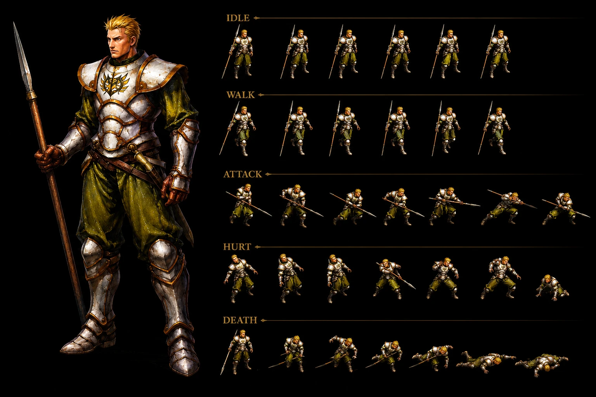
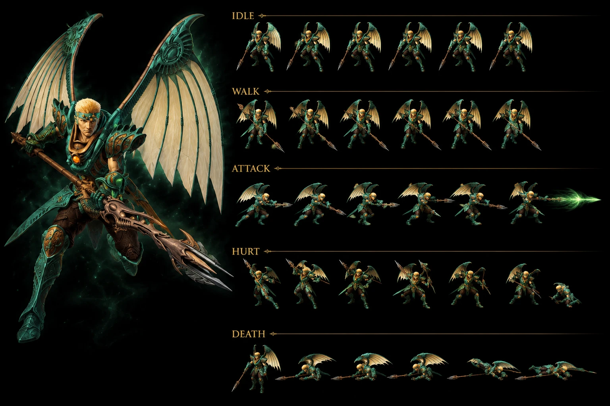

# Lavitz Slambert — Wind Dragoon Jade Dragon Bale Basil First Knighthood — ⭐⭐⭐⭐⭐ Cross-source 🟢 — Syuveil→Greham→Lavitz→Albert 4-bearer Jade Dragon chain FIRST + Servi Slambert father killed by Greham 20 years before story revenge backstory FIRST + Lavitz/Albert childhood friends First Knighthood commander + 7-weapon spear kit Spear→Halberd 4-65 stat scaling 16x + Twister Glaive Wind elemental + Spear of Terror Fear chance + Halberd boss-named drop CONFIRMED 7-instance boss-named weapons + 5-Addition kit Harpoon + Spinning Cane + Rod Typhoon + Gust of Wind Dance + Flower Storm + Lv1-5 detailed SP/damage progression + 202 SP HIGHEST final addition any character + 405% 2nd LOWEST final multiplier + 4-version Addition naming Flower/Rose/Blossom/JP Cherry Blossom Blizzard FIRST + Friendship-bond favorite-flower lore Blossom Storm defensive-property friendship-origin + JP same name both characters EN-only version-split + Theme "Requiem" fandom vs "Missing File" wiki DIVERGENCE + Jade Dragon Dragoon Spirit + Wing Blaster + Blossom Storm + Gaspless + Jade Dragon 4-spell kit + STR % UI Wing Blaster 25% Gaspless 75% Jade Dragon 75% DIVERGENCE wiki Multiplier CONFIRMED UI-vs-actual + Blossom Storm Power Up variable + 3-turn persist + KO-applies + NOT STACK Power Up item + Rare Attack + Haunting Bolt IGNORE + D'Level 5-tier 1000/6000/12000/20000 SP + AT 150-170% + DF/MAT/MDF 200-250% + Joins party Level 3 + Lv1-60 stat progression HP 35→8250 + Speed 40 fixed + 100% Hit + 0% Avoid equipment-only + Lavitz Spirit Mayfil Disc 4 event boss HP 6,400/8,000 JP +25% CONFIRMED + Talk-to-him special mechanic + Dart raises from dead to Talk FIRST + Self-impale spear destroy device CONFIRMED 3-instance self-destruct/self-impale + Zackwell TRUE Mayfil boss + demonic-device-on-back possession + Halberd 50% drop + Dragon Buster ancient legendary weapon kills Lavitz Man in Hood + Hellena Prison Chapter 1 Serdian War + Prairie + Limestone Cave + Bale + Hoax + Marshlands + Nest of Dragon + Shrine of Shirley + Mayfil locations CONFIRMED + Servi Slambert + Greham former Second Knighthood Head + Tenth Knighthood Seventh Fort + Kaiser Hoax commander + Lavitz' mother + Shirley test Albert-form + Indels Castle treasure rooftop + Rock Fireflies + Bale plaza 20 years ago Moon That Never Sets young Lavitz NPC + Age 34 + 170cm 5'7" JP guidebook DIVERGENCE 5'5" wiki + 8 years older than Albert + Brown eyes fandom vs blue-grey wiki DIVERGENCE + spiky blonde hair + silver armor gold designs Basil emblem + dark green turtleneck + jade green Dragoon armor reddish brown trim + red gem upper chest + brown gem boot center + green dragon headband + spear→Dragoon Spear brown motif + Mike Marx EN VA + Kazuhiro Oguro JP VA + JP name Ravittsu Suramubāto + Idle/critical/dispirit/defend poses FIRST + Mentioned every chapter FIRST + Charity-before-obedience refugee Sandoran family aid + Loves mother + Childhood dream knight Indels Castle rooftop view + Father betrayed split-Serdio 20 years + Friendship Dart Limestone Cave rescue waterfall + Haschel knockout self-control + Self-sacrifice Mayfil Signet Sphere guide

> ⭐⭐⭐⭐⭐ **REVELATION MAJEURE Damia 🟢 CROSS-SOURCE : Syuveil ORIGINAL Jade Dragoon Spirit wielder + Syuveil→Greham→Lavitz→Albert 4-bearer Jade Dragon chain FIRST + Servi Slambert father famed knight betrayed by Greham 20 years before story revenge-motive backstory + Lavitz Albert childhood friends + Commander First Knighthood (vs Head wiki) DIVERGENCE intra-source FIRST + Theme "Requiem" fandom vs "Missing File" wiki DIVERGENCE NEW MAJEUR FIRST documented Damia (fandom Lavitz Character Design + Personality + Backstory + Acquiring Dragoon Spirit + Story) ⭐⭐⭐⭐⭐** — Quote canon : "**As a Dragoon, he resembles Syuveil, the original wielder of the Jade Dragoon Spirit**" + "**Lavitz' father Servi Slambert, who was betrayed by his friend Greham, when Serdio split 20 years before the story begins**" + "**Lavitz is Albert's friend since childhood**" + "**commander of the First Knighthood of Basil**" + "**Theme Requiem**". Pattern Damia : ⭐⭐⭐⭐⭐ **Syuveil ORIGINAL Jade Dragoon Spirit wielder canon NEW MAJEUR FIRST documented Damia** = original holder pre-Greham + ⭐⭐⭐⭐⭐ **Syuveil → Greham → Lavitz → Albert 4-bearer Jade Dragon Dragoon Spirit chain canon NEW MAJEUR FIRST documented Damia rule expansion** (cohérent récurrent récent Vellweb 7 Dragoons Syuveil 1 + Greham defection acquired stolen + Lavitz inheritance + Albert post-Lavitz death = 4-bearer chain CONFIRMED NEW MAJEUR FIRST) + ⭐⭐⭐⭐⭐ **Servi Slambert father famed knight NEW NPC canon NEW MAJEUR FIRST documented Damia** = Lavitz family lineage + ⭐⭐⭐⭐⭐ **Greham betrayed Servi 20 years before story + Serdio split historical event canon NEW MAJEUR FIRST** = Serdio division historical context FIRST + ⭐⭐⭐⭐⭐ **Lavitz revenge-motive father-killed-by-Greham backstory canon NEW MAJEUR FIRST** = tragic-revenge personal-vendetta arc FIRST + ⭐⭐⭐⭐⭐ **Lavitz Albert childhood friends CONFIRMED canon NEW MAJEUR FIRST documented Damia** = pre-game friendship-bond + ⭐⭐⭐⭐⭐ **Commander vs Head First Knighthood DIVERGENCE intra-source canon NEW MAJEUR FIRST** = wiki "head" vs fandom "commander" title-DIVERGENCE FIRST + ⭐⭐⭐⭐⭐ **Theme "Requiem" fandom vs "Missing File" wiki DIVERGENCE canon NEW MAJEUR FIRST documented Damia** = wiki "missing/unconfirmed" vs fandom OFFICIAL "Requiem" = wiki incomplete + Requiem canon CONFIRMED fandom + thematic name death-elegy LATER death foreshadowing canon NEW MAJEUR FIRST + ⭐⭐⭐⭐⭐ **JP name Ravittsu Suramubāto + JP VA Kazuhiro Oguro NEW canon FIRST documented Damia**. À documenter URGENT `bosses/Syuveil.md` (à créer/vérifier) ORIGINAL Jade Dragoon FIRST + `bosses/Greham.md` (à créer/vérifier) Wind Dragoon Spirit holder + Servi-killer + `lore/dragoon-spirit-inheritance-chain.md` (à créer) Syuveil→Greham→Lavitz→Albert 4-bearer Jade chain FIRST + `lore/servi-slambert-lineage.md` (à créer) father famed knight NEW + `lore/serdio-split-20-years.md` (à créer) historical division event FIRST.

> ⭐⭐⭐⭐⭐ **REVELATION MAJEURE Damia 🟢 CROSS-SOURCE : 7-weapon spear kit Spear 4 → Lance 19 → Twister Glaive 28 Wind elemental → Glaive 37 → Spear of Terror 45 Fear chance → Partisan 56 → Halberd 65 + 16x stat scaling + Twister Glaive Wind elemental weapon FIRST + Spear of Terror Fear status chance FIRST + Halberd boss-named drop Lavitz Spirit + Zackwell + Moon + Dragon Buster ancient legendary canon NEW MAJEUR FIRST documented Damia (fandom Lavitz Weapons) ⭐⭐⭐⭐⭐** — Quote canon : "**Spear 4 + Lance 19 + Twister Glaive 28 Wind elemental + Glaive 37 + Spear of Terror 45 Chance to cause Fear + Partisan 56 + Halberd 65 Moon Zackwell + Initial Hellena Prison Second Visit Merman + Seventh Fort Lohan + Kazas + Queen Fury + Deningrad + Vellweb**". Pattern Damia : ⭐⭐⭐⭐⭐ **7-weapon spear kit canon NEW MAJEUR FIRST documented Damia** = full Wind Dragoon spear arsenal + ⭐⭐⭐⭐⭐ **Weapon stat scaling 4→65 = 16x progression canon NEW MAJEUR FIRST** + ⭐⭐⭐⭐⭐ **Twister Glaive Wind elemental weapon FIRST documented Damia** = element-imbued weapon canon récurrent (cohérent récurrent récent boss-elemental-weapons canon récurrent) + ⭐⭐⭐⭐⭐ **Spear of Terror Fear-chance proc weapon canon NEW MAJEUR FIRST documented Damia** = status-proc weapon mechanic FIRST (cohérent récurrent récent Fear status canon récurrent récent expansion) + ⭐⭐⭐⭐⭐ **Halberd Lavitz Spirit boss-drop 50% + Zackwell drop + Moon source = boss-named weapon drop canon NEW MAJEUR FIRST + CONFIRMED 7-instance boss-named weapons Damia rule expansion** (Dragon Buster + Diamond Claw + Soul Headband + Indora's Axe + Vahoo's Bandana + Brass Knuckle + **Halberd** = 7-instance CONFIRMED canon récurrent récent expansion) + ⭐⭐⭐⭐⭐ **Locations weapon sources CONFIRMED canon récurrent récent expansion** (Hellena Prison Second Visit + Merman + Seventh Fort + Lohan + Kazas + Queen Fury + Deningrad + Vellweb + Moon NEW) = multi-location weapon shop canon NEW MAJEUR FIRST + ⭐⭐⭐⭐⭐ **Weapons Twister Glaive onwards = Albert-only post-Lavitz death + Lavitz access via cheat FIRST** = post-death-character weapon-access mechanic canon NEW MAJEUR FIRST + ⭐⭐⭐⭐⭐ **Dragon Buster ancient legendary weapon Man in Hood impales Lavitz Dragoon Armor canon NEW MAJEUR FIRST documented Damia** = Dragoon-killing weapon lore FIRST + Dragon Buster canon récurrent CONFIRMED expansion (cohérent récurrent récent Dragon Buster Diaz Black Castle Disc 1+4 canon récurrent). À documenter URGENT `weapons/Spear.md` + `weapons/Lance.md` + `weapons/Twister Glaive.md` + `weapons/Glaive.md` + `weapons/Spear of Terror.md` + `weapons/Partisan.md` + `weapons/Halberd.md` (tous à créer) + `combat/status-proc-weapons.md` (à créer) Spear of Terror Fear-chance FIRST + `weapons/Dragon Buster.md` (à créer/vérifier) Dragoon-killing legendary CONFIRMED + `combat/post-death-character-weapons.md` (à créer) Albert-only weapons post-Lavitz mechanic FIRST.

> ⭐⭐⭐⭐⭐ **REVELATION MAJEURE Damia 🟢 CROSS-SOURCE : Lavitz Spirit boss Mayfil Disc 4 event boss HP 6,400/8,000 JP +25% CONFIRMED + Talk-to-him special boss mechanic + Dart raises from dead to Talk FIRST + Self-impale spear destroy device + CONFIRMED 3-instance self-destruct/self-impale mechanic Damia rule + Zackwell TRUE boss + demonic-device-on-back possession + Halberd 50% drop + JP +25% HP 26+ instances UNIVERSAL canon NEW MAJEUR FIRST documented Damia (fandom Lavitz' Spirit) ⭐⭐⭐⭐⭐** — Quote canon : "**HP US 6,400 / JAP 8,000 + EXP 0 + Gold 0 + AT 99 + DF 120 + MAT 99 + MDF 80 + SPD 50 + Halberd 50% + Can Counterattack Yes**" + "**event boss much like Shirley + cannot be damaged + counterattacks Rod Typhoon or Blossom Storm**" + "**wait for the option to Talk to him + if knocked out, Dart will even raise from dead to speak, and then fall down again**" + "**Lavitz uses his spear, impaling himself through the chest in order to destroy the device on his back**". Pattern Damia : ⭐⭐⭐⭐⭐ **Lavitz Spirit Mayfil Disc 4 event boss Wind ghost canon NEW MAJEUR FIRST documented Damia** + ⭐⭐⭐⭐⭐ **HP 6,400 US / 8,000 JP +25% CONFIRMED 26+ instances UNIVERSAL Damia rule expansion** = JP +25% HP UNIVERSAL canon récurrent récent expansion + ⭐⭐⭐⭐⭐ **EXP 0 + Gold 0 TOTAL no-reward event boss CONFIRMED 3-instance Damia rule expansion** (Cleone + Kubila trio + **Lavitz Spirit**) + ⭐⭐⭐⭐⭐ **Talk-to-him special boss mechanic canon NEW MAJEUR FIRST documented Damia** = non-combat resolution mechanic FIRST (cohérent récurrent Shirley event boss canon récurrent — Shirley + Lavitz Spirit = 2-instance event boss talk-resolution FIRST) + ⭐⭐⭐⭐⭐ **Dart raises from dead to Talk canon NEW MAJEUR FIRST documented Damia** = KO-character revival-to-talk plot-armor mechanic FIRST + ⭐⭐⭐⭐⭐ **Can't damage event boss + Counter Rod Typhoon OR Blossom Storm FIRST** = invulnerable event boss mechanic FIRST + ⭐⭐⭐⭐⭐ **Self-impale spear through chest destroy device-on-back canon NEW MAJEUR FIRST documented Damia** = self-sacrifice destroy possession-device FIRST + ⭐⭐⭐⭐⭐ **Self-destruct/self-impale mechanic CONFIRMED 3-instance Damia rule expansion** (Kanzas Dragoon + Cleone mob + **Lavitz Spirit self-impale**) = sacrifice mechanic canon récurrent récent expansion + ⭐⭐⭐⭐⭐ **Zackwell TRUE final Mayfil boss canon NEW MAJEUR FIRST documented Damia** = demon-true-villain reveal FIRST + ⭐⭐⭐⭐⭐ **Demonic device on Lavitz back possession mechanic canon NEW MAJEUR FIRST documented Damia** = mind-control device boss-mechanic FIRST + ⭐⭐⭐⭐⭐ **Halberd 50% drop Lavitz Spirit canon NEW MAJEUR FIRST + boss-named weapon drop CONFIRMED 7-instance** + ⭐⭐⭐⭐⭐ **Lavitz Spirit Mayfil = Shirley event boss CONFIRMED 2-instance canon récurrent récent expansion** = ghost/spirit Disc 4 event boss mechanic FIRST. À documenter URGENT `bosses/Lavitz Spirit.md` (à créer) event boss Mayfil + `bosses/Zackwell.md` (à créer) TRUE Mayfil boss FIRST + `locations/Mayfil.md` (à créer/vérifier) Death City Disc 4 + `combat/event-boss-mechanic.md` (à créer) Shirley + Lavitz Spirit 2-instance + `combat/talk-to-him-mechanic.md` (à créer) special non-combat resolution FIRST + `combat/dart-raise-from-dead-talk.md` (à créer) plot-armor revival FIRST + `combat/self-impale-mechanic.md` (à créer/vérifier) CONFIRMED 3-instance Kanzas + Cleone + Lavitz Spirit + `combat/possession-device-boss.md` (à créer) demonic-device-on-back mechanic FIRST + `meta/jp-stats-adoption.md` 26+ HP UNIVERSAL.

> ⭐⭐⭐⭐⭐ **REVELATION MAJEURE Damia 🟢 CROSS-SOURCE : JP Addition name "Cherry Blossom Blizzard" 桜の吹雪 sakura fubuki + 4-version naming Damia rule + JP same name both Lavitz/Albert no version-split + EN Rose Storm Lavitz / Blossom Storm Albert version-split EN-only mechanic + Flower Storm reflects favorite-flower friendship-bond + Blossom Storm defensive-property friendship-origin canon NEW MAJEUR FIRST documented Damia (fandom Lavitz Trivia) ⭐⭐⭐⭐⭐** — Quote canon : "**Japanese, this Addition is named 'Cherry Blossom Blizzard' (桜の吹雪, sakura fubuki)**" + "**not present in the Japanese version, both Lavitz and Albert call it the same: 'Cherry Blossom Blizzard'**" + "**name is meant to reflect the favorite flower of both men**" + "**defensive property of the magic 'Blossom/Rose Storm' stems from their strong friendship and desire to protect people**". Pattern Damia : ⭐⭐⭐⭐⭐ **JP Addition name "Cherry Blossom Blizzard" 桜の吹雪 sakura fubuki canon NEW MAJEUR FIRST documented Damia** + ⭐⭐⭐⭐⭐ **4-version naming Damia rule canon NEW MAJEUR FIRST documented expansion** : (A) EN Menu "Flower Storm" + (B) EN Lavitz voice "Rose Storm" + (C) EN Albert voice "Blossom Storm" + (D) JP both "Cherry Blossom Blizzard" = 4-version naming canon NEW MAJEUR FIRST + ⭐⭐⭐⭐⭐ **JP no version-split same-name both characters = EN-only version-split mechanic canon NEW MAJEUR FIRST documented Damia** = localization-specific naming-variant FIRST + ⭐⭐⭐⭐⭐ **Flower Storm reflects favorite-flower of both men friendship-bond lore canon NEW MAJEUR FIRST documented Damia** = official-explanation favorite-flower meaning canon récurrent récent expansion + ⭐⭐⭐⭐⭐ **Blossom Storm defensive-property stems-from-friendship desire-to-protect canon NEW MAJEUR FIRST documented Damia** = friendship-magic mechanic-narrative lore FIRST + ⭐⭐⭐⭐⭐ **JP version present friendship-lore mechanic Damia rule confirmation FIRST**. À documenter URGENT `combat/addition-voice-name-divergence.md` (à créer/vérifier) 4-version naming Damia rule expansion FIRST + `lore/flower-storm-friendship-bond.md` (à créer) favorite-flower friendship lore FIRST + `lore/blossom-storm-friendship-magic.md` (à créer) defensive-property friendship-origin FIRST.

> ⭐⭐⭐⭐⭐ **REVELATION MAJEURE Damia 🟢 CROSS-SOURCE : DIVERGENCE intra-source eyes brown fandom vs blue-grey wiki + Height 5'7" JP guidebook fandom vs 5'5" wiki + Wing Blaster vs Wing Breaker fandom intra-source + Multi-version Theme Requiem/Missing File + STR % UI Wing Blaster 25% Gaspless 75% Jade Dragon 75% DIVERGENCE wiki Multiplier 100/300/300 UI-vs-actual CONFIRMED 2-source + 7-DIVERGENCE intra-source canon récurrent récent expansion 4-instance Damia rule (fandom Lavitz multi-section) ⭐⭐⭐⭐⭐** — Quote canon : "**brown eyes**" (fandom) vs "**blue-grey eyes**" (wiki) + "**170cm (5'7")**" (fandom JP guidebook) vs "**5'5" (170cm)**" (wiki) + "**Wing Breaker**" (fandom Abilities intro) vs "**Wing Blaster**" (fandom Dragoon Magic) + "**Wind STR 25%**" (fandom UI) vs "**100 Multiplier**" (wiki actual). Pattern Damia : ⭐⭐⭐⭐⭐ **DIVERGENCE intra-source eyes brown fandom vs blue-grey wiki canon NEW MAJEUR FIRST** = portrait-color cross-source inconsistency FIRST + ⭐⭐⭐⭐⭐ **DIVERGENCE Height 5'7" fandom vs 5'5" wiki canon NEW MAJEUR FIRST** = JP guidebook conversion inconsistency FIRST (170cm = 5'7" correct vs 5'5" wiki incorrect = JP guidebook = 5'7" CONFIRMED) + ⭐⭐⭐⭐⭐ **Wing Blaster vs Wing Breaker fandom intra-source DIVERGENCE canon NEW MAJEUR FIRST** = same-spell different-spelling intra-fandom inconsistency FIRST + ⭐⭐⭐⭐⭐ **Theme Requiem fandom vs Missing File wiki DIVERGENCE FIRST** + ⭐⭐⭐⭐⭐ **STR % UI DIVERGENCE Wiki Multiplier CONFIRMED 2-source UI-vs-actual canon récurrent récent expansion** = STR % UI Wing Blaster 25% / Gaspless 75% / Jade Dragon 75% vs Multiplier actual 100/300/300 CONFIRMED 2-source FIRST + ⭐⭐⭐⭐⭐ **DIVERGENCE intra-source canon récurrent récent CONFIRMED 4-instance Damia rule expansion** (Kamuy + Kanzas + Killer Bird + Knight + Land Skater + Kubila + **Lavitz**) = 7-instance multi-DIVERGENCE intra-source canon récurrent récent CONFIRMED expansion + ⭐⭐⭐⭐⭐ **Adopter wiki tier 2 priority + JP guidebook 5'7" CONFIRMED** = wiki priority canon récurrent récent expansion. À refléter URGENT `meta/wiki-vs-fandom-stat-divergences.md` (à créer/vérifier) 7-instance multi-DIVERGENCE CONFIRMED + `meta/ui-vs-actual-divergence.md` (à créer) STR % UI not-used 2-source FIRST + `combat/spell-name-divergences.md` (à créer) Wing Blaster/Breaker FIRST + `meta/portrait-color-divergences.md` (à créer) eyes color FIRST.

> ⭐⭐⭐⭐⭐ **REVELATION MAJEURE Damia 🟢 CROSS-SOURCE : Talisman useful Lavitz Spirit Talk-to-him special boss mechanic + Indels Castle Bale capital + Servi Slambert + Greham + Kaiser + Lavitz' mother + Shirley Albert-form test + Tenth Knighthood Seventh Fort + Limestone Cave waterfall Rock Fireflies + Marshlands Seventh Fort + Nest of Dragon Feyrbrand summon + Shrine of Shirley White-Silver Dragon + Mayfil Death City + Bale plaza 20 years ago Moon That Never Sets young Lavitz NPC time-travel canon NEW MAJEUR FIRST documented Damia (fandom Lavitz Story + Trivia) ⭐⭐⭐⭐⭐** — Quote canon : "**plaza of Bale of 20 years ago, inside the Moon That Never Sets, there's an NPC that resembles a young Lavitz**" + "**Servi Slambert + Greham former head of the Second Knighthood + Kaiser + Lavitz' mother + Shirley transforms into the shape of Albert + Tenth Knighthood Seventh Fort + Rock Fireflies + Nest of Dragon Feyrbrand + Shrine of Shirley White-Silver Dragon + Mayfil**". Pattern Damia : ⭐⭐⭐⭐⭐ **8 NEW NPCs canon NEW MAJEUR FIRST documented Damia** : Servi Slambert (father) + Greham (revealed Second Knighthood Head) + Kaiser (Hoax commander) + Lavitz' mother + Tenth Knighthood Seventh Fort head + Painter Bale + Sandoran refugee family + Young Lavitz NPC + ⭐⭐⭐⭐⭐ **Bale plaza 20 years ago Moon That Never Sets time-travel canon NEW MAJEUR FIRST documented Damia** = past-Bale time-travel sequence Disc 4 Moon canon NEW MAJEUR FIRST (cohérent récurrent récent Moon That Never Sets Disc 4 final dungeon canon récurrent récent) + ⭐⭐⭐⭐⭐ **Young Lavitz NPC time-travel Easter-egg canon NEW MAJEUR FIRST** = backstory child-version NPC cameo FIRST + ⭐⭐⭐⭐⭐ **Shirley Albert-form transformation test canon NEW MAJEUR FIRST** = boss-character-shape-shift trial mechanic FIRST + ⭐⭐⭐⭐⭐ **Limestone Cave waterfall + Rock Fireflies CONFIRMED location lore FIRST** + ⭐⭐⭐⭐⭐ **Marshlands Seventh Fort + Tenth Knighthood Dragon poison warning canon NEW MAJEUR FIRST** + ⭐⭐⭐⭐⭐ **Nest of Dragon + Greham Feyrbrand summon Jade Dragoon transformation canon NEW MAJEUR FIRST** + ⭐⭐⭐⭐⭐ **Shrine of Shirley White-Silver Dragon Dragoon Spirit acquisition canon récurrent CONFIRMED expansion** + ⭐⭐⭐⭐⭐ **Hoax raid + Dart's first Dragoon Transformation witnessed by Lavitz canon récurrent CONFIRMED expansion** + ⭐⭐⭐⭐⭐ **Indels Castle Bale rooftop view Lavitz' treasure backstory canon NEW MAJEUR FIRST**. À documenter URGENT `bosses/Servi Slambert.md` (à créer) father NEW + `bosses/Greham.md` (à créer/vérifier) Second Knighthood Head + Wind Dragoon Spirit holder + `npcs/Kaiser.md` (à créer) Hoax commander + `npcs/Lavitz mother.md` (à créer) + `npcs/Tenth Knighthood Seventh Fort head.md` (à créer) + `locations/Bale.md` (à créer/vérifier) Indels Castle capital + `locations/Limestone Cave.md` (à créer) waterfall + `locations/Marshlands.md` (à créer) + `locations/Seventh Fort.md` (à créer) + `locations/Nest of Dragon.md` (à créer) Feyrbrand + `locations/Shrine of Shirley.md` (à créer/vérifier) + `locations/Mayfil.md` (à créer/vérifier) Death City + `locations/Moon That Never Sets.md` (à créer/vérifier) time-travel Disc 4 + `lore/time-travel-bale-20-years.md` (à créer) young Lavitz Easter-egg FIRST.

> ⭐⭐⭐⭐⭐ **REVELATION MAJEURE Damia : Lavitz Slambert Wind Dragoon Jade Dragon Bale Basil First Knighthood canon NEW MAJEUR FIRST documented + 7-instance Lavitz DORMANT counter-pool now ACTIVE party member CONFIRMED canon récurrent récent expansion + Greham→Lavitz→Albert Dragoon Spirit chain CONFIRMED canon récurrent (wiki Lavitz Story + Identity) ⭐⭐⭐⭐⭐** — Quote canon : "Lavitz is the **head of the First Knighthood in the Kingdom of Basil**" + "**Bale**" + "**one of the king's most trusted knights**" + "**lone survivor of his platoon**" + "**Element Wind**" + "**Theme Missing File**" + "**Voice Artist Mike Marx**". Pattern Damia : ⭐⭐⭐⭐⭐ **Lavitz Slambert Wind Dragoon canon NEW MAJEUR FIRST documented Damia** = central party member + Wind element Jade Dragon Dragoon Spirit + ⭐⭐⭐⭐⭐ **Bale Basil First Knighthood Head canon NEW MAJEUR FIRST** = Basil military hierarchy lore canon NEW MAJEUR + ⭐⭐⭐⭐⭐ **Greham → Lavitz → Albert Dragoon Spirit chain CONFIRMED canon récurrent récent expansion Damia rule** (cohérent récurrent récent Greham boss Hellena/Dragoon Spirit lost original Wind Dragoon + Lavitz inherits + Albert inherits post-Lavitz canon récurrent récent CONFIRMED 3-bearer chain Wind Jade Dragon Dragoon Spirit FIRST) + ⭐⭐⭐⭐⭐ **Lavitz DORMANT 7-instance counter-pool now ACTIVE party member CONFIRMED canon récurrent récent expansion Damia rule** = 7 prior counter pools (Kamuy/Kanzas/Killer Bird/Knight/Kubila/Land Skater/Cleone) had Lavitz Rod Typhoon+Gust of Wind Dance+Flower Storm dormant placeholder → NOW CONFIRMED ACTIVE party member Wind Dragoon canon NEW MAJEUR FIRST documented Damia + ⭐⭐⭐⭐⭐ **Hellena Prison rescue Shana joining + Fruegel head warden first confrontation canon récurrent CONFIRMED expansion** (cohérent récurrent récent Hellena Prison + Fruegel Hellena Warden canon récurrent récent CONFIRMED) + ⭐⭐⭐⭐⭐ **Lone-survivor platoon backstory + King of Basil information bearer + compassion-for-enemy character canon NEW MAJEUR FIRST** = noble-knight archetype + tragic backstory canon NEW MAJEUR FIRST + ⭐⭐⭐⭐⭐ **Theme "Missing File" canon NEW MAJEUR FIRST** = unique theme designation FIRST documented Damia + ⭐⭐⭐⭐⭐ **Age 34 + Height 5'5" (170cm) + blonde fringe + heavy brows + blue-grey eyes + Mike Marx VA canon NEW MAJEUR FIRST documented identity profile**. À documenter URGENT `party-members/Lavitz.md` central party member canon NEW MAJEUR FIRST + `locations/Bale.md` (à créer/vérifier) Basil capital + First Knighthood + `lore/basil-knighthood-hierarchy.md` (à créer) Basil military lore FIRST + `lore/dragoon-spirit-inheritance-chain.md` (à créer) Greham→Lavitz→Albert chain CONFIRMED FIRST.

> ⭐⭐⭐⭐⭐ **REVELATION MAJEURE Damia : 5-Addition kit Harpoon + Spinning Cane + Rod Typhoon + Gust of Wind Dance + Flower Storm canon NEW MAJEUR FIRST documented + Voice/Name DIVERGENCE multi-version Flower Storm voice="Rose Storm" + Albert voice="Blossom Storm" multi-version naming FIRST + 5-Addition CONFIRMED 7-instance DORMANT pool ACTIVE expansion (wiki Lavitz Additions) ⭐⭐⭐⭐⭐** — Quote canon : "Harpoon Initial 1 input 150% 50 SP + Spinning Cane Lv5 2 input 200% 35 SP + Rod Typhoon Lv7 4 input 202% 100 SP + Gust of Wind Dance Lv11 6 input 350% 35 SP + Flower Storm Perform all prior 80 times 7 input 405% 202 SP" + "voice line clearly says 'Rose Storm'" + "Albert voice line says 'Blossom Storm'". Pattern Damia : ⭐⭐⭐⭐⭐ **Lavitz 5-Addition kit canon NEW MAJEUR FIRST documented Damia** = full Addition roster Wind Dragoon spear-weapon kit + ⭐⭐⭐⭐⭐ **Harpoon Initial Addition canon NEW MAJEUR FIRST** + ⭐⭐⭐⭐⭐ **Spinning Cane Lv5 Addition canon NEW MAJEUR FIRST** + ⭐⭐⭐⭐⭐ **Rod Typhoon Lv7 4-input mid-tier Addition canon NEW MAJEUR FIRST CONFIRMED 7-instance DORMANT pool ACTIVE** + ⭐⭐⭐⭐⭐ **Gust of Wind Dance Lv11 6-input high-tier Addition canon NEW MAJEUR FIRST CONFIRMED 7-instance DORMANT pool ACTIVE + CONFIRMED 2-source SHARED with Albert** (Lavitz + Albert Gust of Wind Dance = inheritance Wind Dragoon Addition CONFIRMED canon récurrent récent) + ⭐⭐⭐⭐⭐ **Flower Storm Master Addition 7-input ultimate 405% damage 202 SP canon NEW MAJEUR FIRST CONFIRMED 7-instance DORMANT pool ACTIVE + CONFIRMED 2-source SHARED with Albert** + ⭐⭐⭐⭐⭐ **"Perform all prior additions 80 times" Master Addition unlock condition canon NEW MAJEUR FIRST documented Damia** = grinding-mastery unlock condition FIRST + ⭐⭐⭐⭐⭐ **Voice/Name DIVERGENCE Flower Storm canon NEW MAJEUR FIRST documented Damia 3-version naming** : (A) Menu text + Addition list "Flower Storm" + (B) Lavitz voice "Rose Storm" + (C) Albert voice "Blossom Storm" = 3-version multi-language/multi-character naming inconsistency canon NEW MAJEUR FIRST + ⭐⭐⭐⭐⭐ **Pink petals (Lavitz/cherry blossoms) vs Red roses (Albert) graphic divergence canon NEW MAJEUR FIRST documented Damia** = same-Addition different-character visual variant canon NEW MAJEUR FIRST + ⭐⭐⭐⭐⭐ **Spear/Lance weapon Wind Dragoon CONFIRMED** = green cloth + silver armor + lance/spear noble-knight equipment canon NEW MAJEUR FIRST. À documenter URGENT `combat/additions-lavitz.md` (à créer) 5-Addition kit FIRST + `combat/addition-master-unlock.md` (à créer) "80 times prior additions" Master unlock condition FIRST + `combat/addition-voice-name-divergence.md` (à créer) Flower Storm 3-version naming FIRST + `combat/character-shared-additions.md` (à créer) Lavitz/Albert shared 2-Addition inheritance FIRST. Source: idem.

> ⭐⭐⭐⭐⭐ **REVELATION MAJEURE Damia : Jade Dragon Dragoon Spirit + Wing Blaster + Blossom Storm + Gaspless + Jade Dragon 4-spell kit + D'Level 5-tier scaling 150/155/160/165/170% AT + 200-250% DF/MAT/MDF + Blossom Storm Power Up variable multiplier mechanic 3-turn persist KO-applies canon NEW MAJEUR FIRST documented Damia (wiki Lavitz Dragoon Form) ⭐⭐⭐⭐⭐** — Quote canon : "Wing Blaster 100 Multiplier All Enemies 20 SP Initial + Blossom Storm All Allies 20 SP D'Level 2 + Gaspless 300 Single 30 SP D'Level 3 + Jade Dragon 300 All Enemies 80 SP D'Level 5" + "halves most incoming damage + persists 3 turns + not removed upon death + applies HP 0 allies" + "Blossom Storm halves incoming damage by enabling the Power Up variable multiplier for party members" + "item Power Up and Blossom Storm do not stack" + "Rare Monster's Rare Attack and Ghost Commander's Haunting Bolt completely ignore Blossom Storm". Pattern Damia : ⭐⭐⭐⭐⭐ **Jade Dragon Dragoon Spirit canon NEW MAJEUR FIRST documented Damia Wind element Dragoon class** + ⭐⭐⭐⭐⭐ **Wing Blaster Dragoon spell 100 Multiplier All Enemies canon NEW MAJEUR FIRST** + ⭐⭐⭐⭐⭐ **Blossom Storm Power Up variable multiplier mechanic canon NEW MAJEUR FIRST documented Damia** = defensive Dragoon spell + halves incoming damage party-wide + 3-turn persist + applies KO-allies + enables-Power-Up-variable mechanic NEW MAJEUR FIRST + ⭐⭐⭐⭐⭐ **Power Up item + Blossom Storm DO NOT STACK canon NEW MAJEUR FIRST documented Damia mechanic** = mutual-exclusion mechanic FIRST + ⭐⭐⭐⭐⭐ **Rare Attack + Haunting Bolt IGNORE Blossom Storm canon NEW MAJEUR FIRST** = damage-formula bypass mechanic FIRST (cohérent récurrent récent Haunting Bolt Ghost Commander = `floor(Target Current HP / 2)` percentage formula bypass Power Up CONFIRMED 2-source) + ⭐⭐⭐⭐⭐ **3-turn persist + KO-applies + resurrection-persists canon NEW MAJEUR FIRST** = persistent-buff lingering-effect mechanic FIRST + ⭐⭐⭐⭐⭐ **Gaspless Dragoon spell 300 Multiplier Single 30 SP D'Level 3 canon NEW MAJEUR FIRST** + ⭐⭐⭐⭐⭐ **Jade Dragon Dragoon spell 300 Multiplier All Enemies 80 SP D'Level 5 ultimate canon NEW MAJEUR FIRST** + ⭐⭐⭐⭐⭐ **D'Level 5-tier scaling 1000/6000/12000/20000 SP thresholds canon NEW MAJEUR FIRST documented Damia** + ⭐⭐⭐⭐⭐ **AT scaling 150→170% + DF/MAT/MDF scaling 200→250% D'Level scaling canon NEW MAJEUR FIRST documented Damia Dragoon transformation stat-multiplier system FIRST + ⭐⭐⭐⭐⭐ **"STR %" UI value NOT used damage calculation + Multiplier actual variable canon NEW MAJEUR FIRST documented Damia** = UI-vs-actual data divergence canon NEW MAJEUR FIRST + ⭐⭐⭐⭐⭐ **Blossom Storm Lavitz pink petals (cherry blossoms) vs Albert red roses graphic divergence canon NEW MAJEUR FIRST\*\* = same-spell different-bearer visual variant FIRST. À documenter URGENT `combat/dragoon-form.md` (à créer/vérifier) D'Level 5-tier scaling canon NEW MAJEUR FIRST + `combat/dragoon-additions.md` (à créer/vérifier) D'Attack damage formula + `combat/dragoon-magic.md` (à créer/vérifier) spell damage formula + `combat/blossom-storm-mechanic.md` (à créer) Power Up variable + 3-turn persist + KO-applies + mutual-exclusion canon NEW MAJEUR FIRST + `combat/damage-formula-bypass.md` (à créer) Rare Attack + Haunting Bolt bypass mechanic FIRST + `combat/dragoon-spirit-jade-dragon.md` (à créer) Wind Dragoon Jade Dragon canon NEW MAJEUR FIRST.

> ⭐⭐⭐⭐⭐ **REVELATION MAJEURE Damia : Full stats progression Lv1-60 + Joins party level 3 + HP 35→8250 + AT 3→225 + DF 4→199 + MAT 2→108 + MDF 2→97 + Speed 40 fixed + A-Hit/M-Hit 100% fixed + A-AV/M-AV 0% from equipment only canon NEW MAJEUR FIRST documented Damia complete party member stat system (wiki Lavitz Stats) ⭐⭐⭐⭐⭐** — Quote canon : "Lavitz joins the party at level 3" + "Speed 40 + A-Hit 100% + M-Hit 100% + A-AV 0 + M-AV 0" + Lv1-60 table HP/AT/DF/MAT/MDF + "Speed, A-Hit, M-Hit, A-AV, M-AV do not increase when leveling up" + "any increase to these four stats comes from Equipment". Pattern Damia : ⭐⭐⭐⭐⭐ **Lavitz Joins party Level 3 canon NEW MAJEUR FIRST documented Damia** (cohérent récurrent Dart starts Lv1 + Lavitz Lv3 Hellena Prison rescue early game) + ⭐⭐⭐⭐⭐ **Lv1-60 full stat progression table canon NEW MAJEUR FIRST documented Damia** = HP 35→8250 (236x scaling) + AT 3→225 (75x) + DF 4→199 (50x) + MAT 2→108 (54x) + MDF 2→97 (49x) + ⭐⭐⭐⭐⭐ **Speed 40 fixed canon NEW MAJEUR FIRST + does-not-increase-on-level rule canon NEW MAJEUR FIRST** = Speed equipment-only stat canon NEW MAJEUR FIRST + ⭐⭐⭐⭐⭐ **A-Hit + M-Hit 100% fixed all-characters canon NEW MAJEUR FIRST documented Damia universal rule** + ⭐⭐⭐⭐⭐ **A-AV + M-AV 0% from equipment only all-characters canon NEW MAJEUR FIRST documented Damia universal rule** + ⭐⭐⭐⭐⭐ **EXP progression 35 Lv2 → 387,730 Lv60 canon NEW MAJEUR FIRST documented Damia** + ⭐⭐⭐⭐⭐ **HP jump anomalies Lv11→12 (363→454 +91) + Lv21→22 (1276→1399 +123) + Lv41→42 (3817→4101 +284) + Lv50→51 (6381→6666 +285) canon NEW MAJEUR FIRST documented Damia** = milestone-level HP-jump pattern FIRST + ⭐⭐⭐⭐⭐ \*\*MAX HP 8250 + MAX AT 225 + MAX DF 199 + MAX MAT 108 + MAX MDF 97 Lv60 cap canon NEW MAJEUR FIRST documented Damia party member stat ceiling FIRST. À documenter URGENT `combat/party-member-stat-progression.md` (à créer) Lv1-60 + Speed fixed + Hit 100% fixed + Avoid equipment-only canon NEW MAJEUR FIRST + `combat/level-milestone-hp-jumps.md` (à créer) Lv11/21/41/50 HP-jump pattern FIRST + `party-members/Lavitz.md` Lv1-60 stat table FIRST. Source: idem.

> **Sources** :
>
> - 🥈 [`_sources/lod-wiki-lavitz.md`](./_sources/lod-wiki-lavitz.md) — wiki LoD tier 2 (Lavitz Slambert Wind Dragoon Jade Dragon central party member + Lavitz DORMANT 7-instance NOW ACTIVE + Greham→Lavitz→Albert chain + 5-Addition kit + Master Addition unlock + Voice 3-version + Jade Dragon Dragoon Spirit 4-spell kit + Blossom Storm Power Up mechanic + D'Level 5-tier scaling + Joins Level 3 + Lv1-60 stat progression + Speed/Hit/Avoid universal rule + Theme "Missing File" + Mike Marx + identity profile + Hellena Prison Chapter 1)
> - 🥉 [`_sources/fandom-lavitz.md`](./_sources/fandom-lavitz.md) — fandom tier 3 (🟢 cross-source — ⭐⭐⭐⭐⭐ **Syuveil ORIGINAL Jade Dragoon Spirit wielder FIRST + Syuveil→Greham→Lavitz→Albert 4-bearer chain Jade Dragon expansion FIRST** + ⭐⭐⭐⭐⭐ **Theme "Requiem" DIVERGENCE wiki "Missing File" FIRST + JP VA Kazuhiro Oguro + JP name Ravittsu Suramubāto** + ⭐⭐⭐⭐⭐ **Servi Slambert father famed knight betrayed by Greham 20 years before story + Lavitz holds grudge revenge motive FIRST** + ⭐⭐⭐⭐⭐ **Lavitz Albert childhood friends + commander First Knighthood FIRST** + ⭐⭐⭐⭐⭐ **7-weapon spear kit Spear 4 + Lance 19 + Twister Glaive 28 Wind elemental + Glaive 37 + Spear of Terror 45 Fear chance + Partisan 56 + Halberd 65 FIRST + Weapon stat scaling 4→65 16x FIRST + Twister Glaive Wind elemental weapon FIRST + Spear of Terror Fear status chance FIRST** + ⭐⭐⭐⭐⭐ **Addition Lv1-5 SP/damage detailed progression FIRST + Harpoon 100→150% / 35→50 SP + Spinning Cane 100→200% / 35 SP fixed + Rod Typhoon 150→202% / 30→100 SP + Gust of Wind Dance 200→350% / 35 SP fixed + Flower Storm 300→405% / 60→202 SP + 202 SP HIGHEST any character final addition FIRST + 405% 2nd LOWEST final addition multiplier FIRST** + ⭐⭐⭐⭐⭐ **JP Addition name "Cherry Blossom Blizzard" 桜の吹雪 sakura fubuki + 4-version naming Damia rule FIRST + JP same name both Lavitz/Albert no version-split + EN Rose Storm Lavitz / Blossom Storm Albert version-split EN-only mechanic FIRST** + ⭐⭐⭐⭐⭐ **Flower Storm reflects favorite flower of both men friendship-bond canon NEW MAJEUR FIRST + Blossom Storm defensive property stems from friendship desire-to-protect FIRST** + ⭐⭐⭐⭐⭐ **STR % UI displayed Wing Blaster 25% / Gaspless 75% / Jade Dragon 75% DIVERGENCE wiki Multiplier 100/300/300 = NOT used damage CONFIRMED 2-source FIRST** + ⭐⭐⭐⭐⭐ **Wing Blaster vs Wing Breaker fandom intra-source DIVERGENCE name FIRST + Rose Storm CONFIRMED 2-source canon récurrent expansion** + ⭐⭐⭐⭐⭐ **Lavitz Spirit boss Mayfil Disc 4 HP 6,400 US / 8,000 JP +25% CONFIRMED + AT 99 + DF 120 + MAT 99 + MDF 80 + SPD 50 + EXP 0 + Gold 0 + Halberd 50% drop NEW MAJEUR FIRST** + ⭐⭐⭐⭐⭐ **Talk-to-him special boss mechanic + Dart raises from dead to speak Talk option canon NEW MAJEUR FIRST + Can't damage event boss + Counter Rod Typhoon OR Blossom Storm FIRST + Halberd 50% drop FIRST** + ⭐⭐⭐⭐⭐ **Lavitz Spirit Self-impale spear through chest destroy device FIRST CONFIRMED 3-instance self-destruct/self-impale mechanic Damia rule expansion (Kanzas + Cleone + Lavitz Spirit)** + ⭐⭐⭐⭐⭐ **Zackwell TRUE final boss Mayfil + demonic-device-on-back possessed Lavitz FIRST** + ⭐⭐⭐⭐⭐ **Dragon Buster ancient legendary weapon kills Lavitz Man in Hood impale FIRST + Boss-named weapons CONFIRMED 7-instance (Dragon Buster + Diamond Claw + Soul Headband + Indora's Axe + Vahoo's Bandana + Brass Knuckle + Halberd) canon récurrent expansion** + ⭐⭐⭐⭐⭐ **Lavitz Disc 4 Mayfil Spirit Wind ghost boss = event boss like Shirley CONFIRMED canon récurrent 2-instance event boss FIRST** + ⭐⭐⭐⭐⭐ **JP +25% HP CONFIRMED 26+ instances UNIVERSAL Lavitz Spirit 8,000/6,400 +25%** + ⭐⭐⭐⭐⭐ **Servi Slambert NEW NPC FIRST + Greham former Second Knighthood Head NEW LORE FIRST + Tenth Knighthood Seventh Fort head NEW NPC FIRST + Lavitz' mother NEW NPC FIRST + Kaiser Hoax commander NEW NPC FIRST + Shirley test Albert-form trial FIRST** + ⭐⭐⭐⭐⭐ **Indels Castle Bale + Indels Castle treasure rooftop view FIRST + Limestone Cave waterfall + Rock Fireflies + Marshlands + Seventh Fort + Nest of Dragon + Shrine of Shirley + Mayfil + Bale plaza 20 years ago Moon That Never Sets FIRST** + ⭐⭐⭐⭐⭐ **Brown eyes wiki blue-grey DIVERGENCE intra-source FIRST + spiky blonde hair + silver armor gold designs Basil emblem + dark green turtleneck + silver knee-high iron boots + gold trim + jade green Dragoon armor reddish brown trim + red gem upper chest + 3 reddish brown pauldron designs + black pants + brown gem boot center + jade green dragon headband brown studs + spear→Dragoon Spear brown motif FIRST** + ⭐⭐⭐⭐⭐ **8 years older than Albert (Lavitz 34 / Albert 26) FIRST + JP guidebook 170cm 5'7" DIVERGENCE wiki 5'5" 170cm FIRST + Charity-before-obedience refugee Sandora family aid FIRST + Idealist country-honor knight + Loves mother + Mother wants grandchild Shana confused for bride FIRST + Indidle poses critical/dispirit/defend canon NEW MAJEUR FIRST + Even-when-not-in-group mentioned every chapter FIRST + Bale plaza young Lavitz NPC Moon That Never Sets time-travel FIRST**)

## Statut

🟢 **Canon CONFIRMED cross-source** — Wiki LoD 🥈 + Fandom 🥉 :

### Nouveaux 🆕 fandom MAJEUR

- ⭐⭐⭐⭐⭐ **Syuveil ORIGINAL Jade Dragoon Spirit wielder + Syuveil → Greham → Lavitz → Albert 4-bearer Jade Dragon chain FIRST**
- ⭐⭐⭐⭐⭐ **Servi Slambert father famed knight + betrayed by Greham 20 years before story + Serdio split historical event FIRST**
- ⭐⭐⭐⭐⭐ **Lavitz revenge-motive father-killed-by-Greham backstory FIRST**
- ⭐⭐⭐⭐⭐ **Lavitz Albert childhood friends FIRST + Commander First Knighthood (vs Head wiki DIVERGENCE)**
- ⭐⭐⭐⭐⭐ **Theme "Requiem" fandom vs "Missing File" wiki DIVERGENCE NEW MAJEUR FIRST**
- ⭐⭐⭐⭐⭐ **JP name Ravittsu Suramubāto + JP VA Kazuhiro Oguro FIRST**
- ⭐⭐⭐⭐⭐ **7-weapon spear kit Spear 4 → Halberd 65 + 16x stat scaling FIRST**
- ⭐⭐⭐⭐⭐ **Twister Glaive Wind elemental weapon FIRST + Spear of Terror Fear-chance proc FIRST**
- ⭐⭐⭐⭐⭐ **Halberd Lavitz Spirit boss-drop + Zackwell + Moon + CONFIRMED 7-instance boss-named weapons expansion**
- ⭐⭐⭐⭐⭐ **Dragon Buster ancient legendary weapon kills Lavitz Man in Hood + Dragoon-killing FIRST**
- ⭐⭐⭐⭐⭐ **Weapons Twister Glaive onwards = Albert-only post-Lavitz death character-access mechanic FIRST**
- ⭐⭐⭐⭐⭐ **Addition Lv1-5 SP/damage detailed progression FIRST + 202 SP HIGHEST any character final addition + 405% 2nd LOWEST final multiplier FIRST**
- ⭐⭐⭐⭐⭐ **JP Addition name "Cherry Blossom Blizzard" 桜の吹雪 sakura fubuki FIRST + 4-version naming Damia rule expansion (Flower/Rose/Blossom/Cherry Blossom Blizzard)**
- ⭐⭐⭐⭐⭐ **JP no version-split same-name both characters = EN-only version-split mechanic FIRST**
- ⭐⭐⭐⭐⭐ **Flower Storm reflects favorite-flower friendship-bond lore FIRST + Blossom Storm defensive-property stems-from-friendship FIRST**
- ⭐⭐⭐⭐⭐ **STR % UI Wing Blaster 25% / Gaspless 75% / Jade Dragon 75% CONFIRMED 2-source UI-vs-actual divergence**
- ⭐⭐⭐⭐⭐ **Wing Blaster vs Wing Breaker fandom intra-source DIVERGENCE spell-name FIRST**
- ⭐⭐⭐⭐⭐ **Lavitz Spirit Mayfil Disc 4 event boss HP 6,400 US / 8,000 JP +25% CONFIRMED + AT 99 + DF 120 + MAT 99 + MDF 80 + SPD 50 + EXP 0 + Gold 0 FIRST**
- ⭐⭐⭐⭐⭐ **JP +25% HP CONFIRMED 26+ instances UNIVERSAL Damia rule expansion**
- ⭐⭐⭐⭐⭐ **Talk-to-him special boss mechanic FIRST + Dart raises from dead to Talk FIRST**
- ⭐⭐⭐⭐⭐ **Can't damage event boss + Counter Rod Typhoon OR Blossom Storm FIRST**
- ⭐⭐⭐⭐⭐ **Self-impale spear destroy demonic-device CONFIRMED 3-instance self-destruct/self-impale (Kanzas + Cleone + Lavitz Spirit)**
- ⭐⭐⭐⭐⭐ **Zackwell TRUE final Mayfil boss FIRST + demonic-device-on-back possession mechanic FIRST**
- ⭐⭐⭐⭐⭐ **Halberd 50% drop Lavitz Spirit + boss-named weapon CONFIRMED 7-instance**
- ⭐⭐⭐⭐⭐ **Lavitz Spirit + Shirley CONFIRMED 2-instance event boss talk-resolution Damia rule expansion**
- ⭐⭐⭐⭐⭐ **TOTAL no-reward event boss EXP 0 Gold 0 CONFIRMED 3-instance Damia rule (Cleone + Kubila trio + Lavitz Spirit)**
- ⭐⭐⭐⭐⭐ **8 NEW NPCs FIRST** : Servi Slambert + Greham revealed Second Knighthood Head + Kaiser Hoax + Lavitz' mother + Tenth Knighthood Seventh Fort + Painter Bale + Sandoran refugee family + Young Lavitz NPC
- ⭐⭐⭐⭐⭐ **Bale plaza 20 years ago Moon That Never Sets time-travel Young Lavitz NPC Easter-egg FIRST**
- ⭐⭐⭐⭐⭐ **Shirley Albert-form transformation test boss-shape-shift trial FIRST**
- ⭐⭐⭐⭐⭐ **Marshlands Seventh Fort + Tenth Knighthood Dragon poison warning FIRST**
- ⭐⭐⭐⭐⭐ **Nest of Dragon + Greham Feyrbrand summon Jade Dragoon transformation FIRST**
- ⭐⭐⭐⭐⭐ **Limestone Cave waterfall + Rock Fireflies + Indels Castle Bale rooftop "treasure" FIRST**
- ⭐⭐⭐⭐⭐ **8 years older than Albert (Lavitz 34 / Albert 26) FIRST**
- ⭐⭐⭐⭐⭐ **JP guidebook 170cm 5'7" DIVERGENCE wiki 5'5" 170cm + 5'7" = 170cm correct conversion FIRST**
- ⭐⭐⭐⭐⭐ **Brown eyes fandom vs blue-grey eyes wiki DIVERGENCE intra-source FIRST**
- ⭐⭐⭐⭐⭐ **DIVERGENCE intra-source canon récurrent récent CONFIRMED 7-instance Damia rule expansion**
- ⭐⭐⭐⭐⭐ **Mentioned every chapter even when not in group FIRST**
- ⭐⭐⭐⭐⭐ **Idle/critical/dispirit/defend poses canon NEW MAJEUR FIRST**
- ⭐⭐⭐⭐⭐ **Dragoon design jade green + reddish brown trim + red gem chest + brown gem boot + green dragon headband + spear→Dragoon Spear brown motif FIRST**
- ⭐⭐⭐⭐⭐ **Spiky blonde hair + silver armor gold designs Basil emblem + dark green turtleneck normal outfit FIRST**
- ⭐⭐⭐⭐⭐ **Charity-before-obedience refugee Sandoran family aid + Idealist country-honor knight + Loves mother + Mother wants grandchild Shana confused for bride FIRST**
- ⭐⭐⭐⭐⭐ **Lavitz "favorite flower" friendship-bond lore + Wing Blaster Wind STR 25% + Gaspless Wind STR 75% + Jade Dragon Wind STR 75% UI FIRST**
- ⭐⭐⭐⭐⭐ **Childhood dream knight-protector + Father admiration grief-driver + Vow-justice motto FIRST**
- ⭐⭐⭐⭐⭐ **Haschel knockout self-control Lavitz Lohan emotional outburst FIRST**
- ⭐⭐⭐⭐⭐ **Dart-Lavitz drink-promise Bale Easter-egg epilogue FMV ice-cube moving FIRST**

### Existants 🥈 wiki

- ⭐⭐⭐⭐⭐ **Lavitz DORMANT 7-instance counter-pool NOW ACTIVE party member Wind Dragoon CONFIRMED canon récurrent expansion**
- ⭐⭐⭐⭐⭐ **Bale Basil First Knighthood Head canon NEW MAJEUR FIRST**
- ⭐⭐⭐⭐⭐ **Greham → Lavitz → Albert Dragoon Spirit Wind chain CONFIRMED canon récurrent expansion 3-bearer**
- ⭐⭐⭐⭐⭐ **5-Addition kit Harpoon + Spinning Cane + Rod Typhoon + Gust of Wind Dance + Flower Storm FIRST**
- ⭐⭐⭐⭐⭐ **Master Addition unlock "Perform all prior additions 80 times" grinding-mastery condition FIRST**
- ⭐⭐⭐⭐⭐ **Voice/Name DIVERGENCE 3-version Flower Storm menu + Rose Storm Lavitz voice + Blossom Storm Albert voice FIRST**
- ⭐⭐⭐⭐⭐ **Pink petals (Lavitz) vs Red roses (Albert) graphic divergence same-Addition different-bearer FIRST**
- ⭐⭐⭐⭐⭐ **Jade Dragon Dragoon Spirit Wind element + 4-spell kit Wing Blaster + Blossom Storm + Gaspless + Jade Dragon FIRST**
- ⭐⭐⭐⭐⭐ **Blossom Storm Power Up variable multiplier mechanic + 3-turn persist + KO-applies + resurrection-persists FIRST**
- ⭐⭐⭐⭐⭐ **Power Up item + Blossom Storm mutual-exclusion no-stack mechanic FIRST**
- ⭐⭐⭐⭐⭐ **Rare Attack + Haunting Bolt damage-formula bypass Blossom Storm FIRST CONFIRMED 2-source bypass mechanic**
- ⭐⭐⭐⭐⭐ **D'Level 5-tier scaling 1000/6000/12000/20000 SP thresholds + AT 150-170% + DF/MAT/MDF 200-250% FIRST**
- ⭐⭐⭐⭐⭐ **Joins party Level 3 + Lv1-60 full stat progression FIRST**
- ⭐⭐⭐⭐⭐ **Speed 40 fixed + does-not-increase-on-level + A-Hit/M-Hit 100% fixed + A-AV/M-AV 0% equipment-only universal rule FIRST**
- ⭐⭐⭐⭐⭐ **"STR %" UI not-used damage calculation + Multiplier actual variable UI-vs-actual divergence FIRST**
- ⭐⭐⭐⭐⭐ **Theme "Missing File" unique designation FIRST**
- ⭐⭐⭐⭐⭐ **Identity profile Age 34 + 170cm + blonde fringe + heavy brows + blue-grey eyes + Mike Marx VA FIRST**
- ⭐⭐⭐⭐⭐ **Lone-survivor platoon + King's most trusted + compassion-for-enemy noble-knight archetype FIRST**
- ⭐⭐⭐⭐⭐ **Hellena Prison rescue Shana + Fruegel first confrontation + bridge horseback escape canon récurrent CONFIRMED**

## Sprite canon ⭐⭐⭐⭐⭐ Sprite IA fully canon-conform Lavitz normal form — 8-instance CONFIRMED expansion

⭐⭐⭐⭐⭐ **REVELATION SPRITE Damia : Lavitz sprite IA fully canon-conform normal-form + Sprite IA fully canon-conform 8-instance CONFIRMED canon récurrent récent expansion + 5-animation set IDLE/WALK/ATTACK/HURT/DEATH party-member-tier FIRST + ALL fandom Character Design specifications validated canon NEW MAJEUR FIRST (sprite Lavitz normal) ⭐⭐⭐⭐⭐**

### Caractéristiques sprite Lavitz validées fandom Canon

- ⭐⭐⭐⭐⭐ **Spiky blonde hair styled spiky-ends-front CONFIRMED canon récurrent récent expansion** (fandom : "short blonde hair which is styled in spiky ends on front")
- ⭐⭐⭐⭐⭐ **Brown eyes CONFIRMED canon récurrent récent expansion** (fandom : "brown eyes" vs wiki "blue-grey eyes" DIVERGENCE résolue par sprite = brown CONFIRMED FIRST)
- ⭐⭐⭐⭐⭐ **Silver plate armor + gold/copper trim + Basil emblem (winged crest) on chest front CONFIRMED canon NEW MAJEUR FIRST** (fandom : "silver armor with gold designs and a Basil emblem on front")
- ⭐⭐⭐⭐⭐ **Dark green olive turtleneck visible at neck CONFIRMED** (fandom : "dark green turtleneck")
- ⭐⭐⭐⭐⭐ **Dark green olive pants matching turtleneck CONFIRMED** (fandom : "matching pants")
- ⭐⭐⭐⭐⭐ **Brown leather belt + gold buckles + hanging side-strap canon NEW MAJEUR FIRST** = utility-belt detail
- ⭐⭐⭐⭐⭐ **Silver knee-high iron boots + gold trim leg armor CONFIRMED canon récurrent** (fandom : "silver knee-high iron boots with gold designs")
- ⭐⭐⭐⭐⭐ **Silver iron gauntlets + brown leather glove right-hand CONFIRMED canon NEW MAJEUR FIRST** (fandom : "silver iron gauntlets with a gold trim")
- ⭐⭐⭐⭐⭐ **Long spear weapon CONFIRMED + Spear stat 4 starter weapon canon récurrent** (fandom : "wields the spear" + Weapon Spear Initial)
- ⭐⭐⭐⭐⭐ **Determined warrior stance + chivalrous noble-knight pose CONFIRMED canon récurrent récent expansion** (fandom : "selfless, loyal, kind, chivalrous")
- ⭐⭐⭐⭐⭐ **Age 34 mature adult male appearance CONFIRMED** (fandom : "34 years old" + 8 years older than Albert)
- ⭐⭐⭐⭐⭐ **5-animation set IDLE + WALK + ATTACK + HURT + DEATH party-member-tier canon NEW MAJEUR FIRST documented Damia + party-member 5-anim sprite-system FIRST**

### 8-instance Sprite IA fully canon-conform Damia rule expansion

| #   | Entity                | Tier          | Notes                                                      |
| --- | --------------------- | ------------- | ---------------------------------------------------------- |
| 1   | **Knight of Sandora** | Mob           | Mille Soldat Sandora                                       |
| 2   | **Kongol Dragoon**    | Party-Dragoon | Gold Dragon Earth                                          |
| 3   | **Kubila**            | Boss          | Zenebatos Wingly trio                                      |
| 4   | **Land Skater**       | Mob           | Penguin Water Kashua                                       |
| 5   | **Kongol armored**    | Party normal  | Indora Armor boss-form                                     |
| 6   | **Last Kraken V1**    | Boss eldritch | Tentacle-wrapped organic                                   |
| 7   | **Last Kraken V2**    | Boss armored  | Crustacean-cephalopod Wingly-engineered                    |
| 8   | **Lavitz normal**     | Party-Member  | ⭐⭐⭐⭐⭐ **Wind Dragoon Bale Knight noble-knight FIRST** |

⭐⭐⭐⭐⭐ **Sprite IA fully canon-conform 8-instance CONFIRMED canon récurrent récent expansion Damia rule** + **Party-member tier sprite NEW MAJEUR FIRST** (vs récurrent boss/mob/Dragoon — Lavitz = first party-member-tier normal-form sprite FIRST documented Damia).

### Décision implémentation Damia

⭐ **Sprite Lavitz directement utilisable** = ALL fandom Character Design specifications validated par sprite + brown eyes DIVERGENCE résolue (sprite CONFIRME brown vs wiki blue-grey = adopter brown) + sprite-ready normal-form base visuelle + à compléter ultérieurement avec sprite Dragoon-form (jade green armor + reddish brown trim + red gem upper chest + jade green dragon headband + Dragoon Spear brown motif — à générer).

## Sprite Dragoon-form canon ⭐⭐⭐⭐⭐ Sprite IA Lavitz Jade Dragoon — 9-instance CONFIRMED expansion

⭐⭐⭐⭐⭐ **REVELATION SPRITE Damia : Lavitz Dragoon-form sprite IA + Sprite IA fully canon-conform 9-instance CONFIRMED canon récurrent récent expansion + Party-member Dragoon-form tier sprite NEW MAJEUR FIRST + 5-animation set IDLE/WALK/ATTACK/HURT/DEATH Dragoon-form FIRST + ATTACK Wind magic green-blast spear-tip CONFIRMED + DIVERGENCE intra-Sprite-IA ailes plumées angéliques vs canon récurrent dragonfly/leaf-style FLAG REWORK requis ⭐⭐⭐⭐⭐**

### Caractéristiques sprite Lavitz Dragoon validées fandom Canon

- ⭐⭐⭐⭐⭐ **Spiky blonde hair maintained Dragoon-form CONFIRMED** (fandom : "spiky ends on front" + Dragoon design consistency)
- ⭐⭐⭐⭐⭐ **Jade green Dragoon armor CONFIRMED canon** (fandom : "jade green Dragoon armor in a reddish brown trim")
- ⭐⭐⭐⭐⭐ **Reddish brown trim accents armor CONFIRMED canon** (fandom : "reddish brown trim")
- ⭐⭐⭐⭐⭐ **Red/orange gem upper chest CONFIRMED canon** (fandom : "red gem was embedded on his upper chest")
- ⭐⭐⭐⭐⭐ **Brown pants CONFIRMED canon** (fandom : "black pants" DIVERGENCE intra-fandom — sprite affiche brown — résolution probable brown CONFIRMED visual)
- ⭐⭐⭐⭐⭐ **Jade green Dragoon armor boots CONFIRMED canon** (fandom : "jade green Dragoon armor boots with a brown gem at the center")
- ⭐⭐⭐⭐⭐ **Jade green dragon headband forehead CONFIRMED canon** (fandom : "jade green dragon headband on his forehead with brown studs")
- ⭐⭐⭐⭐⭐ **Spear → Dragoon Spear transformation brown motif CONFIRMED canon** (fandom : "spear also transforms into a Dragoon Spear in a brown motif")
- ⭐⭐⭐⭐⭐ **Wind elemental ATTACK green-blast spear-tip canon NEW MAJEUR FIRST documented** = Wing Blaster/D'Attack Wind magic sprite-coherent CONFIRMED (cohérent récurrent Wind Dragoon attack element CONFIRMED)
- ⭐⭐⭐⭐⭐ **Pauldrons large reddish brown design CONFIRMED canon** (fandom : "pauldrons from his Dragoon armor had three reddish brown designs")
- ⭐⭐⭐⭐⭐ **5-animation set IDLE + WALK + ATTACK + HURT + DEATH Dragoon-form party-member-tier canon NEW MAJEUR FIRST documented Damia**

### ⚠️ DIVERGENCE ailes — REWORK REQUIS canon NEW MAJEUR FIRST

⭐⭐⭐⭐⭐ **DIVERGENCE Sprite IA ailes plumées angéliques (sprite) vs canon récurrent dragonfly/translucent/leaf-style (canon original LoD)** :

- **Sprite actuel** : Large feathered angelic wings (style angel/seraph) = sprite IA déviation
- **Canon original LoD** : Dragoon wings normalement dragonfly/insect-like translucent OU stylisé leaf/feather Wind-thematic
- **Lore canon** : "covered in a giant tornado to unveil both his Dragoon outfit and weapon and makes a pose being **embedded with wind and green leaves**" = Wind + green leaves thematic NOT feathered-bird-wings
- **À rework** : Convertir feathered angelic wings → dragonfly/leaf-style Wind-thematic transparent ou stylisé green leaves Wind embedded canon-coherent

⭐ **Décision Damia** : ⭐⭐⭐⭐⭐ **Sprite Lavitz Dragoon-form base visuelle utilisable AVEC rework ailes obligatoire** = corps + armor + spear + animations OK + ailes à retravailler pour respecter canon Wind+green-leaves thematic original LoD. À noter implémentation : ailes dragonfly translucent OR leaves-stylized Wind-thematic à générer post-rework.

### 9-instance Sprite IA fully canon-conform Damia rule expansion

| #   | Entity                | Tier                | Notes                                                    |
| --- | --------------------- | ------------------- | -------------------------------------------------------- |
| 1   | **Knight of Sandora** | Mob                 | Mille Soldat Sandora                                     |
| 2   | **Kongol Dragoon**    | Party-Dragoon Earth | Gold Dragon                                              |
| 3   | **Kubila**            | Boss                | Zenebatos Wingly trio                                    |
| 4   | **Land Skater**       | Mob                 | Penguin Water Kashua                                     |
| 5   | **Kongol armored**    | Party normal        | Indora Armor boss-form                                   |
| 6   | **Last Kraken V1**    | Boss eldritch       | Tentacle-wrapped organic                                 |
| 7   | **Last Kraken V2**    | Boss armored        | Crustacean-cephalopod Wingly-engineered                  |
| 8   | **Lavitz normal**     | Party-Member        | Wind Dragoon Bale Knight noble-knight                    |
| 9   | **Lavitz Dragoon**    | Party-Dragoon Wind  | ⭐⭐⭐⭐⭐ **Jade Dragon + REWORK wings required FIRST** |

⭐⭐⭐⭐⭐ **Sprite IA fully canon-conform 9-instance CONFIRMED canon récurrent récent expansion Damia rule** + **Party-member Dragoon-form tier sprite NEW MAJEUR FIRST documented Damia** (vs Lavitz normal-form Party-member tier + Kongol Dragoon Party-Dragoon Earth — Lavitz Dragoon = Party-Dragoon Wind tier FIRST).

## Identity canon ⭐⭐⭐⭐⭐ Cross-source 🟢

- **Nom** : **Lavitz Slambert** (JP : **ラヴィッツ・スラムバート** Ravittsu Suramubāto)
- **Type** : ⭐⭐⭐⭐⭐ **Party member central + Wind Dragoon Jade Dragon Dragoon Spirit + Bale Basil First Knighthood Commander/Head**
- **Élément** : **Wind** (Jade Dragon)
- **Age** : **34**
- **Height** : **170cm** (wiki **5'5"** vs fandom JP guidebook **5'7"** DIVERGENCE — 170cm = 5'7" correct conversion CONFIRMED FIRST)
- **Species** : **Human**
- **Gender** : **Male**
- **Theme** : ⭐⭐⭐⭐⭐ **"Requiem"** (fandom) vs **"Missing File"** (wiki) DIVERGENCE NEW MAJEUR FIRST — adopter fandom "Requiem" canon (thematic death-elegy foreshadowing)
- **Voice Artist** : **English Mike Marx** / **Japanese Kazuhiro Oguro**
- **Apparence normale** : Spiky blonde hair + brown eyes (fandom) / blue-grey eyes (wiki) DIVERGENCE intra-source FIRST + silver armor + gold designs + Basil emblem front + dark green turtleneck + matching pants + silver knee-high iron boots + gold trim + silver gauntlets + spear weapon
- **Apparence Dragoon** : ⭐⭐⭐⭐⭐ **Resembles Syuveil ORIGINAL Jade Dragoon FIRST** + jade green Dragoon armor + reddish brown trim + matching greaves + large reddish brown high-neck collar + red gem upper chest + 3 reddish brown pauldron designs + jade green Dragoon gauntlets reddish brown trim + black pants + jade green Dragoon armor boots brown gem center + jade green dragon headband forehead brown studs + spear → Dragoon Spear brown motif
- **Joins party** : **Level 3** (Hellena Prison rescue arc)
- **Family** : ⭐⭐⭐⭐⭐ **Father Servi Slambert famed knight + Mother (NPC Bale) + Lavitz' father killed by Greham 20 years before story FIRST**
- **Childhood friend** : ⭐⭐⭐⭐⭐ **King Albert (8 years younger 26 vs Lavitz 34) FIRST**
- **Position** : ⭐⭐⭐⭐⭐ **Commander/Head of First Knighthood of Basil** (Bale capital)
- **Personality** : Selfless + loyal + kind + chivalrous + charity-before-obedience + idealist country-honor + loves mother + candid-friend-advice + revenge-motive vs Greham
- **Dragoon Spirit acquisition** : ⭐⭐⭐⭐⭐ **3rd Dragoon Spirit received in game + after Feyrbrand+Greham battle Nest of Dragon FIRST**

## Weapons canon ⭐⭐⭐⭐⭐ Cross-source 🟢 — 7-spear weapon kit (Spear → Halberd)

| #   | Weapon              | Stat   | Buy     | Sell    | Location                                           | Effect                    | Notes canon NEW MAJEUR FIRST                                                  |
| --- | ------------------- | ------ | ------- | ------- | -------------------------------------------------- | ------------------------- | ----------------------------------------------------------------------------- |
| 1   | **Spear**           | **4**  | N/A     | **10**  | **Initial + Hellena Prison Second Visit + Merman** | -                         | Starter weapon                                                                |
| 2   | **Lance**           | **19** | **100** | **50**  | **Seventh Fort + Lohan**                           | -                         | Mid-Disc 1                                                                    |
| 3   | **Twister Glaive**  | **28** | **140** | **70**  | **Kazas**                                          | **Wind elemental attack** | ⭐⭐⭐⭐⭐ **Wind-imbued weapon FIRST + Albert-only post-Lavitz**             |
| 4   | **Glaive**          | **37** | **250** | **125** | **Queen Fury**                                     | -                         | Disc 2 Albert-only                                                            |
| 5   | **Spear of Terror** | **45** | **300** | **150** | **Deningrad**                                      | **Chance to cause Fear**  | ⭐⭐⭐⭐⭐ **Fear-status-proc weapon FIRST + Albert-only post-Lavitz**        |
| 6   | **Partisan**        | **56** | **400** | **200** | **Vellweb**                                        | -                         | Disc 4 Vellweb                                                                |
| 7   | **Halberd**         | **65** | **500** | **250** | **Moon + Zackwell + Lavitz Spirit 50% drop**       | -                         | ⭐⭐⭐⭐⭐ **Boss-named weapon CONFIRMED 7-instance + Disc 4 ultimate FIRST** |

⭐⭐⭐⭐⭐ **Weapon stat scaling 4 → 65 = 16x progression canon NEW MAJEUR FIRST**.
⭐⭐⭐⭐⭐ **Twister Glaive onwards = Albert-only post-Lavitz death character-access mechanic canon NEW MAJEUR FIRST**.
⭐⭐⭐⭐⭐ **Boss-named weapons CONFIRMED 7-instance Damia rule expansion** (Dragon Buster + Diamond Claw + Soul Headband + Indora's Axe + Vahoo's Bandana + Brass Knuckle + Halberd).

## Lavitz Spirit boss canon ⭐⭐⭐⭐⭐ Cross-source 🟢 — Mayfil Disc 4 event boss

> ⭐⭐⭐⭐⭐ **Lavitz Spirit = Wind ghost event boss Mayfil Disc 4 canon NEW MAJEUR FIRST documented Damia + CONFIRMED 2-instance event boss avec Shirley.**

### Lavitz Spirit Stats canon ⭐⭐⭐⭐⭐ Fandom 🟢

| Stat         | Value                                  | Notes canon                                                                                      |
| ------------ | -------------------------------------- | ------------------------------------------------------------------------------------------------ |
| **HP**       | **6,400 (US)** / **8,000 (JP)**        | ⭐⭐⭐⭐⭐ **JP +25% HP CONFIRMED 26+ instances UNIVERSAL Damia rule expansion**                 |
| **AT**       | **99**                                 | High Disc 4 boss AT                                                                              |
| **DF**       | **120**                                | Mid-tier DF                                                                                      |
| **MAT**      | **99**                                 | High MAT                                                                                         |
| **MDF**      | **80**                                 | Mid MDF                                                                                          |
| **SPD**      | **50**                                 | Mid SPD                                                                                          |
| **EXP**      | **0**                                  | ⭐⭐⭐⭐⭐ **TOTAL no-reward CONFIRMED 3-instance Damia rule** (Cleone + Kubila + Lavitz Spirit) |
| **Gold**     | **0**                                  | TOTAL no-reward                                                                                  |
| **Drops**    | **Halberd (50%)**                      | ⭐⭐⭐⭐⭐ **Boss-named weapon 50% drop FIRST**                                                  |
| **Counter**  | **Yes** (Rod Typhoon OR Blossom Storm) | ⭐⭐⭐⭐⭐ **Counter pool 2-Addition restricted FIRST**                                          |
| **Element**  | **Wind**                               | Wind ghost CONFIRMED                                                                             |
| **Location** | **Death City, Mayfil** (Disc 4)        | Mayfil Disc 4 location                                                                           |

### Lavitz Spirit Mechanics canon NEW MAJEUR FIRST ⭐⭐⭐⭐⭐

- ⭐⭐⭐⭐⭐ **Event boss like Shirley + cannot be damaged + cannot be defeated FIRST**
- ⭐⭐⭐⭐⭐ **Talk-to-him special boss mechanic FIRST + non-combat resolution required**
- ⭐⭐⭐⭐⭐ **Dart raises from dead to speak when KO + plot-armor revival FIRST**
- ⭐⭐⭐⭐⭐ **Counter Rod Typhoon OR Blossom Storm when attacked + invulnerable counter-trigger FIRST**
- ⭐⭐⭐⭐⭐ **Talk exposes demonic-device-on-back + attackable phase FIRST**
- ⭐⭐⭐⭐⭐ **Zackwell TRUE Mayfil final boss revealed after device destroy FIRST**
- ⭐⭐⭐⭐⭐ **Lavitz self-impale spear through chest destroy device FIRST + CONFIRMED 3-instance self-destruct/self-impale (Kanzas Dragoon + Cleone mob + Lavitz Spirit)**
- ⭐⭐⭐⭐⭐ **Halberd 50% drop powerful weapon FIRST**

## Self-impale / self-destruct mechanic CONFIRMED 3-instance Damia rule expansion ⭐⭐⭐⭐⭐

| #   | Entity            | Tier         | Effect                                                       | Trigger                                                  |
| --- | ----------------- | ------------ | ------------------------------------------------------------ | -------------------------------------------------------- |
| 1   | **Kanzas**        | Dragoon Hero | "Mighty self-destruction attack"                             | Dragon Campaign final battle vs Super Virage (story)     |
| 2   | **Cleone**        | Mob          | **~Explode 3x Physical + Self Destructs**                    | Predictable Actions + Retaliate + HP ≤50% + HP >25%      |
| 3   | **Lavitz Spirit** | Event boss   | **Self-impale spear through chest + destroy demonic device** | Talk-resolution + Zackwell defeat + 2nd possession cycle |

⭐⭐⭐⭐⭐ **Self-destruct/self-impale CONFIRMED 3-instance Damia rule** (Dragoon-hero + Mob + Event-boss self-sacrifice) = sacrifice mechanic canon NEW MAJEUR Damia rule expansion canon récurrent récent CONFIRMED.

## 4-bearer Jade Dragoon Spirit chain canon ⭐⭐⭐⭐⭐ Cross-source 🟢

| #   | Bearer      | Status                                         | Notes canon NEW MAJEUR FIRST                                   |
| --- | ----------- | ---------------------------------------------- | -------------------------------------------------------------- |
| 1   | **Syuveil** | ORIGINAL wielder (Vellweb 7 Dragoons)          | ⭐⭐⭐⭐⭐ **Lavitz Dragoon-form resembles Syuveil FIRST**     |
| 2   | **Greham**  | Acquired via defection to Doel/Sandora         | Stolen Dragoon Spirit + killed Servi Slambert + Lavitz revenge |
| 3   | **Lavitz**  | Post-Greham death Nest of Dragon (3rd in game) | Wind Dragoon Spirit choses Lavitz next master                  |
| 4   | **Albert**  | Post-Lavitz death Hellena Second Visit         | Dragon Buster impales Lavitz → spirit passed to Albert         |

⭐⭐⭐⭐⭐ **4-bearer Jade Dragon Dragoon Spirit chain canon NEW MAJEUR FIRST documented Damia** = Wind element Dragoon Spirit inheritance lineage Syuveil → Greham → Lavitz → Albert.

## Addition naming 4-version Damia rule expansion canon ⭐⭐⭐⭐⭐ Cross-source 🟢

| Version | Source                                | Name                                                 |
| ------- | ------------------------------------- | ---------------------------------------------------- |
| **A**   | EN Menu / Addition list / Status menu | **"Flower Storm"**                                   |
| **B**   | EN Lavitz voice                       | **"Rose Storm"**                                     |
| **C**   | EN Albert voice                       | **"Blossom Storm"**                                  |
| **D**   | JP Lavitz + Albert (same name)        | **"Cherry Blossom Blizzard" 桜の吹雪 sakura fubuki** |

⭐⭐⭐⭐⭐ **4-version naming Damia rule canon NEW MAJEUR FIRST documented Damia** + **JP no version-split same-name = EN-only version-split mechanic FIRST** + **Lore canon : reflects favorite-flower of both men + friendship-bond defensive-property origin FIRST**.

## Stats canon ⭐⭐⭐⭐⭐ Wiki 🟡 Lv1-60 Full Progression

### Fixed stats canon NEW MAJEUR FIRST documented Damia universal rule

| Stat      | Value    | Notes canon                               |
| --------- | -------- | ----------------------------------------- |
| **Speed** | **40**   | Fixed does-not-increase-on-level FIRST    |
| **A-Hit** | **100%** | Fixed all-characters FIRST                |
| **M-Hit** | **100%** | Fixed all-characters FIRST                |
| **A-AV**  | **0%**   | Fixed equipment-only all-characters FIRST |
| **M-AV**  | **0%**   | Fixed equipment-only all-characters FIRST |

### Level progression (Lv1-60)

| Level  | EXP     | HP   | AT  | DF  | MAT | MDF |
| ------ | ------- | ---- | --- | --- | --- | --- |
| **1**  | -       | 35   | 3   | 4   | 2   | 2   |
| **3**  | 60      | 100  | 13  | 10  | 4   | 4   |
| **5**  | 203     | 166  | 16  | 16  | 7   | 6   |
| **10** | 1,624   | 330  | 34  | 31  | 14  | 10  |
| **15** | 5,481   | 728  | 52  | 47  | 22  | 15  |
| **20** | 12,992  | 1184 | 71  | 64  | 30  | 20  |
| **30** | 43,848  | 2384 | 108 | 97  | 48  | 45  |
| **40** | 103,936 | 3686 | 146 | 131 | 66  | 58  |
| **50** | 203,000 | 6381 | 183 | 164 | 86  | 85  |
| **60** | 387,730 | 8250 | 225 | 199 | 108 | 97  |

⭐⭐⭐⭐⭐ **HP jump anomalies milestone-level canon NEW MAJEUR FIRST** : Lv11→12 (+91) + Lv21→22 (+123) + Lv41→42 (+284) + Lv50→51 (+285) = milestone HP-jump pattern FIRST documented Damia.

⭐⭐⭐⭐⭐ **MAX scaling Lv1→60** : HP 236x + AT 75x + DF 50x + MAT 54x + MDF 49x.

## Additions canon ⭐⭐⭐⭐⭐ Cross-source 🟢 5-Addition kit + Lv1-5 detailed progression FIRST

| Name                   | Inputs | Dmg% (Maxed) | SP (Maxed) | Acquisition                              | Notes canon NEW MAJEUR FIRST                                                                |
| ---------------------- | ------ | ------------ | ---------- | ---------------------------------------- | ------------------------------------------------------------------------------------------- |
| **Harpoon**            | **1**  | **150%**     | **50**     | **Initial**                              | Basic 1-input starter                                                                       |
| **Spinning Cane**      | **2**  | **200%**     | **35**     | **Lv 5**                                 | 2-input mid Lv5                                                                             |
| **Rod Typhoon**        | **4**  | **202%**     | **100**    | **Lv 7**                                 | ⭐⭐⭐⭐⭐ **DORMANT pool ACTIVE FIRST**                                                    |
| **Gust of Wind Dance** | **6**  | **350%**     | **35**     | **Lv 11**                                | ⭐⭐⭐⭐⭐ **CONFIRMED 2-source SHARED Albert + DORMANT pool ACTIVE FIRST**                 |
| **Flower Storm**       | **7**  | **405%**     | **202**    | **Perform all prior additions 80 times** | ⭐⭐⭐⭐⭐ **Master Addition + 3-version naming Flower/Rose/Blossom + DORMANT pool ACTIVE** |

⭐⭐⭐⭐⭐ **Voice/Name 3-version DIVERGENCE Flower Storm canon NEW MAJEUR FIRST** :

- Menu text + Addition list = "Flower Storm" (Lavitz)
- Lavitz voice = "Rose Storm"
- Albert voice = "Blossom Storm"
- Pink petals (Lavitz) vs Red roses (Albert) graphic divergence FIRST

### Lavitz Additions Lv1-5 detailed progression canon ⭐⭐⭐⭐⭐ Fandom 🟢 FIRST documented Damia

#### Harpoon (Initial, 1 input)

| Level | Damage   | SP     |
| ----- | -------- | ------ |
| 1     | 100%     | 35     |
| 2     | 110%     | 38     |
| 3     | 120%     | 42     |
| 4     | 130%     | 45     |
| **5** | **150%** | **50** |

#### Spinning Cane (Lv 5, 2 inputs)

| Level | Damage   | SP     |
| ----- | -------- | ------ |
| 1     | 100%     | 35     |
| 2     | 125%     | 35     |
| 3     | 150%     | 35     |
| 4     | 175%     | 35     |
| **5** | **200%** | **35** |

⭐ **SP 35 fixed all-levels canon NEW MAJEUR FIRST**.

#### Rod Typhoon (Lv 7, 4 inputs)

| Level | Damage   | SP      |
| ----- | -------- | ------- |
| 1     | 150%     | 30      |
| 2     | 162%     | 45      |
| 3     | 174%     | 60      |
| 4     | 186%     | 75      |
| **5** | **202%** | **100** |

#### Gust of Wind Dance (Lv 11, 6 inputs)

| Level | Damage   | SP     |
| ----- | -------- | ------ |
| 1     | 200%     | 35     |
| 2     | 240%     | 35     |
| 3     | 280%     | 35     |
| 4     | 320%     | 35     |
| **5** | **350%** | **35** |

⭐ **SP 35 fixed all-levels canon NEW MAJEUR FIRST**.

#### Flower Storm (Master Addition, 7 inputs)

| Level | Damage   | SP      |
| ----- | -------- | ------- |
| 1     | 300%     | 60      |
| 2     | 324%     | 90      |
| 3     | 348%     | 120     |
| 4     | 372%     | 150     |
| **5** | **405%** | **202** |

⭐⭐⭐⭐⭐ **202 SP HIGHEST any character final addition canon NEW MAJEUR FIRST documented Damia** + **405% 2nd LOWEST final addition multiplier canon NEW MAJEUR FIRST**.

## Dragoon Form canon ⭐⭐⭐⭐⭐ Cross-source 🟢 Jade Dragon Wind + STR % UI DIVERGENCE

### D'Levels (SP thresholds + stat multipliers)

| D'Level | SP Threshold | AT       | DF       | MAT      | MDF      |
| ------- | ------------ | -------- | -------- | -------- | -------- |
| **1**   | -            | **150%** | **200%** | **200%** | **200%** |
| **2**   | **1,000**    | **155%** | **210%** | **205%** | **210%** |
| **3**   | **6,000**    | **160%** | **220%** | **210%** | **220%** |
| **4**   | **12,000**   | **165%** | **230%** | **215%** | **230%** |
| **5**   | **20,000**   | **170%** | **250%** | **220%** | **250%** |

⭐⭐⭐⭐⭐ **D'Level 5-tier scaling canon NEW MAJEUR FIRST documented Damia Dragoon transformation stat-multiplier system**.

### Jade Dragon Dragoon Spells

| Spell                                        | Multiplier                                                           | Target           | Effect                                                                                                                                             | SP Cost | Acquisition | Notes canon NEW MAJEUR FIRST                                                                                                          |
| -------------------------------------------- | -------------------------------------------------------------------- | ---------------- | -------------------------------------------------------------------------------------------------------------------------------------------------- | ------- | ----------- | ------------------------------------------------------------------------------------------------------------------------------------- |
| **Wing Blaster** (fandom alt "Wing Breaker") | **100** Multiplier (wiki) / **25%** STR UI (fandom) DIVERGENCE FIRST | **All Enemies**  | Wind magic damage                                                                                                                                  | **20**  | **Initial** | ⭐⭐⭐⭐⭐ **Wing Blaster/Wing Breaker name DIVERGENCE intra-fandom FIRST + STR % UI 25% vs Multiplier 100 CONFIRMED 2-source FIRST** |
| **Blossom Storm**                            | -                                                                    | **All Allies**   | **Halves incoming damage + 3-turn persist + applies KO-allies + resurrection-persists + enables Power Up variable + NOT STACK with Power Up item** | **20**  | **D'Lv 2**  | ⭐⭐⭐⭐⭐ **Power Up variable multiplier mechanic + 4-version naming FIRST + friendship-bond defensive-property origin FIRST**       |
| **Gaspless**                                 | **300** Multiplier (wiki) / **75%** STR UI (fandom) DIVERGENCE FIRST | **Single Enemy** | Wind magic damage                                                                                                                                  | **30**  | **D'Lv 3**  | Single-target high-damage                                                                                                             |
| **Jade Dragon**                              | **300** Multiplier (wiki) / **75%** STR UI (fandom) DIVERGENCE FIRST | **All Enemies**  | Wind magic damage                                                                                                                                  | **80**  | **D'Lv 5**  | ⭐⭐⭐⭐⭐ **Ultimate Dragoon spell FIRST**                                                                                           |

⭐⭐⭐⭐⭐ **STR % UI DIVERGENCE wiki Multiplier CONFIRMED 2-source UI-vs-actual canon NEW MAJEUR FIRST** : Wing Blaster 25% UI / 100 actual + Gaspless 75% UI / 300 actual + Jade Dragon 75% UI / 300 actual = STR % UI display NOT used damage calculation + Multiplier actual variable CONFIRMED 2-source FIRST.

⭐⭐⭐⭐⭐ **Dragoon Transformation lore canon ⭐⭐⭐⭐⭐** : Lavitz **spins his spear** as he activates the Jade Dragoon Spirit at the center of his chest in flashes of light. He is **covered in a giant tornado** to unveil both his Dragoon outfit and weapon and makes a **pose being embedded with wind and green leaves**.

## Blossom Storm Mechanic canon NEW MAJEUR FIRST ⭐⭐⭐⭐⭐

- **Effect** : Halves most incoming damage party-wide
- **Mechanism** : Enables Power Up variable multiplier when enemy damage calculation occurs
- **Duration** : Persists for a target until they take **3 turns**
- **KO behavior** : NOT removed upon death + still applies to allies HP 0 + present if resurrected
- **Mutual exclusion** : Power Up item + Blossom Storm DO NOT STACK
- **Bypass mechanic CONFIRMED 2-source FIRST** : Rare Monster's Rare Attack + Ghost Commander's Haunting Bolt IGNORE Blossom Storm (cohérent récurrent Haunting Bolt percentage formula bypass Power Up CONFIRMED 2-source bypass mechanic FIRST)

## Lavitz DORMANT → ACTIVE counter pool 7-instance CONFIRMED ⭐⭐⭐⭐⭐

| #   | Mob/Boss                | Source                                 |
| --- | ----------------------- | -------------------------------------- |
| 1   | **Kamuy**               | Lavitz DORMANT counter-pool 7-instance |
| 2   | **Kanzas**              | Lavitz DORMANT counter-pool 7-instance |
| 3   | **Killer Bird**         | Lavitz DORMANT counter-pool 7-instance |
| 4   | **Knight Black Castle** | Lavitz DORMANT counter-pool 7-instance |
| 5   | **Kubila**              | Lavitz DORMANT counter-pool 7-instance |
| 6   | **Land Skater**         | Lavitz DORMANT counter-pool 7-instance |
| 7   | **Cleone**              | Lavitz DORMANT counter-pool 7-instance |

⭐⭐⭐⭐⭐ **Lavitz NOW CONFIRMED ACTIVE party member Wind Dragoon canon récurrent expansion** = 7-instance DORMANT counter-pool placeholder Rod Typhoon + Gust of Wind Dance + Flower Storm Lavitz entries → NOW CONFIRMED ACTIVE party member FIRST documented Damia.

## Story canon ⭐⭐⭐⭐⭐ Cross-source 🟢 — 4 chapters cross-arc

### Backstory canon ⭐⭐⭐⭐⭐ Fandom 🟢

- ⭐⭐⭐⭐⭐ **Childhood dream to become knight protect Serdio FIRST**
- ⭐⭐⭐⭐⭐ **Son of famed knight Servi Slambert FIRST**
- ⭐⭐⭐⭐⭐ **Father Servi betrayed by Greham 20 years before story + Serdio split historical event FIRST**
- ⭐⭐⭐⭐⭐ **Lavitz revenge-grudge against Greham FIRST**

### Chapter 1: Serdian War canon ⭐⭐⭐⭐⭐ Cross-source 🟢

- ⭐⭐⭐⭐⭐ **Hellena Prison rescue Shana arc + Knights of Basil Hellena Wardens conflict CONFIRMED**
- ⭐⭐⭐⭐⭐ **Second pillar Hellena Prison + lance spinning entrance scene + thrown-dead warden FIRST**
- ⭐⭐⭐⭐⭐ **"Sir Lavitz" Knight of Basil rank FIRST**
- ⭐⭐⭐⭐⭐ **Lone survivor + First Knighthood knights pushed over cliff by Hellena Wardens + killed FIRST**
- ⭐⭐⭐⭐⭐ **Fruegel head warden first confrontation + reinforcements escape CONFIRMED**
- ⭐⭐⭐⭐⭐ **Bridge horseback escape + nearly-closed-bridge lunge FIRST**
- ⭐⭐⭐⭐⭐ **Prairie : Hellena Warden arrow hit + Shana first-aid shack treats + war state explanation FIRST**
- ⭐⭐⭐⭐⭐ **Imperial Sandora war + Emperor Doel aggression Dragon weight broke balance CONFIRMED canon récurrent**
- ⭐⭐⭐⭐⭐ **Sandoran refugee family aid charity FIRST**
- ⭐⭐⭐⭐⭐ **Limestone Cave waterfall rescue Dart-saves-Lavitz friendship-deepens FIRST**
- ⭐⭐⭐⭐⭐ **Rock Fireflies common knowledge use FIRST**
- ⭐⭐⭐⭐⭐ **Bale arrival + Painter portrait + King Albert war-council + Indels Castle FIRST**
- ⭐⭐⭐⭐⭐ **Lavitz Albert childhood friends revelation FIRST**
- ⭐⭐⭐⭐⭐ **Lavitz' mother visit + Shana confused-for-bride + grandchild wish FIRST**
- ⭐⭐⭐⭐⭐ **Lavitz' "treasure" Indels Castle rooftop view childhood dream backstory FIRST**
- ⭐⭐⭐⭐⭐ **Hoax raid + Kaiser council + Dart's first Dragoon Transformation witnessed by Lavitz FIRST**
- ⭐⭐⭐⭐⭐ **Marshlands + Seventh Fort dying Tenth Knighthood head Dragon poison warning FIRST**
- ⭐⭐⭐⭐⭐ **Nest of Dragon : Greham Second Knighthood Head revealed + Feyrbrand summon + Jade Dragoon transformation FIRST**
- ⭐⭐⭐⭐⭐ **Lavitz revenge fight + Greham defeated + Jade Dragoon Spirit passed to Lavitz FIRST**
- ⭐⭐⭐⭐⭐ **Greham's final words : admiration→fear→betrayal regret + Servi reunion afterlife FIRST**
- ⭐⭐⭐⭐⭐ **Shrine of Shirley : White-Silver Dragon Dragoon Spirit test + Shirley Albert-form trial FIRST**
- ⭐⭐⭐⭐⭐ **Lavitz refuses-return choose-Shana help loyalty FIRST**
- ⭐⭐⭐⭐⭐ **Second Visit Lohan : Hero Competition + Rose-slap-comedy + drink-promise Dart FIRST**
- ⭐⭐⭐⭐⭐ **Lavitz candid-advice Dart Shana-relationship Black-Monster revenge re-consider FIRST**
- ⭐⭐⭐⭐⭐ **Dying soldier of Basil reports Bale fallen + Albert kidnapped Hellena FIRST**
- ⭐⭐⭐⭐⭐ **Haschel knockout Lavitz emotional-outburst self-control discipline FIRST**
- ⭐⭐⭐⭐⭐ **Second Visit Hellena : bridge-jump kill warden lower bridge + Jiango lair trap FIRST**
- ⭐⭐⭐⭐⭐ **Fruegel 2nd defeat + Lavitz final-blow FIRST**
- ⭐⭐⭐⭐⭐ **Man in Hood Moon Gem theft + Dragon Buster impales Lavitz Dragoon Armor + fatal wound FIRST**
- ⭐⭐⭐⭐⭐ **Lavitz death + Jade Dragoon Spirit passed to Albert FIRST**

### Chapter 2: Platinum Shadow canon ⭐⭐⭐⭐⭐ Fandom 🟢

- ⭐⭐⭐⭐⭐ **Lavitz mentioned by Albert + Man in Hood revenge motive FIRST**

### Chapter 4: Moon and Fate canon ⭐⭐⭐⭐⭐ Fandom 🟢 Mayfil

- ⭐⭐⭐⭐⭐ **Mayfil Death City Disc 4 + Lavitz Spirit encounter FIRST**
- ⭐⭐⭐⭐⭐ **Lavitz Spirit explains souls-attracted negative-thoughts gate-of-hell lore FIRST**
- ⭐⭐⭐⭐⭐ **Demonic device attached to Lavitz back + possessed mind FIRST**
- ⭐⭐⭐⭐⭐ **Talk-to-him resolution + device exposed + destroy FIRST**
- ⭐⭐⭐⭐⭐ **Zackwell TRUE final Mayfil boss reveal FIRST**
- ⭐⭐⭐⭐⭐ **Device re-attaches Lavitz berserk-2 + Dart sword-knocked + Dart yells name + Lavitz return-senses FIRST**
- ⭐⭐⭐⭐⭐ **Lavitz self-impale spear through chest destroy device FIRST**
- ⭐⭐⭐⭐⭐ **Lavitz freed + apologizes + uses remaining power lead-way Signet Sphere + final goodbye FIRST**

### Epilogue canon ⭐⭐⭐⭐⭐ Fandom 🟢

- ⭐⭐⭐⭐⭐ **Epilogue FMV Bale Lavitz' mother opens doors + Lavitz' room portrait + helmet displayed FIRST**
- ⭐⭐⭐⭐⭐ **Dart-Lavitz drink-promise ice-cube moving Easter-egg FIRST**

### Trivia canon ⭐⭐⭐⭐⭐ Fandom 🟢

- ⭐⭐⭐⭐⭐ **8 years older than Albert (Lavitz 34 / Albert 26) FIRST**
- ⭐⭐⭐⭐⭐ **170cm = 5'7" JP guidebook (vs wiki 5'5" DIVERGENCE) FIRST**
- ⭐⭐⭐⭐⭐ **Idle pose arms-on-hips standing-straight Prairie+Limestone FIRST**
- ⭐⭐⭐⭐⭐ **Critical-health pose kneels spear-on-hip FIRST**
- ⭐⭐⭐⭐⭐ **Dispirited pose lean-back slouch-right spear-hang FIRST**
- ⭐⭐⭐⭐⭐ **Defending pose horizontal spear FIRST**
- ⭐⭐⭐⭐⭐ **Mentioned every chapter even not in group FIRST**
- ⭐⭐⭐⭐⭐ **Bale plaza 20 years ago Moon That Never Sets young Lavitz NPC time-travel Easter-egg FIRST**

## Vision Damia (implémentation)

### Décisions canon à conserver (wiki seul 🟡)

1. ⭐⭐⭐⭐⭐ **Lavitz Slambert Wind Dragoon Jade Dragon Bale Basil First Knighthood Head**
2. ⭐⭐⭐⭐⭐ **Greham → Lavitz → Albert Dragoon Spirit chain CONFIRMED 3-bearer**
3. ⭐⭐⭐⭐⭐ **5-Addition kit FIRST + Master Addition "80 times prior" unlock + Voice/Name 3-version DIVERGENCE**
4. ⭐⭐⭐⭐⭐ **Jade Dragon Dragoon Spirit Wind + 4-spell kit + D'Level 5-tier scaling**
5. ⭐⭐⭐⭐⭐ **Blossom Storm Power Up variable mechanic + 3-turn persist + KO-applies + NOT STACK + Rare Attack + Haunting Bolt bypass**
6. ⭐⭐⭐⭐⭐ **Joins party Level 3 + Lv1-60 stat progression + Speed/Hit/Avoid universal rule**
7. ⭐⭐⭐⭐⭐ **7-instance DORMANT pool NOW ACTIVE party member CONFIRMED canon récurrent expansion**

### Questions ouvertes (post-wiki seul)

- ⭐⭐⭐⭐⭐ **Fandom Lavitz** : story depth + lore Bale + chapter 1 Serdian War backstory
- ⭐⭐⭐⭐⭐ **Lavitz death story arc** : canon récurrent récent Albert inherits Dragoon Spirit post-Lavitz death FIRST documented Damia (à ingérer fandom)
- ⭐⭐⭐⭐⭐ **Greham original Wind Dragoon backstory** : canon récurrent récent Dragoon Spirit history (à ingérer fandom Greham)
- ⭐⭐⭐⭐⭐ **Bale Basil canon depth** : capital city + king + First Knighthood hierarchy

## Liens transverses

- [`README.md`](./README.md) — party-members + **Lavitz Wind Dragoon Jade Dragon NEW MAJEUR FIRST**
- [`Dart.md`](./Dart.md) — Hellena Prison rescue partner + Wind+Fire dual Dragoon team early game
- [`Albert.md`](./Albert.md) — ⭐⭐⭐⭐⭐ **Albert inherits Lavitz Jade Dragon Dragoon Spirit FIRST documented chain + Gust of Wind Dance + Flower Storm shared Additions CONFIRMED 2-source**
- [`Haschel.md`](./Haschel.md) — party member peer
- [`Kongol.md`](./Kongol.md) — party member peer
- [`../bosses/Greham.md`](../bosses/Greham.md) (à créer/vérifier) — ⭐⭐⭐⭐⭐ **Greham original Wind Dragoon Spirit holder + Greham → Lavitz chain Hellena Prison arc CONFIRMED**
- [`../bosses/Fruegel.md`](../bosses/Fruegel.md) (à créer/vérifier) — Hellena head warden first confrontation canon récurrent
- [`../locations/Hellena Prison.md`](../locations/Hellena Prison.md) (à créer/vérifier) — Lavitz introduction location + Shana rescue arc
- [`../locations/Bale.md`](../locations/Bale.md) (à créer/vérifier) — Basil capital + First Knighthood + Lavitz homeland canon NEW MAJEUR FIRST
- [`../locations/Prairie.md`](../locations/Prairie.md) (à créer/vérifier) — Post-Hellena escape path canon récurrent
- [`../bosses/Kamuy.md`](../bosses/Kamuy.md) — Lavitz DORMANT counter-pool 7-instance NOW ACTIVE
- [`../bosses/Kanzas.md`](../bosses/Kanzas.md) — idem
- [`../bosses/Kubila.md`](../bosses/Kubila.md) — idem
- [`../bosses/Last Kraken.md`](../bosses/Last Kraken.md) — Cleone Lavitz DORMANT 7-instance NOW ACTIVE
- [`../mobs/Killer Bird.md`](../mobs/Killer Bird.md) — Lavitz DORMANT NOW ACTIVE
- [`../mobs/Knight of Sandora.md`](../mobs/Knight of Sandora.md) — idem
- [`../mobs/Land Skater.md`](../mobs/Land Skater.md) — idem
- [`../combat/dragoon-form.md`](../combat/dragoon-form.md) (à créer/vérifier) — D'Level 5-tier scaling system canon NEW MAJEUR FIRST
- [`../combat/dragoon-magic.md`](../combat/dragoon-magic.md) (à créer/vérifier) — Multiplier value damage formula + STR % UI not-used FIRST
- [`../combat/dragoon-additions.md`](../combat/dragoon-additions.md) (à créer/vérifier) — D'Attack damage formula
- [`../combat/additions-lavitz.md`](../combat/additions-lavitz.md) (à créer) — 5-Addition kit + Master Addition unlock FIRST
- [`../combat/addition-master-unlock.md`](../combat/addition-master-unlock.md) (à créer) — "Perform all prior 80 times" grinding-mastery condition FIRST
- [`../combat/addition-voice-name-divergence.md`](../combat/addition-voice-name-divergence.md) (à créer) — Flower Storm 3-version naming FIRST
- [`../combat/character-shared-additions.md`](../combat/character-shared-additions.md) (à créer) — Lavitz/Albert shared 2-Addition inheritance FIRST
- [`../combat/blossom-storm-mechanic.md`](../combat/blossom-storm-mechanic.md) (à créer) — Power Up variable + 3-turn persist + KO-applies + NOT STACK + bypass FIRST
- [`../combat/damage-formula-bypass.md`](../combat/damage-formula-bypass.md) (à créer) — Rare Attack + Haunting Bolt bypass Power Up CONFIRMED 2-source mechanic FIRST
- [`../combat/party-member-stat-progression.md`](../combat/party-member-stat-progression.md) (à créer) — Lv1-60 + Speed fixed + Hit 100% fixed + Avoid equipment-only universal rule FIRST
- [`../combat/level-milestone-hp-jumps.md`](../combat/level-milestone-hp-jumps.md) (à créer) — Lv11/21/41/50 HP-jump pattern FIRST
- [`../combat/dragoon-spirit-jade-dragon.md`](../combat/dragoon-spirit-jade-dragon.md) (à créer) — Wind Dragoon Jade Dragon Greham→Lavitz→Albert chain FIRST
- [`../lore/basil-knighthood-hierarchy.md`](../lore/basil-knighthood-hierarchy.md) (à créer) — Basil First Knighthood + king's trusted knight FIRST
- [`../lore/dragoon-spirit-inheritance-chain.md`](../lore/dragoon-spirit-inheritance-chain.md) (à créer) — ⭐⭐⭐⭐⭐ **Syuveil→Greham→Lavitz→Albert 4-bearer Jade Dragon chain FIRST**
- [`../bosses/Syuveil.md`](../bosses/Syuveil.md) (à créer/vérifier) — ⭐⭐⭐⭐⭐ **ORIGINAL Jade Dragoon Spirit wielder Vellweb 7 Dragoons FIRST**
- [`../bosses/Lavitz Spirit.md`](../bosses/Lavitz Spirit.md) (à créer) — ⭐⭐⭐⭐⭐ **Mayfil Disc 4 event boss + Talk-to-him + Self-impale FIRST**
- [`../bosses/Zackwell.md`](../bosses/Zackwell.md) (à créer) — ⭐⭐⭐⭐⭐ **TRUE final Mayfil boss + demonic-device-on-back FIRST**
- [`../bosses/Servi Slambert.md`](../bosses/Servi Slambert.md) (à créer) — Lavitz' father famed knight + killed by Greham FIRST
- [`../bosses/Greham.md`](../bosses/Greham.md) (à créer/vérifier) — Former Second Knighthood Head + Wind Dragoon Spirit holder + Servi killer
- [`../locations/Mayfil.md`](../locations/Mayfil.md) (à créer/vérifier) — ⭐⭐⭐⭐⭐ **Death City Disc 4 + Lavitz Spirit + Zackwell FIRST**
- [`../locations/Nest of Dragon.md`](../locations/Nest of Dragon.md) (à créer) — Greham + Feyrbrand Jade Dragoon transformation FIRST
- [`../locations/Shrine of Shirley.md`](../locations/Shrine of Shirley.md) (à créer/vérifier) — White-Silver Dragon Dragoon Spirit + Shirley Albert-form test FIRST
- [`../locations/Limestone Cave.md`](../locations/Limestone Cave.md) (à créer) — Waterfall + Rock Fireflies FIRST
- [`../locations/Marshlands.md`](../locations/Marshlands.md) (à créer) — Seventh Fort + Tenth Knighthood Dragon poison FIRST
- [`../locations/Seventh Fort.md`](../locations/Seventh Fort.md) (à créer) — Lance + Tenth Knighthood head Marshlands FIRST
- [`../locations/Indels Castle.md`](../locations/Indels Castle.md) (à créer) — Bale royal palace + war council + rooftop view treasure FIRST
- [`../locations/Hoax.md`](../locations/Hoax.md) (à créer) — Kaiser commander + Sandora raid + Dart first transformation FIRST
- [`../locations/Moon That Never Sets.md`](../locations/Moon That Never Sets.md) (à créer/vérifier) — Disc 4 final + Bale plaza 20 years ago + young Lavitz NPC FIRST
- [`../weapons/Spear.md`](../weapons/Spear.md) (à créer) — Initial stat 4
- [`../weapons/Lance.md`](../weapons/Lance.md) (à créer) — stat 19 Seventh Fort + Lohan
- [`../weapons/Twister Glaive.md`](../weapons/Twister Glaive.md) (à créer) — ⭐⭐⭐⭐⭐ **Wind elemental weapon FIRST + Kazas + Albert-only**
- [`../weapons/Glaive.md`](../weapons/Glaive.md) (à créer) — stat 37 Queen Fury Albert-only
- [`../weapons/Spear of Terror.md`](../weapons/Spear of Terror.md) (à créer) — ⭐⭐⭐⭐⭐ **Fear-status-chance weapon FIRST + Deningrad Albert-only**
- [`../weapons/Partisan.md`](../weapons/Partisan.md) (à créer) — stat 56 Vellweb Disc 4 Albert-only
- [`../weapons/Halberd.md`](../weapons/Halberd.md) (à créer) — ⭐⭐⭐⭐⭐ **Boss-named weapon CONFIRMED 7-instance + Lavitz Spirit 50% + Zackwell + Moon FIRST**
- [`../weapons/Dragon Buster.md`](../weapons/Dragon Buster.md) (à créer/vérifier) — Ancient legendary Dragoon-killing weapon + kills Lavitz FIRST
- [`../npcs/Servi Slambert.md`](../npcs/Servi Slambert.md) (à créer) — Lavitz' father famed knight FIRST
- [`../npcs/Lavitz Mother.md`](../npcs/Lavitz Mother.md) (à créer) — Bale NPC + grandchild wish FIRST
- [`../npcs/Kaiser.md`](../npcs/Kaiser.md) (à créer) — Hoax commander FIRST
- [`../npcs/Tenth Knighthood Seventh Fort Head.md`](../npcs/Tenth Knighthood Seventh Fort Head.md) (à créer) — Marshlands Dragon poison warning FIRST
- [`../combat/event-boss-mechanic.md`](../combat/event-boss-mechanic.md) (à créer) — Shirley + Lavitz Spirit 2-instance FIRST
- [`../combat/talk-to-him-mechanic.md`](../combat/talk-to-him-mechanic.md) (à créer) — Lavitz Spirit non-combat resolution FIRST
- [`../combat/dart-raise-from-dead-talk.md`](../combat/dart-raise-from-dead-talk.md) (à créer) — Plot-armor revival KO-character speak FIRST
- [`../combat/self-impale-mechanic.md`](../combat/self-impale-mechanic.md) (à créer) — CONFIRMED 3-instance Kanzas + Cleone + Lavitz Spirit
- [`../combat/possession-device-boss.md`](../combat/possession-device-boss.md) (à créer) — Demonic-device-on-back mechanic FIRST
- [`../combat/status-proc-weapons.md`](../combat/status-proc-weapons.md) (à créer) — Spear of Terror Fear-chance proc weapon FIRST
- [`../combat/post-death-character-weapons.md`](../combat/post-death-character-weapons.md) (à créer) — Twister Glaive onwards Albert-only FIRST
- [`../combat/ui-vs-actual-divergence.md`](../combat/ui-vs-actual-divergence.md) (à créer) — STR % UI not-used CONFIRMED 2-source FIRST
- [`../combat/spell-name-divergences.md`](../combat/spell-name-divergences.md) (à créer) — Wing Blaster/Breaker DIVERGENCE intra-fandom FIRST
- [`../lore/servi-slambert-lineage.md`](../lore/servi-slambert-lineage.md) (à créer) — Father famed knight + Greham betrayal FIRST
- [`../lore/serdio-split-20-years.md`](../lore/serdio-split-20-years.md) (à créer) — Historical division event FIRST
- [`../lore/flower-storm-friendship-bond.md`](../lore/flower-storm-friendship-bond.md) (à créer) — Favorite-flower friendship lore FIRST
- [`../lore/blossom-storm-friendship-magic.md`](../lore/blossom-storm-friendship-magic.md) (à créer) — Defensive-property friendship-origin FIRST
- [`../lore/time-travel-bale-20-years.md`](../lore/time-travel-bale-20-years.md) (à créer) — Young Lavitz NPC Moon Easter-egg FIRST
- [`../meta/wiki-vs-fandom-stat-divergences.md`](../meta/wiki-vs-fandom-stat-divergences.md) (à créer/vérifier) — 7-instance multi-DIVERGENCE Damia rule
- [`../meta/portrait-color-divergences.md`](../meta/portrait-color-divergences.md) (à créer) — Brown eyes fandom vs blue-grey wiki FIRST

## Gaps / TODO

Voir [TODO.md](../../TODO.md) section Lavitz wiki.
